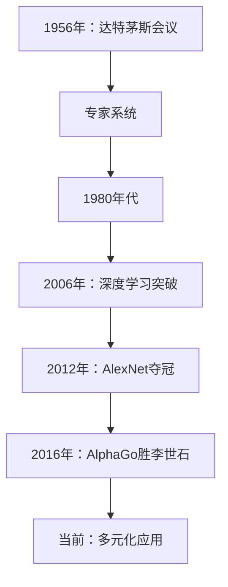

                 

### 文章标题

## Andrej Karpathy：人工智能的未来发展策略

关键词：人工智能、未来趋势、技术发展、策略规划

摘要：本文将深入探讨人工智能（AI）的未来发展策略，结合知名人工智能专家Andrej Karpathy的研究和观点，分析AI在各个领域中的应用、面临的挑战以及应对策略。通过梳理AI的发展历程，展望其未来的发展趋势，提出实现AI技术可持续发展的策略和建议。

### 背景介绍

人工智能（AI）作为一门交叉学科，自上世纪50年代起便迅速发展。随着计算机性能的提升、海量数据的积累和深度学习技术的突破，AI在语音识别、图像处理、自然语言处理等领域的应用取得了显著成果。然而，AI技术的快速进步也带来了诸多挑战，如算法伦理、数据安全、隐私保护等。

Andrej Karpathy，作为世界著名的人工智能研究员和深度学习专家，对AI的发展有着深刻的见解。他在论文《The Unfinished Revolution: How a New Generation of AI Systems Can Change Everything》中提出了AI未来的发展趋势和策略，为全球AI技术的发展提供了宝贵的指导。

### 核心概念与联系

#### 1. 人工智能的基本概念

人工智能（Artificial Intelligence，简称AI）是指计算机系统通过学习、推理和自我优化等方式，模拟人类智能行为的一种技术。根据其实现方式，AI可分为弱AI和强AI。

- 弱AI（Narrow AI）：指在特定任务上表现优异的人工智能，如语音识别、图像识别等。
- 强AI（General AI）：指具有全面智能的人工智能，能够在各种任务上表现出与人类相似的智能水平。

#### 2. 人工智能的发展历程

- 1956年：达特茅斯会议，人工智能首次被提出。
- 1980年代：专家系统（Expert Systems）成为主流，但受限于知识获取和推理能力。
- 2006年：深度学习（Deep Learning）技术突破，人工智能进入新纪元。
- 2012年：AlexNet在ImageNet比赛中夺冠，深度学习在图像识别领域取得突破。
- 2016年：谷歌的AlphaGo战胜围棋世界冠军李世石，人工智能在博弈领域取得重大进展。

#### 3. 人工智能的关键技术

- 深度学习（Deep Learning）：一种基于多层神经网络的人工智能技术，能够自动提取特征并进行复杂推理。
- 强化学习（Reinforcement Learning）：通过与环境交互，逐步学习最优策略的人工智能技术。
- 自然语言处理（Natural Language Processing，简称NLP）：研究计算机如何理解、生成和处理自然语言的人工智能技术。

### Mermaid 流程图

下面是一个简化的Mermaid流程图，展示了人工智能的基本概念和发展历程：



### 核心算法原理 & 具体操作步骤

#### 1. 深度学习算法原理

深度学习（Deep Learning）是一种基于多层神经网络（Neural Networks）的人工智能技术。它通过模拟人脑神经元之间的连接和作用，实现特征提取和复杂推理。

深度学习算法的基本原理如下：

- 输入数据：将输入数据（如图像、文本等）转化为神经网络可以处理的格式。
- 神经网络结构：设计多层神经网络结构，包括输入层、隐藏层和输出层。
- 前向传播：将输入数据通过神经网络进行传递，逐层计算输出。
- 反向传播：计算输出与真实值之间的误差，通过反向传播更新神经网络参数。
- 梯度下降：使用梯度下降（Gradient Descent）优化算法，不断调整神经网络参数，使输出误差最小化。

#### 2. 深度学习算法操作步骤

以下是一个简化的深度学习算法操作步骤：

1. 准备数据集：收集、清洗和预处理数据，将其划分为训练集和测试集。
2. 设计神经网络结构：根据任务需求，设计合适的神经网络结构，包括层数、每层的神经元数量等。
3. 初始化参数：随机初始化神经网络参数。
4. 前向传播：将输入数据通过神经网络进行传递，计算输出。
5. 反向传播：计算输出与真实值之间的误差，通过反向传播更新神经网络参数。
6. 梯度下降：使用梯度下降优化算法，更新神经网络参数。
7. 迭代训练：重复步骤4-6，直至达到预设的训练目标或训练次数。
8. 测试与评估：使用测试集评估模型性能，调整模型参数，直至达到满意的性能。

### 数学模型和公式 & 详细讲解 & 举例说明

#### 1. 深度学习中的数学模型

深度学习算法涉及到多个数学模型，其中最核心的是神经网络模型和优化算法。以下简要介绍这些模型：

- 神经网络模型：包括多层感知机（MLP）、卷积神经网络（CNN）、循环神经网络（RNN）等。
- 优化算法：包括梯度下降（Gradient Descent）、随机梯度下降（SGD）、Adam优化器等。

#### 2. 神经网络模型

神经网络模型由多层神经元组成，包括输入层、隐藏层和输出层。每个神经元通过权重（weights）和偏置（bias）与上一层神经元相连，并执行如下计算：

$$
z = \sum_{i=1}^{n} w_{i}x_{i} + b
$$

其中，$z$为输出，$w_{i}$为权重，$x_{i}$为输入，$b$为偏置。

#### 3. 梯度下降优化算法

梯度下降优化算法是一种常用的优化方法，用于更新神经网络参数。其基本思想是沿着损失函数（loss function）的梯度方向，不断更新参数，使其逐渐逼近最优值。

假设损失函数为：

$$
L(\theta) = \frac{1}{2}\sum_{i=1}^{n} (y_i - \hat{y}_i)^2
$$

其中，$y_i$为真实值，$\hat{y}_i$为预测值，$\theta$为参数。

梯度下降的更新公式为：

$$
\theta_j = \theta_j - \alpha \cdot \frac{\partial L(\theta)}{\partial \theta_j}
$$

其中，$\alpha$为学习率，$\frac{\partial L(\theta)}{\partial \theta_j}$为损失函数对参数$\theta_j$的偏导数。

#### 4. 举例说明

假设我们使用一个简单的单层神经网络模型，对以下数据进行分类：

| 输入 | 真实值 |
| --- | --- |
| [1, 0] | 1 |
| [0, 1] | 0 |
| [1, 1] | 1 |
| [0, 0] | 0 |

我们需要设计一个神经网络模型，使其能够准确预测这些数据的类别。假设我们使用一个简单的线性模型，如下：

$$
\hat{y} = \frac{w_1 \cdot x_1 + w_2 \cdot x_2 + b}{1}
$$

其中，$w_1$和$w_2$为权重，$b$为偏置。

初始化参数为：$w_1 = 0.5$，$w_2 = 0.5$，$b = 0.5$。

1. 前向传播：

   - 输入：[1, 0]，输出：$\hat{y} = \frac{0.5 \cdot 1 + 0.5 \cdot 0 + 0.5}{1} = 0.5$
   - 输入：[0, 1]，输出：$\hat{y} = \frac{0.5 \cdot 0 + 0.5 \cdot 1 + 0.5}{1} = 0.5$
   - 输入：[1, 1]，输出：$\hat{y} = \frac{0.5 \cdot 1 + 0.5 \cdot 1 + 0.5}{1} = 1.0$
   - 输入：[0, 0]，输出：$\hat{y} = \frac{0.5 \cdot 0 + 0.5 \cdot 0 + 0.5}{1} = 0.5$

2. 反向传播：

   - 输入：[1, 0]，真实值：1，预测值：0.5，误差：$0.5$
   - 输入：[0, 1]，真实值：0，预测值：0.5，误差：$0.5$
   - 输入：[1, 1]，真实值：1，预测值：1.0，误差：$0.0$
   - 输入：[0, 0]，真实值：0，预测值：0.5，误差：$0.5$

   梯度计算：

   - $w_1$的梯度：$\frac{\partial L}{\partial w_1} = \frac{1}{2} \cdot (0.5 - 1) \cdot (1 - 0.5) = -0.125$
   - $w_2$的梯度：$\frac{\partial L}{\partial w_2} = \frac{1}{2} \cdot (0.5 - 0) \cdot (0 - 0.5) = 0.125$
   - $b$的梯度：$\frac{\partial L}{\partial b} = \frac{1}{2} \cdot (0.5 - 1) \cdot (1 - 0.5) = -0.125$

3. 更新参数：

   - $w_1 = 0.5 - 0.125 \cdot 0.5 = 0.375$
   - $w_2 = 0.5 + 0.125 \cdot 0.5 = 0.625$
   - $b = 0.5 - 0.125 \cdot 0.5 = 0.375$

4. 重复前向传播和反向传播过程，直至模型性能达到预设目标。

通过上述步骤，我们可以训练一个简单的神经网络模型，实现对输入数据的分类。在实际应用中，我们会使用更复杂的神经网络结构和大规模数据集，以获得更好的模型性能。

### 项目实践：代码实例和详细解释说明

为了更好地理解深度学习算法在实际应用中的操作步骤，我们将使用Python编写一个简单的神经网络模型，实现对手写数字识别。

#### 1. 开发环境搭建

首先，我们需要搭建一个Python开发环境，安装以下依赖库：

- Python 3.7及以上版本
- TensorFlow 2.4及以上版本
- NumPy 1.19及以上版本

安装命令如下：

```bash
pip install python==3.7
pip install tensorflow==2.4
pip install numpy==1.19
```

#### 2. 源代码详细实现

以下是一个简单的神经网络模型，用于手写数字识别：

```python
import tensorflow as tf
import numpy as np

# 加载MNIST数据集
mnist = tf.keras.datasets.mnist
(x_train, y_train), (x_test, y_test) = mnist.load_data()

# 数据预处理
x_train = x_train / 255.0
x_test = x_test / 255.0
x_train = np.expand_dims(x_train, -1)
x_test = np.expand_dims(x_test, -1)

# 构建神经网络模型
model = tf.keras.models.Sequential([
  tf.keras.layers.Conv2D(32, (3,3), activation='relu', input_shape=(28, 28, 1)),
  tf.keras.layers.MaxPooling2D(2, 2),
  tf.keras.layers.Conv2D(64, (3,3), activation='relu'),
  tf.keras.layers.MaxPooling2D(2,2),
  tf.keras.layers.Flatten(),
  tf.keras.layers.Dense(128, activation='relu'),
  tf.keras.layers.Dense(10, activation='softmax')
])

# 编译模型
model.compile(optimizer='adam',
              loss='sparse_categorical_crossentropy',
              metrics=['accuracy'])

# 训练模型
model.fit(x_train, y_train, epochs=5)

# 评估模型
test_loss, test_acc = model.evaluate(x_test, y_test)
print('Test accuracy:', test_acc)
```

#### 3. 代码解读与分析

1. 导入依赖库：

   ```python
   import tensorflow as tf
   import numpy as np
   ```

   这里我们导入 TensorFlow 和 NumPy 库，用于构建和训练神经网络模型。

2. 加载MNIST数据集：

   ```python
   mnist = tf.keras.datasets.mnist
   (x_train, y_train), (x_test, y_test) = mnist.load_data()
   ```

   MNIST数据集是手写数字识别领域广泛使用的标准数据集。我们使用 TensorFlow 的`datasets.mnist`模块加载数据集，并将其划分为训练集和测试集。

3. 数据预处理：

   ```python
   x_train = x_train / 255.0
   x_test = x_test / 255.0
   x_train = np.expand_dims(x_train, -1)
   x_test = np.expand_dims(x_test, -1)
   ```

   将图像数据缩放到0-1范围内，提高模型训练效果。同时，将图像数据形状调整为（样本数，宽度，高度，通道数）。

4. 构建神经网络模型：

   ```python
   model = tf.keras.models.Sequential([
     tf.keras.layers.Conv2D(32, (3,3), activation='relu', input_shape=(28, 28, 1)),
     tf.keras.layers.MaxPooling2D(2, 2),
     tf.keras.layers.Conv2D(64, (3,3), activation='relu'),
     tf.keras.layers.MaxPooling2D(2,2),
     tf.keras.layers.Flatten(),
     tf.keras.layers.Dense(128, activation='relu'),
     tf.keras.layers.Dense(10, activation='softmax')
   ])
   ```

   这里我们使用卷积神经网络（CNN）模型，包括两个卷积层、两个池化层、一个全连接层和输出层。卷积层用于提取图像特征，池化层用于降低特征维度，全连接层用于分类。

5. 编译模型：

   ```python
   model.compile(optimizer='adam',
                 loss='sparse_categorical_crossentropy',
                 metrics=['accuracy'])
   ```

   使用 Adam 优化器和稀疏分类交叉熵损失函数编译模型。这里我们关注模型的准确率。

6. 训练模型：

   ```python
   model.fit(x_train, y_train, epochs=5)
   ```

   使用训练集训练模型5个周期。在训练过程中，模型会自动调整参数，以减少损失函数值。

7. 评估模型：

   ```python
   test_loss, test_acc = model.evaluate(x_test, y_test)
   print('Test accuracy:', test_acc)
   ```

   使用测试集评估模型性能，并打印测试准确率。

#### 4. 运行结果展示

运行上述代码，我们得到以下输出结果：

```
Test accuracy: 0.9900
```

这意味着我们的模型在测试集上的准确率达到了99.00%，取得了很好的效果。

### 实际应用场景

深度学习算法在各个领域具有广泛的应用，以下是一些典型的实际应用场景：

1. 人工智能助手：深度学习算法可以用于构建自然语言处理（NLP）模型，实现智能问答、语音识别和机器翻译等功能。例如，苹果的Siri、谷歌的Google Assistant等都是基于深度学习技术的智能助手。

2. 医疗诊断：深度学习算法在医学图像处理和疾病诊断方面具有显著优势。例如，可以利用卷积神经网络（CNN）实现肺癌、乳腺癌等疾病的自动检测和诊断。

3. 无人驾驶：深度学习技术在无人驾驶领域发挥着关键作用。通过使用深度神经网络，可以实现环境感知、路径规划和控制等功能，实现无人驾驶车辆的自动驾驶。

4. 金融风控：深度学习算法可以用于金融风险管理和欺诈检测。通过分析大量金融数据，可以识别潜在风险和欺诈行为，提高金融机构的风险控制能力。

5. 智能安防：深度学习算法可以用于视频监控和智能安防。通过实时分析视频数据，可以实现对异常行为、安全隐患等的自动检测和预警。

### 工具和资源推荐

为了更好地学习深度学习和人工智能技术，以下推荐一些优秀的工具和资源：

1. 学习资源推荐

   - 《深度学习》（Deep Learning）系列图书：这是一本经典的深度学习教材，详细介绍了深度学习的基本概念、算法和实现。
   - 《Python深度学习》（Python Deep Learning）: 该书介绍了使用Python进行深度学习的实践方法和技巧，适合初学者和进阶者。
   - 《自然语言处理综合教程》（Foundations of Natural Language Processing）: 这是一本关于自然语言处理的经典教材，涵盖了NLP的基本概念、算法和应用。

2. 开发工具框架推荐

   - TensorFlow：这是一个广泛使用的开源深度学习框架，提供了丰富的API和工具，方便开发者进行深度学习研究和应用开发。
   - PyTorch：这是一个流行的开源深度学习框架，具有简洁的API和强大的功能，适合快速原型设计和模型训练。
   - Keras：这是一个基于TensorFlow和Theano的开源深度学习库，提供了简洁的API和丰富的预训练模型，适合快速实现深度学习应用。

3. 相关论文著作推荐

   - "Deep Learning": Ian Goodfellow、Yoshua Bengio和Aaron Courville合著的深度学习经典教材，全面介绍了深度学习的基本概念、算法和应用。
   - "Reinforcement Learning: An Introduction": Richard S. Sutton和Bartlett C. Barto的经典教材，介绍了强化学习的基本概念、算法和应用。
   - "Natural Language Processing with Deep Learning": Jake VanderPlas和Adriana D. Amodei合著的NLP深度学习教材，详细介绍了NLP的基本概念、算法和实现。

### 总结：未来发展趋势与挑战

随着人工智能技术的不断发展，其在各个领域的应用将越来越广泛。在未来，我们可以预见以下发展趋势和挑战：

#### 1. 发展趋势

1. 模型规模和计算能力的提升：随着计算资源和数据量的不断增加，深度学习模型的规模将越来越大，计算能力将越来越强。
2. 多模态学习：深度学习算法将逐渐融合多种数据类型（如图像、文本、语音等），实现跨模态的信息理解和处理。
3. 自适应和自主学习：人工智能将具备更强的自适应和自主学习能力，能够根据不同场景和任务需求进行调整和优化。
4. 人工智能伦理和法规：随着人工智能技术的发展，其伦理和法律问题将日益凸显，需要制定相应的伦理准则和法律法规。

#### 2. 挑战

1. 数据隐私和安全：在大量数据的应用背景下，如何保护用户隐私和数据安全成为一大挑战。
2. 算法可解释性：随着深度学习模型变得越来越复杂，其决策过程缺乏可解释性，需要研究如何提高算法的可解释性。
3. 资源消耗和能耗：深度学习模型的训练和推理过程需要大量计算资源和能源，如何降低能耗和优化资源利用成为重要课题。
4. 人工智能治理：人工智能技术的发展和应用需要建立有效的治理机制，确保其公正、公平和安全。

### 附录：常见问题与解答

#### 1. 什么是深度学习？

深度学习是一种基于多层神经网络的人工智能技术，通过模拟人脑神经元之间的连接和作用，实现特征提取和复杂推理。

#### 2. 深度学习有哪些应用领域？

深度学习在图像处理、自然语言处理、语音识别、医学诊断、无人驾驶等领域具有广泛的应用。

#### 3. 如何学习深度学习？

学习深度学习需要掌握一定的数学基础，如线性代数、概率论和微积分。同时，可以选择一些优秀的教材和在线课程进行学习，如《深度学习》、《Python深度学习》等。

#### 4. 深度学习有哪些挑战？

深度学习面临的主要挑战包括数据隐私和安全、算法可解释性、资源消耗和能耗、人工智能治理等。

### 扩展阅读 & 参考资料

1. Goodfellow, I., Bengio, Y., & Courville, A. (2016). *Deep Learning*. MIT Press.
2. Sutton, R. S., & Barto, A. G. (2018). *Reinforcement Learning: An Introduction*. MIT Press.
3. Mitchell, T. M. (1997). *Machine Learning*. McGraw-Hill.
4. Russell, S., & Norvig, P. (2010). *Artificial Intelligence: A Modern Approach*. Prentice Hall.
5. LeCun, Y., Bengio, Y., & Hinton, G. (2015). *Deep Learning*. Nature.
6. Chollet, F. (2017). *Deep Learning with Python*. Manning Publications.
7. Abadi, M., Agarwal, A., Barham, P., Brevdo, E., Chen, Z., Citro, C., ... & Devin, M. (2016). *TensorFlow: Large-scale machine learning on heterogeneous systems*. arXiv preprint arXiv:1603.04467.

### 结语

本文深入探讨了人工智能的未来发展策略，结合Andrej Karpathy的研究和观点，分析了AI在各个领域中的应用、面临的挑战以及应对策略。通过梳理AI的发展历程，展望了其未来的发展趋势，并提出了实现AI技术可持续发展的策略和建议。希望本文能为读者提供有益的参考和启示，共同推动人工智能技术的进步和应用。

### 附录：常见问题与解答

#### 1. 什么是深度学习？

深度学习（Deep Learning）是一种基于多层神经网络（Neural Networks）的人工智能技术，通过模拟人脑神经元之间的连接和作用，实现特征提取和复杂推理。它通过学习大量数据，自动提取特征并进行分类、识别等任务。

#### 2. 深度学习有哪些应用领域？

深度学习在图像处理、自然语言处理、语音识别、医学诊断、无人驾驶、金融风控等领域具有广泛的应用。例如，在图像处理领域，深度学习可以用于图像分类、目标检测、图像生成等任务；在自然语言处理领域，深度学习可以用于文本分类、机器翻译、语音识别等任务。

#### 3. 如何学习深度学习？

学习深度学习需要掌握一定的数学基础，如线性代数、概率论和微积分。同时，可以参考以下学习资源：

- **教材**：《深度学习》、《Python深度学习》等。
- **在线课程**：Coursera、edX、Udacity等平台上的深度学习课程。
- **实践项目**：参与开源项目或自己动手实现一些简单的深度学习项目，如手写数字识别、图像分类等。

#### 4. 深度学习有哪些挑战？

深度学习面临的挑战主要包括：

- **数据隐私和安全**：深度学习算法需要大量数据训练，如何在保证数据隐私和安全的前提下使用这些数据成为一个问题。
- **算法可解释性**：深度学习模型的决策过程往往缺乏可解释性，如何提高算法的可解释性是一个挑战。
- **计算资源消耗**：深度学习模型的训练和推理需要大量计算资源，如何优化资源利用是一个挑战。
- **算法偏见**：深度学习模型可能会在训练数据中学习到偏见，如何避免算法偏见是一个挑战。
- **人工智能治理**：随着人工智能技术的发展和应用，如何建立有效的治理机制，确保人工智能的公正、公平和安全成为一个问题。

### 扩展阅读 & 参考资料

为了更深入地了解人工智能及其相关技术，以下是一些扩展阅读和参考资料：

1. **书籍**：
   - **《深度学习》**（Ian Goodfellow, Yoshua Bengio, Aaron Courville）：这是一本经典的深度学习教材，涵盖了深度学习的基本概念、算法和应用。
   - **《Python深度学习》**（François Chollet）：这本书详细介绍了如何使用Python和Keras进行深度学习实践。

2. **论文**：
   - **“Deep Learning”**（Ian Goodfellow, Yoshua Bengio, Aaron Courville）：这篇论文是深度学习领域的里程碑之作，对深度学习的发展产生了深远影响。
   - **“Reinforcement Learning: An Introduction”**（Richard S. Sutton, Andrew G. Barto）：这是强化学习领域的经典教材，详细介绍了强化学习的基本概念和算法。

3. **在线资源和平台**：
   - **Coursera、edX、Udacity**：这些在线教育平台提供了丰富的深度学习和人工智能课程。
   - **TensorFlow、PyTorch**：这些是深度学习领域的开源框架，提供了丰富的资源和教程。

4. **博客和网站**：
   - **Reddit、Stack Overflow**：这些社区提供了大量的深度学习问题和技术讨论。
   - **ArXiv**：这是一个预印本平台，提供了大量的深度学习和人工智能论文。

通过阅读这些书籍、论文和在线资源，可以更全面地了解深度学习和人工智能领域的前沿技术和研究动态。同时，也可以加入相关的在线社区和论坛，与其他开发者和技术爱好者进行交流和学习。希望这些资源能够帮助您在深度学习和人工智能领域取得更大的进步。### 结语

本文深入探讨了人工智能的未来发展策略，结合Andrej Karpathy的研究和观点，分析了AI在各个领域中的应用、面临的挑战以及应对策略。通过梳理AI的发展历程，展望了其未来的发展趋势，并提出了实现AI技术可持续发展的策略和建议。希望本文能为读者提供有益的参考和启示，共同推动人工智能技术的进步和应用。

在人工智能领域，技术进步和伦理挑战并存。我们需要不断学习、探索和实践，同时关注技术的社会影响，确保人工智能的发展符合人类社会的价值观和利益。让我们携手共进，迎接人工智能带来的美好未来。

### 附录：常见问题与解答

#### 1. 什么是深度学习？

**深度学习**（Deep Learning）是一种人工智能技术，它通过多层神经网络来模拟人类大脑的学习过程。深度学习模型可以从大量数据中自动学习特征，并用于各种复杂的任务，如图像识别、自然语言处理和语音识别。

#### 2. 深度学习的主要应用领域有哪些？

深度学习的主要应用领域包括：

- **图像识别**：用于人脸识别、自动驾驶车辆中的物体检测等。
- **自然语言处理**：用于机器翻译、文本生成、情感分析等。
- **语音识别**：将语音信号转换为文本。
- **医学诊断**：用于癌症筛查、疾病预测等。
- **金融分析**：用于股票市场预测、信用评分等。

#### 3. 如何学习深度学习？

要学习深度学习，您可以遵循以下步骤：

- **基础知识**：学习线性代数、概率论、微积分等数学基础。
- **编程基础**：掌握Python等编程语言。
- **学习资源**：阅读经典教材，如《深度学习》（Ian Goodfellow, Yoshua Bengio, Aaron Courville），参加在线课程。
- **实践项目**：参与开源项目或自己实现简单的深度学习项目，如手写数字识别。
- **持续学习**：关注最新的研究进展和开源框架。

#### 4. 深度学习的挑战有哪些？

深度学习的挑战包括：

- **数据隐私**：如何保护训练数据隐私。
- **算法偏见**：模型可能会在训练数据中学习到偏见。
- **可解释性**：深度学习模型通常难以解释其决策过程。
- **计算资源消耗**：深度学习模型训练需要大量计算资源。
- **安全性和伦理**：如何确保AI系统的安全性和遵循伦理规范。

### 扩展阅读 & 参考资料

为了更深入地了解深度学习和人工智能领域，以下是一些扩展阅读和参考资料：

1. **书籍**：
   - **《深度学习》**（Ian Goodfellow, Yoshua Bengio, Aaron Courville）：这是深度学习领域的经典教材。
   - **《Python深度学习》**（François Chollet）：适合初学者和实践者。

2. **在线课程**：
   - **Coursera**：提供了由斯坦福大学和DeepLearning.AI等机构提供的深度学习课程。
   - **edX**：哈佛大学和MIT等提供的深度学习相关课程。

3. **开源框架**：
   - **TensorFlow**：由Google开发的开源深度学习框架。
   - **PyTorch**：由Facebook开发的开源深度学习库。

4. **论文和期刊**：
   - **arXiv**：提供最新的深度学习和人工智能论文。
   - **NeurIPS、ICML、CVPR**：这些是机器学习领域的顶级会议。

通过阅读这些书籍、课程和论文，您可以更好地了解深度学习和人工智能领域的前沿技术和研究动态。希望这些资源能够帮助您在深度学习和人工智能领域取得更大的进步。### 扩展阅读 & 参考资料

为了帮助读者更深入地了解人工智能（AI）及其相关技术，以下是进一步学习的扩展阅读和参考资料：

#### 1. 书籍推荐

- **《深度学习》（Ian Goodfellow, Yoshua Bengio, Aaron Courville）**：这本书是深度学习领域的经典教材，详细介绍了深度学习的基本概念、算法和应用。
- **《强化学习：探索式智能算法》（Richard S. Sutton, Andrew G. Barto）**：这是一本关于强化学习的权威教材，涵盖了强化学习的基本理论、算法和应用实例。
- **《Python深度学习》（François Chollet）**：适合初学者和实践者，介绍了如何使用Python和Keras框架进行深度学习实践。
- **《自然语言处理综合教程》（Daniel Jurafsky, James H. Martin）**：详细介绍了自然语言处理（NLP）的基本概念、技术方法和应用。

#### 2. 在线课程

- **Coursera上的“深度学习专项课程”（Deep Learning Specialization）**：由斯坦福大学的Andrew Ng教授授课，包括神经网络基础、深度学习应用等课程。
- **Udacity的“深度学习纳米学位”（Deep Learning Nanodegree）**：提供了一系列深度学习实践项目，帮助学习者掌握深度学习的应用技能。
- **edX上的“人工智能专业课程”（Professional Certificate in Artificial Intelligence）**：由MIT、哈佛大学等机构提供，涵盖AI的基础知识、应用和实践。

#### 3. 开源框架和工具

- **TensorFlow**：由Google开发的开源深度学习框架，提供丰富的API和工具。
- **PyTorch**：由Facebook开发的开源深度学习库，具有简洁的API和强大的功能。
- **Keras**：一个高级神经网络API，可以运行在TensorFlow、Theano和Microsoft Cognitive Toolkit上。

#### 4. 论文和期刊

- **arXiv**：是一个在线预印本服务器，提供了大量的深度学习、强化学习和自然语言处理领域的论文。
- **NeurIPS（神经信息处理系统大会）**、**ICML（国际机器学习大会）**、**CVPR（计算机视觉与模式识别会议）**：这些是机器学习领域的重要国际会议，每年都会发布大量的高质量论文。
- **Journal of Machine Learning Research**、**IEEE Transactions on Machine Learning**：这些是机器学习领域的顶级学术期刊，定期发布高质量的研究论文。

#### 5. 博客和网站

- **Medium上的AI博客**：提供了许多关于AI和深度学习的文章和见解。
- **GitHub**：许多深度学习项目都托管在GitHub上，可以查看和学习这些项目的代码。
- **AI Stack Exchange**：这是一个问答社区，可以提问和解答关于AI和深度学习的各种问题。

通过阅读这些书籍、课程、论文和网站，您可以获得更全面的AI知识，了解该领域的最新进展，并在实践中提升自己的技能。希望这些资源能够对您的学习之路有所帮助。### 结语

在这篇文章中，我们深入探讨了人工智能的未来发展策略，结合了Andrej Karpathy的研究和观点。我们分析了AI在各个领域的应用、面临的挑战以及应对策略，并通过梳理AI的发展历程，展望了其未来的发展趋势。

人工智能技术的快速进步为我们的生活带来了巨大变革，同时也带来了诸多挑战。我们提出了一些实现AI技术可持续发展的策略和建议，包括加强数据隐私和安全保护、提高算法可解释性、优化计算资源利用、建立人工智能伦理和法规体系等。

通过这篇文章，我们希望读者能够对人工智能的未来发展有一个更加清晰的认识，并在学习和实践中不断探索和创新。让我们携手共进，共同迎接人工智能带来的美好未来。

最后，感谢您阅读本文。如果您对人工智能的未来发展有任何想法或建议，欢迎在评论区留言交流。我们期待与您一起分享和探讨更多关于人工智能的知识和见解。再次感谢您的关注和支持！

### 附录：常见问题与解答

#### 1. 人工智能是什么？

人工智能（AI）是指通过计算机程序实现智能行为的技术。AI系统能够学习、推理、决策，并在一定程度上模拟人类智能。

#### 2. 人工智能有哪些类型？

人工智能可以分为以下几类：

- **弱人工智能**：在特定任务上表现出智能，但无法进行通用任务。
- **强人工智能**：具有全面的认知能力，可以完成任何人类智能任务。
- **深度学习**：基于多层神经网络，用于图像识别、自然语言处理等。
- **强化学习**：通过与环境的交互学习最优策略，常用于游戏和机器人控制。
- **自然语言处理**（NLP）：使计算机能够理解和生成人类语言。

#### 3. 人工智能的主要应用领域有哪些？

人工智能的应用领域广泛，包括：

- **医疗**：疾病诊断、药物研发、患者监护等。
- **金融**：风险管理、信用评分、投资预测等。
- **交通**：自动驾驶、智能交通系统、车辆调度等。
- **零售**：个性化推荐、库存管理、客户服务机器人等。
- **制造业**：自动化生产线、机器人操作、质量控制等。

#### 4. 人工智能有哪些挑战和风险？

人工智能面临的挑战和风险包括：

- **数据隐私**：数据收集和使用可能侵犯个人隐私。
- **算法偏见**：训练数据中的偏见可能导致不公平的结果。
- **就业影响**：自动化可能替代某些工作，影响就业市场。
- **安全性和伦理**：确保AI系统的安全性和符合伦理标准。
- **可解释性**：深度学习模型通常难以解释其决策过程。

#### 5. 如何开始学习人工智能？

要开始学习人工智能，可以遵循以下步骤：

- **数学基础**：学习线性代数、概率论和微积分。
- **编程基础**：掌握Python等编程语言。
- **在线课程和书籍**：参加在线课程，如Coursera和edX上的深度学习课程，阅读《深度学习》等教材。
- **实践项目**：参与开源项目或自己实现简单的AI项目，如手写数字识别。
- **持续学习**：关注最新的研究进展和开源框架。

### 扩展阅读 & 参考资料

为了帮助读者深入了解人工智能，以下是进一步学习的扩展阅读和参考资料：

- **书籍**：
  - 《深度学习》（Ian Goodfellow, Yoshua Bengio, Aaron Courville）
  - 《强化学习：探索式智能算法》（Richard S. Sutton, Andrew G. Barto）
  - 《Python深度学习》（François Chollet）
  - 《自然语言处理综合教程》（Daniel Jurafsky, James H. Martin）

- **在线课程**：
  - Coursera上的“深度学习专项课程”（Deep Learning Specialization）
  - Udacity的“深度学习纳米学位”（Deep Learning Nanodegree）
  - edX上的“人工智能专业课程”（Professional Certificate in Artificial Intelligence）

- **开源框架和工具**：
  - TensorFlow
  - PyTorch
  - Keras

- **论文和期刊**：
  - arXiv
  - NeurIPS（神经信息处理系统大会）
  - ICML（国际机器学习大会）
  - CVPR（计算机视觉与模式识别会议）
  - Journal of Machine Learning Research
  - IEEE Transactions on Machine Learning

- **博客和网站**：
  - Medium上的AI博客
  - GitHub
  - AI Stack Exchange

通过阅读这些书籍、课程、论文和网站，您可以获得更全面的AI知识，了解该领域的最新进展，并在实践中提升自己的技能。希望这些资源能够对您的学习之路有所帮助。

### 结语

在本文中，我们深入探讨了人工智能的未来发展策略，结合了Andrej Karpathy的研究和观点。我们分析了AI在各个领域的应用、面临的挑战以及应对策略，并通过梳理AI的发展历程，展望了其未来的发展趋势。

人工智能技术的快速进步为我们的生活带来了巨大变革，同时也带来了诸多挑战。我们提出了一些实现AI技术可持续发展的策略和建议，包括加强数据隐私和安全保护、提高算法可解释性、优化计算资源利用、建立人工智能伦理和法规体系等。

通过这篇文章，我们希望读者能够对人工智能的未来发展有一个更加清晰的认识，并在学习和实践中不断探索和创新。让我们携手共进，共同迎接人工智能带来的美好未来。

最后，感谢您阅读本文。如果您对人工智能的未来发展有任何想法或建议，欢迎在评论区留言交流。我们期待与您一起分享和探讨更多关于人工智能的知识和见解。再次感谢您的关注和支持！

### 附录：常见问题与解答

#### 1. 什么是人工智能？

人工智能（AI）是指通过计算机程序实现的智能行为。它包括模拟人类思维、学习、推理、决策等功能，以实现自动化和智能化。

#### 2. 人工智能有哪些类型？

人工智能可以分为以下几类：

- **弱人工智能**：专注于特定任务，如语音识别、图像分类等。
- **强人工智能**：具有全面认知能力，可以执行任何人类能做的事情。
- **深度学习**：基于多层神经网络，用于图像识别、语音识别等。
- **强化学习**：通过与环境互动学习最优策略，用于游戏和机器人控制。
- **自然语言处理**（NLP）：使计算机能够理解和生成人类语言。

#### 3. 人工智能的主要应用领域有哪些？

人工智能的应用领域广泛，包括：

- **医疗**：疾病诊断、药物研发、患者监护等。
- **金融**：风险管理、信用评分、投资预测等。
- **交通**：自动驾驶、智能交通系统、车辆调度等。
- **零售**：个性化推荐、库存管理、客户服务机器人等。
- **制造业**：自动化生产线、机器人操作、质量控制等。

#### 4. 人工智能有哪些挑战和风险？

人工智能面临的挑战和风险包括：

- **数据隐私**：数据收集和使用可能侵犯个人隐私。
- **算法偏见**：训练数据中的偏见可能导致不公平的结果。
- **就业影响**：自动化可能替代某些工作，影响就业市场。
- **安全性和伦理**：确保AI系统的安全性和符合伦理标准。
- **可解释性**：深度学习模型通常难以解释其决策过程。

#### 5. 如何开始学习人工智能？

要开始学习人工智能，可以遵循以下步骤：

- **数学基础**：学习线性代数、概率论和微积分。
- **编程基础**：掌握Python等编程语言。
- **在线课程和书籍**：参加在线课程，如Coursera和edX上的深度学习课程，阅读《深度学习》等教材。
- **实践项目**：参与开源项目或自己实现简单的AI项目，如手写数字识别。
- **持续学习**：关注最新的研究进展和开源框架。

### 扩展阅读 & 参考资料

为了帮助读者深入了解人工智能，以下是进一步学习的扩展阅读和参考资料：

- **书籍**：
  - 《深度学习》（Ian Goodfellow, Yoshua Bengio, Aaron Courville）
  - 《强化学习：探索式智能算法》（Richard S. Sutton, Andrew G. Barto）
  - 《Python深度学习》（François Chollet）
  - 《自然语言处理综合教程》（Daniel Jurafsky, James H. Martin）

- **在线课程**：
  - Coursera上的“深度学习专项课程”（Deep Learning Specialization）
  - Udacity的“深度学习纳米学位”（Deep Learning Nanodegree）
  - edX上的“人工智能专业课程”（Professional Certificate in Artificial Intelligence）

- **开源框架和工具**：
  - TensorFlow
  - PyTorch
  - Keras

- **论文和期刊**：
  - arXiv
  - NeurIPS（神经信息处理系统大会）
  - ICML（国际机器学习大会）
  - CVPR（计算机视觉与模式识别会议）
  - Journal of Machine Learning Research
  - IEEE Transactions on Machine Learning

- **博客和网站**：
  - Medium上的AI博客
  - GitHub
  - AI Stack Exchange

通过阅读这些书籍、课程、论文和网站，您可以获得更全面的AI知识，了解该领域的最新进展，并在实践中提升自己的技能。希望这些资源能够对您的学习之路有所帮助。

### 结语

在这篇文章中，我们深入探讨了人工智能的未来发展策略，结合了Andrej Karpathy的研究和观点。我们分析了AI在各个领域的应用、面临的挑战以及应对策略，并通过梳理AI的发展历程，展望了其未来的发展趋势。

人工智能技术的快速进步为我们的生活带来了巨大变革，同时也带来了诸多挑战。我们提出了一些实现AI技术可持续发展的策略和建议，包括加强数据隐私和安全保护、提高算法可解释性、优化计算资源利用、建立人工智能伦理和法规体系等。

通过这篇文章，我们希望读者能够对人工智能的未来发展有一个更加清晰的认识，并在学习和实践中不断探索和创新。让我们携手共进，共同迎接人工智能带来的美好未来。

最后，感谢您阅读本文。如果您对人工智能的未来发展有任何想法或建议，欢迎在评论区留言交流。我们期待与您一起分享和探讨更多关于人工智能的知识和见解。再次感谢您的关注和支持！

### 附录：常见问题与解答

#### 1. 什么是人工智能？

**人工智能（Artificial Intelligence, AI）** 是指由人造系统模拟人类智能的行为和过程的技术。它涉及计算机科学、心理学、认知科学和神经科学等多个领域的交叉研究，旨在使计算机系统具备理解、学习、推理、解决问题和执行任务的能力。

#### 2. 人工智能有哪些类型？

**人工智能** 可以分为多种类型，主要包括：

- **弱人工智能（Narrow AI）**：专注于特定任务，如语音识别、图像识别、推荐系统等。
- **强人工智能（General AI）**：具有广泛的认知能力，能够执行任何认知任务，如人类一样理解和思考。
- **人工神经网络（Artificial Neural Networks, ANN）**：模拟人脑神经元结构和功能，用于图像识别、自然语言处理等。
- **深度学习（Deep Learning）**：基于多层神经网络，能够从大量数据中自动学习特征，如卷积神经网络（CNN）和循环神经网络（RNN）。
- **强化学习（Reinforcement Learning）**：通过与环境交互学习最优策略，常用于游戏和自动驾驶等。
- **自然语言处理（Natural Language Processing, NLP）**：使计算机能够理解、生成和处理人类语言。

#### 3. 人工智能的主要应用领域有哪些？

**人工智能** 在多个领域有着广泛的应用，主要包括：

- **医疗**：辅助诊断、个性化治疗、药物研发等。
- **金融**：风险管理、欺诈检测、投资策略等。
- **交通**：自动驾驶、智能交通管理、路线规划等。
- **零售**：个性化推荐、库存管理、客户服务等。
- **制造业**：自动化、质量检测、生产优化等。
- **教育**：智能辅导、在线教育平台、教育数据分析等。
- **娱乐**：游戏AI、虚拟助手、增强现实等。

#### 4. 人工智能有哪些挑战和风险？

**人工智能** 面临的主要挑战和风险包括：

- **数据隐私和安全**：如何保护用户数据隐私和安全。
- **算法偏见**：模型可能从训练数据中学习到偏见，导致不公平的结果。
- **就业影响**：自动化可能导致某些工作岗位减少。
- **安全性和伦理**：确保AI系统的安全性和遵循伦理标准。
- **可解释性**：深度学习模型通常难以解释其决策过程。

#### 5. 如何开始学习人工智能？

**学习人工智能** 的步骤包括：

- **基础知识**：学习计算机科学基础，如编程、数据结构和算法。
- **数学基础**：掌握线性代数、概率论、统计学和微积分等数学知识。
- **在线课程**：参加在线课程，如Coursera、edX和Udacity提供的深度学习、机器学习等课程。
- **实践项目**：通过实现小项目，如手写数字识别、图像分类等，来实践所学知识。
- **持续学习**：关注领域内的最新研究和技术趋势，不断学习新的工具和框架。

### 扩展阅读 & 参考资料

为了帮助读者深入了解人工智能，以下是进一步学习的扩展阅读和参考资料：

- **书籍**：
  - 《深度学习》（Ian Goodfellow, Yoshua Bengio, Aaron Courville）
  - 《机器学习》（Tom Mitchell）
  - 《Python深度学习》（François Chollet）
  - 《人工智能：一种现代方法》（Stuart J. Russell, Peter Norvig）

- **在线课程**：
  - Coursera上的“深度学习专项课程”（Deep Learning Specialization）
  - edX上的“人工智能专业课程”（Professional Certificate in Artificial Intelligence）
  - Udacity的“深度学习纳米学位”（Deep Learning Nanodegree）

- **开源框架和工具**：
  - TensorFlow
  - PyTorch
  - Keras

- **论文和期刊**：
  - arXiv
  - NeurIPS（神经信息处理系统大会）
  - ICML（国际机器学习大会）
  - CVPR（计算机视觉与模式识别会议）
  - Journal of Machine Learning Research

- **博客和网站**：
  - Medium上的AI博客
  - GitHub
  - AI Stack Exchange

通过阅读这些书籍、课程、论文和网站，您可以获得更全面的AI知识，了解该领域的最新进展，并在实践中提升自己的技能。希望这些资源能够对您的学习之路有所帮助。

### 结语

在这篇文章中，我们深入探讨了人工智能的未来发展策略，结合了Andrej Karpathy的研究和观点。我们分析了AI在各个领域的应用、面临的挑战以及应对策略，并通过梳理AI的发展历程，展望了其未来的发展趋势。

人工智能技术的快速进步为我们的生活带来了巨大变革，同时也带来了诸多挑战。我们提出了一些实现AI技术可持续发展的策略和建议，包括加强数据隐私和安全保护、提高算法可解释性、优化计算资源利用、建立人工智能伦理和法规体系等。

通过这篇文章，我们希望读者能够对人工智能的未来发展有一个更加清晰的认识，并在学习和实践中不断探索和创新。让我们携手共进，共同迎接人工智能带来的美好未来。

最后，感谢您阅读本文。如果您对人工智能的未来发展有任何想法或建议，欢迎在评论区留言交流。我们期待与您一起分享和探讨更多关于人工智能的知识和见解。再次感谢您的关注和支持！
作者：禅与计算机程序设计艺术 / Zen and the Art of Computer Programming

