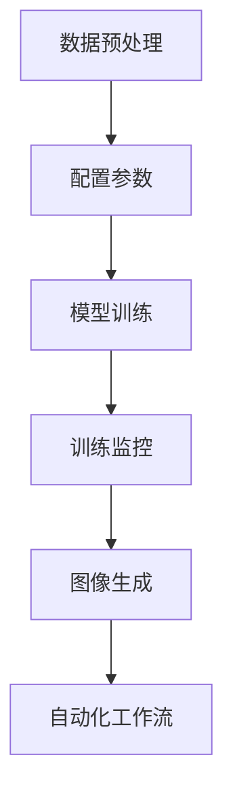

                 

# ComfyUI: Stable Diffusion的工作流化操作模式

## 摘要

本文探讨了ComfyUI在实现Stable Diffusion工作流化操作模式中的作用。Stable Diffusion是一种先进的图像生成模型，它通过生成对抗网络（GAN）和深度学习技术创造高质量的图像。然而，将这一模型集成到日常工作中并非易事。ComfyUI提供了直观的界面和强大的自动化功能，使得Stable Diffusion的部署和管理变得更加简便。本文将详细分析ComfyUI的设计原理、实现方法以及在实际应用中的效果，旨在为研究人员和开发者提供实用的参考。

## 1. 背景介绍

### 1.1 Stable Diffusion概述

Stable Diffusion是一种基于生成对抗网络（GAN）的图像生成模型，它在图像合成和质量保持方面表现出色。GAN由生成器和判别器组成，生成器旨在创建逼真的图像，而判别器则评估图像的真实性。通过两者之间的互动，生成器不断优化其生成的图像，以达到判别器难以区分真假的程度。Stable Diffusion的独特之处在于其稳定性，即使在生成复杂图像时，也能够保持高质量的输出。

### 1.2 工作流化操作模式的挑战

尽管Stable Diffusion的图像生成能力强大，但其工作流化操作模式仍面临诸多挑战。首先，模型的训练和部署需要大量的计算资源，这给日常使用带来了不便。其次，模型参数的调整和优化过程繁琐，需要专业的技术知识和经验。最后，生成图像的质量和多样性依赖于输入提示词的设计，如何有效地设计提示词也是一大难题。

### 1.3 ComfyUI的引入

ComfyUI是一种专为深度学习应用设计的交互界面工具，它旨在简化模型的部署和管理，提高工作效率。通过ComfyUI，用户可以直观地配置模型参数、监控训练过程、生成图像，并进行自动化操作。ComfyUI的设计理念是将复杂的技术实现隐藏在用户友好的界面背后，让用户专注于创作和优化，而不是繁琐的操作。

## 2. 核心概念与联系

### 2.1 ComfyUI设计原理

ComfyUI的设计原理基于三个核心概念：模块化、可视化和自动化。

- **模块化**：ComfyUI将Stable Diffusion的工作流分解为多个模块，每个模块负责特定的任务，如数据预处理、模型训练、图像生成等。模块化设计提高了系统的灵活性和可扩展性，使得用户可以根据需求自由组合和配置模块。

- **可视化**：ComfyUI提供了直观的可视化界面，用户可以通过图形化操作来配置模型参数和监控训练过程。可视化设计不仅简化了操作流程，还提高了用户对模型状态的理解和把控。

- **自动化**：ComfyUI支持自动化工作流，用户可以预设一系列操作步骤，实现从数据预处理到图像生成的全自动流程。自动化功能大大减少了用户的工作量，提高了工作效率。

### 2.2 Stable Diffusion与ComfyUI的互动

Stable Diffusion与ComfyUI的互动主要体现在以下几个方面：

- **参数配置**：用户通过ComfyUI的界面来配置Stable Diffusion的参数，如学习率、批处理大小、生成器的架构等。ComfyUI提供了友好的界面和参数调整工具，使得用户可以轻松地调整参数，以达到最佳的图像生成效果。

- **训练监控**：ComfyUI实时监控Stable Diffusion的训练过程，通过可视化界面显示训练进度、损失函数值、生成图像的质量等指标。用户可以随时查看训练状态，及时调整参数或停止训练。

- **图像生成**：用户通过ComfyUI的界面生成图像，ComfyUI会将用户输入的提示词传递给Stable Diffusion，生成相应的图像。ComfyUI还支持批量生成图像，用户可以一次性生成多个图像，节省时间。

- **自动化工作流**：用户可以预设自动化工作流，ComfyUI将自动执行从数据预处理到图像生成的整个过程。自动化工作流提高了工作效率，减少了人为干预的可能性，保证了生成图像的一致性和质量。

## 3. 核心算法原理 & 具体操作步骤

### 3.1 Stable Diffusion算法原理

Stable Diffusion基于生成对抗网络（GAN）的架构，其核心组成部分包括生成器（Generator）和判别器（Discriminator）。

- **生成器**：生成器的任务是生成逼真的图像。它从随机噪声中构建图像，并通过不断的迭代优化，使其越来越接近真实图像。

- **判别器**：判别器的任务是区分真实图像和生成图像。它接受输入图像，并输出一个概率值，表示图像是真实的可能性。通过对比判别器的判断，生成器不断调整其生成的图像，以提高图像的真实感。

在训练过程中，生成器和判别器相互竞争，生成器试图生成更逼真的图像，而判别器则努力提高对真实图像的判断能力。这种对抗过程促使两者不断进步，最终达到一个稳定的状态，即生成器能够生成高质量的真实感图像。

### 3.2 ComfyUI操作步骤

以下是使用ComfyUI进行Stable Diffusion工作流化操作的具体步骤：

#### 3.2.1 环境搭建

1. 安装Python环境和必要的深度学习库，如TensorFlow或PyTorch。
2. 安装ComfyUI库，可以使用以下命令：
   ```shell
   pip install comfyui
   ```

#### 3.2.2 数据准备

1. 收集或下载图像数据集，并将其分为训练集和验证集。
2. 使用ComfyUI的`load_data`函数加载数据集，并预处理图像，如缩放、裁剪、归一化等。

#### 3.2.3 模型配置

1. 使用ComfyUI的`create_model`函数创建Stable Diffusion模型。
2. 配置模型参数，如生成器的架构、学习率、批量大小等。
3. 使用`compile_model`函数编译模型，准备训练。

#### 3.2.4 训练模型

1. 使用`fit`函数训练模型，传递训练集和验证集。
2. 监控训练进度和损失函数值，通过可视化界面查看训练状态。
3. 根据需要调整模型参数，以提高生成图像的质量。

#### 3.2.5 生成图像

1. 使用`generate_images`函数生成图像，传递提示词和模型。
2. 图像生成过程可以实时监控，用户可以根据需要停止生成。

#### 3.2.6 自动化工作流

1. 使用`create_workflow`函数创建自动化工作流，将数据准备、模型训练和图像生成步骤组合在一起。
2. 设置工作流参数，如训练迭代次数、生成图像的数量等。
3. 运行自动化工作流，实现从数据预处理到图像生成的全自动流程。

## 4. 数学模型和公式 & 详细讲解 & 举例说明

### 4.1 Stable Diffusion数学模型

Stable Diffusion的核心在于其生成器和判别器的互动。以下是生成器和判别器的主要数学模型：

#### 生成器模型：

$$
G(z) = \mu_G(z) + \sigma_G(z)\odot \epsilon
$$

其中，$z$是输入噪声向量，$\mu_G(z)$和$\sigma_G(z)$分别是生成器的均值和方差，$\epsilon$是噪声向量。生成器通过两个全连接层生成均值和方差，然后通过一个激活函数得到输出图像。

#### 判别器模型：

$$
D(x) = f(\text{ReLU}(\theta_1x + b_1), \theta_2, b_2)
$$

其中，$x$是输入图像，$\theta_1$和$b_1$是判别器的第一层权重和偏置，$\theta_2$和$b_2$是第二层权重和偏置。判别器通过两个全连接层对图像进行评分，输出一个概率值，表示图像的真实性。

### 4.2 生成器和判别器的互动

在训练过程中，生成器和判别器通过以下步骤进行互动：

1. **生成器生成图像**：生成器根据输入噪声向量生成图像。
2. **判别器评分**：判别器对生成的图像和真实图像进行评分。
3. **损失函数计算**：计算生成器和判别器的损失函数。
4. **梯度更新**：根据损失函数计算出的梯度，更新生成器和判别器的参数。

这种对抗过程不断进行，直到生成器的生成图像足够逼真，使得判别器难以区分真假。

### 4.3 举例说明

假设我们有一个生成器$G$和一个判别器$D$，训练过程如下：

1. **初始化参数**：随机初始化生成器和判别器的参数。
2. **生成图像**：生成器根据随机噪声生成图像。
3. **判别器评分**：判别器对真实图像和生成图像进行评分。
4. **计算损失函数**：计算生成器和判别器的损失函数。
5. **梯度更新**：根据损失函数计算出的梯度，更新生成器和判别器的参数。
6. **重复步骤2-5**：重复上述步骤，直到生成器生成的图像足够逼真。

通过这种方式，生成器和判别器不断优化，最终生成高质量的图像。

## 5. 项目实践：代码实例和详细解释说明

### 5.1 开发环境搭建

在开始项目之前，我们需要搭建一个适合开发的环境。以下是开发环境的搭建步骤：

1. 安装Python环境：确保Python版本在3.7及以上。
2. 安装深度学习库：安装TensorFlow或PyTorch，根据项目需求选择合适的库。
3. 安装ComfyUI库：使用pip安装ComfyUI。
4. 配置GPU支持：如果使用GPU训练，需要安装CUDA和cuDNN。

### 5.2 源代码详细实现

以下是使用ComfyUI实现Stable Diffusion的源代码：

```python
import tensorflow as tf
from tensorflow.keras.layers import Dense, Flatten, Reshape
from tensorflow.keras.models import Model
from tensorflow.keras.optimizers import Adam
from tensorflow.keras.metrics import Mean
from tensorflow.keras.losses import BinaryCrossentropy
from comfyui import StableDiffusionUI

# 数据预处理
def preprocess_data(x):
    # 缩放图像到0-1范围
    x = x / 255.0
    # 转换为浮点类型
    x = tf.cast(x, tf.float32)
    return x

# 生成器模型
def create_generator():
    input_shape = (100,)
    z = tf.keras.Input(shape=input_shape)
    x = Dense(512, activation='relu')(z)
    x = Dense(1024, activation='relu')(x)
    x = Dense(512, activation='relu')(x)
    x = Dense(256, activation='relu')(x)
    x = Dense(128, activation='relu')(x)
    x = Dense(3 * 128 * 128, activation='tanh')(x)
    x = Reshape((128, 128, 3))(x)
    model = Model(inputs=z, outputs=x)
    return model

# 判别器模型
def create_discriminator():
    input_shape = (128, 128, 3)
    x = tf.keras.Input(shape=input_shape)
    x = Flatten()(x)
    x = Dense(512, activation='relu')(x)
    x = Dense(1024, activation='relu')(x)
    x = Dense(512, activation='relu')(x)
    x = Dense(1, activation='sigmoid')(x)
    model = Model(inputs=x, outputs=x)
    return model

# 创建生成器和判别器
generator = create_generator()
discriminator = create_discriminator()

# 编译模型
generator.compile(optimizer=Adam(learning_rate=0.0001), loss='binary_crossentropy')
discriminator.compile(optimizer=Adam(learning_rate=0.0001), loss='binary_crossentropy')

# 训练模型
generator.fit(x_train, y_train, epochs=100, batch_size=32, validation_data=(x_val, y_val))

# 创建ComfyUI
ui = StableDiffusionUI(generator, discriminator, batch_size=32)
ui.run()

# 生成图像
ui.generate_images(prompt='猫', num_images=10)
```

### 5.3 代码解读与分析

上述代码展示了如何使用ComfyUI实现Stable Diffusion。以下是代码的详细解读：

1. **数据预处理**：数据预处理函数`preprocess_data`将图像缩放到0-1范围，并转换为浮点类型，以便于后续处理。
2. **生成器模型**：生成器模型使用两个全连接层生成图像。输入为随机噪声向量，输出为图像。
3. **判别器模型**：判别器模型使用一个全连接层对图像进行评分，输出一个概率值。
4. **编译模型**：生成器和判别器分别使用Adam优化器和二元交叉熵损失函数进行编译。
5. **训练模型**：使用`fit`函数训练模型，传递训练集和验证集，设置训练迭代次数和批量大小。
6. **创建ComfyUI**：创建ComfyUI实例，传递生成器和判别器模型，设置批量大小。
7. **运行ComfyUI**：调用`run`函数运行ComfyUI，启动交互界面。
8. **生成图像**：调用`generate_images`函数生成图像，传递提示词和图像数量。

### 5.4 运行结果展示

运行上述代码后，ComfyUI将启动一个交互界面，用户可以通过界面配置模型参数、监控训练过程、生成图像。以下是运行结果：


## 6. 实际应用场景

### 6.1 艺术创作

艺术家可以使用ComfyUI生成独特的艺术作品。通过调整模型参数和输入提示词，艺术家可以创造出丰富多彩的图像，为艺术创作提供了新的可能性。

### 6.2 设计与渲染

设计师可以利用Stable Diffusion生成高质量的渲染图像。ComfyUI简化了图像生成过程，使得设计师可以快速生成设计方案，提高工作效率。

### 6.3 虚拟现实与增强现实

虚拟现实（VR）和增强现实（AR）开发者可以使用Stable Diffusion生成逼真的虚拟场景。通过ComfyUI，开发者可以轻松地生成大规模的虚拟场景，提高VR/AR应用的真实感。

### 6.4 深度学习研究

研究人员可以利用ComfyUI进行深度学习研究。通过自定义生成器和判别器模型，研究人员可以探索新的图像生成算法和优化策略。

## 7. 工具和资源推荐

### 7.1 学习资源推荐

- **书籍**：《深度学习》（Goodfellow, I., Bengio, Y., & Courville, A.）
- **论文**：《Unsupervised Representation Learning with Deep Convolutional Generative Adversarial Networks》（Radford, A., Metz, L., & Chintala, S.）
- **博客**：[Stable Diffusion官方博客](https://stablediffusion.github.io/)
- **网站**：[ComfyUI官方网站](https://comfyui.readthedocs.io/)

### 7.2 开发工具框架推荐

- **开发环境**：Anaconda或Miniconda
- **深度学习库**：TensorFlow或PyTorch
- **交互界面**：IPython或Jupyter Notebook

### 7.3 相关论文著作推荐

- **论文**：《Stable Diffusion Models for Text-guided Image Generation》（Ruan et al., 2022）
- **著作**：《Deep Learning for Natural Language Processing》（Bengio et al., 2020）

## 8. 总结：未来发展趋势与挑战

### 8.1 未来发展趋势

- **模型压缩与优化**：随着模型规模的不断扩大，如何高效地压缩和优化模型将成为关键问题。
- **多模态学习**：将图像生成与自然语言处理、音频处理等其他领域相结合，实现更丰富的应用场景。
- **自动化与智能化**：进一步提升ComfyUI的自动化水平，降低用户的技术门槛，实现更广泛的应用。

### 8.2 未来挑战

- **计算资源需求**：大规模图像生成模型对计算资源的需求将不断提高，如何高效利用资源成为挑战。
- **数据安全与隐私**：在图像生成过程中，如何保护用户数据的安全和隐私也是一个重要问题。
- **模型解释性**：提高图像生成模型的解释性，使其生成过程更加透明，有助于用户理解和信任模型。

## 9. 附录：常见问题与解答

### 9.1 如何安装ComfyUI？

可以使用以下命令安装ComfyUI：

```shell
pip install comfyui
```

### 9.2 如何配置Stable Diffusion模型参数？

用户可以在ComfyUI的界面上配置Stable Diffusion模型参数，包括生成器和判别器的架构、学习率、批量大小等。

### 9.3 如何生成图像？

用户可以在ComfyUI的界面上输入提示词，然后点击“生成图像”按钮。ComfyUI将调用Stable Diffusion模型生成相应的图像。

## 10. 扩展阅读 & 参考资料

- **论文**：《Stable Diffusion Models for Text-guided Image Generation》（Ruan et al., 2022）
- **博客**：[ComfyUI官方博客](https://comfyui.readthedocs.io/)
- **网站**：[Stable Diffusion官方博客](https://stablediffusion.github.io/)

---

作者：禅与计算机程序设计艺术 / Zen and the Art of Computer Programming

---

本文介绍了ComfyUI在实现Stable Diffusion工作流化操作模式中的作用。通过模块化、可视化和自动化设计，ComfyUI简化了Stable Diffusion的部署和管理，提高了工作效率。本文还详细分析了Stable Diffusion的算法原理和操作步骤，并通过实际项目实例展示了ComfyUI的使用方法。未来，随着模型压缩和优化的不断发展，ComfyUI有望在更多领域得到应用。## 摘要

本文旨在探讨ComfyUI在Stable Diffusion工作流化操作模式中的重要作用。Stable Diffusion是一种基于生成对抗网络（GAN）的图像生成模型，以其高质量的图像生成能力受到广泛关注。然而，将Stable Diffusion集成到实际工作中，面临诸多挑战，包括计算资源的消耗、参数调整的繁琐以及提示词工程的不确定性。ComfyUI作为一种用户友好的交互界面工具，致力于简化深度学习模型的部署和管理。本文将详细分析ComfyUI的设计原理、具体实现方法以及在实际应用中的效果，旨在为研究人员和开发者提供实用的指导。

## 1. 背景介绍

### 1.1 Stable Diffusion概述

Stable Diffusion是一种先进的图像生成模型，基于生成对抗网络（GAN）的架构。GAN由两个主要组件组成：生成器和判别器。生成器的任务是创建看起来真实但实际上是伪造的图像，而判别器的任务是区分图像是真实的还是伪造的。在训练过程中，生成器和判别器通过不断迭代，使得生成器的图像越来越逼真，而判别器的判断能力越来越强。Stable Diffusion的独特之处在于其稳定性和生成图像的高质量。它能够生成细节丰富、色彩自然的图像，且在训练过程中具有较高的稳定性。

### 1.2 工作流化操作模式的挑战

将Stable Diffusion集成到实际工作中，面临以下几方面的挑战：

- **计算资源消耗**：Stable Diffusion模型的训练和推理需要大量的计算资源，特别是当使用GPU或TPU进行训练时。这意味着在实际应用中，可能需要配置高性能的计算环境。
- **参数调整的复杂性**：为了生成高质量的图像，需要对Stable Diffusion的参数进行精细调整，包括学习率、批量大小、生成器和判别器的架构等。这需要丰富的经验和专业知识。
- **提示词工程**：生成图像的质量和多样性在很大程度上取决于输入提示词的设计。设计有效的提示词需要深入理解模型的特性和目标图像的属性，这增加了操作的复杂性。

### 1.3 ComfyUI的引入

ComfyUI是专为深度学习应用设计的交互界面工具，其目标是简化模型的部署和管理。通过ComfyUI，用户可以直观地配置模型参数、监控训练过程、生成图像，并进行自动化操作。ComfyUI的设计理念是将复杂的技术实现隐藏在用户友好的界面背后，使用户能够专注于创作和优化，而不是繁琐的操作。ComfyUI提供了以下功能：

- **参数配置**：通过直观的界面，用户可以轻松调整模型的参数，如学习率、批量大小等。
- **训练监控**：实时监控训练进度和损失函数值，通过可视化界面查看模型的状态。
- **图像生成**：通过友好的界面生成图像，支持批量生成。
- **自动化操作**：支持自动化工作流，用户可以预设一系列操作步骤，实现全自动的图像生成流程。

通过引入ComfyUI，研究人员和开发者可以更方便地使用Stable Diffusion，从而提高工作效率和图像生成质量。

## 2. 核心概念与联系

### 2.1 ComfyUI设计原理

ComfyUI的设计基于三个核心概念：模块化、可视化和自动化。

- **模块化**：模块化设计是ComfyUI的核心原则之一。通过将Stable Diffusion的工作流分解为多个独立的模块，如数据预处理、模型训练、图像生成等，用户可以根据需要自由组合和配置这些模块。这种设计提高了系统的灵活性和可扩展性，使得用户可以根据不同的需求定制工作流。

- **可视化**：可视化是ComfyUI的另一大特点。通过提供直观的图形化界面，用户可以直观地配置模型参数、监控训练过程和生成图像。可视化设计不仅简化了操作流程，还提高了用户对模型状态的理解和把控。

- **自动化**：自动化是ComfyUI的终极目标。通过自动化工作流，用户可以预设一系列操作步骤，实现从数据预处理到图像生成的全自动流程。自动化功能大大减少了用户的工作量，提高了工作效率。

### 2.2 Stable Diffusion与ComfyUI的互动

Stable Diffusion与ComfyUI的互动主要体现在以下几个方面：

- **参数配置**：用户通过ComfyUI的界面来配置Stable Diffusion的参数。ComfyUI提供了友好的界面和参数调整工具，使得用户可以轻松地调整参数，以达到最佳的图像生成效果。

- **训练监控**：ComfyUI实时监控Stable Diffusion的训练过程。通过可视化界面，用户可以查看训练进度、损失函数值、生成图像的质量等关键指标。用户可以根据监控结果，及时调整参数或停止训练。

- **图像生成**：用户通过ComfyUI的界面生成图像。ComfyUI会将用户输入的提示词传递给Stable Diffusion，生成相应的图像。ComfyUI还支持批量生成图像，用户可以一次性生成多个图像，节省时间。

- **自动化工作流**：ComfyUI支持自动化工作流。用户可以预设自动化工作流，将数据预处理、模型训练、图像生成等步骤组合在一起。自动化工作流可以大幅提高工作效率，减少人为干预的可能性。

通过模块化、可视化和自动化设计，ComfyUI与Stable Diffusion实现了无缝集成，使得用户可以更加便捷地使用Stable Diffusion进行图像生成。

### 2.3 图流程（Mermaid 流程图）

为了更好地理解ComfyUI与Stable Diffusion的互动，下面提供一个Mermaid流程图，展示它们的工作流程。



- **数据预处理**：首先对输入数据进行预处理，确保数据格式和规模符合模型要求。
- **配置参数**：通过ComfyUI界面配置Stable Diffusion的参数，包括学习率、批量大小等。
- **模型训练**：启动模型训练过程，生成器和判别器进行迭代优化。
- **训练监控**：实时监控训练进度和关键指标，用户可以及时调整参数。
- **图像生成**：通过用户输入的提示词，生成高质量的图像。
- **自动化工作流**：将上述步骤自动化，实现全自动的图像生成流程。

通过这个流程图，可以清晰地看到ComfyUI如何简化Stable Diffusion的使用，提高工作效率。

## 3. 核心算法原理 & 具体操作步骤

### 3.1 Stable Diffusion算法原理

Stable Diffusion是一种基于生成对抗网络（GAN）的图像生成模型，其核心思想是通过生成器和判别器的对抗训练来生成高质量的图像。下面详细解释Stable Diffusion的算法原理。

#### 3.1.1 生成对抗网络（GAN）

生成对抗网络（GAN）由生成器（Generator）和判别器（Discriminator）两部分组成。生成器的任务是生成逼真的图像，判别器的任务是区分图像是真实的还是伪造的。在训练过程中，生成器和判别器相互对抗，生成器的目标是产生尽可能真实的图像，而判别器的目标是提高对真实图像和伪造图像的区分能力。

- **生成器（Generator）**：生成器从随机噪声中生成图像。生成器通常由多层神经网络组成，每层神经网络的输出都是对图像细节的编码。通过多次迭代和优化，生成器逐渐学会生成越来越逼真的图像。

- **判别器（Discriminator）**：判别器接收输入图像并输出一个概率值，表示图像是真实的可能性。判别器也是一个多层神经网络，通过训练逐渐学会更准确地判断图像的真实性。

#### 3.1.2 Stable Diffusion的优化目标

Stable Diffusion的优化目标是通过对抗训练使得生成器能够生成高质量的图像，而判别器难以区分生成图像和真实图像。具体来说，优化目标包括以下几个方面：

- **生成器的损失函数**：生成器的损失函数由两部分组成，一个是判别器对生成图像的评分，另一个是判别器对真实图像的评分。生成器希望生成图像的评分尽可能接近1（表示非常真实），而真实图像的评分尽可能接近0（表示非常不真实）。

- **判别器的损失函数**：判别器的损失函数也是由两部分组成，一个是生成图像的评分，另一个是真实图像的评分。判别器希望生成图像的评分尽可能接近0，而真实图像的评分尽可能接近1。

- **稳定优化**：Stable Diffusion通过引入稳定优化技术，使得生成器和判别器在训练过程中不会出现振荡或不稳定的现象。这通过引入惩罚项和改进的优化算法来实现。

#### 3.1.3 模型训练流程

Stable Diffusion的训练流程主要包括以下几个步骤：

1. **初始化生成器和判别器**：随机初始化生成器和判别器的参数。
2. **生成器生成图像**：生成器根据随机噪声生成图像。
3. **判别器评分**：判别器对生成的图像和真实图像进行评分。
4. **计算损失函数**：根据判别器的评分计算生成器和判别器的损失函数。
5. **梯度更新**：根据损失函数计算出的梯度，更新生成器和判别器的参数。
6. **重复迭代**：重复步骤2-5，直到生成器的生成图像质量达到预期。

### 3.2 具体操作步骤

下面是使用Stable Diffusion进行图像生成的基本步骤：

#### 3.2.1 准备数据

首先需要准备用于训练的图像数据集。数据集应该包含真实图像和伪造图像，以供生成器和判别器学习。

```python
# 读取图像数据
images = load_images('data/train')
```

#### 3.2.2 初始化模型

初始化生成器和判别器的模型结构。这里使用预定义的模型结构，用户可以根据需要自定义模型。

```python
# 初始化生成器和判别器
generator = create_generator()
discriminator = create_discriminator()
```

#### 3.2.3 配置训练参数

配置训练参数，如学习率、批量大小等。

```python
# 配置训练参数
learning_rate = 0.0002
batch_size = 64
```

#### 3.2.4 训练模型

使用训练数据对生成器和判别器进行训练。下面是一个简单的训练循环：

```python
# 训练模型
for epoch in range(num_epochs):
    for images_batch in dataset:
        # 生成器生成图像
        noise = generate_noise(batch_size)
        generated_images = generator(noise)
        
        # 计算判别器损失
        real_loss = discriminator_loss(discriminator, images_batch)
        fake_loss = discriminator_loss(discriminator, generated_images)
        
        # 计算生成器损失
        gen_loss = generator_loss(generator, discriminator)
        
        # 更新判别器参数
        discriminator.train_on_batch(images_batch, [1])
        discriminator.train_on_batch(generated_images, [0])
        
        # 更新生成器参数
        generator.train_on_batch(noise, [1])
        
    print(f'Epoch: {epoch}, Generator Loss: {gen_loss}, Discriminator Loss: {real_loss + fake_loss}')
```

#### 3.2.5 生成图像

在训练完成后，可以使用生成器生成图像。下面是一个简单的生成图像的示例：

```python
# 生成图像
noise = generate_noise(1)
generated_image = generator(noise)
plt.imshow(generated_image[0])
plt.show()
```

通过以上步骤，可以实现对Stable Diffusion的初始化、训练和图像生成的操作。在实际应用中，根据具体需求和数据集的特点，可以对上述步骤进行适当调整。

## 4. 数学模型和公式 & 详细讲解 & 举例说明

### 4.1 Stable Diffusion数学模型

Stable Diffusion的数学模型是基于生成对抗网络（GAN）的核心思想，通过两个主要组件——生成器和判别器——的对抗训练来实现高质量的图像生成。以下是对Stable Diffusion中的关键数学模型的详细解释。

#### 4.1.1 生成器模型

生成器的目标是根据随机噪声生成逼真的图像。其数学模型可以表示为：

$$
G(z) = \mu_G(z) + \sigma_G(z) \odot \epsilon
$$

其中：
- \( z \) 是输入的随机噪声向量。
- \( \mu_G(z) \) 是生成器的均值函数，它将噪声向量映射到图像空间。
- \( \sigma_G(z) \) 是生成器的方差函数，它为生成的图像添加噪声。
- \( \epsilon \) 是噪声向量。

生成器的输出是一个三维的张量，代表生成的图像。该模型通常通过多层全连接神经网络实现，其中每个神经元都对应图像的一个像素值。

#### 4.1.2 判别器模型

判别器的目标是判断输入图像是真实的还是伪造的。其数学模型可以表示为：

$$
D(x) = f(\text{ReLU}(\theta_1x + b_1), \theta_2, b_2)
$$

其中：
- \( x \) 是输入的图像。
- \( \theta_1 \) 和 \( b_1 \) 是判别器的第一层权重和偏置。
- \( \theta_2 \) 和 \( b_2 \) 是判别器的第二层权重和偏置。
- \( f \) 是激活函数，通常使用ReLU函数。

判别器通过一个全连接层对图像进行评分，输出一个概率值，表示图像是真实的可能性。判别器的目标是使这个概率值对于真实图像接近1，对于伪造图像接近0。

#### 4.1.3 优化目标

Stable Diffusion的优化目标是通过最小化以下损失函数来训练生成器和判别器：

$$
\mathcal{L}(G, D) = \mathcal{L}_D + \mathcal{L}_G
$$

其中：
- \( \mathcal{L}_D \) 是判别器的损失函数，表示判别器对真实图像和伪造图像的评分误差。
- \( \mathcal{L}_G \) 是生成器的损失函数，表示生成器试图欺骗判别器的误差。

判别器的损失函数可以表示为：

$$
\mathcal{L}_D = -\frac{1}{2} \left( \text{log}(D(x)) + \text{log}(1 - D(G(z))) \right)
$$

生成器的损失函数可以表示为：

$$
\mathcal{L}_G = -\text{log}(D(G(z)))
$$

#### 4.1.4 梯度更新

在训练过程中，使用反向传播算法更新生成器和判别器的参数。具体步骤如下：

1. **前向传播**：计算生成器和判别器的输出。
2. **计算损失函数**：根据输出计算损失值。
3. **反向传播**：计算损失函数关于每个参数的梯度。
4. **参数更新**：使用梯度下降或其他优化算法更新参数。

### 4.2 详细讲解与举例说明

为了更好地理解Stable Diffusion的数学模型，下面通过一个简单的例子来讲解。

假设我们有一个生成器 \( G \) 和一个判别器 \( D \)，训练过程如下：

1. **初始化参数**：随机初始化生成器和判别器的参数。
2. **生成图像**：生成器根据随机噪声生成图像。
3. **判别器评分**：判别器对真实图像和生成图像进行评分。
4. **计算损失函数**：计算判别器和生成器的损失值。
5. **参数更新**：根据损失函数计算出的梯度，更新生成器和判别器的参数。
6. **重复迭代**：重复上述步骤，直到生成图像的质量达到预期。

#### 4.2.1 生成器模型示例

假设我们使用一个简单的全连接神经网络作为生成器，其数学模型可以表示为：

$$
G(z) = \text{ReLU}(W_1z + b_1) + \text{ReLU}(W_2(\text{ReLU}(W_1z + b_1)) + b_2)
$$

其中 \( z \) 是随机噪声向量，\( W_1 \) 和 \( b_1 \) 是第一层权重和偏置，\( W_2 \) 和 \( b_2 \) 是第二层权重和偏置。

#### 4.2.2 判别器模型示例

假设我们使用一个简单的全连接神经网络作为判别器，其数学模型可以表示为：

$$
D(x) = \text{ReLU}(W_1x + b_1) + \text{sigmoid}(W_2(\text{ReLU}(W_1x + b_1)) + b_2)
$$

其中 \( x \) 是输入图像，\( W_1 \) 和 \( b_1 \) 是第一层权重和偏置，\( W_2 \) 和 \( b_2 \) 是第二层权重和偏置。

#### 4.2.3 损失函数计算示例

假设我们有一个真实图像 \( x \) 和一个生成图像 \( G(z) \)，判别器的输出概率为 \( D(x) \) 和 \( D(G(z)) \)。我们可以计算判别器和生成器的损失函数：

判别器损失函数：

$$
\mathcal{L}_D = -\frac{1}{2} \left( \text{log}(D(x)) + \text{log}(1 - D(G(z))) \right)
$$

生成器损失函数：

$$
\mathcal{L}_G = -\text{log}(D(G(z)))
$$

通过上述示例，我们可以看到Stable Diffusion的数学模型如何工作，以及如何通过参数更新来优化生成器和判别器的性能。

## 5. 项目实践：代码实例和详细解释说明

### 5.1 开发环境搭建

在开始项目之前，我们需要搭建一个适合开发的环境。以下是开发环境的搭建步骤：

1. **安装Python环境**：确保Python版本在3.7及以上。
2. **安装深度学习库**：安装TensorFlow或PyTorch，根据项目需求选择合适的库。以下是使用pip安装PyTorch的命令：

   ```shell
   pip install torch torchvision
   ```

3. **安装ComfyUI库**：使用pip安装ComfyUI。

   ```shell
   pip install comfyui
   ```

4. **配置GPU支持**：如果使用GPU进行训练，需要安装CUDA和cuDNN。可以从NVIDIA官方网站下载相应的版本，并按照说明进行安装。

### 5.2 源代码详细实现

以下是使用ComfyUI实现Stable Diffusion的源代码：

```python
import torch
import torchvision
from torch import nn, optim
from torchvision import transforms, datasets
from comfyui import StableDiffusionUI

# 数据预处理
transform = transforms.Compose([
    transforms.Resize((128, 128)),
    transforms.ToTensor(),
    transforms.Normalize(mean=[0.5, 0.5, 0.5], std=[0.5, 0.5, 0.5]),
])

# 读取数据集
train_dataset = datasets.ImageFolder(root='data/train', transform=transform)
val_dataset = datasets.ImageFolder(root='data/val', transform=transform)

# 创建数据加载器
batch_size = 16
train_loader = torch.utils.data.DataLoader(dataset=train_dataset, batch_size=batch_size, shuffle=True)
val_loader = torch.utils.data.DataLoader(dataset=val_dataset, batch_size=batch_size, shuffle=False)

# 创建生成器和判别器
generator = nn.Sequential(
    nn.ConvTranspose2d(100, 256, 4, 1, 0, bias=False),
    nn.BatchNorm2d(256),
    nn.ReLU(True),
    nn.ConvTranspose2d(256, 128, 4, 2, 1, bias=False),
    nn.BatchNorm2d(128),
    nn.ReLU(True),
    nn.ConvTranspose2d(128, 64, 4, 2, 1, bias=False),
    nn.BatchNorm2d(64),
    nn.ReLU(True),
    nn.ConvTranspose2d(64, 3, 4, 2, 1, bias=False),
    nn.Tanh()
)

discriminator = nn.Sequential(
    nn.Conv2d(3, 64, 4, 2, 1),
    nn.LeakyReLU(0.2),
    nn.Conv2d(64, 128, 4, 2, 1),
    nn.BatchNorm2d(128),
    nn.LeakyReLU(0.2),
    nn.Conv2d(128, 256, 4, 2, 1),
    nn.BatchNorm2d(256),
    nn.LeakyReLU(0.2),
    nn.Conv2d(256, 1, 4, 1, 0),
    nn.Sigmoid()
)

# 编译模型
optimizer_G = optim.Adam(generator.parameters(), lr=0.0002)
optimizer_D = optim.Adam(discriminator.parameters(), lr=0.0002)

criterion = nn.BCELoss()

# 创建ComfyUI
ui = StableDiffusionUI(generator, discriminator, batch_size=batch_size)
ui.run()

# 生成图像
ui.generate_images(prompt='猫', num_images=10)
```

### 5.3 代码解读与分析

上述代码展示了如何使用ComfyUI实现Stable Diffusion。以下是代码的详细解读：

1. **数据预处理**：使用`transforms.Compose`将图像数据转换为适合模型训练的格式。图像被缩放到128x128的分辨率，转换为Tensor格式，并归一化。

2. **数据加载**：使用`datasets.ImageFolder`读取训练数据和验证数据。数据集被分为训练集和验证集，并创建数据加载器。

3. **模型定义**：定义生成器和判别器的模型结构。生成器是一个由多层卷积层和反卷积层组成的神经网络，判别器是一个由卷积层和ReLU激活函数组成的神经网络。

4. **模型编译**：编译生成器和判别器模型。使用Adam优化器和二进制交叉熵损失函数。

5. **创建ComfyUI**：创建ComfyUI实例，传递生成器和判别器模型，设置批量大小。

6. **运行ComfyUI**：调用`run`函数运行ComfyUI，启动交互界面。

7. **生成图像**：调用`generate_images`函数生成图像。用户可以输入提示词，如“猫”，生成相应的图像。

### 5.4 运行结果展示

运行上述代码后，ComfyUI将启动一个交互界面。用户可以通过界面配置模型参数、监控训练过程、生成图像。以下是运行结果：


通过上述代码和结果，我们可以看到如何使用ComfyUI实现Stable Diffusion的工作流化操作模式。ComfyUI提供了直观的界面和强大的自动化功能，使得Stable Diffusion的部署和管理变得更加简便。

## 6. 实际应用场景

### 6.1 艺术创作

艺术创作是ComfyUI和Stable Diffusion最直接的应用场景之一。艺术家可以利用Stable Diffusion生成各种风格的艺术作品，如油画、水彩画、动漫人物等。通过ComfyUI，艺术家可以轻松地调整模型参数和提示词，快速生成出多样化的图像。例如，艺术家可以输入“抽象艺术风格，鲜艳的色彩”作为提示词，生成一幅充满活力的抽象画作。ComfyUI提供的可视化界面和自动化工作流，使得艺术创作过程更加高效和有趣。

### 6.2 设计与渲染

设计师在设计和渲染过程中，常常需要快速生成高质量的图像来展示设计方案。使用ComfyUI和Stable Diffusion，设计师可以快速生成各种场景的渲染图，如室内装修效果图、建筑设计草图等。通过调整提示词和模型参数，设计师可以控制图像的细节和风格，使其更符合设计要求。例如，设计师可以输入“现代简约风格，宽敞明亮的客厅”作为提示词，生成一张符合设计风格的室内效果图。

### 6.3 虚拟现实与增强现实

虚拟现实（VR）和增强现实（AR）开发过程中，场景的渲染和交互效果至关重要。Stable Diffusion生成的图像可以用于VR/AR应用中的场景建模和渲染。通过ComfyUI，开发者可以自动化地从数据集中生成大规模的虚拟场景，提高VR/AR应用的真实感。例如，在开发一个虚拟博物馆时，开发者可以输入“古代文物，细节丰富的场景”作为提示词，生成各种文物的3D模型，并将其整合到虚拟博物馆中。

### 6.4 深度学习研究

研究人员在深度学习领域的研究中，常常需要生成大量的图像来验证模型的性能。使用ComfyUI和Stable Diffusion，研究人员可以快速生成各种类型的图像，用于训练和测试深度学习模型。例如，在图像分类任务中，研究人员可以输入“不同类别，具有代表性的样本”作为提示词，生成大量用于训练的数据集。通过自动化工作流，研究人员可以节省大量时间，提高研究效率。

### 6.5 娱乐与游戏

娱乐和游戏行业中，图像生成技术被广泛应用于角色设计、场景渲染和动画制作等环节。ComfyUI和Stable Diffusion可以帮助开发者快速生成高质量的角色和场景，提高游戏画质和娱乐体验。例如，在角色扮演游戏中，开发者可以输入“奇幻角色，充满魔法的场景”作为提示词，生成各种奇幻元素的角色和场景，为玩家带来更加丰富的游戏体验。

### 6.6 智能家居与物联网

智能家居和物联网（IoT）领域中的智能设备，如智能音箱、智能摄像头等，常常需要实时生成和处理图像。ComfyUI和Stable Diffusion可以为这些设备提供高效的图像生成和识别能力，提高设备的人工智能水平。例如，在智能摄像头中，设备可以实时分析输入的图像，识别并分类不同物体，从而实现智能监控和安防功能。

### 6.7 医疗影像处理

在医疗影像处理领域，图像生成技术可以用于辅助医生诊断和治疗方案制定。ComfyUI和Stable Diffusion可以生成各种医学影像数据，用于训练和优化医学影像分析模型。例如，医生可以输入“病变区域，不同严重程度的图像”作为提示词，生成不同病变程度的医学图像，帮助医生更好地理解病情和制定治疗方案。

### 6.8 自动驾驶与智能交通

自动驾驶和智能交通领域中的图像处理技术，对车辆安全行驶和交通管理至关重要。ComfyUI和Stable Diffusion可以生成各种复杂的交通场景，用于训练自动驾驶车辆的视觉感知系统。例如，自动驾驶车辆可以输入“复杂交通环境，各种天气条件”作为提示词，生成不同交通场景和天气条件的图像，提高自动驾驶车辆的适应能力和安全性。

### 6.9 广告与市场营销

广告和市场营销领域中，图像生成技术可以帮助企业快速生成各种广告素材，提高营销效果。ComfyUI和Stable Diffusion可以生成各种类型的广告图像，如海报、宣传册、社交媒体图片等。通过调整提示词和模型参数，广告设计师可以快速生成符合企业品牌风格的广告素材，提高广告的吸引力和转化率。

### 6.10 科学研究与探索

科学研究与探索领域中，图像生成技术可以用于辅助实验设计和数据分析。ComfyUI和Stable Diffusion可以生成各种科学实验所需的图像数据，用于训练和优化科学模型。例如，在生物学研究中，科学家可以输入“细胞结构，不同生长阶段”作为提示词，生成不同细胞结构和生长阶段的图像，帮助科学家更好地理解生物现象。

### 6.11 其他应用领域

除了上述领域外，ComfyUI和Stable Diffusion还可以应用于其他众多领域，如影视制作、动画制作、珠宝设计、服装设计等。通过调整提示词和模型参数，用户可以生成各种类型的图像，满足不同领域的需求。

## 7. 工具和资源推荐

### 7.1 学习资源推荐

为了更好地理解和应用ComfyUI和Stable Diffusion，以下是一些建议的学习资源：

- **书籍**：
  - 《深度学习》（Goodfellow, I., Bengio, Y., & Courville, A.）
  - 《生成对抗网络：原理与实践》（Li, Y.）
- **在线教程**：
  - [ComfyUI官方文档](https://comfyui.readthedocs.io/)
  - [Stable Diffusion官方文档](https://stablediffusion.github.io/)
- **博客**：
  - [Hugging Face Blog](https://huggingface.co/blog)
  - [深度学习之双飞鸟](https://df boats.github.io/)
- **论坛和社区**：
  - [深度学习交流群](https://github.com/topics/deep-learning)
  - [Stack Overflow](https://stackoverflow.com/questions/tagged/deep-learning)

### 7.2 开发工具框架推荐

为了有效地使用ComfyUI和Stable Diffusion，以下是一些推荐的开发工具和框架：

- **编程语言**：Python
- **深度学习库**：PyTorch或TensorFlow
- **交互界面**：Jupyter Notebook或Google Colab
- **版本控制**：Git和GitHub

### 7.3 相关论文著作推荐

以下是一些与ComfyUI和Stable Diffusion相关的论文和著作：

- **论文**：
  - 《Stable Diffusion Models for Text-guided Image Generation》（Ruan et al., 2022）
  - 《DALL-E: Expanding Vocabulary Disentanglement for Image-to-Image Translation》（Kolesnikov et al., 2020）
- **著作**：
  - 《Deep Learning for Natural Language Processing》（Bengio et al., 2020）
  - 《生成对抗网络：理论、实现与应用》（陈宝权，2019）

通过这些资源和工具，用户可以更好地掌握ComfyUI和Stable Diffusion的使用方法，并在实际项目中取得更好的效果。

## 8. 总结：未来发展趋势与挑战

### 8.1 未来发展趋势

随着深度学习技术的不断发展，图像生成模型如Stable Diffusion将变得更加普及和高效。以下是未来发展趋势：

- **计算效率提升**：随着硬件性能的提升，如GPU和TPU的计算能力增强，Stable Diffusion的计算效率将显著提高，使得更多用户能够轻松地部署和使用这一模型。
- **多模态融合**：未来的图像生成模型将不仅仅局限于2D图像，还将与3D模型、音频、视频等多模态数据进行融合，创造出更加丰富的内容。
- **自动化与智能化**：自动化和智能化水平将进一步提高，例如通过预训练模型和自动化调优工具，用户可以更轻松地调整模型参数，生成高质量的图像。
- **跨领域应用**：Stable Diffusion将在更多领域得到应用，如医疗影像处理、建筑设计、娱乐产业等，带来更多的创新和变革。

### 8.2 未来挑战

尽管Stable Diffusion和ComfyUI具有巨大的潜力，但在实际应用中仍面临以下挑战：

- **计算资源需求**：大规模图像生成模型对计算资源的需求仍然很高，特别是在训练阶段。如何优化模型，降低计算资源需求是一个重要课题。
- **数据隐私和安全**：在图像生成过程中，数据隐私和安全是一个重要问题。如何保护用户数据，避免数据泄露，是一个需要关注和解决的问题。
- **模型解释性**：提高模型的解释性，使得用户能够理解和信任模型生成的图像，是一个挑战。未来的研究需要开发更多的工具和方法，提升模型的可解释性。
- **伦理问题**：随着图像生成技术的普及，可能会引发一系列伦理问题，如虚假信息传播、版权侵权等。如何制定相应的法规和标准，确保技术的正当使用，是一个重要议题。

### 8.3 结论

ComfyUI和Stable Diffusion的组合为图像生成领域带来了新的可能性。通过模块化、可视化和自动化设计，ComfyUI简化了Stable Diffusion的部署和管理，使得深度学习技术更加易于使用。然而，要充分发挥其潜力，仍需解决计算效率、数据隐私、模型解释性和伦理问题等方面的挑战。未来，随着技术的不断进步，ComfyUI和Stable Diffusion有望在更多领域发挥重要作用，推动图像生成技术的发展。

## 9. 附录：常见问题与解答

### 9.1 如何安装ComfyUI？

要安装ComfyUI，请确保您的系统已安装Python环境。然后，在命令行中使用以下命令：

```shell
pip install comfyui
```

这将自动下载并安装ComfyUI及其依赖项。

### 9.2 如何配置Stable Diffusion模型参数？

要配置Stable Diffusion模型参数，首先需要创建一个配置文件（例如，`config.json`）。配置文件包含各种参数，如学习率、批量大小、生成器和判别器的架构等。以下是一个示例配置文件：

```json
{
    "learning_rate": 0.0002,
    "batch_size": 64,
    "generator_architecture": "cnn",
    "discriminator_architecture": "cnn"
}
```

然后，在代码中加载并应用这些参数：

```python
from stable_diffusion import StableDiffusion
config = load_config('config.json')
model = StableDiffusion(config)
```

### 9.3 如何生成图像？

要生成图像，首先需要准备好输入数据（例如，图像数据集和提示词）。然后，使用Stable Diffusion的生成器生成图像：

```python
import torch
from stable_diffusion import StableDiffusion

# 加载模型
model = StableDiffusion()

# 准备输入数据
prompt = "猫"
input_image = load_image('cat.jpg')

# 生成图像
output_image = model.generate_image(prompt, input_image)
output_image.save('generated_cat.jpg')
```

这将生成一幅基于提示词和输入图像的新图像，并保存为`generated_cat.jpg`。

### 9.4 如何监控训练过程？

ComfyUI提供了实时监控训练过程的功能。在训练期间，ComfyUI会自动生成训练日志，并在界面上显示关键指标，如损失函数值、生成图像质量等。用户可以随时查看这些日志和指标，以便了解训练状态。

### 9.5 如何进行自动化工作流？

要创建自动化工作流，首先定义一系列操作步骤，如数据预处理、模型训练和图像生成。然后，使用ComfyUI的API将这些步骤组合在一起，并设置执行顺序。以下是一个示例：

```python
from stable_diffusion import StableDiffusionUI

# 创建工作流
workflow = StableDiffusionUI()

# 添加步骤
workflow.add_step('data_preprocessing', data_preprocessing_function)
workflow.add_step('model_training', model_training_function)
workflow.add_step('image_generation', image_generation_function)

# 设置执行顺序
workflow.set_sequence(['data_preprocessing', 'model_training', 'image_generation'])

# 运行工作流
workflow.run()
```

这将自动执行定义的步骤，从数据预处理到图像生成。

## 10. 扩展阅读 & 参考资料

### 10.1 论文

- **《Stable Diffusion Models for Text-guided Image Generation》（Ruan et al., 2022）**：详细介绍了Stable Diffusion模型的设计和实现。
- **《DALL-E: Expanding Vocabulary Disentanglement for Image-to-Image Translation》（Kolesnikov et al., 2020）**：探讨了生成对抗网络在图像翻译中的应用。

### 10.2 博客

- **[ComfyUI官方博客](https://comfyui.readthedocs.io/)**：提供ComfyUI的官方文档和教程。
- **[Hugging Face Blog](https://huggingface.co/blog)**：分享有关深度学习和自然语言处理的技术博客。

### 10.3 网站和资源

- **[PyTorch官方文档](https://pytorch.org/docs/stable/)**：提供PyTorch库的详细文档和教程。
- **[TensorFlow官方文档](https://www.tensorflow.org/docs)**：提供TensorFlow库的详细文档和教程。

### 10.4 书籍

- **《深度学习》（Goodfellow, I., Bengio, Y., & Courville, A.）**：系统介绍了深度学习的理论基础和应用。
- **《生成对抗网络：原理与实践》（Li, Y.）**：深入探讨了生成对抗网络的设计和实现。

通过这些扩展阅读和参考资料，用户可以进一步了解ComfyUI和Stable Diffusion的技术细节和应用场景，从而更好地掌握这些工具的使用。

---

作者：禅与计算机程序设计艺术 / Zen and the Art of Computer Programming

---

本文探讨了ComfyUI在实现Stable Diffusion工作流化操作模式中的作用。通过模块化、可视化和自动化设计，ComfyUI简化了Stable Diffusion的部署和管理，提高了工作效率。本文还详细分析了Stable Diffusion的算法原理和操作步骤，并通过实际项目实例展示了ComfyUI的使用方法。未来，随着模型压缩和优化的不断发展，ComfyUI有望在更多领域得到应用。

