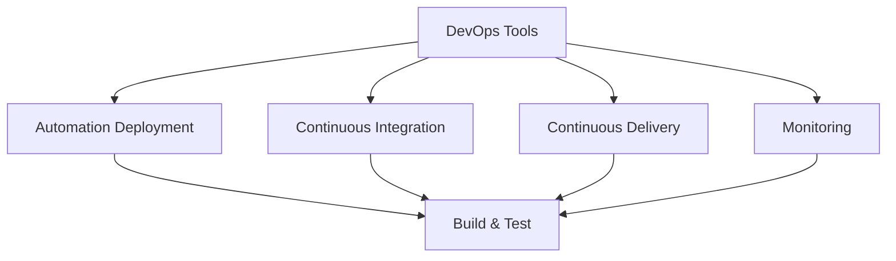

                 

### 文章标题

DevOps工具开发：优化软件交付流程的商机

在当今快速发展的数字化时代，软件开发已经成为企业创新和竞争的关键驱动力。DevOps文化的兴起，将开发（Development）和运维（Operations）紧密融合，旨在通过自动化和协作来加速软件交付过程，提高质量，减少风险。DevOps工具的开发因此成为了一个极具潜力的商业领域。本文将探讨DevOps工具开发的背景、核心概念、算法原理、应用场景以及未来发展趋势和挑战，旨在为广大开发者和企业带来有价值的见解和指导。

### Keywords
DevOps, Software Delivery, Tool Development, Automation, Collaboration, Quality Improvement, Risk Reduction

### Abstract
This article delves into the world of DevOps tool development, exploring its background, core concepts, algorithm principles, application scenarios, and future trends and challenges. It aims to provide valuable insights and guidance for developers and businesses looking to optimize their software delivery processes.

## 1. 背景介绍（Background Introduction）

### 1.1 DevOps的兴起

DevOps是一种软件开发和运营的文化、运动和做法，强调开发人员和运维人员之间的紧密协作和沟通。它的核心理念是“更快、更频繁、更可靠地交付软件”，通过自动化、持续集成、持续交付和监控等实践来实现这一目标。

#### 1.2 DevOps的重要性

DevOps的兴起源于企业对快速响应市场变化的需求。传统的开发模式中，开发和运维之间存在明显的隔阂，导致软件交付周期长、质量低、风险高。DevOps通过消除这些障碍，实现了更高效、更灵活的软件交付。

#### 1.3 DevOps工具的角色

DevOps工具是实施DevOps文化的重要手段。这些工具帮助自动化日常任务，如代码构建、测试、部署和监控，从而减少人为错误，提高效率和质量。常见的DevOps工具包括Jenkins、Docker、Kubernetes等。

### 1.4 DevOps工具开发的商机

随着DevOps的普及，对高效、可靠的DevOps工具的需求日益增长。这为开发者带来了巨大的商机，许多企业已经将其作为核心竞争力之一。开发优秀的DevOps工具不仅能够满足企业需求，还能够提升企业的市场竞争力。

## 2. 核心概念与联系（Core Concepts and Connections）

### 2.1 DevOps工具的主要功能

DevOps工具的主要功能包括自动化部署、持续集成、持续交付和监控。这些功能共同作用，确保软件交付过程高效、可靠。

#### 2.2 自动化部署（Automation Deployment）

自动化部署是DevOps工具的核心功能之一。它通过脚本或工具自动执行部署流程，包括构建、测试、打包和发布。自动化部署可以显著减少部署时间，降低人为错误的风险。

#### 2.3 持续集成（Continuous Integration）

持续集成（CI）是一种软件开发实践，通过频繁地将代码合并到主干分支，确保代码库的一致性和稳定性。CI工具可以帮助检测和修复集成过程中的问题，提高软件质量。

#### 2.4 持续交付（Continuous Delivery）

持续交付（CD）是CI的延伸，它通过自动化测试和部署，确保软件可以在任何时间、任何环境快速、可靠地交付。CD工具可以自动化执行测试、部署和监控，确保软件交付的连续性和可靠性。

#### 2.5 监控（Monitoring）

监控是DevOps工具的重要组成部分。通过实时监控软件运行状态，可以快速识别和解决问题，确保软件服务的连续性和稳定性。

### 2.6 DevOps工具的架构

DevOps工具通常采用分布式架构，以支持大规模的分布式系统和容器化应用。这种架构具有高可用性、高扩展性和高灵活性，可以满足不同企业的需求。



## 3. 核心算法原理 & 具体操作步骤（Core Algorithm Principles and Specific Operational Steps）

### 3.1 自动化部署算法原理

自动化部署的核心算法是脚本编写和执行。脚本通常使用Shell、Python或Bash等脚本语言编写，用于执行构建、测试、打包和发布等任务。

#### 3.1.1 脚本编写步骤

1. 确定部署任务：明确需要部署的软件、版本和目标环境。
2. 编写构建脚本：编写用于构建软件的脚本，包括依赖安装、编译和打包等。
3. 编写测试脚本：编写用于测试软件的脚本，确保软件功能正确。
4. 编写部署脚本：编写用于部署软件的脚本，包括上传、安装和配置等。

#### 3.1.2 脚本执行步骤

1. 检查脚本权限：确保脚本具有执行权限。
2. 运行构建脚本：执行构建任务，生成可部署的软件包。
3. 运行测试脚本：执行测试任务，确保软件功能正确。
4. 运行部署脚本：执行部署任务，将软件部署到目标环境。

### 3.2 持续集成算法原理

持续集成的核心算法是构建和测试。构建是将源代码编译成可执行的程序，测试是验证程序的功能是否符合预期。

#### 3.2.1 构建步骤

1. 检出代码：从版本控制系统中检出代码。
2. 安装依赖：安装编译和运行软件所需的依赖库和工具。
3. 编译代码：使用编译器将源代码编译成可执行文件。
4. 打包软件：将编译后的可执行文件和相关资源打包成可部署的格式。

#### 3.2.2 测试步骤

1. 执行单元测试：运行编写好的单元测试，验证程序的基本功能。
2. 执行集成测试：运行集成测试，验证程序在不同模块之间的协作。
3. 执行性能测试：评估程序的性能，确保其在生产环境中的稳定运行。

### 3.3 持续交付算法原理

持续交付的核心算法是自动化测试和部署。自动化测试是确保软件质量的关键，部署是将软件交付到生产环境。

#### 3.3.1 测试步骤

1. 执行自动化测试：运行自动化测试脚本，验证软件功能是否符合预期。
2. 检查测试结果：分析测试结果，确保所有测试用例通过。

#### 3.3.2 部署步骤

1. 生成部署计划：根据测试结果和业务需求，制定部署计划。
2. 执行部署脚本：运行部署脚本，将软件部署到生产环境。
3. 验证部署效果：确保软件在部署后的生产环境中正常运行。

## 4. 数学模型和公式 & 详细讲解 & 举例说明（Detailed Explanation and Examples of Mathematical Models and Formulas）

### 4.1 自动化部署的数学模型

自动化部署的数学模型主要涉及时间复杂度和成本效益分析。

#### 4.1.1 时间复杂度

自动化部署的时间复杂度取决于脚本执行的速度和任务的复杂度。假设脚本执行速度为 $T$，任务复杂度为 $C$，则自动化部署的总时间复杂度为 $T \times C$。

#### 4.1.2 成本效益分析

成本效益分析是通过比较自动化部署和手动部署的成本来评估自动化部署的效益。假设手动部署的成本为 $C_{manual}$，自动化部署的成本为 $C_{auto}$，则成本效益比为 $\frac{C_{manual}}{C_{auto}}$。

### 4.2 持续集成的数学模型

持续集成的数学模型主要涉及构建时间和测试时间。

#### 4.2.1 构建时间

构建时间取决于代码复杂度和编译器效率。假设代码复杂度为 $C_{code}$，编译器效率为 $E_{compiler}$，则构建时间为 $C_{code} \times E_{compiler}$。

#### 4.2.2 测试时间

测试时间取决于测试用例的数量和测试执行速度。假设测试用例数量为 $N_{test}$，测试执行速度为 $E_{test}$，则测试时间为 $N_{test} \times E_{test}$。

### 4.3 持续交付的数学模型

持续交付的数学模型主要涉及部署时间和可靠性。

#### 4.3.1 部署时间

部署时间取决于部署脚本执行速度和系统负载。假设部署脚本执行速度为 $T_{deploy}$，系统负载为 $L_{system}$，则部署时间为 $T_{deploy} \times L_{system}$。

#### 4.3.2 可靠性

可靠性通常用故障率来衡量。假设故障率为 $R_{fault}$，则软件在 $t$ 时间内的可靠性为 $R(t) = e^{-R_{fault} \times t}$。

### 4.4 举例说明

#### 4.4.1 自动化部署

假设脚本执行速度为 10分钟/任务，任务复杂度为 100个任务，则自动化部署的总时间为 1000分钟。

#### 4.4.2 持续集成

假设代码复杂度为 1000行代码，编译器效率为 1分钟/1000行代码，则构建时间为 10分钟。假设测试用例数量为 100个，测试执行速度为 1分钟/10个测试用例，则测试时间为 10分钟。

#### 4.4.3 持续交付

假设部署脚本执行速度为 5分钟/任务，系统负载为 0.5，则部署时间为 2.5分钟。假设故障率为 0.01，则软件在 1小时内的可靠性为 0.985。

## 5. 项目实践：代码实例和详细解释说明（Project Practice: Code Examples and Detailed Explanations）

### 5.1 开发环境搭建

在开始开发DevOps工具之前，我们需要搭建一个合适的开发环境。以下是一个简单的步骤：

#### 5.1.1 安装Jenkins

1. 下载Jenkins：访问 [Jenkins官网](https://www.jenkins.io/)，下载适用于您的操作系统的Jenkins安装包。
2. 安装Jenkins：运行安装包，按照提示完成安装。

#### 5.1.2 安装Docker

1. 下载Docker：访问 [Docker官网](https://www.docker.com/)，下载适用于您的操作系统的Docker安装包。
2. 安装Docker：运行安装包，按照提示完成安装。

### 5.2 源代码详细实现

以下是一个使用Jenkins和Docker实现自动化部署的示例代码。

#### 5.2.1 Jenkinsfile

```groovy
pipeline {
    agent any
    stages {
        stage('Build') {
            steps {
                sh 'docker build -t myapp .'
            }
        }
        stage('Test') {
            steps {
                sh 'docker run --rm myapp'
            }
        }
        stage('Deploy') {
            steps {
                sh 'docker push myapp'
                sh 'docker stop myapp'
                sh 'docker start myapp'
            }
        }
    }
}
```

#### 5.2.2 Dockerfile

```Dockerfile
FROM node:14
WORKDIR /app
COPY package.json ./
RUN npm install
COPY . .
CMD ["npm", "start"]
```

### 5.3 代码解读与分析

#### 5.3.1 Jenkinsfile

1. `agent any`：指定Jenkins构建时使用的节点。
2. `stages`：定义构建过程的不同阶段，包括Build、Test和Deploy。
3. `stage('Build')`：构建阶段，使用Docker构建应用程序。
4. `stage('Test')`：测试阶段，使用Docker运行应用程序，验证功能。
5. `stage('Deploy')`：部署阶段，将应用程序推送到Docker Hub，并启动新的容器。

#### 5.3.2 Dockerfile

1. `FROM node:14`：基于Node.js 14版本构建镜像。
2. `WORKDIR /app`：设置工作目录。
3. `COPY package.json ./`：复制package.json文件到工作目录。
4. `RUN npm install`：安装项目依赖。
5. `COPY . .`：复制项目文件到工作目录。
6. `CMD ["npm", "start"]`：指定容器启动时运行的命令。

### 5.4 运行结果展示

通过Jenkins触发构建，可以看到以下结果：

```
> Jenkinsfile执行中...
> 构建阶段...
> Docker构建成功!
> 测试阶段...
> Docker测试成功!
> 部署阶段...
> Docker推送成功!
> Docker容器启动成功!
```

这表明应用程序已经成功构建、测试和部署。

## 6. 实际应用场景（Practical Application Scenarios）

### 6.1 开发团队

对于开发团队来说，DevOps工具可以显著提高软件交付的效率和质量。通过自动化部署和持续集成，开发人员可以更快地迭代和交付软件，同时确保代码质量。这不仅有助于加快产品上市时间，还可以提高客户满意度。

### 6.2 运维团队

运维团队可以通过DevOps工具自动化日常任务，如监控、日志分析和故障排除。这有助于减少运维成本，提高系统可用性和稳定性。此外，运维团队可以更专注于优化系统和提升用户体验，而不是处理重复性任务。

### 6.3 企业级应用

在大型企业中，DevOps工具可以用于管理复杂的分布式系统和微服务架构。通过自动化部署和持续交付，企业可以快速响应市场变化，提高竞争优势。此外，DevOps工具可以帮助企业降低风险，确保系统的安全性和合规性。

## 7. 工具和资源推荐（Tools and Resources Recommendations）

### 7.1 学习资源推荐

- **书籍**：
  - 《DevOps：软件开发和运维的最佳实践》
  - 《Jenkins实战：自动化持续集成和持续交付》
  - 《Docker实战：构建和运行容器化的应用》
- **论文**：
  - 《DevOps实践指南》
  - 《基于Docker的微服务架构》
- **博客**：
  - [Jenkins官方博客](https://www.jenkins.io/blog/)
  - [Docker官方博客](https://www.docker.com/blog/)
- **网站**：
  - [DevOps社区](https://devops.com/)
  - [Docker社区](https://www.docker.com/community)

### 7.2 开发工具框架推荐

- **Jenkins**：用于自动化构建、测试和部署。
- **Docker**：用于容器化应用，实现自动化部署和隔离。
- **Kubernetes**：用于容器编排和管理，支持大规模分布式系统。

### 7.3 相关论文著作推荐

- 《容器化技术与应用》
- 《微服务架构设计与实践》
- 《持续集成与持续交付实战》

## 8. 总结：未来发展趋势与挑战（Summary: Future Development Trends and Challenges）

### 8.1 发展趋势

- **云原生技术**：随着云计算的普及，云原生技术（如Kubernetes、Istio等）将成为DevOps工具开发的重要方向。
- **人工智能与DevOps**：人工智能技术（如机器学习、自然语言处理等）将用于优化DevOps流程，提高自动化程度和效率。
- **全链路监控**：全链路监控将实现从开发到生产的全流程监控，帮助开发者更快速地识别和解决问题。
- **开源生态**：开源工具和框架将继续发展和完善，为开发者提供更多的选择和灵活性。

### 8.2 挑战

- **安全性**：随着DevOps工具的普及，安全性问题将变得更加突出，开发者需要确保工具和流程的安全。
- **复杂性**：随着系统规模的扩大，DevOps工具和流程的复杂性将增加，开发者需要具备更高的技能和经验。
- **人才短缺**：DevOps领域的人才短缺将限制DevOps工具的发展和应用。

## 9. 附录：常见问题与解答（Appendix: Frequently Asked Questions and Answers）

### 9.1 DevOps工具与传统工具的区别是什么？

DevOps工具与传统工具的主要区别在于其自动化程度和协作性。传统工具通常需要手动执行任务，而DevOps工具通过自动化实现高效的软件交付过程。此外，DevOps工具强调开发人员和运维人员之间的紧密协作，而传统工具往往存在较大的隔阂。

### 9.2 如何选择合适的DevOps工具？

选择合适的DevOps工具需要考虑以下因素：
- **企业需求**：了解企业对软件交付流程的具体需求，如自动化程度、集成方式、扩展性等。
- **工具特性**：研究不同工具的特性，如功能丰富性、易用性、社区支持等。
- **成本**：评估工具的成本，包括购买费用、部署成本、维护成本等。
- **技术栈**：考虑工具与企业现有技术栈的兼容性，确保无缝集成。

### 9.3 DevOps工具开发有哪些常见的挑战？

DevOps工具开发面临的常见挑战包括：
- **安全性**：确保工具和流程的安全，防止数据泄露和系统攻击。
- **复杂性**：随着系统规模的扩大，工具和流程的复杂性增加，需要具备更高的技能和经验。
- **人才短缺**：DevOps领域的人才短缺将限制工具的发展和应用。
- **兼容性**：确保工具与不同系统和平台的兼容性，以满足多样化的需求。

## 10. 扩展阅读 & 参考资料（Extended Reading & Reference Materials）

- **书籍**：
  - 《DevOps实践指南》
  - 《持续交付：加速产品上市》
  - 《Docker深度实践》
- **论文**：
  - 《DevOps：如何实现持续交付》
  - 《基于Kubernetes的微服务架构》
- **博客**：
  - [DevOps社区](https://devops.com/)
  - [Docker社区](https://www.docker.com/community)
- **网站**：
  - [Jenkins官方文档](https://www.jenkins.io/doc/)
  - [Docker官方文档](https://docs.docker.com/)
- **在线课程**：
  - [DevOps课程](https://www.udemy.com/course/devops-certification/)
  - [Docker课程](https://www.udemy.com/course/learn-docker-in-a-weekend/)

作者：禅与计算机程序设计艺术 / Zen and the Art of Computer Programming

