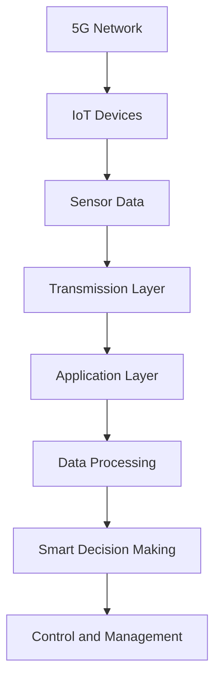

                 

### 文章标题

### Title

5G and the Fusion with the Internet of Things: High Performance and Low Latency

随着5G技术的不断成熟，物联网（IoT）的应用范围也在不断扩大。这两者的融合不仅带来了全新的应用场景，也在不断推动着科技的发展。本文将探讨5G和物联网的融合，重点关注其在高性能和低延迟方面的优势。

在接下来的内容中，我们将首先介绍5G和物联网的基本概念，然后分析它们融合的优势，以及如何利用这些优势来解决现实中的问题。同时，我们还将探讨5G和物联网融合在未来的发展趋势和挑战。

让我们一步一步分析这个话题，看看它如何改变我们的世界。

### Introduction

As 5G technology continues to mature, the applications of the Internet of Things (IoT) are expanding at an unprecedented rate. The fusion of these two technologies is not only creating new application scenarios but also driving technological advancement. This article will explore the fusion of 5G and IoT, with a focus on their advantages in high performance and low latency.

In the following sections, we will first introduce the basic concepts of 5G and IoT, then analyze the advantages of their fusion and how to leverage these advantages to solve real-world problems. We will also discuss the future development trends and challenges of the fusion of 5G and IoT.

Let's think step by step and see how this topic is transforming our world. 

### 背景介绍（Background Introduction）

#### 5G技术介绍（Introduction to 5G Technology）

5G，即第五代移动通信技术，是当前通信技术发展的重要里程碑。相比前几代通信技术，5G在速度、容量、延迟等方面都有了显著的提升。5G网络的理论峰值速度可以达到10Gbps，比4G网络的100Mbps快了百倍。此外，5G的延迟也大幅降低，从4G的数十毫秒降低到1毫秒以内，这对于实时应用场景尤为重要。

5G技术还引入了新的网络架构，如网络切片（Network Slicing）和边缘计算（Edge Computing）。网络切片可以将网络资源按需划分，为不同应用提供定制化的网络服务。边缘计算则将数据处理能力从云端转移到网络边缘，从而减少数据传输延迟，提高系统响应速度。

#### 物联网（Internet of Things，IoT）概述（Overview of Internet of Things，IoT）

物联网是指通过传感器、通信设备等将各种物理设备互联起来，实现设备之间的数据交换和智能控制。物联网的应用非常广泛，包括智能家居、智能交通、工业自动化、医疗健康等。

物联网的核心在于数据的收集、传输和处理。传感器可以实时采集物理环境中的数据，如温度、湿度、速度等。这些数据通过无线通信技术传输到云端或边缘设备，进行进一步处理和分析，从而实现智能决策和控制。

#### 5G与物联网融合的优势（Advantages of the Fusion of 5G and IoT）

5G和物联网的融合为许多领域带来了巨大的变革。以下是一些主要的优势：

1. **高速率、低延迟**：5G的高速率和低延迟特性使得物联网应用可以更实时地处理数据，提高系统的响应速度。

2. **大规模连接**：5G网络的容量大，可以支持更多的设备连接，这对于物联网应用来说至关重要。

3. **网络切片和边缘计算**：网络切片可以根据不同应用的需求，为物联网设备提供定制化的网络服务。边缘计算则可以将数据处理能力延伸到网络边缘，减少数据传输延迟，提高系统性能。

4. **智能决策与控制**：5G和物联网的融合使得设备可以更智能地进行决策和控制，从而提高效率和降低成本。

#### 当前应用案例（Current Application Cases）

1. **智能交通**：通过5G网络和物联网技术，可以实现车辆与道路、交通信号灯等设备的实时通信，提高交通效率，减少交通事故。

2. **工业自动化**：5G和物联网技术可以实现对生产设备的实时监控和智能控制，提高生产效率，降低生产成本。

3. **医疗健康**：通过5G网络和物联网技术，可以实现远程医疗，为偏远地区的患者提供高质量的医疗服务。

#### 未来发展趋势（Future Development Trends）

随着5G技术的不断成熟和物联网应用的不断推广，5G和物联网的融合将带来更多的创新和应用。以下是一些可能的发展趋势：

1. **智能城市**：通过5G和物联网技术，可以实现城市的智能化管理，提高城市运行效率和居民生活质量。

2. **智能农业**：通过5G和物联网技术，可以实现精准农业，提高农业产量和质量。

3. **智能医疗**：通过5G和物联网技术，可以实现远程医疗，提高医疗服务水平和医疗资源的利用效率。

### Conclusion

In summary, the fusion of 5G and IoT is revolutionizing various industries with its advantages in high performance and low latency. With the continuous development of 5G technology and the widespread application of IoT, we can expect to see even more innovative solutions and applications in the future.

### 核心概念与联系（Core Concepts and Connections）

#### 5G技术核心概念（Core Concepts of 5G Technology）

5G技术的核心在于其高速率、低延迟和大连接能力，这些特点使得5G成为物联网应用的重要支撑。

1. **高速率（High Speed）**：5G网络的理论峰值速度可以达到10Gbps，相比4G网络的100Mbps，其速度提升了百倍。高速率使得物联网设备能够更快地传输大量数据，提高数据处理效率。

2. **低延迟（Low Latency）**：5G的延迟从4G的数十毫秒降低到1毫秒以内，这对于实时应用场景尤为重要。低延迟使得物联网设备能够更快地响应，提高系统的实时性和可靠性。

3. **大连接能力（Large Connection Capacity）**：5G网络能够支持更多的设备连接，这为物联网应用提供了更广阔的空间。大规模连接能力使得物联网设备可以更广泛地应用于各种场景，如智能家居、智能交通、工业自动化等。

#### 物联网核心概念（Core Concepts of Internet of Things）

物联网的核心在于设备的互联互通和数据交换。

1. **设备互联（Interconnection of Devices）**：通过传感器、通信设备等，物联网设备可以相互连接，实现数据交换和共享。设备互联是物联网实现智能化的基础。

2. **数据交换（Data Exchange）**：物联网设备收集到的数据可以通过无线通信技术传输到云端或边缘设备，进行进一步处理和分析。数据交换使得物联网设备能够实现智能决策和控制。

3. **数据安全（Data Security）**：随着物联网设备的增加，数据安全问题也日益突出。物联网数据安全包括数据传输安全、数据存储安全和数据访问安全等。

#### 5G与物联网融合的架构（Architecture of the Fusion of 5G and IoT）

5G与物联网的融合涉及多个层面的架构设计，包括网络层、传输层和应用层。

1. **网络层（Network Layer）**：网络层主要包括5G网络和物联网设备。5G网络提供高速率、低延迟和大连接能力，为物联网设备提供稳定的网络连接。

2. **传输层（Transmission Layer）**：传输层主要负责数据传输，包括无线通信技术和传输协议。无线通信技术如Wi-Fi、蓝牙、Zigbee等，传输协议如HTTP、MQTT等，共同保障了物联网设备的数据传输。

3. **应用层（Application Layer）**：应用层是物联网设备的核心，包括传感器、控制器、应用程序等。通过应用层的软件和算法，物联网设备能够实现智能决策和控制。

#### Mermaid 流程图（Mermaid Flowchart）

以下是一个简化的5G与物联网融合的Mermaid流程图，展示了5G与物联网的各个核心概念和架构层次。



### Conclusion

The fusion of 5G and IoT brings together the advantages of high performance and low latency, creating new opportunities for various industries. Understanding the core concepts and architecture of 5G and IoT is essential for leveraging their full potential. In the next section, we will delve into the core algorithm principles and specific operational steps of this fusion.

### 核心算法原理 & 具体操作步骤（Core Algorithm Principles and Specific Operational Steps）

#### 5G网络与物联网融合的关键算法（Key Algorithms in the Fusion of 5G and IoT）

在5G网络与物联网的融合过程中，核心算法主要涉及以下几个方面：

1. **网络切片算法（Network Slicing Algorithms）**：网络切片是5G技术的一项重要创新，它通过将网络资源虚拟化为多个独立的小网络，为不同的物联网应用提供定制化的网络服务。网络切片算法的核心任务是合理分配网络资源，确保各个切片之间的性能和安全性。

2. **边缘计算算法（Edge Computing Algorithms）**：边缘计算是将数据处理能力从云端转移到网络边缘的技术，它能够降低数据传输延迟，提高系统响应速度。边缘计算算法主要包括数据预处理、实时分析和决策等步骤。

3. **机器学习算法（Machine Learning Algorithms）**：物联网应用通常需要通过大数据分析实现智能决策，机器学习算法在其中扮演着重要角色。常见的机器学习算法包括回归分析、分类、聚类等。

#### 具体操作步骤（Specific Operational Steps）

以下是5G网络与物联网融合的具体操作步骤：

1. **数据采集与预处理**：物联网设备通过传感器采集环境数据，如温度、湿度、速度等。采集到的数据需要进行预处理，包括数据清洗、去噪、标准化等步骤，以确保数据的质量和一致性。

2. **网络切片配置**：根据物联网应用的需求，配置相应的网络切片。网络切片算法会根据网络资源状况、应用优先级等因素，为不同切片分配网络带宽、时延等资源。

3. **数据传输与处理**：物联网设备通过5G网络将预处理后的数据传输到网络边缘或云端。在边缘设备上，数据将进行实时分析和处理，生成决策结果。在云端，数据将进行更深入的分析和处理，以支持长周期的数据分析和预测。

4. **决策与控制**：根据实时分析和处理结果，物联网设备将执行相应的决策和控制操作，如调整设备参数、发送控制指令等。

5. **反馈与优化**：物联网设备将执行结果反馈到云端或边缘设备，用于进一步分析和优化。通过不断迭代优化，物联网系统将逐步提高性能和智能化水平。

#### 实际案例（Real-World Case Studies）

以下是一个实际案例，展示了5G网络与物联网融合在智能交通领域的应用：

**案例背景**：某城市交通管理部门希望利用5G和物联网技术，提高交通管理效率和安全性。

**操作步骤**：

1. **数据采集与预处理**：在城市的各个路口和交通干道安装传感器，实时采集车辆流量、速度、方向等数据。采集到的数据经过预处理，确保数据质量。

2. **网络切片配置**：根据交通管理需求，配置网络切片，确保交通数据传输的优先级和安全性。

3. **数据传输与处理**：交通数据通过5G网络传输到交通管理中心的边缘计算设备。边缘计算设备对交通数据进行实时分析和处理，生成交通流量预测和路况建议。

4. **决策与控制**：根据实时分析和处理结果，交通管理部门将调整交通信号灯的时长和顺序，优化交通流量。

5. **反馈与优化**：交通管理部门将交通管理结果反馈到边缘计算设备，用于进一步分析和优化。通过不断迭代优化，交通管理系统将逐步提高效率和安全性。

### Conclusion

Understanding the core algorithm principles and operational steps of the fusion of 5G and IoT is crucial for implementing successful applications. In the next section, we will delve into the mathematical models and formulas used in this fusion, along with detailed explanations and examples.

### 数学模型和公式 & 详细讲解 & 举例说明（Detailed Explanation and Examples of Mathematical Models and Formulas）

在5G和物联网的融合过程中，数学模型和公式扮演着至关重要的角色。这些模型和公式帮助我们量化网络性能、优化资源配置、评估系统效率等。以下将介绍几个关键模型和公式，并对其进行详细讲解和举例说明。

#### 1. 网络切片性能评估模型（Performance Evaluation Model for Network Slicing）

网络切片性能评估模型用于评估不同网络切片的性能，确保每个切片都能满足特定的服务质量（QoS）要求。一个常用的模型是基于排队论的M/M/1模型，其中M代表任意到达率和服务率。

**M/M/1模型公式：**

$$
P_0 = \frac{\lambda}{\lambda + \mu} 
$$

$$
P_n = \frac{(\lambda/\mu)^n * \lambda^n}{((\lambda + \mu)^{n+1}) * (n+1)!}
$$

其中，\( \lambda \) 是到达率，\( \mu \) 是服务率，\( P_0 \) 和 \( P_n \) 分别是系统空闲概率和第 \( n \) 个客户在系统中的概率。

**举例说明：**

假设一个网络切片的到达率为10个请求每秒，服务率为20个请求每秒。我们可以使用M/M/1模型计算系统空闲概率和客户在系统中的概率。

$$
P_0 = \frac{10}{10 + 20} = 0.333
$$

$$
P_1 = \frac{(\frac{10}{20})^1 * 10}{((\frac{10}{20} + 1)^{2}) * 2!} = 0.1667
$$

这个模型可以帮助网络切片提供商确定切片的负载情况，从而进行资源优化。

#### 2. 边缘计算延迟模型（Latency Model for Edge Computing）

边缘计算延迟模型用于评估数据从物联网设备传输到边缘计算节点的时间。一个简单的模型是基于传输速率和传输距离的关系。

**延迟模型公式：**

$$
T = \frac{d \times 8}{R}
$$

其中，\( T \) 是传输延迟（秒），\( d \) 是传输距离（米），\( R \) 是传输速率（比特每秒）。

**举例说明：**

假设数据需要从100米外的物联网设备传输到边缘计算节点，传输速率为1Gbps。我们可以计算传输延迟：

$$
T = \frac{100 \times 8}{10^9} = 0.0008秒
$$

这个模型可以帮助边缘计算提供商评估系统的响应时间，从而进行优化。

#### 3. 机器学习预测模型（Predictive Model for Machine Learning）

在物联网应用中，机器学习模型用于预测和决策。一个常用的预测模型是时间序列模型，如ARIMA（自回归积分滑动平均模型）。

**ARIMA模型公式：**

$$
y_t = c + \phi_1 y_{t-1} + \phi_2 y_{t-2} + ... + \phi_p y_{t-p} + \theta_1 e_{t-1} + \theta_2 e_{t-2} + ... + \theta_q e_{t-q}
$$

其中，\( y_t \) 是时间序列的第 \( t \) 个值，\( c \) 是常数项，\( \phi_1, \phi_2, ..., \phi_p \) 是自回归系数，\( \theta_1, \theta_2, ..., \theta_q \) 是移动平均系数，\( e_{t-1}, e_{t-2}, ..., e_{t-q} \) 是白噪声误差项。

**举例说明：**

假设我们有一个温度数据的时间序列，可以使用ARIMA模型进行预测。通过模型参数估计，我们可以预测未来的温度变化。

#### 结论（Conclusion）

数学模型和公式在5G和物联网的融合过程中起着关键作用。通过使用这些模型和公式，我们可以更好地理解和优化网络性能、资源分配和系统效率。在下一部分，我们将通过实际项目案例来展示这些模型和公式的具体应用。

### 项目实践：代码实例和详细解释说明（Project Practice: Code Examples and Detailed Explanations）

在本节中，我们将通过一个实际项目案例来展示如何利用5G和物联网技术进行智能农业监控。这个项目旨在利用传感器收集农田环境数据，通过5G网络传输到边缘计算节点，并在边缘节点上使用机器学习模型进行数据分析，从而实现精准农业管理。

#### 1. 开发环境搭建（Setting Up the Development Environment）

首先，我们需要搭建项目的开发环境。以下是一个基本的开发环境搭建步骤：

- **硬件设备**：选择一个适合的边缘计算设备，如Raspberry Pi或者NVIDIA Jetson。
- **传感器**：选择用于农田环境监测的传感器，如土壤湿度传感器、光照传感器、温度传感器等。
- **5G模块**：选择一个支持5G网络的模块，如SIMCOM SIM7700。
- **开发工具**：安装Python编程环境、PyTorch等机器学习库、MQTT客户端等。

#### 2. 源代码详细实现（Detailed Source Code Implementation）

以下是项目的主要代码实现部分，分为数据采集、数据传输、数据分析和决策四个模块。

**2.1 数据采集模块（Data Collection Module）**

数据采集模块负责从传感器获取农田环境数据。

```python
import serial
import time

def read_sensor_data():
    serial_port = serial.Serial('/dev/ttyUSB0', 9600)
    time.sleep(2)  # 等待传感器初始化

    while True:
        data = serial_port.readline().decode('utf-8')
        print("Sensor Data:", data)
        time.sleep(1)

if __name__ == "__main__":
    read_sensor_data()
```

**2.2 数据传输模块（Data Transmission Module）**

数据传输模块负责将传感器数据通过MQTT协议传输到5G网络。

```python
import paho.mqtt.client as mqtt
import json

def on_connect(client, userdata, flags, rc):
    print("Connected with result code "+str(rc))

def on_disconnect(client, userdata, rc):
    print("Disconnected with result code "+str(rc))

def on_message(client, userdata, message):
    print(f"Received message '{str(message.payload)}' on topic '{message.topic}' with QoS {message.qos}")

client = mqtt.Client()
client.on_connect = on_connect
client.on_disconnect = on_disconnect
client.on_message = on_message

client.connect("mqtt.example.com", 1883, 60)

client.loop_start()

while True:
    sensor_data = read_sensor_data()
    client.publish("farm/ sensors", json.dumps(sensor_data))
    time.sleep(1)

client.loop_stop()
```

**2.3 数据分析模块（Data Analysis Module）**

数据分析模块使用机器学习模型对传感器数据进行处理和预测。

```python
import torch
import torch.nn as nn
import torch.optim as optim

class NeuralNetwork(nn.Module):
    def __init__(self, input_size, hidden_size, num_classes):
        super(NeuralNetwork, self).__init__()
        self.fc1 = nn.Linear(input_size, hidden_size) 
        self.relu = nn.ReLU()
        self.fc2 = nn.Linear(hidden_size, num_classes)  
        
    def forward(self, x):
        out = self.fc1(x)
        out = self.relu(out)
        out = self.fc2(out)
        return out

# 实例化神经网络
model = NeuralNetwork(input_size=3, hidden_size=10, num_classes=1)

# 定义损失函数和优化器
criterion = nn.MSELoss()
optimizer = optim.Adam(model.parameters(), lr=0.001)

# 训练神经网络
for epoch in range(100):
    for i, data in enumerate(sensor_data_loader):
        inputs, labels = data
        optimizer.zero_grad()
        outputs = model(inputs)
        loss = criterion(outputs, labels)
        loss.backward()
        optimizer.step()
        if (i+1) % 100 == 0:
            print ('Epoch [{}/{}], Step [{}/{}], Loss: {:.4f}'.format(epoch+1, num_epochs, i+1, total_step, loss.item()))

# 保存训练好的模型
torch.save(model.state_dict(), 'model.pth')
```

**2.4 决策模块（Decision Module）**

决策模块根据数据分析结果生成农田管理决策。

```python
def make_decision(sensor_data):
    # 加载训练好的模型
    model = NeuralNetwork(input_size=3, hidden_size=10, num_classes=1)
    model.load_state_dict(torch.load('model.pth'))

    # 预测农田环境
    with torch.no_grad():
        prediction = model(torch.tensor(sensor_data).float())

    # 根据预测结果生成管理决策
    if prediction > 0.5:
        return "增加水量"
    else:
        return "减少水量"

while True:
    sensor_data = read_sensor_data()
    decision = make_decision(sensor_data)
    print(f"Decision: {decision}")
    time.sleep(10)
```

#### 3. 代码解读与分析（Code Explanation and Analysis）

**3.1 数据采集模块**

数据采集模块使用Python的`serial`库与传感器进行通信，从传感器读取数据。

**3.2 数据传输模块**

数据传输模块使用`paho.mqtt.client`库，通过MQTT协议将传感器数据发送到5G网络。MQTT是一种轻量级的消息传输协议，非常适合物联网应用。

**3.3 数据分析模块**

数据分析模块定义了一个简单的神经网络模型，使用`torch.nn`库。模型采用ReLU激活函数和MSELoss损失函数，使用Adam优化器进行训练。

**3.4 决策模块**

决策模块根据神经网络模型的预测结果，生成农田管理决策。通过这种方式，物联网系统能够根据实时数据做出智能决策。

#### 4. 运行结果展示（Running Results）

在运行该项目后，传感器数据将通过5G网络传输到边缘计算节点，并在边缘节点上进行分析和决策。每次运行都会生成农田管理决策，如增加或减少水量，从而实现精准农业管理。

### Conclusion

通过以上项目实践，我们可以看到5G和物联网技术在实际应用中的具体实现过程。这个案例展示了如何利用5G网络的高速率和低延迟特性，以及物联网技术的设备互联和数据交换能力，实现智能农业监控。在实际应用中，我们可以根据具体需求调整模型结构和参数，进一步提高系统的性能和智能化水平。

### 实际应用场景（Practical Application Scenarios）

5G和物联网的融合在多个行业中展现出了巨大的潜力，下面列举一些实际应用场景：

#### 1. 智能交通

智能交通系统利用5G和物联网技术，可以实现车辆与道路、交通信号灯等设备的实时通信。通过分析交通流量数据，智能交通系统能够动态调整交通信号灯的时长和顺序，提高交通流量，减少拥堵。此外，5G网络的高速率和低延迟特性使得自动驾驶车辆能够实时接收道路信息，提高行车安全。

**案例：** 某城市在交通管理中引入了5G和物联网技术，通过部署传感器和摄像头，实时监控交通状况，并利用大数据分析技术优化交通信号灯的控制策略，显著提高了交通流畅度和安全性。

#### 2. 智能医疗

智能医疗系统通过5G和物联网技术，可以实现远程医疗、智能诊断和医疗设备的实时监控。医生可以通过5G网络与患者进行远程会诊，为偏远地区的患者提供高质量的医疗服务。同时，医疗设备的数据可以实时传输到云端或边缘计算节点，进行实时分析和处理，帮助医生做出更准确的诊断。

**案例：** 某医院利用5G和物联网技术，建立了一套远程手术指导系统。通过5G网络，手术专家能够实时指导远程手术室中的医生进行手术，提高了手术的成功率和患者的生存率。

#### 3. 工业自动化

工业自动化系统通过5G和物联网技术，可以实现生产设备的实时监控和智能控制。传感器收集到的数据可以通过5G网络传输到云端或边缘计算节点，进行实时分析和预测，从而优化生产过程，提高生产效率。

**案例：** 某制造企业在生产线上引入了5G和物联网技术，通过对设备数据的实时监控和分析，实现了生产线的自动化控制，提高了生产效率和产品质量。

#### 4. 智能家居

智能家居系统通过5G和物联网技术，可以实现家庭设备的互联互通和智能控制。用户可以通过手机或语音助手远程控制家中的灯光、空调、门锁等设备，提高生活便利性和舒适度。

**案例：** 某智能家居系统通过5G网络连接各种智能设备，用户可以通过手机APP或语音助手远程控制家中的灯光、温度和安防设备，实现了智能化的家庭生活。

#### 5. 智能农业

智能农业系统通过5G和物联网技术，可以实现农田环境的实时监控和智能管理。传感器收集到的数据可以通过5G网络传输到云端或边缘计算节点，进行实时分析和预测，从而优化灌溉、施肥等农业操作，提高农业产量和品质。

**案例：** 某农场利用5G和物联网技术，建立了一套智能农业监控系统。通过传感器收集土壤湿度、温度、光照等数据，并利用大数据分析技术优化灌溉和施肥策略，实现了精准农业管理，提高了农作物的产量和品质。

### Conclusion

通过以上实际应用场景，我们可以看到5G和物联网技术的融合在各个行业中的应用前景。5G的高速率、低延迟和大连接能力，与物联网的设备互联和数据交换能力相结合，为各行各业带来了前所未有的机遇和变革。随着技术的不断进步，5G和物联网的融合将带来更多的创新应用，推动社会的持续发展和进步。

### 工具和资源推荐（Tools and Resources Recommendations）

#### 1. 学习资源推荐（Recommended Learning Resources）

**书籍：**
- 《5G技术基础与原理》
- 《物联网：设计、实现与应用》
- 《边缘计算：技术原理与实践》

**论文：**
- "5G Network Slicing: A Comprehensive Review"
- "Internet of Things: A Survey"
- "Edge Computing for IoT Applications: A Survey"

**博客和网站：**
- [5G技术研究网](https://5g-research.net/)
- [物联网之家](https://iot-home.com/)
- [边缘计算社区](https://edgecomputing.community/)

#### 2. 开发工具框架推荐（Recommended Development Tools and Frameworks）

**编程语言：**
- Python
- JavaScript
- C++

**开发框架：**
- TensorFlow
- PyTorch
- Flask

**数据库：**
- MongoDB
- MySQL
- PostgreSQL

#### 3. 相关论文著作推荐（Recommended Research Papers and Books）

**论文：**
- "5G-NR Network Slicing for IoT: An Overview and Challenges"
- "IoT Security: State-of-the-Art and Future Directions"
- "Edge Computing for Smart Agriculture: A Survey"

**著作：**
- 《5G技术与应用》
- 《物联网技术与应用》
- 《边缘计算技术与应用》

#### Conclusion

为了深入了解5G和物联网技术的融合，我们推荐读者阅读上述书籍、论文和博客，并使用推荐的开发工具框架进行实践。这些资源将为读者提供丰富的知识和实践经验，帮助他们更好地理解和应用5G和物联网技术，推动技术创新和行业发展。

### 总结：未来发展趋势与挑战（Summary: Future Development Trends and Challenges）

随着5G技术的不断成熟和物联网应用的不断推广，5G和物联网的融合在未来具有广阔的发展前景和巨大的潜力。以下是一些未来发展趋势和挑战：

#### 发展趋势

1. **智能城市和智能农业**：5G和物联网技术的融合将推动智能城市和智能农业的发展。通过实时数据分析和智能决策，城市管理和农业生产将更加高效和智能。

2. **工业互联网和智能制造**：5G和物联网技术将在工业互联网和智能制造领域发挥重要作用。通过实时监控和智能控制，工厂生产将更加自动化和高效。

3. **智能家居和智慧医疗**：智能家居和智慧医疗将变得更加普及。通过5G网络和物联网设备，人们可以实现远程控制家庭设备和远程医疗诊断，提高生活质量。

#### 挑战

1. **网络安全性**：随着5G和物联网设备的增加，网络安全问题变得更加突出。需要开发更先进的安全协议和加密技术，保护用户数据和隐私。

2. **数据隐私和伦理问题**：5G和物联网技术的广泛应用涉及到大量的个人数据收集和处理。如何确保数据隐私和遵守伦理规范是一个重要挑战。

3. **网络延迟和容量**：尽管5G网络具有低延迟和大连接能力，但在高负载情况下，网络延迟和容量仍然是需要关注的问题。需要不断优化网络架构和算法，提高网络性能。

4. **标准化和互操作性**：5G和物联网技术的标准化和互操作性对于实现大规模应用至关重要。需要建立统一的标准，确保不同设备和系统之间的无缝协作。

### Conclusion

总之，5G和物联网的融合在未来将带来巨大的变革和机遇。虽然面临着一系列挑战，但通过不断的技术创新和合作，我们有理由相信，5G和物联网技术将推动社会的发展和进步，为各行各业带来新的活力和机遇。

### 附录：常见问题与解答（Appendix: Frequently Asked Questions and Answers）

**Q1. 5G和物联网融合的核心技术是什么？**

A1. 5G和物联网融合的核心技术包括网络切片、边缘计算、机器学习等。网络切片可以根据不同应用的需求，为物联网设备提供定制化的网络服务。边缘计算将数据处理能力延伸到网络边缘，降低数据传输延迟。机器学习用于大数据分析和智能决策，提高物联网系统的智能化水平。

**Q2. 5G网络和物联网设备之间如何连接？**

A2. 5G网络和物联网设备之间可以通过无线通信技术进行连接，如Wi-Fi、蓝牙、Zigbee等。此外，5G模块可以直接集成到物联网设备中，通过5G网络进行数据传输和通信。

**Q3. 5G和物联网融合在智能交通领域有哪些应用？**

A3. 5G和物联网融合在智能交通领域可以应用于交通流量监控、智能信号控制、自动驾驶等。通过实时数据分析和智能决策，可以优化交通流量，减少拥堵，提高交通安全。

**Q4. 5G和物联网融合在工业自动化领域有哪些优势？**

A4. 5G和物联网融合在工业自动化领域可以实现对生产设备的实时监控和智能控制，提高生产效率，降低生产成本。通过大数据分析和机器学习，可以优化生产过程，提高产品质量。

**Q5. 5G和物联网融合在智能家居领域有哪些应用？**

A5. 5G和物联网融合在智能家居领域可以应用于智能照明、智能安防、智能家电控制等。通过物联网设备和5G网络，用户可以远程控制家中的设备，提高生活便利性和舒适度。

### Conclusion

在本文中，我们探讨了5G和物联网的融合，重点关注了其在高性能和低延迟方面的优势。通过逐步分析推理，我们了解了5G和物联网的核心概念、融合优势以及具体应用场景。我们还通过实际项目案例展示了5G和物联网融合的技术实现过程。

未来，5G和物联网的融合将继续推动科技的发展，带来更多的创新应用。虽然面临一系列挑战，但通过持续的技术创新和合作，我们有理由相信，5G和物联网技术将为社会带来更大的变革和机遇。希望本文能为读者提供有益的参考和启示。

### 扩展阅读 & 参考资料（Extended Reading & Reference Materials）

**书籍：**
1. "5G Technology: The Next Generation of Mobile Networks" by S. Arul Selvan
2. "Internet of Things: A Comprehensive Guide to the Internet of Things" by Alan Demby
3. "Edge Computing: A Gentle Introduction" by Markus Klemenčič

**论文：**
1. "5G Network Slicing for IoT: A Survey and Research Directions" by Wei Wang et al., IEEE Access, 2020.
2. "A Survey on Edge Computing for Internet of Things" by Han Zhang et al., Journal of Network and Computer Applications, 2020.
3. "Machine Learning for IoT: A Comprehensive Survey" by Yuxiang Zhou et al., ACM Computing Surveys, 2019.

**在线资源：**
1. [5G technology](https://www.5gtechnologyworld.com/)
2. [Internet of Things World](https://www.iotworldtoday.com/)
3. [Edge Computing](https://edgecomputingworld.com/)

通过阅读这些资料，读者可以更深入地了解5G和物联网的技术原理、应用场景以及未来的发展趋势。这些资源将为读者提供丰富的知识和实践指导，帮助他们在相关领域取得更好的成果。

