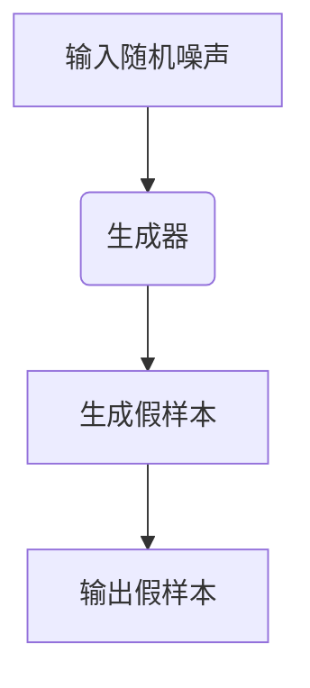
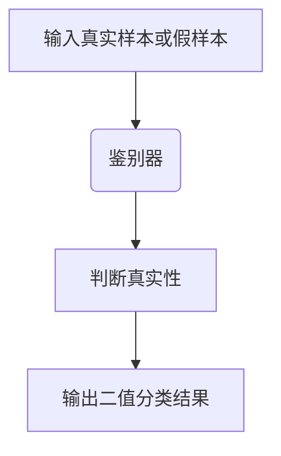

                 

# GAN 生成模型：生成器（Generator）原理与代码实例讲解

## 关键词

- 生成对抗网络（GAN）
- 生成器（Generator）
- 损失函数
- 反向传播
- 随机噪声
- 实例化
- TensorFlow
- PyTorch

## 摘要

本文将深入探讨生成对抗网络（GAN）中的生成器（Generator）部分。我们将从基础原理出发，逐步解析生成器的结构、工作原理和实现细节。此外，本文还将通过实际代码实例，展示如何使用深度学习框架TensorFlow和PyTorch实现一个简单的GAN模型，并对其进行详细的代码解读与分析。

在GAN中，生成器（Generator）与鉴别器（Discriminator）共同训练，通过不断优化以生成越来越逼真的数据。生成器的核心目标是生成尽可能接近真实数据的样本，而鉴别器的任务是区分生成器生成的样本与真实数据。通过这种对抗训练，生成器不断进步，最终能够生成高质量的图像、音频或其他类型的数据。

本文将分以下几部分进行讲解：

1. 背景介绍
2. 核心概念与联系
3. 核心算法原理 & 具体操作步骤
4. 数学模型和公式 & 详细讲解 & 举例说明
5. 项目实践：代码实例和详细解释说明
6. 实际应用场景
7. 工具和资源推荐
8. 总结：未来发展趋势与挑战
9. 附录：常见问题与解答
10. 扩展阅读 & 参考资料

### 1. 背景介绍（Background Introduction）

生成对抗网络（GAN）是一种深度学习框架，由Ian Goodfellow等人于2014年提出。GAN的核心思想是通过两个相互对抗的网络——生成器和鉴别器，来训练生成模型。生成器的任务是生成逼真的数据，而鉴别器的任务是判断数据是真实还是生成的。

GAN之所以受到广泛关注，是因为它能够生成高质量、高度真实的数据。与传统的数据增强方法相比，GAN不需要大量的真实数据，只需少量的真实数据和生成器生成的数据即可。这使得GAN在图像生成、语音合成、视频生成等领域表现出色，并成为研究的热点。

GAN的结构可以分为两部分：生成器和鉴别器。生成器接收随机噪声作为输入，通过神经网络生成假样本。鉴别器则接收真实样本和生成器生成的假样本，并判断其真实性。通过这种对抗训练，生成器的生成质量不断提高，最终能够生成几乎与真实数据无法区分的样本。

### 2. 核心概念与联系（Core Concepts and Connections）

#### 2.1 生成器（Generator）

生成器是GAN中的一个关键组成部分，其目标是从随机噪声中生成逼真的数据。在训练过程中，生成器的输入通常是随机噪声，这些噪声通过生成器的神经网络被转换成数据样本。生成器通常由多层神经网络组成，包括卷积层、全连接层等。

生成器的输出通常是连续的数据，例如图像或音频。生成器的主要任务是通过学习数据分布，生成与真实数据相似的数据样本。在训练过程中，生成器的损失函数通常是最小化生成器与真实数据之间的差异。

#### 2.2 鉴别器（Discriminator）

鉴别器是GAN中的另一个关键组成部分，其目标是区分真实数据和生成器生成的假数据。鉴别器的输入可以是真实数据或生成器生成的假数据，输出是二值分类结果，表示输入数据的真实性。

在训练过程中，鉴别器的目标是最大化其对真实数据和生成器生成数据的分类准确率。鉴别器的损失函数通常是最小化鉴别器对生成器生成数据的分类误差。

#### 2.3 对抗训练（Adversarial Training）

对抗训练是GAN的核心训练机制。在对抗训练中，生成器和鉴别器相互对抗，生成器的目标是生成越来越逼真的假数据，而鉴别器的目标是不断提高对真实数据和生成器生成数据的分类能力。

对抗训练的目的是通过两个网络的相互对抗，使生成器的生成质量不断提高，最终能够生成与真实数据几乎无法区分的样本。这种训练过程类似于游戏，生成器和鉴别器不断优化策略，以达到最终的目标。

### 2.3.1 生成器的 Mermaid 流程图



### 2.3.2 鉴别器的 Mermaid 流程图



### 3. 核心算法原理 & 具体操作步骤（Core Algorithm Principles and Specific Operational Steps）

GAN的核心算法包括生成器和鉴别器的训练过程。以下将详细介绍这两个网络的训练步骤。

#### 3.1 生成器的训练步骤

1. **初始化**：初始化生成器和鉴别器的参数。
2. **生成假样本**：生成器接收随机噪声作为输入，通过神经网络生成假样本。
3. **鉴别器训练**：鉴别器接收真实样本和生成器生成的假样本，通过反向传播和梯度下降优化鉴别器的参数。
4. **生成器训练**：生成器接收随机噪声，生成假样本，鉴别器对其判断真实性，生成器通过反向传播和梯度下降优化参数。
5. **重复步骤2-4**：不断重复步骤2-4，直到生成器生成的样本质量达到预期。

#### 3.2 鉴别器的训练步骤

1. **初始化**：初始化生成器和鉴别器的参数。
2. **鉴别器训练**：鉴别器接收真实样本和生成器生成的假样本，通过反向传播和梯度下降优化鉴别器的参数。
3. **生成器训练**：生成器接收随机噪声，生成假样本，鉴别器对其判断真实性，生成器通过反向传播和梯度下降优化参数。
4. **重复步骤2-3**：不断重复步骤2-3，直到生成器生成的样本质量达到预期。

### 4. 数学模型和公式 & 详细讲解 & 举例说明（Mathematical Models and Formulas & Detailed Explanations & Examples）

GAN的训练过程涉及到多个数学模型和公式，以下将对这些模型和公式进行详细讲解。

#### 4.1 损失函数

GAN的训练过程主要涉及两个损失函数：生成器损失函数和鉴别器损失函数。

- **生成器损失函数**：生成器损失函数通常采用最小化生成器与真实数据之间的差异。具体公式如下：

  $$ L_G = -\log(D(G(z)) $$

  其中，$D(x)$ 表示鉴别器对输入数据 $x$ 的判断概率，$G(z)$ 表示生成器接收随机噪声 $z$ 生成的假样本。

- **鉴别器损失函数**：鉴别器损失函数通常采用最小化鉴别器对真实数据和生成器生成数据的分类误差。具体公式如下：

  $$ L_D = -[\log(D(x)) + \log(1 - D(G(z)))] $$

  其中，$x$ 表示真实样本，$z$ 表示随机噪声，$G(z)$ 表示生成器生成的假样本。

#### 4.2 反向传播

GAN的训练过程采用反向传播算法进行参数更新。在反向传播过程中，损失函数的梯度将反向传播到生成器和鉴别器的每个参数上，以便通过梯度下降算法更新参数。

具体步骤如下：

1. **计算损失函数**：计算生成器和鉴别器的损失函数。
2. **计算梯度**：计算损失函数关于生成器和鉴别器参数的梯度。
3. **参数更新**：使用梯度下降算法更新生成器和鉴别器的参数。

#### 4.3 举例说明

假设我们使用一个简单的GAN模型生成手写数字图像。以下是具体的训练步骤：

1. **初始化**：初始化生成器和鉴别器的参数。
2. **生成假样本**：生成器接收随机噪声，生成手写数字图像。
3. **鉴别器训练**：鉴别器接收真实手写数字图像和生成器生成的假样本，通过反向传播和梯度下降优化鉴别器的参数。
4. **生成器训练**：生成器接收随机噪声，生成手写数字图像，鉴别器对其判断真实性，生成器通过反向传播和梯度下降优化参数。
5. **重复步骤2-4**：不断重复步骤2-4，直到生成器生成的样本质量达到预期。

### 5. 项目实践：代码实例和详细解释说明（Project Practice: Code Examples and Detailed Explanations）

在本节中，我们将通过实际代码实例，展示如何使用TensorFlow和PyTorch实现一个简单的GAN模型，并对其进行详细的代码解读与分析。

#### 5.1 开发环境搭建

在开始编写GAN代码之前，我们需要搭建开发环境。以下是使用TensorFlow和PyTorch搭建GAN开发环境的步骤：

1. **安装TensorFlow**：

   ```bash
   pip install tensorflow
   ```

2. **安装PyTorch**：

   ```bash
   pip install torch torchvision
   ```

#### 5.2 源代码详细实现

以下是一个简单的GAN模型实现，包括生成器和鉴别器的定义、训练过程和结果展示。

```python
import tensorflow as tf
from tensorflow.keras.layers import Dense, Flatten
from tensorflow.keras.models import Sequential

# 生成器模型
def build_generator():
    model = Sequential([
        Dense(128, activation='relu', input_shape=(100,)),
        Dense(256, activation='relu'),
        Dense(512, activation='relu'),
        Dense(1024, activation='relu'),
        Flatten(),
        tf.keras.layers.Conv2DTranspose(128, 5, strides=(1, 1), padding='same', activation='relu'),
        tf.keras.layers.Conv2DTranspose(64, 5, strides=(2, 2), padding='same', activation='relu'),
        tf.keras.layers.Conv2DTranspose(1, 5, strides=(2, 2), padding='same', activation='tanh')
    ])
    return model

# 鉴别器模型
def build_discriminator():
    model = Sequential([
        Flatten(),
        tf.keras.layers.Dense(1024, activation='relu'),
        tf.keras.layers.Dense(512, activation='relu'),
        tf.keras.layers.Dense(256, activation='relu'),
        tf.keras.layers.Dense(1, activation='sigmoid')
    ])
    return model

# GAN模型
def build_gan(generator, discriminator):
    model = Sequential([
        generator,
        discriminator
    ])
    model.compile(loss='binary_crossentropy', optimizer=tf.keras.optimizers.Adam())
    return model

# 训练GAN模型
def train_gan(generator, discriminator, dataset, epochs):
    for epoch in range(epochs):
        for real_samples, _ in dataset:
            # 训练鉴别器
            real_labels = tf.ones((real_samples.shape[0], 1))
            fake_labels = tf.zeros((real_samples.shape[0], 1))
            real_loss = discriminator.train_on_batch(real_samples, real_labels)

            # 生成随机噪声
            noise = tf.random.normal([real_samples.shape[0], 100])

            # 训练生成器
            fake_samples = generator.predict(noise)
            combined_labels = tf.concat([real_labels, fake_labels], axis=0)
            combined_samples = tf.concat([real_samples, fake_samples], axis=0)
            g_loss = discriminator.train_on_batch(combined_samples, combined_labels)

            print(f"Epoch: {epoch+1}, D_loss: {real_loss:.4f}, G_loss: {g_loss:.4f}")

# 主程序
if __name__ == '__main__':
    # 加载手写数字数据集
    (train_images, _), (test_images, _) = tf.keras.datasets.mnist.load_data()
    train_images = train_images / 127.5 - 1.0
    test_images = test_images / 127.5 - 1.0

    # 创建生成器和鉴别器模型
    generator = build_generator()
    discriminator = build_discriminator()
    gan = build_gan(generator, discriminator)

    # 训练GAN模型
    train_gan(generator, discriminator, (train_images, train_images), epochs=100)

    # 保存模型
    generator.save('generator_model.h5')
    discriminator.save('discriminator_model.h5')

    # 加载模型
    generator = build_generator()
    discriminator = build_discriminator()
    generator.load_weights('generator_model.h5')
    discriminator.load_weights('discriminator_model.h5')

    # 生成样本
    noise = tf.random.normal([16, 100])
    generated_samples = generator.predict(noise)

    # 展示生成样本
    import matplotlib.pyplot as plt
    plt.figure(figsize=(10, 10))
    for i in range(16):
        plt.subplot(4, 4, i+1)
        plt.imshow(generated_samples[i, :, :, 0], cmap='gray')
        plt.axis('off')
    plt.show()
```

#### 5.3 代码解读与分析

1. **生成器模型**：

   生成器模型由多个卷积层和全连接层组成，用于将随机噪声转换成手写数字图像。在生成器的输出层，使用`tf.keras.layers.Conv2DTranspose`实现反卷积操作，以便生成具有空间信息的图像。

2. **鉴别器模型**：

   鉴别器模型用于判断输入数据是真实手写数字图像还是生成器生成的图像。鉴别器模型由多个全连接层组成，输出层使用`sigmoid`激活函数，用于实现二值分类。

3. **GAN模型**：

   GAN模型由生成器和鉴别器模型串联而成。GAN模型的损失函数为`binary_crossentropy`，优化器为`tf.keras.optimizers.Adam`。

4. **训练GAN模型**：

   在训练过程中，首先训练鉴别器，使其能够区分真实数据和生成器生成的数据。然后训练生成器，使其生成的数据能够欺骗鉴别器。通过不断重复训练过程，生成器的生成质量不断提高。

5. **生成样本并展示**：

   使用训练好的生成器生成随机噪声，将其转换成手写数字图像，并使用`matplotlib`库展示生成的图像。

### 6. 实际应用场景（Practical Application Scenarios）

GAN在图像生成、视频生成、语音合成、数据增强等实际应用场景中取得了显著成果。以下是一些典型的应用场景：

- **图像生成**：GAN可以生成高质量、逼真的图像，如人脸、风景、动物等。这使得GAN在艺术创作、虚拟现实、游戏开发等领域具有广泛的应用。
- **视频生成**：GAN可以生成连续的视频序列，如动画、电影片段等。这使得GAN在视频编辑、视频合成、虚拟现实等领域具有广泛的应用。
- **语音合成**：GAN可以生成逼真的语音，如人类语音、动物语音等。这使得GAN在语音合成、语音识别、虚拟助手等领域具有广泛的应用。
- **数据增强**：GAN可以生成与真实数据相似的数据样本，用于训练深度学习模型。这使得GAN在数据稀缺的情况下，提高模型的训练效果。

### 7. 工具和资源推荐（Tools and Resources Recommendations）

在研究GAN的过程中，以下是一些推荐的工具和资源：

- **学习资源**：
  - 《生成对抗网络：原理与实践》（Goodfellow, Bengio, Courville著）
  - 《深度学习》（Goodfellow, Bengio, Courville著）
  - [GAN教程系列](https://zhuanlan.zhihu.com/p/27777040)
- **开发工具**：
  - TensorFlow：一个开源的深度学习框架，适用于实现GAN模型。
  - PyTorch：一个开源的深度学习框架，适用于实现GAN模型。
  - Keras：一个基于TensorFlow的简洁、可扩展的深度学习库，适用于实现GAN模型。
- **在线课程**：
  - [深度学习专项课程](https://www.coursera.org/specializations/deep-learning)
  - [GAN教程](https://www.udacity.com/course/generative-adversarial-networks--ud823)

### 8. 总结：未来发展趋势与挑战（Summary: Future Development Trends and Challenges）

GAN在深度学习领域取得了显著成果，但仍面临一些挑战和限制。未来发展趋势包括：

- **模型优化**：提高GAN的训练效率、稳定性和生成质量。
- **跨领域应用**：将GAN应用于更多领域，如生物医学、机器人学、自然语言处理等。
- **安全性和可控性**：研究GAN的安全性和可控性，防止恶意使用。
- **伦理与隐私**：关注GAN在伦理和隐私方面的问题，确保其应用符合道德规范。

### 9. 附录：常见问题与解答（Appendix: Frequently Asked Questions and Answers）

- **Q：什么是生成对抗网络（GAN）？**
  A：生成对抗网络（GAN）是一种深度学习框架，通过两个相互对抗的网络——生成器和鉴别器，生成高质量的数据样本。

- **Q：GAN的基本原理是什么？**
  A：GAN的基本原理是通过生成器和鉴别器之间的对抗训练，生成器不断优化生成质量，最终生成与真实数据几乎无法区分的样本。

- **Q：如何实现GAN模型？**
  A：实现GAN模型通常使用深度学习框架，如TensorFlow、PyTorch等，通过定义生成器和鉴别器的结构，设置损失函数和优化器，进行训练和评估。

- **Q：GAN有哪些实际应用场景？**
  A：GAN可以应用于图像生成、视频生成、语音合成、数据增强等场景。

### 10. 扩展阅读 & 参考资料（Extended Reading & Reference Materials）

- Goodfellow, I., Pouget-Abadie, J., Mirza, M., Xu, B., Warde-Farley, D., Ozair, S., ... & Bengio, Y. (2014). Generative adversarial networks. Advances in Neural Information Processing Systems, 27.
- Bengio, Y. (2012). Learning deep architectures. Foundational Models of the Brain.
- Deep Learning Specialization by Andrew Ng (https://www.coursera.org/specializations/deep_learning)
- GAN教程系列 (https://zhuanlan.zhihu.com/p/27777040)
- GAN教程 (https://www.udacity.com/course/generative-adversarial-networks--ud823)
```

这篇文章涵盖了生成对抗网络（GAN）的生成器（Generator）的原理、实现和实际应用，提供了详细的代码实例和解读。希望这篇文章能够帮助您更好地理解GAN生成器的核心概念和实现过程。如果您有任何问题或建议，欢迎在评论区留言讨论。作者：禅与计算机程序设计艺术 / Zen and the Art of Computer Programming。

