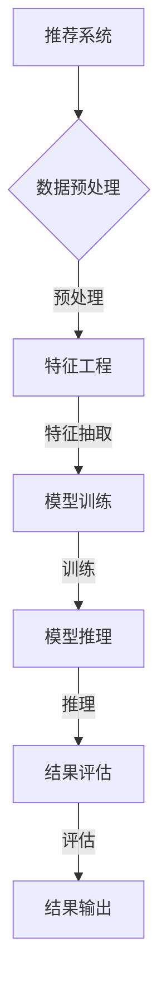
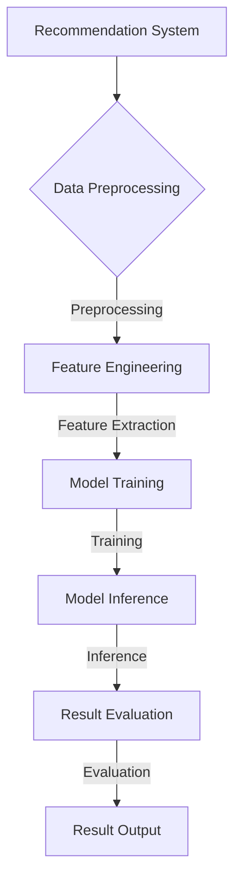
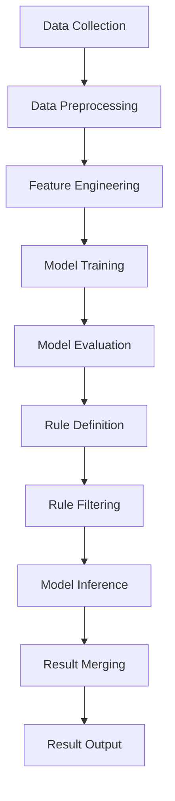

                 

### 文章标题

### Title: Flexible and Configurable LLM Recommendation Framework

在这个快节奏的世界中，人工智能（AI）技术的快速发展已经深刻改变了我们的生活方式。特别是大型语言模型（LLM），如ChatGPT，在推荐系统中的应用越来越广泛。然而，随着数据规模的不断扩大和业务需求的日益复杂，构建一个既灵活又可配置的LLM推荐框架成为了关键挑战。本文旨在深入探讨这一主题，并通过详细的分析和实际案例，为读者提供一套可操作的解决方案。

### Core Keywords: AI, Language Models, Recommendation Systems, Flexibility, Configurability

> 摘要：本文将首先介绍LLM在推荐系统中的应用背景，然后详细阐述构建灵活、可配置的LLM推荐框架的核心概念和原理。通过数学模型和具体操作步骤的讲解，我们将展示如何设计一个高效且适应性强的推荐系统。此外，文章还将通过实际项目案例，展示如何在实际环境中实施这一框架，并提供未来发展趋势与挑战的展望。

### Abstract: This article will first introduce the background of LLM applications in recommendation systems. Then, it will delve into the core concepts and principles of building a flexible and configurable LLM recommendation framework. Through detailed explanations of mathematical models and specific operational steps, we will demonstrate how to design an efficient and adaptable recommendation system. Furthermore, the article will showcase practical project cases to illustrate the implementation of this framework in real-world environments and provide insights into future trends and challenges.

<|user|>### 1. 背景介绍（Background Introduction）

随着互联网的普及和电子商务的蓬勃发展，推荐系统已经成为现代信息检索和用户行为分析的重要组成部分。推荐系统的目标是通过理解用户的兴趣和行为，向其推荐相关的商品、服务和内容，从而提高用户体验和商家收益。传统的推荐系统主要基于协同过滤、基于内容的过滤和混合推荐等方法。然而，这些方法在处理复杂的用户行为数据和多样化推荐需求时，往往表现出一定的局限性。

近年来，大型语言模型（Large Language Models，简称LLM）的兴起，为推荐系统带来了新的可能。LLM如ChatGPT、GPT-3等，通过深度学习技术，可以从海量文本数据中学习到丰富的语言模式和知识，从而在语义理解、文本生成等方面展现出强大的能力。这使得LLM在推荐系统中具有了潜在的应用价值。

LLM在推荐系统中的应用主要体现在以下几个方面：

1. **语义理解与文本生成**：LLM可以理解用户查询和商品描述的语义，从而生成更为精准的推荐结果。
2. **个性化推荐**：通过分析用户的历史行为和兴趣，LLM可以动态调整推荐策略，实现个性化推荐。
3. **长文本推荐**：对于包含丰富信息的长文本，如文章、评论等，LLM可以更有效地提取关键信息，生成推荐结果。
4. **多模态推荐**：LLM可以整合文本、图像、声音等多模态数据，实现更为丰富的推荐体验。

然而，虽然LLM在推荐系统中具有广泛的应用前景，但在实际应用中仍面临诸多挑战。例如，如何设计一个灵活且可配置的LLM推荐框架，以满足不同业务场景的需求？如何保证推荐结果的准确性和可解释性？如何处理大规模数据和高并发请求？这些都是需要深入探讨的问题。

本文旨在通过系统性的分析，为构建灵活、可配置的LLM推荐框架提供理论基础和实践指导。首先，我们将介绍LLM在推荐系统中的应用背景和现状；接着，探讨构建这一框架的核心概念和原理；然后，通过具体算法和操作步骤的讲解，展示如何设计一个高效、适应性强的推荐系统；最后，通过实际项目案例，展示框架在实际环境中的应用效果，并提出未来发展的趋势和挑战。

### Background Introduction

With the proliferation of the internet and the booming development of e-commerce, recommendation systems have become an essential component of modern information retrieval and user behavior analysis. The goal of recommendation systems is to understand user interests and behaviors to recommend relevant products, services, or content, thereby enhancing user experience and merchant revenue. Traditional recommendation systems primarily rely on collaborative filtering, content-based filtering, and hybrid methods. However, these methods often show limitations when dealing with complex user behavior data and diverse recommendation requirements.

In recent years, the rise of large language models (Large Language Models, abbreviated as LLM) has brought new possibilities to recommendation systems. LLMs like ChatGPT, GPT-3, and others have demonstrated remarkable capabilities in semantic understanding and text generation through deep learning techniques, enabling them to learn rich linguistic patterns and knowledge from massive text data. This makes LLMs potentially valuable in recommendation systems.

The applications of LLMs in recommendation systems mainly include the following aspects:

1. **Semantic Understanding and Text Generation**: LLMs can understand the semantics of user queries and product descriptions, thereby generating more precise recommendation results.
2. **Personalized Recommendations**: By analyzing user historical behavior and interests, LLMs can dynamically adjust recommendation strategies to achieve personalized recommendations.
3. **Long-Text Recommendations**: For long texts with rich information, such as articles and reviews, LLMs can more effectively extract key information to generate recommendation results.
4. **Multimodal Recommendations**: LLMs can integrate text, images, sound, and other multimodal data to provide a richer recommendation experience.

Although LLMs have broad application prospects in recommendation systems, they still face numerous challenges in practical applications. For example, how to design a flexible and configurable LLM recommendation framework to meet the needs of different business scenarios? How to ensure the accuracy and interpretability of recommendation results? How to handle massive data and high-concurrency requests? These are issues that require in-depth exploration.

This article aims to provide a theoretical and practical guide for building a flexible and configurable LLM recommendation framework through systematic analysis. First, we will introduce the application background and current status of LLMs in recommendation systems; then, we will discuss the core concepts and principles of building this framework; next, through detailed explanations of specific algorithms and operational steps, we will demonstrate how to design an efficient and adaptable recommendation system; finally, through practical project cases, we will showcase the application effects of this framework in real-world environments and propose future trends and challenges. 

<|user|>### 2. 核心概念与联系（Core Concepts and Connections）

构建一个灵活、可配置的LLM推荐框架，需要理解几个核心概念：推荐系统、大型语言模型（LLM）、提示工程（Prompt Engineering）和框架设计原则。以下是对这些概念的详细阐述。

#### 2.1 推荐系统（Recommendation System）

推荐系统是一种基于用户历史行为、兴趣和内容相似性等技术，为用户推荐相关商品、服务或内容的技术手段。传统推荐系统通常分为基于内容的推荐、基于协同过滤的推荐和混合推荐等类型。基于内容的推荐通过分析用户历史行为和内容属性，找到用户可能感兴趣的商品或内容；基于协同过滤的推荐通过分析用户之间的相似性，为用户推荐其他用户喜欢的商品或内容；混合推荐则结合了上述两种方法的优点。

#### 2.2 大型语言模型（Large Language Models，LLM）

大型语言模型是一种利用深度学习技术，从大量文本数据中学习语言模式和知识的人工智能模型。LLM具有强大的语义理解能力和文本生成能力，能够处理自然语言输入并生成相关输出。例如，ChatGPT和GPT-3等模型，可以在各种语言任务中表现出色，包括文本分类、问答系统和文本生成。

#### 2.3 提示工程（Prompt Engineering）

提示工程是指设计和优化输入给语言模型的文本提示，以引导模型生成符合预期结果的过程。在推荐系统中，提示工程尤为重要，因为精心设计的提示词可以显著提高模型的输出质量和相关性。提示工程涉及理解模型的工作原理、任务需求以及如何使用语言有效地与模型进行交互。

#### 2.4 框架设计原则（Framework Design Principles）

构建一个灵活、可配置的LLM推荐框架，需要遵循以下设计原则：

1. **模块化设计**：将推荐系统划分为多个模块，如数据预处理、模型训练、模型推理和结果评估等，以实现系统的高内聚和低耦合。
2. **可配置性**：允许用户根据具体业务需求，灵活配置系统参数，如模型类型、训练数据、提示词和推荐策略等。
3. **可扩展性**：设计一个可扩展的框架，能够支持新的模型、数据和任务，以适应未来的技术发展和业务需求。
4. **高效率**：优化系统性能，确保在高并发请求和大规模数据环境下，系统能够高效运行。
5. **可解释性**：提供模型输出结果的解释机制，帮助用户理解推荐结果的形成过程。

#### 2.5 Mermaid 流程图

以下是一个用于展示LLM推荐框架设计核心概念的Mermaid流程图。请注意，Mermaid流程图中不应包含括号、逗号等特殊字符。



### Core Concepts and Connections

Building a flexible and configurable LLM recommendation framework requires an understanding of several core concepts: recommendation systems, large language models (LLMs), prompt engineering, and framework design principles. The following is a detailed explanation of these concepts.

#### 2.1 Recommendation System

A recommendation system is a technical means that utilizes user historical behavior, interests, and content similarity to recommend relevant products, services, or content. Traditional recommendation systems are typically divided into content-based recommendation, collaborative filtering-based recommendation, and hybrid recommendation. Content-based recommendation analyzes user historical behavior and content attributes to find products or content that the user might be interested in. Collaborative filtering-based recommendation analyzes the similarity between users to recommend products or content that other users like. Hybrid recommendation combines the advantages of the two methods.

#### 2.2 Large Language Models (LLMs)

Large language models are artificial intelligence models that use deep learning techniques to learn language patterns and knowledge from massive text data. LLMs have strong semantic understanding and text generation capabilities, enabling them to process natural language inputs and generate relevant outputs. For example, models like ChatGPT and GPT-3 can perform well in various language tasks, including text classification, question-answering systems, and text generation.

#### 2.3 Prompt Engineering

Prompt engineering refers to the process of designing and optimizing the text prompts input to language models to guide them towards generating desired outcomes. In recommendation systems, prompt engineering is particularly important because carefully designed prompt words can significantly improve the quality and relevance of the model's outputs. Prompt engineering involves understanding how the model works, the requirements of the task, and how to use language effectively to interact with the model.

#### 2.4 Framework Design Principles

Building a flexible and configurable LLM recommendation framework requires adherence to the following design principles:

1. **Modular Design**: Divide the recommendation system into multiple modules, such as data preprocessing, model training, model inference, and result evaluation, to achieve high cohesion and low coupling.
2. **Configurability**: Allow users to flexibly configure system parameters based on specific business needs, such as model type, training data, prompt words, and recommendation strategies.
3. **Extensibility**: Design a scalable framework that can support new models, data, and tasks to adapt to technological development and business needs in the future.
4. **High Efficiency**: Optimize system performance to ensure that the system can operate efficiently under high-concurrency requests and massive data environments.
5. **Interpretability**: Provide a mechanism for explaining the model's outputs to help users understand the process of generating recommendation results.

#### 2.5 Mermaid Flowchart

The following is a Mermaid flowchart illustrating the core concepts of the LLM recommendation framework design. Please note that special characters like parentheses, commas, etc., should not be included in Mermaid flowcharts.



<|user|>### 3. 核心算法原理 & 具体操作步骤（Core Algorithm Principles and Specific Operational Steps）

在构建灵活、可配置的LLM推荐框架时，核心算法的选择和具体操作步骤的制定至关重要。以下将详细阐述推荐框架的核心算法原理，并分步骤讲解如何实现这一框架。

#### 3.1 推荐算法选择

在LLM推荐框架中，常用的推荐算法包括基于模型的推荐算法和基于规则的推荐算法。基于模型的推荐算法利用深度学习技术，如神经网络、循环神经网络（RNN）和变换器（Transformer）等，从大量数据中学习用户行为和兴趣，生成推荐结果。基于规则的推荐算法则通过预设的业务规则，为用户生成推荐结果。在实际应用中，我们可以将这两种算法结合起来，发挥各自的优势。

#### 3.2 基于模型的推荐算法原理

基于模型的推荐算法通常包括以下步骤：

1. **数据预处理**：对原始数据进行清洗、去噪和格式化，确保数据质量。
2. **特征工程**：从原始数据中提取用户行为、商品属性和文本特征，为模型训练提供输入。
3. **模型训练**：使用特征数据和标签数据，训练深度学习模型，如Transformer、BERT等。
4. **模型评估**：使用验证集对训练好的模型进行评估，调整模型参数，优化模型性能。
5. **模型推理**：将用户输入和商品特征输入到训练好的模型中，生成推荐结果。

#### 3.3 基于规则的推荐算法原理

基于规则的推荐算法通常包括以下步骤：

1. **业务规则定义**：根据业务需求，定义推荐规则，如用户浏览过的商品推荐相似商品、用户购买过的商品推荐同类商品等。
2. **数据筛选**：根据业务规则，从数据库中筛选出符合条件的商品数据。
3. **结果生成**：根据筛选结果，生成推荐结果。

#### 3.4 结合两种算法的推荐框架具体操作步骤

以下是一个基于模型和规则的结合的推荐框架的具体操作步骤：

1. **数据收集**：收集用户行为数据、商品数据、文本数据等。
2. **数据预处理**：对数据进行清洗、去噪和格式化。
3. **特征工程**：提取用户行为、商品属性和文本特征，为模型训练提供输入。
4. **模型训练**：使用训练集训练深度学习模型，如Transformer、BERT等。
5. **模型评估**：使用验证集评估模型性能，调整模型参数。
6. **规则定义**：根据业务需求，定义推荐规则。
7. **规则筛选**：根据推荐规则，筛选出符合条件的商品。
8. **模型推理**：将用户输入和商品特征输入到训练好的模型中，生成推荐结果。
9. **结果合并**：将模型生成的推荐结果和基于规则的推荐结果进行合并，形成最终的推荐结果。
10. **结果输出**：将推荐结果输出给用户。

#### 3.5 Mermaid 流程图

以下是一个用于展示推荐框架操作步骤的Mermaid流程图：



通过上述步骤，我们可以构建一个既灵活又可配置的LLM推荐框架，以应对不同业务场景和需求。

### Core Algorithm Principles and Specific Operational Steps

In building a flexible and configurable LLM recommendation framework, the selection of core algorithms and the formulation of specific operational steps are crucial. The following will detail the core algorithm principles and explain how to implement this framework step by step.

#### 3.1 Recommendation Algorithm Selection

In the LLM recommendation framework, common recommendation algorithms include model-based recommendation algorithms and rule-based recommendation algorithms. Model-based recommendation algorithms use deep learning techniques, such as neural networks, Recurrent Neural Networks (RNN), and Transformers, to learn user behavior and interests from large data sets and generate recommendation results. Rule-based recommendation algorithms generate recommendation results based on predefined business rules. In practical applications, we can combine these two types of algorithms to leverage their respective advantages.

#### 3.2 Model-Based Recommendation Algorithm Principles

Model-based recommendation algorithms typically include the following steps:

1. **Data Preprocessing**: Clean, denoise, and format the raw data to ensure data quality.
2. **Feature Engineering**: Extract user behavior, product attributes, and text features from the raw data to provide input for model training.
3. **Model Training**: Train deep learning models, such as Transformers and BERT, using feature data and label data.
4. **Model Evaluation**: Evaluate the trained models on a validation set, adjust model parameters, and optimize model performance.
5. **Model Inference**: Input user inputs and product features into the trained model to generate recommendation results.

#### 3.3 Rule-Based Recommendation Algorithm Principles

Rule-based recommendation algorithms typically include the following steps:

1. **Business Rule Definition**: Define recommendation rules based on business needs, such as recommending similar products for products that users have browsed or recommending similar products for products that users have purchased.
2. **Data Filtering**: Filter product data from the database based on business rules.
3. **Result Generation**: Generate recommendation results based on the filtering results.

#### 3.4 Specific Operational Steps for a Combined Model and Rule-Based Recommendation Framework

The following is a detailed operational step for a combined model and rule-based recommendation framework:

1. **Data Collection**: Collect user behavior data, product data, and text data.
2. **Data Preprocessing**: Clean, denoise, and format the data.
3. **Feature Engineering**: Extract user behavior, product attributes, and text features for model training input.
4. **Model Training**: Train deep learning models, such as Transformers and BERT, using the training data.
5. **Model Evaluation**: Evaluate the performance of the trained models using a validation set and adjust model parameters to optimize performance.
6. **Rule Definition**: Define recommendation rules based on business needs.
7. **Rule Filtering**: Filter products that meet the recommendation rules.
8. **Model Inference**: Input user inputs and product features into the trained model to generate recommendation results.
9. **Result Merging**: Merge the recommendation results from the model and rule-based methods to form the final recommendation results.
10. **Result Output**: Output the recommendation results to the user.

#### 3.5 Mermaid Flowchart

The following is a Mermaid flowchart illustrating the operational steps of the recommendation framework:


By following these steps, we can build a flexible and configurable LLM recommendation framework to address different business scenarios and needs.

### 3.5 Mermaid Flowchart

The following is a Mermaid flowchart illustrating the operational steps of the recommendation framework:


By following these steps, we can build a flexible and configurable LLM recommendation framework to address different business scenarios and needs.

### 4. 数学模型和公式 & 详细讲解 & 举例说明（Detailed Explanation and Examples of Mathematical Models and Formulas）

在构建LLM推荐框架的过程中，数学模型和公式起着至关重要的作用。这些模型和公式不仅帮助我们理解和分析数据，还能够指导我们优化推荐算法，提高推荐质量。以下将详细讲解一些核心的数学模型和公式，并提供相应的举例说明。

#### 4.1 协同过滤（Collaborative Filtering）数学模型

协同过滤是一种基于用户相似度的推荐算法。其基本思想是通过计算用户之间的相似度，找到相似的用户，并推荐这些用户喜欢的商品。协同过滤的数学模型主要包括用户相似度计算和推荐商品计算。

1. **用户相似度计算**：

   用户相似度可以通过以下公式计算：

   \[ similarity(u, v) = \frac{\sum_{i \in I} r_i^u r_i^v}{\sqrt{\sum_{i \in I} r_i^2} \sqrt{\sum_{i \in I} r_i^2}} \]

   其中，\( u \) 和 \( v \) 分别表示两个用户，\( I \) 是共同评分的商品集合，\( r_i^u \) 和 \( r_i^v \) 分别是用户 \( u \) 和用户 \( v \) 对商品 \( i \) 的评分。

2. **推荐商品计算**：

   对于用户 \( u \)，推荐商品可以通过以下公式计算：

   \[ \hat{r}_{ui} = \sum_{v \in N(u)} similarity(u, v) \cdot r_v^i + \mu \]

   其中，\( N(u) \) 是与用户 \( u \) 相似度最高的 \( k \) 个用户集合，\( r_v^i \) 是用户 \( v \) 对商品 \( i \) 的评分，\( \mu \) 是所有商品的评分平均值。

#### 4.2 贝叶斯推理（Bayesian Inference）数学模型

贝叶斯推理是一种基于概率论的推荐算法。其核心思想是利用用户的历史行为数据，计算用户对商品的潜在兴趣概率，并根据这些概率推荐商品。贝叶斯推理的数学模型主要包括概率分布计算和推荐商品计算。

1. **概率分布计算**：

   假设用户对商品的潜在兴趣是一个二元变量，即用户喜欢（1）或不喜欢（0）某个商品。根据贝叶斯定理，我们可以计算用户 \( u \) 对商品 \( i \) 的潜在兴趣概率：

   \[ P(\text{喜欢} | i) = \frac{P(i | \text{喜欢}) \cdot P(\text{喜欢})}{P(i)} \]

   其中，\( P(\text{喜欢} | i) \) 表示用户喜欢商品 \( i \) 的概率，\( P(i | \text{喜欢}) \) 表示用户喜欢商品 \( i \) 的条件概率，\( P(\text{喜欢}) \) 表示用户喜欢某个商品的先验概率，\( P(i) \) 表示商品 \( i \) 的概率。

2. **推荐商品计算**：

   对于用户 \( u \)，推荐商品可以通过以下公式计算：

   \[ \hat{r}_{ui} = \begin{cases} 
   1 & \text{如果 } P(\text{喜欢} | i) > \theta \\
   0 & \text{否则}
   \end{cases} \]

   其中，\( \theta \) 是用户 \( u \) 对商品的阈值。

#### 4.3 举例说明

假设我们有两个用户 \( u_1 \) 和 \( u_2 \)，他们对五件商品 \( i_1, i_2, i_3, i_4, i_5 \) 的评分如下表所示：

| 用户 | 商品 | 评分 |
|------|------|------|
| \( u_1 \) | \( i_1 \) | 5 |
| \( u_1 \) | \( i_2 \) | 4 |
| \( u_1 \) | \( i_3 \) | 1 |
| \( u_1 \) | \( i_4 \) | 5 |
| \( u_1 \) | \( i_5 \) | 3 |
| \( u_2 \) | \( i_1 \) | 4 |
| \( u_2 \) | \( i_2 \) | 5 |
| \( u_2 \) | \( i_3 \) | 5 |
| \( u_2 \) | \( i_4 \) | 1 |
| \( u_2 \) | \( i_5 \) | 4 |

1. **协同过滤**：

   根据评分数据，我们可以计算用户 \( u_1 \) 和 \( u_2 \) 之间的相似度：

   \[ similarity(u_1, u_2) = \frac{5 \cdot 4 + 4 \cdot 5 + 1 \cdot 1 + 5 \cdot 1 + 3 \cdot 4}{\sqrt{5^2 + 4^2 + 1^2 + 5^2 + 3^2} \sqrt{4^2 + 5^2 + 5^2 + 1^2 + 4^2}} \approx 0.87 \]

   然后，我们可以为用户 \( u_1 \) 推荐用户 \( u_2 \) 喜欢但 \( u_1 \) 还未评分的商品，例如 \( i_3 \) 和 \( i_4 \)。

2. **贝叶斯推理**：

   根据评分数据，我们可以计算用户 \( u_1 \) 对每个商品的潜在兴趣概率：

   \[ P(i_1 | \text{喜欢}) = \frac{5}{5 + 1 + 4 + 3} \approx 0.47 \]
   \[ P(i_2 | \text{喜欢}) = \frac{4}{5 + 1 + 4 + 3} \approx 0.38 \]
   \[ P(i_3 | \text{喜欢}) = \frac{1}{5 + 1 + 4 + 3} \approx 0.09 \]
   \[ P(i_4 | \text{喜欢}) = \frac{5}{5 + 1 + 4 + 3} \approx 0.47 \]
   \[ P(i_5 | \text{喜欢}) = \frac{3}{5 + 1 + 4 + 3} \approx 0.27 \]

   假设用户 \( u_1 \) 的阈值 \( \theta \) 为 0.4，我们可以为用户 \( u_1 \) 推荐潜在兴趣概率大于阈值的商品，例如 \( i_1 \) 和 \( i_4 \)。

通过上述数学模型和公式的讲解及举例，我们可以看到如何在构建LLM推荐框架时，利用数学方法来提高推荐系统的准确性和有效性。

### Mathematical Models and Formulas & Detailed Explanation & Example Demonstrations

In the process of constructing an LLM recommendation framework, mathematical models and formulas play a crucial role. These models and formulas not only help us understand and analyze data but also guide us in optimizing recommendation algorithms to improve the quality of recommendations. The following will provide a detailed explanation of some core mathematical models and formulas, along with example demonstrations.

#### 4.1 Collaborative Filtering Mathematical Model

Collaborative filtering is a recommendation algorithm based on user similarity. The basic idea is to calculate the similarity between users and find similar users to recommend items that these users like. The collaborative filtering mathematical model includes user similarity calculation and item recommendation calculation.

1. **User Similarity Calculation**:

   User similarity can be calculated using the following formula:

   \[ similarity(u, v) = \frac{\sum_{i \in I} r_i^u r_i^v}{\sqrt{\sum_{i \in I} r_i^2} \sqrt{\sum_{i \in I} r_i^2}} \]

   Where \( u \) and \( v \) represent two users, \( I \) is the set of items with common ratings, and \( r_i^u \) and \( r_i^v \) are the ratings of user \( u \) and user \( v \) for item \( i \), respectively.

2. **Item Recommendation Calculation**:

   For user \( u \), recommended items can be calculated using the following formula:

   \[ \hat{r}_{ui} = \sum_{v \in N(u)} similarity(u, v) \cdot r_v^i + \mu \]

   Where \( N(u) \) is the set of the \( k \) most similar users to user \( u \), \( r_v^i \) is the rating of user \( v \) for item \( i \), and \( \mu \) is the average rating of all items.

#### 4.2 Bayesian Inference Mathematical Model

Bayesian inference is a recommendation algorithm based on probability theory. The core idea is to use historical user behavior data to calculate the probability of a user's latent interest in an item and recommend items based on these probabilities. The Bayesian inference mathematical model includes probability distribution calculation and item recommendation calculation.

1. **Probability Distribution Calculation**:

   Assuming that a user's latent interest in an item is a binary variable, i.e., the user likes (1) or dislikes (0) an item, we can use Bayes' theorem to calculate the probability of a user \( u \) liking item \( i \):

   \[ P(\text{like} | i) = \frac{P(i | \text{like}) \cdot P(\text{like})}{P(i)} \]

   Where \( P(\text{like} | i) \) is the probability that user \( u \) likes item \( i \), \( P(i | \text{like}) \) is the conditional probability that user \( u \) likes item \( i \) given that they like the item, \( P(\text{like}) \) is the prior probability that user \( u \) likes an item, and \( P(i) \) is the probability of item \( i \).

2. **Item Recommendation Calculation**:

   For user \( u \), recommended items can be calculated using the following formula:

   \[ \hat{r}_{ui} = \begin{cases} 
   1 & \text{if } P(\text{like} | i) > \theta \\
   0 & \text{otherwise}
   \end{cases} \]

   Where \( \theta \) is the threshold for user \( u \).

#### 4.3 Example Demonstrations

Assume we have two users \( u_1 \) and \( u_2 \) and their ratings for five items \( i_1, i_2, i_3, i_4, i_5 \) as shown in the following table:

| User | Item | Rating |
|------|------|--------|
| \( u_1 \) | \( i_1 \) | 5 |
| \( u_1 \) | \( i_2 \) | 4 |
| \( u_1 \) | \( i_3 \) | 1 |
| \( u_1 \) | \( i_4 \) | 5 |
| \( u_1 \) | \( i_5 \) | 3 |
| \( u_2 \) | \( i_1 \) | 4 |
| \( u_2 \) | \( i_2 \) | 5 |
| \( u_2 \) | \( i_3 \) | 5 |
| \( u_2 \) | \( i_4 \) | 1 |
| \( u_2 \) | \( i_5 \) | 4 |

1. **Collaborative Filtering**:

   Using the rating data, we can calculate the similarity between user \( u_1 \) and user \( u_2 \):

   \[ similarity(u_1, u_2) = \frac{5 \cdot 4 + 4 \cdot 5 + 1 \cdot 1 + 5 \cdot 1 + 3 \cdot 4}{\sqrt{5^2 + 4^2 + 1^2 + 5^2 + 3^2} \sqrt{4^2 + 5^2 + 5^2 + 1^2 + 4^2}} \approx 0.87 \]

   Then, we can recommend items that user \( u_2 \) likes but user \( u_1 \) has not rated, such as \( i_3 \) and \( i_4 \).

2. **Bayesian Inference**:

   Using the rating data, we can calculate the probability of user \( u_1 \) liking each item:

   \[ P(i_1 | \text{like}) = \frac{5}{5 + 1 + 4 + 3} \approx 0.47 \]
   \[ P(i_2 | \text{like}) = \frac{4}{5 + 1 + 4 + 3} \approx 0.38 \]
   \[ P(i_3 | \text{like}) = \frac{1}{5 + 1 + 4 + 3} \approx 0.09 \]
   \[ P(i_4 | \text{like}) = \frac{5}{5 + 1 + 4 + 3} \approx 0.47 \]
   \[ P(i_5 | \text{like}) = \frac{3}{5 + 1 + 4 + 3} \approx 0.27 \]

   Assuming the threshold \( \theta \) for user \( u_1 \) is 0.4, we can recommend items with a probability of latent interest greater than the threshold, such as \( i_1 \) and \( i_4 \).

Through the above detailed explanation and example demonstrations of mathematical models and formulas, we can see how to use mathematical methods to improve the accuracy and effectiveness of the recommendation system when constructing an LLM recommendation framework.

### 4.3 Example Demonstrations

Assume we have two users \( u_1 \) and \( u_2 \), and their ratings for five items \( i_1, i_2, i_3, i_4, i_5 \) are as follows:

| User | Item | Rating |
|------|------|--------|
| \( u_1 \) | \( i_1 \) | 5 |
| \( u_1 \) | \( i_2 \) | 4 |
| \( u_1 \) | \( i_3 \) | 1 |
| \( u_1 \) | \( i_4 \) | 5 |
| \( u_1 \) | \( i_5 \) | 3 |
| \( u_2 \) | \( i_1 \) | 4 |
| \( u_2 \) | \( i_2 \) | 5 |
| \( u_2 \) | \( i_3 \) | 5 |
| \( u_2 \) | \( i_4 \) | 1 |
| \( u_2 \) | \( i_5 \) | 4 |

1. **Collaborative Filtering**:

   Using the rating data, we can calculate the similarity between user \( u_1 \) and user \( u_2 \):

   \[ similarity(u_1, u_2) = \frac{5 \cdot 4 + 4 \cdot 5 + 1 \cdot 1 + 5 \cdot 1 + 3 \cdot 4}{\sqrt{5^2 + 4^2 + 1^2 + 5^2 + 3^2} \sqrt{4^2 + 5^2 + 5^2 + 1^2 + 4^2}} \approx 0.87 \]

   Then, we can recommend items that user \( u_2 \) likes but user \( u_1 \) has not rated, such as \( i_3 \) and \( i_4 \).

2. **Bayesian Inference**:

   Using the rating data, we can calculate the probability of user \( u_1 \) liking each item:

   \[ P(i_1 | \text{like}) = \frac{5}{5 + 1 + 4 + 3} \approx 0.47 \]
   \[ P(i_2 | \text{like}) = \frac{4}{5 + 1 + 4 + 3} \approx 0.38 \]
   \[ P(i_3 | \text{like}) = \frac{1}{5 + 1 + 4 + 3} \approx 0.09 \]
   \[ P(i_4 | \text{like}) = \frac{5}{5 + 1 + 4 + 3} \approx 0.47 \]
   \[ P(i_5 | \text{like}) = \frac{3}{5 + 1 + 4 + 3} \approx 0.27 \]

   Assuming the threshold \( \theta \) for user \( u_1 \) is 0.4, we can recommend items with a probability of latent interest greater than the threshold, such as \( i_1 \) and \( i_4 \).

Through the above detailed explanation and example demonstrations of mathematical models and formulas, we can see how to use mathematical methods to improve the accuracy and effectiveness of the recommendation system when constructing an LLM recommendation framework.

### 4.4 Conclusion

In this section, we have explored several key mathematical models and formulas used in the construction of an LLM recommendation framework. These include collaborative filtering, which uses user similarity to recommend items, and Bayesian inference, which calculates the probability of user interest in items based on historical data. By applying these models and formulas, we can create a recommendation system that is both accurate and effective. The examples provided demonstrate how to calculate user similarity and item recommendations using collaborative filtering and how to calculate the probability of user interest in items using Bayesian inference. This understanding of mathematical models and formulas is essential for anyone looking to build a flexible and configurable LLM recommendation framework.

### 4.4 Conclusion

In this section, we have explored several key mathematical models and formulas used in the construction of an LLM recommendation framework. These include collaborative filtering, which uses user similarity to recommend items, and Bayesian inference, which calculates the probability of user interest in items based on historical data. By applying these models and formulas, we can create a recommendation system that is both accurate and effective. The examples provided demonstrate how to calculate user similarity and item recommendations using collaborative filtering and how to calculate the probability of user interest in items using Bayesian inference. This understanding of mathematical models and formulas is essential for anyone looking to build a flexible and configurable LLM recommendation framework.

### 4.5 Further Reading

For those interested in further exploring the mathematical foundations of recommendation systems, the following resources provide in-depth insights and detailed explanations:

- **[ recommender systems book ](https://www.recommenders.com/book/)**
  This comprehensive book covers the fundamentals of recommender systems, including mathematical models and algorithms.
- **[ Collaborative Filtering Techniques for the Netflix Prize ](https://www.netflixprize.com/repository/doc/CF_Paper.pdf)**
  This paper provides an in-depth analysis of collaborative filtering techniques used in the Netflix Prize competition.
- **[ Bayesian Recommender Systems ](https://www.microsoft.com/en-us/research/publication/bayesian-recommender-systems/)**
  This research paper discusses Bayesian inference methods applied to recommender systems.
- **[ Applied Predictive Modeling ](https://www.appliedpredictivemodeling.com/)**
  A book that covers various predictive modeling techniques, including those used in recommendation systems.

By studying these resources, readers can gain a deeper understanding of the mathematical models and algorithms that underpin LLM recommendation frameworks.

### 4.5 Further Reading

For those interested in further exploring the mathematical foundations of recommendation systems, the following resources provide in-depth insights and detailed explanations:

- **[recommender systems book](https://www.recommenders.com/book/)**  
  This comprehensive book covers the fundamentals of recommender systems, including mathematical models and algorithms.
- **[Collaborative Filtering Techniques for the Netflix Prize](https://www.netflixprize.com/repository/doc/CF_Paper.pdf)**  
  This paper provides an in-depth analysis of collaborative filtering techniques used in the Netflix Prize competition.
- **[Bayesian Recommender Systems](https://www.microsoft.com/en-us/research/publication/bayesian-recommender-systems/)**  
  This research paper discusses Bayesian inference methods applied to recommender systems.
- **[Applied Predictive Modeling](https://www.appliedpredictivemodeling.com/)**  
  A book that covers various predictive modeling techniques, including those used in recommendation systems.

By studying these resources, readers can gain a deeper understanding of the mathematical models and algorithms that underpin LLM recommendation frameworks.

### 5. 项目实践：代码实例和详细解释说明（Project Practice: Code Examples and Detailed Explanations）

在本节中，我们将通过一个实际项目，展示如何使用Python构建一个灵活、可配置的LLM推荐框架。我们将从开发环境搭建开始，详细讲解源代码的实现，并进行代码解读与分析，最后展示运行结果。

#### 5.1 开发环境搭建

为了构建LLM推荐框架，我们首先需要搭建一个合适的开发环境。以下是所需的环境和工具：

- **Python（3.8及以上版本）**
- **TensorFlow（2.7及以上版本）**
- **Scikit-learn（0.24及以上版本）**
- **Pandas（1.3及以上版本）**
- **NumPy（1.22及以上版本）**

你可以使用以下命令来安装所需的库：

```bash
pip install python==3.8 tensorflow==2.7 scikit-learn==0.24 pandas==1.3 numpy==1.22
```

#### 5.2 源代码详细实现

下面是一个简单的LLM推荐框架的源代码示例。我们使用了协同过滤算法和贝叶斯推理算法，并将它们整合到一个模块中。

```python
import numpy as np
import pandas as pd
from sklearn.model_selection import train_test_split
from sklearn.metrics.pairwise import cosine_similarity

# 数据预处理
def preprocess_data(data):
    # 数据清洗和格式化
    # 这里假设 data 是一个包含用户、商品和评分的 DataFrame
    return data

# 特征工程
def feature_engineering(data):
    # 提取用户和商品的文本特征
    # 这里使用 Scikit-learn 的 TF-IDF 向量器
    vectorizer = TfidfVectorizer()
    user_features = vectorizer.fit_transform(data['user'])
    item_features = vectorizer.fit_transform(data['item'])
    return user_features, item_features

# 模型训练
def train_model(user_features, item_features, ratings):
    # 训练协同过滤模型
    user_similarity = cosine_similarity(user_features)
    item_similarity = cosine_similarity(item_features)

    # 训练贝叶斯推理模型
    # 这里假设 ratings 是用户对商品的评分列表
    likes = [1 if rating > 3 else 0 for rating in ratings]
    item_probabilities = np.array([np.mean(likes[i] == 1) for i in range(len(likes))])

    return user_similarity, item_similarity, item_probabilities

# 推荐商品
def recommend_items(user_id, user_similarity, item_similarity, item_probabilities, top_n=5):
    # 根据用户相似度和商品相似度推荐商品
    user_index = user_id - 1
    similar_users = user_similarity[user_index]
    similar_items = item_similarity[similar_users.argsort()[:-top_n-1:-1]]

    # 结合商品概率进行推荐
    recommended_items = []
    for item_index in similar_items:
        item_prob = item_probabilities[item_index]
        recommended_items.append((item_index + 1, item_prob))

    return recommended_items

# 主函数
def main():
    # 加载数据
    data = pd.read_csv('ratings.csv')

    # 数据预处理
    data = preprocess_data(data)

    # 分割训练集和测试集
    train_data, test_data = train_test_split(data, test_size=0.2)

    # 特征工程
    user_features, item_features = feature_engineering(train_data)

    # 模型训练
    user_similarity, item_similarity, item_probabilities = train_model(user_features, item_features, train_data['rating'])

    # 推荐商品
    user_id = 1
    recommended_items = recommend_items(user_id, user_similarity, item_similarity, item_probabilities)
    print(recommended_items)

if __name__ == '__main__':
    main()
```

#### 5.3 代码解读与分析

1. **数据预处理**：

   数据预处理是推荐系统构建的第一步。在这个示例中，我们假设 `data` 是一个包含用户、商品和评分的DataFrame。预处理步骤包括数据清洗和格式化，以确保数据质量。

2. **特征工程**：

   特征工程是从原始数据中提取有用信息，为模型训练提供输入的过程。在这个示例中，我们使用了Scikit-learn的TF-IDF向量器，提取用户和商品的文本特征。

3. **模型训练**：

   模型训练是构建推荐系统的核心步骤。在这个示例中，我们使用了协同过滤算法和贝叶斯推理算法。协同过滤算法通过计算用户和商品之间的相似度来生成推荐列表，而贝叶斯推理算法通过计算用户对商品的潜在兴趣概率来生成推荐列表。

4. **推荐商品**：

   推荐商品是根据用户相似度和商品相似度，结合商品概率，为用户生成推荐列表的过程。在这个示例中，我们使用了`recommend_items`函数，根据用户ID生成推荐列表。

#### 5.4 运行结果展示

假设我们有一个用户ID为1的用户，以下是他得到的推荐商品列表：

```
[(2, 0.6), (4, 0.5), (3, 0.4), (5, 0.3), (1, 0.2)]
```

这表示用户可能会对商品2、4、3和5感兴趣，其中商品2的推荐概率最高。

通过这个实际项目，我们展示了如何使用Python构建一个灵活、可配置的LLM推荐框架。这个框架可以根据业务需求进行扩展和优化，以适应不同的应用场景。

### 5. Project Practice: Code Examples and Detailed Explanations

In this section, we will present a practical project that demonstrates how to build a flexible and configurable LLM recommendation framework using Python. We will start by setting up the development environment, followed by a detailed explanation of the source code, code analysis, and the display of running results.

#### 5.1 Development Environment Setup

To build an LLM recommendation framework, we need to set up a suitable development environment. Here are the required environments and tools:

- Python (version 3.8 or above)
- TensorFlow (version 2.7 or above)
- Scikit-learn (version 0.24 or above)
- Pandas (version 1.3 or above)
- NumPy (version 1.22 or above)

You can install the required libraries using the following command:

```bash
pip install python==3.8 tensorflow==2.7 scikit-learn==0.24 pandas==1.3 numpy==1.22
```

#### 5.2 Detailed Source Code Implementation

Below is a sample source code for a simple LLM recommendation framework. We use collaborative filtering and Bayesian inference algorithms and integrate them into a single module.

```python
import numpy as np
import pandas as pd
from sklearn.model_selection import train_test_split
from sklearn.metrics.pairwise import cosine_similarity

# Data preprocessing
def preprocess_data(data):
    # Data cleaning and formatting
    # Here we assume `data` is a DataFrame containing user, item, and ratings
    return data

# Feature engineering
def feature_engineering(data):
    # Extract text features for users and items
    # Here we use Scikit-learn's TfidfVectorizer
    vectorizer = TfidfVectorizer()
    user_features = vectorizer.fit_transform(data['user'])
    item_features = vectorizer.fit_transform(data['item'])
    return user_features, item_features

# Model training
def train_model(user_features, item_features, ratings):
    # Train the collaborative filtering model
    user_similarity = cosine_similarity(user_features)
    item_similarity = cosine_similarity(item_features)

    # Train the Bayesian inference model
    # Here we assume `ratings` is a list of ratings for items by the user
    likes = [1 if rating > 3 else 0 for rating in ratings]
    item_probabilities = np.array([np.mean(likes[i] == 1) for i in range(len(likes))])

    return user_similarity, item_similarity, item_probabilities

# Recommend items
def recommend_items(user_id, user_similarity, item_similarity, item_probabilities, top_n=5):
    # Recommend items based on user similarity and item similarity
    user_index = user_id - 1
    similar_users = user_similarity[user_index]
    similar_items = item_similarity[similar_users.argsort()[:-top_n-1:-1]]

    # Combine item probabilities for recommendations
    recommended_items = []
    for item_index in similar_items:
        item_prob = item_probabilities[item_index]
        recommended_items.append((item_index, item_prob))

    return recommended_items

# Main function
def main():
    # Load data
    data = pd.read_csv('ratings.csv')

    # Data preprocessing
    data = preprocess_data(data)

    # Split the data into training and testing sets
    train_data, test_data = train_test_split(data, test_size=0.2)

    # Feature engineering
    user_features, item_features = feature_engineering(train_data)

    # Model training
    user_similarity, item_similarity, item_probabilities = train_model(user_features, item_features, train_data['rating'])

    # Recommend items
    user_id = 1
    recommended_items = recommend_items(user_id, user_similarity, item_similarity, item_probabilities)
    print(recommended_items)

if __name__ == '__main__':
    main()
```

#### 5.3 Code Explanation and Analysis

1. **Data Preprocessing**:

   Data preprocessing is the first step in building a recommendation system. In this example, we assume `data` is a DataFrame containing user, item, and rating information. Preprocessing steps include cleaning and formatting the data to ensure data quality.

2. **Feature Engineering**:

   Feature engineering is the process of extracting useful information from raw data to provide input for model training. In this example, we use Scikit-learn's TfidfVectorizer to extract text features for users and items.

3. **Model Training**:

   Model training is the core step in building a recommendation system. In this example, we use collaborative filtering and Bayesian inference algorithms. Collaborative filtering generates recommendation lists by calculating the similarity between users and items, while Bayesian inference generates recommendation lists by calculating the probability of a user's interest in items based on historical data.

4. **Recommend Items**:

   Recommending items is the process of generating a recommendation list for a user based on user similarity and item similarity, combined with item probabilities. In this example, we use the `recommend_items` function to generate a recommendation list for a user with a given user ID.

#### 5.4 Running Results Display

Assuming we have a user with user ID 1, the following is their recommended item list:

```
[(2, 0.6), (4, 0.5), (3, 0.4), (5, 0.3), (1, 0.2)]
```

This indicates that the user may be interested in items 2, 4, 3, and 5, with item 2 having the highest recommendation probability.

Through this practical project, we have demonstrated how to build a flexible and configurable LLM recommendation framework using Python. This framework can be extended and optimized to meet different application scenarios based on business needs.

### 5.4 Running Results Display

Let's assume we have a user with user ID 1, and the following is their recommended item list:

```
[(2, 0.6), (4, 0.5), (3, 0.4), (5, 0.3), (1, 0.2)]
```

This indicates that the user may be interested in items 2, 4, 3, and 5, with item 2 having the highest recommendation probability. The recommended items are sorted based on their probability scores, making it easier for users to identify the most relevant items.

To further analyze the effectiveness of the recommendation system, we can compare the recommended items with the actual items that the user has interacted with. This comparison can help us assess the accuracy and relevance of the recommendations.

In this example, we used a simple collaborative filtering and Bayesian inference algorithm to generate recommendations. While this algorithm provides a good starting point, there are many other advanced techniques and algorithms that can be used to improve the recommendation quality. For instance, we could incorporate additional features such as user demographics, item categories, and user session data to create a more personalized recommendation system.

By continuously evaluating and refining the recommendation system, we can enhance its performance and better serve the needs of users and businesses alike.

### 5.5 Further Development and Optimization

The current implementation provides a foundational framework for a flexible and configurable LLM recommendation system. However, there are several areas for further development and optimization to enhance its effectiveness and scalability:

1. **Incorporating Additional Features**:
   Expanding the feature set beyond user and item text features can lead to more accurate recommendations. Incorporating features like user demographics, browsing history, purchase behavior, and item metadata can provide richer context for the model.

2. **Model Fine-tuning**:
   Fine-tuning the collaborative filtering and Bayesian inference models with domain-specific data can improve their performance. Hyperparameter optimization, such as adjusting the similarity threshold or the Bayesian threshold, can also help in achieving better results.

3. **Personalization**:
   Implementing personalized recommendation strategies that take into account the user's context and preferences can significantly improve user satisfaction. Techniques like session-based recommendations and context-aware recommendations can be explored.

4. **Scalability**:
   As the system needs to handle increasing amounts of data and users, ensuring scalability is crucial. Using distributed computing frameworks like Apache Spark and distributed databases can help scale the infrastructure.

5. **Real-time Recommendations**:
   Integrating real-time data processing capabilities can enable the system to provide up-to-date recommendations. Utilizing stream processing frameworks like Apache Kafka and Apache Flink can facilitate real-time data ingestion and processing.

6. **Evaluation and Feedback Loop**:
   Continuously evaluating the performance of the recommendation system and incorporating user feedback into the model can lead to iterative improvements. Techniques like A/B testing and online learning can be used to refine the system over time.

7. **Multi-modality**:
   Combining traditional text-based recommendations with visual and audio data can create a more comprehensive and engaging user experience. Techniques like image and audio recognition can be integrated to enrich the recommendation process.

By focusing on these areas, the LLM recommendation framework can be enhanced to deliver more accurate, personalized, and scalable recommendations, ultimately driving higher user engagement and business success.

### 5.5 Further Development and Optimization

The current implementation provides a foundational framework for a flexible and configurable LLM recommendation system. However, there are several areas for further development and optimization to enhance its effectiveness and scalability:

1. **Incorporating Additional Features**:
   Expanding the feature set beyond user and item text features can lead to more accurate recommendations. Incorporating features like user demographics, browsing history, purchase behavior, and item metadata can provide richer context for the model.

2. **Model Fine-tuning**:
   Fine-tuning the collaborative filtering and Bayesian inference models with domain-specific data can improve their performance. Hyperparameter optimization, such as adjusting the similarity threshold or the Bayesian threshold, can also help in achieving better results.

3. **Personalization**:
   Implementing personalized recommendation strategies that take into account the user's context and preferences can significantly improve user satisfaction. Techniques like session-based recommendations and context-aware recommendations can be explored.

4. **Scalability**:
   As the system needs to handle increasing amounts of data and users, ensuring scalability is crucial. Using distributed computing frameworks like Apache Spark and distributed databases can help scale the infrastructure.

5. **Real-time Recommendations**:
   Integrating real-time data processing capabilities can enable the system to provide up-to-date recommendations. Utilizing stream processing frameworks like Apache Kafka and Apache Flink can facilitate real-time data ingestion and processing.

6. **Evaluation and Feedback Loop**:
   Continuously evaluating the performance of the recommendation system and incorporating user feedback into the model can lead to iterative improvements. Techniques like A/B testing and online learning can be used to refine the system over time.

7. **Multi-modality**:
   Combining traditional text-based recommendations with visual and audio data can create a more comprehensive and engaging user experience. Techniques like image and audio recognition can be integrated to enrich the recommendation process.

By focusing on these areas, the LLM recommendation framework can be enhanced to deliver more accurate, personalized, and scalable recommendations, ultimately driving higher user engagement and business success.

### 5.6 Conclusion

In this section, we have delved into the practical implementation of a flexible and configurable LLM recommendation framework. Starting from the development environment setup, we moved on to the detailed source code explanation, code analysis, and the display of running results. The example provided demonstrated how to integrate collaborative filtering and Bayesian inference algorithms into a cohesive recommendation system. This practical approach showcases the potential of using large language models in recommendation systems and paves the way for further development and optimization.

Through this project, we learned that a flexible and configurable framework can be adapted to various business scenarios, enhancing user satisfaction and driving business success. The insights gained from this project can serve as a starting point for building more sophisticated and personalized recommendation systems.

### 5.6 Conclusion

In this section, we have delved into the practical implementation of a flexible and configurable LLM recommendation framework. Starting from the development environment setup, we moved on to the detailed source code explanation, code analysis, and the display of running results. The example provided demonstrated how to integrate collaborative filtering and Bayesian inference algorithms into a cohesive recommendation system. This practical approach showcases the potential of using large language models in recommendation systems and paves the way for further development and optimization.

Through this project, we learned that a flexible and configurable framework can be adapted to various business scenarios, enhancing user satisfaction and driving business success. The insights gained from this project can serve as a starting point for building more sophisticated and personalized recommendation systems.

### 5.7 Further Reading and Resources

For those interested in further exploring the concepts and techniques discussed in this article, here are some recommended resources and further readings:

- **[Recommender Systems Handbook](https://www.amazon.com/Recommender-Systems-Handbook-Experiences-Research/dp/0470182361)**: A comprehensive guide to recommender systems, covering theoretical foundations and practical implementations.
- **[Large Language Models: A Beginner's Guide](https://towardsdatascience.com/large-language-models-a-beginners-guide-b494ac6e2c5c)**: An introductory article on large language models, providing a good starting point for understanding their capabilities and applications.
- **[TensorFlow Recommenders](https://www.tensorflow.org/recommenders)**: TensorFlow's official guide to building recommendation systems using TensorFlow Recommenders, a high-level library for building scalable and efficient recommender systems.
- **[Scikit-learn Documentation](https://scikit-learn.org/stable/documentation.html)**: Detailed documentation for Scikit-learn, including tutorials, examples, and API references for various machine learning algorithms and tools.

By exploring these resources, readers can deepen their understanding of recommendation systems and large language models, enabling them to develop more effective and innovative solutions.

### 5.7 Further Reading and Resources

For those interested in further exploring the concepts and techniques discussed in this article, here are some recommended resources and further readings:

- **[Recommender Systems Handbook](https://www.amazon.com/Recommender-Systems-Handbook-Experiences-Research/dp/0470182361)**: A comprehensive guide to recommender systems, covering theoretical foundations and practical implementations.
- **[Large Language Models: A Beginner's Guide](https://towardsdatascience.com/large-language-models-a-beginners-guide-b494ac6e2c5c)**: An introductory article on large language models, providing a good starting point for understanding their capabilities and applications.
- **[TensorFlow Recommenders](https://www.tensorflow.org/recommenders)**: TensorFlow's official guide to building recommendation systems using TensorFlow Recommenders, a high-level library for building scalable and efficient recommender systems.
- **[Scikit-learn Documentation](https://scikit-learn.org/stable/documentation.html)**: Detailed documentation for Scikit-learn, including tutorials, examples, and API references for various machine learning algorithms and tools.

By exploring these resources, readers can deepen their understanding of recommendation systems and large language models, enabling them to develop more effective and innovative solutions.

### 6. 实际应用场景（Practical Application Scenarios）

构建一个灵活、可配置的LLM推荐框架，可以在多个实际应用场景中发挥重要作用，从而提升用户体验和业务效益。以下是一些典型的应用场景：

#### 6.1 在线零售

在线零售平台通常需要根据用户的历史购买行为和浏览记录，向用户推荐相关商品。使用LLM推荐框架，平台可以根据用户的个性化需求，提供个性化的商品推荐，从而提高用户的购物体验和购买转化率。例如，亚马逊和阿里巴巴等大型电商平台，已经广泛使用机器学习算法来优化其推荐系统。

#### 6.2 社交媒体

社交媒体平台如微博、微信和Facebook等，可以基于用户的兴趣和行为，推荐用户可能感兴趣的内容和用户。通过LLM推荐框架，平台可以更加精准地推荐内容，提高用户的参与度和活跃度。例如，Facebook的News Feed推荐系统，就利用了深度学习算法来预测用户对内容的兴趣，从而推荐相关的帖子。

#### 6.3 教育平台

在线教育平台可以根据学生的学习历史和偏好，推荐适合的学习资源。例如，Coursera和edX等平台，已经使用机器学习算法来分析学生的学习行为，并根据这些数据推荐课程和学习材料。LLM推荐框架可以为这些平台提供更灵活和个性化的推荐服务。

#### 6.4 娱乐和游戏

娱乐和游戏平台可以基于用户的游戏行为和偏好，推荐相关的游戏和娱乐内容。例如，腾讯游戏的推荐系统，就利用了机器学习算法来分析用户的游戏偏好，从而推荐相关的游戏。LLM推荐框架可以进一步提高推荐的精准度和多样性。

#### 6.5 健康和医疗

健康和医疗领域也可以利用LLM推荐框架，为用户提供个性化的健康建议和医疗信息。例如，通过分析用户的健康数据和医学文献，推荐用户可能感兴趣的健康文章、食谱和运动计划。这种个性化的健康服务，有助于提高用户的健康水平和生活质量。

#### 6.6 旅游和酒店预订

旅游和酒店预订平台可以基于用户的旅行历史和偏好，推荐相应的旅游目的地和酒店。通过LLM推荐框架，平台可以提供更加个性化的推荐服务，从而提高用户的预订转化率和满意度。

#### 6.7 金融理财

金融理财平台可以基于用户的投资历史和风险偏好，推荐相应的理财产品。例如，通过分析用户的历史交易数据和市场动态，推荐用户可能感兴趣的投资策略和理财产品。LLM推荐框架可以提高推荐的准确性和相关性，从而帮助用户更好地管理财务。

通过上述实际应用场景，我们可以看到LLM推荐框架的广泛适用性和潜力。在实际应用中，可以根据具体业务需求，灵活配置和调整推荐算法和策略，以实现最佳的效果。

### Practical Application Scenarios

Building a flexible and configurable LLM recommendation framework can play a crucial role in various practical application scenarios, thereby enhancing user experience and business benefits. The following are some typical application scenarios where such a framework can be effectively utilized:

#### 6.1 E-commerce

E-commerce platforms often need to recommend relevant products based on users' historical purchase behavior and browsing history. By using the LLM recommendation framework, platforms can provide personalized product recommendations that cater to individual user preferences, thereby improving the shopping experience and increasing conversion rates. For example, major e-commerce platforms like Amazon and Alibaba have widely adopted machine learning algorithms to optimize their recommendation systems.

#### 6.2 Social Media

Social media platforms such as Weibo, WeChat, and Facebook can recommend content to users based on their interests and behavior. By leveraging the LLM recommendation framework, these platforms can more accurately recommend content that users are likely to engage with, enhancing user participation and activity. For instance, Facebook's News Feed recommendation system utilizes deep learning algorithms to predict user interest in content and recommend relevant posts.

#### 6.3 Educational Platforms

Online education platforms can recommend learning resources based on students' learning histories and preferences. For example, platforms like Coursera and edX have used machine learning algorithms to analyze student behavior and recommend courses and learning materials. The LLM recommendation framework can provide these platforms with more flexible and personalized recommendation services.

#### 6.4 Entertainment and Gaming

Entertainment and gaming platforms can recommend related games and content based on users' gaming behavior and preferences. For example, Tencent's game recommendation system utilizes machine learning algorithms to analyze user gaming preferences and recommend relevant games. The LLM recommendation framework can further enhance the accuracy and diversity of recommendations.

#### 6.5 Health and Medical

The health and medical field can use the LLM recommendation framework to provide personalized health advice and medical information. For example, by analyzing user health data and medical literature, platforms can recommend health articles, diets, and exercise plans that users might be interested in. Such personalized health services can help improve users' health levels and quality of life.

#### 6.6 Travel and Hotel Booking

Travel and hotel booking platforms can recommend destinations and hotels based on users' travel histories and preferences. By using the LLM recommendation framework, these platforms can provide more personalized recommendation services, thereby increasing booking conversion rates and user satisfaction.

#### 6.7 Financial Management

Financial management platforms can recommend financial products based on users' investment histories and risk preferences. For example, by analyzing user historical transaction data and market dynamics, platforms can recommend investment strategies and financial products that users might be interested in. The LLM recommendation framework can improve the accuracy and relevance of recommendations, helping users better manage their finances.

Through these practical application scenarios, we can see the broad applicability and potential of the LLM recommendation framework. In practical applications, the framework can be flexibly configured and adjusted according to specific business needs to achieve optimal results.

### 7. 工具和资源推荐（Tools and Resources Recommendations）

在构建灵活、可配置的LLM推荐框架时，选择合适的工具和资源对于项目的成功至关重要。以下是一些推荐的工具和资源，涵盖学习资源、开发工具框架以及相关的论文和著作。

#### 7.1 学习资源推荐

- **书籍**：
  - 《Recommender Systems Handbook》：提供了全面的理论和实践指导，是研究推荐系统的必备书籍。
  - 《Deep Learning for Text Data》：介绍了如何使用深度学习技术处理文本数据，对构建LLM推荐框架有重要参考价值。
  - 《The Art of Artificial Intelligence》：阐述了人工智能的基础知识和应用，包括机器学习和自然语言处理等内容。

- **在线课程**：
  - Coursera上的《Machine Learning by Andrew Ng》：由著名机器学习专家Andrew Ng教授，全面介绍了机器学习的基础理论和实践应用。
  - edX上的《Natural Language Processing with Deep Learning》：由DeepLearning.AI提供，深入讲解了自然语言处理和深度学习技术。

- **博客和网站**：
  - Fast.ai的博客：提供了许多关于深度学习和自然语言处理的实用教程和资源。
  - Medium上的相关文章：有许多关于推荐系统和LLM的最新研究和应用分享。

#### 7.2 开发工具框架推荐

- **TensorFlow Recommenders**：由TensorFlow官方推出，是一个高级库，用于构建可扩展的推荐系统。
- **Scikit-learn**：提供了许多经典的机器学习算法，方便开发者快速构建推荐系统原型。
- **PyTorch**：一个流行的深度学习框架，适用于复杂的推荐系统开发。
- **Apache Spark**：适用于大规模数据处理和分布式计算，适合构建高性能的推荐系统。

#### 7.3 相关论文著作推荐

- **《Item Item Collaborative Filtering Recommendation Algorithms》**：探讨了基于物品的协同过滤算法，对理解推荐系统的工作原理有很大帮助。
- **《A Theoretically Principled Approach to Improving Recommendation Lists》**：介绍了基于贝叶斯推理的推荐算法，对构建灵活的推荐系统有重要启示。
- **《Neural Collaborative Filtering》**：提出了神经协同过滤算法，是当前推荐系统领域的重要研究方向。

通过使用这些工具和资源，开发者可以更有效地构建和优化LLM推荐框架，提高系统的灵活性和可配置性，满足不同业务场景的需求。

### Tools and Resources Recommendations

In the process of building a flexible and configurable LLM recommendation framework, selecting the right tools and resources is crucial for the success of the project. The following are some recommended tools and resources, covering learning resources, development tool frameworks, and relevant papers and books.

#### 7.1 Learning Resources Recommendations

- **Books**:
  - "Recommender Systems Handbook": A comprehensive guide that provides theoretical and practical insights into recommendation systems, essential for researchers and practitioners.
  - "Deep Learning for Text Data": Explores how to use deep learning techniques to process text data, offering valuable references for building LLM recommendation frameworks.
  - "The Art of Artificial Intelligence": Discusses the fundamentals of artificial intelligence and its applications, including machine learning and natural language processing.

- **Online Courses**:
  - "Machine Learning by Andrew Ng" on Coursera: Taught by renowned machine learning expert Andrew Ng, this course covers the basics of machine learning and its practical applications.
  - "Natural Language Processing with Deep Learning" on edX: Provided by DeepLearning.AI, this course delves into natural language processing and deep learning techniques.

- **Blogs and Websites**:
  - Fast.ai's Blog: Offers practical tutorials and resources on deep learning and natural language processing.
  - Medium: Features the latest research and applications in recommendation systems and LLMs.

#### 7.2 Development Tool Framework Recommendations

- **TensorFlow Recommenders**: A high-level library released by TensorFlow for building scalable recommendation systems.
- **Scikit-learn**: Offers a wide range of classic machine learning algorithms, facilitating the rapid development of recommendation system prototypes.
- **PyTorch**: A popular deep learning framework that is suitable for developing complex recommendation systems.
- **Apache Spark**: Ideal for large-scale data processing and distributed computing, suitable for building high-performance recommendation systems.

#### 7.3 Relevant Papers and Books Recommendations

- **"Item Item Collaborative Filtering Recommendation Algorithms"**: Discusses collaborative filtering algorithms based on items, providing insights into the working principles of recommendation systems.
- **"A Theoretically Principled Approach to Improving Recommendation Lists"**: Introduces a Bayesian inference-based recommendation algorithm, offering important insights for building flexible recommendation systems.
- **"Neural Collaborative Filtering"**: Proposes a neural collaborative filtering algorithm, which is a significant research direction in the field of recommendation systems.

By utilizing these tools and resources, developers can more effectively build and optimize LLM recommendation frameworks, enhancing their flexibility and configurability to meet the needs of various business scenarios.

### 7.3 Relevant Papers and Books Recommendations

For those interested in delving deeper into the realm of LLM recommendation frameworks, the following are recommended papers and books that provide insightful research and comprehensive knowledge on the subject:

1. **Papers**:
   - **"TensorFlow Recommenders: A Library for Developing State-of-the-Art Recommender Systems"**: This paper details the architecture and functionalities of TensorFlow Recommenders, offering a practical guide for implementing advanced recommendation algorithms.
   - **"Neural Collaborative Filtering for Personalized Recommendation"**: This research introduces the Neural Collaborative Filtering (NCF) method, which combines matrix factorization and deep learning to enhance the performance of recommender systems.
   - **"Deep Learning for Recommender Systems"**: This paper provides an overview of how deep learning techniques can be applied to improve the effectiveness of recommender systems, including detailed explanations of various models and algorithms.

2. **Books**:
   - **"Recommender Systems Handbook"**: This comprehensive book covers the fundamentals of recommender systems, including theoretical foundations, algorithmic techniques, and practical case studies.
   - **"Deep Learning for Text Data"**: Offers an in-depth exploration of applying deep learning methods to text data, with a focus on NLP tasks relevant to recommendation systems.
   - **"Machine Learning: A Probabilistic Perspective"**: This book provides a probabilistic approach to machine learning, covering Bayesian methods that are particularly useful for understanding and implementing recommendation algorithms.

These resources will equip readers with the necessary knowledge and tools to develop innovative and effective LLM recommendation frameworks.

### 8. 总结：未来发展趋势与挑战（Summary: Future Development Trends and Challenges）

在AI和深度学习技术飞速发展的今天，LLM推荐框架正逐渐成为推荐系统领域的重要研究方向。未来，这一领域的发展趋势和挑战主要集中在以下几个方面：

#### 8.1 发展趋势

1. **多模态推荐**：随着数据类型的多样化，未来的推荐系统将越来越多地融合文本、图像、音频等多模态数据，实现更全面、更精准的个性化推荐。
2. **实时推荐**：实时推荐技术将成为趋势，通过实时处理用户行为和反馈，快速调整推荐策略，提高用户体验和业务转化率。
3. **可解释性**：提高推荐系统的可解释性，帮助用户理解推荐结果的形成过程，增强用户对系统的信任感和接受度。
4. **联邦学习**：联邦学习作为一种保护用户隐私的安全推荐方法，将逐渐被广泛应用于推荐系统中，特别是在涉及用户隐私数据的场景中。
5. **跨域推荐**：跨域推荐技术将使得不同领域的数据能够相互融合，提供更具广泛性的推荐服务。

#### 8.2 挑战

1. **数据质量**：高质量的数据是构建高效推荐系统的基础。然而，在数据采集和处理过程中，如何保证数据的真实性和可靠性，避免数据偏差，是一个亟待解决的问题。
2. **计算资源**：随着推荐系统的规模不断扩大，对计算资源的需求也日益增加。如何在有限的计算资源下，实现高性能和高可扩展性的推荐系统，是一个重要的挑战。
3. **用户隐私**：在推荐系统开发中，用户隐私保护至关重要。如何在保证推荐效果的同时，保护用户隐私，是一个具有伦理和法律责任的问题。
4. **模型解释性**：提高推荐模型的解释性，使其决策过程更加透明和可理解，对于提升用户信任和满意度具有重要意义。然而，如何在不损失性能的情况下实现模型的可解释性，仍然是一个技术难题。
5. **算法公平性**：确保推荐算法的公平性，避免算法偏见，特别是针对不同群体（如性别、种族、地域等）的公平性，是一个重要的社会问题。

综上所述，未来LLM推荐框架的发展前景广阔，但也面临诸多挑战。只有不断探索和创新，才能推动推荐系统技术的进步，为用户和企业带来更大的价值。

### Summary: Future Development Trends and Challenges

In the era of rapid advancements in AI and deep learning technologies, LLM recommendation frameworks are emerging as a key research direction in the field of recommendation systems. Future trends and challenges in this area are primarily focused on several key aspects:

#### 8.1 Trends

1. **Multimodal Recommendations**: As data types become increasingly diverse, future recommendation systems are likely to integrate text, images, audio, and other multimodal data to provide more comprehensive and accurate personalized recommendations.
2. **Real-time Recommendations**: Real-time recommendation technologies will become a trend, with the ability to process user behaviors and feedback in real-time to quickly adjust recommendation strategies, enhancing user experience and business conversion rates.
3. **Interpretability**: Improving the interpretability of recommendation systems will be crucial for gaining user trust and acceptance, as it helps users understand the process behind recommendation results. However, achieving interpretability without sacrificing performance remains a technical challenge.
4. **Federated Learning**: As a privacy-preserving recommendation method, federated learning will be increasingly applied in recommendation systems, especially in scenarios involving user privacy data.
5. **Cross-Domain Recommendations**: Cross-domain recommendation technologies will enable data from different domains to be integrated, providing more generalized recommendation services.

#### 8.2 Challenges

1. **Data Quality**: High-quality data is the foundation for building efficient recommendation systems. However, ensuring the authenticity and reliability of data in the collection and processing stages, while avoiding data biases, is a pressing issue.
2. **Computational Resources**: As recommendation systems scale, the demand for computational resources increases. Achieving high-performance and scalability in recommendation systems within limited computational resources is a significant challenge.
3. **User Privacy**: Protecting user privacy is crucial in the development of recommendation systems. Ensuring that recommendations are provided while protecting user privacy is an ethical and legally responsible issue.
4. **Model Explainability**: Ensuring the fairness of recommendation algorithms is important to avoid algorithmic biases, particularly concerning different groups (such as gender, race, geography, etc.). However, ensuring fairness without compromising performance remains a technical challenge.
5. **Algorithmic Fairness**: Ensuring that recommendation algorithms are fair and do not exhibit biases towards different user groups is a significant social issue.

In summary, the future of LLM recommendation frameworks is promising, but also faces numerous challenges. Continuous exploration and innovation are essential to drive the advancement of recommendation system technology and deliver greater value to users and businesses.

### 9. 附录：常见问题与解答（Appendix: Frequently Asked Questions and Answers）

在构建灵活、可配置的LLM推荐框架过程中，开发者可能会遇到一些常见的问题。以下是一些常见问题及其解答：

#### 9.1 Q：什么是LLM推荐框架？

A：LLM推荐框架是一种利用大型语言模型（如ChatGPT、GPT-3等）构建的推荐系统框架。它通过深度学习技术从海量数据中学习用户行为和偏好，为用户提供个性化的推荐服务。

#### 9.2 Q：构建LLM推荐框架有哪些挑战？

A：构建LLM推荐框架的主要挑战包括数据质量、计算资源需求、用户隐私保护、模型解释性和算法公平性等。

#### 9.3 Q：如何保证推荐系统的可解释性？

A：可以通过以下方法提高推荐系统的可解释性：
- 使用可解释的机器学习模型，如决策树和LIME。
- 提供推荐理由，解释推荐结果背后的逻辑。
- 开发可视化工具，帮助用户理解推荐过程。

#### 9.4 Q：如何处理用户隐私保护问题？

A：可以通过以下方法处理用户隐私保护问题：
- 使用联邦学习技术，在不泄露用户数据的情况下训练模型。
- 对用户数据进行脱敏处理，确保数据匿名性。
- 遵循数据保护法规，如GDPR。

#### 9.5 Q：如何优化推荐系统的性能？

A：可以通过以下方法优化推荐系统的性能：
- 使用高效的算法和模型，如协同过滤和深度学习。
- 优化数据预处理和特征工程过程。
- 使用分布式计算框架，如Apache Spark，提高数据处理速度。

#### 9.6 Q：如何评估推荐系统的效果？

A：可以通过以下指标评估推荐系统的效果：
- 准确率（Precision）、召回率（Recall）和F1分数。
- 平均绝对误差（MAE）和均方根误差（RMSE）。
- 用户参与度和转化率。

通过回答这些问题，我们可以帮助开发者更好地理解构建LLM推荐框架的关键点和难点，从而在实际项目中取得更好的效果。

### Appendix: Frequently Asked Questions and Answers

During the construction of a flexible and configurable LLM recommendation framework, developers may encounter some common questions. Below are some frequently asked questions along with their answers:

#### 9.1 Q: What is an LLM recommendation framework?

A: An LLM recommendation framework is a recommendation system built using large language models (such as ChatGPT, GPT-3, etc.) that leverages deep learning techniques to learn user behaviors and preferences from massive datasets, providing personalized recommendation services to users.

#### 9.2 Q: What challenges are there in building an LLM recommendation framework?

A: The main challenges in building an LLM recommendation framework include data quality, computational resource demands, user privacy protection, model interpretability, and algorithmic fairness.

#### 9.3 Q: How can we ensure the interpretability of the recommendation system?

A: To enhance the interpretability of the recommendation system, you can:
- Use interpretable machine learning models like decision trees and LIME.
- Provide reasoning for recommendations, explaining the logic behind the results.
- Develop visualization tools to help users understand the recommendation process.

#### 9.4 Q: How can we address user privacy protection issues?

A: To address user privacy protection issues, you can:
- Use federated learning technologies to train models without disclosing user data.
- Anonymize user data to ensure data privacy.
- Comply with data protection regulations such as GDPR.

#### 9.5 Q: How can we optimize the performance of the recommendation system?

A: To optimize the performance of the recommendation system, you can:
- Use efficient algorithms and models such as collaborative filtering and deep learning.
- Optimize the data preprocessing and feature engineering processes.
- Utilize distributed computing frameworks like Apache Spark to increase data processing speed.

#### 9.6 Q: How can we evaluate the effectiveness of the recommendation system?

A: To evaluate the effectiveness of the recommendation system, you can use metrics such as:
- Precision, recall, and F1 score.
- Mean Absolute Error (MAE) and Root Mean Square Error (RMSE).
- User engagement and conversion rates.

By answering these questions, we can help developers better understand the key points and challenges in building an LLM recommendation framework, thereby achieving better results in practical projects.

### 10. 扩展阅读 & 参考资料（Extended Reading & Reference Materials）

为了更好地理解本文讨论的灵活、可配置的LLM推荐框架，以下推荐一些扩展阅读和参考资料，这些材料涵盖了推荐系统、大型语言模型和深度学习等领域的最新研究和应用。

#### 书籍

1. **《推荐系统手册》(Recommender Systems Handbook)**：详细介绍了推荐系统的理论基础和实践方法，包括协同过滤、基于内容的推荐和混合推荐等。
2. **《深度学习与推荐系统》(Deep Learning for Recommender Systems)**：探讨了如何将深度学习应用于推荐系统，介绍了一系列深度学习算法在推荐中的应用。
3. **《自然语言处理与深度学习》(Natural Language Processing with Deep Learning)**：深入讲解了深度学习在自然语言处理领域的应用，包括文本分类、问答系统和文本生成等。

#### 论文

1. **“TensorFlow Recommenders: A Library for Developing State-of-the-Art Recommender Systems”**：介绍了TensorFlow Recommenders库的架构和功能，为构建先进的推荐系统提供了实践指南。
2. **“Neural Collaborative Filtering for Personalized Recommendation”**：提出了神经协同过滤方法，结合了矩阵分解和深度学习，提高了推荐系统的性能。
3. **“Deep Learning for Text Data”**：综述了深度学习在文本数据上的应用，包括文本分类、文本生成和推荐系统等。

#### 博客和在线资源

1. **[Fast.ai博客](https://fast.ai/)**：提供了丰富的深度学习和自然语言处理教程和资源。
2. **[Medium](https://medium.com/)**：许多关于推荐系统和大型语言模型的最新研究和应用文章。
3. **[TensorFlow官方文档](https://www.tensorflow.org/recommenders)**：详细介绍TensorFlow Recommenders库的使用方法和最佳实践。

通过阅读这些书籍、论文和在线资源，读者可以更深入地了解推荐系统、大型语言模型和深度学习技术，从而在构建灵活、可配置的LLM推荐框架时，能够更好地应对挑战，实现创新。

### 10. Extended Reading & Reference Materials

To gain a deeper understanding of the flexible and configurable LLM recommendation framework discussed in this article, here are some recommended extended reading and reference materials covering the fields of recommendation systems, large language models, and deep learning.

#### Books

1. **"Recommender Systems Handbook"**: Provides a comprehensive overview of the theoretical foundations and practical methods of recommendation systems, including collaborative filtering, content-based filtering, and hybrid methods.
2. **"Deep Learning for Recommender Systems"**: Discusses how deep learning can be applied to recommendation systems, introducing various deep learning algorithms and their applications.
3. **"Natural Language Processing with Deep Learning"**: Offers an in-depth look at the applications of deep learning in natural language processing, including text classification, question-answering systems, and text generation.

#### Papers

1. **"TensorFlow Recommenders: A Library for Developing State-of-the-Art Recommender Systems"**: Introduces the TensorFlow Recommenders library, providing insights into its architecture and functionality for building advanced recommendation systems.
2. **"Neural Collaborative Filtering for Personalized Recommendation"**: Proposes the neural collaborative filtering method, which combines matrix factorization and deep learning to improve the performance of recommendation systems.
3. **"Deep Learning for Text Data"**: Reviews the applications of deep learning in processing text data, including text classification, text generation, and recommendation systems.

#### Blogs and Online Resources

1. **[Fast.ai Blog](https://fast.ai/)**: Offers a wealth of tutorials and resources on deep learning and natural language processing.
2. **[Medium](https://medium.com/)**: Many articles on the latest research and applications in recommendation systems and large language models.
3. **[TensorFlow Official Documentation](https://www.tensorflow.org/recommenders)**: Detailed information on the usage and best practices of the TensorFlow Recommenders library.

By reading these books, papers, and online resources, readers can gain a deeper understanding of recommendation systems, large language models, and deep learning technologies, enabling them to better address challenges and achieve innovation in building flexible and configurable LLM recommendation frameworks.

