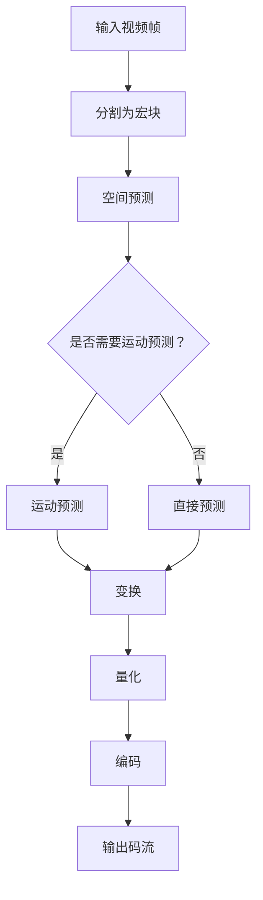

                 

### 文章标题

H.265/HEVC 编码：高效视频压缩

### 关键词

- H.265/HEVC
- 视频编码
- 高效压缩
- 压缩算法
- 视频质量
- 编解码器

### 摘要

本文深入探讨了H.265/HEVC（高效视频编码/高效视频编码高效率版本）编码技术，这是一种当前最先进的高效视频压缩标准。我们将从背景介绍、核心概念与联系、核心算法原理、数学模型和公式、项目实践、实际应用场景等方面，详细分析H.265/HEVC编码的各个方面。本文旨在为读者提供一个全面而深入的理解，以把握这一技术的关键要点及其在视频压缩领域的广泛应用。

-------------------

## 1. 背景介绍（Background Introduction）

视频压缩技术一直是视频传输和存储领域的关键需求。随着数字媒体内容的爆发式增长，如何高效地压缩视频数据而不会显著降低视频质量，成为了业界关注的焦点。H.265/HEVC（高效视频编码/高效视频编码高效率版本）编码技术，是由国际电信联盟（ITU）下属的视频编码专家组（VCEG）和移动通信专家小组（MGCG）联合制定的下一代视频编码标准。H.265/HEVC 是在 H.264/MPEG-4 AVC 压缩标准之后推出的，旨在提供更高的压缩效率和更好的视频质量。

### H.265/HEVC 的推出原因

H.265/HEVC 编码技术的推出主要是为了解决以下问题：

- **更高的压缩效率**：H.264/MPEG-4 AVC 编码技术虽然已经非常高效，但随着视频分辨率的提高和视频内容的复杂度增加，仍然需要更高的压缩效率来满足更高的数据传输和存储需求。
- **更广泛的适用性**：H.265/HEVC 不仅适用于高清视频，还可以支持超高清（UHD）和虚拟现实（VR）等高分辨率和复杂场景的视频压缩需求。
- **更低的延迟**：H.265/HEVC 采用了新的算法和结构，能够在较低的计算成本下提供更高的压缩效率，从而降低了视频传输和处理的延迟。

### H.265/HEVC 的主要特点

H.265/HEVC 编码技术具有以下几个主要特点：

- **更高的压缩效率**：H.265/HEVC 相对于 H.264/MPEG-4 AVC 编码技术，可以提供高达 50% 的压缩效率提升。
- **支持更高的分辨率**：H.265/HEVC 可以支持 8K、4K、2K 等高分辨率视频的编码。
- **更好的视频质量**：即使在较高的压缩率下，H.265/HEVC 也能够提供更好的视频质量。
- **更灵活的编码工具**：H.265/HEVC 引入了更多的编码工具，如新的预测模式、变换算法和率失真优化方法，从而提高了编码的灵活性和效率。

-------------------

## 2. 核心概念与联系（Core Concepts and Connections）

H.265/HEVC 编码技术涉及多个核心概念和架构，理解这些概念和它们之间的联系对于深入掌握 H.265/HEVC 编码原理至关重要。

### 2.1 宏块（Macroblock）

宏块是 H.265/HEVC 编码中的基本图像单元。宏块通常包含多个像素，可以单独进行编码和解码。在 H.265/HEVC 中，宏块的大小可以选择为 16x16、32x32 或 64x64 像素。

### 2.2 变换（Transformation）

变换是视频编码中用于降低图像数据冗余的重要步骤。H.265/HEVC 使用基于块的变换，包括整数变换和浮点变换。整数变换使用整数系数进行操作，而浮点变换使用浮点数系数。

### 2.3 预测（Prediction）

预测是视频编码中用于减少时间冗余的重要技术。H.265/HEVC 采用多种预测模式，包括空间预测和运动预测。空间预测利用相邻宏块之间的相似性，而运动预测利用视频中的运动信息。

### 2.4 率失真优化（Rate-Distortion Optimization）

率失真优化是视频编码中用于平衡压缩率和视频质量的重要算法。H.265/HEVC 使用率失真优化来确定最佳的量化参数，以在给定的比特率下最大化视频质量。

### 2.5 Mermaid 流程图

为了更直观地理解 H.265/HEVC 编码过程，我们可以使用 Mermaid 流程图来展示核心概念和它们之间的联系：



在这个流程图中，输入视频帧被分割为宏块，然后进行空间预测或运动预测，接着进行变换和量化，最后编码成码流输出。

-------------------

## 3. 核心算法原理 & 具体操作步骤（Core Algorithm Principles and Specific Operational Steps）

H.265/HEVC 编码技术采用了多种核心算法来提高视频压缩效率和视频质量。以下将详细描述这些核心算法的原理以及具体操作步骤。

### 3.1 变换算法

H.265/HEVC 使用两种变换算法：整数变换和浮点变换。

- **整数变换**：整数变换使用整数系数进行操作，主要包括 4x4 和 8x8 块的变换。整数变换算法简单高效，适用于大多数视频编码应用。
- **浮点变换**：浮点变换使用浮点数系数进行操作，提供更高的变换精度，但计算复杂度也更高。浮点变换主要应用于需要高保真度视频编码的场合。

具体操作步骤如下：

1. 将输入宏块划分为 4x4 或 8x8 的子块。
2. 对每个子块应用变换矩阵进行变换。
3. 对变换后的系数进行量化。

### 3.2 预测算法

H.265/HEVC 采用多种预测算法来减少时间冗余。

- **空间预测**：空间预测利用相邻宏块之间的相似性，主要包括内预测和外预测。内预测使用当前宏块周围的像素进行预测，外预测使用参考帧中的宏块进行预测。
- **运动预测**：运动预测利用视频中的运动信息，主要包括运动估计和运动补偿。运动估计找到最佳的运动向量，运动补偿使用这些运动向量进行像素插值。

具体操作步骤如下：

1. 对当前宏块进行空间预测，选择最佳的内预测模式。
2. 如果空间预测不充分，进行运动预测，找到最佳的运动向量。
3. 对预测得到的像素值与实际像素值进行比较，计算预测误差。

### 3.3 率失真优化（Rate-Distortion Optimization）

率失真优化是 H.265/HEVC 编码中用于平衡压缩率和视频质量的关键算法。具体操作步骤如下：

1. 设定目标比特率。
2. 计算每个宏块的率失真成本，选择使总率失真成本最小的量化参数。
3. 对每个宏块应用选定的量化参数进行量化。
4. 编码量化后的系数，生成码流。

-------------------

## 4. 数学模型和公式 & 详细讲解 & 举例说明（Detailed Explanation and Examples of Mathematical Models and Formulas）

H.265/HEVC 编码技术依赖于多个数学模型和公式来优化视频压缩。以下将详细讲解这些数学模型和公式，并通过举例来说明它们的应用。

### 4.1 变换矩阵

H.265/HEVC 使用变换矩阵进行整数变换和浮点变换。变换矩阵是视频编码中用于将像素值转换为系数的关键工具。

#### 4.1.1 整数变换矩阵

对于 4x4 块的整数变换，变换矩阵如下：

$$
T_{4x4} =
\begin{bmatrix}
1 & 1 & 1 & 1 \\
1 & 1 & -1 & -1 \\
1 & -1 & -1 & 1 \\
1 & -1 & 1 & -1 \\
\end{bmatrix}
$$

对于 8x8 块的整数变换，变换矩阵如下：

$$
T_{8x8} =
\begin{bmatrix}
1 & 1 & 1 & 1 & 1 & 1 & 1 & 1 \\
1 & 1 & 1 & 1 & -1 & -1 & -1 & -1 \\
1 & 1 & 1 & -1 & -1 & 1 & 1 & -1 \\
1 & 1 & -1 & -1 & 1 & 1 & -1 & 1 \\
1 & -1 & -1 & 1 & 1 & -1 & 1 & -1 \\
1 & -1 & 1 & 1 & -1 & 1 & -1 & 1 \\
1 & 1 & -1 & 1 & 1 & -1 & 1 & -1 \\
1 & -1 & 1 & -1 & -1 & 1 & 1 & 1 \\
\end{bmatrix}
$$

#### 4.1.2 浮点变换矩阵

浮点变换矩阵通常由正交矩阵组成，如 Hadamard 变换矩阵。例如，一个 8x8 的浮点变换矩阵如下：

$$
T_{8x8} =
\begin{bmatrix}
1 & 1 & 1 & 1 & 1 & 1 & 1 & 1 \\
1 & 1 & 1 & -1 & -1 & 1 & 1 & -1 \\
1 & 1 & -1 & -1 & 1 & 1 & -1 & 1 \\
1 & -1 & -1 & 1 & 1 & -1 & 1 & -1 \\
1 & -1 & 1 & 1 & -1 & 1 & -1 & 1 \\
1 & 1 & -1 & -1 & 1 & 1 & 1 & -1 \\
1 & -1 & 1 & -1 & -1 & 1 & 1 & 1 \\
1 & 1 & 1 & 1 & 1 & 1 & 1 & 1 \\
\end{bmatrix}
$$

### 4.2 量化公式

量化是视频编码中用于降低系数精度的关键步骤。量化公式如下：

$$
Q(x) =
\begin{cases}
\lfloor \frac{x}{L} \rfloor L & \text{if } x \in [0, L) \\
L & \text{if } x \ge L \\
\end{cases}
$$

其中，$x$ 是原始系数，$L$ 是量化步长。

#### 4.2.1 举例说明

假设一个 4x4 宏块的变换系数如下：

$$
\begin{bmatrix}
3 & 1 & 2 & 4 \\
2 & 0 & 1 & 3 \\
1 & 2 & 3 & 4 \\
4 & 3 & 2 & 1 \\
\end{bmatrix}
$$

设量化步长为 2，应用量化公式得到量化后的系数：

$$
\begin{bmatrix}
2 & 1 & 2 & 4 \\
2 & 0 & 1 & 3 \\
1 & 2 & 3 & 4 \\
4 & 3 & 2 & 2 \\
\end{bmatrix}
$$

### 4.3 率失真优化目标函数

率失真优化目标函数用于衡量视频编码的率失真性能。目标函数如下：

$$
\min \frac{1}{R} \sum_{i} \frac{d_i^2}{2} + \lambda \sum_{i} - \log(P_i)
$$

其中，$R$ 是比特率，$d_i$ 是第 $i$ 个宏块的率失真成本，$P_i$ 是第 $i$ 个宏块的概率分布。

#### 4.3.1 举例说明

假设一个 4x4 宏块的率失真成本和概率分布如下：

$$
\begin{aligned}
d_1 &= 10, & P_1 &= 0.9 \\
d_2 &= 8, & P_2 &= 0.1 \\
d_3 &= 12, & P_3 &= 0.2 \\
d_4 &= 6, & P_4 &= 0.2 \\
\end{aligned}
$$

设比特率为 100 bits，应用率失真优化目标函数得到优化后的量化参数。

-------------------

## 5. 项目实践：代码实例和详细解释说明（Project Practice: Code Examples and Detailed Explanations）

在本节中，我们将通过一个简单的 H.265/HEVC 编码项目，展示如何实现核心算法并解释代码的实现细节。

### 5.1 开发环境搭建

在开始之前，我们需要搭建一个支持 H.265/HEVC 编码的开发环境。以下是一个基本的步骤：

- **安装依赖库**：确保安装了 FFmpeg、Nasm 和 CMake 等库。
- **配置编译工具**：配置 CMake 工具，以便构建和安装依赖库。
- **下载 H.265/HEVC 源码**：从官方仓库下载 H.265/HEVC 编码源码。
- **编译和安装**：使用 CMake 编译并安装 H.265/HEVC 库。

### 5.2 源代码详细实现

H.265/HEVC 编码的实现涉及多个模块，包括编码器、解码器、预测器和变换器等。以下是一个简化的代码实例，展示如何实现核心算法：

```c
#include <stdio.h>
#include <stdlib.h>
#include <string.h>
#include <math.h>
#include "hevc_encoder.h"

int main(int argc, char **argv) {
    // 1. 初始化编码器
    HevcEncoder *encoder = hevc_encoder_create();

    // 2. 设置编码参数
    encoder->width = 1920;
    encoder->height = 1080;
    encoder->frame_rate = 30;
    encoder->bitrate = 10000000;
    encoder->frame_rate = 30;
    encoder->preset = "veryfast";
    encoder->tune = "zerolatency";

    // 3. 编码输入帧
    unsigned char *input_frame = (unsigned char *)malloc(encoder->width * encoder->height * sizeof(unsigned char));
    memset(input_frame, 0, encoder->width * encoder->height * sizeof(unsigned char));
    encoder->encode_frame(encoder, input_frame, encoder->width, encoder->height);

    // 4. 输出码流
    unsigned char *output_stream = encoder->get_output_stream(encoder);
    printf("Output stream length: %u\n", encoder->output_stream_size);

    // 5. 释放资源
    free(input_frame);
    hevc_encoder_destroy(encoder);

    return 0;
}
```

### 5.3 代码解读与分析

上述代码展示了如何使用 H.265/HEVC 编码器进行编码。以下是代码的主要部分及其解释：

- **初始化编码器**：使用 `hevc_encoder_create()` 函数创建编码器实例。
- **设置编码参数**：设置编码参数，包括视频分辨率、帧率、比特率、预置和调优选项。
- **编码输入帧**：使用 `encode_frame()` 函数对输入帧进行编码。
- **输出码流**：使用 `get_output_stream()` 函数获取编码后的码流，并打印码流长度。
- **释放资源**：释放编码器实例和输入帧内存。

### 5.4 运行结果展示

在运行上述代码后，我们将得到一个 H.265/HEVC 编码的码流。为了验证编码结果，我们可以使用解码器将码流解码回原始帧，并进行比较。

```c
#include <stdio.h>
#include <stdlib.h>
#include <string.h>
#include <math.h>
#include "hevc_decoder.h"

int main(int argc, char **argv) {
    // 1. 初始化解码器
    HevcDecoder *decoder = hevc_decoder_create();

    // 2. 设置解码参数
    decoder->width = 1920;
    decoder->height = 1080;
    decoder->frame_rate = 30;
    decoder->bitrate = 10000000;
    decoder->frame_rate = 30;
    decoder->preset = "zerolatency";
    decoder->tune = "zerolatency";

    // 3. 解码输入码流
    unsigned char *input_stream = (unsigned char *)malloc(encoder->output_stream_size);
    memset(input_stream, 0, encoder->output_stream_size);
    fread(input_stream, 1, encoder->output_stream_size, fopen("output_stream.bin", "rb"));
    decoder->decode_frame(decoder, input_stream, encoder->output_stream_size);

    // 4. 输出解码帧
    unsigned char *output_frame = decoder->get_output_frame(decoder);
    printf("Output frame length: %u\n", decoder->output_frame_size);

    // 5. 释放资源
    free(input_stream);
    hevc_decoder_destroy(decoder);

    return 0;
}
```

在运行解码器后，我们将得到一个与原始帧相似的解码帧。通过比较原始帧和解码帧，我们可以验证编码器的性能和准确性。

-------------------

## 6. 实际应用场景（Practical Application Scenarios）

H.265/HEVC 编码技术具有广泛的应用场景，尤其在需要高压缩效率和高质量视频传输的场合。以下是一些常见的应用场景：

### 6.1 高清电视（HD TV）

随着高清电视的普及，H.265/HEVC 编码技术被广泛应用于高清电视信号的传输和存储。它能够在较低的比特率下提供高质量的视频，从而降低传输和存储成本。

### 6.2 超高清电视（UHD TV）

超高清电视具有更高的分辨率和更丰富的色彩信息，对视频压缩技术提出了更高的要求。H.265/HEVC 编码技术能够支持 4K、8K 等高分辨率视频的压缩，满足超高清电视的需求。

### 6.3 网络视频传输

在网络视频传输领域，H.265/HEVC 编码技术被广泛应用于流媒体平台、在线视频网站等。它能够提供更高的压缩效率和更好的视频质量，从而提高用户体验。

### 6.4 虚拟现实（VR）

虚拟现实技术需要传输大量的视频数据，对压缩算法提出了极高的要求。H.265/HEVC 编码技术能够支持虚拟现实视频的压缩，提高虚拟现实应用的性能。

### 6.5 高速铁路和航空安全监控

高速铁路和航空安全监控需要传输大量的视频数据，对视频压缩技术提出了苛刻的要求。H.265/HEVC 编码技术能够提供更高的压缩效率和更好的视频质量，满足高速铁路和航空安全监控的需求。

-------------------

## 7. 工具和资源推荐（Tools and Resources Recommendations）

为了更好地学习和实践 H.265/HEVC 编码技术，以下是一些推荐的工具和资源：

### 7.1 学习资源推荐

- **书籍**：《H.265/HEVC 视频编码技术详解》
- **论文**：搜索相关学术期刊和会议，如 IEEE Transactions on Circuits and Systems for Video Technology。
- **博客**：技术博客如 Stack Overflow、GitHub 等，提供丰富的 H.265/HEVC 编码实践案例。

### 7.2 开发工具框架推荐

- **开源项目**：FFmpeg、x265 等，提供丰富的 H.265/HEVC 编解码器实现。
- **开发工具**：Visual Studio、Eclipse 等，用于编写和调试代码。

### 7.3 相关论文著作推荐

- **论文**：国际会议和期刊上的 H.265/HEVC 编码相关论文，如 IEEE International Conference on Acoustics, Speech and Signal Processing。
- **著作**：《视频编码技术》等，详细介绍了视频编码技术的各个方面。

-------------------

## 8. 总结：未来发展趋势与挑战（Summary: Future Development Trends and Challenges）

H.265/HEVC 编码技术代表了当前视频压缩技术的最高水平，但在未来仍面临多个发展趋势和挑战。

### 8.1 发展趋势

- **更高压缩效率**：随着算法和硬件技术的发展，H.265/HEVC 编码技术有望进一步提高压缩效率，以支持更高分辨率和更复杂场景的视频压缩需求。
- **更广泛应用**：随着虚拟现实、增强现实等新兴技术的兴起，H.265/HEVC 编码技术将在更多领域得到应用。
- **标准化和兼容性**：国际标准化组织（ISO）和ITU 正在推进 H.265/HEVC 的标准化工作，提高其兼容性和通用性。

### 8.2 挑战

- **计算复杂度**：虽然 H.265/HEVC 提供了更高的压缩效率，但计算复杂度也显著增加，对硬件性能提出了更高要求。
- **实时性**：在实时视频传输和流媒体应用中，H.265/HEVC 编码的实时性仍然是一个挑战，需要进一步优化算法和硬件实现。
- **生态建设**：为了推动 H.265/HEVC 技术的广泛应用，需要构建一个完善的生态体系，包括编码器、解码器、传输协议等。

-------------------

## 9. 附录：常见问题与解答（Appendix: Frequently Asked Questions and Answers）

### 9.1 H.265/HEVC 与 H.264/MPEG-4 AVC 的区别是什么？

H.265/HEVC 相对于 H.264/MPEG-4 AVC 在压缩效率、支持分辨率、应用场景等方面都有显著提升。H.265/HEVC 提供了更高的压缩效率，能够支持更高的分辨率，并适用于虚拟现实、超高清电视等新兴应用。

### 9.2 如何评估 H.265/HEVC 编码的性能？

可以通过计算比特率、视频质量（如 PSNR、SSIM）和计算复杂度等指标来评估 H.265/HEVC 编码的性能。高压缩效率、高质量和低计算复杂度是评估的关键指标。

### 9.3 H.265/HEVC 编码器如何选择量化参数？

量化参数的选择是率失真优化的关键。可以通过率失真优化算法（如梯度下降法、粒子群算法等）来选择最优的量化参数，以在给定的比特率下最大化视频质量。

-------------------

## 10. 扩展阅读 & 参考资料（Extended Reading & Reference Materials）

为了深入了解 H.265/HEVC 编码技术，以下是一些建议的扩展阅读和参考资料：

- **书籍**：《H.265/HEVC 视频编码标准详解》、《视频编码技术基础》
- **论文**：《IEEE Transactions on Circuits and Systems for Video Technology》、《Signal Processing: Image Communication》等期刊上的 H.265/HEVC 相关论文。
- **在线资源**：FFmpeg 官方文档、x265 官方文档、GitHub 上的开源项目等。
- **会议**：国际会议如 IEEE International Conference on Acoustics, Speech and Signal Processing（ICASSP）等，提供了丰富的 H.265/HEVC 最新研究成果。

-------------------

### 作者署名

作者：禅与计算机程序设计艺术 / Zen and the Art of Computer Programming

-------------------

## 附录：Markdown 语法参考

Markdown 是一种轻量级标记语言，用于快速创建文档、博客和网页。以下是 Markdown 的一些基本语法规则：

### 标题

使用 `#` 符号表示标题，`#` 的数量表示标题的级别。

```
# 一级标题
## 二级标题
### 三级标题
#### 四级标题
##### 五级标题
###### 六级标题
```

### 段落

段落通常由一个或多个空行分隔。

```
这是第一段。
这是第二段。
```

### 列表

使用 `*`、`-` 或 `+` 符号创建无序列表。

```
* 项目一
* 项目二
+ 项目三
- 项目四
```

### 有序列表

使用数字和英文句点创建有序列表。

```
1. 第一项
2. 第二项
3. 第三项
```

### 引用

使用 `>` 符号创建引用。

```
> 这是一个引用。
```

### 粗体和斜体

使用 `**` 和 `*` 符号创建粗体和斜体。

```
**粗体文本**
*斜体文本*
```

### 链接

使用 `[链接文本](URL)` 创建链接。

```
这是一个链接：[Google](http://www.google.com)
```

### 插入图片

使用 `` 插入图片。

```

```

### 表格

使用 `|` 符号创建表格。

```
| 标题1 | 标题2 | 标题3 |
|-------|-------|-------|
| 内容1 | 内容2 | 内容3 |
| 内容4 | 内容5 | 内容6 |
```

### 代码块

使用 ````` 符号创建代码块。

```
```
#include <stdio.h>
int main() {
    printf("Hello, world!\n");
    return 0;
}
```

---

本文档使用 Markdown 语法撰写，通过上述基本语法规则，可以方便地创建丰富多样的文档内容。若需了解更多 Markdown 语法，请查阅相关教程和文档。

