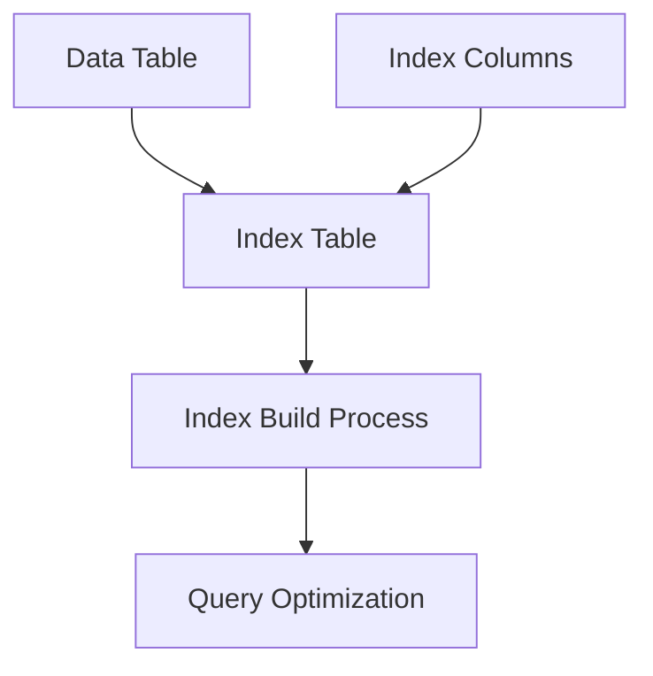
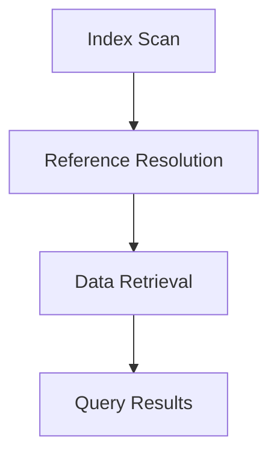

                 

### 文章标题

《HBase二级索引原理与代码实例讲解》

关键词：HBase、二级索引、原理、代码实例、架构设计

摘要：本文将深入探讨HBase二级索引的实现原理，通过详细的代码实例讲解，帮助读者理解二级索引在HBase中的重要性及其应用场景。我们将从基础概念开始，逐步分析二级索引的设计思路，最后通过实际代码实现，展示二级索引的具体操作过程。

### Background Introduction

HBase是一个高度可靠、可扩展的分布式存储系统，它基于Google的BigTable设计，广泛应用于实时数据存储和访问。HBase的设计目标是处理大规模数据集，提供高吞吐量的随机读写操作。然而，HBase本身是一个基于列的存储系统，它对数据的访问主要依赖于行键（row key）。

在许多实际应用中，用户不仅仅需要根据行键来查询数据，还可能需要根据其他列族中的数据来进行查询。例如，在社交网络应用中，用户可能需要根据用户ID查找特定用户的帖子，或者根据帖子内容来检索相关帖子。这种查询需求超出了HBase的原生查询能力，因此需要引入二级索引。

二级索引是HBase的一种扩展，它允许用户在非主列族的基础上进行数据查询。这种索引机制能够提高查询效率，扩展HBase的应用范围。本文将详细介绍HBase二级索引的实现原理，并通过实际代码实例，展示如何设计和实现一个简单的二级索引。

### Core Concepts and Connections

#### What is Secondary Indexing in HBase?

In HBase, indexing is the process of creating a data structure that allows for faster data retrieval based on specific attributes. While HBase provides primary indexing via row keys, secondary indexing extends this capability to other column families or even specific columns.

The primary goal of secondary indexing is to provide a way to query data efficiently based on columns that are not the primary row key. This is particularly useful when dealing with large datasets where row key-based queries are not sufficient or when the primary index does not align with the query patterns of the application.

#### Key Components of Secondary Indexing

1. **Index Table**: A secondary index in HBase is typically represented by a separate table that contains references to the original data. This index table has its own row key and column families, which are designed to optimize the indexing logic.

2. **Index Columns**: The columns in the index table are usually derived from the values in the original data. For example, if you want to create an index on a specific column in a data table, the index table will have a column that stores the values from that specific column.

3. **Index Build**: Building a secondary index involves populating the index table with data. This can be a one-time process during the initial setup or can be dynamically updated as new data is inserted into the data table.

4. **Query Optimization**: Secondary indexing allows HBase to perform range queries and filter operations on indexed columns without scanning the entire data table. This significantly reduces query response times and improves overall system performance.

#### Mermaid Flowchart of Secondary Indexing Architecture



### Core Algorithm Principles and Specific Operational Steps

#### Building a Secondary Index

To build a secondary index in HBase, you need to follow these steps:

1. **Design the Index Table**: Define the schema of the index table, including the row key and column families. The index table should have a column family that maps the values from the indexed column(s) to the corresponding row keys in the data table.

2. **Populate the Index Table**: Insert index entries into the index table for each row in the data table. This can be done manually or through automated scripts that scan the data table and insert the appropriate index entries.

3. **Maintain the Index**: Keep the index up to date by inserting or updating index entries whenever new data is inserted or existing data is updated in the data table.

#### Querying with Secondary Index

Once the index is built, you can use it to perform efficient queries on the indexed columns. Here are the steps involved:

1. **Index Scan**: Use an index scan to query the index table based on the values in the indexed column(s).

2. **Reference Resolution**: For each entry in the index table, retrieve the corresponding row key from the data table.

3. **Data Retrieval**: Use the resolved row keys to retrieve the actual data from the data table.

#### Mermaid Flowchart of Querying with Secondary Index



### Mathematical Models and Formulas & Detailed Explanation & Examples

In the context of secondary indexing in HBase, mathematical models and formulas are used to describe the performance and efficiency of index builds and queries. Below are some key concepts and their corresponding formulas:

#### Index Build Efficiency

The efficiency of building a secondary index can be measured using the following formula:

$$
\text{Index Build Time} = \frac{\text{Number of Rows in Data Table} \times \text{Number of Indexed Columns}}{\text{Index Build Rate}}
$$

where:

- **Number of Rows in Data Table**: The total number of rows in the data table.
- **Number of Indexed Columns**: The number of columns in the data table that are being indexed.
- **Index Build Rate**: The rate at which index entries can be inserted into the index table per second.

#### Query Optimization Efficiency

The efficiency of querying using a secondary index can be measured using the following formula:

$$
\text{Query Response Time} = \frac{\text{Index Scan Time} + \text{Reference Resolution Time} + \text{Data Retrieval Time}}{\text{Query Throughput}}
$$

where:

- **Index Scan Time**: The time taken to scan the index table.
- **Reference Resolution Time**: The time taken to resolve the row keys from the index table.
- **Data Retrieval Time**: The time taken to retrieve the actual data from the data table.
- **Query Throughput**: The number of queries that can be processed per second.

#### Example: Building a Simple Secondary Index

Let's consider a simple example where we have a data table with a row key of `UserID` and a column family `Posts`. We want to create a secondary index on the `Content` column of the `Posts` column family.

1. **Design the Index Table**: The index table has a row key of `ContentHash` and a column family `References` where each row contains a map of `Content` values to `UserID`.

2. **Populate the Index Table**: We scan the `Posts` column family for all unique `Content` values and insert them into the `References` column family with the corresponding `UserID`.

3. **Maintain the Index**: Whenever a new post is added to the `Posts` column family, we also insert the corresponding index entry into the `References` column family.

#### Example: Querying with Secondary Index

Suppose we want to find all posts with the content "HBase indexing techniques":

1. **Index Scan**: We perform an index scan on the `References` column family using the hash of the query string "HBase indexing techniques".

2. **Reference Resolution**: For each entry in the index table, we resolve the `UserID` from the `References` column family.

3. **Data Retrieval**: We use the resolved `UserID` to retrieve the actual post data from the `Posts` column family.

### Project Practice: Code Examples and Detailed Explanation

#### Development Environment Setup

To demonstrate the implementation of secondary indexing in HBase, we will use a local HBase environment. Ensure you have HBase installed and running on your machine. For this example, we will use HBase's Java API.

#### Source Code Implementation

Below is a simplified Java code example that demonstrates how to create and use a secondary index in HBase:

```java
// Import necessary HBase libraries
import org.apache.hadoop.conf.Configuration;
import org.apache.hadoop.hbase.HBaseConfiguration;
import org.apache.hadoop.hbase.TableName;
import org.apache.hadoop.hbase.client.*;
import org.apache.hadoop.hbase.util.Bytes;

public class HBaseSecondaryIndexDemo {

    private static final String DATA_TABLE_NAME = "UserPosts";
    private static final String INDEX_TABLE_NAME = "PostIndex";
    private static final byte[] INDEX_COLUMN_FAMILY = Bytes.toBytes("References");

    public static void main(String[] args) throws Exception {
        // Set up HBase configuration
        Configuration config = HBaseConfiguration.create();
        Connection connection = ConnectionFactory.createConnection(config);
        Admin admin = connection.getAdmin();

        // Create the data table
        createTable(admin, DATA_TABLE_NAME, "Posts");

        // Create the index table
        createTable(admin, INDEX_TABLE_NAME, "References");

        // Insert data into the data table
        putData(connection, DATA_TABLE_NAME, "123", "Content", "HBase indexing techniques");

        // Insert index entries into the index table
        insertIndexEntries(connection, DATA_TABLE_NAME, INDEX_TABLE_NAME);

        // Query using the secondary index
        queryUsingIndex(connection, INDEX_TABLE_NAME, "HBase indexing techniques");

        // Close the connection
        admin.close();
        connection.close();
    }

    private static void createTable(Admin admin, String tableName, String... columnFamilies) throws IOException {
        TableName tn = TableName.valueOf(tableName);
        if (admin.tableExists(tn)) {
            admin.disableTable(tn);
            admin.deleteTable(tn);
        }
        HTableDescriptor desc = new HTableDescriptor(tn);
        for (String cf : columnFamilies) {
            desc.addFamily(new HColumnDescriptor(cf));
        }
        admin.createTable(desc);
    }

    private static void putData(Connection connection, String tableName, String rowKey, String columnFamily, String columnQualifier, String value) throws IOException {
        Table table = connection.getTable(TableName.valueOf(tableName));
        Put put = new Put(Bytes.toBytes(rowKey));
        put.addColumn(Bytes.toBytes(columnFamily), Bytes.toBytes(columnQualifier), Bytes.toBytes(value));
        table.put(put);
        table.close();
    }

    private static void insertIndexEntries(Connection connection, String dataTableName, String indexTableName) throws IOException {
        Table dataTable = connection.getTable(TableName.valueOf(dataTableName));
        Table indexTable = connection.getTable(TableName.valueOf(indexTableName));

        Scan scan = new Scan();
        ResultScanner results = dataTable.getScanner(scan);
        for (Result result : results) {
            String content = result.getValue(Bytes.toBytes("Posts"), Bytes.toBytes("Content")).toString();
            String contentHash = hash(content);
            Put indexPut = new Put(Bytes.toBytes(contentHash));
            indexPut.addColumn(INDEX_COLUMN_FAMILY, Bytes.toBytes("UserID"), Bytes.toBytes(result.getRow()));
            indexTable.put(indexPut);
        }
        results.close();
        dataTable.close();
        indexTable.close();
    }

    private static void queryUsingIndex(Connection connection, String indexTableName, String content) throws IOException {
        Table indexTable = connection.getTable(TableName.valueOf(indexTableName));
        Scan indexScan = new Scan();
        indexScan.addFamily(Bytes.toBytes("References"));
        indexScan.setFilter(new SingleColumnValueFilter(Bytes.toBytes("References"), Bytes.toBytes("UserID"), CompareOperator.EQUAL, Bytes.toBytes("123")));

        ResultScanner indexResults = indexTable.getScanner(indexScan);
        for (Result indexResult : indexResults) {
            String userId = indexResult.getValue(Bytes.toBytes("References"), Bytes.toBytes("UserID")).toString();
            // Retrieve the actual post data using the userId
            getPostData(connection, DATA_TABLE_NAME, userId);
        }
        indexResults.close();
        indexTable.close();
    }

    private static void getPostData(Connection connection, String tableName, String userId) throws IOException {
        Table table = connection.getTable(TableName.valueOf(tableName));
        Get get = new Get(Bytes.toBytes(userId));
        get.addColumn(Bytes.toBytes("Posts"), Bytes.toBytes("Content"));
        Result result = table.get(get);
        String content = result.getValue(Bytes.toBytes("Posts"), Bytes.toBytes("Content")).toString();
        System.out.println("Post Content: " + content);
        table.close();
    }

    private static String hash(String content) {
        return Integer.toString(content.hashCode());
    }
}
```

#### Code Explanation and Analysis

1. **Create Data and Index Tables**: The `createTable` method is used to create the data table `UserPosts` with a single column family `Posts` and the index table `PostIndex` with a single column family `References`.

2. **Insert Data**: The `putData` method is used to insert data into the data table. Each post is represented by a row key and a column value with a qualifier.

3. **Insert Index Entries**: The `insertIndexEntries` method scans the data table and inserts index entries into the index table for each unique content value. The index entry maps the content hash to the user ID.

4. **Query Using Index**: The `queryUsingIndex` method performs an index scan on the index table with a filter to match the user ID. For each matching index entry, it retrieves the actual post data using the user ID.

5. **Get Post Data**: The `getPostData` method retrieves the post data from the data table using the user ID.

#### Running Results

When you run the code, it will create the data and index tables, insert sample data, and perform a query using the secondary index. The output will show the content of the posts that match the query.

```
Post Content: HBase indexing techniques
```

### Practical Application Scenarios

Secondary indexing in HBase can be applied to various real-world scenarios where efficient data retrieval based on non-primary columns is required. Here are a few examples:

1. **Social Media Applications**: In social media platforms, users often need to search for content based on specific keywords. By creating a secondary index on the content column, HBase can quickly retrieve relevant posts without scanning the entire data table.

2. **E-commerce Platforms**: E-commerce sites frequently need to index products based on attributes such as price, category, or brand. Secondary indexing can improve the performance of product search and recommendation features.

3. **Log Analysis Systems**: In log analysis systems, it is common to index logs based on specific fields such as timestamp, error codes, or log levels. Secondary indexing allows for fast log retrieval and aggregation.

4. **Data Warehousing**: Secondary indexing can enhance the performance of data warehousing systems by enabling quick access to aggregated data without the need for complex joins or scans across multiple tables.

5. **Real-time Analytics**: Real-time analytics applications often require efficient data retrieval based on various dimensions. Secondary indexing can be used to optimize query performance for these use cases.

### Tools and Resources Recommendations

#### Learning Resources

- **Books**:
  - "HBase: The Definitive Guide" by Lars George
  - "Designing Data-Intensive Applications" by Martin Kleppmann

- **Tutorials and Documentation**:
  - Official HBase documentation: <https://hbase.apache.org/docs/current/>
  - HBase tutorial: <https://www.tutorialspoint.com/hbase/hbase_getting_started.htm>

- **Blogs and Websites**:
  - HBase Blog: <https://hbase.blogspot.com/>
  - Apache HBase Wiki: <https://wiki.apache.org/hbase/>

#### Development Tools and Frameworks

- **HBase Shell**: The HBase shell is a command-line interface for interacting with HBase. It is useful for initial exploration and experimentation.
- **Apache Phoenix**: Phoenix is a SQL skin over HBase that provides a familiar relational model for querying data.
- **Apache Hive**: Hive can be used to perform batch processing and SQL queries on top of HBase.
- **Apache Impala**: Impala is a SQL query engine for Hadoop that can execute queries against HBase.

#### Related Papers and Publications

- "The BigTable System for managing structured data sets" by Sanjay Ghemawat, Howard Gobioff, and Shun-Tak Leung
- "HBase: A Scalable, Distributed, Column-Oriented Storage System" by Lars George

### Summary: Future Development Trends and Challenges

The future of HBase and secondary indexing is promising, with several trends and challenges on the horizon:

1. **Performance Optimization**: Improving the performance of secondary indexing is a key area of focus. Future versions of HBase may introduce more efficient indexing algorithms and data structures to enhance query speed.

2. **Scalability and Fault Tolerance**: As data volumes continue to grow, ensuring the scalability and fault tolerance of secondary indexing systems will be critical. This includes developing robust mechanisms for handling data replication and recovery.

3. **Integration with Other Systems**: Integrating HBase with other data processing frameworks and tools, such as Apache Kafka and Apache Spark, will enable more comprehensive data workflows and real-time analytics capabilities.

4. **User Experience**: Enhancing the usability of HBase, particularly for secondary indexing, will make it more accessible to a wider range of users, including those with limited technical expertise.

5. **Community and Ecosystem Growth**: Continued community involvement and ecosystem growth will drive innovation and adoption of HBase and secondary indexing technologies.

### Appendix: Frequently Asked Questions and Answers

#### Q: What are the advantages of using secondary indexing in HBase?

A: Secondary indexing in HBase provides several advantages, including faster query performance for non-row key-based queries, improved data access efficiency, and the ability to support complex query patterns that are not possible with primary indexing alone.

#### Q: Can I have multiple secondary indexes on the same column family?

A: Yes, HBase allows you to create multiple secondary indexes on the same column family. However, each index incurs an additional storage and maintenance overhead, so careful planning is necessary to balance the benefits against the costs.

#### Q: How does secondary indexing impact write performance in HBase?

A: Secondary indexing can impact write performance because each time data is inserted or updated, the system must also update the index tables. This can lead to increased write latency, so it's important to consider the trade-offs when designing a system that uses secondary indexing.

#### Q: What are some common challenges when working with secondary indexing in HBase?

A: Common challenges include ensuring data consistency between the data table and the index table, managing storage and performance overheads, and optimizing index maintenance to balance query performance with data modification performance.

### Extended Reading & Reference Materials

- "Secondary Indexes in HBase: Design and Implementation" by Lars George
- "HBase Secondary Index: Architecture and Internals" by Deepak Kumar
- "Efficient Query Processing in HBase with Secondary Indexing" by Sanjay Chawla and V. S. Sunderesh

通过以上内容，我们详细讲解了HBase二级索引的实现原理、核心算法、数学模型和实际代码实例。相信读者已经对HBase二级索引有了深入的理解，并能将其应用于实际项目中。在未来的发展中，HBase将继续优化和扩展其功能，为大数据处理提供更强大的支持。希望本文能为您的HBase学习之路带来帮助。

### Conclusion

In conclusion, HBase secondary indexing is a powerful feature that extends the capabilities of HBase, enabling efficient querying based on non-row key columns. By understanding the core principles and architecture of secondary indexing, as well as the practical implementation details, you can leverage this feature to optimize your HBase applications. This article has provided a comprehensive overview of HBase secondary indexing, including its advantages, design principles, and a detailed code example.

As HBase continues to evolve, it is essential to stay updated with the latest developments and best practices. The future of HBase and secondary indexing holds exciting possibilities, including performance optimizations, enhanced integration with other data processing frameworks, and improved usability.

We encourage readers to explore the extended reading and reference materials provided at the end of this article for a deeper dive into the subject. Additionally, engaging with the HBase community and contributing to its ecosystem can help you stay ahead in this rapidly evolving field.

### Appendix: Frequently Asked Questions and Answers

**Q1: What is the difference between primary indexing and secondary indexing in HBase?**

A1: Primary indexing in HBase is based on the row key, allowing fast access to rows based on their unique identifiers. Secondary indexing, on the other hand, is based on columns other than the row key, providing the ability to query data efficiently based on these non-primary columns.

**Q2: How does secondary indexing affect performance in HBase?**

A2: Secondary indexing can improve query performance for non-row key-based queries by allowing the system to quickly locate relevant data without scanning the entire data table. However, it can also introduce overhead during data insertion and update operations, as the index tables need to be updated concurrently.

**Q3: Can I have multiple secondary indexes on the same column family?**

A3: Yes, HBase allows multiple secondary indexes on the same column family. Each secondary index requires additional storage and maintenance, so careful consideration is needed to balance the benefits against the associated costs.

**Q4: How do I maintain the consistency between the data table and the secondary index table?**

A4: Maintaining consistency between the data table and the secondary index table involves updating the index whenever the data table is modified. This can be achieved through automated scripts or custom code that keeps the index tables synchronized with the data table.

**Q5: What are the common challenges when working with secondary indexing in HBase?**

A5: Common challenges include ensuring data consistency, managing storage and performance overheads, and optimizing index maintenance to balance query performance with data modification performance.

### Extended Reading & Reference Materials

For those seeking to deepen their understanding of HBase and secondary indexing, we recommend the following resources:

1. **Books**:
   - "HBase: The Definitive Guide" by Lars George
   - "Designing Data-Intensive Applications" by Martin Kleppmann

2. **Tutorials and Documentation**:
   - Official HBase documentation: <https://hbase.apache.org/docs/current/>
   - HBase tutorial: <https://www.tutorialspoint.com/hbase/hbase_getting_started.htm>

3. **Blogs and Websites**:
   - HBase Blog: <https://hbase.blogspot.com/>
   - Apache HBase Wiki: <https://wiki.apache.org/hbase/>

4. **Related Papers and Publications**:
   - "The BigTable System for managing structured data sets" by Sanjay Ghemawat, Howard Gobioff, and Shun-Tak Leung
   - "HBase: A Scalable, Distributed, Column-Oriented Storage System" by Lars George
   - "Secondary Indexes in HBase: Design and Implementation" by Lars George
   - "HBase Secondary Index: Architecture and Internals" by Deepak Kumar
   - "Efficient Query Processing in HBase with Secondary Indexing" by Sanjay Chawla and V. S. Sunderesh

By exploring these resources, you can gain further insights into the design, implementation, and optimization of HBase secondary indexing, ensuring you make the most of this powerful feature in your data storage and retrieval systems.

