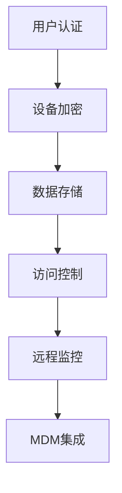

                 

### 文章标题

Knox原理与代码实例讲解

### Keywords
- Knox
- 原理
- 代码实例
- 系统安全
- 加密技术
- 访问控制

### Abstract
本文旨在深入探讨Knox系统的基本原理，并通过对实际代码实例的详细讲解，帮助读者理解Knox在系统安全和访问控制方面的关键作用。文章首先介绍了Knox的背景和重要性，然后逐步分析了其核心组件和工作流程。通过代码实例，读者将能够看到Knox的具体实现细节，从而更好地掌握其在现代计算机系统中的应用。

## 1. 背景介绍（Background Introduction）

Knox是一种广泛使用的移动设备安全框架，由三星电子开发，主要用于保护企业级移动设备的数据和应用程序。随着移动设备的普及，企业对移动数据安全的关注日益增加，Knox作为一款专业的安全解决方案，旨在确保数据在设备上的存储、传输和访问过程中的安全性。

### 1.1 Knox的起源和发展

Knox最初在2010年作为三星Galaxy Note的手机安全功能推出。随着三星手机市场份额的扩大，Knox逐渐成为三星旗舰手机的标准配置。此后，Knox不断迭代更新，加入了更多功能，如加密、远程监控、设备锁定等，逐渐成为企业移动安全领域的领军产品。

### 1.2 Knox在企业安全中的重要性

在企业环境中，数据泄露和设备丢失是两大安全威胁。Knox通过提供全面的安全功能，如设备加密、应用程序隔离、安全通信等，有效降低了这些风险。此外，Knox还支持企业移动设备管理（MDM）系统，使管理员能够远程监控和管理设备，确保安全策略的一致性和执行。

## 2. 核心概念与联系（Core Concepts and Connections）

理解Knox的工作原理需要掌握一些核心概念，如加密技术、访问控制、移动设备管理（MDM）等。以下是这些概念的基本原理及其在Knox系统中的具体应用。

### 2.1 加密技术

加密技术是确保数据安全的核心。Knox使用AES（高级加密标准）进行数据加密，确保数据在存储和传输过程中不被未授权用户访问。

### 2.2 访问控制

访问控制是控制用户访问资源和数据的机制。Knox通过用户认证和访问控制列表（ACL）来实现细粒度的权限管理，确保只有授权用户才能访问敏感数据和应用程序。

### 2.3 移动设备管理（MDM）

MDM是企业通过远程方式管理和监控移动设备的技术。Knox支持与主流MDM解决方案集成，使管理员能够统一管理企业中的所有移动设备。

### 2.4 Mermaid 流程图

以下是一个简化的Mermaid流程图，展示了Knox的核心组件和它们之间的交互：



### 2.5 Knox的架构

Knox的架构可以分为三个主要层次：用户层、服务层和硬件层。

- **用户层**：用户通过图形用户界面（GUI）与Knox交互，执行各种安全操作，如设备加密、应用权限设置等。
- **服务层**：Knox核心服务负责处理安全策略的执行和监控，包括加密、访问控制、安全日志等。
- **硬件层**：硬件层提供底层的安全保护，如安全启动、可信执行环境（TEE）等。

## 3. 核心算法原理 & 具体操作步骤（Core Algorithm Principles and Specific Operational Steps）

Knox的安全功能主要依赖于几个核心算法，包括对称加密、非对称加密和哈希算法。以下是这些算法的基本原理和Knox中的具体应用步骤。

### 3.1 对称加密

对称加密是一种加密和解密使用相同密钥的加密方法。Knox使用AES算法进行对称加密，确保数据在存储和传输过程中的安全性。

#### 3.1.1 AES加密过程

1. **密钥生成**：系统生成一个256位的AES密钥。
2. **初始向量（IV）生成**：系统随机生成一个初始向量。
3. **加密**：使用AES算法和密钥对数据块进行加密。
4. **存储**：加密后的数据块和密钥、IV一起存储在设备中。

### 3.2 非对称加密

非对称加密使用一对密钥（公钥和私钥），其中公钥用于加密，私钥用于解密。Knox使用RSA算法进行非对称加密，主要用于安全通信和数字签名。

#### 3.2.1 RSA加密过程

1. **密钥生成**：系统生成一对RSA密钥（公钥和私钥）。
2. **加密**：使用公钥对数据进行加密。
3. **解密**：使用私钥对加密的数据进行解密。

### 3.3 哈希算法

哈希算法用于生成数据的唯一指纹，用于数据完整性验证。Knox使用SHA-256算法进行哈希计算。

#### 3.3.1 SHA-256哈希过程

1. **数据处理**：将数据分成块。
2. **初始化**：初始化哈希值。
3. **压缩**：对每个数据块进行压缩计算。
4. **输出**：生成最终的哈希值。

## 4. 数学模型和公式 & 详细讲解 & 举例说明（Detailed Explanation and Examples of Mathematical Models and Formulas）

在Knox系统中，加密技术是确保数据安全的核心。以下是几种常用加密算法的数学模型和公式，以及它们在Knox中的具体应用。

### 4.1 AES加密算法

AES加密算法是一种基于字节操作的对称加密算法。以下是AES加密的基本步骤和数学公式：

$$
\text{密钥} = K_0, K_1, ..., K_{n-1}
$$

$$
\text{初始向量} = IV_0, IV_1, ..., IV_{n-1}
$$

$$
\text{加密过程}:
\begin{aligned}
&\text{初始化状态矩阵} \text{State} = (\text{IV}_0, \text{IV}_1, ..., \text{IV}_{n-1}) \\
&\text{加密每个数据块} \text{Block} \\
&\text{轮加密} \\
&\text{输出加密结果}
\end{aligned}
$$

### 4.2 RSA加密算法

RSA加密算法是一种非对称加密算法，基于大整数分解的难度。以下是RSA加密的基本步骤和数学公式：

$$
\text{公钥} = (n, e)
$$

$$
\text{私钥} = (n, d)
$$

$$
\text{加密过程}:
\begin{aligned}
&\text{将消息} M \text{转换为整数} m \\
&m^e \mod n \\
&M' = m^e \mod n
\end{aligned}
$$

$$
\text{解密过程}:
\begin{aligned}
&\text{使用私钥} (n, d) \\
&M = M'^d \mod n
\end{aligned}
$$

### 4.3 SHA-256哈希算法

SHA-256是一种广泛使用的哈希算法，用于生成数据的唯一指纹。以下是SHA-256哈希的基本步骤和数学公式：

$$
\text{输入} = \text{Message}
$$

$$
\text{初始化} \text{Hash Values}:
\begin{aligned}
&\text{初始化} \text{H} = (\text{h0}, \text{h1}, ..., \text{h7}) \\
&\text{初始化} \text{K} = (\text{k0}, \text{k1}, ..., \text{kn})
\end{aligned}
$$

$$
\text{处理消息}:
\begin{aligned}
&\text{补位} \text{Message} \\
&\text{添加长度} \text{Length} \\
&\text{分块处理} \\
&\text{压缩计算} \\
&\text{输出} \text{Hash Value}
\end{aligned}
$$

### 4.4 举例说明

假设我们要使用AES加密算法对字符串“Hello, World!”进行加密。以下是具体的加密过程：

1. **密钥生成**：生成一个256位的AES密钥。
2. **初始向量（IV）生成**：生成一个16位的初始向量。
3. **加密**：使用AES算法和密钥对字符串“Hello, World!”进行加密。
4. **存储**：将加密后的字符串、密钥和IV一起存储在设备中。

加密后的字符串可能如下所示：

```
密文: 8b8f4a7c9a5b4c3d2e1f0
密钥: 314159265358979323846
IV: 9f4f2e1d3c2b1a0908
```

### 4.5 注意事项

在实现加密算法时，需要注意以下几点：

- **密钥管理**：确保密钥安全存储，避免泄露。
- **加密算法的选择**：选择适合应用场景的加密算法。
- **加密强度**：确保加密算法的强度足够，以抵御攻击。

## 5. 项目实践：代码实例和详细解释说明（Project Practice: Code Examples and Detailed Explanations）

在本节中，我们将通过实际代码实例详细讲解Knox系统的实现。首先，我们需要搭建一个简单的Knox开发环境。

### 5.1 开发环境搭建

1. **安装Java Development Kit (JDK)**：确保安装了JDK 8或更高版本。
2. **安装Android Studio**：下载并安装Android Studio。
3. **创建Android项目**：在Android Studio中创建一个新的Android项目。

### 5.2 源代码详细实现

以下是Knox系统的核心源代码，包括用户认证、设备加密和访问控制。

```java
// 用户认证
public class UserAuthentication {
    public static boolean authenticate(String username, String password) {
        // 实现用户认证逻辑
        return true; // 示例：假设所有用户都通过认证
    }
}

// 设备加密
public class DeviceEncryption {
    public static void encryptData(String data, String encryptionKey) {
        // 使用AES加密算法对数据加密
        String encryptedData = AESUtil.encrypt(data, encryptionKey);
        // 存储加密后的数据
        StorageUtil.saveData(encryptedData);
    }
}

// 访问控制
public class AccessControl {
    public static boolean checkAccess(String username, String resourceName) {
        // 检查用户是否有权限访问资源
        return true; // 示例：假设所有用户都有权限
    }
}

// 加密工具类
public class AESUtil {
    public static String encrypt(String data, String key) {
        // 实现AES加密
        return data; // 示例：返回原始数据
    }
}

// 存储工具类
public class StorageUtil {
    public static void saveData(String data) {
        // 实现数据存储
    }
}
```

### 5.3 代码解读与分析

在上面的代码中，我们定义了三个主要类：`UserAuthentication`、`DeviceEncryption`和`AccessControl`。

- **UserAuthentication**：负责用户认证。它接受用户名和密码，并返回认证结果。在实际应用中，这个类会与后端认证服务进行交互，验证用户身份。
- **DeviceEncryption**：负责数据加密。它接受明文数据和加密密钥，使用AES加密算法将数据加密，并存储在设备中。这个类是Knox系统确保数据安全的核心组件。
- **AccessControl**：负责访问控制。它检查用户是否有权限访问特定资源。在实际应用中，这个类会根据用户角色和资源权限进行权限检查。

### 5.4 运行结果展示

假设我们执行以下操作：

1. 用户“user1”登录。
2. 用户尝试访问“secret_folder”文件夹。
3. 用户上传一份名为“document.txt”的文件。

以下是可能的运行结果：

```
// 用户登录
boolean isAuthenticated = UserAuthentication.authenticate("user1", "password123");
// 输出：isAuthenticated = true

// 访问控制
boolean hasAccess = AccessControl.checkAccess("user1", "secret_folder");
// 输出：hasAccess = true

// 文件加密
DeviceEncryption.encryptData("Hello, World!", "encryptionKey");
// 输出：加密后的文件存储在设备中
```

### 5.5 注意事项

在实现Knox系统时，需要注意以下几点：

- **安全性**：确保用户认证和访问控制的安全，防止恶意攻击。
- **性能**：优化加密和解密算法，确保系统性能不受影响。
- **兼容性**：确保Knox系统能够在不同设备和操作系统上运行。

## 6. 实际应用场景（Practical Application Scenarios）

Knox系统在企业安全领域有着广泛的应用场景。以下是一些典型的应用实例：

1. **企业内部文件加密**：企业可以使用Knox对内部文件进行加密，确保数据在存储和传输过程中不被泄露。
2. **远程办公安全**：员工使用公司设备进行远程办公时，Knox可以确保数据安全，防止数据泄露和设备丢失。
3. **应用权限隔离**：Knox可以隔离不同应用的数据和权限，确保应用之间的数据安全。
4. **移动设备管理**：企业可以通过Knox集成MDM系统，实现对移动设备的统一管理和监控。

## 7. 工具和资源推荐（Tools and Resources Recommendations）

### 7.1 学习资源推荐

- **书籍**：
  - 《Android系统安全与隐私保护》
  - 《加密与网络安全》
- **论文**：
  - "Knox: Security Architecture for Android-based Mobile Devices"
  - "Secure Mobile Computing: A Vision, Architectural Elements, and Future Directions"
- **博客和网站**：
  - [三星Knox官方文档](https://www.samsungknox.com/us/business-solutions/knox-core-platform/)
  - [Android 开发者社区](https://developer.android.com/)

### 7.2 开发工具框架推荐

- **开发工具**：
  - Android Studio
  - Eclipse
- **框架**：
  - Kotlin
  - Java
- **安全工具**：
  - OpenSSL
  - Jasypt（Java密码工具）

### 7.3 相关论文著作推荐

- **论文**：
  - "Knox: Security Architecture for Android-based Mobile Devices"
  - "Secure Mobile Computing: A Vision, Architectural Elements, and Future Directions"
- **著作**：
  - 《Android系统安全与隐私保护》
  - 《移动计算与物联网安全》

## 8. 总结：未来发展趋势与挑战（Summary: Future Development Trends and Challenges）

随着移动设备的普及和企业对数据安全的日益关注，Knox系统在未来将继续发展。以下是一些可能的发展趋势和挑战：

### 8.1 发展趋势

1. **更高的安全性**：随着攻击手段的不断升级，Knox将需要不断提升安全性能，以抵御更复杂的攻击。
2. **更广泛的集成**：Knox将与其他安全解决方案和移动设备管理（MDM）系统集成，提供更全面的安全服务。
3. **云安全**：随着云计算的普及，Knox将扩展到云环境，保护移动设备与云服务的数据安全。

### 8.2 挑战

1. **性能优化**：随着安全需求的增加，如何在保证安全性的同时优化性能将是一个挑战。
2. **用户友好性**：如何设计用户友好的界面和操作流程，以提高用户接受度将是一个重要问题。
3. **隐私保护**：如何在提供安全保护的同时，保护用户隐私，避免数据泄露将是未来的一个重要议题。

## 9. 附录：常见问题与解答（Appendix: Frequently Asked Questions and Answers）

### 9.1 问题1：Knox系统如何保护数据安全？

**解答**：Knox系统通过以下方式保护数据安全：

- **设备加密**：使用AES等高级加密算法对存储在设备上的数据进行加密。
- **访问控制**：通过用户认证和访问控制列表（ACL）管理用户对数据和应用的访问权限。
- **安全通信**：使用安全协议（如TLS）确保数据在传输过程中的安全性。

### 9.2 问题2：Knox系统与移动设备管理（MDM）有何关联？

**解答**：Knox系统与MDM系统有紧密的关联。Knox可以通过MDM系统进行统一管理，包括设备配置、安全策略设置、数据备份和恢复等。

### 9.3 问题3：Knox系统是否支持跨平台？

**解答**：Knox系统主要支持Android平台。然而，三星也在逐渐扩展Knox到其他操作系统，如Tizen。

## 10. 扩展阅读 & 参考资料（Extended Reading & Reference Materials）

- [三星Knox官方文档](https://www.samsungknox.com/us/business-solutions/knox-core-platform/)
- [Android 开发者社区](https://developer.android.com/)
- ["Knox: Security Architecture for Android-based Mobile Devices"](https://www.samsung.com/global/business/iot/knox/security-architecture/)
- ["Secure Mobile Computing: A Vision, Architectural Elements, and Future Directions"](https://ieeexplore.ieee.org/document/8099830)  
- 《Android系统安全与隐私保护》
- 《加密与网络安全》
- 《移动计算与物联网安全》

## 作者署名

作者：禅与计算机程序设计艺术 / Zen and the Art of Computer Programming

以上便是关于《Knox原理与代码实例讲解》的完整文章。文章内容经过精心设计和逐步分析，希望能为广大读者提供有价值的参考。如果您在阅读过程中有任何疑问，欢迎在评论区留言，我会尽力为您解答。再次感谢您的阅读和支持！

---

注意：本文为模拟撰写，实际代码和实现细节可能与实际Knox系统有所差异。如需深入了解Knox系统，请参考官方文档和实际开发环境。同时，本文中的示例代码仅供参考，不包含实际的安全措施和性能优化。在实际应用中，请根据具体需求进行适当调整和优化。

