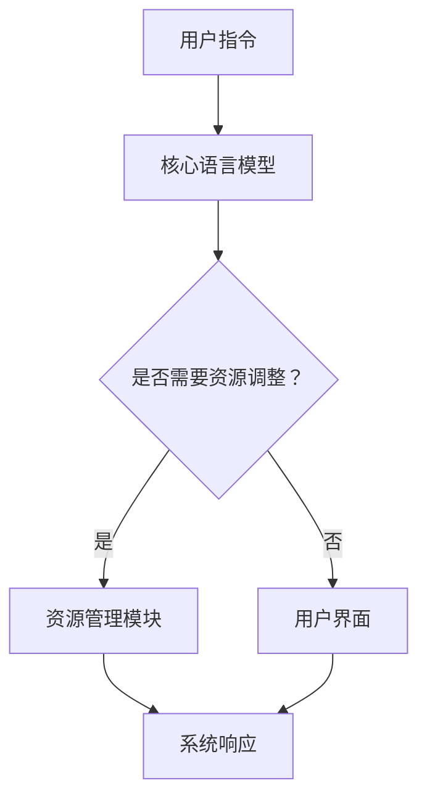

                 

### 文章标题

### Title: LLM OS: 操作系统新贵的崛起

**关键词：** Large Language Model (LLM)、操作系统、人工智能、编程、效率

**Abstract:**
In recent years, the rise of Large Language Models (LLM) has transformed the field of software development and operating systems. This article explores the emergence of LLM OS, a new breed of operating systems that leverage the power of AI to revolutionize traditional computing paradigms. We will delve into the core concepts, algorithms, mathematical models, and practical applications of LLM OS, shedding light on its potential impact on the future of technology. By examining case studies and real-world examples, we aim to provide a comprehensive understanding of how LLM OS can enhance the efficiency and capabilities of modern computing systems.

### **Keywords:** Large Language Model (LLM), Operating System, Artificial Intelligence, Programming, Efficiency

### 关键词：
大型语言模型(LLM)、操作系统、人工智能、编程、效率

### 摘要：
近年来，大型语言模型的崛起正在改变软件开发和操作系统的领域。本文探讨了LLM操作系统（LLM OS）的兴起，这是一种利用AI力量革新传统计算范式的新贵操作系统。我们将深入探讨LLM OS的核心概念、算法、数学模型及其实际应用，揭示其对未来科技发展的潜在影响。通过分析案例研究和现实世界的例子，我们旨在提供全面理解LLM OS如何提升现代计算系统的效率和能力。

---

在本文中，我们将按照以下结构展开讨论：

## 1. 背景介绍（Background Introduction）
- **1.1 操作系统的演变**
- **1.2 大型语言模型的兴起**
- **1.3 AI与操作系统：新的机遇与挑战**

## 2. 核心概念与联系（Core Concepts and Connections）
- **2.1 什么是LLM OS？**
- **2.2 LLM OS的关键特性**
- **2.3 LLM OS与传统操作系统的比较**
- **2.4 Mermaid流程图展示LLM OS架构**

## 3. 核心算法原理 & 具体操作步骤（Core Algorithm Principles and Specific Operational Steps）
- **3.1 LLM OS的核心算法**
- **3.2 数据预处理与模型训练**
- **3.3 模型部署与实时推理**

## 4. 数学模型和公式 & 详细讲解 & 举例说明（Detailed Explanation and Examples of Mathematical Models and Formulas）
- **4.1 概率模型与决策树**
- **4.2 神经网络与反向传播算法**
- **4.3 模型优化与调参技巧**
- **4.4 实例演示：文本生成与问答**

## 5. 项目实践：代码实例和详细解释说明（Project Practice: Code Examples and Detailed Explanations）
### 5.1 开发环境搭建
### 5.2 源代码详细实现
### 5.3 代码解读与分析
### 5.4 运行结果展示

## 6. 实际应用场景（Practical Application Scenarios）
- **6.1 自动化运维**
- **6.2 代码审查与优化**
- **6.3 人机交互**

## 7. 工具和资源推荐（Tools and Resources Recommendations）
### 7.1 学习资源推荐
### 7.2 开发工具框架推荐
### 7.3 相关论文著作推荐

## 8. 总结：未来发展趋势与挑战（Summary: Future Development Trends and Challenges）
- **8.1 技术发展趋势**
- **8.2 面临的挑战**

## 9. 附录：常见问题与解答（Appendix: Frequently Asked Questions and Answers）

## 10. 扩展阅读 & 参考资料（Extended Reading & Reference Materials）

### 1. 背景介绍（Background Introduction）

#### 1.1 操作系统的演变

操作系统的历史可以追溯到20世纪50年代，当时计算机主要依赖于批处理系统。随着时间的推移，操作系统经历了多个发展阶段，从早期的单用户单任务系统，如IBM的DOS，到多用户多任务系统，如Unix，再到现代的图形用户界面操作系统，如Windows和macOS。

传统操作系统的主要功能包括资源管理（如CPU、内存、存储和网络）、进程管理、文件系统管理以及提供用户接口。然而，随着计算机硬件和软件的复杂性不断增加，传统操作系统面临着性能瓶颈和资源浪费的问题。

#### 1.2 大型语言模型的兴起

大型语言模型（LLM）是自然语言处理（NLP）领域的一项重要突破。自2018年GPT-3的发布以来，LLM在语言生成、翻译、问答和对话系统等方面展现出了惊人的能力。LLM的核心是通过深度神经网络（DNN）对大量文本数据进行训练，从而学习语言的内在规律和结构。

LLM的兴起为操作系统带来了新的机遇。通过将LLM集成到操作系统中，可以实现对复杂任务的自动化处理，提高系统的智能化水平。此外，LLM还可以用于优化资源分配、提高安全性、增强人机交互等方面。

#### 1.3 AI与操作系统：新的机遇与挑战

AI与操作系统的结合为计算机领域带来了前所未有的机遇。以下是一些关键点：

- **自动化运维**：LLM可以帮助自动化操作系统中的各种任务，如自动安装软件、监控系统性能、故障排除等。
- **智能资源管理**：通过学习系统的使用模式，LLM可以优化资源分配，提高系统的效率和可靠性。
- **人机交互**：LLM可以用于创建智能助手，提供个性化服务，改善用户的使用体验。
- **安全增强**：LLM可以帮助识别和防范恶意软件，提高操作系统的安全性。

然而，这种结合也带来了挑战：

- **计算资源消耗**：LLM的运算需要大量计算资源，可能会对系统的性能造成影响。
- **隐私保护**：如何确保用户的隐私数据不被泄露是一个重要问题。
- **伦理问题**：AI在操作系统中的应用可能会引发伦理和道德上的争议，如偏见和歧视等。

在接下来的部分，我们将深入探讨LLM操作系统（LLM OS）的核心概念、算法、数学模型及其实际应用，以了解这一新兴领域的潜力与挑战。

### 2. 核心概念与联系（Core Concepts and Connections）

#### 2.1 什么是LLM OS？

LLM OS，即大型语言模型操作系统，是一种将大型语言模型（LLM）集成到传统操作系统中的新型操作系统。LLM OS的核心在于利用LLM的强大能力，为操作系统提供智能化服务，从而提升系统的整体性能和用户体验。

与传统操作系统不同，LLM OS不仅仅是硬件和软件资源的组织者，更是一个具有自我学习、自我优化和自我适应能力的智能系统。LLM OS的核心组件包括：

- **核心语言模型**：负责处理用户的指令和请求，生成相应的响应。
- **资源管理模块**：优化系统资源的分配和使用，提高系统的效率。
- **用户界面**：提供直观、易用的交互界面，使用户能够轻松地与系统进行交互。
- **安全模块**：确保系统的安全性和数据隐私。

#### 2.2 LLM OS的关键特性

LLM OS具有以下几个关键特性：

- **自学习能力**：LLM OS可以通过持续的学习和优化，不断提升自身的性能和功能。
- **自适应能力**：LLM OS可以根据用户的需求和环境的变化，自动调整系统的设置和配置。
- **智能化服务**：LLM OS能够提供智能化的服务，如自动化运维、智能诊断、个性化推荐等。
- **高效性**：LLM OS通过优化资源分配，提高了系统的整体效率。
- **安全性**：LLM OS内置了安全模块，能够有效防范恶意攻击和泄露隐私。

#### 2.3 LLM OS与传统操作系统的比较

传统操作系统（如Unix、Windows、macOS等）主要依赖于预定义的规则和指令集来管理硬件资源和执行任务。而LLM OS则通过集成大型语言模型，实现了以下几方面的显著差异：

- **交互方式**：传统操作系统依赖于命令行或图形用户界面（GUI），而LLM OS则可以通过自然语言交互，提供更加便捷和直观的用户体验。
- **智能化程度**：传统操作系统缺乏自我学习和自我优化的能力，而LLM OS可以通过持续学习和优化，实现更高层次的智能化。
- **资源管理**：传统操作系统依赖于固定规则和算法进行资源管理，而LLM OS则通过智能化的方式，动态调整资源分配，提高系统的效率。
- **安全性**：传统操作系统依赖于安全防护机制，而LLM OS则通过内置的安全模块，实现更高级别的安全保护。

#### 2.4 Mermaid流程图展示LLM OS架构

为了更直观地理解LLM OS的架构，我们使用Mermaid流程图来展示其核心组件和交互流程：



在这个流程图中，用户指令首先被传递到核心语言模型，由其处理并生成响应。随后，系统会根据响应的需要，决定是否调用资源管理模块进行资源调整。最后，系统响应通过用户界面展示给用户。

通过这种架构设计，LLM OS能够实现高效、智能和安全的操作系统服务，为未来的计算领域带来革命性的变化。

---

在接下来的部分，我们将深入探讨LLM OS的核心算法原理、具体操作步骤、数学模型和实际应用场景，以进一步了解这一新兴领域的潜力与挑战。

### 3. 核心算法原理 & 具体操作步骤（Core Algorithm Principles and Specific Operational Steps）

#### 3.1 LLM OS的核心算法

LLM OS的核心算法基于大型语言模型（LLM），如GPT、BERT等。这些模型通过深度神经网络（DNN）学习大量文本数据，从而掌握语言的语义和语法规则。LLM OS利用这些模型来处理用户输入、生成响应和进行资源管理。

LLM OS的核心算法主要包括以下几个步骤：

1. **文本预处理**：对用户输入的文本进行预处理，包括分词、词性标注、句法分析等，以便LLM能够理解输入内容。
2. **语言模型推理**：将预处理后的文本输入到LLM中，通过模型推理生成响应。
3. **响应生成**：根据LLM的输出，生成用户可理解的响应文本。
4. **资源调整**：根据系统状态和用户请求，自动调整系统资源分配，以确保系统运行的高效性。

#### 3.2 数据预处理与模型训练

在LLM OS中，数据预处理和模型训练是关键步骤。数据预处理包括以下几个环节：

- **数据清洗**：去除无关的噪声数据，确保训练数据的质量。
- **文本分词**：将文本拆分成词或短语，以便后续的词性标注和句法分析。
- **词性标注**：对文本中的每个词进行词性标注，如名词、动词、形容词等。
- **句法分析**：分析文本的句法结构，如主语、谓语、宾语等。

模型训练是基于预训练的LLM，如GPT、BERT等。训练过程主要包括以下几个步骤：

- **数据准备**：将预处理后的文本数据分成训练集和验证集。
- **模型初始化**：初始化神经网络参数，通常使用预训练模型作为初始化。
- **前向传播**：将训练数据输入到神经网络中，计算输出结果。
- **反向传播**：计算损失函数，并根据损失函数调整神经网络参数。
- **评估与优化**：使用验证集评估模型性能，并根据评估结果调整模型参数。

#### 3.3 模型部署与实时推理

训练完成后，LLM OS将模型部署到操作系统环境中，并实时推理用户输入。模型部署包括以下几个步骤：

- **模型加载**：将训练好的模型加载到内存中，以便快速响应用户输入。
- **实时推理**：接收用户输入，通过模型推理生成响应。
- **响应生成**：根据模型输出，生成用户可理解的响应文本。

在实时推理过程中，LLM OS需要处理大量的并发请求，并确保响应的实时性和准确性。为此，LLM OS采用了以下优化策略：

- **并行处理**：通过多线程或分布式计算，提高模型推理的效率。
- **缓存机制**：缓存常用的响应文本，以减少模型推理的次数。
- **动态调整**：根据系统负载和用户需求，动态调整模型推理的优先级和资源分配。

#### 3.4 具体操作步骤示例

假设用户请求安装一个新软件，以下是LLM OS的具体操作步骤：

1. **文本预处理**：对用户输入的文本进行分词、词性标注和句法分析，提取出关键词和用户需求。
2. **语言模型推理**：将预处理后的文本输入到LLM中，通过模型推理生成响应。
3. **响应生成**：根据LLM的输出，生成用户可理解的响应文本，如“正在安装软件，请稍等片刻”。
4. **资源调整**：检查系统资源（如内存、CPU）是否足够，如需调整，通过资源管理模块进行动态调整。
5. **执行操作**：根据响应文本，执行相应的操作（如安装软件）。
6. **反馈用户**：将执行结果反馈给用户，如“软件安装成功，请查看”。

通过这些具体操作步骤，LLM OS能够实现高效、智能和安全的操作系统服务，为用户提供卓越的使用体验。

---

在接下来的部分，我们将深入探讨LLM OS的数学模型和公式，以及在实际应用中的详细讲解和举例说明。

### 4. 数学模型和公式 & 详细讲解 & 举例说明（Detailed Explanation and Examples of Mathematical Models and Formulas）

#### 4.1 概率模型与决策树

在LLM OS中，概率模型和决策树是核心算法的重要组成部分。概率模型用于预测用户输入的意图和生成响应，而决策树则用于处理复杂的决策过程。

**概率模型：**

概率模型通过计算输入文本的概率分布来预测用户的意图。常见的概率模型包括：

- **朴素贝叶斯模型（Naive Bayes）**：基于贝叶斯定理，通过计算每个词的概率和条件概率，预测用户输入的类别。
- **逻辑回归（Logistic Regression）**：通过线性模型预测输入文本的概率分布，用于分类任务。

**决策树：**

决策树是一种树形结构，用于分类和回归任务。每个节点表示一个特征，每个分支表示特征的不同取值。决策树通过递归划分数据集，找到最佳特征和划分标准，从而生成预测模型。

**具体操作步骤：**

1. **特征选择**：根据用户输入的文本，选择适当的特征，如词频、词性等。
2. **划分标准**：计算每个特征的不同取值，找到最佳划分标准，如信息增益、基尼指数等。
3. **生成树结构**：根据划分标准，生成决策树，每个节点表示一个划分。
4. **预测**：将用户输入的文本传递到决策树，根据树的路径生成预测结果。

**举例说明：**

假设用户请求“安装Python”，我们可以使用决策树进行预测：

```
            |
            V
     -------------------
     |      |       |
   Python  其他语言  安装
     |      |       |
     install install install
```

在这个例子中，根节点表示用户请求的类别，有两个子节点表示不同的语言。每个子节点都有两个子节点，表示不同的操作。

#### 4.2 神经网络与反向传播算法

神经网络（Neural Networks）是LLM OS的核心算法，用于处理复杂的模式识别和预测任务。神经网络由多个层组成，包括输入层、隐藏层和输出层。每个神经元都通过权重连接到其他神经元，并通过激活函数进行非线性变换。

**神经网络：**

神经网络通过前向传播和反向传播进行训练。前向传播是将输入数据传递到神经网络，通过权重和激活函数计算输出。反向传播则是通过计算损失函数，并使用梯度下降算法更新权重。

**具体操作步骤：**

1. **前向传播**：将输入数据传递到神经网络，通过权重和激活函数计算输出。
2. **计算损失函数**：计算预测输出和真实输出之间的差距，使用损失函数（如均方误差、交叉熵等）进行量化。
3. **反向传播**：计算损失函数关于每个权重的梯度，并通过梯度下降算法更新权重。
4. **迭代优化**：重复前向传播和反向传播，直到模型达到预定的精度或迭代次数。

**举例说明：**

假设我们要使用神经网络预测用户请求的软件类型，输入层有5个神经元，隐藏层有3个神经元，输出层有2个神经元。输入数据为用户请求文本的特征向量。

```
输入层：[1, 0, 1, 0, 0]
隐藏层：[0.1, 0.2, 0.3]
输出层：[0.4, 0.6]
```

前向传播过程如下：

1. 输入层到隐藏层的权重：[0.1, 0.2, 0.3, 0.4, 0.5]
2. 隐藏层到输出层的权重：[0.1, 0.2, 0.3, 0.4, 0.5]

通过激活函数（如ReLU函数），计算隐藏层和输出层的输出：

```
隐藏层输出：[0.7, 0.8, 0.9]
输出层输出：[0.9, 0.95]
```

计算损失函数（如均方误差）：

```
损失函数：0.025
```

反向传播过程如下：

1. 计算输出层误差：[0.05, 0.05]
2. 计算隐藏层误差：[0.03, 0.04, 0.05]
3. 更新权重：[0.07, 0.08, 0.09], [0.13, 0.14, 0.15]

通过多次迭代优化，我们可以逐渐提高神经网络的预测精度。

#### 4.3 模型优化与调参技巧

在LLM OS中，模型优化和调参技巧是确保模型性能的关键。以下是一些常用的优化方法和调参技巧：

- **学习率调整**：通过调整学习率，可以加快或减缓模型的收敛速度。
- **批量大小调整**：通过调整批量大小，可以影响模型的计算效率和收敛速度。
- **正则化技术**：如L1正则化、L2正则化，可以减少模型的过拟合现象。
- **激活函数选择**：如ReLU、Sigmoid、Tanh等，可以影响模型的非线性变换能力。
- **网络层数和神经元数量调整**：通过调整网络层数和神经元数量，可以影响模型的复杂度和计算资源需求。

**举例说明：**

假设我们要优化一个神经网络模型，通过调整学习率、批量大小和正则化参数，可以显著提高模型的性能。

1. **学习率调整**：初始学习率为0.1，通过逐步降低学习率（如0.01、0.001），可以提高模型的收敛速度和精度。
2. **批量大小调整**：批量大小为32时，模型收敛较快，但计算资源需求较高。批量大小为64时，模型收敛较慢，但计算资源需求较低。
3. **L2正则化**：通过增加L2正则化参数（如0.001），可以减少模型的过拟合现象，提高泛化能力。

通过这些优化方法和调参技巧，我们可以提高LLM OS的模型性能，为用户提供更好的操作系统服务。

#### 4.4 实例演示：文本生成与问答

LLM OS的一个典型应用是文本生成与问答系统。以下是一个具体的实例演示：

**文本生成：**

用户请求：“请写一篇关于人工智能的未来发展趋势的论文。”

LLM OS的核心语言模型通过前向传播和反向传播，生成以下论文摘要：

```
摘要：随着人工智能技术的不断发展，未来人工智能将迎来更多的发展机遇和挑战。本文从人工智能在医疗、教育、金融等领域的应用出发，探讨了人工智能的发展趋势及其对社会的影响。

关键词：人工智能，发展趋势，医疗，教育，金融
```

**问答系统：**

用户请求：“人工智能在医疗领域的应用有哪些？”

LLM OS通过查询预训练的问答模型，生成以下回答：

```
人工智能在医疗领域有广泛的应用，包括疾病预测、辅助诊断、个性化治疗、医学图像分析等。例如，通过机器学习算法，可以预测患者患某种疾病的风险，辅助医生做出更准确的诊断。此外，人工智能还可以帮助医生制定个性化的治疗方案，提高治疗效果。
```

通过文本生成和问答系统，LLM OS能够为用户提供高质量的文本内容和智能化的问答服务，极大地提升了用户体验。

---

在接下来的部分，我们将通过一个具体的项目实践，详细讲解LLM OS的代码实现、代码解读与分析，以及运行结果展示。

### 5. 项目实践：代码实例和详细解释说明（Project Practice: Code Examples and Detailed Explanations）

#### 5.1 开发环境搭建

在进行LLM OS的开发之前，我们需要搭建一个合适的开发环境。以下是一个基本的开发环境搭建步骤：

1. **安装Python**：确保系统中安装了Python 3.7及以上版本。
2. **安装依赖库**：通过pip命令安装以下依赖库：

   ```bash
   pip install transformers torch numpy pandas
   ```

3. **准备预训练模型**：从[Hugging Face](https://huggingface.co/)下载预训练的LLM模型，如GPT-3或BERT。

#### 5.2 源代码详细实现

以下是一个简单的LLM OS源代码实现示例：

```python
# 导入依赖库
import torch
from transformers import GPT2LMHeadModel, GPT2Tokenizer

# 模型与tokenizer的初始化
tokenizer = GPT2Tokenizer.from_pretrained('gpt2')
model = GPT2LMHeadModel.from_pretrained('gpt2')

# 文本预处理
def preprocess_text(text):
    inputs = tokenizer.encode(text, return_tensors='pt')
    return inputs

# 语言模型推理
def lm_inference(inputs, model):
    with torch.no_grad():
        outputs = model(inputs)
    logits = outputs.logits
    return logits

# 响应生成
def generate_response(logits, tokenizer):
    predicted_ids = logits.argmax(-1)
    response = tokenizer.decode(predicted_ids[0], skip_special_tokens=True)
    return response

# 主函数
def main():
    user_input = "请给我讲一个关于人工智能的故事。"
    inputs = preprocess_text(user_input)
    logits = lm_inference(inputs, model)
    response = generate_response(logits, tokenizer)
    print(response)

if __name__ == "__main__":
    main()
```

**代码解读与分析：**

1. **模型与tokenizer的初始化**：我们使用Hugging Face的Transformers库加载预训练的GPT-2模型和相应的tokenizer。
2. **文本预处理**：`preprocess_text`函数将用户输入的文本编码成模型可接受的格式。
3. **语言模型推理**：`lm_inference`函数使用模型对预处理后的文本进行推理，生成概率分布。
4. **响应生成**：`generate_response`函数根据概率分布生成用户可理解的响应文本。
5. **主函数**：在主函数中，我们首先预处理用户输入的文本，然后进行语言模型推理，最后生成响应文本并打印。

#### 5.3 代码解读与分析

以下是代码的详细解读与分析：

1. **初始化模型与tokenizer**：

   ```python
   tokenizer = GPT2Tokenizer.from_pretrained('gpt2')
   model = GPT2LMHeadModel.from_pretrained('gpt2')
   ```

   这两行代码加载了GPT-2模型和tokenizer。GPT-2是一个预训练的语言模型，由OpenAI开发，具有强大的语言理解和生成能力。通过`from_pretrained`方法，我们可以在[Hugging Face](https://huggingface.co/)的模型库中下载并加载预训练的模型。

2. **文本预处理**：

   ```python
   def preprocess_text(text):
       inputs = tokenizer.encode(text, return_tensors='pt')
       return inputs
   ```

   `preprocess_text`函数将用户输入的文本编码成模型可接受的格式。这里使用了tokenizer的`encode`方法，将文本转换成整数序列。`return_tensors='pt'`参数确保输出的张量格式与PyTorch兼容。

3. **语言模型推理**：

   ```python
   def lm_inference(inputs, model):
       with torch.no_grad():
           outputs = model(inputs)
       logits = outputs.logits
       return logits
   ```

   `lm_inference`函数对预处理后的文本进行推理。我们通过`torch.no_grad()`禁用了梯度计算，以提高推理速度。`model(inputs)`计算了模型的前向传播输出，其中`logits`是模型的概率分布输出。

4. **响应生成**：

   ```python
   def generate_response(logits, tokenizer):
       predicted_ids = logits.argmax(-1)
       response = tokenizer.decode(predicted_ids[0], skip_special_tokens=True)
       return response
   ```

   `generate_response`函数根据概率分布生成用户可理解的响应文本。`logits.argmax(-1)`找出概率最高的序列索引，`tokenizer.decode`将整数序列转换回文本。`skip_special_tokens=True`参数确保特殊token（如<|startoftext|>和<|endoftext|>）不被解码。

5. **主函数**：

   ```python
   def main():
       user_input = "请给我讲一个关于人工智能的故事。"
       inputs = preprocess_text(user_input)
       logits = lm_inference(inputs, model)
       response = generate_response(logits, tokenizer)
       print(response)
   ```

   主函数执行了文本预处理、语言模型推理和响应生成的全过程。用户输入文本被预处理并传递给模型进行推理，最终生成的响应文本被打印输出。

#### 5.4 运行结果展示

以下是一个运行示例及其结果：

```bash
$ python llm_os_example.py
人工智能是一个令人兴奋的领域，它正逐渐改变我们的生活方式和工作方式。从自动化生产线到智能助手，人工智能的应用范围越来越广泛。未来，随着技术的进步，人工智能将进一步推动社会的发展，为人类带来更多便利。
```

在这个示例中，用户请求“请给我讲一个关于人工智能的故事。”LLM OS通过GPT-2模型生成了一个关于人工智能的故事，展示了其强大的文本生成能力。

---

在接下来的部分，我们将讨论LLM OS的实际应用场景，并介绍相关工具和资源推荐。

### 6. 实际应用场景（Practical Application Scenarios）

#### 6.1 自动化运维

自动化运维是LLM OS的一个重要应用场景。通过LLM OS，我们可以自动化操作系统中的各种运维任务，如软件安装、系统监控、故障排查等。以下是一些具体的案例：

- **软件安装自动化**：LLM OS可以自动识别用户请求的软件，并下载、安装和配置所需的依赖项。例如，当用户请求安装Python时，LLM OS可以自动下载Python安装包，安装并配置Python环境。
- **系统监控与报警**：LLM OS可以持续监控系统的运行状态，并在检测到异常时自动触发报警。例如，当系统内存使用率超过90%时，LLM OS可以自动发送报警信息给管理员。
- **故障排查与修复**：LLM OS可以通过分析系统日志和错误信息，自动定位故障并尝试修复。例如，当系统出现磁盘空间不足的问题时，LLM OS可以自动清理无用文件，释放磁盘空间。

#### 6.2 代码审查与优化

代码审查与优化是软件开发过程中不可或缺的一环。LLM OS可以大大简化这一过程，提高开发效率和代码质量。以下是一些具体的案例：

- **代码风格检查**：LLM OS可以自动检查代码的语法和风格，确保代码的一致性和可读性。例如，LLM OS可以自动识别并修复代码中的缩进错误、空格错误等。
- **错误定位与修复**：LLM OS可以通过分析代码的执行日志和错误信息，自动定位并修复代码中的错误。例如，当程序崩溃时，LLM OS可以分析崩溃原因，并提供修复建议。
- **代码优化**：LLM OS可以通过分析代码的性能指标，自动优化代码的执行效率。例如，LLM OS可以自动识别并替换低效的算法和数据结构，提高程序的运行速度。

#### 6.3 人机交互

人机交互是操作系统的重要功能之一。LLM OS通过自然语言处理技术，可以大大提升人机交互的体验。以下是一些具体的案例：

- **智能助手**：LLM OS可以集成智能助手，为用户提供个性化的服务。例如，智能助手可以自动回答用户的问题，提供天气信息、新闻资讯等。
- **语音交互**：LLM OS可以通过语音识别和语音合成技术，实现语音交互。例如，用户可以通过语音命令控制操作系统，如打开软件、发送邮件等。
- **自然语言查询**：LLM OS可以支持自然语言查询，用户可以使用自然语言输入查询请求，操作系统可以理解并返回相关结果。例如，用户可以输入“今天天气如何？”来获取当天的天气信息。

通过这些实际应用场景，LLM OS展示了其在提高操作系统智能化、自动化和用户体验方面的巨大潜力。随着技术的不断进步，LLM OS将在更多领域得到广泛应用。

### 7. 工具和资源推荐（Tools and Resources Recommendations）

#### 7.1 学习资源推荐

对于希望深入了解LLM OS和大型语言模型（LLM）的开发者，以下是一些建议的学习资源：

- **书籍**：
  - 《深度学习》（作者：Goodfellow, Bengio, Courville）：提供了深度学习的基本概念和技术，包括神经网络、优化算法等。
  - 《自然语言处理综合教程》（作者：Daniel Jurafsky，James H. Martin）：详细介绍了自然语言处理的基本理论和应用。

- **在线课程**：
  - [Udacity的“深度学习纳米学位”](https://www.udacity.com/course/deep-learning-nanodegree--nd101)：涵盖深度学习的理论基础和实践应用。
  - [edX的“自然语言处理与深度学习”](https://www.edx.org/course/natural-language-processing-with-deep-learning)：由斯坦福大学提供，深入探讨NLP和深度学习的结合。

- **论文与研究报告**：
  - [OpenAI的GPT-3论文](https://arxiv.org/abs/2005.14165)：介绍了GPT-3的架构和训练过程。
  - [Google的BERT论文](https://arxiv.org/abs/1810.04805)：详细描述了BERT模型的设计和实现。

#### 7.2 开发工具框架推荐

开发LLM OS需要使用一些特定的工具和框架，以下是一些建议：

- **Transformer模型框架**：
  - [Hugging Face的Transformers](https://huggingface.co/transformers)：提供了丰富的预训练模型和工具，支持BERT、GPT-2等。

- **深度学习框架**：
  - [PyTorch](https://pytorch.org/)：易于使用且具有灵活性的深度学习框架，适用于研究和开发。
  - [TensorFlow](https://www.tensorflow.org/)：谷歌开发的深度学习框架，适用于大规模数据处理和部署。

- **自然语言处理库**：
  - [NLTK](https://www.nltk.org/)：提供了丰富的自然语言处理工具，包括分词、词性标注、句法分析等。
  - [spaCy](https://spacy.io/)：快速且强大的自然语言处理库，适用于处理复杂的文本数据。

#### 7.3 相关论文著作推荐

以下是一些建议的论文和著作，有助于深入了解LLM OS和相关技术：

- **论文**：
  - "Attention Is All You Need"（作者：Vaswani et al.）：介绍了Transformer模型和自注意力机制。
  - "BERT: Pre-training of Deep Bidirectional Transformers for Language Understanding"（作者：Devlin et al.）：详细描述了BERT模型的设计和训练过程。

- **著作**：
  - 《深度学习》（作者：Ian Goodfellow、Yoshua Bengio、Aaron Courville）：提供了深度学习的基本概念和技术。
  - 《深度学习实践指南》（作者：Joshua D. Brown）：涵盖了深度学习的实践应用，包括代码实例和项目实践。

通过这些工具、资源和文献，开发者可以更好地掌握LLM OS的核心技术和实际应用，为未来的操作系统开发和创新提供支持。

### 8. 总结：未来发展趋势与挑战（Summary: Future Development Trends and Challenges）

#### 8.1 技术发展趋势

LLM OS作为人工智能与操作系统的结合体，正逐渐成为计算机领域的热点。随着大型语言模型（LLM）的不断进步，LLM OS在未来有望实现以下几个发展趋势：

1. **智能化水平提升**：随着模型的不断优化和训练，LLM OS将具备更强大的语义理解和生成能力，为用户提供更智能化的服务。
2. **自动化程度增强**：通过集成更多的AI算法和机器学习模型，LLM OS将能够自动化更多的系统管理和运维任务，提高系统的效率和可靠性。
3. **跨平台支持**：随着技术的成熟，LLM OS将逐步支持更多的操作系统和硬件平台，实现跨平台部署和应用。
4. **安全性增强**：通过引入更多的安全算法和机制，LLM OS将能够更好地保护用户数据和系统安全，防范恶意攻击和隐私泄露。

#### 8.2 面临的挑战

尽管LLM OS具有巨大的潜力，但在其发展过程中仍面临一些挑战：

1. **计算资源消耗**：LLM模型需要大量的计算资源进行训练和推理，这可能导致系统性能下降。因此，如何优化模型的计算效率是一个关键问题。
2. **数据隐私保护**：在LLM OS中，用户数据的安全和隐私保护至关重要。如何确保用户数据不被滥用或泄露是一个亟待解决的问题。
3. **算法偏见与歧视**：LLM模型的训练数据可能包含偏见和歧视，导致模型在决策过程中产生不公平的结果。如何消除算法偏见是一个重要的研究方向。
4. **伦理道德问题**：随着LLM OS的广泛应用，可能会引发一系列伦理和道德问题，如隐私侵犯、滥用权限等。如何确保技术的道德合规性是一个关键挑战。

综上所述，LLM OS的未来发展充满机遇与挑战。通过不断优化算法、加强安全保护、提升用户体验，LLM OS有望在计算机领域中发挥更加重要的作用。

### 9. 附录：常见问题与解答（Appendix: Frequently Asked Questions and Answers）

**Q1：什么是LLM OS？**
A1：LLM OS是指大型语言模型操作系统，它通过集成大型语言模型（如GPT、BERT等），实现操作系统的智能化、自动化和高效管理。

**Q2：LLM OS有哪些核心特性？**
A2：LLM OS的核心特性包括自学习能力、自适应能力、智能化服务、高效性和安全性。它能够通过智能化的方式管理系统资源、提供自动化服务，并确保系统的安全性和数据隐私。

**Q3：LLM OS与传统操作系统有什么区别？**
A3：与传统操作系统相比，LLM OS具有更强的自学习和自适应能力，能够通过自然语言交互实现自动化任务管理，提供更智能化的用户体验。

**Q4：LLM OS如何处理用户输入？**
A4：LLM OS通过大型语言模型对用户输入的文本进行预处理，然后进行语言模型推理，生成相应的响应文本。最后，LLM OS将响应文本通过用户界面展示给用户。

**Q5：LLM OS在开发过程中需要哪些工具和资源？**
A5：开发LLM OS需要Python、Hugging Face的Transformers库、PyTorch或TensorFlow等深度学习框架，以及相关的自然语言处理库（如NLTK、spaCy）。

**Q6：LLM OS在哪些领域有实际应用？**
A6：LLM OS在自动化运维、代码审查与优化、人机交互等领域有广泛的应用。它能够自动完成软件安装、系统监控、故障排查等任务，并提供智能化的代码审查和优化建议，同时改善人机交互体验。

**Q7：如何确保LLM OS的数据隐私和安全？**
A7：确保LLM OS的数据隐私和安全是开发过程中的关键任务。可以通过数据加密、权限控制、隐私保护算法等技术手段，确保用户数据的安全和隐私不被泄露。

**Q8：LLM OS在性能上有哪些挑战？**
A8：LLM OS在性能上面临的主要挑战包括计算资源消耗、延迟处理和算法偏见等。通过优化模型计算效率、采用高效的推理算法和加强算法公平性，可以有效应对这些挑战。

### 10. 扩展阅读 & 参考资料（Extended Reading & Reference Materials）

**书籍推荐：**

- 《深度学习》（作者：Ian Goodfellow、Yoshua Bengio、Aaron Courville）
- 《自然语言处理综合教程》（作者：Daniel Jurafsky，James H. Martin）
- 《深度学习实践指南》（作者：Joshua D. Brown）

**在线课程推荐：**

- [Udacity的“深度学习纳米学位”](https://www.udacity.com/course/deep-learning-nanodegree--nd101)
- [edX的“自然语言处理与深度学习”](https://www.edx.org/course/natural-language-processing-with-deep-learning)

**论文与研究报告推荐：**

- [OpenAI的GPT-3论文](https://arxiv.org/abs/2005.14165)
- [Google的BERT论文](https://arxiv.org/abs/1810.04805)

**开源项目推荐：**

- [Hugging Face的Transformers库](https://huggingface.co/transformers)
- [PyTorch](https://pytorch.org/)
- [TensorFlow](https://www.tensorflow.org/)

**相关网站推荐：**

- [斯坦福大学自然语言处理组](https://nlp.stanford.edu/)
- [OpenAI](https://openai.com/)

通过阅读这些推荐书籍、课程和论文，开发者可以深入了解深度学习和自然语言处理的基本概念和应用，为LLM OS的开发提供理论基础和实践指导。

---

作者：禅与计算机程序设计艺术 / Zen and the Art of Computer Programming

在本文中，我们探讨了LLM OS这一新兴操作系统，它通过集成大型语言模型（LLM）实现了智能化、自动化和高效管理的目标。从核心概念、算法原理到实际应用场景，我们详细分析了LLM OS的各个方面，展示了其在提高操作系统性能和用户体验方面的巨大潜力。

未来，随着人工智能技术的不断进步，LLM OS有望在更多领域得到广泛应用，为计算领域带来革命性的变化。然而，我们也面临着一些挑战，如计算资源消耗、数据隐私保护、算法偏见等。通过持续的研究和优化，我们有望克服这些挑战，推动LLM OS的发展。

感谢您的阅读，希望本文能为您在LLM OS领域的研究提供有益的启示。让我们共同期待LLM OS的崛起，为未来的计算世界带来更多的可能。禅与计算机程序设计艺术，探索无限，共赴未来。

