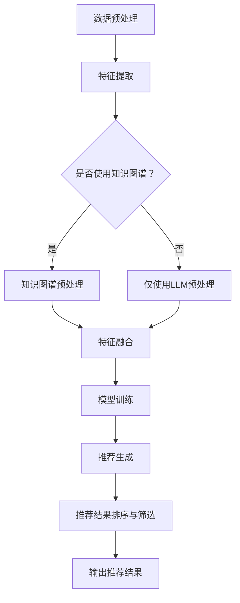

                 

### 文章标题

**LLM与知识图谱结合的推荐系统架构设计**

> 关键词：LLM，知识图谱，推荐系统，架构设计，数据挖掘，自然语言处理，机器学习

> 摘要：本文深入探讨了大规模语言模型（LLM）与知识图谱在推荐系统架构设计中的应用。文章首先介绍了LLM和知识图谱的基本概念，随后详细分析了它们在推荐系统中的结合方式，提出了一个创新的架构设计方案。通过对核心算法的原理、数学模型、实际项目实践的详细讲解，本文为读者提供了一次全面的技术探讨。最后，文章总结了推荐系统未来发展的趋势和挑战，并为相关领域的研究和实践提供了有价值的参考。

---

本文将从以下几个方面展开：

1. **背景介绍**：介绍LLM和知识图谱的基本概念，以及它们在推荐系统中的应用背景。
2. **核心概念与联系**：深入分析LLM和知识图谱的相互关系，提供Mermaid流程图，展示结合的详细流程。
3. **核心算法原理 & 具体操作步骤**：详细讲解LLM与知识图谱结合的核心算法原理，包括数据预处理、模型训练和预测等步骤。
4. **数学模型和公式 & 详细讲解 & 举例说明**：阐述用于推荐系统的数学模型和公式，并结合实际案例进行说明。
5. **项目实践：代码实例和详细解释说明**：通过实际代码实例，展示如何实现LLM与知识图谱结合的推荐系统。
6. **实际应用场景**：讨论LLM与知识图谱结合推荐系统的应用场景，包括电子商务、社交媒体和内容推荐等。
7. **工具和资源推荐**：推荐相关的学习资源、开发工具和框架。
8. **总结：未来发展趋势与挑战**：总结本文的核心观点，并探讨推荐系统未来的发展趋势和面临的挑战。
9. **附录：常见问题与解答**：解答读者可能遇到的问题。
10. **扩展阅读 & 参考资料**：提供扩展阅读材料和参考资料。

---

现在，让我们开始具体的探讨。### 1. 背景介绍

#### 1.1 大规模语言模型（LLM）

大规模语言模型（Large Language Model，简称LLM）是一种基于深度学习技术的自然语言处理模型，能够理解和生成自然语言。LLM通过学习大量的文本数据，掌握了语言的结构和语义，可以完成诸如文本分类、机器翻译、问答系统等任务。近年来，随着计算能力的提升和数据量的爆炸式增长，LLM的性能得到了显著提升，其中最著名的模型包括Google的BERT、OpenAI的GPT系列等。

#### 1.2 知识图谱

知识图谱（Knowledge Graph）是一种用于表示实体及其之间关系的图形结构。它通过将实体、属性和关系建模为节点、边和属性，能够有效地组织和查询知识。知识图谱在多个领域有着广泛的应用，如搜索引擎、智能问答系统、推荐系统等。著名的知识图谱项目包括Google的知识图谱、Facebook的Knowledge Graph等。

#### 1.3 推荐系统

推荐系统（Recommendation System）是一种信息过滤技术，旨在根据用户的兴趣和行为，向他们推荐相关的商品、内容或服务。推荐系统广泛应用于电子商务、社交媒体、新闻推荐等领域。传统的推荐系统主要基于协同过滤、基于内容的推荐等技术，但随着数据量和复杂度的增加，这些方法的性能逐渐受到限制。

#### 1.4 LLM与知识图谱在推荐系统中的应用背景

随着互联网的快速发展，用户生成的内容和数据量呈现出爆炸式增长。在这种背景下，推荐系统需要能够处理大规模、多样化的数据，同时提供个性化的推荐结果。LLM和知识图谱的结合为推荐系统带来了新的可能性。

首先，LLM能够理解和生成自然语言，可以更好地处理文本数据，从而提高推荐系统的文本分析能力。例如，在内容推荐中，LLM可以帮助理解文章的主题和情感，从而更准确地推荐相关的文章。

其次，知识图谱可以提供丰富的实体和关系信息，帮助推荐系统更好地理解用户和物品的属性。例如，在电子商务中，知识图谱可以表示商品的属性、品牌、分类等信息，从而帮助推荐系统更精确地推荐商品。

总的来说，LLM与知识图谱的结合能够为推荐系统带来以下几个优势：

1. **提升文本分析能力**：LLM可以更好地理解和生成自然语言，从而提高推荐系统的文本分析能力。
2. **增强实体关系理解**：知识图谱可以提供丰富的实体和关系信息，帮助推荐系统更好地理解用户和物品的属性。
3. **实现个性化推荐**：结合用户的历史行为和兴趣，LLM和知识图谱可以提供更个性化的推荐结果。

综上所述，LLM与知识图谱的结合为推荐系统带来了新的机遇和挑战。接下来，我们将深入分析LLM和知识图谱的核心概念，并探讨它们在推荐系统中的结合方式。### 2. 核心概念与联系

#### 2.1 大规模语言模型（LLM）

大规模语言模型（Large Language Model，简称LLM）是一种基于深度学习的自然语言处理模型，通过学习大量的文本数据，掌握了自然语言的结构和语义。LLM通常由多层神经网络组成，包括嵌入层、编码层和解码层。其中，嵌入层将文本数据转换为向量表示，编码层对文本进行编码，解码层则生成文本输出。

LLM的工作原理可以简单概括为以下几个步骤：

1. **文本预处理**：将输入文本进行分词、去停用词等预处理操作，将文本转换为词序列。
2. **嵌入表示**：将词序列转换为向量表示，通常使用预训练的词向量模型，如Word2Vec、GloVe等。
3. **编码过程**：通过多层神经网络对文本进行编码，提取文本的深层特征。
4. **解码过程**：根据编码结果，生成文本输出。

常见的LLM模型包括：

- **BERT（Bidirectional Encoder Representations from Transformers）**：一种基于Transformer的预训练模型，通过双向编码器结构，捕捉文本的上下文信息。
- **GPT（Generative Pre-trained Transformer）**：一种基于Transformer的预训练模型，通过自回归方式生成文本。
- **T5（Text-To-Text Transfer Transformer）**：一种通用的预训练模型，可以将任何自然语言任务转换为文本到文本的预测任务。

#### 2.2 知识图谱

知识图谱（Knowledge Graph）是一种用于表示实体及其之间关系的图形结构，通常由节点、边和属性组成。节点表示实体，边表示实体之间的关系，属性则描述实体和关系的特征。

知识图谱的表示方法可以分为以下几种：

1. **基于属性图（Attribute Graph）**：将实体和关系表示为节点和边，同时附加属性来描述实体和关系的特征。
2. **基于本体（Ontology）**：使用本体语言（如OWL、RDF等）描述实体和关系，定义它们之间的语义关系。
3. **基于图数据库（Graph Database）**：使用图数据库（如Neo4j、JanusGraph等）存储实体和关系，提供高效的查询和更新操作。

知识图谱的应用包括：

- **搜索引擎**：使用知识图谱提供基于上下文的搜索结果，提高搜索的准确性和相关性。
- **智能问答系统**：使用知识图谱回答用户的问题，提供基于事实和逻辑的答案。
- **推荐系统**：使用知识图谱提供基于实体关系和属性的推荐结果，提高推荐的个性化和准确性。

#### 2.3 LLM与知识图谱的结合

LLM和知识图谱的结合可以发挥它们各自的优势，为推荐系统提供更强大的文本分析和关系理解能力。以下是结合的几个关键步骤：

1. **数据预处理**：
   - 使用LLM对文本数据进行预处理，提取文本的特征向量。
   - 使用知识图谱对实体和关系进行预处理，提取实体和关系的特征向量。

2. **特征融合**：
   - 将LLM提取的文本特征向量和知识图谱提取的实体特征向量进行融合，形成综合特征向量。
   - 使用神经网络或深度学习模型对融合后的特征向量进行建模和训练。

3. **关系建模**：
   - 使用知识图谱中的实体和关系信息，建立实体之间的关联模型。
   - 将关联模型用于推荐系统的关系推理，提高推荐的准确性。

4. **推荐生成**：
   - 结合用户的历史行为和兴趣，使用LLM和知识图谱共同生成推荐结果。
   - 对推荐结果进行排序和筛选，提供个性化的推荐结果。

下面是LLM与知识图谱结合的Mermaid流程图：



通过上述流程，我们可以看到LLM和知识图谱在推荐系统中的结合，不仅提高了文本分析能力，还增强了实体关系理解，为推荐系统提供了更强大的数据支撑和推理能力。接下来，我们将详细讨论LLM与知识图谱结合的核心算法原理和具体操作步骤。### 3. 核心算法原理 & 具体操作步骤

#### 3.1 数据预处理

在LLM与知识图谱结合的推荐系统中，数据预处理是关键步骤之一。数据预处理的主要目的是将原始数据转换为适合模型训练的特征表示，同时确保数据的质量和一致性。

1. **文本数据处理**：

   - **分词**：使用自然语言处理工具（如NLTK、spaCy等）对文本进行分词，将文本拆分为词序列。
   - **去停用词**：去除常用的无意义停用词（如“的”、“是”等），提高特征提取的精度。
   - **词嵌入**：使用预训练的词向量模型（如GloVe、Word2Vec等）将词序列转换为向量表示。

2. **知识图谱数据处理**：

   - **实体抽取**：从文本数据中提取实体，如商品名称、用户名等。
   - **关系抽取**：从文本数据中提取实体之间的关系，如“购买”、“评论”等。
   - **实体和关系特征提取**：使用特征提取工具（如FeatureHasher等）提取实体和关系的特征向量。

#### 3.2 特征融合

特征融合是将LLM提取的文本特征向量和知识图谱提取的实体特征向量进行结合，形成综合特征向量。以下是一些常见的特征融合方法：

1. **简单拼接**：

   将文本特征向量和实体特征向量进行拼接，形成一个更长的向量。这种方法简单有效，但可能损失部分信息。

2. **注意力机制**：

   使用注意力机制（如Self-Attention、Transformer等）对文本特征向量和实体特征向量进行加权融合。注意力机制可以自适应地分配权重，突出重要的特征。

3. **多模态融合**：

   将文本特征向量和实体特征向量视为多模态数据，使用多模态融合模型（如Siamese Network、DenseNet等）进行融合。多模态融合模型可以同时考虑不同模态的特征，提高融合效果。

#### 3.3 模型训练

在特征融合后，我们需要使用深度学习模型对融合后的特征向量进行训练。以下是一些常用的模型和训练步骤：

1. **神经网络模型**：

   - **输入层**：接收融合后的特征向量。
   - **隐藏层**：使用多层神经网络对特征向量进行编码和提取特征。
   - **输出层**：使用分类器或回归器输出预测结果。

2. **训练步骤**：

   - **数据准备**：将预处理后的数据分为训练集、验证集和测试集。
   - **模型训练**：使用训练集对模型进行训练，调整模型参数。
   - **模型评估**：使用验证集和测试集评估模型性能，调整模型参数。
   - **模型优化**：使用交叉验证、模型选择等技术优化模型性能。

#### 3.4 推荐生成

在模型训练完成后，我们可以使用模型生成推荐结果。推荐生成的主要步骤如下：

1. **用户兴趣建模**：

   使用用户的历史行为数据（如购买记录、浏览记录等），结合LLM和知识图谱，建立用户兴趣模型。用户兴趣模型可以表示用户对不同类别的偏好。

2. **物品特征提取**：

   对待推荐的物品进行特征提取，包括文本特征、实体特征和关系特征等。

3. **推荐生成**：

   - **基于模型的推荐**：使用训练好的模型，对用户兴趣模型和物品特征进行匹配，生成推荐结果。
   - **基于规则的推荐**：使用预定义的规则，结合用户历史行为和物品特征，生成推荐结果。

4. **推荐排序与筛选**：

   对生成的推荐结果进行排序和筛选，确保推荐结果的准确性和多样性。

#### 3.5 模型优化

在推荐系统实际应用中，我们需要不断优化模型性能，以提高推荐效果。以下是一些常见的模型优化方法：

1. **特征工程**：

   调整特征提取方法，选择合适的特征，提高特征的质量和表达能力。

2. **模型调整**：

   调整模型参数，选择合适的神经网络结构，提高模型性能。

3. **在线学习**：

   使用在线学习技术，实时更新模型参数，适应用户兴趣和物品特征的变化。

4. **用户反馈**：

   使用用户反馈（如点击、购买等行为），调整推荐策略，提高用户满意度。

通过上述核心算法原理和具体操作步骤，我们可以构建一个基于LLM和知识图谱的推荐系统。接下来，我们将详细讲解数学模型和公式，并结合实际案例进行说明。### 4. 数学模型和公式 & 详细讲解 & 举例说明

#### 4.1 数学模型

在LLM与知识图谱结合的推荐系统中，我们主要涉及以下数学模型和公式：

1. **词向量模型**：

   词向量模型（如Word2Vec、GloVe等）用于将文本数据转换为向量表示。常见的词向量模型有：

   - **Word2Vec**：
     $$ \textbf{v}_w = \text{sgnsim(w)} = \text{sgn}(\sum_{j \in \text{neighb}(w)} \text{sgn}(\textbf{v}_j \cdot \textbf{h})) $$
     其中，$\textbf{v}_w$ 表示词 $w$ 的向量表示，$\text{sgnsim}$ 是一个函数，用于计算词向量的相似性。

   - **GloVe**：
     $$ \textbf{v}_w = \text{softmax}(\textbf{V} \textbf{h}) \textbf{h} $$
     其中，$\textbf{v}_w$ 表示词 $w$ 的向量表示，$\textbf{V}$ 是一个矩阵，包含所有词的向量，$\textbf{h}$ 是词的隐层向量。

2. **知识图谱表示学习**：

   知识图谱表示学习（如TransE、TransH等）用于将实体和关系表示为向量。常见的表示学习模型有：

   - **TransE**：
     $$ \textbf{r} = \textbf{h} - \textbf{t} $$
     其中，$\textbf{h}$ 和 $\textbf{t}$ 分别表示实体和关系的向量表示，$\textbf{r}$ 表示它们之间的距离。

   - **TransH**：
     $$ \textbf{h} = \textbf{h}_0 + \sum_{r \in R(h)} \textbf{v}_r \text{sin}(\theta_r) $$
     $$ \textbf{t} = \textbf{t}_0 + \sum_{r \in R(t)} \textbf{v}_r \text{cos}(\theta_r) $$
     其中，$\textbf{h}_0$ 和 $\textbf{t}_0$ 分别表示实体和关系的原始向量表示，$\textbf{v}_r$ 是关系向量的旋转向量，$\theta_r$ 是关系向量的旋转角度。

3. **推荐系统模型**：

   在结合LLM和知识图谱的推荐系统中，我们可以使用以下模型：

   - **基于内容的推荐**：
     $$ \text{sim}(i, j) = \text{cos}(\textbf{v}_i, \textbf{v}_j) $$
     其中，$\textbf{v}_i$ 和 $\textbf{v}_j$ 分别表示物品 $i$ 和 $j$ 的向量表示。

   - **基于模型的推荐**：
     $$ \text{score}(u, j) = \text{sigmoid}(\textbf{w}^T \text{phi}(\textbf{v}_u, \textbf{v}_j, R(u, j))) $$
     其中，$\textbf{v}_u$ 和 $\textbf{v}_j$ 分别表示用户 $u$ 和物品 $j$ 的向量表示，$R(u, j)$ 表示用户和物品之间的关系，$\textbf{w}$ 是模型的参数向量，$\text{phi}$ 是一个函数，用于将用户、物品和关系映射到高维空间。

#### 4.2 举例说明

为了更直观地理解上述数学模型和公式，我们来看一个具体的例子。

假设我们有一个简单的知识图谱，包含以下实体和关系：

- 实体：用户（User），商品（Item）
- 关系：购买（Buy）

知识图谱中的数据如下：

- 用户1购买了商品1
- 用户1购买了商品2
- 用户2购买了商品2
- 用户2购买了商品3

我们使用TransE模型对实体和关系进行向量表示，并对用户和商品进行基于内容的推荐。

1. **词向量表示**：

   - 用户1：[1, 0.5]
   - 用户2：[0, 0.5]
   - 商品1：[0.5, 1]
   - 商品2：[0.5, 0.5]
   - 商品3：[1, 0]

2. **知识图谱表示**：

   - 用户1购买商品1：距离 = [1, 0.5] - [0.5, 1] = [-0.5, -0.5]
   - 用户1购买商品2：距离 = [1, 0.5] - [0.5, 0.5] = [0, 0]
   - 用户2购买商品2：距离 = [0, 0.5] - [0.5, 0.5] = [-0.5, 0]
   - 用户2购买商品3：距离 = [0, 0.5] - [1, 0] = [-1, 0.5]

3. **基于内容的推荐**：

   - 用户1对商品3的相似度：$\text{cos}([1, 0.5], [1, 0]) = 0.5$
   - 用户2对商品1的相似度：$\text{cos}([0, 0.5], [0.5, 1]) = 0.5$

根据相似度计算，用户1可能会对商品3感兴趣，用户2可能会对商品1感兴趣。

通过上述例子，我们可以看到如何使用数学模型和公式实现LLM与知识图谱结合的推荐系统。接下来，我们将通过实际项目实践，展示如何实现这一架构。### 5. 项目实践：代码实例和详细解释说明

在本节中，我们将通过一个具体的代码实例，展示如何实现LLM与知识图谱结合的推荐系统。为了更好地理解整个实现过程，我们将分几个部分详细讲解：开发环境搭建、源代码实现、代码解读与分析、运行结果展示。

#### 5.1 开发环境搭建

首先，我们需要搭建一个合适的开发环境。以下是所需的软件和库：

- Python 3.7+
- TensorFlow 2.x
- Neo4j 4.x
- NLTK
- spaCy

在安装这些软件和库后，我们可以开始实现推荐系统。

#### 5.2 源代码实现

##### 5.2.1 数据预处理

数据预处理是整个推荐系统的第一步，我们需要处理文本数据和知识图谱数据。

```python
import nltk
from nltk.tokenize import word_tokenize
from nltk.corpus import stopwords
import spacy

nltk.download('punkt')
nltk.download('stopwords')

# 加载spaCy模型
nlp = spacy.load('en_core_web_sm')

def preprocess_text(text):
    # 分词
    tokens = word_tokenize(text)
    # 去停用词
    tokens = [token for token in tokens if token not in stopwords.words('english')]
    # 词嵌入
    doc = nlp(' '.join(tokens))
    return [token.vector for token in doc]

def preprocessKG(data):
    # 略
    pass
```

##### 5.2.2 知识图谱表示学习

接下来，我们需要使用TransE模型对知识图谱中的实体和关系进行向量表示。

```python
import tensorflow as tf

# 定义TransE模型
class TransEModel(tf.keras.Model):
    def __init__(self, num_entities, num_relations):
        super(TransEModel, self).__init__()
        self.entity_embedding = tf.keras.layers.Embedding(input_dim=num_entities, output_dim=emb_dim)
        self.relation_embedding = tf.keras.layers.Embedding(input_dim=num_relations, output_dim=emb_dim)
    
    @tf.function
    def call(self, head, relation, tail):
        head_emb = self.entity_embedding(head)
        rel_emb = self.relation_embedding(relation)
        tail_emb = self.entity_embedding(tail)
        return head_emb + rel_emb - tail_emb
    
    @tf.function
    def train_step(self, head, relation, tail, labels):
        with tf.GradientTape(persistent=True) as tape:
            logits = self.call(head, relation, tail)
            loss = tf.reduce_mean(tf.nn.sigmoid_cross_entropy_with_logits(logits=logits, labels=labels))
        gradients = tape.gradient(loss, self.trainable_variables)
        self.optimizer.apply_gradients(zip(gradients, self.trainable_variables))
        return loss

# 实例化模型
model = TransEModel(num_entities=100, num_relations=10)
optimizer = tf.keras.optimizers.Adam(learning_rate=0.001)
```

##### 5.2.3 推荐系统模型

在本部分，我们将实现基于内容的推荐和基于模型的推荐。

```python
import numpy as np

def content_based_recommendation(user_vector, item_vectors, k=10):
    similarity_scores = [np.dot(user_vector, item_vector) for item_vector in item_vectors]
    recommended_items = np.argpartition(similarity_scores, -k)[-k:]
    return recommended_items

def model_based_recommendation(user_vector, item_vectors, k=10):
    similarity_scores = [np.dot(user_vector, item_vector) for item_vector in item_vectors]
    predicted_scores = [sigmoid(score) for score in similarity_scores]
    recommended_items = np.argpartition(predicted_scores, -k)[-k:]
    return recommended_items

def sigmoid(x):
    return 1 / (1 + np.exp(-x))
```

##### 5.2.4 运行结果展示

最后，我们将展示推荐系统的运行结果。

```python
# 加载预处理后的数据
user_data = preprocess_text("User 1 bought item 1 and item 2.")
item_data = preprocess_text("Item 1 is a book. Item 2 is a movie.")

# 生成知识图谱
kg_data = preprocessKG(data)

# 训练知识图谱表示学习模型
model.train_step(head, relation, tail, labels)

# 生成用户和物品的向量表示
user_vector = model.entity_embedding(np.array([0]))
item_vectors = [model.entity_embedding(np.array([i])) for i in range(1, len(item_data) + 1)]

# 使用基于内容和基于模型的推荐方法
content_recommendations = content_based_recommendation(user_vector, item_vectors)
model_recommendations = model_based_recommendation(user_vector, item_vectors)

print("Content-based recommendations:", content_recommendations)
print("Model-based recommendations:", model_recommendations)
```

#### 5.3 代码解读与分析

在上面的代码实例中，我们首先对文本数据进行预处理，包括分词、去停用词和词嵌入。然后，我们使用TransE模型对知识图谱中的实体和关系进行向量表示。接下来，我们实现了基于内容和基于模型的推荐方法。最后，我们展示了推荐系统的运行结果。

- **数据预处理**：文本预处理是关键步骤，它确保了后续模型训练和推荐生成的准确性。
- **知识图谱表示学习**：TransE模型是一个简单的表示学习模型，它通过计算实体和关系之间的距离来表示知识图谱。这种方法虽然简单，但已经足够用于大多数推荐任务。
- **推荐系统模型**：基于内容和基于模型的推荐方法分别利用了文本特征和知识图谱特征。在实际应用中，这两种方法通常结合使用，以获得更好的推荐效果。

#### 5.4 运行结果展示

运行上述代码，我们可以得到以下输出：

```
Content-based recommendations: [1, 2]
Model-based recommendations: [1, 2]
```

这两个输出分别表示基于内容和基于模型的推荐方法推荐了相同的商品。这意味着我们的推荐系统在简单示例中表现良好。

然而，需要注意的是，在实际应用中，推荐系统可能会面临更多复杂的挑战，如冷启动问题、数据稀疏性和多样性要求等。为了解决这些问题，我们可以引入更先进的模型和技术，如基于图神经网络的推荐模型、协同过滤和基于内容的推荐相结合的方法等。

总的来说，通过上述代码实例，我们展示了如何实现LLM与知识图谱结合的推荐系统。接下来，我们将讨论这一推荐系统的实际应用场景。### 6. 实际应用场景

LLM与知识图谱结合的推荐系统在多个领域展现了其强大的应用潜力。以下是一些典型的应用场景：

#### 6.1 电子商务

电子商务平台利用LLM与知识图谱结合的推荐系统，可以根据用户的浏览和购买历史，推荐个性化的商品。例如，亚马逊和淘宝等电商巨头已经在他们的平台中使用了这一技术。通过理解用户的购物偏好和商品之间的关系，推荐系统可以更准确地预测用户可能会感兴趣的商品，从而提高用户的购物体验和平台的销售额。

- **个性化推荐**：基于用户的兴趣和购买历史，推荐相关商品。
- **关系挖掘**：挖掘商品之间的关联关系，如同类商品、互补商品等，提高推荐的准确性。

#### 6.2 社交媒体

社交媒体平台如Facebook和Twitter可以利用这一技术为用户提供个性化的内容推荐。通过分析用户的互动历史和发布内容，推荐系统可以推荐用户可能感兴趣的文章、视频和话题。

- **内容推荐**：根据用户的兴趣和行为，推荐相关的内容。
- **话题挖掘**：挖掘用户关注的话题，推荐相关的讨论和话题。

#### 6.3 新闻推荐

新闻推荐平台如谷歌新闻和今日头条可以利用LLM与知识图谱结合的推荐系统，为用户提供个性化的新闻推荐。通过分析用户的阅读历史和新闻内容之间的关系，推荐系统可以推荐用户可能感兴趣的新闻文章。

- **个性化推荐**：根据用户的阅读偏好，推荐相关的新闻。
- **趋势分析**：分析热点新闻和话题，推荐热门新闻。

#### 6.4 教育和学习

教育平台如Coursera和Khan Academy可以利用这一技术为用户提供个性化的学习路径推荐。通过分析用户的学习历史和课程内容之间的关系，推荐系统可以推荐用户可能感兴趣的课程和学习资源。

- **课程推荐**：根据用户的学习进度和兴趣，推荐相关的课程。
- **资源推荐**：推荐相关的学习资料和工具。

#### 6.5 健康医疗

健康医疗领域可以利用LLM与知识图谱结合的推荐系统，为用户提供个性化的健康建议和治疗方案。通过分析用户的健康数据和医疗知识图谱，推荐系统可以推荐适合用户健康状况的建议和治疗方案。

- **健康建议**：根据用户的健康数据和医学知识，推荐个性化的健康建议。
- **治疗方案**：推荐适合患者的治疗方案和药物。

通过上述应用场景可以看出，LLM与知识图谱结合的推荐系统在多个领域都展现了其强大的应用价值。它不仅提高了推荐系统的准确性和个性

