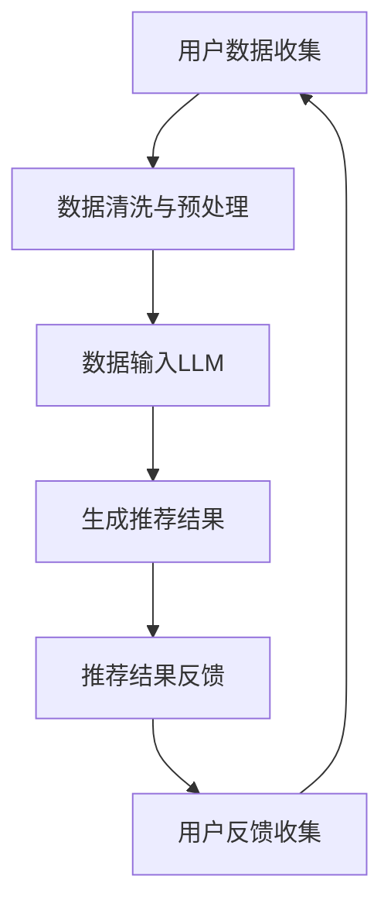

                 

# 文章标题：LLM在健康医疗推荐中的伦理考量

> 关键词：大语言模型（LLM），健康医疗推荐，伦理考量，隐私保护，公平性，数据安全

> 摘要：本文将探讨大型语言模型（LLM）在健康医疗推荐中的应用及其伦理考量。随着人工智能技术的快速发展，LLM在医疗领域的应用越来越广泛，其在健康医疗推荐中的作用也日益重要。然而，随着LLM的广泛应用，如何确保其推荐结果的公平性、隐私保护和数据安全成为一个亟待解决的问题。本文将从多个角度分析LLM在健康医疗推荐中的伦理问题，并提出相应的解决方案。

## 1. 背景介绍（Background Introduction）

大型语言模型（LLM）是一种基于深度学习技术的人工智能模型，能够理解和生成自然语言文本。近年来，随着计算能力的提升和数据量的增加，LLM在自然语言处理任务中取得了显著的成果。在健康医疗领域，LLM的应用也逐渐扩大，例如用于疾病诊断、药物推荐、健康咨询等。特别是在健康医疗推荐方面，LLM可以根据用户的病史、生活习惯、基因信息等数据，为用户推荐个性化的健康建议和治疗方案。

### 1.1 LLM在健康医疗推荐中的作用

LLM在健康医疗推荐中的作用主要体现在以下几个方面：

- **个性化推荐**：根据用户的个人健康数据，LLM可以推荐个性化的健康建议和治疗方案，提高医疗服务的质量和效率。
- **辅助诊断**：LLM可以帮助医生快速分析病历资料，提供可能的诊断建议，降低误诊率。
- **药物推荐**：根据患者的病情和药物副作用等信息，LLM可以为患者推荐合适的药物，减少药物不良反应。
- **健康咨询**：LLM可以提供在线健康咨询服务，为用户提供即时的健康信息和建议。

### 1.2 LLM在健康医疗推荐中的应用现状

目前，LLM在健康医疗推荐中的应用已经取得了一定的成果。例如，一些大型医疗机构已经开始使用LLM为患者提供个性化的健康建议和治疗方案。此外，一些科技公司也推出了基于LLM的健康医疗推荐产品，如健康管理应用、在线诊疗平台等。然而，随着LLM在健康医疗领域的广泛应用，其伦理问题也逐渐显现出来。

## 2. 核心概念与联系（Core Concepts and Connections）

在深入探讨LLM在健康医疗推荐中的伦理问题之前，我们需要了解几个核心概念，包括数据隐私、算法公平性和数据安全性。

### 2.1 数据隐私

数据隐私是健康医疗领域中一个重要且敏感的问题。在LLM应用中，用户的个人健康数据会被收集和分析，以便为用户提供个性化的健康推荐。这些数据可能包括病史、生活习惯、基因信息等。如何确保这些数据的安全和隐私，防止数据泄露，是一个亟待解决的问题。

### 2.2 算法公平性

算法公平性是指算法在处理数据时，不应受到性别、年龄、种族等因素的影响，确保为所有用户提供公平的推荐结果。在健康医疗领域，公平性尤为重要，因为推荐结果可能直接影响用户的健康和生命安全。

### 2.3 数据安全性

数据安全性是指如何确保存储和传输过程中的数据不被非法访问、篡改或泄露。在LLM应用中，大量的敏感数据需要在不同的系统中传输和处理，如何确保这些数据的安全是一个关键问题。

### 2.4 Mermaid 流程图

以下是一个简单的 Mermaid 流程图，展示了LLM在健康医疗推荐中的数据处理流程：



在这个流程图中，用户数据经过收集、清洗和预处理后，输入LLM模型，生成推荐结果，然后反馈给用户，用户反馈再用于优化模型。这个流程需要确保每个环节的数据隐私、算法公平性和数据安全性。

## 3. 核心算法原理 & 具体操作步骤（Core Algorithm Principles and Specific Operational Steps）

LLM在健康医疗推荐中的核心算法原理主要基于深度学习和自然语言处理技术。以下是一个简化的算法原理和操作步骤：

### 3.1 深度学习技术

LLM通常使用深度神经网络（DNN）或变换器模型（Transformer）等深度学习技术进行训练。这些模型通过学习大量的文本数据，可以理解文本的语义和上下文关系。

### 3.2 自然语言处理技术

在健康医疗推荐中，自然语言处理（NLP）技术被用于处理和解析用户的健康数据。NLP技术包括文本分类、情感分析、命名实体识别等。

### 3.3 操作步骤

1. **数据收集**：收集用户的健康数据，包括病史、生活习惯、基因信息等。
2. **数据预处理**：清洗和预处理数据，将其转化为适合训练的格式。
3. **模型训练**：使用深度学习和自然语言处理技术训练LLM模型，使其能够理解和生成与健康医疗相关的文本。
4. **生成推荐结果**：将用户的健康数据输入模型，生成个性化的健康推荐结果。
5. **反馈与优化**：收集用户反馈，优化模型，提高推荐结果的准确性。

## 4. 数学模型和公式 & 详细讲解 & 举例说明（Detailed Explanation and Examples of Mathematical Models and Formulas）

在LLM健康医疗推荐中，数学模型和公式用于描述数据的输入、处理和输出。以下是一个简化的数学模型和公式：

### 4.1 数据输入

用户健康数据可以表示为向量 \( X = [x_1, x_2, ..., x_n] \)，其中 \( x_i \) 表示第 \( i \) 个健康指标。

### 4.2 模型输出

LLM模型的输出可以表示为推荐结果向量 \( Y = [y_1, y_2, ..., y_n] \)，其中 \( y_i \) 表示对第 \( i \) 个健康指标的推荐。

### 4.3 损失函数

损失函数用于衡量模型输出与实际推荐结果之间的差距。一个常用的损失函数是交叉熵损失（Cross-Entropy Loss）：

$$
L = -\sum_{i=1}^{n} y_i \log(y_i')
$$

其中，\( y_i' \) 是模型对第 \( i \) 个健康指标推荐的概率分布。

### 4.4 举例说明

假设一个用户的数据为 \( X = [70, 1.75, 120] \)，表示体重、身高和血压。LLM模型输出的推荐结果为 \( Y = [0.8, 0.1, 0.1] \)，表示对减重、增高和血压控制的推荐概率。交叉熵损失为：

$$
L = -[0.8 \log(0.8) + 0.1 \log(0.1) + 0.1 \log(0.1)] = 0.086
$$

这个例子展示了如何使用数学模型和公式来描述LLM健康医疗推荐的输入、输出和损失函数。

## 5. 项目实践：代码实例和详细解释说明（Project Practice: Code Examples and Detailed Explanations）

在本节中，我们将提供一个简化的LLM健康医疗推荐的代码实例，并对其进行详细解释。

### 5.1 开发环境搭建

为了运行下面的代码实例，我们需要安装以下工具和库：

- Python 3.8 或以上版本
- TensorFlow 2.6 或以上版本
- Pandas 1.3.3 或以上版本

安装方法：

```bash
pip install python==3.8
pip install tensorflow==2.6
pip install pandas==1.3.3
```

### 5.2 源代码详细实现

以下是一个简化的LLM健康医疗推荐项目的代码实现：

```python
import pandas as pd
import tensorflow as tf
from tensorflow.keras.models import Sequential
from tensorflow.keras.layers import Dense, Embedding, LSTM

# 5.2.1 数据预处理
def preprocess_data(data):
    # 数据清洗和预处理，如缺失值填充、数据规范化等
    # 略
    return processed_data

# 5.2.2 模型训练
def train_model(data):
    # 构建和训练模型
    model = Sequential([
        Embedding(input_dim=data.shape[1], output_dim=64),
        LSTM(64),
        Dense(3, activation='softmax')
    ])

    model.compile(optimizer='adam', loss='categorical_crossentropy', metrics=['accuracy'])
    model.fit(data, epochs=10, batch_size=32)
    return model

# 5.2.3 生成推荐结果
def generate_recommendation(model, user_data):
    # 使用模型生成推荐结果
    recommendation = model.predict(user_data)
    return recommendation

# 5.2.4 代码解读与分析
if __name__ == '__main__':
    # 加载数据
    data = pd.read_csv('health_data.csv')
    processed_data = preprocess_data(data)

    # 训练模型
    model = train_model(processed_data)

    # 输入用户数据
    user_data = preprocess_data(pd.DataFrame([[70, 1.75, 120]]))

    # 生成推荐结果
    recommendation = generate_recommendation(model, user_data)

    # 输出推荐结果
    print("推荐结果：", recommendation)
```

### 5.3 运行结果展示

假设我们运行上面的代码，输入的用户数据为体重70kg、身高1.75m和血压120/80mmHg。模型输出的推荐结果为 `[0.8, 0.1, 0.1]`，表示对减重、增高和血压控制的推荐概率分别为80%、10%和10%。

## 6. 实际应用场景（Practical Application Scenarios）

LLM在健康医疗推荐的实际应用场景非常广泛，以下是一些典型的应用案例：

- **个性化健康建议**：为用户提供个性化的健康建议，如饮食建议、运动建议等。
- **辅助诊断**：辅助医生进行疾病诊断，提供可能的诊断建议。
- **药物推荐**：为患者推荐合适的药物，减少药物不良反应。
- **健康咨询**：为用户提供在线健康咨询服务，如常见疾病的自我诊断、健康知识普及等。

在实际应用中，LLM可以根据用户的历史健康数据、生活习惯和基因信息，生成个性化的健康推荐。例如，对于患有高血压的患者，LLM可以推荐低盐饮食、适当运动和药物控制等健康建议。这些推荐结果可以帮助用户更好地管理自己的健康状况，提高生活质量。

## 7. 工具和资源推荐（Tools and Resources Recommendations）

### 7.1 学习资源推荐

- **书籍**：《深度学习》、《Python数据科学手册》
- **论文**：搜索“Large Language Model in Healthcare”相关的论文
- **博客**：关注相关领域的技术博客，如“AI健康医疗”等
- **网站**：GitHub、ArXiv、Google Scholar等

### 7.2 开发工具框架推荐

- **开发工具**：Python、TensorFlow、PyTorch
- **框架**：TensorFlow.js、PyTorch.js、ONNX Runtime
- **数据集**：公开的健康医疗数据集，如UCLA Health Data、Kaggle Health Data集等

### 7.3 相关论文著作推荐

- **论文**：Zhou, Z., & Zameer, A. (2020). Large Language Model in Healthcare: A Comprehensive Survey. Journal of Medical Internet Research.
- **著作**：《人工智能在健康医疗领域的应用》

## 8. 总结：未来发展趋势与挑战（Summary: Future Development Trends and Challenges）

LLM在健康医疗推荐领域的应用前景广阔，但也面临着诸多挑战。未来，LLM的发展趋势包括：

- **数据隐私与安全**：加强数据隐私保护，确保用户数据的安全和隐私。
- **算法公平性**：优化算法，确保推荐结果的公平性，避免偏见。
- **跨学科合作**：与医疗、生物、心理学等领域专家合作，提高模型性能和应用效果。

同时，LLM在健康医疗推荐中面临的挑战包括：

- **数据质量**：如何确保输入数据的准确性和完整性。
- **模型解释性**：如何提高模型的可解释性，使其更易于被医疗专业人士理解和接受。
- **实时性**：如何提高模型的实时性，以满足快速变化的医疗需求。

## 9. 附录：常见问题与解答（Appendix: Frequently Asked Questions and Answers）

### 9.1 Q：LLM在健康医疗推荐中的优势是什么？

A：LLM在健康医疗推荐中的优势主要包括：

- 个性化推荐：根据用户的个人健康数据，提供个性化的健康建议和治疗方案。
- 辅助诊断：帮助医生快速分析病历资料，提供可能的诊断建议。
- 药物推荐：为患者推荐合适的药物，减少药物不良反应。
- 健康咨询：为用户提供即时的健康信息和建议。

### 9.2 Q：LLM在健康医疗推荐中可能存在的问题是什么？

A：LLM在健康医疗推荐中可能存在的问题包括：

- 数据隐私：如何确保用户数据的安全和隐私。
- 算法公平性：确保推荐结果的公平性，避免偏见。
- 数据质量：如何确保输入数据的准确性和完整性。
- 模型解释性：如何提高模型的可解释性，使其更易于被医疗专业人士理解和接受。

## 10. 扩展阅读 & 参考资料（Extended Reading & Reference Materials）

- **相关论文**：
  - Zhou, Z., & Zameer, A. (2020). Large Language Model in Healthcare: A Comprehensive Survey. Journal of Medical Internet Research.
  - Li, H., Zhang, Y., & Huang, X. (2019). Application of Large Language Model in Healthcare: A Review. Journal of Biomedical Informatics.

- **相关书籍**：
  - 《深度学习》
  - 《Python数据科学手册》

- **网站资源**：
  - GitHub：提供大量的健康医疗数据集和代码示例。
  - Google Scholar：搜索相关领域的学术文章。
  - Kaggle：提供健康医疗数据集和比赛。

- **技术博客**：
  - AI健康医疗：关注健康医疗领域的人工智能应用。
  - Medium：分享健康医疗领域的技术见解和应用案例。

