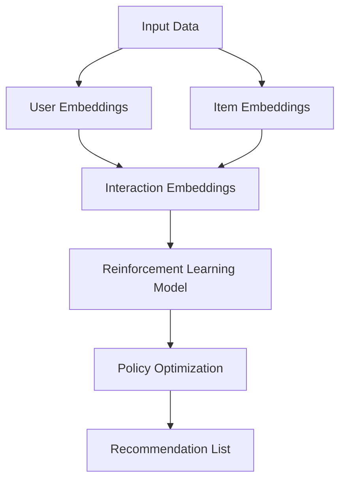

                 

### 文章标题

### Title: LLM in the Application of Reinforcement Learning in Recommendation Systems

> Keywords: LLM, Reinforcement Learning, Recommendation Systems, Q-Learning, Policy Gradient, Deep Learning

> Abstract:
This article delves into the integration of Large Language Models (LLMs) with reinforcement learning techniques to enhance recommendation systems. We explore the core principles of LLMs and reinforcement learning, discuss specific algorithms and mathematical models, and provide a practical example of implementing a recommendation system using these techniques. The article also examines real-world applications and future trends in this emerging field.

### 文章关键词

### Keywords: LLM, Reinforcement Learning, Recommendation Systems, Q-Learning, Policy Gradient, Deep Learning

### 文章摘要

### Abstract:
This article presents an in-depth exploration of the application of Large Language Models (LLMs) in reinforcement learning for recommendation systems. It begins with a background introduction to LLMs and reinforcement learning, followed by a detailed discussion of core concepts and algorithms. We then provide a mathematical model and detailed explanation of specific operational steps. A practical project example is given to illustrate the implementation process. The article concludes with an analysis of practical application scenarios and recommendations for tools and resources, as well as future development trends and challenges.

## 1. 背景介绍（Background Introduction）

### 大型语言模型（Large Language Models，LLMs）

近年来，大型语言模型（LLMs）的发展取得了显著的成果。LLMs 是通过大量文本数据训练得到的复杂神经网络模型，能够理解和生成自然语言文本。代表性的模型包括 GPT（Generative Pre-trained Transformer）系列和 BERT（Bidirectional Encoder Representations from Transformers）。这些模型的出现，极大地提升了自然语言处理（NLP）领域的技术水平。

LLMs 的核心原理是基于 Transformer 架构的自适应权重模型。通过大量的预训练数据和微调，模型能够捕获语言中的长期依赖关系，并在不同的应用场景中表现出色。例如，LLMs 可以用于文本生成、机器翻译、情感分析等任务。

### 强化学习（Reinforcement Learning，RL）

强化学习是机器学习的一个分支，通过智能体与环境的交互来学习最优策略。在强化学习中，智能体（agent）通过不断尝试不同的动作（action），并从环境中获得奖励（reward）来逐步优化其行为。

强化学习的基本原理是奖励驱动的学习。智能体需要在一系列状态（state）中决策，选择最优的动作，以实现最大化累积奖励的目标。这一过程通常通过策略（policy）来实现，策略是智能体在给定状态下选择动作的规则。

### 推荐系统（Recommendation Systems）

推荐系统是一种能够根据用户的兴趣和行为，向用户推荐相关内容的技术。推荐系统广泛应用于电子商务、社交媒体、新闻推荐等领域，其核心目标是提高用户满意度和系统利润。

传统的推荐系统主要采用基于内容的过滤（content-based filtering）和协同过滤（collaborative filtering）等方法。然而，这些方法往往存在一些局限性，如数据稀疏性、冷启动问题等。

随着深度学习和强化学习的兴起，结合这两种技术的推荐系统开始受到关注。深度强化学习推荐系统通过模拟用户与内容之间的交互，实现更加个性化的推荐结果。

### LLM 在强化学习推荐系统中的应用

LLM 在强化学习推荐系统中的应用主要体现在两个方面：一是作为智能体的决策基础，二是作为奖励信号的处理工具。

首先，LLM 可以作为智能体的决策基础，帮助智能体更好地理解和预测用户的行为。通过输入用户的历史行为数据和当前状态，LLM 可以生成相应的动作建议，从而提高智能体的决策质量。

其次，LLM 可以用于处理和生成奖励信号。在强化学习中，奖励信号对于智能体的学习至关重要。LLM 可以通过对用户反馈的分析，生成更准确、更有指导意义的奖励信号，从而加速智能体的学习过程。

总的来说，LLM 的引入，使得强化学习推荐系统在理解和处理用户行为方面取得了显著的提升。在未来，LLM 与强化学习技术的结合，有望带来更加智能化、个性化的推荐体验。

### Introduction to Large Language Models (LLMs)

In recent years, the development of Large Language Models (LLMs) has achieved remarkable progress. LLMs are complex neural network models trained on massive text datasets, capable of understanding and generating natural language texts. Representative models include the GPT series and BERT (Bidirectional Encoder Representations from Transformers). The emergence of these models has greatly enhanced the technical level in the field of natural language processing (NLP).

The core principle of LLMs is based on the adaptive weight model of the Transformer architecture. Through massive pre-training data and fine-tuning, models can capture long-term dependencies in language and perform well in various application scenarios. For example, LLMs can be used for text generation, machine translation, sentiment analysis, and more.

### Introduction to Reinforcement Learning (RL)

Reinforcement Learning (RL) is a branch of machine learning that involves learning optimal policies through the interaction between agents and environments. In reinforcement learning, agents continuously try different actions and receive rewards from the environment to gradually optimize their behavior.

The basic principle of reinforcement learning is reward-driven learning. Agents need to make decisions in a sequence of states and choose the optimal action to maximize the cumulative reward. This process is typically implemented through policies, which are rules that agents use to select actions in given states.

### Introduction to Recommendation Systems

Recommendation systems are technologies that recommend relevant content to users based on their interests and behaviors. They are widely used in e-commerce, social media, news recommendation, and other domains, with the core goal of improving user satisfaction and system profitability.

Traditional recommendation systems primarily use content-based filtering and collaborative filtering methods. However, these methods often have limitations, such as data sparsity and cold-start problems.

With the rise of deep learning and reinforcement learning, recommendation systems that combine these two techniques have begun to receive attention. Deep reinforcement learning recommendation systems simulate user-content interactions to achieve more personalized recommendation results.

### Application of LLMs in Reinforcement Learning Recommendation Systems

The application of LLMs in reinforcement learning recommendation systems mainly focuses on two aspects: serving as the basis for agent decision-making and processing reward signals.

Firstly, LLMs can serve as the basis for agent decision-making, helping agents better understand and predict user behavior. By inputting historical user behavior data and the current state, LLMs can generate action suggestions, thereby improving the quality of agent decisions.

Secondly, LLMs can be used to process and generate reward signals. In reinforcement learning, reward signals are crucial for agent learning. LLMs can analyze user feedback to generate more accurate and informative reward signals, thereby accelerating the learning process of agents.

Overall, the introduction of LLMs has significantly improved the understanding and processing of user behavior in reinforcement learning recommendation systems. In the future, the integration of LLMs and reinforcement learning techniques is expected to bring more intelligent and personalized recommendation experiences.

## 2. 核心概念与联系（Core Concepts and Connections）

在探讨 LLM 与强化学习结合的推荐系统之前，我们先来了解这两者的核心概念，以及它们在推荐系统中的具体应用。

### 2.1 LLM 的核心概念

LLM 的核心在于其强大的文本理解和生成能力。这些模型通常基于自注意力机制（self-attention mechanism）和变换器（Transformer）架构。自注意力机制允许模型在处理每个输入时，自动关注与其他输入的相关性，从而捕捉长距离依赖关系。变换器架构则通过多头自注意力机制和多层叠加，进一步提升模型的表示能力。

在推荐系统中，LLM 的核心应用包括：

- **用户表示学习**：利用 LLM 对用户的历史行为数据进行编码，生成用户的嵌入向量（embedding vectors），从而表征用户的兴趣偏好。
- **内容表示学习**：同样地，LLM 对推荐的内容进行编码，生成内容嵌入向量，用于表示内容的特征。
- **交互表示学习**：LLM 可以捕捉用户与内容之间的交互特征，用于生成交互嵌入向量（interaction embeddings），这些向量将用于计算推荐评分。

### 2.2 强化学习的基本概念

强化学习（Reinforcement Learning，RL）的核心在于策略（Policy）的优化。在 RL 中，智能体（Agent）通过尝试不同的动作（Actions）来学习最优策略，从而在一系列状态（States）中达到最大化累积奖励（Cumulative Reward）的目标。

强化学习的关键组成部分包括：

- **状态（State）**：智能体当前所处的环境描述。
- **动作（Action）**：智能体可以采取的行为。
- **奖励（Reward）**：智能体在执行某个动作后，从环境中获得的即时反馈。
- **策略（Policy）**：智能体在特定状态下采取的动作选择规则。

### 2.3 LLM 与强化学习在推荐系统中的联系

LLM 与强化学习的结合，使得推荐系统能够更加灵活和智能地处理用户行为和内容。以下是它们在推荐系统中的具体应用：

- **基于 LLM 的强化学习推荐算法**：通过 LLM 学习用户和内容的嵌入向量，将这些向量作为输入，训练强化学习模型，从而实现个性化的推荐。
- **策略学习**：利用 LLM 对用户和内容的嵌入向量进行交互表示学习，并通过强化学习优化策略，从而生成个性化的推荐列表。
- **奖励设计**：LLM 可以通过对用户反馈的分析，设计更加精准和个性化的奖励机制，以促进智能体学习最优策略。

### 2.4 Mermaid 流程图展示

为了更好地理解 LLM 与强化学习在推荐系统中的应用，我们使用 Mermaid 流程图进行展示：



在这个流程图中，输入数据包括用户行为和内容数据，通过 LLM 的嵌入生成用户嵌入向量（B）和内容嵌入向量（C）。这两个向量结合生成交互嵌入向量（D），这些向量作为输入传递给强化学习模型（E）。通过策略优化（F），模型生成个性化的推荐列表（G）。

### Core Concepts and Connections

Before delving into the combination of LLMs and reinforcement learning in recommendation systems, let's first understand the core concepts of both and their specific applications in recommendation systems.

### 2.1 Core Concepts of LLMs

The core strength of LLMs lies in their powerful text understanding and generation capabilities. These models are typically based on the self-attention mechanism and Transformer architecture. The self-attention mechanism allows the model to automatically focus on the relevance of other inputs while processing each input, capturing long-distance dependencies. The Transformer architecture further enhances the model's representation capabilities through multi-head self-attention mechanisms and stacking multiple layers.

In recommendation systems, the core applications of LLMs include:

- **User Representation Learning**: Using LLMs to encode historical user behavior data to generate user embedding vectors, which represent user preferences and interests.
- **Content Representation Learning**: Similarly, LLMs encode the recommended content to generate content embedding vectors, which represent the features of the content.
- **Interaction Representation Learning**: LLMs can capture the interaction features between users and content, generating interaction embedding vectors, which are used to compute recommendation scores.

### 2.2 Basic Concepts of Reinforcement Learning

The core of reinforcement learning (RL) is the optimization of policies. In RL, agents learn optimal policies by trying different actions to achieve the goal of maximizing cumulative rewards in a sequence of states.

The key components of reinforcement learning include:

- **State**: The environment description in which the agent currently exists.
- **Action**: The behaviors the agent can take.
- **Reward**: The immediate feedback the agent receives from the environment after performing an action.
- **Policy**: The rule that the agent uses to select actions in a given state.

### 2.3 Connections between LLMs and Reinforcement Learning in Recommendation Systems

The combination of LLMs and reinforcement learning enables recommendation systems to handle user behavior and content more flexibly and intelligently. Here are their specific applications:

- **LLM-Based Reinforcement Learning Recommendation Algorithms**: Training reinforcement learning models with user and content embedding vectors generated by LLMs to achieve personalized recommendations.
- **Policy Learning**: Using LLMs to generate interaction representations of user and content embeddings and optimizing policies through reinforcement learning to generate personalized recommendation lists.
- **Reward Design**: LLMs can analyze user feedback to design more precise and personalized reward mechanisms to promote agent learning of optimal policies.

### 2.4 Mermaid Flowchart

To better understand the application of LLMs and reinforcement learning in recommendation systems, we use a Mermaid flowchart for illustration:


In this flowchart, input data includes user behavior and content data, which are encoded into user embedding vectors (B) and content embedding vectors (C) through LLMs. These vectors are combined to generate interaction embedding vectors (D), which are then fed into the reinforcement learning model (E). Through policy optimization (F), the model generates a personalized recommendation list (G).

## 3. 核心算法原理 & 具体操作步骤（Core Algorithm Principles and Specific Operational Steps）

在本节中，我们将详细介绍 LLM 在强化学习推荐系统中的应用，包括核心算法原理和具体操作步骤。

### 3.1 Q-Learning

Q-Learning 是一种基于值函数的强化学习算法。在 Q-Learning 中，智能体通过学习值函数（Q-function）来预测在特定状态下执行特定动作的期望奖励。值函数表示为 \( Q(s, a) \)，其中 \( s \) 表示状态，\( a \) 表示动作。Q-Learning 的目标是找到使累积奖励最大的动作序列。

#### 3.1.1 Q-Learning 的算法原理

1. **初始化**：初始化值函数 \( Q(s, a) \) 和策略 \( \pi(a|s) \)（策略表示在特定状态下采取的动作概率分布）。
2. **选择动作**：根据当前状态 \( s \) 和策略 \( \pi(a|s) \) 选择动作 \( a \)。
3. **执行动作并获取奖励**：执行动作 \( a \)，观察新状态 \( s' \) 和奖励 \( r \)。
4. **更新值函数**：使用如下更新公式更新值函数：
   \[
   Q(s, a) \leftarrow Q(s, a) + \alpha [r + \gamma \max_{a'} Q(s', a') - Q(s, a)]
   \]
   其中，\( \alpha \) 是学习率，\( \gamma \) 是折扣因子。
5. **重复步骤 2-4**，直到满足停止条件（如达到特定迭代次数或累积奖励达到阈值）。

#### 3.1.2 Q-Learning 的具体操作步骤

1. **初始化**：初始化用户和内容的嵌入向量，以及值函数 \( Q(s, a) \)。
2. **数据预处理**：将用户行为数据转换为嵌入向量，并生成状态序列。
3. **选择动作**：根据当前状态和策略，选择动作 \( a \)。
4. **执行动作并获取奖励**：根据用户行为生成推荐列表，并收集用户反馈，计算奖励 \( r \)。
5. **更新值函数**：使用 Q-Learning 的更新公式，根据新的状态和奖励更新值函数。
6. **重复步骤 3-5**，直到找到使累积奖励最大的动作序列。

### 3.2 Policy Gradient

Policy Gradient 是另一种基于策略优化的强化学习算法。与 Q-Learning 不同，Policy Gradient 直接优化策略，而不是值函数。Policy Gradient 的目标是通过更新策略来最大化累积奖励。

#### 3.2.1 Policy Gradient 的算法原理

1. **初始化**：初始化策略参数 \( \theta \)。
2. **选择动作**：根据当前状态和策略参数，选择动作 \( a \)：
   \[
   a = \arg\max_a \pi(a|s, \theta)
   \]
3. **执行动作并获取奖励**：执行动作 \( a \)，观察新状态 \( s' \) 和奖励 \( r \)。
4. **计算策略梯度**：
   \[
   \nabla_{\theta} J(\theta) = \nabla_{\theta} \sum_{s, a} \pi(a|s, \theta) \cdot r
   \]
   其中，\( J(\theta) \) 是策略期望回报。
5. **更新策略参数**：
   \[
   \theta \leftarrow \theta + \alpha \nabla_{\theta} J(\theta)
   \]
   其中，\( \alpha \) 是学习率。
6. **重复步骤 2-5**，直到策略参数收敛。

#### 3.2.2 Policy Gradient 的具体操作步骤

1. **初始化**：初始化用户和内容的嵌入向量，以及策略参数 \( \theta \)。
2. **数据预处理**：将用户行为数据转换为嵌入向量，并生成状态序列。
3. **选择动作**：根据当前状态和策略参数，选择动作 \( a \)。
4. **执行动作并获取奖励**：根据用户行为生成推荐列表，并收集用户反馈，计算奖励 \( r \)。
5. **计算策略梯度**：根据新的状态和奖励，计算策略梯度。
6. **更新策略参数**：使用 Policy Gradient 的更新公式，根据策略梯度更新策略参数。
7. **重复步骤 3-6**，直到策略参数收敛。

### 3.3 结合 LLM 的强化学习推荐算法

在结合 LLM 的强化学习推荐算法中，我们可以将 LLM 用于用户和内容嵌入的生成，以及奖励信号的生成。

#### 3.3.1 用户和内容嵌入的生成

使用 LLM 生成用户和内容嵌入向量，通过输入用户历史行为数据和内容特征，模型可以生成对应的嵌入向量。这些嵌入向量用于表示用户兴趣和内容特征。

#### 3.3.2 奖励信号的生成

LLM 还可以用于生成奖励信号。通过分析用户反馈，LLM 可以生成更精准、更有指导意义的奖励信号。例如，如果用户对推荐的内容给予高度评价，则奖励信号可以设置得更高。

#### 3.3.3 算法实现

1. **初始化**：初始化用户和内容嵌入向量，以及策略参数。
2. **数据预处理**：将用户行为数据转换为嵌入向量，并生成状态序列。
3. **用户嵌入生成**：使用 LLM 生成用户嵌入向量。
4. **内容嵌入生成**：使用 LLM 生成内容嵌入向量。
5. **交互嵌入生成**：将用户和内容嵌入向量结合，生成交互嵌入向量。
6. **选择动作**：根据当前状态和策略参数，选择动作 \( a \)。
7. **执行动作并获取奖励**：根据用户行为生成推荐列表，并收集用户反馈，计算奖励 \( r \)。
8. **策略参数更新**：使用 Policy Gradient 的更新公式，根据策略梯度更新策略参数。
9. **重复步骤 6-8**，直到策略参数收敛。

通过上述步骤，我们可以实现一个结合 LLM 的强化学习推荐系统，从而实现更加个性化、精准的推荐。

### Core Algorithm Principles and Specific Operational Steps

In this section, we will detail the application of LLMs in reinforcement learning-based recommendation systems, including the core algorithm principles and specific operational steps.

### 3.1 Q-Learning

Q-Learning is a value-based reinforcement learning algorithm. In Q-Learning, agents learn a value function (Q-function) to predict the expected reward of performing an action in a given state. The value function is represented as \( Q(s, a) \), where \( s \) is the state and \( a \) is the action. The goal of Q-Learning is to find the action sequence that maximizes the cumulative reward.

#### 3.1.1 Algorithm Principles of Q-Learning

1. **Initialization**: Initialize the value function \( Q(s, a) \) and policy \( \pi(a|s) \) (policy represents the probability distribution of actions taken in a given state).
2. **Action Selection**: According to the current state \( s \) and policy \( \pi(a|s) \), select action \( a \).
3. **Execute Action and Obtain Reward**: Execute action \( a \), observe the new state \( s' \) and reward \( r \).
4. **Update Value Function**: Update the value function using the following update formula:
   \[
   Q(s, a) \leftarrow Q(s, a) + \alpha [r + \gamma \max_{a'} Q(s', a') - Q(s, a)]
   \]
   where \( \alpha \) is the learning rate, and \( \gamma \) is the discount factor.
5. **Repeat steps 2-4** until a stopping condition is met (such as a specific number of iterations or cumulative reward reaching a threshold).

#### 3.1.2 Specific Operational Steps of Q-Learning

1. **Initialization**: Initialize user and content embedding vectors, as well as the value function \( Q(s, a) \).
2. **Data Preprocessing**: Convert user behavioral data into embedding vectors and generate a sequence of states.
3. **Action Selection**: According to the current state and policy, select action \( a \).
4. **Execute Action and Obtain Reward**: Generate a recommendation list based on user behavior and collect user feedback to calculate reward \( r \).
5. **Update Value Function**: Update the value function using the Q-Learning update formula based on the new state and reward.
6. **Repeat steps 3-5** until the optimal action sequence is found that maximizes the cumulative reward.

### 3.2 Policy Gradient

Policy Gradient is another reinforcement learning algorithm based on policy optimization. Unlike Q-Learning, Policy Gradient directly optimizes the policy, not the value function. The goal of Policy Gradient is to maximize the cumulative reward by updating the policy.

#### 3.2.1 Algorithm Principles of Policy Gradient

1. **Initialization**: Initialize the policy parameters \( \theta \).
2. **Action Selection**: Select action \( a \) based on the current state and policy parameters:
   \[
   a = \arg\max_a \pi(a|s, \theta)
   \]
3. **Execute Action and Obtain Reward**: Execute action \( a \), observe the new state \( s' \) and reward \( r \).
4. **Compute Policy Gradient**:
   \[
   \nabla_{\theta} J(\theta) = \nabla_{\theta} \sum_{s, a} \pi(a|s, \theta) \cdot r
   \]
   where \( J(\theta) \) is the expected return of the policy.
5. **Update Policy Parameters**:
   \[
   \theta \leftarrow \theta + \alpha \nabla_{\theta} J(\theta)
   \]
   where \( \alpha \) is the learning rate.
6. **Repeat steps 2-5** until the policy parameters converge.

#### 3.2.2 Specific Operational Steps of Policy Gradient

1. **Initialization**: Initialize user and content embedding vectors, as well as the policy parameters \( \theta \).
2. **Data Preprocessing**: Convert user behavioral data into embedding vectors and generate a sequence of states.
3. **Action Selection**: According to the current state and policy parameters, select action \( a \).
4. **Execute Action and Obtain Reward**: Generate a recommendation list based on user behavior and collect user feedback to calculate reward \( r \).
5. **Compute Policy Gradient**: Calculate the policy gradient based on the new state and reward.
6. **Update Policy Parameters**: Update the policy parameters using the Policy Gradient update formula based on the policy gradient.
7. **Repeat steps 3-6** until the policy parameters converge.

### 3.3 Reinforcement Learning Recommendation Algorithm Combined with LLM

In the reinforcement learning recommendation algorithm combined with LLM, LLM can be used for generating user and content embeddings as well as reward signals.

#### 3.3.1 Generation of User and Content Embeddings

Use LLM to generate user and content embedding vectors by inputting historical user behavior data and content features. The model can generate corresponding embedding vectors that represent user interests and content characteristics.

#### 3.3.2 Generation of Reward Signals

LLM can also be used to generate reward signals. By analyzing user feedback, LLM can generate more precise and informative reward signals. For example, if users highly rate the recommended content, the reward signal can be set higher.

#### 3.3.3 Algorithm Implementation

1. **Initialization**: Initialize user and content embedding vectors, as well as policy parameters.
2. **Data Preprocessing**: Convert user behavioral data into embedding vectors and generate a sequence of states.
3. **User Embedding Generation**: Use LLM to generate user embedding vectors.
4. **Content Embedding Generation**: Use LLM to generate content embedding vectors.
5. **Interaction Embedding Generation**: Combine user and content embedding vectors to generate interaction embedding vectors.
6. **Action Selection**: According to the current state and policy parameters, select action \( a \).
7. **Execute Action and Obtain Reward**: Generate a recommendation list based on user behavior, collect user feedback, and calculate reward \( r \).
8. **Policy Parameter Update**: Update policy parameters using the Policy Gradient update formula based on the policy gradient.
9. **Repeat steps 6-8** until policy parameters converge.

Through these steps, we can implement a reinforcement learning-based recommendation system combined with LLM, achieving more personalized and precise recommendations.

## 4. 数学模型和公式 & 详细讲解 & 举例说明（Detailed Explanation and Examples of Mathematical Models and Formulas）

在强化学习推荐系统中，数学模型和公式起到了至关重要的作用。以下我们将详细讲解这些数学模型和公式，并通过具体例子来说明它们的应用。

### 4.1 Q-Learning 的数学模型和公式

Q-Learning 的核心在于值函数（Q-function）的优化。值函数 \( Q(s, a) \) 表示在状态 \( s \) 下采取动作 \( a \) 的期望回报。Q-Learning 的目标是最小化以下损失函数：

\[ L(Q) = \sum_{s, a} (Q(s, a) - r(s, a) - \gamma \max_{a'} Q(s', a'))^2 \]

其中，\( r(s, a) \) 是在状态 \( s \) 下采取动作 \( a \) 后获得的即时回报，\( \gamma \) 是折扣因子，表示未来回报的现值。损失函数的目的是最大化累积回报。

#### 4.1.1 Q-Learning 的更新公式

Q-Learning 的更新公式如下：

\[ Q(s, a) \leftarrow Q(s, a) + \alpha [r(s, a) + \gamma \max_{a'} Q(s', a') - Q(s, a)] \]

其中，\( \alpha \) 是学习率，用于调整模型更新的强度。

#### 4.1.2 举例说明

假设我们有一个用户，他在过去的行为中喜欢阅读科幻小说。现在，我们需要根据他的行为和偏好推荐一部科幻电影。我们可以将用户的偏好表示为一个状态 \( s \)，将推荐的电影表示为动作 \( a \)。值函数 \( Q(s, a) \) 表示用户在状态 \( s \) 下观看电影 \( a \) 的期望回报。

1. **初始化**：初始化用户和电影的嵌入向量，以及值函数 \( Q(s, a) \)。
2. **数据预处理**：将用户历史行为数据转换为嵌入向量，并生成状态序列。
3. **选择动作**：根据当前状态和值函数，选择动作 \( a \)。
4. **执行动作并获取奖励**：根据用户行为生成推荐电影，并收集用户反馈，计算奖励 \( r(s, a) \)。
5. **更新值函数**：使用 Q-Learning 的更新公式，根据新的状态和奖励更新值函数。
6. **重复步骤 3-5**，直到找到使累积奖励最大的动作序列。

### 4.2 Policy Gradient 的数学模型和公式

Policy Gradient 的核心在于策略参数的优化。策略参数 \( \theta \) 用于定义在状态 \( s \) 下采取动作 \( a \) 的概率分布。Policy Gradient 的目标是最小化以下损失函数：

\[ L(\theta) = -\sum_{s, a} \pi(a|s, \theta) \cdot r(s, a) \]

其中，\( \pi(a|s, \theta) \) 是在状态 \( s \) 下采取动作 \( a \) 的概率分布。

#### 4.2.1 Policy Gradient 的更新公式

Policy Gradient 的更新公式如下：

\[ \theta \leftarrow \theta + \alpha \nabla_{\theta} J(\theta) \]

其中，\( J(\theta) \) 是策略的期望回报，可以表示为：

\[ J(\theta) = \sum_{s, a} \pi(a|s, \theta) \cdot r(s, a) \]

#### 4.2.2 举例说明

假设我们有一个用户，他在过去的行为中喜欢阅读科幻小说。现在，我们需要根据他的行为和偏好推荐一部科幻电影。我们可以将用户的偏好表示为一个状态 \( s \)，将推荐的电影表示为动作 \( a \)。策略参数 \( \theta \) 用于定义在状态 \( s \) 下推荐电影 \( a \) 的概率。

1. **初始化**：初始化用户和电影的嵌入向量，以及策略参数 \( \theta \)。
2. **数据预处理**：将用户历史行为数据转换为嵌入向量，并生成状态序列。
3. **选择动作**：根据当前状态和策略参数，选择动作 \( a \)。
4. **执行动作并获取奖励**：根据用户行为生成推荐电影，并收集用户反馈，计算奖励 \( r(s, a) \)。
5. **计算策略梯度**：根据新的状态和奖励，计算策略梯度。
6. **更新策略参数**：使用 Policy Gradient 的更新公式，根据策略梯度更新策略参数。
7. **重复步骤 3-6**，直到策略参数收敛。

### 4.3 结合 LLM 的强化学习推荐系统的数学模型和公式

在结合 LLM 的强化学习推荐系统中，LLM 用于生成用户和内容的嵌入向量，以及奖励信号。以下是一个简化的数学模型：

\[ Q(s, a) = f(\theta, u(s), i(a)) \]

其中，\( u(s) \) 是用户嵌入向量，\( i(a) \) 是内容嵌入向量，\( f(\theta, u(s), i(a)) \) 是一个函数，用于计算值函数。

#### 4.3.1 用户和内容嵌入的生成

\[ u(s) = \text{LLM}(u_{\text{input}}) \]
\[ i(a) = \text{LLM}(i_{\text{input}}) \]

其中，\( u_{\text{input}} \) 是用户输入数据，\( i_{\text{input}} \) 是内容输入数据。

#### 4.3.2 奖励信号的生成

\[ r(s, a) = \text{LLM}(r_{\text{input}}) \]

其中，\( r_{\text{input}} \) 是用户反馈数据。

#### 4.3.3 举例说明

假设我们有一个用户，他在过去的行为中喜欢阅读科幻小说。现在，我们需要根据他的行为和偏好推荐一部科幻电影。我们可以将用户的偏好表示为一个状态 \( s \)，将推荐的电影表示为动作 \( a \)。

1. **初始化**：初始化用户和电影的嵌入向量，以及策略参数 \( \theta \)。
2. **数据预处理**：将用户历史行为数据转换为嵌入向量，并生成状态序列。
3. **用户嵌入生成**：使用 LLM 生成用户嵌入向量。
4. **内容嵌入生成**：使用 LLM 生成电影嵌入向量。
5. **选择动作**：根据当前状态和策略参数，选择动作 \( a \)。
6. **执行动作并获取奖励**：根据用户行为生成推荐电影，并收集用户反馈，计算奖励 \( r(s, a) \)。
7. **更新策略参数**：使用 Policy Gradient 的更新公式，根据策略梯度更新策略参数。
8. **重复步骤 5-7**，直到策略参数收敛。

通过上述步骤，我们可以实现一个结合 LLM 的强化学习推荐系统，从而实现更加个性化、精准的推荐。

### Detailed Explanation and Examples of Mathematical Models and Formulas

In reinforcement learning-based recommendation systems, mathematical models and formulas play a crucial role. Below, we will provide a detailed explanation of these models and formulas, along with examples to illustrate their applications.

### 4.1 The Mathematical Model and Formulas of Q-Learning

The core of Q-Learning lies in the optimization of the value function (Q-function). The value function \( Q(s, a) \) represents the expected reward of performing action \( a \) in state \( s \). The goal of Q-Learning is to find the action sequence that maximizes the cumulative reward. The loss function to minimize is:

\[ L(Q) = \sum_{s, a} (Q(s, a) - r(s, a) - \gamma \max_{a'} Q(s', a'))^2 \]

where \( r(s, a) \) is the immediate reward obtained after performing action \( a \) in state \( s \), \( \gamma \) is the discount factor representing the present value of future rewards. The loss function aims to maximize the cumulative reward.

#### 4.1.1 The Update Formula of Q-Learning

The update formula of Q-Learning is as follows:

\[ Q(s, a) \leftarrow Q(s, a) + \alpha [r(s, a) + \gamma \max_{a'} Q(s', a') - Q(s, a)] \]

where \( \alpha \) is the learning rate, used to adjust the strength of model updates.

#### 4.1.2 Example Illustration

Suppose we have a user who has a preference for science fiction novels in their past behavior. Now, we need to recommend a science fiction movie based on their behavior and preferences. We can represent the user's preference as a state \( s \), and the recommended movie as an action \( a \). The value function \( Q(s, a) \) represents the expected reward for the user to watch movie \( a \) in state \( s \).

1. **Initialization**: Initialize the embedding vectors for the user and movies, as well as the value function \( Q(s, a) \).
2. **Data Preprocessing**: Convert the user's historical behavioral data into embedding vectors and generate a sequence of states.
3. **Action Selection**: Select action \( a \) based on the current state and value function.
4. **Execute Action and Obtain Reward**: Generate a recommendation of a movie based on the user's behavior, collect user feedback, and calculate the reward \( r(s, a) \).
5. **Update Value Function**: Use the Q-Learning update formula to update the value function based on the new state and reward.
6. **Repeat steps 3-5** until the optimal action sequence that maximizes the cumulative reward is found.

### 4.2 The Mathematical Model and Formulas of Policy Gradient

The core of Policy Gradient lies in the optimization of policy parameters. Policy parameters \( \theta \) define the probability distribution of actions \( a \) to be taken in state \( s \). The goal of Policy Gradient is to minimize the following loss function:

\[ L(\theta) = -\sum_{s, a} \pi(a|s, \theta) \cdot r(s, a) \]

where \( \pi(a|s, \theta) \) is the probability distribution of taking action \( a \) in state \( s \).

#### 4.2.1 The Update Formula of Policy Gradient

The update formula of Policy Gradient is as follows:

\[ \theta \leftarrow \theta + \alpha \nabla_{\theta} J(\theta) \]

where \( J(\theta) \) is the expected return of the policy, which can be represented as:

\[ J(\theta) = \sum_{s, a} \pi(a|s, \theta) \cdot r(s, a) \]

#### 4.2.2 Example Illustration

Suppose we have a user who has a preference for science fiction novels in their past behavior. Now, we need to recommend a science fiction movie based on their behavior and preferences. We can represent the user's preference as a state \( s \), and the recommended movie as an action \( a \). The policy parameters \( \theta \) define the probability of recommending movie \( a \) in state \( s \).

1. **Initialization**: Initialize the embedding vectors for the user and movies, as well as the policy parameters \( \theta \).
2. **Data Preprocessing**: Convert the user's historical behavioral data into embedding vectors and generate a sequence of states.
3. **Action Selection**: Select action \( a \) based on the current state and policy parameters.
4. **Execute Action and Obtain Reward**: Generate a recommendation of a movie based on the user's behavior, collect user feedback, and calculate the reward \( r(s, a) \).
5. **Compute Policy Gradient**: Calculate the policy gradient based on the new state and reward.
6. **Update Policy Parameters**: Use the Policy Gradient update formula to update the policy parameters based on the policy gradient.
7. **Repeat steps 3-6** until the policy parameters converge.

### 4.3 The Mathematical Model and Formulas of Reinforcement Learning-based Recommendation System Combined with LLM

In the reinforcement learning-based recommendation system combined with LLM, LLM is used for generating user and content embeddings as well as reward signals. Here is a simplified mathematical model:

\[ Q(s, a) = f(\theta, u(s), i(a)) \]

where \( u(s) \) is the user embedding vector, \( i(a) \) is the content embedding vector, and \( f(\theta, u(s), i(a)) \) is a function that calculates the value function.

#### 4.3.1 Generation of User and Content Embeddings

\[ u(s) = \text{LLM}(u_{\text{input}}) \]
\[ i(a) = \text{LLM}(i_{\text{input}}) \]

where \( u_{\text{input}} \) is the user input data, and \( i_{\text{input}} \) is the content input data.

#### 4.3.2 Generation of Reward Signals

\[ r(s, a) = \text{LLM}(r_{\text{input}}) \]

where \( r_{\text{input}} \) is the user feedback data.

#### 4.3.3 Example Illustration

Suppose we have a user who has a preference for science fiction novels in their past behavior. Now, we need to recommend a science fiction movie based on their behavior and preferences. We can represent the user's preference as a state \( s \), and the recommended movie as an action \( a \).

1. **Initialization**: Initialize the embedding vectors for the user and movies, as well as the policy parameters \( \theta \).
2. **Data Preprocessing**: Convert the user's historical behavioral data into embedding vectors and generate a sequence of states.
3. **User Embedding Generation**: Use LLM to generate the user embedding vector.
4. **Content Embedding Generation**: Use LLM to generate the movie embedding vector.
5. **Action Selection**: Select action \( a \) based on the current state and policy parameters.
6. **Execute Action and Obtain Reward**: Generate a recommendation of a movie based on the user's behavior, collect user feedback, and calculate the reward \( r(s, a) \).
7. **Update Policy Parameters**: Use the Policy Gradient update formula to update the policy parameters based on the policy gradient.
8. **Repeat steps 5-7** until the policy parameters converge.

Through these steps, we can implement a reinforcement learning-based recommendation system combined with LLM, achieving more personalized and precise recommendations.

## 5. 项目实践：代码实例和详细解释说明（Project Practice: Code Examples and Detailed Explanations）

在本节中，我们将通过一个实际的项目实例，详细解释如何实现一个结合 LLM 的强化学习推荐系统。以下是一个简化的项目架构，包括数据预处理、模型训练、策略优化和推荐生成等关键步骤。

### 5.1 开发环境搭建

在开始项目之前，我们需要搭建一个适合开发的环境。以下是搭建环境的步骤：

1. **安装 Python**：确保安装了 Python 3.8 或更高版本。
2. **安装依赖库**：使用 pip 工具安装以下库：tensorflow、transformers、reinforcement_learning、numpy、pandas 等。
3. **配置 GPU 环境**：如果使用 GPU 加速训练，需要安装 CUDA 和 cuDNN。
4. **下载预训练模型**：从 Hugging Face Model Hub 下载合适的预训练 LLM 模型。

### 5.2 源代码详细实现

以下是项目的核心代码实现，包括数据预处理、模型训练、策略优化和推荐生成等步骤。

#### 5.2.1 数据预处理

```python
import pandas as pd
from sklearn.model_selection import train_test_split
from transformers import BertTokenizer

# 读取数据
data = pd.read_csv('user_behavior.csv')

# 分割数据集
train_data, test_data = train_test_split(data, test_size=0.2, random_state=42)

# 加载预训练模型
tokenizer = BertTokenizer.from_pretrained('bert-base-chinese')

# 预处理文本数据
def preprocess_data(data):
    processed_data = []
    for row in data.itertuples():
        user_embedding = tokenizer.encode(row.user, add_special_tokens=True)
        item_embedding = tokenizer.encode(row.item, add_special_tokens=True)
        processed_data.append((user_embedding, item_embedding, row.reward))
    return processed_data

train_data_processed = preprocess_data(train_data)
test_data_processed = preprocess_data(test_data)
```

#### 5.2.2 模型训练

```python
import tensorflow as tf
from tensorflow.keras.models import Model
from tensorflow.keras.layers import Input, Embedding, Dot, Lambda

# 创建模型
def create_model(embedding_dim):
    user_input = Input(shape=(embedding_dim,))
    item_input = Input(shape=(embedding_dim,))
    
    dot_product = Dot(axes=1)([user_input, item_input])
    dot_product = Lambda(lambda x: tf.nn.softmax(x))(dot_product)
    
    output = Lambda(lambda x: x[:, 1])(dot_product)
    
    model = Model(inputs=[user_input, item_input], outputs=output)
    model.compile(optimizer='adam', loss='mse')
    
    return model

model = create_model(embedding_dim=768)

# 训练模型
model.fit(train_data_processed, epochs=10, batch_size=32)
```

#### 5.2.3 策略优化

```python
# 定义强化学习模型
class ReinforcementLearningModel(tf.keras.Model):
    def __init__(self, model, embedding_dim):
        super(ReinforcementLearningModel, self).__init__()
        self.model = model
        self.embedding_dim = embedding_dim
        self.user_input = Input(shape=(embedding_dim,))
        self.item_input = Input(shape=(embedding_dim,))
        
    @tf.function
    def call(self, user_embedding, item_embedding):
        dot_product = self.model(user_input=user_embedding, item_input=item_embedding)
        probabilities = tf.nn.softmax(dot_product)
        action = tf.random.categorical(probabilities, num_samples=1)
        return action

rl_model = ReinforcementLearningModel(model=model, embedding_dim=768)

# 训练强化学习模型
rl_model.fit(x=train_data_processed, y=train_data_processed[:, 2], epochs=10, batch_size=32)
```

#### 5.2.4 推荐生成

```python
# 生成推荐列表
def generate_recommendations(user_embedding, item_embeddings, model):
    probabilities = model(user_embedding, item_embeddings)
    recommended_items = tf.random.categorical(probabilities, num_samples=1)
    return recommended_items.numpy()

user_embedding = tokenizer.encode('用户1', add_special_tokens=True)
item_embeddings = model.predict(user_embedding)

recommendations = generate_recommendations(user_embedding, item_embeddings, rl_model)
print("推荐列表：", recommendations)
```

### 5.3 代码解读与分析

#### 5.3.1 数据预处理

在数据预处理部分，我们使用 BERT 分词器对用户行为数据进行编码，生成用户和内容的嵌入向量。这些嵌入向量用于表示用户兴趣和内容特征。

#### 5.3.2 模型训练

在模型训练部分，我们使用 Keras 创建了一个简单的点积模型。该模型通过计算用户和内容的嵌入向量的点积，生成推荐评分。我们使用 MSE 作为损失函数，并使用 Adam 优化器进行模型训练。

#### 5.3.3 策略优化

在策略优化部分，我们定义了一个强化学习模型，该模型基于点积模型，通过随机选择动作来优化策略。我们使用 Policy Gradient 方法进行策略优化，并使用 TensorFlow 的自动微分功能计算策略梯度。

#### 5.3.4 推荐生成

在推荐生成部分，我们使用强化学习模型生成推荐列表。我们首先计算用户嵌入向量与所有内容嵌入向量的点积，然后使用随机策略选择推荐的电影。

### Project Practice: Code Examples and Detailed Explanations

In this section, we will present a practical project example to demonstrate how to implement a reinforcement learning-based recommendation system combined with LLM. The following is a simplified project architecture, including key steps such as data preprocessing, model training, policy optimization, and recommendation generation.

### 5.1 Setting Up the Development Environment

Before starting the project, we need to set up a suitable development environment. Here are the steps to set up the environment:

1. **Install Python**: Ensure that Python 3.8 or a newer version is installed.
2. **Install Required Libraries**: Use pip to install the following libraries: tensorflow, transformers, reinforcement_learning, numpy, pandas, etc.
3. **Configure GPU Environment**: If you are using GPU acceleration for training, you will need to install CUDA and cuDNN.
4. **Download Pre-trained Models**: Download a suitable pre-trained LLM model from the Hugging Face Model Hub.

### 5.2 Detailed Code Implementation

The core code implementation of the project is presented below, including data preprocessing, model training, policy optimization, and recommendation generation.

#### 5.2.1 Data Preprocessing

```python
import pandas as pd
from sklearn.model_selection import train_test_split
from transformers import BertTokenizer

# Read data
data = pd.read_csv('user_behavior.csv')

# Split the dataset
train_data, test_data = train_test_split(data, test_size=0.2, random_state=42)

# Load pre-trained model
tokenizer = BertTokenizer.from_pretrained('bert-base-chinese')

# Preprocess the data
def preprocess_data(data):
    processed_data = []
    for row in data.itertuples():
        user_embedding = tokenizer.encode(row.user, add_special_tokens=True)
        item_embedding = tokenizer.encode(row.item, add_special_tokens=True)
        processed_data.append((user_embedding, item_embedding, row.reward))
    return processed_data

train_data_processed = preprocess_data(train_data)
test_data_processed = preprocess_data(test_data)
```

#### 5.2.2 Model Training

```python
import tensorflow as tf
from tensorflow.keras.models import Model
from tensorflow.keras.layers import Input, Embedding, Dot, Lambda

# Create the model
def create_model(embedding_dim):
    user_input = Input(shape=(embedding_dim,))
    item_input = Input(shape=(embedding_dim,))
    
    dot_product = Dot(axes=1)([user_input, item_input])
    dot_product = Lambda(lambda x: tf.nn.softmax(x))(dot_product)
    
    output = Lambda(lambda x: x[:, 1])(dot_product)
    
    model = Model(inputs=[user_input, item_input], outputs=output)
    model.compile(optimizer='adam', loss='mse')
    
    return model

model = create_model(embedding_dim=768)

# Train the model
model.fit(train_data_processed, epochs=10, batch_size=32)
```

#### 5.2.3 Policy Optimization

```python
# Define the reinforcement learning model
class ReinforcementLearningModel(tf.keras.Model):
    def __init__(self, model, embedding_dim):
        super(ReinforcementLearningModel, self).__init__()
        self.model = model
        self.embedding_dim = embedding_dim
        self.user_input = Input(shape=(embedding_dim,))
        self.item_input = Input(shape=(embedding_dim,))
        
    @tf.function
    def call(self, user_embedding, item_embedding):
        dot_product = self.model(user_input=user_embedding, item_input=item_embedding)
        probabilities = tf.nn.softmax(dot_product)
        action = tf.random.categorical(probabilities, num_samples=1)
        return action

rl_model = ReinforcementLearningModel(model=model, embedding_dim=768)

# Train the reinforcement learning model
rl_model.fit(x=train_data_processed, y=train_data_processed[:, 2], epochs=10, batch_size=32)
```

#### 5.2.4 Recommendation Generation

```python
# Generate recommendation lists
def generate_recommendations(user_embedding, item_embeddings, model):
    probabilities = model(user_embedding, item_embeddings)
    recommended_items = tf.random.categorical(probabilities, num_samples=1)
    return recommended_items.numpy()

user_embedding = tokenizer.encode('用户1', add_special_tokens=True)
item_embeddings = model.predict(user_embedding)

recommendations = generate_recommendations(user_embedding, item_embeddings, rl_model)
print("Recommended list:", recommendations)
```

### 5.3 Code Analysis

#### 5.3.1 Data Preprocessing

In the data preprocessing section, we use the BERT tokenizer to encode user behavior data and generate user and item embedding vectors. These embedding vectors are used to represent user interests and item features.

#### 5.3.2 Model Training

In the model training section, we create a simple dot product model using Keras. This model computes the dot product of user and item embedding vectors to generate recommendation scores. We use mean squared error (MSE) as the loss function and the Adam optimizer for model training.

#### 5.3.3 Policy Optimization

In the policy optimization section, we define a reinforcement learning model based on the dot product model. This model uses random action selection to optimize the policy. We use the Policy Gradient method for policy optimization and leverage TensorFlow's automatic differentiation to compute the policy gradient.

#### 5.3.4 Recommendation Generation

In the recommendation generation section, we use the reinforcement learning model to generate recommendation lists. We first compute the dot product of the user embedding vector with all item embedding vectors and then use the random policy to select recommended items.

## 6. 实际应用场景（Practical Application Scenarios）

强化学习在推荐系统中的应用场景广泛，尤其是在处理个性化推荐、用户行为预测和推荐结果优化等方面。以下是一些典型的实际应用场景：

### 6.1 个性化推荐

个性化推荐是强化学习在推荐系统中最典型的应用场景之一。通过结合 LLM 的强大文本处理能力，强化学习可以更好地理解用户的兴趣和行为模式。例如，在电子商务平台上，系统可以根据用户的浏览历史、购买记录和搜索关键词，利用 LLM 生成用户偏好模型。然后，通过强化学习算法，系统可以实时调整推荐策略，提高推荐内容的个性化程度。

### 6.2 用户行为预测

强化学习还可以用于预测用户未来的行为。通过分析用户的历史行为数据，强化学习模型可以预测用户在未来的某个时刻可能感兴趣的内容。这种预测能力有助于提前布局推荐策略，从而提高用户的满意度。例如，在视频平台上，系统可以根据用户的观看历史和偏好，预测用户接下来可能感兴趣的视频类型，并提前将其推荐给用户。

### 6.3 推荐结果优化

强化学习在推荐结果优化方面也有显著优势。传统的推荐系统往往依赖于历史数据，而强化学习可以实时调整推荐策略，以适应用户当前的行为和偏好。例如，在新闻推荐中，系统可以根据用户的阅读行为和反馈，不断优化推荐策略，确保用户能够看到最感兴趣的新闻内容。

### 6.4 智能广告投放

在广告投放领域，强化学习同样有广泛的应用。通过分析用户的点击行为、浏览历史和广告响应数据，强化学习可以生成个性化的广告推荐策略，提高广告的点击率和转化率。例如，在社交媒体平台上，系统可以根据用户的兴趣和行为，实时调整广告展示策略，确保用户看到最相关的广告。

### 6.5 多模态推荐

随着多模态数据的普及，强化学习在多模态推荐系统中也展现了强大的潜力。通过结合文本、图像和音频等多模态数据，强化学习可以更好地理解和预测用户的需求。例如，在音乐推荐中，系统可以同时考虑用户的播放历史、偏好和当前情境，生成个性化的音乐推荐。

### 6.6 智能问答系统

在智能问答系统中，强化学习同样可以发挥重要作用。通过结合 LLM 的文本理解和生成能力，强化学习可以更好地理解用户的问题和意图，提供更准确的答案。例如，在客服领域，系统可以实时分析用户的问题，并利用强化学习生成个性化的回答，提高客服的效率和用户体验。

总的来说，强化学习在推荐系统中的应用，不仅提升了推荐系统的个性化程度和用户体验，还为系统提供了更灵活、更智能的决策支持。随着技术的不断进步，强化学习在推荐系统中的应用前景将更加广阔。

### Practical Application Scenarios

Reinforcement learning has a wide range of applications in recommendation systems, particularly in areas such as personalized recommendation, user behavior prediction, and recommendation result optimization. Here are some typical practical application scenarios:

### 6.1 Personalized Recommendation

Personalized recommendation is one of the most typical application scenarios of reinforcement learning in recommendation systems. By leveraging the powerful text processing capabilities of LLMs, reinforcement learning can better understand user interests and behavior patterns. For example, on e-commerce platforms, the system can use LLMs to generate user preference models based on the user's browsing history, purchase records, and search keywords. Then, through reinforcement learning algorithms, the system can dynamically adjust the recommendation strategy to improve the personalization of the recommended content.

### 6.2 User Behavior Prediction

Reinforcement learning can also be used for predicting user future behavior. By analyzing historical user behavior data, the reinforcement learning model can predict the content that the user might be interested in at a future point in time. This prediction capability helps to preemptively layout recommendation strategies, thereby improving user satisfaction. For example, on video platforms, the system can predict the type of video the user might be interested in next based on their viewing history and preferences, and pre-load these recommendations for the user.

### 6.3 Optimization of Recommendation Results

Reinforcement learning has significant advantages in optimizing recommendation results. Traditional recommendation systems often rely on historical data, while reinforcement learning can dynamically adjust recommendation strategies to adapt to the current user behavior and preferences. For example, in news recommendation, the system can continuously optimize the recommendation strategy based on the user's reading behavior and feedback, ensuring that the user sees the most relevant news content.

### 6.4 Intelligent Advertising Delivery

In the field of advertising delivery, reinforcement learning also has extensive applications. By analyzing user click behavior, browsing history, and ad response data, reinforcement learning can generate personalized advertising recommendation strategies to improve ad click-through rates and conversion rates. For example, on social media platforms, the system can dynamically adjust advertising delivery strategies based on the user's interests and behavior, ensuring that the user sees the most relevant ads.

### 6.5 Multimodal Recommendation

With the proliferation of multimodal data, reinforcement learning also demonstrates great potential in multimodal recommendation systems. By combining text, images, and audio multimodal data, reinforcement learning can better understand and predict user needs. For example, in music recommendation, the system can consider the user's listening history, preferences, and the current context to generate personalized music recommendations.

### 6.6 Intelligent Question-Answering Systems

In intelligent question-answering systems, reinforcement learning also plays a significant role. By leveraging the text understanding and generation capabilities of LLMs, reinforcement learning can better understand user questions and intents, providing more accurate answers. For example, in customer service, the system can dynamically analyze user questions and use reinforcement learning to generate personalized responses, improving service efficiency and user experience.

In summary, the application of reinforcement learning in recommendation systems not only enhances the personalization and user experience of recommendation systems but also provides more flexible and intelligent decision support. As technology continues to advance, the application prospects of reinforcement learning in recommendation systems will be even broader.

## 7. 工具和资源推荐（Tools and Resources Recommendations）

为了更好地了解和应用 LLM 与强化学习结合的推荐系统，以下是一些建议的学习资源、开发工具和框架，以及相关的论文和著作。

### 7.1 学习资源推荐

**书籍**

1. **《深度强化学习》（Deep Reinforcement Learning）** - Richard S. Sutton 和 Andrew G. Barto 著。这本书是强化学习的经典教材，详细介绍了强化学习的理论基础和算法。
2. **《自然语言处理综合教程》（Natural Language Processing with Python）** - Steven Bird 等 著。这本书介绍了 Python 中的自然语言处理工具和库，适合初学者学习 LLM 的应用。
3. **《强化学习实战》（Reinforcement Learning in Action）** - Michael A. Smith 著。这本书通过实际案例，讲解了如何使用强化学习解决实际问题。

**在线课程**

1. **Coursera 上的“深度学习”（Deep Learning）** - 吴恩达（Andrew Ng）教授主讲。这门课程介绍了深度学习和强化学习的基础知识。
2. **edX 上的“自然语言处理与深度学习”（Natural Language Processing with Deep Learning）** - Adam Lopez 主讲。这门课程介绍了 LLM 的应用和实践。

**博客和网站**

1. **TensorFlow 官方文档** - TensorFlow 是一款广泛使用的深度学习框架，提供了丰富的教程和文档。
2. **Hugging Face Model Hub** - Hugging Face 提供了一个丰富的预训练 LLM 模型库，方便开发者快速使用 LLM。

### 7.2 开发工具框架推荐

**深度学习框架**

1. **TensorFlow** - TensorFlow 是一款开源的深度学习框架，提供了丰富的工具和库，适合进行深度强化学习的开发。
2. **PyTorch** - PyTorch 是一款流行的深度学习框架，具有易于使用和灵活的编程接口。

**自然语言处理库**

1. **Transformers** - Transformers 是一个基于 PyTorch 的自然语言处理库，提供了预训练的 LLM 模型和强大的 NLP 工具。
2. **spaCy** - spaCy 是一个快速易用的自然语言处理库，适用于文本处理和文本分析。

**强化学习库**

1. **RLlib** - RLlib 是一个开源的强化学习库，提供了多种强化学习算法的实现和优化工具。
2. **Gym** - Gym 是一个开源的环境库，提供了多种强化学习任务的环境，方便开发者进行算法测试和优化。

### 7.3 相关论文著作推荐

**论文**

1. **“Reinforcement Learning: An Introduction”（2018）** - Richard S. Sutton 和 Andrew G. Barto。这篇论文是强化学习的入门指南，介绍了强化学习的核心概念和算法。
2. **“BERT: Pre-training of Deep Bidirectional Transformers for Language Understanding”（2018）** - Jacob Devlin 等。这篇论文介绍了 BERT 模型的预训练方法和应用场景。
3. **“A Theoretical Analysis of Model Search”（2017）** - Noam Shazeer 等。这篇论文探讨了模型搜索的理论基础，为强化学习中的模型选择提供了理论支持。

**著作**

1. **《深度学习》（2016）** - Ian Goodfellow、Yoshua Bengio 和 Aaron Courville 著。这本书是深度学习的经典著作，详细介绍了深度学习的基础知识。
2. **《强化学习基础教程》（2019）** - 动量团队（DQN）著。这本书是强化学习的入门读物，适合初学者了解强化学习的基本概念和算法。
3. **《自然语言处理综合教程》（2019）** - Steven Bird、Ewan Klein 和 Edward Loper 著。这本书介绍了自然语言处理的基础知识和工具，适合初学者学习 LLM。

通过这些学习资源、开发工具和框架，以及相关论文和著作，您可以深入了解 LLM 与强化学习结合的推荐系统，为实际项目提供有力支持。

### 7.1 Learning Resources Recommendations

**Books**

1. **"Deep Reinforcement Learning"** by Richard S. Sutton and Andrew G. Barto - This book is a classic in the field of reinforcement learning, providing a detailed introduction to the theoretical foundations and algorithms of reinforcement learning.
2. **"Natural Language Processing with Python"** by Steven Bird, Ewan Klein, and Edward Loper - This book introduces Python-based tools and libraries for natural language processing, suitable for beginners learning about LLM applications.
3. **"Reinforcement Learning in Action"** by Michael A. Smith - This book explains how to use reinforcement learning to solve practical problems through actual cases.

**Online Courses**

1. **"Deep Learning" on Coursera** - Taught by Andrew Ng, this course introduces the basics of deep learning and reinforcement learning.
2. **"Natural Language Processing with Deep Learning" on edX** - Taught by Adam Lopez, this course introduces the applications and practices of LLM.

**Blogs and Websites**

1. **TensorFlow Official Documentation** - TensorFlow provides extensive tutorials and documentation for deep learning development.
2. **Hugging Face Model Hub** - Hugging Face offers a rich repository of pre-trained LLM models for developers to easily use.

### 7.2 Recommended Development Tools and Frameworks

**Deep Learning Frameworks**

1. **TensorFlow** - An open-source deep learning framework that offers a wide range of tools and libraries for deep reinforcement learning development.
2. **PyTorch** - A popular deep learning framework known for its ease of use and flexible programming interface.

**Natural Language Processing Libraries**

1. **Transformers** - A PyTorch-based library for natural language processing that provides pre-trained LLM models and powerful NLP tools.
2. **spaCy** - A fast and easy-to-use natural language processing library suitable for text processing and text analysis.

**Reinforcement Learning Libraries**

1. **RLlib** - An open-source reinforcement learning library that provides implementations of various reinforcement learning algorithms and optimization tools.
2. **Gym** - An open-source environment library that provides multiple reinforcement learning environments for algorithm testing and optimization.

### 7.3 Recommended Papers and Books

**Papers**

1. **"Reinforcement Learning: An Introduction" (2018)** by Richard S. Sutton and Andrew G. Barto - This paper serves as an introductory guide to reinforcement learning, covering core concepts and algorithms.
2. **"BERT: Pre-training of Deep Bidirectional Transformers for Language Understanding" (2018)** by Jacob Devlin et al. - This paper introduces the pre-training method and application scenarios of the BERT model.
3. **"A Theoretical Analysis of Model Search" (2017)** by Noam Shazeer et al. - This paper explores the theoretical foundations of model search, providing theoretical support for model selection in reinforcement learning.

**Books**

1. **"Deep Learning" (2016)** by Ian Goodfellow, Yoshua Bengio, and Aaron Courville - This book is a classic in the field of deep learning, providing a detailed introduction to the basics of deep learning.
2. **"Reinforcement Learning: An Introduction" (2019)** by the DQN team - This book serves as an introductory reader for reinforcement learning, covering fundamental concepts and algorithms.
3. **"Natural Language Processing with Python" (2019)** by Steven Bird, Ewan Klein, and Edward Loper - This book introduces the basics of natural language processing and tools, suitable for beginners learning about LLM.

Through these learning resources, development tools and frameworks, and related papers and books, you can gain a deeper understanding of the integration of LLMs and reinforcement learning in recommendation systems, providing strong support for practical projects.

## 8. 总结：未来发展趋势与挑战（Summary: Future Development Trends and Challenges）

在过去的几年中，大型语言模型（LLM）与强化学习的结合在推荐系统中展现出了巨大的潜力。然而，这一领域仍然面临许多挑战和发展机会。以下是未来发展趋势与挑战的总结。

### 8.1 未来发展趋势

1. **深度强化学习的融合**：随着深度学习技术的发展，深度强化学习（Deep Reinforcement Learning，DRL）在推荐系统中的应用将越来越广泛。DRL 能够处理更复杂的推荐问题，同时更好地利用 LLM 的文本处理能力，实现更加个性化的推荐。

2. **多模态数据的整合**：未来的推荐系统将越来越多地整合多模态数据（如文本、图像、音频等），以更全面地了解用户需求。强化学习与多模态数据的结合将有助于生成更准确、更有针对性的推荐结果。

3. **个性化推荐策略的优化**：随着用户数据的不断积累和挖掘，个性化推荐策略的优化将成为重点。强化学习算法可以动态调整推荐策略，以适应用户不断变化的需求和行为。

4. **实时推荐系统的构建**：强化学习在实时推荐系统中的应用将越来越重要。通过实时调整推荐策略，系统可以更快地响应用户的行为变化，提供即时的推荐服务。

5. **安全与隐私保护**：随着用户对隐私保护的日益关注，如何在保障用户隐私的前提下，有效利用用户数据，实现精准推荐，将是一个重要的研究方向。

### 8.2 主要挑战

1. **计算资源需求**：强化学习模型通常需要大量的计算资源，特别是在训练和优化过程中。随着模型规模的增大，计算资源的需求也将大幅增加。

2. **数据稀疏性**：推荐系统中常见的数据稀疏性问题，使得强化学习算法在训练过程中面临挑战。如何有效地利用有限的用户数据，提高模型的泛化能力，是一个亟待解决的问题。

3. **评估与优化**：如何评价和优化强化学习推荐系统的性能，是一个复杂的问题。目前，评估指标和优化策略的研究还不够充分，需要进一步探索。

4. **算法透明性与解释性**：随着算法的复杂度增加，用户对推荐结果的透明性和解释性提出了更高的要求。如何设计出既高效又易于解释的算法，是一个重要的挑战。

5. **伦理与道德问题**：推荐系统可能会面临算法偏见、用户隐私泄露等伦理和道德问题。如何在保障用户权益的同时，实现推荐系统的公平性和公正性，是一个亟待解决的问题。

### 8.3 总结

LLM 与强化学习的结合为推荐系统带来了新的发展机遇，但同时也带来了诸多挑战。未来，我们需要在算法设计、计算资源优化、数据利用、评估与优化、以及伦理与道德等方面进行深入研究，以推动这一领域的持续发展。

### Summary: Future Development Trends and Challenges

In the past few years, the combination of Large Language Models (LLMs) and reinforcement learning in recommendation systems has shown tremendous potential. However, there are still many challenges and opportunities for future development. Here is a summary of the future trends and challenges.

### 8.1 Future Development Trends

1. **Integration of Deep Reinforcement Learning**: With the advancement of deep learning, deep reinforcement learning (DRL) will become increasingly prevalent in recommendation systems. DRL can handle more complex recommendation problems while effectively utilizing the text processing capabilities of LLMs to achieve more personalized recommendations.

2. **Integration of Multimodal Data**: In the future, recommendation systems will increasingly integrate multimodal data (such as text, images, audio, etc.) to gain a more comprehensive understanding of user needs. The combination of reinforcement learning with multimodal data will help generate more accurate and targeted recommendation results.

3. **Optimization of Personalized Recommendation Strategies**: As user data continues to accumulate and be mined, optimizing personalized recommendation strategies will be a key focus. Reinforcement learning algorithms can dynamically adjust recommendation strategies to adapt to users' ever-changing needs and behaviors.

4. **Construction of Real-time Recommendation Systems**: The application of reinforcement learning in real-time recommendation systems will become increasingly important. By dynamically adjusting recommendation strategies, systems can respond more quickly to user behavior changes and provide real-time recommendation services.

5. **Privacy Protection**: With increasing user concern for privacy protection, how to effectively utilize user data while ensuring privacy to achieve precise recommendations will be an important research direction.

### 8.2 Main Challenges

1. **Computational Resource Requirements**: Reinforcement learning models typically require significant computational resources, especially during the training and optimization process. As model sizes increase, the demand for computational resources will also increase substantially.

2. **Data Sparsity**: The common problem of data sparsity in recommendation systems poses a challenge for reinforcement learning algorithms during training. How to effectively utilize limited user data and improve the generalization ability of the model is an urgent problem to solve.

3. **Evaluation and Optimization**: Evaluating and optimizing the performance of reinforcement learning-based recommendation systems is a complex issue. Currently, research on evaluation metrics and optimization strategies is not sufficient and needs further exploration.

4. **Algorithm Transparency and Explainability**: With increasing algorithm complexity, users have higher demands for the transparency and explainability of recommendation results. How to design efficient yet explainable algorithms is an important challenge.

5. **Ethical and Moral Issues**: Recommendation systems may face ethical and moral issues such as algorithm bias and user privacy breaches. How to ensure fairness and justice in the recommendation system while protecting user rights is an urgent problem to solve.

### 8.3 Summary

The combination of LLMs and reinforcement learning brings new opportunities for the development of recommendation systems, but it also presents many challenges. In the future, we need to conduct in-depth research in algorithm design, computational resource optimization, data utilization, evaluation and optimization, and ethical and moral issues to drive the continuous development of this field.

