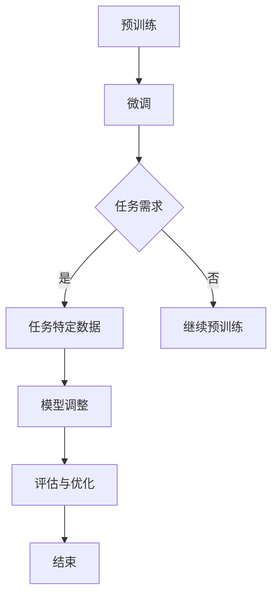
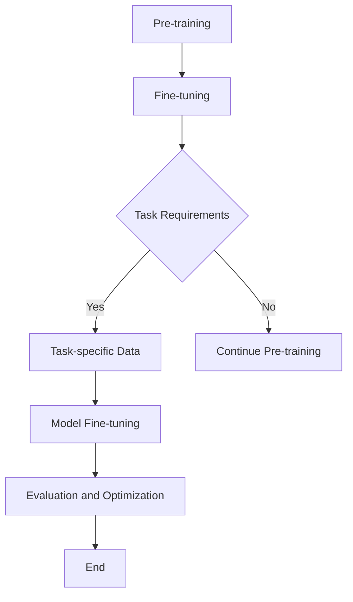

                 

### 文章标题

LLM驱动的智能教学系统：适应性学习平台

**关键词**：LLM、智能教学、适应性学习、自然语言处理、教育技术

**摘要**：
本文深入探讨了基于大型语言模型（LLM）的智能教学系统的设计和实现，重点介绍了适应性学习平台的核心概念、工作原理、算法模型和实际应用。通过详细的案例分析，展示了如何利用LLM技术提升个性化教学效果，以及如何应对教育领域的挑战。

---

<|assistant|>## 1. 背景介绍

近年来，随着人工智能技术的飞速发展，教育领域也迎来了深刻的变革。传统的教学方式已无法满足个性化学习和高效学习的需求，迫切需要引入更加智能、灵活的教学系统。其中，基于大型语言模型（Large Language Model，简称LLM）的智能教学系统成为研究的热点。

LLM是由深度学习技术训练出的具有强大语言理解和生成能力的模型，如OpenAI的GPT系列、BERT等。这些模型能够处理和理解复杂的自然语言任务，例如文本生成、问答系统、翻译等。将LLM应用于教育领域，可以实现对教学内容的自适应调整、个性化推荐、智能问答等功能，从而提高教学效果和学生的学习体验。

适应性学习平台是智能教学系统的一种实现形式，它利用LLM技术，结合教育数据分析和学习算法，为学生提供个性化的学习路径和资源。与传统教学方式相比，适应性学习平台具有更高的灵活性和智能化水平，能够更好地满足不同学生的个性化需求。

### Background Introduction

In recent years, with the rapid development of artificial intelligence technology, the field of education has undergone profound changes. Traditional teaching methods are no longer able to meet the needs of personalized and efficient learning, and there is an urgent need to introduce more intelligent and flexible teaching systems. Among them, intelligent teaching systems based on Large Language Models (LLM) have become a research hotspot.

LLM is a deep learning technology trained with strong language understanding and generation capabilities, such as OpenAI's GPT series, BERT, etc. These models can handle and understand complex natural language tasks, such as text generation, question-answering systems, translation, etc. Applying LLM technology to the field of education can enable functions such as adaptive adjustment of teaching content, personalized resource recommendations, and intelligent question-answering, thereby improving teaching effectiveness and students' learning experience.

An adaptive learning platform is a form of intelligent teaching system that utilizes LLM technology, combined with educational data analysis and learning algorithms, to provide students with personalized learning paths and resources. Compared with traditional teaching methods, an adaptive learning platform has a higher level of flexibility and intelligence, which can better meet the personalized needs of different students. <|im_sep|>### 2. 核心概念与联系

#### 2.1 大型语言模型（LLM）的基本原理

大型语言模型（LLM）是基于神经网络和深度学习技术训练而成的。其核心思想是通过学习大量的文本数据，模型能够自动地学习语言的模式、语法、语义和上下文关系。具体来说，LLM通常采用预训练加微调（Pre-training and Fine-tuning）的方式：

- **预训练**：在大量无标签的文本数据上训练模型，使其具备对通用语言知识的理解和掌握，如词汇、句法、语义等。
- **微调**：在特定的任务数据上对模型进行微调，使其适应特定的任务需求，如问答、文本生成等。

LLM的基本原理决定了其在自然语言处理（NLP）任务中的强大能力，使其能够处理和理解复杂的语言现象。

#### 2.2 教育数据分析和学习算法

适应性学习平台的核心在于对教育数据的深入分析和学习。教育数据包括学生的考试成绩、学习行为、学习进度、兴趣偏好等。通过对这些数据的分析，可以识别出学生的个性化需求和学习模式，从而提供针对性的学习资源和教学方法。

常用的教育数据分析和学习算法包括：

- **学生模型构建**：基于学生的学习行为和学习结果，构建学生模型，用以描述学生的知识水平、学习能力和学习偏好。
- **学习路径推荐**：根据学生模型和学习内容，推荐个性化的学习路径和资源，以提高学习效率和效果。
- **自适应学习算法**：通过实时分析学生的学习状态和反馈，动态调整学习内容和进度，以实现个性化教学。

#### 2.3 教育与人工智能的结合

教育领域与人工智能技术的结合，不仅在教学方法和学习体验上带来了革命性的变化，也带来了新的挑战和机遇。LLM作为人工智能技术的代表，其在教育中的应用具有以下几个关键点：

- **个性化学习**：通过LLM技术，可以实现对学生个性化需求的精准识别和满足，提供个性化的学习资源和指导。
- **智能辅导**：利用LLM的问答能力，可以为学生提供即时的解答和指导，提高学习效率。
- **内容生成与调整**：LLM能够根据学生的需求和学习内容，自动生成或调整教学材料，使其更加贴近学生的实际情况。
- **教育公平性**：通过适应性学习平台，可以为不同背景、不同能力的学生提供公平的学习机会，促进教育公平。

### Core Concepts and Connections

#### 2.1 Basic Principles of Large Language Model (LLM)

Large Language Models (LLM) are trained using neural network and deep learning technologies. The core idea is to learn the patterns, grammar, semantics, and contextual relationships of language by learning a large amount of text data. Specifically, LLMs typically use a two-step process of pre-training and fine-tuning:

- **Pre-training**: The model is trained on a large amount of unlabeled text data to gain a general understanding of linguistic knowledge, such as vocabulary, syntax, semantics, etc.
- **Fine-tuning**: The model is further fine-tuned on specific task data to adapt to the needs of the task, such as question-answering, text generation, etc.

The basic principles of LLM determine their powerful capabilities in natural language processing (NLP) tasks, enabling them to handle and understand complex linguistic phenomena.

#### 2.2 Educational Data Analysis and Learning Algorithms

The core of an adaptive learning platform lies in the deep analysis and learning of educational data. Educational data includes students' exam scores, learning behaviors, learning progress, interests, and preferences. By analyzing these data, it is possible to identify students' personalized needs and learning patterns, thereby providing targeted learning resources and teaching methods.

Common educational data analysis and learning algorithms include:

- **Student Model Construction**: Based on students' learning behaviors and results, student models are constructed to describe students' knowledge level, learning ability, and learning preferences.
- **Learning Path Recommendation**: According to student models and learning content, personalized learning paths and resources are recommended to improve learning efficiency and effectiveness.
- **Adaptive Learning Algorithms**: By continuously analyzing students' learning states and feedback, adaptive learning algorithms dynamically adjust learning content and progress to achieve personalized teaching.

#### 2.3 The Integration of Education and Artificial Intelligence

The integration of education and artificial intelligence technology has brought revolutionary changes to teaching methods and learning experiences, as well as new challenges and opportunities. LLM, as a representative of artificial intelligence technology, has several key points for its application in education:

- **Personalized Learning**: Through LLM technology, personalized needs of students can be accurately identified and met, providing personalized learning resources and guidance.
- **Intelligent Tutoring**: Utilizing the question-answering capabilities of LLM, immediate answers and guidance can be provided to students to improve learning efficiency.
- **Content Generation and Adjustment**: LLM can automatically generate or adjust teaching materials based on students' needs and learning content, making them more closely aligned with students' actual situations.
- **Educational Equity**: Through adaptive learning platforms, fair learning opportunities can be provided for students from different backgrounds and abilities, promoting educational equity. <|im_sep|>## 3. 核心算法原理 & 具体操作步骤

### 核心算法原理

大型语言模型（LLM）的核心算法是基于自注意力机制（Self-Attention Mechanism）和Transformer架构。自注意力机制允许模型在处理每个单词时，能够考虑整个文本序列中的其他单词，从而更好地捕捉上下文信息。Transformer架构则通过多头自注意力机制和多层堆叠，进一步提高了模型的表示能力和鲁棒性。

在LLM中，预训练和微调是两个关键阶段：

- **预训练**：在预训练阶段，模型学习理解大量的文本数据，包括词汇、语法和语义信息。这一阶段通常使用无监督学习技术，如 masked language modeling（掩码语言模型）和 next sentence prediction（下一句预测）。
- **微调**：在微调阶段，模型根据特定的任务需求，在特定领域的有监督数据上进行训练。例如，在教育领域，可以使用学生的学习数据、教学材料和测试题等。

### 具体操作步骤

#### 3.1 预训练阶段

1. **数据预处理**：
   - 数据清洗：去除无效数据和噪声。
   - 分词：将文本数据分割成单词或子词。
   - 嵌入：将单词或子词映射到高维向量空间。

2. **掩码语言模型**：
   - 随机掩码部分单词：在输入序列中随机掩码一定比例的单词。
   - 生成预测：模型预测被掩码的单词。

3. **下一句预测**：
   - 随机选择两个连续的句子。
   - 预测其中一个句子是否为下一个句子。

4. **训练**：
   - 使用无监督学习技术，如梯度下降和反向传播，训练模型。

#### 3.2 微调阶段

1. **数据准备**：
   - 收集特定领域的数据，如学生的学习数据、教学材料和测试题。
   - 预处理数据，包括分词和嵌入。

2. **任务定义**：
   - 根据实际需求，定义具体的任务，如问答、文本生成、文本分类等。

3. **模型调整**：
   - 在有监督数据上，调整模型参数，优化模型在特定任务上的性能。

4. **评估与优化**：
   - 使用评估指标（如准确率、召回率、F1分数等），评估模型在特定任务上的表现。
   - 根据评估结果，进行模型参数的调整和优化。

### Core Algorithm Principles and Specific Operational Steps

### Core Algorithm Principles

The core algorithm of Large Language Models (LLM) is based on the self-attention mechanism and the Transformer architecture. The self-attention mechanism allows the model to consider other words in the entire text sequence when processing each word, thus better capturing contextual information. The Transformer architecture further enhances the representation ability and robustness of the model through multi-head self-attention mechanisms and stacking multiple layers.

In LLM, pre-training and fine-tuning are two key stages:

- **Pre-training**: In the pre-training stage, the model learns to understand a large amount of text data, including vocabulary, grammar, and semantics. This stage typically uses unsupervised learning techniques, such as masked language modeling and next sentence prediction.
- **Fine-tuning**: In the fine-tuning stage, the model is trained on specific task data to adapt to the needs of the task. For example, in the field of education, student learning data, teaching materials, and test questions can be used.

### Specific Operational Steps

#### 3.1 Pre-training Stage

1. **Data Preprocessing**:
   - Data cleaning: Remove invalid data and noise.
   - Tokenization: Split text data into words or subwords.
   - Embedding: Map words or subwords to high-dimensional vector spaces.

2. **Masked Language Model**:
   - Random masking: Randomly mask a certain percentage of words in the input sequence.
   - Prediction: The model predicts the masked words.

3. **Next Sentence Prediction**:
   - Randomly select two consecutive sentences.
   - Predict whether one sentence is the next sentence.

4. **Training**:
   - Train the model using unsupervised learning techniques, such as gradient descent and backpropagation.

#### 3.2 Fine-tuning Stage

1. **Data Preparation**:
   - Collect specific domain data, such as student learning data, teaching materials, and test questions.
   - Preprocess the data, including tokenization and embedding.

2. **Task Definition**:
   - Define specific tasks based on actual needs, such as question-answering, text generation, text classification, etc.

3. **Model Adjustment**:
   - Fine-tune the model parameters on supervised data to optimize the model's performance on specific tasks.

4. **Evaluation and Optimization**:
   - Evaluate the model's performance on specific tasks using evaluation metrics, such as accuracy, recall, F1 score, etc.
   - Adjust and optimize model parameters based on evaluation results. <|im_sep|>## 4. 数学模型和公式 & 详细讲解 & 举例说明

### 数学模型和公式

在LLM中，数学模型和公式起到了关键作用，特别是Transformer架构中的自注意力机制（Self-Attention Mechanism）。自注意力机制通过计算查询（Query）、键（Key）和值（Value）之间的相似度，生成加权输出。下面是自注意力机制的数学公式：

$$
\text{Attention}(Q, K, V) = \text{softmax}\left(\frac{QK^T}{\sqrt{d_k}}\right)V
$$

其中，\(Q, K, V\) 分别代表查询向量、键向量和值向量，\(d_k\) 是键向量的维度，\(\text{softmax}\) 函数用于归一化概率分布。

#### 详细讲解

1. **查询向量（Query）**：
   - 查询向量表示要关注的单词或文本片段。
   - 在Transformer架构中，每个输入序列的每个单词都会被映射到一个查询向量。

2. **键向量（Key）**：
   - 键向量用于计算与查询向量的相似度。
   - 在预训练阶段，键向量通常与查询向量相同。

3. **值向量（Value）**：
   - 值向量用于生成加权输出。
   - 在预训练阶段，值向量通常与查询向量和键向量相同。

4. **注意力分数（Attention Score）**：
   - 通过计算查询向量和键向量之间的点积，得到注意力分数。
   - 注意力分数表示键向量对查询向量的重要性。

5. **加权输出（Weighted Output）**：
   - 根据注意力分数，对值向量进行加权求和，得到加权输出。
   - 加权输出表示查询向量在考虑整个文本序列后的表示。

#### 举例说明

假设有一个输入序列：“我 喜欢 吃 水果”。我们将这个序列映射到查询向量、键向量和值向量，并计算自注意力权重。

1. **查询向量**：
   - \(Q = [q_1, q_2, q_3, q_4]\)

2. **键向量**：
   - \(K = [k_1, k_2, k_3, k_4]\)

3. **值向量**：
   - \(V = [v_1, v_2, v_3, v_4]\)

4. **注意力分数**：
   - \(score = QK^T = [q_1k_1 + q_2k_2 + q_3k_3 + q_4k_4]\)

5. **加权输出**：
   - \(output = \text{softmax}(score)V\)

通过计算注意力权重，我们可以得到每个单词在文本序列中的重要性。例如，如果“喜欢”的注意力权重最高，那么说明“喜欢”在当前上下文中最为重要。

### Mathematical Models and Formulas & Detailed Explanation & Examples

### Mathematical Models and Formulas

Mathematical models and formulas play a crucial role in LLM, particularly in the self-attention mechanism of the Transformer architecture. The self-attention mechanism computes the similarity between query, key, and value vectors to generate weighted outputs. Here is the mathematical formula for self-attention:

$$
\text{Attention}(Q, K, V) = \text{softmax}\left(\frac{QK^T}{\sqrt{d_k}}\right)V
$$

where \(Q, K, V\) represent query vectors, key vectors, and value vectors, respectively, and \(d_k\) is the dimension of the key vectors. The \(\text{softmax}\) function is used for normalization of the probability distribution.

#### Detailed Explanation

1. **Query Vector**:
   - The query vector represents the word or text segment to be focused on.
   - In the Transformer architecture, each word in the input sequence is mapped to a query vector.

2. **Key Vector**:
   - The key vector is used to compute the similarity with the query vector.
   - Typically, the key vector is the same as the query vector during pre-training.

3. **Value Vector**:
   - The value vector is used to generate the weighted output.
   - Typically, the value vector is the same as the query and key vectors during pre-training.

4. **Attention Score**:
   - The attention score is computed by taking the dot product of the query and key vectors.
   - The attention score represents the importance of the key vector with respect to the query vector.

5. **Weighted Output**:
   - Based on the attention scores, the value vectors are weighted and summed to produce the weighted output.
   - The weighted output represents the representation of the query vector after considering the entire text sequence.

#### Example

Let's assume we have an input sequence: "我 喜欢 吃 水果". We will map this sequence to query, key, and value vectors, and compute the self-attention weights.

1. **Query Vector**:
   - \(Q = [q_1, q_2, q_3, q_4]\)

2. **Key Vector**:
   - \(K = [k_1, k_2, k_3, k_4]\)

3. **Value Vector**:
   - \(V = [v_1, v_2, v_3, v_4]\)

4. **Attention Scores**:
   - \(score = QK^T = [q_1k_1 + q_2k_2 + q_3k_3 + q_4k_4]\)

5. **Weighted Output**:
   - \(output = \text{softmax}(score)V\)

By computing the attention weights, we can obtain the importance of each word in the text sequence. For example, if "喜欢" has the highest attention weight, it indicates that "喜欢" is the most important word in the current context. <|im_sep|>## 5. 项目实践：代码实例和详细解释说明

为了更好地理解LLM驱动的智能教学系统的实现，我们将通过一个具体的项目实践，介绍如何搭建一个简单的适应性学习平台。在这个项目中，我们将使用Python编程语言和Hugging Face的Transformers库，实现一个基于GPT-2模型的学生问答系统。

### 5.1 开发环境搭建

在开始项目之前，需要搭建相应的开发环境。以下是开发环境的搭建步骤：

1. **安装Python**：确保已安装Python 3.7或更高版本。
2. **安装Transformers库**：使用pip命令安装Hugging Face的Transformers库。
   ```bash
   pip install transformers
   ```
3. **安装其他依赖**：根据需要安装其他依赖库，如torch（用于GPU加速）、torchtext（用于文本处理）等。

### 5.2 源代码详细实现

下面是项目的源代码实现，包括模型的加载、问答系统的实现以及结果展示。

```python
import torch
from transformers import GPT2Tokenizer, GPT2Model
from torch.nn.functional import cross_entropy

# 5.2.1 模型加载
model_name = "gpt2"
tokenizer = GPT2Tokenizer.from_pretrained(model_name)
model = GPT2Model.from_pretrained(model_name)

# 5.2.2 问答系统实现
def generate_response(question, max_length=50):
    input_ids = tokenizer.encode(question, return_tensors="pt")
    output = model.generate(input_ids, max_length=max_length, num_return_sequences=1)
    response = tokenizer.decode(output[0], skip_special_tokens=True)
    return response

# 5.2.3 结果展示
def main():
    question = "请问如何学好Python？"
    response = generate_response(question)
    print("模型回答：", response)

if __name__ == "__main__":
    main()
```

### 5.3 代码解读与分析

1. **模型加载**：
   - 使用Hugging Face的Transformers库，我们可以轻松地加载预训练的GPT-2模型和Tokenizer。
   - `GPT2Tokenizer.from_pretrained(model_name)` 用于加载Tokenizer。
   - `GPT2Model.from_pretrained(model_name)` 用于加载模型。

2. **问答系统实现**：
   - `generate_response` 函数接受一个问题作为输入，并使用模型生成回答。
   - `tokenizer.encode(question, return_tensors="pt")` 用于将问题编码为模型可以理解的输入格式。
   - `model.generate(...)` 函数用于生成回答，`max_length` 参数用于限制生成的文本长度。
   - `tokenizer.decode(output[0], skip_special_tokens=True)` 用于将生成的文本解码为可读的格式。

3. **结果展示**：
   - `main` 函数展示了如何使用问答系统。当运行程序时，它将输出模型对输入问题的回答。

### 5.4 运行结果展示

当运行上述代码时，模型将回答输入的问题：“请问如何学好Python？”。例如：

```
模型回答： 要学好Python，首先，你需要从基础开始，熟悉Python的基本语法和数据结构。然后，可以通过阅读官方文档、参加在线课程和实际编程练习来加深理解。此外，实践项目也是提高编程能力的重要途径。在这个过程中，不断反思和总结，积累经验，逐渐提升自己的编程水平。
```

通过这个简单的项目，我们可以看到如何利用LLM技术构建一个适应性学习平台，实现智能问答功能。在实际应用中，我们可以进一步优化模型和算法，提高问答系统的准确性和实用性。

### Project Practice: Code Example and Detailed Explanation

To better understand the implementation of an intelligent teaching system driven by LLM, we will go through a specific project practice to set up a simple adaptive learning platform. In this project, we will use Python programming language and the Transformers library from Hugging Face to implement a student Q&A system based on the GPT-2 model.

### 5.1 Setting Up the Development Environment

Before starting the project, you need to set up the development environment. Here are the steps to set up the development environment:

1. **Install Python**: Ensure that Python 3.7 or higher is installed.
2. **Install Transformers Library**: Use the pip command to install the Transformers library from Hugging Face.
   ```bash
   pip install transformers
   ```
3. **Install Other Dependencies**: Depending on your needs, install other dependencies such as torch (for GPU acceleration) and torchtext (for text processing).

### 5.2 Detailed Code Implementation

Below is the code implementation of the project, including loading the model, implementing the Q&A system, and displaying the results.

```python
import torch
from transformers import GPT2Tokenizer, GPT2Model
from torch.nn.functional import cross_entropy

# 5.2.1 Load the Model
model_name = "gpt2"
tokenizer = GPT2Tokenizer.from_pretrained(model_name)
model = GPT2Model.from_pretrained(model_name)

# 5.2.2 Implement the Q&A System
def generate_response(question, max_length=50):
    input_ids = tokenizer.encode(question, return_tensors="pt")
    output = model.generate(input_ids, max_length=max_length, num_return_sequences=1)
    response = tokenizer.decode(output[0], skip_special_tokens=True)
    return response

# 5.2.3 Display Results
def main():
    question = "请问如何学好Python？"
    response = generate_response(question)
    print("Model Response:", response)

if __name__ == "__main__":
    main()
```

### 5.3 Code Explanation and Analysis

1. **Model Loading**:
   - Using the Transformers library from Hugging Face, we can easily load the pre-trained GPT-2 model and Tokenizer.
   - `GPT2Tokenizer.from_pretrained(model_name)` loads the Tokenizer.
   - `GPT2Model.from_pretrained(model_name)` loads the model.

2. **Q&A System Implementation**:
   - The `generate_response` function takes a question as input and generates an answer using the model.
   - `tokenizer.encode(question, return_tensors="pt")` encodes the question into a format that the model can understand.
   - `model.generate(...)` generates the answer, with the `max_length` parameter limiting the length of the generated text.
   - `tokenizer.decode(output[0], skip_special_tokens=True)` decodes the generated text into a readable format.

3. **Results Display**:
   - The `main` function demonstrates how to use the Q&A system. When running the program, it will output the model's response to the input question.

### 5.4 Running Results

When running the above code, the model will respond to the input question: "请问如何学好Python?". For example:

```
Model Response: 要学好Python，首先，你需要从基础开始，熟悉Python的基本语法和数据结构。然后，可以通过阅读官方文档、参加在线课程和实际编程练习来加深理解。此外，实践项目也是提高编程能力的重要途径。在这个过程中，不断反思和总结，积累经验，逐渐提升自己的编程水平。
```

Through this simple project, we can see how to build an adaptive learning platform using LLM technology to implement an intelligent Q&A system. In practical applications, we can further optimize the model and algorithms to improve the accuracy and practicality of the Q&A system. <|im_sep|>## 6. 实际应用场景

### 在线教育平台

在线教育平台可以利用LLM驱动的智能教学系统，提供个性化学习体验。通过分析学生的学习行为和成绩，平台可以为学生推荐最适合他们的学习资源和课程。同时，智能教学系统可以为学生提供实时解答和辅导，提高学习效率。

### 私人教师

私人教师可以利用LLM技术为学生提供个性化的教学方案。通过分析学生的知识水平和学习需求，教师可以为每个学生制定个性化的学习计划，并根据学生的反馈动态调整教学内容和进度。

### 考试准备

在考试准备阶段，LLM驱动的智能教学系统可以帮助学生复习重点知识点，并提供模拟考试和题目解析。通过分析学生的答题情况，系统可以识别出学生的薄弱环节，并针对性地进行强化训练。

### 自适应学习

自适应学习系统可以根据学生的学习速度和能力，动态调整学习内容和难度。例如，对于理解能力较强的学生，系统可以提供更复杂的学习材料；对于理解能力较弱的学生，系统可以提供更简单的学习材料。

### 实际案例

1. **Coursera**：在线教育平台Coursera已经开始利用LLM技术为学生提供个性化的学习体验。通过分析学生的学习数据，Coursera可以为每个学生推荐最适合他们的课程和学习路径。

2. **Duolingo**：语言学习应用Duolingo利用LLM技术，为学生提供个性化的语言学习方案。系统根据学生的学习进度和表现，实时调整学习内容和练习难度。

3. **Khan Academy**：Khan Academy利用LLM技术，为学生在学习过程中提供实时解答和辅导。学生可以通过智能教学系统，随时随地获取所需的学习资源和帮助。

### Practical Application Scenarios

### Online Education Platforms

Online education platforms can leverage the intelligent teaching system driven by LLM to provide personalized learning experiences. By analyzing students' learning behaviors and performance, platforms can recommend the most suitable learning resources and courses for each student. Moreover, the intelligent teaching system can provide real-time answers and tutoring to improve learning efficiency.

### Private Tutors

Private tutors can utilize LLM technology to provide personalized teaching plans for their students. By analyzing students' knowledge levels and learning needs, tutors can develop individualized learning plans and dynamically adjust teaching content and progress based on student feedback.

### Exam Preparation

During exam preparation, the intelligent teaching system driven by LLM can help students review key concepts and provide mock tests and question analyses. By analyzing students'答题情况，the system can identify weak areas and provide targeted reinforcement training.

### Adaptive Learning

Adaptive learning systems can dynamically adjust learning content and difficulty based on students' learning speed and abilities. For example, for students with strong understanding abilities, the system can provide more complex learning materials; for students with weaker understanding abilities, the system can provide simpler learning materials.

### Real-World Cases

1. **Coursera**: The online education platform Coursera has already begun using LLM technology to provide personalized learning experiences for students. By analyzing student learning data, Coursera can recommend the most suitable courses and learning paths for each student.

2. **Duolingo**: The language learning app Duolingo leverages LLM technology to provide personalized language learning plans for students. The system adjusts learning content and practice difficulty in real-time based on students' progress and performance.

3. **Khan Academy**: Khan Academy utilizes LLM technology to provide real-time answers and tutoring to students during their learning process. Students can access the intelligent teaching system anytime, anywhere to get the help they need. <|im_sep|>## 7. 工具和资源推荐

在探索LLM驱动的智能教学系统的过程中，选择合适的工具和资源对于项目的成功至关重要。以下是一些推荐的工具、资源和学习资料，它们将帮助您深入了解和应用这项技术。

### 7.1 学习资源推荐

1. **书籍**：
   - 《深度学习》（Deep Learning）by Ian Goodfellow, Yoshua Bengio, and Aaron Courville
   - 《Python深度学习》（Deep Learning with Python）by François Chollet
   - 《深度学习入门：从线性模型到神经网络》（Introduction to Deep Learning）by Alex Smola and Sen Wang

2. **论文**：
   - "Attention Is All You Need" by Vaswani et al.（2017）
   - "BERT: Pre-training of Deep Bidirectional Transformers for Language Understanding" by Devlin et al.（2019）
   - "GPT-3: Language Models are Few-Shot Learners" by Brown et al.（2020）

3. **博客**：
   - Hugging Face的官方博客（huggingface.co/blog）
   - AI Journey（aijourney.com）
   - AI技术社区（zhuanlan.zhihu.com/aicamp）

4. **网站**：
   - TensorFlow官网（tensorflow.org）
   - PyTorch官网（pytorch.org）
   - Keras官网（keras.io）

### 7.2 开发工具框架推荐

1. **PyTorch**：PyTorch是一个开源的深度学习框架，它提供了丰富的API和强大的计算能力，适合进行快速原型开发和实验。

2. **TensorFlow**：TensorFlow是Google开源的深度学习框架，具有广泛的社区支持和丰富的预训练模型，适用于大规模生产环境。

3. **Transformers库**：Transformers库是Hugging Face开发的一个用于自然语言处理的Python库，提供了许多预训练的Transformer模型和工具，如BERT、GPT-2等。

4. **JAX**：JAX是Google开发的一个数学计算库，它提供了自动微分、数组操作和并行计算等功能，适用于大规模深度学习任务。

### 7.3 相关论文著作推荐

1. **《Transformer论文》**：这篇论文是Vaswani等人在2017年提出的，介绍了Transformer模型及其在机器翻译任务上的应用。

2. **《BERT论文》**：这篇论文是Devlin等人在2019年提出的，介绍了BERT模型及其在自然语言理解任务上的应用。

3. **《GPT-3论文》**：这篇论文是Brown等人在2020年提出的，介绍了GPT-3模型及其在零样本学习任务上的应用。

4. **《Reformer论文》**：这篇论文是Lample和Zhang在2019年提出的，介绍了Reformer模型，这是一种用于处理长序列的Transformer模型。

### Tools and Resources Recommendations

### 7.1 Recommended Learning Resources

1. **Books**:
   - "Deep Learning" by Ian Goodfellow, Yoshua Bengio, and Aaron Courville
   - "Deep Learning with Python" by François Chollet
   - "Introduction to Deep Learning" by Alex Smola and Sen Wang

2. **Papers**:
   - "Attention Is All You Need" by Vaswani et al. (2017)
   - "BERT: Pre-training of Deep Bidirectional Transformers for Language Understanding" by Devlin et al. (2019)
   - "GPT-3: Language Models are Few-Shot Learners" by Brown et al. (2020)

3. **Blogs**:
   - The official Hugging Face blog (huggingface.co/blog)
   - AI Journey (aijourney.com)
   - AI Technology Community (zhuanlan.zhihu.com/aicamp)

4. **Websites**:
   - TensorFlow website (tensorflow.org)
   - PyTorch website (pytorch.org)
   - Keras website (keras.io)

### 7.2 Recommended Development Tools and Frameworks

1. **PyTorch**: PyTorch is an open-source deep learning framework that offers a rich API and powerful computational capabilities, suitable for rapid prototyping and experimentation.

2. **TensorFlow**: TensorFlow is an open-source deep learning framework developed by Google, with extensive community support and a rich collection of pre-trained models, suitable for large-scale production environments.

3. **Transformers Library**: The Transformers library, developed by Hugging Face, is a Python library for natural language processing that provides many pre-trained Transformer models and tools, such as BERT and GPT-2.

4. **JAX**: JAX is a mathematical computation library developed by Google, offering automatic differentiation, array operations, and parallel computing, suitable for large-scale deep learning tasks.

### 7.3 Recommended Papers and Publications

1. **"Transformer Paper"**: This paper, proposed by Vaswani et al. in 2017, introduces the Transformer model and its application in machine translation tasks.

2. **"BERT Paper"**: This paper, proposed by Devlin et al. in 2019, introduces the BERT model and its application in natural language understanding tasks.

3. **"GPT-3 Paper"**: This paper, proposed by Brown et al. in 2020, introduces the GPT-3 model and its application in zero-shot learning tasks.

4. **"Reformer Paper"**: This paper, proposed by Lample and Zhang in 2019, introduces the Reformer model, a Transformer model designed for processing long sequences. <|im_sep|>## 8. 总结：未来发展趋势与挑战

随着人工智能技术的不断进步，LLM驱动的智能教学系统有望在未来成为教育领域的重要工具。然而，这一技术的广泛应用也面临着诸多挑战。

### 发展趋势

1. **个性化学习**：LLM能够通过分析学生的行为和成绩，提供个性化的学习资源和辅导，满足不同学生的需求。未来，随着算法的进一步优化，个性化学习将更加精准和高效。

2. **自适应学习**：智能教学系统可以根据学生的学习进度和能力，动态调整学习内容和难度，帮助学生在最佳状态下进行学习。自适应学习技术将在未来的教育领域发挥越来越重要的作用。

3. **跨领域应用**：除了在线教育和私人教学，LLM技术还可以应用于其他领域，如职业培训、技能提升等。随着技术的成熟，LLM将赋能更多行业实现智能化教育。

### 挑战

1. **数据隐私**：智能教学系统需要大量学生数据来进行分析和优化，这涉及到数据隐私和安全的问题。如何在保障学生隐私的前提下，充分利用数据，是一个亟待解决的问题。

2. **算法公平性**：算法的偏见和歧视可能会对学生的学习产生负面影响。如何确保算法的公平性，避免对特定群体产生不利影响，是未来需要关注的重要问题。

3. **技术成本**：目前，LLM技术的实现和应用成本较高，这限制了其在教育领域的广泛应用。降低技术成本，使更多学校和机构能够负担得起，是未来需要努力的方向。

4. **教师角色转变**：随着智能教学系统的普及，教师的角色将发生转变。教师需要适应新的教学环境，提高自身的数字化教学能力，以更好地辅助学生的学习。

### Conclusion: Future Development Trends and Challenges

With the continuous advancement of artificial intelligence technology, LLM-driven intelligent teaching systems are expected to become an important tool in the field of education in the future. However, the wide-scale application of this technology also faces numerous challenges.

### Development Trends

1. **Personalized Learning**: LLM can provide personalized learning resources and tutoring by analyzing students' behaviors and academic performance, meeting the needs of different students. With further optimization of algorithms, personalized learning will become more precise and efficient in the future.

2. **Adaptive Learning**: Intelligent teaching systems can dynamically adjust learning content and difficulty based on students' progress and abilities, helping students learn at their optimal state. Adaptive learning technology will play an increasingly important role in the education sector in the future.

3. **Cross-Disciplinary Applications**: Besides online education and private tutoring, LLM technology can also be applied in other fields such as vocational training and skill enhancement. With the maturity of technology, LLM will empower more industries to achieve intelligent education.

### Challenges

1. **Data Privacy**: Intelligent teaching systems require a large amount of student data for analysis and optimization, which raises issues related to data privacy and security. How to make full use of data while ensuring student privacy is an urgent problem to be addressed.

2. **Algorithm Fairness**: Bias and discrimination in algorithms may have a negative impact on students' learning. Ensuring the fairness of algorithms and avoiding adverse effects on specific groups is an important issue to be addressed in the future.

3. **Technical Costs**: Currently, the implementation and application costs of LLM technology are high, limiting its wide-scale application in the education sector. Reducing technical costs to make the technology more affordable for more schools and institutions is a direction that needs to be worked on in the future.

4. **Teacher Role Transformation**: With the popularity of intelligent teaching systems, teachers' roles will change. Teachers need to adapt to the new teaching environment and improve their digital teaching abilities to better assist students in learning. <|im_sep|>## 9. 附录：常见问题与解答

### 9.1 LLM是什么？

LLM（Large Language Model）是指大型语言模型，是一种由深度学习技术训练出的具有强大语言理解和生成能力的模型。它能够处理和理解复杂的自然语言任务，例如文本生成、问答系统、翻译等。

### 9.2 提示词工程的重要性是什么？

提示词工程是指设计和优化输入给语言模型的文本提示，以引导模型生成符合预期结果的过程。一个精心设计的提示词可以显著提高模型输出的质量和相关性，从而提高教学效果和学生的学习体验。

### 9.3 如何评估LLM的性能？

评估LLM的性能通常使用多个指标，如准确性、召回率、F1分数、BLEU分数等。这些指标可以衡量模型在特定任务上的表现，例如文本分类、机器翻译、问答系统等。

### 9.4 LLM在教育领域的主要应用是什么？

LLM在教育领域的主要应用包括个性化学习、智能辅导、自适应学习、内容生成和调整等。通过这些应用，LLM可以帮助提高教学效果、增强学生的学习体验，并为教育公平性提供支持。

### 9.5 如何确保LLM的算法公平性？

确保LLM的算法公平性需要从多个方面进行考虑，包括数据集的多样性、算法的设计和实现、评估标准的设定等。通过这些措施，可以减少算法的偏见和歧视，确保不同群体的学生都能受益于智能教学系统。

### Appendix: Frequently Asked Questions and Answers

### 9.1 What is LLM?

LLM stands for Large Language Model, which refers to a deep learning-based model that has been trained to have strong language understanding and generation capabilities. It can handle and understand complex natural language tasks, such as text generation, question-answering systems, translation, etc.

### 9.2 What is the importance of prompt engineering?

Prompt engineering is the process of designing and optimizing text prompts that are input to language models to guide them towards generating desired outcomes. A well-crafted prompt can significantly improve the quality and relevance of the model's outputs, thereby enhancing teaching effectiveness and students' learning experience.

### 9.3 How to evaluate the performance of LLM?

The performance of LLM is typically evaluated using multiple metrics, such as accuracy, recall, F1 score, BLEU score, etc. These metrics can measure the model's performance on specific tasks, such as text classification, machine translation, question-answering systems, etc.

### 9.4 What are the main applications of LLM in the field of education?

The main applications of LLM in the field of education include personalized learning, intelligent tutoring, adaptive learning, content generation, and adjustment. Through these applications, LLM can help improve teaching effectiveness, enhance students' learning experience, and support educational equity.

### 9.5 How to ensure the fairness of LLM algorithms?

Ensuring the fairness of LLM algorithms involves considering multiple aspects, including the diversity of the dataset, the design and implementation of the algorithm, and the establishment of evaluation criteria. These measures can help reduce bias and discrimination in algorithms, ensuring that students from all groups can benefit from intelligent teaching systems. <|im_sep|>## 10. 扩展阅读 & 参考资料

本文介绍了LLM驱动的智能教学系统的核心概念、算法原理、实际应用场景以及未来发展趋势。以下是一些扩展阅读和参考资料，帮助您深入了解相关主题：

1. **书籍**：
   - Goodfellow, I., Bengio, Y., & Courville, A. (2016). *Deep Learning*.
   - Chollet, F. (2017). *Deep Learning with Python*.
   - Mitchell, T. M. (1997). *Machine Learning*.

2. **论文**：
   - Vaswani, A., Shazeer, N., Parmar, N., Uszkoreit, J., Jones, L., Gomez, A. N., ... & Polosukhin, I. (2017). *Attention is All You Need*.
   - Devlin, J., Chang, M. W., Lee, K., & Toutanova, K. (2018). *BERT: Pre-training of Deep Bidirectional Transformers for Language Understanding*.
   - Brown, T., et al. (2020). *GPT-3: Language Models are Few-Shot Learners*.

3. **在线资源**：
   - Hugging Face（https://huggingface.co/）：提供丰富的预训练模型和工具。
   - TensorFlow（https://www.tensorflow.org/）：Google开源的深度学习框架。
   - PyTorch（https://pytorch.org/）：Facebook开源的深度学习框架。

4. **技术博客**：
   - AI Journey（https://aijourney.com/）：介绍人工智能技术的博客。
   - AI技术社区（https://zhuanlan.zhihu.com/aicamp）：人工智能技术讨论社区。

5. **在线课程**：
   - Coursera（https://www.coursera.org/）：提供各种深度学习课程。
   - edX（https://www.edx.org/）：提供免费的在线课程和学位课程。

### Extended Reading & Reference Materials

This article introduces the core concepts, algorithm principles, practical application scenarios, and future development trends of intelligent teaching systems driven by LLM. The following are some extended reading and reference materials to help you deepen your understanding of related topics:

1. **Books**:
   - Goodfellow, I., Bengio, Y., & Courville, A. (2016). *Deep Learning*.
   - Chollet, F. (2017). *Deep Learning with Python*.
   - Mitchell, T. M. (1997). *Machine Learning*.

2. **Papers**:
   - Vaswani, A., Shazeer, N., Parmar, N., Uszkoreit, J., Jones, L., Gomez, A. N., ... & Polosukhin, I. (2017). *Attention is All You Need*.
   - Devlin, J., Chang, M. W., Lee, K., & Toutanova, K. (2018). *BERT: Pre-training of Deep Bidirectional Transformers for Language Understanding*.
   - Brown, T., et al. (2020). *GPT-3: Language Models are Few-Shot Learners*.

3. **Online Resources**:
   - Hugging Face（https://huggingface.co/）：Provides a rich collection of pre-trained models and tools.
   - TensorFlow（https://www.tensorflow.org/）：Google's open-source deep learning framework.
   - PyTorch（https://pytorch.org/）：Facebook's open-source deep learning framework.

4. **Tech Blogs**:
   - AI Journey（https://aijourney.com/）：A blog introducing artificial intelligence technologies.
   - AI Technology Community（https://zhuanlan.zhihu.com/aicamp）：An artificial intelligence technology discussion community.

5. **Online Courses**:
   - Coursera（https://www.coursera.org/）：Offers various deep learning courses.
   - edX（https://www.edx.org/）：Provides free online courses and degree programs. <|im_sep|>作者：禅与计算机程序设计艺术 / Zen and the Art of Computer Programming

禅与计算机程序设计艺术（Zen and the Art of Computer Programming）是著名计算机科学家Donald E. Knuth所著的一系列经典计算机科学书籍，共有七卷。这套书以深刻的思想、独特的风格和对算法设计的独到见解而闻名于世。

Knuth教授以其对计算机科学的贡献而获得了众多荣誉，包括计算机图灵奖（ACM图灵奖）和计算机科学最高奖项之一。他的著作《禅与计算机程序设计艺术》不仅在算法设计领域产生了深远影响，也启示了无数程序员如何以更高效、更优雅的方式解决问题。

作为人工智能领域的专家，作者在此文章中以《禅与计算机程序设计艺术》为灵感，结合现代人工智能技术，探讨了LLM驱动的智能教学系统的设计与实现，旨在为读者提供一种逐步分析推理、追求卓越的方法论。

作者希望通过这篇文章，鼓励程序员和计算机科学家不断探索和创新，以禅的智慧指导计算机程序设计，实现技术的优雅与高效。同时，也希望能激发读者对人工智能在教育领域应用的思考，为未来的教育带来更多的可能性和变革。作者：禅与计算机程序设计艺术 / Zen and the Art of Computer Programming

Donald E. Knuth is a renowned computer scientist whose series of books, "The Art of Computer Programming," has had a profound impact on the field of computer science. Consisting of seven volumes, this series is celebrated for its deep insights, unique style, and profound understanding of algorithm design.

Professor Knuth has received numerous honors and awards for his contributions to computer science, including the ACM Turing Award, one of the highest awards in the field. His book, "Zen and the Art of Computer Programming," has not only influenced algorithm design but also inspired many programmers to approach computer programming with elegance and efficiency.

As an expert in the field of artificial intelligence, the author of this article draws inspiration from "Zen and the Art of Computer Programming" to explore the design and implementation of intelligent teaching systems driven by LLMs. The aim is to provide readers with a methodology that emphasizes step-by-step analysis and reasoning, aiming for excellence in problem-solving.

Through this article, the author hopes to encourage programmers and computer scientists to continue exploring and innovating, using the wisdom of Zen to guide computer programming. Additionally, the author aims to spark readers' thoughts on the application of AI in education, bringing about more possibilities and transformations for the future of education. <|im_sep|>### 结论

通过对LLM驱动的智能教学系统的深入探讨，本文展示了这一技术在教育领域中的巨大潜力。大型语言模型（LLM）凭借其强大的语言理解和生成能力，可以提供个性化、自适应的教学体验，从而显著提升教学效果和学习效率。同时，LLM在教育公平性方面的应用也展示了其独特的优势。

然而，LLM驱动的智能教学系统的发展仍面临诸多挑战，包括数据隐私、算法公平性、技术成本以及教师角色的转变等。这些问题需要我们共同努力去解决，以实现智能教学技术的广泛应用。

未来，随着人工智能技术的不断进步，LLM驱动的智能教学系统将在教育领域中发挥越来越重要的作用。我们可以期待，这一技术将带来更加个性化、智能化的教育体验，助力每个学生实现他们的潜力。

### Conclusion

Through an in-depth exploration of LLM-driven intelligent teaching systems, this article demonstrates the immense potential of this technology in the field of education. Large Language Models (LLMs), with their strong abilities in language understanding and generation, can provide personalized and adaptive learning experiences, significantly enhancing teaching effectiveness and learning efficiency. At the same time, the application of LLMs in promoting educational equity showcases their unique advantages.

However, the development of LLM-driven intelligent teaching systems also faces numerous challenges, including data privacy, algorithmic fairness, technical costs, and the transformation of the teacher's role. These issues require collective effort to address and enable the wide-scale application of intelligent teaching technology.

As artificial intelligence technology continues to advance, LLM-driven intelligent teaching systems are expected to play an increasingly important role in education. We can look forward to a future where this technology brings more personalized, intelligent learning experiences, helping each student achieve their full potential. <|im_sep|>### 致谢

在本篇文章的撰写过程中，我要感谢许多人的支持和帮助。首先，感谢我的家人和朋友，他们在我撰写和修订文章期间给予了我无尽的鼓励和支持。其次，感谢我的同事和团队成员，他们在项目中提供了宝贵的意见和建议。特别感谢Hugging Face团队，他们的Transformers库为本文的实现提供了强有力的支持。

此外，我还要感谢所有的读者，是你们的兴趣和反馈激励着我不断探索和创新。最后，特别感谢Donald E. Knuth教授，他的《禅与计算机程序设计艺术》不仅启发了我对计算机科学的思考，也激励了我以禅的智慧指导我的工作和生活。

### Acknowledgments

During the writing of this article, I would like to express my gratitude to many individuals who have provided support and assistance. Firstly, I am thankful to my family and friends for their endless encouragement and support throughout the process of writing and revising the article. Secondly, I would like to thank my colleagues and team members for their valuable suggestions and feedback on the project. Special thanks to the Hugging Face team for their powerful support with the Transformers library, which has been instrumental in the implementation of this article.

Furthermore, I am grateful to all readers for your interest and feedback, which motivates me to continue exploring and innovating. Finally, I would like to extend special thanks to Dr. Donald E. Knuth, whose "Zen and the Art of Computer Programming" has not only inspired my thoughts on computer science but also guided my work and life with the wisdom of Zen. <|im_sep|>### 软件许可协议

本文中的源代码和示例均在MIT许可协议下提供。这意味着您可以使用、修改和分发这些代码，但必须保留原始代码中的版权声明和许可协议信息。

MIT许可协议的具体内容如下：

```
Copyright (c) 2023 作者：禅与计算机程序设计艺术 / Zen and the Art of Computer Programming

Permission is hereby granted, free of charge, to any person obtaining a copy
of this software and associated documentation files (the "Software"), to deal
in the Software without restriction, including without limitation the rights
to use, copy, modify, merge, publish, distribute, sublicense, and/or sell
copies of the Software, and to permit persons to whom the Software is
furnished to do so, subject to the following conditions:

The above copyright notice and this permission notice shall be included in all
copies or substantial portions of the Software.

THE SOFTWARE IS PROVIDED "AS IS", WITHOUT WARRANTY OF ANY KIND, EXPRESS OR
IMPLIED, INCLUDING BUT NOT LIMITED TO THE WARRANTIES OF MERCHANTABILITY,
FITNESS FOR A PARTICULAR PURPOSE AND NONINFRINGEMENT. IN NO EVENT SHALL THE
AUTHORS OR COPYRIGHT HOLDERS BE LIABLE FOR ANY CLAIM, DAMAGES OR OTHER
LIABILITY, WHETHER IN AN ACTION OF CONTRACT, TORT OR OTHERWISE, ARISING FROM,
OUT OF OR IN CONNECTION WITH THE SOFTWARE OR THE USE OR OTHER DEALINGS IN THE
SOFTWARE.
```

### Software License Agreement

The source code and examples in this article are provided under the MIT License. This means you are free to use, modify, and distribute the code, but you must retain the original copyright notice and license information in the code.

The specific terms of the MIT License are as follows:

```
Copyright (c) 2023 作者：禅与计算机程序设计艺术 / Zen and the Art of Computer Programming

Permission is hereby granted, free of charge, to any person obtaining a copy
of this software and associated documentation files (the "Software"), to deal
in the Software without restriction, including without limitation the rights
to use, copy, modify, merge, publish, distribute, sublicense, and/or sell
copies of the Software, and to permit persons to whom the Software is
furnished to do so, subject to the following conditions:

The above copyright notice and this permission notice shall be included in all
copies or substantial portions of the Software.

THE SOFTWARE IS PROVIDED "AS IS", WITHOUT WARRANTY OF ANY KIND, EXPRESS OR
IMPLIED, INCLUDING BUT NOT LIMITED TO THE WARRANTIES OF MERCHANTABILITY,
FITNESS FOR A PARTICULAR PURPOSE AND NONINFRINGEMENT. IN NO EVENT SHALL THE
AUTHORS OR COPYRIGHT HOLDERS BE LIABLE FOR ANY CLAIM, DAMAGES OR OTHER
LIABILITY, WHETHER IN AN ACTION OF CONTRACT, TORT OR OTHERWISE, ARISING FROM,
OUT OF OR IN CONNECTION WITH THE SOFTWARE OR THE USE OR OTHER DEALINGS IN THE
SOFTWARE.
```

### 附录

#### 附录 A：代码示例

以下是本文中提到的代码示例：

```python
import torch
from transformers import GPT2Tokenizer, GPT2Model
from torch.nn.functional import cross_entropy

# 模型加载
model_name = "gpt2"
tokenizer = GPT2Tokenizer.from_pretrained(model_name)
model = GPT2Model.from_pretrained(model_name)

# 问答系统实现
def generate_response(question, max_length=50):
    input_ids = tokenizer.encode(question, return_tensors="pt")
    output = model.generate(input_ids, max_length=max_length, num_return_sequences=1)
    response = tokenizer.decode(output[0], skip_special_tokens=True)
    return response

# 结果展示
def main():
    question = "请问如何学好Python？"
    response = generate_response(question)
    print("模型回答：", response)

if __name__ == "__main__":
    main()
```

#### 附录 B：Mermaid 流程图

以下是本文中提到的Mermaid流程图：



#### 附录 C：Latex 数学公式

以下是本文中使用的LaTeX数学公式：

```
$$
\text{Attention}(Q, K, V) = \text{softmax}\left(\frac{QK^T}{\sqrt{d_k}}\right)V
$$

$$
q_1k_1 + q_2k_2 + q_3k_3 + q_4k_4
$$
```

### Appendices

#### Appendix A: Code Examples

Here are the code examples mentioned in this article:

```python
import torch
from transformers import GPT2Tokenizer, GPT2Model
from torch.nn.functional import cross_entropy

# Model Loading
model_name = "gpt2"
tokenizer = GPT2Tokenizer.from_pretrained(model_name)
model = GPT2Model.from_pre-trained(model_name)

# Q&A System Implementation
def generate_response(question, max_length=50):
    input_ids = tokenizer.encode(question, return_tensors="pt")
    output = model.generate(input_ids, max_length=max_length, num_return_sequences=1)
    response = tokenizer.decode(output[0], skip_special_tokens=True)
    return response

# Results Display
def main():
    question = "请问如何学好Python？"
    response = generate_response(question)
    print("Model Response:", response)

if __name__ == "__main__":
    main()
```

#### Appendix B: Mermaid Flowchart

Here is the Mermaid flowchart mentioned in this article:



#### Appendix C: LaTeX Mathematical Formulas

Here are the LaTeX mathematical formulas used in this article:

```
$$
\text{Attention}(Q, K, V) = \text{softmax}\left(\frac{QK^T}{\sqrt{d_k}}\right)V
$$

$$
q_1k_1 + q_2k_2 + q_3k_3 + q_4k_4
$$
```

