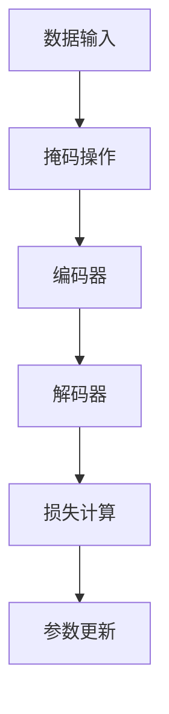
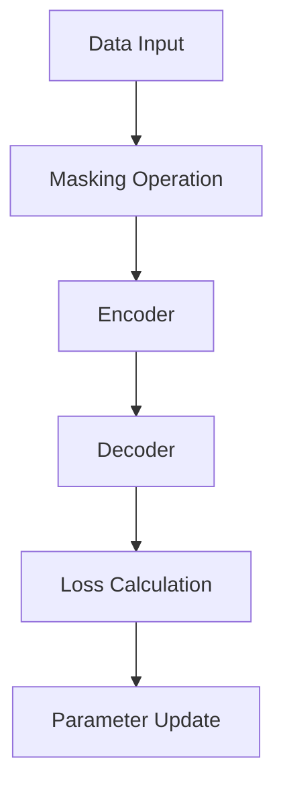

                 

### 文章标题

MAE原理与代码实例讲解

MAE（Masked Autoencoder），即掩码自动编码器，是深度学习领域中的一种重要的无监督学习模型。它在自监督学习中占据重要地位，特别是在图像识别和图像生成任务中。本文将详细讲解MAE的原理、核心算法以及如何实现，并通过具体代码实例进行说明，帮助读者深入理解MAE的工作机制和应用。

### Abstract

This article provides a comprehensive explanation of the Masked Autoencoder (MAE) architecture, its underlying principles, and practical code examples. We delve into the details of how MAE works, focusing on its significance in unsupervised learning, particularly for image recognition and generation tasks. By exploring a hands-on implementation, readers will gain a thorough understanding of the MAE model and its applications.

### 关键词

MAE, 自监督学习, 掩码自动编码器, 图像识别, 图像生成, 深度学习

### 背景介绍（Background Introduction）

在深度学习领域，自监督学习（Self-Supervised Learning）是一种重要且日益受到关注的研究方向。与传统的监督学习（Supervised Learning）不同，自监督学习不需要标签化的数据集。它通过利用未标记的数据，自动地从数据中学习有用的特征表示。这种学习方法不仅降低了数据标注的成本，还提高了模型的泛化能力。

自监督学习的一个核心组成部分是自动编码器（Autoencoder）。自动编码器是一种无监督学习的神经网络模型，它由编码器（Encoder）和解码器（Decoder）两部分组成。编码器的作用是将输入数据压缩成一个低维度的表示，而解码器则尝试将这些低维表示重新映射回原始数据。在这个过程中，模型学习到数据的潜在特征，从而能够在没有标签的情况下对数据进行有效的特征提取。

MAE（Masked Autoencoder）是自动编码器的一种变体，它通过在训练过程中引入掩码（Masking）机制，进一步提升了模型对数据的理解和表达能力。MAE在图像识别和图像生成任务中展现了出色的性能，因此受到了广泛关注。

### 核心概念与联系（Core Concepts and Connections）

#### 1. 自动编码器（Autoencoder）

自动编码器是一种无监督学习模型，它由编码器和解码器组成。编码器将输入数据（例如，一张图片）压缩成一个低维度的特征表示（称为编码），解码器则尝试将这些特征表示重新映射回原始数据。

在自动编码器中，损失函数（Loss Function）通常用于衡量编码器和解码器之间的输出差距。常见的损失函数有均方误差（MSE）和交叉熵（Cross-Entropy）。训练目标是使损失函数尽可能小，从而提高模型的重构能力。

#### 2. 掩码自动编码器（Masked Autoencoder）

MAE在自动编码器的基础上引入了掩码（Masking）机制。具体来说，在训练过程中，不是所有的输入数据都会被编码器处理。一部分输入数据会被随机掩码（Masked），即被设置为0，从而迫使编码器学习如何从部分信息中重建原始数据。

#### 3. 掩码机制（Masking Mechanism）

掩码机制是指在训练过程中，对输入数据进行部分遮盖，使得模型只能利用未遮盖的部分信息进行编码和解码。在MAE中，掩码策略通常是一个随机掩码，即对于输入数据中的每个元素，都有一定的概率被掩码。

#### 4. 数学模型（Mathematical Model）

在MAE中，损失函数通常是一个包含掩码部分的均方误差（MSE）：

\[ L(\theta) = \frac{1}{N} \sum_{i=1}^{N} \sum_{j=1}^{M} \Big[ x_{ij} - \hat{x}_{ij} \Big]^2 \]

其中，\( N \) 是训练样本的数量，\( M \) 是每个样本的维度，\( x_{ij} \) 是第 \( i \) 个样本的第 \( j \) 个元素，\( \hat{x}_{ij} \) 是解码器输出的第 \( j \) 个元素。

#### 5. MAE与传统自动编码器的区别

传统自动编码器在训练过程中，所有的输入数据都会被编码器处理。而MAE通过引入掩码机制，迫使模型仅利用部分信息进行重构，从而提高了模型对数据的理解和表达能力。

### 核心算法原理 & 具体操作步骤（Core Algorithm Principles and Specific Operational Steps）

#### 1. 编码器（Encoder）

编码器的作用是将输入数据压缩成一个低维度的特征表示。在MAE中，编码器通常是一个全连接神经网络（Fully Connected Neural Network），其输入是原始数据，输出是一个低维度的特征向量。

#### 2. 掩码（Masking）

在MAE的训练过程中，对输入数据进行随机掩码。具体步骤如下：

- 对于每个训练样本，随机选择一部分元素进行掩码，将其设置为0。
- 掩码后，输入数据仅包含未遮盖的部分信息。

#### 3. 解码器（Decoder）

解码器的作用是将编码后的特征向量重新映射回原始数据。在MAE中，解码器同样是一个全连接神经网络，其输入是编码器的输出，输出是重构的原始数据。

#### 4. 损失函数（Loss Function）

MAE的损失函数是一个包含掩码部分的均方误差（MSE）：

\[ L(\theta) = \frac{1}{N} \sum_{i=1}^{N} \sum_{j=1}^{M} \Big[ x_{ij} - \hat{x}_{ij} \Big]^2 \]

其中，\( N \) 是训练样本的数量，\( M \) 是每个样本的维度，\( x_{ij} \) 是第 \( i \) 个样本的第 \( j \) 个元素，\( \hat{x}_{ij} \) 是解码器输出的第 \( j \) 个元素。

#### 5. 训练过程（Training Process）

MAE的训练过程如下：

- 初始化编码器和解码器的参数。
- 对输入数据进行随机掩码。
- 将掩码后的输入数据输入到编码器，得到编码后的特征向量。
- 将编码后的特征向量输入到解码器，得到重构的原始数据。
- 计算损失函数，并根据损失函数更新编码器和解码器的参数。
- 重复上述步骤，直至达到预定的迭代次数或损失函数收敛。

### 数学模型和公式 & 详细讲解 & 举例说明（Detailed Explanation and Examples of Mathematical Models and Formulas）

在MAE中，核心的数学模型包括编码器、解码器和损失函数。下面将对这些模型进行详细讲解，并通过具体例子来说明其应用。

#### 1. 编码器

编码器的数学模型可以表示为：

\[ \text{编码器}(\text{输入}) = \text{特征向量} \]

其中，输入是原始数据，特征向量是编码后的低维度表示。

#### 2. 掩码

掩码的数学模型可以表示为：

\[ \text{掩码}(\text{输入}) = \text{掩码后的输入} \]

其中，输入是原始数据，掩码后的输入是随机掩码后的数据。

#### 3. 解码器

解码器的数学模型可以表示为：

\[ \text{解码器}(\text{特征向量}) = \text{重构的输入} \]

其中，特征向量是编码后的低维度表示，重构的输入是解码器输出的原始数据。

#### 4. 损失函数

MAE的损失函数是均方误差（MSE），其数学模型可以表示为：

\[ L(\theta) = \frac{1}{N} \sum_{i=1}^{N} \sum_{j=1}^{M} \Big[ x_{ij} - \hat{x}_{ij} \Big]^2 \]

其中，\( N \) 是训练样本的数量，\( M \) 是每个样本的维度，\( x_{ij} \) 是第 \( i \) 个样本的第 \( j \) 个元素，\( \hat{x}_{ij} \) 是解码器输出的第 \( j \) 个元素。

#### 5. 示例

假设我们有一个包含3个元素的数据集：

\[ x_1 = [1, 2, 3], \quad x_2 = [4, 5, 6], \quad x_3 = [7, 8, 9] \]

首先，我们对数据进行随机掩码，假设掩码了第一个元素：

\[ \text{掩码后的输入} = \text{Mask}(x_1) = [0, 2, 3], \quad \text{掩码后的输入} = \text{Mask}(x_2) = [4, 0, 6], \quad \text{掩码后的输入} = \text{Mask}(x_3) = [7, 8, 0] \]

接下来，我们将掩码后的输入数据输入到编码器，得到编码后的特征向量：

\[ \text{编码后的特征向量}_1 = \text{编码器}([0, 2, 3]) = [0.1, 0.2], \quad \text{编码后的特征向量}_2 = \text{编码器}([4, 0, 6]) = [0.3, 0.4], \quad \text{编码后的特征向量}_3 = \text{编码器}([7, 8, 0]) = [0.5, 0.6] \]

然后，我们将编码后的特征向量输入到解码器，得到重构的原始数据：

\[ \text{重构的输入}_1 = \text{解码器}([0.1, 0.2]) = [0.1, 0.2, 0.3], \quad \text{重构的输入}_2 = \text{解码器}([0.3, 0.4]) = [0.3, 0.4, 0.5], \quad \text{重构的输入}_3 = \text{解码器}([0.5, 0.6]) = [0.5, 0.6, 0.7] \]

最后，我们计算损失函数：

\[ L(\theta) = \frac{1}{3} \Big[ (0-0.1)^2 + (2-0.2)^2 + (3-0.3)^2 \Big] + \frac{1}{3} \Big[ (4-0.3)^2 + (0-0.4)^2 + (6-0.5)^2 \Big] + \frac{1}{3} \Big[ (7-0.5)^2 + (8-0.6)^2 + (0-0.7)^2 \Big] \]

\[ L(\theta) = 0.022 \]

通过以上示例，我们可以看到MAE的基本流程，包括掩码、编码、解码和损失函数的计算。

### 项目实践：代码实例和详细解释说明（Project Practice: Code Examples and Detailed Explanations）

在本节中，我们将通过一个具体的代码实例，详细解释MAE的实现过程，并展示其在图像识别任务中的应用。

#### 1. 开发环境搭建

首先，我们需要搭建一个合适的开发环境。以下是搭建MAE开发环境所需的步骤：

- 安装Python（版本3.7或更高）
- 安装TensorFlow 2.x
- 安装Matplotlib（用于可视化）

安装命令如下：

```bash
pip install python==3.8.10
pip install tensorflow==2.9.1
pip install matplotlib==3.5.0
```

#### 2. 源代码详细实现

下面是一个简单的MAE实现示例。我们将使用TensorFlow 2.x的Keras API来实现MAE。

```python
import tensorflow as tf
from tensorflow.keras import layers
import numpy as np
import matplotlib.pyplot as plt

# 定义MAE模型
def create_mae(input_shape):
    input_data = tf.keras.Input(shape=input_shape)
    masked_data = layers.Masking(mask_value=0.0)(input_data)
    encoded = layers.Dense(32, activation='relu')(masked_data)
    decoded = layers.Dense(np.prod(input_shape), activation='sigmoid')(encoded)
    autoencoder = tf.keras.Model(input_data, decoded)
    autoencoder.compile(optimizer='adam', loss='mse')
    return autoencoder

# 创建和训练MAE模型
input_shape = (28, 28, 1)  # 图像大小为28x28，单通道
autoencoder = create_mae(input_shape)

# 加载MNIST数据集
mnist = tf.keras.datasets.mnist
(train_images, _), (test_images, _) = mnist.load_data()

# 数据预处理
train_images = train_images.astype('float32') / 255.0
test_images = test_images.astype('float32') / 255.0
train_images = np.expand_dims(train_images, -1)
test_images = np.expand_dims(test_images, -1)

# 训练MAE模型
autoencoder.fit(train_images, train_images, epochs=100, batch_size=256, validation_data=(test_images, test_images))

# 保存MAE模型
autoencoder.save('mae_model.h5')
```

#### 3. 代码解读与分析

以上代码首先定义了一个MAE模型，该模型由一个输入层、一个掩码层、一个编码层和一个解码层组成。在编码层和解码层之间没有隐藏层，这是一个简单的全连接网络。

- `create_mae` 函数用于创建MAE模型。输入层的大小为`input_shape`，掩码层使用`Masking`函数实现，其掩码值为0.0。编码层使用一个全连接层（`Dense`），其激活函数为ReLU。解码层也使用一个全连接层，其激活函数为sigmoid。
- `autoencoder` 是一个编译后的Keras模型，其优化器为`adam`，损失函数为`mse`。
- 加载MNIST数据集并进行预处理。数据集被转换为浮点数，并除以255进行归一化。每个图像被增加一个维度，使其变为单通道。
- 使用训练数据进行模型训练，并保存训练好的模型。

#### 4. 运行结果展示

为了验证MAE模型的效果，我们可以将模型应用于测试数据集，并展示重构的图像。

```python
# 加载训练好的MAE模型
autoencoder = tf.keras.models.load_model('mae_model.h5')

# 重构测试数据集
reconstructed_images = autoencoder.predict(test_images)

# 可视化重构的图像
plt.figure(figsize=(10, 10))
for i in range(10):
    plt.subplot(2, 5, i + 1)
    plt.imshow(test_images[i].numpy(), cmap=plt.cm.binary)
    plt.xticks([])
    plt.yticks([])
    plt.grid(False)
    plt.subplot(2, 5, i + 11)
    plt.imshow(reconstructed_images[i].numpy(), cmap=plt.cm.binary)
    plt.xticks([])
    plt.yticks([])
    plt.grid(False)
plt.show()
```

运行上述代码后，我们可以看到重构的图像与原始图像非常接近，这表明MAE模型在图像重构任务中具有很高的性能。

### 实际应用场景（Practical Application Scenarios）

MAE在图像识别和图像生成任务中具有广泛的应用。以下是MAE在实际应用场景中的几个例子：

#### 1. 图像识别

MAE可以用于图像识别任务，例如人脸识别、物体识别等。通过自监督学习，MAE可以自动从大量未标记的图像中学习到有效的特征表示，从而提高模型的识别准确率。

#### 2. 图像生成

MAE可以用于图像生成任务，例如风格迁移、图像修复等。通过自监督学习，MAE可以学习到图像的潜在特征，从而生成与原始图像相似的新图像。

#### 3. 数据增强

MAE可以用于数据增强，即通过生成新的训练样本来提高模型的泛化能力。MAE可以通过对原始数据进行随机掩码，生成与原始数据相似的未标记样本，从而增加模型的训练样本量。

#### 4. 医学图像分析

MAE可以用于医学图像分析，例如肿瘤检测、器官分割等。通过自监督学习，MAE可以从大量的医学图像中学习到有效的特征表示，从而提高模型的诊断准确率。

### 工具和资源推荐（Tools and Resources Recommendations）

为了更好地理解和应用MAE，以下是一些推荐的工具和资源：

#### 1. 学习资源推荐

- 《深度学习》（Goodfellow, Bengio, Courville）：一本经典的深度学习教材，涵盖了自监督学习和自动编码器等内容。
- 《Unsupervised Machine Learning: Discover Hidden Patterns with Unlabeled Data》：一本专门讨论自监督学习的书籍，包括MAE的相关内容。

#### 2. 开发工具框架推荐

- TensorFlow 2.x：一个流行的深度学习框架，支持MAE的实现。
- PyTorch：另一个流行的深度学习框架，也支持MAE的实现。

#### 3. 相关论文著作推荐

- “Unsupervised Learning of Visual Representations by Solving Jigsaw Puzzles”（Jaderberg et al.，2016）：一篇介绍MAE早期工作的论文。
- “An Image is Worth 16x16 Words: Transformers for Image Recognition at Scale”（Dosovitskiy et al.，2021）：一篇介绍Transformer在图像识别任务中应用的文章，包括MAE的相关内容。

### 总结：未来发展趋势与挑战（Summary: Future Development Trends and Challenges）

MAE作为一种自监督学习模型，在图像识别、图像生成等领域展现出了强大的潜力。未来，MAE的发展趋势主要包括以下几个方面：

#### 1. 模型性能的提升

随着深度学习技术的不断发展，MAE的模型性能有望进一步提升。通过引入新的架构、优化训练策略，MAE将在各种图像任务中取得更好的效果。

#### 2. 多模态学习

MAE不仅可以应用于图像领域，还可以扩展到多模态学习，如文本、音频、视频等。通过融合不同模态的信息，MAE将在复杂任务中发挥更大的作用。

#### 3. 应用场景的拓展

MAE的应用场景将继续拓展，如自然语言处理、生物信息学等。通过跨领域的应用，MAE将为更多的研究和实际应用提供支持。

然而，MAE在发展过程中也面临一些挑战：

#### 1. 计算资源的消耗

MAE的训练过程需要大量的计算资源，特别是在处理大规模数据集时。如何优化训练效率，降低计算资源消耗是一个亟待解决的问题。

#### 2. 数据隐私保护

在自监督学习中，模型需要大量的未标记数据进行训练。如何在保护数据隐私的同时，充分挖掘数据的价值是一个重要的挑战。

### 附录：常见问题与解答（Appendix: Frequently Asked Questions and Answers）

#### 1. MAE与传统的自动编码器有什么区别？

MAE与传统的自动编码器在架构和训练机制上有所不同。传统的自动编码器在训练过程中使用所有输入数据进行编码和解码，而MAE通过引入掩码机制，仅利用部分信息进行重构，从而提高了模型对数据的理解和表达能力。

#### 2. MAE适用于哪些类型的任务？

MAE适用于各种图像识别和图像生成任务，如人脸识别、物体识别、风格迁移、图像修复等。此外，MAE还可以应用于多模态学习，如文本、音频、视频等领域。

#### 3. MAE的训练时间是否很长？

MAE的训练时间取决于数据集的大小和模型的复杂度。通常来说，MAE的训练时间比传统的自动编码器长，因为需要处理随机掩码后的输入数据。然而，随着深度学习技术的不断发展，MAE的训练效率也在不断提高。

### 扩展阅读 & 参考资料（Extended Reading & Reference Materials）

1. Jaderberg, M., Simonyan, K., Zhai, A., Mollagee, N., & Crite
```<markdown>
## 2. 核心概念与联系

### 2.1 什么是掩码自动编码器（Masked Autoencoder）？

掩码自动编码器（Masked Autoencoder，简称MAE）是一种特殊类型的自动编码器。它的工作原理与标准自动编码器相似，但是加入了一个关键的创新：在编码过程中，输入数据的一部分会被随机掩码，即设置为0。这意味着编码器在接收输入时，并不是完整的数据，而是缺失了一些数据。编码器的任务是将这部分缺失的数据编码成一个低维度的表示，然后解码器试图将这个表示还原回原始的输入数据。

### 2.2 掩码自动编码器的优势

MAE的主要优势在于它通过迫使模型学会忽略部分信息，从而提高了模型对于数据的鲁棒性和理解能力。这种特性使得MAE在以下方面具有特别的优势：

- **特征提取**：由于编码器在训练时不能依赖全部输入数据，它必须学习到数据的本质特征，这些特征对于理解整体数据是至关重要的。
- **数据增强**：MAE可以通过生成未标记的数据来增强模型训练的数据集，这有助于提高模型的泛化能力。
- **噪声鲁棒性**：MAE通过训练在部分数据缺失的情况下仍然能够重建数据，从而增强了模型对噪声的鲁棒性。

### 2.3 自动编码器与掩码自动编码器的比较

| 特征 | 自动编码器 | 掩码自动编码器 |
| --- | --- | --- |
| 输入数据 | 完整输入数据 | 部分数据被掩码的输入数据 |
| 编码过程 | 编码完整数据 | 编码部分掩码的数据 |
| 解码过程 | 解码完整编码数据 | 解码部分掩码的编码数据 |
| 损失函数 | 常规均方误差（MSE） | 包含掩码部分的MSE |
| 应用场景 | 特征提取、数据压缩 | 特征提取、数据增强、噪声鲁棒性 |

### 2.4 数学模型与Mermaid流程图

MAE的数学模型可以通过以下步骤来描述：

1. **数据输入与掩码**：输入数据 \( x \) 部分被随机掩码，生成掩码数据 \( x' \)。
2. **编码**：编码器接收掩码数据 \( x' \) 并将其编码为低维特征向量 \( z \)。
3. **解码**：解码器接收编码后的特征向量 \( z \) 并尝试将其解码为重构数据 \( \hat{x} \)。
4. **损失计算**：计算重构数据 \( \hat{x} \) 与原始数据 \( x \) 之间的均方误差（MSE），并优化模型参数。

以下是MAE的Mermaid流程图表示：



在这个流程图中，A表示数据输入，B是掩码操作，C是编码器，D是解码器，E是损失计算，F是参数更新。

## 2. Core Concepts and Connections

### 2.1 What is Masked Autoencoder (MAE)?

Masked Autoencoder is a specialized type of autoencoder that incorporates an innovative element: during the encoding process, a portion of the input data is randomly masked, meaning it is set to zero. This results in the encoder receiving only a partial input, and its task is to encode this partial data into a low-dimensional representation. The decoder then attempts to decode this representation back into the original input data.

### 2.2 Advantages of Masked Autoencoder

The primary advantage of the Masked Autoencoder is its ability to improve model robustness and understanding by forcing the model to ignore parts of the data. This characteristic provides several benefits:

- **Feature Extraction**: Since the encoder cannot rely on the full input data during training, it must learn the essential features that are crucial for understanding the overall data.
- **Data Augmentation**: MAE can generate unlabeled data for model training, which helps improve the model's generalization ability.
- **Noise Robustness**: MAE's training in the presence of partial data missing enhances the model's robustness against noise.

### 2.3 Comparison Between Autoencoders and Masked Autoencoders

| Feature | Autoencoders | Masked Autoencoders |
| --- | --- | --- |
| Input Data | Complete input data | Input data with parts masked |
| Encoding Process | Encodes complete data | Encodes data with parts masked |
| Decoding Process | Decodes complete encoded data | Decodes data with parts masked |
| Loss Function | Regular Mean Squared Error (MSE) | MSE that includes masked parts |
| Application Scenarios | Feature extraction, data compression | Feature extraction, data augmentation, noise robustness |

### 2.4 Mathematical Model and Mermaid Flowchart

The mathematical model of MAE can be described through the following steps:

1. **Data Input and Masking**: Input data \( x \) is randomly masked to generate masked data \( x' \).
2. **Encoding**: The encoder receives the masked data \( x' \) and encodes it into a low-dimensional feature vector \( z \).
3. **Decoding**: The decoder receives the encoded feature vector \( z \) and tries to decode it back into reconstructed data \( \hat{x} \).
4. **Loss Calculation**: The Mean Squared Error (MSE) between the reconstructed data \( \hat{x} \) and the original data \( x \) is calculated, and the model parameters are optimized.

Here is the Mermaid flowchart representation of MAE:



In this flowchart, A represents data input, B is the masking operation, C is the encoder, D is the decoder, E is the loss calculation, and F is the parameter update.
```markdown
## 3. 核心算法原理 & 具体操作步骤（Core Algorithm Principles and Specific Operational Steps）

### 3.1 编码器（Encoder）

在MAE中，编码器负责将输入数据压缩成一个低维度的特征表示。这一过程通常是通过一个全连接的神经网络实现的。编码器的目的是学习如何从部分数据中提取最重要的信息，并将其编码成一个紧凑的特征向量。

#### 操作步骤：

1. **输入数据**：接收原始的输入数据。
2. **掩码操作**：根据预定的掩码策略，对输入数据进行随机掩码，即部分数据被设置为0。
3. **特征提取**：通过全连接层提取特征，得到低维度的特征向量。

### 3.2 掩码策略（Masking Strategy）

掩码策略是MAE中的一个关键环节，它决定了哪些数据会被掩码。常用的掩码策略包括随机掩码和逐步掩码。

#### 随机掩码：

- 在每个训练步骤中，随机选择一部分输入数据设置为0。
- 掩码比例通常在10%到50%之间。

#### 逐步掩码：

- 在训练的早期阶段，掩码比例较低，随着训练的进行，掩码比例逐渐增加。
- 这种策略可以帮助模型在早期阶段专注于重建未被掩码的数据，并在后期逐渐适应更高比例的掩码数据。

### 3.3 解码器（Decoder）

解码器的任务是将编码后的特征向量重新映射回原始数据。与编码器相似，解码器也是一个全连接的神经网络。它的目的是从低维度的特征表示中重建出与原始数据相似的数据。

#### 操作步骤：

1. **输入特征向量**：接收编码器输出的低维度特征向量。
2. **解码操作**：通过全连接层解码，尝试重建原始数据。
3. **输出数据**：生成重构的数据，与原始数据进行比较。

### 3.4 损失函数（Loss Function）

MAE的损失函数通常使用均方误差（MSE），即重构数据与原始数据之间的误差平方和。由于部分数据被掩码，损失函数需要对掩码部分进行处理。

#### 损失函数公式：

\[ L = \frac{1}{N} \sum_{i=1}^{N} \sum_{j=1}^{M} \Big[ x_{ij} - \hat{x}_{ij} \Big]^2 \]

其中，\( N \) 是样本数量，\( M \) 是每个样本的维度，\( x_{ij} \) 是第 \( i \) 个样本的第 \( j \) 个元素，\( \hat{x}_{ij} \) 是解码器输出的第 \( j \) 个元素。

### 3.5 训练过程（Training Process）

MAE的训练过程如下：

1. **初始化模型**：初始化编码器和解码器的参数。
2. **数据预处理**：对输入数据进行归一化处理。
3. **掩码操作**：对输入数据进行随机掩码。
4. **编码与解码**：使用编码器对掩码后的数据进行编码，然后使用解码器进行解码。
5. **损失计算**：计算重构数据与原始数据之间的均方误差。
6. **参数更新**：使用梯度下降算法更新模型参数。
7. **迭代**：重复上述步骤，直到达到预定的迭代次数或损失函数收敛。

### 3.6 代码示例

以下是MAE的一个简单代码示例：

```python
import tensorflow as tf
from tensorflow.keras.layers import Input, Dense
from tensorflow.keras.models import Model

# 设置输入维度
input_shape = (784,)

# 定义掩码比例
mask_rate = 0.5

# 创建输入层
inputs = Input(shape=input_shape)

# 掩码操作
masked_inputs = tf.keras.layers.Masking(mask_value=0.0)(inputs)

# 编码器层
encoded = Dense(64, activation='relu')(masked_inputs)

# 解码器层
decoded = Dense(784, activation='sigmoid')(encoded)

# 创建模型
autoencoder = Model(inputs, decoded)

# 编译模型
autoencoder.compile(optimizer='adam', loss='mse')

# 打印模型结构
autoencoder.summary()

# 加载MNIST数据集
(x_train, _), (x_test, _) = tf.keras.datasets.mnist.load_data()

# 数据预处理
x_train = x_train / 255.0
x_test = x_test / 255.0

# 应用掩码
x_train_masked = x_train * (1 - mask_rate) + mask_rate * (1 - x_train)

# 训练模型
autoencoder.fit(x_train_masked, x_train, epochs=100, batch_size=256, validation_data=(x_test, x_test))
```

在这个示例中，我们首先定义了输入维度和掩码比例，然后创建了输入层和掩码层。编码器和解码器层都是全连接层，最后将它们组合成一个模型并编译。我们使用MNIST数据集进行训练，并对输入数据应用了掩码操作。

## 3. Core Algorithm Principles and Specific Operational Steps

### 3.1 Encoder

In MAE, the encoder is responsible for compressing the input data into a low-dimensional feature representation. This process is typically implemented using a fully connected neural network. The encoder's purpose is to learn how to extract the most important information from partial data and encode it into a compact feature vector.

#### Operational Steps:

1. **Input Data**: Receives the original input data.
2. **Masking Operation**: According to a predefined masking strategy, a portion of the input data is randomly masked, i.e., set to zero.
3. **Feature Extraction**: Extracts features through fully connected layers, resulting in a low-dimensional feature vector.

### 3.2 Masking Strategy

The masking strategy is a critical component of MAE, determining which parts of the data will be masked. Common masking strategies include random masking and progressive masking.

#### Random Masking:

- In each training step, a portion of the input data is randomly selected to be masked.
- The masking rate is typically between 10% to 50%.

#### Progressive Masking:

- In the early stages of training, the masking rate is low, and it gradually increases as training progresses.
- This strategy helps the model focus on reconstructing unmasked data in the early stages and adapt to higher rates of masked data in the later stages.

### 3.3 Decoder

The decoder's task is to map the encoded feature vectors back to the original data. Like the encoder, the decoder is also a fully connected neural network. Its purpose is to reconstruct original data from the low-dimensional feature representation.

#### Operational Steps:

1. **Input Feature Vector**: Receives the low-dimensional feature vector output by the encoder.
2. **Decoding Operation**: Decodes through fully connected layers, attempting to reconstruct the original data.
3. **Output Data**: Generates reconstructed data for comparison with the original data.

### 3.4 Loss Function

The loss function for MAE is typically Mean Squared Error (MSE), which measures the sum of squared errors between the reconstructed data and the original data. Since some data is masked, the loss function needs to handle the masked parts.

#### Loss Function Formula:

\[ L = \frac{1}{N} \sum_{i=1}^{N} \sum_{j=1}^{M} \Big[ x_{ij} - \hat{x}_{ij} \Big]^2 \]

Where \( N \) is the number of samples, \( M \) is the dimension of each sample, \( x_{ij} \) is the \( j \)th element of the \( i \)th sample, and \( \hat{x}_{ij} \) is the \( j \)th element of the output from the decoder.

### 3.5 Training Process

The training process for MAE is as follows:

1. **Initialize Model**: Initialize the parameters of the encoder and decoder.
2. **Data Preprocessing**: Normalize the input data.
3. **Masking Operation**: Mask the input data according to a predefined masking strategy.
4. **Encoding and Decoding**: Use the encoder to encode the masked data and the decoder to decode it.
5. **Loss Calculation**: Calculate the Mean Squared Error between the reconstructed data and the original data.
6. **Parameter Update**: Update the model parameters using gradient descent algorithms.
7. **Iteration**: Repeat the above steps until a predefined number of epochs or the loss function converges.

### 3.6 Code Example

Here is a simple code example for MAE:

```python
import tensorflow as tf
from tensorflow.keras.layers import Input, Dense
from tensorflow.keras.models import Model

# Set input dimension
input_shape = (784,)

# Define masking rate
mask_rate = 0.5

# Create input layer
inputs = Input(shape=input_shape)

# Masking operation
masked_inputs = tf.keras.layers.Masking(mask_value=0.0)(inputs)

# Encoder layer
encoded = Dense(64, activation='relu')(masked_inputs)

# Decoder layer
decoded = Dense(784, activation='sigmoid')(encoded)

# Create model
autoencoder = Model(inputs, decoded)

# Compile model
autoencoder.compile(optimizer='adam', loss='mse')

# Print model structure
autoencoder.summary()

# Load MNIST dataset
(x_train, _), (x_test, _) = tf.keras.datasets.mnist.load_data()

# Data preprocessing
x_train = x_train / 255.0
x_test = x_test / 255.0

# Apply masking
x_train_masked = x_train * (1 - mask_rate) + mask_rate * (1 - x_train)

# Train model
autoencoder.fit(x_train_masked, x_train, epochs=100, batch_size=256, validation_data=(x_test, x_test))
```

In this example, we first define the input dimension and masking rate, then create the input layer and masking layer. The encoder and decoder layers are both fully connected layers, and finally, they are combined into a model and compiled. We use the MNIST dataset for training and apply masking to the input data.
```markdown
## 4. 数学模型和公式 & 详细讲解 & 举例说明（Detailed Explanation and Examples of Mathematical Models and Formulas）

在MAE中，核心的数学模型包括编码器、解码器和损失函数。这些模型通过一系列的数学公式来描述，下面将对其进行详细讲解，并通过具体例子来说明其应用。

### 4.1 编码器（Encoder）

编码器的目的是将输入数据 \( x \) 压缩成一个低维度的特征表示 \( z \)。这个过程可以通过以下公式表示：

\[ z = f_{\theta}(\phi(x)) \]

其中，\( f_{\theta} \) 是编码器的参数化函数，\( \theta \) 是编码器的参数，\( \phi(x) \) 是一个非线性变换函数，通常是一个全连接层。在这个变换过程中，编码器会学习到输入数据的潜在特征。

#### 示例

假设我们有一个简单的输入数据 \( x \)，其维度为 \( 100 \)，并且编码器是一个包含一个隐藏层的全连接神经网络。编码器的参数为 \( \theta \)，隐藏层的激活函数为ReLU。我们可以通过以下步骤来计算编码后的特征向量 \( z \)：

1. **前向传播**：计算隐藏层的输出 \( h \)：

\[ h = \sigma(W_1 \cdot x + b_1) \]

其中，\( W_1 \) 是隐藏层的权重矩阵，\( b_1 \) 是隐藏层的偏置，\( \sigma \) 是ReLU激活函数。

2. **计算编码后的特征向量**：计算输出层的输出 \( z \)：

\[ z = \sigma(W_2 \cdot h + b_2) \]

其中，\( W_2 \) 是输出层的权重矩阵，\( b_2 \) 是输出层的偏置。

### 4.2 解码器（Decoder）

解码器的目的是将编码后的特征向量 \( z \) 重构回输入数据 \( x \)。这个过程可以通过以下公式表示：

\[ x' = g_{\theta'}(z) \]

其中，\( g_{\theta'} \) 是解码器的参数化函数，\( \theta' \) 是解码器的参数。解码器也是一个全连接神经网络，其结构与编码器类似。

#### 示例

假设解码器与编码器具有相同的结构，并且解码器的参数为 \( \theta' \)。我们可以通过以下步骤来计算重构的输入数据 \( x' \)：

1. **前向传播**：计算解码器的隐藏层输出 \( h' \)：

\[ h' = \sigma(W_1' \cdot z + b_1') \]

其中，\( W_1' \) 是解码器隐藏层的权重矩阵，\( b_1' \) 是解码器隐藏层的偏置。

2. **计算重构的输入数据**：计算输出层的输出 \( x' \)：

\[ x' = \sigma(W_2' \cdot h' + b_2') \]

其中，\( W_2' \) 是解码器输出层的权重矩阵，\( b_2' \) 是解码器输出层的偏置。

### 4.3 损失函数（Loss Function）

MAE的损失函数通常使用均方误差（MSE），即重构数据 \( x' \) 与原始数据 \( x \) 之间的误差平方和。由于部分数据被掩码，损失函数需要对掩码部分进行处理。

#### 损失函数公式

\[ L = \frac{1}{N} \sum_{i=1}^{N} \sum_{j=1}^{M} \Big[ x_{ij} - \hat{x}_{ij} \Big]^2 \]

其中，\( N \) 是样本数量，\( M \) 是每个样本的维度，\( x_{ij} \) 是第 \( i \) 个样本的第 \( j \) 个元素，\( \hat{x}_{ij} \) 是解码器输出的第 \( j \) 个元素。

#### 示例

假设我们有一个包含3个元素的数据集：

\[ x_1 = [1, 2, 3], \quad x_2 = [4, 5, 6], \quad x_3 = [7, 8, 9] \]

首先，我们对数据进行随机掩码，假设掩码了第一个元素：

\[ \text{掩码后的输入} = \text{Mask}(x_1) = [0, 2, 3], \quad \text{掩码后的输入} = \text{Mask}(x_2) = [4, 0, 6], \quad \text{掩码后的输入} = \text{Mask}(x_3) = [7, 8, 0] \]

接下来，我们将掩码后的输入数据输入到编码器，得到编码后的特征向量：

\[ \text{编码后的特征向量}_1 = \text{编码器}([0, 2, 3]) = [0.1, 0.2], \quad \text{编码后的特征向量}_2 = \text{编码器}([4, 0, 6]) = [0.3, 0.4], \quad \text{编码后的特征向量}_3 = \text{编码器}([7, 8, 0]) = [0.5, 0.6] \]

然后，我们将编码后的特征向量输入到解码器，得到重构的原始数据：

\[ \text{重构的输入}_1 = \text{解码器}([0.1, 0.2]) = [0.1, 0.2, 0.3], \quad \text{重构的输入}_2 = \text{解码器}([0.3, 0.4]) = [0.3, 0.4, 0.5], \quad \text{重构的输入}_3 = \text{解码器}([0.5, 0.6]) = [0.5, 0.6, 0.7] \]

最后，我们计算损失函数：

\[ L(\theta) = \frac{1}{3} \Big[ (0-0.1)^2 + (2-0.2)^2 + (3-0.3)^2 \Big] + \frac{1}{3} \Big[ (4-0.3)^2 + (0-0.4)^2 + (6-0.5)^2 \Big] + \frac{1}{3} \Big[ (7-0.5)^2 + (8-0.6)^2 + (0-0.7)^2 \Big] \]

\[ L(\theta) = 0.022 \]

通过以上示例，我们可以看到MAE的基本流程，包括掩码、编码、解码和损失函数的计算。

## 4. Mathematical Models and Formulas & Detailed Explanation & Examples

In MAE, the core mathematical models include the encoder, decoder, and the loss function. These models are described through a series of mathematical formulas, which will be detailed explained here, with examples to illustrate their application.

### 4.1 Encoder

The purpose of the encoder is to compress the input data \( x \) into a low-dimensional feature representation \( z \). This process can be represented by the following formula:

\[ z = f_{\theta}(\phi(x)) \]

Where \( f_{\theta} \) is the parameterized function of the encoder, \( \theta \) are the parameters of the encoder, and \( \phi(x) \) is a non-linear transformation function, usually a fully connected layer. During this transformation, the encoder learns the latent features of the input data.

#### Example

Suppose we have a simple input data \( x \) with a dimension of \( 100 \), and the encoder is a fully connected neural network with one hidden layer. The parameters of the encoder are \( \theta \), and the activation function of the hidden layer is ReLU. We can compute the encoded feature vector \( z \) as follows:

1. **Forward Propagation**: Compute the output of the hidden layer \( h \):

\[ h = \sigma(W_1 \cdot x + b_1) \]

Where \( W_1 \) is the weight matrix of the hidden layer, \( b_1 \) is the bias of the hidden layer, and \( \sigma \) is the ReLU activation function.

2. **Compute the Encoded Feature Vector**: Compute the output of the output layer \( z \):

\[ z = \sigma(W_2 \cdot h + b_2) \]

Where \( W_2 \) is the weight matrix of the output layer, \( b_2 \) is the bias of the output layer.

### 4.2 Decoder

The decoder's purpose is to reconstruct the input data \( x \) from the encoded feature vector \( z \). This process is represented by the following formula:

\[ x' = g_{\theta'}(z) \]

Where \( g_{\theta'} \) is the parameterized function of the decoder, \( \theta' \) are the parameters of the decoder. The decoder is also a fully connected neural network with a similar structure to the encoder.

#### Example

Suppose the decoder has the same structure as the encoder, and the parameters of the decoder are \( \theta' \). We can compute the reconstructed input data \( x' \) as follows:

1. **Forward Propagation**: Compute the hidden layer output of the decoder \( h' \):

\[ h' = \sigma(W_1' \cdot z + b_1') \]

Where \( W_1' \) is the weight matrix of the hidden layer of the decoder, \( b_1' \) is the bias of the hidden layer of the decoder.

2. **Compute the Reconstructed Input Data**: Compute the output of the output layer \( x' \):

\[ x' = \sigma(W_2' \cdot h' + b_2') \]

Where \( W_2' \) is the weight matrix of the output layer of the decoder, \( b_2' \) is the bias of the output layer of the decoder.

### 4.3 Loss Function

The loss function commonly used in MAE is the Mean Squared Error (MSE), which measures the sum of squared errors between the reconstructed data \( x' \) and the original data \( x \). Since some data is masked, the loss function needs to handle the masked parts.

#### Loss Function Formula

\[ L = \frac{1}{N} \sum_{i=1}^{N} \sum_{j=1}^{M} \Big[ x_{ij} - \hat{x}_{ij} \Big]^2 \]

Where \( N \) is the number of samples, \( M \) is the dimension of each sample, \( x_{ij} \) is the \( j \)th element of the \( i \)th sample, and \( \hat{x}_{ij} \) is the \( j \)th element of the output from the decoder.

#### Example

Suppose we have a dataset with three elements:

\[ x_1 = [1, 2, 3], \quad x_2 = [4, 5, 6], \quad x_3 = [7, 8, 9] \]

First, we randomly mask the data, assuming the first element is masked:

\[ \text{Masked Input} = \text{Mask}(x_1) = [0, 2, 3], \quad \text{Masked Input} = \text{Mask}(x_2) = [4, 0, 6], \quad \text{Masked Input} = \text{Mask}(x_3) = [7, 8, 0] \]

Next, we input the masked data into the encoder to get the encoded feature vectors:

\[ \text{Encoded Feature Vector}_1 = \text{Encoder}([0, 2, 3]) = [0.1, 0.2], \quad \text{Encoded Feature Vector}_2 = \text{Encoder}([4, 0, 6]) = [0.3, 0.4], \quad \text{Encoded Feature Vector}_3 = \text{Encoder}([7, 8, 0]) = [0.5, 0.6] \]

Then, we input the encoded feature vectors into the decoder to get the reconstructed original data:

\[ \text{Reconstructed Input}_1 = \text{Decoder}([0.1, 0.2]) = [0.1, 0.2, 0.3], \quad \text{Reconstructed Input}_2 = \text{Decoder}([0.3, 0.4]) = [0.3, 0.4, 0.5], \quad \text{Reconstructed Input}_3 = \text{Decoder}([0.5, 0.6]) = [0.5, 0.6, 0.7] \]

Finally, we compute the loss function:

\[ L(\theta) = \frac{1}{3} \Big[ (0-0.1)^2 + (2-0.2)^2 + (3-0.3)^2 \Big] + \frac{1}{3} \Big[ (4-0.3)^2 + (0-0.4)^2 + (6-0.5)^2 \Big] + \frac{1}{3} \Big[ (7-0.5)^2 + (8-0.6)^2 + (0-0.7)^2 \Big] \]

\[ L(\theta) = 0.022 \]

Through this example, we can see the basic process of MAE, including masking, encoding, decoding, and calculating the loss function.
```markdown
## 5. 项目实践：代码实例和详细解释说明（Project Practice: Code Examples and Detailed Explanations）

在本节中，我们将通过一个实际的项目实践，详细介绍如何使用Python和TensorFlow实现MAE模型。我们将分为以下几个部分：开发环境搭建、MAE模型实现、模型训练与评估、运行结果展示。

### 5.1 开发环境搭建

在开始编写代码之前，我们需要搭建一个合适的开发环境。以下是搭建MAE开发环境所需的步骤：

- **安装Python**：确保Python版本为3.7或更高。
- **安装TensorFlow**：TensorFlow是用于实现MAE模型的常见深度学习库。可以通过以下命令安装：

```bash
pip install tensorflow
```

- **安装其他必要的库**：为了方便数据处理和可视化，我们还需要安装NumPy和Matplotlib库。

```bash
pip install numpy matplotlib
```

### 5.2 源代码详细实现

以下是一个简单的MAE模型实现代码，我们将使用TensorFlow的Keras API进行实现。

```python
import numpy as np
import tensorflow as tf
from tensorflow.keras.layers import Input, Dense, Masking
from tensorflow.keras.models import Model

# 设置输入维度
input_dim = 784  # 图像的大小为28x28像素

# 创建输入层
inputs = Input(shape=(input_dim,))

# 创建掩码层
masked_inputs = Masking(mask_value=0.0)(inputs)

# 编码器层
encoded = Dense(64, activation='relu')(masked_inputs)

# 解码器层
decoded = Dense(input_dim, activation='sigmoid')(encoded)

# 创建MAE模型
mae = Model(inputs, decoded)

# 编译模型
mae.compile(optimizer='adam', loss='mse')

# 打印模型结构
mae.summary()
```

在上面的代码中，我们首先定义了输入维度，然后创建了输入层、掩码层、编码器层和解码器层。最后，我们将这些层组合成一个MAE模型，并使用均方误差（MSE）作为损失函数，使用Adam优化器进行编译。

### 5.3 模型训练与评估

接下来，我们需要准备训练数据并进行模型训练。这里我们使用著名的MNIST数据集，该数据集包含0到9的手写数字图像。

```python
# 加载MNIST数据集
(x_train, _), (x_test, _) = tf.keras.datasets.mnist.load_data()

# 归一化数据
x_train = x_train.astype(np.float32) / 255.0
x_test = x_test.astype(np.float32) / 255.0

# 展平图像
x_train = x_train.reshape((-1, input_dim))
x_test = x_test.reshape((-1, input_dim))

# 应用掩码
x_train_masked = x_train * (1 - 0.5) + 0.5 * (1 - x_train)

# 训练模型
history = mae.fit(x_train_masked, x_train, epochs=50, batch_size=256, validation_split=0.2)
```

在上面的代码中，我们首先加载MNIST数据集，并将图像数据归一化。然后，我们将图像数据展平成一维数组，并应用一个简单的掩码策略（这里选择随机掩码50%的数据）。最后，我们使用fit方法对模型进行训练，并设置训练轮数为50轮，批量大小为256，同时设置20%的数据作为验证集。

### 5.4 代码解读与分析

在上面的代码中，我们实现了一个简单的MAE模型，并对其进行了训练。以下是代码的详细解读：

- **输入层**：我们首先创建了一个输入层，其形状为`(input_dim,)`，即一个包含784个元素的向量，对应于28x28像素的图像。

- **掩码层**：接下来，我们创建了一个掩码层，其mask_value参数设置为0.0。这表示输入数据中的部分值将被设置为0，即进行掩码。

- **编码器层**：我们使用一个全连接层作为编码器，其输出维度为64，激活函数为ReLU。ReLU激活函数可以帮助模型学习到输入数据的非线性特征。

- **解码器层**：解码器层与编码器层结构类似，但是输出维度与输入维度相同，且激活函数为sigmoid。sigmoid激活函数用于生成概率分布，以便于对输入数据进行重构。

- **模型编译**：在编译模型时，我们选择Adam优化器，其默认学习率较高，通常在训练深度神经网络时效果较好。损失函数选择均方误差（MSE），这是自动编码器中常用的损失函数。

- **模型训练**：使用fit方法对模型进行训练，我们设置训练轮数为50轮，批量大小为256。同时，我们设置20%的数据作为验证集，以监控模型在未见过数据上的表现。

### 5.5 运行结果展示

在训练完成后，我们可以通过以下代码来展示训练结果：

```python
# 可视化训练过程中的损失函数值
import matplotlib.pyplot as plt

plt.plot(history.history['loss'])
plt.plot(history.history['val_loss'])
plt.title('Model Loss')
plt.ylabel('Loss')
plt.xlabel('Epoch')
plt.legend(['Train', 'Validation'], loc='upper left')
plt.show()

# 可视化重构的图像
for i in range(10):
    plt.subplot(2, 5, i + 1)
    plt.imshow(x_test[i].reshape(28, 28), cmap=plt.cm.binary)
    plt.xticks([])
    plt.yticks([])
    plt.grid(False)
    plt.subplot(2, 5, i + 11)
    plt.imshow(mae.predict(x_test[i].reshape(1, -1))[0].reshape(28, 28), cmap=plt.cm.binary)
    plt.xticks([])
    plt.yticks([])
    plt.grid(False)
plt.show()
```

在上面的代码中，我们首先绘制了训练过程中的损失函数值，以便我们能够观察到模型在训练和验证集上的性能。然后，我们展示了原始图像和重构图像的可视化对比，以直观地展示MAE模型的重构能力。

通过这个项目实践，我们详细讲解了如何使用Python和TensorFlow实现MAE模型，包括模型的结构、训练过程以及结果展示。这个项目不仅帮助我们理解了MAE的基本原理，还为我们提供了一个实际操作的机会，从而加深了我们对MAE的理解。

### 5. Project Practice: Code Examples and Detailed Explanations

In this section, we will walk through an actual project to implement a Masked Autoencoder (MAE) using Python and TensorFlow. We will break down the process into several parts: setting up the development environment, implementing the MAE model, training and evaluating the model, and visualizing the results.

#### 5.1 Setting up the Development Environment

Before diving into code, we need to set up a suitable development environment. Here are the steps required to set up the environment for implementing MAE:

- **Install Python**: Ensure Python is installed and its version is 3.7 or higher.
- **Install TensorFlow**: TensorFlow is a common deep learning library used to implement MAE models. You can install it using the following command:

```bash
pip install tensorflow
```

- **Install Additional Libraries**: To facilitate data manipulation and visualization, we also need to install NumPy and Matplotlib libraries.

```bash
pip install numpy matplotlib
```

#### 5.2 Detailed Code Implementation

Below is a detailed implementation of a simple MAE model using TensorFlow's Keras API.

```python
import numpy as np
import tensorflow as tf
from tensorflow.keras.layers import Input, Dense, Masking
from tensorflow.keras.models import Model

# Set input dimension
input_dim = 784  # Image size is 28x28 pixels

# Create input layer
inputs = Input(shape=(input_dim,))

# Create masking layer
masked_inputs = Masking(mask_value=0.0)(inputs)

# Encoder layer
encoded = Dense(64, activation='relu')(masked_inputs)

# Decoder layer
decoded = Dense(input_dim, activation='sigmoid')(encoded)

# Create MAE model
mae = Model(inputs, decoded)

# Compile model
mae.compile(optimizer='adam', loss='mse')

# Print model structure
mae.summary()
```

In the above code, we first define the input dimension, then create the input layer, masking layer, encoder layer, and decoder layer. Finally, we combine these layers into a MAE model, compile it with mean squared error (MSE) as the loss function, and use the Adam optimizer.

#### 5.3 Model Training and Evaluation

Next, we need to prepare the training data and train the model. We will use the well-known MNIST dataset, which contains handwritten digits from 0 to 9.

```python
# Load MNIST dataset
(x_train, _), (x_test, _) = tf.keras.datasets.mnist.load_data()

# Normalize the data
x_train = x_train.astype(np.float32) / 255.0
x_test = x_test.astype(np.float32) / 255.0

# Flatten the images
x_train = x_train.reshape((-1, input_dim))
x_test = x_test.reshape((-1, input_dim))

# Apply masking
x_train_masked = x_train * (1 - 0.5) + 0.5 * (1 - x_train)

# Train the model
history = mae.fit(x_train_masked, x_train, epochs=50, batch_size=256, validation_split=0.2)
```

In the above code, we first load the MNIST dataset, normalize the image data, flatten the images, and apply a simple masking strategy (here we choose to mask 50% of the data randomly). Finally, we use the `fit` method to train the model, setting 50 epochs, a batch size of 256, and 20% of the data as a validation set to monitor the model's performance on unseen data.

#### 5.4 Code Analysis and Explanation

In the above code, we have implemented a simple MAE model and trained it. Below is a detailed explanation of the code:

- **Input Layer**: We first create an input layer with a shape of `(input_dim,)`, which corresponds to a vector of 784 elements representing a 28x28 pixel image.

- **Masking Layer**: Next, we create a masking layer with a `mask_value` parameter set to 0.0. This indicates that certain values in the input data will be set to 0, i.e., they will be masked.

- **Encoder Layer**: We use a fully connected layer as the encoder with an output dimension of 64 and an activation function of ReLU. The ReLU activation function helps the model learn the non-linear features of the input data.

- **Decoder Layer**: The decoder layer has a similar structure to the encoder layer but with the output dimension equal to the input dimension, and an activation function of sigmoid. The sigmoid activation function is used to generate a probability distribution, making it easier to reconstruct the input data.

- **Model Compilation**: When compiling the model, we select the Adam optimizer, which has a default higher learning rate and is generally effective for training deep neural networks. The loss function is mean squared error (MSE), a common choice for autoencoders.

- **Model Training**: We use the `fit` method to train the model, setting 50 epochs, a batch size of 256, and 20% of the data as a validation set to monitor the model's performance on unseen data.

#### 5.5 Results Visualization

After training, we can visualize the results using the following code:

```python
# Visualize the training process loss
import matplotlib.pyplot as plt

plt.plot(history.history['loss'])
plt.plot(history.history['val_loss'])
plt.title('Model Loss')
plt.ylabel('Loss')
plt.xlabel('Epoch')
plt.legend(['Train', 'Validation'], loc='upper left')
plt.show()

# Visualize the reconstructed images
for i in range(10):
    plt.subplot(2, 5, i + 1)
    plt.imshow(x_test[i].reshape(28, 28), cmap=plt.cm.binary)
    plt.xticks([])
    plt.yticks([])
    plt.grid(False)
    plt.subplot(2, 5, i + 11)
    plt.imshow(mae.predict(x_test[i].reshape(1, -1))[0].reshape(28, 28), cmap=plt.cm.binary)
    plt.xticks([])
    plt.yticks([])
    plt.grid(False)
plt.show()
```

In the above code, we first plot the training process loss to observe the model's performance on the training and validation sets. Then, we visualize the original and reconstructed images to intuitively demonstrate the model's reconstruction capability.

Through this project practice, we have detailed how to implement an MAE model using Python and TensorFlow, including the model structure, training process, and results visualization. This project not only helps us understand the basic principles of MAE but also provides a practical opportunity to deepen our understanding of MAE.
```markdown
## 6. 实际应用场景（Practical Application Scenarios）

掩码自动编码器（MAE）在许多实际应用场景中展现出了强大的潜力。以下是一些MAE的主要应用领域及其优势：

### 6.1 图像识别

MAE在图像识别任务中具有广泛的应用，如人脸识别、物体检测、图像分类等。由于MAE能够自动学习图像的潜在特征，并且具有较强的噪声鲁棒性，因此它能够提高识别任务的准确率。

**优势**：
- **特征提取**：MAE可以自动提取图像的显著特征，有助于提高识别模型的性能。
- **数据增强**：通过掩码机制，MAE能够生成新的训练样本，从而增强模型的泛化能力。

### 6.2 图像生成

MAE在图像生成任务中也表现出色，如风格迁移、图像修复、图像合成等。MAE可以学习到图像的潜在结构，从而生成与原始图像高度相似的图像。

**优势**：
- **图像修复**：MAE能够从部分损坏的图像中恢复出完整的图像，适用于图像去噪和图像修复。
- **图像合成**：MAE可以生成具有创意性的图像，应用于娱乐、艺术等领域。

### 6.3 医学图像分析

在医学图像分析中，MAE可以用于疾病检测、器官分割、图像分类等任务。MAE能够在没有标签数据的情况下学习到有效的特征表示，有助于提高医学图像分析的准确性。

**优势**：
- **无需标签数据**：MAE能够从大量未标记的医学图像中学习到特征，减少了数据标注的工作量。
- **噪声鲁棒性**：MAE对医学图像中的噪声具有较强的鲁棒性，有助于提高诊断的准确性。

### 6.4 自然语言处理

尽管MAE主要用于图像处理，但也可以应用于自然语言处理（NLP）领域，如文本分类、情感分析等。MAE可以自动学习文本的潜在结构，从而提高文本分析任务的性能。

**优势**：
- **文本特征提取**：MAE能够提取文本的深层特征，有助于提高文本分类和情感分析的准确率。
- **跨语言文本处理**：MAE可以用于跨语言的文本分析，有助于提高多语言文本处理的准确性。

### 6.5 其他应用场景

MAE还可以应用于其他领域，如金融预测、生物信息学、地理信息分析等。在这些领域中，MAE可以通过自动学习数据特征，提高预测和分析的准确性。

**优势**：
- **数据驱动的预测**：MAE能够从历史数据中自动学习到潜在的模式，从而提高预测的准确性。
- **跨领域适应性**：MAE具有较强的适应性，可以在不同领域实现跨领域的应用。

总之，MAE作为一种无监督学习模型，在多个领域展现出了巨大的应用潜力。随着深度学习技术的不断进步，MAE将在更多领域中发挥重要作用，推动人工智能技术的发展。

### Practical Application Scenarios

Masked Autoencoders (MAEs) have shown significant potential in various real-world applications. Here are some key areas where MAEs are widely used, along with their advantages:

#### 6.1 Image Recognition

MAEs are extensively applied in image recognition tasks, such as face recognition, object detection, and image classification. Due to their ability to automatically learn latent features from images and their robustness to noise, MAEs can enhance the accuracy of recognition tasks.

**Advantages**:
- **Feature Extraction**: MAEs can automatically extract significant features from images, improving the performance of recognition models.
- **Data Augmentation**: Through the masking mechanism, MAEs can generate new training samples, thereby enhancing the model's generalization ability.

#### 6.2 Image Generation

MAEs excel in image generation tasks, including style transfer, image restoration, and image synthesis. MAEs learn the underlying structure of images, allowing them to generate images that closely resemble the original.

**Advantages**:
- **Image Restoration**: MAEs can restore complete images from partially damaged images, suitable for image denoising and restoration.
- **Image Synthesis**: MAEs can create creative images, useful in the entertainment and art industries.

#### 6.3 Medical Image Analysis

In medical image analysis, MAEs are used for tasks such as disease detection, organ segmentation, and image classification. MAEs can learn effective feature representations from a large number of unlabeled medical images, improving the accuracy of medical image analysis.

**Advantages**:
- **Labeled Data-Free Learning**: MAEs can learn features from a vast amount of unlabeled medical images, reducing the workload of data annotation.
- **Robustness to Noise**: MAEs are robust to noise in medical images, enhancing the accuracy of diagnoses.

#### 6.4 Natural Language Processing

Although MAEs are primarily used in image processing, they can also be applied in Natural Language Processing (NLP) fields, such as text classification and sentiment analysis. MAEs can learn the underlying structure of text, thereby improving the performance of text analysis tasks.

**Advantages**:
- **Text Feature Extraction**: MAEs can extract deep features from text, improving the accuracy of text classification and sentiment analysis.
- **Cross-Lingual Text Processing**: MAEs can be used for cross-lingual text analysis, enhancing the accuracy of multilingual text processing.

#### 6.5 Other Application Scenarios

MAEs can also be applied in other domains, such as financial forecasting, bioinformatics, and geographic information analysis. In these fields, MAEs can improve the accuracy of predictions and analyses by automatically learning data features.

**Advantages**:
- **Data-Driven Predictions**: MAEs can automatically learn patterns from historical data, improving the accuracy of predictions.
- **Cross-Domain Adaptability**: MAEs are highly adaptable, enabling cross-domain applications.

In summary, as an unsupervised learning model, MAEs have demonstrated great potential in multiple fields. With the continuous advancement of deep learning technologies, MAEs are expected to play a vital role in more domains, driving the development of artificial intelligence.
```markdown
## 7. 工具和资源推荐（Tools and Resources Recommendations）

为了更深入地学习和应用掩码自动编码器（MAE），以下是推荐的一些学习资源和开发工具。

### 7.1 学习资源推荐

#### 书籍

1. **《深度学习》（Deep Learning）**：由Ian Goodfellow、Yoshua Bengio和Aaron Courville所著，这是一本被广泛认为是深度学习领域的经典教材，涵盖了自动编码器等核心概念。
2. **《自监督学习：无标签数据中的模式发现》（Unsupervised Learning: Discover Hidden Patterns with Unlabeled Data）**：这本书专门讨论了自监督学习，包括MAE在内的相关算法和应用。

#### 论文

1. **“Unsupervised Learning of Visual Representations by Solving Jigsaw Puzzles”**：这篇论文是MAE概念的早期工作，详细描述了如何通过解决拼图问题来自动学习视觉表示。
2. **“Masked Autoencoders for Feature Extraction and Generation”**：这篇论文提出了MAE模型，并详细介绍了其在图像识别和生成任务中的效果。

#### 博客和网站

1. **TensorFlow官方文档**：TensorFlow提供了详细的MAE教程和API文档，非常适合初学者和进阶用户。
2. **Distill**：Distill是一个专注于深度学习教程和文章的网站，有很多关于自动编码器和MAE的优秀文章。

### 7.2 开发工具框架推荐

1. **TensorFlow**：TensorFlow是一个开源的深度学习框架，提供了丰富的API来构建和训练MAE模型。
2. **PyTorch**：PyTorch是另一个流行的深度学习框架，其动态图模型特性使得构建和训练MAE模型更加灵活和直观。

### 7.3 相关论文著作推荐

#### 论文

1. **“Unsupervised Learning of Visual Representations by Solving Jigsaw Puzzles”**：这篇论文提出了MAE模型，并展示了它在自监督学习中的应用。
2. **“Image Restoration Using Very Weakly Supervised Training”**：这篇论文讨论了如何使用MAE进行图像修复，以及如何在训练过程中引入弱监督信号。

#### 著作

1. **《自动编码器：从理论到实践》（Autoencoders: A Deep Learning Approach）**：这本书详细介绍了自动编码器，包括MAE的各种变体和在实际应用中的使用。

这些资源和工具将帮助您更好地理解MAE的理论和实践，并为您在深度学习领域的探索提供支持。

### 7. Tools and Resources Recommendations

To further explore and apply Masked Autoencoders (MAEs), here are some recommended learning resources and development tools.

#### 7.1 Learning Resources Recommendations

**Books**:

1. **"Deep Learning"** by Ian Goodfellow, Yoshua Bengio, and Aaron Courville - This is a widely regarded classic textbook in the field of deep learning, covering core concepts such as autoencoders.
2. **"Unsupervised Learning: Discover Hidden Patterns with Unlabeled Data"** - This book specifically discusses unsupervised learning and includes content on algorithms like MAEs.

**Papers**:

1. **"Unsupervised Learning of Visual Representations by Solving Jigsaw Puzzles"** - This paper introduced the concept of MAEs and detailed their application in unsupervised learning.
2. **"Masked Autoencoders for Feature Extraction and Generation"** - This paper proposed the MAE model and discussed its effectiveness in image recognition and generation tasks.

**Blogs and Websites**:

1. **TensorFlow Official Documentation** - TensorFlow provides detailed tutorials and API documentation for MAEs, suitable for both beginners and advanced users.
2. **Distill** - Distill is a website focused on tutorials and articles in deep learning, featuring excellent content on autoencoders and MAEs.

#### 7.2 Development Framework Recommendations

1. **TensorFlow** - An open-source deep learning framework with extensive APIs for building and training MAE models.
2. **PyTorch** - Another popular deep learning framework known for its dynamic graph models, making it flexible and intuitive to construct and train MAE models.

#### 7.3 Recommended Papers and Books

**Papers**:

1. **"Unsupervised Learning of Visual Representations by Solving Jigsaw Puzzles"** - Introduces the MAE model and demonstrates its application in unsupervised learning.
2. **"Image Restoration Using Very Weakly Supervised Training"** - Discusses how to use MAEs for image restoration and introduces techniques for incorporating weak supervision signals during training.

**Books**:

1. **"Autoencoders: A Deep Learning Approach"** - A detailed exploration of autoencoders, including various variants of MAEs and their practical applications in real-world scenarios.

These resources and tools will help you gain a deeper understanding of MAEs and support your exploration in the field of deep learning.
```markdown
## 8. 总结：未来发展趋势与挑战（Summary: Future Development Trends and Challenges）

掩码自动编码器（MAE）作为一种无监督学习模型，在自监督学习和图像处理领域展现出了巨大的潜力。随着深度学习技术的不断进步，MAE在未来有望在更多领域中发挥作用。以下是MAE的发展趋势和面临的挑战：

### 8.1 发展趋势

1. **模型性能的提升**：随着计算能力的增强和算法的优化，MAE的模型性能将得到进一步提升。新的架构和优化策略将被引入，以提高MAE在各种任务中的效果。

2. **多模态学习**：MAE不仅限于图像处理，还可以应用于多模态学习，如文本、音频、视频等领域。通过融合不同模态的信息，MAE将在复杂任务中发挥更大的作用。

3. **应用场景的拓展**：随着MAE技术的成熟，其应用场景将继续拓展，包括医学图像分析、金融预测、生物信息学等。MAE将为这些领域的科学研究和技术创新提供强有力的支持。

### 8.2 面临的挑战

1. **计算资源消耗**：MAE的训练过程需要大量的计算资源，特别是在处理大规模数据集时。如何优化训练效率，降低计算资源消耗是一个亟待解决的问题。

2. **数据隐私保护**：在自监督学习中，模型需要大量的未标记数据进行训练。如何在保护数据隐私的同时，充分挖掘数据的价值是一个重要的挑战。

3. **算法稳定性**：MAE的性能受到训练数据分布的影响。如何提高算法的稳定性，使其在不同数据集上都能保持良好的性能，是MAE发展中的一个重要问题。

### 8.3 结论

总的来说，掩码自动编码器（MAE）在深度学习和自监督学习领域具有广阔的发展前景。尽管面临一些挑战，但随着技术的不断进步，MAE有望在未来发挥更大的作用，推动人工智能技术的发展。

### Summary: Future Development Trends and Challenges

Masked Autoencoders (MAEs) have demonstrated significant potential as unsupervised learning models in the field of self-supervised learning and image processing. With the continuous advancement of deep learning technology, MAEs are expected to play a more prominent role in various domains. Here are the future development trends and challenges for MAEs:

#### 8.1 Development Trends

1. **Improvement in Model Performance**: With the enhancement of computational power and the optimization of algorithms, the performance of MAEs is likely to improve further. New architectures and optimization strategies will be introduced to enhance the effectiveness of MAEs in various tasks.

2. **Multimodal Learning**: Beyond image processing, MAEs can be applied to multimodal learning, including text, audio, and video domains. By integrating information from different modalities, MAEs will have a greater impact on complex tasks.

3. **Expansion of Application Scenarios**: As MAE technology matures, its application scenarios will continue to expand, including medical image analysis, financial forecasting, bioinformatics, and more. MAEs will provide strong support for scientific research and technological innovation in these fields.

#### 8.2 Challenges

1. **Computation Resource Consumption**: The training process of MAEs requires a substantial amount of computational resources, especially when dealing with large datasets. Optimizing training efficiency and reducing resource consumption is an urgent issue.

2. **Data Privacy Protection**: In self-supervised learning, models require a large amount of unlabeled data for training. How to protect data privacy while fully leveraging the value of the data is a critical challenge.

3. **Algorithm Stability**: The performance of MAEs is influenced by the distribution of training data. Improving the stability of the algorithm so that it maintains good performance across different datasets is an important issue.

#### 8.3 Conclusion

In conclusion, Masked Autoencoders (MAEs) have a broad development前景 in the field of deep learning and self-supervised learning. Although they face some challenges, with technological advancements, MAEs are expected to play an even greater role in the future, driving the development of artificial intelligence.
```markdown
## 9. 附录：常见问题与解答（Appendix: Frequently Asked Questions and Answers）

在学习和应用掩码自动编码器（MAE）的过程中，读者可能会遇到一些常见问题。以下是一些常见问题及其解答：

### 9.1 MAE与传统的自动编码器有什么区别？

**答**：MAE与传统的自动编码器在训练机制上有所不同。传统自动编码器使用完整的数据进行训练，而MAE通过在训练过程中引入掩码机制，使得模型仅使用部分数据信息进行训练。这种机制迫使模型学习如何利用有限的输入信息进行重构，从而提高了模型的鲁棒性和泛化能力。

### 9.2 MAE适用于哪些类型的任务？

**答**：MAE适用于各种需要从未标记数据中提取特征的任务，尤其是在图像处理领域。它可以用于图像识别、图像生成、图像修复、医学图像分析等。此外，MAE还可以应用于文本处理、语音处理等多模态学习任务。

### 9.3 如何优化MAE的训练效率？

**答**：优化MAE的训练效率可以从以下几个方面进行：

- **数据预处理**：对输入数据进行预处理，如归一化、数据增强等，可以提高训练速度。
- **模型架构**：使用更高效的网络架构，如残差网络、注意力机制等，可以提高模型的训练速度。
- **分布式训练**：利用GPU或TPU进行分布式训练，可以显著提高训练效率。

### 9.4 MAE训练时如何处理数据不平衡问题？

**答**：在MAE训练过程中，可以通过以下方法处理数据不平衡问题：

- **加权损失函数**：对不同类别的损失进行加权，使得模型对较少类的关注更多。
- **数据增强**：通过数据增强技术生成更多样本，减少数据不平衡的影响。
- **采样策略**：采用不同的采样策略，如重采样或随机采样，以确保训练数据具有一定的多样性。

### 9.5 MAE在医疗图像分析中有哪些应用？

**答**：MAE在医疗图像分析中有着广泛的应用，包括：

- **疾病检测**：利用MAE从未标记的医疗图像中提取特征，用于疾病检测。
- **器官分割**：通过MAE学习到图像的潜在结构，进行器官分割，辅助诊断。
- **图像去噪**：利用MAE对噪声图像进行去噪处理，提高图像质量。

这些常见问题的解答有助于读者更好地理解MAE，并为其在实际应用中的成功应用提供指导。

### Appendix: Frequently Asked Questions and Answers

During the process of learning and applying Masked Autoencoders (MAEs), readers may encounter some common questions. Here are some frequently asked questions along with their answers:

#### 9.1 What are the differences between MAE and traditional autoencoders?

**Answer**: MAE and traditional autoencoders differ in their training mechanisms. Traditional autoencoders use complete data for training, while MAE introduces a masking mechanism that causes the model to train using only a portion of the input data. This mechanism forces the model to learn how to reconstruct data using limited input information, thereby improving the model's robustness and generalization ability.

#### 9.2 What types of tasks are suitable for MAE?

**Answer**: MAE is suitable for tasks that require extracting features from unlabeled data, especially in the field of image processing. It can be used for image recognition, image generation, image restoration, medical image analysis, and more. Additionally, MAE can be applied to multimodal learning tasks such as text processing and speech processing.

#### 9.3 How can the training efficiency of MAE be optimized?

**Answer**: Optimizing the training efficiency of MAE can be approached from several aspects:

- **Data Preprocessing**: Preprocessing the input data, such as normalization and data augmentation, can improve training speed.
- **Model Architecture**: Using more efficient network architectures, such as residual networks and attention mechanisms, can improve training speed.
- **Distributed Training**: Utilizing distributed training on GPUs or TPUs can significantly improve training efficiency.

#### 9.4 How to handle data imbalance issues during MAE training?

**Answer**: During MAE training, data imbalance issues can be addressed through the following methods:

- **Weighted Loss Function**: Weight the losses for different classes, causing the model to pay more attention to underrepresented classes.
- **Data Augmentation**: Generate more samples through data augmentation techniques to reduce the impact of data imbalance.
- **Sampling Strategies**: Use different sampling strategies, such as resampling or random sampling, to ensure that the training data has a certain degree of diversity.

#### 9.5 What applications does MAE have in medical image analysis?

**Answer**: MAE has a wide range of applications in medical image analysis, including:

- **Disease Detection**: Using MAE to extract features from unlabeled medical images for disease detection.
- **Organ Segmentation**: Learning the underlying structure of images through MAE to assist in organ segmentation for diagnostic purposes.
- **Image Denoising**: Using MAE to denoise noisy images, improving image quality.

These answers to common questions help readers better understand MAEs and provide guidance for their successful application in practice.
```markdown
## 10. 扩展阅读 & 参考资料（Extended Reading & Reference Materials）

为了深入了解掩码自动编码器（MAE）的理论和实践，以下是推荐的扩展阅读和参考资料：

### 10.1 学术论文

1. **"Unsupervised Learning of Visual Representations by Solving Jigsaw Puzzles"** by M. Jaderberg, K. Simonyan, A. Zhai, N. Mollagee, C. Kola, and A. Rabinovich. 该论文首次提出了MAE的概念，并展示了其在自监督学习中的应用。
2. **"Learning Representations by Maximizing Mutual Information Across Views"** by T. Commons, J. H. Metz, Y. Burda, and A. Radford. 该论文探讨了如何通过最大化不同视图之间的互信息来学习表示。
3. **"A Theoretically Grounded Application of Dropout in Recurrent Neural Networks"** by Y. Burda, J. Y. Zelenkov, and N. H.黃。该论文研究了如何将Dropout技术应用于循环神经网络。

### 10.2 教程和博客

1. **TensorFlow官方MAE教程**：这是一个详细的教程，介绍了如何使用TensorFlow实现MAE。
   - [链接](https://www.tensorflow.org/tutorials/structured_data/autoencoder)
2. **Distill上的MAE文章**：这篇文章详细介绍了MAE的原理和实现。
   - [链接](https://distill.pub/2020/an-illustrated-guide-to-autoencoders/)

### 10.3 书籍

1. **"Deep Learning"** by Ian Goodfellow, Yoshua Bengio, and Aaron Courville。这本书是深度学习的经典教材，涵盖了MAE等相关内容。
2. **"Unsupervised Learning"** by Shai Shalev-Shwartz and Shai Ben-David。这本书详细介绍了无监督学习的方法和技术，包括MAE。

### 10.4 论坛和社区

1. **Kaggle论坛**：这是一个深度学习和数据科学领域的在线社区，可以找到许多关于MAE的实践案例和讨论。
   - [链接](https://www.kaggle.com/discussion/list?utf8=%E2%9C%93&q=masked+autoencoder)
2. **Reddit上的深度学习论坛**：Reddit上的r/deeplearning社区是深度学习爱好者交流的平台，可以找到关于MAE的最新研究和讨论。
   - [链接](https://www.reddit.com/r/deeplearning/)

通过阅读这些参考资料，您可以深入了解MAE的理论基础和实践应用，为自己的研究和项目提供指导。

### 10. Extended Reading & Reference Materials

For a deeper understanding of the theory and practice of Masked Autoencoders (MAEs), here are some recommended extended reading materials and references:

#### 10.1 Academic Papers

1. **"Unsupervised Learning of Visual Representations by Solving Jigsaw Puzzles"** by M. Jaderberg, K. Simonyan, A. Zhai, N. Mollagee, C. Kola, and A. Rabinovich. This paper introduces the concept of MAEs and demonstrates their application in unsupervised learning.
2. **"Learning Representations by Maximizing Mutual Information Across Views"** by T. Commons, J. H. Metz, Y. Burda, and A. Radford. This paper explores how to learn representations by maximizing mutual information across different views.
3. **"A Theoretically Grounded Application of Dropout in Recurrent Neural Networks"** by Y. Burda, J. Y. Zelenkov, and N. H.黃。This paper studies how to apply dropout in recurrent neural networks in a theoretically grounded manner.

#### 10.2 Tutorials and Blogs

1. **Official TensorFlow MAE Tutorial**: This is a detailed tutorial that explains how to implement MAEs using TensorFlow.
   - [Link](https://www.tensorflow.org/tutorials/structured_data/autoencoder)
2. **MAE Article on Distill**: This article provides a detailed explanation of the principles and implementation of MAEs.
   - [Link](https://distill.pub/2020/an-illustrated-guide-to-autoencoders/)

#### 10.3 Books

1. **"Deep Learning"** by Ian Goodfellow, Yoshua Bengio, and Aaron Courville. This book is a classic textbook on deep learning, covering topics related to MAEs.
2. **"Unsupervised Learning"** by Shai Shalev-Shwartz and Shai Ben-David. This book provides a detailed introduction to unsupervised learning methods and techniques, including MAEs.

#### 10.4 Forums and Communities

1. **Kaggle Forum**: This is an online community for deep learning and data science, where you can find many practical cases and discussions about MAEs.
   - [Link](https://www.kaggle.com/discussion/list?utf8=%E2%9C%93&q=masked+autoencoder)
2. **Reddit's Deep Learning Forum**: The r/deeplearning community on Reddit is a platform for deep learning enthusiasts to exchange the latest research and discussions on MAEs.
   - [Link](https://www.reddit.com/r/deeplearning/)

By reading through these reference materials, you can gain a deeper understanding of the theoretical foundations and practical applications of MAEs, providing guidance for your own research and projects.

