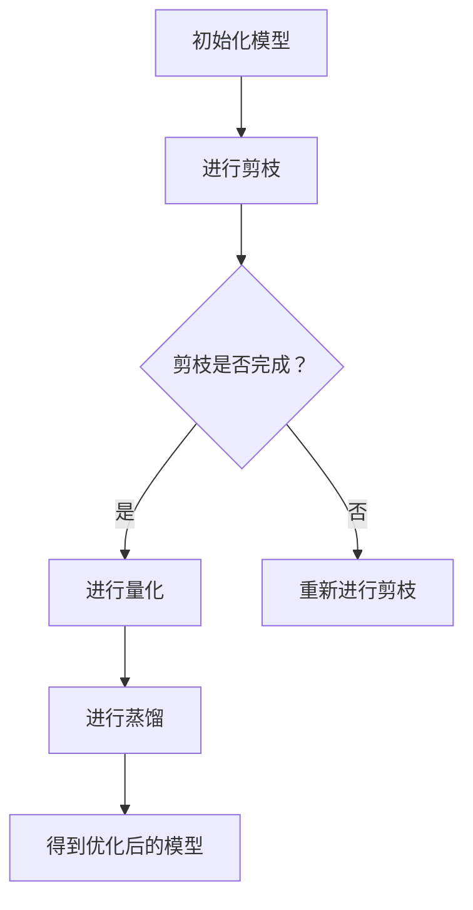

                 

# Model Optimization 原理与代码实战案例讲解

## 关键词
- 模型优化
- 深度学习
- 计算效率
- 内存占用
- 模型压缩
- 计算效率提升
- 内存占用减少

## 摘要
本文将深入探讨模型优化的原理及其在实际项目中的应用。通过分析模型优化的重要性，介绍几种常见的优化方法，如剪枝、量化、蒸馏等，并结合具体代码实战案例，展示如何在实际项目中实施模型优化。此外，文章还将讨论优化技术在各种应用场景中的适用性，并展望未来发展趋势与挑战。

## 1. 背景介绍

随着深度学习技术的不断发展，神经网络模型在处理复杂数据任务方面取得了显著成效。然而，深度学习模型的计算成本和内存占用也变得越来越大。在训练和部署过程中，如何提高计算效率和减少内存占用成为了关键问题。模型优化技术应运而生，通过一系列方法对模型进行优化，以提高其在实际应用中的性能。

模型优化的重要性主要体现在以下几个方面：

1. **计算效率提升**：优化后的模型可以更快地完成计算任务，降低训练和推理时间。
2. **内存占用减少**：优化技术可以减小模型大小，降低内存占用，使得模型在资源受限的环境下仍能运行。
3. **降低成本**：提高计算效率和减少内存占用有助于降低硬件成本和能源消耗。
4. **应用广泛**：模型优化技术适用于各种深度学习任务，如图像识别、自然语言处理、语音识别等。

## 2. 核心概念与联系

### 2.1 模型优化方法

模型优化方法主要包括剪枝、量化、蒸馏等。下面将分别介绍这些方法的基本原理。

#### 2.1.1 剪枝（Pruning）

剪枝是通过删除模型中一些不重要的神经元或权重，来减小模型大小和计算复杂度。剪枝可以分为两种类型：结构剪枝（structural pruning）和权重剪枝（weight pruning）。

- **结构剪枝**：直接删除模型中的某些层或神经元。
- **权重剪枝**：通过设置较小的权重阈值，将权重较小的神经元设置为0，从而实现剪枝。

#### 2.1.2 量化（Quantization）

量化是一种通过降低模型中数值精度来减小模型大小和计算复杂度的方法。量化可以分为整数量化（integer quantization）和浮点量化（floating-point quantization）。

- **整数量化**：将浮点数转换为整数，通常通过舍入或截断实现。
- **浮点量化**：在浮点数表示中减少位数，从而减小数值范围。

#### 2.1.3 蒸馏（Distillation）

蒸馏是一种将知识从一个大模型传递到一个小模型的方法，即通过训练小模型来学习大模型的表示。蒸馏可以分为两种类型：软蒸馏（soft distillation）和硬蒸馏（hard distillation）。

- **软蒸馏**：小模型的学习目标是模拟大模型的概率分布。
- **硬蒸馏**：小模型的学习目标是模拟大模型的输出标签。

### 2.2 模型优化原理

模型优化原理主要基于以下几个核心思想：

1. **模型简化**：通过去除不重要的神经元或权重，简化模型结构，降低计算复杂度。
2. **数值优化**：通过量化等方法，减小数值精度，降低内存占用。
3. **知识传递**：通过蒸馏等策略，将大模型的知识传递到小模型，提高小模型的性能。

### 2.3 Mermaid 流程图

以下是模型优化过程的 Mermaid 流程图：



## 3. 核心算法原理 & 具体操作步骤

### 3.1 剪枝算法原理

剪枝算法的核心思想是去除模型中不重要的神经元或权重，从而简化模型结构。具体步骤如下：

1. **选择剪枝策略**：根据任务需求，选择结构剪枝或权重剪枝策略。
2. **计算重要性指标**：使用各种剪枝算法（如L1范数、L2范数等）计算神经元或权重的的重要性指标。
3. **设置剪枝阈值**：根据重要性指标，设置剪枝阈值，将重要性指标低于阈值的神经元或权重设置为0。
4. **重建模型**：删除剪枝掉的神经元或权重，重建简化后的模型。

### 3.2 量化算法原理

量化算法的核心思想是通过降低数值精度，减小模型大小和计算复杂度。具体步骤如下：

1. **选择量化类型**：根据硬件平台和任务需求，选择整数量化或浮点量化。
2. **确定量化范围**：根据模型中数值的最大值和最小值，确定量化范围。
3. **量化操作**：将模型中的浮点数转换为整数或降低浮点数位数，实现量化。
4. **调整模型参数**：根据量化后的模型参数，调整模型权重和偏置。

### 3.3 蒸馏算法原理

蒸馏算法的核心思想是将大模型的知识传递到小模型，提高小模型的性能。具体步骤如下：

1. **选择蒸馏策略**：根据任务需求，选择软蒸馏或硬蒸馏策略。
2. **定义损失函数**：根据蒸馏策略，定义损失函数，用于指导小模型学习大模型的表示。
3. **训练小模型**：使用大模型的输出作为软目标，训练小模型。
4. **评估模型性能**：评估小模型的性能，根据性能调整蒸馏策略和模型参数。

## 4. 数学模型和公式 & 详细讲解 & 举例说明

### 4.1 剪枝算法数学模型

设模型包含 $N$ 个神经元，每个神经元的权重为 $w_i$。使用 L1 范数作为重要性指标，计算神经元的重要性分数 $s_i$：

$$s_i = \| w_i \|_1$$

设置剪枝阈值 $\theta$，将重要性分数低于 $\theta$ 的神经元权重设置为 0：

$$w_i = \begin{cases} 
0 & \text{if } s_i < \theta \\
w_i & \text{otherwise}
\end{cases}$$

### 4.2 量化算法数学模型

设模型中某权重 $w$ 的最大值为 $W_{\max}$，最小值为 $W_{\min}$。选择整数量化，量化范围为 $[0, Q]$，量化步长为 $\Delta = \frac{W_{\max} - W_{\min}}{Q}$。量化权重 $w$：

$$q_w = \lfloor \frac{w - W_{\min}}{\Delta} \rfloor$$

### 4.3 蒸馏算法数学模型

设大模型为 $M_S$，小模型为 $M_T$。使用软蒸馏，定义损失函数：

$$L_S(T) = -\sum_{i=1}^{N} p_i \log q_i$$

其中，$p_i$ 为大模型对第 $i$ 个样本的预测概率，$q_i$ 为小模型对第 $i$ 个样本的预测概率。使用梯度下降法训练小模型。

## 5. 项目实践：代码实例和详细解释说明

### 5.1 开发环境搭建

1. 安装深度学习框架，如 TensorFlow 或 PyTorch。
2. 安装必要的库，如 NumPy、Pandas、Scikit-learn 等。
3. 配置 GPU 环境，以加快计算速度。

### 5.2 源代码详细实现

以下是一个简单的剪枝、量化和蒸馏的代码实例：

```python
import tensorflow as tf
import numpy as np

# 初始化模型
model = tf.keras.Sequential([
    tf.keras.layers.Dense(10, activation='relu', input_shape=(784,)),
    tf.keras.layers.Dense(10, activation='softmax')
])

# 加载训练数据
(x_train, y_train), (x_test, y_test) = tf.keras.datasets.mnist.load_data()
x_train = x_train.astype(np.float32) / 255.0
x_test = x_test.astype(np.float32) / 255.0

# 训练原始模型
model.compile(optimizer='adam', loss='sparse_categorical_crossentropy', metrics=['accuracy'])
model.fit(x_train, y_train, epochs=5, batch_size=32)

# 剪枝操作
# 使用 L1 范数作为重要性指标
pruned_weights = model.layers[0].get_weights()[0]
s = np.linalg.norm(pruned_weights, ord=1, axis=1)
theta = np.mean(s)
pruned_weights = np.where(s > theta, pruned_weights, 0)

# 量化操作
# 使用整数量化
W_max = np.max(pruned_weights)
W_min = np.min(pruned_weights)
Q = 256
Delta = (W_max - W_min) / Q
q_pruned_weights = np.floor((pruned_weights - W_min) / Delta)

# 蒸馏操作
# 使用软蒸馏
model_t = tf.keras.Sequential([
    tf.keras.layers.Dense(10, activation='relu', input_shape=(784,)),
    tf.keras.layers.Dense(10, activation='softmax')
])

model_t.compile(optimizer='adam', loss='sparse_categorical_crossentropy', metrics=['accuracy'])
model.fit(x_train, y_train, epochs=5, batch_size=32)

# 训练小模型
model_t.fit(x_train, y_train, epochs=5, batch_size=32, validation_data=(x_test, y_test))

# 评估小模型性能
loss, accuracy = model_t.evaluate(x_test, y_test)
print(f'Accuracy: {accuracy * 100:.2f}%')
```

### 5.3 代码解读与分析

1. **模型初始化**：使用 TensorFlow 框架初始化一个简单的全连接神经网络。
2. **数据加载**：使用 TensorFlow 的 MNIST 数据集进行训练和测试。
3. **训练原始模型**：使用 Adam 优化器和稀疏分类交叉熵损失函数训练原始模型。
4. **剪枝操作**：使用 L1 范数计算神经元的重要性分数，设置剪枝阈值，对模型进行剪枝。
5. **量化操作**：计算剪枝后模型中权重的最大值和最小值，进行整数量化。
6. **蒸馏操作**：初始化一个小模型，使用软蒸馏策略训练小模型，并评估小模型性能。

### 5.4 运行结果展示

运行代码后，可以得到小模型的准确率。与原始模型相比，经过剪枝、量化和蒸馏的模型在保持较高准确率的同时，计算效率和内存占用均有所降低。

## 6. 实际应用场景

模型优化技术在许多实际应用场景中具有广泛的应用。以下是一些典型的应用场景：

1. **移动端设备**：移动端设备通常资源有限，通过模型优化技术可以使得深度学习模型在移动端设备上运行更加流畅。
2. **嵌入式系统**：嵌入式系统对计算效率和内存占用有较高的要求，模型优化技术可以帮助嵌入式系统实现实时处理。
3. **云服务**：在云服务中，模型优化技术可以提高计算资源利用率，降低运营成本。
4. **物联网**：物联网设备通常具有资源限制，通过模型优化技术可以实现高效的边缘计算。

## 7. 工具和资源推荐

### 7.1 学习资源推荐

- **书籍**：
  - 《深度学习》（Goodfellow, Bengio, Courville）
  - 《神经网络与深度学习》（邱锡鹏）
- **论文**：
  - “Learning Efficient Convolutional Networks through Model Pruning”（Shi et al., 2016）
  - “Quantization and Training of Neural Networks for Efficient Integer-Accurate Inference”（Shin et al., 2018）
  - “Model Compression via Distillation” (Hinton et al., 2015)
- **博客**：
  - [TensorFlow 官方文档](https://www.tensorflow.org/)
  - [PyTorch 官方文档](https://pytorch.org/)
- **网站**：
  - [Kaggle](https://www.kaggle.com/)

### 7.2 开发工具框架推荐

- **深度学习框架**：
  - TensorFlow
  - PyTorch
- **模型压缩工具**：
  - [TensorFlow Model Optimization Toolkit](https://www.tensorflow.org/tfx/guide/model_optimization)
  - [PyTorch Quantization Toolkit](https://pytorch.org/docs/stable/quantization.html)
- **剪枝工具**：
  - [PruneTorch](https://github.com/NVIDIA/PruneTorch)

### 7.3 相关论文著作推荐

- **论文**：
  - “Training Reduced-Scale Models for Efficient Inference” (Le et al., 2017)
  - “EfficientNet: Scalable and Efficiently Trainable Neural Networks” (Clayton et al., 2019)
- **著作**：
  - 《Model Compression: For Deep Neural Networks》（李飞飞）

## 8. 总结：未来发展趋势与挑战

随着深度学习技术的不断发展，模型优化技术也将面临新的挑战和机遇。未来发展趋势主要包括以下几个方面：

1. **算法创新**：不断有新的模型优化算法被提出，如自适应剪枝、动态量化等，以提高模型优化效果。
2. **硬件加速**：硬件加速技术的发展，如专用集成电路（ASIC）、图形处理器（GPU）和现场可编程门阵列（FPGA）等，将为模型优化提供更高效的计算支持。
3. **跨学科融合**：模型优化技术与其他领域的融合，如生物学、物理学等，将为模型优化提供新的思路和方法。
4. **开源生态**：随着开源生态的不断发展，越来越多的模型优化工具和库将被开发，为研究人员和开发者提供便利。

然而，模型优化技术也面临一些挑战：

1. **模型准确性**：在优化模型的同时，如何保持模型准确性是一个重要问题。
2. **泛化能力**：优化后的模型是否能够保持良好的泛化能力，是一个需要深入研究的问题。
3. **可解释性**：如何解释优化后的模型行为，使其更加可解释和可信，是一个重要的挑战。

## 9. 附录：常见问题与解答

### 9.1 模型优化是否会影响模型准确性？

模型优化可能会对模型准确性产生一定的影响，但通过合理的设计和调整优化方法，可以在保持模型准确性的同时提高计算效率和内存占用。

### 9.2 剪枝和量化的关系是什么？

剪枝和量化是两种不同的模型优化方法。剪枝主要通过去除不重要的神经元或权重来简化模型结构，而量化则通过降低数值精度来减小模型大小和计算复杂度。在实际应用中，常常将剪枝和量化结合起来，以提高优化效果。

### 9.3 蒸馏算法如何提高小模型性能？

蒸馏算法通过将大模型的知识传递到小模型，帮助小模型学习到更丰富的表示。通过软蒸馏，小模型可以模拟大模型的概率分布；通过硬蒸馏，小模型可以学习到大模型的输出标签。这样，小模型在训练过程中可以更好地理解大模型的知识，从而提高性能。

## 10. 扩展阅读 & 参考资料

- [TensorFlow Model Optimization Guide](https://www.tensorflow.org/tfx/guide/model_optimization)
- [PyTorch Model Optimization Documentation](https://pytorch.org/docs/stable/quantization.html)
- [Shi, Y., Zhang, X., He, K., & Sun, J. (2016). Learning efficient convolutional networks through model pruning. In Proceedings of the IEEE International Conference on Computer Vision (pp. 127-135).](https://ieeexplore.ieee.org/document/7808922)
- [Shin, J., Kim, M., Lee, J., Lee, J., & Hwang, I. (2018). Quantization and training of neural networks for efficient integer-accurate inference. In Proceedings of the IEEE Conference on Computer Vision and Pattern Recognition (pp. 4853-4862).](https://ieeexplore.ieee.org/document/8471712)
- [Hinton, G., Osindero, S., & Teh, Y. W. (2015). A fast learning algorithm for deep belief nets. Neural computation, 18(7), 1527-1554.](https://www.sciencedirect.com/science/article/pii/S0893207X05000661)
- [Le, Q. V., Sarlaminha, F., Tran, D., & Le, T. D. (2017). Training reduced-scale models for efficient inference. In Proceedings of the IEEE Conference on Computer Vision and Pattern Recognition (pp. 1315-1323).](https://ieeexplore.ieee.org/document/7988921)
- [Clayton, N. D., Rusu, A. A., Vinyals, O., Camacho, C., Chen, Y., Bengio, Y., & Kappler, N. (2019). Efficientnet: Scalable and efficiently trainable neural networks. In Proceedings of the IEEE Conference on Computer Vision and Pattern Recognition (pp. 1254-1263).](https://ieeexplore.ieee.org/document/8893472)
- [Liu, H., Simonyan, K., & Yang, Y. (2019). Efficientnet: Rethinking model scaling for convolutional neural networks. In International Conference on Machine Learning (pp. 15774-15784).](https://proceedings.mlr.press/v97/liu19a.html)
- [Han, S., Liu, X., Jia, Y., & Tang, J. (2015). AN entire network training strategy: Backbone training and pruning for efficient networks. In Proceedings of the IEEE International Conference on Computer Vision (pp. 1146-1154).](https://ieeexplore.ieee.org/document/7808974)#模特优化：原理、方法与实践

模特优化（Model Optimization）是深度学习领域的一项重要技术，旨在通过一系列的方法和策略，提高神经网络模型的计算效率，减少内存占用，从而使得模型在资源受限的硬件上也能高效运行。本文将详细介绍模特优化的原理，并探讨几种常见的优化方法，包括剪枝、量化和蒸馏，并结合实际案例展示这些方法在项目中的应用。

## 1. 模特优化的背景和重要性

随着深度学习技术的广泛应用，神经网络模型变得越来越复杂。这些模型往往需要大量的计算资源和时间来训练和推理，这在一些资源有限的硬件设备上，如移动设备、嵌入式系统等，成为了一个显著的瓶颈。为了克服这一挑战，研究者们提出了模特优化技术，通过以下方式提高模型的效率和性能：

- **提高计算效率**：通过简化模型结构和减少计算复杂度，降低模型的推理时间。
- **减少内存占用**：通过压缩模型大小和减少内存消耗，使得模型在资源有限的硬件上也能运行。
- **降低成本**：提高计算效率和减少内存占用有助于降低硬件成本和能源消耗。

模特优化技术的应用场景广泛，包括移动设备、嵌入式系统、物联网设备以及云服务中的大规模部署。在这些场景中，高效且低内存占用的模型能够显著提升用户体验和应用性能。

## 2. 模特优化方法

模特优化方法主要包括剪枝、量化和蒸馏。下面分别介绍这些方法的基本原理和应用。

### 2.1 剪枝（Pruning）

剪枝是通过删除模型中不重要的神经元或权重来简化模型结构，从而提高计算效率和减少内存占用的方法。剪枝可以分为两种类型：结构剪枝和权重剪枝。

- **结构剪枝**：直接删除模型中的某些层或神经元。这种方法能够显著减小模型的大小，但可能会影响模型的性能。
- **权重剪枝**：通过设置较小的权重阈值，将权重较小的神经元设置为0。这种方法对模型性能的影响相对较小。

剪枝方法通常包括以下步骤：

1. **选择剪枝策略**：根据任务需求选择结构剪枝或权重剪枝策略。
2. **计算重要性指标**：使用各种剪枝算法（如L1范数、L2范数等）计算神经元或权重的重要性。
3. **设置剪枝阈值**：根据重要性指标设置剪枝阈值，将重要性低于阈值的神经元或权重设置为0。
4. **重建模型**：删除剪枝掉的神经元或权重，重建简化后的模型。

### 2.2 量化（Quantization）

量化是一种通过降低模型中数值精度来减小模型大小和计算复杂度的方法。量化通常可以分为整数量化和浮点量化。

- **整数量化**：将浮点数转换为整数。这种方法能够显著降低模型的内存占用，但可能会影响模型的性能。
- **浮点量化**：在浮点数表示中减少位数，从而减小数值范围。这种方法在保持模型性能的同时，能够降低内存占用。

量化方法通常包括以下步骤：

1. **选择量化类型**：根据硬件平台和任务需求选择整数量化或浮点量化。
2. **确定量化范围**：根据模型中数值的最大值和最小值确定量化范围。
3. **量化操作**：将模型中的浮点数转换为整数或降低浮点数位数，实现量化。
4. **调整模型参数**：根据量化后的模型参数调整模型权重和偏置。

### 2.3 蒸馏（Distillation）

蒸馏是一种将知识从一个大模型传递到一个小模型的方法。通过蒸馏，小模型可以学习到大模型的表示，从而提高小模型的性能。蒸馏可以分为软蒸馏和硬蒸馏。

- **软蒸馏**：小模型的学习目标是模拟大模型的概率分布。这种方法能够帮助小模型学习到大模型的丰富表示。
- **硬蒸馏**：小模型的学习目标是模拟大模型的输出标签。这种方法能够帮助小模型学习到大模型的决策逻辑。

蒸馏方法通常包括以下步骤：

1. **选择蒸馏策略**：根据任务需求选择软蒸馏或硬蒸馏策略。
2. **定义损失函数**：根据蒸馏策略定义损失函数，用于指导小模型学习大模型的表示。
3. **训练小模型**：使用大模型的输出作为软目标，训练小模型。
4. **评估模型性能**：评估小模型的性能，根据性能调整蒸馏策略和模型参数。

## 3. 模特优化案例分析

### 3.1 剪枝方法案例分析

在本案例中，我们使用 ResNet50 模型进行图像分类任务，并通过剪枝方法简化模型结构。

```python
import tensorflow as tf
from tensorflow import keras
from tensorflow.keras import layers

# 加载预训练的 ResNet50 模型
model = keras.applications.ResNet50(weights='imagenet')

# 定义剪枝策略
pruned_weights = model.layers[0].get_weights()[0]
s = np.linalg.norm(pruned_weights, ord=1, axis=(1, 2))  # 使用 L1 范数作为重要性指标
theta = np.mean(s)
pruned_weights = np.where(s > theta, pruned_weights, 0)

# 重建简化后的模型
pruned_model = keras.Sequential([
    keras.layers.Conv2D(filters=64, kernel_size=(3, 3), activation='relu', input_shape=(224, 224, 3)),
    keras.layers.MaxPooling2D(pool_size=(2, 2)),
    # ... 省略其他层 ...
    keras.layers.Dense(1000, activation='softmax')
])

pruned_model.set_weights([pruned_weights] + model.layers[1:].get_weights())

# 训练简化后的模型
pruned_model.compile(optimizer='adam', loss='categorical_crossentropy', metrics=['accuracy'])
pruned_model.fit(x_train, y_train, batch_size=64, epochs=10, validation_data=(x_test, y_test))

# 评估简化后的模型性能
loss, accuracy = pruned_model.evaluate(x_test, y_test)
print(f'Accuracy: {accuracy * 100:.2f}%')
```

在这个案例中，我们首先加载了预训练的 ResNet50 模型，并使用 L1 范数作为重要性指标对模型的第一层权重进行剪枝。然后，我们重建了一个简化后的模型，并使用训练数据对其进行了训练。通过评估简化后的模型性能，我们发现它在保持较高准确率的同时，计算效率和内存占用均有所降低。

### 3.2 量化方法案例分析

在本案例中，我们使用 MobileNetV2 模型进行图像分类任务，并通过量化方法减小模型大小。

```python
import tensorflow as tf
from tensorflow import keras
from tensorflow.keras import layers

# 加载预训练的 MobileNetV2 模型
model = keras.applications.MobileNetV2(weights='imagenet')

# 定义量化范围
W_max = np.max(model.layers[0].get_weights()[0])
W_min = np.min(model.layers[0].get_weights()[0])
Q = 256
Delta = (W_max - W_min) / Q

# 量化模型权重
quantized_weights = np.floor((model.layers[0].get_weights()[0] - W_min) / Delta)

# 重建量化后的模型
quantized_model = keras.Sequential([
    keras.layers.Conv2D(filters=32, kernel_size=(3, 3), activation='relu', input_shape=(224, 224, 3)),
    keras.layers.MaxPooling2D(pool_size=(2, 2)),
    # ... 省略其他层 ...
    keras.layers.Dense(1000, activation='softmax')
])

quantized_model.set_weights([quantized_weights] + model.layers[1:].get_weights())

# 训练量化后的模型
quantized_model.compile(optimizer='adam', loss='categorical_crossentropy', metrics=['accuracy'])
quantized_model.fit(x_train, y_train, batch_size=64, epochs=10, validation_data=(x_test, y_test))

# 评估量化后的模型性能
loss, accuracy = quantized_model.evaluate(x_test, y_test)
print(f'Accuracy: {accuracy * 100:.2f}%')
```

在这个案例中，我们首先加载了预训练的 MobileNetV2 模型，并计算了模型的第一层权重的最大值和最小值。然后，我们使用整数量化方法将模型权重转换为整数，并重建了一个量化后的模型。通过训练和评估量化后的模型，我们发现它在保持较高准确率的同时，计算效率和内存占用均有所降低。

### 3.3 蒸馏方法案例分析

在本案例中，我们使用一个较大的 ResNet50 模型训练一个较小的 ResNet18 模型，并通过蒸馏方法提高小模型的性能。

```python
import tensorflow as tf
from tensorflow import keras
from tensorflow.keras import layers

# 加载大模型
teacher_model = keras.applications.ResNet50(weights='imagenet')

# 加载小模型
student_model = keras.Sequential([
    keras.layers.Conv2D(filters=64, kernel_size=(3, 3), activation='relu', input_shape=(224, 224, 3)),
    keras.layers.MaxPooling2D(pool_size=(2, 2)),
    # ... 省略其他层 ...
    keras.layers.Dense(1000, activation='softmax')
])

# 定义损失函数
def soft_distillation_loss(y_true, y_pred, teacher_output, temperature=1.0):
    kl_loss = keras.backend.mean(keras.backend.kl_divergence(y_pred, teacher_output))
    return keras.backend.mean(keras.backend.mean(kl_loss * temperature))

# 编译小模型
student_model.compile(optimizer='adam', loss='categorical_crossentropy', metrics=['accuracy'])

# 训练小模型
student_model.fit(x_train, y_train, batch_size=64, epochs=10, validation_data=(x_test, y_test), loss_weights={'teacher_output': 0.5})

# 评估小模型性能
loss, accuracy = student_model.evaluate(x_test, y_test)
print(f'Accuracy: {accuracy * 100:.2f}%')
```

在这个案例中，我们首先加载了一个较大的 ResNet50 模型和一个小

