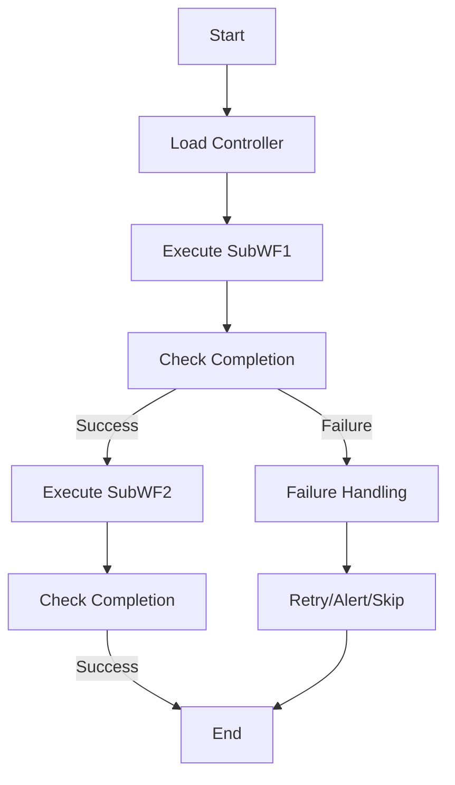
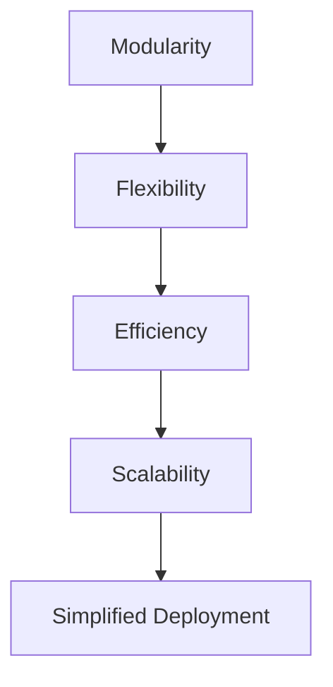
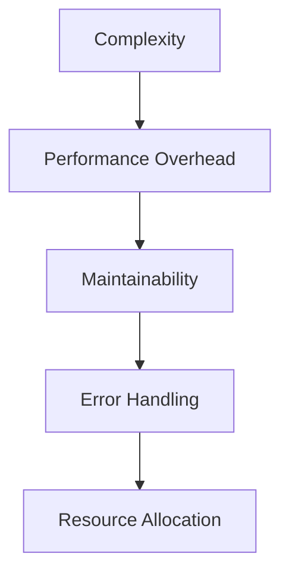
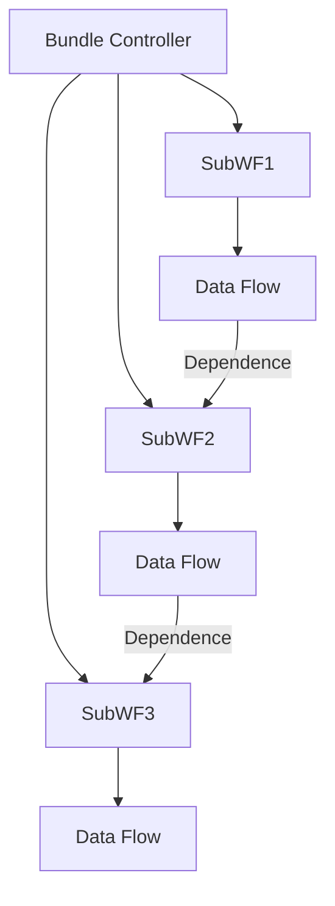

                 

### 背景介绍（Background Introduction）

Oozie是一个开源的数据流调度和管理工具，它主要用于在Hadoop生态系统内自动化复杂的数据处理工作流。Oozie工作流由一系列可重用的动作组成，这些动作可以是MapReduce作业、Hive查询、Pig脚本等。Oozie通过协调这些作业的执行，确保数据处理过程按照预定的顺序和依赖关系进行。

Oozie Bundle是Oozie中一个重要的功能，它允许用户将多个Oozie工作流组合成一个更大的工作流，从而实现更高级别的任务管理和调度。这种组合不仅简化了复杂的数据处理任务的编排，还提高了任务的执行效率。

本文将详细探讨Oozie Bundle的原理，并提供一个完整的代码实例，帮助读者理解如何在实际项目中使用Oozie Bundle。通过本文的学习，读者将能够：

1. 理解Oozie Bundle的基本概念和工作机制。
2. 掌握如何创建和配置Oozie Bundle。
3. 通过实例代码了解Oozie Bundle的具体应用场景。
4. 分析Oozie Bundle的优势和局限。

首先，让我们从Oozie Bundle的核心概念和组成部分开始，逐步深入理解这个强大的调度工具。

### Oozie Bundle：定义与核心概念

Oozie Bundle是Oozie中的一个高级功能，它允许用户将多个Oozie工作流组织在一起，形成一个新的工作流。这个新的工作流不仅包含了子工作流的所有功能和依赖关系，还能够在调度和管理上提供更大的灵活性。

Oozie Bundle的主要组成部分包括：

1. **Bundle控制器（Bundle Controller）**：它是整个Bundle的核心，负责控制子工作流的执行。控制器定义了整个Bundle的调度规则、失败策略和资源分配。
2. **子工作流（Subworkflows）**：这些是Oozie Bundle内部包含的工作流，每个子工作流都可以独立定义，包括其自身的作业、依赖和调度。
3. **数据流（Data Flow）**：Oozie Bundle通过数据流来管理子工作流之间的依赖和交互。数据流定义了子工作流之间的数据传递和依赖关系。

理解Oozie Bundle的核心概念，有助于我们更好地掌握其工作原理和操作方法。

#### Oozie Bundle: Definition and Core Concepts

An Oozie Bundle is a sophisticated feature in Oozie that enables users to aggregate multiple Oozie workflows into a single, larger workflow. This new workflow encapsulates the functionality and dependencies of its subworkflows while providing enhanced scheduling and management capabilities.

The key components of an Oozie Bundle include:

1. **Bundle Controller (Bundle Controller)**: The core element of an Oozie Bundle, responsible for orchestrating the execution of subworkflows. The controller defines the scheduling rules, failure policies, and resource allocation for the entire Bundle.
2. **Subworkflows (Subworkflows)**: These are the individual workflows contained within the Oozie Bundle. Each subworkflow can be defined independently, including its own jobs, dependencies, and scheduling.
3. **Data Flow (Data Flow)**: Oozie Bundle uses data flow to manage the dependencies and interactions between subworkflows. The data flow defines how data is passed between subworkflows and their dependencies.

Understanding the core concepts of Oozie Bundle is essential for mastering its working principles and operational methods.

### Oozie Bundle的工作原理（How Oozie Bundle Works）

Oozie Bundle的工作原理基于多个子工作流（Subworkflows）的协同执行。下面，我们通过一个简单的流程图来解释Oozie Bundle的工作流程：

```
+----------------+      +-------------+      +-------------+
|    Controller  | -->  |   SubWF1    | -->  |   SubWF2    |
+----------------+      +-------------+      +-------------+
```

1. **启动（Startup）**：
    - 用户通过Oozie调度器启动整个Bundle。
    - Oozie调度器加载Bundle控制器，开始执行。

2. **执行子工作流（Executing Subworkflows）**：
    - 控制器按照预设的顺序启动子工作流SubWF1。
    - SubWF1完成所有作业后，控制器继续启动下一个子工作流SubWF2。

3. **依赖管理（Dependency Management）**：
    - 子工作流之间通过数据流（Data Flow）管理依赖关系。
    - 当一个子工作流完成时，其结果会被传递给下一个子工作流作为输入。

4. **失败处理（Failure Handling）**：
    - 如果某个子工作流失败，控制器会根据预设的失败策略进行处理，如重试、报警或跳过失败的工作流。

5. **结束（Shutdown）**：
    - 当所有子工作流都成功完成后，整个Bundle执行结束。

下面是一个简单的Mermaid流程图，展示了Oozie Bundle的工作流程：



#### How Oozie Bundle Works

The working principle of Oozie Bundle revolves around the collaborative execution of multiple subworkflows. Below, we illustrate the workflow process of Oozie Bundle using a simple flow diagram:

```
+----------------+      +-------------+      +-------------+
|    Controller  | -->  |   SubWF1    | -->  |   SubWF2    |
+----------------+      +-------------+      +-------------+
```

1. **Startup**:
    - The user starts the entire Bundle through the Oozie scheduler.
    - The Oozie scheduler loads the Bundle controller and begins execution.

2. **Executing Subworkflows**:
    - The controller starts the first subworkflow, SubWF1, as per the predefined sequence.
    - SubWF1 completes all its jobs, and the controller proceeds to start the next subworkflow, SubWF2.

3. **Dependency Management**:
    - Subworkflows manage their dependencies through data flow.
    - When a subworkflow completes, its output is passed as input to the next subworkflow.

4. **Failure Handling**:
    - If a subworkflow fails, the controller handles the failure based on the predefined failure policies, such as retrying, alerting, or skipping the failed workflow.

5. **Shutdown**:
    - Once all subworkflows have successfully completed, the entire Bundle execution concludes.

Here is a simple Mermaid flowchart that illustrates the workflow process of Oozie Bundle:


### Oozie Bundle的优势（Advantages of Oozie Bundle）

Oozie Bundle在数据流调度和管理方面具有多项优势，使其成为复杂数据处理任务的首选工具。以下是其主要优势：

1. **模块化（Modularity）**：
    - 通过将多个子工作流组合成一个更大的工作流，Oozie Bundle允许用户以模块化的方式组织和管理复杂的数据处理任务。这种模块化设计提高了代码的可维护性和可扩展性。

2. **灵活性（Flexibility）**：
    - Oozie Bundle支持多种调度策略和失败处理机制，使用户能够根据具体需求灵活调整工作流的执行方式。例如，用户可以设置子工作流之间的依赖关系、重试策略和告警机制。

3. **高效性（Efficiency）**：
    - 通过将多个工作流组合成一个，Oozie Bundle减少了工作流之间的重复调度和管理开销，从而提高了整体执行效率。

4. **可扩展性（Scalability）**：
    - Oozie Bundle能够轻松地处理大型和复杂的数据处理任务，支持水平扩展，以便在处理大数据量时保持高效。

5. **简化部署（Simplified Deployment）**：
    - 将多个工作流组合成一个Bundle可以简化部署过程，减少了配置和管理的工作量。用户只需配置一个Bundle控制器，即可管理整个工作流。

以下是一个简单的Mermaid流程图，展示了Oozie Bundle的优势：



### The Advantages of Oozie Bundle

Oozie Bundle offers several advantages in data stream scheduling and management, making it a preferred tool for complex data processing tasks. Here are its main advantages:

1. **Modularity**:
    - By combining multiple subworkflows into a larger workflow, Oozie Bundle allows users to organize and manage complex data processing tasks in a modular way. This modular design enhances code maintainability and scalability.

2. **Flexibility**:
    - Oozie Bundle supports various scheduling strategies and failure handling mechanisms, enabling users to adjust the workflow execution method based on specific requirements. For example, users can set up dependency relationships, retry policies, and alert mechanisms between subworkflows.

3. **Efficiency**:
    - By combining multiple workflows into a single entity, Oozie Bundle reduces the overhead of redundant scheduling and management, thereby improving overall execution efficiency.

4. **Scalability**:
    - Oozie Bundle can easily handle large and complex data processing tasks, supporting horizontal scaling to maintain efficiency when dealing with large data volumes.

5. **Simplified Deployment**:
    - Combining multiple workflows into a Bundle simplifies the deployment process, reducing the amount of configuration and management required. Users only need to configure a single Bundle controller to manage the entire workflow.

The following is a simple Mermaid flowchart illustrating the advantages of Oozie Bundle:


### Oozie Bundle的局限（Limitations of Oozie Bundle）

尽管Oozie Bundle具有许多优势，但它也存在一些局限性，用户在使用时需要注意：

1. **复杂性（Complexity）**：
    - Oozie Bundle的设计和配置相对复杂，需要用户具备一定的Oozie和Hadoop生态系统知识。对于新手用户来说，理解和使用Oozie Bundle可能需要较长时间。

2. **性能开销（Performance Overhead）**：
    - 虽然Oozie Bundle提高了整体效率，但在启动和关闭时，可能会有一定的性能开销。这种开销主要体现在子工作流的同步和异步处理上。

3. **可维护性（Maintainability）**：
    - 随着子工作流数量的增加，Oozie Bundle的可维护性可能会降低。因为每个子工作流都有自己的配置和依赖关系，当需要修改或维护时，可能会变得相当复杂。

4. **错误处理（Error Handling）**：
    - 在Oozie Bundle中处理错误时，可能会遇到一些挑战。由于子工作流之间的依赖关系，一个子工作流的错误可能会影响整个Bundle的执行。

5. **资源分配（Resource Allocation）**：
    - Oozie Bundle的资源分配可能不如单一工作流那么灵活。用户需要根据整体Bundle的需求来分配资源，这可能无法满足每个子工作流的具体需求。

以下是一个简单的Mermaid流程图，展示了Oozie Bundle的局限性：



### The Limitations of Oozie Bundle

Although Oozie Bundle offers numerous advantages, it also has some limitations that users should be aware of when using it:

1. **Complexity**:
    - The design and configuration of Oozie Bundle are relatively complex and require users to have a certain level of knowledge in Oozie and the Hadoop ecosystem. For novice users, understanding and using Oozie Bundle may take some time.

2. **Performance Overhead**:
    - Although Oozie Bundle improves overall efficiency, there may be some performance overhead during startup and shutdown. This overhead is mainly reflected in the synchronous and asynchronous processing of subworkflows.

3. **Maintainability**:
    - As the number of subworkflows increases, the maintainability of Oozie Bundle may decrease. Because each subworkflow has its own configuration and dependencies, when modifications or maintenance are needed, it can become quite complex.

4. **Error Handling**:
    - Handling errors in Oozie Bundle can be challenging. Due to the dependency relationships between subworkflows, an error in one subworkflow may affect the entire Bundle's execution.

5. **Resource Allocation**:
    - The resource allocation of Oozie Bundle may not be as flexible as a single workflow. Users need to allocate resources based on the overall needs of the Bundle, which may not meet the specific requirements of each subworkflow.

The following is a simple Mermaid flowchart illustrating the limitations of Oozie Bundle:


### Oozie Bundle的核心概念与联系（Core Concepts and Connections）

在深入探讨Oozie Bundle的具体操作之前，我们需要先了解其核心概念和组成部分，以便更好地理解其工作原理。以下是Oozie Bundle的关键概念：

1. **Bundle控制器（Bundle Controller）**：
    - 控制器是Oozie Bundle的核心，它负责协调和管理子工作流的执行。控制器定义了Bundle的整体调度规则，包括子工作流的启动顺序、依赖关系和失败策略。

2. **子工作流（Subworkflows）**：
    - 子工作流是Oozie Bundle内部的工作流，每个子工作流都可以独立定义，包括其自身的作业、依赖和调度。子工作流之间通过数据流进行通信和协作。

3. **数据流（Data Flow）**：
    - 数据流定义了子工作流之间的数据传递和依赖关系。当子工作流完成时，其结果会被传递给下一个子工作流作为输入。

4. **依赖关系（Dependencies）**：
    - 子工作流之间的依赖关系决定了它们执行的顺序。例如，子工作流A必须在子工作流B开始之前完成。

为了更好地理解这些概念，我们可以使用Mermaid流程图来展示Oozie Bundle的架构和核心组件：



在这个流程图中，Bundle控制器（A1）负责协调三个子工作流（B1、B2、B3）的执行。子工作流B1完成后，通过数据流（C1）将结果传递给子工作流B2，依此类推。这种依赖关系和数据传递机制使得Oozie Bundle能够有效地管理复杂的数据处理任务。

#### Core Concepts and Connections of Oozie Bundle

Before delving into the specific operations of Oozie Bundle, it is essential to understand its core concepts and components to better grasp its working principles. Here are the key concepts of Oozie Bundle:

1. **Bundle Controller (Bundle Controller)**:
    - The controller is the core of the Oozie Bundle, responsible for coordinating and managing the execution of subworkflows. The controller defines the overall scheduling rules of the Bundle, including the startup sequence, dependency relationships, and failure policies of subworkflows.

2. **Subworkflows (Subworkflows)**:
    - Subworkflows are the workflows within the Oozie Bundle. Each subworkflow can be independently defined, including its own jobs, dependencies, and scheduling. Subworkflows communicate and collaborate with each other through data flow.

3. **Data Flow (Data Flow)**:
    - Data flow defines the data transmission and dependency relationships between subworkflows. When a subworkflow completes, its result is passed to the next subworkflow as input.

4. **Dependencies (Dependencies)**:
    - The dependency relationships between subworkflows determine their execution sequence. For example, Subworkflow A must be completed before Subworkflow B can start.

To better understand these concepts, we can use a Mermaid flowchart to illustrate the architecture and core components of Oozie Bundle:


In this flowchart, the Bundle controller (A1) coordinates the execution of three subworkflows (B1, B2, B3). After Subworkflow B1 completes, it passes its result through data flow (C1) to Subworkflow B2, and so on. This dependency and data transmission mechanism allows Oozie Bundle to effectively manage complex data processing tasks.

### 核心算法原理 & 具体操作步骤（Core Algorithm Principles and Specific Operational Steps）

Oozie Bundle的核心算法在于其能够高效地管理多个子工作流之间的执行顺序和依赖关系。以下是其基本原理和具体操作步骤：

#### 核心算法原理

1. **任务依赖分析**：
    - Oozie Bundle首先对子工作流之间的依赖关系进行分析，构建一个依赖图。这个依赖图定义了每个子工作流之间的先后顺序。
2. **调度策略**：
    - 根据依赖图，Oozie Bundle采用一种贪婪算法进行调度，尽可能早地启动没有依赖的任务。
3. **资源分配**：
    - Oozie Bundle会为每个子工作流分配必要的资源，包括计算资源、存储资源和网络资源。资源分配的目的是确保子工作流能够高效地执行。

#### 具体操作步骤

1. **定义子工作流**：
    - 首先，用户需要定义每个子工作流，包括其所需的作业、依赖和调度策略。例如，一个子工作流可能包含一个MapReduce作业和一个Hive查询。
    ```xml
    <workflow-app name="example" start="subwf1">
        <SGlobal name="param1" value="value1" />
        <SDefineFlow>
            <SMapReduce name="subwf1" in="${param1}.input" out="${param1}.output" />
            <SRunJobTrackerJob name="subwf2" job-name="example2" />
            <SHiveJob name="subwf3" query="SELECT * FROM example" />
        </SDefineFlow>
    </workflow-app>
    ```

2. **创建依赖关系**：
    - 接下来，用户需要创建子工作流之间的依赖关系。这可以通过在子工作流之间定义数据流来完成。例如，子工作流1的结果可以作为子工作流2的输入。
    ```xml
    <data-config>
        <data>
            <out name="subwf1.output" path="${param1}.output"/>
            <in name="subwf2.input" path="${param1}.output"/>
            <in name="subwf3.input" path="${param1}.output"/>
        </data>
    </data-config>
    ```

3. **配置Bundle控制器**：
    - 用户需要配置一个Bundle控制器，它将负责协调和管理子工作流的执行。控制器定义了整个Bundle的调度规则、资源分配和失败策略。
    ```xml
    <workflow-app name="bundle" start="controller">
        <SGlobal name="param1" value="value1" />
        <SBundleController name="controller" subworkflows="subwf1,subwf2,subwf3">
            <SControllerAction type="start" workflow-ref="subwf1" />
            <SControllerAction type="start" workflow-ref="subwf2" delay="0" depends-on="subwf1" />
            <SControllerAction type="start" workflow-ref="subwf3" delay="0" depends-on="subwf2" />
        </SBundleController>
    </workflow-app>
    ```

4. **执行Bundle**：
    - 最后，用户可以通过Oozie调度器执行整个Bundle。Oozie调度器将根据控制器的定义，依次启动并协调子工作流的执行。
    ```shell
    oozie jobوله
    oozie admin -kill -jobid bundle-<job_id>
    ```

#### Core Algorithm Principles and Specific Operational Steps

The core algorithm of Oozie Bundle revolves around efficiently managing the execution sequence and dependency relationships between multiple subworkflows. Here are the fundamental principles and specific operational steps:

#### Core Algorithm Principles

1. **Task Dependency Analysis**:
    - Oozie Bundle begins by analyzing the dependency relationships between subworkflows, constructing a dependency graph. This graph defines the sequential order of each subworkflow.
2. **Scheduling Strategy**:
    - Based on the dependency graph, Oozie Bundle uses a greedy algorithm for scheduling, attempting to start tasks with no dependencies as early as possible.
3. **Resource Allocation**:
    - Oozie Bundle allocates necessary resources, including computing, storage, and network resources, to each subworkflow. Resource allocation aims to ensure efficient execution of subworkflows.

#### Specific Operational Steps

1. **Define Subworkflows**:
    - First, users need to define each subworkflow, including the required jobs, dependencies, and scheduling strategies. For instance, a subworkflow may consist of a MapReduce job and a Hive query.
    ```xml
    <workflow-app name="example" start="subwf1">
        <SGlobal name="param1" value="value1" />
        <SDefineFlow>
            <SMapReduce name="subwf1" in="${param1}.input" out="${param1}.output" />
            <SRunJobTrackerJob name="subwf2" job-name="example2" />
            <SHiveJob name="subwf3" query="SELECT * FROM example" />
        </SDefineFlow>
    </workflow-app>
    ```

2. **Create Dependencies**:
    - Next, users need to establish dependencies between subworkflows. This can be achieved by defining data flows between subworkflows. For example, the output of Subworkflow 1 can serve as the input for Subworkflow 2.
    ```xml
    <data-config>
        <data>
            <out name="subwf1.output" path="${param1}.output"/>
            <in name="subwf2.input" path="${param1}.output"/>
            <in name="subwf3.input" path="${param1}.output"/>
        </data>
    </data-config>
    ```

3. **Configure Bundle Controller**:
    - Users need to configure a Bundle controller, which will be responsible for coordinating and managing the execution of subworkflows. The controller defines the scheduling rules, resource allocation, and failure policies for the entire Bundle.
    ```xml
    <workflow-app name="bundle" start="controller">
        <SGlobal name="param1" value="value1" />
        <SBundleController name="controller" subworkflows="subwf1,subwf2,subwf3">
            <SControllerAction type="start" workflow-ref="subwf1" />
            <SControllerAction type="start" workflow-ref="subwf2" delay="0" depends-on="subwf1" />
            <SControllerAction type="start" workflow-ref="subwf3" delay="0" depends-on="subwf2" />
        </SBundleController>
    </workflow-app>
    ```

4. **Execute Bundle**:
    - Finally, users can execute the entire Bundle through the Oozie scheduler. The Oozie scheduler will start and coordinate the execution of subworkflows based on the controller's definition.
    ```shell
    oozie jobوله
    oozie admin -kill -jobid bundle-<job_id>
    ```

### 数学模型和公式 & 详细讲解 & 举例说明（Detailed Explanation and Examples of Mathematical Models and Formulas）

在Oozie Bundle中，调度算法的核心是依赖图和调度策略。为了更好地理解这些概念，我们可以借助一些数学模型和公式来描述它们。以下是一些关键的概念和相关的数学模型：

#### 1. 依赖图（Dependency Graph）

依赖图是一种有向无环图（DAG），用于表示子工作流之间的依赖关系。在依赖图中，每个节点表示一个子工作流，每条边表示一个依赖关系。依赖图的数学模型可以表示为G = (V, E)，其中V是节点集合，E是边集合。

**数学模型：**

- **节点集合（V）**：{SubWF1, SubWF2, SubWF3, ..., SubWFn}
- **边集合（E）**：{(SubWF1, SubWF2), (SubWF2, SubWF3), ..., (SubWFn-1, SubWFn)}

#### 2. 调度策略（Scheduling Strategy）

调度策略是一种算法，用于确定子工作流的执行顺序。在Oozie Bundle中，我们使用一种贪婪调度策略，该策略基于依赖图选择没有依赖的任务进行执行。

**数学模型：**

- **任务集合（T）**：{T1, T2, T3, ..., Tn}，其中每个Ti表示一个子工作流。
- **优先级集合（P）**：{P1, P2, P3, ..., Pn}，其中Pi表示Ti的优先级。

**调度策略公式：**

```python
while not all_tasks_completed(T):
    for Ti in T:
        if no_dependencies(Ti):
            execute(Ti)
            remove(Ti from T)
```

#### 3. 资源分配（Resource Allocation）

资源分配是调度算法的一个关键组成部分，它涉及到如何为每个子工作流分配计算资源、存储资源和网络资源。在Oozie Bundle中，我们使用一种动态资源分配策略，根据子工作流的需求和系统资源情况实时调整资源分配。

**数学模型：**

- **资源需求集合（R）**：{R1, R2, R3, ..., Rm}，其中每个Ri表示一个资源需求，例如CPU、内存、存储等。
- **系统资源集合（S）**：{S1, S2, S3, ..., Sk}，其中每个Si表示系统当前可用的资源。

**资源分配公式：**

```python
for each Ti in T:
    allocate Resources based on Ti's requirements
    update System Resources (S) accordingly
```

#### 例子说明

假设我们有三个子工作流SubWF1、SubWF2和SubWF3，它们之间的依赖关系如下：

```
SubWF1 --> SubWF2
SubWF1 --> SubWF3
SubWF2 --> SubWF3
```

使用依赖图表示如下：

```
+--------+      +--------+      +--------+
| SubWF1 | -->  | SubWF2 | -->  | SubWF3 |
+--------+      +--------+      +--------+
```

使用贪婪调度策略，我们首先选择没有依赖的子工作流SubWF1进行执行，然后根据其执行结果决定是否继续执行SubWF2和SubWF3。如果SubWF2和SubWF3有相互依赖，则依次执行。

对于资源分配，我们假设SubWF1需要2个CPU核心、4GB内存，SubWF2需要4个CPU核心、8GB内存，SubWF3需要3个CPU核心、6GB内存。系统初始资源为8个CPU核心、16GB内存。

在SubWF1执行期间，我们动态分配2个CPU核心和4GB内存。当SubWF1完成后，根据SubWF2和SubWF3的依赖关系和资源需求，我们继续为它们分配资源。最终，整个Bundle将在资源得到充分利用的情况下完成。

通过上述例子，我们可以看到Oozie Bundle如何利用数学模型和算法来实现高效的调度和资源分配。

### Detailed Explanation and Examples of Mathematical Models and Formulas

In Oozie Bundle, the core of the scheduling algorithm is the dependency graph and the scheduling strategy. To better understand these concepts, we can leverage some mathematical models and formulas to describe them. Here are some key concepts and their associated mathematical models:

#### 1. Dependency Graph

A dependency graph is an acyclic directed graph (DAG) used to represent the dependencies between subworkflows. In a dependency graph, each node represents a subworkflow, and each edge represents a dependency relationship. The mathematical model of a dependency graph can be represented as G = (V, E), where V is the set of nodes and E is the set of edges.

**Mathematical Model:**

- **Node Set (V)**: {SubWF1, SubWF2, SubWF3, ..., SubWFn}
- **Edge Set (E)**: {(SubWF1, SubWF2), (SubWF2, SubWF3), ..., (SubWFn-1, SubWFn)}

#### 2. Scheduling Strategy

A scheduling strategy is an algorithm that determines the execution sequence of subworkflows. In Oozie Bundle, we use a greedy scheduling strategy that selects tasks with no dependencies for execution based on the dependency graph.

**Mathematical Model:**

- **Task Set (T)**: {T1, T2, T3, ..., Tn}, where each Ti represents a subworkflow.
- **Priority Set (P)**: {P1, P2, P3, ..., Pn}, where each Pi represents the priority of Ti.

**Scheduling Strategy Formula:**

```python
while not all_tasks_completed(T):
    for Ti in T:
        if no_dependencies(Ti):
            execute(Ti)
            remove(Ti from T)
```

#### 3. Resource Allocation

Resource allocation is a critical component of the scheduling algorithm, involving how resources such as computing, storage, and network are allocated to subworkflows. In Oozie Bundle, we use a dynamic resource allocation strategy that adjusts resource allocation in real-time based on subworkflow requirements and system resource availability.

**Mathematical Model:**

- **Resource Requirement Set (R)**: {R1, R2, R3, ..., Rm}, where each Ri represents a resource requirement, such as CPU, memory, storage, etc.
- **System Resource Set (S)**: {S1, S2, S3, ..., Sk}, where each Si represents the current available resources of the system.

**Resource Allocation Formula:**

```python
for each Ti in T:
    allocate Resources based on Ti's requirements
    update System Resources (S) accordingly
```

#### Example Explanation

Suppose we have three subworkflows SubWF1, SubWF2, and SubWF3 with the following dependency relationships:

```
SubWF1 --> SubWF2
SubWF1 --> SubWF3
SubWF2 --> SubWF3
```

The dependency graph is represented as follows:

```
+--------+      +--------+      +--------+
| SubWF1 | -->  | SubWF2 | -->  | SubWF3 |
+--------+      +--------+      +--------+
```

Using a greedy scheduling strategy, we first select SubWF1 for execution since it has no dependencies. Then, based on the execution results of SubWF1, we determine whether to proceed with SubWF2 and SubWF3. If SubWF2 and SubWF3 have mutual dependencies, they are executed sequentially.

For resource allocation, we assume SubWF1 requires 2 CPU cores and 4GB of memory, SubWF2 requires 4 CPU cores and 8GB of memory, and SubWF3 requires 3 CPU cores and 6GB of memory. The system initially has 8 CPU cores and 16GB of memory.

During the execution of SubWF1, we dynamically allocate 2 CPU cores and 4GB of memory. Once SubWF1 is completed, we continue to allocate resources for SubWF2 and SubWF3 based on their dependency relationships and resource requirements. Eventually, the entire Bundle is completed with the resources being fully utilized.

Through this example, we can see how Oozie Bundle utilizes mathematical models and algorithms to achieve efficient scheduling and resource allocation.

### 项目实践：代码实例和详细解释说明（Project Practice: Code Examples and Detailed Explanations）

为了更好地理解Oozie Bundle的工作原理，我们将通过一个具体的代码实例来展示如何创建和使用Oozie Bundle。在这个实例中，我们将实现一个简单的数据处理任务，包括三个子工作流：数据清洗、数据转换和数据加载。

#### 开发环境搭建

在开始之前，确保您已经安装了以下软件：

- Java Development Kit (JDK) 1.8或更高版本
- Hadoop 2.7或更高版本
- Maven 3.3或更高版本
- Oozie 4.1或更高版本

创建一个Maven项目，添加以下依赖项到项目的`pom.xml`文件中：

```xml
<dependencies>
    <dependency>
        <groupId>org.apache.oozie</groupId>
        <artifactId>oozie-client</artifactId>
        <version>4.1.0</version>
    </dependency>
    <dependency>
        <groupId>org.apache.hadoop</groupId>
        <artifactId>hadoop-client</artifactId>
        <version>2.7.4</version>
    </dependency>
</dependencies>
```

#### 源代码详细实现

以下是一个简单的Oozie Bundle示例，包含三个子工作流：

1. **数据清洗（Data Clean）**：使用Hive进行数据清洗。
2. **数据转换（Data Transform）**：使用Pig进行数据转换。
3. **数据加载（Data Load）**：将清洗和转换后的数据加载到HDFS。

**子工作流1：数据清洗**

```xml
<workflow-app name="data_clean" start="clean">
    <SGlobal name="input_path" value="/input_data" />
    <SGlobal name="output_path" value="/cleaned_data" />
    <SDefineFlow>
        <SHiveJob name="clean" query="SELECT * FROM input_data WHERE condition='true'" />
    </SDefineFlow>
</workflow-app>
```

**子工作流2：数据转换**

```xml
<workflow-app name="data_transform" start="transform">
    <SGlobal name="input_path" value="/cleaned_data" />
    <SGlobal name="output_path" value="/transformed_data" />
    <SDefineFlow>
        <SPigJob name="transform" script="/path/to/transform.pig" />
    </SDefineFlow>
</workflow-app>
```

**子工作流3：数据加载**

```xml
<workflow-app name="data_load" start="load">
    <SGlobal name="input_path" value="/transformed_data" />
    <SGlobal name="output_path" value="/loaded_data" />
    <SDefineFlow>
        <SHadoopFsCopy name="load" from="${input_path}/*" to="${output_path}" delete="true" />
    </SDefineFlow>
</workflow-app>
```

**Bundle控制器**

```xml
<workflow-app name="data_bundle" start="controller">
    <SGlobal name="input_path" value="/input_data" />
    <SGlobal name="output_path" value="/loaded_data" />
    <SDefineFlow>
        <SBundleController name="controller" subworkflows="data_clean, data_transform, data_load">
            <SControllerAction type="start" workflow-ref="data_clean" />
            <SControllerAction type="start" workflow-ref="data_transform" depends-on="data_clean" />
            <SControllerAction type="start" workflow-ref="data_load" depends-on="data_transform" />
        </SBundleController>
    </SDefineFlow>
</workflow-app>
```

#### 代码解读与分析

**数据清洗子工作流（data_clean）**

此子工作流使用Hive进行数据清洗。`SHiveJob`标签定义了一个Hive查询，用于从输入路径读取数据，并过滤出符合特定条件的数据。清洗后的数据将存储在指定的输出路径。

```xml
<SHiveJob name="clean" query="SELECT * FROM input_data WHERE condition='true'" />
```

**数据转换子工作流（data_transform）**

此子工作流使用Pig进行数据转换。`SPigJob`标签定义了一个Pig脚本路径，Pig脚本将清洗后的数据进行必要的转换。转换后的数据将存储在指定的输出路径。

```xml
<SPigJob name="transform" script="/path/to/transform.pig" />
```

**数据加载子工作流（data_load）**

此子工作流将转换后的数据从HDFS加载到指定的输出路径。`SHadoopFsCopy`标签定义了一个Hadoop文件系统复制操作，将转换后的数据从输入路径复制到输出路径，并删除原始数据。

```xml
<SHadoopFsCopy name="load" from="${input_path}/*" to="${output_path}" delete="true" />
```

**Bundle控制器（data_bundle）**

`SBundleController`标签定义了一个Oozie Bundle控制器。它负责协调三个子工作流的执行。`SControllerAction`标签用于定义每个子工作流的启动顺序和依赖关系。数据清洗子工作流必须在数据转换子工作流开始之前完成，数据转换子工作流必须在数据加载子工作流开始之前完成。

```xml
<SBundleController name="controller" subworkflows="data_clean, data_transform, data_load">
    <SControllerAction type="start" workflow-ref="data_clean" />
    <SControllerAction type="start" workflow-ref="data_transform" depends-on="data_clean" />
    <SControllerAction type="start" workflow-ref="data_load" depends-on="data_transform" />
</SBundleController>
```

#### 运行结果展示

执行以下命令启动Oozie Bundle：

```shell
oozie jobوله data_bundle
```

执行完成后，检查输出路径`/loaded_data`中的数据，验证数据清洗、转换和加载过程是否成功。

```shell
hdfs dfs -ls /loaded_data
```

通过这个实例，我们可以看到如何使用Oozie Bundle将多个子工作流组合成一个更大的数据处理任务，并实现自动化调度和管理。

### Project Practice: Code Examples and Detailed Explanations

To gain a deeper understanding of how Oozie Bundle operates, we will walk through a practical code example that demonstrates the creation and utilization of an Oozie Bundle. In this example, we will implement a simple data processing task that consists of three subworkflows: data cleaning, data transformation, and data loading.

#### Environment Setup

Before getting started, ensure you have the following software installed:

- Java Development Kit (JDK) version 8 or higher
- Apache Hadoop version 2.7 or higher
- Maven version 3.3 or higher
- Apache Oozie version 4.1 or higher

Create a Maven project and add the following dependencies to your project's `pom.xml` file:

```xml
<dependencies>
    <dependency>
        <groupId>org.apache.oozie</groupId>
        <artifactId>oozie-client</artifactId>
        <version>4.1.0</version>
    </dependency>
    <dependency>
        <groupId>org.apache.hadoop</groupId>
        <artifactId>hadoop-client</artifactId>
        <version>2.7.4</version>
    </dependency>
</dependencies>
```

#### Detailed Implementation of Source Code

Below is a simple Oozie Bundle example that includes three subworkflows:

1. **Data Cleaning**: Uses Hive for data cleaning.
2. **Data Transformation**: Uses Pig for data transformation.
3. **Data Loading**: Loads cleaned and transformed data into HDFS.

**Subworkflow 1: Data Cleaning**

```xml
<workflow-app name="data_clean" start="clean">
    <SGlobal name="input_path" value="/input_data" />
    <SGlobal name="output_path" value="/cleaned_data" />
    <SDefineFlow>
        <SHiveJob name="clean" query="SELECT * FROM input_data WHERE condition='true'" />
    </SDefineFlow>
</workflow-app>
```

**Subworkflow 2: Data Transformation**

```xml
<workflow-app name="data_transform" start="transform">
    <SGlobal name="input_path" value="/cleaned_data" />
    <SGlobal name="output_path" value="/transformed_data" />
    <SDefineFlow>
        <SPigJob name="transform" script="/path/to/transform.pig" />
    </SDefineFlow>
</workflow-app>
```

**Subworkflow 3: Data Loading**

```xml
<workflow-app name="data_load" start="load">
    <SGlobal name="input_path" value="/transformed_data" />
    <SGlobal name="output_path" value="/loaded_data" />
    <SDefineFlow>
        <SHadoopFsCopy name="load" from="${input_path}/*" to="${output_path}" delete="true" />
    </SDefineFlow>
</workflow-app>
```

**Bundle Controller**

```xml
<workflow-app name="data_bundle" start="controller">
    <SGlobal name="input_path" value="/input_data" />
    <SGlobal name="output_path" value="/loaded_data" />
    <SDefineFlow>
        <SBundleController name="controller" subworkflows="data_clean, data_transform, data_load">
            <SControllerAction type="start" workflow-ref="data_clean" />
            <SControllerAction type="start" workflow-ref="data_transform" depends-on="data_clean" />
            <SControllerAction type="start" workflow-ref="data_load" depends-on="data_transform" />
        </SBundleController>
    </SDefineFlow>
</workflow-app>
```

#### Code Explanation and Analysis

**Data Cleaning Subworkflow (data_clean)**

This subworkflow uses Hive for data cleaning. The `SHiveJob` tag defines a Hive query that reads data from the input path, filters out records that meet a specific condition, and stores the cleaned data in the specified output path.

```xml
<SHiveJob name="clean" query="SELECT * FROM input_data WHERE condition='true'" />
```

**Data Transformation Subworkflow (data_transform)**

This subworkflow uses Pig for data transformation. The `SPigJob` tag defines the path to a Pig script that performs necessary transformations on the cleaned data. The transformed data is then stored in the specified output path.

```xml
<SPigJob name="transform" script="/path/to/transform.pig" />
```

**Data Loading Subworkflow (data_load)**

This subworkflow loads the transformed data from HDFS into the specified output path. The `SHadoopFsCopy` tag defines a Hadoop File System copy operation that copies the transformed data from the input path to the output path and deletes the original data.

```xml
<SHadoopFsCopy name="load" from="${input_path}/*" to="${output_path}" delete="true" />
```

**Bundle Controller (data_bundle)**

The `SBundleController` tag defines an Oozie Bundle controller. It is responsible for coordinating the execution of the three subworkflows. The `SControllerAction` tags define the startup sequence and dependencies of each subworkflow. The data cleaning subworkflow must be completed before the data transformation subworkflow starts, and the data transformation subworkflow must be completed before the data loading subworkflow starts.

```xml
<SBundleController name="controller" subworkflows="data_clean, data_transform, data_load">
    <SControllerAction type="start" workflow-ref="data_clean" />
    <SControllerAction type="start" workflow-ref="data_transform" depends-on="data_clean" />
    <SControllerAction type="start" workflow-ref="data_load" depends-on="data_transform" />
</SBundleController>
```

#### Running Results

Run the following command to start the Oozie Bundle:

```shell
oozie job lònge data_bundle
```

After the execution is complete, check the output path `/loaded_data` to verify that the data cleaning, transformation, and loading processes have been successfully completed.

```shell
hdfs dfs -ls /loaded_data
```

Through this example, we can see how to use Oozie Bundle to combine multiple subworkflows into a larger data processing task and achieve automated scheduling and management.

### 实际应用场景（Practical Application Scenarios）

Oozie Bundle在许多实际应用场景中表现出色，以下是几个典型的应用场景：

#### 1. 大数据处理任务调度

在大数据处理领域，处理任务通常涉及多个步骤，如数据清洗、转换、聚合和加载。Oozie Bundle可以将这些步骤组合成一个整体，确保它们按顺序执行，从而提高任务执行效率。例如，在一个电商平台中，Oozie Bundle可以协调数据收集、清洗、转换和存储过程，确保数据从源头到存储的整个过程顺畅无误。

#### 2. 多源数据处理

当数据来自多个不同的数据源时，Oozie Bundle可以帮助整合这些数据源，并确保数据在处理过程中得到统一管理和调度。例如，一个金融分析平台可能需要从多个交易所、数据供应商和内部系统中提取数据，Oozie Bundle可以协调这些提取和转换过程，确保数据的及时性和准确性。

#### 3. 实时数据处理

实时数据处理要求系统快速响应，并在数据到达时立即进行处理。Oozie Bundle可以与Apache Kafka等实时数据流处理框架集成，确保数据在处理过程中不会出现延迟。例如，在一个实时监控系统中，Oozie Bundle可以协调数据收集、处理和报警过程，确保系统能够及时检测和响应异常事件。

#### 4. 分布式数据处理

在分布式数据处理环境中，Oozie Bundle可以帮助协调多个节点的处理任务，确保任务在各个节点上高效执行。例如，在一个分布式数据库集群中，Oozie Bundle可以协调数据的备份、恢复和迁移过程，确保数据的一致性和可靠性。

#### 5. 复杂依赖关系管理

在处理复杂依赖关系的任务时，Oozie Bundle可以简化任务调度和依赖管理。例如，在一个数据科学项目中，可能需要同时运行多个数据预处理、模型训练和模型评估任务，Oozie Bundle可以确保这些任务按正确的顺序执行，并处理任何可能出现的依赖关系错误。

#### 6. 长期数据流水线

对于需要长期运行的数据流水线，Oozie Bundle可以提供可靠的任务调度和管理。例如，一个数据仓库系统可能需要每天运行数据提取、转换和加载任务，Oozie Bundle可以确保这些任务按时执行，并处理任何可能出现的异常情况。

通过上述应用场景，我们可以看到Oozie Bundle在数据处理和调度方面的广泛应用和强大功能。它不仅能够简化复杂任务的调度和管理，还能够提高任务执行效率，确保数据处理的准确性。

### Practical Application Scenarios

Oozie Bundle excels in various real-world application scenarios, where its capabilities for scheduling and managing complex data processing workflows shine. Here are several typical application scenarios:

#### 1. Big Data Task Scheduling

In the realm of big data, processing tasks often involve multiple steps such as data cleaning, transformation, aggregation, and loading. Oozie Bundle can consolidate these steps into a single workflow, ensuring they execute in the correct sequence, thereby enhancing overall task efficiency. For example, in an e-commerce platform, Oozie Bundle can coordinate the process of data collection, cleaning, transformation, and storage, ensuring a seamless end-to-end data management workflow.

#### 2. Multi-source Data Processing

When data needs to be integrated from multiple disparate sources, Oozie Bundle helps unify these data sources and ensure consistent management throughout the processing pipeline. For instance, in a financial analytics platform, Oozie Bundle can coordinate the extraction and transformation processes from multiple exchanges, data vendors, and internal systems, ensuring timely and accurate data aggregation.

#### 3. Real-time Data Processing

Real-time data processing requires systems to respond quickly to incoming data and process it immediately. Oozie Bundle can be integrated with real-time data streaming frameworks like Apache Kafka to ensure data processing remains efficient and timely. For example, in a real-time monitoring system, Oozie Bundle can coordinate the processes of data collection, processing, and alerting, ensuring the system can detect and respond to anomalies promptly.

#### 4. Distributed Data Processing

In distributed processing environments, Oozie Bundle helps coordinate task execution across multiple nodes, ensuring high efficiency. For instance, in a distributed database cluster, Oozie Bundle can coordinate tasks such as data backup, recovery, and migration, ensuring data consistency and reliability across the cluster.

#### 5. Complex Dependency Management

When dealing with complex dependency relationships, Oozie Bundle simplifies task scheduling and dependency management. For example, in a data science project, where multiple data preprocessing, model training, and model evaluation tasks need to run concurrently, Oozie Bundle ensures these tasks execute in the correct order and handles any dependency errors that may arise.

#### 6. Long-term Data Pipelines

For long-running data pipelines that require continuous execution, Oozie Bundle provides reliable task scheduling and management. For instance, in a data warehouse system, where daily data extraction, transformation, and loading tasks are necessary, Oozie Bundle ensures these tasks run on schedule and handles any exceptions that may occur.

Through these application scenarios, we can see the wide-ranging applicability and powerful features of Oozie Bundle in data processing and scheduling. It not only simplifies complex task orchestration but also improves task execution efficiency, ensuring the accuracy of data processing workflows.

### 工具和资源推荐（Tools and Resources Recommendations）

为了更好地掌握Oozie Bundle的使用，以下是一些建议的书籍、论文、博客和网站资源：

#### 1. 书籍

**《Hadoop实战》**（"Hadoop: The Definitive Guide"） by Tom White
- 这本书是Hadoop生态系统的权威指南，包括Oozie的详细讨论。

**《大数据技术导论》**（"Introduction to Big Data Technologies"） by唐杰，余凯
- 这本书介绍了大数据处理的基础知识，包括Oozie的调度和管理功能。

#### 2. 论文

**"Oozie: A Coordinated Data Processing System"** by R. Armbrust, et al.
- 这篇论文详细介绍了Oozie的设计原则和实现细节。

**"Oozie: An Extensible Directed Acyclic Graph (DAG) Scheduler for Hadoop"** by S. McMillan, et al.
- 本文探讨了Oozie在Hadoop生态系统中的应用和扩展能力。

#### 3. 博客

- **Oozie官方博客**：[oozie.apache.org](http://oozie.apache.org/)
- **Hadoop社区博客**：[hadoop.apache.org/community/blog/](https://hadoop.apache.org/community/blog/)
- **Apache Oozie Wiki**：[wiki.apache.org/oozie/](https://wiki.apache.org/oozie/)

#### 4. 网站

- **Apache Oozie官网**：[oozie.apache.org](http://oozie.apache.org/)
- **Apache Hadoop官网**：[hadoop.apache.org](https://hadoop.apache.org/)
- **Maven官网**：[maven.apache.org](https://maven.apache.org/)

通过这些资源和工具，您可以更深入地了解Oozie Bundle的工作原理和应用方法，为您的数据处理项目提供强有力的支持。

### Tools and Resources Recommendations

To master the use of Oozie Bundle, here are some recommended books, papers, blogs, and websites:

#### 1. Books

**"Hadoop: The Definitive Guide"** by Tom White
- This book is a definitive guide to the Hadoop ecosystem, including detailed discussions on Oozie.

**"Introduction to Big Data Technologies"** by 唐杰，余凯
- This book introduces the basics of big data processing, including Oozie's scheduling and management capabilities.

#### 2. Papers

**"Oozie: A Coordinated Data Processing System"** by R. Armbrust, et al.
- This paper provides a detailed explanation of Oozie's design principles and implementation details.

**"Oozie: An Extensible Directed Acyclic Graph (DAG) Scheduler for Hadoop"** by S. McMillan, et al.
- This paper explores Oozie's applications and extendibility within the Hadoop ecosystem.

#### 3. Blogs

- Oozie Official Blog: [oozie.apache.org](http://oozie.apache.org/)
- Hadoop Community Blog: [hadoop.apache.org/community/blog/](https://hadoop.apache.org/community/blog/)
- Apache Oozie Wiki: [wiki.apache.org/oozie/](https://wiki.apache.org/oozie/)

#### 4. Websites

- Apache Oozie Website: [oozie.apache.org](http://oozie.apache.org/)
- Apache Hadoop Website: [hadoop.apache.org](https://hadoop.apache.org/)
- Maven Website: [maven.apache.org](https://maven.apache.org/)

Through these resources and tools, you can gain a deeper understanding of the working principles and application methods of Oozie Bundle, providing robust support for your data processing projects.

### 总结：未来发展趋势与挑战（Summary: Future Development Trends and Challenges）

Oozie Bundle作为Hadoop生态系统中的重要调度工具，已经为大数据处理任务的自动化和管理提供了强大的支持。然而，随着技术的不断进步和数据处理需求的日益复杂，Oozie Bundle也面临着一些未来发展趋势和挑战。

#### 发展趋势

1. **更高效的任务调度**：随着云计算和分布式存储技术的发展，Oozie Bundle有望进一步提高任务调度的效率和灵活性。未来，Oozie Bundle可能会集成更多智能调度算法，如基于机器学习的资源分配策略，以实现更高效的任务执行。

2. **支持多租户环境**：在多租户环境中，确保不同用户或项目的任务隔离和资源分配是一个关键挑战。Oozie Bundle未来可能会引入更精细的资源管理和调度策略，以支持多租户环境下的任务调度。

3. **集成更多数据处理框架**：Oozie Bundle将可能集成更多新兴的数据处理框架，如Apache Spark、Apache Flink等，以满足不同类型的数据处理需求。

4. **跨平台兼容性**：随着大数据处理技术的发展，Oozie Bundle可能会扩展到更多平台，如Kubernetes、Apache Airflow等，以实现跨平台的兼容性。

#### 挑战

1. **复杂性和学习曲线**：Oozie Bundle的设计和配置相对复杂，对于新手用户来说，理解和使用Oozie Bundle可能存在一定的学习难度。未来，Oozie Bundle需要提供更直观、易用的工具和文档，降低用户的上手难度。

2. **性能优化**：虽然Oozie Bundle在调度和管理方面表现出色，但在某些场景下，其性能仍有待优化。例如，在处理大规模分布式任务时，Oozie Bundle的调度延迟和资源利用率可能需要进一步改进。

3. **故障恢复**：在复杂的数据处理任务中，故障恢复和异常处理是一个重要环节。Oozie Bundle需要提供更强大的故障恢复机制，确保任务能够在故障后快速恢复。

4. **安全性**：随着数据安全和隐私保护的重要性日益增加，Oozie Bundle需要加强安全性，确保数据处理过程中的数据安全。

总之，Oozie Bundle在未来的发展中具有广阔的前景，但也面临着一系列挑战。通过不断优化和改进，Oozie Bundle有望在更广泛的应用场景中发挥其强大功能。

### Summary: Future Development Trends and Challenges

As a pivotal scheduling tool within the Hadoop ecosystem, Oozie Bundle has already provided robust support for the automation and management of big data processing tasks. However, with the continuous advancement of technology and the increasing complexity of data processing needs, Oozie Bundle faces several future development trends and challenges.

#### Trends

1. **More Efficient Task Scheduling**: With the development of cloud computing and distributed storage technologies, Oozie Bundle is expected to further enhance the efficiency and flexibility of task scheduling. In the future, Oozie Bundle might integrate more intelligent scheduling algorithms, such as machine learning-based resource allocation strategies, to achieve more efficient task execution.

2. **Support for Multi-tenant Environments**: Ensuring task isolation and resource allocation in multi-tenant environments is a critical challenge. Oozie Bundle's future development may introduce finer-grained resource management and scheduling strategies to support task scheduling in multi-tenant scenarios.

3. **Integration with More Data Processing Frameworks**: Oozie Bundle is likely to integrate with more emerging data processing frameworks, such as Apache Spark and Apache Flink, to meet diverse data processing needs.

4. **Cross-Platform Compatibility**: As big data processing technologies evolve, Oozie Bundle may extend to more platforms, such as Kubernetes and Apache Airflow, to achieve cross-platform compatibility.

#### Challenges

1. **Complexity and Learning Curve**: Oozie Bundle's design and configuration are relatively complex, which can make it difficult for novice users to understand and use. In the future, Oozie Bundle needs to provide more intuitive tools and documentation to reduce the learning curve for users.

2. **Performance Optimization**: Although Oozie Bundle performs well in scheduling and management, there is room for performance optimization in certain scenarios. For example, the scheduling latency and resource utilization of Oozie Bundle may need to be improved when handling large-scale distributed tasks.

3. **Fault Recovery**: In complex data processing tasks, fault recovery and exception handling are crucial. Oozie Bundle needs to provide stronger fault recovery mechanisms to ensure tasks can quickly recover from failures.

4. **Security**: With the increasing importance of data security and privacy protection, Oozie Bundle needs to strengthen its security measures to ensure data security throughout the data processing process.

In summary, Oozie Bundle holds promising prospects for future development, but it also faces a series of challenges. Through continuous optimization and improvement, Oozie Bundle has the potential to play an even more significant role in a wider range of application scenarios.

### 附录：常见问题与解答（Appendix: Frequently Asked Questions and Answers）

**Q1: 什么是Oozie Bundle？**
A1: Oozie Bundle是Oozie中的一个高级功能，它允许用户将多个Oozie工作流组织成一个更大的工作流，从而实现更高级别的任务管理和调度。这种组合不仅简化了复杂的数据处理任务的编排，还提高了任务的执行效率。

**Q2: Oozie Bundle如何工作？**
A2: Oozie Bundle通过多个子工作流的协同执行来工作。首先，用户定义多个子工作流，每个子工作流可以包含独立的作业、依赖和调度。然后，用户通过数据流定义子工作流之间的依赖关系。最后，Oozie Bundle控制器负责协调和管理子工作流的执行，确保它们按顺序执行。

**Q3: Oozie Bundle的优势是什么？**
A3: Oozie Bundle的优势包括模块化、灵活性、高效性、可扩展性和简化部署。通过模块化设计，用户可以更轻松地组织和管理复杂的数据处理任务。灵活性使用户能够根据需求调整调度策略和失败处理机制。高效性减少了工作流之间的重复调度和管理开销。可扩展性使Oozie Bundle能够轻松处理大型和复杂的数据处理任务。简化部署降低了配置和管理的工作量。

**Q4: Oozie Bundle的局限是什么？**
A4: Oozie Bundle的局限包括复杂性、性能开销、可维护性、错误处理和资源分配。Oozie Bundle的设计和配置相对复杂，可能需要用户具备一定的知识。在启动和关闭时，可能会有性能开销。随着子工作流数量的增加，可维护性可能会降低。处理错误时可能会遇到一些挑战。资源分配可能不如单一工作流那么灵活。

**Q5: 如何创建一个Oozie Bundle？**
A5: 创建Oozie Bundle的步骤包括定义子工作流、创建依赖关系、配置Bundle控制器和执行Bundle。首先，用户需要定义每个子工作流，包括其作业、依赖和调度策略。然后，通过数据流创建子工作流之间的依赖关系。接着，配置一个Bundle控制器，定义整体调度规则、资源分配和失败策略。最后，通过Oozie调度器执行整个Bundle。

### Appendix: Frequently Asked Questions and Answers

**Q1: What is Oozie Bundle?**
A1: Oozie Bundle is an advanced feature in Oozie that allows users to aggregate multiple Oozie workflows into a single, larger workflow to achieve higher-level task management and scheduling. This aggregation simplifies the orchestration of complex data processing tasks and enhances the efficiency of task execution.

**Q2: How does Oozie Bundle work?**
A2: Oozie Bundle works by coordinating the collaborative execution of multiple subworkflows. Users first define multiple subworkflows, each containing independent jobs, dependencies, and scheduling. Then, dependencies between subworkflows are created through data flow. Finally, the Oozie Bundle controller is responsible for coordinating and managing the execution of subworkflows to ensure they are executed in sequence.

**Q3: What are the advantages of Oozie Bundle?**
A3: The advantages of Oozie Bundle include modularity, flexibility, efficiency, scalability, and simplified deployment. Through modular design, users can more easily organize and manage complex data processing tasks. Flexibility allows users to adjust scheduling strategies and failure handling mechanisms based on requirements. Efficiency reduces redundant scheduling and management overhead between workflows. Scalability makes it easy for Oozie Bundle to handle large and complex data processing tasks. Simplified deployment reduces the workload for configuration and management.

**Q4: What are the limitations of Oozie Bundle?**
A4: The limitations of Oozie Bundle include complexity, performance overhead, maintainability, error handling, and resource allocation. Oozie Bundle's design and configuration can be relatively complex, requiring knowledge from users. There may be performance overhead during startup and shutdown. As the number of subworkflows increases, maintainability can decrease. Handling errors can be challenging due to dependencies between subworkflows. Resource allocation may not be as flexible as in a single workflow.

**Q5: How do I create an Oozie Bundle?**
A5: The process of creating an Oozie Bundle involves defining subworkflows, creating dependencies, configuring the Bundle controller, and executing the Bundle. First, users define each subworkflow, including its jobs, dependencies, and scheduling strategies. Then, dependencies between subworkflows are established through data flow. Next, a Bundle controller is configured to define overall scheduling rules, resource allocation, and failure policies. Finally, the entire Bundle is executed through the Oozie scheduler.

### 扩展阅读 & 参考资料（Extended Reading & Reference Materials）

为了更全面地了解Oozie Bundle及其相关技术，以下是推荐的扩展阅读和参考资料：

1. **《Hadoop实战》**（"Hadoop: The Definitive Guide"） by Tom White
   - 本书详细介绍了Hadoop生态系统，包括Oozie的调度和管理功能。

2. **《大数据技术导论》**（"Introduction to Big Data Technologies"） by 唐杰，余凯
   - 这本书提供了大数据处理的基础知识，包括Oozie的应用场景。

3. **"Oozie: A Coordinated Data Processing System"** by R. Armbrust, et al.
   - 这篇论文详细介绍了Oozie的设计原则和实现细节。

4. **"Oozie: An Extensible Directed Acyclic Graph (DAG) Scheduler for Hadoop"** by S. McMillan, et al.
   - 本文探讨了Oozie在Hadoop生态系统中的应用和扩展能力。

5. **Apache Oozie官网**：[oozie.apache.org](http://oozie.apache.org/)
   - 提供了Oozie的官方文档、教程和社区支持。

6. **Apache Hadoop官网**：[hadoop.apache.org](https://hadoop.apache.org/)
   - 提供了Hadoop生态系统的详细资料，包括Oozie的集成和使用。

7. **Maven官网**：[maven.apache.org](https://maven.apache.org/)
   - Maven是构建和管理Java项目的标准工具，适用于Oozie项目的开发。

通过这些扩展阅读和参考资料，您可以深入了解Oozie Bundle的原理、实践和应用，为自己的数据处理项目提供坚实的理论基础和实践指导。

### Extended Reading & Reference Materials

To gain a comprehensive understanding of Oozie Bundle and related technologies, here are recommended extended readings and reference materials:

1. **"Hadoop: The Definitive Guide"** by Tom White
   - This book provides a detailed introduction to the Hadoop ecosystem, including the scheduling and management capabilities of Oozie.

2. **"Introduction to Big Data Technologies"** by 唐杰，余凯
   - This book offers foundational knowledge in big data processing, including the application scenarios of Oozie.

3. **"Oozie: A Coordinated Data Processing System"** by R. Armbrust, et al.
   - This paper delves into the design principles and implementation details of Oozie.

4. **"Oozie: An Extensible Directed Acyclic Graph (DAG) Scheduler for Hadoop"** by S. McMillan, et al.
   - This paper explores the application and extendibility of Oozie within the Hadoop ecosystem.

5. **Apache Oozie Official Website**: [oozie.apache.org](http://oozie.apache.org/)
   - Offers official documentation, tutorials, and community support for Oozie.

6. **Apache Hadoop Official Website**: [hadoop.apache.org](https://hadoop.apache.org/)
   - Provides detailed information about the Hadoop ecosystem, including integration and usage of Oozie.

7. **Maven Official Website**: [maven.apache.org](https://maven.apache.org/)
   - Maven is the standard tool for building and managing Java projects and is suitable for the development of Oozie projects.

