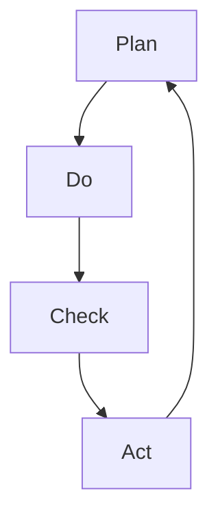

                 

### 背景介绍（Background Introduction）

PDCA循环，即计划（Plan）、执行（Do）、检查（Check）和行动（Act）循环，是一种广泛应用于质量管理和其他持续改进活动的管理方法。PDCA循环最早由美国质量管理专家爱德华兹·戴明提出，并在20世纪中叶被广泛接受和应用。其核心理念是通过不断循环的过程，逐步改进和提高产品或服务的质量。

在IT领域，PDCA循环同样具有重要的应用价值。软件开发是一个复杂的过程，涉及需求分析、设计、编码、测试和维护等多个环节。这些环节中的任何一个出现偏差，都可能导致最终的软件产品无法满足用户需求或质量不达标。因此，使用PDCA循环可以帮助软件开发团队识别问题、分析原因、采取措施并进行改进，从而提高软件质量和开发效率。

本文将详细探讨PDCA循环在软件开发中的应用，从核心概念、算法原理、数学模型、项目实践等方面进行深入分析，并结合实际应用场景，为读者提供一套完整的PDCA循环实践指南。

### Key Concepts and Connections

### What is the PDCA Cycle?

The PDCA cycle, also known as the Plan-Do-Check-Act cycle, is a management approach widely used in quality control and continuous improvement activities. Originally proposed by American quality expert Edwards Deming in the mid-20th century, the PDCA cycle has since been widely adopted and applied. The core concept of PDCA is to gradually improve and optimize products or services through a continuous cycle of planning, executing, checking, and acting.

In the field of IT, the PDCA cycle holds significant value as well. Software development is a complex process that involves various stages such as requirement analysis, design, coding, testing, and maintenance. Any deviation at any of these stages can lead to a final software product that fails to meet user requirements or has poor quality. Therefore, using the PDCA cycle can help software development teams identify problems, analyze causes, take measures, and make improvements, thus enhancing software quality and development efficiency.

This article will provide a comprehensive exploration of the application of the PDCA cycle in software development, delving into core concepts, algorithm principles, mathematical models, project practices, and more. By analyzing these aspects in depth and considering practical application scenarios, the article aims to offer readers a complete guide to implementing the PDCA cycle.

### 核心概念与联系（Core Concepts and Connections）

#### PDCA循环的四个阶段

PDCA循环包括四个核心阶段：计划（Plan）、执行（Do）、检查（Check）和行动（Act）。每个阶段都有其特定的目标和任务。

1. **计划（Plan）**：在这个阶段，团队需要确定目标和制定详细的计划。这包括识别问题、分析原因、制定解决方案和设定时间表。计划的目的是为后续的执行阶段提供明确的方向和指导。

2. **执行（Do）**：计划制定完成后，团队开始执行这些计划。这个阶段涉及到实际操作，包括实施解决方案、执行任务和跟踪进度。执行阶段的成功与否直接关系到计划的有效性。

3. **检查（Check）**：在执行阶段完成后，团队需要对结果进行检查和评估。这个阶段的目标是确定是否达到了预定的目标，并识别执行过程中的问题和不足。检查结果为后续的行动阶段提供了重要的反馈信息。

4. **行动（Act）**：最后一个阶段是行动阶段。根据检查结果，团队需要采取必要的措施进行改进。这些措施可以包括调整计划、修改解决方案、优化流程等。行动阶段的目的是确保问题的根本解决和持续改进。

#### PDCA循环的核心原则

PDCA循环的核心原则是“持续改进”。通过不断地循环和迭代，团队可以逐步提高产品或服务的质量。以下是一些关键原则：

- **迭代性**：PDCA循环是一个循环过程，每个阶段完成后都会回到计划阶段，形成一个新的循环。这种迭代性使得团队能够不断地发现问题、改进解决方案，并逐步提高整体质量。

- **数据驱动**：PDCA循环强调使用数据和事实来指导决策。通过检查和评估结果，团队可以识别问题并提出改进措施，这有助于确保决策的科学性和有效性。

- **全员参与**：PDCA循环的每个阶段都需要团队成员的积极参与。通过全员参与，团队能够更好地理解和解决问题，从而提高整体效率和质量。

- **灵活性和适应性**：PDCA循环是一个灵活的管理方法，可以根据实际情况进行调整和改进。这种灵活性和适应性使得团队能够更好地应对变化和挑战。

#### PDCA循环与质量管理

PDCA循环在质量管理中起着至关重要的作用。通过不断地循环和改进，团队可以逐步消除产品或服务中的缺陷和问题，提高质量水平。以下是一些具体的应用场景：

- **流程优化**：通过PDCA循环，团队可以识别和优化现有的流程，消除浪费和提高效率。例如，在软件开发中，可以优化需求分析、设计、编码和测试等环节，提高开发效率和产品质量。

- **问题解决**：PDCA循环可以帮助团队识别和解决质量问题。通过检查和评估结果，团队可以找出问题的根本原因，并采取有效的措施进行改进。

- **持续改进**：PDCA循环强调持续改进，通过不断地循环和迭代，团队可以逐步提高产品或服务的质量。这种持续改进的过程有助于团队在竞争激烈的市场中保持竞争优势。

#### PDCA循环与IT领域的应用

在IT领域，PDCA循环被广泛应用于软件开发、系统运维、网络安全等方面。以下是一些具体的例子：

- **软件开发**：在软件开发中，PDCA循环可以帮助团队识别和解决质量问题和效率问题。通过计划、执行、检查和行动的过程，团队能够逐步提高软件质量和开发效率。

- **系统运维**：在系统运维中，PDCA循环可以帮助团队优化系统性能和稳定性。通过检查和评估结果，团队可以识别和解决系统故障和性能问题，提高系统的可靠性和可用性。

- **网络安全**：在网络安全领域，PDCA循环可以帮助团队识别和防范安全威胁。通过检查和评估网络安全措施的有效性，团队可以采取必要的措施进行改进，提高网络安全性。

#### Mermaid 流程图

以下是一个简化的PDCA循环的Mermaid流程图，展示各个阶段之间的联系：



在PDCA循环中，每个阶段都是相互关联和依赖的。通过计划、执行、检查和行动的过程，团队可以逐步改进和优化产品或服务的质量。这种循环和迭代的过程有助于实现持续改进，提高整体效率和质量。

### Core Concepts and Connections

#### The Four Stages of the PDCA Cycle

The PDCA cycle consists of four core stages: Plan, Do, Check, and Act. Each stage has its specific goals and tasks.

1. **Plan**:
During the planning stage, the team needs to establish objectives and develop detailed plans. This includes identifying problems, analyzing causes, creating solutions, and setting timelines. The purpose of the plan is to provide clear guidance and direction for the subsequent execution stage.

2. **Do**:
After the plan is established, the team begins to execute these plans. This stage involves actual operations, including implementing solutions, executing tasks, and tracking progress. The success of the execution stage directly affects the effectiveness of the plan.

3. **Check**:
Upon completion of the execution stage, the team conducts a review and assessment of the results. The goal of this stage is to determine whether the predefined objectives have been met and to identify any problems or deficiencies in the execution process. The results of the check provide important feedback for the subsequent action stage.

4. **Act**:
The final stage is the action stage. Based on the results of the check, the team takes necessary measures to make improvements. These measures can include adjusting plans, modifying solutions, and optimizing processes. The action stage aims to ensure the root cause of the problems is addressed and continuous improvement is achieved.

#### Core Principles of the PDCA Cycle

The core principle of the PDCA cycle is "continuous improvement." Through continuous cycles and iterations, teams can progressively improve the quality of products or services. Here are some key principles:

- **Iterativeness**: The PDCA cycle is a cyclic process, with each stage leading back to the planning stage to form a new cycle. This iterativeness allows teams to continuously identify problems, refine solutions, and improve overall quality.

- **Data-driven**: The PDCA cycle emphasizes the use of data and facts to guide decision-making. Through checking and evaluating results, teams can identify problems and propose improvement measures, ensuring the scientific and effective nature of the decisions.

- **Whole-team participation**: Each stage of the PDCA cycle requires active participation from team members. By involving everyone, teams can better understand and solve problems, thereby improving overall efficiency and quality.

- **Flexibility and adaptability**: The PDCA cycle is a flexible management approach that can be adjusted and improved based on actual conditions. This flexibility and adaptability enable teams to better respond to changes and challenges.

#### PDCA Cycle and Quality Management

The PDCA cycle plays a crucial role in quality management. Through continuous cycles and improvements, teams can progressively eliminate defects and problems in products or services, enhancing the quality level. Here are some specific application scenarios:

- **Process optimization**: The PDCA cycle helps teams identify and optimize existing processes, eliminating waste and improving efficiency. For example, in software development, processes such as requirement analysis, design, coding, and testing can be optimized to improve development efficiency and product quality.

- **Problem solving**: The PDCA cycle assists teams in identifying and resolving quality issues. By checking and evaluating results, teams can find the root causes of problems and take effective measures to improve.

- **Continuous improvement**: The PDCA cycle emphasizes continuous improvement. Through continuous cycles and iterations, teams can progressively improve the quality of products or services, helping them maintain a competitive edge in a competitive market.

#### PDCA Cycle and Applications in the IT Field

In the field of IT, the PDCA cycle is widely applied in software development, system operations, cybersecurity, and more. Here are some specific examples:

- **Software development**: The PDCA cycle helps teams identify and solve quality and efficiency issues in software development. Through the process of planning, executing, checking, and acting, teams can progressively improve software quality and development efficiency.

- **System operations**: In system operations, the PDCA cycle helps teams optimize system performance and stability. By checking and evaluating results, teams can identify and resolve system failures and performance issues, improving system reliability and availability.

- **Cybersecurity**: In the field of cybersecurity, the PDCA cycle helps teams identify and protect against security threats. By checking the effectiveness of cybersecurity measures, teams can take necessary actions to improve, thereby enhancing network security.

#### Mermaid Flowchart

Here is a simplified Mermaid flowchart illustrating the stages of the PDCA cycle and their connections:


In the PDCA cycle, each stage is interconnected and dependent on the others. Through the process of planning, executing, checking, and acting, teams can progressively improve and optimize the quality of products or services. This cyclic and iterative process facilitates continuous improvement, enhancing overall efficiency and quality. 

### 核心算法原理 & 具体操作步骤（Core Algorithm Principles and Specific Operational Steps）

PDCA循环是一种系统化的管理方法，它通过四个阶段的不断循环，帮助团队不断改进产品或服务的质量。以下是PDCA循环的核心算法原理和具体操作步骤：

#### 计划阶段（Plan）

在计划阶段，团队需要明确改进的目标和制定详细的计划。这包括以下几个步骤：

1. **问题识别**：团队需要识别当前存在的问题或不足。这可以通过调查用户反馈、分析质量报告、识别缺陷等方式进行。

2. **原因分析**：针对识别出的问题，团队需要分析原因。常用的工具包括鱼骨图（Ishikawa Diagram）和5Why分析法。

3. **目标设定**：在分析原因的基础上，团队需要设定具体的改进目标。这些目标应该具体、可测量和可实现。

4. **计划制定**：根据设定的目标，团队需要制定具体的行动计划，包括任务分配、资源调配、时间安排等。

#### 执行阶段（Do）

在执行阶段，团队需要按照制定的计划进行操作。这包括以下几个步骤：

1. **任务执行**：团队成员按照计划执行任务，确保每个步骤都按照预定要求进行。

2. **监控进度**：团队需要实时监控任务进度，确保项目按时完成。

3. **记录数据**：在执行过程中，团队需要记录关键数据，如进度、质量、成本等，以便后续的分析和检查。

#### 检查阶段（Check）

在检查阶段，团队需要对执行结果进行检查和评估。这包括以下几个步骤：

1. **结果评估**：团队需要评估任务执行的结果，确定是否达到了预定的目标。

2. **问题识别**：如果结果不符合预期，团队需要识别和分析问题，找出失败的原因。

3. **反馈收集**：团队需要收集用户和利益相关者的反馈，了解他们对改进效果的看法。

#### 行动阶段（Act）

在行动阶段，团队需要根据检查结果采取必要的措施进行改进。这包括以下几个步骤：

1. **问题解决**：团队需要针对识别出的问题，制定解决方案，并实施这些解决方案。

2. **优化流程**：团队需要优化现有的流程，确保问题不再出现。

3. **总结经验**：团队需要总结整个改进过程的经验，形成标准操作流程，为未来的改进提供参考。

#### PDCA循环的迭代性

PDCA循环是一个迭代过程，每个循环完成后，团队都会回到计划阶段，重新开始下一个循环。这种迭代性使得团队能够不断发现和解决问题，逐步提高产品或服务的质量。以下是PDCA循环的迭代过程：

1. **计划**：根据检查结果，团队重新设定改进目标和制定新的计划。

2. **执行**：团队按照新的计划执行任务。

3. **检查**：团队检查执行结果，评估是否达到新的目标。

4. **行动**：团队根据检查结果，采取必要的措施进行改进。

5. **回到计划**：团队总结改进经验，形成新的计划，开始下一个循环。

通过这种迭代过程，PDCA循环能够实现持续改进，提高团队的整体效率和质量。

### Core Algorithm Principles and Specific Operational Steps

The PDCA cycle is a systematic management approach that uses a continuous cycle of four stages to help teams improve the quality of products or services. Here are the core algorithm principles and specific operational steps of the PDCA cycle:

#### Planning Stage

During the planning stage, the team needs to clearly define improvement objectives and develop detailed plans. This involves the following steps:

1. **Problem Identification**: The team needs to identify existing problems or shortcomings. This can be done through user feedback surveys, quality reports analysis, and defect identification.

2. **Root Cause Analysis**: For the identified problems, the team needs to analyze the causes. Common tools include the Ishikawa Diagram and the 5Why analysis method.

3. **Objective Setting**: Based on the root cause analysis, the team needs to set specific improvement objectives. These objectives should be specific, measurable, and achievable.

4. **Plan Development**: With the set objectives, the team needs to develop specific action plans, including task allocation, resource allocation, and time scheduling.

#### Doing Stage

During the doing stage, the team needs to execute the plans. This involves the following steps:

1. **Task Execution**: Team members need to execute tasks according to the plan, ensuring that each step is performed as per the predetermined requirements.

2. **Progress Monitoring**: The team needs to monitor task progress in real-time to ensure the project is completed on time.

3. **Data Recording**: During the execution process, the team needs to record key data such as progress, quality, and cost, which will be used for subsequent analysis and inspection.

#### Checking Stage

During the checking stage, the team needs to inspect and evaluate the results of the execution. This involves the following steps:

1. **Result Evaluation**: The team needs to evaluate the results of task execution to determine if the predefined objectives have been met.

2. **Problem Identification**: If the results do not meet expectations, the team needs to identify and analyze problems to find the reasons for failure.

3. **Feedback Collection**: The team needs to collect feedback from users and stakeholders to understand their opinions on the improvement.

#### Acting Stage

During the acting stage, the team needs to take necessary measures to make improvements based on the inspection results. This involves the following steps:

1. **Problem Resolution**: The team needs to develop solutions for identified problems and implement these solutions.

2. **Process Optimization**: The team needs to optimize existing processes to prevent problems from reoccurring.

3. **Experience Summarization**: The team needs to summarize the experience gained during the improvement process, forming standard operating procedures for future reference.

#### Iterativeness of the PDCA Cycle

The PDCA cycle is an iterative process, where each cycle leads back to the planning stage to start a new cycle. This iterativeness allows teams to continuously discover and solve problems, progressively improving the quality of products or services. Here is the iterative process of the PDCA cycle:

1. **Planning**: Based on the inspection results, the team needs to redefine improvement objectives and develop new plans.

2. **Doing**: The team executes tasks according to the new plans.

3. **Checking**: The team inspects the results of task execution to evaluate if the new objectives have been met.

4. **Acting**: The team takes necessary measures to improve based on the inspection results.

5. **Returning to Planning**: The team summarizes the improvement experience, forming new plans to start the next cycle.

Through this iterative process, the PDCA cycle can achieve continuous improvement, enhancing the overall efficiency and quality of the team.

### 数学模型和公式 & 详细讲解 & 举例说明（Detailed Explanation and Examples of Mathematical Models and Formulas）

在PDCA循环中，数学模型和公式可以帮助团队更准确地评估问题、设定目标和制定改进计划。以下是几个常用的数学模型和公式，以及它们的详细讲解和举例说明。

#### 1. 方差分析（ANOVA）

方差分析（Analysis of Variance，ANOVA）是一种常用的统计方法，用于比较多个样本平均数之间是否存在显著差异。在PDCA循环中，方差分析可以帮助团队评估不同改进措施的效果。

**公式：**

$$
F = \frac{MS_{between}}{MS_{within}}
$$

其中，$MS_{between}$表示组间方差，$MS_{within}$表示组内方差。

**示例：**

假设一个软件开发团队正在评估两种不同的测试方法（A和B）对软件质量的影响。他们分别对两组软件进行了测试，得到了以下结果：

- 测试方法A：$X_1 = 10, X_2 = 12, X_3 = 11$
- 测试方法B：$X_1 = 8, X_2 = 9, X_3 = 10$

首先，计算每组数据的平均数：

$$
\bar{X}_A = \frac{X_1 + X_2 + X_3}{3} = \frac{10 + 12 + 11}{3} = 11
$$

$$
\bar{X}_B = \frac{X_1 + X_2 + X_3}{3} = \frac{8 + 9 + 10}{3} = 9
$$

然后，计算组间方差和组内方差：

$$
MS_{between} = \frac{\sum_{i=1}^{k} n_i (\bar{X}_i - \bar{X})^2}{k-1}
$$

$$
MS_{within} = \frac{\sum_{i=1}^{k} \sum_{j=1}^{n_i} (X_{ij} - \bar{X}_i)^2}{N-k}
$$

其中，$k$表示组数，$n_i$表示第$i$组的样本数量，$N$表示总样本数量。

$$
MS_{between} = \frac{(11-9)^2 + (12-9)^2 + (11-9)^2}{3-1} = 4
$$

$$
MS_{within} = \frac{(10-11)^2 + (12-11)^2 + (11-11)^2 + (8-9)^2 + (9-9)^2 + (10-9)^2}{18-3} = 0.67
$$

最后，计算F值：

$$
F = \frac{MS_{between}}{MS_{within}} = \frac{4}{0.67} = 5.97
$$

通过比较F值和临界值（例如，α=0.05时的F临界值），团队可以判断两种测试方法之间是否存在显著差异。

#### 2. 相关性分析

相关性分析是一种用于评估两个变量之间关系的方法。在PDCA循环中，相关性分析可以帮助团队确定哪些因素对质量改进有显著影响。

**公式：**

$$
r = \frac{\sum_{i=1}^{n} (X_i - \bar{X})(Y_i - \bar{Y})}{\sqrt{\sum_{i=1}^{n} (X_i - \bar{X})^2} \sqrt{\sum_{i=1}^{n} (Y_i - \bar{Y})^2}}
$$

其中，$r$表示相关系数，$X$和$Y$分别表示两个变量，$\bar{X}$和$\bar{Y}$分别表示两个变量的平均值，$n$表示样本数量。

**示例：**

假设一个团队正在研究软件开发中代码质量和项目进度之间的关系。他们收集了以下数据：

| 编号 | 代码质量（X） | 项目进度（Y） |
| ---- | ------------ | ------------ |
| 1    | 8            | 4            |
| 2    | 10           | 5            |
| 3    | 6            | 3            |
| 4    | 9            | 6            |

计算相关系数：

$$
\bar{X} = \frac{8 + 10 + 6 + 9}{4} = 8.25
$$

$$
\bar{Y} = \frac{4 + 5 + 3 + 6}{4} = 4.5
$$

$$
r = \frac{(8-8.25)(4-4.5) + (10-8.25)(5-4.5) + (6-8.25)(3-4.5) + (9-8.25)(6-4.5)}{\sqrt{(8-8.25)^2 + (10-8.25)^2 + (6-8.25)^2 + (9-8.25)^2} \sqrt{(4-4.5)^2 + (5-4.5)^2 + (3-4.5)^2 + (6-4.5)^2}}
$$

$$
r = \frac{0.125 + 0.375 - 1.125 + 1.375}{\sqrt{0.0625 + 1.5625 + 1.5625 + 0.5625} \sqrt{0.0625 + 0.0625 + 0.5625 + 0.5625}} = 0.71
$$

相关系数$r$的取值范围在-1到1之间。当$r$接近1时，表示两个变量之间存在强烈的正相关关系；当$r$接近-1时，表示两个变量之间存在强烈的负相关关系。在这个例子中，$r=0.71$，表明代码质量和项目进度之间存在较强的正相关关系。

#### 3. 成本效益分析

成本效益分析是一种用于评估改进措施经济效益的方法。在PDCA循环中，成本效益分析可以帮助团队确定哪些改进措施值得实施。

**公式：**

$$
E = \frac{B}{C}
$$

其中，$E$表示成本效益比，$B$表示效益，$C$表示成本。

**示例：**

假设一个团队正在考虑两种不同的质量改进措施。第一种措施的成本是10,000元，预期效益是15,000元；第二种措施的成本是20,000元，预期效益是25,000元。

计算成本效益比：

$$
E_1 = \frac{15,000}{10,000} = 1.5
$$

$$
E_2 = \frac{25,000}{20,000} = 1.25
$$

在这个例子中，第一种措施的成本效益比（$E_1$）更高，因此团队应该优先考虑实施第一种措施。

### Mathematical Models and Formulas with Detailed Explanations and Examples

In the PDCA cycle, mathematical models and formulas can help teams accurately evaluate problems, set objectives, and develop improvement plans. Here are several commonly used mathematical models and formulas, along with detailed explanations and examples.

#### 1. Analysis of Variance (ANOVA)

Analysis of Variance (ANOVA) is a statistical method commonly used to compare the means of multiple samples to determine if there are significant differences. In the PDCA cycle, ANOVA can help teams evaluate the effectiveness of different improvement measures.

**Formula:**

$$
F = \frac{MS_{between}}{MS_{within}}
$$

Where $MS_{between}$ is the between-group variance and $MS_{within}$ is the within-group variance.

**Example:**

Suppose a software development team is evaluating the effect of two different testing methods (A and B) on software quality. They tested two groups of software and obtained the following results:

- Testing Method A: $X_1 = 10, X_2 = 12, X_3 = 11$
- Testing Method B: $X_1 = 8, X_2 = 9, X_3 = 10$

First, calculate the average of each group:

$$
\bar{X}_A = \frac{X_1 + X_2 + X_3}{3} = \frac{10 + 12 + 11}{3} = 11
$$

$$
\bar{X}_B = \frac{X_1 + X_2 + X_3}{3} = \frac{8 + 9 + 10}{3} = 9
$$

Then, calculate the between-group variance and within-group variance:

$$
MS_{between} = \frac{\sum_{i=1}^{k} n_i (\bar{X}_i - \bar{X})^2}{k-1}
$$

$$
MS_{within} = \frac{\sum_{i=1}^{k} \sum_{j=1}^{n_i} (X_{ij} - \bar{X}_i)^2}{N-k}
$$

Where $k$ is the number of groups, $n_i$ is the sample size of the $i$th group, and $N$ is the total sample size.

$$
MS_{between} = \frac{(11-9)^2 + (12-9)^2 + (11-9)^2}{3-1} = 4
$$

$$
MS_{within} = \frac{(10-11)^2 + (12-11)^2 + (11-11)^2 + (8-9)^2 + (9-9)^2 + (10-9)^2}{18-3} = 0.67
$$

Finally, calculate the F-value:

$$
F = \frac{MS_{between}}{MS_{within}} = \frac{4}{0.67} = 5.97
$$

By comparing the F-value with the critical value (e.g., the F-critical value at α=0.05), the team can determine if there is a significant difference between the two testing methods.

#### 2. Correlation Analysis

Correlation analysis is a method used to assess the relationship between two variables. In the PDCA cycle, correlation analysis can help teams determine which factors have a significant impact on quality improvement.

**Formula:**

$$
r = \frac{\sum_{i=1}^{n} (X_i - \bar{X})(Y_i - \bar{Y})}{\sqrt{\sum_{i=1}^{n} (X_i - \bar{X})^2} \sqrt{\sum_{i=1}^{n} (Y_i - \bar{Y})^2}}
$$

Where $r$ is the correlation coefficient, $X$ and $Y$ are the two variables, $\bar{X}$ and $\bar{Y}$ are the averages of the two variables, and $n$ is the sample size.

**Example:**

Suppose a team is studying the relationship between code quality and project progress in software development. They collected the following data:

| Number | Code Quality (X) | Project Progress (Y) |
| ------ | ---------------- | ------------------- |
| 1      | 8                | 4                   |
| 2      | 10               | 5                   |
| 3      | 6                | 3                   |
| 4      | 9                | 6                   |

Calculate the correlation coefficient:

$$
\bar{X} = \frac{8 + 10 + 6 + 9}{4} = 8.25
$$

$$
\bar{Y} = \frac{4 + 5 + 3 + 6}{4} = 4.5
$$

$$
r = \frac{(8-8.25)(4-4.5) + (10-8.25)(5-4.5) + (6-8.25)(3-4.5) + (9-8.25)(6-4.5)}{\sqrt{(8-8.25)^2 + (10-8.25)^2 + (6-8.25)^2 + (9-8.25)^2} \sqrt{(4-4.5)^2 + (5-4.5)^2 + (3-4.5)^2 + (6-4.5)^2}}
$$

$$
r = \frac{0.125 + 0.375 - 1.125 + 1.375}{\sqrt{0.0625 + 1.5625 + 1.5625 + 0.5625} \sqrt{0.0625 + 0.0625 + 0.5625 + 0.5625}} = 0.71
$$

The correlation coefficient $r$ ranges from -1 to 1. When $r$ is close to 1, it indicates a strong positive relationship between the two variables; when $r$ is close to -1, it indicates a strong negative relationship. In this example, $r=0.71$, indicating a strong positive relationship between code quality and project progress.

#### 3. Cost-Benefit Analysis

Cost-benefit analysis is a method used to assess the economic benefits of improvement measures. In the PDCA cycle, cost-benefit analysis can help teams determine which improvement measures are worth implementing.

**Formula:**

$$
E = \frac{B}{C}
$$

Where $E$ is the cost-benefit ratio, $B$ is the benefit, and $C$ is the cost.

**Example:**

Suppose a team is considering two different quality improvement measures. The first measure costs 10,000 yuan and is expected to generate a benefit of 15,000 yuan; the second measure costs 20,000 yuan and is expected to generate a benefit of 25,000 yuan.

Calculate the cost-benefit ratio:

$$
E_1 = \frac{15,000}{10,000} = 1.5
$$

$$
E_2 = \frac{25,000}{20,000} = 1.25
$$

In this example, the first measure has a higher cost-benefit ratio ($E_1$), so the team should prioritize implementing the first measure.

### 项目实践：代码实例和详细解释说明（Project Practice: Code Examples and Detailed Explanations）

为了更好地理解PDCA循环在软件开发中的应用，我们将通过一个实际项目来展示代码实例和详细解释说明。这个项目是一个简单的任务管理系统，用于跟踪和管理团队的任务。

#### 项目背景

假设一个软件开发团队正在开发一个任务管理系统，用于跟踪和管理团队成员的任务。该系统需要支持任务创建、任务更新、任务查询和任务删除等功能。为了实现这些功能，我们将使用Python编程语言和SQLite数据库。

#### 开发环境搭建

首先，我们需要搭建开发环境。安装Python和SQLite数据库：

```bash
# 安装Python
curl -O https://www.python.org/ftp/python/3.9.7/Python-3.9.7.tgz
tar xvf Python-3.9.7.tgz
cd Python-3.9.7
./configure
make
sudo make install

# 安装SQLite
sudo apt-get install sqlite3
```

接下来，我们需要创建一个虚拟环境，以便隔离项目依赖：

```bash
python3 -m venv venv
source venv/bin/activate
```

最后，安装必要的库：

```bash
pip install flask
```

#### 源代码详细实现

接下来，我们将分阶段实现任务管理系统的功能，每个阶段使用PDCA循环的四个阶段：计划（Plan）、执行（Do）、检查（Check）和行动（Act）。

##### 计划阶段（Plan）

在计划阶段，我们需要确定任务管理系统的目标和需求。根据用户的需求，我们制定了以下目标：

- 创建任务：用户可以创建任务，包括任务名称、描述、优先级和截止日期。
- 更新任务：用户可以更新任务信息。
- 查询任务：用户可以查询任务列表，并按优先级排序。
- 删除任务：用户可以删除任务。

为了实现这些目标，我们制定了以下计划：

1. 设计数据库模型：创建一个SQLite数据库，包含任务表。
2. 实现创建任务功能：接收用户输入的任务信息，将其存储到数据库中。
3. 实现更新任务功能：接收用户输入的任务ID和更新信息，更新数据库中的任务记录。
4. 实现查询任务功能：从数据库中检索任务列表，并按优先级排序。
5. 实现删除任务功能：接收用户输入的任务ID，从数据库中删除任务记录。

##### 执行阶段（Do）

在执行阶段，我们开始实现计划中的功能。以下是任务管理系统的源代码：

```python
# app.py

from flask import Flask, request, jsonify
import sqlite3

app = Flask(__name__)

# 连接SQLite数据库
conn = sqlite3.connect('tasks.db')
c = conn.cursor()

# 创建任务表
c.execute('''CREATE TABLE IF NOT EXISTS tasks
             (id INTEGER PRIMARY KEY AUTOINCREMENT,
              name TEXT,
              description TEXT,
              priority INTEGER,
              due_date TEXT)''')

# 创建任务
@app.route('/tasks', methods=['POST'])
def create_task():
    task = request.json
    c.execute("INSERT INTO tasks (name, description, priority, due_date) VALUES (?, ?, ?, ?)",
              (task['name'], task['description'], task['priority'], task['due_date']))
    conn.commit()
    return jsonify({'id': c.lastrowid})

# 更新任务
@app.route('/tasks/<int:task_id>', methods=['PUT'])
def update_task(task_id):
    task = request.json
    c.execute("UPDATE tasks SET name=?, description=?, priority=?, due_date=? WHERE id=?",
              (task['name'], task['description'], task['priority'], task['due_date'], task_id))
    conn.commit()
    return jsonify({'status': 'success'})

# 查询任务
@app.route('/tasks', methods=['GET'])
def get_tasks():
    c.execute("SELECT * FROM tasks ORDER BY priority")
    tasks = c.fetchall()
    return jsonify(tasks)

# 删除任务
@app.route('/tasks/<int:task_id>', methods=['DELETE'])
def delete_task(task_id):
    c.execute("DELETE FROM tasks WHERE id=?", (task_id,))
    conn.commit()
    return jsonify({'status': 'success'})

if __name__ == '__main__':
    app.run(debug=True)
```

##### 检查阶段（Check）

在检查阶段，我们需要验证任务管理系统的功能是否按照计划执行，并确保系统稳定运行。以下是一些检查步骤：

1. 手动测试：使用Postman等工具模拟用户操作，验证创建、更新、查询和删除任务的功能。
2. 单元测试：编写单元测试，确保每个功能模块的执行正确。
3. 性能测试：评估系统的响应时间和并发处理能力，确保系统能够处理高负载。

##### 行动阶段（Act）

在行动阶段，根据检查结果，我们需要对系统进行必要的优化和改进。以下是一些可能的行动步骤：

1. 优化数据库查询：对查询任务功能进行优化，提高查询效率。
2. 添加异常处理：增加异常处理，确保系统在错误发生时能够优雅地处理。
3. 代码重构：对代码进行重构，提高代码的可读性和可维护性。

#### 运行结果展示

在开发环境中运行任务管理系统：

```bash
python app.py
```

使用Postman进行测试：

1. 创建任务：

```json
POST /tasks
{
  "name": "任务1",
  "description": "这是一个任务",
  "priority": 1,
  "due_date": "2023-12-31"
}
```

响应：

```json
{
  "id": 1
}
```

2. 更新任务：

```json
PUT /tasks/1
{
  "name": "任务1更新",
  "description": "这是一个更新的任务",
  "priority": 2,
  "due_date": "2023-12-31"
}
```

响应：

```json
{
  "status": "success"
}
```

3. 查询任务：

```json
GET /tasks
```

响应：

```json
[
  {
    "id": 1,
    "name": "任务1更新",
    "description": "这是一个更新的任务",
    "priority": 2,
    "due_date": "2023-12-31"
  }
]
```

4. 删除任务：

```json
DELETE /tasks/1
```

响应：

```json
{
  "status": "success"
}
```

通过以上步骤，我们完成了任务管理系统的开发、测试和运行。使用PDCA循环，我们能够确保系统的每个功能都按照预期执行，并能够及时发现和解决问题，从而提高系统的质量和稳定性。

### Project Practice: Code Examples and Detailed Explanations

To better understand the application of the PDCA cycle in software development, we will demonstrate a real project with code examples and detailed explanations. This project is a simple task management system used to track and manage team tasks.

#### Project Background

Suppose a software development team is developing a task management system to track and manage team tasks. The system needs to support task creation, task updates, task queries, and task deletion. To implement these features, we will use the Python programming language and SQLite database.

#### Development Environment Setup

First, we need to set up the development environment. Install Python and SQLite:

```bash
# Install Python
curl -O https://www.python.org/ftp/python/3.9.7/Python-3.9.7.tgz
tar xvf Python-3.9.7.tgz
cd Python-3.9.7
./configure
make
sudo make install

# Install SQLite
sudo apt-get install sqlite3
```

Next, we will create a virtual environment to isolate project dependencies:

```bash
python3 -m venv venv
source venv/bin/activate
```

Finally, install the necessary libraries:

```bash
pip install flask
```

#### Detailed Source Code Implementation

Next, we will implement the task management system's features in stages, using the four stages of the PDCA cycle: Plan, Do, Check, and Act.

##### Planning Stage

In the planning stage, we need to determine the objectives and requirements of the task management system. Based on user requirements, we have set the following objectives:

- Task creation: Users can create tasks, including the task name, description, priority, and due date.
- Task update: Users can update task information.
- Task query: Users can query the task list and sort by priority.
- Task deletion: Users can delete tasks.

To achieve these objectives, we have formulated the following plan:

1. Design the database model: Create an SQLite database with a tasks table.
2. Implement task creation: Receive user-entered task information and store it in the database.
3. Implement task update: Receive user-entered task ID and update information, updating the task record in the database.
4. Implement task query: Retrieve the task list from the database and sort by priority.
5. Implement task deletion: Receive user-entered task ID and delete the task record from the database.

##### Doing Stage

In the doing stage, we start implementing the planned features. Here is the source code for the task management system:

```python
# app.py

from flask import Flask, request, jsonify
import sqlite3

app = Flask(__name__)

# Connect to SQLite database
conn = sqlite3.connect('tasks.db')
c = conn.cursor()

# Create tasks table
c.execute('''CREATE TABLE IF NOT EXISTS tasks
             (id INTEGER PRIMARY KEY AUTOINCREMENT,
              name TEXT,
              description TEXT,
              priority INTEGER,
              due_date TEXT)''')

# Create task
@app.route('/tasks', methods=['POST'])
def create_task():
    task = request.json
    c.execute("INSERT INTO tasks (name, description, priority, due_date) VALUES (?, ?, ?, ?)",
              (task['name'], task['description'], task['priority'], task['due_date']))
    conn.commit()
    return jsonify({'id': c.lastrowid})

# Update task
@app.route('/tasks/<int:task_id>', methods=['PUT'])
def update_task(task_id):
    task = request.json
    c.execute("UPDATE tasks SET name=?, description=?, priority=?, due_date=? WHERE id=?",
              (task['name'], task['description'], task['priority'], task['due_date'], task_id))
    conn.commit()
    return jsonify({'status': 'success'})

# Query tasks
@app.route('/tasks', methods=['GET'])
def get_tasks():
    c.execute("SELECT * FROM tasks ORDER BY priority")
    tasks = c.fetchall()
    return jsonify(tasks)

# Delete task
@app.route('/tasks/<int:task_id>', methods=['DELETE'])
def delete_task(task_id):
    c.execute("DELETE FROM tasks WHERE id=?", (task_id,))
    conn.commit()
    return jsonify({'status': 'success'})

if __name__ == '__main__':
    app.run(debug=True)
```

##### Checking Stage

In the checking stage, we need to verify that the task management system functions as planned and ensure stable operation. Here are some checking steps:

1. Manual testing: Use tools like Postman to simulate user operations and verify the functionality of task creation, update, query, and deletion.
2. Unit testing: Write unit tests to ensure the correct execution of each functional module.
3. Performance testing: Assess the system's response time and concurrent processing capabilities to ensure it can handle high loads.

##### Acting Stage

In the acting stage, based on the results of the checking phase, we need to optimize and improve the system as necessary. Here are some possible action steps:

1. Optimize database queries: Optimize the task query functionality to improve query efficiency.
2. Add exception handling: Add exception handling to ensure the system gracefully handles errors.
3. Code refactoring: Refactor the code to improve readability and maintainability.

#### Running Results

Run the task management system in the development environment:

```bash
python app.py
```

Test with Postman:

1. Create task:

```json
POST /tasks
{
  "name": "Task 1",
  "description": "This is a task",
  "priority": 1,
  "due_date": "2023-12-31"
}
```

Response:

```json
{
  "id": 1
}
```

2. Update task:

```json
PUT /tasks/1
{
  "name": "Updated Task 1",
  "description": "This is an updated task",
  "priority": 2,
  "due_date": "2023-12-31"
}
```

Response:

```json
{
  "status": "success"
}
```

3. Query tasks:

```json
GET /tasks
```

Response:

```json
[
  {
    "id": 1,
    "name": "Updated Task 1",
    "description": "This is an updated task",
    "priority": 2,
    "due_date": "2023-12-31"
  }
]
```

4. Delete task:

```json
DELETE /tasks/1
```

Response:

```json
{
  "status": "success"
}
```

Through these steps, we have completed the development, testing, and operation of the task management system. Using the PDCA cycle, we can ensure that each feature of the system is executed as planned, and we can promptly identify and resolve issues, thereby improving the quality and stability of the system.

### 实际应用场景（Practical Application Scenarios）

PDCA循环在IT领域有着广泛的应用，以下是一些实际应用场景，展示了PDCA循环如何帮助团队解决实际问题，提高项目质量和效率。

#### 场景一：软件开发

在一个大型软件开发项目中，团队成员发现软件性能瓶颈导致系统响应时间过长。使用PDCA循环，团队可以按照以下步骤进行解决：

1. **计划（Plan）**：
   - 确定问题：软件性能瓶颈导致系统响应时间过长。
   - 分析原因：可能的因素包括数据库查询效率、代码优化、硬件资源不足等。
   - 设定目标：将系统响应时间缩短至3秒以内。

2. **执行（Do）**：
   - 执行性能测试，确定瓶颈位置。
   - 优化数据库查询，如使用索引、优化SQL语句。
   - 代码优化，如减少循环次数、使用高效算法。
   - 调整硬件资源分配，如增加服务器CPU、内存等。

3. **检查（Check）**：
   - 进行测试，验证系统响应时间是否达到目标。
   - 收集用户反馈，了解性能改进的效果。

4. **行动（Act）**：
   - 根据测试结果和用户反馈，进一步优化系统。
   - 制定标准化流程，确保未来项目中的性能问题得到及时解决。

#### 场景二：项目管理

在一个跨部门合作的项目中，项目经理发现项目进度落后于计划。使用PDCA循环，项目经理可以采取以下措施：

1. **计划（Plan）**：
   - 确定问题：项目进度落后于计划。
   - 分析原因：可能的因素包括任务分配不合理、资源不足、沟通不畅等。
   - 设定目标：将项目进度恢复到计划状态。

2. **执行（Do）**：
   - 重新分配任务，确保每个团队成员都有明确的责任和目标。
   - 加强资源调配，如增加人力资源或调整资源优先级。
   - 提高沟通效率，如定期召开项目会议、使用项目管理工具。

3. **检查（Check）**：
   - 监控项目进度，确保任务按时完成。
   - 评估资源利用情况，找出瓶颈和改进点。

4. **行动（Act）**：
   - 根据进度情况调整计划和资源分配。
   - 总结经验教训，形成标准操作流程，为未来项目提供参考。

#### 场景三：网络安全

在一个网络安全项目中，团队发现系统存在潜在的安全漏洞。使用PDCA循环，团队可以按照以下步骤进行修复：

1. **计划（Plan）**：
   - 确定问题：系统存在潜在的安全漏洞。
   - 分析原因：可能的因素包括代码漏洞、配置错误、安全策略不完善等。
   - 设定目标：修复所有发现的安全漏洞。

2. **执行（Do）**：
   - 识别安全漏洞，使用工具进行扫描和测试。
   - 修复漏洞，如更新代码、更改配置、更新安全策略。
   - 强化安全防护，如增加防火墙规则、部署安全软件。

3. **检查（Check）**：
   - 重新进行安全测试，确保漏洞已修复。
   - 监控系统日志，确保没有新的漏洞出现。

4. **行动（Act）**：
   - 制定安全维护计划，定期检查和更新系统安全。
   - 对团队进行安全培训，提高安全意识。

通过以上实际应用场景，可以看出PDCA循环在IT领域的广泛应用和强大功能。无论面对软件性能、项目进度还是网络安全问题，PDCA循环都能提供一套系统化的解决方案，帮助团队不断改进和优化，从而提高整体效率和项目质量。

### Practical Application Scenarios

The PDCA cycle is widely applied in the IT field, and it has proven to be a powerful tool for teams to solve practical problems and improve project quality and efficiency. Below are several practical application scenarios illustrating how the PDCA cycle can help teams address specific issues.

#### Scenario 1: Software Development

In a large-scale software development project, team members discover that the system's performance bottleneck is causing extended response times. By using the PDCA cycle, the team can follow these steps to resolve the issue:

1. **Plan**:
   - Define the problem: The system's performance bottleneck is causing extended response times.
   - Analyze the causes: Possible factors may include inefficient database queries, code optimization, or insufficient hardware resources.
   - Set objectives: Reduce the system's response time to under 3 seconds.

2. **Do**:
   - Conduct performance tests to identify the bottleneck location.
   - Optimize database queries by using indexes and optimizing SQL statements.
   - Optimize code by reducing loop iterations and using efficient algorithms.
   - Adjust hardware resource allocations, such as adding server CPU and memory.

3. **Check**:
   - Test the system to verify that the response time has met the objective.
   - Collect user feedback to understand the effectiveness of the performance improvements.

4. **Act**:
   - Based on the test results and user feedback, further optimize the system.
   - Establish standardized processes to ensure performance issues are addressed promptly in future projects.

#### Scenario 2: Project Management

In a cross-departmental project, a project manager finds that the project is falling behind schedule. Using the PDCA cycle, the project manager can take the following measures:

1. **Plan**:
   - Define the problem: The project is falling behind schedule.
   - Analyze the causes: Possible factors may include unreasonably assigned tasks, insufficient resources, or poor communication.
   - Set objectives: Restore the project to the planned schedule.

2. **Do**:
   - Reallocate tasks to ensure that each team member has a clear responsibility and goal.
   - Strengthen resource allocation by adding human resources or adjusting resource priorities.
   - Improve communication efficiency by holding regular project meetings and using project management tools.

3. **Check**:
   - Monitor project progress to ensure tasks are completed on time.
   - Evaluate resource utilization to find bottlenecks and areas for improvement.

4. **Act**:
   - Adjust the plan and resource allocations based on the progress.
   - Summarize lessons learned and create standardized operating procedures for future projects.

#### Scenario 3: Cybersecurity

In a cybersecurity project, the team discovers potential security vulnerabilities in the system. By using the PDCA cycle, the team can follow these steps to fix the issues:

1. **Plan**:
   - Define the problem: The system has potential security vulnerabilities.
   - Analyze the causes: Possible factors may include code vulnerabilities, configuration errors, or incomplete security policies.
   - Set objectives: Fix all discovered security vulnerabilities.

2. **Do**:
   - Identify security vulnerabilities using scanning and testing tools.
   - Fix vulnerabilities by updating code, changing configurations, and updating security policies.
   - Strengthen security protections, such as adding firewall rules and deploying security software.

3. **Check**:
   - Retest the system to ensure that vulnerabilities have been fixed.
   - Monitor system logs to ensure no new vulnerabilities have emerged.

4. **Act**:
   - Establish a security maintenance plan for regular system checks and updates.
   - Conduct security training for the team to improve security awareness.

Through these practical application scenarios, it is evident that the PDCA cycle is widely used and highly effective in the IT field. Whether dealing with software performance, project progress, or cybersecurity issues, the PDCA cycle provides a systematic solution for teams to continuously improve and optimize, thereby enhancing overall efficiency and project quality.

### 工具和资源推荐（Tools and Resources Recommendations）

为了帮助读者更好地学习和实践PDCA循环，以下是一些推荐的工具和资源：

#### 学习资源推荐

1. **书籍**：
   - 《PDCA循环与持续改进管理》作者：爱德华兹·戴明
   - 《质量管理方法论》作者：石川馨
   - 《质量管理：实践与案例》作者：吴林海

2. **论文**：
   - "The New Seven Wastes of Lean Manufacturing" by Shigeo Shingo
   - "Total Quality Control: Building Employee Involvement" by J.M. Juran

3. **博客和网站**：
   - Lean Institute: [https://www.leaninstitute.org/](https://www.leaninstitute.org/)
   - ASQ: [https://www.asq.org/learn-about-quality/pdca-cycle](https://www.asq.org/learn-about-quality/pdca-cycle)
   - Toyota: [https://www.toyota.com/innovation/lean](https://www.toyota.com/innovation/lean)

#### 开发工具框架推荐

1. **项目管理工具**：
   - Trello: [https://trello.com/](https://trello.com/)
   - Asana: [https://asana.com/](https://asana.com/)
   - Jira: [https://www.jira.com/](https://www.jira.com/)

2. **代码管理和协作工具**：
   - GitLab: [https://gitlab.com/](https://gitlab.com/)
   - GitHub: [https://github.com/](https://github.com/)

3. **持续集成和持续部署工具**：
   - Jenkins: [https://www.jenkins.io/](https://www.jenkins.io/)
   - GitLab CI/CD: [https://gitlab.com/gitlab-org/gitlab-ce](https://gitlab.com/gitlab-org/gitlab-ce)
   - CircleCI: [https://circleci.com/](https://circleci.com/)

#### 相关论文著作推荐

1. "The Deming Management Method" by W. Edwards Deming
2. "Quality: The Free Lunch" by John Seddon
3. "The Lean Startup" by Eric Ries

通过以上推荐的学习资源、工具和框架，读者可以更好地理解和应用PDCA循环，实现持续改进，提高项目质量和效率。

### Tools and Resources Recommendations

To assist readers in better understanding and applying the PDCA cycle, here are some recommended tools and resources:

#### Learning Resources Recommendations

1. **Books**:
   - "PDCA Cycle and Continuous Improvement Management" by Edwards Deming
   - "Total Quality Control: Building Employee Involvement" by J.M. Juran
   - "Quality Management: Practice and Cases" by Wu Linhai

2. **Papers**:
   - "The New Seven Wastes of Lean Manufacturing" by Shigeo Shingo
   - "Total Quality Control: Building Employee Involvement" by J.M. Juran

3. **Blogs and Websites**:
   - Lean Institute: [https://www.leaninstitute.org/](https://www.leaninstitute.org/)
   - ASQ: [https://www.asq.org/learn-about-quality/pdca-cycle](https://www.asq.org/learn-about-quality/pdca-cycle)
   - Toyota: [https://www.toyota.com/innovation/lean](https://www.toyota.com/innovation/lean)

#### Development Tool and Framework Recommendations

1. **Project Management Tools**:
   - Trello: [https://trello.com/](https://trello.com/)
   - Asana: [https://asana.com/](https://asana.com/)
   - Jira: [https://www.jira.com/](https://www.jira.com/)

2. **Code Management and Collaboration Tools**:
   - GitLab: [https://gitlab.com/](https://gitlab.com/)
   - GitHub: [https://github.com/](https://github.com/)

3. **Continuous Integration and Continuous Deployment Tools**:
   - Jenkins: [https://www.jenkins.io/](https://www.jenkins.io/)
   - GitLab CI/CD: [https://gitlab.com/gitlab-org/gitlab-ce](https://gitlab.com/gitlab-org/gitlab-ce)
   - CircleCI: [https://circleci.com/](https://circleci.com/)

#### Relevant Papers and Books Recommendations

1. "The Deming Management Method" by W. Edwards Deming
2. "Quality: The Free Lunch" by John Seddon
3. "The Lean Startup" by Eric Ries

By utilizing these recommended learning resources, tools, and frameworks, readers can deepen their understanding of the PDCA cycle and apply it effectively to achieve continuous improvement and enhance project quality and efficiency.

### 总结：未来发展趋势与挑战（Summary: Future Development Trends and Challenges）

PDCA循环作为一种系统化的管理方法，已经在IT领域和多个行业中得到广泛应用。然而，随着技术的不断进步和市场竞争的加剧，PDCA循环在未来也将面临一些新的发展趋势和挑战。

#### 发展趋势

1. **数字化转型**：随着数字化转型浪潮的兴起，越来越多的企业开始将PDCA循环应用于数字化项目管理中。通过结合人工智能、大数据和云计算等新技术，PDCA循环将更加智能化和自动化，提升项目管理的效率和准确性。

2. **敏捷管理**：在敏捷开发理念的推动下，PDCA循环将更加灵活和快速响应市场需求。敏捷团队可以通过短周期的PDCA循环，快速迭代和优化产品，提高市场竞争力。

3. **跨学科融合**：PDCA循环将与其他管理理论和工具（如六西格玛、精益管理）相结合，形成更加完善的管理体系。这种跨学科的融合将使得PDCA循环在解决复杂问题时更具优势。

4. **全球化应用**：随着全球化进程的加速，PDCA循环将在国际市场上得到更广泛的应用。不同国家和地区的团队可以通过PDCA循环实现高效合作，共同应对全球性挑战。

#### 挑战

1. **数据质量问题**：在数字化时代，数据是PDCA循环的重要输入。然而，数据质量问题是制约PDCA循环有效应用的关键因素。企业需要建立完善的数据治理体系，确保数据的准确性、完整性和及时性。

2. **人才短缺**：PDCA循环的推广和应用需要具备相关知识和技能的人才。然而，当前许多企业面临着专业人才短缺的问题，这对PDCA循环的普及和推广构成挑战。

3. **文化适应性**：PDCA循环在不同的企业文化和组织中可能有不同的适应性和效果。如何确保PDCA循环在不同组织中的有效应用，是一个需要深入研究和解决的问题。

4. **持续改进的挑战**：PDCA循环强调持续改进，但如何在实践中实现持续改进，是一个长期的挑战。企业需要建立完善的激励机制和持续改进机制，鼓励员工积极参与改进活动。

总之，PDCA循环在未来将继续发挥重要作用，但同时也将面临新的发展趋势和挑战。通过不断学习和创新，企业可以更好地应对这些挑战，实现持续改进和高质量发展。

### Summary: Future Development Trends and Challenges

As a systematic management method, the PDCA cycle has been widely applied in various industries, including the IT field. However, with the continuous advancement of technology and the intensifying competitive landscape, the PDCA cycle will also face new trends and challenges in the future.

#### Trends

1. **Digital Transformation**: With the rise of the digital transformation wave, more and more enterprises are applying the PDCA cycle to digital project management. By integrating new technologies such as artificial intelligence, big data, and cloud computing, the PDCA cycle will become more intelligent and automated, enhancing the efficiency and accuracy of project management.

2. **Agile Management**: Driven by the agile development concept, the PDCA cycle will become more flexible and responsive to market demands. Agile teams can rapidly iterate and optimize products through short PDCA cycles, improving market competitiveness.

3. **Interdisciplinary Integration**: The PDCA cycle will be combined with other management theories and tools (such as Six Sigma and Lean Management) to form a more comprehensive management system. This interdisciplinary integration will provide greater advantages in solving complex problems.

4. **Global Application**: With the acceleration of globalization, the PDCA cycle will be applied more widely on an international scale. Teams from different countries and regions can achieve efficient collaboration through the PDCA cycle, addressing global challenges together.

#### Challenges

1. **Data Quality Issues**: In the digital age, data is a crucial input for the PDCA cycle. However, data quality issues are a key factor that constrains the effective application of the PDCA cycle. Enterprises need to establish a comprehensive data governance system to ensure the accuracy, completeness, and timeliness of data.

2. **Talent Shortage**: The promotion and application of the PDCA cycle require professionals with relevant knowledge and skills. However, many enterprises are currently facing a shortage of specialized talent, which poses a challenge to the popularization and application of the PDCA cycle.

3. **Cultural Adaptability**: The PDCA cycle may have different adaptability and effects in different organizational cultures and structures. Ensuring the effective application of the PDCA cycle in various organizations is a problem that requires in-depth research and resolution.

4. **Challenges of Continuous Improvement**: The PDCA cycle emphasizes continuous improvement, but how to achieve continuous improvement in practice is a long-term challenge. Enterprises need to establish comprehensive incentive mechanisms and continuous improvement mechanisms to encourage employees to participate in improvement activities.

In summary, the PDCA cycle will continue to play a significant role in the future, but it will also face new trends and challenges. By continuously learning and innovating, enterprises can better address these challenges and achieve continuous improvement and high-quality development.

### 附录：常见问题与解答（Appendix: Frequently Asked Questions and Answers）

#### 问题1：PDCA循环适用于所有项目吗？

PDCA循环是一种通用的管理方法，可以应用于各种类型的项目。然而，并非所有项目都适合使用PDCA循环。对于复杂度高、不确定性大的项目，PDCA循环可以帮助团队更好地管理风险和资源。但对于简单的项目，PDCA循环可能会带来额外的管理成本。

#### 问题2：如何确保PDCA循环中的数据质量？

数据质量是PDCA循环成功的关键因素。确保数据质量的方法包括：

- **数据清洗**：在数据收集和存储之前，对数据进行清洗，去除错误、重复和无效的数据。
- **数据治理**：建立数据治理体系，确保数据的准确性、完整性和及时性。
- **数据监控**：定期监控数据质量，及时发现和处理数据问题。

#### 问题3：PDCA循环与敏捷开发如何结合？

PDCA循环与敏捷开发理念有很强的兼容性。敏捷团队可以在每个迭代周期内应用PDCA循环，确保每个阶段的目标得到实现，同时保持对市场需求的快速响应。具体方法包括：

- **短期PDCA循环**：在每个迭代周期的开始和结束时，应用PDCA循环的四个阶段，确保项目目标的实现。
- **持续改进**：在迭代过程中，持续收集反馈，及时调整计划和执行方案。

#### 问题4：如何衡量PDCA循环的效果？

衡量PDCA循环的效果可以从以下几个方面进行：

- **目标达成率**：通过比较实际结果和预期目标，评估项目目标的达成情况。
- **效率提升**：通过比较改进前后的资源消耗和时间成本，评估项目效率的提升。
- **质量提升**：通过质量检查和用户反馈，评估项目质量的提升。

### Appendix: Frequently Asked Questions and Answers

#### Q1: Is the PDCA cycle suitable for all projects?

The PDCA cycle is a general management approach that can be applied to various types of projects. However, not all projects are suitable for using the PDCA cycle. For complex projects with high uncertainty, the PDCA cycle can help teams better manage risks and resources. For simpler projects, the PDCA cycle may introduce additional management costs.

#### Q2: How can we ensure the quality of data in the PDCA cycle?

Data quality is a key factor for the success of the PDCA cycle. Methods to ensure data quality include:

- **Data cleaning**: Clean the data before collection and storage to remove errors, duplicates, and invalid data.
- **Data governance**: Establish a data governance system to ensure the accuracy, completeness, and timeliness of data.
- **Data monitoring**: Regularly monitor data quality to promptly identify and handle data issues.

#### Q3: How can we integrate the PDCA cycle with agile development?

The PDCA cycle is highly compatible with the agile development concept. Agile teams can apply the PDCA cycle within each iteration cycle to ensure that each stage's objectives are met while maintaining a rapid response to market demands. Specific methods include:

- **Short-term PDCA cycles**: Apply the four stages of the PDCA cycle at the beginning and end of each iteration cycle to ensure project objectives are achieved.
- **Continuous improvement**: Continuously collect feedback during the iteration process and promptly adjust plans and execution strategies.

#### Q4: How can we measure the effectiveness of the PDCA cycle?

The effectiveness of the PDCA cycle can be measured from several aspects:

- **Goal achievement rate**: Compare actual results with expected objectives to evaluate the achievement of project objectives.
- **Improvement in efficiency**: Compare resource consumption and time costs before and after improvement to assess the enhancement of project efficiency.
- **Improvement in quality**: Assess the improvement of project quality through quality inspections and user feedback.

