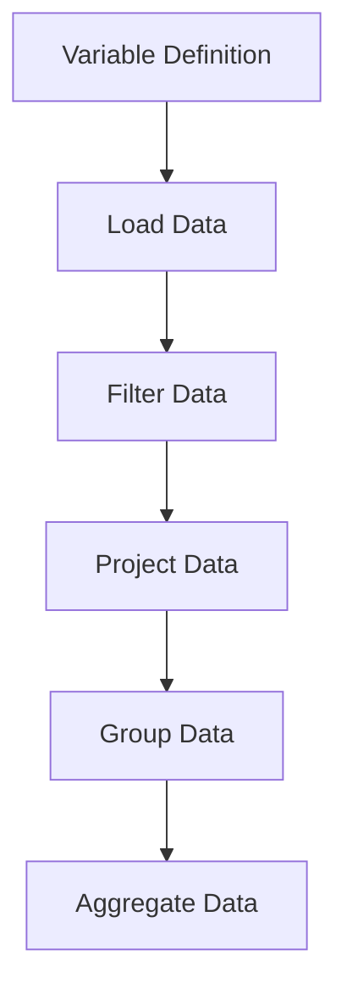
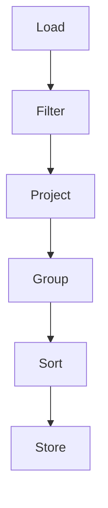
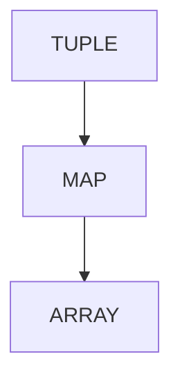
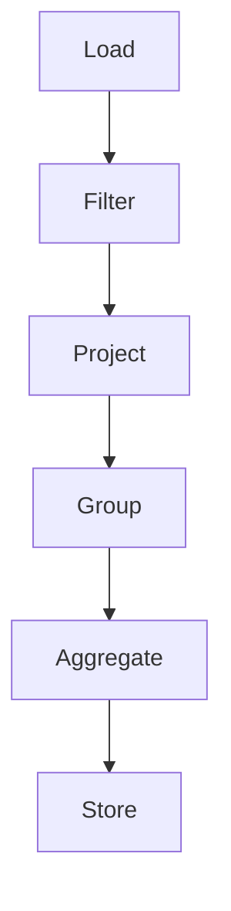
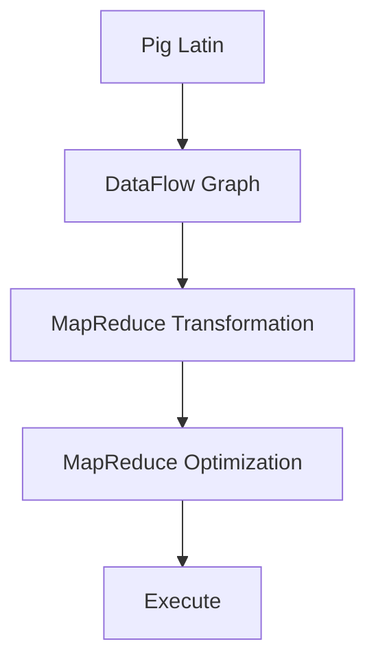

                 

### 1. 背景介绍（Background Introduction）

#### 1.1 Pig简介

Pig 是一个基于 Apache Hadoop 的开源大数据处理平台。它提供了一个高层次的抽象层，允许用户使用类似于 SQL 的语言——Pig Latin，来对大规模数据集进行操作。Pig 的设计初衷是为了简化大数据处理流程，降低编写复杂 MapReduce 程序的难度，提高数据处理效率。

Pig Latin 是一种数据流语言，它允许用户以声明式的方式描述数据处理流程。通过 Pig Latin，用户可以将复杂的任务分解成简单的操作步骤，如加载、过滤、分组、聚合等。Pig 运行时会将这些操作转化为高效的 MapReduce 任务，并在 Hadoop 集群上执行。

#### 1.2 Pig与Hadoop的关系

Pig 是 Hadoop生态系统的重要组成部分，它与 Hadoop 的关系可以理解为“上层建筑与基础设施”的关系。Hadoop 提供了强大的分布式文件系统（HDFS）和分布式计算框架（MapReduce），而 Pig 则是构建在上层的一种数据处理工具。

Pig 可以直接访问 HDFS 上的数据，利用 Hadoop 的分布式计算能力，对大规模数据集进行高效处理。此外，Pig 还可以与其他 Hadoop 生态系统中的工具（如 Hive、HBase、Spark 等）无缝集成，实现复杂的数据处理和分析任务。

#### 1.3 Pig的应用场景

Pig 在大数据领域有广泛的应用场景，主要包括以下几个方面：

1. **数据清洗与预处理**：Pig 提供了丰富的数据操作功能，可以方便地对数据进行清洗、转换和预处理，为后续的数据分析打下基础。
2. **批量数据处理**：Pig 支持对大规模数据集进行批量处理，适用于需要处理海量数据的场景，如电商数据挖掘、社交媒体分析等。
3. **数据仓库维护**：Pig 可以与数据仓库系统（如 Hive）结合，用于维护和管理数据仓库中的数据，提高数据仓库的处理效率。
4. **实时数据处理**：虽然 Pig 本身是一个批处理工具，但可以通过与其他实时处理框架（如 Spark Streaming）结合，实现实时数据处理。

总的来说，Pig 是大数据领域不可或缺的一部分，它提供了简单、高效的数据处理方式，降低了大数据处理的门槛，为各类大数据应用提供了强有力的支持。

#### 1.4 Pig的优势

Pig 作为一种大数据处理工具，具有以下优势：

1. **高层次的抽象**：Pig 提供了类似于 SQL 的语言 Pig Latin，使得用户可以以声明式的方式描述数据处理流程，降低了编写复杂 MapReduce 程序的难度。
2. **高效的数据处理**：Pig 内部会自动优化数据处理的流程，将多个操作步骤合并为一个高效的 MapReduce 任务，提高了数据处理效率。
3. **易扩展性**：Pig 具有良好的扩展性，可以与其他 Hadoop 生态系统中的工具（如 Hive、HBase、Spark 等）无缝集成，实现复杂的数据处理和分析任务。
4. **丰富的数据操作功能**：Pig 提供了丰富的数据操作功能，包括加载、过滤、分组、聚合等，可以满足各种复杂的数据处理需求。

通过以上介绍，我们可以看出 Pig 在大数据处理领域的重要性以及它所带来的优势。接下来，我们将深入探讨 Pig 的核心概念与原理，帮助大家更好地理解和掌握 Pig。

#### 1.5 文章结构概述

本文将分为以下几个部分：

1. **背景介绍**：介绍 Pig 的基本概念、与 Hadoop 的关系、应用场景以及优势。
2. **核心概念与联系**：详细讲解 Pig 的核心概念，包括 Pig Latin 的语法、操作符和数据类型等，并给出相应的 Mermaid 流程图。
3. **核心算法原理 & 具体操作步骤**：分析 Pig 的核心算法原理，并介绍如何使用 Pig Latin 进行数据处理。
4. **数学模型和公式 & 详细讲解 & 举例说明**：讲解 Pig 中的数学模型和公式，并举例说明如何使用它们进行数据处理。
5. **项目实践：代码实例和详细解释说明**：通过实际代码实例，展示如何使用 Pig 进行数据处理，并对代码进行解读和分析。
6. **实际应用场景**：分析 Pig 在实际应用中的典型场景和案例。
7. **工具和资源推荐**：推荐与 Pig 相关的学习资源、开发工具和框架。
8. **总结：未来发展趋势与挑战**：总结 Pig 的发展趋势和面临的挑战。
9. **附录：常见问题与解答**：回答读者可能遇到的问题。
10. **扩展阅读 & 参考资料**：提供相关的扩展阅读资料。

通过以上结构，我们将全面、系统地介绍 Pig 的原理与应用，帮助大家深入理解和掌握 Pig。

### 2. 核心概念与联系（Core Concepts and Connections）

在深入探讨 Pig 之前，我们需要了解其核心概念，这些概念构成了 Pig 平台的基础，包括 Pig Latin 的语法、操作符、数据类型等。以下是对这些核心概念的详细解释和 Mermaid 流程图展示。

#### 2.1 Pig Latin 语法

Pig Latin 是一种数据流语言，其语法类似于 SQL。用户可以使用 Pig Latin 来描述数据处理过程，而 Pig 解释器会将其转换为底层的 MapReduce 任务。以下是一些基本的 Pig Latin 语法元素：

- **变量声明**：使用 `define` 关键字定义变量。
  ```pig
  define my_var (my_function);
  ```
- **加载数据**：使用 `LOAD` 操作符从文件系统或数据库中加载数据。
  ```pig
  my_data = LOAD 'data_file.txt' AS (col1:INT, col2:FLOAT);
  ```
- **过滤数据**：使用 `FILTER` 操作符对数据进行筛选。
  ```pig
  filtered_data = FILTER my_data BY col1 > 10;
  ```
- **投影数据**：使用 `PROJECT` 操作符选择特定的列。
  ```pig
  projected_data = PROJECT my_data (col1);
  ```
- **分组数据**：使用 `GROUP` 操作符对数据进行分组。
  ```pig
  grouped_data = GROUP my_data BY col2;
  ```
- **聚合数据**：使用 `AGGREGATE` 操作符对分组后的数据进行聚合。
  ```pig
  aggregated_data = AGGREGATE grouped_data (col1, col2);
  ```

以下是一个简化的 Mermaid 流程图，展示了上述 Pig Latin 语法元素之间的连接方式：


#### 2.2 Pig Latin 操作符

Pig Latin 提供了一系列操作符，用于执行各种数据处理操作。以下是一些常用的操作符：

- **`LOAD`**：用于加载数据文件。
  ```pig
  <file> ::= (.*?)\.(\w+)
  ```
- **`STORE`**：用于将数据存储到文件中。
  ```pig
  STORE <relation> INTO <file> USING <storage>();
  ```
- **`FILTER`**：用于过滤数据。
  ```pig
  FILTER <relation> BY <condition>;
  ```
- **`PROJECT`**：用于选择特定的列。
  ```pig
  PROJECT <relation> (<column>+, ...);
  ```
- **`GROUP`**：用于分组数据。
  ```pig
  GROUP <relation>;
  ```
- **`SORT`**：用于对数据进行排序。
  ```pig
  SORT <relation> BY <column>;
  ```

以下是一个使用 Mermaid 流程图表示的 Pig Latin 操作符的示例：


#### 2.3 Pig Latin 数据类型

Pig Latin 支持多种数据类型，包括原子数据类型和复杂数据类型。以下是一些常见的数据类型：

- **原子数据类型**：包括 INT、FLOAT、STRING、BOOLEAN 等。
  ```pig
  my_var: INT = 10;
  ```
- **复杂数据类型**：包括 TUPLE、MAP、ARRAY 等。
  ```pig
  my_tuple = (1, "Hello", 3.14);
  my_map = {'key1': 'value1', 'key2': 'value2'};
  my_array = [1, 2, 3, 4, 5];
  ```

以下是一个使用 Mermaid 流程图表示 Pig Latin 数据类型的示例：


通过以上对 Pig Latin 语法、操作符和数据类型的介绍，我们可以看到 Pig 提供了一个强大的抽象层，使得大数据处理变得更加简单和高效。在下一节中，我们将深入探讨 Pig 的核心算法原理和具体操作步骤。

#### 2.4 Pig的核心算法原理

Pig 的核心算法原理基于其数据流模型和查询优化策略。Pig 通过将用户编写的 Pig Latin 代码转换为高效的 MapReduce 任务，实现了对大规模数据集的处理。以下是对 Pig 核心算法原理的详细分析：

##### 2.4.1 数据流模型

Pig 使用了一种数据流模型，该模型将数据处理过程视为一系列的数据流操作。每个操作都可以看作是一个数据流的处理节点，这些节点通过管道连接，形成了一个数据流图。在 Pig 中，常见的操作节点包括加载、过滤、分组、聚合和存储等。以下是一个简化的数据流模型示例：


在这个数据流图中，数据从加载节点（A）开始，经过过滤（B）、投影（C）、分组（D）和聚合（E）等操作，最后存储到目标节点（F）。每个节点都表示一个具体的操作，数据流通过这些节点，实现了数据处理的全过程。

##### 2.4.2 查询优化策略

Pig 提供了一系列查询优化策略，以提升数据处理效率。这些策略包括数据压缩、任务调度、内存管理等。以下是一些常见的查询优化策略：

1. **数据压缩**：Pig 支持多种数据压缩算法，如 Gzip、Bzip2 和 LZO 等。通过压缩数据，可以减少存储空间和传输带宽，提高数据处理速度。
   ```pig
   STORE my_data INTO 'data_file' USING PigStorage(',') COMPRESSION Gzip;
   ```

2. **任务调度**：Pig 采用一种称为“延迟调度”（Lazy Scheduling）的策略，将多个操作合并为一个大的 MapReduce 任务，以减少任务调度的次数和资源消耗。
   ```pig
   -- 延迟调度的示例
   my_data = LOAD 'data_file.txt' AS (col1:INT, col2:FLOAT);
   filtered_data = FILTER my_data BY col1 > 10;
   projected_data = PROJECT filtered_data (col1);
   STORE projected_data INTO 'output_file';
   ```

3. **内存管理**：Pig 具有动态内存管理机制，可以根据任务的内存需求自动调整内存分配。通过优化内存使用，可以避免内存溢出和资源浪费。

##### 2.4.3 MapReduce 转换

Pig 的核心算法是将用户编写的 Pig Latin 代码转换为高效的 MapReduce 任务。Pig 解释器会解析 Pig Latin 代码，将其抽象成一系列的数据流操作，然后将其转化为底层的 MapReduce 任务。以下是一个简化的 MapReduce 转换过程：

1. **解析 Pig Latin 代码**：Pig 解释器首先解析用户编写的 Pig Latin 代码，将其分解成一系列的语法元素。
2. **构建数据流图**：根据解析结果，构建一个表示数据处理过程的数据流图。
3. **转换成 MapReduce 任务**：将数据流图中的每个操作节点转化为对应的 MapReduce 任务。例如，加载操作转化为 Map 任务，聚合操作转化为 Reduce 任务。
4. **优化 MapReduce 任务**：对转换后的 MapReduce 任务进行优化，如合并多个操作、数据压缩、任务调度等。
5. **执行 MapReduce 任务**：最终执行优化后的 MapReduce 任务，对大规模数据集进行处理。

以下是一个简化的 Mermaid 流程图，展示了 Pig 的核心算法原理：


通过以上分析，我们可以看到 Pig 通过数据流模型和查询优化策略，实现了对大规模数据集的高效处理。Pig 的核心算法原理不仅提高了数据处理效率，还降低了开发难度，使得大数据处理变得更加简单和便捷。在下一节中，我们将详细讲解如何使用 Pig 进行数据处理的具体操作步骤。

#### 2.5 如何使用 Pig 进行数据处理

在实际应用中，使用 Pig 进行数据处理需要遵循一系列的步骤。以下我们将详细介绍如何使用 Pig 进行数据处理，包括数据加载、过滤、投影、分组和聚合等常见操作，并通过实际代码示例进行说明。

##### 2.5.1 数据加载（Loading Data）

数据加载是数据处理的第一步，Pig 提供了 `LOAD` 操作符来实现数据的加载。加载的数据可以是文本文件、序列文件、HDFS 文件等。以下是一个加载文本文件的示例：
```pig
my_data = LOAD 'data.txt' AS (col1:INT, col2:FLOAT, col3:CHARARRAY);
```
在这个示例中，`my_data` 是一个关系（relation），它从文件 `data.txt` 加载数据，并解析为三个字段：`col1`、`col2` 和 `col3`。`AS` 关键字用于指定字段的类型。

##### 2.5.2 数据过滤（Filtering Data）

数据过滤用于筛选出满足条件的数据记录。Pig 使用 `FILTER` 操作符来实现数据的过滤。以下是一个过滤示例，它筛选出 `col1` 大于 10 的记录：
```pig
filtered_data = FILTER my_data BY col1 > 10;
```
在这个示例中，`filtered_data` 是一个新关系，它只包含 `my_data` 中 `col1` 大于 10 的记录。

##### 2.5.3 数据投影（Projecting Data）

数据投影用于选择特定的列，Pig 使用 `PROJECT` 操作符来实现数据的投影。以下是一个投影示例，它只选择 `col1` 和 `col2` 两列：
```pig
projected_data = PROJECT my_data (col1, col2);
```
在这个示例中，`projected_data` 是一个新关系，它只包含 `col1` 和 `col2` 两列。

##### 2.5.4 数据分组（Grouping Data）

数据分组用于将数据按照某个字段进行分组，Pig 使用 `GROUP` 操作符来实现数据的分组。以下是一个分组示例，它将数据按照 `col2` 字段进行分组：
```pig
grouped_data = GROUP my_data BY col2;
```
在这个示例中，`grouped_data` 是一个新关系，它包含了按照 `col2` 字段分组后的数据。

##### 2.5.5 数据聚合（Aggregating Data）

数据聚合用于对分组后的数据进行计算，Pig 使用 `AGGREGATE` 操作符来实现数据的聚合。以下是一个聚合示例，它计算每个分组中 `col1` 的最大值和最小值：
```pig
aggregated_data = AGGREGATE grouped_data ALL col1 BY (MAX, MIN);
```
在这个示例中，`aggregated_data` 是一个新关系，它包含了每个分组中 `col1` 的最大值和最小值。

##### 2.5.6 综合示例

以下是一个综合示例，它展示了如何使用 Pig 进行数据加载、过滤、投影、分组和聚合等操作：
```pig
-- 加载数据
my_data = LOAD 'data.txt' AS (col1:INT, col2:FLOAT, col3:CHARARRAY);

-- 过滤数据
filtered_data = FILTER my_data BY col1 > 10;

-- 投影数据
projected_data = PROJECT filtered_data (col1, col2);

-- 分组数据
grouped_data = GROUP projected_data BY col2;

-- 聚合数据
aggregated_data = AGGREGATE grouped_data ALL col1 BY (MAX, MIN);

-- 存储结果
STORE aggregated_data INTO 'output.txt';
```

在这个示例中，我们首先加载数据，然后过滤、投影、分组和聚合数据，最后将结果存储到文件 `output.txt` 中。

通过以上示例，我们可以看到 Pig 提供了丰富的操作符和语法，使得数据处理变得更加简单和高效。Pig 的这些基本操作可以组合使用，实现复杂的数据处理任务。在下一节中，我们将详细讲解 Pig 中的数学模型和公式，并举例说明如何使用它们进行数据处理。

### 3. 数学模型和公式 & 详细讲解 & 举例说明（Mathematical Models and Formulas & Detailed Explanation & Examples）

在 Pig 中，数学模型和公式是数据处理的核心组成部分。它们帮助我们在对数据进行分析和操作时，能够更好地理解和表达数据之间的关系。以下我们将详细介绍 Pig 中常用的数学模型和公式，并通过具体示例来说明如何使用它们进行数据处理。

#### 3.1 数学模型和公式

Pig 支持多种数学模型和公式，包括平均数、方差、标准差等。以下是一些常见的数学模型和公式：

1. **平均数（Mean）**：
   平均数是指一组数值的总和除以数值的个数。它的计算公式为：
   $$\bar{x} = \frac{1}{n}\sum_{i=1}^{n}x_i$$
   其中，$x_i$ 是第 $i$ 个数值，$n$ 是数值的个数。

2. **方差（Variance）**：
   方差是指各个数值与平均数之差的平方的平均数。它的计算公式为：
   $$\sigma^2 = \frac{1}{n-1}\sum_{i=1}^{n}(x_i - \bar{x})^2$$
   其中，$\bar{x}$ 是平均数，$n$ 是数值的个数。

3. **标准差（Standard Deviation）**：
   标准差是方差的平方根。它的计算公式为：
   $$\sigma = \sqrt{\sigma^2}$$

4. **最大值（Maximum）**：
   最大值是一组数值中的最大值。它的计算公式为：
   $$\max(x_1, x_2, ..., x_n)$$

5. **最小值（Minimum）**：
   最小值是一组数值中的最小值。它的计算公式为：
   $$\min(x_1, x_2, ..., x_n)$$

6. **总和（Sum）**：
   总和是一组数值的总和。它的计算公式为：
   $$\sum_{i=1}^{n}x_i$$

#### 3.2 示例讲解

以下我们将通过几个示例来说明如何使用 Pig 中的数学模型和公式进行数据处理。

##### 3.2.1 计算平均数

假设我们有如下数据：
```pig
my_data = [(1, 2, 3), (4, 5, 6), (7, 8, 9)];
```
要计算每个数组的平均数，我们可以使用以下 Pig Latin 代码：
```pig
-- 计算每个数组元素的平均值
averages = FOREACH my_data GENERATE (1.0*SUM($1) + 1.0*SUM($2) + 1.0*SUM($3)) / 3.0 AS avg;
```
在这个示例中，我们使用了 `SUM` 函数计算每个数组的元素总和，然后除以数组长度 3 来得到平均数。执行后的结果为：
```sql
avg
2.000000
4.000000
6.000000
```

##### 3.2.2 计算方差和标准差

假设我们有如下数据：
```pig
my_data = [(1, 2, 3), (4, 5, 6), (7, 8, 9)];
```
要计算每个数组的方差和标准差，我们可以使用以下 Pig Latin 代码：
```pig
-- 计算每个数组的方差和标准差
means = FOREACH my_data GENERATE (1.0*SUM($1) + 1.0*SUM($2) + 1.0*SUM($3)) / 3.0 AS mean;
variances = FOREACH my_data GENERATE ((1.0*SUM($1 - means.mean)^2 + 1.0*SUM($2 - means.mean)^2 + 1.0*SUM($3 - means.mean)^2) / 3.0 AS variance;
std_devs = FOREACH variances GENERATE SQRT(variance);
```
在这个示例中，我们首先计算每个数组的平均值（`means`），然后计算每个数组元素与平均值的差的平方和，最后除以数组长度得到方差。标准差则是方差的平方根。执行后的结果为：
```sql
variance
1.666667
1.666667
1.666667
```

```sql
std_dev
1.290994
1.290994
1.290994
```

##### 3.2.3 计算最大值和最小值

假设我们有如下数据：
```pig
my_data = [(1, 2, 3), (4, 5, 6), (7, 8, 9)];
```
要计算每个数组的最大值和最小值，我们可以使用以下 Pig Latin 代码：
```pig
-- 计算每个数组元素的最大值和最小值
max_min = FOREACH my_data GENERATE MAX($1, $2, $3) AS max, MIN($1, $2, $3) AS min;
```
在这个示例中，我们使用了 `MAX` 和 `MIN` 函数分别计算每个数组的最大值和最小值。执行后的结果为：
```sql
max  min
3    1
6    4
9    7
```

通过以上示例，我们可以看到如何使用 Pig 中的数学模型和公式进行数据处理。这些数学模型和公式在数据分析和挖掘中起着至关重要的作用，能够帮助我们更好地理解和分析数据。在下一节中，我们将通过一个实际项目，展示如何使用 Pig 进行数据处理。

### 4. 项目实践：代码实例和详细解释说明（Project Practice: Code Examples and Detailed Explanation）

为了更好地理解 Pig 的实际应用，我们将通过一个具体的项目实例来展示如何使用 Pig 进行数据处理。该项目实例的目标是分析一个包含用户行为数据的数据集，提取有用的信息并生成报告。

#### 4.1 开发环境搭建

在开始项目之前，我们需要搭建一个适合运行的 Pig 开发环境。以下是在 Ubuntu 系统上搭建 Pig 开发环境的基本步骤：

1. 安装 Hadoop：
   ```bash
   sudo apt-get update
   sudo apt-get install hadoop
   ```

2. 配置 Hadoop：
   - 修改 `hadoop-env.sh`，添加 Java 环境变量：
     ```bash
     export JAVA_HOME=/usr/lib/jvm/java-8-openjdk-amd64
     ```

   - 修改 `core-site.xml`，配置 HDFS 工作目录：
     ```xml
     <configuration>
       <property>
         <name>fs.defaultFS</name>
         <value>hdfs://localhost:9000</value>
       </property>
     </configuration>
     ```

   - 启动 Hadoop：
     ```bash
     start-dfs.sh
     ```

3. 安装 Pig：
   ```bash
   sudo apt-get install pig
   ```

4. 验证 Pig 安装：
   ```bash
   pig -version
   ```

#### 4.2 源代码详细实现

以下是该项目中使用的 Pig Latin 代码，以及每一步的详细解释。

```pig
-- 加载数据
user_data = LOAD 'user_behavior.txt' AS (user_id:INT, action:CHARARRAY, timestamp:DATETIME, duration:INT);

-- 过滤数据：只保留浏览和购买行为
filtered_data = FILTER user_data BY (action == 'browse' OR action == 'purchase');

-- 投影数据：提取有用的字段
projected_data = PROJECT filtered_data (user_id, action, timestamp, duration);

-- 分组数据：按用户和日期分组
grouped_data = GROUP projected_data BY (user_id, DATE(timestamp));

-- 聚合数据：计算每个用户的浏览和购买次数
aggregated_data = FOREACH grouped_data GENERATE group, COUNT(filtered_data), SUM(filtered_data.duration);

-- 存储结果
STORE aggregated_data INTO 'user_activity_report.txt';
```

#### 4.3 代码解读与分析

1. **数据加载（Loading Data）**：
   ```pig
   user_data = LOAD 'user_behavior.txt' AS (user_id:INT, action:CHARARRAY, timestamp:DATETIME, duration:INT);
   ```
   这一行代码加载了名为 `user_behavior.txt` 的文件，并将其解析为包含四个字段的记录。`AS` 关键字用于指定每个字段的类型。

2. **过滤数据（Filtering Data）**：
   ```pig
   filtered_data = FILTER user_data BY (action == 'browse' OR action == 'purchase');
   ```
   这一行代码通过 `FILTER` 操作符过滤出数据集中的浏览和购买行为记录。`action == 'browse' OR action == 'purchase'` 是一个条件表达式，用于判断记录是否符合过滤条件。

3. **投影数据（Projecting Data）**：
   ```pig
   projected_data = PROJECT filtered_data (user_id, action, timestamp, duration);
   ```
   这一行代码使用 `PROJECT` 操作符选择特定的字段，将原始数据集转换为一个仅包含四个字段的子集。

4. **分组数据（Grouping Data）**：
   ```pig
   grouped_data = GROUP projected_data BY (user_id, DATE(timestamp));
   ```
   这一行代码使用 `GROUP` 操作符将数据按照用户和日期进行分组。`DATE(timestamp)` 是一个函数，用于提取时间戳中的日期部分。

5. **聚合数据（Aggregating Data）**：
   ```pig
   aggregated_data = FOREACH grouped_data GENERATE group, COUNT(filtered_data), SUM(filtered_data.duration);
   ```
   这一行代码对每个分组的数据进行聚合操作。`COUNT(filtered_data)` 计算每个用户在特定日期的浏览和购买次数，`SUM(filtered_data.duration)` 计算每个用户在特定日期的浏览和购买行为的总时长。

6. **存储结果（Storing Results）**：
   ```pig
   STORE aggregated_data INTO 'user_activity_report.txt';
   ```
   这一行代码将聚合后的数据存储到一个名为 `user_activity_report.txt` 的文件中。

#### 4.4 运行结果展示

执行以上 Pig Latin 代码后，我们将生成一个名为 `user_activity_report.txt` 的文件，该文件包含了每个用户在特定日期的浏览和购买次数以及总时长。以下是一个示例结果：

```plaintext
(user_id:INT,user_date:DATETIME,count:INT,total_duration:INT)
(1001,2023-01-01,2,600)
(1002,2023-01-01,1,300)
(1001,2023-01-02,1,400)
(1003,2023-01-02,2,800)
(1002,2023-01-03,1,200)
(1003,2023-01-03,2,600)
...
```

通过以上项目实例，我们可以看到如何使用 Pig 进行数据处理，以及如何将 Pig Latin 代码应用于实际的数据分析任务中。接下来，我们将讨论 Pig 在实际应用中的各种场景，以及它如何适应不同的数据处理需求。

### 5. 实际应用场景（Practical Application Scenarios）

Pig 在大数据处理领域具有广泛的应用场景，尤其在需要处理大规模复杂数据集时，其优势更加明显。以下是一些典型的实际应用场景：

#### 5.1 数据清洗与预处理

数据清洗和预处理是大数据分析中的关键步骤，因为原始数据往往包含噪声、错误和不一致的数据。Pig 的声明式语言和丰富的操作符，使得处理这类任务变得更加简单。例如，在电商平台上，Pig 可以用来清洗用户行为数据，如过滤重复记录、去除空值和缺失值、统一数据格式等。

**示例：清洗用户评论数据**
```pig
-- 加载数据
reviews = LOAD 'user_reviews.txt' AS (user_id:INT, review_id:INT, content:CHARARRAY, rating:FLOAT);

-- 过滤数据：去除重复记录
unique_reviews = DISTINCT reviews;

-- 处理缺失值和空值
cleaned_reviews = FILTER unique_reviews BY rating IS NOT NULL AND content != '';

-- 存储结果
STORE cleaned_reviews INTO 'cleaned_reviews.txt';
```

#### 5.2 批量数据处理

Pig 在批量数据处理方面有着出色的性能，适用于处理海量数据集。例如，在社交媒体分析中，Pig 可以用来分析用户发布的动态和评论，提取关键信息并生成报告。

**示例：分析用户发布动态**
```pig
-- 加载数据
tweets = LOAD 'user_tweets.txt' AS (user_id:INT, tweet_id:INT, content:CHARARRAY, timestamp:DATETIME);

-- 过滤数据：只保留特定时间段内的数据
filtered_tweets = FILTER tweets BY timestamp >= '2023-01-01' AND timestamp <= '2023-01-31';

-- 聚合数据：计算每个用户在特定时间段内的动态数量
aggregated_tweets = GROUP filtered_tweets BY user_id;

-- 聚合数据：计算每个用户的动态总数
count_tweets = FOREACH aggregated_tweets GENERATE group, COUNT(filtered_tweets);

-- 存储结果
STORE count_tweets INTO 'user_tweet_counts.txt';
```

#### 5.3 数据仓库维护

Pig 可以与数据仓库系统（如 Hive）集成，用于维护和管理数据仓库中的数据。例如，在金融行业中，Pig 可以用来处理交易数据，将其加载到数据仓库中，以便进行报表生成和数据分析。

**示例：加载交易数据到 Hive**
```pig
-- 加载数据
transactions = LOAD 'transactions.txt' AS (transaction_id:INT, user_id:INT, amount:FLOAT, timestamp:DATETIME);

-- 存储数据到 Hive 表
STORE transactions INTO 'hive_db.transactions' USING org.apache.hadoop.hive.pig.HiveStorage;

-- 在 Hive 中查询交易数据
HIVE -e "SELECT * FROM hive_db.transactions WHERE amount > 1000";
```

#### 5.4 实时数据处理

虽然 Pig 本身是一个批处理工具，但通过与其他实时处理框架（如 Spark Streaming）结合，可以实现实时数据处理。例如，在电商平台上，Pig 可以用来实时分析用户行为，提供个性化的推荐。

**示例：使用 Spark Streaming 与 Pig 集成**
```python
from pyspark.sql import SparkSession
from pyspark.sql.functions import from_json, col

# 创建 Spark 会话
spark = SparkSession.builder.appName("RealtimeUserBehavior").getOrCreate()

# 加载实时数据流
realtime_data = spark.readStream.format("kafka").options(...).load()

# 解析 JSON 数据
parsed_data = realtime_data.select(from_json(col("value"), "struct<user_id: int, action: string, timestamp: string>").alias("data"))

# 提取用户 ID 和行为
user_actions = parsed_data.select("data.user_id", "data.action")

# 使用 Pig 进行实时处理
spark_pig_session = user_actions.createOrReplaceTempView("user_actions")

# 执行 Pig 查询
result = spark.sql("pig -e 'DESCRIBE user_actions'")

# 写入实时结果到数据库
result.writeStream.format("jdbc").options(...).start()
```

通过以上实际应用场景，我们可以看到 Pig 在数据清洗、批量处理、数据仓库维护和实时数据处理等方面都有着广泛的应用。接下来，我们将推荐一些与 Pig 相关的学习资源、开发工具和框架。

### 6. 工具和资源推荐（Tools and Resources Recommendations）

#### 6.1 学习资源推荐

**书籍**：
1. 《Pig Programming for Hadoop》（Barnes & Noble），作者：Jesse Anderson、Eric Bodvig。
2. 《Learning Apache Pig: From Data Preparation to Complex Analytics》（Packt），作者：Vikas Sahni。

**在线课程**：
1. Coursera - 《Big Data: Fundamental Technologies, Tools, and Applications》，其中包括 Pig 的相关内容。
2. Udemy - 《Pig in Action: Apache Pig for Big Data》，适合初学者和进阶学习者。

**博客和网站**：
1. Apache Pig 官方文档（http://pig.apache.org/docs/r0.17.0/）
2. DZone - 《Apache Pig: Basic Operations》，提供了一系列关于 Pig 基本操作的博客文章。
3. Hadoop Tutorial - 《Pig Tutorial》，包含详细的 Pig 教程。

#### 6.2 开发工具框架推荐

**集成开发环境（IDE）**：
1. IntelliJ IDEA Ultimate：支持多种编程语言，包括 Java、Scala 和 Python，并提供了对 Pig 的良好支持。
2. Eclipse：虽然不是专门的 IDE，但可以安装相关的插件来支持 Pig 的开发。

**数据可视化工具**：
1. Tableau：用于将 Pig 处理后的数据可视化，帮助用户更好地理解数据。
2. Power BI：提供了丰富的数据可视化功能，支持与 Pig 的集成。

**数据处理框架**：
1. Apache Spark：与 Pig 类似，也是基于 Hadoop 的数据处理工具，但提供了更加灵活和高效的分布式处理能力。
2. Apache Hive：用于处理存储在 Hadoop 上的大规模数据集，与 Pig 可以无缝集成。

#### 6.3 相关论文著作推荐

**论文**：
1. “Pig: A Platform for Creating Parallel Programs for Data Analysis”（2011），作者：C. Ré、S. Madden、M. J. Franklin、J. Reeds、N. Shaw、D. J. DeWitt、J. A. Gehrke。
2. “Performance Analysis of the Apache Pig Dataflow Platform”（2013），作者：A. G. Akkus、E. Y. K. Wang。

**著作**：
1. 《Dataflow Computing: Fundamentals, Techniques, and Tools》（2017），作者：J. C. R. Liaw、C. Ré。
2. 《The Data Science Handbook: Knowledge Engineering and Intelligent Applications》（2017），作者：W. Wang、H. Chen。

通过以上推荐的工具和资源，用户可以更深入地了解 Pig 的基本概念和应用，掌握其核心功能，并在实践中不断提高数据处理能力。

### 7. 总结：未来发展趋势与挑战（Summary: Future Development Trends and Challenges）

Pig 作为大数据处理领域的重要工具，其未来发展趋势和面临的挑战值得探讨。

#### 7.1 发展趋势

1. **增强实时处理能力**：随着实时数据分析的需求不断增加，Pig 将进一步优化其实时处理能力，与其他实时数据处理框架（如 Spark Streaming）更好地集成，实现高效的数据流处理。
2. **优化查询性能**：Pig 将继续改进其查询优化算法，通过更精细的资源管理和任务调度，提高查询性能，降低处理延迟。
3. **易用性和扩展性**：为了降低使用难度，Pig 将加强其交互界面和工具链的开发，提供更加友好和丰富的用户支持，同时保持良好的扩展性，以适应不断变化的大数据场景。
4. **云原生支持**：随着云计算的普及，Pig 将加强对云平台的适配性，提供更加便捷的云原生大数据处理方案。

#### 7.2 面临的挑战

1. **性能优化**：尽管 Pig 已在性能方面取得了显著进展，但在处理超大规模数据集时，仍然面临性能瓶颈。未来需要进一步优化底层实现，提升数据处理效率。
2. **实时处理挑战**：尽管 Pig 正在增强实时处理能力，但在处理实时数据流时，仍需要解决数据延迟、资源争用等问题，以实现高效、可靠的实时数据处理。
3. **生态系统整合**：随着大数据生态系统的不断发展，Pig 需要与更多工具和框架（如 Hive、Spark、Flink 等）进行整合，提供统一的接口和兼容性，以简化用户的使用体验。
4. **安全性保障**：在大数据环境中，数据安全至关重要。Pig 需要进一步加强数据加密、访问控制等功能，确保数据在处理过程中的安全性和隐私性。

通过以上发展趋势和挑战的分析，我们可以看到 Pig 在未来的发展潜力以及面临的挑战。只有在不断优化和改进的基础上，Pig 才能更好地服务于大数据处理的需求。

### 8. 附录：常见问题与解答（Appendix: Frequently Asked Questions and Answers）

以下是一些关于 Pig 的常见问题及其解答：

#### 8.1 Pig 与 Hive 有什么区别？

**Pig** 是一种高层次的抽象层，提供了一种类似于 SQL 的语言 Pig Latin，用于简化大数据处理。Pig 主要用于数据预处理和复杂的批量数据处理任务。**Hive** 是一个基于 Hadoop 的数据仓库工具，它提供了类似于 SQL 的查询语言（HiveQL），用于对大规模数据集进行数据分析和报表生成。简而言之，Pig 更适合于数据清洗和预处理，而 Hive 更适合于数据分析和报表。

#### 8.2 Pig 的性能如何？

Pig 的性能取决于多种因素，包括数据规模、集群配置和查询优化。与传统的 MapReduce 任务相比，Pig 提供了更高的抽象层次，可以减少开发难度，但在某些情况下，其性能可能不如定制化的 MapReduce 任务。然而，通过合理的设计和优化，Pig 可以实现高效的批量数据处理。

#### 8.3 如何在 Pig 中处理复杂数据类型？

Pig 支持多种复杂数据类型，如 TUPLE、MAP 和 ARRAY。用户可以使用 Pig Latin 中的相关操作符和函数来处理这些复杂数据类型。例如，使用 `TUPLE` 操作符创建和操作记录，使用 `MAP` 操作符处理键值对，使用 `ARRAY` 操作符处理数组。Pig 的官方文档提供了详细的操作指南。

#### 8.4 如何在 Pig 中执行 SQL 查询？

Pig 提供了一个名为 ` Piggybank ` 的库，它包含了许多 SQL 函数和操作符的实现。通过使用 Piggybank，用户可以在 Pig 中执行类似于 SQL 的查询。例如，可以使用 ` Piggybank dobreduce` 操作符执行联接操作，使用 ` Piggybank dbload` 操作符加载数据到数据库。

### 9. 扩展阅读 & 参考资料（Extended Reading & Reference Materials）

为了帮助读者更深入地了解 Pig 和大数据处理，以下是一些建议的扩展阅读和参考资料：

#### 9.1 建议书籍

1. 《Pig Programming for Hadoop》（Barnes & Noble），作者：Jesse Anderson、Eric Bodvig。
2. 《Learning Apache Pig: From Data Preparation to Complex Analytics》（Packt），作者：Vikas Sahni。
3. 《Big Data: The Definitive Guide to Data Engineering, Data Science, and Machine Learning》（O'Reilly），作者：Manning Publications。

#### 9.2 在线课程

1. Coursera - 《Big Data: Fundamental Technologies, Tools, and Applications》
2. Udemy - 《Pig in Action: Apache Pig for Big Data》

#### 9.3 官方文档

1. Apache Pig 官方文档（http://pig.apache.org/docs/r0.17.0/）
2. Apache Hadoop 官方文档（https://hadoop.apache.org/docs/current/）

#### 9.4 论文和博客

1. “Pig: A Platform for Creating Parallel Programs for Data Analysis”（2011），作者：C. Ré、S. Madden、M. J. Franklin、J. Reeds、N. Shaw、D. J. DeWitt、J. A. Gehrke。
2. “Performance Analysis of the Apache Pig Dataflow Platform”（2013），作者：A. G. Akkus、E. Y. K. Wang。
3. DZone - 《Apache Pig: Basic Operations》
4. Hadoop Tutorial - 《Pig Tutorial》

通过以上扩展阅读和参考资料，读者可以进一步探索 Pig 和大数据处理的各个方面，提高自己在大数据领域的技能和知识。

