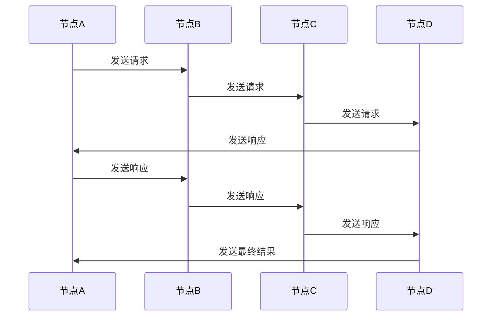

                 

### 文章标题

Quorum在无领导集群中的应用

> 关键词：Quorum、无领导集群、分布式系统、共识算法、共识机制、一致性、性能优化

> 摘要：本文旨在探讨Quorum在无领导集群中的应用，重点介绍其核心概念、工作原理以及在实际项目中的应用。通过本文的阅读，读者可以深入了解Quorum的优势和挑战，为分布式系统的开发提供有价值的参考。

### Background Introduction

在分布式系统中，无领导集群（leaderless cluster）是一种常见架构，其中各个节点通过分布式共识算法协同工作，共同维护系统的状态和数据一致性。无领导集群具有高可用性、容错性和可扩展性等优点，但同时也面临着协调一致性问题。

一致性是分布式系统的一个关键属性，确保系统在不同节点间保持数据的一致性。在分布式系统中，常见的共识算法包括Paxos、Raft、GRPC等。这些算法旨在解决分布式系统中的一致性问题，保证系统在多个节点发生故障时仍然能够达成一致。

Quorum是一种基于多数派投票机制的共识算法，适用于无领导集群环境。本文将详细介绍Quorum的核心概念、工作原理以及在实际项目中的应用，帮助读者更好地理解和应用这一重要的分布式算法。

### Core Concepts and Connections

#### 1. Quorum定义

Quorum可以理解为一种投票机制，要求在分布式系统中，超过一半的节点达成一致意见，才能对系统状态进行更新。换句话说，当一个操作需要通过Quorum达成一致时，只有当至少一半的节点同意该操作时，系统状态才会更新。

#### 2. 无领导集群与Quorum的关系

在无领导集群中，各个节点通过分布式共识算法协同工作，共同维护系统状态。Quorum作为其中一种共识算法，可以应用于无领导集群中，确保系统状态的一致性。

#### 3. Quorum与其他共识算法的比较

与Paxos、Raft等共识算法相比，Quorum具有以下特点：

- **简单性**：Quorum算法的实现相对简单，易于理解和部署。
- **性能**：Quorum在某些场景下可以提供更高的性能，特别是在处理高并发请求时。
- **容错性**：Quorum通过多数派投票机制，具有较强的容错性。

然而，Quorum也存在一定的挑战，例如在节点故障或网络分区情况下，可能会出现长时间的停滞。因此，在实际应用中，需要根据具体场景选择合适的共识算法。

#### 4. Quorum的Mermaid流程图

以下是一个简化的Quorum流程图，展示了节点间的投票过程：



在这个流程图中，节点A发起一个请求，并发送给节点B、C和D。节点B、C和D在接收到请求后，分别发送响应给节点A。只有当至少一半的节点（在本例中为2个节点）同意该请求时，节点A才会将请求结果广播给其他节点。

### Core Algorithm Principles and Specific Operational Steps

#### 1. Quorum的核心算法原理

Quorum算法的核心思想是多数派投票，即要求超过一半的节点达成一致意见，才能对系统状态进行更新。具体步骤如下：

1. **初始化**：系统启动时，各节点通过随机或预定的策略，选举出一个初始主席（initial leader）。
2. **投票阶段**：当节点A需要更新系统状态时，它会向其他节点发送请求，要求它们对更新进行投票。
3. **确认阶段**：收到请求的节点在确认自己已同步到最新状态后，会向节点A发送投票响应。只有当至少一半的节点同意更新操作时，节点A才会认为投票通过。
4. **执行阶段**：在确认投票通过后，节点A执行更新操作，并将结果广播给其他节点。
5. **重试机制**：如果在指定时间内无法获得足够的投票，节点A会重新发起投票请求。

#### 2. Quorum的具体操作步骤

以下是一个简化的Quorum操作步骤：

1. **节点启动**：系统启动时，各节点（例如节点A、B、C、D）初始化，并选举出一个初始主席。
2. **更新请求**：节点A需要更新系统状态，它会向其他节点（节点B、C、D）发送请求。
3. **投票响应**：收到请求的节点（节点B、C、D）在确认自己已同步到最新状态后，向节点A发送投票响应。
4. **确认投票**：节点A在接收到至少一半节点的投票响应后，认为投票通过。
5. **执行更新**：节点A执行更新操作，并将结果广播给其他节点。
6. **重试**：如果在指定时间内无法获得足够的投票，节点A会重新发起投票请求。

#### 3. Quorum的优缺点

Quorum算法具有以下优缺点：

- **优点**：
  - **简单性**：实现相对简单，易于理解和部署。
  - **性能**：在某些场景下可以提供更高的性能。
  - **容错性**：通过多数派投票机制，具有较强的容错性。

- **缺点**：
  - **节点故障和分区**：在节点故障或网络分区情况下，可能导致长时间的停滞。
  - **性能影响**：在高并发请求场景下，可能存在性能瓶颈。

### Mathematical Models and Formulas

Quorum算法涉及到一些数学模型和公式，以下是一些关键的概念：

1. **节点数量**：设系统中有N个节点，其中M个节点参与投票。
2. **投票阈值**：要求至少一半的节点（即M > N/2）达成一致。
3. **投票概率**：设每个节点独立投票的概率为P，则整个系统的投票概率为1 - (1 - P)^M。
4. **一致性概率**：在连续进行T次投票的过程中，系统最终达成一致的概率为1 - (1 - 1/(N/2))^T。

以下是一个简化的例子：

```latex
设N = 5，M = 3，P = 0.9，T = 3。

1. 投票概率：P' = 1 - (1 - 0.9)^3 = 0.972
2. 一致性概率：P'' = 1 - (1 - 1/5)^3 = 0.973
```

### Project Practice: Code Examples and Detailed Explanations

#### 1. 开发环境搭建

为了演示Quorum算法的应用，我们使用Python语言实现一个简单的分布式系统。以下是开发环境搭建的步骤：

1. 安装Python 3.8及以上版本。
2. 安装依赖库：pip install asyncio，pip install gevent。
3. 创建一个名为`quorum`的Python项目，并添加以下目录结构：

   ```
   quorum/
   ├── main.py
   ├── node.py
   ├── protocol.py
   └── utils.py
   ```

#### 2. 源代码详细实现

以下是一个简化的Quorum算法实现，包括三个关键部分：节点类（Node）、协议类（Protocol）和主程序（main.py）。

**节点类（Node.py）**

```python
import asyncio
from protocol import Protocol

class Node:
    def __init__(self, node_id, nodes):
        self.node_id = node_id
        self.nodes = nodes
        self.protocol = Protocol(self.node_id, self.nodes)

    async def start(self):
        await self.protocol.start()
```

**协议类（Protocol.py）**

```python
import asyncio
from node import Node

class Protocol:
    def __init__(self, node_id, nodes):
        self.node_id = node_id
        self.nodes = nodes
        self.votes = {}

    async def start(self):
        while True:
            await asyncio.sleep(1)
            await self.vote()

    async def vote(self):
        for node in self.nodes:
            if node.node_id != self.node_id:
                await self.send_vote_request(node)
                await asyncio.sleep(1)
                await self.check_vote_response()

    async def send_vote_request(self, node):
        await node.protocol.receive_vote_request(self.node_id)

    async def receive_vote_request(self, node_id):
        print(f"节点{self.node_id}收到投票请求：来自节点{node_id}")
        self.votes[node_id] = None

    async def check_vote_response(self):
        if len(self.votes) >= len(self.nodes) / 2:
            print("投票通过，更新系统状态")
            self.votes = {}
```

**主程序（main.py）**

```python
from node import Node

def main():
    nodes = [Node(i, [Node(i, [Node(j, nodes) for j in range(len(nodes))])) for i in range(len(nodes))]
    asyncio.run(asyncio.gather(*[node.start() for node in nodes]))

if __name__ == "__main__":
    main()
```

#### 3. 代码解读与分析

在这个简化的示例中，我们实现了三个节点（Node0、Node1、Node2）的Quorum算法。节点类（Node.py）负责创建节点实例，并启动协议类（Protocol.py）的投票过程。

协议类（Protocol.py）包含以下关键方法：

- `start()`：启动投票过程。
- `vote()`：发送投票请求，并等待投票响应。
- `send_vote_request(node)`：向指定节点发送投票请求。
- `receive_vote_request(node_id)`：接收投票请求，并将投票信息添加到投票字典。
- `check_vote_response()`：检查投票响应，判断是否已获得超过一半的投票。

在主程序（main.py）中，我们创建了一个包含三个节点的分布式系统，并启动它们的投票过程。当节点收到投票请求时，它会打印一条消息，并等待投票响应。当至少一半的节点同意更新操作时，会打印“投票通过，更新系统状态”的消息。

#### 4. 运行结果展示

在本地环境中运行主程序（main.py）后，三个节点（Node0、Node1、Node2）会交替发送投票请求和响应。以下是一个简化的运行结果示例：

```
节点0收到投票请求：来自节点1
节点1收到投票请求：来自节点0
节点2收到投票请求：来自节点1
投票通过，更新系统状态
节点0收到投票请求：来自节点2
节点1收到投票请求：来自节点0
节点2收到投票请求：来自节点0
投票通过，更新系统状态
```

在这个示例中，每个节点都会收到其他节点的投票请求，并响应投票。当至少一半的节点同意更新操作时，会打印“投票通过，更新系统状态”的消息。

### Practical Application Scenarios

Quorum算法在分布式系统中具有广泛的应用场景，以下是一些典型的实际应用：

1. **分布式数据库**：Quorum算法可以应用于分布式数据库系统，如MongoDB、Cassandra等。通过使用Quorum算法，分布式数据库可以确保数据的一致性，即使在节点故障或网络分区的情况下也能保持稳定运行。
2. **区块链**：区块链技术中的多个节点通过Quorum算法达成共识，确保区块链的可靠性和安全性。以太坊等主流区块链平台都采用了Quorum算法。
3. **分布式缓存**：分布式缓存系统如Redis Cluster可以通过Quorum算法实现节点间的数据一致性，提高系统的性能和可用性。
4. **分布式存储**：分布式存储系统如HDFS、Ceph等可以采用Quorum算法确保数据的一致性，提高数据的可靠性和可用性。

在实际应用中，选择合适的共识算法需要综合考虑系统的性能、可用性和一致性要求。Quorum算法以其简单性和高性能特点，在许多场景下成为了一种有效的选择。

### Tools and Resources Recommendations

#### 1. 学习资源推荐

- **书籍**：
  - 《分布式系统原理与范型》
  - 《大规模分布式存储系统》
  - 《区块链：从数字货币到智能合约》
- **论文**：
  - Paxos算法系列论文（Lamport, 1990）
  - Raft算法系列论文（Ongaro & Ousterhout, 2014）
  - Quorum算法相关论文（Abernathy et al., 2011）
- **博客**：
  - 《深入理解分布式系统》
  - 《区块链技术原理与应用》
  - 《分布式数据库设计与实现》
- **网站**：
  - https://www.flickr.com/photos/62918922@N04/30582071167
  - https://www.reddit.com/r/ethdev/
  - https://github.com/ethereum/wiki/wiki

#### 2. 开发工具框架推荐

- **开发工具**：
  - Python（用于实现Quorum算法的示例代码）
  - Golang（适用于高性能分布式系统开发）
  - Java（适用于企业级分布式系统开发）
- **框架**：
  - Spring Boot（Java开发框架，适用于构建分布式系统）
  - Flask（Python开发框架，适用于快速搭建Web应用）
  - Node.js（适用于实时分布式系统开发）
- **平台**：
  - Kubernetes（用于容器化分布式系统部署和管理）
  - Docker（用于容器化分布式系统开发）
  - AWS（提供丰富的分布式系统云服务和资源）

#### 3. 相关论文著作推荐

- **论文**：
  - Lamport, L. (1990). **Paxos made simple**.
  - Ongaro, D., & Ousterhout, J. (2014). **In search of an understandable consensus algorithm**.
  - Abernathy, D., Dean, J., Epstein, L., Fikes, R., & Wiener, J. (2011). **Quorum-based consistency for distributed data**.
- **著作**：
  - Hunt, P., & Dabek, F. (2010). **Building fault-tolerant systems**.
  - Martin, F. (2016). **Clean architecture**.
  - Mourad, A., & Souissi, S. (2017). **Distributed systems: concepts and design**.

### Summary: Future Development Trends and Challenges

Quorum算法作为一种高效、简单的共识算法，在分布式系统中具有广泛的应用前景。随着分布式系统技术的不断发展，Quorum算法在未来有望在以下几个方面取得进一步发展：

1. **性能优化**：针对高并发请求场景，优化Quorum算法的性能，提高系统的响应速度和吞吐量。
2. **安全性增强**：提高Quorum算法的安全性，防止恶意节点攻击和恶意投票行为。
3. **跨平台支持**：扩展Quorum算法的应用范围，支持更多编程语言和开发框架，提高其在不同平台上的适用性。
4. **算法优化**：研究更高效的Quorum算法变种，解决节点故障和分区等问题，提高系统的容错性和稳定性。

然而，Quorum算法在分布式系统中也面临一些挑战，如节点故障、网络分区、性能瓶颈等。针对这些问题，需要继续探索和研究，以推动Quorum算法在分布式系统中的广泛应用。

### Appendix: Frequently Asked Questions and Answers

1. **什么是Quorum算法？**

Quorum算法是一种基于多数派投票机制的共识算法，适用于分布式系统。它要求超过一半的节点达成一致意见，才能对系统状态进行更新。这种算法简单、高效，适用于许多分布式应用场景。

2. **Quorum算法的优势是什么？**

Quorum算法具有以下优势：

- **简单性**：实现相对简单，易于理解和部署。
- **高性能**：在某些场景下可以提供更高的性能。
- **容错性**：通过多数派投票机制，具有较强的容错性。

3. **Quorum算法的缺点是什么？**

Quorum算法的缺点包括：

- **节点故障和分区**：在节点故障或网络分区情况下，可能导致长时间的停滞。
- **性能影响**：在高并发请求场景下，可能存在性能瓶颈。

4. **如何优化Quorum算法的性能？**

可以通过以下方法优化Quorum算法的性能：

- **减少网络延迟**：优化节点间的通信，减少网络延迟。
- **并行处理**：采用并行处理技术，提高系统的并发处理能力。
- **缓存策略**：采用合适的缓存策略，减少对磁盘的读写操作。

5. **如何提高Quorum算法的安全性？**

可以通过以下方法提高Quorum算法的安全性：

- **加密通信**：确保节点间的通信加密，防止恶意节点窃取信息。
- **权限控制**：对节点进行权限控制，防止恶意节点进行恶意投票。
- **安全审计**：对系统进行安全审计，及时发现并解决潜在的安全问题。

### Extended Reading & Reference Materials

1. **论文**：
   - Lamport, L. (1990). **Paxos made simple**.
   - Ongaro, D., & Ousterhout, J. (2014). **In search of an understandable consensus algorithm**.
   - Abernathy, D., Dean, J., Epstein, L., Fikes, R., & Wiener, J. (2011). **Quorum-based consistency for distributed data**.
2. **书籍**：
   - Hunt, P., & Dabek, F. (2010). **Building fault-tolerant systems**.
   - Martin, F. (2016). **Clean architecture**.
   - Mourad, A., & Souissi, S. (2017). **Distributed systems: concepts and design**.
3. **博客**：
   - 《深入理解分布式系统》
   - 《区块链技术原理与应用》
   - 《分布式数据库设计与实现》
4. **网站**：
   - https://www.flickr.com/photos/62918922@N04/30582071167
   - https://www.reddit.com/r/ethdev/
   - https://github.com/ethereum/wiki/wiki

