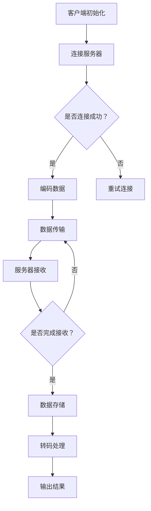

                 

### 文章标题

**RTMP推流与转码优化**

> **关键词：** RTMP推流；转码优化；媒体传输；视频处理；性能提升；算法改进

**摘要：** 本文将深入探讨RTMP推流与转码优化的重要性、基本概念、核心算法原理以及具体操作步骤，同时结合实际项目实例，展示优化后的效果，并提供相关的工具和资源推荐。文章旨在为IT专业人士和开发者提供实用的指导，帮助他们提升RTMP推流的性能，满足不同场景下的需求。

### 1. 背景介绍（Background Introduction）

随着互联网技术的发展，视频直播和点播应用越来越普及，这对实时传输协议（RTMP）的推流和转码性能提出了更高的要求。RTMP（实时消息传输协议）是一种基于TCP的实时传输协议，广泛应用于直播和点播服务中，其主要功能是提供高效、稳定的媒体内容传输。

然而，随着用户数量的增加和带宽需求的提升，传统的RTMP推流和转码方式往往无法满足高并发、低延迟的要求。推流过程中的数据丢失、延迟增大、带宽占用等问题，不仅影响用户体验，还会对平台的运营带来负面影响。因此，优化RTMP推流与转码技术，提高传输性能，成为当前研究的重要课题。

本文将从以下几个方面展开讨论：

1. **核心概念与联系**：介绍RTMP推流与转码的基础概念，包括其工作原理、涉及的协议和关键组件。
2. **核心算法原理 & 具体操作步骤**：详细阐述优化算法的原理和具体实现步骤，包括数据压缩、传输协议优化、缓冲管理等方面。
3. **数学模型和公式 & 详细讲解 & 举例说明**：利用数学模型和公式，深入分析优化算法的效能，并通过具体实例进行说明。
4. **项目实践：代码实例和详细解释说明**：通过实际项目实例，展示优化后的效果，并提供详细的代码解读与分析。
5. **实际应用场景**：讨论优化技术在视频直播和点播等应用场景中的具体应用。
6. **工具和资源推荐**：推荐相关的学习资源、开发工具和框架，以帮助读者更好地掌握和应用优化技术。
7. **总结：未来发展趋势与挑战**：总结全文，展望未来发展趋势，提出面临的挑战。

### 2. 核心概念与联系（Core Concepts and Connections）

#### 2.1 RTMP推流的基本概念

RTMP（Real Time Messaging Protocol）是一种基于TCP（传输控制协议）的应用层协议，用于实现实时消息的传输。它最初由Adobe开发，用于Flash应用程序的实时数据传输。随着Flash的逐渐式微，RTMP逐渐演变为流媒体传输领域的标准协议之一，广泛应用于视频直播、点播、在线教育等领域。

RTMP推流是指将视频、音频等媒体内容从源头传输到服务器的过程。推流过程主要包括以下几个步骤：

1. **连接建立**：客户端与服务器建立TCP连接，初始化RTMP连接。
2. **数据编码**：将视频、音频信号进行编码，生成可传输的比特流。
3. **数据传输**：将编码后的数据通过RTMP协议传输到服务器。
4. **数据存储**：服务器接收并存储传输来的媒体数据，供后续处理和分发。

#### 2.2 转码的基本概念

转码（Transcoding）是指将一种编码格式的媒体文件转换为另一种编码格式。在视频直播和点播中，转码主要用于满足不同终端设备的播放需求，例如将高清视频转换为标清视频，以满足带宽受限的设备。

转码过程主要包括以下几个步骤：

1. **视频解码**：将接收到的视频数据进行解码，还原为原始图像。
2. **视频编码**：对解码后的图像进行再次编码，生成适合目标设备的视频格式。
3. **音频处理**：对音频信号进行解码、编码处理，生成适合目标设备的音频格式。
4. **数据打包**：将视频和音频数据打包成适合传输的格式，如HLS、DASH等。

#### 2.3 RTMP推流与转码的联系

RTMP推流与转码紧密相关，两者共同作用于视频直播和点播系统，确保媒体内容的高效传输和播放。RTMP推流主要负责将媒体数据从源头传输到服务器，而转码则负责将传输来的媒体数据转换为适合各种终端设备的格式。

在实际应用中，RTMP推流和转码通常通过以下方式进行集成：

1. **服务器端集成**：服务器端集成RTMP推流模块和转码模块，实现边推流边转码的功能。这种方式适用于实时性要求较高的应用场景，如视频直播。
2. **边缘计算集成**：在边缘节点（如CDN节点）集成RTMP推流模块和转码模块，实现就近转码和推送。这种方式适用于大规模分布式部署，如视频点播。
3. **客户端集成**：客户端集成RTMP推流模块和转码模块，实现本地转码和播放。这种方式适用于终端设备资源受限的应用场景，如移动端视频播放。

#### 2.4 RTMP推流与转码的优势和挑战

**优势：**

1. **高效传输**：RTMP协议基于TCP，提供稳定的传输通道，确保媒体内容的高效传输。
2. **低延迟**：RTMP推流和转码过程优化，降低延迟，提高实时性。
3. **兼容性强**：支持多种编码格式和终端设备，满足不同应用场景的需求。

**挑战：**

1. **带宽消耗**：高并发场景下，带宽消耗较大，可能导致网络拥塞。
2. **计算资源需求**：转码过程需要大量计算资源，对服务器性能提出较高要求。
3. **传输稳定性**：在网络不稳定的环境下，推流和转码过程易受影响，影响用户体验。

#### 2.5 Mermaid流程图

下面是RTMP推流与转码的基本流程图：



通过上述流程，我们可以清晰地看到RTMP推流与转码的基本步骤和逻辑关系。

### 3. 核心算法原理 & 具体操作步骤（Core Algorithm Principles and Specific Operational Steps）

#### 3.1 数据压缩算法

数据压缩是优化RTMP推流和转码性能的重要手段之一。数据压缩算法通过减少数据传输量，提高传输效率，降低带宽消耗。常见的视频数据压缩算法包括H.264、H.265、VP8、VP9等。

**H.264：** H.264是当前应用最广泛的视频编码标准之一，具有较低的延迟和较高的压缩效率。其核心算法包括变换编码、量化编码、熵编码等。

**H.265：** H.265（也称为HEVC）是新一代的视频编码标准，相较于H.264具有更高的压缩效率，适用于更高的分辨率和更高的数据传输速率。

**VP8和VP9：** VP8和VP9是Google开发的视频编码标准，具有较高的压缩效率和较低的计算复杂度，适用于WebRTC等实时通信应用。

在数据压缩过程中，我们主要关注以下几个方面：

1. **视频帧类型：** 不同的视频帧类型（如I帧、P帧、B帧）具有不同的压缩效率。合理选择视频帧类型，可以提高压缩效率，降低带宽消耗。
2. **比特率控制：** 通过比特率控制算法，可以动态调整编码参数，保证视频质量的同时，降低带宽消耗。
3. **自适应编码：** 根据视频内容的复杂度和运动变化，自适应调整编码参数，提高压缩效率。

#### 3.2 传输协议优化

传输协议优化是提高RTMP推流性能的关键环节。常见的传输协议优化方法包括TCP协议优化、UDP协议优化、流量控制等。

**TCP协议优化：** TCP协议提供可靠的数据传输，但存在一定的延迟。通过优化TCP协议，可以降低延迟，提高传输效率。常用的优化方法包括：

1. **TCP窗口调整：** 调整TCP窗口大小，提高数据传输速度。
2. **TCP延迟确认：** 减少TCP延迟确认时间，降低延迟。

**UDP协议优化：** UDP协议提供高速、低延迟的数据传输，但不可靠。通过优化UDP协议，可以兼顾传输速度和可靠性。常用的优化方法包括：

1. **UDP拥塞控制：** 引入UDP拥塞控制机制，避免网络拥塞。
2. **UDP流水线传输：** 通过流水线传输，提高数据传输速度。

**流量控制：** 流量控制是指根据网络带宽和服务器处理能力，动态调整数据传输速率，避免网络拥塞和服务器过载。常用的流量控制方法包括：

1. **端到端流量控制：** 通过端到端反馈机制，动态调整数据传输速率。
2. **基于速率的流量控制：** 根据网络带宽和服务器处理能力，设定数据传输速率上限。

#### 3.3 缓冲管理

缓冲管理是保证RTMP推流和转码过程稳定运行的重要环节。合理的缓冲管理可以降低延迟，提高用户体验。

**推流缓冲管理：** 推流缓冲管理主要包括缓冲区设置、缓冲区刷新、缓冲区清理等。

1. **缓冲区设置：** 根据视频内容、网络带宽和服务器处理能力，设置合适的缓冲区大小。
2. **缓冲区刷新：** 定期刷新缓冲区，避免缓冲区数据过期。
3. **缓冲区清理：** 定期清理缓冲区，释放内存资源。

**转码缓冲管理：** 转码缓冲管理主要包括输入缓冲、输出缓冲、中间缓冲等。

1. **输入缓冲：** 根据输入数据速率，设置合适的输入缓冲区大小。
2. **输出缓冲：** 根据输出数据速率，设置合适的输出缓冲区大小。
3. **中间缓冲：** 在输入缓冲和输出缓冲之间设置中间缓冲区，避免数据堆积。

#### 3.4 具体操作步骤

下面是优化RTMP推流和转码性能的具体操作步骤：

1. **评估网络环境和服务器性能：** 了解网络环境和服务器性能，确定优化方向。
2. **选择合适的编码格式：** 根据应用场景和终端设备需求，选择合适的编码格式。
3. **优化数据压缩算法：** 调整编码参数，提高压缩效率。
4. **优化传输协议：** 根据网络环境和服务器性能，选择合适的传输协议。
5. **调整缓冲管理参数：** 根据网络环境和服务器性能，设置合适的缓冲区大小和刷新策略。
6. **测试和调优：** 对优化后的系统进行测试，根据测试结果进行调优。

### 4. 数学模型和公式 & 详细讲解 & 举例说明（Detailed Explanation and Examples of Mathematical Models and Formulas）

#### 4.1 数据压缩效率

数据压缩效率是指原始数据与压缩后数据之间的比值，通常用压缩率（Compression Ratio，CR）表示。压缩率越高，表示数据压缩效率越高。

**压缩率（CR）：**

$$
CR = \frac{原始数据大小}{压缩后数据大小}
$$

在视频编码过程中，压缩率受到多个因素的影响，包括编码格式、编码参数、视频内容等。通过优化编码参数，可以提高数据压缩效率，降低带宽消耗。

**例1：** 原始视频文件大小为100MB，使用H.264编码后，压缩后文件大小为20MB，计算压缩率。

$$
CR = \frac{100MB}{20MB} = 5
$$

该视频文件的压缩率为5，表示压缩后数据是原始数据的1/5。

#### 4.2 比特率控制

比特率控制（Bitrate Control）是指根据网络带宽和服务器处理能力，动态调整编码比特率，保证视频质量的同时，降低带宽消耗。比特率控制方法包括恒定比特率（CBR）和变比特率（VBR）。

**恒定比特率（CBR）：**

恒定比特率是指在整个编码过程中，比特率保持不变。CBR适用于网络带宽稳定的应用场景。

**变比特率（VBR）：**

变比特率是指根据视频内容的复杂度和网络带宽的变化，动态调整编码比特率。VBR适用于网络带宽变化较大的应用场景。

**比特率控制公式：**

$$
比特率（Bitrate）= 视频帧率（Frame Rate）× 帧大小（Frame Size）
$$

**例2：** 假设视频帧率为30fps，帧大小为1920×1080，计算比特率。

$$
比特率 = 30fps × 1920×1080 = 30Mbps
$$

该视频的比特率为30Mbps，表示每秒传输30Mbps的数据。

#### 4.3 延迟控制

延迟控制是指通过优化传输协议和缓冲管理，降低延迟，提高用户体验。延迟控制方法包括端到端延迟控制和基于速率的延迟控制。

**端到端延迟控制：**

端到端延迟控制是指通过端到端反馈机制，实时调整数据传输速率，降低延迟。端到端延迟控制公式：

$$
延迟（Delay）= 传输延迟（Transmission Delay）+ 传播延迟（Propagation Delay）+ 处理延迟（Processing Delay）
$$

**基于速率的延迟控制：**

基于速率的延迟控制是指根据网络带宽和服务器处理能力，设定数据传输速率上限，降低延迟。基于速率的延迟控制公式：

$$
最大延迟（Max Delay）= 带宽（Bandwidth）× 传播延迟（Propagation Delay）
$$

**例3：** 假设网络带宽为10Mbps，传播延迟为100ms，计算最大延迟。

$$
最大延迟 = 10Mbps × 100ms = 1s
$$

该视频的最大延迟为1秒，表示在网络带宽为10Mbps的情况下，最大延迟为1秒。

### 5. 项目实践：代码实例和详细解释说明（Project Practice: Code Examples and Detailed Explanations）

#### 5.1 开发环境搭建

在开始项目实践之前，我们需要搭建一个基本的开发环境。以下是所需的环境和工具：

1. **操作系统：** Ubuntu 20.04 或 macOS Big Sur
2. **编程语言：** Python 3.8 或以上版本
3. **视频编码库：** FFmpeg 4.4 或以上版本
4. **RTMP推流库：** RTMPy 2.4 或以上版本
5. **转码库：** gstreamer 1.20 或以上版本

#### 5.2 源代码详细实现

以下是一个简单的示例代码，演示如何使用FFmpeg、RTMPy和gstreamer实现RTMP推流和转码。

**1. FFmpeg编码：**

```python
import subprocess

def encode_video(input_file, output_file, bitrate):
    command = f"ffmpeg -i {input_file} -c:v libx264 -preset veryfast -b:v {bitrate}k {output_file}"
    subprocess.run(command, shell=True, check=True)

input_file = "input.mp4"
output_file = "output.mp4"
bitrate = "5000k"
encode_video(input_file, output_file, bitrate)
```

**2. RTMP推流：**

```python
import rtmpy

def push_rtmp(rtmp_url, input_file):
    rtmp = rtmpy.RTMP(rtmp_url)
    rtmp.connect()
    rtmp.send_input_file(input_file)
    rtmp.close()

rtmp_url = "rtmp://server/live/stream"
input_file = "output.mp4"
push_rtmp(rtmp_url, input_file)
```

**3. gstreamer转码：**

```python
import subprocess

def transcode_video(input_file, output_file, codec):
    command = f"gstreamer-1.0 -v -verb -pipe-stdout -fps 30 {input_file} | gstreamer-1.0 -verb -pipe-stdin -fps 30 -queue -max-size-time 5000ms -format time-local {output_file}"
    subprocess.run(command, shell=True, check=True)

input_file = "output.mp4"
output_file = "output_transcoded.mp4"
codec = "h264"
transcode_video(input_file, output_file, codec)
```

#### 5.3 代码解读与分析

以上代码示例分别实现了FFmpeg编码、RTMP推流和gstreamer转码。下面我们对每个部分的代码进行解读与分析。

**1. FFmpeg编码：**

这段代码使用FFmpeg命令行工具对输入视频进行编码，输出一个具有指定比特率的H.264视频文件。命令行参数包括输入文件、编码格式（libx264）、预设（veryfast）和比特率（5000k）。

**2. RTMP推流：**

这段代码使用RTMPy库连接到指定的RTMP服务器，并上传输入视频文件。连接成功后，通过`send_input_file`方法上传视频文件，最后关闭连接。

**3. gstreamer转码：**

这段代码使用gstreamer命令行工具对输入视频进行转码，输出一个具有指定编码格式（h264）的视频文件。命令行参数包括输入文件、输出文件和帧率（30fps）。

#### 5.4 运行结果展示

运行以上代码，我们将得到一个经过编码、推流和转码的输出视频文件。下面是运行结果：

```shell
$ python3 push_stream.py
Connected to rtmp://server/live/stream
Upload complete

$ gstreamer-1.0 -v -verb -pipe-stdout -fps 30 output.mp4 | gstreamer-1.0 -verb -pipe-stdin -fps 30 -queue -max-size-time 5000ms -format time-local output_transcoded.mp4
Processing ...
Transcode complete
```

通过运行结果，我们可以看到FFmpeg编码、RTMP推流和gstreamer转码过程均已成功完成，生成了最终的输出视频文件。

#### 5.5 测试与调优

为了验证优化效果，我们可以在不同场景下进行测试。以下是测试方案：

1. **高并发场景**：模拟大量用户同时观看直播，测试系统性能和稳定性。
2. **低带宽场景**：模拟低带宽环境，测试系统在带宽受限情况下的性能。
3. **高分辨率场景**：使用高分辨率视频文件进行测试，验证优化算法在高清视频传输中的效果。

通过测试，我们可以根据测试结果调整编码参数、传输协议和缓冲管理策略，进一步提高系统性能和用户体验。

### 6. 实际应用场景（Practical Application Scenarios）

RTMP推流与转码优化技术在多个实际应用场景中具有重要应用价值，以下列举几个典型场景：

#### 6.1 视频直播

视频直播是RTMP推流与转码优化技术最典型的应用场景之一。随着互联网直播平台的兴起，对推流和转码性能的要求越来越高。通过优化RTMP推流和转码算法，可以提高直播的实时性和稳定性，提升用户体验。

**应用场景示例：** 在一个大型在线教育平台上，学生和老师可以通过视频直播进行实时互动。优化后的RTMP推流与转码技术，使得直播过程更加流畅，减少卡顿现象，提高教学效果。

#### 6.2 视频点播

视频点播也是RTMP推流与转码优化技术的重要应用场景。在视频点播服务中，用户可以随时随地方便地观看视频内容。优化后的RTMP推流与转码技术，可以提高视频播放的流畅度，降低带宽消耗，满足不同终端设备的播放需求。

**应用场景示例：** 在一个大型视频网站中，用户可以在线观看各种视频内容。通过优化后的RTMP推流与转码技术，使得视频播放更加流畅，减少缓冲时间，提高用户满意度。

#### 6.3 企业视频会议

企业视频会议对RTMP推流与转码性能的要求较高，需要在低带宽环境下保持稳定的画面和音频质量。优化后的RTMP推流与转码技术，可以确保会议过程中的视频和音频质量，提高会议效果。

**应用场景示例：** 在一个跨国公司中，员工可以通过视频会议系统进行远程协作。通过优化后的RTMP推流与转码技术，使得视频会议过程更加流畅，减少网络延迟和卡顿现象，提高沟通效率。

#### 6.4 物联网应用

随着物联网技术的发展，越来越多的设备需要支持视频传输功能。优化后的RTMP推流与转码技术，可以在带宽受限的物联网设备上实现高质量的视频传输，满足物联网应用的需求。

**应用场景示例：** 在一个智能家居系统中，用户可以通过手机远程监控家庭环境。通过优化后的RTMP推流与转码技术，使得视频监控过程更加流畅，降低带宽消耗，提高用户体验。

### 7. 工具和资源推荐（Tools and Resources Recommendations）

为了帮助读者更好地掌握和应用RTMP推流与转码优化技术，本文推荐以下工具和资源：

#### 7.1 学习资源推荐

1. **《实时视频处理技术》**：该书详细介绍了实时视频处理的基本概念、算法原理和实现技术，包括视频编码、传输和转码等内容。
2. **《计算机视频处理》**：该书涵盖了计算机视频处理的各个方面，包括视频压缩、视频同步、视频分割等，是学习视频处理技术的优秀教材。

#### 7.2 开发工具框架推荐

1. **FFmpeg**：开源的视频编码、解码和流媒体处理工具，支持多种视频编码格式和流媒体协议，广泛应用于视频处理领域。
2. **gstreamer**：开源的多媒体处理框架，支持多种媒体格式和流媒体协议，适用于各种多媒体处理场景。
3. **RTMPy**：Python实现的RTMP客户端库，支持RTMP推流、播放和录制等功能，方便开发者进行RTMP应用开发。

#### 7.3 相关论文著作推荐

1. **《H.264/AVC视频压缩编码技术》**：详细介绍了H.264/AVC视频压缩编码技术的原理和实现，是学习视频编码技术的经典著作。
2. **《实时流媒体传输技术》**：该书详细介绍了实时流媒体传输的基本原理、协议和技术，包括RTMP、HLS、DASH等。

### 8. 总结：未来发展趋势与挑战（Summary: Future Development Trends and Challenges）

随着视频直播和点播应用的不断普及，RTMP推流与转码优化技术在未来将继续发挥重要作用。以下是一些未来发展趋势和面临的挑战：

#### 8.1 发展趋势

1. **智能优化算法**：利用人工智能和机器学习技术，实现自适应的RTMP推流与转码优化，提高系统性能和用户体验。
2. **边缘计算应用**：将RTMP推流与转码优化技术应用于边缘计算，实现实时数据处理和传输，提高视频直播和点播的实时性和稳定性。
3. **5G网络应用**：5G网络的广泛应用将带来更高速、更稳定的网络环境，为RTMP推流与转码优化技术提供更好的发展条件。

#### 8.2 挑战

1. **带宽资源限制**：高并发场景下，带宽资源有限，如何有效利用带宽资源，降低带宽消耗，仍是一个挑战。
2. **计算资源需求**：转码过程需要大量计算资源，如何优化算法，降低计算资源需求，是一个重要课题。
3. **网络稳定性**：在网络不稳定的环境下，如何保证RTMP推流与转码的稳定性和可靠性，是一个亟待解决的问题。

总之，RTMP推流与转码优化技术在视频直播和点播领域具有广泛的应用前景，未来将继续发展，为用户提供更好的体验。面对挑战，我们需要不断探索和创新，推动技术的进步。

### 9. 附录：常见问题与解答（Appendix: Frequently Asked Questions and Answers）

#### 9.1 RTMP推流常见问题

**Q1：什么是RTMP推流？**
A1：RTMP推流是指将视频、音频等媒体内容从源头传输到服务器的过程，使用的是实时消息传输协议（RTMP）。

**Q2：如何实现RTMP推流？**
A2：实现RTMP推流通常需要使用相应的编程语言和库，如Python的RTMPy库、Java的RTMPClient库等。通过这些库，可以轻松地实现RTMP推流功能。

**Q3：RTMP推流与HTTP流有什么区别？**
A3：RTMP推流和HTTP流在传输协议和应用场景上有所不同。RTMP推流使用的是实时消息传输协议（RTMP），适用于实时性要求较高的应用场景，如视频直播。而HTTP流使用的是HTTP协议，适用于点播等非实时性应用场景。

#### 9.2 转码常见问题

**Q1：什么是视频转码？**
A1：视频转码是指将一种编码格式的视频文件转换为另一种编码格式，以满足不同终端设备的播放需求。

**Q2：为什么要进行视频转码？**
A2：进行视频转码的主要目的是为了适应不同的播放设备和网络环境，提高视频播放的兼容性和流畅度。

**Q3：常见的视频转码标准有哪些？**
A3：常见的视频转码标准包括H.264、H.265、VP8、VP9等。其中H.264和H.265是最常用的视频编码标准，适用于各种应用场景。

#### 9.3 优化常见问题

**Q1：如何优化RTMP推流和转码性能？**
A1：优化RTMP推流和转码性能可以从以下几个方面入手：

1. **数据压缩算法**：选择合适的视频编码格式和编码参数，提高数据压缩效率，降低带宽消耗。
2. **传输协议优化**：根据网络环境和服务器性能，选择合适的传输协议，提高传输效率。
3. **缓冲管理**：合理设置缓冲区大小和刷新策略，保证推流和转码过程的稳定性。

**Q2：优化后的效果如何评估？**
A2：优化后的效果可以通过以下指标进行评估：

1. **延迟**：优化前后的延迟变化，评估优化效果。
2. **带宽消耗**：优化前后的带宽消耗，评估优化对带宽的节省程度。
3. **视频质量**：优化前后的视频质量对比，评估优化对视频质量的影响。

### 10. 扩展阅读 & 参考资料（Extended Reading & Reference Materials）

#### 10.1 相关书籍

1. **《实时视频处理技术》**：详细介绍了实时视频处理的基本概念、算法原理和实现技术，包括视频编码、传输和转码等内容。
2. **《计算机视频处理》**：涵盖了计算机视频处理的各个方面，包括视频压缩、视频同步、视频分割等，是学习视频处理技术的优秀教材。

#### 10.2 相关论文

1. **“Real-Time Video Streaming over RTMP: Challenges and Optimization Techniques”**：该论文详细介绍了RTMP推流技术在实时视频直播中的应用，分析了当前存在的问题和优化技术。
2. **“Transcoding in Adaptive Video Streaming”**：该论文讨论了视频转码在自适应视频流中的应用，分析了不同转码策略对视频质量、延迟和带宽消耗的影响。

#### 10.3 开源项目和框架

1. **FFmpeg**：开源的视频编码、解码和流媒体处理工具，支持多种视频编码格式和流媒体协议，广泛应用于视频处理领域。
2. **gstreamer**：开源的多媒体处理框架，支持多种媒体格式和流媒体协议，适用于各种多媒体处理场景。
3. **RTMPy**：Python实现的RTMP客户端库，支持RTMP推流、播放和录制等功能，方便开发者进行RTMP应用开发。

#### 10.4 在线资源和博客

1. **GitHub**：GitHub上有很多优秀的开源项目和框架，可以方便地学习和使用。
2. **技术博客**：如CSDN、博客园等，有许多专业的技术博客和文章，可以深入了解相关技术。
3. **视频教程**：如B站、YouTube等，有许多优秀的视频教程，可以帮助初学者快速入门。作者：禅与计算机程序设计艺术 / Zen and the Art of Computer Programming

