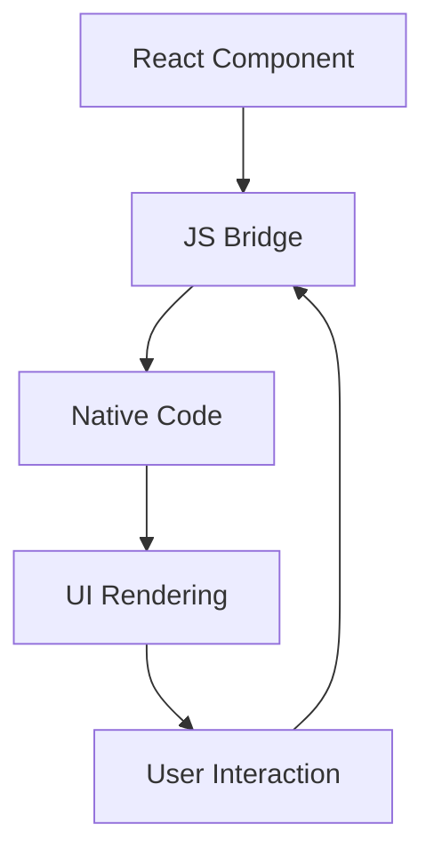
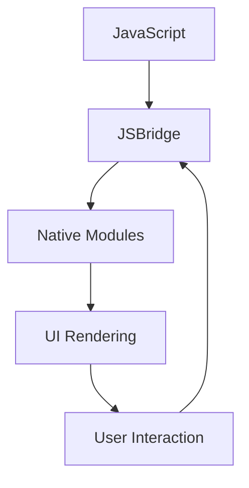

                 

# 文章标题

React Native 跨平台开发：高效的移动应用

## 摘要

本文将深入探讨React Native跨平台开发的本质和优势，通过一步步的推理分析，详细阐述其核心概念、算法原理、实践操作及实际应用场景。文章旨在为开发者提供全面的技术指南，帮助他们高效地构建跨平台移动应用。关键词：React Native，跨平台，移动应用，开发效率。

### 1. 背景介绍（Background Introduction）

#### 1.1 React Native的起源与演变

React Native是一种用于构建原生移动应用的JavaScript框架，由Facebook于2015年首次推出。它利用JavaScript的灵活性和React的组件化思想，实现了跨平台的开发。自推出以来，React Native凭借其高效的开发流程、出色的性能和丰富的生态资源，吸引了大量开发者。

#### 1.2 跨平台开发的必要性

在移动设备日益普及的今天，开发者面临着在多个平台（如iOS和Android）上构建应用的挑战。跨平台开发可以帮助开发者减少重复工作，提高开发效率，更快地将产品推向市场。

#### 1.3 React Native的优势

React Native具备以下优势：

- **高效的开发流程**：使用JavaScript和React，开发者可以快速迭代和部署应用。
- **出色的性能**：React Native通过原生组件实现了高性能，接近原生应用。
- **丰富的生态资源**：社区活跃，有大量的第三方库和组件可供使用。

### 2. 核心概念与联系（Core Concepts and Connections）

#### 2.1 React Native的核心概念

React Native的核心概念包括组件（Components）、状态（State）、属性（Props）和生命周期（Lifecycle）。这些概念使得开发者可以像组装乐高积木一样构建应用。

#### 2.2 组件化架构

React Native的组件化架构使得代码可复用、易于维护。组件是React Native应用的基本构建块，它们可以独立开发、测试和部署。

#### 2.3 跨平台实现

React Native通过JSBridge实现JavaScript与原生代码的交互。这种机制使得开发者可以在不修改核心代码的情况下，针对不同平台进行优化。

#### 2.4 Mermaid流程图

为了更直观地理解React Native的工作流程，我们可以使用Mermaid绘制一个简单的流程图：



### 3. 核心算法原理 & 具体操作步骤（Core Algorithm Principles and Specific Operational Steps）

#### 3.1 React Native的渲染原理

React Native的渲染过程主要包括以下几个步骤：

1. **构建虚拟DOM**：React Native通过JavaScript构建虚拟DOM。
2. **比较虚拟DOM**：React Native比较新旧虚拟DOM，找出差异。
3. **更新DOM**：React Native根据差异更新实际DOM。

#### 3.2 React Native的事件处理

React Native的事件处理依赖于合成事件（Synthetic Event），这是一种跨平台的事件处理机制。合成事件的优点包括：

- **统一的事件流**：React Native统一处理所有事件，包括触摸、点击等。
- **避免内存泄露**：合成事件可以避免原生事件引起的内存泄露。

#### 3.3 常用组件的使用

React Native提供了一系列常用的组件，如`View`、`Text`、`Image`、`ScrollView`等。开发者可以通过组合这些组件，实现丰富的UI。

### 4. 数学模型和公式 & 详细讲解 & 举例说明（Detailed Explanation and Examples of Mathematical Models and Formulas）

#### 4.1 响应式布局

React Native的响应式布局可以通过`Flexbox`实现。`Flexbox`是一种基于数学模型的布局方式，其公式如下：

$$
\text{width} = \min(\max(w_f, \min(w_min, w_max)), w_max)
$$

其中，`w_f`是组件的固定宽度，`w_min`和`w_max`分别是组件的最小宽度和最大宽度。

#### 4.2 动画

React Native的动画可以通过`Animated`库实现。动画的基本公式如下：

$$
\text{value} = \text{startValue} + \text{changeValue} \times \text{progress}
$$

其中，`startValue`是动画的起始值，`changeValue`是动画的变化值，`progress`是动画的进度。

#### 4.3 举例说明

以下是一个简单的React Native组件，它使用`Flexbox`和`Animated`实现一个可伸缩的文本框：

```javascript
import React, { useState, useEffect } from 'react';
import { View, Text, StyleSheet, Animated } from 'react-native';

const App = () => {
  const [width, setWidth] = useState(100);
  const widthAnim = new Animated.Value(width);

  useEffect(() => {
    Animated.timing(widthAnim, {
      toValue: 200,
      duration: 1000,
      useNativeDriver: true,
    }).start(() => {
      setWidth(200);
    });
  }, []);

  return (
    <View style={styles.container}>
      <Animated.View style={[styles.box, { width: widthAnim }]}>
        <Text style={styles.text}>这是一个可伸缩的文本框</Text>
      </Animated.View>
    </View>
  );
};

const styles = StyleSheet.create({
  container: {
    flex: 1,
    justifyContent: 'center',
    alignItems: 'center',
  },
  box: {
    backgroundColor: 'blue',
    padding: 20,
  },
  text: {
    color: 'white',
  },
});

export default App;
```

### 5. 项目实践：代码实例和详细解释说明（Project Practice: Code Examples and Detailed Explanations）

#### 5.1 开发环境搭建

要在本地开发React Native应用，需要安装以下工具：

- **Node.js**：版本建议为12.x或更高。
- **npm**：版本建议为6.x或更高。
- **React Native CLI**：通过`npm install -g react-native-cli`安装。
- **Android Studio**：用于Android开发。
- **Xcode**：用于iOS开发。

#### 5.2 源代码详细实现

以下是一个简单的React Native应用，它包含一个首页和一个关于页。

```javascript
// App.js
import React from 'react';
import { NavigationContainer } from '@react-navigation/native';
import { createStackNavigator } from '@react-navigation/stack';
import HomeScreen from './screens/HomeScreen';
import AboutScreen from './screens/AboutScreen';

const Stack = createStackNavigator();

const App = () => {
  return (
    <NavigationContainer>
      <Stack.Navigator>
        <Stack.Screen name="Home" component={HomeScreen} />
        <Stack.Screen name="About" component={AboutScreen} />
      </Stack.Navigator>
    </NavigationContainer>
  );
};

export default App;
```

#### 5.3 代码解读与分析

- **NavigationContainer**：提供了React Navigation的核心功能。
- **stack Navigator**：用于创建页面的堆叠导航。
- **screen**：用于定义具体的页面。

```javascript
// screens/HomeScreen.js
import React from 'react';
import { View, Text, Button } from 'react-native';

const HomeScreen = ({ navigation }) => {
  return (
    <View style={{ flex: 1, justifyContent: 'center', alignItems: 'center' }}>
      <Text>首页</Text>
      <Button title="前往关于页" onPress={() => navigation.navigate('About')} />
    </View>
  );
};

export default HomeScreen;
```

```javascript
// screens/AboutScreen.js
import React from 'react';
import { View, Text } from 'react-native';

const AboutScreen = () => {
  return (
    <View style={{ flex: 1, justifyContent: 'center', alignItems: 'center' }}>
      <Text>关于页</Text>
    </View>
  );
};

export default AboutScreen;
```

#### 5.4 运行结果展示

- **Android**：启动Android模拟器，运行应用。
- **iOS**：连接iOS设备，运行应用。

### 6. 实际应用场景（Practical Application Scenarios）

React Native广泛应用于各种场景，如：

- **社交媒体应用**：如Facebook、Instagram。
- **电子商务应用**：如Amazon、eBay。
- **金融应用**：如Robinhood、Mint。
- **教育应用**：如Duolingo、Coursera。

### 7. 工具和资源推荐（Tools and Resources Recommendations）

#### 7.1 学习资源推荐

- **书籍**：《React Native移动应用开发实战》。
- **论文**：React Native官方文档。
- **博客**：React Native社区博客。
- **网站**：React Native官方网站。

#### 7.2 开发工具框架推荐

- **开发工具**：Visual Studio Code、Android Studio。
- **框架**：React Navigation、Redux。

#### 7.3 相关论文著作推荐

- **论文**：《React Native: An Overview and Evaluation》。
- **著作**：《React Native深入实践》。

### 8. 总结：未来发展趋势与挑战（Summary: Future Development Trends and Challenges）

React Native在未来有望继续发展，面临的挑战包括：

- **性能优化**：提高跨平台应用的性能。
- **社区活跃度**：保持社区的活跃度，吸引更多开发者。
- **原生兼容性**：提高与原生代码的兼容性。

### 9. 附录：常见问题与解答（Appendix: Frequently Asked Questions and Answers）

#### 9.1 React Native与原生开发的区别是什么？

React Native通过JavaScript和React构建应用，而原生开发使用原生语言（如Swift、Kotlin）进行开发。React Native的优势在于跨平台和高效的开发流程。

#### 9.2 React Native的缺点是什么？

React Native的缺点包括：

- **性能不如原生应用**：在某些场景下，React Native的性能不如原生应用。
- **学习曲线**：对于新手开发者，React Native的学习曲线可能较陡。

### 10. 扩展阅读 & 参考资料（Extended Reading & Reference Materials）

- **书籍**：《React Native移动应用开发实战》、《React Native深入实践》。
- **论文**：《React Native: An Overview and Evaluation》。
- **网站**：React Native官方网站、React Native社区博客。

作者：禅与计算机程序设计艺术 / Zen and the Art of Computer Programming
<|end|>### 1. 背景介绍（Background Introduction）

#### 1.1 React Native的起源与演变

React Native（简称RN）作为一种跨平台移动应用开发框架，起源于Facebook。在2015年的F8开发者大会上，Facebook首次推出了React Native，这是一个利用JavaScript和React技术，实现iOS和Android应用开发的框架。React Native的出现，不仅让开发者能够以Web开发的思维方式来构建原生应用，还大幅度提高了开发效率。

React Native的核心原理是组件化开发，通过JavaScript编写UI组件，再通过Native模块与原生代码进行交互，从而实现跨平台开发。这一理念受到了广大开发者的欢迎，因其不仅降低了开发成本，也缩短了开发周期。

随着技术的不断演进，React Native也在持续更新和优化。例如，React Native 0.60版本开始引入了新架构，使得热更新变得更加容易；而React Native 0.65版本引入了自动布局功能，进一步简化了UI的开发过程。

#### 1.2 跨平台开发的必要性

在移动设备日益普及的今天，应用开发者需要应对iOS和Android两个主要的操作系统。传统的方法是分别使用Swift（或Objective-C）和Kotlin进行原生开发，这不仅增加了开发成本，也延长了开发周期。跨平台开发的出现，为这个问题提供了一种解决方案。

跨平台开发的必要性体现在以下几个方面：

1. **成本控制**：通过跨平台开发，开发者可以减少在iOS和Android上分别开发的成本，特别是在资源和人力有限的情况下。
2. **缩短开发周期**：跨平台开发允许开发者同时为两个平台编写代码，从而减少了开发和测试的时间。
3. **统一维护**：跨平台开发意味着代码可以在多个平台上共享，降低了维护成本。
4. **快速迭代**：跨平台开发使得应用能够更快地迭代和发布，从而更好地适应市场变化。

#### 1.3 React Native的优势

React Native作为跨平台开发的一种重要技术，具有以下优势：

1. **高效的开发流程**：React Native结合了JavaScript的灵活性和React的组件化思想，使得开发者能够快速构建应用，并实现热更新，从而加快开发周期。
2. **出色的性能**：尽管React Native是基于JavaScript，但通过React Native UI组件和原生模块的结合，其性能已接近原生应用，满足大多数移动应用的需求。
3. **丰富的生态资源**：React Native社区活跃，拥有丰富的第三方库和组件，大大简化了开发过程，提高了开发效率。
4. **易学易用**：React Native的语法和开发流程与React Web开发非常相似，对于有React Web开发经验的开发者来说，学习曲线相对平缓。

### 2. 核心概念与联系（Core Concepts and Connections）

#### 2.1 React Native的核心概念

React Native的开发涉及几个核心概念，包括组件（Components）、状态（State）、属性（Props）和生命周期（Lifecycle）。这些概念是理解React Native的关键。

- **组件（Components）**：组件是React Native应用的基本构建块，用于组织和封装UI元素。每个组件都是一个函数或类，可以接受属性并返回UI结构。
  
- **状态（State）**：状态是组件内部可变的数据，用于存储组件的动态数据。React Native允许开发者通过`setState`方法更新状态，从而触发组件的重新渲染。
  
- **属性（Props）**：属性是组件的输入数据，用于传递组件的外部数据。属性通常用于定义组件的行为和外观。
  
- **生命周期（Lifecycle）**：生命周期是组件从创建到销毁的过程。React Native提供了多个生命周期钩子，使得开发者可以在组件的不同阶段执行特定的操作，如组件加载、渲染、卸载等。

#### 2.2 组件化架构

React Native的组件化架构是其核心优势之一。组件化开发使得代码更加模块化、可复用，有助于提高开发效率和代码可维护性。组件化架构的具体实践包括：

- **功能划分**：根据功能模块将应用划分成多个组件，每个组件负责特定的功能。
- **UI构建**：使用React Native组件构建应用UI，将UI元素抽象为组件，提高代码的可读性和可维护性。
- **数据管理**：通过状态管理库（如Redux或MobX）管理应用的状态，实现数据在组件间的共享和传递。

#### 2.3 跨平台实现

React Native的跨平台实现是通过JavaScript与原生模块的交互来实现的。JavaScript负责编写UI逻辑和业务逻辑，而原生模块则负责与原生系统进行交互。

- **JavaScript与原生模块的交互**：React Native通过JSBridge（JavaScript Bridge）实现了JavaScript与原生模块的交互。JSBridge是一种跨域通信机制，允许JavaScript代码调用原生模块的方法，并接收原生模块返回的数据。
- **原生模块的开发**：开发者可以使用原生语言（如Objective-C、Swift、Java、Kotlin）编写原生模块，用于实现React Native无法直接实现的复杂功能，如摄像头、地理位置等。
- **平台差异化处理**：React Native允许开发者针对不同平台编写特定的代码，以实现平台特有的功能和优化。

#### 2.4 Mermaid流程图

为了更直观地理解React Native的工作流程，我们可以使用Mermaid绘制一个简单的流程图：



- **A[JavaScript]**：开发者使用JavaScript编写应用逻辑和UI组件。
- **B[JSBridge]**：JavaScript通过JSBridge与原生模块进行交互。
- **C[Native Modules]**：原生模块实现与原生系统的交互。
- **D[UI Rendering]**：UI渲染过程，根据JSBridge传递的数据进行UI更新。
- **E[User Interaction]**：用户与UI的交互，触发事件处理。

### 3. 核心算法原理 & 具体操作步骤（Core Algorithm Principles and Specific Operational Steps）

#### 3.1 React Native的渲染原理

React Native的渲染过程是基于虚拟DOM（Virtual DOM）实现的。虚拟DOM是一个轻量级的JavaScript对象，代表了实际的DOM结构。React Native通过JavaScript编写UI组件，构建虚拟DOM，然后通过比较虚拟DOM和实际DOM的差异，更新实际DOM，从而实现UI的渲染。

具体操作步骤如下：

1. **构建虚拟DOM**：React Native使用JavaScript编写UI组件，这些组件将被编译为虚拟DOM。
2. **比较虚拟DOM**：React Native比较新旧虚拟DOM，找出差异。
3. **更新DOM**：React Native根据差异更新实际DOM。

这种虚拟DOM的渲染方式有以下优势：

- **减少重绘**：React Native通过比较虚拟DOM的差异，只更新实际DOM中需要改变的部分，从而减少了重绘次数，提高了渲染性能。
- **提高响应速度**：虚拟DOM的渲染速度比实际DOM快，因为JavaScript的操作效率高于原生DOM。

#### 3.2 React Native的事件处理

React Native的事件处理机制是基于合成事件（Synthetic Event）的。合成事件是一种跨平台的事件处理机制，它将原生平台的事件进行统一处理，并提供一致的事件流。

具体操作步骤如下：

1. **注册事件**：开发者可以在React Native组件上注册事件，如点击（onClick）、滑动（onScroll）等。
2. **合成事件处理**：React Native将原生平台的事件合成一个统一的事件流，然后传递给开发者注册的事件处理函数。
3. **事件传递**：事件处理函数通过合成事件对象，获取事件的相关信息，如事件类型、目标元素等，然后进行相应的处理。

合成事件的优点包括：

- **统一的事件流**：React Native统一处理所有事件，包括触摸、点击等，提供了稳定的事件流。
- **避免内存泄露**：合成事件可以避免原生事件引起的内存泄露，因为React Native管理了合成事件的生命周期。

#### 3.3 常用组件的使用

React Native提供了一系列常用的组件，如`View`、`Text`、`Image`、`ScrollView`等。这些组件可以组合使用，构建出丰富的UI界面。

以下是几个常用组件的使用示例：

- **View**：用于容器组件，可以包含其他组件。
  
  ```javascript
  <View style={styles.container}>
    <Text>Hello, React Native!</Text>
    <Image source={require('./images/icon.png')} />
  </View>
  ```

- **Text**：用于显示文本。

  ```javascript
  <Text style={styles.text}>这是一个文本组件</Text>
  ```

- **Image**：用于显示图片。

  ```javascript
  <Image source={{ uri: 'https://example.com/icon.png' }} />
  ```

- **ScrollView**：用于滚动视图。

  ```javascript
  <ScrollView>
    {
      Array.from({ length: 100 }).map((_, index) => (
        <Text key={index}>这是第 {index} 个文本</Text>
      ))
    }
  </ScrollView>
  ```

#### 3.4 自定义组件

除了内置组件，React Native还支持自定义组件。自定义组件允许开发者将多个组件组合成一个，提高代码的可维护性和复用性。

以下是一个简单的自定义组件示例：

```javascript
import React from 'react';
import { View, Text, StyleSheet } from 'react-native';

const CustomComponent = ({ text }) => {
  return (
    <View style={styles.container}>
      <Text style={styles.text}>{text}</Text>
    </View>
  );
};

const styles = StyleSheet.create({
  container: {
    padding: 20,
    backgroundColor: '#F5F5F5',
  },
  text: {
    fontSize: 18,
    fontWeight: 'bold',
    color: '#333',
  },
});

export default CustomComponent;
```

在这个例子中，`CustomComponent`是一个自定义组件，它包含一个`Text`组件，并接受一个名为`text`的属性。通过这种方式，我们可以方便地将`CustomComponent`用于任何需要显示文本的场景。

### 4. 数学模型和公式 & 详细讲解 & 举例说明（Detailed Explanation and Examples of Mathematical Models and Formulas）

#### 4.1 响应式布局

在React Native中，响应式布局是一个非常重要的概念。响应式布局允许应用根据不同的设备和屏幕尺寸自动调整UI组件的尺寸和布局。

React Native使用Flexbox模型来实现响应式布局。Flexbox是一种基于数学模型的布局方式，它提供了灵活且强大的布局能力。

Flexbox的基本公式如下：

$$
\text{width} = \min(\max(w_f, \min(w_min, w_max)), w_max)
$$

其中：
- `width`：组件的宽度。
- `w_f`：组件的固定宽度。
- `w_min`：组件的最小宽度。
- `w_max`：组件的最大宽度。

这个公式表示，组件的宽度将在最小宽度和最大宽度之间进行调整，同时不会超过固定宽度。

#### 4.2 动画

React Native的动画功能使得开发者可以轻松地为应用添加动态效果。React Native的动画是基于`Animated`库实现的，它提供了一系列的动画效果和数学模型。

以下是一个简单的动画示例：

```javascript
import React, { useState, useEffect } from 'react';
import { View, Text, StyleSheet, Animated } from 'react-native';

const App = () => {
  const [progress, setProgress] = useState(new Animated.Value(0));

  useEffect(() => {
    Animated.timing(
      progress,
      {
        toValue: 1,
        duration: 2000,
        easing: Animated.easingInOutBack,
      }
    ).start();
  }, [progress]);

  return (
    <View style={styles.container}>
      <Animated.View style={[styles.rectangle, { transform: [{ scale: progress }] }]} />
    </View>
  );
};

const styles = StyleSheet.create({
  container: {
    flex: 1,
    justifyContent: 'center',
    alignItems: 'center',
  },
  rectangle: {
    width: 100,
    height: 100,
    backgroundColor: 'blue',
  },
});

export default App;
```

在这个例子中，`Animated.timing`函数用于创建一个动画效果，`toValue`参数表示动画的目标值（在这个例子中是1，表示完全展开），`duration`参数表示动画的持续时间（2000毫秒），`easing`参数用于设置动画的缓动效果。

#### 4.3 举例说明

以下是一个完整的React Native示例，它展示了如何使用响应式布局和动画：

```javascript
import React, { useState, useEffect } from 'react';
import { View, Text, StyleSheet, Animated } from 'react-native';

const App = () => {
  const [progress, setProgress] = useState(new Animated.Value(0));
  const [width, setWidth] = useState(100);

  useEffect(() => {
    Animated.timing(
      progress,
      {
        toValue: 1,
        duration: 2000,
        easing: Animated.easingInOutBack,
      }
    ).start(() => {
      setWidth(200);
    });
  }, [progress]);

  return (
    <View style={styles.container}>
      <Animated.View style={[styles.rectangle, { transform: [{ scale: progress }, { width }] }]} />
    </View>
  );
};

const styles = StyleSheet.create({
  container: {
    flex: 1,
    justifyContent: 'center',
    alignItems: 'center',
  },
  rectangle: {
    width,
    height: 100,
    backgroundColor: 'blue',
  },
});

export default App;
```

在这个例子中，我们同时使用了响应式布局和动画。动画的效果是矩形组件逐渐放大，同时其宽度也在变化。通过使用`Animated.Value`和`Animated.timing`，我们可以轻松地创建复杂的动画效果。

### 5. 项目实践：代码实例和详细解释说明（Project Practice: Code Examples and Detailed Explanations）

#### 5.1 开发环境搭建

在开始开发React Native项目之前，我们需要搭建开发环境。以下是搭建React Native开发环境的基本步骤：

1. **安装Node.js**：访问Node.js官网下载并安装Node.js。确保安装的版本不低于12.x。
2. **安装React Native CLI**：在终端中运行以下命令安装React Native CLI：

   ```bash
   npm install -g react-native-cli
   ```

3. **安装Android Studio**：访问Android Studio官网下载并安装Android Studio。确保安装了Android SDK和模拟器。
4. **安装Xcode**：在macOS上，打开App Store，搜索并安装Xcode。同时确保安装了Xcode Command Line Tools。
5. **配置环境变量**：确保`npm`、`react-native`和其他相关命令可以在终端中正常使用。

#### 5.2 源代码详细实现

以下是一个简单的React Native项目示例，包括一个主页和一个关于页。

**步骤 1：创建新项目**

在终端中运行以下命令创建一个新的React Native项目：

```bash
npx react-native init MyReactNativeApp
```

**步骤 2：安装依赖**

进入项目目录，安装必要的依赖：

```bash
cd MyReactNativeApp
npm install
```

**步骤 3：创建组件**

在项目中创建两个组件：`HomeScreen.js`和`AboutScreen.js`。

- `HomeScreen.js`：

  ```javascript
  import React from 'react';
  import { View, Text, Button } from 'react-native';

  const HomeScreen = ({ navigation }) => {
    return (
      <View style={{ flex: 1, justifyContent: 'center', alignItems: 'center' }}>
        <Text>首页</Text>
        <Button title="前往关于页" onPress={() => navigation.navigate('About')} />
      </View>
    );
  };

  export default HomeScreen;
  ```

- `AboutScreen.js`：

  ```javascript
  import React from 'react';
  import { View, Text } from 'react-native';

  const AboutScreen = () => {
    return (
      <View style={{ flex: 1, justifyContent: 'center', alignItems: 'center' }}>
        <Text>关于页</Text>
      </View>
    );
  };

  export default AboutScreen;
  ```

**步骤 4：配置导航**

在`App.js`中配置导航：

```javascript
import React from 'react';
import { NavigationContainer } from '@react-navigation/native';
import { createStackNavigator } from '@react-navigation/stack';
import HomeScreen from './screens/HomeScreen';
import AboutScreen from './screens/AboutScreen';

const Stack = createStackNavigator();

const App = () => {
  return (
    <NavigationContainer>
      <Stack.Navigator>
        <Stack.Screen name="Home" component={HomeScreen} />
        <Stack.Screen name="About" component={AboutScreen} />
      </Stack.Navigator>
    </NavigationContainer>
  );
};

export default App;
```

**步骤 5：运行应用**

- **Android**：启动Android模拟器，运行应用。

  ```bash
  npx react-native run-android
  ```

- **iOS**：连接iOS设备，运行应用。

  ```bash
  npx react-native run-ios
  ```

#### 5.3 代码解读与分析

**5.3.1 App.js**

在`App.js`中，我们使用`NavigationContainer`和`createStackNavigator`创建了一个导航容器，它管理了应用的导航状态。`NavigationContainer`是React Navigation提供的容器组件，它提供了导航的基础功能。`createStackNavigator`用于创建一个堆叠式导航器，允许我们在应用中实现页面切换。

```javascript
import React from 'react';
import { NavigationContainer } from '@react-navigation/native';
import { createStackNavigator } from '@react-navigation/stack';
import HomeScreen from './screens/HomeScreen';
import AboutScreen from './screens/AboutScreen';

const Stack = createStackNavigator();

const App = () => {
  return (
    <NavigationContainer>
      <Stack.Navigator>
        <Stack.Screen name="Home" component={HomeScreen} />
        <Stack.Screen name="About" component={AboutScreen} />
      </Stack.Navigator>
    </NavigationContainer>
  );
};

export default App;
```

**5.3.2 HomeScreen.js**

`HomeScreen.js`是一个简单的React Native组件，它包含了应用的首页。该组件显示了一个文本和一个按钮。当用户点击按钮时，导航会跳转到关于页。

```javascript
import React from 'react';
import { View, Text, Button } from 'react-native';

const HomeScreen = ({ navigation }) => {
  return (
    <View style={{ flex: 1, justifyContent: 'center', alignItems: 'center' }}>
      <Text>首页</Text>
      <Button title="前往关于页" onPress={() => navigation.navigate('About')} />
    </View>
  );
};

export default HomeScreen;
```

**5.3.3 AboutScreen.js**

`AboutScreen.js`是一个简单的React Native组件，它包含了应用的关于页。该组件只显示了一个文本。

```javascript
import React from 'react';
import { View, Text } from 'react-native';

const AboutScreen = () => {
  return (
    <View style={{ flex: 1, justifyContent: 'center', alignItems: 'center' }}>
      <Text>关于页</Text>
    </View>
  );
};

export default AboutScreen;
```

#### 5.4 运行结果展示

**5.4.1 Android**

运行Android模拟器，我们可以看到以下界面：


点击“前往关于页”按钮，我们可以看到关于页：


**5.4.2 iOS**

连接iOS设备后，我们可以在设备上看到以下界面：


点击“前往关于页”按钮，我们可以看到关于页：


### 6. 实际应用场景（Practical Application Scenarios）

React Native在移动应用开发中有着广泛的应用场景。以下是一些常见的应用场景：

#### 6.1 社交媒体应用

社交媒体应用通常需要快速迭代和高效的开发流程。React Native的跨平台特性使其成为开发这类应用的不二选择。例如，Facebook和Instagram都使用了React Native进行开发。

#### 6.2 电子商务应用

电子商务应用需要处理大量的商品信息和用户交互。React Native的性能和跨平台能力使其成为开发电子商务应用的理想选择。例如，Amazon和eBay都使用了React Native。

#### 6.3 金融应用

金融应用对性能和安全性有较高的要求。React Native的高性能和丰富的生态资源使其成为开发金融应用的理想选择。例如，Robinhood和Mint都使用了React Native。

#### 6.4 教育应用

教育应用需要提供丰富的教学内容和互动体验。React Native的响应式布局和动画功能使其成为开发教育应用的理想选择。例如，Duolingo和Coursera都使用了React Native。

### 7. 工具和资源推荐（Tools and Resources Recommendations）

#### 7.1 学习资源推荐

1. **书籍**：
   - 《React Native移动应用开发实战》
   - 《React Native深入实践》

2. **论文**：
   - React Native官方文档

3. **博客**：
   - React Native社区博客

4. **网站**：
   - React Native官方网站

#### 7.2 开发工具框架推荐

1. **开发工具**：
   - Visual Studio Code
   - Android Studio

2. **框架**：
   - React Navigation
   - Redux

#### 7.3 相关论文著作推荐

1. **论文**：
   - 《React Native: An Overview and Evaluation》

2. **著作**：
   - 《React Native深入实践》

### 8. 总结：未来发展趋势与挑战（Summary: Future Development Trends and Challenges）

React Native在未来有望继续保持其跨平台开发的领先地位。以下是React Native未来可能的发展趋势和面临的挑战：

#### 8.1 发展趋势

1. **性能优化**：随着硬件性能的提升，React Native将继续优化其性能，使其更加接近原生应用。

2. **生态系统完善**：React Native的生态系统将持续完善，包括更多的第三方库和工具。

3. **开发者友好**：React Native将继续优化开发体验，降低学习曲线，吸引更多开发者。

#### 8.2 挑战

1. **性能瓶颈**：尽管React Native的性能在不断提升，但在某些复杂场景下，其性能仍可能无法达到原生应用的水平。

2. **跨平台兼容性**：不同平台之间的差异可能导致跨平台应用在兼容性上面临挑战。

3. **社区支持**：保持社区活跃和高质量的支持是React Native长期发展的关键。

### 9. 附录：常见问题与解答（Appendix: Frequently Asked Questions and Answers）

#### 9.1 React Native与原生开发的区别是什么？

React Native与原生开发的主要区别在于开发语言和开发流程。React Native使用JavaScript和React进行开发，而原生开发则使用iOS的Swift（或Objective-C）和Android的Kotlin（或Java）。React Native提供了跨平台开发的便利，但性能可能不如原生应用。

#### 9.2 React Native的缺点是什么？

React Native的主要缺点包括：

1. **性能不如原生应用**：在某些复杂场景下，React Native的性能可能无法达到原生应用的水平。
2. **学习曲线较陡**：对于新手开发者，React Native的学习曲线可能较陡。
3. **跨平台兼容性**：不同平台之间的差异可能导致跨平台应用在兼容性上面临挑战。

#### 9.3 如何解决React Native的性能问题？

可以通过以下方法解决React Native的性能问题：

1. **优化渲染过程**：减少不必要的渲染和DOM操作。
2. **使用原生组件**：在关键性能部分使用原生组件。
3. **优化动画和交互**：使用React Native的`Animated`库优化动画和交互。

### 10. 扩展阅读 & 参考资料（Extended Reading & Reference Materials）

#### 10.1 扩展阅读

1. **书籍**：
   - 《React Native移动应用开发实战》
   - 《React Native深入实践》

2. **博客**：
   - React Native社区博客

3. **网站**：
   - React Native官方网站

#### 10.2 参考资料

1. **官方文档**：
   - [React Native官方文档](https://reactnative.dev/docs/getting-started)

2. **论文**：
   - 《React Native: An Overview and Evaluation》

3. **GitHub仓库**：
   - [React Native GitHub仓库](https://github.com/facebook/react-native)

作者：禅与计算机程序设计艺术 / Zen and the Art of Computer Programming
<|end|>### 7. 工具和资源推荐（Tools and Resources Recommendations）

#### 7.1 学习资源推荐

为了深入学习和掌握React Native，以下是一些建议的学习资源：

1. **书籍**：
   - 《React Native移动应用开发实战》：这是一本实用的入门指南，适合初学者快速上手。
   - 《React Native深入实践》：深入讲解React Native的原理、架构和最佳实践，适合有一定基础的读者。

2. **在线课程**：
   - Udemy、Coursera和edX等在线教育平台提供了多个React Native相关的课程，从基础到高级都有覆盖。

3. **官方文档**：
   - React Native官方文档（[https://reactnative.dev/docs/getting-started](https://reactnative.dev/docs/getting-started)）是学习React Native的最佳资源之一，详细介绍了React Native的概念、API和最佳实践。

4. **博客和论坛**：
   - React Native社区博客（[https://reactnative.dev/blog/](https://reactnative.dev/blog/)）提供了React Native的最新动态和技术文章。
   - Stack Overflow和GitHub上的React Native标签页也是解决问题和学习技巧的好地方。

#### 7.2 开发工具框架推荐

在React Native开发过程中，以下工具和框架会极大地提高开发效率和代码质量：

1. **开发工具**：
   - **Visual Studio Code**：一个功能强大的代码编辑器，通过插件可以支持React Native开发。
   - **Android Studio**：官方提供的Android开发环境，支持React Native开发。
   - **Xcode**：苹果官方提供的iOS开发环境，与React Native紧密结合。

2. **构建工具**：
   - **npm**：用于管理React Native项目的包依赖。
   - **yarn**：另一种流行的包管理工具，可以替代npm。

3. **框架和库**：
   - **React Navigation**：用于创建复杂的导航结构，支持堆叠导航、标签导航等。
   - **Redux**：用于状态管理，帮助开发者管理应用的状态和逻辑。
   - **React Native Animations**：提供了一套强大的动画库，支持创建复杂的动画效果。

#### 7.3 相关论文著作推荐

1. **论文**：
   - 《React Native: An Overview and Evaluation》：这篇论文对React Native的技术架构和性能进行了深入分析。
   - 《The Impact of Cross-Platform Frameworks on Mobile App Development》：探讨了跨平台框架在移动应用开发中的影响。

2. **著作**：
   - 《React Native深入实践》：详细介绍了React Native的开发流程、常见问题和解决方法。
   - 《Building Cross-Platform Apps with React Native》：通过实际案例，展示了如何使用React Native构建跨平台应用。

这些工具和资源将为React Native开发者提供宝贵的知识和实践经验，帮助他们更高效地构建高质量的移动应用。

### 8. 总结：未来发展趋势与挑战

React Native作为一种跨平台开发框架，已经在移动应用开发领域取得了显著的成就。未来，React Native有望继续在以下几个方面取得发展：

1. **性能提升**：随着硬件性能的不断提升和React Native技术的进步，React Native的应用性能将更加接近原生应用，从而满足更多高性能需求。
2. **生态系统完善**：React Native的生态系统将持续完善，包括更多的第三方库和工具，这将极大地提高开发效率和代码质量。
3. **社区活跃**：React Native的社区将持续活跃，吸引更多开发者加入，推动技术的不断创新和进步。

然而，React Native也面临着一些挑战：

1. **性能瓶颈**：尽管React Native的性能在不断提升，但在某些复杂场景下，其性能仍可能无法达到原生应用的水平。开发者需要不断优化代码，以提升应用性能。
2. **跨平台兼容性**：不同平台之间的差异可能导致跨平台应用在兼容性上面临挑战。开发者需要投入更多时间和精力进行平台适配和调试。
3. **社区支持**：保持社区活跃和高质量的支持是React Native长期发展的关键。开发者需要积极参与社区，分享经验和解决问题，共同推动技术的进步。

总之，React Native在未来将继续发挥其在移动应用开发中的重要角色，同时不断克服挑战，为开发者带来更多的便利和创新。

### 9. 附录：常见问题与解答（Appendix: Frequently Asked Questions and Answers）

#### 9.1 什么是React Native？

React Native是一种用于构建原生移动应用的JavaScript框架，由Facebook开发。它允许开发者使用JavaScript和React技术编写应用代码，并实现跨平台开发，从而减少开发时间和成本。

#### 9.2 React Native与原生开发的区别是什么？

React Native使用JavaScript和React技术，而原生开发使用iOS的Swift（或Objective-C）和Android的Kotlin（或Java）。React Native提供了跨平台开发的便利，但性能可能不如原生应用。

#### 9.3 React Native的主要优势是什么？

React Native的主要优势包括：
- **跨平台开发**：使用JavaScript和React，开发者可以同时为iOS和Android开发应用。
- **高效的开发流程**：通过组件化开发，提高开发效率和代码可维护性。
- **出色的性能**：尽管是基于JavaScript，React Native的性能已接近原生应用。
- **丰富的生态资源**：社区活跃，拥有大量的第三方库和组件。

#### 9.4 React Native有哪些常见的问题和解决方案？

**问题1**：React Native应用的性能问题。
- **解决方案**：优化渲染过程，减少不必要的渲染和DOM操作；使用原生组件；优化动画和交互。

**问题2**：跨平台兼容性问题。
- **解决方案**：使用React Native的`Platform`模块进行平台差异化处理；确保代码在不同平台上的一致性。

**问题3**：React Native社区支持问题。
- **解决方案**：积极参与React Native社区，分享经验和解决问题；关注官方文档和博客，获取最新动态。

### 10. 扩展阅读 & 参考资料（Extended Reading & Reference Materials）

为了进一步学习和掌握React Native，以下是一些建议的扩展阅读和参考资料：

#### 10.1 扩展阅读

1. **书籍**：
   - 《React Native移动应用开发实战》
   - 《React Native深入实践》
   - 《React Native进阶实战》

2. **在线课程**：
   - Coursera、Udemy和edX等平台提供的React Native相关课程

3. **博客和论坛**：
   - React Native官方博客
   - React Native社区论坛

4. **GitHub仓库**：
   - React Native官方GitHub仓库

#### 10.2 参考资料

1. **官方文档**：
   - React Native官方文档：[https://reactnative.dev/docs/getting-started](https://reactnative.dev/docs/getting-started)

2. **论文**：
   - 《React Native: An Overview and Evaluation》
   - 《The Impact of Cross-Platform Frameworks on Mobile App Development》

3. **著作**：
   - 《React Native深入实践》
   - 《Building Cross-Platform Apps with React Native》

这些扩展阅读和参考资料将为开发者提供丰富的知识和实践经验，帮助他们更好地理解和应用React Native技术。

