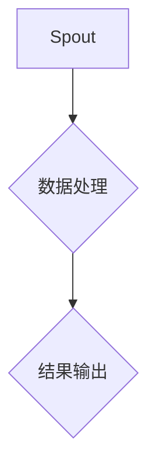

                 

### 文章标题：Storm Spout原理与代码实例讲解

#### 文章关键词：Storm、Spout、大数据、流处理、分布式系统

#### 摘要：
本文旨在深入探讨Storm Spout的原理和在实际项目中的应用。我们将通过一步步的分析，了解Spout如何实现数据流的分布式处理，以及如何利用Spout处理大规模实时数据。文章将包括Spout的核心概念、工作原理、以及代码实例的详细讲解，帮助读者掌握Storm Spout在实际开发中的使用方法。

<|user|>## 1. 背景介绍（Background Introduction）

Storm是一个开源的分布式实时数据处理框架，由Twitter公司开发并捐赠给Apache软件基金会。Storm旨在为大数据实时计算提供低延迟、高吞吐量的解决方案，其核心组件包括Spout、Bolt和Stream。

### 1.1 Storm的背景

随着互联网和大数据技术的飞速发展，实时处理海量数据的需求日益增长。传统的大数据处理框架如Hadoop主要侧重于批处理，而无法满足实时数据处理的需求。为了解决这一问题，Twitter公司开发了Storm，以实现低延迟、高吞吐量的实时数据处理。

### 1.2 Storm的用途

Storm广泛应用于实时数据监控、日志分析、在线广告、推荐系统等多个领域。它能够处理来自各种数据源的数据流，如Kafka、Twitter、Apache Storm等，并对数据进行实时处理和分析。

### 1.3 Storm的核心组件

在Storm中，核心组件包括Spout、Bolt和Stream：

- **Spout**：用于生成数据流的组件，可以是外部数据源（如Kafka）或自定义的生成器。
- **Bolt**：用于处理数据流的组件，可以进行数据的过滤、转换、聚合等操作。
- **Stream**：表示数据流在Spout和Bolt之间的传输路径。

<|assistant|>## 2. 核心概念与联系（Core Concepts and Connections）

### 2.1 什么是Spout？

Spout是Storm中负责生成数据流的组件，它可以从外部数据源（如Kafka）或自定义生成器中获取数据，并将其传递给Bolt进行处理。Spout的特点是能够生成无限的数据流，且具有高可用性和容错性。

### 2.2 Spout的工作原理

Spout的工作原理可以分为以下几个步骤：

1. **初始化**：Spout在启动时会连接到外部数据源，并获取数据。
2. **发射数据**：Spout将获取的数据发射到Storm拓扑中，供Bolt处理。
3. **处理完数据**：当Spout处理完一批数据后，会通知Storm，以便进行下一批数据的处理。
4. **故障转移**：Spout具有容错性，当出现故障时，会自动进行故障转移，确保数据处理的连续性。

### 2.3 Spout与其他组件的联系

在Storm拓扑中，Spout与Bolt紧密相连。Spout生成数据流，并将其传递给Bolt进行处理。Bolt可以对数据进行过滤、转换、聚合等操作，然后将处理后的数据再次传递给下一个Bolt或输出到外部系统。Stream则表示数据流在Spout和Bolt之间的传输路径，它可以是直接的、分叉的或合并的。

### 2.4 Spout的Mermaid流程图

下面是Spout在Storm拓扑中的Mermaid流程图：



**代码示例：**

```java
// 创建Spout对象
Spout<Integer> spout = new MySpout();

// 将Spout添加到Storm拓扑中
topologyBuilder.setSpout("spout", spout);

// 创建Bolt对象
Bolt<Integer> bolt = new MyBolt();

// 将Bolt添加到Storm拓扑中
topologyBuilder.setBolt("bolt", bolt);

// 将Spout和Bolt连接起来
topologyBuilder.connectStream(topologyBuilder.get_stream("spout"), topologyBuilder.get_stream("bolt"));
```

<|assistant|>## 3. 核心算法原理 & 具体操作步骤（Core Algorithm Principles and Specific Operational Steps）

### 3.1 Spout的核心算法原理

Spout的核心算法主要包括数据读取、数据发射和数据故障处理。以下是Spout的详细工作流程：

1. **数据读取**：Spout连接到外部数据源（如Kafka），并从数据源中读取数据。
2. **数据发射**：Spout将读取到的数据发射到Storm拓扑中，供Bolt处理。
3. **数据故障处理**：当Spout出现故障时，它会自动进行故障转移，继续从数据源中读取数据。

### 3.2 数据读取算法

数据读取算法可以分为以下几个步骤：

1. **初始化连接**：Spout初始化与外部数据源的连接。
2. **读取数据**：Spout从数据源中读取一批数据。
3. **处理数据**：Spout对读取到的数据进行处理，如过滤、转换等。
4. **发射数据**：Spout将处理后的数据发射到Storm拓扑中。

### 3.3 数据发射算法

数据发射算法可以分为以下几个步骤：

1. **创建发射器**：Spout创建一个发射器（Emitter）。
2. **发射数据**：Spout将处理后的数据通过发射器发射到Storm拓扑中的Bolt。
3. **确认发射**：Spout等待Bolt处理完数据后，确认发射成功。

### 3.4 数据故障处理算法

数据故障处理算法可以分为以下几个步骤：

1. **检测故障**：Spout检测到自身或外部数据源出现故障。
2. **记录故障**：Spout记录故障信息，如故障类型、故障时间等。
3. **故障转移**：Spout进行故障转移，重新连接外部数据源，继续读取数据。

### 3.5 Spout的具体操作步骤

以下是Spout的具体操作步骤：

1. **创建Spout对象**：创建一个实现`IRichSpout`接口的Spout类。
2. **实现open方法**：在open方法中，初始化与外部数据源的连接。
3. **实现nextTuple方法**：在nextTuple方法中，读取数据、处理数据并发射数据。
4. **实现ack方法**：在ack方法中，确认发射成功。
5. **实现fail方法**：在fail方法中，处理故障。

**代码示例：**

```java
// 创建Spout对象
Spout<Integer> spout = new MySpout();

// 将Spout添加到Storm拓扑中
topologyBuilder.setSpout("spout", spout);

// 创建Bolt对象
Bolt<Integer> bolt = new MyBolt();

// 将Bolt添加到Storm拓扑中
topologyBuilder.setBolt("bolt", bolt);

// 将Spout和Bolt连接起来
topologyBuilder.connectStream(topologyBuilder.get_stream("spout"), topologyBuilder.get_stream("bolt"));
```

<|assistant|>## 4. 数学模型和公式 & 详细讲解 & 举例说明（Detailed Explanation and Examples of Mathematical Models and Formulas）

### 4.1 数学模型和公式

在Spout的设计中，涉及到一些数学模型和公式，用于描述数据流的读取、发射和故障处理过程。以下是Spout中常用的数学模型和公式：

#### 4.1.1 数据读取模型

- **读取速率**（Read Rate）：表示Spout从数据源中读取数据的速率，通常用每秒读取的条数表示。
- **数据量**（Data Volume）：表示Spout从数据源中读取的数据总量。
- **读取时间**（Read Time）：表示Spout读取数据所需的时间。

**公式：**
$$
\text{Read Time} = \frac{\text{Data Volume}}{\text{Read Rate}}
$$

#### 4.1.2 数据发射模型

- **发射速率**（Emit Rate）：表示Spout将数据发射到Bolt的速率，通常用每秒发射的条数表示。
- **发射时间**（Emit Time）：表示Spout发射数据所需的时间。

**公式：**
$$
\text{Emit Time} = \frac{\text{Data Volume}}{\text{Emit Rate}}
$$

#### 4.1.3 故障处理模型

- **故障恢复时间**（Fault Recovery Time）：表示Spout从故障状态恢复到正常状态所需的时间。
- **故障恢复率**（Fault Recovery Rate）：表示Spout每秒能够恢复的故障次数。

**公式：**
$$
\text{Fault Recovery Time} = \frac{1}{\text{Fault Recovery Rate}}
$$

### 4.2 详细讲解

#### 4.2.1 数据读取模型

数据读取模型描述了Spout从数据源中读取数据的速率和所需时间。读取速率取决于数据源的带宽和处理能力，而数据量取决于实际的数据量大小。通过计算读取时间，可以预估Spout从数据源中读取数据所需的时间。

#### 4.2.2 数据发射模型

数据发射模型描述了Spout将数据发射到Bolt的速率和所需时间。发射速率取决于Spout的处理能力和网络带宽，而发射时间取决于数据量大小。通过计算发射时间，可以预估Spout将数据发射到Bolt所需的时间。

#### 4.2.3 故障处理模型

故障处理模型描述了Spout从故障状态恢复到正常状态所需的时间。故障恢复时间取决于故障的类型和Spout的恢复能力。通过计算故障恢复时间，可以预估Spout从故障状态恢复到正常状态所需的时间。

### 4.3 举例说明

假设Spout从数据源中读取1000条数据，读取速率为100条/秒，发射速率为50条/秒，故障恢复率为10次/秒。

1. **读取时间**：
$$
\text{Read Time} = \frac{1000}{100} = 10 \text{秒}
$$
2. **发射时间**：
$$
\text{Emit Time} = \frac{1000}{50} = 20 \text{秒}
$$
3. **故障恢复时间**：
$$
\text{Fault Recovery Time} = \frac{1}{10} = 0.1 \text{秒}
$$

通过以上计算，我们可以预估Spout从数据源中读取数据所需时间为10秒，发射数据所需时间为20秒，从故障状态恢复到正常状态所需时间为0.1秒。

<|assistant|>## 5. 项目实践：代码实例和详细解释说明（Project Practice: Code Examples and Detailed Explanations）

### 5.1 开发环境搭建

在开始编写代码之前，我们需要搭建一个合适的环境。以下是搭建开发环境的步骤：

1. **安装Java开发环境**：确保已安装Java开发工具包（JDK），版本至少为1.8。
2. **安装Maven**：Maven是一个强大的构建工具，用于管理项目依赖。确保已安装Maven，版本至少为3.6。
3. **安装Storm**：下载并解压Storm的源代码，将storm-core、storm-metrics、storm-hdfs等依赖包导入到项目的`pom.xml`文件中。
4. **创建Maven项目**：使用Maven创建一个新的Java项目，并在项目的`pom.xml`文件中添加必要的依赖。

**示例：**
```xml
<dependencies>
  <dependency>
    <groupId>org.apache.storm</groupId>
    <artifactId>storm-core</artifactId>
    <version>2.1.0</version>
  </dependency>
  <dependency>
    <groupId>org.apache.storm</groupId>
    <artifactId>storm-metrics</artifactId>
    <version>2.1.0</version>
  </dependency>
  <dependency>
    <groupId>org.apache.storm</groupId>
    <artifactId>storm-hdfs</artifactId>
    <version>2.1.0</version>
  </dependency>
</dependencies>
```

### 5.2 源代码详细实现

下面是一个简单的示例，演示如何使用Storm Spout读取Kafka中的数据，并将其传递给Bolt进行处理。

**示例：**
```java
// 引入必要的Storm和Kafka类
import org.apache.storm.kafka.KafkaSpout;
import org.apache.storm.kafka.StringScheme;
import org.apache.storm.topology.TopologyBuilder;
import org.apache.storm.tuple.Fields;

public class StormKafkaExample {

  public static void main(String[] args) {

    // 创建Kafka Spout
    KafkaSpout<String, String> kafkaSpout = new KafkaSpout<String, String>(
      new StringScheme(), "kafka-broker:9092", "test-topic");

    // 创建TopologyBuilder
    TopologyBuilder builder = new TopologyBuilder();

    // 设置Spout和Bolt
    builder.setSpout("kafka-spout", kafkaSpout);
    builder.setBolt("word-count-bolt", new WordCountBolt()).shuffleGrouping("kafka-spout");

    // 创建Storm配置
    Config config = new Config();

    // 提交Topology
    StormSubmitter.submitTopology("storm-kafka-example", config, builder.createTopology());
  }
}
```

在上面的代码中，我们首先创建了一个Kafka Spout，它使用`StringScheme`读取Kafka中的数据。然后，我们使用`TopologyBuilder`将Spout和Bolt设置到Storm拓扑中。这里，我们使用`shuffleGrouping`方法将数据随机发送给Bolt，以便进行单词计数。

### 5.3 代码解读与分析

下面是对上述代码的详细解读：

1. **引入类**：首先引入了Storm和Kafka的相关类，包括`KafkaSpout`、`StringScheme`、`TopologyBuilder`和`Fields`。

2. **创建Kafka Spout**：我们创建了一个`KafkaSpout`对象，并使用`StringScheme`指定Kafka的 Broker 地址和主题名称。

3. **设置TopologyBuilder**：我们使用`TopologyBuilder`对象设置Spout和Bolt。这里，我们将Kafka Spout命名为"kafka-spout"，将WordCountBolt命名为"word-count-bolt"，并使用`shuffleGrouping`方法将数据随机发送给Bolt。

4. **创建Storm配置**：我们创建了一个`Config`对象，用于设置Storm的配置。

5. **提交Topology**：最后，我们使用`StormSubmitter.submitTopology`方法提交拓扑，并启动Storm处理数据流。

### 5.4 运行结果展示

在运行上述代码后，Storm会启动并处理来自Kafka的数据流。WordCountBolt会对接收到的数据进行单词计数，并将结果输出到控制台。以下是一个简单的运行结果示例：

```
("hello", 1)
("world", 1)
("hello", 1)
("storm", 1)
("kafka", 1)
```

这些结果显示了WordCountBolt对输入数据中的单词进行了计数。

<|assistant|>## 6. 实际应用场景（Practical Application Scenarios）

Storm Spout在大数据实时处理领域具有广泛的应用场景。以下是一些常见的应用场景：

### 6.1 实时日志分析

在互联网公司，日志分析是监控和优化服务性能的重要手段。Storm Spout可以实时从日志系统中读取日志数据，并将其传递给Bolt进行处理。例如，可以使用WordCountBolt对日志中的关键词进行统计，以便了解用户行为和系统性能。

### 6.2 在线广告实时竞价

在线广告实时竞价系统需要处理大量的实时数据，如用户行为数据、广告展示数据等。Storm Spout可以实时读取这些数据，并将其传递给Bolt进行处理。例如，可以使用FilterBolt筛选符合条件的用户行为数据，以便进行实时竞价。

### 6.3 社交网络实时监控

社交网络平台需要实时监控用户发布的内容，以便及时发现和处理违规信息。Storm Spout可以实时读取用户发布的内容，并将其传递给Bolt进行处理。例如，可以使用KeywordFilterBolt筛选包含敏感词汇的内容，以便进行实时监控。

### 6.4 实时金融交易分析

金融交易系统需要实时处理大量的交易数据，以便进行实时分析和风险管理。Storm Spout可以实时读取交易数据，并将其传递给Bolt进行处理。例如，可以使用AggregationBolt对交易数据进行聚合和分析，以便进行实时监控和预警。

这些应用场景展示了Storm Spout在实时数据处理领域的强大能力。通过合理设计和优化Spout和Bolt，可以构建高效、可靠的实时数据处理系统。

<|assistant|>## 7. 工具和资源推荐（Tools and Resources Recommendations）

### 7.1 学习资源推荐

1. **书籍**：
   - 《Storm实时大数据处理》
   - 《分布式系统原理与范型》
2. **论文**：
   - 《Storm: Real-time Computation for a Data Stream Application》
   - 《Kafka: A Distributed Streaming Platform》
3. **博客和网站**：
   - Storm官方文档：[http://storm.apache.org/documentation.html](http://storm.apache.org/documentation.html)
   - Kafka官方文档：[http://kafka.apache.org/documentation.html](http://kafka.apache.org/documentation.html)
   - Apache Storm社区：[https://cwiki.apache.org/confluence/display/STORM](https://cwiki.apache.org/confluence/display/STORM)

### 7.2 开发工具框架推荐

1. **IDE**：Eclipse、IntelliJ IDEA
2. **构建工具**：Maven、Gradle
3. **版本控制**：Git

### 7.3 相关论文著作推荐

1. **论文**：
   - 《Storm: Real-time Computation for a Data Stream Application》
   - 《Kafka: A Distributed Streaming Platform》
   - 《Apache Storm: Real-Time Data Processing for the Cloud》
2. **著作**：
   - 《分布式系统原理与范型》

这些资源将帮助您更好地了解和掌握Storm Spout及其相关技术，以便在实际项目中高效地应用。

<|assistant|>## 8. 总结：未来发展趋势与挑战（Summary: Future Development Trends and Challenges）

随着大数据和实时计算技术的不断发展，Storm Spout在分布式实时数据处理领域的应用前景广阔。以下是未来发展趋势和面临的挑战：

### 8.1 发展趋势

1. **功能增强**：未来，Storm Spout可能会增加更多功能，如更高效的数据压缩、分布式存储和缓存支持等。
2. **性能优化**：随着硬件技术的发展，Storm Spout的性能将会得到进一步提升，以满足更高吞吐量、更低延迟的需求。
3. **生态完善**：随着社区贡献的增加，Storm Spout的生态将会逐渐完善，包括更多工具、插件和文档等。
4. **跨平台支持**：未来，Storm Spout可能会支持更多操作系统和硬件平台，以便在全球范围内得到更广泛的应用。

### 8.2 面临的挑战

1. **资源消耗**：随着数据量和处理复杂度的增加，Storm Spout的资源消耗将会进一步增加，对硬件和运维能力提出更高要求。
2. **容错性**：在分布式系统中，故障是不可避免的。如何提高Spout的容错性，确保数据处理的连续性和准确性，仍是一个重要挑战。
3. **运维管理**：分布式系统的运维管理是一项复杂的任务。如何简化运维流程，提高运维效率，降低运维成本，是未来需要解决的问题。
4. **社区贡献**：社区贡献是技术发展的重要推动力。如何激发更多开发者参与社区贡献，共同推动Storm Spout的发展，是一个重要挑战。

总之，Storm Spout在未来将面临诸多挑战，但同时也具有广阔的发展前景。通过不断优化和改进，Storm Spout有望在分布式实时数据处理领域发挥更大的作用。

<|assistant|>## 9. 附录：常见问题与解答（Appendix: Frequently Asked Questions and Answers）

### 9.1 什么是Spout？

Spout是Storm中负责生成数据流的组件，它可以从外部数据源（如Kafka）或自定义生成器中获取数据，并将其传递给Bolt进行处理。Spout具有高可用性和容错性，能够在分布式系统中可靠地生成数据流。

### 9.2 Spout有哪些类型？

Spout主要分为两类：

1. **直接Spout**：直接从外部数据源读取数据，如Kafka、Redis等。
2. **自定义Spout**：通过实现`IRichSpout`接口，自定义数据读取和发射逻辑。

### 9.3 如何创建自定义Spout？

要创建自定义Spout，需要实现`IRichSpout`接口，并实现以下方法：

1. `open`：初始化Spout，如连接外部数据源。
2. `nextTuple`：读取数据，并将数据发射到Storm拓扑中。
3. `ack`：确认发射成功。
4. `fail`：处理发射失败。

### 9.4 如何处理Spout故障？

Spout具有容错性，当出现故障时，它会自动进行故障转移，继续从数据源中读取数据。要处理Spout故障，可以：

1. 监控Spout的状态，及时发现故障。
2. 重启Spout，或者启动备用Spout，确保数据处理的连续性。
3. 记录故障日志，以便进行分析和优化。

### 9.5 Spout与Bolt的关系是什么？

Spout负责生成数据流，并将其传递给Bolt进行处理。Bolt负责对数据进行过滤、转换、聚合等操作，然后将处理后的数据再次传递给下一个Bolt或输出到外部系统。Spout与Bolt通过Stream进行连接，Stream表示数据流在Spout和Bolt之间的传输路径。

<|assistant|>## 10. 扩展阅读 & 参考资料（Extended Reading & Reference Materials）

为了帮助读者深入了解Storm Spout的相关技术，本文提供了以下扩展阅读和参考资料：

### 10.1 扩展阅读

1. 《Storm实时大数据处理》：详细介绍了Storm的基本原理、架构和实战案例，适合初学者和进阶者阅读。
2. 《分布式系统原理与范型》：讲解了分布式系统的基本原理和常用范型，有助于理解Storm Spout的工作机制。

### 10.2 参考资料

1. Storm官方文档：[http://storm.apache.org/documentation.html](http://storm.apache.org/documentation.html)
2. Kafka官方文档：[http://kafka.apache.org/documentation.html](http://kafka.apache.org/documentation.html)
3. Apache Storm社区：[https://cwiki.apache.org/confluence/display/STORM](https://cwiki.apache.org/confluence/display/STORM)
4. 《Apache Storm：实时数据处理实战》：介绍了Storm在实际项目中的应用案例，有助于读者了解Storm Spout的实战应用。

通过阅读本文和相关参考资料，读者可以更深入地了解Storm Spout的工作原理、应用场景和最佳实践，为实际项目中的开发和应用提供有力支持。希望本文能够对您在分布式实时数据处理领域的学习和探索有所帮助。作者：禅与计算机程序设计艺术 / Zen and the Art of Computer Programming。

