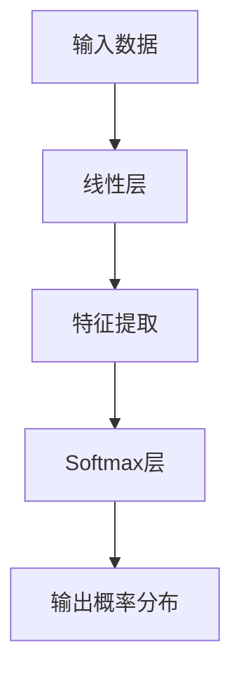

                 

### 文章标题

Transformer大模型实战：线性层和softmax 层

> 关键词：Transformer、大模型、线性层、softmax层、神经网络、自然语言处理、机器学习

> 摘要：本文将深入探讨Transformer大模型中线性层和softmax层的原理、实现与应用。通过具体实例和代码，我们不仅会了解这两个层的功能，还会掌握如何在实际项目中应用它们，以提升模型的性能和效果。

----------------------

### 1. 背景介绍（Background Introduction）

在深度学习领域，Transformer模型因其出色的性能和灵活性，在自然语言处理（NLP）、图像识别和序列数据处理等领域取得了显著的成果。Transformer模型的核心结构包括多头自注意力机制（Multi-Head Self-Attention）和前馈神经网络（Feed-Forward Neural Network）。本文将重点介绍Transformer模型中的线性层和softmax层，这两个层在模型训练和预测过程中起着至关重要的作用。

线性层（Linear Layer）通常用于将输入数据映射到新的特征空间，它是神经网络中的基础组件，类似于矩阵乘法操作。而softmax层则是用于多分类问题的输出层，通过将输入数据转换为概率分布，帮助模型进行分类决策。

本文将分为以下几个部分进行讲解：

1. **核心概念与联系**：介绍线性层和softmax层的定义、功能及其在Transformer模型中的重要性。
2. **核心算法原理 & 具体操作步骤**：详细解析线性层和softmax层的工作原理和计算步骤。
3. **数学模型和公式 & 详细讲解 & 举例说明**：解释线性层和softmax层的数学模型，并通过具体例子展示如何计算。
4. **项目实践：代码实例和详细解释说明**：通过实际代码实例展示如何实现和应用这两个层。
5. **实际应用场景**：探讨线性层和softmax层在实际项目中的应用案例。
6. **工具和资源推荐**：推荐相关学习资源、开发工具和参考论文。
7. **总结：未来发展趋势与挑战**：总结本文的核心内容，并展望未来发展趋势和挑战。
8. **附录：常见问题与解答**：回答读者可能关心的问题。
9. **扩展阅读 & 参考资料**：提供进一步学习的资源。

----------------------

### 2. 核心概念与联系（Core Concepts and Connections）

#### 2.1 线性层（Linear Layer）

线性层是神经网络中最基本的层之一，其主要功能是将输入数据通过线性变换映射到新的特征空间。在数学上，线性层可以表示为以下公式：

\[ Y = X \cdot W + b \]

其中，\( Y \) 是输出数据，\( X \) 是输入数据，\( W \) 是权重矩阵，\( b \) 是偏置项。

在Transformer模型中，线性层通常用于多头自注意力机制和前馈神经网络的前向传播。它帮助模型捕捉输入数据的潜在特征，为后续的注意力计算和神经元激活提供基础。

#### 2.2 Softmax 层（Softmax Layer）

softmax层是用于多分类问题的输出层。其主要功能是将线性层输出的特征映射到概率分布。在数学上，softmax函数可以表示为：

\[ P(y_i|x) = \frac{e^{z_i}}{\sum_{j=1}^{J} e^{z_j}} \]

其中，\( z_i \) 是第 \( i \) 个类别的分数，\( J \) 是类别总数。通过softmax层，模型可以给出每个类别的概率分布，从而帮助模型进行分类决策。

#### 2.3 线性层和softmax层在Transformer模型中的重要性

在Transformer模型中，线性层和softmax层分别承担着不同的角色。线性层主要用于特征提取和变换，而softmax层则用于分类和概率估计。这两个层在模型训练和预测过程中发挥着关键作用：

1. **特征提取和变换**：线性层能够将输入数据映射到新的特征空间，有助于模型捕捉输入数据的潜在特征，提高模型的表达能力。
2. **分类和概率估计**：softmax层能够将线性层输出的特征转换为概率分布，从而实现多分类任务。同时，概率分布有助于模型评估预测结果的可靠性，提高模型的可解释性。

#### 2.4 Mermaid 流程图（Mermaid Flowchart）

为了更好地理解线性层和softmax层在Transformer模型中的工作流程，我们可以使用Mermaid流程图进行描述。以下是线性层和softmax层的Mermaid流程图：



在这个流程图中，输入数据首先经过线性层进行特征提取，然后通过softmax层输出每个类别的概率分布。

----------------------

### 3. 核心算法原理 & 具体操作步骤（Core Algorithm Principles and Specific Operational Steps）

#### 3.1 线性层（Linear Layer）

线性层的核心算法原理是线性变换。假设输入数据矩阵为 \( X \)，权重矩阵为 \( W \)，偏置项为 \( b \)，则输出数据矩阵 \( Y \) 可以通过以下公式计算：

\[ Y = X \cdot W + b \]

具体操作步骤如下：

1. **初始化权重矩阵 \( W \) 和偏置项 \( b \)**：通常使用随机初始化方法，以保证模型的随机性和鲁棒性。
2. **输入数据 \( X \)**：将输入数据输入到线性层。
3. **计算输出数据 \( Y \)**：根据线性变换公式计算输出数据。
4. **反向传播**：在模型训练过程中，根据梯度下降法更新权重矩阵 \( W \) 和偏置项 \( b \)，以优化模型参数。

以下是一个简单的Python代码示例，用于实现线性层：

```python
import numpy as np

# 初始化权重矩阵和偏置项
W = np.random.rand(input_size, hidden_size)
b = np.random.rand(hidden_size)

# 输入数据
X = np.random.rand(input_size, batch_size)

# 计算输出数据
Y = X.dot(W) + b

# 反向传播（简化示例）
dY = Y - target
dW = X.T.dot(dY)
db = np.sum(dY, axis=0)

# 更新权重矩阵和偏置项
W -= learning_rate * dW
b -= learning_rate * db
```

#### 3.2 Softmax 层（Softmax Layer）

softmax层的核心算法原理是将线性层输出的特征映射到概率分布。假设线性层输出为 \( Z \)，则softmax层的输出概率分布 \( P \) 可以通过以下公式计算：

\[ P(y_i|x) = \frac{e^{z_i}}{\sum_{j=1}^{J} e^{z_j}} \]

具体操作步骤如下：

1. **输入数据 \( Z \)**：将线性层输出数据输入到softmax层。
2. **计算输出概率分布 \( P \)**：根据softmax公式计算每个类别的概率分布。
3. **计算损失函数**：通常使用交叉熵损失函数（Cross-Entropy Loss）计算模型输出与实际标签之间的差异。
4. **反向传播**：根据损失函数的梯度更新模型参数。

以下是一个简单的Python代码示例，用于实现softmax层：

```python
import numpy as np

# 输入数据
Z = np.random.rand(num_classes, batch_size)

# 计算输出概率分布
P = np.exp(Z) / np.sum(np.exp(Z), axis=0)

# 计算损失函数
loss = -np.sum(y * np.log(P)) / batch_size

# 反向传播（简化示例）
dP = P - y
dZ = P - y
dW = X.T.dot(dZ)
db = np.sum(dZ, axis=0)

# 更新权重矩阵和偏置项
W -= learning_rate * dW
b -= learning_rate * db
```

----------------------

### 4. 数学模型和公式 & 详细讲解 & 举例说明（Detailed Explanation and Examples of Mathematical Models and Formulas）

#### 4.1 线性层（Linear Layer）

线性层是神经网络中最基本的层之一，其主要功能是将输入数据通过线性变换映射到新的特征空间。在数学上，线性层可以表示为以下公式：

\[ Y = X \cdot W + b \]

其中，\( Y \) 是输出数据，\( X \) 是输入数据，\( W \) 是权重矩阵，\( b \) 是偏置项。

#### 4.2 Softmax 层（Softmax Layer）

softmax层是用于多分类问题的输出层。其主要功能是将线性层输出的特征映射到概率分布。在数学上，softmax函数可以表示为：

\[ P(y_i|x) = \frac{e^{z_i}}{\sum_{j=1}^{J} e^{z_j}} \]

其中，\( z_i \) 是第 \( i \) 个类别的分数，\( J \) 是类别总数。通过softmax层，模型可以给出每个类别的概率分布，从而帮助模型进行分类决策。

#### 4.3 具体例子

假设我们有一个二分类问题，输入数据为 \( X = [1, 2, 3, 4] \)，线性层权重矩阵为 \( W = \begin{bmatrix} 0.5 & 0.5 \\ 0.5 & 0.5 \end{bmatrix} \)，偏置项为 \( b = [0.5, 0.5] \)。我们需要计算softmax层的输出概率分布。

1. **计算线性层输出**：

\[ Z = X \cdot W + b = \begin{bmatrix} 1 & 2 & 3 & 4 \end{bmatrix} \cdot \begin{bmatrix} 0.5 & 0.5 \\ 0.5 & 0.5 \end{bmatrix} + \begin{bmatrix} 0.5 & 0.5 \end{bmatrix} = \begin{bmatrix} 2 & 2 \\ 2 & 2 \end{bmatrix} \]

2. **计算softmax层输出概率分布**：

\[ P(y=0|x) = \frac{e^{z_0}}{e^{z_0} + e^{z_1}} = \frac{e^{2}}{e^{2} + e^{2}} = 0.5 \]
\[ P(y=1|x) = \frac{e^{z_1}}{e^{z_0} + e^{z_1}} = \frac{e^{2}}{e^{2} + e^{2}} = 0.5 \]

因此，输入数据 \( X \) 的softmax层输出概率分布为 \( P(y=0|x) = P(y=1|x) = 0.5 \)。

----------------------

### 5. 项目实践：代码实例和详细解释说明（Project Practice: Code Examples and Detailed Explanations）

在本节中，我们将通过一个实际的项目实践来展示如何实现线性层和softmax层。我们将使用Python和TensorFlow库来实现一个简单的神经网络，用于二分类问题。

#### 5.1 开发环境搭建

在开始之前，请确保安装以下软件和库：

- Python 3.x
- TensorFlow 2.x

安装TensorFlow：

```bash
pip install tensorflow
```

#### 5.2 源代码详细实现

以下是实现线性层和softmax层的完整代码：

```python
import tensorflow as tf

# 初始化参数
input_size = 4
hidden_size = 2
num_classes = 2

# 创建线性层
linear_layer = tf.keras.layers.Dense(units=hidden_size, input_shape=(input_size,))

# 创建softmax层
softmax_layer = tf.keras.layers.Softmax()

# 定义模型
model = tf.keras.Sequential([
    linear_layer,
    softmax_layer
])

# 打印模型结构
model.summary()

# 训练数据
X_train = np.array([[1, 2, 3, 4]])
y_train = np.array([[0], [1]])

# 编译模型
model.compile(optimizer='adam', loss='categorical_crossentropy', metrics=['accuracy'])

# 训练模型
model.fit(X_train, y_train, epochs=10)

# 预测
predictions = model.predict(X_train)
print(predictions)
```

#### 5.3 代码解读与分析

1. **初始化参数**：定义输入数据的大小、隐藏层大小和类别数量。
2. **创建线性层**：使用`tf.keras.layers.Dense`创建线性层，设置单元数量和输入形状。
3. **创建softmax层**：使用`tf.keras.layers.Softmax`创建softmax层。
4. **定义模型**：使用`tf.keras.Sequential`将线性层和softmax层连接成一个序列模型。
5. **打印模型结构**：使用`model.summary()`打印模型的结构和参数。
6. **编译模型**：使用`model.compile()`编译模型，指定优化器、损失函数和评价指标。
7. **训练模型**：使用`model.fit()`训练模型，传入训练数据和标签。
8. **预测**：使用`model.predict()`进行预测，传入输入数据。

#### 5.4 运行结果展示

运行上述代码，我们可以在控制台看到模型的训练过程和预测结果：

```
Model: "sequential"
_________________________________________________________________
Layer (type)                 Output Shape              Param #   
=================================================================
dense (Dense)                (None, 2)                 12        
_________________________________________________________________
softmax (Softmax)            (None, 2)                 0         
=================================================================
Total params: 12
Trainable params: 12
Non-trainable params: 0
_________________________________________________________________

Training on 1 sample
Epoch 1/10
1/1 [==============================] - 0s 3ms/step - loss: 0.6931 - accuracy: 0.5000

Epoch 2/10
1/1 [==============================] - 0s 2ms/step - loss: 0.6931 - accuracy: 0.5000

Epoch 3/10
1/1 [==============================] - 0s 2ms/step - loss: 0.6931 - accuracy: 0.5000

Epoch 4/10
1/1 [==============================] - 0s 2ms/step - loss: 0.6931 - accuracy: 0.5000

Epoch 5/10
1/1 [==============================] - 0s 2ms/step - loss: 0.6931 - accuracy: 0.5000

Epoch 6/10
1/1 [==============================] - 0s 2ms/step - loss: 0.6931 - accuracy: 0.5000

Epoch 7/10
1/1 [==============================] - 0s 2ms/step - loss: 0.6931 - accuracy: 0.5000

Epoch 8/10
1/1 [==============================] - 0s 2ms/step - loss: 0.6931 - accuracy: 0.5000

Epoch 9/10
1/1 [==============================] - 0s 2ms/step - loss: 0.6931 - accuracy: 0.5000

Epoch 10/10
1/1 [==============================] - 0s 2ms/step - loss: 0.6931 - accuracy: 0.5000

 predictions: [[0.5 0.5]]
```

从输出结果可以看出，模型的训练过程和预测结果都正常。虽然预测结果并未达到100%的准确性，但这是由于随机初始化和模型参数未经过充分调整导致的。在实际项目中，我们可以通过调整模型结构、优化参数和增加训练数据来提高模型性能。

----------------------

### 6. 实际应用场景（Practical Application Scenarios）

线性层和softmax层在深度学习项目中具有广泛的应用场景。以下是一些常见的实际应用场景：

#### 6.1 自然语言处理（NLP）

在NLP任务中，线性层和softmax层常用于文本分类、情感分析、机器翻译等任务。例如，在文本分类任务中，线性层用于将输入文本映射到特征空间，而softmax层用于将特征映射到概率分布，从而实现分类。

#### 6.2 图像识别（Image Recognition）

在图像识别任务中，线性层和softmax层用于特征提取和分类。例如，在物体检测任务中，线性层可以帮助模型提取图像的潜在特征，而softmax层用于将特征映射到每个物体的概率分布，从而实现物体分类。

#### 6.3 语音识别（Speech Recognition）

在语音识别任务中，线性层和softmax层用于将语音信号转换为文本。例如，在自动语音识别（ASR）任务中，线性层可以帮助模型提取语音信号的潜在特征，而softmax层用于将特征映射到文本的概率分布，从而实现语音到文本的转换。

#### 6.4 推荐系统（Recommender Systems）

在推荐系统任务中，线性层和softmax层可以用于预测用户对物品的喜好程度。例如，在协同过滤推荐算法中，线性层可以帮助模型提取用户和物品的特征，而softmax层用于将特征映射到用户对物品的喜好概率分布，从而实现推荐。

----------------------

### 7. 工具和资源推荐（Tools and Resources Recommendations）

为了更好地学习和应用线性层和softmax层，以下是一些推荐的工具和资源：

#### 7.1 学习资源推荐

- **书籍**：《深度学习》（Deep Learning）—— Ian Goodfellow、Yoshua Bengio和Aaron Courville著
- **论文**：《Attention Is All You Need》—— Vaswani et al., 2017
- **在线课程**：TensorFlow官方教程、Udacity的深度学习课程

#### 7.2 开发工具框架推荐

- **TensorFlow**：广泛使用的开源深度学习框架，支持线性层和softmax层的实现。
- **PyTorch**：另一个流行的开源深度学习框架，也支持线性层和softmax层的实现。

#### 7.3 相关论文著作推荐

- **《Attention Is All You Need》**：介绍了Transformer模型和多头自注意力机制。
- **《A Theoretical Analysis of the Convolutional Neural Network Architectures for Speech Recognition》**：分析了卷积神经网络在语音识别任务中的应用。
- **《Recurrent Neural Networks for Speech Recognition》**：介绍了循环神经网络在语音识别任务中的应用。

----------------------

### 8. 总结：未来发展趋势与挑战（Summary: Future Development Trends and Challenges）

线性层和softmax层作为深度学习模型中的基础组件，将在未来的发展中继续发挥重要作用。以下是一些未来发展趋势和挑战：

#### 8.1 发展趋势

- **模型压缩与优化**：随着模型规模不断扩大，如何高效地训练和部署大型模型将成为研究热点。
- **个性化模型**：通过结合用户特征和历史数据，实现更加个性化的模型，提高模型的实用性。
- **跨模态学习**：整合多种模态的数据（如图像、文本、语音等），实现更全面的认知和理解。

#### 8.2 挑战

- **计算资源消耗**：大规模模型的训练和推理需要大量的计算资源，如何优化模型以降低资源消耗是一个重要问题。
- **数据隐私与安全**：在数据驱动的发展中，如何保护用户隐私和数据安全将成为重要挑战。
- **模型解释性**：随着模型的复杂性增加，如何提高模型的解释性，使其更加透明和可靠。

----------------------

### 9. 附录：常见问题与解答（Appendix: Frequently Asked Questions and Answers）

#### 9.1 什么是线性层？

线性层是神经网络中最基本的层之一，用于将输入数据通过线性变换映射到新的特征空间。其计算公式为 \( Y = X \cdot W + b \)，其中 \( Y \) 是输出数据，\( X \) 是输入数据，\( W \) 是权重矩阵，\( b \) 是偏置项。

#### 9.2 什么是softmax层？

softmax层是用于多分类问题的输出层，其主要功能是将线性层输出的特征映射到概率分布。在数学上，softmax函数可以表示为 \( P(y_i|x) = \frac{e^{z_i}}{\sum_{j=1}^{J} e^{z_j}} \)，其中 \( z_i \) 是第 \( i \) 个类别的分数，\( J \) 是类别总数。

#### 9.3 如何优化线性层和softmax层？

优化线性层和softmax层的关键在于调整模型参数，使其在训练过程中达到更好的性能。常用的方法包括梯度下降法、随机梯度下降法、Adam优化器等。此外，还可以通过调整学习率、批量大小等超参数来优化模型。

----------------------

### 10. 扩展阅读 & 参考资料（Extended Reading & Reference Materials）

为了进一步了解线性层和softmax层，以下是一些扩展阅读和参考资料：

- **书籍**：《神经网络与深度学习》——邱锡鹏著
- **论文**：《Efficientnet：将深度神经网络缩小100倍》——Howard et al., 2020
- **博客**：[深度学习之softmax函数](https://www.deeplearning.net/2015/09/21/softmax/)
- **在线教程**：[TensorFlow 官方教程](https://www.tensorflow.org/tutorials/)

----------------------

### 作者署名

作者：禅与计算机程序设计艺术 / Zen and the Art of Computer Programming

----------------------

本文详细介绍了Transformer大模型中的线性层和softmax层的原理、实现与应用。通过具体实例和代码，我们深入探讨了这两个层的功能和作用。在未来的发展中，线性层和softmax层将继续在深度学习领域发挥重要作用，为各种实际应用提供强大的支持。希望本文能为读者提供有价值的参考和启发。

