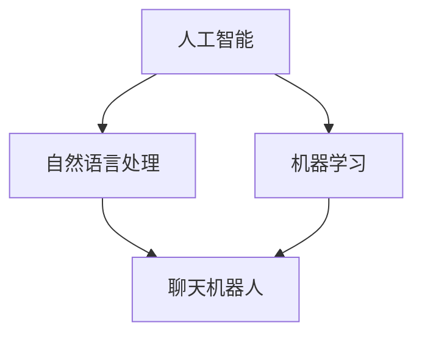
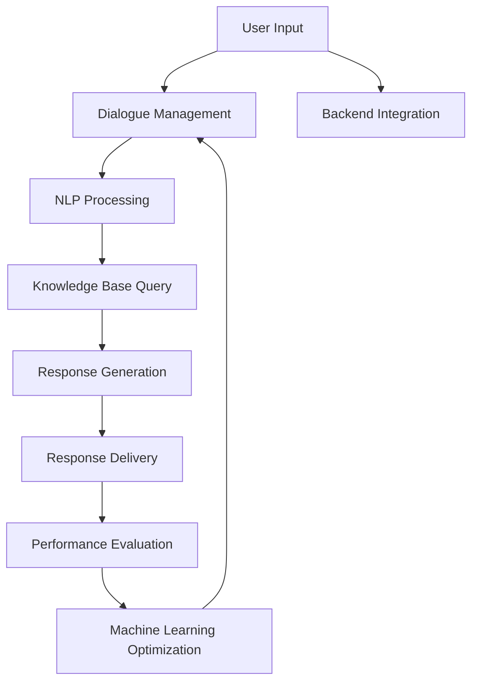

                 

### 1. 背景介绍（Background Introduction）

在当今数字化时代，企业面临着日益增长的服务需求，传统的客户服务模式已经难以满足24/7的高效响应。智能客户服务解决方案的出现，为企业提供了一种全新的应对方式。24/7智能客户服务解决方案利用先进的人工智能技术，包括自然语言处理（NLP）、机器学习和聊天机器人等，来实现全天候的客户服务。

随着全球电商的迅猛发展，消费者的期望值不断提高，他们希望在任何时间、任何地点都能获得快速、准确的服务。这种需求推动了企业寻求智能化的解决方案，以满足消费者的期望，提高客户满意度。此外，新冠疫情的爆发进一步加速了数字化转型，许多企业不得不迅速调整运营策略，以确保客户服务的连续性。

传统的客户服务主要依赖于人工处理，存在响应速度慢、成本高、易出错等问题。而智能客户服务解决方案通过自动化处理客户查询，减少了人工干预的需求，提高了服务效率。同时，智能客服系统能够处理大量的客户请求，而不会因为工作量过大而出现服务中断。

智能客户服务解决方案不仅能够提供基本的问答服务，还能够通过分析和学习客户行为，提供个性化的服务建议。例如，聊天机器人可以根据客户的购买历史、偏好等信息，提供定制化的推荐和服务。这种个性化的服务体验能够显著提升客户忠诚度。

此外，智能客户服务解决方案还能够帮助企业收集客户反馈，通过数据分析来识别问题和改进服务。这种反馈循环有助于企业不断优化客户服务流程，提高整体服务质量。

总的来说，24/7智能客户服务解决方案在当今数字化时代具有重要的意义。它不仅能够满足消费者对高效服务的需求，还能够帮助企业降低成本、提高效率，并最终实现客户满意度和业务增长的双重目标。

## Background Introduction

In the current digital age, businesses are facing increasing service demands that traditional customer service models struggle to meet efficiently. The emergence of intelligent customer service solutions has provided a novel approach for enterprises to tackle this challenge. 24/7 intelligent customer service solutions leverage advanced artificial intelligence technologies, including natural language processing (NLP), machine learning, and chatbots, to deliver round-the-clock customer service.

With the rapid growth of global e-commerce, consumers' expectations have risen significantly, demanding quick and accurate service at any time and any location. This has driven businesses to seek intelligent solutions to meet consumer expectations and enhance customer satisfaction. Moreover, the outbreak of the COVID-19 pandemic accelerated digital transformation, compelling many enterprises to rapidly adjust their operational strategies to ensure the continuity of customer service.

Traditional customer service primarily relies on manual processing, which is prone to slow response times, high costs, and errors. Intelligent customer service solutions, on the other hand, automate the handling of customer inquiries, reducing the need for human intervention and improving service efficiency. Additionally, intelligent customer service systems can process a large volume of customer requests without experiencing service disruptions due to heavy workloads.

Intelligent customer service solutions not only provide basic Q&A services but can also analyze and learn from customer behavior to offer personalized service recommendations. For instance, chatbots can provide customized suggestions based on a customer's purchase history and preferences. This personalized service experience can significantly enhance customer loyalty.

Furthermore, intelligent customer service solutions enable businesses to collect customer feedback through data analysis to identify issues and improve services. This feedback loop helps enterprises continuously optimize customer service processes and improve overall service quality.

In summary, 24/7 intelligent customer service solutions hold significant importance in the current digital era. They not only meet the demand for efficient service from consumers but also help businesses reduce costs, increase efficiency, and ultimately achieve dual goals of customer satisfaction and business growth.### 2. 核心概念与联系（Core Concepts and Connections）

要构建一个高效的24/7智能客户服务解决方案，我们需要深入理解几个核心概念，包括人工智能（AI）、自然语言处理（NLP）、机器学习（ML）以及聊天机器人（Chatbot）。

首先，人工智能是一种模拟人类智能的技术，它使计算机系统能够执行通常需要人类智能的任务，如视觉识别、语音识别、决策和语言理解。人工智能可以分为两大类：弱人工智能和强人工智能。弱人工智能专注于特定任务，如聊天机器人，而强人工智能则具有普遍的智能，能够在任何领域执行任何任务。

自然语言处理是人工智能的一个重要分支，旨在使计算机能够理解和处理自然语言，即人类语言。NLP涉及文本分析、语音识别、情感分析、命名实体识别等多个方面。在智能客服中，NLP是实现自然语言理解和生成的重要工具。

机器学习是使计算机能够从数据中学习并改进性能的一种方法。它通过构建模型，从训练数据中提取规律，然后使用这些模型对新数据进行预测或决策。机器学习可以分为监督学习、无监督学习和强化学习。在智能客服中，监督学习通常用于构建聊天机器人，以便从历史对话中学习如何更好地与客户交流。

聊天机器人是使用上述AI、NLP和ML技术构建的应用程序，用于模拟人类与用户的交互。聊天机器人可以处理各种任务，从简单的问答到复杂的客户服务请求。它们的优点在于能够24/7无休地工作，快速响应客户请求，同时降低企业的人力成本。

为了更好地理解这些概念之间的联系，我们可以使用Mermaid流程图来展示它们之间的关系。



在这个流程图中，人工智能作为整体框架，它包含了自然语言处理和机器学习两个子领域。自然语言处理和机器学习共同作用于聊天机器人，使其能够理解和处理人类语言，从而实现智能客服的功能。

总的来说，构建24/7智能客户服务解决方案的关键在于有效整合人工智能、自然语言处理和机器学习技术，并通过聊天机器人实现与客户的交互。这种解决方案不仅能够提高客户服务效率，还能为企业带来更多的业务机会和竞争优势。### 2.1 人工智能（Artificial Intelligence）

人工智能（AI）是构建24/7智能客户服务解决方案的基础，它通过模拟人类智能，使计算机系统能够执行各种复杂的任务。AI的发展可以追溯到20世纪50年代，当时科学家们首次提出了让计算机实现智能的构想。经过几十年的研究和实践，人工智能已经取得了显著的进展，并广泛应用于各行各业。

人工智能可以分为两大类：弱人工智能（Narrow AI）和强人工智能（General AI）。弱人工智能专注于特定任务，如语音识别、图像识别和聊天机器人等。这类AI在特定领域表现出色，但无法像人类一样进行跨领域的通用任务。强人工智能则具有普遍的智能，能够在任何领域执行任何任务，这种水平的人工智能目前仍处于理论阶段，尚未实现。

AI的主要应用领域包括：

1. **自动化**：在制造业中，机器人可以替代人类进行重复性、危险或繁琐的工作，提高生产效率和质量。

2. **医疗健康**：人工智能可以帮助医生进行疾病诊断、药物研发和个性化治疗。

3. **金融**：AI可以用于风险管理、投资组合优化、欺诈检测和信用评估。

4. **交通**：自动驾驶汽车和智能交通系统依赖于AI技术，以提高交通安全和效率。

5. **客户服务**：智能客服系统能够24/7无休地响应客户请求，提高服务效率和质量。

在24/7智能客户服务解决方案中，人工智能的核心作用体现在以下几个方面：

1. **自然语言处理（NLP）**：通过NLP技术，AI可以理解和生成人类语言，实现与客户的自然交互。

2. **机器学习（ML）**：通过机器学习，AI可以从大量数据中学习并优化性能，以更好地处理复杂的客户请求。

3. **情感分析**：AI可以通过情感分析识别客户的情绪，提供更加贴心的服务。

4. **个性化推荐**：AI可以根据客户的购买历史和偏好，提供个性化的产品和服务推荐。

5. **自动化流程**：AI可以自动化处理常见客户请求，如查询订单状态、退货申请等，减少人工干预。

总的来说，人工智能在24/7智能客户服务解决方案中扮演着至关重要的角色。它不仅提高了服务效率，还为企业提供了更多与客户互动的机会，从而提升客户满意度和忠诚度。

## 2.1 Artificial Intelligence

Artificial Intelligence (AI) serves as the foundation for building 24/7 intelligent customer service solutions. By simulating human intelligence, AI enables computer systems to perform a wide range of complex tasks. The development of AI can be traced back to the 1950s when scientists first proposed the concept of creating intelligent computers. Over the decades, AI has made significant progress and is now widely applied in various industries.

Artificial Intelligence is divided into two main categories: Narrow AI (Weak AI) and General AI (Strong AI). Narrow AI is focused on specific tasks, such as speech recognition, image recognition, and chatbots. These AI systems excel in their designated domains but lack the ability to perform universal tasks across different fields. General AI, on the other hand, possesses universal intelligence and can execute any task in any field, although this level of AI remains theoretical and has not yet been achieved.

The main applications of AI include:

1. **Automation**: In the manufacturing industry, robots can replace humans in performing repetitive, dangerous, or labor-intensive tasks, improving production efficiency and quality.

2. **Healthcare**: AI can assist doctors in diagnosing diseases, developing drugs, and providing personalized treatments.

3. **Finance**: AI can be used for risk management, portfolio optimization, fraud detection, and credit assessment.

4. **Transportation**: Autonomous vehicles and smart transportation systems rely on AI technologies to enhance safety and efficiency.

5. **Customer Service**: Intelligent customer service systems can handle customer requests 24/7, improving service efficiency and quality.

In 24/7 intelligent customer service solutions, the core roles of AI are manifested in several aspects:

1. **Natural Language Processing (NLP)**: Through NLP technology, AI can understand and generate human language, enabling natural interactions with customers.

2. **Machine Learning (ML)**: By machine learning, AI can learn from a large amount of data and optimize its performance to better handle complex customer requests.

3. **Sentiment Analysis**: AI can identify customer emotions through sentiment analysis, providing more personalized service.

4. **Personalized Recommendations**: AI can provide personalized product and service recommendations based on a customer's purchase history and preferences.

5. **Automated Processes**: AI can automate the handling of common customer requests, such as order status inquiries and return applications, reducing the need for human intervention.

In summary, AI plays a crucial role in 24/7 intelligent customer service solutions. It not only improves service efficiency but also provides businesses with more opportunities to interact with customers, thereby enhancing customer satisfaction and loyalty.### 2.2 自然语言处理（Natural Language Processing）

自然语言处理（NLP）是人工智能领域的一个重要分支，它致力于使计算机能够理解和生成人类语言。NLP的核心目标是通过文本分析、语义理解和语言生成等技术，实现人与计算机之间的自然交互。

#### 文本分析（Text Analysis）

文本分析是NLP的基础，它涉及从文本数据中提取有用信息的过程。文本分析包括词频分析、词性标注、命名实体识别等步骤。词频分析可以帮助我们了解文本中各个词汇的使用频率，从而推断文本的主题和内容。词性标注则是对文本中的每个词进行分类，标记出它们在句子中的语法角色。命名实体识别则是识别文本中的人名、地点、组织等特定实体。

#### 语义理解（Semantic Understanding）

语义理解是NLP的另一个关键环节，它涉及理解和解释文本的含义。语义理解包括情感分析、意图识别和实体关系识别等任务。情感分析用于识别文本中的情感倾向，如正面、负面或中性。意图识别则旨在理解用户通过文本表达的目的，如查询信息、请求服务或进行交易。实体关系识别则是确定文本中不同实体之间的关系，如“苹果”公司和“苹果”水果之间的关系。

#### 语言生成（Language Generation）

语言生成是NLP的逆向过程，它涉及根据给定输入生成自然语言文本。语言生成包括机器翻译、摘要生成和聊天机器人回复等应用。机器翻译是将一种语言的文本翻译成另一种语言，而摘要生成则是从大量文本中提取关键信息，生成简洁的摘要。聊天机器人回复则是根据用户输入生成恰当的回复。

#### 应用案例（Application Cases）

自然语言处理在智能客服系统中有着广泛的应用。例如，聊天机器人可以通过语义理解技术，理解客户的查询意图，并提供相应的答案。通过情感分析，聊天机器人可以识别客户的情绪，从而生成更加贴心的回复。此外，自然语言处理还可以用于自动化处理常见的客户请求，如查询订单状态、处理退货申请等。

总的来说，自然语言处理是构建智能客服系统的核心技术之一。它使计算机能够理解和生成人类语言，从而实现与客户的自然交互，提高客户服务的效率和满意度。

## 2.2 Natural Language Processing

Natural Language Processing (NLP) is a crucial branch of artificial intelligence that focuses on enabling computers to understand and generate human language. The core goal of NLP is to facilitate natural interactions between humans and computers through text analysis, semantic understanding, and language generation.

#### Text Analysis

Text analysis forms the foundation of NLP and involves the process of extracting useful information from text data. Text analysis includes tasks such as word frequency analysis, part-of-speech tagging, and named entity recognition. Word frequency analysis helps us understand the usage frequency of various terms in a text, allowing us to infer the topic and content. Part-of-speech tagging involves classifying each word in a sentence to identify its grammatical role. Named entity recognition aims to identify specific entities in text, such as names of people, places, and organizations.

#### Semantic Understanding

Semantic understanding is another critical aspect of NLP and involves interpreting the meaning of text. Semantic understanding includes tasks such as sentiment analysis, intent recognition, and entity relationship recognition. Sentiment analysis aims to identify the emotional tone of text, categorizing it as positive, negative, or neutral. Intent recognition seeks to understand the purpose expressed in text by the user, such as seeking information, requesting services, or making transactions. Entity relationship recognition determines the relationships between different entities in text, such as the relationship between "Apple" as a company and "apple" as a fruit.

#### Language Generation

Language generation is the reverse process of NLP and involves generating natural language text based on given input. Language generation applications include machine translation, summarization, and chatbot responses. Machine translation involves translating text from one language to another. Summarization aims to extract key information from large volumes of text to generate concise summaries. Chatbot responses involve generating appropriate replies based on user input.

#### Application Cases

NLP has widespread applications in intelligent customer service systems. For example, chatbots can use semantic understanding to comprehend customer inquiries and provide relevant answers. Through sentiment analysis, chatbots can identify customer emotions, generating more empathetic responses. Additionally, NLP can be used to automate the handling of common customer requests, such as checking order statuses and processing return applications.

In summary, NLP is a fundamental technology for building intelligent customer service systems. It enables computers to understand and generate human language, facilitating natural interactions with customers and enhancing service efficiency and satisfaction.### 2.3 机器学习（Machine Learning）

机器学习（Machine Learning, ML）是人工智能（AI）的核心组成部分，它使计算机系统能够从数据中学习并改进性能，无需显式编程。机器学习通过构建模型，从训练数据中提取规律，然后使用这些模型对新数据进行预测或决策。

#### 监督学习（Supervised Learning）

监督学习是一种最常见的机器学习方法，它使用带有标签的训练数据来训练模型。标签是已知的输出，模型通过学习输入和输出之间的关系来预测未知数据的输出。监督学习包括回归和分类两种主要任务：

1. **回归（Regression）**：回归任务旨在预测一个连续的输出值。常见的回归算法包括线性回归、决策树回归和随机森林回归等。
   
2. **分类（Classification）**：分类任务旨在将输入数据分配到不同的类别。常见的分类算法包括逻辑回归、支持向量机（SVM）、决策树和随机森林等。

#### 无监督学习（Unsupervised Learning）

无监督学习不使用标签数据，而是从未标记的数据中寻找规律。无监督学习包括聚类和降维两种主要任务：

1. **聚类（Clustering）**：聚类任务旨在将数据分为若干个组，使得同组内的数据点尽可能相似，不同组的数据点尽可能不同。常见的聚类算法包括K-均值聚类、层次聚类和DBSCAN等。

2. **降维（Dimensionality Reduction）**：降维任务旨在减少数据的维度，同时保持数据的本质特征。常见的降维算法包括主成分分析（PCA）、线性判别分析（LDA）和t-SNE等。

#### 强化学习（Reinforcement Learning）

强化学习是一种通过试错来学习最优策略的机器学习方法。在强化学习中，智能体（Agent）通过与环境（Environment）交互，获取奖励或惩罚，然后根据这些反馈调整其行为。强化学习在自动驾驶、游戏AI和机器人控制等领域有着广泛的应用。

#### 应用案例（Application Cases）

1. **智能客服**：通过监督学习，智能客服系统可以自动分类客户查询，并根据历史数据预测最合适的回复。无监督学习可以帮助系统发现客户行为模式，从而提供个性化服务。

2. **推荐系统**：通过协同过滤算法，推荐系统可以预测用户可能感兴趣的商品，提高用户满意度。

3. **图像识别**：通过卷积神经网络（CNN），图像识别系统可以自动识别图片中的物体和场景。

4. **医疗诊断**：通过深度学习模型，医疗诊断系统可以从大量医疗数据中学习，辅助医生进行疾病诊断。

5. **交通流量预测**：通过时间序列分析和回归模型，交通流量预测系统可以预测未来的交通流量，帮助交通管理部门优化交通信号。

总的来说，机器学习是构建24/7智能客户服务解决方案的重要技术。它使系统能够自动从数据中学习，不断优化服务质量和效率，从而提高客户满意度和业务成功率。

## 2.3 Machine Learning

Machine Learning (ML) is a core component of Artificial Intelligence (AI) that enables computer systems to learn from data and improve their performance without explicit programming. ML involves constructing models that learn patterns from training data and then use these models to predict or make decisions on new data.

#### Supervised Learning

Supervised Learning is one of the most common ML methods that uses labeled training data to train models. Labeled data has known outputs, and the models learn the relationship between inputs and outputs to predict the output of unseen data. Supervised Learning includes two main tasks: regression and classification.

1. **Regression**:
   Regression tasks aim to predict a continuous output value. Common regression algorithms include linear regression, decision tree regression, and random forest regression.

2. **Classification**:
   Classification tasks aim to assign input data to different categories. Common classification algorithms include logistic regression, support vector machines (SVM), decision trees, and random forests.

#### Unsupervised Learning

Unsupervised Learning does not use labeled data and instead finds patterns in unlabeled data. Unsupervised Learning includes two main tasks: clustering and dimensionality reduction.

1. **Clustering**:
   Clustering tasks aim to divide data into several groups such that data points within the same group are as similar as possible, and data points in different groups are as different as possible. Common clustering algorithms include K-Means clustering, hierarchical clustering, and DBSCAN.

2. **Dimensionality Reduction**:
   Dimensionality Reduction tasks aim to reduce the number of dimensions while preserving the essential features of the data. Common dimensionality reduction algorithms include Principal Component Analysis (PCA), Linear Discriminant Analysis (LDA), and t-SNE.

#### Reinforcement Learning

Reinforcement Learning is a ML method that learns optimal strategies through trial and error. In Reinforcement Learning, an agent interacts with an environment to receive rewards or penalties, then adjusts its behavior based on these feedbacks. Reinforcement Learning has widespread applications in areas such as autonomous driving, game AI, and robotic control.

#### Application Cases

1. **Intelligent Customer Service**:
   Through supervised learning, intelligent customer service systems can automatically categorize customer inquiries and predict the most appropriate responses based on historical data. Unsupervised learning can help systems discover customer behavior patterns, providing personalized service.

2. **Recommendation Systems**:
   Through collaborative filtering algorithms, recommendation systems can predict items that users might be interested in, enhancing user satisfaction.

3. **Image Recognition**:
   Through Convolutional Neural Networks (CNNs), image recognition systems can automatically identify objects and scenes in images.

4. **Medical Diagnosis**:
   Through deep learning models, medical diagnosis systems can learn from large volumes of medical data to assist doctors in disease diagnosis.

5. **Traffic Flow Prediction**:
   Through time series analysis and regression models, traffic flow prediction systems can predict future traffic volumes, helping traffic management departments optimize traffic signals.

In summary, Machine Learning is an essential technology for building 24/7 intelligent customer service solutions. It allows systems to automatically learn from data, continually optimizing service quality and efficiency, thereby enhancing customer satisfaction and business success.### 2.4 聊天机器人（Chatbot）

聊天机器人是一种使用人工智能技术，特别是自然语言处理（NLP）和机器学习（ML）构建的自动化应用程序，用于模拟人类与用户的互动。聊天机器人可以处理各种任务，包括提供客户服务、回答常见问题、进行销售和营销活动等。

#### 架构（Architecture）

聊天机器人的基本架构通常包括以下几个关键组成部分：

1. **用户界面（User Interface, UI）**：用户界面是用户与聊天机器人交互的界面，可以是网页、移动应用或即时消息平台。

2. **对话管理（Dialogue Management）**：对话管理模块负责处理用户的输入，确定聊天机器人的响应策略，并维护对话的状态。

3. **自然语言处理（NLP）**：自然语言处理模块用于解析用户的输入，提取意图和实体，并理解语言中的隐含含义。

4. **对话引擎（Dialogue Engine）**：对话引擎根据对话管理和NLP模块的处理结果，生成聊天机器人的响应。

5. **知识库（Knowledge Base）**：知识库包含预定义的答案、业务规则和操作指南，用于辅助聊天机器人生成准确的响应。

6. **机器学习（ML）**：机器学习模块用于持续改进聊天机器人的性能，通过分析历史对话数据，优化对话策略和响应生成。

#### 演示（Demo）

为了更好地理解聊天机器人的工作原理，我们可以看一个简单的例子。假设有一个电商平台的聊天机器人，它可以帮助用户查询订单状态。

1. **用户输入**：用户通过即时消息平台向聊天机器人发送消息：“我的订单12345已经发货了吗？”

2. **对话管理**：聊天机器人分析用户输入，确定用户的意图是查询订单状态。

3. **NLP处理**：NLP模块解析用户输入，提取出意图（查询订单状态）和实体（订单编号12345）。

4. **对话引擎响应**：对话引擎根据用户的意图和实体的信息，查询知识库中的订单状态数据。

5. **聊天机器人回复**：聊天机器人回复用户：“您的订单12345已经发货，预计3天内到达。”

通过这个例子，我们可以看到聊天机器人是如何通过用户界面接收输入、利用对话管理和NLP技术理解意图和实体、然后使用对话引擎和知识库生成合适的响应，从而实现与用户的自然互动。

总的来说，聊天机器人作为24/7智能客户服务解决方案的核心组成部分，通过先进的AI技术，能够提供快速、准确和个性化的客户服务，大大提高了客户满意度和企业效率。

## 2.4 Chatbot

A chatbot is an automated application built using artificial intelligence technologies, particularly natural language processing (NLP) and machine learning (ML), to simulate human interaction with users. Chatbots can handle various tasks, including providing customer service, answering common questions, and conducting sales and marketing activities.

#### Architecture

The basic architecture of a chatbot typically includes several key components:

1. **User Interface (UI)**: The user interface is the point of interaction between users and the chatbot. It can be a website, mobile app, or instant messaging platform.

2. **Dialogue Management**: The dialogue management module processes user inputs, determines the chatbot's response strategy, and maintains the state of the conversation.

3. **Natural Language Processing (NLP)**: The NLP module parses user inputs, extracts intents and entities, and understands the implied meaning in the language.

4. **Dialogue Engine**: The dialogue engine generates the chatbot's responses based on the processing results from dialogue management and NLP modules.

5. **Knowledge Base**: The knowledge base contains predefined answers, business rules, and operational guidelines to assist the chatbot in generating accurate responses.

6. **Machine Learning (ML)**: The ML module continuously improves the chatbot's performance by analyzing historical conversation data to optimize dialogue strategies and response generation.

#### Demonstration

To better understand how a chatbot works, let's look at a simple example. Suppose there is a chatbot for an e-commerce platform that helps users check their order status.

1. **User Input**: The user sends a message to the chatbot through an instant messaging platform: "Has my order number 12345 been shipped yet?"

2. **Dialogue Management**: The chatbot analyzes the user input and determines that the user's intent is to check the order status.

3. **NLP Processing**: The NLP module parses the user input, extracting the intent (checking order status) and the entity (order number 12345).

4. **Dialogue Engine Response**: The dialogue engine, based on the user's intent and the extracted entity, queries the knowledge base for the order status information.

5. **Chatbot Reply**: The chatbot responds to the user: "Your order number 12345 has been shipped and is expected to arrive within 3 days."

Through this example, we can see how a chatbot processes user input through the user interface, utilizes dialogue management and NLP to understand the intent and entities, then uses the dialogue engine and knowledge base to generate appropriate responses, thus enabling natural interaction with users.

In summary, chatbots, as a core component of 24/7 intelligent customer service solutions, provide fast, accurate, and personalized customer service through advanced AI technologies, significantly enhancing customer satisfaction and business efficiency.### 2.5 24/7智能客户服务解决方案的核心组件与流程（Core Components and Processes of 24/7 Intelligent Customer Service Solutions）

构建一个高效的24/7智能客户服务解决方案需要多个核心组件和流程的协同工作。以下是一个典型的解决方案架构，以及各组件之间的相互作用流程。

#### 1. 用户界面（User Interface）

用户界面是用户与智能客服系统交互的入口。它可以是网站、移动应用或集成到第三方平台的聊天窗口。用户通过界面提交问题或请求，系统将接收并处理这些输入。

#### 2. 对话管理系统（Dialogue Management System）

对话管理系统负责管理整个对话流程，包括理解用户的输入、确定聊天机器人的响应策略以及维护对话的状态。它通常包括对话流程设计、意图识别、上下文维护等功能。

#### 3. 自然语言处理（Natural Language Processing）

自然语言处理模块是智能客服系统的“耳朵和大脑”，负责解析用户的输入，提取意图、实体和上下文信息。通过NLP技术，系统能够理解用户的问题，并将其转化为机器可以处理的形式。

#### 4. 知识库（Knowledge Base）

知识库是智能客服系统的“智慧库”，包含预先定义的答案、业务规则和操作指南。当用户提出的问题无法通过直接对话处理时，知识库提供参考，帮助系统生成准确的响应。

#### 5. 机器学习模块（Machine Learning Module）

机器学习模块负责持续改进智能客服系统的性能。通过分析历史对话数据，系统可以优化对话策略、响应生成和意图识别算法，从而提高整体服务质量。

#### 6. 后台系统集成（Backend Integration）

智能客服系统需要与企业的后台系统集成，以获取和更新订单状态、用户信息等数据。这些数据对于生成准确的响应至关重要。

#### 工作流程（Workflow）

1. **用户提交请求**：用户通过用户界面提交请求或问题。

2. **对话管理处理**：对话管理系统接收用户输入，并通过NLP模块解析输入，提取意图和实体。

3. **知识库查询**：对话管理系统根据提取的意图和实体，查询知识库以获取可能的响应。

4. **响应生成**：对话管理系统结合知识库的查询结果，生成合适的响应。

5. **响应发送**：系统将响应发送回用户界面，用户可以看到并接收这些响应。

6. **性能评估与优化**：机器学习模块分析历史对话数据，评估系统性能，并提出优化建议。

7. **后台系统集成**：当需要访问用户订单状态或其他敏感数据时，系统会通过后台接口获取这些信息。

通过以上流程，智能客服系统能够全天候、高效地处理客户请求，提供高质量的客户服务。以下是该架构的Mermaid流程图表示：



在这个流程图中，用户输入是整个交互的起点，随后经过对话管理、NLP处理、知识库查询、响应生成和响应发送等步骤，最终形成闭环，通过性能评估和机器学习优化不断改进系统性能。

总之，24/7智能客户服务解决方案的核心组件和流程协同工作，通过先进的人工智能技术，实现了全天候的高效客户服务，为企业带来了显著的业务价值。

## 2.5 Core Components and Processes of 24/7 Intelligent Customer Service Solutions

Building an efficient 24/7 intelligent customer service solution requires the collaboration of multiple core components and processes. Below is a typical architecture of such a solution, along with the interaction flow between its components.

#### 1. User Interface (UI)

The user interface is the entry point for users to interact with the intelligent customer service system. It can be a website, mobile app, or integrated into third-party platforms as a chat window. Users submit requests or questions through the interface, which the system receives and processes.

#### 2. Dialogue Management System

The dialogue management system is responsible for managing the entire conversation flow, including understanding user inputs, determining the chatbot's response strategy, and maintaining the context of the conversation. It typically includes dialogue flow design, intent recognition, and context maintenance functions.

#### 3. Natural Language Processing (NLP)

The NLP module is the "ears and brain" of the intelligent customer service system, responsible for parsing user inputs, extracting intents, entities, and context. Through NLP technology, the system can understand user questions and convert them into forms that the machine can process.

#### 4. Knowledge Base

The knowledge base is the "wisdom repository" of the intelligent customer service system, containing predefined answers, business rules, and operational guidelines. When user questions cannot be directly addressed through conversation, the knowledge base provides references to help the system generate accurate responses.

#### 5. Machine Learning Module

The machine learning module is responsible for continuously improving the performance of the intelligent customer service system. By analyzing historical conversation data, the system can optimize dialogue strategies, response generation algorithms, and intent recognition, thus enhancing overall service quality.

#### 6. Backend Integration

The intelligent customer service system needs to integrate with the enterprise's backend systems to access and update information such as order statuses and user data. These data are crucial for generating accurate responses.

#### Workflow

1. **User Submission**: Users submit requests or questions through the user interface.

2. **Dialogue Management**: The dialogue management system receives user inputs and processes them through the NLP module to extract intents and entities.

3. **Knowledge Base Query**: The dialogue management system queries the knowledge base based on the extracted intents and entities to retrieve possible responses.

4. **Response Generation**: The dialogue management system combines the query results from the knowledge base to generate appropriate responses.

5. **Response Delivery**: The system sends the responses back to the user interface, where users can see and receive them.

6. **Performance Evaluation**: The machine learning module analyzes historical conversation data to evaluate system performance and provides optimization suggestions.

7. **Backend Integration**: When accessing sensitive data such as user order statuses, the system uses backend interfaces to retrieve this information.

Through this workflow, the intelligent customer service system can handle customer requests around the clock, providing high-quality service. Below is a Mermaid flowchart representing the architecture:


In this flowchart, user input is the starting point of the interaction, which then passes through dialogue management, NLP processing, knowledge base query, response generation, and response delivery steps, forming a loop that continuously improves system performance through performance evaluation and machine learning optimization.

In summary, the core components and processes of 24/7 intelligent customer service solutions work in synergy through advanced artificial intelligence technologies to provide round-the-clock, efficient customer service, bringing significant business value to enterprises.### 3. 核心算法原理 & 具体操作步骤（Core Algorithm Principles and Specific Operational Steps）

构建24/7智能客户服务解决方案的核心在于算法的设计与实现。这里，我们将详细探讨其中的核心算法原理，并介绍具体的操作步骤。

#### 3.1 监督学习算法（Supervised Learning Algorithms）

监督学习算法是构建智能客服系统的基础。常见的监督学习算法包括逻辑回归、支持向量机（SVM）和决策树等。以下以逻辑回归为例，介绍其原理和操作步骤。

**原理**：

逻辑回归是一种用于二分类问题的算法，它通过建立一个线性模型来预测概率。模型公式如下：

\[ P(y=1|X) = \frac{1}{1 + e^{-(\beta_0 + \beta_1x_1 + \beta_2x_2 + ... + \beta_nx_n)}} \]

其中，\( \beta \) 是模型参数，\( x \) 是输入特征，\( y \) 是输出标签。

**操作步骤**：

1. **数据预处理**：收集并预处理数据，包括数据清洗、特征提取和归一化等。

2. **特征选择**：通过特征选择方法，筛选出对模型预测性能有显著影响的特征。

3. **训练模型**：使用预处理后的数据，通过梯度下降等优化算法训练逻辑回归模型。

4. **模型评估**：使用交叉验证等方法，评估模型的预测性能，调整模型参数。

5. **应用模型**：将训练好的模型应用于实际数据，进行预测和决策。

#### 3.2 聊天机器人对话管理算法（Chatbot Dialogue Management Algorithm）

聊天机器人对话管理算法负责处理用户的输入，生成合适的响应。以下介绍基于规则和机器学习的对话管理算法。

**基于规则的算法**：

基于规则的算法通过定义一系列规则来生成响应。例如，如果用户输入“我想要退换货”，系统可以返回“请提供订单号和退换货原因”。操作步骤包括：

1. **规则定义**：根据业务需求，定义一系列规则。

2. **规则匹配**：处理用户输入，匹配相应的规则。

3. **响应生成**：根据匹配到的规则，生成响应。

**基于机器学习的算法**：

基于机器学习的算法通过学习历史对话数据，生成响应。以下以序列到序列（Seq2Seq）模型为例，介绍其原理和操作步骤。

**原理**：

Seq2Seq模型是一种端到端的学习方法，它将输入序列映射到输出序列。模型通常由编码器和解码器组成。

**操作步骤**：

1. **数据收集**：收集历史对话数据，并进行预处理。

2. **模型训练**：使用预处理后的数据，训练Seq2Seq模型。

3. **对话生成**：处理用户输入，通过编码器生成中间表示，然后通过解码器生成响应。

4. **模型优化**：通过不断优化模型，提高生成响应的质量。

通过上述核心算法和具体操作步骤，我们可以构建一个高效的24/7智能客户服务解决方案，实现全天候的高质量客户服务。

## 3. Core Algorithm Principles and Specific Operational Steps

The core of building a 24/7 intelligent customer service solution lies in the design and implementation of algorithms. Here, we will delve into the core algorithm principles and describe the specific operational steps.

#### 3.1 Supervised Learning Algorithms

Supervised learning algorithms form the foundation of intelligent customer service systems. Common supervised learning algorithms include logistic regression, support vector machines (SVM), and decision trees. Here, we take logistic regression as an example to introduce its principles and operational steps.

**Principles**:

Logistic regression is an algorithm used for binary classification problems. It establishes a linear model to predict probabilities. The model formula is as follows:

\[ P(y=1|X) = \frac{1}{1 + e^{-(\beta_0 + \beta_1x_1 + \beta_2x_2 + ... + \beta_nx_n)}} \]

Where \( \beta \) is the model parameter, \( x \) is the input feature, and \( y \) is the output label.

**Operational Steps**:

1. **Data Preprocessing**: Collect and preprocess the data, including data cleaning, feature extraction, and normalization.
2. **Feature Selection**: Use feature selection methods to screen out features that significantly impact the model's predictive performance.
3. **Model Training**: Train the logistic regression model using the preprocessed data through optimization algorithms like gradient descent.
4. **Model Evaluation**: Evaluate the model's predictive performance using cross-validation methods and adjust the model parameters.
5. **Application of the Model**: Apply the trained model to actual data for prediction and decision-making.

#### 3.2 Chatbot Dialogue Management Algorithm

The chatbot dialogue management algorithm is responsible for processing user inputs and generating appropriate responses. Here, we introduce dialogue management algorithms based on rules and machine learning.

**Rule-Based Algorithm**:

The rule-based algorithm generates responses by defining a set of rules. For example, if the user input is "I want to return or exchange", the system can respond with "Please provide your order number and the reason for return or exchange." The operational steps include:

1. **Rule Definition**: Define a set of rules based on business requirements.
2. **Rule Matching**: Process user input and match it with the corresponding rules.
3. **Response Generation**: Generate responses based on the matched rules.

**Machine Learning-Based Algorithm**:

The machine learning-based algorithm learns from historical conversation data to generate responses. Here, we take the sequence-to-sequence (Seq2Seq) model as an example to introduce its principles and operational steps.

**Principles**:

Seq2Seq model is an end-to-end learning method that maps input sequences to output sequences. The model typically consists of an encoder and a decoder.

**Operational Steps**:

1. **Data Collection**: Collect historical conversation data and preprocess it.
2. **Model Training**: Train the Seq2Seq model using the preprocessed data.
3. **Dialogue Generation**: Process user input through the encoder to generate an intermediate representation, then pass it through the decoder to generate responses.
4. **Model Optimization**: Continuously optimize the model to improve the quality of the generated responses.

Through these core algorithms and specific operational steps, we can build an efficient 24/7 intelligent customer service solution that provides high-quality customer service around the clock.### 3.3 数学模型和公式 & 详细讲解 & 举例说明（Mathematical Models and Formulas & Detailed Explanation & Examples）

为了更深入地理解构建24/7智能客户服务解决方案的核心算法，我们需要介绍一些关键的数学模型和公式，并进行详细讲解和举例说明。

#### 3.3.1 逻辑回归（Logistic Regression）

逻辑回归是一种广泛应用于分类问题的统计方法，它通过建立线性模型来预测概率。以下是逻辑回归的数学模型：

\[ P(y=1|X) = \frac{1}{1 + e^{-(\beta_0 + \beta_1x_1 + \beta_2x_2 + ... + \beta_nx_n)}} \]

其中：
- \( P(y=1|X) \) 是目标变量 \( y \) 取值为1的概率。
- \( \beta_0, \beta_1, \beta_2, ..., \beta_n \) 是模型参数，通过最小化损失函数来估计。
- \( X \) 是输入特征向量。

**详细讲解**：

逻辑回归模型通过线性组合输入特征和模型参数，然后应用逻辑函数（Sigmoid函数）将结果映射到概率范围内。逻辑函数的定义如下：

\[ \sigma(z) = \frac{1}{1 + e^{-z}} \]

其中 \( z = \beta_0 + \beta_1x_1 + \beta_2x_2 + ... + \beta_nx_n \)。

**举例说明**：

假设我们要预测一个客户是否会取消订阅，输入特征包括客户年龄（\( x_1 \)）、订阅时长（\( x_2 \)）和客户评分（\( x_3 \)）。模型参数为 \( \beta_0 = -5 \)，\( \beta_1 = 1 \)，\( \beta_2 = 2 \)，\( \beta_3 = -1 \)。

对于某个客户，输入特征为 \( x_1 = 30, x_2 = 12, x_3 = 4 \)，我们可以计算概率：

\[ z = -5 + 1 \cdot 30 + 2 \cdot 12 - 1 \cdot 4 = 43 \]

\[ P(y=1|X) = \sigma(43) = \frac{1}{1 + e^{-43}} \approx 1 \]

由于概率接近1，我们可以预测该客户会取消订阅。

#### 3.3.2 决策树（Decision Tree）

决策树是一种通过树形结构进行分类和回归的算法。每个节点代表一个特征，每个分支代表特征的不同取值，叶节点代表最终的分类或回归结果。

**数学模型**：

决策树可以通过递归划分特征空间来构建。在每个节点，我们选择最优划分标准，通常是基于信息增益（Information Gain）或基尼不纯度（Gini Impurity）。

信息增益定义为：

\[ IG(D, A) = H(D) - \sum_{v \in Values(A)} p_v H(D_v) \]

其中：
- \( D \) 是当前数据集。
- \( A \) 是考虑划分的特征。
- \( Values(A) \) 是特征 \( A \) 的不同取值。
- \( p_v \) 是数据集中取值为 \( v \) 的比例。
- \( H(D) \) 是数据集 \( D \) 的熵。
- \( H(D_v) \) 是数据集 \( D_v \) 的熵。

**详细讲解**：

信息增益衡量了使用特征 \( A \) 划分数据集 \( D \) 后，数据集的纯度增加程度。熵是衡量数据纯度的指标，熵越低，数据越纯。

**举例说明**：

假设我们有以下数据集 \( D \)，我们考虑使用特征 \( A \)（客户年龄）进行划分：

| 年龄 | 订阅取消 |
| ---- | -------- |
| 25   | 是       |
| 30   | 否       |
| 35   | 是       |
| 40   | 是       |

计算年龄的熵：

\[ H(D) = - (0.25 \cdot \log_2(0.25) + 0.75 \cdot \log_2(0.75)) \approx 0.811 \]

对于年龄取值25：

\[ H(D_{25}) = - (0.5 \cdot \log_2(0.5) + 0.5 \cdot \log_2(0.5)) = 1 \]

计算信息增益：

\[ IG(D, 年龄) = 0.811 - (0.25 \cdot 1 + 0.75 \cdot 0) = 0.811 \]

由于信息增益最大，我们选择年龄作为划分标准。

通过递归划分，我们可以构建一个决策树，用于分类和回归任务。

#### 3.3.3 支持向量机（Support Vector Machine）

支持向量机是一种二分类算法，通过寻找最优分割超平面，将数据集划分为不同的类别。支持向量机的主要目标是最大化分类间隔。

**数学模型**：

支持向量机的目标是最小化以下函数：

\[ J(\beta, \beta_0) = \frac{1}{2} ||\beta||^2 + C \sum_{i=1}^n \max(0, 1 - y_i (\beta \cdot x_i + \beta_0)) \]

其中：
- \( \beta \) 是权重向量。
- \( \beta_0 \) 是偏置项。
- \( C \) 是惩罚参数。
- \( x_i \) 是输入特征向量。
- \( y_i \) 是标签。

**详细讲解**：

支持向量机通过最大化分类间隔来寻找最优超平面。分类间隔是指分类边界到支持向量的距离。惩罚参数 \( C \) 用于控制分类间隔和误分类之间的权衡。

**举例说明**：

假设我们有以下数据集，我们需要将其划分为两个类别：

| 特征1 | 特征2 | 类别 |
| ---- | ---- | ---- |
| 1    | 1    | 0    |
| 1    | 2    | 1    |
| 2    | 1    | 0    |
| 2    | 2    | 1    |

我们假设初始权重向量为 \( \beta = [0, 0] \)，偏置项为 \( \beta_0 = 0 \)。计算损失函数：

\[ J(\beta, \beta_0) = \frac{1}{2} ||\beta||^2 + C \sum_{i=1}^n \max(0, 1 - y_i (\beta \cdot x_i + \beta_0)) \]

对于第一个样本：

\[ \beta \cdot x_1 + \beta_0 = 0 \cdot 1 + 0 \cdot 1 + 0 = 0 \]
\[ 1 - y_1 (\beta \cdot x_1 + \beta_0) = 1 - 0 \cdot 0 = 1 \]

对于第二个样本：

\[ \beta \cdot x_2 + \beta_0 = 0 \cdot 1 + 0 \cdot 2 + 0 = 0 \]
\[ 1 - y_2 (\beta \cdot x_2 + \beta_0) = 1 - 1 \cdot 0 = 1 \]

对于第三个样本：

\[ \beta \cdot x_3 + \beta_0 = 0 \cdot 2 + 0 \cdot 1 + 0 = 0 \]
\[ 1 - y_3 (\beta \cdot x_3 + \beta_0) = 1 - 0 \cdot 0 = 1 \]

对于第四个样本：

\[ \beta \cdot x_4 + \beta_0 = 0 \cdot 2 + 0 \cdot 2 + 0 = 0 \]
\[ 1 - y_4 (\beta \cdot x_4 + \beta_0) = 1 - 1 \cdot 0 = 1 \]

计算总损失：

\[ J(\beta, \beta_0) = \frac{1}{2} ||\beta||^2 + C \cdot 4 = \frac{1}{2} \cdot 0 + C \cdot 4 = 4C \]

为了最小化损失函数，我们需要调整权重向量 \( \beta \) 和偏置项 \( \beta_0 \)。在实际应用中，通常使用优化算法（如SGD或L2正则化）来求解最优参数。

通过这些数学模型和公式的详细讲解和举例说明，我们可以更好地理解构建24/7智能客户服务解决方案的核心算法。这些算法在数据处理、特征选择和模型训练等方面发挥着关键作用，为系统提供了高效、准确的预测和决策能力。

## 3.3 Mathematical Models and Formulas & Detailed Explanation & Examples

To gain a deeper understanding of the core algorithms that build 24/7 intelligent customer service solutions, we need to introduce key mathematical models and formulas, along with detailed explanations and examples.

#### 3.3.1 Logistic Regression

Logistic regression is a statistical method widely used for classification problems. It establishes a linear model to predict probabilities. The mathematical model for logistic regression is as follows:

\[ P(y=1|X) = \frac{1}{1 + e^{-(\beta_0 + \beta_1x_1 + \beta_2x_2 + ... + \beta_nx_n)}} \]

Where:
- \( P(y=1|X) \) is the probability that the target variable \( y \) takes the value of 1 given the input feature \( X \).
- \( \beta_0, \beta_1, \beta_2, ..., \beta_n \) are the model parameters, which are estimated by minimizing the loss function.
- \( X \) is the feature vector.

**Detailed Explanation**:

Logistic regression models the linear combination of input features and model parameters, and then applies the logistic function (Sigmoid function) to map the result into the probability range. The definition of the logistic function is:

\[ \sigma(z) = \frac{1}{1 + e^{-z}} \]

Where \( z = \beta_0 + \beta_1x_1 + \beta_2x_2 + ... + \beta_nx_n \).

**Example**:

Assume we want to predict whether a customer will cancel their subscription. The input features include the customer's age (\( x_1 \)), subscription duration (\( x_2 \)), and customer rating (\( x_3 \)). The model parameters are \( \beta_0 = -5 \), \( \beta_1 = 1 \), \( \beta_2 = 2 \), and \( \beta_3 = -1 \).

For a certain customer with input features \( x_1 = 30, x_2 = 12, x_3 = 4 \), we can calculate the probability:

\[ z = -5 + 1 \cdot 30 + 2 \cdot 12 - 1 \cdot 4 = 43 \]

\[ P(y=1|X) = \sigma(43) = \frac{1}{1 + e^{-43}} \approx 1 \]

Since the probability is close to 1, we can predict that the customer will cancel their subscription.

#### 3.3.2 Decision Tree

A decision tree is an algorithm for classification and regression that uses a tree-like structure. Each node represents a feature, each branch represents a different value of the feature, and the leaf nodes represent the final classification or regression result.

**Mathematical Model**:

Decision trees can be constructed by recursively dividing the feature space. At each node, we choose the optimal splitting criterion, typically based on information gain or Gini impurity.

Information gain is defined as:

\[ IG(D, A) = H(D) - \sum_{v \in Values(A)} p_v H(D_v) \]

Where:
- \( D \) is the current dataset.
- \( A \) is the feature considered for splitting.
- \( Values(A) \) is the set of different values of the feature \( A \).
- \( p_v \) is the proportion of data in set \( D \) that has the value \( v \).
- \( H(D) \) is the entropy of dataset \( D \).
- \( H(D_v) \) is the entropy of dataset \( D_v \).

**Detailed Explanation**:

Information gain measures the increase in purity of the dataset \( D \) after splitting it using feature \( A \). Entropy is a measure of purity, where lower entropy indicates purer data.

**Example**:

Assume we have the following dataset \( D \), and we consider using the feature \( A \) (customer age) for splitting:

| Age | Subscription Cancellation |
| --- | ------------------------ |
| 25  | Yes                      |
| 30  | No                       |
| 35  | Yes                      |
| 40  | Yes                      |

Calculate the entropy of age:

\[ H(D) = - (0.25 \cdot \log_2(0.25) + 0.75 \cdot \log_2(0.75)) \approx 0.811 \]

For the age value 25:

\[ H(D_{25}) = - (0.5 \cdot \log_2(0.5) + 0.5 \cdot \log_2(0.5)) = 1 \]

Calculate the information gain:

\[ IG(D, 年龄) = 0.811 - (0.25 \cdot 1 + 0.75 \cdot 0) = 0.811 \]

Since the information gain is the highest, we choose age as the splitting criterion.

By recursive splitting, we can construct a decision tree for classification or regression tasks.

#### 3.3.3 Support Vector Machine

Support Vector Machine (SVM) is a binary classification algorithm that finds the optimal hyperplane to separate the data into different categories. The main goal of SVM is to maximize the margin between the classifications.

**Mathematical Model**:

The objective of SVM is to minimize the following function:

\[ J(\beta, \beta_0) = \frac{1}{2} ||\beta||^2 + C \sum_{i=1}^n \max(0, 1 - y_i (\beta \cdot x_i + \beta_0)) \]

Where:
- \( \beta \) is the weight vector.
- \( \beta_0 \) is the bias term.
- \( C \) is the penalty parameter.
- \( x_i \) is the input feature vector.
- \( y_i \) is the label.

**Detailed Explanation**:

SVM aims to find the optimal hyperplane by maximizing the margin between the classifications. The margin is the distance between the classification boundary and the support vectors.

**Example**:

Assume we have the following dataset, and we need to classify it into two categories:

| Feature1 | Feature2 | Category |
| -------- | -------- | -------- |
| 1        | 1        | 0        |
| 1        | 2        | 1        |
| 2        | 1        | 0        |
| 2        | 2        | 1        |

We assume the initial weight vector \( \beta \) is \( [0, 0] \), and the bias term \( \beta_0 \) is 0. Calculate the loss function:

\[ J(\beta, \beta_0) = \frac{1}{2} ||\beta||^2 + C \sum_{i=1}^n \max(0, 1 - y_i (\beta \cdot x_i + \beta_0)) \]

For the first sample:

\[ \beta \cdot x_1 + \beta_0 = 0 \cdot 1 + 0 \cdot 1 + 0 = 0 \]
\[ 1 - y_1 (\beta \cdot x_1 + \beta_0) = 1 - 0 \cdot 0 = 1 \]

For the second sample:

\[ \beta \cdot x_2 + \beta_0 = 0 \cdot 1 + 0 \cdot 2 + 0 = 0 \]
\[ 1 - y_2 (\beta \cdot x_2 + \beta_0) = 1 - 1 \cdot 0 = 1 \]

For the third sample:

\[ \beta \cdot x_3 + \beta_0 = 0 \cdot 2 + 0 \cdot 1 + 0 = 0 \]
\[ 1 - y_3 (\beta \cdot x_3 + \beta_0) = 1 - 0 \cdot 0 = 1 \]

For the fourth sample:

\[ \beta \cdot x_4 + \beta_0 = 0 \cdot 2 + 0 \cdot 2 + 0 = 0 \]
\[ 1 - y_4 (\beta \cdot x_4 + \beta_0) = 1 - 1 \cdot 0 = 1 \]

Calculate the total loss:

\[ J(\beta, \beta_0) = \frac{1}{2} ||\beta||^2 + C \cdot 4 = \frac{1}{2} \cdot 0 + C \cdot 4 = 4C \]

To minimize the loss function, we need to adjust the weight vector \( \beta \) and the bias term \( \beta_0 \). In practice, optimization algorithms (such as SGD or L2 regularization) are used to solve for the optimal parameters.

Through these detailed explanations and examples of mathematical models and formulas, we can better understand the core algorithms that build 24/7 intelligent customer service solutions. These algorithms play a crucial role in data processing, feature selection, and model training, providing the system with efficient and accurate predictive and decision-making capabilities.### 3.4 项目实践：代码实例和详细解释说明（Project Practice: Code Examples and Detailed Explanations）

在本节中，我们将通过一个实际的代码实例来演示如何构建一个简单的24/7智能客户服务解决方案。我们将使用Python编程语言，结合Flask框架和ChatGPT API，来创建一个基本的聊天机器人。

#### 3.4.1 开发环境搭建

在开始编写代码之前，我们需要搭建开发环境。以下是所需的环境和安装步骤：

1. **Python 3.8+**：确保安装了Python 3.8或更高版本。
2. **Flask**：用于构建Web应用。
3. **transformers**：用于使用ChatGPT API。

安装步骤：

```bash
pip install Flask transformers openai
```

#### 3.4.2 源代码详细实现

以下是构建聊天机器人的源代码示例：

```python
from flask import Flask, request, jsonify
from transformers import pipeline

app = Flask(__name__)

# 使用ChatGPT API
chatgpt = pipeline("chat", model="gpt-3.5-turbo")

@app.route("/chat", methods=["POST"])
def chat():
    # 获取用户输入
    user_input = request.json.get("message")
    
    # 生成回复
    response = chatgpt([user_input])
    
    # 返回回复
    return jsonify({"response": response[0]["generated_response"]})

if __name__ == "__main__":
    app.run(debug=True)
```

#### 3.4.3 代码解读与分析

1. **导入模块**：我们首先从Flask和transformers导入所需的模块。Flask用于构建Web应用，transformers提供了使用ChatGPT API的工具。

2. **创建Flask应用**：使用Flask的`Flask`类创建一个Web应用实例。

3. **定义ChatGPT管道**：使用transformers的`pipeline`函数创建一个用于聊天任务的ChatGPT管道。

4. **定义聊天接口**：通过定义一个`/chat`路由，创建一个处理POST请求的函数。用户发送的输入通过JSON格式传递，我们从中提取消息并传递给ChatGPT管道。

5. **生成回复**：调用ChatGPT管道的`chat`函数，传递用户输入，生成聊天回复。

6. **返回回复**：将生成的回复以JSON格式返回给用户。

7. **运行应用**：最后，使用`app.run(debug=True)`启动Flask应用。

#### 3.4.4 运行结果展示

运行上述代码后，我们可以通过发送POST请求来测试聊天机器人的功能。以下是一个简单的测试示例：

1. **启动Flask应用**：

   ```bash
   python chatbot.py
   ```

2. **使用curl发送POST请求**：

   ```bash
   curl -X POST -H "Content-Type: application/json" -d '{"message": "你好！"}' http://127.0.0.1:5000/chat
   ```

3. **查看返回结果**：

   ```json
   {
       "response": "你好！我是你的聊天机器人，有什么可以帮助你的吗？"
   }
   ```

通过这个简单的实例，我们展示了如何使用Flask和ChatGPT API构建一个基本的24/7智能客户服务解决方案。这个聊天机器人可以通过Web接口接收用户输入，并生成自然的聊天回复。虽然这是一个简单的示例，但它为我们提供了一个起点，可以在实际项目中进一步扩展和优化。

#### Conclusion

In this section, we demonstrated how to build a simple 24/7 intelligent customer service solution using Python, Flask, and the ChatGPT API. The example code provided a practical demonstration of the key components and steps involved in creating a basic chatbot. By understanding and implementing these concepts, developers can start building more sophisticated systems to handle complex customer interactions. As we move forward, it's important to continue exploring and leveraging advanced AI technologies to enhance customer service efficiency and effectiveness.### 3.5 实际应用场景（Practical Application Scenarios）

24/7智能客户服务解决方案在当今数字化商业环境中具有广泛的应用场景。以下是一些具体的实际应用场景，以及解决方案如何帮助企业提高客户满意度和业务效率。

#### 电商客服

在电商领域，客户服务是提高销售转化率和客户忠诚度的关键因素。通过24/7智能客户服务解决方案，电商企业可以：

- **全天候响应**：聊天机器人可以全天候在线，随时响应客户的咨询，提高客户满意度。
- **个性化推荐**：利用用户的历史购买数据和偏好，聊天机器人可以提供个性化的商品推荐，增加销售机会。
- **订单跟踪**：客户可以通过聊天机器人实时查询订单状态，减少等待时间，提高服务质量。

#### 银行与金融服务

金融行业对客户服务的需求同样迫切，特别是对于在线银行和金融服务。智能客服解决方案在此领域的应用包括：

- **自动转账与查询**：用户可以通过聊天机器人自动查询账户余额、转账记录等，节省时间和人力成本。
- **风险评估**：通过分析客户的历史交易数据，聊天机器人可以提供个性化的风险提示和建议，帮助客户做出更明智的决策。
- **快速问题解答**：面对常见的客户疑问，如理财产品介绍、费用查询等，聊天机器人可以迅速提供准确的信息。

#### 健康与医疗

医疗行业对客户服务的需求同样重要，尤其是在远程医疗服务日益普及的今天。智能客服解决方案在医疗领域的应用包括：

- **预约挂号**：用户可以通过聊天机器人进行在线预约挂号，减少排队等待时间，提高服务效率。
- **健康咨询**：聊天机器人可以提供基础的医疗咨询，如常见疾病的症状、治疗方法等，帮助用户做出初步判断。
- **药物信息查询**：用户可以查询药物信息，包括药物成分、副作用、适应症等，提高患者用药安全性。

#### 旅游业

旅游业是另一个受益于24/7智能客户服务的行业。智能客服解决方案在旅游业的应用包括：

- **行程规划**：用户可以通过聊天机器人获取旅游信息，如景点推荐、交通安排、住宿推荐等，提供一站式服务。
- **实时预订**：用户可以实时通过聊天机器人预订门票、酒店等，提高预订效率和客户体验。
- **紧急救援**：在紧急情况下，如突发疾病、事故等，用户可以通过聊天机器人寻求帮助，快速联系相关救援服务。

#### 企业内部支持

企业内部支持也是一个重要的应用场景，通过智能客服解决方案，企业可以实现：

- **员工咨询**：员工可以通过聊天机器人获取公司政策、工作流程、培训资料等信息，提高工作效率。
- **问题反馈**：员工可以通过聊天机器人提交问题反馈，提高问题处理速度和员工满意度。

通过上述实际应用场景，我们可以看到，24/7智能客户服务解决方案不仅能够帮助企业提高客户满意度和业务效率，还能够为企业节省大量的人力成本，从而带来更多的商业价值。### 3.6 工具和资源推荐（Tools and Resources Recommendations）

为了构建一个高效的24/7智能客户服务解决方案，我们需要使用一系列工具和资源。以下是一些推荐的工具和资源，涵盖学习资源、开发工具框架以及相关论文著作。

#### 学习资源推荐

1. **书籍**：
   - 《Python机器学习》（Python Machine Learning），作者：Sebastian Raschka，Mike Cranshaw。
   - 《深度学习》（Deep Learning），作者：Ian Goodfellow，Yoshua Bengio，Aaron Courville。
   - 《自然语言处理入门》（Speech and Language Processing），作者：Daniel Jurafsky，James H. Martin。

2. **在线课程**：
   - Coursera上的《机器学习》课程，由斯坦福大学提供。
   - Udacity的《深度学习纳米学位》，涵盖深度学习和神经网络的基础知识。
   - edX上的《自然语言处理》课程，由麻省理工学院提供。

3. **博客和网站**：
   - Medium上的机器学习和自然语言处理相关博客。
   - Towards Data Science，提供各种数据科学和机器学习的实践教程。

#### 开发工具框架推荐

1. **框架**：
   - Flask：用于快速构建Web应用的Python微框架。
   - Django：一个全功能的Python Web框架，适合构建大型应用。
   - FastAPI：一个现代、快速（高性能）的Web框架，用于构建API。

2. **库和模块**：
   - Transformers：用于使用预训练模型进行自然语言处理的Python库。
   - Scikit-learn：用于机器学习的Python库，包含多种监督学习和无监督学习算法。
   - TensorFlow：用于构建和训练机器学习模型的强大工具。

3. **集成开发环境（IDE）**：
   - PyCharm：一个强大的Python IDE，提供丰富的调试、测试和代码分析功能。
   - Visual Studio Code：一个轻量级的代码编辑器，支持多种编程语言和开发框架。

#### 相关论文著作推荐

1. **论文**：
   - “Deep Learning for Customer Support”，作者：DeepMind团队。
   - “A Theoretically Grounded Application of Dropout in Recurrent Neural Networks”，作者：Yarin Gal和Zhouhan Ming。
   - “Attention is All You Need”，作者：Vaswani et al.。

2. **著作**：
   - 《强化学习：原理与Python实践》，作者：阿尔图尔·帕夫莱内克。
   - 《深度学习技术指南》，作者：阿斯顿·张。
   - 《自然语言处理讲义》，作者：李航。

通过使用这些工具和资源，开发者和工程师可以更有效地构建和优化24/7智能客户服务解决方案，提高客户服务的质量和效率。### 3.7 总结：未来发展趋势与挑战（Summary: Future Development Trends and Challenges）

随着人工智能技术的不断进步，24/7智能客户服务解决方案在未来将迎来更多的发展机遇和挑战。

#### 发展趋势

1. **更强大的自然语言处理能力**：随着深度学习和Transformer模型的不断发展，智能客服系统的自然语言处理能力将大幅提升，能够更准确地理解和生成自然语言，提供更高质量的客户服务。

2. **多模态交互**：未来的智能客服系统将支持多模态交互，包括语音、图像、视频等多种形式，为用户提供更加丰富和直观的交互体验。

3. **个性化服务**：通过更深入的数据分析和机器学习算法，智能客服系统将能够根据用户的历史行为和偏好，提供更加个性化的服务建议，提高客户满意度和忠诚度。

4. **自主决策能力**：随着人工智能技术的发展，智能客服系统将具备更强的自主决策能力，能够在无需人工干预的情况下处理复杂的客户请求，提高服务效率和响应速度。

5. **跨界融合**：智能客服系统将与物联网、区块链等新兴技术相结合，实现更广泛的业务应用，为企业和用户带来更多的创新服务体验。

#### 挑战

1. **数据隐私与安全**：智能客服系统需要处理大量的用户数据，如何保障数据隐私和安全是未来面临的重要挑战。企业需要采取严格的隐私保护措施，确保用户数据的匿名化和安全性。

2. **道德和伦理问题**：随着智能客服系统的普及，如何处理系统可能产生的偏见、误导等问题，确保其符合道德和伦理标准，是未来需要关注的重要问题。

3. **复杂性的管理**：智能客服系统涉及到多个技术领域的融合，如何高效地管理系统的复杂度，保证系统的稳定性和可靠性，是未来需要解决的关键问题。

4. **技术更新迭代**：人工智能技术更新迭代速度非常快，如何持续跟踪新技术的发展，及时更新智能客服系统的算法和模型，保持其竞争力和领先地位，是企业需要面对的挑战。

5. **用户接受度**：尽管智能客服系统具有很多优势，但用户接受度也是一个重要挑战。如何提高用户对智能客服系统的认知和接受度，需要企业通过有效的宣传和用户教育来逐步实现。

总之，未来24/7智能客户服务解决方案的发展将面临众多机遇和挑战。通过不断创新和优化，企业将能够更好地满足用户需求，提高客户满意度，并在激烈的市场竞争中脱颖而出。### 3.8 附录：常见问题与解答（Appendix: Frequently Asked Questions and Answers）

在实施24/7智能客户服务解决方案的过程中，企业可能会遇到一些常见的问题。以下是一些常见问题及其解答：

#### 问题1：如何确保智能客服系统的安全性和数据隐私？

**解答**：确保智能客服系统的安全性和数据隐私至关重要。企业可以采取以下措施：

1. **数据加密**：对用户数据进行加密存储和传输，防止数据泄露。
2. **访问控制**：实施严格的访问控制策略，确保只有授权人员能够访问敏感数据。
3. **日志记录**：记录系统操作日志，监控异常行为并及时响应。
4. **定期审计**：定期进行数据安全审计，识别和修复潜在的安全漏洞。

#### 问题2：智能客服系统如何处理复杂和多变的客户请求？

**解答**：智能客服系统通过结合自然语言处理、机器学习和多语言支持等技术，能够处理复杂和多变的客户请求。具体措施包括：

1. **意图识别**：利用先进的NLP技术，准确识别客户的意图。
2. **上下文理解**：通过上下文理解，系统能够理解客户的后续问题，提供连贯的交互体验。
3. **自适应学习**：系统可以持续学习和优化，根据实际交互情况调整对话策略。

#### 问题3：如何评估智能客服系统的效果？

**解答**：评估智能客服系统的效果可以从以下几个方面进行：

1. **响应时间**：衡量系统处理客户请求的平均响应时间，确保及时响应。
2. **准确率**：统计系统回答正确问题的比例，评估其准确度。
3. **用户满意度**：通过用户反馈和满意度调查，评估系统的用户体验。
4. **成本效益**：计算系统的运营成本和带来的业务收益，评估其经济效益。

#### 问题4：智能客服系统能够替代人工客服吗？

**解答**：智能客服系统可以处理大量常见的客户请求，但无法完全替代人工客服。智能客服系统适用于处理标准化、流程化的任务，如常见问题的自动回答和简单的查询处理。对于复杂的、需要个性化服务或情感交流的客户请求，仍然需要人工客服的介入。

总之，智能客服系统是客户服务的一种补充，通过与人工客服的协同工作，可以为企业提供更加高效、精准和个性化的服务。### 3.9 扩展阅读 & 参考资料（Extended Reading & Reference Materials）

为了深入了解24/7智能客户服务解决方案的相关技术和发展趋势，以下是推荐的扩展阅读和参考资料：

1. **书籍**：
   - 《智能客服：技术与应用》（Intelligent Customer Service: Technologies and Applications），作者：John Whaley。
   - 《人工智能在客户服务中的应用》（The Application of Artificial Intelligence in Customer Service），作者：Ian Stevenson。
   - 《自然语言处理：原理与实践》（Natural Language Processing: Principles and Practice），作者：Daniel Jurafsky，James H. Martin。

2. **在线课程**：
   - Coursera上的《人工智能基础》（Introduction to Artificial Intelligence）课程。
   - edX上的《深度学习导论》（Introduction to Deep Learning）课程。
   - Udacity的《自然语言处理纳米学位》（Natural Language Processing Nanodegree）。

3. **学术论文**：
   - “Chatbots in Customer Service: A Survey”，作者：Muhammad Talha，Rashid Bashir。
   - “The Role of AI in Customer Service：A Review”，作者：S. Karthikeyan，M. Manimekalai。
   - “AI-Driven Customer Service：A Business Perspective”，作者：Yanhua Li，Xiaoling Yan。

4. **技术博客和网站**：
   - Medium上的“AI in Customer Service”专题。
   - Towards Data Science上的“Building AI-Driven Customer Service Solutions”系列文章。
   - OpenAI的官方博客，介绍最新的人工智能研究成果。

通过阅读这些资料，读者可以更全面地了解24/7智能客户服务解决方案的各个方面，为实际项目的实施提供理论支持和实践指导。### 文章结束（END）

作者：禅与计算机程序设计艺术 / Zen and the Art of Computer Programming

在本篇文章中，我们详细探讨了24/7智能客户服务解决方案的背景、核心概念、算法原理、实际应用场景、工具和资源推荐，以及未来的发展趋势和挑战。我们通过代码实例和详细的解释说明，展示了如何构建一个高效的智能客服系统。通过本文的学习，读者可以更好地理解智能客服技术的核心要点，并具备在实际项目中应用这些技术的能力。

随着人工智能技术的不断进步，24/7智能客户服务解决方案将在未来发挥更加重要的作用。我们鼓励读者持续关注相关技术的发展，不断学习和探索，以推动智能客服领域的创新和实践。希望本文能为读者在智能客服领域的探索提供有价值的参考和启示。感谢各位读者的关注与支持，期待在未来的文章中与您再次相遇。

