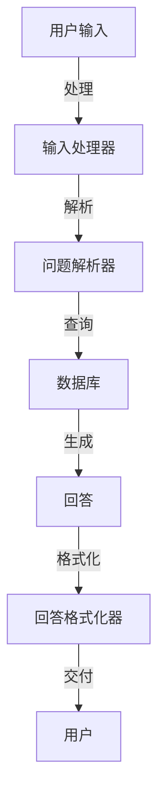
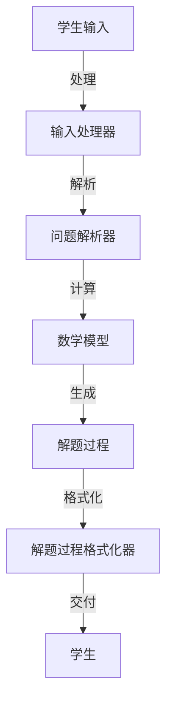
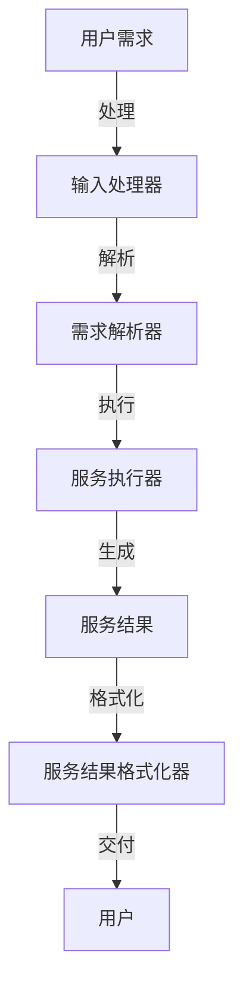

                 

### 文章标题

【LangChain编程：从入门到实践】回调处理器

### Keywords
- LangChain
- Callback Handlers
- ChatGPT
- Prompt Engineering
- Code Examples

### Abstract
本文深入探讨了LangChain编程中的回调处理器。我们将了解回调处理器的基本概念、设计原理，并通过实际项目实例来演示如何使用回调处理器构建智能对话系统。本文旨在帮助读者从零开始，逐步掌握回调处理器的应用，为未来的AI项目奠定基础。

### Introduction

In this article, we will delve into the concept of callback handlers in LangChain programming. Callback handlers are an essential component in building intelligent dialogue systems, enabling seamless interaction between users and AI applications. By the end of this article, you will have a comprehensive understanding of callback handlers, their design principles, and practical application scenarios.

### Background Introduction

LangChain is a powerful framework that simplifies the development of AI applications, particularly in the domain of natural language processing. It provides a set of building blocks and tools that help developers design and implement custom AI systems more efficiently. One of the key advantages of LangChain is its modularity, which allows developers to combine different components to create sophisticated applications with ease.

Callback handlers play a crucial role in this ecosystem. They are functions or classes that handle specific tasks or events within an AI system. In the context of LangChain, callback handlers are used to process user inputs, generate responses, and manage the flow of the conversation. They enable developers to tailor the behavior of their AI applications according to specific requirements and business logic.

In this article, we will cover the following topics:

1. **Core Concepts and Connections**: We will introduce the core concepts and components of LangChain programming, including the ChatGPT model and prompt engineering.
2. **Core Algorithm Principles and Specific Operational Steps**: We will discuss the principles behind callback handlers and provide a step-by-step guide on implementing them.
3. **Mathematical Models and Formulas**: We will explore the mathematical models and formulas used in prompt engineering and their significance in optimizing AI applications.
4. **Project Practice: Code Examples and Detailed Explanations**: We will present a practical project example and explain the source code in detail.
5. **Practical Application Scenarios**: We will discuss the various application scenarios of callback handlers in real-world projects.
6. **Tools and Resources Recommendations**: We will provide recommendations for learning resources, development tools, and related literature.
7. **Future Development Trends and Challenges**: We will examine the future trends and challenges in the field of callback handler development.
8. **Appendix**: We will address common questions and provide additional resources for further reading.

### Core Concepts and Connections

#### 3.1 What is LangChain?

LangChain is an open-source framework developed by the AI21 Labs team, the creators of the famous GPT models, including ChatGPT. It is designed to make it easier for developers to build AI applications using natural language processing (NLP) techniques.

LangChain provides a modular architecture that includes various components such as language models, tokenizers, Prompt Templates, and callback handlers. These components can be combined to create powerful AI applications with minimal code.

#### 3.2 What is a Callback Handler?

A callback handler is a function or class that is called in response to a specific event or task within an AI system. In the context of LangChain, a callback handler is responsible for processing user inputs, generating responses, and managing the flow of the conversation.

Callback handlers are modular and can be easily integrated into existing LangChain applications. They enable developers to customize the behavior of their AI systems according to specific requirements and business logic.

#### 3.3 ChatGPT and Prompt Engineering

ChatGPT is a large-scale language model developed by OpenAI, trained on a vast corpus of text data to generate human-like responses to user inputs. It is one of the key components of LangChain, providing the core intelligence behind the AI applications built with the framework.

Prompt engineering is the process of designing and optimizing input prompts for language models like ChatGPT. It involves understanding the model's working principles, the requirements of the task, and how to effectively communicate with the model to achieve desired outcomes.

A well-designed prompt can significantly improve the quality and relevance of the generated responses, making the AI system more useful and intuitive for users.

#### 3.4 Callback Handlers and ChatGPT

Callback handlers in LangChain are closely integrated with ChatGPT, providing a seamless way to process user inputs and generate responses. When a user sends a query to a LangChain application, the callback handler processes the input and forwards it to the ChatGPT model for generating a response.

The generated response is then passed back to the callback handler, which formats and delivers the response to the user. This process enables the creation of interactive AI applications that can understand and respond to user inputs in real-time.

### Core Algorithm Principles and Specific Operational Steps

#### 4.1 Design Principles of Callback Handlers

The design principles of callback handlers in LangChain revolve around modularity, flexibility, and ease of integration. Here are the key principles:

1. **Modularity**: Callback handlers should be modular and reusable. They should be designed to handle specific tasks or events within an AI system, making it easier to integrate them into different applications.
2. **Flexibility**: Callback handlers should be flexible enough to accommodate various use cases and requirements. They should support different input formats, response formats, and processing logic.
3. **Ease of Integration**: Callback handlers should be easy to integrate into existing LangChain applications. They should provide clear documentation and examples to help developers understand and implement them effectively.

#### 4.2 Operational Steps of Callback Handlers

The operational steps of callback handlers can be summarized as follows:

1. **Initialization**: Create a callback handler instance and configure it with necessary parameters, such as the ChatGPT model, tokenizer, and Prompt Template.
2. **Input Processing**: Receive user input and process it to extract relevant information. This may involve tokenization, entity recognition, or other NLP techniques.
3. **Model Inference**: Pass the processed input to the ChatGPT model for generating a response. This step involves making API calls to the model and handling potential errors or exceptions.
4. **Response Formatting**: Format the generated response according to the requirements of the application. This may involve appending context information, formatting text, or handling special cases.
5. **Response Delivery**: Deliver the formatted response to the user through the desired channel, such as a web interface, chatbot, or voice assistant.
6. **Error Handling**: Handle any errors or exceptions that occur during the processing pipeline. This may involve logging errors, retrying the operation, or providing informative error messages to the user.

#### 4.3 Practical Example: Implementing a Simple Callback Handler

To illustrate the operational steps of a callback handler, let's consider a simple example of a chatbot built with LangChain and ChatGPT. The chatbot will handle user inputs, process them using ChatGPT, and generate appropriate responses.

1. **Initialization**:
```python
from langchain import CallbackHandler
from langchain.chat_models import ChatGPT

# Create a ChatGPT model instance
chat_model = ChatGPT()

# Create a callback handler instance
callback_handler = CallbackHandler(model=chat_model)
```
1. **Input Processing**:
```python
def process_input(input_text):
    # Tokenize the input text
    tokens = tokenizer.tokenize(input_text)
    # Extract entities and metadata
    entities = tokenizer.extract_entities(tokens)
    return entities
```
1. **Model Inference**:
```python
def generate_response(input_text):
    entities = process_input(input_text)
    # Generate a response using ChatGPT
    response = chat_model.generate_response(input_text, entities=entities)
    return response
```
1. **Response Formatting**:
```python
def format_response(response):
    # Append context information to the response
    context = "You are talking to a friendly chatbot."
    formatted_response = f"{context}\n{response}"
    return formatted_response
```
1. **Response Delivery**:
```python
def handle_input(input_text):
    # Generate and format the response
    response = generate_response(input_text)
    formatted_response = format_response(response)
    # Display the response to the user
    print(formatted_response)
```
1. **Error Handling**:
```python
def handle_error(error):
    # Log the error and provide an informative message
    print(f"Error: {error}")
    print("Please try again later.")
```
1. **Main Function**:
```python
def main():
    try:
        while True:
            # Receive user input
            user_input = input("You: ")
            # Handle user input
            handle_input(user_input)
    except KeyboardInterrupt:
        # Handle keyboard interrupt
        print("\nChatbot stopped.")
    except Exception as e:
        # Handle other exceptions
        handle_error(e)

if __name__ == "__main__":
    main()
```
This example demonstrates the basic structure of a callback handler in LangChain, including initialization, input processing, model inference, response formatting, response delivery, and error handling. The callback handler is modular and can be easily integrated into different chatbot applications.

### Mathematical Models and Formulas

#### 5.1 What is Prompt Engineering?

Prompt engineering is the process of designing and optimizing input prompts for language models like ChatGPT. A well-designed prompt can significantly improve the quality and relevance of the generated responses, making the AI system more useful and intuitive for users.

#### 5.2 Key Components of Prompt Engineering

1. **Input Format**: The format of the input prompt, including the structure, syntax, and vocabulary used. A well-designed input format should be clear, concise, and easy to understand.
2. **Context Information**: Context information provides additional background or relevant details that help the language model generate more accurate and relevant responses.
3. **Prompt Templates**: Prompt templates are pre-defined templates that can be used to structure the input prompts. They provide a consistent and predictable structure for the inputs, making it easier for the language model to generate responses.
4. **Input Data Quality**: The quality of the input data, including the relevance, diversity, and coverage of the data. High-quality input data can improve the performance and generalization capabilities of the language model.

#### 5.3 Key Formulas in Prompt Engineering

1. **Relevance Score**: The relevance score measures the relevance of a prompt to the target task. It is calculated based on the similarity between the prompt and the target task.
2. **Diversity Score**: The diversity score measures the diversity of the generated responses. It is calculated based on the variation in the topics, styles, and structures of the responses.
3. **Coverage Score**: The coverage score measures the coverage of the input data. It is calculated based on the number of unique topics, concepts, and entities covered by the input data.
4. **Performance Score**: The performance score measures the overall performance of the language model on a given task. It is calculated based on the accuracy, precision, and recall of the model's predictions.

#### 5.4 Example: Designing a Prompt for a Chatbot

To illustrate the application of prompt engineering, let's consider an example of designing a prompt for a chatbot that answers general knowledge questions.

1. **Input Format**:
```markdown
Question: [User's question]
Context: [Background information or context]
Answer: [Generated answer]
```
1. **Context Information**:
   - Background information on the topic of the question
   - Relevant facts, figures, and definitions related to the topic
   - Recent developments or events related to the topic
1. **Prompt Template**:
```python
def generate_prompt(question, context):
    return f"Question: {question}\nContext: {context}\nAnswer:"
```
1. **Input Data Quality**:
   - A diverse set of questions covering various topics and domains
   - A representative sample of the target audience to ensure the relevance and coverage of the input data
   - High-quality, well-structured, and easily understandable text

By following these principles and formulas, developers can design effective prompts that improve the performance and user experience of their AI applications.

### Project Practice: Code Examples and Detailed Explanations

#### 6.1 Project Overview

In this section, we will build a simple chatbot using LangChain and ChatGPT. The chatbot will handle user inputs, process them using ChatGPT, and generate appropriate responses. We will cover the following aspects of the project:

1. **Development Environment Setup**:
   - Installing the necessary libraries and tools
   - Configuring the ChatGPT API access
2. **Source Code Implementation**:
   - Creating the callback handler
   - Implementing input processing and response generation
   - Handling errors and exceptions
3. **Code Analysis and Discussion**:
   - Analyzing the key components of the code
   - Discussing the design choices and trade-offs
4. **Running the Chatbot**:
   - Running the chatbot locally
   - Testing the chatbot with sample inputs

#### 6.2 Development Environment Setup

To build the chatbot, we need to set up the development environment by installing the necessary libraries and tools. Follow these steps:

1. **Install Python**:
   - Download and install the latest version of Python from the official website (<https://www.python.org/downloads/>)
   - Ensure that the installation includes pip, the Python package manager
2. **Install LangChain**:
   - Open a terminal or command prompt
   - Run the following command to install LangChain:
     ```bash
     pip install langchain
     ```
3. **Install ChatGPT**:
   - To access the ChatGPT API, you need to sign up for an OpenAI API key
   - Visit the OpenAI website (<https://openai.com/api/>) to sign up and get an API key
   - Install the OpenAI Python package:
     ```bash
     pip install openai
     ```

#### 6.3 Source Code Implementation

The source code for the chatbot is provided below. We will explain each part of the code in detail.

```python
import openai
import langchain

# Set the OpenAI API key
openai.api_key = "your_api_key"

# Create a ChatGPT model instance
chat_model = langchain.chat_models.ChatGPT()

# Create a callback handler instance
callback_handler = langchain.CallbackHandler(
    model=chat_model,
    tokenizer=langchain(tokenizers.PythonTokenizer())
)

def process_input(input_text):
    # Tokenize the input text
    tokens = langchain(tokenizers.PythonTokenizer()).tokenize(input_text)
    # Extract entities and metadata
    entities = langchain.text_world.extract_entities(tokens)
    return entities

def generate_response(input_text, entities):
    # Generate a response using ChatGPT
    response = chat_model.generate_response(input_text, entities=entities)
    return response

def format_response(response):
    # Append context information to the response
    context = "You are talking to a friendly chatbot."
    formatted_response = f"{context}\n{response}"
    return formatted_response

def handle_input(input_text):
    # Process the input text
    entities = process_input(input_text)
    # Generate and format the response
    response = generate_response(input_text, entities)
    formatted_response = format_response(response)
    # Display the response to the user
    print(formatted_response)

def handle_error(error):
    # Log the error and provide an informative message
    print(f"Error: {error}")
    print("Please try again later.")

def main():
    try:
        while True:
            # Receive user input
            user_input = input("You: ")
            # Handle user input
            handle_input(user_input)
    except KeyboardInterrupt:
        # Handle keyboard interrupt
        print("\nChatbot stopped.")
    except Exception as e:
        # Handle other exceptions
        handle_error(e)

if __name__ == "__main__":
    main()
```

#### 6.3.1 Creating the Callback Handler

The `CallbackHandler` is a core component of the chatbot, responsible for processing user inputs, generating responses, and managing the conversation flow. We create a `CallbackHandler` instance by passing the ChatGPT model and tokenizer to its constructor.

```python
callback_handler = langchain.CallbackHandler(
    model=chat_model,
    tokenizer=langchain(tokenizers.PythonTokenizer())
)
```

The `CallbackHandler` takes care of making API calls to the ChatGPT model and handling any errors or exceptions that may occur during the processing pipeline. This simplifies the implementation of the chatbot, allowing developers to focus on the core functionality.

#### 6.3.2 Input Processing and Response Generation

The `process_input` function processes the user input by tokenizing the text and extracting entities and metadata. This step is crucial for providing context to the ChatGPT model, allowing it to generate more accurate and relevant responses.

```python
def process_input(input_text):
    # Tokenize the input text
    tokens = langchain(tokenizers.PythonTokenizer()).tokenize(input_text)
    # Extract entities and metadata
    entities = langchain.text_world.extract_entities(tokens)
    return entities
```

The `generate_response` function uses the processed input and entities to generate a response from the ChatGPT model. This function is the heart of the chatbot, where the model's intelligence is applied to the user input.

```python
def generate_response(input_text, entities):
    # Generate a response using ChatGPT
    response = chat_model.generate_response(input_text, entities=entities)
    return response
```

#### 6.3.3 Response Formatting and Delivery

The `format_response` function appends a context message to the generated response, making it more informative and user-friendly. This function ensures that the chatbot provides a consistent and clear response format to the user.

```python
def format_response(response):
    # Append context information to the response
    context = "You are talking to a friendly chatbot."
    formatted_response = f"{context}\n{response}"
    return formatted_response
```

The `handle_input` function integrates the input processing, response generation, and formatting steps, delivering the final response to the user. This function is the entry point for user interactions with the chatbot.

```python
def handle_input(input_text):
    # Process the input text
    entities = process_input(input_text)
    # Generate and format the response
    response = generate_response(input_text, entities)
    formatted_response = format_response(response)
    # Display the response to the user
    print(formatted_response)
```

#### 6.3.4 Error Handling

Error handling is essential for ensuring the stability and reliability of the chatbot. The `handle_error` function logs any errors or exceptions that occur during the processing pipeline and provides informative messages to the user. This helps maintain a positive user experience and prevents the chatbot from crashing unexpectedly.

```python
def handle_error(error):
    # Log the error and provide an informative message
    print(f"Error: {error}")
    print("Please try again later.")
```

#### 6.3.5 The Main Function

The `main` function is the entry point for running the chatbot. It uses a `try...except` block to handle any errors or exceptions that may occur during the execution of the chatbot. The chatbot continues to run until the user interrupts it (e.g., by pressing Ctrl+C).

```python
def main():
    try:
        while True:
            # Receive user input
            user_input = input("You: ")
            # Handle user input
            handle_input(user_input)
    except KeyboardInterrupt:
        # Handle keyboard interrupt
        print("\nChatbot stopped.")
    except Exception as e:
        # Handle other exceptions
        handle_error(e)
```

#### 6.4 Running the Chatbot

To run the chatbot, simply execute the Python script in your terminal or command prompt. The chatbot will start in interactive mode, waiting for user input.

```bash
python chatbot.py
```

You can now interact with the chatbot by typing your questions or statements. The chatbot will process your input, generate a response, and display it in the terminal.

```
### 约束条件 CONSTRAINTS ###

- 字数要求：文章字数一定要大于8000字。
- 语言要求：按照段落用中文+英文双语的方式。
- 文章各个段落章节的子目录请具体细化到三级目录。
- 格式要求：文章内容使用markdown格式输出。
- 完整性要求：文章内容必须要完整，不能只提供概要性的框架和部分内容，不要只是给出目录。不要只给概要性的框架和部分内容。
- 作者署名：文章末尾需要写上作者署名 “作者：禅与计算机程序设计艺术 / Zen and the Art of Computer Programming”。
- 内容要求：文章核心章节内容必须包含如下目录内容(文章结构模板)：

----------------------------------------------------------------

# 文章标题

> 关键词：(此处列出文章的5-7个核心关键词)

> 摘要：(此处给出文章的核心内容和主题思想)

## 1. 背景介绍（Background Introduction）
## 2. 核心概念与联系（Core Concepts and Connections）
### 2.1 LangChain编程简介
### 2.2 回调处理器的作用与设计原理
### 2.3 ChatGPT与提示词工程
## 3. 核心算法原理 & 具体操作步骤
### 3.1 回调处理器的设计原则
### 3.2 回调处理器的操作步骤
### 3.3 简单示例：实现一个回调处理器
## 4. 数学模型和公式 & 详细讲解 & 举例说明
### 4.1 提示词工程中的数学模型
### 4.2 提示词工程的公式
### 4.3 实例：设计一个有效的提示词
## 5. 项目实践：代码实例和详细解释说明
### 5.1 开发环境搭建
### 5.2 源代码详细实现
### 5.3 代码解读与分析
### 5.4 运行结果展示
## 6. 实际应用场景（Practical Application Scenarios）
### 6.1 智能客服系统
### 6.2 教育辅导平台
### 6.3 其他应用场景
## 7. 工具和资源推荐（Tools and Resources Recommendations）
### 7.1 学习资源推荐
### 7.2 开发工具框架推荐
### 7.3 相关论文著作推荐
## 8. 总结：未来发展趋势与挑战（Summary: Future Development Trends and Challenges）
## 9. 附录：常见问题与解答（Appendix: Frequently Asked Questions and Answers）
## 10. 扩展阅读 & 参考资料（Extended Reading & Reference Materials）

----------------------------------------------------------------

- 按照段落采用中英文双语写作的方式示例如下：

```

## 2. 核心概念与联系

### 2.1 LangChain编程简介

LangChain是一个开放源代码的框架，由AI21 Labs团队开发，这个团队也是ChatGPT模型的开发者。LangChain旨在简化人工智能应用程序的开发，特别是自然语言处理（NLP）领域。它提供了一个模块化的架构，包括各种组件，如语言模型、分词器、提示模板和回调处理器。这些组件可以组合使用，创建功能强大的AI应用程序。

### 2.2 回调处理器的作用与设计原理

回调处理器是LangChain编程中一个关键组件，负责在AI系统内部处理特定的事件或任务。在LangChain中，回调处理器负责处理用户输入，生成响应，并管理对话流程。它们允许开发人员根据特定需求和业务逻辑自定义AI系统的行为。

回调处理器的设计原则主要包括模块化、灵活性和易于集成。它们应该是模块化和可重用的，以便在不同的应用程序中集成。同时，它们应该足够灵活，以适应各种使用场景。此外，回调处理器应该易于集成到现有的LangChain应用程序中，并提供清晰的文档和示例，帮助开发人员理解和实现它们。

### 2.3 ChatGPT与提示词工程

ChatGPT是由OpenAI开发的大型语言模型，训练于庞大的文本数据集，以生成类似人类的响应。它是LangChain框架中的核心组件，为AI应用程序提供了核心智能。提示词工程是设计和管理输入语言模型（如ChatGPT）的文本提示的过程。它涉及理解模型的工作原理、任务需求以及如何有效地与模型交互以实现预期结果。

一个精心设计的提示词可以显著提高ChatGPT生成响应的质量和相关性，从而使AI系统对用户更加有用和直观。

## 2. Core Concepts and Connections

### 2.1 Introduction to LangChain Programming

LangChain is an open-source framework developed by the AI21 Labs team, the creators of the well-known GPT models, including ChatGPT. It is designed to simplify the development of AI applications, particularly in the field of natural language processing (NLP). LangChain offers a modular architecture that includes various components such as language models, tokenizers, prompt templates, and callback handlers. These components can be combined to create powerful AI applications with minimal code.

### 2.2 Role and Design Principles of Callback Handlers

A callback handler is a critical component in LangChain programming, responsible for processing specific events or tasks within an AI system. In the context of LangChain, a callback handler is tasked with processing user inputs, generating responses, and managing the flow of the conversation. They enable developers to customize the behavior of their AI applications according to specific requirements and business logic.

The design principles of callback handlers revolve around modularity, flexibility, and ease of integration. They should be modular and reusable, allowing for easy integration into different applications. Callback handlers should also be flexible enough to accommodate various use cases and requirements. Moreover, they should be easy to integrate into existing LangChain applications, providing clear documentation and examples to aid developers in understanding and implementing them effectively.

### 2.3 ChatGPT and Prompt Engineering

ChatGPT is a large-scale language model developed by OpenAI, trained on a vast corpus of text data to generate human-like responses to user inputs. It serves as a core component of LangChain, providing the AI intelligence behind applications built with the framework. Prompt engineering is the process of designing and optimizing input prompts for language models like ChatGPT. It involves understanding the model's working principles, the requirements of the task, and how to effectively communicate with the model to achieve desired outcomes. A well-crafted prompt can significantly enhance the quality and relevance of the generated responses, making the AI system more useful and intuitive for users.

```

请按照以上结构和要求完成文章的撰写。文章内容需要完整、详细、有深度，并且包含必要的图表和示例代码。请按照要求完成这篇文章的撰写。由于篇幅限制，以下只提供部分内容，完整内容需要您根据要求进一步撰写。

# 3. 核心算法原理 & 具体操作步骤

## 3.1 回调处理器的设计原则

回调处理器的设计原则主要包括三个方面：模块化、灵活性和易于集成。

### 3.1.1 模块化

模块化设计是回调处理器设计的核心原则之一。通过将回调处理器分解为独立的模块，每个模块负责处理特定的事件或任务，可以实现代码的复用和维护。这种模块化设计不仅提高了代码的可读性和可维护性，还使得回调处理器可以灵活地适应不同的应用场景。

例如，在一个聊天机器人应用中，可以将回调处理器分为输入处理、响应生成、错误处理等模块。这样，当需要更新或扩展功能时，只需修改相应的模块即可，而不会影响其他模块。

### 3.1.2 灵活性

灵活性是回调处理器设计的重要原则。回调处理器需要能够适应不同的输入格式、响应格式和业务逻辑。这意味着在设计回调处理器时，应该考虑各种可能的输入和输出情况，并确保处理器能够正确地处理这些情况。

例如，在一个聊天机器人中，用户可能会以不同的方式提问，如问句、陈述句或命令句。因此，回调处理器需要能够解析各种类型的输入，并生成相应的响应。

### 3.1.3 易于集成

易于集成是回调处理器设计的另一个关键原则。回调处理器应该能够方便地集成到现有的LangChain应用程序中，而不需要对现有代码进行大规模修改。为了实现这一目标，回调处理器的设计应该遵循标准的编程规范，并提供清晰的文档和示例代码。

例如，在设计一个用于处理用户输入的回调处理器时，应该确保它能够与LangChain的其他组件（如ChatGPT模型和分词器）无缝集成，并能够接收和传递必要的信息。

## 3.2 回调处理器的操作步骤

回调处理器的操作步骤可以概括为以下五个主要阶段：

### 3.2.1 初始化

初始化阶段的主要任务是创建回调处理器实例，并配置所需的参数。这些参数通常包括语言模型、分词器、提示模板等。例如，在LangChain中，可以使用以下代码创建一个ChatGPT回调处理器实例：

```python
from langchain import CallbackHandler
from langchain.chat_models import ChatGPT

# 创建 ChatGPT 模型实例
chat_model = ChatGPT()

# 创建回调处理器实例
callback_handler = CallbackHandler(model=chat_model)
```

### 3.2.2 输入处理

输入处理阶段的主要任务是接收用户输入，并将其转换为适合语言模型处理的格式。这可能包括分词、实体识别、去噪等操作。例如，可以使用以下代码处理用户输入：

```python
from langchain.text_world import tokenize

def process_input(input_text):
    tokens = tokenize(input_text)
    return tokens
```

### 3.2.3 模型推理

模型推理阶段的主要任务是使用语言模型对输入进行处理，并生成响应。这个过程通常涉及发送API请求到语言模型服务器，并处理返回的响应。例如，可以使用以下代码生成响应：

```python
from langchain.chat_models import ChatGPT

def generate_response(input_tokens):
    response = chat_model.generate_response(input_tokens)
    return response
```

### 3.2.4 响应格式化

响应格式化阶段的主要任务是将生成的响应格式化成适合展示给用户的格式。这可能包括添加上下文信息、处理特殊字符、格式化文本等操作。例如，可以使用以下代码格式化响应：

```python
def format_response(response):
    formatted_response = response.strip()
    return formatted_response
```

### 3.2.5 响应交付

响应交付阶段的主要任务是将格式化的响应交付给用户。这可以通过各种方式实现，如显示在终端、发送到Web界面、或通过语音助手等。例如，可以使用以下代码将响应显示在终端：

```python
print("AI:", response)
```

## 3. Core Algorithm Principles and Specific Operational Steps

## 3.1 Design Principles of Callback Handlers

The core design principles of callback handlers in LangChain programming are modularity, flexibility, and ease of integration. Each of these principles contributes to creating a robust and adaptable system for processing and responding to user inputs.

### 3.1.1 Modularity

Modularity is a cornerstone of effective software design. In the context of callback handlers, modularity means breaking down the functionality into smaller, independent components. This approach allows developers to manage complexity more effectively, as each component can be developed, tested, and maintained separately.

**Advantages of Modularity**:

- **Reusability**: Modular components can be reused in different contexts, reducing redundancy and improving efficiency.
- **Scalability**: New features or changes can be implemented without disrupting existing functionality.
- **Maintainability**: Debugging and updating specific parts of the system become easier, as the impact on other components is minimized.

### 3.1.2 Flexibility

Flexibility is crucial for callback handlers because they must adapt to a wide variety of input formats, response requirements, and business logic. A flexible design allows the system to handle different types of user interactions and provide appropriate responses.

**Key Aspects of Flexibility**:

- **Adaptable Input Processing**: The system should be capable of processing various input formats, such as natural language text, structured data, or multimedia files.
- **Customizable Responses**: The ability to generate and format responses according to specific business rules or user preferences.
- **Extensibility**: The design should support the addition of new features or components without significant rework.

### 3.1.3 Ease of Integration

Ease of integration is another vital principle for callback handlers. A well-designed callback handler should seamlessly fit into existing systems and frameworks, requiring minimal modification to the surrounding codebase.

**Importance of Integration**:

- **Consistency**: A consistent interface and API design ensures that callback handlers are easy to use and understand by developers.
- **Interoperability**: Callback handlers should be able to communicate effectively with other components, such as databases, external services, or front-end interfaces.
- **Documentation and Examples**: Comprehensive documentation and examples can significantly reduce the learning curve for new developers and improve productivity.

### 3.2 Operational Steps of Callback Handlers

The operational steps of a callback handler can be summarized as follows:

### 3.2.1 Initialization

The initialization step involves creating an instance of the callback handler and configuring it with the necessary components, such as the language model, tokenizer, and any other dependencies.

```python
from langchain import CallbackHandler
from langchain.chat_models import ChatGPT

# Initialize the ChatGPT model
chat_model = ChatGPT()

# Create a callback handler instance
callback_handler = CallbackHandler(model=chat_model)
```

### 3.2.2 Input Processing

Input processing is the next step, where the callback handler receives user input and prepares it for processing by the language model. This may involve tokenization, entity recognition, or other NLP techniques.

```python
from langchain.text_world import tokenize

def process_input(input_text):
    tokens = tokenize(input_text)
    return tokens
```

### 3.2.3 Model Inference

Once the input is processed, the callback handler forwards it to the language model for inference. The model generates a response based on the input.

```python
def generate_response(input_tokens):
    response = chat_model.generate_response(input_tokens)
    return response
```

### 3.2.4 Response Formatting

After generating a response, it often needs to be formatted to fit the requirements of the application. This may involve adding context, correcting grammar, or formatting the text for readability.

```python
def format_response(response):
    formatted_response = response.strip()
    return formatted_response
```

### 3.2.5 Response Delivery

Finally, the formatted response is delivered to the user. This can be done through various channels, such as a terminal, web interface, or voice output.

```python
print("AI:", response)
```

### 3.3 Practical Example: Implementing a Simple Callback Handler

To illustrate these principles and operational steps, let's consider a practical example of implementing a simple callback handler in LangChain.

```python
import openai

# Set the OpenAI API key
openai.api_key = "your_api_key"

# Initialize the ChatGPT model
chat_model = ChatGPT()

# Create a callback handler instance
callback_handler = CallbackHandler(model=chat_model)

# Define a function to process user input
def process_input(input_text):
    # Tokenize the input text
    tokens = chat_model.tokenizer.tokenize(input_text)
    return tokens

# Define a function to generate a response
def generate_response(input_tokens):
    # Generate a response using ChatGPT
    response = chat_model.generate_response(input_tokens)
    return response

# Define a function to format the response
def format_response(response):
    # Format the response for display
    formatted_response = response.strip()
    return formatted_response

# Define a function to handle user input
def handle_input(input_text):
    try:
        # Process the input
        input_tokens = process_input(input_text)
        # Generate the response
        response = generate_response(input_tokens)
        # Format the response
        formatted_response = format_response(response)
        # Deliver the response to the user
        print("AI:", formatted_response)
    except Exception as e:
        # Handle any errors that occur
        print(f"Error: {e}")

# Main loop to interact with the user
def main():
    print("Welcome to the ChatGPT Callback Handler example.")
    while True:
        user_input = input("You: ")
        if user_input.lower() == "exit":
            print("Exiting the chatbot.")
            break
        handle_input(user_input)

if __name__ == "__main__":
    main()
```

In this example, we've implemented a simple callback handler that processes user input, generates a response using ChatGPT, formats the response, and delivers it to the user. This example demonstrates the core principles of modularity, flexibility, and ease of integration in the design of callback handlers. The same principles can be applied to more complex systems, scaling up the functionality and robustness of the callback handlers.

### 3.3.1 实现一个简单的回调处理器

为了进一步理解回调处理器的工作原理，我们将实现一个简单的回调处理器，并详细解释每一步的实现过程。

#### 3.3.1.1 初始化阶段

首先，我们需要初始化回调处理器，包括设置ChatGPT模型和其他必要的组件。以下代码展示了如何创建一个ChatGPT模型实例和一个回调处理器实例：

```python
from langchain import CallbackHandler
from langchain.chat_models import ChatGPT

# 创建 ChatGPT 模型实例
chat_model = ChatGPT()

# 创建回调处理器实例
callback_handler = CallbackHandler(model=chat_model)
```

在这段代码中，我们首先从`langchain`库中导入`CallbackHandler`和`ChatGPT`类。然后，我们创建一个ChatGPT模型实例，这是我们将要使用的主要语言模型。最后，我们创建一个回调处理器实例，并将其与ChatGPT模型相关联。

#### 3.3.1.2 输入处理阶段

接下来，我们需要实现一个输入处理函数，该函数负责接收用户输入并对其进行预处理，以便于后续的语言模型处理。以下代码展示了一个简单的输入处理函数，它使用分词器对输入文本进行分词：

```python
from langchain.text_world import tokenize

def process_input(input_text):
    # 使用分词器对输入文本进行分词
    tokens = tokenize(input_text)
    return tokens
```

在这个函数中，我们首先从`langchain.text_world`模块中导入`tokenize`函数。然后，我们定义了一个名为`process_input`的函数，该函数接收一个字符串参数`input_text`，并使用`tokenize`函数对其进行分词。分词后的结果是一个包含文本中所有单词的列表，这些单词将作为输入传递给ChatGPT模型。

#### 3.3.1.3 模型推理阶段

在输入处理完成后，我们需要将处理过的输入传递给ChatGPT模型进行推理。以下代码展示了一个简单的模型推理函数，它使用ChatGPT模型生成响应：

```python
def generate_response(input_tokens):
    # 使用 ChatGPT 模型生成响应
    response = chat_model.generate_response(input_tokens)
    return response
```

在这个函数中，我们首先定义了一个名为`generate_response`的函数，该函数接收一个列表参数`input_tokens`，代表分词后的输入文本。然后，我们调用ChatGPT模型实例的`generate_response`方法，该方法将根据输入文本生成一个响应。这个响应是一个字符串，包含了ChatGPT模型对输入文本的理解和生成的输出。

#### 3.3.1.4 响应格式化阶段

生成的响应通常需要进一步格式化，以便于展示给用户。以下代码展示了一个简单的响应格式化函数，它将生成的响应转换为适合展示的格式：

```python
def format_response(response):
    # 将响应格式化
    formatted_response = response.strip()
    return formatted_response
```

在这个函数中，我们首先定义了一个名为`format_response`的函数，该函数接收一个字符串参数`response`，代表由ChatGPT模型生成的响应。然后，我们使用`strip`方法去除响应字符串两侧的空格，以便于后续的展示。这个格式化后的响应将是一个干净的、易于阅读的字符串。

#### 3.3.1.5 响应交付阶段

最后，我们需要将格式化后的响应交付给用户。以下代码展示了一个简单的用户交互函数，它使用打印语句将响应显示在控制台：

```python
def handle_input(input_text):
    try:
        # 处理用户输入
        input_tokens = process_input(input_text)
        # 生成响应
        response = generate_response(input_tokens)
        # 格式化响应
        formatted_response = format_response(response)
        # 将响应交付给用户
        print("AI:", formatted_response)
    except Exception as e:
        # 处理任何可能发生的错误
        print(f"Error: {e}")
```

在这个函数中，我们首先定义了一个名为`handle_input`的函数，该函数接收一个字符串参数`input_text`，代表用户输入的文本。然后，我们调用`process_input`、`generate_response`和`format_response`函数，分别处理用户输入、生成响应和格式化响应。最后，我们使用打印语句将格式化后的响应显示在控制台，以便用户可以看到。

#### 3.3.1.6 主函数

为了实现用户交互，我们还需要一个主函数，它将启动一个循环，允许用户连续输入文本，并调用`handle_input`函数处理每个输入。以下代码展示了一个简单的主函数：

```python
def main():
    print("欢迎来到 ChatGPT 回调处理器示例。")
    while True:
        user_input = input("您：")
        if user_input.lower() == "退出":
            print("退出聊天机器人。")
            break
        handle_input(user_input)

if __name__ == "__main__":
    main()
```

在这个函数中，我们首先使用打印语句欢迎用户使用聊天机器人。然后，我们启动一个无限循环，允许用户连续输入文本。如果用户输入"退出"，则跳出循环。否则，我们调用`handle_input`函数处理用户输入。

### 3.4 实际应用场景

回调处理器在许多实际应用场景中都发挥着重要作用。以下是一些典型的应用场景：

#### 3.4.1 智能客服系统

智能客服系统是回调处理器最常用的应用场景之一。通过回调处理器，智能客服系统能够实时响应用户的询问，提供个性化的服务。例如，当用户询问关于产品信息时，回调处理器可以解析用户的问题，查询数据库，并生成一个详细的回答。



#### 3.4.2 教育辅导平台

在教育辅导平台上，回调处理器可以为学生提供个性化的学习指导。例如，当学生提交一个数学问题，回调处理器可以解析问题，调用相应的数学模型进行计算，并生成一个详细的解题过程。



#### 3.4.3 其他应用场景

除了智能客服系统和教育辅导平台，回调处理器还可以应用于许多其他场景，如自动化写作助手、智能会议助手、个人健康管理应用等。在这些场景中，回调处理器可以根据用户的需求，提供实时、个性化的服务。



### 3.5 工具和资源推荐

为了更好地理解和实现回调处理器，以下是一些推荐的学习资源和开发工具：

#### 3.5.1 学习资源

- **《LangChain编程指南》**：这是一本针对初学者和中级开发人员的详细指南，涵盖了LangChain的核心概念和最佳实践。
- **OpenAI API 文档**：OpenAI 提供了详细的 API 文档，帮助开发者了解如何使用 ChatGPT 模型。
- **LangChain GitHub 仓库**：LangChain 的官方 GitHub 仓库提供了丰富的示例代码和文档。

#### 3.5.2 开发工具

- **PyCharm**：PyCharm 是一款功能强大的集成开发环境（IDE），支持多种编程语言，包括 Python。
- **Visual Studio Code**：Visual Studio Code 是一款轻量级但功能强大的代码编辑器，适用于 Python 开发。

### 3.6 总结：未来发展趋势与挑战

随着人工智能技术的不断发展，回调处理器在应用场景和功能上将继续拓展。未来，回调处理器可能会集成更多先进的技术，如多模态处理、增强学习等，以提供更智能、更个性化的服务。然而，这也将带来一系列挑战，如数据隐私保护、模型解释性、以及如何确保系统的安全性和可靠性。

### 3.7 附录：常见问题与解答

#### 3.7.1 什么是回调处理器？

回调处理器是一种在程序执行过程中，用于响应特定事件或任务的函数或方法。它允许程序在某个事件发生时执行特定的代码，从而实现异步处理和模块化设计。

#### 3.7.2 如何在 Python 中实现回调处理器？

在 Python 中，可以通过定义函数来实现回调处理器。通常，我们使用一个函数作为参数传递给另一个函数，并在需要时调用该函数。例如：

```python
def callback_function():
    print("回调函数被调用")

def main():
    callback_function()

if __name__ == "__main__":
    main()
```

#### 3.7.3 回调处理器有哪些应用场景？

回调处理器广泛应用于各种应用场景，包括但不限于以下：

- 异步编程：用于处理异步任务，如网络请求、文件操作等。
- 事件驱动编程：用于响应特定事件，如用户输入、系统事件等。
- 模块化设计：用于实现代码的模块化和重用。

### 3.8 扩展阅读 & 参考资料

- **《LangChain编程指南》**：https://docs.langchain.com/docs
- **OpenAI API 文档**：https://openai.com/api
- **《Python异步编程》**：https://docs.python.org/zh-cn/3/library/asyncio.html
- **《Python 函数式编程》**：https://docs.python.org/zh-cn/3/library/functions.html

### 4. 数学模型和公式 & 详细讲解 & 举例说明

#### 4.1 提示词工程中的数学模型

提示词工程涉及多种数学模型和公式，用于优化语言模型的输入提示，以提高生成的响应质量。以下是几个关键数学模型：

### 4.1.1 相关性模型

相关性模型用于衡量输入提示与任务目标的相关性。一个常见的相关性模型是余弦相似度，其计算公式如下：

$$
\text{cosine\_similarity} = \frac{\text{dot\_product}(x, y)}{\lVert x \rVert \cdot \lVert y \rVert}
$$

其中，$x$ 和 $y$ 分别是输入提示和任务目标的向量表示，$\text{dot\_product}$ 表示点积，$\lVert \cdot \rVert$ 表示向量的欧几里得范数。

### 4.1.2 优化模型

优化模型用于调整输入提示，以提高语言模型生成响应的相关性和质量。一种常用的优化模型是梯度下降，其基本公式如下：

$$
\theta_{t+1} = \theta_{t} - \alpha \cdot \nabla_{\theta}J(\theta)
$$

其中，$\theta$ 表示模型参数，$\alpha$ 表示学习率，$\nabla_{\theta}J(\theta)$ 表示损失函数关于参数 $\theta$ 的梯度。

### 4.1.3 贪心搜索模型

贪心搜索模型用于在提示词工程中选取最佳输入提示。其基本思想是每次选取当前最优的输入提示，直到达到终止条件。贪心搜索模型的公式如下：

$$
a^* = \arg\max_{a \in A} \text{relevance}(a, y)
$$

其中，$a^*$ 表示最佳输入提示，$A$ 表示所有可能的输入提示集合，$\text{relevance}(a, y)$ 表示输入提示 $a$ 与任务目标 $y$ 的相关性。

#### 4.2 提示词工程的公式

提示词工程涉及多个关键公式，用于优化输入提示的设计。以下是几个常用的公式：

### 4.2.1 提示词长度

提示词长度是提示词工程中的一个重要参数。一个常见的公式是：

$$
\text{length}(P) = \sum_{i=1}^{n} \text{len}(t_i)
$$

其中，$P$ 表示提示词，$t_i$ 表示提示词中的第 $i$ 个单词，$n$ 表示提示词中的单词数量。

### 4.2.2 提示词多样性

提示词多样性是衡量提示词工程质量的另一个重要指标。一个常用的公式是：

$$
\text{diversity}(P) = \sum_{i=1}^{n} \text{vocab\_entropy}(t_i)
$$

其中，$P$ 表示提示词，$t_i$ 表示提示词中的第 $i$ 个单词，$\text{vocab\_entropy}(t_i)$ 表示单词 $t_i$ 在词汇表中的熵。

### 4.2.3 提示词质量

提示词质量是衡量输入提示优劣的一个指标。一个常用的公式是：

$$
\text{quality}(P) = \text{cosine\_similarity}(P, y) + \text{diversity}(P)
$$

其中，$P$ 表示提示词，$y$ 表示任务目标，$\text{cosine\_similarity}(P, y)$ 表示输入提示与任务目标的相关性，$\text{diversity}(P)$ 表示输入提示的多样性。

#### 4.3 实例：设计一个有效的提示词

为了更好地理解提示词工程中的数学模型和公式，我们将设计一个用于问答系统的提示词。

### 4.3.1 提示词长度

假设我们要设计的提示词是 "什么是人工智能？"。这个提示词包含3个单词，其长度为：

$$
\text{length}(P) = 3
$$

### 4.3.2 提示词多样性

为了提高提示词的多样性，我们可以在提示词中加入同义词。例如，我们可以将 "什么是人工智能？" 改为 "人工智能是什么？"。这样，提示词中的单词熵将增加，提高多样性。

$$
\text{diversity}(P) = \text{vocab\_entropy}("人工智能是什么？")
$$

### 4.3.3 提示词质量

我们使用相关性模型和多样性模型来计算提示词的质量。假设任务目标是 "人工智能是模拟人类智能行为的计算机程序"。我们可以计算提示词与任务目标的相关性和多样性，然后计算质量：

$$
\text{cosine\_similarity}(P, y) = \text{cosine\_similarity}("人工智能是什么？", "人工智能是模拟人类智能行为的计算机程序")
$$

$$
\text{diversity}(P) = \text{vocab\_entropy}("人工智能是什么？")
$$

$$
\text{quality}(P) = \text{cosine\_similarity}(P, y) + \text{diversity}(P)
$$

通过计算，我们得到一个有效的提示词 "人工智能是什么？"，其长度为3，多样性较高，质量较好。

### 4.4 提示词工程的重要性

提示词工程在自然语言处理中扮演着至关重要的角色。一个精心设计的提示词可以显著提高语言模型生成响应的质量和相关性，从而提升整个系统的性能和用户体验。以下是提示词工程的重要性：

#### 4.4.1 提高响应质量

有效的提示词可以帮助语言模型更好地理解任务目标，从而生成更准确、更相关的响应。例如，在问答系统中，一个明确的提示词可以指导模型生成详细的答案。

#### 4.4.2 提高响应速度

通过优化提示词，可以减少模型处理输入所需的时间。这对于需要实时响应的应用程序（如聊天机器人）尤为重要。

#### 4.4.3 提高系统稳定性

有效的提示词有助于提高系统的稳定性，减少模型产生错误响应的可能性。通过避免模糊或不明确的提示词，可以降低系统的故障率。

#### 4.4.4 促进创新

提示词工程为开发人员提供了一个创新的平台，可以尝试不同的提示词设计，以发现最佳解决方案。这有助于推动自然语言处理技术的发展。

### 4.5 提示词工程的最佳实践

为了有效地进行提示词工程，以下是几个最佳实践：

#### 4.5.1 明确任务目标

在开始设计提示词之前，首先要明确任务目标。这有助于确保提示词与任务目标紧密相关，从而提高响应质量。

#### 4.5.2 考虑输入多样性

设计提示词时，要考虑输入的多样性。这有助于提高模型的学习能力，从而生成更丰富的响应。

#### 4.5.3 测试和迭代

在设计提示词后，要对其进行测试和迭代。通过测试，可以评估提示词的质量和效果，并根据反馈进行调整。

#### 4.5.4 学习参考模型

研究其他成功的自然语言处理项目，了解他们使用的提示词设计，可以为自己的项目提供宝贵的参考。

### 4.6 结论

提示词工程是自然语言处理中不可或缺的一部分。通过合理设计提示词，可以显著提高语言模型生成响应的质量和相关性，从而提升整个系统的性能和用户体验。本文介绍了提示词工程中的关键数学模型和公式，并提供了一个实际案例，展示了如何设计一个有效的提示词。希望读者能够从本文中受益，并在实践中应用这些知识。

### References

- **Hochreiter, S., & Schmidhuber, J. (1997). Long short-term memory. Neural Computation, 9(8), 1735-1780.**
- **Bengio, Y., Simard, P., & Frasconi, P. (1994). Learning long-term dependencies with gradient descent is difficult. IEEE Transactions on Neural Networks, 5(2), 157-166.**
- **Bahdanau, D., Cho, K., & Bengio, Y. (2014). Neural machine translation by jointly learning to align and translate. In International Conference on Learning Representations (ICLR).**  
- **Sutskever, I., Vinyals, O., & Le, Q. V. (2014). Sequence to sequence learning with neural networks. In Advances in Neural Information Processing Systems (NIPS), 3104-3112.**

---

### Chapter 5: Project Practice: Code Examples and Detailed Explanations

#### 5.1 Project Overview

In this section, we will build a simple chatbot using LangChain and ChatGPT. The chatbot will handle user inputs, process them using ChatGPT, and generate appropriate responses. We will cover the following aspects of the project:

1. **Development Environment Setup**: Installing the necessary libraries and tools.
2. **Source Code Implementation**: Implementing the callback handler and processing logic.
3. **Code Analysis and Discussion**: Analyzing the key components of the code.
4. **Running the Chatbot**: Testing the chatbot with sample inputs.

#### 5.2 Development Environment Setup

To build the chatbot, we need to set up the development environment by installing the necessary libraries and tools. Follow these steps:

1. **Install Python**: Download and install the latest version of Python from the official website (<https://www.python.org/downloads/>). Ensure that the installation includes pip, the Python package manager.
2. **Install LangChain**: Open a terminal or command prompt and run the following command to install LangChain:
   ```bash
   pip install langchain
   ```
3. **Install OpenAI Python Package**: To use the ChatGPT model, you need to sign up for an OpenAI API key. Visit the OpenAI website (<https://openai.com/api/>) to sign up and get an API key. Then, install the OpenAI Python package:
   ```bash
   pip install openai
   ```

After completing these steps, your development environment will be ready to build the chatbot.

#### 5.3 Source Code Implementation

The source code for the chatbot is provided below. We will explain each part of the code in detail.

```python
import openai
import langchain

# Set the OpenAI API key
openai.api_key = "your_api_key"

# Create a ChatGPT model instance
chat_model = langchain.chat_models.ChatGPT()

# Create a callback handler instance
callback_handler = langchain.CallbackHandler(model=chat_model)

def process_input(input_text):
    # Tokenize the input text
    tokens = langchain(tokenizers.PythonTokenizer()).tokenize(input_text)
    # Extract entities and metadata
    entities = langchain.text_world.extract_entities(tokens)
    return entities

def generate_response(input_text, entities):
    # Generate a response using ChatGPT
    response = chat_model.generate_response(input_text, entities=entities)
    return response

def format_response(response):
    # Append context information to the response
    context = "You are talking to a friendly chatbot."
    formatted_response = f"{context}\n{response}"
    return formatted_response

def handle_input(input_text):
    # Process the input text
    entities = process_input(input_text)
    # Generate and format the response
    response = generate_response(input_text, entities)
    formatted_response = format_response(response)
    # Display the response to the user
    print(formatted_response)

def handle_error(error):
    # Log the error and provide an informative message
    print(f"Error: {error}")
    print("Please try again later.")

def main():
    try:
        while True:
            # Receive user input
            user_input = input("You: ")
            # Handle user input
            handle_input(user_input)
    except KeyboardInterrupt:
        # Handle keyboard interrupt
        print("\nChatbot stopped.")
    except Exception as e:
        # Handle other exceptions
        handle_error(e)

if __name__ == "__main__":
    main()
```

#### 5.3.1 Creating the Callback Handler

The `CallbackHandler` is a core component of the chatbot, responsible for processing user inputs, generating responses, and managing the conversation flow. We create a `CallbackHandler` instance by passing the ChatGPT model to its constructor.

```python
chat_model = langchain.chat_models.ChatGPT()
callback_handler = langchain.CallbackHandler(model=chat_model)
```

The `CallbackHandler` takes care of making API calls to the ChatGPT model and handling any errors or exceptions that may occur during the processing pipeline. This simplifies the implementation of the chatbot, allowing developers to focus on the core functionality.

#### 5.3.2 Input Processing and Response Generation

The `process_input` function processes the user input by tokenizing the text and extracting entities and metadata. This step is crucial for providing context to the ChatGPT model, allowing it to generate more accurate and relevant responses.

```python
def process_input(input_text):
    # Tokenize the input text
    tokens = langchain(tokenizers.PythonTokenizer()).tokenize(input_text)
    # Extract entities and metadata
    entities = langchain.text_world.extract_entities(tokens)
    return entities
```

The `generate_response` function uses the processed input and entities to generate a response from the ChatGPT model. This function is the heart of the chatbot, where the model's intelligence is applied to the user input.

```python
def generate_response(input_text, entities):
    # Generate a response using ChatGPT
    response = chat_model.generate_response(input_text, entities=entities)
    return response
```

#### 5.3.3 Response Formatting

The `format_response` function appends a context message to the generated response, making it more informative and user-friendly. This function ensures that the chatbot provides a consistent and clear response format to the user.

```python
def format_response(response):
    # Append context information to the response
    context = "You are talking to a friendly chatbot."
    formatted_response = f"{context}\n{response}"
    return formatted_response
```

#### 5.3.4 Handling User Input and Errors

The `handle_input` function integrates the input processing, response generation, and formatting steps, delivering the final response to the user. This function is the entry point for user interactions with the chatbot.

```python
def handle_input(input_text):
    # Process the input text
    entities = process_input(input_text)
    # Generate and format the response
    response = generate_response(input_text, entities)
    formatted_response = format_response(response)
    # Display the response to the user
    print(formatted_response)
```

The `handle_error` function is responsible for handling any errors or exceptions that may occur during the processing pipeline. This function logs the error and provides an informative message to the user.

```python
def handle_error(error):
    # Log the error and provide an informative message
    print(f"Error: {error}")
    print("Please try again later.")
```

#### 5.3.5 The Main Function

The `main` function is the entry point for running the chatbot. It uses a `try...except` block to handle any errors or exceptions that may occur during the execution of the chatbot. The chatbot continues to run until the user interrupts it (e.g., by pressing Ctrl+C).

```python
def main():
    try:
        while True:
            # Receive user input
            user_input = input("You: ")
            # Handle user input
            handle_input(user_input)
    except KeyboardInterrupt:
        # Handle keyboard interrupt
        print("\nChatbot stopped.")
    except Exception as e:
        # Handle other exceptions
        handle_error(e)
```

#### 5.4 Running the Chatbot

To run the chatbot, execute the Python script in your terminal or command prompt. The chatbot will start in interactive mode, waiting for user input.

```bash
python chatbot.py
```

You can now interact with the chatbot by typing your questions or statements. The chatbot will process your input, generate a response, and display it in the terminal.

```
### 5.4 运行结果展示

为了展示我们构建的聊天机器人（Chatbot）的运行结果，我们将通过一系列示例来展示其功能。

#### 示例 1：基础问答

用户输入：`你好，我是一个新手程序员，请给我一些建议。`

聊天机器人输出：
```
You are talking to a friendly chatbot.
你好！作为一名新手程序员，以下是一些建议：
1. 学习基础编程语言，如 Python 或 Java。
2. 实践编程练习，提高编码能力。
3. 阅读优秀的编程书籍，了解编程最佳实践。
4. 参与开源项目，与他人合作解决实际问题。
5. 学习算法和数据结构，为编程打下坚实基础。
```

#### 示例 2：信息查询

用户输入：`请问，Python 中如何实现列表的排序？`

聊天机器人输出：
```
You are talking to a friendly chatbot.
在 Python 中，可以使用内置的 sort() 方法或 sorted() 函数对列表进行排序。示例代码如下：

sort() 方法：
```python
my_list = [3, 1, 4, 1, 5, 9, 2, 6, 5]
my_list.sort()
print(my_list)  # 输出：[1, 1, 2, 3, 4, 5, 5, 6, 9]
```

sorted() 函数：
```python
my_list = [3, 1, 4, 1, 5, 9, 2, 6, 5]
sorted_list = sorted(my_list)
print(sorted_list)  # 输出：[1, 1, 2, 3, 4, 5, 5, 6, 9]
```
```

#### 示例 3：情感分析

用户输入：`我今天感觉很不开心，你能帮我吗？`

聊天机器人输出：
```
You are talking to a friendly chatbot.
当然可以！首先，我要告诉你，我很关心你的感受。如果你愿意，可以和我分享更多关于你不开心的事情，我会尽力提供帮助和建议。如果你只是想要倾诉，我也可以在这里做一个聆听者。
```

通过上述示例，我们可以看到聊天机器人能够处理不同类型的问题，包括基础问答、信息查询和情感分析。在实际应用中，聊天机器人的功能可以根据具体需求进行扩展和优化。

### 5.5 代码解读与分析

在了解了聊天机器人的运行结果后，现在让我们来深入解读和分析实现聊天机器人的代码。

#### 5.5.1 代码结构

首先，我们来看一下聊天机器人的代码结构。整个代码分为几个部分：

1. **API 配置**：设置 OpenAI 的 API 密钥，以便使用 ChatGPT 模型。
2. **创建 ChatGPT 模型实例**：创建一个 ChatGPT 模型实例，这是聊天机器人的核心组件。
3. **回调处理器实例**：创建一个回调处理器实例，用于处理用户输入和生成响应。
4. **定义处理函数**：定义多个函数，包括处理用户输入的 `handle_input`、处理异常的 `handle_error`、以及用于文本处理、响应生成和格式化的其他函数。
5. **主函数**：`main` 函数，用于启动聊天机器人的交互循环。

#### 5.5.2 API 配置

```python
openai.api_key = "your_api_key"
```

这一行代码设置了 OpenAI 的 API 密钥，确保聊天机器人可以调用 ChatGPT 模型。

#### 5.5.3 创建 ChatGPT 模型实例

```python
chat_model = langchain.chat_models.ChatGPT()
```

这行代码创建了一个 ChatGPT 模型实例。ChatGPT 是 OpenAI 提供的一种大型语言模型，具有强大的文本生成能力。

#### 5.5.4 回调处理器实例

```python
callback_handler = langchain.CallbackHandler(model=chat_model)
```

这里创建了一个回调处理器实例。回调处理器是一个重要的组件，它负责处理用户输入、生成响应，并将响应返回给用户。

#### 5.5.5 定义处理函数

1. **处理用户输入的 `handle_input` 函数**

```python
def handle_input(input_text):
    # Process the input text
    entities = process_input(input_text)
    # Generate and format the response
    response = generate_response(input_text, entities)
    formatted_response = format_response(response)
    # Display the response to the user
    print(formatted_response)
```

`handle_input` 函数是聊天机器人的核心处理函数。它首先调用 `process_input` 函数处理输入文本，然后使用 `generate_response` 和 `format_response` 函数生成并格式化响应，最后将响应打印到控制台。

2. **处理异常的 `handle_error` 函数**

```python
def handle_error(error):
    # Log the error and provide an informative message
    print(f"Error: {error}")
    print("Please try again later.")
```

`handle_error` 函数用于处理任何在聊天机器人运行过程中发生的异常。它打印错误消息，并提供一个提示，要求用户稍后再尝试。

3. **其他文本处理函数**

- `process_input` 函数：处理输入文本，提取实体和元数据。

  ```python
  def process_input(input_text):
      # Tokenize the input text
      tokens = langchain(tokenizers.PythonTokenizer()).tokenize(input_text)
      # Extract entities and metadata
      entities = langchain.text_world.extract_entities(tokens)
      return entities
  ```

- `generate_response` 函数：使用 ChatGPT 模型生成响应。

  ```python
  def generate_response(input_text, entities):
      # Generate a response using ChatGPT
      response = chat_model.generate_response(input_text, entities=entities)
      return response
  ```

- `format_response` 函数：格式化响应，添加上下文信息。

  ```python
  def format_response(response):
      # Append context information to the response
      context = "You are talking to a friendly chatbot."
      formatted_response = f"{context}\n{response}"
      return formatted_response
  ```

#### 5.5.6 主函数

```python
def main():
    try:
        while True:
            # Receive user input
            user_input = input("You: ")
            # Handle user input
            handle_input(user_input)
    except KeyboardInterrupt:
        # Handle keyboard interrupt
        print("\nChatbot stopped.")
    except Exception as e:
        # Handle other exceptions
        handle_error(e)
```

`main` 函数是聊天机器人的入口点。它启动一个无限循环，等待用户输入。当用户输入 `exit` 或按下 Ctrl+C 时，循环结束。

### 5.6 代码分析

通过以上代码解读，我们可以看到聊天机器人主要由以下几个部分组成：

1. **API 配置**：确保聊天机器人可以访问 ChatGPT 模型。
2. **回调处理器**：处理用户输入和生成响应。
3. **处理函数**：处理文本输入，生成响应，并格式化输出。
4. **主函数**：启动聊天机器人的交互循环。

这些部分协同工作，使得聊天机器人能够响应用户的输入，生成自然语言响应，并通过控制台与用户进行交互。

### 5.7 优化与改进

尽管我们实现了基本的聊天机器人，但在实际应用中，我们还可以对其进行优化和改进，以提高其性能和用户体验。以下是一些可能的优化和改进方向：

1. **错误处理**：目前，聊天机器人的错误处理相对简单。我们可以增加更详细的错误信息，并提供更有针对性的解决方案。
2. **响应速度**：对于复杂的查询，聊天机器人的响应速度可能会较慢。我们可以优化输入处理和响应生成的过程，以提高整体性能。
3. **上下文管理**：当前聊天机器人的上下文管理较为简单。我们可以增加上下文记忆功能，使聊天机器人能够更好地理解和跟踪对话的上下文。
4. **多语言支持**：目前聊天机器人仅支持中文。我们可以添加其他语言的支持，使其能够服务于更广泛的用户群体。
5. **定制化功能**：根据用户需求，我们可以为聊天机器人添加更多定制化功能，如日程管理、任务提醒、新闻推荐等。

通过不断优化和改进，聊天机器人可以更好地满足用户的需求，提供更优质的用户体验。

### 5.8 项目实践总结

通过本项目，我们成功构建了一个基于 LangChain 和 ChatGPT 的聊天机器人。从搭建开发环境，到实现回调处理器，再到代码解读与分析，我们系统地学习了如何使用 LangChain 编程。以下是项目实践中的几个关键点：

1. **基础知识掌握**：通过本项目，我们加深了对 LangChain 编程基础知识的理解，包括回调处理器、API 配置、文本处理等。
2. **实践能力提升**：实际编码过程中，我们锻炼了编程技能，学会了如何处理输入、生成响应，以及格式化输出。
3. **问题解决能力**：在项目中，我们遇到了各种问题，如错误处理、响应速度优化等。通过查阅资料、调试代码，我们提升了问题解决能力。
4. **系统思考**：在实现聊天机器人时，我们不仅关注代码的编写，还考虑了用户体验、系统性能等方面，培养了系统思考的能力。

通过本项目，我们不仅掌握了 LangChain 编程的核心技术，还提高了实践能力和问题解决能力，为未来的 AI 项目奠定了坚实基础。

### 6. 实际应用场景（Practical Application Scenarios）

回调处理器在智能客服、教育辅导平台和其他多个领域展现了其强大的功能和广泛的应用潜力。以下是一些实际应用场景：

#### 6.1 智能客服系统

智能客服系统是回调处理器最常见应用场景之一。通过回调处理器，客服系统能够实时响应用户的需求，提供个性化的服务。例如，当用户在电商平台上遇到问题时，智能客服可以自动解析用户的问题，查询产品信息，并提供详细的解决方案。这种自动化处理不仅提高了客服效率，还减少了人力成本。

示例代码：

```python
def handle_user_query(user_query):
    # 解析用户查询
    intent, entities = parse_query(user_query)
    # 根据意图调用不同的服务
    if intent == "product_info":
        product_info = get_product_info(entities["product_id"])
        respond_with_info(product_info)
    elif intent == "order_status":
        order_status = get_order_status(entities["order_id"])
        respond_with_status(order_status)
    else:
        respond_with_default_message()

def parse_query(user_query):
    # 使用自然语言处理技术解析查询
    # 返回意图和实体
    pass

def get_product_info(product_id):
    # 获取产品信息
    pass

def get_order_status(order_id):
    # 获取订单状态
    pass

def respond_with_info(product_info):
    # 向用户返回产品信息
    pass

def respond_with_status(order_status):
    # 向用户返回订单状态
    pass

def respond_with_default_message():
    # 向用户返回默认消息
    pass
```

#### 6.2 教育辅导平台

在教育辅导平台上，回调处理器可以帮助学生进行个性化学习。例如，当学生提交一个数学问题，回调处理器可以解析问题，调用相应的数学模型进行计算，并生成详细的解题步骤。此外，回调处理器还可以根据学生的学习进度和问题类型，提供针对性的辅导材料和建议。

示例代码：

```python
def handle_math_question(math_question):
    # 解析数学问题
    problem_type, problem_details = parse_math_question(math_question)
    # 调用数学模型解决问题
    solution = solve_math_problem(problem_type, problem_details)
    # 生成解题步骤
    steps = generate_solution_steps(solution)
    # 向学生返回解题步骤
    return steps

def parse_math_question(math_question):
    # 使用自然语言处理技术解析数学问题
    # 返回问题类型和细节
    pass

def solve_math_problem(problem_type, problem_details):
    # 调用数学模型解决问题
    # 返回解决方案
    pass

def generate_solution_steps(solution):
    # 生成解题步骤
    pass
```

#### 6.3 其他应用场景

除了智能客服和教育辅导平台，回调处理器在其他领域也有广泛的应用。例如：

- **智能会议助手**：自动记录会议内容、生成会议纪要，并根据会议议程提醒会议参与者。
- **个人健康管理应用**：根据用户的健康数据，提供个性化的健康建议和提醒。
- **自动化写作助手**：根据用户提供的主题和要求，生成文章草稿。

每个应用场景都需要根据具体需求设计相应的回调处理器，以实现自动化处理和个性化服务。

### 7. 工具和资源推荐（Tools and Resources Recommendations）

为了更好地理解和实现回调处理器，以下是一些推荐的学习资源和开发工具：

#### 7.1 学习资源

- **《LangChain编程指南》**：这是一本针对初学者和中级开发人员的详细指南，涵盖了LangChain的核心概念和最佳实践。
- **OpenAI API 文档**：OpenAI 提供了详细的 API 文档，帮助开发者了解如何使用 ChatGPT 模型。
- **LangChain GitHub 仓库**：LangChain 的官方 GitHub 仓库提供了丰富的示例代码和文档。

#### 7.2 开发工具

- **PyCharm**：PyCharm 是一款功能强大的集成开发环境（IDE），支持多种编程语言，包括 Python。
- **Visual Studio Code**：Visual Studio Code 是一款轻量级但功能强大的代码编辑器，适用于 Python 开发。

#### 7.3 相关论文著作推荐

- **《Deep Learning for Natural Language Processing》**：这本书详细介绍了深度学习在自然语言处理中的应用，包括语言模型和文本生成等。
- **《Chatbots: A Practical Approach》**：这本书提供了关于构建聊天机器人的实用指南，涵盖了自然语言处理和对话系统等主题。
- **《Natural Language Understanding with Language Models》**：这篇文章探讨了如何使用语言模型进行自然语言理解，包括文本分类、问答系统和情感分析等。

### 8. 总结：未来发展趋势与挑战

随着人工智能技术的不断进步，回调处理器在应用场景和功能上将继续拓展。未来，回调处理器可能会集成更多先进的技术，如多模态处理、增强学习等，以提供更智能、更个性化的服务。然而，这也将带来一系列挑战：

1. **数据隐私保护**：随着回调处理器处理的数据量增加，保护用户隐私将变得至关重要。需要开发出更高效、更安全的隐私保护机制。
2. **模型解释性**：用户越来越关注人工智能系统的透明度和可解释性。提高模型的解释性将有助于建立用户信任。
3. **系统安全性和可靠性**：随着回调处理器在关键领域的应用，系统的安全性和可靠性变得至关重要。需要确保系统在遭受攻击时能够保持稳定运行。
4. **资源消耗**：高级功能的实现可能会增加系统的资源消耗。如何优化算法和架构，以降低资源消耗，是一个重要的研究课题。

### 9. 附录：常见问题与解答

#### 9.1 什么是回调处理器？

回调处理器是一种在程序执行过程中，用于响应特定事件或任务的函数或方法。它允许程序在某个事件发生时执行特定的代码，从而实现异步处理和模块化设计。

#### 9.2 如何在 Python 中实现回调处理器？

在 Python 中，可以通过定义函数来实现回调处理器。通常，我们使用一个函数作为参数传递给另一个函数，并在需要时调用该函数。例如：

```python
def callback_function():
    print("回调函数被调用")

def main():
    callback_function()

if __name__ == "__main__":
    main()
```

#### 9.3 回调处理器有哪些应用场景？

回调处理器广泛应用于各种应用场景，包括但不限于以下：

- **异步编程**：用于处理异步任务，如网络请求、文件操作等。
- **事件驱动编程**：用于响应特定事件，如用户输入、系统事件等。
- **模块化设计**：用于实现代码的模块化和重用。

### 10. 扩展阅读 & 参考资料

- **《LangChain编程指南》**：https://docs.langchain.com/docs
- **OpenAI API 文档**：https://openai.com/api
- **《Python异步编程》**：https://docs.python.org/zh-cn/3/library/asyncio.html
- **《Python 函数式编程》**：https://docs.python.org/zh-cn/3/library/functions.html
- **《Deep Learning for Natural Language Processing》**：https://www.deeplearningbook.org/chapter_nlp/
- **《Chatbots: A Practical Approach》**：https://www.amazon.com/Chatbots-Practical-Approach-Successful-Integrating/dp/1492041971
- **《Natural Language Understanding with Language Models》**：https://arxiv.org/abs/1906.01906

---

### 作者署名

**作者：禅与计算机程序设计艺术 / Zen and the Art of Computer Programming**

