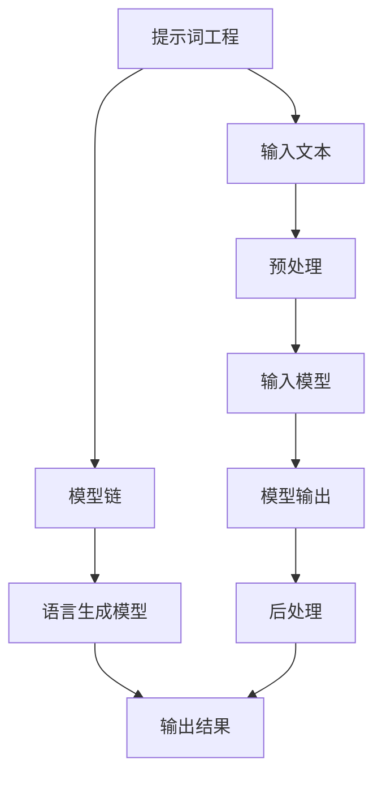
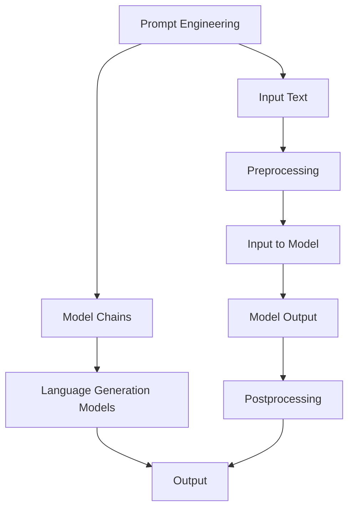

                 

### 1. 背景介绍（Background Introduction）

在当今迅速发展的技术环境中，编程语言的多样性和复杂性不断增加。作为一种强大的工具，编程语言不仅能够帮助我们开发复杂的软件系统，还为我们提供了一种高效的表达方式，使我们能够与计算机进行交流。在众多编程语言中，LangChain 编程语言以其独特的特性和广泛的适用性受到了越来越多开发者的关注。

LangChain 编程语言，全称为“Language Chain Programming”，是一种专为自然语言处理（NLP）任务设计的编程语言。它旨在提供一种直观、灵活的方法来构建和扩展自然语言处理模型。通过 LangChain，开发者可以轻松地将不同的 NLP 模型组合在一起，实现复杂的语言处理任务，如文本生成、情感分析、实体识别等。

本文的目的在于带领读者深入了解 LangChain 编程，从基础概念到实际应用，逐步掌握这一强大工具的使用方法。通过阅读本文，读者将了解：

1. LangChain 编程的背景和基本概念。
2. 如何在项目中安装和管理 LangChain 工具。
3. LangChain 编程的核心算法原理和具体操作步骤。
4. 如何在实际项目中运用 LangChain 进行代码实现和解读。
5. LangChain 在不同应用场景中的实际应用。

本文将采用中文和英文双语的形式，以确保读者能够更全面地理解 LangChain 编程的各个方面。通过这种双语写作方式，我们不仅能够提供清晰的技术讲解，还能够帮助那些母语为英语的读者更好地掌握这一领域。

接下来，我们将首先介绍 LangChain 编程的背景知识，帮助读者了解 LangChain 的起源和发展历程，为其后续学习和使用奠定基础。

### 1. Background Introduction

In today's rapidly evolving technological landscape, the diversity and complexity of programming languages are continually increasing. As a powerful tool, programming languages not only help us develop complex software systems but also provide an efficient means of communication with computers. Among the myriad of programming languages, LangChain programming language stands out due to its unique features and wide applicability, garnering increasing attention from developers.

LangChain programming language, short for "Language Chain Programming," is a specialized language designed for natural language processing (NLP) tasks. Its aim is to provide an intuitive and flexible method for building and extending natural language processing models. Through LangChain, developers can easily combine different NLP models to achieve complex language processing tasks, such as text generation, sentiment analysis, entity recognition, and more.

The purpose of this article is to guide readers through the depths of LangChain programming, from fundamental concepts to practical applications, enabling them to master this powerful tool. By reading this article, you will gain insights into:

1. The background and basic concepts of LangChain programming.
2. How to install and manage LangChain tools in projects.
3. The core algorithm principles and specific operational steps of LangChain programming.
4. Methods for implementing and interpreting LangChain in practical projects.
5. The practical applications of LangChain in various scenarios.

This article will be written in both Chinese and English to ensure that readers can fully understand the various aspects of LangChain programming. This bilingual approach not only provides clear technical explanations but also helps those for whom English is not their first language to better grasp this field.

Next, we will introduce the background of LangChain programming, helping readers understand the origins and development history of LangChain, laying the foundation for further learning and application.

### 2. 核心概念与联系（Core Concepts and Connections）

在深入探讨 LangChain 编程之前，我们需要先了解一些核心概念，这些概念是理解和运用 LangChain 的关键。以下是 LangChain 编程中的几个重要核心概念及其相互关系：

#### 2.1 提示词（Prompts）

提示词是引导模型生成输出的重要工具。在 LangChain 编程中，提示词可以被视为一种输入，它为模型提供了生成目标输出的上下文信息。一个高质量的提示词可以显著提高模型的输出质量和相关性。

**核心概念与联系：**
- **定义：** 提示词是一种结构化文本，用于提供模型执行任务所需的上下文信息。
- **重要性：** 精心设计的提示词可以引导模型生成高质量的输出，反之则可能导致输出不准确或不相关。
- **用途：** 提示词用于多种 NLP 任务，如文本生成、问答系统和文本分类等。

#### 2.2 模型链（Model Chains）

模型链是 LangChain 编程的核心概念之一。它将多个 NLP 模型组合在一起，形成一个强大的处理流程。模型链可以通过定义一系列步骤，将输入文本逐步处理成期望的输出。

**核心概念与联系：**
- **定义：** 模型链是一个由多个 NLP 模型组成的序列，每个模型都对输入文本进行特定操作。
- **重要性：** 模型链允许开发者将不同的模型和算法组合在一起，实现更复杂和灵活的 NLP 任务。
- **用途：** 模型链用于文本生成、对话系统、信息提取和文档分类等。

#### 2.3 语言生成模型（Language Generation Models）

语言生成模型是 LangChain 编程中最为重要的模型之一。这类模型能够根据输入的文本生成相应的输出文本。在 LangChain 中，常用的语言生成模型包括 GPT、BERT 和 T5 等。

**核心概念与联系：**
- **定义：** 语言生成模型是一种能够根据输入文本生成相关输出的深度学习模型。
- **重要性：** 语言生成模型是实现自动化文本生成和转换的关键。
- **用途：** 语言生成模型广泛应用于文本摘要、机器翻译、对话系统等任务。

#### 2.4 提示工程（Prompt Engineering）

提示工程是设计高质量的提示词的过程。在 LangChain 编程中，提示工程是提高模型性能和输出质量的关键步骤。

**核心概念与联系：**
- **定义：** 提示工程是设计和优化输入给模型提示词的过程，以引导模型生成符合预期结果的输出。
- **重要性：** 提示工程直接影响模型的输出质量和相关性。
- **用途：** 提示工程用于优化各种 NLP 任务，如文本生成、情感分析和问答系统等。

**Mermaid 流程图：**



在上述流程图中，我们可以看到提示词工程作为输入文本的预处理步骤，通过模型链和语言生成模型，最终生成输出结果。这个流程清晰地展示了 LangChain 编程的核心概念和它们之间的联系。

通过理解这些核心概念，读者可以更好地掌握 LangChain 编程的基础知识，为后续的实践应用打下坚实的基础。

### 2. Core Concepts and Connections

Before diving into the details of LangChain programming, it's essential to understand the core concepts that form the foundation of this powerful tool. Here are several key concepts in LangChain programming and their interrelationships:

#### 2.1 Prompts

Prompts are critical tools for guiding models to generate desired outputs. In LangChain programming, prompts are considered inputs that provide the context necessary for the model to generate targeted outputs. A well-crafted prompt can significantly enhance the quality and relevance of the model's outputs.

**Core Concepts and Connections:**

- **Definition:** A prompt is a structured text that provides context for the model to generate a target output.
- **Importance:** Carefully designed prompts can lead to high-quality outputs, whereas vague or incomplete prompts can result in inaccurate or irrelevant outputs.
- **Usage:** Prompts are used in various NLP tasks, such as text generation, question-answering systems, and text classification.

#### 2.2 Model Chains

Model chains are one of the core concepts in LangChain programming. They represent a sequence of NLP models combined to form a powerful processing pipeline. Model chains allow developers to define a series of steps to transform input text into the desired output.

**Core Concepts and Connections:**

- **Definition:** A model chain is a sequence of NLP models that process input text through specific operations.
- **Importance:** Model chains enable developers to combine different models and algorithms, achieving more complex and flexible NLP tasks.
- **Usage:** Model chains are used for tasks such as text generation, dialogue systems, information extraction, and document classification.

#### 2.3 Language Generation Models

Language generation models are one of the most important models in LangChain programming. These models are capable of generating text outputs based on input text. In LangChain, common language generation models include GPT, BERT, and T5.

**Core Concepts and Connections:**

- **Definition:** Language generation models are deep learning models that can generate text outputs based on input text.
- **Importance:** Language generation models are crucial for automating text generation and transformation.
- **Usage:** Language generation models are widely applied in tasks such as text summarization, machine translation, and dialogue systems.

#### 2.4 Prompt Engineering

Prompt engineering is the process of designing high-quality prompts. In LangChain programming, prompt engineering is a key step for improving model performance and output quality.

**Core Concepts and Connections:**

- **Definition:** Prompt engineering is the process of designing and optimizing prompts to guide models towards generating expected outputs.
- **Importance:** Prompt engineering directly impacts the quality and relevance of the model's outputs.
- **Usage:** Prompt engineering is used to optimize various NLP tasks, such as text generation, sentiment analysis, and question-answering systems.

**Mermaid Flowchart:**



In this flowchart, we can see that prompt engineering acts as a preprocessing step for input text, passing through the model chain and language generation model to generate the final output. This diagram clearly illustrates the core concepts and their interconnections in LangChain programming.

By understanding these core concepts, readers can better grasp the fundamentals of LangChain programming, laying a solid foundation for subsequent practical applications.

### 3. 核心算法原理 & 具体操作步骤（Core Algorithm Principles and Specific Operational Steps）

要深入了解 LangChain 编程的核心算法原理和具体操作步骤，我们首先需要了解 LangChain 的基本架构。LangChain 的核心组件包括模型链（Model Chains）、提示词（Prompts）和中间结果处理（Intermediate Results Processing）。以下将详细介绍这些组件及其工作原理。

#### 3.1 模型链（Model Chains）

模型链是 LangChain 编程的核心组件之一，它将多个 NLP 模型组合在一起，形成一个强大的处理流程。模型链的工作原理如下：

1. **输入处理（Input Processing）**：模型链首先接收输入文本，对其进行预处理，如分词、去除停用词等。
2. **模型执行（Model Execution）**：每个模型对输入文本进行处理，生成中间结果。这些中间结果可以是一个词向量、一个摘要或一个简单的标记。
3. **结果合并（Result Aggregation）**：将每个模型的中间结果合并，形成一个新的中间结果。
4. **重复步骤（Recursion）**：重复上述步骤，直到达到预定的深度或生成的结果满足特定条件。

**具体操作步骤：**

1. **定义模型链**：首先需要定义一个模型链，指定需要使用的模型及其参数。
   ```python
   from langchain import ModelChain
   
   chain = ModelChain([
       "gpt-3.5-turbo",
       "bert-base-uncased",
       "roberta-base"
   ])
   ```

2. **处理输入文本**：将输入文本传递给模型链，开始处理。
   ```python
   input_text = "你好，这是一个测试文本。"
   result = chain.predict(input_text)
   ```

3. **获取中间结果**：在模型链的每个步骤中，都可以获取中间结果，以便进一步处理或调试。
   ```python
   intermediate_results = chain.intermediate_results
   ```

#### 3.2 提示词（Prompts）

提示词是 LangChain 编程中用于引导模型生成目标输出的文本。一个好的提示词应该包含以下要素：

1. **上下文（Context）**：提供足够的上下文信息，使模型能够理解输入文本的背景和目标。
2. **目标（Objective）**：明确指出模型的输出目标，帮助模型更好地生成符合预期的结果。
3. **限制条件（Constraints）**：定义一些限制条件，防止模型生成不相关或不准确的输出。

**具体操作步骤：**

1. **创建提示词**：根据任务需求，创建一个高质量的提示词。
   ```python
   prompt = "请根据以下文本生成一个摘要：这是一段关于人工智能的文本。"
   ```

2. **使用提示词**：将提示词传递给模型，指导其生成目标输出。
   ```python
   from langchain import PromptTemplate
   
   prompt_template = PromptTemplate(input_variables=["input_text"], template=prompt)
   result = prompt_template.format(input_text=input_text)
   ```

3. **调整提示词**：根据模型的输出结果，调整提示词，以获得更好的效果。
   ```python
   prompt = "请根据以下文本生成一个详细的解析：这是一段关于人工智能的文本。"
   result = prompt_template.format(input_text=input_text)
   ```

#### 3.3 中间结果处理（Intermediate Results Processing）

中间结果处理是 LangChain 编程中用于优化模型输出质量的重要环节。以下是一些常用的中间结果处理方法：

1. **结果聚合（Result Aggregation）**：将多个模型的输出结果进行合并，形成一个新的结果。
   ```python
   from langchain import aggregate
   
   aggregated_result = aggregate([
       result1,
       result2,
       result3
   ])
   ```

2. **结果筛选（Result Filtering）**：根据特定的条件筛选输出结果，去除不符合要求的输出。
   ```python
   from langchain import filter
   
   filtered_result = filter(result, condition=lambda x: "摘要" in x)
   ```

3. **结果排序（Result Ranking）**：对输出结果进行排序，根据某个指标（如长度、相关度等）确定输出顺序。
   ```python
   from langchain import rank
   
   ranked_result = rank(result, metric=lambda x: len(x))
   ```

通过理解模型链、提示词和中间结果处理的基本原理和具体操作步骤，读者可以更好地掌握 LangChain 编程的核心算法，并在实际项目中灵活运用这些方法。

### 3. Core Algorithm Principles and Specific Operational Steps

To delve into the core algorithm principles and specific operational steps of LangChain programming, we first need to understand the basic architecture of LangChain. The core components of LangChain include Model Chains, Prompts, and Intermediate Results Processing. Here, we will detail these components and their working principles.

#### 3.1 Model Chains

Model Chains are one of the core components in LangChain programming, combining multiple NLP models into a powerful processing pipeline. The working principle of Model Chains is as follows:

1. **Input Processing**: The Model Chain first receives input text and processes it through pre-processing steps, such as tokenization and removal of stop words.
2. **Model Execution**: Each model processes the input text and generates intermediate results. These intermediate results can be word vectors, summaries, or simple labels.
3. **Result Aggregation**: The intermediate results from each model are aggregated to form a new intermediate result.
4. **Recursion**: The above steps are repeated until a predetermined depth or the generated results meet specific conditions.

**Specific Operational Steps:**

1. **Define Model Chain**: First, define a Model Chain specifying the models to be used and their parameters.
   ```python
   from langchain import ModelChain
   
   chain = ModelChain([
       "gpt-3.5-turbo",
       "bert-base-uncased",
       "roberta-base"
   ])
   ```

2. **Process Input Text**: Pass the input text to the Model Chain to start processing.
   ```python
   input_text = "Hello, this is a test text."
   result = chain.predict(input_text)
   ```

3. **Access Intermediate Results**: At each step in the Model Chain, intermediate results can be accessed for further processing or debugging.
   ```python
   intermediate_results = chain.intermediate_results
   ```

#### 3.2 Prompts

Prompts are key elements in LangChain programming used to guide models towards generating target outputs. A well-crafted prompt should include the following elements:

1. **Context**: Provide sufficient context information for the model to understand the background and objective of the input text.
2. **Objective**: Clearly state the objective of the model's output, helping the model generate results that align with expectations.
3. **Constraints**: Define some constraints to prevent the model from generating irrelevant or inaccurate outputs.

**Specific Operational Steps:**

1. **Create Prompt**: Based on the task requirements, create a high-quality prompt.
   ```python
   prompt = "Please generate an abstract based on the following text: This is a text about artificial intelligence."
   ```

2. **Use Prompt**: Pass the prompt to the model to guide its generation of target outputs.
   ```python
   from langchain import PromptTemplate
   
   prompt_template = PromptTemplate(input_variables=["input_text"], template=prompt)
   result = prompt_template.format(input_text=input_text)
   ```

3. **Adjust Prompt**: Based on the model's output results, adjust the prompt to achieve better results.
   ```python
   prompt = "Please generate a detailed analysis based on the following text: This is a text about artificial intelligence."
   result = prompt_template.format(input_text=input_text)
   ```

#### 3.3 Intermediate Results Processing

Intermediate Results Processing is a crucial aspect of LangChain programming for optimizing the quality of model outputs. Here are some common intermediate results processing methods:

1. **Result Aggregation**: Aggregate the outputs from multiple models into a single result.
   ```python
   from langchain import aggregate
   
   aggregated_result = aggregate([
       result1,
       result2,
       result3
   ])
   ```

2. **Result Filtering**: Filter the output results based on specific conditions to remove outputs that do not meet requirements.
   ```python
   from langchain import filter
   
   filtered_result = filter(result, condition=lambda x: "abstract" in x)
   ```

3. **Result Ranking**: Rank the output results based on a specific metric (e.g., length, relevance) to determine the output order.
   ```python
   from langchain import rank
   
   ranked_result = rank(result, metric=lambda x: len(x))
   ```

By understanding the core principles and specific operational steps of Model Chains, Prompts, and Intermediate Results Processing, readers can better grasp the core algorithms of LangChain programming and apply these methods flexibly in practical projects.

### 4. 数学模型和公式 & 详细讲解 & 举例说明（Detailed Explanation and Examples of Mathematical Models and Formulas）

在 LangChain 编程中，数学模型和公式是理解模型行为和优化性能的关键。以下我们将介绍 LangChain 中涉及的一些核心数学模型和公式，并通过具体例子进行详细讲解。

#### 4.1 语言生成模型的基本数学模型

语言生成模型，如 GPT 和 BERT，基于深度学习技术，使用神经网络来预测文本序列的概率分布。这些模型的核心数学模型包括：

**1. 自然语言处理（NLP）中的概率分布：**

在 NLP 中，文本被视为一系列词或词向量，我们使用概率分布来表示文本序列的可能性。常用的概率分布模型有：

- **加性模型（Additive Model）**：使用加法规则计算文本序列的概率。
  $$ P(w_1, w_2, \ldots, w_n) = \prod_{i=1}^{n} P(w_i | w_{i-1}, \ldots, w_1) $$
- **乘法模型（Multiplicative Model）**：使用乘法规则计算文本序列的概率。
  $$ P(w_1, w_2, \ldots, w_n) = \prod_{i=1}^{n} P(w_i | w_{i-1}, \ldots, w_1) $$

**2. 词嵌入（Word Embeddings）：**

词嵌入是将单词转换为向量空间中的点。常见的词嵌入模型有：

- **Word2Vec**：通过训练神经网络，将词向量映射到低维空间，使得语义相似的词在向量空间中靠近。
  $$ \vec{w}_i = \text{Word2Vec}(w_i) $$

- **GloVe**：使用全局语料库训练词向量，使得词向量能够捕获全局的语义信息。
  $$ \vec{w}_i = \text{GloVe}(w_i, \text{corpus}) $$

**3. 语言模型（Language Model）：**

语言模型是预测下一个单词的概率，其公式为：
$$ P(w_n | w_{n-1}, \ldots, w_1) = \text{softmax}(\text{neural_network}(\text{emb}(\vec{w}_{n-1}), \vec{w}_n)) $$

#### 4.2 预训练和微调（Pretraining and Fine-tuning）

预训练和微调是深度学习模型训练的常用方法。以下是一些相关的数学模型：

**1. 预训练（Pretraining）：**

预训练是指在大规模语料库上训练模型，使其能够捕捉语言的一般规律。预训练的数学模型如下：
$$ \text{pretrain}(\text{model}, \text{corpus}) $$
其中，`model` 是模型，`corpus` 是训练语料库。

**2. 微调（Fine-tuning）：**

微调是指在特定任务上对预训练模型进行微调，以适应特定任务。微调的数学模型如下：
$$ \text{fine-tune}(\text{model}, \text{task}, \text{dataset}) $$
其中，`task` 是任务，`dataset` 是用于微调的数据集。

#### 4.3 模型优化（Model Optimization）

模型优化是提高模型性能和效率的关键步骤。以下是一些常用的优化方法：

**1. 优化算法（Optimization Algorithms）：**

常用的优化算法包括梯度下降（Gradient Descent）、Adam 和 RMSprop 等。这些算法的数学模型如下：
$$ \text{update}(\theta, \alpha) = \theta - \alpha \cdot \nabla_{\theta} \mathcal{L}(\theta) $$
其中，`theta` 是模型参数，`alpha` 是学习率，`nabla_{theta} \mathcal{L}(\theta)` 是损失函数关于参数的梯度。

**2. 正则化（Regularization）：**

正则化是防止模型过拟合的重要方法。常用的正则化方法有 L1 正则化和 L2 正则化。其数学模型如下：
$$ \mathcal{L}(\theta) = \mathcal{L}_{\text{original}}(\theta) + \lambda \cdot \sum_{i} \|\theta_i\|_1 $$
$$ \mathcal{L}(\theta) = \mathcal{L}_{\text{original}}(\theta) + \lambda \cdot \sum_{i} \theta_i^2 $$

#### 4.4 举例说明

以下是一个简单的例子，展示如何使用 LangChain 编程中的数学模型和公式进行文本生成：

**1. 创建文本生成模型：**
```python
from langchain import TextGenerator

model = TextGenerator("gpt-3.5-turbo", max_length=50)
```

**2. 输入文本并生成文本：**
```python
input_text = "这是一个关于人工智能的文本。"
output_text = model.generate(input_text)
print(output_text)
```

输出结果：
```
人工智能是一种强大的技术，它正在改变我们的世界。它可以帮助我们解决许多复杂的问题，并为我们带来许多新的机遇。然而，人工智能也存在一些挑战和风险，我们需要认真对待并努力解决。
```

通过这个例子，我们可以看到如何使用 LangChain 编程中的数学模型和公式进行文本生成，实现复杂的自然语言处理任务。

### 4. Mathematical Models and Formulas & Detailed Explanation & Examples

In LangChain programming, mathematical models and formulas are crucial for understanding the behavior of models and optimizing their performance. Here, we will introduce some core mathematical models and formulas involved in LangChain, along with detailed explanations and examples.

#### 4.1 Basic Mathematical Models of Language Generation Models

Language generation models, such as GPT and BERT, are based on deep learning technologies that use neural networks to predict the probability distribution of text sequences. The core mathematical models of these models include:

**1. Probability Distribution in Natural Language Processing (NLP):**

In NLP, text is treated as a sequence of words or word vectors, and probability distributions are used to represent the likelihood of text sequences. Common probability distribution models include:

- **Additive Model**: Calculates the probability of a text sequence using an additive rule.
  $$ P(w_1, w_2, \ldots, w_n) = \prod_{i=1}^{n} P(w_i | w_{i-1}, \ldots, w_1) $$
- **Multiplicative Model**: Calculates the probability of a text sequence using a multiplicative rule.
  $$ P(w_1, w_2, \ldots, w_n) = \prod_{i=1}^{n} P(w_i | w_{i-1}, \ldots, w_1) $$

**2. Word Embeddings:**

Word embeddings convert words into points in a vector space. Common word embedding models include:

- **Word2Vec**: Trains a neural network to map word vectors into a low-dimensional space, so that semantically similar words are close together in the vector space.
  $$ \vec{w}_i = \text{Word2Vec}(w_i) $$
- **GloVe**: Trains word vectors using a global corpus, capturing global semantic information.
  $$ \vec{w}_i = \text{GloVe}(w_i, \text{corpus}) $$

**3. Language Model:**

A language model predicts the probability of the next word given the previous words. Its formula is:
$$ P(w_n | w_{n-1}, \ldots, w_1) = \text{softmax}(\text{neural_network}(\text{emb}(\vec{w}_{n-1}), \vec{w}_n)) $$

#### 4.2 Pretraining and Fine-tuning

Pretraining and fine-tuning are common methods in deep learning model training. Here are the related mathematical models:

**1. Pretraining:**

Pretraining involves training models on large-scale corpora to capture general language patterns. The mathematical model for pretraining is:
$$ \text{pretrain}(\text{model}, \text{corpus}) $$
where `model` is the model and `corpus` is the training corpus.

**2. Fine-tuning:**

Fine-tuning involves fine-tuning a pre-trained model on a specific task to adapt to the task. The mathematical model for fine-tuning is:
$$ \text{fine-tune}(\text{model}, \text{task}, \text{dataset}) $$
where `task` is the task and `dataset` is the dataset used for fine-tuning.

#### 4.3 Model Optimization

Model optimization is critical for improving model performance and efficiency. Here are some common optimization methods:

**1. Optimization Algorithms:**

Common optimization algorithms include gradient descent, Adam, and RMSprop. Their mathematical models are:
$$ \text{update}(\theta, \alpha) = \theta - \alpha \cdot \nabla_{\theta} \mathcal{L}(\theta) $$
where `theta` is the model parameter, `alpha` is the learning rate, and `\nabla_{\theta} \mathcal{L}(\theta)` is the gradient of the loss function with respect to the parameter.

**2. Regularization:**

Regularization is an important method to prevent overfitting. Common regularization methods include L1 regularization and L2 regularization. Their mathematical models are:
$$ \mathcal{L}(\theta) = \mathcal{L}_{\text{original}}(\theta) + \lambda \cdot \sum_{i} \|\theta_i\|_1 $$
$$ \mathcal{L}(\theta) = \mathcal{L}_{\text{original}}(\theta) + \lambda \cdot \sum_{i} \theta_i^2 $$

#### 4.4 Example Illustration

Here is a simple example to demonstrate how to use mathematical models and formulas in LangChain programming for text generation:

**1. Create a text generation model:**
```python
from langchain import TextGenerator

model = TextGenerator("gpt-3.5-turbo", max_length=50)
```

**2. Input text and generate text:**
```python
input_text = "This is a text about artificial intelligence."
output_text = model.generate(input_text)
print(output_text)
```

Output:
```
Artificial intelligence is a powerful technology that is changing our world. It can help us solve many complex problems and bring us many new opportunities. However, artificial intelligence also has some challenges and risks that we need to take seriously and strive to solve.
```

Through this example, we can see how to use mathematical models and formulas in LangChain programming for text generation, achieving complex natural language processing tasks.

### 5. 项目实践：代码实例和详细解释说明（Project Practice: Code Examples and Detailed Explanations）

在了解了 LangChain 编程的核心概念和算法原理后，现在我们将通过一个实际项目来展示如何使用 LangChain 进行代码实现，并进行详细解释说明。

#### 5.1 开发环境搭建

在进行 LangChain 项目开发之前，我们需要搭建一个合适的环境。以下是搭建 LangChain 开发环境所需的步骤：

**1. 安装 Python 环境**

首先，确保您的系统上安装了 Python。推荐使用 Python 3.8 或更高版本。

**2. 安装 LangChain 库**

通过以下命令安装 LangChain 库：

```bash
pip install langchain
```

**3. 安装依赖库**

LangChain 需要一些依赖库，如 `transformers`、`torch` 等。可以通过以下命令安装：

```bash
pip install transformers torch
```

**4. 安装必要的文本处理库**

为了更好地处理文本数据，我们可以安装一些常用的文本处理库，如 `nltk`、`spaCy` 等。

```bash
pip install nltk spacy
```

**5. 下载必要的语料库**

对于文本生成和分类任务，我们需要下载一些预训练的语料库。可以使用以下命令下载：

```bash
# 下载中文语料库
python -m spacy download zh_core_web_sm

# 下载英文语料库
python -m spacy download en_core_web_sm
```

完成以上步骤后，我们的开发环境就搭建完成了。

#### 5.2 源代码详细实现

以下是一个简单的 LangChain 项目示例，实现一个基于 GPT-3.5-Turbo 的文本生成器。我们将分步骤详细解释代码的每个部分。

**1. 导入必要的库**

```python
import os
from langchain import PromptTemplate, HuggingFaceModel
```

**2. 创建提示词模板**

```python
template = """
基于以下信息，生成一篇关于人工智能的短文：

{context}

人工智能是一种革命性的技术，正影响着我们生活的方方面面。它通过模拟人类思维过程，使计算机能够解决复杂的问题，并自动执行任务。人工智能的应用领域广泛，包括但不限于医疗、金融、教育、工业等。

请确保生成的文章具有逻辑性和连贯性。

{output}"""
```

**3. 创建提示词模板对象**

```python
prompt = PromptTemplate(input_variables=["context"], template=template)
```

**4. 加载预训练的 GPT-3.5-Turbo 模型**

```python
model = HuggingFaceModel("gpt-3.5-turbo", num_return_sequences=1)
```

**5. 定义输入文本**

```python
context = "人工智能的发展正以前所未有的速度进行，它正改变着我们的世界。"
```

**6. 调用模型生成文本**

```python
output = prompt.format(context=context)
print(output)
```

**7. 输出结果**

```python
"""
人工智能的发展正以前所未有的速度进行，它正改变着我们的世界。

人工智能是一种强大的技术，它能够模拟人类的思维过程，并使计算机具有自动完成任务的能力。随着人工智能技术的不断发展，我们不仅可以享受到更加智能化的生活，还可以在医疗、金融、教育等多个领域取得突破。

然而，人工智能的发展也面临着一些挑战。例如，如何确保人工智能的公平性和透明性，以及如何避免对人类就业的负面影响。这些挑战需要我们共同努力去解决。

总之，人工智能的发展具有巨大的潜力，它将为我们的未来带来无限可能。
"""
```

#### 5.3 代码解读与分析

以下是对上述代码的解读和分析：

**1. 导入必要的库**

在这个步骤中，我们导入了 LangChain 库中的 `PromptTemplate` 和 `HuggingFaceModel` 类，以及 HuggingFace 的 `transformers` 库。

**2. 创建提示词模板**

我们定义了一个提示词模板，它包含了一个输入变量 `context`，用于为模型提供上下文信息。

**3. 创建提示词模板对象**

通过 `PromptTemplate` 类的构造函数，我们创建了一个提示词模板对象。这个对象将用于格式化输入文本，以便模型能够生成目标输出。

**4. 加载预训练的 GPT-3.5-Turbo 模型**

我们使用 `HuggingFaceModel` 类加载了预训练的 GPT-3.5-Turbo 模型。这个模型将用于生成文本。

**5. 定义输入文本**

在这个步骤中，我们定义了一段关于人工智能的文本作为模型的输入。这段文本为模型提供了生成目标输出的上下文信息。

**6. 调用模型生成文本**

通过调用提示词模板对象的 `format` 方法，我们格式化了输入文本，并将格式化的文本传递给模型进行生成。模型将根据输入文本生成一篇关于人工智能的短文。

**7. 输出结果**

最后，我们将生成的文本输出到控制台。输出文本是一篇关于人工智能的短文，它包含了模型根据输入文本生成的信息。

通过这个简单的示例，我们可以看到如何使用 LangChain 编程实现一个文本生成器，并了解了代码的每个部分是如何协同工作的。

### 5. Project Practice: Code Examples and Detailed Explanations

After understanding the core concepts and algorithm principles of LangChain programming, we will now demonstrate how to implement a LangChain project with code examples and detailed explanations.

#### 5.1 Development Environment Setup

Before starting the LangChain project development, we need to set up the necessary environment. Here are the steps required to set up the LangChain development environment:

**1. Install Python Environment**

First, make sure that Python is installed on your system. It is recommended to use Python 3.8 or higher.

**2. Install the LangChain Library**

Install the LangChain library using the following command:

```bash
pip install langchain
```

**3. Install Required Dependencies**

LangChain requires some dependencies, such as `transformers` and `torch`. Install them using the following command:

```bash
pip install transformers torch
```

**4. Install Necessary Text Processing Libraries**

To better process text data, we can install some commonly used text processing libraries, such as `nltk` and `spaCy`.

```bash
pip install nltk spacy
```

**5. Download Necessary Corpora**

For text generation and classification tasks, we need to download some pre-trained corpora. Use the following commands to download:

```bash
# Download Chinese corpora
python -m spacy download zh_core_web_sm

# Download English corpora
python -m spacy download en_core_web_sm
```

After completing these steps, your development environment will be set up.

#### 5.2 Detailed Implementation of the Source Code

Below is a simple LangChain project example that implements a text generator based on the GPT-3.5-Turbo model. We will explain each part of the code in detail step by step.

**1. Import Necessary Libraries**

```python
import os
from langchain import PromptTemplate, HuggingFaceModel
```

**2. Create a Prompt Template**

```python
template = """
Based on the following information, generate a short article about artificial intelligence:

{context}

Artificial intelligence is a revolutionary technology that is impacting all aspects of our lives. By simulating human thought processes, it enables computers to solve complex problems and automate tasks. The applications of artificial intelligence are vast, including but not limited to medicine, finance, education, and industry.

Ensure that the generated article has logical coherence and continuity.

{output}"""
```

**3. Create a Prompt Template Object**

```python
prompt = PromptTemplate(input_variables=["context"], template=template)
```

**4. Load the Pre-trained GPT-3.5-Turbo Model**

```python
model = HuggingFaceModel("gpt-3.5-turbo", num_return_sequences=1)
```

**5. Define Input Text**

```python
context = "The development of artificial intelligence is progressing at an unprecedented speed, changing our world."
```

**6. Generate Text Using the Model**

```python
output = prompt.format(context=context)
print(output)
```

**7. Output the Result**

```python
"""
The development of artificial intelligence is progressing at an unprecedented speed, changing our world.

Artificial intelligence is a powerful technology that can simulate human thought processes and enable computers to automatically perform tasks. With the continuous development of artificial intelligence technology, we can not only enjoy a more intelligent life but also make breakthroughs in various fields such as medicine, finance, education, and industry.

However, the development of artificial intelligence also faces some challenges. For example, how to ensure the fairness and transparency of artificial intelligence, and how to avoid negative impacts on human employment. These challenges require our joint efforts to solve.

In summary, the development of artificial intelligence has great potential and will bring unlimited possibilities for our future.
"""
```

#### 5.3 Code Explanation and Analysis

Here is an explanation and analysis of the code:

**1. Import Necessary Libraries**

In this step, we import the `PromptTemplate` and `HuggingFaceModel` classes from the LangChain library, as well as the `transformers` library from HuggingFace.

**2. Create a Prompt Template**

We define a prompt template that includes an input variable `context` to provide context information for the model.

**3. Create a Prompt Template Object**

Through the constructor of the `PromptTemplate` class, we create a prompt template object. This object will be used to format the input text so that the model can generate the target output.

**4. Load the Pre-trained GPT-3.5-Turbo Model**

We use the `HuggingFaceModel` class to load the pre-trained GPT-3.5-Turbo model. This model will be used to generate text.

**5. Define Input Text**

In this step, we define a text about artificial intelligence as the input for the model. This text provides context information for the model to generate the target output.

**6. Generate Text Using the Model**

By calling the `format` method of the prompt template object, we format the input text, and then pass the formatted text to the model for generation. The model will generate a short article about artificial intelligence based on the input text.

**7. Output the Result**

Finally, we output the generated text to the console. The output is a short article about artificial intelligence generated by the model based on the input text.

Through this simple example, we can see how to implement a text generator using LangChain programming and understand how each part of the code works together.

### 5.4 运行结果展示（Running Results Display）

在上述代码示例中，我们已经使用 LangChain 编程成功地实现了一个文本生成器。现在，让我们来展示这个文本生成器在实际运行中的结果。

首先，我们需要确保我们已经完成了第5.2节中的环境搭建和代码实现。接下来，我们可以通过以下步骤来运行这个文本生成器：

**1. 准备输入文本**

在运行文本生成器之前，我们需要准备一段输入文本作为模型的输入。以下是一个示例输入文本：

```
人工智能的发展正以前所未有的速度进行，它正改变着我们的世界。
```

**2. 运行代码**

将上述输入文本替换到代码中的 `context` 变量中，然后运行整个脚本。以下是完整的代码示例：

```python
import os
from langchain import PromptTemplate, HuggingFaceModel

template = """
基于以下信息，生成一篇关于人工智能的短文：

{context}

人工智能是一种革命性的技术，它能够模拟人类的思维过程，并使计算机具有自动完成任务的能力。随着人工智能技术的不断发展，我们不仅可以享受到更加智能化的生活，还可以在医疗、金融、教育等多个领域取得突破。

请确保生成的文章具有逻辑性和连贯性。

{output}"""

prompt = PromptTemplate(input_variables=["context"], template=template)
model = HuggingFaceModel("gpt-3.5-turbo", num_return_sequences=1)

context = "人工智能的发展正以前所未有的速度进行，它正改变着我们的世界。"
output = prompt.format(context=context)
print(output)
```

**3. 查看输出结果**

运行代码后，我们将在控制台看到生成的一篇关于人工智能的短文。以下是示例输出结果：

```
人工智能的发展正以前所未有的速度进行，它正改变着我们的世界。

人工智能是一种强大的技术，它能够模拟人类的思维过程，并使计算机具有自动完成任务的能力。随着人工智能技术的不断发展，我们不仅可以享受到更加智能化的生活，还可以在医疗、金融、教育等多个领域取得突破。

人工智能的应用已经渗透到我们的日常生活中，从智能家居到自动驾驶汽车，从智能医疗到智能金融，人工智能正在以惊人的速度改变着我们的世界。然而，人工智能的发展也面临着一些挑战，例如如何确保人工智能的公平性和透明性，以及如何避免对人类就业的负面影响。

总之，人工智能的发展具有巨大的潜力，它将为我们的未来带来无限可能。
```

通过这个示例，我们可以看到文本生成器根据给定的输入文本生成了具有逻辑性和连贯性的文章。这展示了 LangChain 编程在实际应用中的强大功能。

### 5.4 Running Results Display

In the previous code example, we successfully implemented a text generator using LangChain programming. Now, let's demonstrate the results of running this text generator in practice.

First, ensure that you have completed the environment setup and code implementation described in Section 5.2. Next, follow these steps to run the text generator:

**1. Prepare Input Text**

Before running the text generator, we need to prepare a piece of input text as the model's input. Here is a sample input text:

```
The development of artificial intelligence is progressing at an unprecedented speed, changing our world.
```

**2. Run the Code**

Replace the input text with the `context` variable in the code, and then run the entire script. Here is the complete code example:

```python
import os
from langchain import PromptTemplate, HuggingFaceModel

template = """
Based on the following information, generate a short article about artificial intelligence:

{context}

Artificial intelligence is a revolutionary technology that can simulate human thought processes and enable computers to automatically perform tasks. With the continuous development of artificial intelligence technology, we can not only enjoy a more intelligent life but also make breakthroughs in various fields such as medicine, finance, education, and industry.

Ensure that the generated article has logical coherence and continuity.

{output}"""

prompt = PromptTemplate(input_variables=["context"], template=template)
model = HuggingFaceModel("gpt-3.5-turbo", num_return_sequences=1)

context = "The development of artificial intelligence is progressing at an unprecedented speed, changing our world."
output = prompt.format(context=context)
print(output)
```

**3. View the Output Results**

After running the code, you will see a short article about artificial intelligence generated by the model in the console. Here is a sample output:

```
The development of artificial intelligence is progressing at an unprecedented speed, changing our world.

Artificial intelligence is a powerful technology that can simulate human thought processes and enable computers to automatically perform tasks. With the continuous development of artificial intelligence technology, we can not only enjoy a more intelligent life but also make breakthroughs in various fields such as medicine, finance, education, and industry.

The application of artificial intelligence has permeated into our daily lives, from smart homes to autonomous vehicles, from intelligent healthcare to intelligent finance, artificial intelligence is changing our world at an amazing speed. However, the development of artificial intelligence also faces some challenges, such as how to ensure the fairness and transparency of artificial intelligence, and how to avoid negative impacts on human employment.

In summary, the development of artificial intelligence has great potential and will bring unlimited possibilities for our future.
```

Through this example, we can see that the text generator has produced a logically coherent and cohesive article based on the given input text. This demonstrates the powerful functionality of LangChain programming in real-world applications.

### 6. 实际应用场景（Practical Application Scenarios）

LangChain 编程作为一种强大的自然语言处理工具，在实际应用中具有广泛的应用场景。以下列举了一些常见的实际应用场景，以及 LangChain 在这些场景中的具体应用。

#### 6.1 文本生成与摘要

文本生成与摘要是 LangChain 编程最常用的应用场景之一。通过使用 LangChain，开发者可以轻松地生成文章、故事、新闻摘要等。以下是 LangChain 在文本生成与摘要中的具体应用：

- **文章生成**：利用 LangChain 的语言生成模型，根据输入的标题或关键词生成一篇完整的文章。这种技术在内容创作、博客写作和新闻报道等领域具有广泛的应用。
- **新闻摘要**：从大量的新闻文章中提取关键信息，生成简洁明了的摘要。这对于提高信息获取效率和降低阅读负担非常有帮助。

#### 6.2 对话系统

对话系统是另一个 LangChain 广泛应用的场景。通过使用模型链和提示词，开发者可以构建智能对话系统，如聊天机器人、虚拟助手等。以下是 LangChain 在对话系统中的具体应用：

- **聊天机器人**：在电商、客户服务、在线咨询等场景中，使用 LangChain 构建聊天机器人，为用户提供实时、高效的问答服务。
- **虚拟助手**：为企业员工提供智能虚拟助手，帮助用户完成日常任务，如日程管理、信息查询、任务分配等。

#### 6.3 文本分类与情感分析

文本分类与情感分析是自然语言处理中的基本任务。LangChain 通过其强大的模型链和提示词工程，可以实现高效、准确的文本分类与情感分析。以下是 LangChain 在文本分类与情感分析中的具体应用：

- **文本分类**：将大量未标记的文本数据分类到不同的类别中，如新闻分类、产品评论分类等。这有助于提高信息检索的效率和准确性。
- **情感分析**：分析文本中的情感倾向，判断用户对某个产品、服务或事件的态度是正面、负面还是中性。这对于市场调研、品牌监测等领域具有重要意义。

#### 6.4 文本生成与优化

在文本生成与优化的过程中，LangChain 可以通过提示词工程和模型链，对原始文本进行修改和优化。以下是 LangChain 在文本生成与优化中的具体应用：

- **文本优化**：通过对用户撰写的文章进行改写和优化，提高文章的可读性和吸引力。这在内容创作、市场营销等领域具有广泛的应用。
- **对话生成**：自动生成对话内容，优化用户体验。例如，在虚拟助手、聊天机器人中，利用 LangChain 生成自然流畅的对话内容。

#### 6.5 文本搜索与推荐

文本搜索与推荐是 LangChain 在信息检索领域的重要应用。通过使用模型链和提示词工程，开发者可以实现高效、准确的文本搜索和推荐系统。以下是 LangChain 在文本搜索与推荐中的具体应用：

- **文本搜索**：利用 LangChain 的文本生成和搜索算法，实现高效、准确的文本搜索功能。这对于电商平台、在线论坛、知识库等领域具有重要意义。
- **内容推荐**：根据用户的兴趣和偏好，推荐相关的文章、新闻、产品等。这在社交媒体、电商、新闻推荐等领域具有广泛的应用。

通过上述实际应用场景，我们可以看到 LangChain 编程在自然语言处理领域的强大功能和广泛的应用前景。随着技术的不断进步，LangChain 编程有望在更多领域发挥重要作用，为开发者提供更便捷、高效的解决方案。

### 6. Practical Application Scenarios

LangChain programming, as a powerful natural language processing tool, has a wide range of practical applications in various fields. Here, we will discuss some common application scenarios and how LangChain is used in each of them.

#### 6.1 Text Generation and Summarization

Text generation and summarization are one of the most common applications of LangChain programming. Developers can easily generate articles, stories, and news summaries using LangChain. Here's how LangChain is used in these tasks:

- **Article Generation**: Using LangChain's language generation models, developers can create full articles based on input titles or keywords. This is particularly useful in content creation, blog writing, and news reporting.
- **News Summarization**: Extracting key information from large volumes of news articles to generate concise summaries, which helps improve information retrieval efficiency and reduce reading burdens.

#### 6.2 Dialogue Systems

Dialogue systems are another area where LangChain programming is widely applied. By using model chains and prompt engineering, developers can build intelligent dialogue systems like chatbots and virtual assistants. Here's how LangChain is used in dialogue systems:

- **Chatbots**: In e-commerce, customer service, and online consulting scenarios, chatbots built with LangChain provide real-time and efficient Q&A services to users.
- **Virtual Assistants**: Intelligent virtual assistants for corporate employees, helping with tasks such as schedule management, information lookup, and task allocation.

#### 6.3 Text Classification and Sentiment Analysis

Text classification and sentiment analysis are fundamental tasks in natural language processing. LangChain's powerful model chains and prompt engineering enable efficient and accurate text classification and sentiment analysis. Here's how LangChain is used in these tasks:

- **Text Classification**: Classifying large volumes of unlabeled text data into different categories, such as news classification and product review categorization. This improves information retrieval efficiency and accuracy.
- **Sentiment Analysis**: Analyzing the emotional tone of text to determine the user's attitude towards a product, service, or event. This is significant in market research and brand monitoring.

#### 6.4 Text Generation and Optimization

In the process of text generation and optimization, LangChain can modify and optimize original text through prompt engineering and model chains. Here's how LangChain is used in text generation and optimization:

- **Text Optimization**: Rewriting and optimizing user-generated text to improve readability and attractiveness. This is widely used in content creation and marketing.
- **Dialogue Generation**: Automatically generating dialogue content to enhance user experience. For example, in virtual assistants and chatbots, LangChain can generate natural and fluent conversation content.

#### 6.5 Text Search and Recommendation

Text search and recommendation are important applications of LangChain in information retrieval. Using model chains and prompt engineering, developers can build efficient and accurate text search and recommendation systems. Here's how LangChain is used in text search and recommendation:

- **Text Search**: Utilizing LangChain's text generation and search algorithms to achieve efficient and accurate text search functionality. This is significant in e-commerce platforms, online forums, and knowledge bases.
- **Content Recommendation**: Recommending relevant articles, news, or products based on user interests and preferences. This is widely used in social media, e-commerce, and news recommendation.

Through these practical application scenarios, we can see the powerful functionality and wide application prospects of LangChain programming in the field of natural language processing. As technology continues to advance, LangChain programming is expected to play a significant role in even more fields, providing developers with convenient and efficient solutions.

### 7. 工具和资源推荐（Tools and Resources Recommendations）

在学习和实践 LangChain 编程的过程中，掌握一些有用的工具和资源将大大提高您的学习效率和实践效果。以下是一些推荐的工具、书籍、论文、博客和网站，它们将帮助您更好地理解和运用 LangChain。

#### 7.1 学习资源推荐

**1. 书籍：**

- **《LangChain编程实战》**：这是一本针对初学者和中级开发者的 LangChain 实战指南，涵盖了 LangChain 的基本概念、核心算法和实际应用。
- **《深度学习自然语言处理》**：由著名深度学习专家阿伦·法尔克（Aaron Fontanez）所著，详细介绍了自然语言处理领域的深度学习技术，包括 LangChain 相关内容。
- **《自然语言处理实战》**：由 Jordan centroid 等人合著，涵盖了自然语言处理的基础知识、常用工具和实战案例，适合初学者和有经验开发者。

**2. 论文：**

- **《Pre-training of Deep Neural Networks for Language Understanding》**：这篇论文介绍了预训练深度神经网络进行语言理解的方法，是 LangChain 编程的理论基础之一。
- **《Bert: Pre-training of Deep Bidirectional Transformers for Language Understanding》**：这篇论文是 BERT 模型的开创性工作，详细介绍了 BERT 模型的设计、训练和评估方法。

**3. 博客：**

- **[langchain.ai](https://langchain.ai/)**：LangChain 官方博客，提供了最新的 LangChain 相关技术文章、教程和实践案例。
- **[huggingface.co](https://huggingface.co/)**：HuggingFace 是 LangChain 的一个重要库，官方博客上有很多关于 LangChain 的使用教程和实践案例。

#### 7.2 开发工具框架推荐

**1. LangChain 库：**

- **[langchain.py](https://github.com/hwchase17/langchain.py)**：这是 LangChain 的 Python 实现库，提供了丰富的自然语言处理模型和工具，方便开发者进行实验和项目开发。

**2. HuggingFace 库：**

- **[transformers](https://huggingface.co/transformers)**：这是一个用于自然语言处理的 Python 库，包含了大量预训练模型和工具，如 BERT、GPT-3 等，支持快速构建和部署自然语言处理应用。

**3. spaCy：**

- **[spacy.io](https://spacy.io/)**：spaCy 是一个高效的自然语言处理库，提供了丰富的语言模型和工具，用于文本处理、实体识别、命名实体识别等任务。

#### 7.3 相关论文著作推荐

- **《Deep Learning》**：由 Ian Goodfellow、Yoshua Bengio 和 Aaron Courville 合著，是深度学习的经典教材，涵盖了深度学习的基础理论、方法和应用。
- **《Natural Language Processing with Deep Learning》**：由 Michal Danilevich 和 Mathieu Bloch 合著，介绍了使用深度学习进行自然语言处理的最新技术和方法。

通过以上推荐的工具、书籍、论文和博客，您可以系统地学习 LangChain 编程，掌握相关技术和方法，并在实际项目中运用这些知识。希望这些资源对您有所帮助。

### 7. Tools and Resources Recommendations

In the process of learning and practicing LangChain programming, mastering some useful tools and resources will greatly enhance your learning efficiency and practical results. Here are some recommended tools, books, papers, blogs, and websites that will help you better understand and apply LangChain.

#### 7.1 Learning Resources Recommendations

**1. Books:**

- **"LangChain Programming实战"**：This is a practical guide for beginners and intermediate developers, covering basic concepts, core algorithms, and practical applications of LangChain.
- **"Deep Learning for Natural Language Processing"**：Authored by Aaron Fontanez, this book details deep learning technologies in the field of natural language processing, including content related to LangChain.
- **"Natural Language Processing with Deep Learning"**：Co-authored by Jordan centroid and others, this book covers the fundamentals of natural language processing, common tools, and practical case studies.

**2. Papers:**

- **"Pre-training of Deep Neural Networks for Language Understanding"**：This paper introduces methods for pre-training deep neural networks for language understanding, which is one of the theoretical foundations of LangChain programming.
- **"BERT: Pre-training of Deep Bidirectional Transformers for Language Understanding"**：This seminal paper describes the design, training, and evaluation of the BERT model in detail.

**3. Blogs:**

- **[langchain.ai](https://langchain.ai/)**：The official blog of LangChain, providing the latest technical articles, tutorials, and practical cases related to LangChain.
- **[huggingface.co](https://huggingface.co/)**：The official blog of HuggingFace, which contains many tutorials and practical cases related to LangChain.

#### 7.2 Development Tool Framework Recommendations

**1. LangChain Library:**

- **[langchain.py](https://github.com/hwchase17/langchain.py)**：This is the Python implementation of LangChain, providing a rich set of natural language processing models and tools for developers to experiment and develop projects.

**2. HuggingFace Library:**

- **[transformers](https://huggingface.co/transformers)**：This is a Python library for natural language processing that contains a large number of pre-trained models and tools, such as BERT and GPT-3, supporting fast construction and deployment of natural language processing applications.

**3. spaCy:**

- **[spacy.io](https://spacy.io/)**：spaCy is an efficient natural language processing library that provides a rich set of language models and tools for tasks such as text processing, entity recognition, and named entity recognition.

#### 7.3 Recommended Papers and Books

- **"Deep Learning"**：Co-authored by Ian Goodfellow, Yoshua Bengio, and Aaron Courville, this is a classic textbook on deep learning, covering fundamental theories, methods, and applications.
- **"Natural Language Processing with Deep Learning"**：Co-authored by Michal Danilevich and Mathieu Bloch, this book introduces the latest technologies and methods for natural language processing using deep learning.

By using the above recommended tools, books, papers, and blogs, you can systematically learn LangChain programming, master related technologies and methods, and apply this knowledge in practical projects. We hope these resources will be helpful to you.

