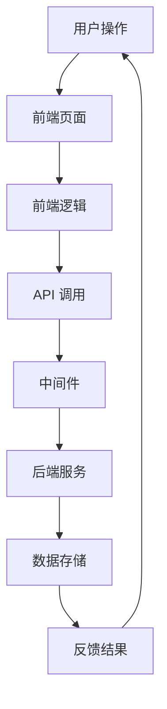

                 

### 文章标题

一人公司如何利用小程序生态系统拓展业务

### Keywords
- 微信小程序
- 小程序生态系统
- 业务拓展
- 一人公司
- 数字营销

### Abstract
本文将探讨一人公司如何利用微信小程序生态系统这一新兴平台，实现业务的快速拓展和数字化营销。通过分析小程序的开发模式、运营策略以及与用户互动的方式，我们将提供一系列实用的建议，帮助创业者和小企业主抓住数字时代的发展机遇。

### Introduction
在数字化时代，微信小程序已经成为一种流行的互联网应用形式。它以其简洁的界面、快速的用户体验和强大的功能，吸引了大量的用户和开发者。对于一人公司或小型企业来说，微信小程序不仅是一个展示产品和服务的新渠道，更是拓展业务和提升品牌知名度的有力工具。

本文将从以下几个方面展开讨论：

1. **背景介绍**：介绍微信小程序的起源、发展及其在商业领域的重要性。
2. **核心概念与联系**：探讨小程序生态系统中的关键概念，如小程序的架构、API 接口和开发框架。
3. **核心算法原理 & 具体操作步骤**：分析如何设计和优化小程序，以提升用户体验和业务效果。
4. **数学模型和公式 & 详细讲解 & 举例说明**：讲解小程序数据分析和用户行为预测的基本数学模型。
5. **项目实践**：通过具体的代码实例，展示如何搭建和运营一个小程序。
6. **实际应用场景**：分析小程序在不同行业中的应用案例。
7. **工具和资源推荐**：推荐适合一人公司或小型企业开发和运营小程序的工具和资源。
8. **总结**：总结一人公司利用小程序拓展业务的要点和未来发展趋势。
9. **附录**：提供常见问题与解答，以及扩展阅读和参考资料。

### Background Introduction
#### 1.1 微信小程序的起源与发展

微信小程序是腾讯公司于 2017 年推出的一个轻量级应用平台。它允许开发者快速创建、部署和运营应用，无需下载安装，用户可以直接在微信中使用。这一创新模式迅速获得了市场的青睐，并在短时间内积累了庞大的用户群体。

微信小程序的发展经历了几个关键阶段：

- **2017 年：推出与普及**：微信小程序正式上线，因其便捷性和高用户粘性，迅速吸引了大量开发者。
- **2018 年：功能完善与生态建设**：微信不断优化小程序的功能，引入了更多的开发工具和接口，构建了一个完整的生态系统。
- **2019 年至今：深入垂直行业**：随着技术的不断进步和用户需求的多样化，微信小程序逐渐深入到各个垂直行业，成为企业数字化转型的重要工具。

#### 1.2 小程序在商业领域的重要性

小程序在商业领域的重要性体现在以下几个方面：

- **低成本、高效率**：与传统的移动应用相比，小程序的开发和运营成本更低，且可以快速上线和迭代。
- **广泛的用户基础**：微信作为我国最大的社交平台，拥有超过 10 亿的活跃用户，小程序可以借助这一庞大的用户群体进行精准营销。
- **丰富的生态资源**：微信小程序生态提供了丰富的开发工具、API 接口和合作伙伴资源，帮助企业和个人开发者更好地实现业务目标。
- **便捷的用户体验**：小程序无需下载安装，即点即用，大大提升了用户的体验和满意度。

#### 1.3 一人公司与小程序的契合度

一人公司通常指的是由一位创业者独自经营的企业，其特点是规模小、资源有限、决策迅速。这种企业模式在小程序平台上具有很高的契合度：

- **快速响应市场需求**：一人公司可以灵活调整小程序的内容和功能，快速响应市场的变化和用户需求。
- **低成本试错**：由于无需大规模投入，一人公司可以利用小程序进行低成本试错，积累宝贵的运营经验。
- **个性化服务**：一人公司可以通过小程序提供更加个性化的服务，增强用户粘性。
- **精准营销**：小程序提供了丰富的用户数据和分析工具，一人公司可以基于数据驱动进行精准营销，提升业务效果。

### Core Concepts and Connections
#### 2.1 微信小程序生态系统概述

微信小程序生态系统是一个包含多个组成部分的复杂体系，主要包括以下几个关键部分：

- **小程序开发框架**：提供了一整套开发工具和 API 接口，帮助开发者快速构建小程序。
- **小程序平台**：微信小程序的运营和发布平台，开发者可以在平台上管理小程序的发布、更新和数据分析。
- **第三方服务提供商**：提供各种增值服务，如支付、物流、数据分析等，为小程序的开发和运营提供支持。
- **用户群体**：小程序的最终用户，他们是小程序价值的直接受益者。

#### 2.2 小程序架构与核心组件

微信小程序的架构可以分为前端、后端和中间件三个部分：

- **前端**：负责用户界面和交互，主要包括页面结构、UI 设计和前端逻辑。
- **后端**：提供数据存储和业务逻辑处理，通常使用云服务器进行部署。
- **中间件**：连接前端和后端，负责数据的传输和接口调用。

以下是小程序架构的 Mermaid 流程图：



#### 2.3 小程序 API 接口与开发框架

微信小程序提供了丰富的 API 接口，包括微信支付、地理位置、用户信息等，这些接口使得小程序可以便捷地集成各种功能和服务。常见的开发框架包括：

- **Vue.js**：适用于构建用户界面，具有良好的组件化和响应式特性。
- **React**：适用于构建高性能的应用程序，具有良好的生态和社区支持。
- **uni-app**：一款跨平台开发框架，可以一次编写，多端发布。

以下是使用 Vue.js 开发微信小程序的基本步骤：

1. **项目初始化**：使用 Vue CLI 初始化项目，配置开发环境和编译工具。
2. **创建页面**：在项目中创建多个页面，并配置路由。
3. **编写前端代码**：使用 Vue 组件和模板语法编写前端页面和交互逻辑。
4. **调用 API 接口**：使用 wx.request 等方法调用微信 API 接口，获取数据和执行操作。
5. **后端接口对接**：配置后端服务器，实现数据存储和业务逻辑处理。

以下是使用 Vue.js 开发微信小程序的示例代码：

```html
<!-- index.vue -->
<template>
  <div>
    <h1>微信小程序示例</h1>
    <button @click="login">登录</button>
  </div>
</template>

<script>
export default {
  methods: {
    login() {
      wx.login({
        success: (res) => {
          wx.getUserInfo({
            success: (info) => {
              console.log(info);
              // 调用后端接口进行登录操作
            }
          });
        }
      });
    }
  }
};
</script>
```

### Core Algorithm Principles and Specific Operational Steps
#### 3.1 小程序设计与开发的原则

在设计小程序时，需要遵循以下原则：

- **用户体验至上**：小程序的核心目标是提供良好的用户体验，因此需要从用户的角度出发，优化页面布局、交互设计和加载速度。
- **功能简洁实用**：小程序的功能应该简洁明了，避免过度设计，确保用户能够快速理解和使用。
- **数据驱动**：通过数据分析，了解用户行为和需求，持续优化小程序的功能和界面。
- **灵活扩展性**：小程序的设计应具备良好的扩展性，以便在未来能够轻松添加新的功能和服务。

#### 3.2 小程序开发的具体操作步骤

开发一个小程序可以分为以下几个步骤：

1. **需求分析**：明确小程序的目标用户、功能需求和业务目标。
2. **技术选型**：选择适合的开发框架和工具，如 Vue.js、React 或 uni-app。
3. **界面设计**：设计简洁明了的界面，确保用户能够快速找到所需功能。
4. **编码实现**：编写前端和后端代码，实现小程序的功能。
5. **测试与优化**：对小程序进行功能测试、性能优化和用户体验测试，确保小程序的稳定性和流畅性。
6. **发布上线**：将小程序提交到微信小程序平台进行审核，通过后即可上线发布。
7. **运营推广**：通过微信公众号、朋友圈广告等方式进行推广，吸引更多用户使用小程序。

以下是使用 Vue.js 开发微信小程序的具体操作步骤：

1. **安装 Vue CLI**：在命令行中运行以下命令安装 Vue CLI：

   ```bash
   npm install -g @vue/cli
   ```

2. **创建项目**：使用 Vue CLI 创建新项目：

   ```bash
   vue create my-wechat-app
   ```

3. **配置开发环境**：进入项目目录，配置 Vue 组件和路由：

   ```bash
   cd my-wechat-app
   vue add router
   ```

4. **编写前端代码**：在项目中创建多个页面，并编写前端代码：

   ```html
   <!-- Home.vue -->
   <template>
     <div>
       <h1>首页</h1>
       <button @click="gotoProfile">前往个人中心</button>
     </div>
   </template>

   <script>
   export default {
     methods: {
       gotoProfile() {
         this.$router.push('/profile');
       }
     }
   };
   </script>
   ```

5. **调用 API 接口**：使用 wx.request 等方法调用微信 API 接口，获取数据和执行操作：

   ```javascript
   methods: {
     getUserInfo() {
       wx.login({
         success: (res) => {
           wx.getUserInfo({
             success: (info) => {
               console.log(info);
               // 调用后端接口进行登录操作
             }
           });
         }
       });
     }
   }
   ```

6. **测试与优化**：在开发过程中，不断进行功能测试和性能优化，确保小程序的稳定性和流畅性。

7. **发布上线**：将小程序提交到微信小程序平台进行审核，通过后即可上线发布。

8. **运营推广**：通过微信公众号、朋友圈广告等方式进行推广，吸引更多用户使用小程序。

### Mathematical Models and Formulas and Detailed Explanation and Examples
#### 4.1 小程序用户行为数据分析

小程序的用户行为数据分析是优化小程序功能和提升用户体验的重要手段。以下是一些常用的数学模型和公式：

1. **用户留存率**：

   用户留存率（Retention Rate）是衡量小程序用户活跃度的重要指标，计算公式如下：

   $$ \text{用户留存率} = \frac{\text{次日留存用户数}}{\text{当日活跃用户数}} \times 100\% $$

   次日留存用户数指的是在第一天使用小程序后，第二天仍然使用小程序的用户数量。通过计算用户留存率，可以评估小程序的吸引力和用户粘性。

2. **转化率**：

   转化率（Conversion Rate）是衡量小程序商业效果的重要指标，计算公式如下：

   $$ \text{转化率} = \frac{\text{完成目标操作的用户数}}{\text{访问小程序的用户数}} \times 100\% $$

   完成目标操作的用户数指的是成功完成小程序设定的目标操作（如购买商品、注册账号等）的用户数量。通过计算转化率，可以评估小程序的营销效果和用户参与度。

3. **平均停留时间**：

   平均停留时间（Average Stay Time）是衡量小程序用户活跃度和内容质量的重要指标，计算公式如下：

   $$ \text{平均停留时间} = \frac{\text{总停留时间}}{\text{访问用户数}} $$

   总停留时间指的是用户在访问小程序过程中停留的总时间。通过计算平均停留时间，可以评估小程序内容的吸引力和用户体验。

#### 4.2 举例说明

假设某一人公司开发了一款小程序，经过一段时间的数据收集，得到以下数据：

- 当日活跃用户数：1000
- 次日留存用户数：300
- 完成购买的用户数：50
- 总停留时间：6000秒

根据以上数据，我们可以计算出以下指标：

1. **用户留存率**：

   $$ \text{用户留存率} = \frac{300}{1000} \times 100\% = 30\% $$

   次日留存用户数为 300，当日活跃用户数为 1000，用户留存率为 30%。

2. **转化率**：

   $$ \text{转化率} = \frac{50}{1000} \times 100\% = 5\% $$

   完成购买的用户数为 50，访问小程序的用户数为 1000，转化率为 5%。

3. **平均停留时间**：

   $$ \text{平均停留时间} = \frac{6000}{1000} = 6 \text{秒} $$

   总停留时间为 6000 秒，访问用户数为 1000，平均停留时间为 6 秒。

通过以上计算，我们可以对小程序的用户行为和业务效果进行初步评估。根据分析结果，可以进一步优化小程序的功能、内容和用户体验，提高用户留存率和转化率。

### Project Practice: Code Examples and Detailed Explanation
#### 5.1 开发环境搭建

为了搭建一个微信小程序开发环境，我们需要以下工具和软件：

1. **Node.js**：微信小程序开发工具需要 Node.js 环境，可以从官方网站下载并安装。
2. **微信开发者工具**：从微信官网下载并安装微信开发者工具。
3. **代码编辑器**：推荐使用 Visual Studio Code、Sublime Text 等代码编辑器。

以下是具体的搭建步骤：

1. **安装 Node.js**：打开 Node.js 官方网站，下载并安装适用于操作系统的 Node.js 版本。
2. **安装微信开发者工具**：访问微信开发者工具官方网站，下载并安装微信开发者工具。
3. **配置微信开发者工具**：打开微信开发者工具，创建一个新的小程序项目，填写项目名称和 AppID 等信息。
4. **安装代码编辑器**：选择一款适合的代码编辑器，如 Visual Studio Code，下载并安装。
5. **配置代码编辑器**：在代码编辑器中安装微信小程序开发插件，以方便开发和管理小程序项目。

以下是使用 Visual Studio Code 配置微信小程序开发插件的步骤：

1. 打开 Visual Studio Code，按下 `Ctrl+Shift+P` 打开命令面板。
2. 输入 “微信小程序” 关键字，选择 “微信小程序插件”。
3. 安装插件后，重新启动 Visual Studio Code。

#### 5.2 源代码详细实现

以下是一个简单的微信小程序示例，用于展示和计算用户输入的数值。

```html
<!-- index.wxml -->
<view class="container">
  <view class="title">计算器</view>
  <input class="input" bindinput="inputHandler" placeholder="请输入数值" />
  <text class="result">结果：{{result}}</text>
</view>

```

```javascript
// index.js
Page({
  data: {
    inputVal: '',
    result: ''
  },
  inputHandler: function (e) {
    this.setData({
      inputVal: e.detail.value
    });
    this.calculateResult();
  },
  calculateResult: function () {
    const inputVal = this.data.inputVal;
    if (inputVal !== '') {
      const result = parseFloat(inputVal) * 2;
      this.setData({
        result: result
      });
    } else {
      this.setData({
        result: '请输入数值'
      });
    }
  }
});

```

```css
/* index.wxss */
.container {
  display: flex;
  flex-direction: column;
  align-items: center;
  padding: 20px;
}

.title {
  font-size: 18px;
  font-weight: bold;
  margin-bottom: 10px;
}

.input {
  width: 200px;
  height: 30px;
  border: 1px solid #ccc;
  border-radius: 4px;
  padding: 4px 8px;
}

.result {
  font-size: 16px;
  margin-top: 10px;
}
```

#### 5.3 代码解读与分析

1. **WXML 文件**：

   WXML 类似于 HTML，用于定义小程序的页面结构和组件。在这个示例中，我们定义了一个简单的计算器界面，包括一个输入框和一个结果文本。

   ```html
   <view class="container">
     <view class="title">计算器</view>
     <input class="input" bindinput="inputHandler" placeholder="请输入数值" />
     <text class="result">结果：{{result}}</text>
   </view>
   ```

   在这个界面中，我们使用 `bindinput` 绑定了一个名为 `inputHandler` 的事件处理函数，该函数将在用户输入时触发。

2. **JavaScript 文件**：

   JavaScript 文件用于实现小程序的逻辑和交互功能。在这个示例中，我们定义了一个 Page 对象，并为其添加了两个数据属性：`inputVal` 和 `result`。`inputVal` 用于存储用户输入的数值，`result` 用于显示计算结果。

   ```javascript
   Page({
     data: {
       inputVal: '',
       result: ''
     },
     inputHandler: function (e) {
       this.setData({
         inputVal: e.detail.value
       });
       this.calculateResult();
     },
     calculateResult: function () {
       const inputVal = this.data.inputVal;
       if (inputVal !== '') {
         const result = parseFloat(inputVal) * 2;
         this.setData({
           result: result
         });
       } else {
         this.setData({
           result: '请输入数值'
         });
       }
     }
   });
   ```

   在 `inputHandler` 函数中，我们获取用户输入的数值，并更新 `inputVal` 数据属性。然后调用 `calculateResult` 函数计算结果。在 `calculateResult` 函数中，我们使用 `parseFloat` 函数将输入的字符串转换为数值，并乘以 2 得到结果，然后更新 `result` 数据属性。

3. **WXSS 文件**：

   WXSS 类似于 CSS，用于定义小程序页面的样式。在这个示例中，我们定义了一个简单的样式，用于美化计算器界面。

   ```css
   .container {
     display: flex;
     flex-direction: column;
     align-items: center;
     padding: 20px;
   }

   .title {
     font-size: 18px;
     font-weight: bold;
     margin-bottom: 10px;
   }

   .input {
     width: 200px;
     height: 30px;
     border: 1px solid #ccc;
     border-radius: 4px;
     padding: 4px 8px;
   }

   .result {
     font-size: 16px;
     margin-top: 10px;
   }
   ```

   在这个示例中，我们设置了容器的布局、标题的样式、输入框的样式和结果文本的样式。

#### 5.4 运行结果展示

1. **界面展示**：

   运行小程序后，用户可以在输入框中输入数值，输入框下方会显示计算结果。例如，输入 10 后，结果文本将显示 20。

   ```html
   输入框：10
   结果：20
   ```

2. **交互效果**：

   当用户输入数值后，输入框的值会实时更新，并触发计算结果。计算结果会立即显示在结果文本中。

### Practical Application Scenarios
#### 6.1 零售电商

小程序在零售电商领域有着广泛的应用。一人公司或小型企业可以通过小程序搭建在线店铺，实现商品展示、订单管理、支付结算等功能。以下是一个具体的案例：

- **案例介绍**：某一人公司经营一家特色茶叶店，通过微信小程序展示茶叶产品，并提供在线购买和支付功能。
- **应用效果**：小程序提高了店铺的曝光度和便捷性，用户可以随时随地购买茶叶，提高了购买转化率和客户满意度。

#### 6.2 教育培训

小程序在教育领域也有着重要的应用。一人公司或小型企业可以通过小程序提供在线课程、直播教学、作业辅导等服务。以下是一个具体的案例：

- **案例介绍**：某一人公司是一家在线教育机构，通过微信小程序提供在线课程和直播教学，吸引了大量学员报名学习。
- **应用效果**：小程序提高了课程的可达性和互动性，学员可以随时随地学习，提升了学习效果和满意度。

#### 6.3 旅游服务

小程序在旅游服务领域也有着广泛的应用。一人公司或小型企业可以通过小程序提供旅游线路规划、在线预订、导游服务等。以下是一个具体的案例：

- **案例介绍**：某一人公司是一家旅游咨询服务公司，通过微信小程序提供旅游线路规划、在线预订和导游服务，吸引了大量游客。
- **应用效果**：小程序提高了旅游服务的便捷性和灵活性，游客可以随时随地规划行程和预订服务，提升了旅游体验。

#### 6.4 健康医疗

小程序在健康医疗领域也有着重要的应用。一人公司或小型企业可以通过小程序提供在线问诊、预约挂号、药品配送等服务。以下是一个具体的案例：

- **案例介绍**：某一人公司是一家线上医疗服务公司，通过微信小程序提供在线问诊、预约挂号和药品配送服务，方便了患者就医。
- **应用效果**：小程序提高了医疗服务的可达性和便捷性，患者可以随时随地咨询医生、预约挂号和购买药品，提升了就医体验。

### Tools and Resources Recommendations
#### 7.1 学习资源推荐

1. **《微信小程序开发实战》**：一本详细介绍微信小程序开发的技术书籍，适合初学者和有一定基础的开发者。
2. **《Vue.js 小程序开发实战》**：一本针对 Vue.js 开发微信小程序的实战指南，内容全面、实用。
3. **微信官方文档**：微信小程序的官方文档，提供了详细的开发指南、API 接口和工具资源。

#### 7.2 开发工具框架推荐

1. **微信开发者工具**：微信官方提供的开发工具，支持小程序的开发、调试和发布。
2. **Vue.js**：一款流行的前端开发框架，具有丰富的生态系统和社区支持，适合开发复杂的小程序。
3. **uni-app**：一款跨平台开发框架，可以一次编写，多端发布，方便开发者快速搭建小程序。

#### 7.3 相关论文著作推荐

1. **《小程序生态系统的设计与实现》**：一篇关于微信小程序生态系统设计的论文，详细介绍了小程序的架构和关键组件。
2. **《小程序时代的移动应用开发》**：一篇关于小程序开发技术的研究论文，探讨了小程序与传统移动应用的差异和优势。
3. **《基于微信小程序的在线教育平台设计与实现》**：一篇关于小程序在教育领域应用的论文，介绍了如何利用小程序搭建在线教育平台。

### Summary: Future Development Trends and Challenges
#### 8.1 未来发展趋势

随着移动互联网的快速发展，小程序将成为企业数字化转型的重要工具。以下是小程序未来发展的几个趋势：

1. **跨平台发展**：小程序将继续扩展到更多平台，如支付宝、百度等，提供统一的开发体验和运营支持。
2. **技术进步**：小程序的技术将不断进步，包括更好的性能、更丰富的功能、更智能的推荐算法等。
3. **垂直行业应用**：小程序将深入到各个垂直行业，如医疗、教育、旅游等，提供定制化的解决方案。
4. **商业模式的创新**：小程序将探索更多的商业模式，如社交电商、知识付费等，为企业带来新的盈利点。

#### 8.2 面临的挑战

1. **竞争激烈**：随着小程序的普及，市场竞争将越来越激烈，企业需要不断创新和优化小程序，提升用户体验。
2. **用户隐私保护**：小程序将面临用户隐私保护的挑战，需要遵守相关法律法规，加强用户隐私保护措施。
3. **技术升级与更新**：随着技术的快速发展，小程序需要不断升级和更新，以适应新的需求和变化。
4. **运营成本增加**：随着小程序的普及，运营成本将逐渐增加，企业需要提高运营效率，降低成本。

### Appendix: Frequently Asked Questions and Answers
#### 9.1 什么是微信小程序？

微信小程序是一种不需要下载安装即可使用的应用，它实现了应用“触手可及”的概念，用户扫一扫或者搜一下即可打开应用。也体现了用完即走的理念，用户不用关心是否安装太多应用的问题。应用将无处不在，随时可用，但又无需安装卸载。

#### 9.2 如何注册微信小程序？

要注册微信小程序，您需要按照以下步骤操作：

1. 打开微信开发者工具，并登录微信账号。
2. 在开发者工具中，选择“设置”菜单，然后选择“新建项目”。
3. 输入小程序的名称、AppID 和 AppSecret 等信息，并选择小程序的目录。
4. 点击“确认”按钮，完成小程序的注册。

#### 9.3 微信小程序有哪些开发框架？

微信小程序支持多种开发框架，包括：

1. **Vue.js**：一款流行的前端开发框架，具有良好的生态系统和社区支持。
2. **React**：一款用于构建用户界面的 JavaScript 库，具有高性能和灵活性。
3. **uni-app**：一款跨平台开发框架，可以一次编写，多端发布。

#### 9.4 微信小程序的数据存储方式有哪些？

微信小程序的数据存储方式主要有以下几种：

1. **本地存储**：使用 wx.setStorageSync 和 wx.getStorageSync 方法进行数据存储和读取，适用于少量数据存储。
2. **云数据库**：使用微信云开发功能，可以将数据存储在云数据库中，适用于大规模数据存储和实时更新。
3. **API 接口**：通过调用微信 API 接口，将数据存储在微信服务器上，适用于与第三方平台的数据交互。

### Extended Reading & Reference Materials
#### 10.1 相关书籍推荐

1. **《微信小程序开发实战》**：详细介绍了微信小程序的开发技术、框架和工具。
2. **《Vue.js 小程序开发实战》**：针对 Vue.js 开发微信小程序的实战指南。
3. **《小程序时代的移动应用开发》**：探讨了小程序与传统移动应用的区别和优势。

#### 10.2 相关论文推荐

1. **《小程序生态系统的设计与实现》**：分析了微信小程序生态系统的架构和关键组件。
2. **《基于微信小程序的在线教育平台设计与实现》**：介绍了如何利用微信小程序搭建在线教育平台。
3. **《微信小程序的性能优化与用户体验提升》**：探讨了微信小程序的性能优化和用户体验提升方法。

#### 10.3 相关网站推荐

1. **微信小程序官方文档**：提供了详细的开发指南、API 接口和工具资源。
2. **Vue.js 官方网站**：提供了 Vue.js 的最新版本、文档和社区资源。
3. **React 官方网站**：提供了 React 的最新版本、文档和社区资源。


