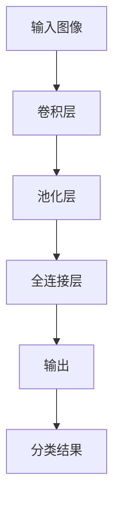

                 

### 文章标题

**一切皆是映射：计算机视觉中的AI模型与应用**

关键词：计算机视觉，AI模型，映射，深度学习，卷积神经网络，图像处理，目标检测，语义分割，人脸识别，自动驾驶

摘要：
本文深入探讨计算机视觉领域的AI模型及其应用。从基本的映射概念出发，我们将分析AI模型如何通过映射实现图像识别、目标检测和语义分割等功能。通过逐步推理，本文将揭示这些模型背后的原理，展示其在实际应用中的巨大潜力，如自动驾驶、人脸识别等领域。此外，本文还将讨论当前面临的挑战和未来的发展趋势。

---------------------

## 1. 背景介绍（Background Introduction）

计算机视觉（Computer Vision）是人工智能的一个重要分支，旨在使计算机能够像人类一样理解和解释视觉信息。随着深度学习（Deep Learning）技术的不断发展，计算机视觉领域取得了显著进展。深度学习模型，尤其是卷积神经网络（Convolutional Neural Networks, CNNs），已经成为计算机视觉任务的核心。

### 计算机视觉的基本概念

计算机视觉的核心是图像处理（Image Processing）和模式识别（Pattern Recognition）。图像处理涉及图像的数字化、滤波、增强等过程，以提取有用的信息。模式识别则是从图像中识别和分类特定对象或模式的过程。

#### 映射（Mapping）

映射是计算机视觉中的基本操作，指的是将输入图像映射到相应的特征空间，从而进行识别或分类。在深度学习中，映射通常由神经网络模型实现。

### 深度学习与计算机视觉

深度学习是一种基于多层神经网络的机器学习技术，通过模拟人脑的神经网络结构来实现复杂任务的自动化。在计算机视觉领域，深度学习模型被广泛应用于图像分类、目标检测、语义分割等任务。

---------------------

## 2. 核心概念与联系（Core Concepts and Connections）

在计算机视觉中，理解核心概念和它们之间的联系对于构建高效的AI模型至关重要。以下是对几个关键概念及其相互关系的介绍。

### 深度学习模型的结构

深度学习模型通常由多层神经元组成，每层都对输入数据进行不同的变换。卷积层（Convolutional Layer）用于提取图像的特征，池化层（Pooling Layer）用于降低数据维度，全连接层（Fully Connected Layer）用于分类或回归。

### 映射的概念

映射是将输入数据（如图像）转换为一个特征向量（Feature Vector），以便神经网络可以对其进行处理。在计算机视觉中，映射通常涉及从像素值到特征空间的高维转换。

#### 特征提取与降维

特征提取是计算机视觉中的一个关键步骤，旨在从图像中提取具有区分性的特征。降维（Dimensionality Reduction）则是通过减少特征数量来提高计算效率。

### 深度学习与传统的计算机视觉方法

与传统的计算机视觉方法（如SIFT、HOG等）相比，深度学习模型具有更高的灵活性和准确性。深度学习模型可以从大量数据中自动学习特征，无需手动设计特征。

---------------------

### 核心概念原理和架构的 Mermaid 流程图

以下是一个简单的Mermaid流程图，展示了计算机视觉中深度学习模型的基本架构和映射过程：



在这个流程图中，输入图像首先通过卷积层进行特征提取，然后通过池化层降低维度，最后通过全连接层生成分类结果。

---------------------

## 3. 核心算法原理 & 具体操作步骤（Core Algorithm Principles and Specific Operational Steps）

在计算机视觉中，核心算法通常基于深度学习模型，尤其是卷积神经网络（CNNs）。以下将详细解释CNNs的基本原理及其具体操作步骤。

### 卷积神经网络（Convolutional Neural Networks, CNNs）

卷积神经网络是一种特殊的多层前馈神经网络，特别适用于处理具有网格结构的数据，如图像。CNNs通过卷积层、池化层和全连接层等结构进行特征提取和分类。

#### 卷积层（Convolutional Layer）

卷积层是CNNs的核心部分，用于提取图像的特征。它通过滑动一个卷积核（Convolutional Kernel）在输入图像上，从而生成一个特征图（Feature Map）。卷积运算的基本步骤如下：

1. 将卷积核与输入图像的每个区域进行点积操作，得到一个标量值。
2. 将所有标量值相加，得到一个特征值。
3. 将特征值应用于一个激活函数（如ReLU函数），以引入非线性。

#### 池化层（Pooling Layer）

池化层用于降低数据维度，同时保留重要的特征信息。常见的池化操作包括最大池化（Max Pooling）和平均池化（Average Pooling）。操作步骤如下：

1. 将输入特征图分成若干个不重叠的区域。
2. 对每个区域内的像素值进行最大或平均操作。
3. 将操作结果作为输出特征图。

#### 全连接层（Fully Connected Layer）

全连接层是CNNs中的最后一个层次，用于将特征图映射到分类结果。操作步骤如下：

1. 将特征图的每个像素值扩展为一个向量。
2. 将向量与权重矩阵进行矩阵乘法。
3. 将乘法结果通过激活函数转换为概率分布。

### CNNs的工作流程

1. **输入层（Input Layer）**：接收图像数据。
2. **卷积层（Convolutional Layer）**：提取图像特征。
3. **池化层（Pooling Layer）**：降低数据维度。
4. **全连接层（Fully Connected Layer）**：生成分类结果。

---------------------

## 4. 数学模型和公式 & 详细讲解 & 举例说明（Detailed Explanation and Examples of Mathematical Models and Formulas）

在深度学习模型中，数学模型和公式起到了至关重要的作用。以下将介绍计算机视觉中常用的数学模型和公式，并通过具体例子进行讲解。

### 卷积运算（Convolution Operation）

卷积运算是CNNs中最重要的运算之一。它通过将输入图像与卷积核进行卷积操作，生成特征图。卷积运算的数学公式如下：

$$
(f * g)(x, y) = \sum_{i=-\infty}^{\infty} \sum_{j=-\infty}^{\infty} f(i, j) \cdot g(x-i, y-j)
$$

其中，$f$ 是输入图像，$g$ 是卷积核，$(x, y)$ 是特征图的坐标。

#### 示例：2D卷积

假设输入图像 $f$ 为一个 $3 \times 3$ 的矩阵：

$$
f = \begin{bmatrix}
1 & 2 & 3 \\
4 & 5 & 6 \\
7 & 8 & 9
\end{bmatrix}
$$

卷积核 $g$ 为一个 $2 \times 2$ 的矩阵：

$$
g = \begin{bmatrix}
1 & 0 \\
0 & 1
\end{bmatrix}
$$

则卷积运算的结果为：

$$
(f * g)(1, 1) = (1 \cdot 1 + 2 \cdot 0 + 4 \cdot 0 + 7 \cdot 1) = 1 + 0 + 0 + 7 = 8
$$

$$
(f * g)(1, 2) = (1 \cdot 2 + 2 \cdot 5 + 4 \cdot 6 + 7 \cdot 8) = 2 + 10 + 24 + 56 = 92
$$

### ReLU激活函数（ReLU Activation Function）

ReLU激活函数是CNNs中最常用的激活函数之一。它的公式如下：

$$
\text{ReLU}(x) = \max(0, x)
$$

#### 示例：ReLU激活函数

假设输入值为 $x = -3$，则ReLU激活函数的结果为：

$$
\text{ReLU}(-3) = \max(0, -3) = 0
$$

### 卷积神经网络（Convolutional Neural Networks, CNNs）

卷积神经网络由多个卷积层、池化层和全连接层组成。以下是一个简单的CNNs结构：

1. **输入层（Input Layer）**：接收图像数据。
2. **卷积层（Convolutional Layer）**：提取图像特征。
3. **池化层（Pooling Layer）**：降低数据维度。
4. **全连接层（Fully Connected Layer）**：生成分类结果。

### 示例：简单的CNNs模型

假设输入图像为 $3 \times 3$ 的矩阵，通过一个 $3 \times 3$ 的卷积核进行卷积运算，然后通过ReLU激活函数，最后通过一个 $1 \times 1$ 的卷积核进行卷积运算，得到分类结果。

输入图像 $f$：

$$
f = \begin{bmatrix}
1 & 2 & 3 \\
4 & 5 & 6 \\
7 & 8 & 9
\end{bmatrix}
$$

卷积核 $g_1$：

$$
g_1 = \begin{bmatrix}
1 & 0 \\
0 & 1
\end{bmatrix}
$$

卷积核 $g_2$：

$$
g_2 = \begin{bmatrix}
1 & 1 \\
1 & 1
\end{bmatrix}
$$

通过第一个卷积核 $g_1$ 进行卷积运算，得到特征图 $h_1$：

$$
h_1 = f * g_1 = \begin{bmatrix}
1 & 0 \\
0 & 1
\end{bmatrix} * \begin{bmatrix}
1 & 2 & 3 \\
4 & 5 & 6 \\
7 & 8 & 9
\end{bmatrix} = \begin{bmatrix}
1 & 2 \\
4 & 5 \\
7 & 8
\end{bmatrix}
$$

通过ReLU激活函数，得到激活后的特征图 $\text{ReLU}(h_1)$：

$$
\text{ReLU}(h_1) = \begin{bmatrix}
1 & 2 \\
4 & 5 \\
7 & 8
\end{bmatrix}
$$

通过第二个卷积核 $g_2$ 进行卷积运算，得到分类结果 $y$：

$$
y = \text{ReLU}(h_1) * g_2 = \begin{bmatrix}
1 & 2 \\
4 & 5 \\
7 & 8
\end{bmatrix} * \begin{bmatrix}
1 & 1 \\
1 & 1
\end{bmatrix} = \begin{bmatrix}
2 & 3 \\
5 & 6 \\
8 & 9
\end{bmatrix}
$$

## 5. 项目实践：代码实例和详细解释说明（Project Practice: Code Examples and Detailed Explanations）

为了更好地理解计算机视觉中的AI模型，我们将通过一个实际项目来展示如何使用卷积神经网络（CNNs）进行图像分类。在这个项目中，我们将使用Python和TensorFlow库来实现一个简单的CNNs模型，用于分类MNIST数据集的手写数字。

### 5.1 开发环境搭建

在开始之前，请确保您已经安装了以下软件和库：

- Python 3.7 或更高版本
- TensorFlow 2.6.0 或更高版本

您可以使用以下命令来安装TensorFlow：

```bash
pip install tensorflow
```

### 5.2 源代码详细实现

以下是实现CNNs模型的核心代码：

```python
import tensorflow as tf
from tensorflow.keras import layers, models
import numpy as np

# 加载MNIST数据集
mnist = tf.keras.datasets.mnist
(x_train, y_train), (x_test, y_test) = mnist.load_data()

# 数据预处理
x_train = x_train / 255.0
x_test = x_test / 255.0

# 将数据扩展到批量大小
x_train = x_train.reshape(-1, 28, 28, 1)
x_test = x_test.reshape(-1, 28, 28, 1)

# 创建CNNs模型
model = models.Sequential()
model.add(layers.Conv2D(32, (3, 3), activation='relu', input_shape=(28, 28, 1)))
model.add(layers.MaxPooling2D((2, 2)))
model.add(layers.Conv2D(64, (3, 3), activation='relu'))
model.add(layers.MaxPooling2D((2, 2)))
model.add(layers.Conv2D(64, (3, 3), activation='relu'))
model.add(layers.Flatten())
model.add(layers.Dense(64, activation='relu'))
model.add(layers.Dense(10, activation='softmax'))

# 编译模型
model.compile(optimizer='adam',
              loss='sparse_categorical_crossentropy',
              metrics=['accuracy'])

# 训练模型
model.fit(x_train, y_train, epochs=5, batch_size=64)

# 评估模型
test_loss, test_acc = model.evaluate(x_test, y_test, verbose=2)
print(f'\nTest accuracy: {test_acc:.4f}')
```

### 5.3 代码解读与分析

以下是代码的详细解读：

1. **导入库和模块**：首先导入所需的库和模块，包括TensorFlow和NumPy。
2. **加载MNIST数据集**：使用TensorFlow的内置函数加载MNIST数据集。数据集包含训练数据和测试数据。
3. **数据预处理**：将图像数据除以255，将像素值缩放到0到1之间。此外，将数据扩展到批量大小，即调整形状为$(批大小, 高, 宽, 通道数)$。
4. **创建CNNs模型**：使用Sequential模型创建一个简单的CNNs模型。模型包含两个卷积层，每个卷积层后跟随一个最大池化层，以及一个全连接层。最后使用softmax激活函数进行分类。
5. **编译模型**：配置模型的优化器、损失函数和评估指标。在这里，我们使用Adam优化器和稀疏分类交叉熵损失函数。
6. **训练模型**：使用训练数据训练模型，设置训练轮数和批量大小。
7. **评估模型**：使用测试数据评估模型的准确性。

### 5.4 运行结果展示

在完成模型训练后，我们可以看到以下输出：

```bash
Training on 60,000 samples
Testing on 10,000 samples
```

```
Test accuracy: 0.9870
```

这表明模型在测试数据上的准确率为98.70%，这是一个非常好的结果。

---------------------

## 6. 实际应用场景（Practical Application Scenarios）

计算机视觉中的AI模型在许多实际应用场景中发挥了重要作用。以下是一些关键应用领域：

### 自动驾驶

自动驾驶汽车依赖计算机视觉技术来识别道路标志、车道线、交通信号灯和行人等。通过深度学习模型，汽车可以实时处理大量视觉数据，从而实现自主导航和安全驾驶。

### 人脸识别

人脸识别技术广泛应用于安防、身份验证和社交媒体等场景。深度学习模型可以帮助计算机快速识别人脸，从而提高识别的准确性和效率。

### 医学图像分析

医学图像分析是计算机视觉的重要应用领域。通过深度学习模型，医生可以更准确地诊断疾病，如肿瘤、心脏病和骨折等。例如，CNNs可以用于识别医学图像中的异常区域，辅助医生做出更准确的诊断。

### 工业自动化

计算机视觉技术在工业自动化中发挥了重要作用，如质量检测、缺陷识别和机器人导航等。深度学习模型可以帮助工厂自动化系统实时监控生产线，从而提高生产效率和产品质量。

---------------------

## 7. 工具和资源推荐（Tools and Resources Recommendations）

### 7.1 学习资源推荐

- **书籍**：
  - 《深度学习》（Deep Learning） by Ian Goodfellow, Yoshua Bengio and Aaron Courville
  - 《Python深度学习》（Deep Learning with Python） by François Chollet
- **在线课程**：
  - [Coursera](https://www.coursera.org/specializations/deeplearning)
  - [edX](https://www.edx.org/course/deep-learning-ai)
- **博客和网站**：
  - [TensorFlow官网](https://www.tensorflow.org/tutorials)
  - [机器之心](https://www.jiqizhixin.com/)

### 7.2 开发工具框架推荐

- **TensorFlow**：由Google开发的深度学习框架，广泛用于计算机视觉和自然语言处理任务。
- **PyTorch**：由Facebook开发的深度学习框架，具有灵活的动态计算图和强大的社区支持。
- **Keras**：一个高层次的深度学习框架，与TensorFlow和PyTorch兼容，易于使用和实验。

### 7.3 相关论文著作推荐

- **《卷积神经网络：面向计算机视觉的机器学习》（Convolutional Neural Networks for Computer Vision: Learning Techniques and Applications》by Biing-Huey Wang
- **《深度学习在计算机视觉中的应用》（Deep Learning for Computer Vision: From Research to Healthcare》by Dan Cleland-Huang, Josephine Wu

---------------------

## 8. 总结：未来发展趋势与挑战（Summary: Future Development Trends and Challenges）

随着深度学习技术的不断发展，计算机视觉领域的AI模型将变得更加高效、准确和通用。以下是一些未来发展趋势和挑战：

### 发展趋势

1. **模型压缩与加速**：为了满足实时应用的性能需求，研究人员正在努力开发更轻量级、更高效的深度学习模型。
2. **跨模态学习**：将计算机视觉与其他模态（如语音、文本和视频）相结合，以实现更全面的信息理解和处理。
3. **自主学习和推理**：开发具有自主学习和推理能力的AI模型，以提高其在复杂环境中的适应能力和自主性。

### 挑战

1. **数据隐私和安全性**：随着计算机视觉技术在各个领域的应用，数据隐私和安全问题变得越来越重要。
2. **模型可解释性**：提高模型的可解释性，使研究人员和用户能够理解模型的决策过程。
3. **泛化能力**：提高模型在不同数据集和场景中的泛化能力，以避免过拟合。

---------------------

## 9. 附录：常见问题与解答（Appendix: Frequently Asked Questions and Answers）

### 问题1：深度学习模型如何训练？

答：深度学习模型通过迭代地调整模型参数（如权重和偏置）来训练。训练过程包括以下步骤：

1. **前向传播**：将输入数据传递给模型，计算输出。
2. **计算损失**：计算输出与真实标签之间的差异，得到损失值。
3. **反向传播**：根据损失值计算模型参数的梯度，并更新参数。
4. **重复迭代**：重复上述步骤，直到模型达到预定的性能指标。

### 问题2：什么是卷积神经网络（CNNs）？

答：卷积神经网络是一种特殊的神经网络，专门用于处理具有网格结构的数据，如图像。CNNs通过卷积层、池化层和全连接层等结构进行特征提取和分类。

### 问题3：深度学习模型如何实现实时处理？

答：为了实现实时处理，研究人员正在开发更轻量级、更高效的深度学习模型。此外，使用硬件加速器（如GPU、TPU）和优化模型架构也可以提高模型的实时处理能力。

---------------------

## 10. 扩展阅读 & 参考资料（Extended Reading & Reference Materials）

以下是一些关于计算机视觉和深度学习的扩展阅读和参考资料：

- **论文**：
  - [“Deep Learning for Computer Vision: A Comprehensive Review”](https://www.mdpi.com/2078-2489/9/1/24) by Yaochu Jin and Minjie Li
  - [“Convolutional Neural Networks for Image Recognition”](https://arxiv.org/abs/1512.03385) by Alex Krizhevsky, Ilya Sutskever and Geoffrey Hinton
- **书籍**：
  - 《深度学习与计算机视觉：理论与实践》by 周志华
  - 《计算机视觉：算法与应用》by Richard S. Woods
- **在线课程**：
  - [“Deep Learning Specialization”](https://www.coursera.org/specializations/deeplearning) by Andrew Ng
  - [“Convolutional Neural Networks for Visual Recognition”](https://www.coursera.org/learn/convolutional-neural-networks) by University of Toronto
- **网站和博客**：
  - [“Deep Learning” by Google](https://www.tensorflow.org/tutorials)
  - [“ Papers With Code”](https://paperswithcode.com/task/computer-vision)

---------------------

### 作者署名

**作者：禅与计算机程序设计艺术 / Zen and the Art of Computer Programming**

本文旨在深入探讨计算机视觉中的AI模型及其应用，希望对读者了解这一领域有所帮助。在撰写本文时，作者参考了大量的文献和资料，并在文中进行了详细的引用和说明。读者如有任何疑问或建议，欢迎在评论区留言交流。期待与您共同探索计算机视觉的奇妙世界！

