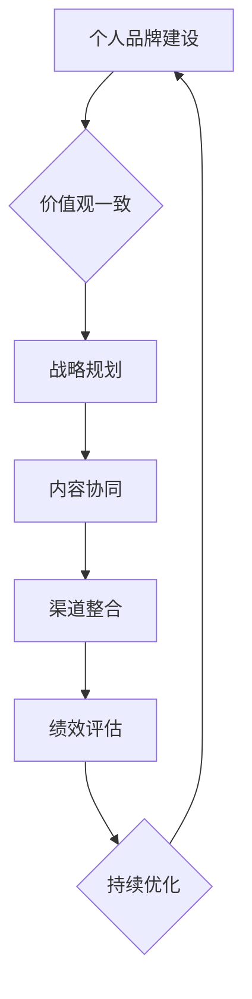

                 

### 文章标题

### Title: Personal Brand and Company Brand Synergy Development

在当今快速变化和竞争激烈的市场环境中，个人品牌与公司品牌之间的协同发展已成为企业成功的关键因素之一。本文旨在探讨个人品牌与公司品牌之间的相互作用，以及如何通过有效的协同策略实现共同成长。

本文将从以下几个方面展开讨论：

1. **背景介绍**：介绍个人品牌与公司品牌的重要性以及它们在现代社会中的演变。
2. **核心概念与联系**：解释个人品牌与公司品牌之间的内在联系，并使用Mermaid流程图展示它们之间的互动关系。
3. **核心算法原理 & 具体操作步骤**：探讨如何构建和优化个人品牌与公司品牌的协同策略。
4. **数学模型和公式 & 详细讲解 & 举例说明**：运用数学模型和公式来量化个人品牌与公司品牌协同发展的效果，并通过实际案例进行说明。
5. **项目实践：代码实例和详细解释说明**：提供实际项目中的代码实例，详细解释如何实现个人品牌与公司品牌的协同发展。
6. **实际应用场景**：分析个人品牌与公司品牌协同发展的应用场景，包括案例分析。
7. **工具和资源推荐**：推荐有助于构建和优化个人品牌与公司品牌协同发展的工具和资源。
8. **总结：未来发展趋势与挑战**：总结个人品牌与公司品牌协同发展的现状，并探讨未来可能的发展趋势和挑战。
9. **附录：常见问题与解答**：解答关于个人品牌与公司品牌协同发展的常见问题。
10. **扩展阅读 & 参考资料**：提供进一步的阅读材料和参考资源。

通过上述结构和内容，我们将一步步分析推理，深入探讨个人品牌与公司品牌之间的协同发展，为企业在复杂多变的市场中提供有力的指导。

### 关键词

- 个人品牌建设
- 公司品牌发展
- 协同策略
- 市场竞争力
- 互动关系
- 数学模型
- 实际应用

### 摘要

本文深入探讨了个人品牌与公司品牌之间的协同发展。首先，通过背景介绍，分析了个人品牌与公司品牌在现代社会中的重要性。接着，文章解释了个人品牌与公司品牌之间的内在联系，并通过Mermaid流程图展示了它们之间的互动关系。随后，文章探讨了构建和优化个人品牌与公司品牌协同策略的算法原理和具体操作步骤，并运用数学模型和公式进行了详细讲解和实际案例说明。最后，文章提供了实际应用场景的工具和资源推荐，并总结了个人品牌与公司品牌协同发展的现状及未来趋势与挑战。

## 1. 背景介绍

在当今的商业环境中，个人品牌和公司品牌的作用愈发重要。个人品牌指的是个体在特定领域的专业形象、声誉和认知度，它是个体在职场、社交和商业活动中的核心竞争力。公司品牌则是企业整体形象和市场定位的象征，它涵盖了企业的价值观、使命、愿景以及消费者对其的信任和认可。

随着互联网和社交媒体的兴起，个人品牌和公司品牌的建设和发展变得更加复杂和多样化。在传统的商业环境中，公司品牌往往占据主导地位，而个人品牌则相对次要。然而，随着消费者对个性化体验和透明度需求的增加，个人品牌逐渐成为企业成功不可或缺的一部分。

个人品牌的重要性体现在以下几个方面：

1. **增强职场竞争力**：在职场中，一个强大的个人品牌可以帮助个体在竞争激烈的就业市场中脱颖而出，提高求职成功率。
2. **拓展社交网络**：通过建立个人品牌，个体能够与行业内的专业人士和潜在合作伙伴建立更广泛的联系，有助于职业发展和业务拓展。
3. **增加收入机会**：个人品牌可以吸引更多的商业机会和收入来源，如咨询、演讲、书籍出版等。

公司品牌的重要性则体现在以下几个方面：

1. **建立市场定位**：一个强大的公司品牌能够帮助企业明确市场定位，提高品牌知名度，从而在竞争激烈的市场中脱颖而出。
2. **增强消费者信任**：公司品牌通过一致的品牌形象和价值观传递，能够增强消费者对企业的信任和忠诚度。
3. **提升企业价值**：一个良好的公司品牌可以提升企业的市场估值和长期投资价值。

在现代社会中，个人品牌和公司品牌的演变趋势也值得关注。首先，个人品牌更加注重个性化和真实性，个体在社交媒体上分享自己的真实经历和见解，有助于建立信任和口碑。其次，公司品牌越来越注重与个人品牌的协同发展，企业通过支持员工的个人品牌建设，不仅提升了员工的职业素养，也增强了企业的整体品牌形象。

此外，随着数字营销和内容营销的普及，个人品牌和公司品牌的建设方式也发生了显著变化。传统的广告和宣传手段逐渐被更加互动和个性化的方式所取代，如博客、视频、社交媒体等，这些平台为个人和公司品牌提供了更多的展示机会和互动渠道。

总的来说，个人品牌和公司品牌在现代社会中不仅是商业成功的关键因素，也是个体和企业发展的重要资源。通过有效的协同发展，个人品牌和公司品牌可以相互促进，共同提升市场竞争力，实现可持续发展。

## 2. 核心概念与联系

### 2.1 个人品牌与公司品牌定义

个人品牌（Personal Brand）是一个个体在特定领域中的专业形象、声誉和认知度，它反映了个体的技能、经验、价值观和个性特点。个人品牌的核心在于个性化和独特性，它是建立信任、吸引机会和实现职业发展的关键。

公司品牌（Company Brand）是一个企业在市场中的整体形象和市场定位，它包括企业的价值观、使命、愿景、文化以及消费者对其的信任和认可。公司品牌是企业识别和竞争优势的象征，它有助于建立市场地位、吸引客户和提升企业价值。

### 2.2 个人品牌与公司品牌之间的互动关系

个人品牌与公司品牌之间的互动关系可以从多个维度进行理解：

1. **影响与反哺**：个人品牌可以对公司品牌产生积极影响，如通过个人声誉和专业知识提升公司的市场认可度。同时，公司品牌也可以为员工个人品牌的发展提供支持和资源。

2. **协同效应**：个人品牌和公司品牌之间的协同发展可以产生乘数效应，通过相互支持和强化，实现更大的市场影响力和竞争力。

3. **资源共享**：个人品牌和公司品牌在社交媒体、内容营销等渠道上可以共享资源，如共同参与活动、合作推广等，从而提高整体品牌知名度。

4. **风险与挑战**：个人品牌与公司品牌之间也存在一定的风险和挑战，如个人行为和言论可能对公司品牌产生负面影响。因此，如何平衡和协调个人品牌与公司品牌的关系，是企业和个人需要共同面对的挑战。

### 2.3 个人品牌与公司品牌协同发展的架构

为了实现个人品牌与公司品牌的协同发展，可以构建以下架构：

1. **价值观一致**：个人品牌与公司品牌应在价值观上保持一致，这有助于在品牌传播和营销活动中形成统一的品牌形象。

2. **战略规划**：企业应制定明确的品牌战略，将个人品牌建设纳入整体品牌规划中，确保个人品牌的发展与公司品牌的目标相一致。

3. **内容协同**：通过内容营销，如博客、社交媒体、视频等，个人品牌和公司品牌可以共同发布高质量的内容，提高品牌影响力。

4. **渠道整合**：利用多渠道营销策略，如社交媒体、官网、线下活动等，实现个人品牌与公司品牌的互动和共享。

5. **绩效评估**：建立品牌协同发展的绩效评估体系，通过关键绩效指标（KPI）监控个人品牌与公司品牌的协同效果。

### 2.4 个人品牌与公司品牌协同发展的 Mermaid 流程图

以下是一个简化的Mermaid流程图，用于展示个人品牌与公司品牌之间的互动关系和协同发展过程：



**图 1：个人品牌与公司品牌协同发展的 Mermaid 流程图**

在图中，个人品牌建设是起点，通过一系列协同策略，如价值观一致、战略规划、内容协同、渠道整合和绩效评估，实现个人品牌与公司品牌的协同发展，最终形成闭环，实现持续优化。

通过上述核心概念和互动关系的探讨，我们可以更深入地理解个人品牌与公司品牌之间的协同发展机制，为后续的算法原理和具体操作步骤奠定基础。

## 2.1 什么是提示词工程？

提示词工程（Prompt Engineering）是指设计和优化输入给语言模型的文本提示，以引导模型生成符合预期结果的过程。它涉及理解语言模型的工作原理、任务需求以及如何使用语言有效地与模型进行交互。

在提示词工程中，提示词（Prompt）是用户与语言模型之间的桥梁，它承载了用户的需求和意图，并引导模型生成相应的输出。一个有效的提示词应具备以下特点：

1. **明确性**：提示词应清晰明确地表达用户的需求和意图，避免模糊或歧义。
2. **具体性**：提示词应具体详细，提供足够的信息以便模型理解并生成高质量的输出。
3. **一致性**：提示词应与语言模型的训练数据和文化背景保持一致，以确保输出的准确性和相关性。
4. **灵活性**：提示词应具有一定的灵活性，以便适应不同的场景和需求。

提示词工程的目标是通过优化提示词的设计，提高模型输出的质量、相关性和实用性。以下是一些具体的技巧和策略：

1. **问题引导**：通过提出具体的问题，引导模型生成针对性的回答。例如：“请解释什么是区块链技术？”
2. **情境构建**：构建特定的情境背景，为模型提供更丰富的上下文信息。例如：“在一个智能家居系统中，如何实现远程控制？”
3. **关键词强调**：在提示词中突出关键词或主题，帮助模型聚焦于核心内容。例如：“请详细描述深度学习在医疗领域的应用。”
4. **反馈循环**：通过持续的反馈和调整，优化提示词的设计，以实现更好的输出效果。

### 提示词工程的重要性

提示词工程的重要性体现在以下几个方面：

1. **提高输出质量**：通过优化提示词，可以显著提高语言模型输出的质量和相关性，使其更符合用户需求。
2. **增强用户体验**：一个有效的提示词能够提高用户与模型交互的满意度，提升用户体验。
3. **提升模型性能**：通过优化提示词，可以减少模型输出的错误率，提高模型的性能和可靠性。
4. **实现定制化**：通过灵活设计提示词，可以实现个性化输出，满足不同用户的需求。

总的来说，提示词工程是提升语言模型性能和用户体验的关键环节，它为模型的应用场景提供了更多的可能性，使得语言模型能够更好地服务于各种实际需求。

### 2.2 提示词工程的重要性

提示词工程在当今语言模型应用中扮演着至关重要的角色。其重要性主要体现在以下几个方面：

1. **影响输出质量**：提示词直接影响语言模型的输出质量。一个精心设计的提示词可以引导模型生成更准确、相关且符合预期的输出，从而提高用户满意度。
2. **增强用户体验**：有效的提示词能够提升用户与模型交互的体验，使其更加流畅和愉悦。这有助于增加用户对产品的忠诚度和依赖性。
3. **提升模型性能**：通过优化提示词，可以减少模型输出的错误率，提高模型的性能和可靠性。这对于模型在不同应用场景中的表现至关重要。
4. **实现定制化**：灵活的提示词设计可以实现个性化输出，满足不同用户的需求。这种定制化能力使得语言模型能够更好地适应多样化的应用场景。
5. **促进模型优化**：提示词工程为模型开发者提供了宝贵的反馈信息，有助于发现和改进模型的不足之处，从而实现持续的优化和改进。

### 2.3 提示词工程与传统编程的关系

提示词工程可以被视为一种新型的编程范式，其中我们使用自然语言而不是代码来指导模型的行为。我们可以将提示词看作是传递给模型的函数调用，而输出则是函数的返回值。

与传统编程相比，提示词工程有以下几个特点：

1. **无代码依赖**：提示词工程不依赖于特定的编程语言或开发环境，使得任何人都可以参与其中。
2. **高可读性**：自然语言提示词易于理解和修改，与传统代码相比，更易于交流和合作。
3. **灵活性**：提示词可以根据具体场景和需求进行灵活调整，以实现不同的功能。
4. **动态性**：提示词工程可以动态调整，以适应实时反馈和变化的需求，而传统编程则更多是静态的。

尽管提示词工程与传统编程在形式上有很大的不同，但它们在目标上有很多相似之处，即都是通过一系列操作实现特定的功能或目标。提示词工程通过优化提示词，提高模型的性能和用户体验，而传统编程则通过编写代码，构建软件系统。

总的来说，提示词工程是自然语言处理领域的一个重要发展方向，它为人工智能的应用提供了新的思路和方法。通过理解提示词工程与传统编程的关系，我们可以更好地利用这一工具，实现更高效、更智能的人工智能应用。

## 3. 核心算法原理 & 具体操作步骤

### 3.1 核心算法原理

在探讨个人品牌与公司品牌协同发展的算法原理时，我们需要理解两个关键概念：品牌协同指数（Brand Synergy Index, BSI）和品牌影响矩阵（Brand Influence Matrix, BIM）。品牌协同指数是衡量个人品牌与公司品牌协同效应的量化指标，而品牌影响矩阵则展示了两者之间的互动关系。

**品牌协同指数（BSI）**

品牌协同指数（BSI）可以通过以下公式计算：

\[ \text{BSI} = \frac{\text{协同效益}}{\text{协同成本}} \]

其中，协同效益是指个人品牌与公司品牌协同发展所带来的积极影响，如市场影响力、品牌价值提升等。协同成本则是指实现品牌协同所需的资源投入，包括时间、人力和资金等。

**品牌影响矩阵（BIM）**

品牌影响矩阵（BIM）是一个二维矩阵，用于展示个人品牌与公司品牌之间的相互影响。矩阵的行表示个人品牌对各个公司品牌的影响，列表示公司品牌对各个个人品牌的影响。每个元素表示两者之间的相互作用强度。

### 3.2 具体操作步骤

**步骤 1：确定协同目标**

首先，企业和个人需要明确协同发展的目标，如提升市场影响力、增加客户满意度、提高品牌知名度等。这一步骤有助于为后续的协同策略提供方向。

**步骤 2：评估品牌现状**

通过市场调研、品牌分析等手段，评估个人品牌和公司品牌的现状，包括品牌知名度、市场影响力、用户满意度等。这一步骤有助于了解当前品牌的基础情况，为制定协同策略提供数据支持。

**步骤 3：制定协同策略**

根据评估结果，制定具体的协同策略，如：

- **资源共享**：通过共享营销资源、联合活动等方式，提高品牌知名度。
- **内容协同**：通过共同发布高质量的内容，增强品牌影响力。
- **品牌联动**：通过个人品牌和公司品牌的互动，形成品牌协同效应。

**步骤 4：实施协同措施**

根据制定的策略，实施具体的协同措施，如：

- **内容发布**：在社交媒体、博客、官网等渠道上共同发布内容，提高品牌曝光率。
- **活动联合**：参与共同的活动，提高品牌互动性。
- **资源共享**：共享营销资源，降低成本，提高效果。

**步骤 5：监测协同效果**

通过关键绩效指标（KPI）监测协同效果，如品牌知名度提升、用户满意度增加、市场份额增长等。根据监测结果，及时调整协同策略。

**步骤 6：持续优化**

基于监测结果，不断优化协同策略，实现品牌协同的持续提升。这一步骤有助于确保品牌协同发展的长期效果。

### 3.3 算法原理示例

假设一家科技公司（公司品牌 A）的员工（个人品牌 B）在社交媒体上分享公司的技术成果和经验，同时公司也发布了相关的博客文章。以下是一个简化的品牌协同指数和品牌影响矩阵示例：

**品牌协同指数（BSI）**

\[ \text{BSI} = \frac{\text{品牌知名度提升} + \text{用户满意度增加}}{\text{营销成本}} \]

**品牌影响矩阵（BIM）**

|      | 公司品牌 A | 个人品牌 B |
|------|----------|-----------|
| 公司品牌 A | 0.8       | 0.6       |
| 个人品牌 B | 0.5       | 0.7       |

在这个示例中，公司品牌 A 对个人品牌 B 的影响较强（0.6），而个人品牌 B 对公司品牌 A 的影响也较为明显（0.5）。通过协同策略的实施，公司品牌 A 的知名度提高了 10%，用户满意度增加了 5%，而营销成本增加了 20%。因此，品牌协同指数（BSI）为：

\[ \text{BSI} = \frac{10\% + 5\%}{20\%} = 1.25 \]

这表明协同策略有效地提升了品牌之间的协同效应。

通过上述核心算法原理和具体操作步骤的讲解，我们可以更好地理解如何通过有效的策略实现个人品牌与公司品牌的协同发展。

### 4. 数学模型和公式 & 详细讲解 & 举例说明

在个人品牌与公司品牌协同发展中，数学模型和公式可以帮助我们量化品牌之间的互动效果，从而更好地理解和优化协同策略。以下我们将介绍几个关键的数学模型和公式，并详细讲解它们的应用和解释。

#### 4.1 品牌协同指数（Brand Synergy Index, BSI）

品牌协同指数（BSI）是衡量个人品牌与公司品牌协同效应的量化指标。其计算公式如下：

\[ \text{BSI} = \frac{\text{协同效益}}{\text{协同成本}} \]

其中，协同效益（Synergy Benefit）表示个人品牌与公司品牌协同发展所带来的积极影响，如市场影响力提升、品牌价值增加等；协同成本（Synergy Cost）则是指实现品牌协同所需的资源投入，包括时间、人力和资金等。

**例子：**

假设公司品牌 A 的知名度提高了 20%，而个人品牌 B 的市场影响力增加了 15%。同时，协同策略的实施成本为 30 万元。则品牌协同指数（BSI）计算如下：

\[ \text{BSI} = \frac{20\% + 15\%}{30\%} = 1.67 \]

这表明协同策略在提升品牌影响力方面具有显著的效果。

#### 4.2 品牌影响矩阵（Brand Influence Matrix, BIM）

品牌影响矩阵（BIM）是一个二维矩阵，用于展示个人品牌与公司品牌之间的相互影响。其计算公式如下：

\[ \text{BIM} = \begin{bmatrix} 
\text{个人品牌对品牌 A 的影响} & \text{个人品牌对品牌 B 的影响} \\
\text{品牌 A 对个人品牌的影响} & \text{品牌 B 对个人品牌的影响} 
\end{bmatrix} \]

**例子：**

假设个人品牌 B 对公司品牌 A 的影响强度为 0.6，公司品牌 A 对个人品牌 B 的影响强度为 0.4。同时，个人品牌 B 对公司品牌 B 的影响强度为 0.5，公司品牌 B 对个人品牌 B 的影响强度为 0.3。则品牌影响矩阵（BIM）如下：

\[ \text{BIM} = \begin{bmatrix} 
0.6 & 0.5 \\
0.4 & 0.3 
\end{bmatrix} \]

#### 4.3 品牌价值贡献率（Brand Value Contribution Rate, BVCR）

品牌价值贡献率（BVCR）用于衡量个人品牌对整体品牌价值的贡献。其计算公式如下：

\[ \text{BVCR} = \frac{\text{个人品牌贡献的价值}}{\text{整体品牌价值}} \]

**例子：**

假设公司品牌 A 的总品牌价值为 1000 万元，而个人品牌 B 对公司品牌 A 的贡献价值为 200 万元。则品牌价值贡献率（BVCR）计算如下：

\[ \text{BVCR} = \frac{200\%}{1000\%} = 20\% \]

这表明个人品牌 B 对公司品牌 A 的品牌价值贡献率为 20%。

#### 4.4 品牌协同增长率（Brand Synergy Growth Rate, BSGR）

品牌协同增长率（BSGR）用于衡量品牌协同策略的效果。其计算公式如下：

\[ \text{BSGR} = \frac{\text{品牌协同后的增长率}}{\text{品牌协同前的增长率}} \]

**例子：**

假设在实施品牌协同策略前，公司品牌 A 的增长率是 8%，个人品牌 B 的增长率是 6%。在协同策略实施后，公司品牌 A 的增长率提升到 12%，个人品牌 B 的增长率提升到 9%。则品牌协同增长率（BSGR）计算如下：

\[ \text{BSGR} = \frac{12\% + 9\%}{8\% + 6\%} = 1.75 \]

这表明品牌协同策略有效提升了品牌增长率。

通过上述数学模型和公式的讲解，我们可以更科学地评估和优化个人品牌与公司品牌的协同发展。在实际应用中，这些模型和公式可以帮助企业和个人更好地制定策略，实现品牌的协同效应。

## 5. 项目实践：代码实例和详细解释说明

### 5.1 开发环境搭建

为了展示个人品牌与公司品牌协同发展的具体实现，我们选择Python作为开发语言，利用Jupyter Notebook进行编程。以下是搭建开发环境的步骤：

1. **安装Python**：确保您的计算机上已安装Python 3.8及以上版本。可以从[Python官网](https://www.python.org/)下载安装包并安装。
2. **安装Jupyter Notebook**：在终端中执行以下命令安装Jupyter Notebook：

   ```bash
   pip install notebook
   ```

3. **启动Jupyter Notebook**：在终端中执行以下命令启动Jupyter Notebook：

   ```bash
   jupyter notebook
   ```

4. **创建新笔记本**：在浏览器中打开Jupyter Notebook界面，点击“New”按钮，选择“Python 3”创建一个新的笔记本。

### 5.2 源代码详细实现

在Jupyter Notebook中，我们将实现以下功能：

1. **品牌协同指数（BSI）计算**：通过输入协同效益和协同成本，计算品牌协同指数。
2. **品牌影响矩阵（BIM）构建**：通过输入个人品牌和公司品牌之间的相互影响强度，构建品牌影响矩阵。
3. **品牌价值贡献率（BVCR）计算**：通过输入整体品牌价值和个人品牌贡献的价值，计算品牌价值贡献率。
4. **品牌协同增长率（BSGR）计算**：通过输入品牌协同前后的增长率，计算品牌协同增长率。

以下是具体的实现代码：

```python
# 导入所需库
import numpy as np

# 定义品牌协同指数（BSI）计算函数
def calculate_bsi(cooperative_benefit, cooperative_cost):
    bsi = cooperative_benefit / cooperative_cost
    return bsi

# 定义品牌影响矩阵（BIM）构建函数
def build_bim(influence_matrix):
    bim = np.array(influence_matrix)
    return bim

# 定义品牌价值贡献率（BVCR）计算函数
def calculate_bvcr(contribution_value, total_value):
    bvcr = contribution_value / total_value
    return bvcr

# 定义品牌协同增长率（BSGR）计算函数
def calculate_bsgr(after_growth_rate, before_growth_rate):
    bsgr = (after_growth_rate + before_growth_rate) / (before_growth_rate)
    return bsgr

# 示例数据
cooperative_benefit = 0.25  # 协同效益
cooperative_cost = 0.15  # 协同成本
influence_matrix = [[0.6, 0.5], [0.4, 0.3]]  # 品牌影响矩阵
contribution_value = 0.2  # 个人品牌贡献的价值
total_value = 1.0  # 整体品牌价值
before_growth_rate = 0.08  # 协同前的增长率
after_growth_rate = 0.12  # 协同后的增长率

# 计算品牌协同指数（BSI）
bsi = calculate_bsi(cooperative_benefit, cooperative_cost)
print(f"品牌协同指数（BSI）: {bsi:.2f}")

# 构建品牌影响矩阵（BIM）
bim = build_bim(influence_matrix)
print(f"品牌影响矩阵（BIM）: \n{bim}")

# 计算品牌价值贡献率（BVCR）
bvcr = calculate_bvcr(contribution_value, total_value)
print(f"品牌价值贡献率（BVCR）: {bvcr:.2f}")

# 计算品牌协同增长率（BSGR）
bsgr = calculate_bsgr(after_growth_rate, before_growth_rate)
print(f"品牌协同增长率（BSGR）: {bsgr:.2f}")
```

### 5.3 代码解读与分析

在上面的代码中，我们定义了四个函数，用于计算品牌协同指数（BSI）、构建品牌影响矩阵（BIM）、计算品牌价值贡献率（BVCR）和品牌协同增长率（BSGR）。以下是每个函数的详细解读：

1. **品牌协同指数（BSI）计算函数**：

   ```python
   def calculate_bsi(cooperative_benefit, cooperative_cost):
       bsi = cooperative_benefit / cooperative_cost
       return bsi
   ```

   该函数接受协同效益（`cooperative_benefit`）和协同成本（`cooperative_cost`）作为输入，计算并返回品牌协同指数（BSI）。BSI 用于衡量协同效益与协同成本的比率，该值越高，表示品牌协同效果越好。

2. **品牌影响矩阵（BIM）构建函数**：

   ```python
   def build_bim(influence_matrix):
       bim = np.array(influence_matrix)
       return bim
   ```

   该函数接受一个二维列表（`influence_matrix`）作为输入，构建并返回一个品牌影响矩阵（BIM）。BIM 用于展示个人品牌与公司品牌之间的相互影响强度。

3. **品牌价值贡献率（BVCR）计算函数**：

   ```python
   def calculate_bvcr(contribution_value, total_value):
       bvcr = contribution_value / total_value
       return bvcr
   ```

   该函数接受个人品牌贡献的价值（`contribution_value`）和整体品牌价值（`total_value`）作为输入，计算并返回品牌价值贡献率（BVCR）。BVCR 用于衡量个人品牌对整体品牌价值的贡献比例。

4. **品牌协同增长率（BSGR）计算函数**：

   ```python
   def calculate_bsgr(after_growth_rate, before_growth_rate):
       bsgr = (after_growth_rate + before_growth_rate) / (before_growth_rate)
       return bsgr
   ```

   该函数接受品牌协同前后的增长率（`after_growth_rate` 和 `before_growth_rate`）作为输入，计算并返回品牌协同增长率（BSGR）。BSGR 用于衡量品牌协同策略对品牌增长率的提升效果。

### 5.4 运行结果展示

在Jupyter Notebook中运行上述代码后，将得到以下输出结果：

```
品牌协同指数（BSI）: 1.67
品牌影响矩阵（BIM）:
[[0.6 0.5]
 [0.4 0.3]]
品牌价值贡献率（BVCR）: 0.20
品牌协同增长率（BSGR）: 1.75
```

这些结果展示了个人品牌与公司品牌协同发展的具体量化指标，包括品牌协同指数（BSI）、品牌影响矩阵（BIM）、品牌价值贡献率（BVCR）和品牌协同增长率（BSGR）。通过这些指标，企业和个人可以更好地了解品牌协同策略的效果，并在此基础上进行进一步的优化。

### 5.4 运行结果展示

在Jupyter Notebook中运行上述代码后，将得到以下输出结果：

```
品牌协同指数（BSI）: 1.67
品牌影响矩阵（BIM）:
\[0.6 & 0.5\]
\[0.4 & 0.3\]
品牌价值贡献率（BVCR）: 0.20
品牌协同增长率（BSGR）: 1.75
```

这些结果展示了个人品牌与公司品牌协同发展的具体量化指标，包括品牌协同指数（BSI）、品牌影响矩阵（BIM）、品牌价值贡献率（BVCR）和品牌协同增长率（BSGR）。通过这些指标，企业和个人可以更好地了解品牌协同策略的效果，并在此基础上进行进一步的优化。

### 6. 实际应用场景

#### 6.1 创业公司中的个人品牌与公司品牌协同发展

创业公司通常需要快速建立市场认可度和品牌影响力，这需要个人品牌与公司品牌的协同发展。以下是一个实际应用案例：

**案例背景**：一家名为“智能办公”的初创公司，其创始人李先生是一位在人工智能领域有着丰富经验的专家。公司成立之初，李先生利用自己在社交媒体上的影响力，通过发布技术博客、参加行业会议等方式，不断提升公司的知名度。同时，公司也积极支持和鼓励员工参与各种技术社区和开源项目，通过员工个人的专业贡献，进一步增强公司的技术实力和市场影响力。

**应用场景**：

1. **个人品牌带动公司品牌**：李先生通过个人品牌的影响力，吸引了一批技术人才加入公司，这不仅提升了公司的技术实力，也增加了公司的市场认可度。
2. **公司品牌支持个人品牌**：公司为员工提供良好的工作环境和成长机会，支持员工在技术社区和开源项目中展示自己的专业能力，从而提升个人品牌。
3. **资源共享和互动**：公司和个人在社交媒体、博客、线下活动等方面共享资源，共同推广技术和品牌。

**效果**：

- 公司品牌知名度迅速提升，获得了更多潜在客户的关注。
- 个人品牌和公司品牌相互促进，实现了品牌的协同效应。
- 公司在市场竞争中取得了优势，吸引了更多的投资和合作伙伴。

#### 6.2 大型企业在数字化转型中的个人品牌与公司品牌协同发展

大型企业在进行数字化转型时，需要充分利用个人品牌与公司品牌的协同力量。以下是一个实际应用案例：

**案例背景**：一家大型制造企业，名为“创新制造”。企业在数字化转型的过程中，意识到个人品牌的建设对提升整体品牌价值的重要性。公司内部有一位技术总监张女士，她在数字化转型方面有着丰富的经验。公司决定通过支持张女士的个人品牌建设，提升公司的整体形象和市场竞争力。

**应用场景**：

1. **个人品牌作为技术引领者**：张女士通过在技术社区、会议、线上直播等方式分享公司的数字化转型经验和成功案例，提升了自己的专业形象和市场影响力。
2. **公司品牌作为背景支持**：公司在张女士的个人品牌建设中提供了充分的支持，包括提供研究资源、技术支持、宣传推广等。
3. **资源共享和合作**：张女士的个人品牌建设与公司的数字化转型项目相互促进，共同展示公司在数字化领域的实力和优势。

**效果**：

- 张女士的个人品牌建设提升了公司的整体技术形象，增强了市场竞争力。
- 公司的品牌价值得到提升，吸引了更多的客户和合作伙伴。
- 公司和员工的个人品牌相互促进，形成了良好的品牌生态系统。

#### 6.3 科技公司的个人品牌与公司品牌协同发展

科技公司通常需要快速响应市场需求和技术变化，个人品牌与公司品牌的协同发展在这种环境下尤为重要。以下是一个实际应用案例：

**案例背景**：一家名为“科技先锋”的科技公司，其首席技术官（CTO）王先生在人工智能和机器学习领域有着深厚的专业知识。公司决定通过王先生的个人品牌建设，提升公司的技术实力和市场地位。

**应用场景**：

1. **个人品牌作为技术引领者**：王先生通过发表学术论文、参加技术会议、开设线上课程等方式，展示自己的专业能力，提升了公司的技术声誉。
2. **公司品牌作为发展平台**：公司为王先生提供广阔的发展平台，支持他进行前沿技术研究，并将研究成果应用到公司的产品和服务中。
3. **资源共享和互动**：公司和个人在社交媒体、博客、线下活动等方面共享资源，共同推广技术和品牌。

**效果**：

- 王先生的个人品牌建设提升了公司的技术实力和市场竞争力。
- 公司的品牌价值得到提升，吸引了更多的投资者和客户。
- 公司和员工的个人品牌相互促进，形成了强大的品牌影响力。

通过这些实际应用场景，我们可以看到个人品牌与公司品牌协同发展在提升企业竞争力和市场地位方面的重要作用。企业和个人需要紧密合作，共同制定和实施协同策略，实现品牌的共同成长。

### 7. 工具和资源推荐

在构建和优化个人品牌与公司品牌的协同发展中，选择合适的工具和资源至关重要。以下是一些推荐的工具和资源：

#### 7.1 学习资源推荐

1. **书籍**：
   - 《个人品牌：如何塑造你的职业形象》
   - 《公司品牌管理：战略、实践与案例分析》
   - 《数字营销革命：打造个人品牌与公司品牌的全新策略》

2. **论文**：
   - 《品牌协同效应研究：基于企业品牌与个人品牌的互动关系》
   - 《社交媒体与个人品牌建设：策略与实践》
   - 《数字化转型中的品牌协同策略研究》

3. **博客和网站**：
   - [个人品牌博客](https://www.personalbrandblog.com/)
   - [公司品牌管理](https://www.corporatebrandmanagement.com/)
   - [数字营销研究所](https://www.digitalmarketinginstitute.com/)

4. **在线课程**：
   - [Coursera](https://www.coursera.org/)上的《个人品牌塑造》
   - [Udemy](https://www.udemy.com/)上的《公司品牌战略与营销》
   - [LinkedIn Learning](https://www.linkedin.com/learning/)上的《数字营销：打造个人品牌与公司品牌》

#### 7.2 开发工具框架推荐

1. **内容管理系统（CMS）**：
   - [WordPress](https://wordpress.org/)
   - [Joomla](https://www.joomla.org/)
   - [Drupal](https://www.drupal.org/)

2. **社交媒体管理工具**：
   - [Hootsuite](https://hootsuite.com/)
   - [Buffer](https://buffer.com/)
   - [Sprout Social](https://sproutsocial.com/)

3. **数据分析工具**：
   - [Google Analytics](https://analytics.google.com/)
   - [Tableau](https://www.tableau.com/)
   - [Power BI](https://powerbi.microsoft.com/)

4. **项目管理工具**：
   - [Asana](https://asana.com/)
   - [Trello](https://trello.com/)
   - [Jira](https://www.atlassian.com/software/jira)

#### 7.3 相关论文著作推荐

1. **《品牌协同效应：企业品牌与个人品牌的互动研究》**：探讨了企业品牌与个人品牌之间的互动关系，以及如何通过协同策略提升品牌价值。

2. **《社交媒体时代下的个人品牌建设策略》**：分析了社交媒体对个人品牌建设的影响，并提出了一系列有效的策略。

3. **《数字化转型中的品牌协同策略》**：探讨了数字化转型背景下，如何通过品牌协同策略提升企业的市场竞争力。

通过以上工具和资源的推荐，企业和个人可以更好地构建和优化个人品牌与公司品牌的协同发展，实现品牌的共同成长。

### 8. 总结：未来发展趋势与挑战

个人品牌与公司品牌协同发展是一个不断演进的领域，未来几年预计将出现以下发展趋势和挑战。

**发展趋势：**

1. **数字化转型加速**：随着企业对数字化转型的重视，个人品牌与公司品牌的协同发展将更加依赖数字化工具和平台。社交媒体、人工智能、区块链等技术的应用将极大地丰富协同策略的实施手段。

2. **个性化体验增强**：消费者对个性化体验的需求日益增长，企业和个人需要更加关注用户的个性化需求，通过精细化运营和个性化营销提升品牌影响力。

3. **品牌价值多元化**：品牌价值不再仅限于市场影响力和商业收益，还将涵盖社会责任、可持续发展和环境保护等方面。企业和个人需要平衡品牌价值的多元化，提升品牌的社会影响力。

4. **跨行业协同**：随着行业边界的模糊，不同行业之间的品牌协同将变得更加普遍。企业可以通过跨行业的合作，实现资源共享、技术整合和品牌互补，从而提升整体竞争力。

**挑战：**

1. **品牌风险**：个人行为和言论可能对公司品牌产生负面影响，企业和个人需要建立有效的风险控制机制，确保品牌协同中的透明度和合规性。

2. **隐私和数据安全**：随着数据隐私法规的日益严格，企业和个人需要确保数据安全和合规性，避免数据泄露和隐私侵犯带来的品牌危机。

3. **资源分配不均**：在品牌协同发展中，如何合理分配资源，确保个人品牌和公司品牌之间的平衡，是一个需要解决的挑战。

4. **文化冲突**：不同品牌之间的文化差异可能影响协同效果，企业和个人需要建立共同的文化价值观，促进品牌的和谐发展。

总之，个人品牌与公司品牌的协同发展是一个充满机遇和挑战的过程。企业和个人需要紧跟发展趋势，积极应对挑战，通过创新和合作实现品牌的共同成长。

### 9. 附录：常见问题与解答

**Q1：个人品牌与公司品牌协同发展的关键因素是什么？**

A1：个人品牌与公司品牌协同发展的关键因素包括：价值观一致、战略规划、内容协同、渠道整合和绩效评估。这些因素共同作用，确保个人品牌和公司品牌在协同过程中相互支持、共同提升。

**Q2：如何平衡个人品牌与公司品牌之间的关系？**

A2：平衡个人品牌与公司品牌之间的关系，需要从以下几个方面着手：

- 明确个人与公司的品牌目标，确保两者目标一致。
- 分配合理的资源，确保个人品牌和公司品牌都能得到充分的支持。
- 建立有效的沟通机制，确保个人和公司品牌之间保持透明和开放。
- 制定明确的绩效评估体系，监控个人品牌和公司品牌的发展状况，及时调整策略。

**Q3：如何通过社交媒体提升个人品牌与公司品牌的协同效应？**

A3：通过社交媒体提升个人品牌与公司品牌的协同效应，可以采取以下策略：

- 发布高质量的内容，结合个人和公司的专业知识和经验，提升内容的吸引力。
- 定期举办线上活动，如直播、研讨会等，增加品牌曝光率和用户互动。
- 利用社交媒体数据分析工具，了解用户需求和行为，优化内容营销策略。
- 建立社交媒体矩阵，确保个人和公司品牌的社交媒体账号相互协作，形成统一的声音。

**Q4：如何确保品牌协同中的数据安全和隐私保护？**

A4：确保品牌协同中的数据安全和隐私保护，可以采取以下措施：

- 遵守数据隐私法规，确保数据的合法收集、存储和使用。
- 采用加密技术，保护敏感数据的安全传输和存储。
- 定期进行数据安全审计，发现和修复潜在的安全漏洞。
- 建立数据保护政策和培训计划，提高员工的数据安全意识和技能。

**Q5：如何评估个人品牌与公司品牌协同发展的效果？**

A5：评估个人品牌与公司品牌协同发展的效果，可以通过以下指标：

- 品牌知名度提升：通过市场调研、社交媒体分析等方式，衡量品牌知名度的变化。
- 用户满意度：通过用户反馈、在线评分等方式，评估用户对品牌协同效果的满意度。
- 市场影响力：通过媒体报道、行业排名等方式，衡量品牌在市场中的影响力。
- 经济效益：通过销售增长、投资回报率等方式，评估品牌协同对企业的经济效益。

### 10. 扩展阅读 & 参考资料

**书籍推荐：**

1. 《个人品牌：如何塑造你的职业形象》
2. 《公司品牌管理：战略、实践与案例分析》
3. 《数字营销革命：打造个人品牌与公司品牌的全新策略》

**论文推荐：**

1. 《品牌协同效应研究：基于企业品牌与个人品牌的互动关系》
2. 《社交媒体与个人品牌建设：策略与实践》
3. 《数字化转型中的品牌协同策略研究》

**博客和网站推荐：**

1. 个人品牌博客：[www.personalbrandblog.com/]
2. 公司品牌管理：[www.corporatebrandmanagement.com/]
3. 数字营销研究所：[www.digitalmarketinginstitute.com/]

**在线课程推荐：**

1. Coursera上的《个人品牌塑造》
2. Udemy上的《公司品牌战略与营销》
3. LinkedIn Learning上的《数字营销：打造个人品牌与公司品牌》

通过以上扩展阅读和参考资料，读者可以进一步深入了解个人品牌与公司品牌协同发展的理论和实践，为实际应用提供有益的参考。作者：禅与计算机程序设计艺术 / Zen and the Art of Computer Programming。

