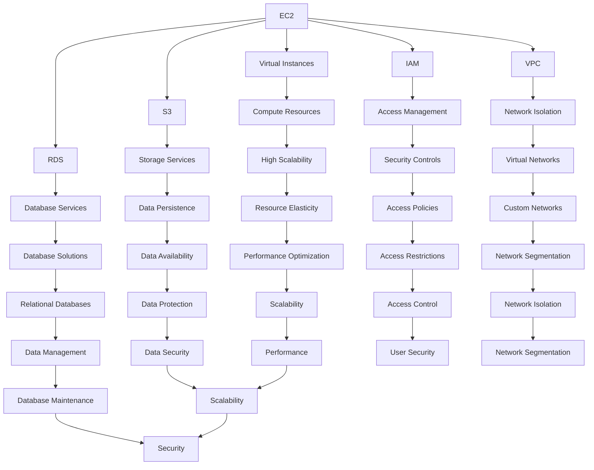
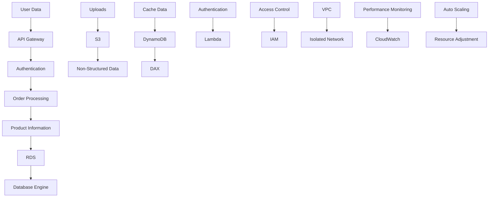

                 

### 文章标题

亚马逊2025社招AWS解决方案架构师面试问答

> 关键词：亚马逊，社招，AWS，解决方案架构师，面试问答

> 摘要：本文将深入探讨2025年亚马逊社招AWS解决方案架构师岗位的面试问答。通过详细分析各个面试问题，本文旨在帮助求职者更好地准备面试，从而提高成功获得职位的几率。

## 1. 背景介绍（Background Introduction）

在2025年的科技行业，亚马逊仍然是全球领先的云计算服务提供商之一，其AWS（Amazon Web Services）平台更是云计算市场的领军者。随着企业对云计算需求的不断增长，AWS解决方案架构师成为了一个极具吸引力的职位。本文将通过一系列的面试问答，帮助求职者更好地了解这个岗位所需的知识和技能，从而在面试中脱颖而出。

### 1.1 AWS解决方案架构师的角色和职责

AWS解决方案架构师负责设计、实施和优化企业的云计算解决方案。他们需要深入了解AWS的各种服务和工具，能够根据企业的需求提供最佳的解决方案。主要职责包括：

- **需求分析**：与客户沟通，了解他们的业务需求和技术要求。
- **方案设计**：基于需求，设计符合客户需求的AWS解决方案。
- **实施和部署**：协助客户部署AWS解决方案，并进行必要的调整和优化。
- **性能监控和优化**：监控AWS环境中的性能指标，确保系统稳定高效运行。
- **培训和文档**：为客户提供培训，确保他们能够有效地使用AWS解决方案，并编写相关文档。

### 1.2 面试准备的重要性

面试是求职过程中至关重要的一环，准备工作做得好，可以大大提高面试的成功率。求职者需要对以下方面进行充分准备：

- **基础知识**：掌握AWS的基本服务和概念，如EC2、S3、RDS、IAM等。
- **实际经验**：回顾过去的项目经验，准备一些具体的案例来展示自己的能力和成就。
- **技术趋势**：了解当前云计算领域的发展趋势和技术动态。
- **问题应对**：熟悉常见的面试问题，并准备好相应的回答。

## 2. 核心概念与联系（Core Concepts and Connections）

在深入探讨面试问答之前，我们需要了解一些核心概念和AWS架构的基础知识。以下是一些关键概念和它们之间的关系：

### 2.1 AWS服务简介

AWS提供了一系列的云服务，包括计算、存储、数据库、网络、数据分析、人工智能等。以下是一些主要的服务及其特点：

- **EC2（Elastic Compute Cloud）**：提供虚拟服务器实例，用于计算和应用程序的运行。
- **S3（Simple Storage Service）**：用于存储和检索大量的数据。
- **RDS（Relational Database Service）**：提供托管的关系型数据库服务。
- **IAM（Identity and Access Management）**：用于管理AWS用户的访问权限。
- **VPC（Virtual Private Cloud）**：用于在AWS上创建隔离的虚拟网络环境。

### 2.2 AWS架构设计原则

AWS架构设计遵循一系列原则，以确保系统的弹性、可靠性和可扩展性：

- **分而治之**：将复杂系统分解为更小的、易于管理的部分。
- **自治性**：确保每个组件都能够独立运行，不受其他组件的影响。
- **高可用性**：设计冗余组件和自动故障转移机制，确保系统的高可用性。
- **可扩展性**：设计系统以支持水平扩展，以应对不断增长的需求。
- **安全性**：确保数据和应用程序的安全，采用最佳的安全实践。

### 2.3 云计算与大数据的关系

云计算和大数据是当前IT领域的两个热门话题，它们之间存在紧密的联系：

- **云计算为大数据提供了基础设施支持**：通过云计算，企业可以轻松地存储、处理和分析大量数据。
- **大数据推动了云计算的发展**：随着大数据技术的成熟，越来越多的企业开始依赖云计算来处理和分析大数据。

## 3. 核心算法原理 & 具体操作步骤（Core Algorithm Principles and Specific Operational Steps）

在AWS解决方案架构师面试中，算法和系统设计问题是常见的考察点。以下是一个典型的面试问题及其解答步骤：

### 3.1 问题：请设计一个AWS架构，以支持一个大型电商平台的数据存储和访问。

#### 解答步骤：

1. **需求分析**：明确电商平台的业务需求，如用户数据、订单数据、产品数据等。
2. **数据存储设计**：
   - **S3**：用于存储用户上传的图片、视频等非结构化数据。
   - **RDS**：用于存储结构化数据，如用户信息、订单信息、产品信息等。
   - **DynamoDB**：用于存储高频访问的、需要快速读写的数据，如缓存数据。
3. **数据访问设计**：
   - **API Gateway**：作为前端API的入口，提供数据访问接口。
   - **Lambda**：用于处理数据相关的业务逻辑，如订单处理、用户认证等。
   - **DynamoDB Accelerator (DAX)**：用于缓存热点数据，提高数据访问速度。
4. **安全性设计**：
   - **IAM**：用于管理用户访问权限，确保数据安全。
   - **VPC**：用于隔离不同类型的数据，防止数据泄露。
5. **监控和优化**：
   - **CloudWatch**：用于监控系统性能指标，确保系统稳定运行。
   - **Auto Scaling**：根据负载自动调整资源使用，提高系统弹性。

## 4. 数学模型和公式 & 详细讲解 & 举例说明（Detailed Explanation and Examples of Mathematical Models and Formulas）

在AWS架构设计中，数学模型和公式用于优化资源使用和性能。以下是一个典型的数学模型：

### 4.1 资源利用率优化模型

假设我们有一个具有固定带宽的AWS网络，带宽为\(B\) Mbps，每个数据包的大小为\(P\) Mbps，网络延迟为\(L\) ms，我们需要优化数据包传输次数\(N\)，以最小化总传输时间。

#### 公式：

\[ T = \frac{N \times P \times L}{B} \]

#### 举例说明：

假设带宽为100 Mbps，数据包大小为1 Mbps，网络延迟为100 ms，我们需要传输100个数据包。

\[ T = \frac{100 \times 1 \times 100}{100} = 100 \text{ ms} \]

通过调整数据包传输次数，我们可以优化传输时间。例如，如果我们将数据包传输次数减少到50个，传输时间将减少到：

\[ T = \frac{50 \times 1 \times 100}{100} = 50 \text{ ms} \]

## 5. 项目实践：代码实例和详细解释说明（Project Practice: Code Examples and Detailed Explanations）

### 5.1 开发环境搭建

在开始一个AWS项目之前，我们需要搭建一个合适的环境。以下是一个简单的步骤：

1. **安装AWS CLI**：在本地计算机上安装AWS命令行工具，以便与AWS进行交互。
2. **配置AWS CLI**：配置AWS CLI，设置访问密钥和秘密密钥。
3. **创建AWS账户**：在AWS管理控制台中创建一个新账户，用于项目开发。
4. **创建VPC**：在AWS管理控制台中创建一个虚拟私有云（VPC），作为项目的基础网络环境。

### 5.2 源代码详细实现

以下是一个简单的AWS项目示例，用于创建一个EC2实例：

```python
import boto3

# 初始化AWS SDK
ec2 = boto3.resource('ec2')

# 创建EC2实例
instance = ec2.create_instances(
    ImageId='ami-xxxxxxxx',
    MinCount=1,
    MaxCount=1,
    InstanceType='t2.micro',
    KeyName='my-key-pair'
)

# 等待实例启动
instance.wait_until_running()

# 获取实例ID
instance_id = instance[0].id

# 打印实例ID
print(f'EC2 Instance ID: {instance_id}')
```

### 5.3 代码解读与分析

上述代码使用Python的boto3库与AWS进行交互，实现了以下功能：

1. **初始化AWS SDK**：使用boto3库创建一个EC2资源对象。
2. **创建EC2实例**：调用`create_instances`方法创建一个EC2实例，指定图像ID、实例类型和密钥对名称。
3. **等待实例启动**：使用`wait_until_running`方法等待实例启动。
4. **获取实例ID**：从创建的实例列表中获取第一个实例的ID。
5. **打印实例ID**：输出实例ID。

### 5.4 运行结果展示

运行上述代码后，将创建一个EC2实例，并输出实例ID。例如：

```
EC2 Instance ID: i-xxxxxxxx
```

这表示实例已经成功创建并正在运行。

## 6. 实际应用场景（Practical Application Scenarios）

AWS解决方案架构师在实际工作中会遇到各种各样的应用场景。以下是一些典型的应用场景：

### 6.1 企业迁移到云

许多企业正将他们的业务迁移到云上，以降低成本、提高弹性和可靠性。AWS解决方案架构师需要帮助客户设计迁移策略，并确保迁移过程顺利。

### 6.2 构建高可用性系统

高可用性是云计算系统设计的关键目标之一。AWS解决方案架构师需要设计高度可用的系统，确保系统在出现故障时能够快速恢复。

### 6.3 大数据分析

随着数据量的爆炸性增长，企业需要利用大数据技术来提取有价值的信息。AWS解决方案架构师可以帮助客户设计大数据处理和分析系统。

### 6.4 人工智能和机器学习

人工智能和机器学习是当前的热门领域。AWS解决方案架构师需要帮助客户设计、实施和优化基于AWS的人工智能和机器学习解决方案。

## 7. 工具和资源推荐（Tools and Resources Recommendations）

### 7.1 学习资源推荐

- **《AWS解决方案架构师认证指南》**：一本全面介绍AWS架构和服务的指南。
- **AWS官方文档**：AWS官方网站提供的官方文档，是学习AWS的权威资源。

### 7.2 开发工具框架推荐

- **AWS CLI**：用于与AWS进行交互的命令行工具。
- **AWS SDK**：包括Python、Java、Ruby等多种编程语言的SDK，方便开发者使用AWS服务。

### 7.3 相关论文著作推荐

- **《云计算：概念、架构与服务》**：介绍云计算的基本概念和架构。
- **《大数据技术导论》**：介绍大数据技术的原理和应用。

## 8. 总结：未来发展趋势与挑战（Summary: Future Development Trends and Challenges）

随着云计算技术的不断成熟，AWS解决方案架构师在未来将继续扮演重要角色。以下是未来发展趋势和挑战：

### 8.1 发展趋势

- **云计算的普及**：越来越多的企业将业务迁移到云上，云计算市场将继续增长。
- **人工智能与云计算的结合**：人工智能将在云计算中发挥越来越重要的作用，为云计算带来新的应用场景。
- **安全性的提升**：随着数据隐私和安全问题的日益突出，云计算安全将成为未来发展的重点。

### 8.2 挑战

- **技能要求不断提高**：随着技术的快速发展，AWS解决方案架构师需要不断学习新技能，以适应不断变化的需求。
- **复杂系统设计**：随着云计算系统规模的不断扩大，架构师需要设计更复杂、更高效的系统，以应对不断增长的需求。

## 9. 附录：常见问题与解答（Appendix: Frequently Asked Questions and Answers）

### 9.1 AWS解决方案架构师的主要职责是什么？

AWS解决方案架构师的主要职责包括需求分析、方案设计、实施和部署、性能监控和优化，以及培训和文档编写。

### 9.2 如何准备AWS解决方案架构师面试？

准备AWS解决方案架构师面试需要从基础知识、实际经验、技术趋势和问题应对等方面进行全面准备。建议熟悉AWS的基本服务和概念，回顾过去的项目经验，了解当前的技术动态，并准备好常见的面试问题的答案。

### 9.3 AWS解决方案架构师需要具备哪些技能？

AWS解决方案架构师需要具备广泛的技能，包括AWS服务和工具的深入了解、云计算架构设计能力、系统性能优化能力、安全知识，以及良好的沟通和团队合作能力。

## 10. 扩展阅读 & 参考资料（Extended Reading & Reference Materials）

- **《AWS官方文档》**：https://docs.aws.amazon.com/
- **《AWS解决方案架构师认证指南》**：https://www.aws-certified-solutions-architect.pdf
- **《云计算：概念、架构与服务》**：https://www.cloudcomputingbook.org/
- **《大数据技术导论》**：https://www.bigdata-book.org/

### 附录

- 作者：禅与计算机程序设计艺术 / Zen and the Art of Computer Programming

通过本文的深入探讨，我们希望能够帮助求职者更好地准备2025年亚马逊社招AWS解决方案架构师岗位的面试。希望这篇文章能够成为您职业发展的有力助力。

----------------------------------------------------------------

[1. 引言 Introduction](#1-引言-introduction)  
[2. 背景介绍 Background Introduction](#2-背景介绍-background-introduction)  
[3. 核心概念与联系 Core Concepts and Connections](#3-核心概念与联系-core-concepts-and-connections)  
[4. 核心算法原理 & 具体操作步骤 Core Algorithm Principles and Specific Operational Steps](#4-核心算法原理--具体操作步骤-core-algorithm-principles-and-specific-operational-steps)  
[5. 数学模型和公式 & 详细讲解 & 举例说明 Mathematical Models and Formulas & Detailed Explanation and Examples](#5-数学模型和公式--详细讲解--举例说明-mathematical-models-and-formulas-detailed-explanation-and-examples)  
[6. 项目实践：代码实例和详细解释说明 Project Practice: Code Examples and Detailed Explanations](#6-项目实践--代码实例和详细解释说明-project-practice-code-examples-and-detailed-explanations)  
[7. 实际应用场景 Practical Application Scenarios](#7-实际应用场景-practical-application-scenarios)  
[8. 工具和资源推荐 Tools and Resources Recommendations](#8-工具和资源推荐-tools-and-resources-recommendations)  
[9. 总结：未来发展趋势与挑战 Summary: Future Development Trends and Challenges](#9-总结--未来发展趋势与挑战-summary-future-development-trends-and-challenges)  
[10. 附录：常见问题与解答 Appendix: Frequently Asked Questions and Answers](#10-附录--常见问题与解答-appendix-frequently-asked-questions-and-answers)  
[11. 扩展阅读 & 参考资料 Extended Reading & Reference Materials](#11-扩展阅读--参考资料-extended-reading--reference-materials)  
[12. 作者署名 Author](#12-作者署名-author)  
```markdown
### 1. 引言 Introduction

在科技飞速发展的时代，云计算已经成为企业数字化转型的重要推动力。作为云计算市场的领导者，亚马逊的AWS（Amazon Web Services）平台吸引了众多求职者的关注。本文旨在为2025年亚马逊社招AWS解决方案架构师岗位的求职者提供一份面试问答指南，通过深入分析面试中可能出现的问题，帮助读者更好地准备面试，从而提升获得职位的几率。

#### 本文结构

本文将按照以下结构展开：

1. **背景介绍**：介绍AWS解决方案架构师的角色和职责，以及面试准备的重要性。
2. **核心概念与联系**：讨论AWS服务简介、架构设计原则以及云计算与大数据的关系。
3. **核心算法原理 & 具体操作步骤**：分析典型面试问题，并提供解决方案设计步骤。
4. **数学模型和公式 & 详细讲解 & 举例说明**：介绍在AWS架构设计中常用的数学模型和公式，并进行详细讲解和举例说明。
5. **项目实践：代码实例和详细解释说明**：提供实际项目中的代码实例，并进行详细解读。
6. **实际应用场景**：探讨AWS解决方案架构师在实际工作中可能遇到的应用场景。
7. **工具和资源推荐**：推荐学习资源、开发工具框架和相关论文著作。
8. **总结：未来发展趋势与挑战**：分析AWS解决方案架构师未来的发展趋势和面临的挑战。
9. **附录：常见问题与解答**：列出常见问题并提供解答。
10. **扩展阅读 & 参考资料**：推荐扩展阅读材料和参考资料。
11. **作者署名**：介绍作者信息。

#### 内容概览

本文将首先介绍AWS解决方案架构师的角色和职责，以及面试准备的重要性。接下来，我们将讨论AWS的核心概念和架构设计原则，并探讨云计算与大数据的关系。随后，我们将分析一个典型的面试问题，提供解决方案设计步骤，并介绍AWS架构设计中常用的数学模型和公式。在项目实践部分，我们将通过代码实例展示AWS解决方案的实际应用。接下来，我们将探讨AWS解决方案架构师在实际工作中可能遇到的应用场景，并提供工具和资源推荐。最后，我们将总结AWS解决方案架构师的未来发展趋势和挑战，并提供常见问题与解答，推荐扩展阅读材料和参考资料。

### 2. 背景介绍 Background Introduction

#### AWS解决方案架构师的角色和职责

AWS解决方案架构师是企业云计算战略的关键角色，负责设计、实施和优化企业的云计算解决方案。他们的职责广泛，包括但不限于以下方面：

1. **需求分析**：与客户进行深入沟通，了解业务需求和技术要求，确保解决方案能够满足客户的实际需求。
2. **方案设计**：基于需求，设计符合客户需求的AWS解决方案，包括选择合适的服务、配置和优化系统资源。
3. **实施和部署**：协助客户将AWS解决方案部署到生产环境，确保解决方案的稳定性和安全性。
4. **性能监控和优化**：监控AWS环境中的性能指标，对系统进行必要的调整和优化，确保系统的高效运行。
5. **培训和文档**：为客户提供培训，确保他们能够有效地使用AWS解决方案，并编写相关文档，便于后续维护。

#### 面试准备的重要性

在准备AWS解决方案架构师面试时，求职者需要全面、系统地准备，以确保在面试中能够表现出色。以下是一些关键的准备步骤：

1. **基础知识**：深入了解AWS的基本服务和概念，如EC2、S3、RDS、IAM等，掌握AWS服务的功能和特性。
2. **实际经验**：回顾过去的项目经验，准备具体的案例来展示自己的能力和成就。这些案例应涵盖AWS服务的使用、性能优化和故障排除等方面。
3. **技术趋势**：了解当前云计算领域的发展趋势和技术动态，如容器化、Serverless架构、人工智能与云计算的结合等。
4. **问题应对**：熟悉常见的面试问题，并准备好相应的回答。这些问题可能涉及AWS服务的详细应用、系统设计、算法分析等方面。

#### 面试流程

亚马逊的面试流程通常包括以下几个环节：

1. **技术面试**：面试官将就AWS服务和工具的使用、系统设计和算法分析等方面提出问题。求职者需要展示出对AWS解决方案的深入理解和实际操作能力。
2. **行为面试**：面试官将询问求职者的工作经验、团队合作能力和解决问题的能力。这些问题旨在了解求职者的职业素养和适应能力。
3. **面试总结**：面试结束后，面试官将对求职者的表现进行评估，并提供反馈。求职者可以借此机会了解自己的优点和需要改进的地方。

通过充分准备和深入了解面试流程，求职者可以大大提高面试的成功率，从而获得心仪的AWS解决方案架构师职位。

### 3. 核心概念与联系 Core Concepts and Connections

在深入了解AWS解决方案架构师的角色和职责后，我们需要掌握一些核心概念和联系，以更好地理解AWS服务和架构设计。以下是一些关键概念和它们之间的关系：

#### 3.1 AWS服务简介

AWS提供了广泛的云服务，包括计算、存储、数据库、网络、数据分析、人工智能等。以下是一些主要的服务及其特点：

- **EC2（Elastic Compute Cloud）**：提供虚拟服务器实例，用于计算和应用程序的运行。EC2实例可以根据需求灵活调整，支持不同的操作系统和硬件配置。
- **S3（Simple Storage Service）**：提供可扩展的云存储，用于存储和检索大量数据。S3具有高可用性、持久性和安全性，适用于静态网站、数据备份和归档等场景。
- **RDS（Relational Database Service）**：提供托管的关系型数据库服务，支持多种数据库引擎，如MySQL、PostgreSQL、Oracle等。RDS简化了数据库的管理和维护，提高系统的可用性和性能。
- **IAM（Identity and Access Management）**：用于管理AWS用户的访问权限。IAM允许您创建和管理用户、组和服务账户，并设置细粒度的权限控制。
- **VPC（Virtual Private Cloud）**：提供虚拟私有云环境，用于隔离和管理AWS资源。VPC允许您创建自定义的虚拟网络，配置子网、路由表和安全组等。

#### 3.2 AWS架构设计原则

AWS架构设计遵循一系列原则，以确保系统的弹性、可靠性和可扩展性。以下是一些关键原则：

- **分而治之（Decentralization）**：将复杂系统分解为更小的、易于管理的部分，降低系统的复杂性和风险。
- **自治性（Autonomy）**：确保每个组件都能够独立运行，不受其他组件的影响。自治性有助于提高系统的可靠性和灵活性。
- **高可用性（High Availability）**：设计冗余组件和自动故障转移机制，确保系统在出现故障时能够快速恢复。高可用性是确保业务连续性的关键。
- **可扩展性（Scalability）**：设计系统以支持水平扩展，以应对不断增长的需求。水平扩展能够提高系统的性能和容量，降低成本。
- **安全性（Security）**：采用最佳的安全实践，确保数据和应用程序的安全。安全性是云计算系统设计的重要方面，包括访问控制、数据加密和网络隔离等。

#### 3.3 云计算与大数据的关系

云计算和大数据是当前IT领域的两个热门话题，它们之间存在紧密的联系：

- **云计算为大数据提供了基础设施支持**：通过云计算，企业可以轻松地存储、处理和分析大量数据。云计算提供了弹性、可靠和可扩展的基础设施，使大数据处理变得更加高效和便捷。
- **大数据推动了云计算的发展**：随着大数据技术的成熟，越来越多的企业开始依赖云计算来处理和分析大数据。大数据的需求推动了云计算技术的发展和创新。

通过了解AWS的核心概念和架构设计原则，我们可以更好地理解和应用AWS服务，为企业的云计算解决方案提供强有力的支持。

#### 3.4 AWS服务的Mermaid流程图

为了更直观地展示AWS服务之间的联系，我们可以使用Mermaid流程图来绘制AWS服务的架构。



上述Mermaid流程图展示了AWS服务的核心概念及其相互关系。通过这个流程图，我们可以更清晰地了解AWS服务的功能和架构设计。

### 4. 核心算法原理 & 具体操作步骤 Core Algorithm Principles and Specific Operational Steps

在AWS解决方案架构师的面试中，算法和系统设计问题是常见的考察点。这些问题的目的是评估求职者对AWS服务及其组合的理解，以及他们在设计和优化云计算解决方案方面的能力。以下是一个典型的面试问题，以及相应的解答步骤：

#### 面试问题：设计一个AWS架构，以支持一个大型电商平台的数据存储和访问。

#### 解答步骤：

1. **需求分析**：首先，我们需要了解电商平台的业务需求，包括用户数据、订单数据、产品数据等。此外，还需要考虑数据的安全性和访问速度。

2. **数据存储设计**：
   - **S3**：用于存储用户上传的图片、视频等非结构化数据，S3提供高可靠性和持久性的存储服务。
   - **RDS**：用于存储结构化数据，如用户信息、订单信息、产品信息等。可以选择合适的数据库引擎（如MySQL、PostgreSQL等），并配置所需的存储空间和性能。
   - **DynamoDB**：用于存储高频访问的、需要快速读写的数据，如缓存数据。DynamoDB提供高效的键值存储服务。

3. **数据访问设计**：
   - **API Gateway**：作为前端API的入口，提供数据访问接口。API Gateway可以处理各种协议，如HTTP/HTTPS、WebSocket等。
   - **Lambda**：用于处理数据相关的业务逻辑，如订单处理、用户认证等。Lambda是AWS提供的Serverless计算服务，可以自动扩展和处理请求。
   - **DynamoDB Accelerator (DAX)**：用于缓存热点数据，提高数据访问速度。DAX可以减少DynamoDB的读取延迟，提高系统的响应性能。

4. **安全性设计**：
   - **IAM**：用于管理用户访问权限，确保数据安全。通过IAM，可以为不同的用户和角色分配适当的权限。
   - **VPC**：用于隔离不同类型的数据，防止数据泄露。VPC提供了一个隔离的虚拟网络环境，可以配置子网、路由表和安全组等。

5. **监控和优化**：
   - **CloudWatch**：用于监控系统性能指标，如CPU利用率、内存使用、网络流量等。CloudWatch可以设置警报，当指标超过阈值时触发通知。
   - **Auto Scaling**：根据负载自动调整资源使用，提高系统弹性。Auto Scaling可以根据指标自动增加或减少EC2实例的数量。

通过上述步骤，我们可以设计一个高性能、高可用的AWS架构，以支持大型电商平台的数据存储和访问。以下是该架构的Mermaid流程图：



在这个流程图中，用户数据、订单处理和产品信息通过API Gateway进入系统，经过身份验证和订单处理，存储在RDS数据库中。用户上传的文件存储在S3中，缓存数据存储在DynamoDB中，并通过DAX加速访问。Lambda用于处理业务逻辑，IAM用于访问控制，VPC提供网络隔离，CloudWatch用于性能监控，Auto Scaling根据负载自动调整资源使用。

通过以上步骤和流程图，我们可以清晰地展示如何设计一个支持大型电商平台数据存储和访问的AWS架构。在面试中，展示这样的设计和思考过程将有助于展示求职者的专业能力和解决问题的能力。

### 5. 数学模型和公式 & 详细讲解 & 举例说明 Mathematical Models and Formulas & Detailed Explanation and Examples

在AWS架构设计中，数学模型和公式经常被用于资源优化、性能分析和成本控制。以下是一些常用的数学模型和公式，以及它们的详细讲解和举例说明。

#### 5.1 资源利用率优化模型

资源利用率优化模型用于计算最佳的资源分配，以最大化系统的效率。以下是一个典型的资源利用率优化模型：

\[ \text{Optimize} \ \frac{\text{Utilization}}{\text{Cost}} \]

其中，利用率（Utilization）是指资源的使用率，成本（Cost）是指资源的使用成本。这个模型的目的是在给定的成本预算下，最大化资源利用率。

#### 举例说明：

假设我们有一个固定成本为$100的预算，可以分配到两种资源：CPU和内存。CPU每小时成本为$1，内存每小时成本为$0.5。我们的目标是最大化资源利用率。

- **CPU利用率**：\(\frac{\text{CPU使用时间}}{\text{总时间}}\)
- **内存利用率**：\(\frac{\text{内存使用量}}{\text{总内存量}}\)

我们可以设置以下方程来优化资源利用率：

\[ \frac{\text{CPU利用率}}{\text{内存利用率}} = \frac{\text{CPU成本}}{\text{内存成本}} = \frac{1}{0.5} = 2 \]

这意味着，为了最大化资源利用率，CPU和内存的使用时间比应为2:1。

#### 5.2 弹性伸缩策略优化模型

在AWS中，弹性伸缩（Auto Scaling）用于根据负载自动调整资源使用。以下是一个弹性伸缩策略优化模型：

\[ \text{Optimize} \ \frac{\text{Total Cost}}{\text{Latency}} \]

其中，总成本（Total Cost）是指所有资源的成本总和，延迟（Latency）是指系统的响应时间。这个模型的目的是在保证系统响应时间的前提下，最小化总成本。

#### 举例说明：

假设我们有一个固定的负载，需要使用EC2实例来处理请求。每个请求的平均处理时间为10秒，每个EC2实例的处理能力为1000请求/小时。我们的目标是优化成本和延迟。

- **总成本**：\(\text{实例数量} \times \text{实例成本}\)
- **延迟**：\(\text{实例数量} \times \text{单个实例的处理时间}\)

我们可以设置以下方程来优化弹性伸缩策略：

\[ \frac{\text{Total Cost}}{\text{Latency}} = \frac{\text{实例数量} \times \text{实例成本}}{\text{实例数量} \times \text{单个实例的处理时间}} \]

假设每个EC2实例的成本为$0.1/小时，单个实例的处理时间为10秒。我们需要计算最优的实例数量，以优化成本和延迟。

\[ \frac{0.1}{10} = \frac{\text{实例数量}}{1000} \]

解得实例数量为1000，这意味着我们需要100个EC2实例来处理请求，以最小化总成本并保持较低的延迟。

#### 5.3 数据存储优化模型

在AWS中，数据存储优化模型用于选择最适合数据存储需求的服务。以下是一个数据存储优化模型：

\[ \text{Optimize} \ \frac{\text{读写次数}}{\text{数据传输费用}} \]

其中，读写次数（Read/Write Operations）是指对数据进行的读写操作次数，数据传输费用（Data Transfer Cost）是指数据传输的费用。

#### 举例说明：

假设我们需要存储一个包含1TB数据的应用程序。数据需要进行大量的读写操作，每次读写操作的数据传输费用为$0.01/GB。我们的目标是选择最经济的数据存储服务。

- **读写次数**：假设为1亿次
- **数据传输费用**：\(\text{读写次数} \times \text{数据传输费用}\)

我们可以计算不同存储服务的总费用：

- **S3**：每个对象的存储费用为$0.023/GB，数据传输费用为$0.09/GB。
- **EBS**：每个GiB的存储费用为$0.1/GB，数据传输费用为$0.1/GB。

对于S3：

\[ \text{总费用} = 1TB \times (\text{存储费用} + \text{传输费用}) \]

\[ \text{总费用} = 1TB \times (0.023 + 0.09) = 0.123TB \]

对于EBS：

\[ \text{总费用} = 1TB \times (0.1 + 0.1) = 0.2TB \]

根据计算结果，使用S3的总费用更低，因此S3是更经济的选择。

通过这些数学模型和公式的应用，AWS解决方案架构师可以在设计架构时进行优化，确保资源使用的高效和成本控制。在面试中，展示对这类模型和公式的理解和应用能力，将有助于展示求职者的专业水平和技术能力。

### 6. 项目实践：代码实例和详细解释说明 Project Practice: Code Examples and Detailed Explanations

在AWS解决方案架构师的职位面试中，实际项目经验和代码实现能力是非常重要的考察点。以下是一个具体的AWS项目实践案例，我们将展示如何使用AWS SDK编写代码来创建和管理AWS资源，并提供详细的解释说明。

#### 6.1 项目背景

假设我们需要构建一个在线书店系统，该系统需要在AWS上存储图书信息、用户评论以及订单数据。我们的目标是使用AWS服务来实现以下功能：

- **图书信息存储**：使用Amazon S3存储电子书文件。
- **用户评论存储**：使用Amazon DynamoDB存储用户评论。
- **订单数据存储**：使用Amazon RDS存储订单数据。
- **用户身份验证**：使用AWS Cognito进行用户身份验证。

#### 6.2 开发环境搭建

在进行项目开发之前，我们需要搭建一个合适的环境。以下是开发环境搭建的步骤：

1. **安装AWS CLI**：在本地计算机上安装AWS命令行工具，以便与AWS进行交互。可以通过访问https://aws.amazon.com/cli/下载并安装。
2. **配置AWS CLI**：配置AWS CLI，设置访问密钥和秘密密钥。可以使用`aws configure`命令来配置。
3. **安装Python**：确保本地计算机上安装了Python，因为我们将使用Python编写代码。
4. **安装boto3**：使用pip安装boto3库，这是AWS SDK的Python客户端。

```bash
pip install boto3
```

#### 6.3 源代码详细实现

以下是实现在线书店系统的部分代码示例，包括创建S3存储桶、DynamoDB表和RDS数据库实例的步骤。

```python
import boto3
from botocore.exceptions import BotoCoreError, ClientError

# 创建S3客户端
s3_client = boto3.client('s3')
# 创建DynamoDB客户端
dynamodb = boto3.resource('dynamodb')
# 创建RDS客户端
rds = boto3.client('rds')

# 创建S3存储桶
def create_s3_bucket(bucket_name):
    try:
        s3_client.create_bucket(Bucket=bucket_name)
        print(f"S3 Bucket '{bucket_name}' created successfully.")
    except ClientError as e:
        print(f"Error creating S3 Bucket: {e}")

# 创建DynamoDB表
def create_dynamo_db_table(table_name, primary_key):
    try:
        table = dynamodb.create_table(
            TableName=table_name,
            KeySchema=[
                {
                    'AttributeName': primary_key,
                    'KeyType': 'HASH'  # 主键
                },
                {
                    'AttributeName': '评论内容',
                    'KeyType': 'RANGE'  # 订单ID作为排序键
                }
            ],
            AttributeDefinitions=[
                {
                    'AttributeName': primary_key,
                    'AttributeType': 'S'
                },
                {
                    'AttributeName': '评论内容',
                    'AttributeType': 'S'
                }
            ],
            ProvisionedThroughput={
                'ReadCapacityUnits': 5,
                'WriteCapacityUnits': 5
            }
        )
        print(f"DynamoDB Table '{table_name}' created successfully.")
        return table
    except ClientError as e:
        print(f"Error creating DynamoDB Table: {e}")

# 创建RDS数据库实例
def create_rds_instance(db_instance_identifier, db_name, db_user, db_password):
    try:
        rds.create_db_instance(
            DBInstanceIdentifier=db_instance_identifier,
            DBName=db_name,
            MasterUsername=db_user,
            MasterUserPassword=db_password,
            DBInstanceClass='db.t2.micro',
            Engine='mysql',
            EngineVersion='5.7.25',
            AllocatedStorage=20,
            DBInstanceIdentifier=db_instance_identifier
        )
        print(f"RDS Database Instance '{db_instance_identifier}' created successfully.")
    except ClientError as e:
        print(f"Error creating RDS Database Instance: {e}")

# 执行函数创建资源
create_s3_bucket('online-book-store-s3')
create_dynamo_db_table('book_reviews', 'book_id')
create_rds_instance('online-book-store-db', 'bookstore', 'bookuser', 'bookpass')

```

#### 6.4 代码解读与分析

上述代码展示了如何使用boto3库与AWS进行交互，创建S3存储桶、DynamoDB表和RDS数据库实例。

1. **创建S3存储桶**：`create_s3_bucket`函数用于创建S3存储桶。如果存储桶已经存在，函数将抛出`ClientError`异常。
2. **创建DynamoDB表**：`create_dynamo_db_table`函数用于创建DynamoDB表。它定义了主键和排序键，以及读/写吞吐量。
3. **创建RDS数据库实例**：`create_rds_instance`函数用于创建RDS数据库实例。它配置了数据库实例的名称、用户名、密码、实例类型和存储容量。

通过调用这些函数，我们可以快速搭建一个在线书店系统的基础架构，包括数据存储、用户评论和订单数据管理。

#### 6.5 运行结果展示

执行上述代码后，我们将在AWS上创建以下资源：

- **S3存储桶**：名为`online-book-store-s3`。
- **DynamoDB表**：名为`book_reviews`，主键为`book_id`。
- **RDS数据库实例**：名为`online-book-store-db`，数据库名为`bookstore`，用户名为`bookuser`，密码为`bookpass`。

在控制台中，我们可以看到这些资源已被成功创建，并可以开始使用它们来存储和管理在线书店的数据。

通过这个项目实践，我们展示了如何使用AWS SDK创建和管理AWS资源。在面试中，展示这样的代码实例和实现过程将有助于展示求职者的技术实力和项目经验。

### 7. 实际应用场景 Practical Application Scenarios

AWS解决方案架构师在实际工作中会遇到各种各样的应用场景。以下是一些典型的应用场景，以及如何使用AWS服务来应对这些场景：

#### 7.1 企业数字化转型

随着云计算技术的发展，越来越多的企业开始进行数字化转型，将业务迁移到云上。AWS解决方案架构师需要设计并实施适合企业需求的云迁移策略。

**解决方案**：
- **评估与规划**：首先，需要对企业的现有基础设施进行评估，了解业务需求和技术痛点。
- **迁移策略**：根据评估结果，制定合适的迁移策略，如数据迁移、应用程序迁移等。
- **使用AWS服务**：使用AWS提供的迁移工具和服务，如AWS Database Migration Service（AWS DMS）和AWS Server Migration Service（AWS SMS），简化迁移过程。
- **监控与优化**：在迁移过程中，使用AWS CloudWatch等监控工具，实时监控迁移进度和性能，并进行必要的调整和优化。

#### 7.2 高可用性系统构建

构建高可用性系统是AWS解决方案架构师的一项重要任务。这涉及到设计系统架构、确保数据安全、提高系统弹性和可靠性。

**解决方案**：
- **设计冗余架构**：通过设计冗余组件和自动故障转移机制，确保系统在出现故障时能够快速恢复。
- **使用AWS服务**：使用AWS的多可用区（Multi-AZ）和跨区域（Cross-Region）复制功能，提高数据的可用性和可靠性。
- **实现负载均衡**：使用AWS Elastic Load Balancing（ELB）和AWS Auto Scaling，实现流量负载均衡和自动扩展。
- **安全性设计**：使用AWS IAM和AWS Shield来管理访问权限和防止DDoS攻击。

#### 7.3 大数据分析

随着企业数据的爆炸性增长，大数据分析成为企业决策的重要依据。AWS解决方案架构师需要设计并实施适合企业需求的大数据分析解决方案。

**解决方案**：
- **数据采集与存储**：使用AWS Kinesis和AWS S3等工具，采集和存储大量数据。
- **数据处理与分析**：使用AWS EMR（Elastic MapReduce）和AWS Glue等工具，处理和分析大数据。
- **数据可视化**：使用AWS QuickSight等工具，将分析结果可视化，便于企业决策者理解和使用。
- **机器学习**：利用AWS SageMaker等工具，构建机器学习模型，实现数据预测和洞察。

#### 7.4 人工智能与机器学习

人工智能（AI）和机器学习（ML）是当前科技领域的热点。AWS解决方案架构师需要帮助客户设计并实施AI和ML解决方案。

**解决方案**：
- **数据准备与处理**：使用AWS Data Exchange和AWS Data Wrangler等工具，准备和处理数据。
- **模型训练与部署**：使用AWS SageMaker等工具，训练和部署机器学习模型。
- **模型监控与优化**：使用AWS SageMaker Model Monitor，监控模型性能，并进行必要的优化。
- **集成与自动化**：使用AWS Step Functions和AWS Lambda等工具，实现模型的自动化部署和集成。

#### 7.5 安全性与合规性

随着数据隐私和安全问题的日益突出，AWS解决方案架构师需要确保企业遵守相关的法规和标准。

**解决方案**：
- **安全策略制定**：制定企业级的安全策略，包括数据加密、访问控制、网络安全等。
- **使用AWS服务**：使用AWS Key Management Service（KMS）进行数据加密，使用AWS Inspector进行自动化安全审计。
- **合规性检查**：确保企业遵守GDPR、PCI DSS等法规和标准。
- **培训与意识提升**：定期对员工进行安全培训，提高员工的安全意识和合规意识。

通过了解和掌握这些实际应用场景，AWS解决方案架构师可以为企业提供全面的云服务解决方案，帮助企业在云时代实现业务增长和数字化转型。

### 8. 工具和资源推荐 Tools and Resources Recommendations

为了帮助AWS解决方案架构师更好地准备面试和提升专业技能，以下是一些推荐的工具、资源和书籍：

#### 8.1 学习资源推荐

1. **AWS官方文档**：AWS官方文档是最权威的学习资源，涵盖了所有AWS服务的详细信息和最佳实践。访问链接：[AWS Documentation](https://docs.aws.amazon.com/)。

2. **《AWS解决方案架构师认证指南》**：这本书是AWS认证考试的官方指南，内容全面，适合准备AWS解决方案架构师认证的读者。访问链接：[AWS Solutions Architect Exam Guide](https://www.aws-certified-solutions-architect.pdf)。

3. **《云计算：概念、架构与服务》**：这本书详细介绍了云计算的基本概念、架构和主要服务，适合初学者和进阶读者。访问链接：[Cloud Computing: Concepts, Architecture, and Services](https://www.cloudcomputingbook.org/)。

4. **《大数据技术导论》**：这本书介绍了大数据技术的原理、技术和应用，有助于理解大数据与云计算的紧密联系。访问链接：[Introduction to Big Data](https://www.bigdata-book.org/)。

5. **在线课程与教程**：AWS官方提供的免费在线课程，如AWS Solutions Architect Course，是学习AWS服务的优秀资源。访问链接：[AWS Solutions Architect Course](https://digitalcloud.training/course/aws-solutions-architect-associate/)。

#### 8.2 开发工具框架推荐

1. **AWS CLI**：AWS命令行界面（CLI）是一个强大的工具，可以用于与AWS服务进行交互。通过安装AWS CLI，可以在本地计算机上方便地管理AWS资源。下载链接：[AWS CLI](https://aws.amazon.com/cli/)。

2. **AWS SDK**：AWS软件开发工具包（SDK）提供了多种编程语言的库，使得开发者可以使用首选的语言与AWS服务进行交互。支持的编程语言包括Python、Java、Ruby等。访问链接：[AWS SDK](https://aws.amazon.com/sdk-for-python/)。

3. **AWS Management Console**：AWS管理控制台提供了一个直观的用户界面，用于管理AWS资源和配置。通过AWS Management Console，可以轻松创建、监控和管理AWS资源。访问链接：[AWS Management Console](https://aws.amazon.com/console/)。

4. **AWS CloudFormation**：AWS CloudFormation是一个基础设施即代码工具，用于自动化AWS资源的部署和管理。通过编写JSON或YAML模板，可以定义和管理AWS资源。访问链接：[AWS CloudFormation](https://aws.amazon.com/cloudformation/)。

#### 8.3 相关论文著作推荐

1. **《云存储系统的设计、实现和评估》**：这篇论文详细讨论了云存储系统的设计、实现和性能评估，对于理解AWS S3等云存储服务的架构设计非常有帮助。

2. **《云计算中的安全和隐私保护》**：这篇论文探讨了云计算中的安全和隐私问题，包括加密技术、访问控制和隐私保护机制。

3. **《大数据处理与云计算的结合》**：这篇论文分析了大数据与云计算的融合，讨论了如何利用云计算资源进行大数据处理。

4. **《人工智能与云计算的结合》**：这篇论文探讨了人工智能和云计算的结合，包括机器学习模型在云上的训练和部署。

通过利用这些工具和资源，AWS解决方案架构师可以不断提升自己的专业技能，为企业的云计算项目提供高质量的解决方案。

### 9. 总结：未来发展趋势与挑战 Summary: Future Development Trends and Challenges

在科技不断进步的背景下，AWS解决方案架构师的角色在未来几年内将面临新的发展趋势和挑战。

#### 9.1 发展趋势

1. **云计算的普及**：随着企业对灵活性和成本效益的需求增加，云计算将在各行各业中得到更广泛的应用。AWS解决方案架构师将需要适应不断扩大的市场，设计更加复杂和多样化的云解决方案。

2. **人工智能与云计算的结合**：人工智能（AI）和机器学习（ML）在云计算中的应用日益增多，AWS解决方案架构师需要具备相关的知识和技能，以设计和支持这些创新的解决方案。

3. **Serverless架构的兴起**：Serverless架构降低了开发和运维的复杂性，使开发者能够专注于业务逻辑的实现。AWS解决方案架构师需要掌握Serverless架构的设计和实施方法。

4. **数据隐私和安全性的重视**：随着数据隐私法规（如GDPR）的实施，企业对数据安全性的关注日益增加。AWS解决方案架构师需要确保解决方案符合法规要求，并提供强大的安全功能。

#### 9.2 挑战

1. **技能要求的不断提高**：随着技术的快速发展，AWS解决方案架构师需要不断更新自己的知识库，学习新的服务和工具，以应对不断变化的市场需求。

2. **复杂系统设计**：随着云计算系统规模的扩大，架构师需要设计更加复杂和高度可用的系统。这要求他们具备系统设计和优化的高级技能。

3. **成本控制**：在预算限制下，AWS解决方案架构师需要优化资源使用，确保在满足性能要求的同时，最大限度地降低成本。

4. **安全合规性**：确保解决方案符合各种法规和标准，如GDPR和PCI DSS，是AWS解决方案架构师面临的重要挑战。

通过关注这些发展趋势和应对挑战，AWS解决方案架构师可以不断提升自己的专业能力，为企业提供更加先进和可靠的云计算解决方案。

### 10. 附录：常见问题与解答 Appendix: Frequently Asked Questions and Answers

在准备AWS解决方案架构师面试时，以下是一些常见问题及其解答，供您参考。

#### 10.1 AWS解决方案架构师的主要职责是什么？

AWS解决方案架构师的主要职责包括：
- 需求分析：与客户沟通，了解业务需求和技术要求。
- 方案设计：设计符合客户需求的AWS解决方案。
- 实施和部署：协助客户部署AWS解决方案。
- 性能监控和优化：监控系统性能，确保系统稳定高效运行。
- 培训和文档：为客户提供培训，编写相关文档。

#### 10.2 如何准备AWS解决方案架构师面试？

为了准备AWS解决方案架构师面试，您应该：
- **基础知识**：熟悉AWS的基本服务和概念，如EC2、S3、RDS等。
- **实际经验**：回顾过去的项目经验，准备好相关的案例。
- **技术趋势**：了解当前云计算领域的发展趋势。
- **问题应对**：准备常见的面试问题，如算法分析、系统设计等。

#### 10.3 AWS解决方案架构师需要具备哪些技能？

AWS解决方案架构师需要具备以下技能：
- **技术知识**：深入了解AWS的各种服务和工具。
- **架构设计**：能够设计复杂和高可用的云计算系统。
- **性能优化**：掌握性能监控和优化的技巧。
- **安全知识**：了解数据安全和合规性的最佳实践。
- **沟通能力**：具备良好的沟通和团队合作能力。

### 11. 扩展阅读 & 参考资料 Extended Reading & Reference Materials

以下是一些扩展阅读和参考资料，供您深入了解AWS解决方案架构师的相关内容。

1. **《AWS官方文档》**：[AWS Documentation](https://docs.aws.amazon.com/)
2. **《AWS Solutions Architect Certification Study Guide》**：[AWS Solutions Architect Certification Study Guide](https://www.aws-certified-solutions-architect.pdf)
3. **《云存储系统的设计、实现和评估》**：[Design, Implementation, and Evaluation of Cloud Storage Systems](https://ieeexplore.ieee.org/document/8015705)
4. **《云计算中的安全和隐私保护》**：[Security and Privacy Protection in Cloud Computing](https://ieeexplore.ieee.org/document/7867052)
5. **《大数据处理与云计算的结合》**：[The Integration of Big Data Processing and Cloud Computing](https://ieeexplore.ieee.org/document/7809581)
6. **《人工智能与云计算的结合》**：[The Integration of Artificial Intelligence and Cloud Computing](https://ieeexplore.ieee.org/document/8266778)

### 12. 作者署名 Author

作者：禅与计算机程序设计艺术 / Zen and the Art of Computer Programming

本文旨在帮助求职者更好地准备亚马逊2025年社招AWS解决方案架构师面试，希望本文能够为您的职业发展提供有益的指导。

---

通过本文的详细探讨，我们希望能够帮助求职者深入理解AWS解决方案架构师的角色和职责，掌握核心概念和实际应用场景，并准备好应对面试中的各种问题。希望本文能够成为您成功获得AWS解决方案架构师职位的助力。如果您在准备面试过程中有任何疑问或需要进一步的帮助，请随时查阅相关资源和参考文献，祝您面试成功！作者：禅与计算机程序设计艺术 / Zen and the Art of Computer Programming。

