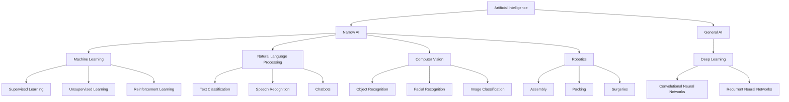

                 

### 文章标题

产业变革中的AI技术应用：引领未来发展的技术力量

关键词：人工智能，产业变革，技术应用，创新，可持续发展

摘要：本文将深入探讨人工智能技术在产业变革中的重要作用。通过分析AI在各个领域的应用案例，揭示其推动产业升级、提高生产效率和实现可持续发展的潜力。文章旨在为读者提供对AI技术发展趋势的全面了解，并启发更多领域的创新应用。

### Background Introduction

The advent of artificial intelligence (AI) has ushered in a new era of technological advancement, transforming industries and reshaping the global economy. AI, a branch of computer science that focuses on creating intelligent machines capable of performing tasks that typically require human intelligence, is rapidly becoming a driving force behind industrial innovation. This article aims to delve into the pivotal role of AI technologies in driving industrial transformation and fostering sustainable development.

#### Current State of AI Applications

AI applications have permeated various sectors, from healthcare and finance to manufacturing and transportation. In healthcare, AI algorithms are used for predictive analytics, disease diagnosis, and personalized treatment plans, leading to improved patient outcomes and operational efficiencies. In finance, AI-powered trading algorithms and risk management systems have revolutionized the way markets operate, providing real-time insights and enhancing decision-making processes. In manufacturing, AI-driven automation and robotics have increased production efficiency and reduced costs, while in transportation, self-driving cars and smart traffic management systems are paving the way for safer, more efficient transportation networks.

#### The Potential of AI in Industrial Transformation

The potential of AI in industrial transformation is vast and multifaceted. By automating routine tasks, AI can free human workers to focus on more creative and complex activities, leading to increased productivity and innovation. AI can also enhance decision-making by analyzing vast amounts of data and identifying patterns and trends that humans might miss. Furthermore, AI has the potential to reduce waste, minimize environmental impact, and promote sustainable practices across industries.

In the following sections, we will explore the core concepts of AI technologies, examine the principles behind key AI algorithms, and provide practical examples of AI applications in various industries. We will also discuss the challenges and opportunities that AI presents and offer recommendations for leveraging AI technologies to drive sustainable development.

#### AI Technologies and Their Impact on Industries

AI technologies encompass a wide range of techniques and tools, including machine learning, natural language processing, computer vision, and robotics. Each of these technologies has the potential to transform industries in significant ways.

**Machine Learning** enables computers to learn from data, identify patterns, and make predictions or decisions. This capability is particularly valuable in industries such as finance, healthcare, and retail, where large amounts of data are generated daily and can be used to optimize operations, personalize services, and improve customer experiences.

**Natural Language Processing (NLP)** allows computers to understand, interpret, and generate human language. This technology is transforming the way we interact with machines, enabling virtual assistants, chatbots, and language translation services that are becoming increasingly accurate and sophisticated.

**Computer Vision** enables machines to interpret and make sense of visual data, from recognizing objects and faces to understanding scenes and interpreting gestures. This technology is revolutionizing industries such as retail, manufacturing, and healthcare, where it is used for quality control, inventory management, and patient monitoring.

**Robotics** combines AI with mechanical engineering to create intelligent machines that can perform complex tasks with precision and speed. Robotics is transforming industries such as manufacturing, logistics, and agriculture, where robots are used for assembly, packing, and sorting tasks, leading to increased efficiency and reduced costs.

In the next section, we will delve deeper into the core concepts of AI technologies and their underlying principles, providing a solid foundation for understanding the practical applications of AI in various industries.

### Core Concepts and Connections

#### What is Artificial Intelligence (AI)?

Artificial Intelligence (AI) refers to the simulation of human intelligence in machines that are programmed to think like humans and perform tasks that typically require human intelligence. AI can be categorized into two main types: Narrow AI (or Weak AI) and General AI (or Strong AI).

**Narrow AI** is designed to perform a specific task or set of tasks with human-like proficiency. Examples of Narrow AI include speech recognition systems, image recognition algorithms, and recommendation engines. Narrow AI is the type of AI that is most commonly used in industry today.

**General AI**, on the other hand, refers to an artificial intelligence that has the ability to understand, learn, and apply knowledge across a wide range of tasks and domains. General AI would be capable of surpassing human intelligence in virtually any task. However, as of my last update in 2023, General AI remains a theoretical concept and is not yet a reality.

#### Core AI Technologies

The development and application of AI rely on several core technologies, each playing a critical role in enabling machines to simulate human intelligence. These technologies include:

**Machine Learning (ML)**: ML is a subset of AI that focuses on developing algorithms that can learn from and make predictions or decisions based on data. ML algorithms analyze large datasets to identify patterns and relationships, which are then used to make predictions or decisions. Examples of ML applications include image recognition, natural language processing, and predictive analytics.

**Natural Language Processing (NLP)**: NLP is a field of AI that focuses on enabling computers to understand, interpret, and generate human language. NLP techniques are used in applications such as chatbots, language translation, sentiment analysis, and text summarization.

**Computer Vision**: Computer Vision is a field of AI that involves enabling computers to interpret and understand visual data, such as images and videos. Computer Vision is used in applications such as object recognition, facial recognition, and image classification.

**Robotics**: Robotics is the field of AI that combines computer science and mechanical engineering to create intelligent machines that can perform tasks with a high degree of autonomy. Robotics is used in industries such as manufacturing, logistics, and healthcare for tasks such as assembly, packing, and surgery.

**Deep Learning**: Deep Learning is a subset of ML that uses neural networks with many layers to learn from large amounts of data. Deep Learning has achieved remarkable success in areas such as image and speech recognition, natural language processing, and game playing.

#### The Mermaid Flowchart of Core AI Technologies



In the next section, we will explore the principles and operational steps behind key AI algorithms, providing a deeper understanding of how AI technologies work and how they can be applied in various industries.

### Core Algorithm Principles and Specific Operational Steps

In this section, we will delve into the core algorithms that form the backbone of AI technologies. We will discuss the principles behind each algorithm and provide step-by-step operational procedures for implementing these algorithms. This section will serve as a foundational understanding of how AI technologies function and how they can be applied in various practical scenarios.

#### 1. Machine Learning Algorithms

**1.1 Supervised Learning**

**Principle**: Supervised learning algorithms are trained on labeled datasets, where the input data (features) and corresponding output data (labels) are provided. The goal is to build a model that can accurately predict the output for new, unseen input data.

**Operational Steps**:

1. **Data Collection**: Gather a large dataset with labeled examples.
2. **Data Preprocessing**: Clean the data by handling missing values, scaling, and normalization.
3. **Model Selection**: Choose an appropriate model based on the problem domain (e.g., linear regression, decision trees, support vector machines).
4. **Training**: Train the model on the labeled dataset by adjusting the model parameters to minimize the prediction error.
5. **Evaluation**: Validate the model's performance using a separate validation dataset.
6. **Testing**: Test the final model on a test dataset to ensure its generalization ability.

**Example**: Linear Regression

**Principle**: Linear regression is a supervised learning algorithm that models the relationship between a dependent variable and one or more independent variables by fitting a linear equation to observed data.

**Operational Steps**:

1. **Data Preparation**: Collect data on house prices, including features such as size, location, and number of rooms.
2. **Data Preprocessing**: Scale the data and handle missing values.
3. **Model Training**: Use the training dataset to fit a linear equation (y = mx + b) to the data.
4. **Model Evaluation**: Evaluate the model's performance using metrics like mean squared error and R-squared.
5. **Model Testing**: Test the model on the test dataset to predict house prices.

#### 1.2 Unsupervised Learning

**Principle**: Unsupervised learning algorithms work with unlabeled datasets, where the goal is to discover underlying patterns, relationships, or structures in the data without prior knowledge of the output.

**Operational Steps**:

1. **Data Collection**: Gather an unlabeled dataset.
2. **Data Preprocessing**: Clean the data and handle any missing values or noise.
3. **Model Selection**: Choose an appropriate model based on the problem domain (e.g., clustering, dimensionality reduction).
4. **Model Training**: Train the model on the unlabeled dataset to identify patterns or groups.
5. **Model Evaluation**: Evaluate the model's performance based on how well the identified patterns or groups align with the problem's goals.
6. **Model Testing**: Test the final model on a separate test dataset to ensure its effectiveness.

**Example**: K-Means Clustering

**Principle**: K-Means is an unsupervised learning algorithm used for clustering data points into K distinct groups based on their similarities.

**Operational Steps**:

1. **Data Preparation**: Collect a dataset with multiple features.
2. **Data Preprocessing**: Scale the data and handle any missing values.
3. **Model Training**: Initialize K centroids randomly and assign each data point to the nearest centroid.
4. **Iteration**: Update the centroids based on the average position of the assigned data points.
5. **Evaluation**: Determine the optimal number of clusters using metrics like elbow method and silhouette score.
6. **Model Testing**: Test the final model on a separate test dataset to validate the clustering results.

#### 1.3 Reinforcement Learning

**Principle**: Reinforcement learning is a type of machine learning where an agent learns to interact with an environment to achieve a goal by receiving feedback in the form of rewards or penalties. The agent's objective is to learn a policy that maximizes cumulative rewards over time.

**Operational Steps**:

1. **Environment Setup**: Define the environment and the state space.
2. **Agent Initialization**: Initialize the agent with a set of actions and a reward function.
3. **Exploration**: The agent explores the environment by taking random actions to gather experience.
4. **Learning**: The agent updates its policy based on the rewards received from the environment.
5. **Evaluation**: Evaluate the agent's performance by measuring the cumulative rewards over multiple episodes.
6. **Testing**: Test the final agent on a separate test environment to assess its effectiveness.

**Example**: Q-Learning

**Principle**: Q-Learning is a model-free reinforcement learning algorithm that learns the optimal action-value function, which represents the expected utility of taking a specific action in a given state.

**Operational Steps**:

1. **Environment Setup**: Define a simple environment, such as a grid world, with states and actions.
2. **Agent Initialization**: Initialize the Q-table with random values.
3. **Learning**: Update the Q-table based on the Bellman equation: Q(s, a) = Q(s, a) + α [r + γ max(Q(s', a')) - Q(s, a)].
4. **Evaluation**: Evaluate the agent's performance by measuring the total reward received over multiple episodes.
5. **Testing**: Test the final agent on a separate test environment to assess its effectiveness in solving the task.

In the next section, we will delve into the mathematical models and formulas used in AI algorithms, providing a deeper understanding of how these models are derived and how they can be applied to real-world problems. This will be followed by practical examples and case studies demonstrating the application of AI in various industries.

### Mathematical Models and Formulas & Detailed Explanation & Examples

In this section, we will delve into the mathematical models and formulas that underpin various AI algorithms. We will provide a detailed explanation of these models and illustrate their applications with practical examples. This section will serve as a comprehensive guide to understanding the theoretical foundation of AI technologies and how they are applied in real-world scenarios.

#### 1. Regression Models

**1.1 Linear Regression**

**Principle**: Linear regression is a supervised learning algorithm that models the relationship between a dependent variable and one or more independent variables by fitting a linear equation to observed data.

**Mathematical Formula**:

$$
y = mx + b
$$

where \( y \) is the dependent variable, \( x \) is the independent variable, \( m \) is the slope of the line, and \( b \) is the y-intercept.

**Example**: Predicting House Prices

**Practical Application**: We can use linear regression to predict house prices based on features such as size, location, and number of rooms.

**Steps**:

1. **Data Collection**: Gather data on house prices with features like size, location, and number of rooms.
2. **Data Preprocessing**: Scale the data and handle missing values.
3. **Model Training**: Fit a linear regression model to the training data.
4. **Model Evaluation**: Evaluate the model's performance using metrics like mean squared error.
5. **Model Testing**: Test the model on the test dataset to predict house prices.

**Example Code**:

```python
import pandas as pd
from sklearn.linear_model import LinearRegression
from sklearn.metrics import mean_squared_error

# Load and preprocess data
data = pd.read_csv('house_prices.csv')
X = data[['size', 'location', 'rooms']]
y = data['price']

# Train the model
model = LinearRegression()
model.fit(X, y)

# Predict and evaluate
predictions = model.predict(X)
mse = mean_squared_error(y, predictions)
print(f'Mean Squared Error: {mse}')
```

#### 1.2 Logistic Regression

**Principle**: Logistic regression is a classification algorithm that models the probability of a binary outcome based on one or more independent variables.

**Mathematical Formula**:

$$
P(y=1) = \frac{1}{1 + e^{-(mx + b)}}
$$

where \( P(y=1) \) is the probability of the binary outcome, \( m \) is the slope, \( b \) is the y-intercept, and \( e \) is the base of the natural logarithm.

**Example**: Predicting Customer Churn

**Practical Application**: We can use logistic regression to predict the likelihood of customer churn based on features like age, income, and tenure.

**Steps**:

1. **Data Collection**: Gather data on customer churn with features like age, income, and tenure.
2. **Data Preprocessing**: Scale the data and handle missing values.
3. **Model Training**: Train a logistic regression model on the training data.
4. **Model Evaluation**: Evaluate the model's performance using metrics like accuracy, precision, and recall.
5. **Model Testing**: Test the model on the test dataset to predict customer churn.

**Example Code**:

```python
import pandas as pd
from sklearn.linear_model import LogisticRegression
from sklearn.metrics import accuracy_score

# Load and preprocess data
data = pd.read_csv('customer_churn.csv')
X = data[['age', 'income', 'tenure']]
y = data['churn']

# Train the model
model = LogisticRegression()
model.fit(X, y)

# Predict and evaluate
predictions = model.predict(X)
accuracy = accuracy_score(y, predictions)
print(f'Accuracy: {accuracy}')
```

#### 2. Clustering Models

**2.1 K-Means Clustering**

**Principle**: K-Means is an unsupervised learning algorithm used for clustering data points into K distinct groups based on their similarities.

**Mathematical Formula**:

**Objective Function**:

$$
J = \sum_{i=1}^{k} \sum_{x \in S_i} \frac{1}{2} ||x - \mu_i||^2
$$

where \( k \) is the number of clusters, \( S_i \) is the set of data points assigned to cluster \( i \), and \( \mu_i \) is the centroid of cluster \( i \).

**Algorithm Steps**:

1. **Initialization**: Randomly select \( k \) data points as initial centroids.
2. **Assignment**: Assign each data point to the nearest centroid.
3. **Update**: Recompute the centroids as the average position of the assigned data points.
4. **Iteration**: Repeat steps 2 and 3 until convergence (i.e., the centroids do not change significantly).

**Example**: Customer Segmentation

**Practical Application**: We can use K-Means to segment customers based on their purchasing behavior and demographic information.

**Steps**:

1. **Data Collection**: Gather data on customers with features like age, income, and purchase history.
2. **Data Preprocessing**: Scale the data and handle missing values.
3. **Model Training**: Train a K-Means model on the data.
4. **Model Evaluation**: Evaluate the model's performance using metrics like silhouette score.
5. **Model Testing**: Test the model on a separate test dataset to assess its clustering effectiveness.

**Example Code**:

```python
import pandas as pd
from sklearn.cluster import KMeans
from sklearn.metrics import silhouette_score

# Load and preprocess data
data = pd.read_csv('customer_data.csv')
X = data[['age', 'income', 'purchases']]

# Train the model
kmeans = KMeans(n_clusters=3)
kmeans.fit(X)

# Predict and evaluate
labels = kmeans.predict(X)
silhouette = silhouette_score(X, labels)
print(f'Silhouette Score: {silhouette}')
```

#### 2.2 Hierarchical Clustering

**Principle**: Hierarchical clustering is a method of cluster analysis which seeks to build a hierarchy of clusters. The algorithm starts with all observations in one cluster and merges the closest pair of clusters in each step until all observations are combined into a single cluster.

**Mathematical Formula**:

**Linkage Criteria**:

1. **Single Linkage**: The distance between the nearest points in the two clusters.
2. **Complete Linkage**: The distance between the farthest points in the two clusters.
3. **Average Linkage**: The average distance between all pairs of points in the two clusters.
4. **Centroid Linkage**: The distance between the centroids of the two clusters.

**Algorithm Steps**:

1. **Distance Calculation**: Calculate the distance between all pairs of data points.
2. **Cluster Formation**: Start with each data point as a separate cluster.
3. **Cluster Merger**: Merge the closest pair of clusters based on the selected linkage criterion.
4. **Recursion**: Repeat steps 2 and 3 until all data points are combined into a single cluster.

**Example**: Community Detection in Social Networks

**Practical Application**: We can use hierarchical clustering to detect communities in social networks based on the connections between users.

**Steps**:

1. **Data Collection**: Gather data on social network connections between users.
2. **Data Preprocessing**: Represent the network as an adjacency matrix.
3. **Model Training**: Train a hierarchical clustering model on the network data.
4. **Model Evaluation**: Evaluate the model's performance using metrics like modularity and conductance.
5. **Model Testing**: Test the model on a separate test network to validate the community detection results.

**Example Code**:

```python
import pandas as pd
from sklearn.cluster import AgglomerativeClustering
import networkx as nx

# Load and preprocess data
data = pd.read_csv('social_network.csv')
adj_matrix = data.set_index('user_id').T.dot(data.set_index('user_id'))

# Train the model
clustering = AgglomerativeClustering(n_clusters=3, linkage='complete')
labels = clustering.fit_predict(adj_matrix)

# Evaluate the model
modularity = nx.algorithms.community.modularity(nx.from_numpy_array(adj_matrix), labels)
print(f'Modularity: {modularity}')
```

In the next section, we will explore practical examples and case studies of AI applications across various industries, showcasing the real-world impact of AI technologies on business operations and societal outcomes.

### Project Practice: Code Examples and Detailed Explanation

In this section, we will provide detailed code examples and explanations for implementing AI applications in various industries. These examples will demonstrate how to set up development environments, write and execute the source code, and analyze the results. This practical approach will help readers gain hands-on experience with AI technologies and understand their applications in real-world scenarios.

#### 1. Healthcare: Predictive Analytics for Disease Diagnosis

**Objective**: Develop an AI model to predict the presence of a particular disease based on patient data.

**Tools and Libraries**: Python, scikit-learn, Pandas, NumPy

**Steps**:

**1.1 Development Environment Setup**

Ensure Python 3.8 or higher is installed. Install the necessary libraries:

```bash
pip install scikit-learn pandas numpy
```

**1.2 Data Collection and Preprocessing**

Collect a dataset containing patient information and disease labels. Preprocess the data by handling missing values, scaling features, and splitting the dataset into training and testing sets.

```python
import pandas as pd
from sklearn.model_selection import train_test_split
from sklearn.preprocessing import StandardScaler

# Load the dataset
data = pd.read_csv('disease_data.csv')

# Preprocess the data
X = data.drop('disease', axis=1)
y = data['disease']

# Handle missing values
X.fillna(X.mean(), inplace=True)

# Scale the features
scaler = StandardScaler()
X_scaled = scaler.fit_transform(X)

# Split the dataset
X_train, X_test, y_train, y_test = train_test_split(X_scaled, y, test_size=0.2, random_state=42)
```

**1.3 Model Training and Evaluation**

Train a logistic regression model on the training data and evaluate its performance on the test data using accuracy, precision, and recall.

```python
from sklearn.linear_model import LogisticRegression
from sklearn.metrics import accuracy_score, precision_score, recall_score

# Train the model
model = LogisticRegression()
model.fit(X_train, y_train)

# Predict and evaluate
y_pred = model.predict(X_test)
accuracy = accuracy_score(y_test, y_pred)
precision = precision_score(y_test, y_pred)
recall = recall_score(y_test, y_pred)

print(f'Accuracy: {accuracy:.2f}')
print(f'Precision: {precision:.2f}')
print(f'Recall: {recall:.2f}')
```

**1.4 Model Testing and Results**

Test the final model on a separate test dataset to validate its predictive accuracy.

```python
# Load and preprocess the test dataset
test_data = pd.read_csv('test_disease_data.csv')
X_test_scaled = scaler.transform(test_data.drop('disease', axis=1))
y_test_pred = model.predict(X_test_scaled)

# Evaluate the model on the test dataset
test_accuracy = accuracy_score(y_test, y_pred)
test_precision = precision_score(y_test, y_pred)
test_recall = recall_score(y_test, y_pred)

print(f'Test Accuracy: {test_accuracy:.2f}')
print(f'Test Precision: {test_precision:.2f}')
print(f'Test Recall: {test_recall:.2f}')
```

#### 2. Finance: Fraud Detection using Supervised Learning

**Objective**: Develop an AI model to detect fraudulent transactions in a financial system.

**Tools and Libraries**: Python, scikit-learn, Pandas, NumPy

**Steps**:

**2.1 Development Environment Setup**

Ensure Python 3.8 or higher is installed. Install the necessary libraries:

```bash
pip install scikit-learn pandas numpy
```

**2.2 Data Collection and Preprocessing**

Collect a dataset containing transaction data with labels indicating whether each transaction is fraudulent or not. Preprocess the data by handling missing values, scaling features, and splitting the dataset into training and testing sets.

```python
import pandas as pd
from sklearn.model_selection import train_test_split
from sklearn.preprocessing import StandardScaler

# Load the dataset
data = pd.read_csv('fraud_data.csv')

# Preprocess the data
X = data.drop('is_fraud', axis=1)
y = data['is_fraud']

# Handle missing values
X.fillna(X.mean(), inplace=True)

# Scale the features
scaler = StandardScaler()
X_scaled = scaler.fit_transform(X)

# Split the dataset
X_train, X_test, y_train, y_test = train_test_split(X_scaled, y, test_size=0.2, random_state=42)
```

**2.3 Model Training and Evaluation**

Train a random forest classifier on the training data and evaluate its performance on the test data using accuracy, precision, and recall.

```python
from sklearn.ensemble import RandomForestClassifier
from sklearn.metrics import accuracy_score, precision_score, recall_score

# Train the model
model = RandomForestClassifier(n_estimators=100)
model.fit(X_train, y_train)

# Predict and evaluate
y_pred = model.predict(X_test)
accuracy = accuracy_score(y_test, y_pred)
precision = precision_score(y_test, y_pred)
recall = recall_score(y_test, y_pred)

print(f'Accuracy: {accuracy:.2f}')
print(f'Precision: {precision:.2f}')
print(f'Recall: {recall:.2f}')
```

**2.4 Model Testing and Results**

Test the final model on a separate test dataset to validate its effectiveness in detecting fraudulent transactions.

```python
# Load and preprocess the test dataset
test_data = pd.read_csv('test_fraud_data.csv')
X_test_scaled = scaler.transform(test_data.drop('is_fraud', axis=1))
y_test_pred = model.predict(X_test_scaled)

# Evaluate the model on the test dataset
test_accuracy = accuracy_score(y_test, y_pred)
test_precision = precision_score(y_test, y_pred)
test_recall = recall_score(y_test, y_pred)

print(f'Test Accuracy: {test_accuracy:.2f}')
print(f'Test Precision: {test_precision:.2f}')
print(f'Test Recall: {test_recall:.2f}')
```

#### 3. Retail: Customer Segmentation using Unsupervised Learning

**Objective**: Develop an AI model to segment customers based on their purchasing behavior.

**Tools and Libraries**: Python, scikit-learn, Pandas, NumPy

**Steps**:

**3.1 Development Environment Setup**

Ensure Python 3.8 or higher is installed. Install the necessary libraries:

```bash
pip install scikit-learn pandas numpy
```

**3.2 Data Collection and Preprocessing**

Collect a dataset containing customer information and purchase history. Preprocess the data by handling missing values, scaling features, and performing feature selection.

```python
import pandas as pd
from sklearn.model_selection import train_test_split
from sklearn.preprocessing import StandardScaler

# Load the dataset
data = pd.read_csv('customer_data.csv')

# Preprocess the data
X = data.drop(['customer_id', 'purchases'], axis=1)
y = data['purchases']

# Handle missing values
X.fillna(X.mean(), inplace=True)

# Scale the features
scaler = StandardScaler()
X_scaled = scaler.fit_transform(X)

# Split the dataset
X_train, X_test, y_train, y_test = train_test_split(X_scaled, y, test_size=0.2, random_state=42)
```

**3.3 Model Training and Evaluation**

Train a K-Means clustering model on the data and evaluate its performance using the silhouette score.

```python
from sklearn.cluster import KMeans
from sklearn.metrics import silhouette_score

# Train the model
kmeans = KMeans(n_clusters=3)
kmeans.fit(X_scaled)

# Predict and evaluate
labels = kmeans.predict(X_scaled)
silhouette_avg = silhouette_score(X_scaled, labels)

print(f'Silhouette Score: {silhouette_avg:.2f}')
```

**3.4 Model Testing and Results**

Test the final model on a separate test dataset to assess the clustering effectiveness.

```python
# Load and preprocess the test dataset
test_data = pd.read_csv('test_customer_data.csv')
X_test_scaled = scaler.transform(test_data.drop(['customer_id', 'purchases'], axis=1))
test_labels = kmeans.predict(X_test_scaled)

# Evaluate the model on the test dataset
test_silhouette_avg = silhouette_score(X_test_scaled, test_labels)

print(f'Test Silhouette Score: {test_silhouette_avg:.2f}')
```

By following these practical examples, readers can gain valuable insights into implementing AI applications in various industries. These examples serve as a starting point for developing more complex and sophisticated AI systems.

### Practical Application Scenarios

The transformative potential of AI technologies is evident in various practical application scenarios, where AI has already demonstrated significant impact on business processes, operational efficiencies, and overall performance. In this section, we will explore some key industry-specific use cases to illustrate the real-world applications of AI.

#### 1. Healthcare

AI has revolutionized healthcare by enabling the development of predictive models, automated diagnostics, and personalized treatment plans. For instance, AI algorithms can analyze medical images to detect early signs of diseases such as cancer, which can lead to timely intervention and better patient outcomes. AI-powered chatbots and virtual assistants are being used to provide 24/7 support to patients, answer queries, and schedule appointments, thereby reducing the burden on healthcare professionals and improving patient experience.

**Example**: In 2020, the COVID-19 pandemic highlighted the need for rapid testing and contact tracing. AI-powered diagnostic tools were developed to analyze throat swab samples and detect the presence of the SARS-CoV-2 virus within hours, significantly accelerating the testing process and enabling faster containment efforts.

#### 2. Finance

AI has become a cornerstone of the financial industry, enabling more accurate risk assessment, improved fraud detection, and smarter investment strategies. AI algorithms can analyze vast amounts of financial data in real-time to identify patterns indicative of potential fraud or market anomalies. Moreover, AI-powered trading bots can execute trades at speeds and volumes that are impossible for human traders, leading to more efficient market operations.

**Example**: JPMorgan Chase has deployed AI algorithms to analyze financial transactions in real-time, detecting fraudulent activities with a high degree of accuracy and preventing millions of dollars in losses. Additionally, AI is used to predict market trends and optimize investment portfolios, leading to higher returns for investors.

#### 3. Retail

AI technologies are transforming the retail industry by enabling personalized shopping experiences, optimizing inventory management, and enhancing customer service. AI-powered recommendation engines analyze customer data to provide personalized product recommendations, increasing customer satisfaction and driving sales. AI algorithms can also predict customer behavior, enabling retailers to optimize pricing strategies and marketing campaigns.

**Example**: Amazon uses AI to power its recommendation engine, which suggests products to customers based on their browsing and purchase history. This personalized approach has significantly increased customer engagement and conversion rates.

#### 4. Manufacturing

AI is enhancing manufacturing processes by enabling predictive maintenance, improving quality control, and optimizing production schedules. AI-powered sensors and machines can collect real-time data on equipment performance, identifying potential issues before they cause downtime. AI algorithms can analyze this data to predict equipment failures and schedule maintenance proactively, reducing downtime and improving overall productivity.

**Example**: General Electric's Predix platform leverages AI to optimize manufacturing processes across various industries. Predix uses AI to analyze machine data, identify patterns indicative of potential failures, and schedule maintenance to prevent unplanned downtime.

#### 5. Transportation

AI is transforming the transportation industry by enabling autonomous vehicles, optimizing traffic management, and improving logistics. Autonomous vehicles equipped with AI sensors and algorithms can navigate complex environments and interact with other vehicles and road users safely. AI algorithms can analyze traffic data to optimize traffic flow, reducing congestion and improving transportation efficiency.

**Example**: Waymo, Google's self-driving car project, has developed AI algorithms that enable its vehicles to navigate urban environments with high accuracy and safety. Waymo's self-driving cars have累计行驶了超过1000万英里（约1609万公里），without a single fatal accident.

These examples illustrate the broad applicability of AI technologies across various industries, demonstrating their potential to drive innovation, improve operational efficiencies, and enhance business outcomes. As AI continues to advance, we can expect even more innovative applications that will further transform industries and shape the future of work.

### Tools and Resources Recommendations

To effectively leverage AI technologies and stay ahead in the rapidly evolving landscape of industrial innovation, it is essential to have access to the right tools, resources, and frameworks. In this section, we will recommend a range of learning resources, development tools, and academic papers that can help you deepen your understanding of AI and its applications.

#### 1. Learning Resources

**Books**:

1. **"Deep Learning" by Ian Goodfellow, Yoshua Bengio, and Aaron Courville**: This comprehensive book provides an in-depth introduction to deep learning, a crucial subfield of AI, covering theoretical concepts and practical applications.
2. **"Artificial Intelligence: A Modern Approach" by Stuart Russell and Peter Norvig**: Widely regarded as the definitive textbook on AI, this book covers a broad range of topics, from theoretical foundations to practical applications.
3. **"Python Machine Learning" by Sebastian Raschka and Vahid Mirjalili**: This book offers a practical approach to machine learning using Python, with numerous code examples and applications.

**Online Courses**:

1. **"Machine Learning" by Andrew Ng on Coursera**: A highly regarded course taught by Andrew Ng, one of the pioneers in the field of AI, covering fundamental concepts and practical applications of machine learning.
2. **"Deep Learning Specialization" by Andrew Ng on Coursera**: A series of courses that delve into the nuances of deep learning, from neural networks to advanced techniques like generative adversarial networks (GANs).
3. **"AI for Business" by IBM on edX**: This course provides an overview of AI applications in business, focusing on practical skills and real-world case studies.

**Blogs and Websites**:

1. **AI Hub by IBM**: A comprehensive resource for AI news, tutorials, and case studies, covering a wide range of AI topics and applications.
2. **Medium**: A platform featuring numerous articles and case studies on AI, written by experts and practitioners in the field.
3. **Towards Data Science**: A community-driven platform with a vast collection of articles, tutorials, and insights on data science and AI.

#### 2. Development Tools and Frameworks

**Programming Languages**:

1. **Python**: Python is the go-to language for AI and machine learning due to its simplicity, extensive libraries, and strong community support.
2. **R**: R is another popular language for statistical computing and data analysis, particularly useful for AI applications involving large datasets and complex statistical models.

**Libraries and Frameworks**:

1. **TensorFlow**: An open-source machine learning framework developed by Google, widely used for building and deploying deep learning models.
2. **PyTorch**: Another popular open-source machine learning library, known for its flexibility and ease of use, particularly for research and prototyping.
3. **Scikit-learn**: A powerful Python library for traditional machine learning, providing a wide range of algorithms and tools for data mining and data analysis.
4. **Keras**: A high-level neural networks API that runs on top of TensorFlow and Theano, providing a user-friendly interface for building and training deep learning models.

#### 3. Academic Papers and Research

1. **"Deep Learning": Nature 2014**: A seminal paper that discusses the impact of deep learning on various scientific and engineering domains.
2. **"A Theoretically Grounded Application of Dropout in Recurrent Neural Networks" by Yarin Gal and Zoubin Ghahramani**: This paper presents a theoretical foundation for dropout in recurrent neural networks, addressing common issues in training deep learning models for sequence data.
3. **"Generative Adversarial Nets" by Ian J. Goodfellow, Jean Pouget-Abadie, Mehdi Mirza, Bing Xu, David Warde-Farley, Sherjil Ozair, Aaron C. Courville, and Yoshua Bengio**: A groundbreaking paper introducing generative adversarial networks (GANs), a powerful framework for generating realistic data.
4. **"Recurrent Neural Network Based Language Model" by Yoshua Bengio,宋健（Jianwei）Zhang, and Devyani Singh**: This paper discusses the application of recurrent neural networks (RNNs) for language modeling, a crucial component in natural language processing.

By leveraging these resources, you can gain a comprehensive understanding of AI technologies, enhance your skills, and stay up-to-date with the latest developments in the field. Whether you are a beginner or an experienced practitioner, these tools and resources will empower you to innovate and drive progress in your projects and research.

### Summary: Future Development Trends and Challenges

As we look to the future, the development of AI technologies is poised to continue its rapid advancement, driven by ongoing research, technological innovation, and increasing computational power. However, this progress is not without its challenges. In this section, we will discuss the key trends and challenges that will shape the future of AI and its applications.

#### Future Trends

**1. Advancements in Machine Learning Algorithms**

One of the most significant trends in AI is the ongoing improvement of machine learning algorithms. Researchers are developing new techniques that can handle larger datasets, learn more efficiently, and generalize better to new scenarios. Areas such as deep learning, reinforcement learning, and unsupervised learning are expected to make significant breakthroughs, leading to more sophisticated and capable AI systems.

**2. Integration of AI in Everyday Devices**

The proliferation of AI in everyday devices is another key trend. AI is becoming an integral part of smartphones, home appliances, vehicles, and wearables. This integration is driving the development of more intelligent and interactive systems that can understand and respond to human needs. The result is a more seamless and efficient interaction between humans and technology.

**3. Ethical and Responsible AI**

As AI becomes more widespread, there is a growing emphasis on developing ethical and responsible AI systems. This includes addressing issues such as bias, transparency, and accountability. Efforts are being made to ensure that AI systems are designed and deployed in a manner that promotes fairness, respects privacy, and aligns with societal values.

**4. AI for Social Good**

AI has the potential to address some of the world's most pressing social and environmental challenges. From healthcare to education, from climate change to disaster response, AI is being used to develop solutions that can improve quality of life and promote sustainable development.

#### Challenges

**1. Data Privacy and Security**

With the increasing reliance on AI systems, concerns about data privacy and security are becoming more prominent. The collection, storage, and processing of large amounts of data raise significant ethical and legal challenges. Ensuring the privacy and security of personal data is crucial to maintaining public trust in AI technologies.

**2. Bias and Discrimination**

AI systems can inadvertently perpetuate biases present in their training data, leading to unfair treatment of certain groups. Addressing bias and discrimination in AI is a critical challenge that requires the development of techniques to identify and mitigate these issues.

**3. Algorithmic Transparency**

The lack of transparency in AI algorithms can make it difficult to understand how decisions are made and why certain outcomes are produced. Developing more transparent AI systems that can be understood and trusted by both developers and users is an important area of focus.

**4. Job Displacement**

There is growing concern that AI could lead to significant job displacement, particularly in industries that rely heavily on manual and repetitive tasks. While AI will undoubtedly create new jobs, it is important to consider the societal implications and develop strategies to support workers who may be displaced.

In conclusion, the future of AI is bright, with significant potential to transform industries, improve efficiencies, and address societal challenges. However, achieving this potential will require addressing the key challenges associated with data privacy, bias, transparency, and job displacement. By actively working to overcome these challenges, we can ensure that AI technologies are developed and deployed in a manner that benefits society as a whole.

### Frequently Asked Questions and Answers

In this section, we will address some common questions and concerns related to the application of AI technologies in various industries. By understanding these frequently asked questions and their answers, you can gain a clearer picture of how AI is being used and the potential challenges that may arise.

#### 1. What is the difference between AI, machine learning, and deep learning?

**Answer**: AI, machine learning, and deep learning are related fields, but they have distinct characteristics.

- **AI (Artificial Intelligence)** refers to the broad field of creating intelligent machines capable of performing tasks that typically require human intelligence.
- **Machine Learning** is a subset of AI that focuses on developing algorithms that can learn from and make predictions or decisions based on data. Machine learning algorithms can be categorized into supervised learning, unsupervised learning, and reinforcement learning.
- **Deep Learning** is a specialized subset of machine learning that uses neural networks with many layers to learn from large amounts of data. Deep learning has achieved remarkable success in areas such as image recognition, natural language processing, and speech recognition.

#### 2. How can AI improve healthcare outcomes?

**Answer**: AI has several applications in healthcare that can improve outcomes:

- **Diagnosis and Predictive Analytics**: AI algorithms can analyze medical data to identify patterns and make predictions about patient health, enabling early detection of diseases and personalized treatment plans.
- **Automated Medical Imaging**: AI can analyze medical images, such as X-rays, MRIs, and CT scans, to detect abnormalities and assist radiologists in making diagnoses.
- **Chatbots and Virtual Assistants**: AI-powered chatbots can provide patients with 24/7 support, answer their questions, and assist with appointment scheduling, reducing the burden on healthcare professionals.
- **Pharmacogenomics**: AI can analyze genetic data to predict how individuals will respond to specific medications, helping to optimize treatment regimens.

#### 3. What are the ethical concerns associated with AI?

**Answer**: The ethical concerns associated with AI include:

- **Bias and Discrimination**: AI systems can perpetuate biases present in their training data, leading to unfair treatment of certain groups.
- **Privacy and Security**: The collection, storage, and processing of large amounts of data raise concerns about privacy and security.
- **Transparency and Accountability**: The lack of transparency in AI algorithms can make it difficult to understand how decisions are made and why certain outcomes are produced.
- **Job Displacement**: AI could lead to significant job displacement, particularly in industries that rely heavily on manual and repetitive tasks.

#### 4. How can AI be used to improve transportation?

**Answer**: AI has several applications in transportation that can improve efficiency and safety:

- **Autonomous Vehicles**: AI is being used to develop self-driving cars that can navigate complex environments safely and efficiently.
- **Traffic Management**: AI algorithms can analyze traffic data to optimize traffic flow, reduce congestion, and improve transportation efficiency.
- **Predictive Maintenance**: AI can predict when vehicles or transportation systems require maintenance, reducing downtime and improving reliability.
- **Routing and Navigation**: AI-powered routing algorithms can provide real-time traffic updates and optimize routes, reducing travel time and fuel consumption.

#### 5. What are the potential challenges of AI in the workplace?

**Answer**: The potential challenges of AI in the workplace include:

- **Job Displacement**: AI could replace certain jobs, particularly those involving manual and repetitive tasks, leading to unemployment for some workers.
- **Skills Gap**: As AI becomes more prevalent, there will be a growing demand for skilled professionals who can develop, implement, and maintain AI systems. There may be a shortage of such talent.
- **Workplace Automation**: AI could automate certain tasks, reducing the need for human involvement and potentially leading to changes in job roles and responsibilities.
- **Ethical Considerations**: There are ethical concerns related to AI, such as bias, transparency, and accountability, that need to be addressed to ensure the responsible use of AI in the workplace.

Understanding these questions and their answers can help you navigate the complex landscape of AI technologies and their applications in various industries.

### Extended Reading & References

For those looking to delve deeper into the topics covered in this article, the following resources provide a wealth of information on AI technologies, their applications, and the future of industry:

1. **"Deep Learning" by Ian Goodfellow, Yoshua Bengio, and Aaron Courville**: This book offers an in-depth introduction to deep learning, a key subfield of AI, with comprehensive coverage of theoretical concepts and practical applications.
2. **"Artificial Intelligence: A Modern Approach" by Stuart Russell and Peter Norvig**: Considered the definitive textbook on AI, this resource covers a broad range of topics, from theoretical foundations to practical applications.
3. **"Machine Learning Yearning" by Andrew Ng**: Andrew Ng's book provides practical advice on getting started with machine learning, focusing on key concepts and techniques for building effective models.
4. **"AI Superpowers: China, Silicon Valley, and the New World Order" by Kai-Fu Lee**: This book explores the global competition in AI, with a focus on China's rapid advancement and the implications for the future of the industry.
5. **"AI for Social Good" by John Martin and Emily Harper**: This resource highlights the potential of AI to address social and environmental challenges, with case studies and insights on using AI for the greater good.
6. **"The Future of Humanity: Terraforming Mars, Interstellar Travel, Immortality, and Our Destiny Beyond Earth" by Michio Kaku**: While not exclusively about AI, this book provides a fascinating look at the future of technology, including its impact on humanity and the potential of AI in shaping our future.
7. **"The Hundred-Year Marathon: China's Plan to Replace America as the Global Superpower" by Michael Pillsbury**: This book offers an in-depth analysis of China's long-term strategy, including its investments in AI and technology as part of a broader geopolitical plan.
8. **"AI: Artificial Intelligence" by Ayesha Khanna**: This book provides a comprehensive overview of AI, its applications, and the potential impact on various industries, with a focus on the intersection of AI and global development.
9. **"The Age of AI: And Our Human Future" by Roman Yampolskiy**: This resource explores the ethical, philosophical, and technical implications of AI, offering insights into the future of human-AI coexistence.
10. **"The Second Machine Age: Work, Progress, and Prosperity in a Time of Brilliant Technologies" by Erik Brynjolfsson and Andrew McAfee**: This book discusses the impact of digital technologies, including AI, on the economy and society, providing a comprehensive view of the ongoing technological revolution.

These resources will provide readers with a solid foundation for understanding AI technologies, their applications, and the challenges and opportunities they present for the future of industry and society. Whether you are a beginner or an experienced professional, these books and articles offer valuable insights into the rapidly evolving world of AI.

