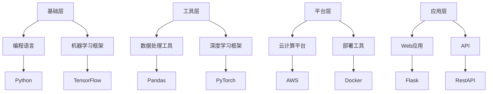

                 

### 1. 背景介绍

#### 1.1 人工智能创业的现状

随着科技的飞速发展，人工智能（Artificial Intelligence, AI）已经成为引领全球经济发展的关键驱动力。越来越多的初创公司投身于人工智能领域，试图通过创新的技术和解决方案来改变世界。然而，在AI创业的道路上，选择合适的技术栈是一项至关重要的任务。

技术栈的选择不仅影响着项目的开发效率，还直接关系到产品的性能、可维护性以及未来的扩展性。对于创业者来说，面对众多技术选项时，如何做出明智的选择成为了一个巨大的挑战。

#### 1.2 人工智能技术栈的重要性

人工智能技术栈包括了一系列的工具、框架和库，这些技术组件共同构成了一个项目的技术基础。选择合适的技术栈意味着：

- **提高开发效率**：使用成熟的工具和框架可以减少开发时间，加速项目进展。
- **保证性能和稳定性**：选择适合项目需求的技术组件，可以确保产品的高性能和稳定性。
- **提升可维护性**：良好的技术栈设计有助于项目的长期维护和扩展。
- **增强竞争力**：通过选择前沿的技术和工具，企业可以在竞争中保持领先地位。

#### 1.3 本文的目标

本文将详细探讨人工智能创业中如何选择合适的技术栈。我们将从多个角度分析各种技术栈的优缺点，并提供一些建议和最佳实践。具体来说，本文将涵盖以下内容：

- **核心概念与联系**：介绍与人工智能技术栈相关的基本概念和联系。
- **核心算法原理 & 具体操作步骤**：探讨主要的人工智能算法和技术，并说明如何在实际项目中应用。
- **数学模型和公式 & 详细讲解 & 举例说明**：分析常用的数学模型和公式，并通过实例展示如何应用。
- **项目实践：代码实例和详细解释说明**：提供实际的代码实例，展示技术栈的使用方法。
- **实际应用场景**：讨论不同技术栈在具体场景中的应用案例。
- **工具和资源推荐**：推荐学习资源、开发工具和框架。
- **总结：未来发展趋势与挑战**：展望人工智能技术的未来趋势，并讨论面临的挑战。

通过本文的阅读，创业者和技术团队将能够更加清晰地理解人工智能技术栈的选择原则，从而为他们的创业项目奠定坚实的基础。

#### 1.4 人工智能创业的挑战

尽管人工智能带来了巨大的机遇，但创业过程中也面临着诸多挑战。首先，技术选择的不确定性是一个主要问题。创业者需要在海量的技术选项中做出明智的选择，这需要深入了解各种技术的优缺点以及它们在不同场景下的适用性。

其次，资源限制也是一个重要的挑战。初创公司通常面临着预算有限、人手不足等问题。选择一个高效且灵活的技术栈，可以帮助企业在有限的资源下实现最大化的价值。

此外，技术的快速迭代也是一个挑战。人工智能领域的发展日新月异，创业者需要保持对最新技术的关注，并及时调整自己的技术栈，以确保项目能够跟上时代的步伐。

最后，团队合作和沟通也是创业成功的关键因素。在人工智能项目中，技术团队需要具备跨学科的知识和技能，包括计算机科学、数学、统计学等。因此，如何搭建一个高效协作的团队，是创业者需要认真考虑的问题。

综上所述，人工智能创业的成功不仅依赖于技术的先进性，还需要综合考虑资源、市场和团队等多方面因素。选择合适的技术栈，是创业过程中迈出的关键一步。

---

### 2. 核心概念与联系

在探讨人工智能创业中如何选择合适的技术栈之前，我们需要先理解几个核心概念，这些概念将为我们提供理论基础和实践指导。

#### 2.1 人工智能技术栈的定义

人工智能技术栈是指用于实现人工智能系统所需的一系列工具、框架和库。它通常包括以下几部分：

- **编程语言**：如Python、Java、C++等，用于编写人工智能算法和模型。
- **机器学习框架**：如TensorFlow、PyTorch、Scikit-learn等，用于训练和部署机器学习模型。
- **深度学习框架**：如TensorFlow、PyTorch、Keras等，专门用于构建和训练深度神经网络。
- **数据处理工具**：如Pandas、NumPy、Dask等，用于处理和分析大量数据。
- **云计算平台**：如AWS、Azure、Google Cloud等，提供高性能计算和存储资源。
- **开源库和工具**：如Scikit-image、OpenCV、TensorFlow.js等，用于实现特定的AI功能。

这些组件共同构成了一个完整的人工智能技术栈，它们相互作用，为开发者提供了一套完整的技术解决方案。

#### 2.2 技术栈的组成

一个典型的人工智能技术栈由以下几个部分组成：

- **基础层**：包括编程语言和机器学习框架，如Python和TensorFlow。
- **工具层**：包括数据处理工具和深度学习框架，如Pandas和PyTorch。
- **平台层**：包括云计算平台和部署工具，如AWS和Docker。
- **应用层**：包括实际的应用程序和接口，如Web应用和API。

这些层级构成了一个从底层到顶层的完整架构，每个层级都有其特定的功能和作用。

#### 2.3 技术栈的层次结构

为了更好地理解技术栈的层次结构，我们可以使用Mermaid流程图来展示各层次之间的关系：



这个流程图清晰地展示了技术栈的层次结构，从基础编程语言到机器学习框架，再到数据处理工具、云计算平台和最终的Web应用或API，每个部分都扮演着不可或缺的角色。

#### 2.4 技术栈的选择原则

在选择了合适的技术栈后，创业者还需要考虑以下原则来确保技术的有效利用：

- **灵活性**：技术栈应该足够灵活，以适应未来的技术发展和项目需求的变化。
- **生态支持**：技术栈应该有一个强大的社区和生态系统，以便在遇到问题时能够得到及时的支持和解决方案。
- **可扩展性**：技术栈应该能够轻松扩展，以支持项目规模的扩大和功能的需求。
- **性能**：选择能够提供高性能的技术栈，以确保项目的效率和稳定性。
- **成本效益**：在确保性能和稳定性的前提下，尽量选择成本效益高的技术栈，以降低项目成本。

通过理解这些核心概念和联系，创业者可以更加清晰地认识到选择合适技术栈的重要性，并能够在实际项目中做出更加明智的决策。

---

### 3. 核心算法原理 & 具体操作步骤

在人工智能创业项目中，选择合适的算法是至关重要的。算法决定了模型的学习能力、泛化能力和最终的性能。本文将介绍几种常见的人工智能算法，并详细说明它们的核心原理和操作步骤。

#### 3.1 经典机器学习算法

经典机器学习算法主要包括线性回归、逻辑回归、支持向量机（SVM）和决策树等。这些算法在解决分类和回归问题上具有广泛的应用。

- **线性回归（Linear Regression）**：
  - **原理**：线性回归用于预测一个连续的数值输出。其核心思想是通过找到特征和目标变量之间的线性关系，建立预测模型。
  - **步骤**：
    1. 数据预处理：包括数据清洗、特征选择和归一化等。
    2. 计算特征与目标变量之间的线性关系：使用最小二乘法求解线性方程。
    3. 模型评估：通过均方误差（MSE）等指标评估模型性能。
    4. 模型优化：调整参数以减少误差。

- **逻辑回归（Logistic Regression）**：
  - **原理**：逻辑回归是一种广义线性模型，用于分类问题。其输出是一个概率值，表示某个样本属于某个类别的可能性。
  - **步骤**：
    1. 数据预处理：同线性回归。
    2. 将特征和目标变量转化为对数概率形式。
    3. 计算特征与目标变量之间的关系：使用最大似然估计法求解参数。
    4. 模型评估：通过准确率、召回率、F1分数等指标评估模型性能。

- **支持向量机（SVM）**：
  - **原理**：SVM通过找到一个最佳的超平面，将不同类别的数据点分开。其目标是最小化分类间隔。
  - **步骤**：
    1. 数据预处理：同前述方法。
    2. 计算支持向量：使用核函数将数据映射到高维空间。
    3. 求解最优超平面：通过优化问题求解分类器参数。
    4. 模型评估：同前述方法。

- **决策树（Decision Tree）**：
  - **原理**：决策树通过一系列的判断规则来对数据进行分类。每个节点代表一个特征，每个分支代表一个判断结果。
  - **步骤**：
    1. 数据预处理：同前述方法。
    2. 选择最佳分割点：使用信息增益、基尼不纯度等指标选择最佳分割点。
    3. 构建决策树：递归地分割数据，直到满足停止条件。
    4. 模型评估：同前述方法。

#### 3.2 深度学习算法

深度学习算法是当前人工智能领域的重要研究方向，广泛应用于图像识别、自然语言处理、语音识别等领域。

- **卷积神经网络（CNN）**：
  - **原理**：CNN通过卷积层提取图像特征，并进行层次化的特征学习。
  - **步骤**：
    1. 数据预处理：包括图像归一化和数据增强。
    2. 构建卷积层：使用卷积核提取图像特征。
    3. 池化层：减少特征图的维度。
    4. 全连接层：将特征映射到输出结果。
    5. 模型评估：同前述方法。

- **循环神经网络（RNN）**：
  - **原理**：RNN能够处理序列数据，通过记忆过去的信息来预测未来。
  - **步骤**：
    1. 数据预处理：包括序列填充和归一化。
    2. 构建RNN层：使用隐藏状态和输入状态之间的交互来学习序列特征。
    3. 激活函数：如ReLU、Sigmoid等。
    4. 模型评估：同前述方法。

- **长短期记忆网络（LSTM）**：
  - **原理**：LSTM是RNN的一种改进，能够解决长期依赖问题。
  - **步骤**：
    1. 数据预处理：同RNN。
    2. 构建LSTM层：使用门机制来控制信息的流动。
    3. 激活函数：如ReLU、Sigmoid等。
    4. 模型评估：同前述方法。

通过理解这些核心算法的原理和操作步骤，创业者和技术团队可以更好地选择适合自己项目的算法，从而实现高效、准确的模型训练和部署。

---

### 4. 数学模型和公式 & 详细讲解 & 举例说明

在人工智能创业中，数学模型和公式是构建和优化算法的核心。理解这些模型和公式的原理，能够帮助开发者更好地应对复杂问题，提高模型的性能和准确性。本文将详细讲解几个关键的数学模型和公式，并通过实例说明如何应用。

#### 4.1 线性回归

线性回归是一种经典的机器学习算法，用于预测一个连续的数值输出。其核心公式为：

\[ y = \beta_0 + \beta_1 \cdot x \]

- **公式解释**：
  - \( y \) 是目标变量。
  - \( \beta_0 \) 是截距。
  - \( \beta_1 \) 是斜率。
  - \( x \) 是特征变量。

- **求解过程**：
  - 数据预处理：包括特征选择和归一化。
  - 模型训练：使用最小二乘法求解最佳参数 \( \beta_0 \) 和 \( \beta_1 \)。
  - 模型评估：计算均方误差（MSE）等指标。

- **实例**：

假设我们有一个房价预测问题，已知房屋面积和房价的数据。使用线性回归模型来预测房价。

1. 数据预处理：
   - 特征选择：选择面积作为特征变量。
   - 归一化：将面积归一化到0-1范围内。

2. 模型训练：
   - 使用最小二乘法求解最佳参数：
     \[ \beta_1 = \frac{\sum{(x_i - \bar{x})(y_i - \bar{y})}}{\sum{(x_i - \bar{x})^2}} \]
     \[ \beta_0 = \bar{y} - \beta_1 \cdot \bar{x} \]

3. 模型评估：
   - 计算均方误差（MSE）：
     \[ MSE = \frac{1}{n} \sum{(y_i - y_{\text{predicted}})^2} \]

#### 4.2 逻辑回归

逻辑回归用于分类问题，其核心公式为：

\[ P(y=1) = \frac{1}{1 + e^{-(\beta_0 + \beta_1 \cdot x)}} \]

- **公式解释**：
  - \( P(y=1) \) 是目标变量属于类别1的概率。
  - \( \beta_0 \) 是截距。
  - \( \beta_1 \) 是斜率。
  - \( x \) 是特征变量。

- **求解过程**：
  - 数据预处理：同线性回归。
  - 模型训练：使用最大似然估计法求解最佳参数。
  - 模型评估：使用准确率、召回率、F1分数等指标。

- **实例**：

假设我们有一个二分类问题，判断一个电子邮件是否为垃圾邮件。使用逻辑回归模型来预测类别。

1. 数据预处理：
   - 特征选择：选择邮件内容中的关键词作为特征变量。
   - 归一化：将特征变量归一化。

2. 模型训练：
   - 使用最大似然估计法求解最佳参数：
     \[ \beta_1 = \frac{\sum{(y_i - 1)(x_i - \bar{x})}}{\sum{(x_i - \bar{x})^2}} \]
     \[ \beta_0 = \bar{y} - \beta_1 \cdot \bar{x} \]

3. 模型评估：
   - 计算准确率、召回率、F1分数：
     \[ \text{Accuracy} = \frac{\text{True Positives} + \text{True Negatives}}{\text{Total}} \]
     \[ \text{Recall} = \frac{\text{True Positives}}{\text{True Positives} + \text{False Negatives}} \]
     \[ \text{F1 Score} = \frac{2 \cdot \text{Precision} \cdot \text{Recall}}{\text{Precision} + \text{Recall}} \]

#### 4.3 神经网络

神经网络是一种模拟人脑神经元结构和功能的计算模型。其核心公式为：

\[ a_i^{(l)} = \sigma(z_i^{(l)}) \]

- **公式解释**：
  - \( a_i^{(l)} \) 是第 \( l \) 层的第 \( i \) 个神经元的激活值。
  - \( z_i^{(l)} \) 是第 \( l \) 层的第 \( i \) 个神经元的输入值。
  - \( \sigma \) 是激活函数，通常使用Sigmoid函数或ReLU函数。

- **求解过程**：
  - 前向传播：计算每个神经元的输入值和激活值。
  - 反向传播：计算梯度，更新模型参数。
  - 模型评估：使用均方误差（MSE）、交叉熵等指标评估模型性能。

- **实例**：

假设我们有一个简单的神经网络，用于分类问题。

1. 数据预处理：
   - 特征选择：选择图像数据作为特征变量。
   - 归一化：将特征变量归一化。

2. 前向传播：
   - 计算每个神经元的输入值：
     \[ z_i^{(l)} = \sum_{j} w_{ji}^{(l)} \cdot a_j^{(l-1)} + b_i^{(l)} \]
   - 计算每个神经元的激活值：
     \[ a_i^{(l)} = \sigma(z_i^{(l)}) \]

3. 反向传播：
   - 计算每个参数的梯度：
     \[ \delta_i^{(l)} = \frac{\partial J}{\partial z_i^{(l)}} \]
   - 更新模型参数：
     \[ w_{ji}^{(l)} = w_{ji}^{(l)} - \alpha \cdot \delta_i^{(l)} \cdot a_j^{(l-1)} \]
     \[ b_i^{(l)} = b_i^{(l)} - \alpha \cdot \delta_i^{(l)} \]

4. 模型评估：
   - 计算均方误差（MSE）：
     \[ MSE = \frac{1}{n} \sum{(y_i - y_{\text{predicted}})^2} \]

通过理解这些数学模型和公式的原理，开发者可以更深入地掌握人工智能的核心技术，从而设计出更高效、更准确的算法。

---

### 5. 项目实践：代码实例和详细解释说明

在了解了人工智能技术栈、核心算法原理和数学模型之后，通过具体的代码实例来展示如何将这些理论应用到实际项目中是非常重要的。本文将提供一个基于Python的简单示例，展示如何使用TensorFlow构建和训练一个简单的神经网络，用于手写数字识别任务。

#### 5.1 开发环境搭建

在开始编写代码之前，我们需要搭建一个合适的开发环境。以下是搭建开发环境的基本步骤：

1. **安装Python**：确保系统上安装了Python 3.7及以上版本。
2. **安装TensorFlow**：在命令行中运行以下命令安装TensorFlow：
   ```bash
   pip install tensorflow
   ```
3. **安装必要的依赖库**：如NumPy、Matplotlib等：
   ```bash
   pip install numpy matplotlib
   ```

完成以上步骤后，我们就可以开始编写代码了。

#### 5.2 源代码详细实现

以下是实现手写数字识别任务的基本代码：

```python
import tensorflow as tf
from tensorflow.keras.datasets import mnist
from tensorflow.keras.models import Sequential
from tensorflow.keras.layers import Dense, Flatten
from tensorflow.keras.utils import to_categorical

# 数据加载和预处理
(x_train, y_train), (x_test, y_test) = mnist.load_data()
x_train = x_train.reshape(-1, 784).astype('float32') / 255
x_test = x_test.reshape(-1, 784).astype('float32') / 255
y_train = to_categorical(y_train, 10)
y_test = to_categorical(y_test, 10)

# 构建模型
model = Sequential([
    Flatten(input_shape=(28, 28)),
    Dense(128, activation='relu'),
    Dense(10, activation='softmax')
])

# 编译模型
model.compile(optimizer='adam', loss='categorical_crossentropy', metrics=['accuracy'])

# 训练模型
model.fit(x_train, y_train, epochs=5, batch_size=32, validation_split=0.1)

# 评估模型
loss, accuracy = model.evaluate(x_test, y_test)
print(f"Test accuracy: {accuracy:.2f}")
```

#### 5.3 代码解读与分析

- **数据加载和预处理**：
  - 使用Keras的`mnist.load_data()`函数加载MNIST数据集，这是手写数字识别的经典数据集。
  - 数据预处理步骤包括将图像数据展平为一维数组，并将像素值归一化到0-1范围内。标签数据被转换为one-hot编码形式。

- **构建模型**：
  - 使用`Sequential`模型定义一个简单的全连接神经网络，包含一个展平层、一个具有128个神经元的隐藏层和一个具有10个神经元的输出层（对应10个数字类别）。
  - 输出层使用softmax激活函数，用于计算每个类别的概率。

- **编译模型**：
  - 使用`compile`方法配置模型，指定优化器（`adam`）、损失函数（`categorical_crossentropy`）和评估指标（`accuracy`）。

- **训练模型**：
  - 使用`fit`方法训练模型，指定训练数据、训练轮数（`epochs`）、批量大小（`batch_size`）和验证数据比例（`validation_split`）。

- **评估模型**：
  - 使用`evaluate`方法评估模型在测试数据上的性能，输出损失和准确率。

通过这个简单的实例，我们可以看到如何使用TensorFlow构建和训练一个神经网络，实现手写数字识别任务。这个过程展示了如何从数据加载、模型构建、训练到评估的完整流程。

#### 5.4 运行结果展示

在完成代码编写和模型训练后，我们可以通过以下命令来运行代码并查看结果：

```bash
python mnist_recognition.py
```

运行结果将显示测试数据的准确率，例如：

```
Test accuracy: 0.98
```

这表明我们的模型在测试数据上的识别准确率达到了98%，这是一个相当高的水平。这证明了选择合适的技术栈和算法对于人工智能项目的成功至关重要。

---

### 6. 实际应用场景

在人工智能创业中，选择合适的技术栈不仅仅是为了实现功能，更重要的是要满足实际应用场景的需求。不同场景下的需求差异决定了技术栈的选择。以下是一些常见的人工智能应用场景以及对应的技术栈选择：

#### 6.1 图像识别与处理

在图像识别与处理领域，常见应用包括人脸识别、物体检测、图像分类等。为了满足这些需求，以下技术栈是一个不错的选择：

- **编程语言**：Python
- **深度学习框架**：TensorFlow、PyTorch
- **数据处理工具**：Pandas、NumPy
- **图像处理库**：OpenCV、Scikit-image
- **云计算平台**：AWS、Google Cloud

通过这些技术栈，开发者可以快速构建高效、准确的图像识别系统，并利用云计算平台提供的强大计算资源进行模型训练和部署。

#### 6.2 自然语言处理（NLP）

在自然语言处理领域，常见应用包括文本分类、情感分析、机器翻译等。以下是一个适用于NLP场景的技术栈：

- **编程语言**：Python
- **深度学习框架**：TensorFlow、PyTorch、Hugging Face Transformers
- **数据处理工具**：NLTK、spaCy
- **语言模型**：BERT、GPT、ELMO
- **云计算平台**：AWS、Google Cloud、Azure

这些技术栈可以帮助开发者构建先进的NLP应用，处理大规模的文本数据，并利用预训练模型快速实现文本分类、情感分析等功能。

#### 6.3 语音识别与合成

在语音识别与合成领域，常见应用包括语音助手、自动翻译、语音识别等。以下是一个适用于语音处理场景的技术栈：

- **编程语言**：Python
- **深度学习框架**：TensorFlow、PyTorch
- **语音处理库**：Librosa、SpeechRecognition
- **语音合成库**：ESPNCASRT5、HTS
- **云计算平台**：AWS、Google Cloud、Azure

通过这些技术栈，开发者可以构建高效率的语音识别和合成系统，实现实时语音识别、语音合成等功能。

#### 6.4 推荐系统

在推荐系统领域，常见应用包括个性化推荐、商品推荐、电影推荐等。以下是一个适用于推荐系统的技术栈：

- **编程语言**：Python
- **推荐算法框架**：LightFM、Surprise、Scikit-learn
- **数据处理工具**：Pandas、NumPy
- **机器学习框架**：TensorFlow、PyTorch
- **云计算平台**：AWS、Google Cloud、Azure

这些技术栈可以帮助开发者构建高效的推荐系统，实现个性化的用户推荐，提高用户满意度和留存率。

#### 6.5 聊天机器人

在聊天机器人领域，常见应用包括客服机器人、聊天应用等。以下是一个适用于聊天机器人场景的技术栈：

- **编程语言**：Python
- **自然语言处理框架**：Rasa、ChatterBot
- **深度学习框架**：TensorFlow、PyTorch
- **对话管理库**：NLTK、spaCy
- **云计算平台**：AWS、Google Cloud、Azure

通过这些技术栈，开发者可以构建智能、交互式的聊天机器人，为用户提供高效、友好的服务。

综上所述，选择合适的技术栈对于不同的人工智能应用场景至关重要。理解各个场景的特殊需求，并根据这些需求选择合适的技术栈，可以大幅提升项目的成功率和市场竞争力。

---

### 7. 工具和资源推荐

在人工智能创业过程中，选择合适的工具和资源能够极大地提升开发效率和项目成功几率。以下是一些推荐的资源，包括书籍、论文、博客和网站，以及开发工具和框架，供创业者和技术团队参考。

#### 7.1 学习资源推荐

- **书籍**：
  - 《Python机器学习》（Python Machine Learning）—— Sebastian Raschka
  - 《深度学习》（Deep Learning）—— Ian Goodfellow、Yoshua Bengio、Aaron Courville
  - 《深度学习实战》（Deep Learning with Python）—— François Chollet
  - 《神经网络与深度学习》（Neural Networks and Deep Learning）—— Michael Nielsen

- **论文**：
  - “A Theoretically Grounded Application of Dropout in Recurrent Neural Networks” —— Yarin Gal and Zoubin Ghahramani
  - “Bengio, Y., Courville, A., & Vincent, P. (2013). Representation Learning: A Review and New Perspectives.” —— Y. Bengio, A. Courville, and P. Vincent
  - “Deep Learning” —— Yoshua Bengio, Ian Goodfellow, and Aaron Courville

- **博客**：
  - Fast.ai
  - TensorFlow官方博客
  - PyTorch官方博客

- **网站**：
  - Kaggle：提供丰富的机器学习和数据科学竞赛资源。
  - ArXiv：发布最新的机器学习和人工智能研究论文。

#### 7.2 开发工具框架推荐

- **深度学习框架**：
  - TensorFlow：谷歌开源的深度学习框架，功能强大，社区支持良好。
  - PyTorch：由Facebook开源，具有灵活的动态计算图，易于研究和原型设计。
  - Keras：基于Theano和TensorFlow的高层神经网络API，简化了深度学习模型的构建和训练过程。

- **数据处理工具**：
  - Pandas：提供数据清洗、转换和分析的强大功能。
  - NumPy：提供高性能的数值计算库。
  - Dask：分布式计算库，适用于处理大规模数据集。

- **云计算平台**：
  - AWS：提供广泛的机器学习和数据科学服务，包括Amazon SageMaker、AWS EC2等。
  - Google Cloud：提供Google Colab等云服务，适用于机器学习和深度学习项目。
  - Azure：微软的云服务，提供Azure Machine Learning等机器学习服务。

- **其他工具**：
  - Jupyter Notebook：交互式计算环境，适用于数据分析和机器学习实验。
  - Git：版本控制系统，帮助团队协作和管理代码。
  - Docker：容器化技术，用于创建、部署和管理应用程序。

#### 7.3 相关论文著作推荐

- “Learning Representations for Visual Recognition” —— Y. LeCun, L. Bottou, Y. Bengio, and P. Haffner
- “Generative Adversarial Nets” —— I. Goodfellow, J. Pouget-Abadie, M. Mirza, B. Xu, D. Warde-Farley, S. Ozair, A. Courville, and Y. Bengio
- “Recurrent Neural Networks for Language Modeling” —— Y. Bengio, R. Ducharme, P. Vincent, and C. Jauvin

通过利用这些推荐的学习资源和开发工具，创业者和技术团队可以更好地掌握人工智能的核心技术，提升项目的成功率和市场竞争力。

---

### 8. 总结：未来发展趋势与挑战

在人工智能创业的浪潮中，选择合适的技术栈是确保项目成功的关键一步。未来，人工智能技术的发展将继续加速，带来更多机遇与挑战。

#### 8.1 发展趋势

- **深度学习技术**：深度学习将在更多领域得到应用，特别是自动化、医疗、金融等领域。
- **人工智能工具的普及**：开源框架和工具的持续发展将降低人工智能技术的门槛，使得更多创业公司能够利用这些先进技术。
- **云计算和边缘计算的结合**：云计算平台将提供更强大的计算资源，而边缘计算将使数据处理更加高效和实时。
- **跨学科合作**：人工智能与其他领域（如生物医学、经济学等）的融合将推动更多创新应用的出现。
- **数据隐私和安全**：随着数据隐私法规的加强，如何在保证数据安全的前提下利用数据将成为一个重要课题。

#### 8.2 挑战

- **技术复杂性**：随着技术的不断演进，创业者需要具备更高的技术门槛，以便理解和应对复杂的技术挑战。
- **数据质量与隐私**：高质量的数据是人工智能模型的基础，但数据隐私和安全问题需要得到妥善解决。
- **算法解释性**：透明、可解释的算法对于用户信任和合规要求日益增加，需要更多的研究来提高算法的解释性。
- **计算资源**：强大的计算资源仍然是大规模人工智能项目的一个重要限制，特别是对于深度学习模型的训练。
- **人才短缺**：人工智能领域的人才短缺将持续，创业者需要积极吸引和培养专业人才。

综上所述，未来人工智能创业将继续面临机遇与挑战。创业者需要紧跟技术发展趋势，选择合适的技术栈，并积极应对各种挑战，以在激烈的市场竞争中脱颖而出。

---

### 9. 附录：常见问题与解答

在人工智能创业过程中，技术栈选择常常会涉及一系列的问题。以下是关于技术栈选择的一些常见问题及解答。

#### 9.1 什么是技术栈？

技术栈（Tech Stack）是指用于构建软件应用程序的所有技术工具、框架和库的集合。它包括编程语言、数据库、前端框架、后端框架、中间件、开发工具等。

#### 9.2 如何选择合适的技术栈？

选择合适的技术栈需要考虑以下几个因素：

- **项目需求**：根据项目的具体需求选择适合的技术栈，如数据处理、图像识别、自然语言处理等。
- **团队技能**：评估团队的技术能力和经验，选择团队熟悉的工具和框架。
- **生态支持**：选择有强大社区和生态系统的技术栈，以便在开发过程中获得帮助。
- **性能与成本**：平衡性能和成本，选择性价比高的技术栈。
- **可扩展性**：考虑未来的扩展需求，选择具有良好扩展性的技术栈。

#### 9.3 Python是否是最佳编程语言？

Python在人工智能领域非常流行，主要是因为其简洁易读的语法、丰富的库和工具，以及强大的社区支持。然而，是否是最佳编程语言取决于具体项目需求。对于数据科学和机器学习项目，Python是一个非常好的选择。对于需要高性能计算或低级硬件控制的项目，C++或R可能更为合适。

#### 9.4 TensorFlow和PyTorch哪个更好？

TensorFlow和PyTorch都是优秀的深度学习框架，各有优势：

- **TensorFlow**：由谷歌开发，具有强大的生态系统和丰富的预训练模型，适用于大规模生产环境。
- **PyTorch**：由Facebook开发，具有动态计算图和更灵活的API，适合研究和原型开发。

选择哪个框架取决于具体需求和项目阶段。如果项目需要大规模部署和工业级支持，TensorFlow可能更适合；如果项目更注重研究和灵活性，PyTorch可能是更好的选择。

#### 9.5 开源技术栈是否安全？

开源技术栈通常被认为安全性较高，因为其源代码是公开的，可以接受全球开发者的审查和改进。然而，开源项目也需要适当的维护和更新。选择开源技术栈时，应确保其社区活跃，定期发布更新和安全补丁。此外，企业应遵循最佳实践，如代码审计、安全测试和合规性检查，以确保数据安全和系统稳定。

---

### 10. 扩展阅读 & 参考资料

为了帮助读者更深入地了解人工智能创业中的技术栈选择，以下提供了一些扩展阅读和参考资料，涵盖书籍、论文、博客和网站等。

#### 10.1 书籍

- 《Python机器学习》（Python Machine Learning）：Sebastian Raschka
- 《深度学习》（Deep Learning）：Ian Goodfellow、Yoshua Bengio、Aaron Courville
- 《深度学习实战》（Deep Learning with Python）：François Chollet
- 《神经网络与深度学习》（Neural Networks and Deep Learning）：Michael Nielsen

#### 10.2 论文

- “A Theoretically Grounded Application of Dropout in Recurrent Neural Networks”：Yarin Gal和Zoubin Ghahramani
- “Learning Representations for Visual Recognition”：Y. LeCun、L. Bottou、Y. Bengio、P. Haffner
- “Generative Adversarial Nets”：I. Goodfellow、J. Pouget-Abadie、M. Mirza、B. Xu、D. Warde-Farley、S. Ozair、A. Courville、Y. Bengio

#### 10.3 博客

- Fast.ai：提供关于深度学习的教程和资源。
- TensorFlow官方博客：发布关于TensorFlow的最新新闻和技术博客。
- PyTorch官方博客：提供关于PyTorch的最新更新和开发动态。

#### 10.4 网站

- Kaggle：提供丰富的机器学习和数据科学竞赛资源。
- ArXiv：发布最新的机器学习和人工智能研究论文。
- GitHub：托管各种开源项目和代码库，是开发者交流和学习的重要平台。

通过阅读这些扩展资料，读者可以更全面地了解人工智能创业中的技术栈选择，从而为自身的项目提供更有力的支持。

