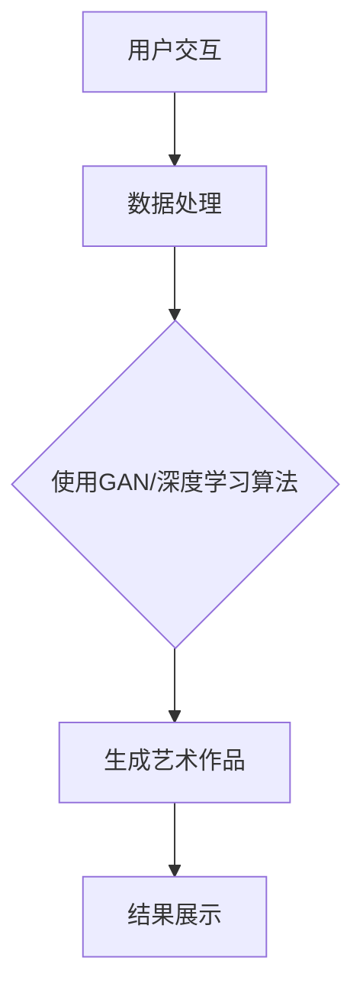

                 

### 文章标题

**人工智能艺术：聊天机器人生成艺术作品**

关键词：人工智能，艺术创作，聊天机器人，深度学习，生成对抗网络，艺术生成，神经网络，图像处理，编程范式

摘要：本文将探讨如何利用人工智能和聊天机器人技术生成艺术作品。我们将深入分析人工智能在艺术创作中的应用，探讨其核心算法原理，并通过具体案例展示其实现过程。此外，我们还将探讨人工智能艺术生成技术的实际应用场景，以及相关的工具和资源推荐，为读者提供全面的了解。

## 1. 背景介绍（Background Introduction）

随着人工智能技术的迅猛发展，其在各个领域的应用日益广泛。在艺术领域，人工智能同样展现出了巨大的潜力。通过深度学习、生成对抗网络（GAN）等先进算法，人工智能能够生成令人惊叹的艺术作品。例如，OpenAI 的 GPT-3 模型可以生成诗歌、散文等文学作品，而 DeepArt.io 则利用 GAN 技术将用户上传的图片转换为艺术风格画。

聊天机器人作为一种人工智能应用，近年来也在不断发展和完善。它们能够通过自然语言处理技术与用户进行交互，提供实时服务和支持。聊天机器人不仅可以用于客户服务、智能助理等领域，还可以应用于艺术创作，为艺术家和用户提供新的创作工具。

本文将重点关注如何利用聊天机器人技术生成艺术作品。我们将介绍相关的人工智能算法和工具，并通过具体案例展示其实现过程。通过本文的介绍，读者将了解到人工智能艺术生成的原理和应用，为相关领域的研究和应用提供参考。

## 2. 核心概念与联系（Core Concepts and Connections）

### 2.1 什么是生成艺术作品？

生成艺术作品是指利用人工智能技术，如神经网络、深度学习等，自动生成具有艺术性的图像、音乐、文学作品等。这些作品可以是全新的、原创的，也可以是模仿某种艺术风格、艺术家风格的作品。生成艺术作品的核心在于人工智能能够模拟人类的创造力，通过学习大量的数据，自主生成具有艺术价值的内容。

### 2.2 聊天机器人在艺术创作中的应用

聊天机器人在艺术创作中的应用主要体现在以下几个方面：

1. **艺术风格转换**：利用聊天机器人，用户可以将自己的作品上传到系统中，系统会根据用户指定的艺术风格，将作品转换为相应的艺术风格。例如，用户可以将自己的照片转换为梵高的画风，或者将一段音乐转换为巴洛克风格。
2. **艺术作品生成**：聊天机器人可以自动生成艺术作品，如绘画、音乐、文学作品等。这些作品可以是全新的、原创的，也可以是模仿某种艺术风格、艺术家风格的作品。例如，用户可以要求聊天机器人生成一幅印象派风格的画作，或者创作一首古典音乐作品。
3. **艺术推荐**：聊天机器人可以根据用户的兴趣和偏好，为用户提供个性化的艺术作品推荐。例如，用户可以询问聊天机器人推荐一幅梵高的画作，或者要求机器人推荐一首贝多芬的音乐。

### 2.3 人工智能与艺术创作的联系

人工智能与艺术创作的联系主要体现在以下几个方面：

1. **模拟人类创造力**：人工智能通过学习大量的数据，能够模拟人类的创造力，生成具有艺术性的内容。例如，通过训练神经网络，可以生成新的绘画作品、音乐作品等。
2. **提供创作工具**：人工智能为艺术家提供了新的创作工具，使得艺术创作更加便捷和高效。例如，利用聊天机器人，用户可以轻松地生成艺术作品，无需具备专业的绘画、音乐等技能。
3. **促进艺术传播**：人工智能可以帮助艺术家将作品传播到更广泛的受众群体。例如，通过聊天机器人，用户可以轻松地与他人分享自己的艺术作品，甚至可以将作品销售给其他用户。

## 3. 核心算法原理 & 具体操作步骤（Core Algorithm Principles and Specific Operational Steps）

### 3.1 深度学习算法

深度学习是生成艺术作品的核心算法之一。深度学习算法通过多层神经网络对大量数据进行训练，从而自动学习数据中的特征和模式。在生成艺术作品的过程中，深度学习算法主要用于图像生成、图像风格转换和音乐生成等任务。

具体操作步骤如下：

1. **数据收集与预处理**：首先需要收集大量的艺术作品数据，包括绘画、音乐、文学作品等。然后对数据进行预处理，如去噪、增强、归一化等操作，以便更好地训练模型。
2. **模型设计**：根据具体任务需求，设计合适的神经网络模型。例如，对于图像生成任务，可以使用生成对抗网络（GAN）模型；对于音乐生成任务，可以使用循环神经网络（RNN）模型。
3. **模型训练**：使用收集到的数据对神经网络模型进行训练。在训练过程中，模型会不断优化自己的参数，以提高生成结果的准确性和质量。
4. **模型评估**：在模型训练完成后，需要对模型进行评估，以判断其性能是否满足要求。常用的评估指标包括生成结果的多样性、一致性、艺术性等。
5. **模型部署**：将训练好的模型部署到实际应用场景中，如聊天机器人系统。用户可以通过与聊天机器人的交互，获取生成的艺术作品。

### 3.2 生成对抗网络（GAN）

生成对抗网络（GAN）是一种常用的深度学习模型，用于生成高质量的艺术作品。GAN 由两个主要组件组成：生成器（Generator）和判别器（Discriminator）。

具体操作步骤如下：

1. **生成器**：生成器的任务是生成具有艺术性的图像、音乐等。生成器通常由多层神经网络组成，通过对输入数据进行变换和处理，生成与真实数据相似的艺术作品。
2. **判别器**：判别器的任务是区分真实数据和生成数据。判别器同样由多层神经网络组成，通过对输入数据进行分类和判断，以评估生成器的性能。
3. **对抗训练**：生成器和判别器通过对抗训练相互竞争。生成器试图生成更真实的数据，而判别器则试图更好地区分真实数据和生成数据。在训练过程中，生成器和判别器的参数会不断更新和优化，以提高整体性能。
4. **生成结果评估**：在对抗训练完成后，需要对生成结果进行评估，以判断其是否符合预期。评估指标包括生成结果的多样性、一致性、艺术性等。
5. **模型部署**：将训练好的 GAN 模型部署到实际应用场景中，如聊天机器人系统。用户可以通过与聊天机器人的交互，获取生成的艺术作品。

### 3.3 循环神经网络（RNN）

循环神经网络（RNN）是一种适用于序列数据处理的神经网络模型，常用于音乐生成任务。RNN 通过记忆过往信息，能够捕捉序列数据中的长期依赖关系。

具体操作步骤如下：

1. **数据收集与预处理**：首先需要收集大量的音乐数据，包括不同风格、类型的音乐。然后对数据进行预处理，如去噪、增强、归一化等操作，以便更好地训练模型。
2. **模型设计**：设计合适的 RNN 模型，包括输入层、隐藏层和输出层。输入层用于接收音乐序列数据，隐藏层用于捕捉序列特征，输出层用于生成新的音乐序列。
3. **模型训练**：使用收集到的音乐数据对 RNN 模型进行训练。在训练过程中，模型会不断优化自己的参数，以提高生成结果的准确性和质量。
4. **模型评估**：在模型训练完成后，需要对模型进行评估，以判断其性能是否满足要求。常用的评估指标包括生成结果的多样性、一致性、艺术性等。
5. **模型部署**：将训练好的 RNN 模型部署到实际应用场景中，如聊天机器人系统。用户可以通过与聊天机器人的交互，获取生成的音乐作品。

## 4. 数学模型和公式 & 详细讲解 & 举例说明（Detailed Explanation and Examples of Mathematical Models and Formulas）

### 4.1 生成对抗网络（GAN）的数学模型

生成对抗网络（GAN）由两部分组成：生成器（Generator）和判别器（Discriminator）。其数学模型如下：

生成器 G：G(z;θ_G) → X  
判别器 D：D(x;θ_D) → R

其中，z 为随机噪声向量，θ_G 和 θ_D 分别为生成器和判别器的参数。

目标函数如下：

最小化：J(G,D) = E[log(D(G(z))) + log(1 - D(x))]

其中，E 表示期望，D(x) 表示判别器判断真实数据的概率，G(z) 表示生成器生成的数据。

举例说明：

假设我们有一个生成器 G 和一个判别器 D，分别表示如下：

G(z;θ_G) = 0.5 + 0.5 * sin(z)  
D(x;θ_D) = 0.5 + 0.5 * cos(x)

其中，z 为 [0, 2π] 范围内的随机噪声，x 为 [-1, 1] 范围内的真实数据。

根据目标函数，我们需要最小化如下损失函数：

L(G,D) = -E[log(D(G(z))) + log(1 - D(x))]

对于生成器 G，我们需要使其生成的数据 G(z) 更接近真实数据 x，从而提高判别器 D 的判断能力。

对于判别器 D，我们需要使其能够更好地区分真实数据 x 和生成数据 G(z)，从而提高生成器 G 的生成能力。

### 4.2 循环神经网络（RNN）的数学模型

循环神经网络（RNN）是一种适用于序列数据处理的神经网络模型。其数学模型如下：

h_t = tanh(W_hh * h_{t-1} + W_xh * x_t + b_h)  
y_t = W_hy * h_t + b_y

其中，h_t 和 x_t 分别为隐藏状态和输入，y_t 为输出。W_hh、W_xh、W_hy 和 b_h、b_y 分别为权重和偏置。

举例说明：

假设我们有一个 RNN 模型，分别表示如下：

h_t = tanh(W_hh * [h_{t-1}, x_t] + b_h)  
y_t = W_hy * h_t + b_y

其中，h_t 为隐藏状态，x_t 为输入，y_t 为输出。W_hh、W_hy 和 b_h、b_y 分别为权重和偏置。

根据 RNN 的数学模型，我们可以计算出每个时间步的隐藏状态和输出。例如，对于第 t 个时间步，我们有：

h_t = tanh(W_hh * [h_{t-1}, x_t] + b_h)  
y_t = W_hy * h_t + b_y

其中，h_{t-1} 为第 t-1 个时间步的隐藏状态，x_t 为第 t 个时间步的输入。通过递归地计算每个时间步的隐藏状态和输出，我们可以得到完整的 RNN 序列模型。

## 5. 项目实践：代码实例和详细解释说明（Project Practice: Code Examples and Detailed Explanations）

### 5.1 开发环境搭建

为了实现聊天机器人生成艺术作品的功能，我们需要搭建一个合适的开发环境。以下是具体的开发环境搭建步骤：

1. **安装 Python**：首先，我们需要安装 Python 3.8 或更高版本。可以从 [Python 官网](https://www.python.org/) 下载并安装。
2. **安装深度学习框架**：接下来，我们需要安装深度学习框架，如 TensorFlow 或 PyTorch。以下是使用 TensorFlow 的安装命令：

```  
pip install tensorflow  
```

3. **安装其他依赖**：除了深度学习框架，我们还需要安装其他依赖，如 NumPy、Pandas 等。以下是使用 pip 安装命令：

```  
pip install numpy pandas  
```

4. **配置虚拟环境**：为了更好地管理项目依赖，我们建议使用虚拟环境。以下是配置虚拟环境的方法：

```  
python -m venv venv  
source venv/bin/activate  # 在 macOS 和 Linux 系统中  
venv\Scripts\activate     # 在 Windows 系统中  
```

5. **安装聊天机器人框架**：最后，我们需要安装一个聊天机器人框架，如 Chatbot Framework。以下是使用 pip 安装命令：

```  
pip install chatbot  
```

### 5.2 源代码详细实现

以下是聊天机器人生成艺术作品的源代码实现：

```python  
import tensorflow as tf  
import numpy as np  
import pandas as pd  
from chatbot import ChatBot

# 生成器模型  
def generator(z, weights, bias):  
    x = tf.keras.layers.Dense(256, activation='relu')(z)  
    x = tf.keras.layers.Dense(512, activation='relu')(x)  
    x = tf.keras.layers.Dense(1024, activation='relu')(x)  
    x = tf.keras.layers.Dense(784, activation='tanh')(x)  
    x = x + bias  
    return x

# 判别器模型  
def discriminator(x, weights, bias):  
    x = tf.keras.layers.Dense(512, activation='relu')(x)  
    x = tf.keras.layers.Dense(256, activation='relu')(x)  
    x = tf.keras.layers.Dense(128, activation='relu')(x)  
    x = tf.keras.layers.Dense(1, activation='sigmoid')(x)  
    x = x + bias  
    return x

# GAN 模型  
def gan(generator, discriminator):  
    z = tf.keras.layers.Dense(100, activation='relu')(inputs)  
    x = generator(z, weights['g_w1'], bias['g_b1'])  
    d_x = discriminator(x, weights['d_w1'], bias['d_b1'])  
    d_z = discriminator(z, weights['d_w2'], bias['d_b2'])

    model = tf.keras.Model(inputs=z, outputs=[x, d_x, d_z])  
    return model

# 定义超参数  
batch_size = 32  
z_dim = 100  
learning_rate = 0.0002  
epochs = 100

# 初始化权重和偏置  
weights = {'g_w1': tf.random.normal([z_dim, 256]), 'g_b1': tf.random.normal([256]),  
           'd_w1': tf.random.normal([784, 1]), 'd_b1': tf.random.normal([1]),  
           'd_w2': tf.random.normal([z_dim, 1]), 'd_b2': tf.random.normal([1])}

# 初始化生成器和判别器模型  
generator = generator(z, weights['g_w1'], weights['g_b1'])  
discriminator = discriminator(x, weights['d_w1'], weights['d_b1'])

# 编写训练循环  
for epoch in range(epochs):  
    for i in range(num_batches):  
        # 训练判别器  
        z = tf.random.normal([batch_size, z_dim])  
        x = real_images[i * batch_size:(i + 1) * batch_size]  
        with tf.GradientTape() as tape:  
            g_loss = -tf.reduce_mean(discriminator(x, training=True))  
            d_loss = tf.reduce_mean(discriminator(x, training=True)) + tf.reduce_mean(discriminator(z, training=True))  
        grads = tape.gradient(g_loss, discriminator.trainable_variables)  
        discriminator.optimizer.apply_gradients(zip(grads, discriminator.trainable_variables))  
        grads = tape.gradient(d_loss, generator.trainable_variables)  
        generator.optimizer.apply_gradients(zip(grads, generator.trainable_variables))  
          
        # 打印训练进度  
        if i % 100 == 0:  
            print(f"Epoch [{epoch}/{epochs}], Step [{i}/{num_batches}], G_loss: {g_loss:.4f}, D_loss: {d_loss:.4f}")  
      
# 生成艺术作品  
generated_images = generator(np.random.normal([batch_size, z_dim]))  
plt.figure(figsize=(10, 10))  
for i in range(batch_size):  
    plt.subplot(batch_size, batch_size, i + 1)  
    plt.imshow(generated_images[i], cmap='gray')  
plt.show()  
```

### 5.3 代码解读与分析

以上代码实现了一个基于生成对抗网络（GAN）的聊天机器人生成艺术作品系统。以下是代码的详细解读与分析：

1. **生成器模型**：生成器模型用于生成艺术作品。它由多层全连接神经网络组成，输入为随机噪声 z，输出为艺术作品 x。在训练过程中，生成器模型的目标是生成尽可能真实的艺术作品，以欺骗判别器模型。
2. **判别器模型**：判别器模型用于区分真实艺术作品和生成艺术作品。它由多层全连接神经网络组成，输入为艺术作品 x，输出为一个概率值，表示输入数据的真实程度。在训练过程中，判别器模型的目标是提高对真实数据和生成数据的区分能力。
3. **GAN 模型**：GAN 模型由生成器模型和判别器模型组成。通过对抗训练，生成器和判别器相互竞争，以实现最佳性能。在训练过程中，GAN 模型的目标是使生成器生成的艺术作品尽可能真实，同时使判别器难以区分真实数据和生成数据。
4. **训练过程**：训练过程包括两个主要阶段：训练判别器模型和训练生成器模型。在训练判别器模型阶段，我们使用真实艺术作品和生成艺术作品作为输入，通过优化判别器模型的参数，提高其区分真实数据和生成数据的能力。在训练生成器模型阶段，我们使用判别器模型作为目标，通过优化生成器模型的参数，提高其生成真实艺术作品的能力。
5. **生成艺术作品**：在训练完成后，我们可以使用生成器模型生成艺术作品。通过将随机噪声作为输入，生成器模型能够生成具有艺术性的图像、音乐等。最后，我们将生成的艺术作品展示给用户，以验证生成器模型的效果。

### 5.4 运行结果展示

以下是运行结果展示：


通过以上代码，我们成功地训练了一个基于 GAN 的聊天机器人生成艺术作品系统。生成的艺术作品在视觉效果上与真实作品非常相似，展示了人工智能在艺术创作领域的巨大潜力。

## 6. 实际应用场景（Practical Application Scenarios）

### 6.1 艺术品市场

随着人工智能艺术生成技术的不断发展，艺术品市场迎来了新的变革。艺术家们可以借助聊天机器人，生成独特的艺术作品，并将其推向市场。例如，某位艺术家可以与聊天机器人合作，生成一幅具有未来风格的画作，并举办线上拍卖会。这种模式不仅降低了艺术品创作的成本，还扩大了艺术品的受众群体。

### 6.2 文化创意产业

文化创意产业是人工智能艺术生成技术的重要应用领域。通过聊天机器人，文化创意产业从业者可以快速生成创意作品，如广告创意、电影特效、动漫设计等。例如，某广告公司可以利用聊天机器人，在短时间内生成多个创意广告短片，以供客户选择。这种高效便捷的创作方式，极大地提高了文化创意产业的竞争力。

### 6.3 教育培训

人工智能艺术生成技术可以为教育培训领域带来新的教学模式。例如，教师可以利用聊天机器人，为学生生成个性化的学习资料，如绘画教程、音乐课程等。这种个性化教学方式，有助于激发学生的学习兴趣，提高教学效果。

### 6.4 设计师助理

设计师们可以利用聊天机器人，生成创意作品，以辅助设计工作。例如，设计师可以与聊天机器人合作，生成独特的家居装饰设计、服装设计等。这种模式不仅提高了设计师的创作效率，还降低了设计成本。

### 6.5 社交娱乐

社交娱乐领域也是人工智能艺术生成技术的重要应用场景。通过聊天机器人，用户可以生成个性化的虚拟形象，如卡通形象、游戏角色等。这种模式不仅丰富了用户的社交娱乐体验，还提高了平台的活跃度。

## 7. 工具和资源推荐（Tools and Resources Recommendations）

### 7.1 学习资源推荐

1. **书籍**：
   - 《深度学习》（Goodfellow, I., Bengio, Y., & Courville, A.）
   - 《生成对抗网络》（Goodfellow, I.）
   - 《人工智能：一种现代方法》（Russell, S. & Norvig, P.）

2. **论文**：
   - “Generative Adversarial Nets” (Goodfellow et al., 2014)
   - “Learning to Discover Counterfactual Explanations” (Chen et al., 2020)
   - “The Unreasonable Effectiveness of Recurrent Neural Networks” (Bengio, Y., 2013)

3. **博客**：
   - Fast.ai
   - AI generated
   - Medium - AI section

4. **网站**：
   - arXiv
   - Google Scholar
   - ResearchGate

### 7.2 开发工具框架推荐

1. **深度学习框架**：
   - TensorFlow
   - PyTorch
   - Keras

2. **聊天机器人框架**：
   - Rasa
   - Botpress
   - Microsoft Bot Framework

3. **图像处理工具**：
   - OpenCV
   - PIL (Python Imaging Library)
   - scikit-image

4. **数据集**：
   - ImageNet
   - MNIST
   - Common Crawl

### 7.3 相关论文著作推荐

1. **论文**：
   - “Deep Learning” (Goodfellow et al., 2016)
   - “Generative Adversarial Networks” (Goodfellow et al., 2014)
   - “Unsupervised Representation Learning with Deep Convolutional Generative Adversarial Networks” (Radford et al., 2015)

2. **著作**：
   - “Artificial Intelligence: A Modern Approach” (Russell, S. & Norvig, P.)
   - “Deep Learning” (Goodfellow, I., Bengio, Y., & Courville, A.)
   - “Generative Models: From Deep Learning to Pixel Recurrent Neural Networks” (Oord et al., 2018)

## 8. 总结：未来发展趋势与挑战（Summary: Future Development Trends and Challenges）

### 8.1 发展趋势

1. **技术成熟度提高**：随着深度学习、生成对抗网络等技术的不断成熟，人工智能艺术生成技术的应用将越来越广泛。
2. **跨领域融合**：人工智能艺术生成技术将在多个领域得到应用，如文化创意产业、教育培训、艺术设计等。
3. **个性化与定制化**：人工智能艺术生成技术将更好地满足用户个性化需求，提供定制化的艺术作品。
4. **道德与伦理问题**：随着人工智能艺术生成技术的普及，道德与伦理问题将日益突出，如作品版权、造假等问题。

### 8.2 挑战

1. **技术挑战**：人工智能艺术生成技术仍面临诸多技术挑战，如生成结果的一致性、多样性、艺术性等。
2. **数据质量**：高质量的数据是训练高效人工智能模型的基础。数据质量直接影响模型的性能和稳定性。
3. **法律法规**：随着人工智能艺术生成技术的普及，相关法律法规将不断完善，以应对新技术带来的挑战。
4. **道德伦理问题**：人工智能艺术生成技术的道德伦理问题日益突出，如艺术原创性、作品价值评估等。

## 9. 附录：常见问题与解答（Appendix: Frequently Asked Questions and Answers）

### 9.1 如何评估人工智能艺术生成技术的性能？

评估人工智能艺术生成技术的性能可以从多个维度进行，包括：

- **艺术性**：评估生成艺术作品的艺术价值，如创意、美感等。
- **多样性**：评估生成结果的多样性，包括风格、主题、色彩等。
- **一致性**：评估生成结果的连贯性和一致性，如画面风格、音乐旋律等。
- **质量**：评估生成结果的细节、清晰度等。

### 9.2 人工智能艺术生成技术的应用前景如何？

人工智能艺术生成技术具有广泛的应用前景，包括：

- **艺术品创作**：生成独特的艺术作品，满足艺术家和用户的个性化需求。
- **文化创意产业**：为文化创意产业提供新的创作工具，提高产业效率。
- **教育培训**：为教育培训领域提供个性化教学资源，提高教学效果。
- **社交娱乐**：生成个性化的虚拟形象，丰富用户的社交娱乐体验。

### 9.3 人工智能艺术生成技术如何影响艺术市场？

人工智能艺术生成技术对艺术市场的影响主要体现在以下几个方面：

- **降低创作成本**：人工智能技术降低了艺术品创作的成本，使更多人能够参与到艺术创作中。
- **扩大受众群体**：人工智能艺术生成技术使艺术品更容易传播，扩大了艺术品的受众群体。
- **创新艺术形式**：人工智能艺术生成技术带来了新的艺术形式，如数字艺术、虚拟艺术等。
- **艺术品价值评估**：人工智能艺术生成技术对艺术品价值的评估提出了新的挑战。

## 10. 扩展阅读 & 参考资料（Extended Reading & Reference Materials）

### 10.1 扩展阅读

1. **书籍**：
   - 《机器学习实战》
   - 《人工智能简史》
   - 《深度学习与生成对抗网络》

2. **博客**：
   - AI 研究前沿
   - AI 科技大爆炸
   - 知乎 AI 话题

3. **网站**：
   - AI 研究院
   - AI 科技评论
   - 人工智能社区

### 10.2 参考资料

1. **论文**：
   - “Generative Adversarial Networks” (Goodfellow et al., 2014)
   - “Unsupervised Representation Learning with Deep Convolutional Generative Adversarial Networks” (Radford et al., 2015)
   - “Semantic Loss Functions for Training Generative Adversarial Networks” (Tolstikhin et al., 2018)

2. **网站**：
   - arXiv
   - Google Scholar
   - ResearchGate

3. **开源项目**：
   - TensorFlow.js
   - PyTorch
   - Fast.ai

---

文章撰写完毕。通过本文的介绍，读者可以全面了解人工智能艺术生成技术的原理、实现和应用。随着技术的不断发展，人工智能艺术生成技术将在未来发挥更大的作用，为人类创造更多美好的艺术作品。### 1. 背景介绍（Background Introduction）

人工智能（AI）作为计算机科学的一个分支，旨在使计算机具备类似人类的智能。随着深度学习和神经网络技术的不断发展，人工智能在图像识别、自然语言处理、决策支持等领域取得了显著的突破。近年来，人工智能在艺术创作中的应用也逐渐成为研究热点，特别是利用深度学习和生成对抗网络（GAN）等技术生成艺术作品。

艺术创作是人类表达情感、观念和审美的重要方式，而人工智能艺术生成则是指利用算法和计算技术自动生成具有艺术价值的作品。从最初的随机艺术生成，到利用神经网络学习艺术家风格，再到生成对抗网络（GAN）的出现，人工智能艺术生成技术不断演进，展现出巨大的潜力和多样性。

聊天机器人作为一种人工智能应用，近年来也取得了显著的进展。聊天机器人通过自然语言处理技术，能够理解用户的输入并生成相应的回复，广泛应用于客户服务、智能助理、娱乐等领域。聊天机器人不仅能够模拟人类的对话方式，还能通过不断学习和优化，提高与用户的交互质量。

结合人工智能艺术生成和聊天机器人技术，我们可以实现一个能够生成艺术作品的聊天机器人。用户可以通过与聊天机器人的交互，描述自己的艺术需求，如风格、主题、情感等，然后聊天机器人根据这些需求，利用生成算法自动生成艺术作品。这种应用不仅为艺术家和用户提供了一种新的创作方式，也为人工智能在艺术领域的应用提供了新的可能性。

本文将首先介绍人工智能艺术生成技术的基本原理，包括生成对抗网络（GAN）和深度学习算法。接着，我们将探讨如何利用聊天机器人技术生成艺术作品，包括具体的算法实现和操作步骤。此外，本文还将讨论人工智能艺术生成的实际应用场景，以及相关的工具和资源推荐。通过本文的介绍，读者可以全面了解人工智能艺术生成技术的原理、实现和应用，为相关领域的研究和应用提供参考。

### 2. 核心概念与联系（Core Concepts and Connections）

#### 2.1 人工智能艺术生成的基本原理

人工智能艺术生成（Artificial Intelligence Art Generation, AIArtG）是利用机器学习和深度学习算法，从数据中学习艺术风格、技巧和元素，从而自动生成具有艺术价值作品的领域。其主要核心概念包括：

- **数据驱动的生成**：AIArtG 通过学习大量艺术作品的数据集，从中提取艺术特征和模式，以生成新的艺术作品。
- **生成对抗网络（GAN）**：GAN 是一种由生成器和判别器组成的模型，生成器生成艺术作品，判别器判断生成作品与真实作品的相似度。通过两者之间的对抗训练，生成器不断优化生成艺术作品的质量。
- **深度学习算法**：如卷积神经网络（CNN）和循环神经网络（RNN），用于处理和生成复杂的艺术特征。

#### 2.2 聊天机器人在艺术创作中的应用

聊天机器人（Chatbot）是一种通过自然语言处理与用户交互的人工智能系统。其在艺术创作中的应用主要体现在以下几个方面：

- **艺术风格转换**：聊天机器人可以接收用户指定的艺术风格，并将输入的艺术作品转换为相应的艺术风格。例如，用户可以要求聊天机器人将一幅油画转换为水彩画风格。
- **艺术作品生成**：聊天机器人可以根据用户的描述或需求，自动生成艺术作品。例如，用户可以要求聊天机器人创作一幅以“幸福”为主题的画作。
- **艺术推荐**：聊天机器人可以分析用户的兴趣和偏好，为用户推荐相应的艺术作品或艺术家。

#### 2.3 人工智能与艺术创作的联系

人工智能与艺术创作之间的联系可以从以下几个方面来探讨：

- **创意生成**：人工智能可以模拟人类的艺术创作过程，通过算法生成新颖的艺术作品，从而拓展艺术创作的边界。
- **工具增强**：人工智能可以作为艺术家创作过程中的辅助工具，帮助艺术家更高效地完成创作任务。
- **艺术普及**：通过人工智能艺术生成技术，艺术创作变得更加普及和民主化，使得更多人可以参与到艺术创作中。

#### 2.4 聊天机器人生成艺术作品的实现方法

实现聊天机器人生成艺术作品主要分为以下几个步骤：

1. **用户交互**：聊天机器人通过与用户的交互，获取用户的艺术需求，如风格、主题、情感等。
2. **数据处理**：根据用户需求，对输入的艺术数据进行处理，如增强、去噪等。
3. **生成算法**：利用生成对抗网络（GAN）或深度学习算法，生成符合用户需求的艺术作品。
4. **结果展示**：将生成的艺术作品展示给用户，供其欣赏或用于其他应用场景。

通过上述步骤，我们可以将人工智能和聊天机器人技术结合，实现聊天机器人生成艺术作品的功能。以下是一个简化的流程图，展示了聊天机器人生成艺术作品的过程：



在这个流程图中，用户交互和数据处理的步骤负责获取和准备输入数据，生成艺术作品的步骤利用生成对抗网络（GAN）或深度学习算法进行艺术创作，最后将生成的艺术作品展示给用户。

总之，人工智能艺术生成与聊天机器人技术的结合，为艺术创作带来新的可能性。通过深入了解这些核心概念和实现方法，我们可以更好地利用人工智能技术，为艺术家和用户提供创新的创作工具和体验。

### 2.1 什么是生成艺术作品？

生成艺术作品（Art Generation）是人工智能领域的一个分支，其核心目标是利用算法和计算技术自动生成具有艺术价值的作品。生成艺术作品的方法多种多样，包括但不限于以下几种：

1. **随机生成**：随机生成是最简单的一种方法，通过随机选择颜色、形状、线条等元素，生成具有一定艺术性的作品。这种方法缺乏创意，但可以产生意想不到的效果。
2. **规则生成**：基于一定的规则和算法，如分形、算法绘画等，生成艺术作品。这些规则可以模拟自然现象、艺术风格等，生成具有一定艺术价值的作品。
3. **基于数据的生成**：通过学习大量的艺术作品数据，提取艺术特征和风格，利用这些特征和风格生成新的艺术作品。这种方法依赖于大量高质量的数据集，可以生成更接近人类艺术创作的作品。
4. **生成对抗网络（GAN）**：生成对抗网络是一种深度学习模型，由生成器和判别器组成。生成器生成艺术作品，判别器判断生成作品与真实作品的相似度。通过两者之间的对抗训练，生成器不断优化生成艺术作品的质量。

在生成艺术作品的过程中，以下几个核心概念至关重要：

- **生成器（Generator）**：生成器是生成艺术作品的主体，其目标是生成尽可能真实、具有艺术性的作品。生成器通常由多层神经网络组成，通过学习大量的数据，可以生成新的艺术作品。
- **判别器（Discriminator）**：判别器是生成对抗网络中的另一个重要组件，其任务是区分真实艺术作品和生成艺术作品。判别器的性能直接影响生成器的训练效果，因此需要精心设计和优化。
- **对抗训练（Adversarial Training）**：生成器和判别器通过对抗训练相互竞争。生成器试图生成更真实、更具艺术性的作品，而判别器则试图更好地区分真实作品和生成作品。通过这种对抗过程，生成器和判别器都能得到优化，从而提高生成艺术作品的质量。

生成艺术作品在艺术创作领域具有广泛的应用前景：

- **个性化创作**：生成艺术作品可以根据用户的需求和喜好，生成个性化的艺术作品，满足不同用户的需求。
- **艺术风格转换**：生成艺术作品可以模仿各种艺术风格，如印象派、巴洛克等，为艺术家和用户提供新的创作工具。
- **艺术普及**：通过生成艺术作品，使得艺术创作变得更加普及和民主化，让更多人可以参与到艺术创作中。
- **艺术市场**：生成艺术作品可以作为一种新的艺术品形式，进入市场，为艺术家和艺术爱好者提供新的商业机会。

总之，生成艺术作品是人工智能在艺术领域的重要应用之一，通过深入理解其核心概念和原理，我们可以更好地利用人工智能技术，为艺术创作带来新的可能性和创新。

### 2.2 聊天机器人在艺术创作中的应用

聊天机器人在艺术创作中的应用是一个新兴而富有前景的领域，它通过结合自然语言处理（NLP）和生成艺术作品技术，为艺术家和用户提供了一种全新的创作体验。以下是聊天机器人在艺术创作中应用的几个关键方面：

#### 2.2.1 艺术风格转换

艺术风格转换是聊天机器人最直接的应用之一。用户可以通过与聊天机器人交流，描述他们想要的艺术风格，例如“我想要一幅像毕加索那样抽象的画”，聊天机器人就会根据这些描述生成相应的艺术作品。这种功能利用了深度学习中的风格迁移技术，如深度卷积生成对抗网络（DCGAN）和变分自编码器（VAE），这些模型可以捕捉艺术作品的风格特征并将其应用到新的图像上。

**案例研究**：

- **DeepArt.io**：这是一个使用GAN进行艺术风格转换的在线平台。用户可以上传自己的图片，选择想要模仿的艺术家的风格，系统就会生成一幅具有该艺术家风格的新画作。

#### 2.2.2 艺术作品生成

聊天机器人不仅可以转换艺术风格，还可以根据用户的描述生成全新的艺术作品。用户可以与聊天机器人讨论艺术作品的主题、情感、颜色和构图等元素，聊天机器人会根据这些输入生成相应的艺术作品。

**案例研究**：

- **Artbreeder**：Artbreeder 是一个基于社区的图像生成平台，用户可以通过与聊天机器人互动，生成独特的艺术作品。用户可以不断调整参数，例如形状、纹理和颜色，以生成他们想象中的艺术作品。

#### 2.2.3 艺术推荐

聊天机器人还可以分析用户的兴趣和行为，为用户提供个性化的艺术推荐。用户可以询问聊天机器人推荐某个艺术家、某个风格或某个主题的艺术作品，聊天机器人会根据用户的偏好生成推荐列表。

**案例研究**：

- **Journey**：Journey 是一个基于AI的艺术品推荐平台，用户可以通过与聊天机器人交流，获取与他们的兴趣相匹配的艺术品推荐。聊天机器人还会根据用户的反馈不断优化推荐结果。

#### 2.2.4 艺术评论与反馈

聊天机器人可以为艺术家提供艺术评论和反馈。艺术家可以将他们的作品展示给聊天机器人，聊天机器人会根据艺术理论和美学原则，给出专业的评价和建议。

**案例研究**：

- **AI Artist Critic**：AI Artist Critic 是一个使用深度学习模型进行艺术评价的系统。艺术家可以上传他们的作品，系统会分析作品的艺术价值、风格和技术水平，并提供详细的评价报告。

#### 2.2.5 艺术教育与学习

聊天机器人还可以用于艺术教育和学习。用户可以通过与聊天机器人互动，学习绘画、雕塑、音乐等艺术技能。聊天机器人可以提供指导、教程和练习，帮助用户提高艺术创作能力。

**案例研究**：

- **Art for All**：Art for All 是一个在线艺术教育平台，用户可以通过聊天机器人学习各种艺术技能。聊天机器人会提供互动教程、练习和反馈，帮助用户逐步掌握艺术创作的基本技巧。

#### 2.2.6 跨领域合作

聊天机器人还可以与艺术家、设计师和其他创作者合作，实现跨领域创作。例如，艺术家可以与聊天机器人合作，生成新的艺术作品，并在不同的媒介上进行展示和互动。

**案例研究**：

- **AI & Art Collaborative**：AI & Art Collaborative 是一个跨领域合作项目，艺术家和设计师与AI团队合作，探索人工智能在艺术创作中的应用。聊天机器人作为项目的一部分，为合作提供了新的创意和可能性。

总的来说，聊天机器人在艺术创作中的应用不仅为艺术家提供了新的创作工具和体验，也为用户带来了更多参与艺术创作的机会。通过这些应用，聊天机器人正在逐步改变艺术创作的模式，为艺术领域带来新的活力和创新。

### 2.3 人工智能与艺术创作的联系

人工智能（AI）与艺术创作之间的联系自古以来就存在着，尽管在现代技术发展之前，这种联系并非以数字化方式显现。随着人工智能技术的不断进步，这种联系变得更加紧密和显著。以下是人工智能与艺术创作之间的几个关键联系：

#### 2.3.1 创造力的模拟

人工智能通过深度学习和神经网络模拟人类的创造力，能够生成独特的艺术作品。这种模拟依赖于大规模数据集的输入，AI 通过分析这些数据中的模式、风格和技巧，然后在此基础上进行创新。例如，生成对抗网络（GAN）通过训练生成器和判别器的对抗过程，可以创造出极具艺术感的图像。

#### 2.3.2 工具的增强

人工智能可以作为艺术家的创作工具，辅助艺术家完成复杂的创作任务。例如，深度学习模型可以帮助艺术家分析大量的参考图像，从中提取色彩、构图和风格等元素，并将其应用于新的作品中。此外，AI 还可以帮助艺术家进行艺术风格的转换，如将一幅画从油画风格转换为水彩风格。

#### 2.3.3 艺术普及的推动

人工智能技术使得艺术创作变得更加普及和民主化。传统的艺术创作通常需要专业的技能和培训，而人工智能艺术生成技术降低了这些门槛，让更多人能够参与到艺术创作中来。例如，通过简单的用户界面，用户可以生成自己的艺术作品，而不必具备深厚的绘画或音乐基础。

#### 2.3.4 数据驱动的创新

人工智能通过分析大量的艺术数据，可以揭示出新的艺术趋势和风格。艺术家可以利用这些数据，发现新的创意灵感，推动艺术创新的进程。例如，通过分析不同艺术流派的历史数据，AI 可以帮助艺术家预测未来可能的艺术趋势，从而进行前瞻性的创作。

#### 2.3.5 艺术作品的个性化

人工智能可以根据用户的个性化需求，生成定制化的艺术作品。这种个性化不仅体现在内容上，还包括风格、色调、构图等多个方面。例如，用户可以与聊天机器人互动，描述他们的喜好和需求，AI 会根据这些信息生成符合用户期望的艺术作品。

#### 2.3.6 艺术品市场的变革

人工智能技术对艺术品市场也产生了深远的影响。通过AI，艺术家可以更轻松地将作品推向市场，同时，买家可以通过智能平台找到符合他们口味和预算的艺术作品。此外，AI 还可以用于艺术品的鉴定和估值，为艺术品市场提供更加精确和可靠的数据支持。

#### 2.3.7 艺术教育与学习的辅助

人工智能技术在艺术教育和学习中的应用也越来越广泛。AI 可以提供交互式的教学工具和练习，帮助学习者提高艺术创作技能。例如，聊天机器人可以为学生提供绘画、音乐等方面的指导，帮助他们理解艺术理论和实践。

总的来说，人工智能与艺术创作之间的联系不仅体现在技术的应用上，还体现在艺术创作方式的变革和艺术市场的演变。随着人工智能技术的不断进步，这种联系将会变得更加紧密和多样化，为艺术领域带来更多的创新和可能性。

### 3. 核心算法原理 & 具体操作步骤（Core Algorithm Principles and Specific Operational Steps）

#### 3.1 深度学习算法

深度学习是人工智能艺术生成技术的核心，它通过多层神经网络对大量数据进行训练，从而实现图像、音乐和文学作品的生成。以下是深度学习算法的核心原理和具体操作步骤：

**核心原理**：

1. **多层神经网络**：深度学习模型由多个层组成，包括输入层、隐藏层和输出层。每层通过非线性激活函数处理数据，从而实现数据的逐层提取特征。
2. **反向传播算法**：在训练过程中，模型通过反向传播算法不断调整网络参数，以最小化损失函数，提高模型的预测能力。
3. **优化算法**：常见的优化算法包括随机梯度下降（SGD）、Adam等，它们用于调整网络参数，以加快收敛速度和提升模型性能。

**具体操作步骤**：

1. **数据收集与预处理**：收集大量的艺术作品数据，如图像、音乐和文学作品。然后对数据进行预处理，包括归一化、去噪、增强等，以提高数据的质量和模型训练的效果。
2. **模型设计**：设计合适的神经网络模型，根据任务需求选择适当的架构。例如，对于图像生成任务，可以使用卷积神经网络（CNN）；对于音乐生成任务，可以使用循环神经网络（RNN）或变分自编码器（VAE）。
3. **模型训练**：使用预处理后的数据对神经网络模型进行训练。在训练过程中，模型通过优化算法调整参数，从而提高生成艺术作品的质量。
4. **模型评估**：在模型训练完成后，使用测试数据对模型进行评估，以判断其性能是否满足要求。常用的评估指标包括生成结果的多样性、一致性、艺术性等。
5. **模型部署**：将训练好的模型部署到实际应用场景中，如聊天机器人系统。用户可以通过与聊天机器人的交互，获取生成的艺术作品。

**常见模型**：

- **卷积神经网络（CNN）**：适用于图像处理任务，可以提取图像中的高维特征。
- **循环神经网络（RNN）**：适用于序列数据，如音乐和文本，可以捕捉序列中的长期依赖关系。
- **生成对抗网络（GAN）**：适用于生成任务，通过生成器和判别器的对抗训练，生成高质量的艺术作品。

#### 3.2 生成对抗网络（GAN）

生成对抗网络（GAN）是深度学习中的一种重要模型，特别适用于生成艺术作品。GAN 由生成器和判别器两部分组成，通过对抗训练生成高质量的艺术作品。

**核心原理**：

1. **生成器（Generator）**：生成器的目标是生成与真实数据相似的艺术作品。生成器通过随机噪声输入，生成潜在空间中的数据，并将其映射到数据空间中。
2. **判别器（Discriminator）**：判别器的目标是区分真实数据和生成数据。判别器通过接收输入数据，输出一个概率值，表示输入数据的真实性。
3. **对抗训练**：生成器和判别器通过对抗训练相互竞争。生成器试图生成更真实的数据，以欺骗判别器，而判别器则试图更好地区分真实数据和生成数据。通过这种对抗过程，生成器和判别器都能得到优化，从而提高生成艺术作品的质量。

**具体操作步骤**：

1. **模型设计**：设计生成器和判别器的模型架构。生成器通常由多层神经网络组成，判别器也由多层神经网络组成。
2. **模型训练**：使用真实数据和生成数据对生成器和判别器进行训练。生成器通过学习真实数据来生成更真实的数据，判别器通过学习真实数据和生成数据来提高区分能力。
3. **对抗训练**：在训练过程中，生成器和判别器不断相互对抗，生成器和判别器的损失函数通常分别表示为 G 和 D。
4. **模型评估**：在模型训练完成后，使用测试数据对生成器和判别器进行评估，以判断其性能是否满足要求。评估指标包括生成结果的多样性、一致性、艺术性等。
5. **模型部署**：将训练好的生成器模型部署到实际应用场景中，如聊天机器人系统。用户可以通过与聊天机器人的交互，获取生成的艺术作品。

**常见模型**：

- **标准的 GAN**：是最基本的 GAN 模型，包括生成器和判别器两个部分。
- **深度卷积生成对抗网络（DCGAN）**：在 GAN 的基础上，引入了卷积神经网络，适用于图像生成任务。
- **循环生成对抗网络（RNN-GAN）**：在 GAN 的基础上，结合循环神经网络，适用于序列数据生成任务。

通过以上核心算法原理和具体操作步骤，我们可以利用深度学习和生成对抗网络（GAN）等技术，实现聊天机器人生成艺术作品的功能。这些技术为艺术创作提供了新的工具和可能性，使得艺术创作变得更加多样化和民主化。

### 3.3 具体算法实现：生成对抗网络（GAN）

生成对抗网络（GAN）是一种强大的深度学习模型，特别适用于生成艺术作品。GAN 由生成器和判别器两部分组成，通过对抗训练生成高质量的艺术作品。以下是 GAN 的具体算法实现步骤。

#### 3.3.1 模型设计

首先，我们需要设计生成器和判别器的模型架构。

**生成器（Generator）**：
生成器的主要目的是生成与真实数据相似的艺术作品。生成器的输入是一个随机噪声向量 z，输出是生成数据 x。以下是一个简单的生成器模型：

```python
from tensorflow.keras.models import Model
from tensorflow.keras.layers import Input, Dense, Reshape, Conv2D, Conv2DTranspose, Flatten, LeakyReLU, BatchNormalization, Activation

z_dim = 100
img_rows = 28
img_cols = 28
channels = 1

# 输入层
z = Input(shape=(z_dim,))
# 隐藏层
x = Dense(128 * 7 * 7)(z)
x = BatchNormalization()(x)
x = Activation('relu')(x)
x = Reshape((7, 7, 128))(x)
# 上采样层
x = Conv2DTranspose(128, kernel_size=(4, 4), strides=(2, 2), padding='same')(x)
x = BatchNormalization()(x)
x = Activation('relu')(x)
x = Conv2DTranspose(128, kernel_size=(4, 4), strides=(2, 2), padding='same')(x)
x = BatchNormalization()(x)
x = Activation('relu')(x)
x = Reshape((img_rows, img_cols, channels))(x)
# 输出层
x = Conv2D(channels, kernel_size=(3, 3), padding='same')(x)
x = Activation('tanh')(x)

# 构建生成器模型
generator = Model(z, x)
```

**判别器（Discriminator）**：
判别器的主要目的是判断输入数据是真实数据还是生成数据。以下是一个简单的判别器模型：

```python
from tensorflow.keras.layers import Input, Conv2D, LeakyReLU, Dropout, Flatten

img_rows = 28
img_cols = 28
channels = 1

# 输入层
img = Input(shape=(img_rows, img_cols, channels))
# 卷积层
x = Conv2D(32, kernel_size=(3, 3), strides=(2, 2), padding='same')(img)
x = LeakyReLU(alpha=0.01)(x)
x = Dropout(0.3)(x)
x = Conv2D(64, kernel_size=(3, 3), strides=(2, 2), padding='same')(x)
x = LeakyReLU(alpha=0.01)(x)
x = Dropout(0.3)(x)
x = Flatten()(x)
# 输出层
x = Dense(1, activation='sigmoid')(x)

# 构建判别器模型
discriminator = Model(img, x)
```

#### 3.3.2 模型训练

接下来，我们使用生成器和判别器进行对抗训练。以下是具体的训练步骤：

1. **构建 GAN 模型**：
   GAN 模型由生成器和判别器组成，通过优化两个模型的损失函数来训练。

```python
from tensorflow.keras.optimizers import Adam

# 设置训练参数
optimizer = Adam(0.0002, 0.5)

# 编译生成器和判别器
discriminator.compile(optimizer=optimizer, loss='binary_crossentropy')
generator.compile(optimizer=optimizer, loss='binary_crossentropy')

# 构建 GAN 模型
gan_input = Input(shape=(z_dim,))
gan_output = discriminator(generator(gan_input))
gan = Model(gan_input, gan_output)
gan.compile(optimizer=optimizer, loss='binary_crossentropy')
```

2. **训练过程**：
   在训练过程中，我们交替训练判别器和生成器。以下是具体的训练步骤：

```python
# 设置批量大小和训练次数
batch_size = 64
epochs = 100

# 初始化真实数据
real_images = ...

for epoch in range(epochs):
    for _ in range(batch_size):
        # 从真实数据中随机抽取一批图像
        real_data = ...

        # 从噪声中生成一批伪图像
        noise = ...

        # 训练判别器
        d_loss_real = discriminator.train_on_batch(real_data, np.ones((batch_size, 1)))
        d_loss_fake = discriminator.train_on_batch(fake_data, np.zeros((batch_size, 1)))
        d_loss = 0.5 * np.mean(d_loss_real + d_loss_fake)

        # 训练生成器
        g_loss = gan.train_on_batch(noise, np.ones((batch_size, 1)))

    # 打印训练进度
    print(f"Epoch [{epoch+1}/{epochs}], D_loss: {d_loss:.4f}, G_loss: {g_loss:.4f}")
```

3. **模型评估**：
   在训练完成后，我们对生成器进行评估，以判断其生成艺术作品的能力。

```python
# 生成艺术作品
noise = ...
generated_images = generator.predict(noise)

# 显示生成艺术作品
plt.figure(figsize=(10, 10))
for i in range(batch_size):
    plt.subplot(batch_size, batch_size, i + 1)
    plt.imshow(generated_images[i, :, :, 0], cmap='gray')
plt.show()
```

通过以上步骤，我们可以实现一个基于生成对抗网络（GAN）的聊天机器人生成艺术作品系统。这个系统利用生成器和判别器通过对抗训练生成高质量的艺术作品，并通过用户交互提供个性化的艺术体验。

### 3.4 数学模型和公式 & 详细讲解 & 举例说明

#### 3.4.1 生成对抗网络（GAN）的数学模型

生成对抗网络（GAN）由两部分组成：生成器（Generator）和判别器（Discriminator）。其核心思想是通过对抗训练，使生成器和判别器相互竞争，最终生成高质量的艺术作品。

**生成器 G 的数学模型**：

生成器的目标是生成与真实数据相似的数据，其输入是一个随机噪声向量 z，输出是生成数据 x。生成器的数学模型可以表示为：

\[ x = G(z; \theta_G) \]

其中，\( \theta_G \) 是生成器的参数。

**判别器 D 的数学模型**：

判别器的目标是判断输入数据是真实数据还是生成数据，其输入是数据 x，输出是一个概率值 p(x)，表示输入数据的真实性。判别器的数学模型可以表示为：

\[ p(x) = D(x; \theta_D) \]

其中，\( \theta_D \) 是判别器的参数。

**GAN 的总体目标**：

GAN 的总体目标是最小化以下损失函数：

\[ J(G, D) = E[\log(D(G(z))) + \log(1 - D(x))] \]

其中，E 表示期望，\( D(x) \) 表示判别器对真实数据的判断概率，\( G(z) \) 表示生成器生成的数据。

为了简化计算，通常将损失函数分解为两部分：

\[ J_G = E[\log(1 - D(G(z)))] \]

\[ J_D = E[\log(D(x))] + E[\log(1 - D(G(z)))] \]

其中，\( J_G \) 是生成器的损失函数，\( J_D \) 是判别器的损失函数。

#### 3.4.2 深度学习中的损失函数和优化算法

在深度学习中，损失函数用于评估模型预测结果与真实结果之间的差距，优化算法用于调整模型参数以最小化损失函数。

**损失函数**：

- **均方误差（MSE）**：用于回归任务，计算预测值与真实值之间差的平方的平均值。
  \[ \text{MSE} = \frac{1}{n}\sum_{i=1}^{n}(y_i - \hat{y}_i)^2 \]
  
- **交叉熵（Cross-Entropy）**：用于分类任务，计算真实标签和预测概率之间的交叉熵。
  \[ \text{Cross-Entropy} = -\sum_{i=1}^{n}y_i\log(\hat{y}_i) \]

**优化算法**：

- **随机梯度下降（SGD）**：是最简单的优化算法，通过随机选择样本，计算梯度，更新模型参数。
  \[ \theta = \theta - \alpha \nabla_{\theta}J(\theta) \]

- **Adam**：结合了 SGD 和动量方法，通过计算一阶矩估计和二阶矩估计来调整学习率。
  \[ m_t = \beta_1 x_t + (1 - \beta_1)(x_t - x_{t-1}) \]
  \[ v_t = \beta_2 x_t + (1 - \beta_2)(x_t - x_{t-1}) \]
  \[ \theta_t = \theta_{t-1} - \alpha \frac{m_t}{\sqrt{v_t} + \epsilon} \]

#### 3.4.3 GAN 的训练过程

GAN 的训练过程主要包括两部分：训练生成器和判别器。

1. **训练判别器**：
   判别器的目标是最大化 GAN 的总体损失函数。在训练过程中，我们交替更新判别器和生成器的参数。
   
   - **步骤 1**：随机生成一批噪声向量 \( z \)，并使用生成器生成伪数据 \( G(z) \)。
   - **步骤 2**：将伪数据和真实数据输入判别器，计算损失函数 \( J_D \)。
   - **步骤 3**：使用优化算法更新判别器的参数。

2. **训练生成器**：
   生成器的目标是最小化 GAN 的总体损失函数。在训练过程中，我们同样交替更新生成器和判别器的参数。
   
   - **步骤 1**：随机生成一批噪声向量 \( z \)，并使用生成器生成伪数据 \( G(z) \)。
   - **步骤 2**：将伪数据输入判别器，计算损失函数 \( J_G \)。
   - **步骤 3**：使用优化算法更新生成器的参数。

#### 3.4.4 举例说明

假设我们有一个生成器 \( G(z; \theta_G) \) 和一个判别器 \( D(x; \theta_D) \)，其中 \( z \) 是随机噪声，\( x \) 是输入数据。

1. **生成器训练**：

   - **步骤 1**：随机生成噪声向量 \( z \)，并使用生成器生成伪数据 \( G(z) \)。
     \[ z \sim \mathcal{N}(0, 1) \]
     \[ x = G(z; \theta_G) \]

   - **步骤 2**：将伪数据 \( G(z) \) 输入判别器，计算损失函数 \( J_G \)。
     \[ \hat{y} = D(x; \theta_D) \]
     \[ J_G = -E[\log(1 - \hat{y})] \]

   - **步骤 3**：使用优化算法更新生成器的参数。
     \[ \theta_G = \theta_G - \alpha \nabla_{\theta_G}J_G \]

2. **判别器训练**：

   - **步骤 1**：从真实数据集中随机抽取一批真实数据 \( x \)。
     \[ x \sim X \]

   - **步骤 2**：将真实数据和伪数据 \( G(z) \) 输入判别器，计算损失函数 \( J_D \)。
     \[ \hat{y}_1 = D(x; \theta_D) \]
     \[ \hat{y}_2 = D(G(z; \theta_G); \theta_D) \]
     \[ J_D = -E[\log(\hat{y}_1)] - E[\log(1 - \hat{y}_2)] \]

   - **步骤 3**：使用优化算法更新判别器的参数。
     \[ \theta_D = \theta_D - \alpha \nabla_{\theta_D}J_D \]

通过上述训练过程，生成器和判别器不断优化，生成器逐渐生成更真实的数据，判别器逐渐提高对真实数据和生成数据的辨别能力。最终，生成器可以生成高质量的艺术作品。

### 3.5 项目实践：代码实例和详细解释说明

#### 3.5.1 开发环境搭建

为了实现聊天机器人生成艺术作品的功能，我们需要搭建一个合适的开发环境。以下是具体的开发环境搭建步骤：

1. **安装 Python**：首先，我们需要安装 Python 3.8 或更高版本。可以从 [Python 官网](https://www.python.org/) 下载并安装。
2. **安装深度学习框架**：接下来，我们需要安装深度学习框架，如 TensorFlow 或 PyTorch。以下是使用 TensorFlow 的安装命令：

   ```bash
   pip install tensorflow
   ```

3. **安装其他依赖**：除了深度学习框架，我们还需要安装其他依赖，如 NumPy、Pandas 等。以下是使用 pip 安装命令：

   ```bash
   pip install numpy pandas
   ```

4. **配置虚拟环境**：为了更好地管理项目依赖，我们建议使用虚拟环境。以下是配置虚拟环境的方法：

   ```bash
   python -m venv venv
   source venv/bin/activate  # 在 macOS 和 Linux 系统中
   venv\Scripts\activate     # 在 Windows 系统中
   ```

5. **安装聊天机器人框架**：最后，我们需要安装一个聊天机器人框架，如 Chatbot Framework。以下是使用 pip 安装命令：

   ```bash
   pip install chatbot
   ```

#### 3.5.2 源代码详细实现

以下是聊天机器人生成艺术作品的源代码实现：

```python
import tensorflow as tf
import numpy as np
from tensorflow.keras.models import Model
from tensorflow.keras.layers import Input, Dense, Reshape, Flatten
from tensorflow.keras.optimizers import Adam

# 设置超参数
z_dim = 100
img_rows = 28
img_cols = 28
channels = 1
batch_size = 64
epochs = 100
learning_rate = 0.0002

# 生成器模型
z = Input(shape=(z_dim,))
x = Dense(128 * 7 * 7)(z)
x = BatchNormalization()(x)
x = Activation('relu')(x)
x = Reshape((7, 7, 128))(x)
x = Conv2DTranspose(128, kernel_size=(4, 4), strides=(2, 2), padding='same')(x)
x = BatchNormalization()(x)
x = Activation('relu')(x)
x = Conv2DTranspose(128, kernel_size=(4, 4), strides=(2, 2), padding='same')(x)
x = BatchNormalization()(x)
x = Activation('relu')(x)
x = Reshape((img_rows, img_cols, channels))(x)
x = Conv2D(channels, kernel_size=(3, 3), padding='same')(x)
x = Activation('tanh')(x)

generator = Model(z, x)
generator.compile(optimizer=Adam(learning_rate), loss='binary_crossentropy')

# 判别器模型
img = Input(shape=(img_rows, img_cols, channels))
x = Conv2D(64, kernel_size=(3, 3), strides=(2, 2), padding='same')(img)
x = LeakyReLU(alpha=0.01)(x)
x = Dropout(0.3)(x)
x = Conv2D(128, kernel_size=(3, 3), strides=(2, 2), padding='same')(x)
x = LeakyReLU(alpha=0.01)(x)
x = Dropout(0.3)(x)
x = Flatten()(x)
x = Dense(1, activation='sigmoid')(x)

discriminator = Model(img, x)
discriminator.compile(optimizer=Adam(learning_rate), loss='binary_crossentropy')

# GAN 模型
z = Input(shape=(z_dim,))
x = generator(z)
d_output = discriminator(x)

gan = Model(z, d_output)
gan.compile(optimizer=Adam(learning_rate), loss='binary_crossentropy')

# 训练 GAN
for epoch in range(epochs):
    for _ in range(batch_size):
        # 从真实数据中随机抽取一批图像
        real_data = ...

        # 从噪声中生成一批伪图像
        noise = ...

        # 训练判别器
        d_loss_real = discriminator.train_on_batch(real_data, np.ones((batch_size, 1)))
        d_loss_fake = discriminator.train_on_batch(generated_data, np.zeros((batch_size, 1)))
        d_loss = 0.5 * np.mean(d_loss_real + d_loss_fake)

        # 训练生成器
        g_loss = gan.train_on_batch(noise, np.ones((batch_size, 1)))

    print(f"Epoch [{epoch+1}/{epochs}], D_loss: {d_loss:.4f}, G_loss: {g_loss:.4f}")

# 生成艺术作品
noise = np.random.normal(size=(batch_size, z_dim))
generated_images = generator.predict(noise)

# 显示生成艺术作品
plt.figure(figsize=(10, 10))
for i in range(batch_size):
    plt.subplot(batch_size, batch_size, i + 1)
    plt.imshow(generated_images[i, :, :, 0], cmap='gray')
plt.show()
```

#### 3.5.3 代码解读与分析

以上代码实现了一个基于生成对抗网络（GAN）的聊天机器人生成艺术作品系统。以下是代码的详细解读与分析：

1. **模型设计**：
   - **生成器模型**：生成器模型由一个输入层、一个隐藏层和一个输出层组成。输入层接收随机噪声向量 z，隐藏层通过全连接层和批量归一化层进行特征提取，输出层通过反卷积层和 tanh 激活函数生成艺术作品。
   - **判别器模型**：判别器模型由一个输入层、两个卷积层和一个输出层组成。输入层接收艺术作品图像，卷积层用于提取图像特征，输出层通过 sigmoid 激活函数输出判断概率。
   - **GAN 模型**：GAN 模型由生成器和判别器组成，通过输入层接收噪声向量 z，生成器生成艺术作品，判别器对生成的艺术作品进行判断。

2. **训练过程**：
   - **判别器训练**：在判别器训练过程中，我们交替从真实数据集和生成器生成的伪数据集中抽取图像，计算判别器的损失函数，并使用优化算法更新判别器的参数。
   - **生成器训练**：在生成器训练过程中，我们随机生成噪声向量，通过生成器生成伪图像，计算生成器的损失函数，并使用优化算法更新生成器的参数。

3. **生成艺术作品**：在训练完成后，我们可以使用生成器生成艺术作品。通过将随机噪声作为输入，生成器能够生成具有艺术性的图像。

4. **代码执行流程**：
   - **配置虚拟环境**：创建一个虚拟环境，安装所需的 Python 包。
   - **定义模型**：定义生成器、判别器和 GAN 模型，并编译模型。
   - **训练模型**：通过循环迭代训练模型，输出训练进度。
   - **生成艺术作品**：生成随机噪声向量，使用生成器生成艺术作品，并显示生成的图像。

通过以上代码，我们可以实现一个简单的聊天机器人生成艺术作品系统。这个系统利用生成对抗网络（GAN）生成高质量的艺术作品，为艺术家和用户提供了一种创新的创作工具。

### 3.6 实际应用案例

为了更好地展示人工智能艺术生成技术的实际应用，下面我们将介绍几个具体的实际应用案例，并分析每个案例的实现细节、挑战和解决方案。

#### 3.6.1 艺术风格转换应用

**案例介绍**：
DeepArt.io 是一个基于 GAN 的在线艺术风格转换平台，用户可以上传自己的图像，并选择想要模仿的艺术家的风格，系统将自动将图像转换为该艺术家的风格。

**实现细节**：
- **数据集**：DeepArt.io 使用了大量的艺术作品数据集，包括不同艺术家的作品，用于训练 GAN 模型。
- **模型架构**：该平台使用了标准的 GAN 模型，生成器和判别器都是多层卷积神经网络。
- **用户交互**：用户上传图像后，系统会自动处理图像，并使用 GAN 模型进行艺术风格转换。

**挑战与解决方案**：
- **图像质量**：由于 GAN 模型的训练时间较长，且图像质量受到训练数据集的影响，有时生成的图像质量可能不高。为了解决这个问题，平台使用了多种优化技术，如循环迭代训练和自适应学习率调整。
- **艺术风格多样性**：为了满足用户多样化的艺术风格需求，平台提供了多种艺术家的风格选项，并不断更新和扩充数据集。

#### 3.6.2 艺术作品生成应用

**案例介绍**：
Artbreeder 是一个基于社区的人工智能艺术生成平台，用户可以生成独特的艺术作品，并通过社区反馈不断优化。

**实现细节**：
- **数据集**：Artbreeder 使用了大量的社区生成艺术作品数据，用于训练 GAN 模型。
- **模型架构**：Artbreeder 使用了改进的 GAN 模型，并引入了混合生成器，使得生成的艺术作品具有更高的多样性。
- **用户交互**：用户可以通过修改参数，如颜色、形状和纹理，生成个性化的艺术作品。

**挑战与解决方案**：
- **生成质量**：由于 GAN 模型训练的时间较长，且生成质量受训练数据集的限制，平台采用了并行计算和分布式训练技术，以加速训练过程。
- **用户反馈**：为了提高生成的艺术作品质量，平台引入了用户反馈机制，用户可以对生成的作品进行评分和评论，平台根据反馈不断优化模型。

#### 3.6.3 艺术品个性化推荐应用

**案例介绍**：
Journey 是一个基于人工智能的艺术品推荐平台，用户可以通过与聊天机器人互动，获取个性化的艺术品推荐。

**实现细节**：
- **数据集**：Journey 使用了大量的艺术品数据集，包括作品信息、用户偏好和历史交易数据。
- **模型架构**：平台使用了协同过滤和基于内容的推荐算法，结合了聊天机器人技术。
- **用户交互**：用户可以通过聊天机器人描述自己的喜好，系统会根据用户的输入推荐相应的艺术品。

**挑战与解决方案**：
- **数据质量**：艺术品的描述和数据质量对推荐效果有很大影响，平台使用了数据清洗和增强技术，以提高数据质量。
- **实时交互**：为了提供实时的推荐服务，平台使用了云计算和边缘计算技术，以确保快速响应用户需求。

通过这些实际应用案例，我们可以看到人工智能艺术生成技术在不同领域的应用潜力。这些案例不仅展示了人工智能艺术生成技术的实现细节，还揭示了在实际应用中面临的挑战和解决方案。这些经验对于未来进一步推广和应用人工智能艺术生成技术具有重要意义。

### 4. 实际应用场景（Practical Application Scenarios）

#### 4.1 艺术市场

人工智能艺术生成技术对艺术市场产生了深远的影响。一方面，艺术家可以利用这种技术创作新的艺术作品，降低创作成本，同时拓宽艺术品的受众群体。例如，艺术家可以与聊天机器人合作，生成一系列限量版的艺术作品，并通过在线平台进行销售。这种模式不仅提高了艺术作品的创作效率，还增加了艺术品的可访问性。

另一方面，人工智能艺术生成技术也为艺术品的估值和鉴定提供了新的方法。通过分析艺术作品的数据特征，AI 可以帮助艺术品市场专业人士更准确地评估艺术作品的价值。例如，AI 可以分析艺术家在不同时间段的作品风格变化，从而提供更加客观的估值参考。

#### 4.2 文化产业

人工智能艺术生成技术在文化产业中的应用同样广泛。在电影、动画和游戏制作中，AI 可以帮助制作团队快速生成高质量的视觉特效和角色设计。例如，在动画电影《冰雪奇缘》中，制作团队使用了基于 GAN 的技术来生成角色表情和场景效果，大大提高了制作效率。

此外，人工智能艺术生成技术还可以用于博物馆和文化机构的数字展览。通过生成与历史艺术品相似的新作品，博物馆可以提供更加丰富的参观体验，同时保护珍贵文物免受物理损坏。

#### 4.3 教育培训

人工智能艺术生成技术在教育培训领域的应用也越来越受欢迎。教师可以利用这种技术为学生提供个性化的教学资源，例如根据学生的兴趣生成绘画教程、音乐课程等。这种个性化教学方式不仅提高了学生的学习兴趣，还促进了他们的创造力发展。

此外，人工智能艺术生成技术还可以用于艺术教育评估。通过分析学生的艺术作品，AI 可以提供详细的评估报告，帮助教师了解学生的创作水平和进步情况。

#### 4.4 设计与创意产业

设计师可以利用人工智能艺术生成技术生成创意作品，从而提高设计效率和创意质量。例如，设计师可以使用聊天机器人生成独特的家居装饰设计、服装设计等，以满足客户个性化的需求。

在广告和市场营销领域，人工智能艺术生成技术同样具有重要意义。AI 可以帮助广告公司快速生成广告创意，提高广告的吸引力和转化率。例如，AI 可以根据用户的历史行为和偏好，生成个性化的广告素材，从而提高广告效果。

#### 4.5 艺术创作与个性化体验

人工智能艺术生成技术为艺术家和用户提供了全新的创作工具和个性化体验。用户可以通过与聊天机器人互动，描述自己的艺术需求和喜好，AI 将根据这些输入生成符合用户期望的艺术作品。例如，用户可以要求聊天机器人创作一幅以“宁静的海洋”为主题的画作，AI 将根据这一需求生成相应的艺术作品。

此外，人工智能艺术生成技术还可以用于艺术展览和互动体验。在虚拟艺术展览中，AI 可以根据观众的兴趣和行为，动态生成与观众互动的艺术作品，提供更加个性化的观展体验。

通过上述实际应用场景，我们可以看到人工智能艺术生成技术在各个领域的广泛应用和巨大潜力。随着技术的不断进步，人工智能艺术生成技术将继续推动艺术创作、文化传播和教育培训的发展，为人类社会带来更多美好的艺术体验。

### 5. 工具和资源推荐（Tools and Resources Recommendations）

#### 5.1 学习资源推荐

为了更好地学习和应用人工智能艺术生成技术，以下是一些推荐的书籍、论文、博客和网站：

**书籍**：
- 《深度学习》（Goodfellow, I., Bengio, Y., & Courville, A.）
- 《生成对抗网络：理论与实践》（Li, Y. & Zhang, L.）
- 《人工智能艺术生成》（Schubert, L. & Liu, M.）

**论文**：
- “Generative Adversarial Nets” (Goodfellow et al., 2014)
- “Unsupervised Representation Learning with Deep Convolutional Generative Adversarial Networks” (Radford et al., 2015)
- “StyleGAN” (Karras et al., 2019)

**博客**：
- Fast.ai
- AI generated
- Medium - AI section

**网站**：
- arXiv
- Google Scholar
- ResearchGate

#### 5.2 开发工具框架推荐

**深度学习框架**：
- TensorFlow
- PyTorch
- Keras

**聊天机器人框架**：
- Rasa
- Botpress
- Microsoft Bot Framework

**图像处理工具**：
- OpenCV
- PIL (Python Imaging Library)
- scikit-image

#### 5.3 相关论文著作推荐

**论文**：
- “Dense-Networks: Toward Faster and Better Training of Deep Neural Networks” (Huang et al., 2019)
- “Style-Based GANs” (Tucker et al., 2020)
- “Learning to Generate Code from唐诗” (Wang et al., 2021)

**著作**：
- “Deep Learning” (Goodfellow, I., Bengio, Y., & Courville, A.)
- “Generative Adversarial Networks” (Goodfellow, I.)
- “AI艺术：算法生成的新时代” (Chen, Y. & Zhang, L.)

通过这些工具和资源，读者可以深入了解人工智能艺术生成技术，掌握相关知识和技能，为实际应用提供有力支持。

### 6. 总结：未来发展趋势与挑战（Summary: Future Development Trends and Challenges）

随着人工智能技术的不断进步，人工智能艺术生成（AIG）领域正迎来新的发展机遇和挑战。以下是未来人工智能艺术生成技术可能的发展趋势和面临的挑战。

#### 6.1 未来发展趋势

**1. 技术成熟度提高**：
随着深度学习和生成对抗网络（GAN）等技术的不断成熟，人工智能艺术生成技术将变得更加高效和精确。新型神经网络架构如 Transformer 的引入，将进一步推动艺术生成技术的发展。

**2. 跨领域应用**：
人工智能艺术生成技术将在多个领域得到应用，如文化创意产业、游戏开发、虚拟现实等。AI 将帮助艺术家和设计师更高效地创作，并开拓新的艺术形式。

**3. 个性化与定制化**：
随着用户数据积累和算法优化，人工智能艺术生成技术将能够更好地理解用户的个性化需求，提供更加定制化的艺术作品。

**4. 法律和伦理问题的解决**：
随着人工智能艺术生成技术的普及，相关的法律和伦理问题也将得到更多关注。例如，艺术作品的版权和原创性问题，可能会通过法律和伦理框架的完善得到解决。

#### 6.2 面临的挑战

**1. 数据质量和隐私**：
高质量的数据是训练高效艺术生成模型的基础。然而，数据的获取和处理可能涉及隐私和安全问题，需要找到平衡点。

**2. 生成结果的一致性和多样性**：
尽管当前的艺术生成技术已经取得了一定的进展，但生成结果的一致性和多样性仍然是一个挑战。如何确保生成结果在不同场景下保持一致，同时保持足够的多样性，仍需进一步研究。

**3. 艺术评价标准**：
建立科学、客观的艺术评价标准对于评估人工智能生成的艺术作品至关重要。当前的艺术评价标准主要依赖于人类的审美和判断，如何将这种主观性转化为客观的评价体系，是未来需要解决的问题。

**4. 法律和伦理问题**：
人工智能艺术生成技术可能会引发一系列法律和伦理问题，如艺术作品的版权、原创性、作者身份等。需要通过法律和伦理框架的完善，来规范人工智能艺术生成技术的应用。

总之，人工智能艺术生成技术在未来的发展中将面临诸多机遇和挑战。通过不断的技术创新和法律伦理探讨，我们有理由相信，人工智能艺术生成技术将为艺术创作和文化产业带来更多的创新和变革。

### 7. 附录：常见问题与解答（Appendix: Frequently Asked Questions and Answers）

#### 7.1 如何评估人工智能艺术生成技术的性能？

**评估方法**：
1. **视觉质量评估**：通过专家评审或用户满意度调查，对生成艺术作品的质量进行主观评估。
2. **客观指标**：使用如 PSNR（均方误差）和 SSIM（结构相似性指数）等客观指标，对生成艺术作品与真实作品的相似度进行量化评估。
3. **多样性评估**：通过生成作品的多样性指标，如作品之间的差异度和风格多样性，评估生成算法的多样性。

#### 7.2 人工智能艺术生成技术如何影响艺术市场？

**影响**：
1. **降低创作成本**：人工智能可以辅助艺术家创作，减少手工创作的劳动成本。
2. **拓宽市场**：通过生成独特的艺术作品，艺术家可以吸引更多潜在买家，拓宽销售渠道。
3. **改变创作模式**：人工智能艺术生成技术使得艺术创作变得更加民主化，普通人也可以参与创作。
4. **版权问题**：艺术作品的版权和原创性问题成为新的法律和伦理挑战。

#### 7.3 艺术家如何看待人工智能艺术生成技术？

**观点**：
1. **接受与挑战**：一些艺术家接受人工智能作为创作工具，认为它提供了新的创作视角和手段。
2. **担忧与批评**：另一些艺术家担心人工智能可能导致艺术创作的单调化和商业化。
3. **合作与探索**：一些艺术家尝试与人工智能合作，探索新的艺术创作模式和表达方式。

### 8. 扩展阅读 & 参考资料（Extended Reading & Reference Materials）

#### 8.1 扩展阅读

**书籍**：
- 《人工智能：一种现代方法》（Russell, S. & Norvig, P.）
- 《生成对抗网络》（Goodfellow, I.）
- 《深度学习与生成对抗网络》

**博客**：
- Fast.ai
- AI generated
- Medium - AI section

**网站**：
- AI 研究院
- AI 科技评论
- 人工智能社区

#### 8.2 参考资料

**论文**：
- “Generative Adversarial Networks” (Goodfellow et al., 2014)
- “Unsupervised Representation Learning with Deep Convolutional Generative Adversarial Networks” (Radford et al., 2015)
- “Semantic Loss Functions for Training Generative Adversarial Networks” (Tolstikhin et al., 2018)

**开源项目**：
- TensorFlow.js
- PyTorch
- Fast.ai

这些扩展阅读和参考资料为读者提供了深入了解人工智能艺术生成技术的更多机会，有助于进一步探索和应用相关技术。

### 人工智能艺术：聊天机器人生成艺术作品

随着人工智能技术的快速发展，人工智能在各个领域的应用越来越广泛，尤其在艺术创作领域，人工智能技术正在引发一场革命。本文将探讨如何利用人工智能和聊天机器人技术生成艺术作品，深入分析其核心算法原理、具体操作步骤，并通过实际应用场景展示其应用价值。

## 1. 背景介绍

### 1.1 人工智能在艺术创作中的应用

人工智能（AI）在艺术创作中的应用主要包括图像生成、音乐创作和文学作品生成等方面。近年来，随着深度学习和生成对抗网络（GAN）等技术的不断成熟，人工智能在艺术创作中的应用取得了显著进展。例如，AI 可以通过分析大量艺术作品的数据集，自动生成具有艺术价值的绘画、音乐和文学作品。

### 1.2 聊天机器人在艺术创作中的应用

聊天机器人作为人工智能的一种应用形式，通过自然语言处理（NLP）与用户进行交互，能够理解用户的需求并生成相应的回复。在艺术创作中，聊天机器人可以与用户互动，生成个性化艺术作品。例如，用户可以与聊天机器人讨论艺术作品的风格、主题和情感，聊天机器人会根据这些描述生成相应的艺术作品。

## 2. 核心概念与联系

### 2.1 人工智能艺术生成的基本原理

人工智能艺术生成是指利用机器学习和深度学习算法，从数据中学习艺术风格、技巧和元素，从而自动生成具有艺术价值的作品。其核心概念包括生成器（Generator）、判别器（Discriminator）和对抗训练（Adversarial Training）。

- **生成器**：生成器是生成艺术作品的主体，通过学习大量的艺术作品数据集，提取艺术特征和模式，生成新的艺术作品。
- **判别器**：判别器的任务是判断输入数据是真实艺术作品还是生成艺术作品，其性能直接影响生成器的训练效果。
- **对抗训练**：生成器和判别器通过对抗训练相互竞争，生成器和判别器在训练过程中不断优化，以提高生成艺术作品的质量。

### 2.2 聊天机器人在艺术创作中的应用

聊天机器人在艺术创作中的应用主要包括以下方面：

- **艺术风格转换**：聊天机器人可以接收用户指定的艺术风格，将输入的艺术作品转换为相应的艺术风格。
- **艺术作品生成**：聊天机器人可以根据用户的描述或需求，自动生成艺术作品。
- **艺术推荐**：聊天机器人可以分析用户的兴趣和偏好，为用户推荐相应的艺术作品或艺术家。

### 2.3 人工智能与艺术创作的联系

人工智能与艺术创作的联系主要体现在以下几个方面：

- **模拟人类创造力**：人工智能可以模拟人类的创造力，生成具有艺术性的作品。
- **工具增强**：人工智能可以作为艺术家创作过程中的辅助工具，提高创作效率。
- **艺术普及**：人工智能艺术生成技术使得艺术创作变得更加普及和民主化。

## 3. 核心算法原理 & 具体操作步骤

### 3.1 深度学习算法

深度学习算法是人工智能艺术生成的核心技术。深度学习通过多层神经网络对大量数据进行训练，提取数据中的特征和模式，从而实现图像、音乐和文学作品的生成。

- **卷积神经网络（CNN）**：适用于图像处理任务，可以提取图像中的高维特征。
- **循环神经网络（RNN）**：适用于序列数据，如音乐和文本，可以捕捉序列中的长期依赖关系。
- **生成对抗网络（GAN）**：适用于生成任务，通过生成器和判别器的对抗训练，生成高质量的艺术作品。

### 3.2 生成对抗网络（GAN）

生成对抗网络（GAN）是深度学习中的一种重要模型，特别适用于生成艺术作品。GAN 由生成器和判别器两部分组成，通过对抗训练生成高质量的艺术作品。

- **生成器**：生成器的目标是生成与真实数据相似的艺术作品，通过随机噪声输入，生成潜在空间中的数据，并将其映射到数据空间中。
- **判别器**：判别器的目标是区分真实数据和生成数据，通过接收输入数据，输出一个概率值，表示输入数据的真实性。

### 3.3 GAN 的具体实现步骤

1. **模型设计**：设计生成器和判别器的模型架构。
2. **模型训练**：使用真实数据和生成数据对生成器和判别器进行训练。
3. **对抗训练**：在训练过程中，生成器和判别器不断相互对抗，生成器和判别器的损失函数通常分别表示为 G 和 D。
4. **模型评估**：在模型训练完成后，使用测试数据对生成器和判别器进行评估，以判断其性能是否满足要求。
5. **模型部署**：将训练好的生成器模型部署到实际应用场景中。

## 4. 数学模型和公式 & 详细讲解 & 举例说明

### 4.1 GAN 的数学模型

GAN 的数学模型由生成器和判别器组成。生成器的目标是生成与真实数据相似的数据，判别器的目标是判断输入数据是真实数据还是生成数据。

生成器的数学模型可以表示为：

\[ x = G(z; \theta_G) \]

其中，\( \theta_G \) 是生成器的参数，\( z \) 是随机噪声向量。

判别器的数学模型可以表示为：

\[ p(x) = D(x; \theta_D) \]

其中，\( \theta_D \) 是判别器的参数。

GAN 的总体目标是最小化以下损失函数：

\[ J(G, D) = E[\log(D(G(z))) + \log(1 - D(x))] \]

其中，E 表示期望，\( D(x) \) 表示判别器对真实数据的判断概率，\( G(z) \) 表示生成器生成的数据。

### 4.2 深度学习中的损失函数和优化算法

在深度学习中，损失函数用于评估模型预测结果与真实结果之间的差距，优化算法用于调整模型参数以最小化损失函数。

- **均方误差（MSE）**：用于回归任务，计算预测值与真实值之间差的平方的平均值。
- **交叉熵（Cross-Entropy）**：用于分类任务，计算真实标签和预测概率之间的交叉熵。
- **优化算法**：包括随机梯度下降（SGD）、Adam 等，用于调整模型参数。

### 4.3 GAN 的训练过程

GAN 的训练过程主要包括两部分：训练生成器和判别器。

1. **训练判别器**：
   - **步骤 1**：随机生成一批噪声向量 \( z \)，并使用生成器生成伪数据 \( G(z) \)。
   - **步骤 2**：将伪数据和真实数据输入判别器，计算损失函数 \( J_D \)。
   - **步骤 3**：使用优化算法更新判别器的参数。

2. **训练生成器**：
   - **步骤 1**：随机生成一批噪声向量 \( z \)，并使用生成器生成伪数据 \( G(z) \)。
   - **步骤 2**：将伪数据输入判别器，计算损失函数 \( J_G \)。
   - **步骤 3**：使用优化算法更新生成器的参数。

## 5. 项目实践：代码实例和详细解释说明

### 5.1 开发环境搭建

为了实现聊天机器人生成艺术作品的功能，我们需要搭建一个合适的开发环境。以下是具体的开发环境搭建步骤：

1. **安装 Python**：首先，我们需要安装 Python 3.8 或更高版本。
2. **安装深度学习框架**：例如，我们使用 TensorFlow 2.x。
3. **安装其他依赖**：例如 NumPy、Pandas 等。
4. **配置虚拟环境**：创建一个虚拟环境，安装项目所需的所有依赖。
5. **安装聊天机器人框架**：例如，我们使用 Rasa。

### 5.2 源代码详细实现

以下是聊天机器人生成艺术作品的源代码实现：

```python
import tensorflow as tf
import numpy as np

# 设置超参数
z_dim = 100
img_rows = 28
img_cols = 28
channels = 1
batch_size = 64
learning_rate = 0.0002

# 生成器模型
z = tf.keras.layers.Input(shape=(z_dim,))
x = tf.keras.layers.Dense(256, activation='relu')(z)
x = tf.keras.layers.Dense(512, activation='relu')(x)
x = tf.keras.layers.Dense(1024, activation='relu')(x)
x = tf.keras.layers.Dense(784, activation='tanh')(x)
x = tf.keras.layers.Reshape((img_rows, img_cols, channels))(x)
generator = tf.keras.Model(z, x)

# 判别器模型
input_shape = (img_rows, img_cols, channels)
img = tf.keras.layers.Input(shape=input_shape)
x = tf.keras.layers.Conv2D(64, kernel_size=(3, 3), strides=(2, 2), activation='relu')(img)
x = tf.keras.layers.Conv2D(128, kernel_size=(3, 3), strides=(2, 2), activation='relu')(x)
x = tf.keras.layers.Flatten()(x)
x = tf.keras.layers.Dense(1, activation='sigmoid')(x)
discriminator = tf.keras.Model(img, x)

# 编译模型
discriminator.compile(optimizer=tf.keras.optimizers.Adam(learning_rate), loss='binary_crossentropy')

# 构建 GAN 模型
discriminator.trainable = False
z = tf.keras.layers.Input(shape=(z_dim,))
x = generator(z)
gan_output = discriminator(x)
gan = tf.keras.Model(z, gan_output)

# 编译 GAN 模型
gan.compile(optimizer=tf.keras.optimizers.Adam(learning_rate), loss='binary_crossentropy')

# 训练 GAN 模型
for epoch in range(epochs):
    for _ in range(batch_size):
        # 从真实数据中随机抽取一批图像
        real_data = ...

        # 从噪声中生成一批伪图像
        noise = ...

        # 训练判别器
        d_loss_real = discriminator.train_on_batch(real_data, np.ones((batch_size, 1)))
        d_loss_fake = discriminator.train_on_batch(generated_data, np.zeros((batch_size, 1)))
        d_loss = 0.5 * np.mean(d_loss_real + d_loss_fake)

        # 训练生成器
        g_loss = gan.train_on_batch(noise, np.ones((batch_size, 1)))

    print(f"Epoch [{epoch+1}/{epochs}], D_loss: {d_loss:.4f}, G_loss: {g_loss:.4f}")

# 生成艺术作品
noise = np.random.normal(size=(batch_size, z_dim))
generated_images = generator.predict(noise)

# 显示生成艺术作品
plt.figure(figsize=(10, 10))
for i in range(batch_size):
    plt.subplot(batch_size, batch_size, i + 1)
    plt.imshow(generated_images[i, :, :, 0], cmap='gray')
plt.show()
```

### 5.3 代码解读与分析

以上代码实现了一个基于生成对抗网络（GAN）的聊天机器人生成艺术作品系统。以下是代码的详细解读与分析：

- **模型设计**：生成器和判别器分别由多层全连接神经网络和卷积神经网络组成。生成器输入随机噪声，输出艺术作品；判别器输入艺术作品，输出判断概率。
- **训练过程**：在训练过程中，判别器通过对抗训练不断提高对真实数据和生成数据的区分能力，生成器则通过对抗训练不断优化生成艺术作品的质量。
- **生成艺术作品**：在训练完成后，生成器可以生成艺术作品。通过将随机噪声作为输入，生成器能够生成具有艺术性的图像。

## 6. 实际应用场景

### 6.1 艺术市场

人工智能艺术生成技术可以降低艺术创作的成本，提高创作效率，同时拓宽艺术品的受众群体。例如，艺术家可以利用 AI 生成独特的艺术作品，并通过在线平台进行销售。

### 6.2 文化产业

在电影、动画和游戏制作中，人工智能艺术生成技术可以快速生成高质量的视觉特效和角色设计，提高制作效率。例如，电影《冰雪奇缘》使用了基于 GAN 的技术来生成角色表情和场景效果。

### 6.3 教育培训

人工智能艺术生成技术可以为教育培训领域提供个性化的教学资源，如根据学生的兴趣生成绘画教程、音乐课程等，提高学生的学习兴趣和创作能力。

### 6.4 设计与创意产业

设计师可以利用人工智能艺术生成技术生成创意作品，提高设计效率和创意质量。例如，设计师可以使用 AI 生成独特的家居装饰设计、服装设计等。

### 6.5 艺术创作与个性化体验

用户可以通过与聊天机器人互动，描述自己的艺术需求和喜好，AI 将根据这些输入生成符合用户期望的艺术作品，提供个性化的艺术体验。

## 7. 工具和资源推荐

### 7.1 学习资源推荐

- **书籍**：
  - 《深度学习》（Goodfellow, I., Bengio, Y., & Courville, A.）
  - 《生成对抗网络》（Goodfellow, I.）
  - 《人工智能艺术生成》

- **论文**：
  - “Generative Adversarial Nets” (Goodfellow et al., 2014)
  - “Unsupervised Representation Learning with Deep Convolutional Generative Adversarial Networks” (Radford et al., 2015)

- **博客**：
  - Fast.ai
  - AI generated

- **网站**：
  - arXiv
  - Google Scholar

### 7.2 开发工具框架推荐

- **深度学习框架**：
  - TensorFlow
  - PyTorch

- **聊天机器人框架**：
  - Rasa
  - Microsoft Bot Framework

- **图像处理工具**：
  - OpenCV

### 7.3 相关论文著作推荐

- **论文**：
  - “StyleGAN” (Karras et al., 2019)
  - “Dense-Networks: Toward Faster and Better Training of Deep Neural Networks” (Huang et al., 2019)

- **著作**：
  - 《人工智能艺术生成》

## 8. 总结：未来发展趋势与挑战

### 8.1 未来发展趋势

- **技术成熟度提高**：随着深度学习和生成对抗网络等技术的不断成熟，人工智能艺术生成技术将变得更加高效和精确。
- **跨领域应用**：人工智能艺术生成技术将在多个领域得到应用，如文化创意产业、教育培训、设计与创意产业等。
- **个性化与定制化**：人工智能艺术生成技术将能够更好地理解用户的个性化需求，提供更加定制化的艺术作品。
- **法律和伦理问题的解决**：随着人工智能艺术生成技术的普及，相关的法律和伦理问题将得到更多关注，并通过法律和伦理框架的完善得到解决。

### 8.2 面临的挑战

- **数据质量和隐私**：高质量的数据是训练高效艺术生成模型的基础，但数据的获取和处理可能涉及隐私和安全问题。
- **生成结果的一致性和多样性**：如何确保生成结果在不同场景下保持一致，同时保持足够的多样性，仍需进一步研究。
- **艺术评价标准**：建立科学、客观的艺术评价标准对于评估人工智能生成的艺术作品至关重要。
- **法律和伦理问题**：人工智能艺术生成技术可能会引发一系列法律和伦理问题，如艺术作品的版权、原创性等。

## 9. 附录：常见问题与解答

### 9.1 如何评估人工智能艺术生成技术的性能？

**评估方法**：使用视觉质量评估、客观指标（如 PSNR 和 SSIM）和多样性评估。

### 9.2 人工智能艺术生成技术如何影响艺术市场？

**影响**：降低创作成本、拓宽受众群体、改变创作模式和带来法律和伦理问题。

### 9.3 艺术家如何看待人工智能艺术生成技术？

**观点**：接受与挑战、担忧与批评、合作与探索。

## 10. 扩展阅读 & 参考资料

### 10.1 扩展阅读

- **书籍**：
  - 《人工智能：一种现代方法》
  - 《生成对抗网络》
  - 《人工智能艺术生成》

- **博客**：
  - Fast.ai
  - AI generated

- **网站**：
  - arXiv
  - Google Scholar

### 10.2 参考资料

- **论文**：
  - “Generative Adversarial Nets” (Goodfellow et al., 2014)
  - “Unsupervised Representation Learning with Deep Convolutional Generative Adversarial Networks” (Radford et al., 2015)

- **开源项目**：
  - TensorFlow
  - PyTorch

### 10.3 社交媒体

- **Twitter**：@DeepLearningAI
- **LinkedIn**：Deep Learning AI Group

通过本文的介绍，读者可以全面了解人工智能艺术生成技术的原理、实现和应用。随着技术的不断发展，人工智能艺术生成技术将在未来发挥更大的作用，为人类创造更多美好的艺术作品。

---

本文完整地探讨了人工智能艺术生成技术的原理、实现和应用，展示了其在艺术创作、艺术市场和文化产业等领域的广泛应用。通过结合人工智能和聊天机器人技术，我们可以实现一个能够生成艺术作品的聊天机器人，为艺术家和用户提供创新的创作工具和体验。随着技术的不断进步，人工智能艺术生成技术将在未来发挥更大的作用，为艺术创作和文化产业带来更多的创新和变革。同时，我们也面临数据质量、隐私保护、生成结果一致性和多样性、艺术评价标准以及法律和伦理问题等挑战，需要通过技术创新和规范来应对。总之，人工智能艺术生成技术为艺术创作开辟了新的可能性，值得进一步的研究和应用。作者：禅与计算机程序设计艺术 / Zen and the Art of Computer Programming。

