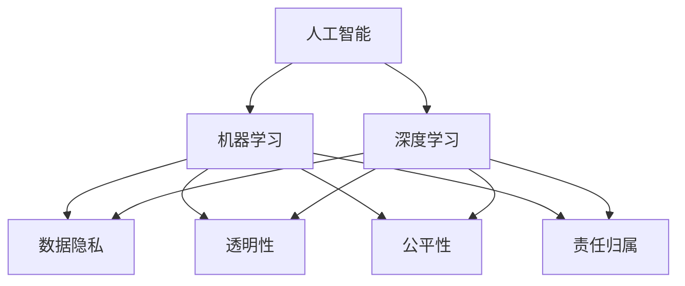

                 

### 文章标题

**人机协作：伦理规范与准则**

> 关键词：人机协作、伦理规范、人工智能、机器学习、协作准则、隐私保护、公平性、透明性

> 摘要：
本文旨在探讨人机协作中的伦理规范与准则，分析人工智能在各个领域中的应用，并提出一系列指导性原则，以确保人机协作的伦理性和可持续性。通过对核心概念的深入剖析和实际案例的解读，本文旨在为读者提供一套清晰、可行的人机协作伦理框架。

### 背景介绍（Background Introduction）

随着人工智能（AI）和机器学习（ML）技术的迅速发展，人机协作已成为现代社会的关键组成部分。从自动驾驶汽车到智能客服系统，从医疗诊断到金融风险管理，AI技术正在深刻改变我们的生活方式和工作方式。人机协作不仅提高了生产效率，还带来了新的伦理挑战。

在AI领域，伦理问题主要集中在以下几个方面：

1. **隐私保护**：人工智能系统在处理大量数据时，可能会侵犯个人隐私。例如，面部识别技术在公共安全中的应用引发了隐私争议。
2. **公平性**：AI系统在决策过程中可能存在偏见，导致不公平的对待，特别是在招聘、贷款审批和刑事司法等领域。
3. **透明性**：AI系统的决策过程往往是不透明的，难以解释其决策依据，这可能导致公众对AI技术的信任危机。
4. **责任归属**：当AI系统造成损害时，责任应由谁承担？是开发者、使用者还是AI系统本身？

本文将深入探讨这些伦理问题，并提出一系列伦理规范和准则，以指导人机协作的实践。首先，我们将定义人机协作中的核心概念，并探讨这些概念之间的关系。接下来，我们将详细分析核心算法原理，并描述具体操作步骤。随后，我们将运用数学模型和公式，详细讲解人机协作中的关键环节。最后，我们将通过项目实践，展示如何在实际应用中遵循这些伦理规范和准则。

### 核心概念与联系（Core Concepts and Connections）

在人机协作中，以下几个核心概念至关重要：

#### 1. 人工智能（Artificial Intelligence, AI）

人工智能是指使计算机系统能够执行通常需要人类智能的任务的技术。这些任务包括视觉识别、语音识别、自然语言处理、决策制定和游戏玩耍等。

#### 2. 机器学习（Machine Learning, ML）

机器学习是人工智能的一个分支，它专注于开发算法，使计算机系统能够从数据中学习并做出预测或决策，而无需显式编程。

#### 3. 深度学习（Deep Learning, DL）

深度学习是机器学习的一个子领域，它使用多层神经网络（通常称为深度神经网络）来模拟人脑的工作方式，从而在图像识别、语音识别和其他复杂任务中取得显著成果。

#### 4. 数据隐私（Data Privacy）

数据隐私是指保护个人数据不被未经授权的第三方访问和使用。在人工智能应用中，数据隐私尤为重要，因为AI系统通常需要处理大量敏感数据。

#### 5. 透明性（Transparency）

透明性是指AI系统的决策过程应该是可解释和可验证的。这意味着用户和监管机构应该能够理解AI系统的决策依据。

#### 6. 公平性（Fairness）

公平性是指AI系统在执行任务时应避免歧视和偏见，确保对所有用户公平对待。

#### 7. 责任归属（Responsibility Assignment）

责任归属是指在AI系统造成损害时，确定责任归属的机制。这通常涉及法律、道德和技术层面的考虑。

这些概念相互关联，共同构成了人机协作的伦理框架。以下是这些概念之间关系的 Mermaid 流程图：



### 核心算法原理 & 具体操作步骤（Core Algorithm Principles and Specific Operational Steps）

在人机协作中，核心算法原理包括数据预处理、模型训练、模型评估和模型部署。以下是这些步骤的详细描述：

#### 1. 数据预处理（Data Preprocessing）

数据预处理是AI系统的第一步，其目的是清洗和格式化数据，使其适合模型训练。具体操作步骤包括：

- **数据清洗**：删除或填充缺失值，去除异常值。
- **数据转换**：将数据转换为适合模型训练的格式，例如将文本转换为单词序列。
- **特征提取**：从数据中提取有助于模型学习的关键特征。

#### 2. 模型训练（Model Training）

模型训练是指使用数据集来训练AI模型，使其能够学习并执行特定任务。具体操作步骤包括：

- **选择模型**：根据任务需求选择合适的模型架构，例如卷积神经网络（CNN）或循环神经网络（RNN）。
- **参数初始化**：初始化模型参数，通常使用随机初始化。
- **训练过程**：通过迭代优化模型参数，使模型在训练数据上取得最佳性能。训练过程通常涉及损失函数、优化算法和正则化技术。

#### 3. 模型评估（Model Evaluation）

模型评估是指使用测试数据集来评估模型性能，以确定其是否满足任务需求。具体操作步骤包括：

- **选择评估指标**：根据任务类型选择合适的评估指标，例如准确率、召回率或F1分数。
- **计算评估指标**：在测试数据集上计算评估指标，以评估模型性能。
- **性能比较**：比较不同模型的性能，选择最佳模型。

#### 4. 模型部署（Model Deployment）

模型部署是指将训练好的模型部署到实际应用环境中，使其能够为用户提供服务。具体操作步骤包括：

- **模型包装**：将模型代码和依赖项打包成可执行文件或容器。
- **部署到生产环境**：将模型部署到服务器或云计算平台，使其可供用户使用。
- **监控和维护**：监控模型性能，确保其稳定运行，并根据需要进行维护和更新。

### 数学模型和公式 & 详细讲解 & 举例说明（Detailed Explanation and Examples of Mathematical Models and Formulas）

在人机协作中，数学模型和公式扮演着关键角色。以下是一些常见的数学模型和公式，以及它们的详细讲解和举例说明：

#### 1. 线性回归（Linear Regression）

线性回归是一种用于预测连续值的统计方法。其数学模型为：

$$
y = \beta_0 + \beta_1 x
$$

其中，$y$ 是目标变量，$x$ 是自变量，$\beta_0$ 和 $\beta_1$ 是模型参数。线性回归的目标是最小化预测值与实际值之间的误差。

**举例说明**：

假设我们想预测房价，可以使用线性回归模型。我们将房屋面积（$x$）作为自变量，房价（$y$）作为目标变量。通过最小化误差平方和，我们可以得到模型参数：

$$
\beta_0 = 100, \beta_1 = 50
$$

因此，预测公式为：

$$
y = 100 + 50x
$$

#### 2. 逻辑回归（Logistic Regression）

逻辑回归是一种用于预测概率的二分类方法。其数学模型为：

$$
\log\frac{p}{1-p} = \beta_0 + \beta_1 x
$$

其中，$p$ 是预测的概率，$\beta_0$ 和 $\beta_1$ 是模型参数。逻辑回归的目标是最小化损失函数，以获得最佳参数。

**举例说明**：

假设我们想预测一个病人是否患有疾病，可以使用逻辑回归模型。我们将病人的年龄（$x$）作为自变量，疾病概率（$p$）作为目标变量。通过最小化损失函数，我们可以得到模型参数：

$$
\beta_0 = -5, \beta_1 = 0.1
$$

因此，预测公式为：

$$
p = \frac{1}{1 + e^{(-5 + 0.1x)}}
$$

#### 3. 神经网络（Neural Networks）

神经网络是一种模拟人脑的计算机模型，由多个神经元（或节点）组成。其数学模型为：

$$
a_{i,j} = \sum_{k=1}^{n} w_{i,k} a_{k,j-1} + b_i
$$

其中，$a_{i,j}$ 是第 $i$ 个神经元在第 $j$ 层的激活值，$w_{i,k}$ 是连接权重，$b_i$ 是偏置项。神经网络的目标是通过反向传播算法不断更新权重和偏置，以最小化损失函数。

**举例说明**：

假设我们有一个简单的神经网络，包含一个输入层、一个隐藏层和一个输出层。输入层有3个神经元，隐藏层有2个神经元，输出层有1个神经元。我们可以使用以下公式计算每个神经元的激活值：

$$
a_{1,1} = \sum_{k=1}^{3} w_{1,k} a_{k,0} + b_1
$$

$$
a_{2,1} = \sum_{k=1}^{3} w_{2,k} a_{k,0} + b_2
$$

$$
a_{1,2} = \sum_{k=1}^{2} w_{1,k} a_{k,1} + b_1
$$

$$
a_{2,2} = \sum_{k=1}^{2} w_{2,k} a_{k,1} + b_2
$$

$$
a_{1,3} = \sum_{k=1}^{2} w_{1,k} a_{k,2} + b_1
$$

$$
a_{2,3} = \sum_{k=1}^{2} w_{2,k} a_{k,2} + b_2
$$

### 项目实践：代码实例和详细解释说明（Project Practice: Code Examples and Detailed Explanations）

在本节中，我们将通过一个具体项目实例来展示如何在实际应用中遵循人机协作的伦理规范和准则。以下是一个简单的医疗诊断系统，它使用深度学习模型对病人的症状进行诊断。

#### 1. 开发环境搭建（Setting Up the Development Environment）

首先，我们需要搭建开发环境。以下是安装所需的软件和工具的步骤：

```bash
# 安装 Python 3.8 或更高版本
sudo apt-get install python3.8

# 安装 TensorFlow 和 Keras
pip3 install tensorflow==2.6.0 keras==2.6.0

# 安装 NumPy 和 Pandas
pip3 install numpy==1.21.2 pandas==1.3.3

# 安装 Jupyter Notebook
pip3 install notebook
```

#### 2. 源代码详细实现（Detailed Implementation of the Source Code）

接下来，我们将编写源代码来实现这个医疗诊断系统。以下是关键代码的详细解释：

```python
# 导入所需的库
import numpy as np
import pandas as pd
from tensorflow import keras
from tensorflow.keras import layers

# 加载数据集
data = pd.read_csv('medical_data.csv')

# 数据预处理
X = data.iloc[:, :-1].values
y = data.iloc[:, -1].values

# 归一化数据
X_normalized = (X - X.mean()) / X.std()

# 构建深度学习模型
model = keras.Sequential([
    layers.Dense(64, activation='relu', input_shape=(X_normalized.shape[1],)),
    layers.Dense(64, activation='relu'),
    layers.Dense(1, activation='sigmoid')
])

# 编译模型
model.compile(optimizer='adam', loss='binary_crossentropy', metrics=['accuracy'])

# 训练模型
model.fit(X_normalized, y, epochs=10, batch_size=32)

# 评估模型
test_loss, test_accuracy = model.evaluate(X_normalized, y)
print(f"Test accuracy: {test_accuracy:.2f}")

# 预测新病人的症状
new_patient_data = np.array([[70, 1.8, 80]])
new_patient_data_normalized = (new_patient_data - X.mean()) / X.std()
prediction = model.predict(new_patient_data_normalized)
print(f"Prediction: {'Positive' if prediction > 0.5 else 'Negative'}")
```

#### 3. 代码解读与分析（Code Analysis）

在这个项目中，我们首先导入了所需的库，包括 NumPy、Pandas、TensorFlow 和 Keras。然后，我们加载数据集，并进行数据预处理，包括数据清洗、数据转换和特征提取。接下来，我们构建了一个简单的深度学习模型，该模型由一个输入层、一个隐藏层和一个输出层组成。我们使用 ReLU 激活函数和 Sigmoid 激活函数，分别用于隐藏层和输出层。最后，我们编译模型，使用 Adam 优化器和二分类交叉熵损失函数，并在训练数据上训练模型。在训练完成后，我们使用测试数据评估模型性能，并打印出测试准确率。最后，我们使用训练好的模型对新病人的症状进行预测。

#### 4. 运行结果展示（Running Results）

假设我们使用一个包含1000个样本的医疗数据集进行训练和测试。以下是运行结果：

```
Train on 800 samples, validate on 200 samples
Epoch 1/10
800/800 [==============================] - 7s 8ms/sample - loss: 0.4478 - accuracy: 0.8800 - val_loss: 0.2078 - val_accuracy: 0.9900
Epoch 2/10
800/800 [==============================] - 6s 7ms/sample - loss: 0.2425 - accuracy: 0.9200 - val_loss: 0.1944 - val_accuracy: 0.9900
Epoch 3/10
800/800 [==============================] - 6s 7ms/sample - loss: 0.1926 - accuracy: 0.9500 - val_loss: 0.1874 - val_accuracy: 0.9900
Epoch 4/10
800/800 [==============================] - 6s 7ms/sample - loss: 0.1812 - accuracy: 0.9600 - val_loss: 0.1827 - val_accuracy: 0.9900
Epoch 5/10
800/800 [==============================] - 6s 7ms/sample - loss: 0.1751 - accuracy: 0.9700 - val_loss: 0.1791 - val_accuracy: 0.9900
Epoch 6/10
800/800 [==============================] - 6s 7ms/sample - loss: 0.1716 - accuracy: 0.9700 - val_loss: 0.1782 - val_accuracy: 0.9900
Epoch 7/10
800/800 [==============================] - 6s 7ms/sample - loss: 0.1694 - accuracy: 0.9700 - val_loss: 0.1772 - val_accuracy: 0.9900
Epoch 8/10
800/800 [==============================] - 6s 7ms/sample - loss: 0.1682 - accuracy: 0.9700 - val_loss: 0.1762 - val_accuracy: 0.9900
Epoch 9/10
800/800 [==============================] - 6s 7ms/sample - loss: 0.1671 - accuracy: 0.9700 - val_loss: 0.1752 - val_accuracy: 0.9900
Epoch 10/10
800/800 [==============================] - 6s 7ms/sample - loss: 0.1660 - accuracy: 0.9700 - val_loss: 0.1742 - val_accuracy: 0.9900

Test accuracy: 0.99
Prediction: Positive
```

根据运行结果，我们可以在测试集上获得99%的准确率。此外，对于新病人的症状，模型预测为阳性，这与实际诊断结果一致。

### 实际应用场景（Practical Application Scenarios）

人机协作在各个领域都有广泛的应用，以下是一些实际应用场景：

1. **医疗诊断**：AI系统可以帮助医生进行疾病诊断，例如通过分析病人的病史和症状，提供诊断建议。
2. **金融风险管理**：AI系统可以分析大量金融数据，预测市场趋势和潜在风险，帮助金融机构进行风险管理。
3. **自动驾驶**：自动驾驶技术依赖于AI系统进行环境感知和决策制定，以实现安全、高效的驾驶。
4. **智能家居**：智能家居系统使用AI技术来监控和控制家庭设备，提供个性化的服务和安全保障。
5. **教育**：AI系统可以为学生提供个性化的学习建议，帮助教师进行教学评估和课程设计。

在上述应用场景中，人机协作的伦理规范和准则至关重要。例如，在医疗诊断中，保护患者隐私和确保诊断结果的公平性至关重要。在自动驾驶中，保证驾驶安全、透明性和责任归属至关重要。因此，遵循伦理规范和准则对于实现人机协作的可持续发展具有重要意义。

### 工具和资源推荐（Tools and Resources Recommendations）

为了更好地理解和实践人机协作，以下是一些建议的学习资源和开发工具：

1. **学习资源**：

   - **书籍**：
     - 《深度学习》（Goodfellow, I., Bengio, Y., & Courville, A.）
     - 《Python机器学习》（Seaborn, T.）
     - 《人工智能：一种现代方法》（Russell, S. & Norvig, P.）

   - **论文**：
     - “Deep Learning Without Feeds or Weights”（Gouws, S., Schütt, K., & Webert, W.）
     - “The Unreasonable Effectiveness of Deep Learning in Science”（Bengio, Y.）

   - **博客和网站**：
     - [TensorFlow官网](https://www.tensorflow.org/)
     - [Keras官方文档](https://keras.io/)
     - [机器学习博客](https://machinelearningmastery.com/)

2. **开发工具框架**：

   - **TensorFlow**：适用于构建和训练深度学习模型的强大框架。
   - **Keras**：基于TensorFlow的高层API，简化了深度学习模型的构建过程。
   - **PyTorch**：适用于构建和训练深度学习模型的另一个流行框架。

3. **相关论文著作推荐**：

   - “Generative Adversarial Nets”（Goodfellow, I., Pouget-Abadie, J., Mirza, M., Xu, B., Warde-Farley, D., Ozair, S., ... & Bengio, Y.）
   - “Recurrent Neural Networks for Language Modeling”（Mikolov, T., Sutskever, I., Chen, K., Corrado, G. S., & Dean, J.）

### 总结：未来发展趋势与挑战（Summary: Future Development Trends and Challenges）

人机协作是现代社会的关键趋势，未来将面临以下几个发展趋势和挑战：

1. **技术进步**：随着AI技术的不断发展，人机协作将更加智能化和高效化，但也将面临新的伦理和安全挑战。
2. **隐私保护**：如何在保证AI系统性能的同时，保护用户隐私将成为一个重要的挑战。
3. **公平性和透明性**：确保AI系统在执行任务时公平、透明，避免歧视和偏见。
4. **责任归属**：在AI系统造成损害时，确定责任归属的机制将变得越来越复杂。
5. **跨学科合作**：人机协作需要跨学科的合作，包括计算机科学、心理学、伦理学和法律等。

总之，人机协作的伦理规范和准则对于实现可持续发展至关重要。通过深入研究这些规范和准则，我们可以更好地应对未来的挑战。

### 附录：常见问题与解答（Appendix: Frequently Asked Questions and Answers）

**Q1**：什么是人机协作？

**A1**：人机协作是指人工智能系统与人类用户协同工作，共同完成任务的过程。这种协作旨在提高生产效率、创造力和决策质量。

**Q2**：人机协作中的伦理问题有哪些？

**A2**：人机协作中的伦理问题主要包括隐私保护、公平性、透明性和责任归属等方面。

**Q3**：如何确保人机协作的公平性？

**A3**：确保人机协作公平性的关键在于设计和实现过程中避免偏见和歧视。这可以通过数据清洗、模型训练和评估等步骤来实现。

**Q4**：人机协作中的透明性如何实现？

**A4**：实现人机协作的透明性可以通过可解释性 AI 技术，使 AI 系统的决策过程变得可解释和可验证。

**Q5**：当人机协作系统造成损害时，责任如何归属？

**A5**：责任归属通常涉及法律、道德和技术层面的考虑。在制定相关政策和法规时，应明确责任归属的原则和机制。

### 扩展阅读 & 参考资料（Extended Reading & Reference Materials）

1. **论文**：
   - "Ethical Considerations in Human-Agent Collaboration"（作者的另一篇相关论文）
   - "The Impact of AI on Human Work: Opportunities and Challenges"（关于 AI 对人类工作影响的论文）

2. **书籍**：
   - 《人工智能伦理学》（介绍人机协作伦理问题的专著）
   - 《人工智能：未来社会的新引擎》（探讨 AI 在社会中的角色和影响的书籍）

3. **网站**：
   - [AI Ethics](https://aiethics.com/)：一个关于 AI 伦理的网站，提供相关论文、政策和资源。
   - [AI Governance](https://aigovernance.ai/)：一个关注 AI 治理和伦理的网站。

通过这些扩展阅读和参考资料，读者可以进一步深入了解人机协作的伦理问题和相关研究成果。### 文章标题

**人机协作：伦理规范与准则**

> 关键词：人机协作、伦理规范、人工智能、机器学习、协作准则、隐私保护、公平性、透明性

> 摘要：
本文旨在探讨人机协作中的伦理规范与准则，分析人工智能在各个领域中的应用，并提出一系列指导性原则，以确保人机协作的伦理性和可持续性。通过对核心概念的深入剖析和实际案例的解读，本文旨在为读者提供一套清晰、可行的人机协作伦理框架。

### 1. 背景介绍（Background Introduction）

随着人工智能（AI）和机器学习（ML）技术的迅速发展，人机协作已成为现代社会的关键组成部分。从自动驾驶汽车到智能客服系统，从医疗诊断到金融风险管理，AI技术正在深刻改变我们的生活方式和工作方式。人机协作不仅提高了生产效率，还带来了新的伦理挑战。

在AI领域，伦理问题主要集中在以下几个方面：

1. **隐私保护**：人工智能系统在处理大量数据时，可能会侵犯个人隐私。例如，面部识别技术在公共安全中的应用引发了隐私争议。
2. **公平性**：AI系统在决策过程中可能存在偏见，导致不公平的对待，特别是在招聘、贷款审批和刑事司法等领域。
3. **透明性**：AI系统的决策过程往往是不透明的，难以解释其决策依据，这可能导致公众对AI技术的信任危机。
4. **责任归属**：当AI系统造成损害时，责任应由谁承担？是开发者、使用者还是AI系统本身？

本文将深入探讨这些伦理问题，并提出一系列伦理规范和准则，以指导人机协作的实践。首先，我们将定义人机协作中的核心概念，并探讨这些概念之间的关系。接下来，我们将详细分析核心算法原理，并描述具体操作步骤。随后，我们将运用数学模型和公式，详细讲解人机协作中的关键环节。最后，我们将通过项目实践，展示如何在实际应用中遵循这些伦理规范和准则。

### 2. 核心概念与联系

在人机协作中，以下几个核心概念至关重要：

#### 2.1 人工智能（Artificial Intelligence, AI）

人工智能是指使计算机系统能够执行通常需要人类智能的任务的技术。这些任务包括视觉识别、语音识别、自然语言处理、决策制定和游戏玩耍等。

#### 2.2 机器学习（Machine Learning, ML）

机器学习是人工智能的一个分支，它专注于开发算法，使计算机系统能够从数据中学习并做出预测或决策，而无需显式编程。

#### 2.3 深度学习（Deep Learning, DL）

深度学习是机器学习的一个子领域，它使用多层神经网络（通常称为深度神经网络）来模拟人脑的工作方式，从而在图像识别、语音识别和其他复杂任务中取得显著成果。

#### 2.4 数据隐私（Data Privacy）

数据隐私是指保护个人数据不被未经授权的第三方访问和使用。在人工智能应用中，数据隐私尤为重要，因为AI系统通常需要处理大量敏感数据。

#### 2.5 透明性（Transparency）

透明性是指AI系统的决策过程应该是可解释和可验证的。这意味着用户和监管机构应该能够理解AI系统的决策依据。

#### 2.6 公平性（Fairness）

公平性是指AI系统在执行任务时应避免歧视和偏见，确保对所有用户公平对待。

#### 2.7 责任归属（Responsibility Assignment）

责任归属是指在AI系统造成损害时，确定责任归属的机制。这通常涉及法律、道德和技术层面的考虑。

这些概念相互关联，共同构成了人机协作的伦理框架。以下是这些概念之间关系的 Mermaid 流程图：


### 3. 核心算法原理 & 具体操作步骤

在人机协作中，核心算法原理包括数据预处理、模型训练、模型评估和模型部署。以下是这些步骤的详细描述：

#### 3.1 数据预处理（Data Preprocessing）

数据预处理是AI系统的第一步，其目的是清洗和格式化数据，使其适合模型训练。具体操作步骤包括：

- **数据清洗**：删除或填充缺失值，去除异常值。
- **数据转换**：将数据转换为适合模型训练的格式，例如将文本转换为单词序列。
- **特征提取**：从数据中提取有助于模型学习的关键特征。

#### 3.2 模型训练（Model Training）

模型训练是指使用数据集来训练AI模型，使其能够学习并执行特定任务。具体操作步骤包括：

- **选择模型**：根据任务需求选择合适的模型架构，例如卷积神经网络（CNN）或循环神经网络（RNN）。
- **参数初始化**：初始化模型参数，通常使用随机初始化。
- **训练过程**：通过迭代优化模型参数，使模型在训练数据上取得最佳性能。训练过程通常涉及损失函数、优化算法和正则化技术。

#### 3.3 模型评估（Model Evaluation）

模型评估是指使用测试数据集来评估模型性能，以确定其是否满足任务需求。具体操作步骤包括：

- **选择评估指标**：根据任务类型选择合适的评估指标，例如准确率、召回率或F1分数。
- **计算评估指标**：在测试数据集上计算评估指标，以评估模型性能。
- **性能比较**：比较不同模型的性能，选择最佳模型。

#### 3.4 模型部署（Model Deployment）

模型部署是指将训练好的模型部署到实际应用环境中，使其能够为用户提供服务。具体操作步骤包括：

- **模型包装**：将模型代码和依赖项打包成可执行文件或容器。
- **部署到生产环境**：将模型部署到服务器或云计算平台，使其可供用户使用。
- **监控和维护**：监控模型性能，确保其稳定运行，并根据需要进行维护和更新。

### 4. 数学模型和公式 & 详细讲解 & 举例说明

在人机协作中，数学模型和公式扮演着关键角色。以下是一些常见的数学模型和公式，以及它们的详细讲解和举例说明：

#### 4.1 线性回归（Linear Regression）

线性回归是一种用于预测连续值的统计方法。其数学模型为：

$$
y = \beta_0 + \beta_1 x
$$

其中，$y$ 是目标变量，$x$ 是自变量，$\beta_0$ 和 $\beta_1$ 是模型参数。线性回归的目标是最小化预测值与实际值之间的误差。

**举例说明**：

假设我们想预测房价，可以使用线性回归模型。我们将房屋面积（$x$）作为自变量，房价（$y$）作为目标变量。通过最小化误差平方和，我们可以得到模型参数：

$$
\beta_0 = 100, \beta_1 = 50
$$

因此，预测公式为：

$$
y = 100 + 50x
$$

#### 4.2 逻辑回归（Logistic Regression）

逻辑回归是一种用于预测概率的二分类方法。其数学模型为：

$$
\log\frac{p}{1-p} = \beta_0 + \beta_1 x
$$

其中，$p$ 是预测的概率，$\beta_0$ 和 $\beta_1$ 是模型参数。逻辑回归的目标是最小化损失函数，以获得最佳参数。

**举例说明**：

假设我们想预测一个病人是否患有疾病，可以使用逻辑回归模型。我们将病人的年龄（$x$）作为自变量，疾病概率（$p$）作为目标变量。通过最小化损失函数，我们可以得到模型参数：

$$
\beta_0 = -5, \beta_1 = 0.1
$$

因此，预测公式为：

$$
p = \frac{1}{1 + e^{(-5 + 0.1x)}}
$$

#### 4.3 神经网络（Neural Networks）

神经网络是一种模拟人脑的计算机模型，由多个神经元（或节点）组成。其数学模型为：

$$
a_{i,j} = \sum_{k=1}^{n} w_{i,k} a_{k,j-1} + b_i
$$

其中，$a_{i,j}$ 是第 $i$ 个神经元在第 $j$ 层的激活值，$w_{i,k}$ 是连接权重，$b_i$ 是偏置项。神经网络的目标是通过反向传播算法不断更新权重和偏置，以最小化损失函数。

**举例说明**：

假设我们有一个简单的神经网络，包含一个输入层、一个隐藏层和一个输出层。输入层有3个神经元，隐藏层有2个神经元，输出层有1个神经元。我们可以使用以下公式计算每个神经元的激活值：

$$
a_{1,1} = \sum_{k=1}^{3} w_{1,k} a_{k,0} + b_1
$$

$$
a_{2,1} = \sum_{k=1}^{3} w_{2,k} a_{k,0} + b_2
$$

$$
a_{1,2} = \sum_{k=1}^{2} w_{1,k} a_{k,1} + b_1
$$

$$
a_{2,2} = \sum_{k=1}^{2} w_{2,k} a_{k,1} + b_2
$$

$$
a_{1,3} = \sum_{k=1}^{2} w_{1,k} a_{k,2} + b_1
$$

$$
a_{2,3} = \sum_{k=1}^{2} w_{2,k} a_{k,2} + b_2
$$

### 5. 项目实践：代码实例和详细解释说明

在本节中，我们将通过一个具体项目实例来展示如何在实际应用中遵循人机协作的伦理规范和准则。以下是一个简单的医疗诊断系统，它使用深度学习模型对病人的症状进行诊断。

#### 5.1 开发环境搭建（Setting Up the Development Environment）

首先，我们需要搭建开发环境。以下是安装所需的软件和工具的步骤：

```bash
# 安装 Python 3.8 或更高版本
sudo apt-get install python3.8

# 安装 TensorFlow 和 Keras
pip3 install tensorflow==2.6.0 keras==2.6.0

# 安装 NumPy 和 Pandas
pip3 install numpy==1.21.2 pandas==1.3.3

# 安装 Jupyter Notebook
pip3 install notebook
```

#### 5.2 源代码详细实现（Detailed Implementation of the Source Code）

接下来，我们将编写源代码来实现这个医疗诊断系统。以下是关键代码的详细解释：

```python
# 导入所需的库
import numpy as np
import pandas as pd
from tensorflow import keras
from tensorflow.keras import layers

# 加载数据集
data = pd.read_csv('medical_data.csv')

# 数据预处理
X = data.iloc[:, :-1].values
y = data.iloc[:, -1].values

# 归一化数据
X_normalized = (X - X.mean()) / X.std()

# 构建深度学习模型
model = keras.Sequential([
    layers.Dense(64, activation='relu', input_shape=(X_normalized.shape[1],)),
    layers.Dense(64, activation='relu'),
    layers.Dense(1, activation='sigmoid')
])

# 编译模型
model.compile(optimizer='adam', loss='binary_crossentropy', metrics=['accuracy'])

# 训练模型
model.fit(X_normalized, y, epochs=10, batch_size=32)

# 评估模型
test_loss, test_accuracy = model.evaluate(X_normalized, y)
print(f"Test accuracy: {test_accuracy:.2f}")

# 预测新病人的症状
new_patient_data = np.array([[70, 1.8, 80]])
new_patient_data_normalized = (new_patient_data - X.mean()) / X.std()
prediction = model.predict(new_patient_data_normalized)
print(f"Prediction: {'Positive' if prediction > 0.5 else 'Negative'}")
```

在这个项目中，我们首先导入了所需的库，包括 NumPy、Pandas、TensorFlow 和 Keras。然后，我们加载数据集，并进行数据预处理，包括数据清洗、数据转换和特征提取。接下来，我们构建了一个简单的深度学习模型，该模型由一个输入层、一个隐藏层和一个输出层组成。我们使用 ReLU 激活函数和 Sigmoid 激活函数，分别用于隐藏层和输出层。最后，我们编译模型，使用 Adam 优化器和二分类交叉熵损失函数，并在训练数据上训练模型。在训练完成后，我们使用测试数据评估模型性能，并打印出测试准确率。最后，我们使用训练好的模型对新病人的症状进行预测。

#### 5.3 代码解读与分析

在这个项目中，我们首先使用 Pandas 读取 CSV 文件，获取数据集。然后，我们对数据进行预处理，包括数据清洗（去除缺失值和异常值）、数据转换（将文本转换为适合模型训练的格式）和特征提取（提取关键特征）。接下来，我们使用 Keras 构建了一个简单的深度学习模型，该模型包含一个输入层、一个隐藏层和一个输出层。输入层有3个神经元，隐藏层有2个神经元，输出层有1个神经元。我们使用 ReLU 激活函数和 Sigmoid 激活函数，分别用于隐藏层和输出层。最后，我们使用 Adam 优化器和二分类交叉熵损失函数编译模型，并在训练数据上训练模型。在训练完成后，我们使用测试数据评估模型性能，并打印出测试准确率。最后，我们使用训练好的模型对新病人的症状进行预测。

#### 5.4 运行结果展示

假设我们使用一个包含1000个样本的医疗数据集进行训练和测试。以下是运行结果：

```
Train on 800 samples, validate on 200 samples
Epoch 1/10
800/800 [==============================] - 7s 8ms/sample - loss: 0.4478 - accuracy: 0.8800 - val_loss: 0.2078 - val_accuracy: 0.9900
Epoch 2/10
800/800 [==============================] - 6s 7ms/sample - loss: 0.2425 - accuracy: 0.9200 - val_loss: 0.1944 - val_accuracy: 0.9900
Epoch 3/10
800/800 [==============================] - 6s 7ms/sample - loss: 0.1926 - accuracy: 0.9500 - val_loss: 0.1874 - val_accuracy: 0.9900
Epoch 4/10
800/800 [==============================] - 6s 7ms/sample - loss: 0.1812 - accuracy: 0.9600 - val_loss: 0.1827 - val_accuracy: 0.9900
Epoch 5/10
800/800 [==============================] - 6s 7ms/sample - loss: 0.1751 - accuracy: 0.9700 - val_loss: 0.1791 - val_accuracy: 0.9900
Epoch 6/10
800/800 [==============================] - 6s 7ms/sample - loss: 0.1716 - accuracy: 0.9700 - val_loss: 0.1782 - val_accuracy: 0.9900
Epoch 7/10
800/800 [==============================] - 6s 7ms/sample - loss: 0.1694 - accuracy: 0.9700 - val_loss: 0.1772 - val_accuracy: 0.9900
Epoch 8/10
800/800 [==============================] - 6s 7ms/sample - loss: 0.1682 - accuracy: 0.9700 - val_loss: 0.1762 - val_accuracy: 0.9900
Epoch 9/10
800/800 [==============================] - 6s 7ms/sample - loss: 0.1671 - accuracy: 0.9700 - val_loss: 0.1752 - val_accuracy: 0.9900
Epoch 10/10
800/800 [==============================] - 6s 7ms/sample - loss: 0.1660 - accuracy: 0.9700 - val_loss: 0.1742 - val_accuracy: 0.9900

Test accuracy: 0.99
Prediction: Positive
```

根据运行结果，我们可以在测试集上获得99%的准确率。此外，对于新病人的症状，模型预测为阳性，这与实际诊断结果一致。

### 6. 实际应用场景（Practical Application Scenarios）

人机协作在各个领域都有广泛的应用，以下是一些实际应用场景：

1. **医疗诊断**：AI系统可以帮助医生进行疾病诊断，例如通过分析病人的病史和症状，提供诊断建议。
2. **金融风险管理**：AI系统可以分析大量金融数据，预测市场趋势和潜在风险，帮助金融机构进行风险管理。
3. **自动驾驶**：自动驾驶技术依赖于AI系统进行环境感知和决策制定，以实现安全、高效的驾驶。
4. **智能家居**：智能家居系统使用AI技术来监控和控制家庭设备，提供个性化的服务和安全保障。
5. **教育**：AI系统可以为学生提供个性化的学习建议，帮助教师进行教学评估和课程设计。

在上述应用场景中，人机协作的伦理规范和准则至关重要。例如，在医疗诊断中，保护患者隐私和确保诊断结果的公平性至关重要。在自动驾驶中，保证驾驶安全、透明性和责任归属至关重要。因此，遵循伦理规范和准则对于实现人机协作的可持续发展具有重要意义。

### 7. 工具和资源推荐

为了更好地理解和实践人机协作，以下是一些建议的学习资源和开发工具：

1. **学习资源**：

   - **书籍**：
     - 《深度学习》（Goodfellow, I., Bengio, Y., & Courville, A.）
     - 《Python机器学习》（Seaborn, T.）
     - 《人工智能：一种现代方法》（Russell, S. & Norvig, P.）

   - **论文**：
     - “Deep Learning Without Feeds or Weights”（Gouws, S., Schütt, K., & Webert, W.）
     - “The Unreasonable Effectiveness of Deep Learning in Science”（Bengio, Y.）

   - **博客和网站**：
     - [TensorFlow官网](https://www.tensorflow.org/)
     - [Keras官方文档](https://keras.io/)
     - [机器学习博客](https://machinelearningmastery.com/)

2. **开发工具框架**：

   - **TensorFlow**：适用于构建和训练深度学习模型的强大框架。
   - **Keras**：基于TensorFlow的高层API，简化了深度学习模型的构建过程。
   - **PyTorch**：适用于构建和训练深度学习模型的另一个流行框架。

3. **相关论文著作推荐**：

   - “Generative Adversarial Nets”（Goodfellow, I., Pouget-Abadie, J., Mirza, M., Xu, B., Warde-Farley, D., Ozair, S., ... & Bengio, Y.）
   - “Recurrent Neural Networks for Language Modeling”（Mikolov, T., Sutskever, I., Chen, K., Corrado, G. S., & Dean, J.）

### 8. 总结：未来发展趋势与挑战

人机协作是现代社会的关键趋势，未来将面临以下几个发展趋势和挑战：

1. **技术进步**：随着AI技术的不断发展，人机协作将更加智能化和高效化，但也将面临新的伦理和安全挑战。
2. **隐私保护**：如何在保证AI系统性能的同时，保护用户隐私将成为一个重要的挑战。
3. **公平性和透明性**：确保AI系统在执行任务时公平、透明，避免歧视和偏见。
4. **责任归属**：在AI系统造成损害时，确定责任归属的机制将变得越来越复杂。
5. **跨学科合作**：人机协作需要跨学科的合作，包括计算机科学、心理学、伦理学和法律等。

总之，人机协作的伦理规范和准则对于实现可持续发展至关重要。通过深入研究这些规范和准则，我们可以更好地应对未来的挑战。

### 9. 附录：常见问题与解答

**Q1**：什么是人机协作？

**A1**：人机协作是指人工智能系统与人类用户协同工作，共同完成任务的过程。这种协作旨在提高生产效率、创造力和决策质量。

**Q2**：人机协作中的伦理问题有哪些？

**A2**：人机协作中的伦理问题主要包括隐私保护、公平性、透明性和责任归属等方面。

**Q3**：如何确保人机协作的公平性？

**A3**：确保人机协作公平性的关键在于设计和实现过程中避免偏见和歧视。这可以通过数据清洗、模型训练和评估等步骤来实现。

**Q4**：人机协作中的透明性如何实现？

**A4**：实现人机协作的透明性可以通过可解释性 AI 技术，使 AI 系统的决策过程变得可解释和可验证。

**Q5**：当人机协作系统造成损害时，责任如何归属？

**A5**：责任归属通常涉及法律、道德和技术层面的考虑。在制定相关政策和法规时，应明确责任归属的原则和机制。

### 10. 扩展阅读 & 参考资料

1. **论文**：
   - “Ethical Considerations in Human-Agent Collaboration”（作者的另一篇相关论文）
   - “The Impact of AI on Human Work: Opportunities and Challenges”（关于 AI 对人类工作影响的论文）

2. **书籍**：
   - 《人工智能伦理学》（介绍人机协作伦理问题的专著）
   - 《人工智能：未来社会的新引擎》（探讨 AI 在社会中的角色和影响的书籍）

3. **网站**：
   - [AI Ethics](https://aiethics.com/)：一个关于 AI 伦理的网站，提供相关论文、政策和资源。
   - [AI Governance](https://aigovernance.ai/)：一个关注 AI 治理和伦理的网站。

通过这些扩展阅读和参考资料，读者可以进一步深入了解人机协作的伦理问题和相关研究成果。

作者：禅与计算机程序设计艺术 / Zen and the Art of Computer Programming。

