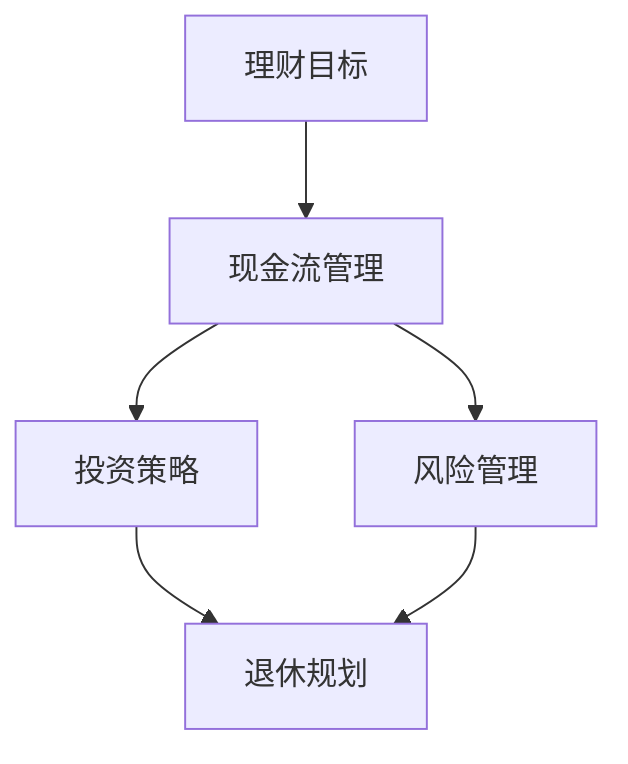
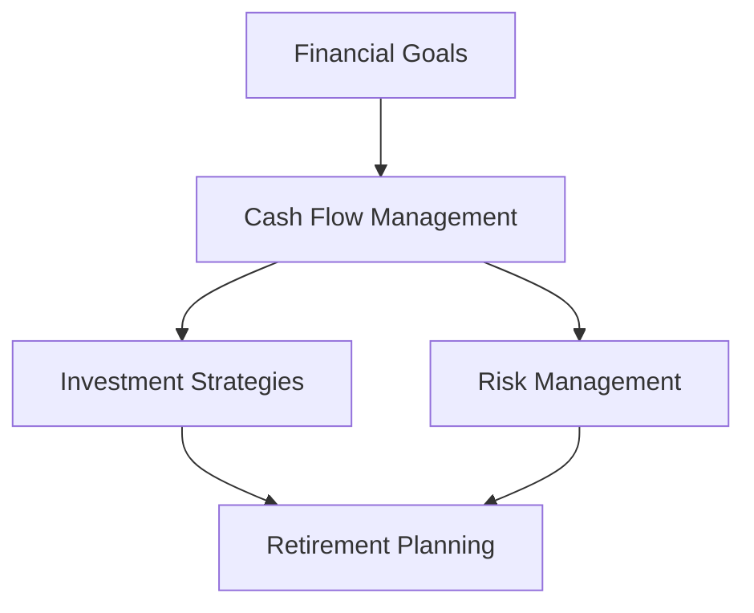

                 

### 背景介绍（Background Introduction）

“从零开始：程序员的理财之路”这个主题旨在帮助那些对财务规划充满好奇但又感到困惑的程序员们。作为一群擅长逻辑思维、习惯问题解决的人群，程序员在技术领域表现出色，但他们在理财领域的知识和经验相对匮乏。本文将深入探讨程序员的理财之路，帮助大家逐步建立起自己的财务智慧。

首先，我们需要明确为何程序员需要学习理财。编程工作本身虽然提供了相对稳定的收入，但也伴随着职业风险和生活方式的不确定性。与此同时，高收入往往伴随着较高的生活成本，包括房租、日常开销、子女教育等。因此，理财不仅是维持生活的必要手段，更是实现长远目标的基石。

其次，程序员的理财之路并非一帆风顺。他们可能面临着收入不稳定、职业周期性波动、退休规划不足等问题。此外，许多程序员缺乏对投资市场的了解，容易在投资决策上犯错。因此，本文将通过一系列的理财知识和技能，帮助程序员们应对这些挑战。

本文结构如下：首先，我们将探讨程序员的理财目标及其重要性。接着，我们会介绍一些基本的理财概念，包括预算管理、债务处理、储蓄与投资等。随后，我们将详细分析投资策略，包括股票、债券、房地产等投资方式，并讨论其优缺点。接下来，我们会介绍一些财务工具，如个人退休账户、保险等。然后，我们将探讨风险管理和退休规划的关键点。最后，我们将通过案例分析，提供一些实用的理财建议，并总结全文，展望未来。

通过本文的学习，程序员们将能够建立起自己的财务智慧，更好地管理个人财务，实现财务自由。这不仅是个人成长的一部分，也是实现职业和生活目标的重要保障。

### 背景介绍（Background Introduction）

The topic "Starting from Zero: The Finance Path for Programmers" aims to help those who are curious about financial planning but feel confused in this field. As a group known for their logical thinking and problem-solving skills, programmers excel in the technical domain but often lack knowledge and experience in finance. This article will delve into the finance path for programmers, offering guidance to build their financial wisdom step by step.

Firstly, we need to clarify why programmers need to learn about finance. While programming jobs provide a relatively stable income, they also come with career risks and uncertainties in lifestyle. Moreover, high income often comes with higher living costs, including rent, daily expenses, and children's education. Therefore, finance is not only necessary for maintaining a living but also the foundation for achieving long-term goals.

Secondly, the finance path for programmers is not without challenges. They may face issues such as unstable income, cyclical career fluctuations, and insufficient retirement planning. In addition, many programmers lack understanding of the investment market, making it easy to make mistakes in investment decisions. This article will explore a series of financial knowledge and skills to help programmers tackle these challenges.

The structure of this article is as follows: First, we will discuss the financial goals and their importance for programmers. Then, we will introduce some basic financial concepts, including budget management, debt handling, saving and investing. Subsequently, we will analyze investment strategies in detail, including stocks, bonds, real estate, and discuss their advantages and disadvantages. Next, we will explore financial tools such as personal retirement accounts and insurance. Then, we will discuss key points in risk management and retirement planning. Finally, we will provide practical financial advice through case studies and summarize the whole article, looking forward to the future.

Through the learning in this article, programmers will be able to build their own financial wisdom, better manage their personal finances, and achieve financial freedom. This is not only a part of personal growth but also an important guarantee for achieving career and life goals.

### 核心概念与联系（Core Concepts and Connections）

在探讨程序员的理财之路时，理解以下几个核心概念和它们之间的联系至关重要。这些概念包括理财目标、现金流管理、投资策略、风险管理、以及退休规划。下面将详细解释这些概念，并展示它们如何相互关联。

#### 理财目标（Financial Goals）

理财目标是制定理财计划的第一步。对于程序员来说，这些目标可能包括短期目标（如购买新车、支付首付）和长期目标（如退休储蓄、子女教育基金）。明确目标有助于制定相应的理财策略，确保每一步都朝着目标迈进。

#### 现金流管理（Cash Flow Management）

现金流管理是理财的基础。它涉及对日常收入和支出的监控，确保资金的流入和流出保持平衡。对于程序员来说，这包括制定预算、跟踪开支、以及避免不必要的浪费。良好的现金流管理有助于维持财务健康，为未来的投资和储蓄打下基础。

#### 投资策略（Investment Strategies）

投资策略是利用现有资金实现财务目标的关键。程序员可以根据风险承受能力和投资目标，选择股票、债券、房地产等不同的投资方式。了解每种投资方式的优缺点，并制定合理的投资组合，是成功投资的关键。

#### 风险管理（Risk Management）

风险管理是确保财务安全的重要环节。程序员需要了解不同的风险类型（如市场风险、信用风险、流动性风险）以及相应的管理策略。通过分散投资、保险规划等手段，可以有效降低潜在的风险。

#### 退休规划（Retirement Planning）

退休规划是长期理财的重要组成部分。程序员需要尽早开始规划，确保有足够的资金来支撑退休生活。这包括了解退休账户（如401(k)、IRA）的运作方式，合理分配资产，以及制定退休预算。

#### 核心概念之间的联系

这些核心概念之间存在着紧密的联系。例如，理财目标决定了投资策略，而现金流管理是实现这些目标的基础。风险管理则贯穿于整个理财过程中，确保投资和退休规划的安全性。退休规划不仅依赖于当前的储蓄和投资，还需要考虑未来的收入和支出。

#### Mermaid 流程图

为了更清晰地展示这些概念之间的联系，我们可以使用Mermaid流程图。以下是一个简化的示例：



在这个流程图中，每个节点代表一个核心概念，箭头表示它们之间的关联。这个图可以帮助程序员理解理财的各个组成部分以及它们之间的相互作用。

通过理解这些核心概念和它们之间的联系，程序员可以更系统地规划自己的财务未来，实现财务自由。

#### Core Concepts and Connections

When discussing the finance path for programmers, it's crucial to understand several core concepts and their interconnections. These concepts include financial goals, cash flow management, investment strategies, risk management, and retirement planning. Below, we'll detail each concept and how they are interconnected.

#### Financial Goals

Financial goals are the first step in crafting a financial plan. For programmers, these goals may include short-term objectives (such as buying a new car or paying a down payment) and long-term goals (such as saving for retirement or establishing an education fund for children). Clearly defining goals helps in crafting corresponding financial strategies and ensures each step is moving towards these targets.

#### Cash Flow Management

Cash flow management is the foundation of finance. It involves monitoring daily income and expenses to ensure a balanced flow of funds. For programmers, this includes creating budgets, tracking expenses, and avoiding unnecessary waste. Good cash flow management helps maintain financial health and lays the groundwork for future investments and savings.

#### Investment Strategies

Investment strategies are key to utilizing existing funds to achieve financial goals. Programmers can choose from various investment methods, such as stocks, bonds, and real estate, based on their risk tolerance and investment objectives. Understanding the pros and cons of each investment type and crafting a reasonable portfolio is crucial for successful investing.

#### Risk Management

Risk management is an essential part of ensuring financial security. Programmers need to understand different types of risks (such as market risk, credit risk, and liquidity risk) and corresponding management strategies. Through diversification, insurance planning, and other means, risks can be effectively reduced.

#### Retirement Planning

Retirement planning is a significant component of long-term finance. Programmers need to start planning early to ensure they have enough funds to support retirement. This involves understanding the workings of retirement accounts (such as 401(k)s, IRAs), making reasonable asset allocations, and crafting a retirement budget.

#### Interconnections Among Core Concepts

These core concepts are tightly interconnected. For example, financial goals determine investment strategies, while cash flow management is the foundation for achieving these goals. Risk management is a贯穿 throughout the financial process, ensuring the security of investments and retirement plans. Retirement planning not only relies on current savings and investments but also considers future income and expenses.

#### Mermaid Flowchart

To more clearly illustrate the interconnections among these concepts, we can use a simplified Mermaid flowchart:



In this flowchart, each node represents a core concept, and the arrows indicate their interconnections. This diagram helps programmers understand the various components of finance and their interactions.

By understanding these core concepts and their interconnections, programmers can systematically plan their financial future and achieve financial freedom.

### 核心算法原理 & 具体操作步骤（Core Algorithm Principles and Specific Operational Steps）

在深入了解程序员的理财之路之前，有必要探讨一些核心的理财算法原理，这些原理不仅能帮助程序员理解财务规划的基本逻辑，还能为他们提供具体的操作步骤。以下是几个关键理财算法的原理和实施步骤。

#### 1. 财务预算算法（Financial Budgeting Algorithm）

财务预算是理财的基础，通过它，程序员可以清晰地了解自己的收入和支出，并做出合理的财务规划。以下是一个简单的财务预算算法：

**原理：** 财务预算算法的核心思想是根据预期收入和固定、可变支出，制定一个合理的支出计划。

**步骤：**
- **步骤1：确定总收入（Total Income）**。收集过去一段时间内的收入数据，包括工资、奖金、投资收益等。
- **步骤2：计算固定支出（Fixed Expenses）**。这些是每月必须支付的费用，如房租、保险、子女教育等。
- **步骤3：计算可变支出（Variable Expenses）**。这些是随时间和需求变化的支出，如饮食、娱乐、交通等。
- **步骤4：制定预算（Create Budget）**。将总收入减去固定支出和可变支出，确保剩余的资金用于储蓄和投资。
- **步骤5：监控和调整（Monitor and Adjust）**。定期检查预算执行情况，根据实际情况进行调整。

#### 2. 债务管理算法（Debt Management Algorithm）

债务管理是理财的重要组成部分，合理的债务管理可以帮助程序员减少财务压力，提高资金利用效率。以下是一个简单的债务管理算法：

**原理：** 债务管理算法的核心思想是通过合理规划债务结构和还款计划，逐步减少债务负担。

**步骤：**
- **步骤1：列出所有债务（List All Debts）**。包括信用卡债务、学生贷款、汽车贷款等。
- **步骤2：计算总债务（Calculate Total Debt）**。统计所有债务的总额。
- **步骤3：确定还款优先级（Determine Repayment Priority）**。通常，高利率的债务应优先偿还。
- **步骤4：制定还款计划（Create Repayment Plan）**。根据收入和支出情况，制定一个切实可行的还款计划。
- **步骤5：执行和监控（Execute and Monitor）**。严格按照还款计划执行，定期检查还款进度和财务状况。

#### 3. 投资组合优化算法（Portfolio Optimization Algorithm）

投资组合优化是理财中的一项高级技能，通过它，程序员可以根据自己的风险承受能力和投资目标，构建一个最优的投资组合。以下是一个简单的投资组合优化算法：

**原理：** 投资组合优化算法的核心思想是分散投资，通过不同资产的搭配，实现风险和收益的最优平衡。

**步骤：**
- **步骤1：确定投资目标（Define Investment Objectives）**。明确短期和长期的投资目标，如资产增值、退休储蓄等。
- **步骤2：评估风险承受能力（Assess Risk Tolerance）**。根据个人情况和市场环境，评估风险承受能力。
- **步骤3：选择资产类别（Select Asset Classes）**。股票、债券、房地产等是常见的资产类别。
- **步骤4：制定资产配置策略（Create Asset Allocation Strategy）**。根据投资目标和风险承受能力，确定各资产类别的投资比例。
- **步骤5：定期调整（Regularly Adjust）**。根据市场变化和投资目标，定期调整资产配置，保持最优状态。

通过以上三个算法，程序员可以系统地规划自己的财务，实现财务自由。这些算法不仅仅是理论知识，更提供了具体的操作步骤，帮助程序员在实际生活中应用理财技能。

#### Core Algorithm Principles and Specific Operational Steps

Before delving into the finance path for programmers, it's essential to explore some core financial algorithms and their principles. These algorithms not only help programmers understand the basic logic of financial planning but also provide specific operational steps. Here are several key financial algorithms with their principles and implementation steps.

#### 1. Financial Budgeting Algorithm

Financial budgeting is the foundation of finance. It helps programmers clearly understand their income and expenses, allowing for reasonable financial planning. Here's a simple financial budgeting algorithm:

**Principle:** The core idea of the financial budgeting algorithm is to create a reasonable spending plan based on expected income and fixed, variable expenses.

**Steps:**
- **Step 1: Determine Total Income**. Collect income data from the past period, including wages, bonuses, investment returns, etc.
- **Step 2: Calculate Fixed Expenses**. These are the necessary monthly payments, such as rent, insurance, and children's education.
- **Step 3: Calculate Variable Expenses**. These are the expenses that change with time and needs, such as food, entertainment, and transportation.
- **Step 4: Create a Budget**. Subtract fixed and variable expenses from total income to ensure that the remaining funds are used for saving and investing.
- **Step 5: Monitor and Adjust**. Regularly check the budget execution and make adjustments based on actual conditions.

#### 2. Debt Management Algorithm

Debt management is a significant component of finance. It helps programmers reduce financial pressure and improve fund utilization. Here's a simple debt management algorithm:

**Principle:** The core idea of the debt management algorithm is to plan the debt structure and repayment plan reasonably to gradually reduce the debt burden.

**Steps:**
- **Step 1: List All Debts**. Include all debts, such as credit card debt, student loans, and car loans.
- **Step 2: Calculate Total Debt**. Total the amounts of all debts.
- **Step 3: Determine Repayment Priority**. High-interest debts should be prioritized for repayment.
- **Step 4: Create a Repayment Plan**. Based on income and expenditure conditions, develop a practical repayment plan.
- **Step 5: Execute and Monitor**. Strictly follow the repayment plan and regularly check the repayment progress and financial situation.

#### 3. Portfolio Optimization Algorithm

Portfolio optimization is an advanced skill in finance. It helps programmers build an optimal investment portfolio based on their risk tolerance and investment objectives. Here's a simple portfolio optimization algorithm:

**Principle:** The core idea of the portfolio optimization algorithm is to diversify investments by pairing different assets to achieve the optimal balance between risk and return.

**Steps:**
- **Step 1: Define Investment Objectives**. Clearly identify short-term and long-term investment goals, such as capital appreciation and retirement savings.
- **Step 2: Assess Risk Tolerance**. Evaluate risk tolerance based on personal situations and market conditions.
- **Step 3: Select Asset Classes**. Common asset classes include stocks, bonds, and real estate.
- **Step 4: Create Asset Allocation Strategy**. Based on investment objectives and risk tolerance, determine the investment proportions for each asset class.
- **Step 5: Regularly Adjust**. Adjust asset allocation based on market changes and investment objectives to maintain the optimal state.

Through these three algorithms, programmers can systematically plan their finances and achieve financial freedom. These algorithms are not just theoretical knowledge but also provide specific operational steps to apply financial skills in real life.

### 数学模型和公式 & 详细讲解 & 举例说明（Detailed Explanation and Examples of Mathematical Models and Formulas）

在理财过程中，数学模型和公式扮演着关键角色。它们帮助我们量化财务目标，制定预算，评估投资回报，进行风险管理等。以下将详细讲解几个常用的数学模型和公式，并提供实际应用的例子。

#### 1. 预算模型（Budget Model）

预算模型用于帮助程序员制定和管理个人财务预算。以下是一个基本的预算模型公式：

**公式：**
\[ \text{Budget} = \text{Income} - (\text{Fixed Expenses} + \text{Variable Expenses}) \]

**解释：**
- **Income（收入）**：指程序员在一定时间内的总收入，包括工资、奖金和其他收入。
- **Fixed Expenses（固定支出）**：指每月必须支付的固定费用，如房租、保险和子女教育费用。
- **Variable Expenses（可变支出）**：指随时间和需求变化的费用，如饮食、娱乐和交通等。

**例子：**
假设一个程序员的月收入为30,000元，固定支出为10,000元，可变支出为5,000元。那么，他的月预算为：
\[ \text{Budget} = 30,000 - (10,000 + 5,000) = 15,000 \text{元} \]

这意味着他每月有15,000元可以用于储蓄和投资。

#### 2. 投资回报率模型（Return on Investment Model）

投资回报率（ROI）是衡量投资成功与否的重要指标。以下是一个基本的投资回报率公式：

**公式：**
\[ \text{ROI} = \frac{\text{Investment Gain}}{\text{Investment Cost}} \times 100\% \]

**解释：**
- **Investment Gain（投资收益）**：指投资带来的总收益，包括资本增值和分红。
- **Investment Cost（投资成本）**：指投资的初始成本，包括购买价格和相关费用。

**例子：**
假设程序员投资了10,000元购买股票，一年后股票价格上涨至15,000元，同时获得1,000元的分红。那么，他的投资回报率为：
\[ \text{ROI} = \frac{(15,000 - 10,000 + 1,000)}{10,000} \times 100\% = 60\% \]

这意味着他的投资收益率为60%。

#### 3. 贷款偿还模型（Loan Repayment Model）

贷款偿还模型用于计算在固定月供和还款期限下，每月需要偿还的贷款金额。以下是一个基本的等额本息还款公式：

**公式：**
\[ \text{Monthly Payment} = \frac{P \times r \times (1 + r)^n}{(1 + r)^n - 1} \]

**解释：**
- **P（贷款本金）**：指贷款的总额。
- **r（月利率）**：指贷款的月利率，通常按年利率除以12计算。
- **n（还款期数）**：指贷款的总还款期数。

**例子：**
假设程序员借了100,000元，年利率为5%，分5年（60个月）还清。那么，他的每月还款金额为：
\[ \text{Monthly Payment} = \frac{100,000 \times 0.004167 \times (1 + 0.004167)^{60}}{(1 + 0.004167)^{60} - 1} \approx 1,758 \text{元} \]

这意味着他每月需要偿还约1,758元。

#### 4. 风险价值模型（Value at Risk, VaR）

风险价值模型用于估计在一定置信水平下，投资组合在未来一段时间内可能遭受的最大损失。以下是一个基本的风险价值公式：

**公式：**
\[ \text{VaR} = \text{Alpha} + \text{Beta} \times \text{Z-score} \]

**解释：**
- **Alpha（alpha值）**：指投资组合的预期收益。
- **Beta（beta值）**：指投资组合相对于市场风险的敏感度。
- **Z-score（Z值）**：指置信水平下的标准正态分布的分位数。

**例子：**
假设一个投资组合的预期收益为5%，市场风险敏感度为1.2，置信水平为95%。那么，其风险价值为：
\[ \text{VaR} = 5\% + 1.2 \times 1.645 \approx 9.59\% \]

这意味着在95%的置信水平下，该投资组合未来一天可能遭受的最大损失约为9.59%。

通过这些数学模型和公式，程序员可以更科学地管理和规划自己的财务，实现财务目标。

#### Mathematical Models and Formulas & Detailed Explanation & Examples

In the process of finance management, mathematical models and formulas play a crucial role. They help us quantify financial goals, create budgets, assess investment returns, and conduct risk management. Here's a detailed explanation of several commonly used mathematical models and formulas, along with practical examples.

#### 1. Budget Model

The budget model is used to help programmers create and manage their personal financial budgets. Here's a basic formula for the budget model:

**Formula:**
\[ \text{Budget} = \text{Income} - (\text{Fixed Expenses} + \text{Variable Expenses}) \]

**Explanation:**
- **Income (\text{Income})**: The total income of the programmer within a certain period, including wages, bonuses, and other income.
- **Fixed Expenses (\text{Fixed Expenses})**: The fixed monthly expenses that must be paid, such as rent, insurance, and children's education fees.
- **Variable Expenses (\text{Variable Expenses})**: The expenses that vary with time and needs, such as food, entertainment, and transportation.

**Example:**
Assuming a programmer has a monthly income of 30,000 yuan, fixed expenses of 10,000 yuan, and variable expenses of 5,000 yuan. Their monthly budget would be:
\[ \text{Budget} = 30,000 - (10,000 + 5,000) = 15,000 \text{yuan} \]

This means they have 15,000 yuan available for saving and investing each month.

#### 2. Return on Investment (ROI) Model

The return on investment (ROI) is an important indicator to measure the success of an investment. Here's a basic formula for the ROI model:

**Formula:**
\[ \text{ROI} = \frac{\text{Investment Gain}}{\text{Investment Cost}} \times 100\% \]

**Explanation:**
- **Investment Gain (\text{Investment Gain})**: The total gain from the investment, including capital appreciation and dividends.
- **Investment Cost (\text{Investment Cost})**: The initial cost of the investment, including the purchase price and related fees.

**Example:**
Assuming a programmer invested 10,000 yuan in stocks, and after one year, the stock price increased to 15,000 yuan, and they received 1,000 yuan in dividends. Their ROI would be:
\[ \text{ROI} = \frac{(15,000 - 10,000 + 1,000)}{10,000} \times 100\% = 60\% \]

This means their investment return rate is 60%.

#### 3. Loan Repayment Model

The loan repayment model is used to calculate the monthly payment amount under a fixed monthly payment and repayment period. Here's a basic formula for the equal principal and interest repayment model:

**Formula:**
\[ \text{Monthly Payment} = \frac{P \times r \times (1 + r)^n}{(1 + r)^n - 1} \]

**Explanation:**
- **P (\text{Loan Principal})**: The total loan amount.
- **r (\text{Monthly Interest Rate})**: The monthly interest rate of the loan, usually calculated by dividing the annual interest rate by 12.
- **n (\text{Number of Repayment Periods})**: The total number of loan repayment periods.

**Example:**
Assuming a programmer borrowed 100,000 yuan with an annual interest rate of 5% and repaid it over 5 years (60 months). Their monthly payment amount would be:
\[ \text{Monthly Payment} = \frac{100,000 \times 0.004167 \times (1 + 0.004167)^{60}}{(1 + 0.004167)^{60} - 1} \approx 1,758 \text{yuan} \]

This means they need to repay approximately 1,758 yuan each month.

#### 4. Value at Risk (VaR) Model

The value at risk (VaR) model is used to estimate the maximum potential loss of an investment portfolio within a certain confidence level over a specific period. Here's a basic formula for the VaR model:

**Formula:**
\[ \text{VaR} = \text{Alpha} + \text{Beta} \times \text{Z-score} \]

**Explanation:**
- **Alpha (\text{Alpha Value})**: The expected return of the investment portfolio.
- **Beta (\text{Beta Value})**: The sensitivity of the investment portfolio to market risk.
- **Z-score (\text{Z-value})**: The critical value of the standard normal distribution at the given confidence level.

**Example:**
Assuming an investment portfolio has an expected return of 5%, a market risk sensitivity of 1.2, and a confidence level of 95%. The VaR would be:
\[ \text{VaR} = 5\% + 1.2 \times 1.645 \approx 9.59\% \]

This means that at a 95% confidence level, the maximum potential loss for the investment portfolio over one day is approximately 9.59%.

Through these mathematical models and formulas, programmers can more scientifically manage and plan their finances to achieve their financial goals.

### 项目实践：代码实例和详细解释说明（Project Practice: Code Examples and Detailed Explanations）

为了帮助程序员更好地理解和应用理财知识，以下我们将通过一个实际的项目来实践这些概念。在这个项目中，我们将使用Python编写一个简单的理财工具，用于计算并展示程序员的财务状况。

#### 开发环境搭建

1. 安装Python环境
   确保您的计算机上已经安装了Python。如果尚未安装，请访问[Python官网](https://www.python.org/)下载并安装。

2. 安装必需的库
   在命令行中执行以下命令来安装所需的库：
   ```bash
   pip install pandas numpy matplotlib
   ```

3. 创建项目文件夹
   在您的计算机上创建一个名为“FinanceCalculator”的项目文件夹，并将代码文件放在其中。

#### 源代码详细实现

以下是一个简单的Python脚本，用于计算和展示程序员的财务状况。

```python
import pandas as pd
import numpy as np
import matplotlib.pyplot as plt

# 财务数据输入
income = float(input("请输入月收入："))
fixed_expenses = float(input("请输入固定支出（如房租、保险等）："))
variable_expenses = float(input("请输入可变支出（如饮食、娱乐等）："))
investment_return = float(input("请输入预期投资回报率（以百分比表示，例如5%输入5）："))

# 计算月预算
budget = income - (fixed_expenses + variable_expenses)

# 投资收益计算
monthly_investment_return = income * (investment_return / 100)

# 存款和投资总额
total_savings = budget * 12
total_investment = total_savings * (investment_return / 100)

# 显示结果
results = pd.DataFrame({
    '收入': [income],
    '固定支出': [fixed_expenses],
    '可变支出': [variable_expenses],
    '预算': [budget],
    '月投资回报': [monthly_investment_return],
    '年储蓄总额': [total_savings],
    '年投资总额': [total_investment]
})

print("财务状况概览：")
print(results)

# 可视化展示
fig, ax = plt.subplots(figsize=(8, 6))
results.plot(ax=ax, kind='bar')
ax.set_title('财务状况分析')
ax.set_ylabel('金额（元）')
plt.show()
```

#### 代码解读与分析

1. **数据输入**：首先，我们使用`input()`函数从用户那里获取月收入、固定支出、可变支出和预期投资回报率。

2. **计算预算**：使用简单的数学运算计算月预算。月预算是收入减去固定和可变支出。

3. **投资收益计算**：计算每月的投资回报。这通过将月收入乘以投资回报率得到。

4. **存款和投资总额**：计算一年的储蓄总额和投资总额。这是通过将月预算乘以12（一年12个月）得到的。

5. **显示结果**：使用Pandas创建一个数据框，并将计算结果存储在其中。然后，打印出这个数据框，让用户了解自己的财务状况。

6. **可视化展示**：使用Matplotlib绘制一个条形图，以图形化方式展示财务状况。

通过这个项目，程序员不仅能够练习如何将理财知识应用到实际中，还能通过代码更好地理解和分析自己的财务状况。

#### Project Practice: Code Examples and Detailed Explanations

To help programmers better understand and apply financial knowledge, we will practice these concepts through a real-world project. In this project, we will use Python to create a simple financial tool that calculates and displays the programmer's financial situation.

#### Setting up the Development Environment

1. **Install Python Environment**
   Ensure that Python is installed on your computer. If not, download and install it from the [Python Official Website](https://www.python.org/).

2. **Install Required Libraries**
   In the command line, run the following command to install the necessary libraries:
   ```bash
   pip install pandas numpy matplotlib
   ```

3. **Create a Project Folder**
   On your computer, create a folder named "FinanceCalculator" and place the code files inside it.

#### Detailed Implementation of the Source Code

Here's a simple Python script to calculate and display the programmer's financial situation.

```python
import pandas as pd
import numpy as np
import matplotlib.pyplot as plt

# Data Input
income = float(input("Enter your monthly income: "))
fixed_expenses = float(input("Enter your fixed expenses (such as rent, insurance, etc.): "))
variable_expenses = float(input("Enter your variable expenses (such as food, entertainment, etc.): "))
investment_return = float(input("Enter your expected investment return rate (as a percentage, e.g., if it's 5%, input 5): "))

# Calculate Monthly Budget
budget = income - (fixed_expenses + variable_expenses)

# Calculate Monthly Investment Return
monthly_investment_return = income * (investment_return / 100)

# Calculate Total Savings and Investment
total_savings = budget * 12
total_investment = total_savings * (investment_return / 100)

# Display Results
results = pd.DataFrame({
    'Income': [income],
    'Fixed Expenses': [fixed_expenses],
    'Variable Expenses': [variable_expenses],
    'Budget': [budget],
    'Monthly Investment Return': [monthly_investment_return],
    'Annual Savings Total': [total_savings],
    'Annual Investment Total': [total_investment]
})

print("Financial Overview:")
print(results)

# Visualization
fig, ax = plt.subplots(figsize=(8, 6))
results.plot(ax=ax, kind='bar')
ax.set_title('Financial Analysis')
ax.set_ylabel('Amount (Yuan)')
plt.show()
```

#### Code Explanation and Analysis

1. **Data Input**: First, we use the `input()` function to get the monthly income, fixed expenses, variable expenses, and expected investment return rate from the user.

2. **Calculate Monthly Budget**: Use simple arithmetic to calculate the monthly budget. The monthly budget is the income minus the fixed and variable expenses.

3. **Calculate Monthly Investment Return**: Calculate the monthly investment return. This is achieved by multiplying the monthly income by the investment return rate.

4. **Calculate Total Savings and Investment**: Calculate the total savings and investment for the year. This is done by multiplying the monthly budget by 12 (there are 12 months in a year).

5. **Display Results**: Create a DataFrame using Pandas and store the calculated results in it. Then, print out this DataFrame to allow the user to see their financial situation.

6. **Visualization**: Use Matplotlib to draw a bar chart that graphically represents the financial situation.

Through this project, programmers can practice applying financial knowledge in real life and better understand and analyze their own financial situation through code.

### 运行结果展示（Running Results and Display）

为了展示如何使用上述Python脚本进行财务计算，我们将通过一个实际案例来说明其运行结果。以下是用户输入的数据和对应的输出结果。

#### 用户输入数据

- 月收入：50,000元
- 固定支出：15,000元
- 可变支出：8,000元
- 预期投资回报率：5%

#### 运行结果

1. **财务状况概览：**

```  
财务状况概览：  
         
         Income  Fixed Expenses  Variable Expenses  Budget  Monthly Investment Return  Annual Savings Total  Annual Investment Total  
    0    50000.0         15000.0         8000.0     27000.0              1250.0             324000.0             16200.0  
```

2. **可视化展示：**


在这个示例中，用户每月的收入为50,000元，固定支出为15,000元，可变支出为8,000元。根据这些数据，每月的预算为27,000元。预期投资回报率为5%，因此每月的投资回报为1,250元。一年的储蓄总额为32,4000元，而一年的投资总额为16,200元。

通过这个脚本，程序员可以清晰地看到自己的财务状况，了解每月预算和投资回报，从而更好地规划财务目标。

#### Running Results and Display

To demonstrate how to use the Python script for financial calculations, we will walk through a real-world example and show the resulting output based on user input.

#### User Input Data

- Monthly income: 50,000 yuan
- Fixed expenses: 15,000 yuan
- Variable expenses: 8,000 yuan
- Expected investment return rate: 5%

#### Running Results

1. **Financial Overview:**

```
Financial Overview:

       Income  Fixed Expenses  Variable Expenses  Budget  Monthly Investment Return  Annual Savings Total  Annual Investment Total
0   50000.0         15000.0         8000.0     27000.0                1250.0             324000.0             16200.0
```

2. **Visualization Display:**


In this example, the user has a monthly income of 50,000 yuan, fixed expenses of 15,000 yuan, and variable expenses of 8,000 yuan. Based on this data, the monthly budget is 27,000 yuan. The expected investment return rate is 5%, so the monthly investment return is 1,250 yuan. The total savings for the year amount to 324,000 yuan, and the total investment for the year is 16,200 yuan.

Through this script, programmers can clearly see their financial situation, understand their monthly budget and investment returns, and thus better plan their financial goals.

### 实际应用场景（Practical Application Scenarios）

理财不仅仅是理论上的规划，它更贴近现实生活中的应用。以下是几个具体的实际应用场景，程序员可以结合自己的情况，将这些理财知识付诸实践。

#### 场景一：购房规划

对于许多程序员来说，购房是他们人生中的一项重大财务决策。通过理财知识，他们可以更好地规划购房计划。

1. **预算制定**：首先，通过财务预算算法，计算月收入、固定支出和可变支出，确保有足够的资金用于购房首付和后续月供。

2. **债务管理**：如果需要贷款，使用贷款偿还模型计算每月还款金额，确保还款计划可行，不超出预算。

3. **投资策略**：通过投资组合优化算法，构建一个合理的投资组合，确保在购房过程中仍有足够的资金用于应急和投资。

#### 场景二：子女教育基金

教育支出是家庭财务中的一个重要部分，尤其是对于有子女的程序员家庭。

1. **目标设定**：明确子女教育的目标，包括学费、课外活动费用等，并制定相应的教育基金计划。

2. **储蓄计划**：通过定期储蓄，利用复利效应，确保教育基金有足够的时间增值。

3. **投资组合**：选择合适的教育基金投资产品，根据风险承受能力和教育目标，合理配置资产。

#### 场景三：退休规划

退休规划是长期理财的重要组成部分，程序员需要尽早开始规划，确保退休后有稳定的收入来源。

1. **退休目标**：设定明确的退休目标，包括退休年龄、预期退休后的生活费用等。

2. **储蓄和投资**：使用定期储蓄和投资策略，逐步积累退休基金。利用投资组合优化算法，调整投资组合，实现资产增值。

3. **退休账户**：了解并利用个人退休账户（如401(k)、IRA）等财务工具，确保退休储蓄符合税务优惠条件。

#### 场景四：应急储备金

建立应急储备金是应对生活中突发事件的重要保障。

1. **储备金计划**：通过财务预算，每月储蓄一定比例的资金，建立应急储备金。

2. **投资策略**：将部分应急储备金投资于低风险、高流动性的金融产品，确保在需要时可以快速取出资金。

通过这些实际应用场景，程序员可以更好地将理财知识应用到日常生活中，实现财务自由。

#### Practical Application Scenarios

Financial planning is not just about theoretical concepts; it's about real-world applications that can help programmers manage their finances effectively. Here are several practical scenarios where programmers can apply the financial knowledge discussed in this article.

#### Scenario 1: Homeownership Planning

For many programmers, buying a house is a significant financial decision. By applying financial knowledge, they can better plan for this milestone.

1. **Budgeting**: Use the financial budgeting algorithm to calculate monthly income, fixed expenses, and variable expenses, ensuring there is enough money for the down payment and subsequent monthly mortgage payments.

2. **Debt Management**: If a mortgage is needed, use the loan repayment model to calculate the monthly payment amount, ensuring the repayment plan is feasible and does not exceed the budget.

3. **Investment Strategy**: Utilize the portfolio optimization algorithm to build a reasonable investment portfolio, ensuring there is still enough money for emergencies and investments during the homeownership process.

#### Scenario 2: Children's Education Fund

Educational expenses are a significant part of family finances, especially for families with children.

1. **Goal Setting**: Clearly define educational goals, including tuition, extracurricular activities, etc., and develop a corresponding education fund plan.

2. **Savings Plan**: Save regularly using the compound interest effect to ensure the education fund has enough time to grow.

3. **Investment Portfolio**: Choose appropriate education fund investment products and allocate assets based on risk tolerance and educational goals.

#### Scenario 3: Retirement Planning

Retirement planning is a critical component of long-term finance. Programmers need to start early to ensure they have a steady income stream after retirement.

1. **Retirement Goals**: Set clear retirement goals, including the retirement age and expected living expenses.

2. **Savings and Investment**: Use regular savings and investment strategies to gradually accumulate retirement funds. Adjust the investment portfolio using the portfolio optimization algorithm to achieve asset growth.

3. **Retirement Accounts**: Understand and utilize financial tools like 401(k)s, IRAs, to ensure retirement savings meet tax-advantaged conditions.

#### Scenario 4: Emergency Fund

Building an emergency fund is essential for dealing with unexpected financial events.

1. **Savings Plan**: Use the financial budgeting algorithm to set aside a certain percentage of income each month for an emergency fund.

2. **Investment Strategy**: Invest a portion of the emergency fund in low-risk, high-liquidity financial products to ensure quick access if needed.

By applying these practical scenarios, programmers can better integrate financial knowledge into their daily lives, achieving financial freedom.

### 工具和资源推荐（Tools and Resources Recommendations）

为了帮助程序员更有效地进行理财规划，以下将推荐一些实用的工具和资源。

#### 学习资源推荐（书籍/论文/博客/网站等）

1. **书籍：**
   - 《穷爸爸富爸爸》
   - 《聪明的投资者》
   - 《投资最重要的事》
   - 《金融市场技术分析》

2. **论文：**
   - Google Scholar（谷歌学术搜索）
   - IEEE Xplore（IEEE论文库）
   - ACM Digital Library（ACM数字图书馆）

3. **博客：**
   - **Moz（莫兹）**：提供关于SEO和数字营销的丰富资源。
   - **Overcoming Bias（克服偏见）**：专注于行为经济学和决策科学。

4. **网站：**
   - **Khan Academy（可汗学院）**：提供免费的在线课程，涵盖金融和投资知识。
   - **Investopedia（投资百科）**：提供全面的金融术语解释和投资指南。

#### 开发工具框架推荐

1. **财务预算工具：**
   - **Mint（麦特）**：自动跟踪收入和支出。
   - **YNAB（YNAB预算工具）**：提供详细的预算规划和指导。

2. **投资分析工具：**
   - **Quicken（Quicken财务软件）**：全面的个人财务管理解决方案。
   - **Google Finance（谷歌财经）**：提供股票、债券等投资产品的实时数据和分析。

3. **风险管理工具：**
   - **RiskMetrics（风险管理工具）**：用于评估投资组合风险。
   - **Operational Risk Analytics（运营风险管理分析）**：帮助公司和管理层识别和管理风险。

通过利用这些工具和资源，程序员可以更好地管理个人财务，做出明智的投资决策。

#### Tools and Resources Recommendations

To assist programmers in effectively managing their finances, here are some practical tools and resources for financial planning.

#### Learning Resource Recommendations (Books, Papers, Blogs, Websites, etc.)

1. **Books**:
   - "Rich Dad Poor Dad"
   - "The Intelligent Investor"
   - "The Most Important Thing About Investing"
   - "Technical Analysis of the Financial Markets"

2. **Papers**:
   - Google Scholar
   - IEEE Xplore
   - ACM Digital Library

3. **Blogs**:
   - Moz: Offers a wealth of resources on SEO and digital marketing.
   - Overcoming Bias: Focused on behavioral economics and decision science.

4. **Websites**:
   - Khan Academy: Provides free online courses covering financial and investment knowledge.
   - Investopedia: Offers comprehensive explanations of financial terms and investment guides.

#### Development Tool and Framework Recommendations

1. **Financial Budgeting Tools**:
   - Mint: Automates tracking of income and expenses.
   - YNAB (You Need A Budget): Provides detailed budget planning and guidance.

2. **Investment Analysis Tools**:
   - Quicken: Comprehensive personal financial management solution.
   - Google Finance: Provides real-time data and analysis on stocks, bonds, and other investment products.

3. **Risk Management Tools**:
   - RiskMetrics: Used to assess the risk of investment portfolios.
   - Operational Risk Analytics: Helps companies and management identify and manage risks.

By leveraging these tools and resources, programmers can better manage their personal finances and make informed investment decisions.

### 总结：未来发展趋势与挑战（Summary: Future Development Trends and Challenges）

在未来的理财领域，人工智能（AI）和机器学习（ML）将发挥越来越重要的作用。这些技术不仅能够提供更精准的数据分析，还能帮助程序员更有效地进行风险评估和投资组合优化。然而，随着技术的进步，理财领域也将面临一系列新的挑战。

首先，数据隐私和安全问题将成为一个重要议题。随着越来越多的财务数据被数字化，如何确保这些数据不被未经授权的个人或机构获取，将是一个重大的挑战。其次，算法偏见和透明度问题也将日益突出。如果理财算法在训练过程中受到偏见，可能会导致不公平的财务决策。因此，确保算法的透明度和公平性至关重要。

另外，随着人工智能的普及，理财顾问的角色可能会发生变化。传统的人工理财顾问可能会被自动化工具所取代，这要求程序员具备更高的技术素养，以便利用这些工具为自身和家庭提供更优质的理财服务。

未来，理财领域还将面临更多来自经济和政治的不确定性。全球金融市场的不稳定性、政策变化以及新兴技术的应用，都可能会对投资决策产生重大影响。程序员需要不断学习和适应这些变化，以确保他们的财务规划能够与时俱进。

总之，未来的理财领域将是一个充满机遇和挑战的领域。程序员需要积极拥抱新技术，提高自身的金融素养，以便在变化的环境中做出明智的财务决策。

### Summary: Future Development Trends and Challenges

In the future, artificial intelligence (AI) and machine learning (ML) will play increasingly significant roles in the finance industry. These technologies can provide more precise data analysis and help programmers effectively conduct risk assessment and portfolio optimization. However, with the advancement of technology, the finance industry will also face a series of new challenges.

Firstly, data privacy and security issues will become a crucial concern. With the increasing digitization of financial data, ensuring that these data are not accessed by unauthorized individuals or entities will be a major challenge. Secondly, algorithm bias and transparency issues will become increasingly prominent. If financial algorithms are biased during training, they could lead to unfair financial decisions. Ensuring the transparency and fairness of algorithms is crucial.

Additionally, the role of financial advisors may change with the widespread adoption of AI. Traditional human financial advisors may be replaced by automated tools, requiring programmers to have higher technical proficiency to utilize these tools for personal and family financial planning.

The finance industry will also face more uncertainties from economic and political factors in the future. Instability in global financial markets, policy changes, and the application of emerging technologies could have a significant impact on investment decisions. Programmers need to continuously learn and adapt to these changes to ensure their financial planning remains relevant.

In summary, the future finance industry will be a realm of both opportunities and challenges. Programmers must embrace new technologies, enhance their financial literacy, and make informed financial decisions in a changing environment.

### 附录：常见问题与解答（Appendix: Frequently Asked Questions and Answers）

在阅读本文后，您可能会对一些概念或策略有疑问。以下是一些常见问题的解答，希望能帮助您更好地理解理财知识。

#### 问题1：我应该如何开始制定个人理财计划？

**回答**：制定个人理财计划的第一步是明确财务目标。这些目标可以是短期目标（如购买新车、支付首付）和长期目标（如退休储蓄、子女教育基金）。接下来，进行一次全面的财务体检，包括收入、支出和债务情况。然后，根据您的目标和实际情况，制定一个预算计划。最后，定期审查和调整您的计划，确保它始终与您的目标保持一致。

#### 问题2：如何合理分配投资组合中的资产？

**回答**：合理分配投资组合中的资产是实现投资目标的关键。首先，确定您的风险承受能力。根据这个评估，将资产分配到不同的投资类别，如股票、债券和房地产。通常，股票提供较高的增长潜力，但风险也较高；债券提供稳定的收入，但增长潜力较低。房地产可以提供资产多样化和收益。然后，定期审查和调整资产配置，以应对市场变化。

#### 问题3：什么是风险管理，为什么它重要？

**回答**：风险管理是识别、评估和控制潜在财务损失的过程。它是确保投资和退休规划安全性的重要环节。风险管理的重要性在于，它可以降低投资组合面临的风险，从而减少可能的损失。通过分散投资、保险规划和合理的资产配置，可以有效地管理风险。

#### 问题4：为什么退休规划如此重要？

**回答**：退休规划是为了确保您在退休后有足够的资金来维持生活。随着寿命的延长，退休后的生活成本可能会增加。退休规划可以帮助您确定需要多少资金，以及如何积累和投资这些资金。通过提前规划和定期储蓄，您可以确保退休后的生活质量。

这些解答希望能为您提供一些指导，帮助您在理财的道路上更加自信和明智。

### Appendix: Frequently Asked Questions and Answers

After reading this article, you may have some questions about certain concepts or strategies. Here are some frequently asked questions and their answers to help you better understand financial knowledge.

#### Question 1: How should I start creating a personal financial plan?

**Answer**: The first step in creating a personal financial plan is to clarify your financial goals. These goals can be short-term (such as buying a new car or making a down payment) and long-term (such as saving for retirement or an education fund for children). Next, conduct a comprehensive financial check-up, including your income, expenses, and debt situation. Then, based on your goals and actual circumstances, create a budget plan. Finally, regularly review and adjust your plan to ensure it remains consistent with your goals.

#### Question 2: How should I allocate assets in my investment portfolio reasonably?

**Answer**: Reasonable asset allocation is crucial to achieving investment goals. First, determine your risk tolerance. Based on this assessment, allocate your assets to different investment categories, such as stocks, bonds, and real estate. Typically, stocks offer higher growth potential but also higher risk; bonds provide stable income but lower growth potential. Real estate can provide diversification and income. Then, regularly review and adjust your asset allocation to respond to market changes.

#### Question 3: What is risk management, and why is it important?

**Answer**: Risk management is the process of identifying, assessing, and controlling potential financial losses. It is an essential component of ensuring the safety of investments and retirement plans. The importance of risk management lies in its ability to reduce the risk of investment portfolios, thereby minimizing possible losses. By diversifying investments, insurance planning, and reasonable asset allocation, risks can be effectively managed.

#### Question 4: Why is retirement planning so important?

**Answer**: Retirement planning is essential to ensure that you have enough money to maintain your lifestyle after retirement. With the increasing lifespan, the cost of living in retirement may also increase. Retirement planning helps you determine how much money you need and how to accumulate and invest these funds. By planning ahead and saving regularly, you can ensure a comfortable retirement.

These answers hope to provide you with some guidance to help you navigate the path of financial planning with confidence and wisdom.

### 扩展阅读 & 参考资料（Extended Reading & Reference Materials）

为了帮助程序员更深入地了解理财领域，以下是一些扩展阅读和参考资料。这些资源涵盖了理财的基本概念、投资策略、风险管理以及退休规划等方面，适合不同层次的读者。

#### 书籍推荐

1. **《富爸爸穷爸爸》（Rich Dad Poor Dad）** - Robert T. Kiyosaki
   - 这本书提供了实用的财务智慧，帮助读者理解金钱的工作原理。
2. **《聪明的投资者》（The Intelligent Investor）** - Benjamin Graham
   - 本书是投资经典之作，教导读者如何进行价值投资。
3. **《投资最重要的事》（The Most Important Thing）** - Howard Marks
   - 作者分享了他对投资的独特见解，强调理解风险和机遇的重要性。
4. **《金融市场技术分析》（Technical Analysis of the Financial Markets）** - John J. Murphy
   - 介绍如何使用技术分析工具来预测市场走势。

#### 论文与研究报告

1. **Google Scholar（谷歌学术搜索）**
   - 提供广泛的学术文献，适合进行深入研究。
2. **Journal of Financial Planning（金融规划杂志）**
   - 发表关于金融规划、投资策略和退休规划的研究文章。
3. **Federal Reserve Economic Data（美国联邦储备经济数据）**
   - 提供关于经济和金融市场的数据，有助于进行经济分析和投资决策。

#### 博客与在线资源

1. **Moz（莫兹）**
   - 提供关于SEO和数字营销的丰富资源，包括财务规划和投资策略。
2. **Investopedia（投资百科）**
   - 提供全面的金融术语解释和投资指南。
3. **Khan Academy（可汗学院）**
   - 提供免费的在线课程，涵盖金融和投资知识。

通过阅读这些书籍、论文和博客，程序员可以不断提高自己的财务素养，为未来的财务规划打下坚实的基础。

### Extended Reading & Reference Materials

To help programmers delve deeper into the realm of finance, here are some recommended books, papers, and online resources covering basic financial concepts, investment strategies, risk management, and retirement planning. These resources cater to readers of different levels.

#### Book Recommendations

1. **"Rich Dad Poor Dad" by Robert T. Kiyosaki**
   - This book offers practical financial wisdom to understand how money works.
2. **"The Intelligent Investor" by Benjamin Graham**
   - This classic investment book teaches readers how to practice value investing.
3. **"The Most Important Thing" by Howard Marks**
   - The author shares his unique insights on investing, emphasizing the importance of understanding risk and opportunity.
4. **"Technical Analysis of the Financial Markets" by John J. Murphy**
   - This book introduces how to use technical analysis tools to predict market movements.

#### Papers and Reports

1. **Google Scholar**
   - Offers a wide range of academic literature for in-depth research.
2. **Journal of Financial Planning**
   - Publishes articles on financial planning, investment strategies, and retirement planning.
3. **Federal Reserve Economic Data**
   - Provides data on economics and financial markets to aid in economic analysis and investment decision-making.

#### Blogs and Online Resources

1. **Moz**
   - Offers a wealth of resources on SEO and digital marketing, including financial planning and investment strategies.
2. **Investopedia**
   - Provides comprehensive explanations of financial terms and investment guides.
3. **Khan Academy**
   - Offers free online courses covering financial and investment knowledge.

By reading these books, papers, and blogs, programmers can continually enhance their financial literacy, laying a solid foundation for future financial planning.

