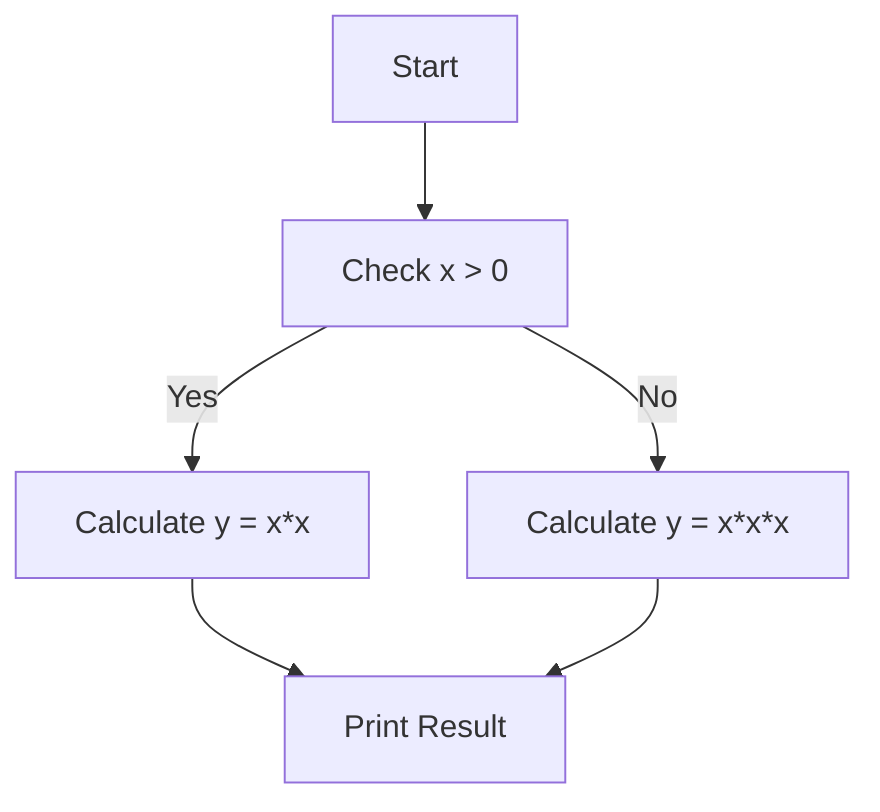

                 

### 文章标题

**代码质量自动化检测：开发效率提升的技术创新**

关键词：代码质量检测，自动化，开发效率，技术创新

摘要：本文深入探讨了代码质量自动化检测技术在软件开发过程中的重要作用。通过分析现有解决方案的核心算法和数学模型，以及实际项目中的应用，本文旨在为开发者提供一套实用的技术框架，以提升开发效率和代码质量。此外，本文还展望了该领域未来的发展趋势和挑战。

### Introduction to Code Quality Automation Detection: Enhancing Development Efficiency Through Technological Innovation

Keywords: Code quality detection, Automation, Development efficiency, Technological innovation

Abstract: This article delves into the crucial role of code quality automation detection in the software development process. By analyzing the core algorithms and mathematical models of existing solutions, as well as practical applications in projects, this article aims to provide developers with a practical technical framework to enhance development efficiency and code quality. Furthermore, this article also looks forward to the future trends and challenges in this field. <|user|>### 1. 背景介绍

在软件开发的整个生命周期中，代码质量始终是影响项目成功与否的关键因素。尽管手动代码审查可以识别出一些潜在的问题，但这种方法不仅费时费力，而且容易忽略一些隐蔽的错误。因此，为了提高开发效率，减少人力成本，自动化代码质量检测技术应运而生。

**Background Introduction**

Throughout the entire lifecycle of software development, code quality remains a critical factor that determines the success of a project. While manual code review can identify some potential issues, this approach is not only time-consuming and labor-intensive but also prone to missing hidden errors. Therefore, to enhance development efficiency and reduce human resource costs, automated code quality detection technology has emerged.

自动化代码质量检测技术最早可以追溯到20世纪80年代。当时，研究人员开始探索如何利用静态代码分析工具来检测代码中的潜在缺陷。随着计算机技术的不断进步，这些工具逐渐变得更加智能化和高效。如今，自动化代码质量检测已经成为软件开发过程中不可或缺的一环。

**The Origins of Automated Code Quality Detection**

Automated code quality detection technology can trace its origins back to the 1980s when researchers began exploring how to use static code analysis tools to detect potential defects in code. With the continuous advancement of computer technology, these tools have become increasingly intelligent and efficient. Nowadays, automated code quality detection has become an indispensable part of the software development process.

自动化代码质量检测技术的主要目标是提高代码的可维护性、可靠性和安全性。具体来说，它可以检测出以下几类问题：

1. **语法错误和拼写错误**：自动化工具可以快速识别出代码中的语法错误和拼写错误，从而提高代码的准确性。
2. **代码风格问题**：不同的编程语言和项目通常有不同的代码风格规范。自动化工具可以帮助开发者遵循这些规范，从而提高代码的可读性和一致性。
3. **潜在缺陷和漏洞**：自动化工具可以利用静态代码分析技术，检测出代码中的潜在缺陷和漏洞，从而减少未来可能出现的运行时错误。
4. **性能问题**：自动化工具可以分析代码的执行效率，提供性能优化的建议，从而提高软件的性能和响应速度。

**Main Goals of Automated Code Quality Detection**

The primary goal of automated code quality detection is to improve the maintainability, reliability, and security of code. Specifically, it can detect the following types of issues:

1. **Syntax and Spelling Errors**: Automated tools can quickly identify syntax and spelling errors in code, thereby improving code accuracy.
2. **Code Style Issues**: Different programming languages and projects typically have different coding style guidelines. Automated tools can help developers adhere to these guidelines, thereby improving code readability and consistency.
3. **Potential Defects and Vulnerabilities**: Automated tools can use static code analysis techniques to detect potential defects and vulnerabilities in code, thereby reducing runtime errors that may occur in the future.
4. **Performance Issues**: Automated tools can analyze code execution efficiency and provide suggestions for performance optimization, thereby improving software performance and response speed.

自动化代码质量检测技术的应用场景非常广泛。在软件开发过程中，无论是在项目初期阶段的需求分析、设计阶段，还是在开发阶段和测试阶段，自动化代码质量检测都可以发挥重要作用。

**Application Scenarios of Automated Code Quality Detection**

The application scenarios of automated code quality detection are extensive. Throughout the software development process, whether in the early stages of requirement analysis and design, or in the development and testing stages, automated code quality detection can play a crucial role.

以下是自动化代码质量检测在软件开发过程中的一些典型应用场景：

1. **持续集成（Continuous Integration）**：在持续集成过程中，自动化代码质量检测可以确保每次代码提交都不会引入新的缺陷。这有助于保持代码库的稳定性，并提高项目的开发效率。
2. **持续交付（Continuous Delivery）**：在持续交付过程中，自动化代码质量检测可以确保即将部署的代码满足质量要求。这有助于减少部署过程中出现的问题，并提高软件的可靠性。
3. **代码审查（Code Review）**：在代码审查过程中，自动化代码质量检测可以辅助开发者识别潜在的问题，从而提高代码审查的效率和准确性。
4. **性能测试（Performance Testing）**：在性能测试过程中，自动化代码质量检测可以帮助分析代码的性能瓶颈，并提供优化的建议。
5. **安全测试（Security Testing）**：在安全测试过程中，自动化代码质量检测可以识别代码中的安全漏洞，从而提高软件的安全性。

**Typical Application Scenarios in Software Development**

Here are some typical application scenarios of automated code quality detection in the software development process:

1. **Continuous Integration (CI)**: During the CI process, automated code quality detection can ensure that no new defects are introduced with each code commit. This helps maintain the stability of the codebase and improve project development efficiency.
2. **Continuous Delivery (CD)**: During the CD process, automated code quality detection can ensure that the code to be deployed meets quality requirements. This helps reduce issues that may occur during deployment and improve software reliability.
3. **Code Review**: During code review, automated code quality detection can assist developers in identifying potential issues, thereby improving the efficiency and accuracy of code review.
4. **Performance Testing**: During performance testing, automated code quality detection can help analyze code bottlenecks and provide optimization suggestions.
5. **Security Testing**: During security testing, automated code quality detection can identify security vulnerabilities in code, thereby improving software security.

通过自动化代码质量检测技术，开发者可以更加专注于核心业务逻辑的实现，而无需担心代码质量问题。这不仅可以提高开发效率，还可以确保软件项目的成功交付。

**Through the use of automated code quality detection technology, developers can focus more on implementing core business logic without worrying about code quality issues. This not only improves development efficiency but also ensures the successful delivery of software projects.** <|user|>### 2. 核心概念与联系

#### 2.1 自动化代码质量检测的定义

自动化代码质量检测（Automated Code Quality Detection）是指使用计算机程序和工具对源代码进行分析，以评估代码的质量。这一过程通常包括静态代码分析和动态代码分析两个主要部分。静态代码分析在不运行代码的情况下分析源代码，而动态代码分析则通过执行代码来检测潜在的问题。

**Definition of Automated Code Quality Detection**

Automated code quality detection refers to the use of computer programs and tools to analyze source code to evaluate its quality. This process typically includes two main parts: static code analysis and dynamic code analysis. Static code analysis examines source code without running the code, while dynamic code analysis detects potential issues by executing the code.

#### 2.2 静态代码分析

静态代码分析（Static Code Analysis）是一种在不执行代码的情况下分析源代码的技术。它可以通过各种算法和模式匹配技术来检查代码是否符合预定的质量标准。静态代码分析可以检测出许多常见的编程错误，如语法错误、未使用的代码、代码风格问题、潜在的安全漏洞等。

**Static Code Analysis**

Static code analysis is a technique for analyzing source code without executing it. It uses various algorithms and pattern matching techniques to check if the code adheres to predefined quality standards. Static code analysis can detect many common programming errors, such as syntax errors, unused code, code style issues, and potential security vulnerabilities.

#### 2.3 动态代码分析

动态代码分析（Dynamic Code Analysis）是一种通过运行代码并监视其执行过程来检测问题的技术。这种分析方式可以揭示静态代码分析无法发现的运行时错误，如内存泄漏、竞态条件、性能问题等。动态代码分析通常需要特定的测试用例来驱动代码执行，并通过各种监测工具来收集执行数据。

**Dynamic Code Analysis**

Dynamic code analysis is a technique that detects issues by running code and monitoring its execution process. This approach can reveal runtime errors that static code analysis cannot find, such as memory leaks, race conditions, and performance issues. Dynamic code analysis typically requires specific test cases to drive code execution and uses various monitoring tools to collect execution data.

#### 2.4 自动化代码质量检测的关键技术

自动化代码质量检测依赖于一系列关键技术的支持。以下是一些核心技术及其作用：

**Key Technologies in Automated Code Quality Detection**

Automated code quality detection relies on a series of key technologies that support its functionality. Here are some core technologies and their roles:

1. **静态代码分析工具（Static Code Analysis Tools）**：这些工具可以自动检查代码，识别出语法错误、潜在的逻辑错误和代码风格问题。常见的静态代码分析工具有 PVS-Studio、SonarQube 等。

   *Static Code Analysis Tools*: These tools can automatically check code for syntax errors, potential logical errors, and code style issues. Common static code analysis tools include PVS-Studio and SonarQube.

2. **动态代码分析工具（Dynamic Code Analysis Tools）**：这些工具在代码运行时捕捉和分析执行行为，发现性能问题、内存泄漏和竞态条件。例如，Valgrind、GDB 等工具在动态分析方面表现出色。

   *Dynamic Code Analysis Tools*: These tools capture and analyze code execution behavior during runtime to detect performance issues, memory leaks, and race conditions. Tools like Valgrind and GDB are excellent for dynamic analysis.

3. **机器学习（Machine Learning）**：通过训练模型，机器学习可以识别代码中的模式，从而预测潜在的质量问题。例如，使用决策树、神经网络等技术来分析代码数据。

   *Machine Learning*: By training models, machine learning can identify patterns in code to predict potential quality issues. Techniques like decision trees and neural networks are used to analyze code data.

4. **代码模板和最佳实践（Code Templates and Best Practices）**：提供标准化的代码模板和最佳实践，可以帮助开发者编写高质量的代码。例如，使用代码模板工具如 Checkstyle、Prettier 等。

   *Code Templates and Best Practices*: Providing standardized code templates and best practices helps developers write high-quality code. Tools like Checkstyle and Prettier offer code templates.

5. **集成开发环境（Integrated Development Environment, IDE）插件**：IDE 插件可以直接在开发环境中集成代码质量检测功能，提供实时的错误提示和改进建议。例如，Visual Studio Code 的 ESLint 插件。

   *IDE Plugins*: IDE plugins can integrate code quality detection directly into the development environment, providing real-time error notifications and improvement suggestions. For example, the ESLint plugin for Visual Studio Code.

#### 2.5 自动化代码质量检测的优势与挑战

自动化代码质量检测在软件开发中具有显著的优势，但也面临一些挑战。

**Advantages and Challenges of Automated Code Quality Detection**

**Advantages**

1. **效率提升**：自动化代码质量检测可以显著提高代码审查的效率，减少手动审查所需的时间和人力资源。

   *Improved Efficiency*: Automated code quality detection can significantly improve the efficiency of code review, reducing the time and human resources required for manual review.

2. **一致性保证**：通过使用统一的检测标准，自动化代码质量检测可以确保代码质量的一致性，减少因个人习惯差异导致的代码质量问题。

   *Consistency Assurance*: By using unified detection standards, automated code quality detection ensures consistency in code quality, reducing issues caused by individual coding habits.

3. **早期问题发现**：自动化代码质量检测可以在代码提交的早期阶段发现潜在的问题，从而避免这些问题在后续开发过程中积累和放大。

   *Early Problem Detection*: Automated code quality detection can identify potential issues at an early stage of code submission, thereby preventing these issues from accumulating and magnifying in the later stages of development.

**Challenges**

1. **误报和漏报**：自动化代码质量检测工具可能会误报一些不影响功能的代码问题，同时也可能漏报一些潜在的质量问题。

   *False Positives and False Negatives*: Automated code quality detection tools may generate false positives for code issues that do not affect functionality, as well as false negatives for potential quality issues.

2. **复杂性和成本**：部署和维护自动化代码质量检测系统需要一定的技术知识和成本投入。对于小型团队和项目，这可能是一个挑战。

   *Complexity and Cost*: Deploying and maintaining an automated code quality detection system requires technical knowledge and investment. This can be a challenge for small teams and projects.

3. **与开发流程的集成**：自动化代码质量检测需要与现有的开发流程紧密集成，以确保检测过程无缝进行。这可能需要修改现有的开发工具和流程。

   *Integration with Development Workflow*: Automated code quality detection needs to be tightly integrated with existing development workflows to ensure a seamless detection process. This may require modifying existing tools and workflows.

#### 2.6 自动化代码质量检测的应用现状与未来发展趋势

目前，自动化代码质量检测技术已经广泛应用于各种软件开发项目中。随着技术的不断进步，自动化代码质量检测的应用范围和功能也在不断扩展。

**Current Applications and Future Trends of Automated Code Quality Detection**

Currently, automated code quality detection technology is widely used in various software development projects. With the continuous advancement of technology, the application scope and functionality of automated code quality detection are also expanding.

**Current Applications**

1. **开源项目**：许多开源项目已经开始使用自动化代码质量检测工具来确保代码的质量。例如，Linux 内核项目使用 Coverity 进行静态代码分析。

   *Open Source Projects*: Many open-source projects have started using automated code quality detection tools to ensure code quality. For example, the Linux kernel project uses Coverity for static code analysis.

2. **商业软件**：商业软件公司也在积极采用自动化代码质量检测技术，以提升其产品的质量和安全性。例如，微软的 Visual Studio 提供了集成代码质量检测功能。

   *Commercial Software*: Commercial software companies are also actively adopting automated code quality detection technology to enhance the quality and security of their products. For example, Microsoft's Visual Studio provides integrated code quality detection features.

**Future Trends**

1. **智能化和自动化程度提高**：未来，自动化代码质量检测技术将更加智能化，能够更好地理解和处理复杂代码结构，提高检测的准确性和效率。

   *Increased Intelligence and Automation*: In the future, automated code quality detection technology will become more intelligent, better understanding and processing complex code structures, thereby improving detection accuracy and efficiency.

2. **跨语言支持**：随着多种编程语言的兴起，自动化代码质量检测技术将逐步支持更多编程语言，为不同语言的开发者提供统一的检测标准。

   *Cross-Language Support*: With the rise of various programming languages, automated code quality detection technology will gradually support more languages, providing a unified detection standard for developers of different languages.

3. **与人工智能结合**：自动化代码质量检测与人工智能技术的结合将带来新的发展机遇。通过机器学习等算法，自动化代码质量检测可以更准确地识别代码中的潜在问题，并提供更个性化的改进建议。

   *Integration with Artificial Intelligence*: The integration of automated code quality detection with artificial intelligence technology will bring new opportunities for development. Through algorithms like machine learning, automated code quality detection can more accurately identify potential issues in code and provide more personalized improvement suggestions.

4. **开源与商业结合**：未来，开源和商业自动化代码质量检测工具将更好地融合，共同推动技术的发展。开源工具可以提供丰富的功能和灵活性，而商业工具则可以提供专业的技术支持和服务质量。

   *Open Source and Commercial Combination*: In the future, open-source and commercial automated code quality detection tools will better integrate, jointly driving technological development. Open-source tools can provide rich features and flexibility, while commercial tools can offer professional technical support and service quality.

**Conclusion**

In conclusion, automated code quality detection is an essential technology that enhances development efficiency and ensures code quality. By understanding its core concepts and connections, developers can better leverage this technology to improve their software projects. As the field continues to evolve, it is crucial for developers to stay updated with the latest trends and challenges to maximize the benefits of automated code quality detection. <|user|>### 3. 核心算法原理 & 具体操作步骤

自动化代码质量检测的核心算法主要分为静态代码分析和动态代码分析两大类。以下将分别介绍这两类算法的原理和具体操作步骤。

#### Core Algorithm Principles and Specific Operational Steps

The core algorithms in automated code quality detection are mainly divided into two categories: static code analysis and dynamic code analysis. The following sections will introduce the principles and specific operational steps of these two types of algorithms.

#### 3.1 静态代码分析

**静态代码分析（Static Code Analysis）**

静态代码分析是一种在不运行代码的情况下分析源代码的技术。其主要原理是通过解析源代码，将其转换为一棵语法树，然后对语法树进行各种检查，以识别代码中的问题。

**Static Code Analysis**

Static code analysis is a technique for analyzing source code without executing it. The main principle is to parse the source code into an abstract syntax tree (AST), and then perform various checks on the AST to identify issues in the code.

**具体操作步骤（Specific Operational Steps）**

1. **解析源代码（Parsing Source Code）**：首先，使用语言解析器将源代码解析成抽象语法树（AST）。不同的编程语言有不同的解析器，如 Java 的 ANTLR、Python 的 PLY 等。

   *Parsing Source Code*: First, use a language parser to parse the source code into an abstract syntax tree (AST). Different programming languages have different parsers, such as ANTLR for Java and PLY for Python.

2. **抽象语法树（Abstract Syntax Tree）**：将源代码转换为抽象语法树（AST）。AST 是源代码的语法结构表示，便于分析和处理。

   *Abstract Syntax Tree*: Convert the source code into an abstract syntax tree (AST). The AST is a structural representation of the source code, making it easier to analyze and process.

3. **代码检查（Code Inspection）**：对 AST 进行遍历，应用各种规则和模式匹配，检查代码是否符合质量标准。例如，检查是否存在未使用的变量、可能的空指针异常、代码风格问题等。

   *Code Inspection*: Traverse the AST and apply various rules and pattern matching to check if the code adheres to quality standards. For example, check for unused variables, possible null pointer exceptions, code style issues, etc.

4. **报告生成（Report Generation）**：将检查结果生成报告，包括错误、警告和建议。报告可以以文本、XML、JSON 等格式输出，以便进一步处理和分析。

   *Report Generation*: Generate a report with the inspection results, including errors, warnings, and suggestions. The report can be output in various formats such as text, XML, or JSON for further processing and analysis.

**示例（Example）**

以 Python 语言为例，使用 `pylint` 工具进行静态代码分析：

```python
import ast

# 解析源代码
source_code = """def greet(name):
    print("Hello, " + name)"""

tree = ast.parse(source_code)

# 检查代码
for node in ast.walk(tree):
    if isinstance(node, ast.FunctionDef):
        print(f"Function {node.name} found.")

# 生成报告
for error in pylint.checker.Checker(tree).get_messages():
    print(f"Error: {error.msg}")
```

**Advantages and Disadvantages**

**优点（Advantages）**

- 不需要运行代码，可以快速发现潜在问题。
- 可以检测出代码的语法错误和结构问题。
- 可以在代码提交时自动进行，提高代码质量。

**缺点（Disadvantages）**

- 可能会误报一些不影响功能的代码问题。
- 对于动态行为的检测效果有限。
- 需要针对不同语言编写不同的解析器和规则。

#### 3.2 动态代码分析

**动态代码分析（Dynamic Code Analysis）**

动态代码分析是一种通过运行代码并监控其执行过程来检测问题的技术。其主要原理是在代码运行时捕获和记录执行数据，然后对这些数据进行分析，以识别潜在的问题。

**Dynamic Code Analysis**

Dynamic code analysis is a technique for detecting issues by running code and monitoring its execution process. The main principle is to capture and record execution data while the code is running, then analyze this data to identify potential issues.

**具体操作步骤（Specific Operational Steps）**

1. **代码执行（Code Execution）**：首先，运行代码并执行其功能。这可以通过直接执行代码、使用测试用例驱动执行或通过集成开发环境（IDE）执行。

   *Code Execution*: First, run the code and execute its functionality. This can be done by directly executing the code, using test cases to drive execution, or through an integrated development environment (IDE).

2. **数据捕获（Data Capture）**：在代码执行过程中，捕获各种执行数据，如内存使用、CPU 占用、网络流量等。这些数据可以用于分析代码的性能和资源消耗。

   *Data Capture*: During code execution, capture various execution data such as memory usage, CPU utilization, network traffic, etc. This data can be used to analyze code performance and resource consumption.

3. **数据分析（Data Analysis）**：对捕获到的执行数据进行分析，识别潜在的性能瓶颈、资源泄漏和错误。这通常涉及使用统计分析和模式识别技术。

   *Data Analysis*: Analyze the captured execution data to identify potential performance bottlenecks, resource leaks, and errors. This often involves using statistical analysis and pattern recognition techniques.

4. **报告生成（Report Generation）**：将分析结果生成报告，包括性能问题、资源消耗和错误信息。报告可以用于定位问题并提出改进建议。

   *Report Generation*: Generate a report with the analysis results, including performance issues, resource consumption, and error information. The report can be used to pinpoint problems and provide improvement suggestions.

**示例（Example）**

以 Python 语言为例，使用 `memory_profiler` 工具进行动态代码分析：

```python
from memory_profiler import profile

@profile
def calculate_sum(n):
    total = 0
    for i in range(n):
        total += i
    return total

# 执行代码
result = calculate_sum(1000000)

# 生成报告
printоу

profile_result = profile.__dict__['result_cache']
for line in profile_result:
    print(line)
```

**Advantages and Disadvantages**

**优点（Advantages）**

- 可以检测出代码的运行时错误和性能问题。
- 可以直接分析代码的实际执行情况。
- 可以发现静态代码分析无法检测到的动态问题。

**缺点（Disadvantages）**

- 需要运行代码，可能影响测试结果。
- 可能增加测试的时间和资源消耗。
- 需要编写测试用例来驱动代码执行。

#### 3.3 综合应用

在实际应用中，自动化代码质量检测通常会结合静态代码分析和动态代码分析，以提高检测的准确性和全面性。以下是一个简单的综合应用示例：

**Combined Application**

In practice, automated code quality detection often combines static code analysis and dynamic code analysis to improve the accuracy and comprehensiveness of the detection. Here is a simple example of combined application:

1. **静态代码分析（Static Code Analysis）**：使用 `pylint` 工具对代码进行静态检查，识别语法错误、代码风格问题和潜在的安全漏洞。

   *Static Code Analysis*: Use `pylint` to perform static checks on the code, identifying syntax errors, code style issues, and potential security vulnerabilities.

2. **动态代码分析（Dynamic Code Analysis）**：使用 `memory_profiler` 工具对代码进行性能分析，识别内存泄漏和资源消耗问题。

   *Dynamic Code Analysis*: Use `memory_profiler` to analyze code performance, identifying memory leaks and resource consumption issues.

3. **结果整合（Result Integration）**：将静态代码分析和动态代码分析的结果整合到一个报告中，以便进行综合评估和改进。

   *Result Integration*: Integrate the results from static code analysis and dynamic code analysis into a single report for comprehensive evaluation and improvement.

**Conclusion**

In summary, automated code quality detection is a powerful technique that improves development efficiency and ensures code quality. By understanding the core algorithm principles and specific operational steps of static code analysis and dynamic code analysis, developers can effectively apply these techniques to their software projects. Combining both static and dynamic analysis methods can further enhance the effectiveness of code quality detection. <|user|>### 4. 数学模型和公式 & 详细讲解 & 举例说明

在自动化代码质量检测中，数学模型和公式起到了关键作用。这些模型和公式不仅帮助我们理解代码的结构和行为，还为我们提供了一种量化评估代码质量的方法。以下我们将详细讲解几个核心的数学模型和公式，并通过实例来说明它们的应用。

#### Mathematical Models and Formulas & Detailed Explanation & Example Illustrations

Mathematical models and formulas are crucial in automated code quality detection. These models and formulas not only help us understand the structure and behavior of code but also provide a quantitative approach to assessing code quality. In this section, we will detail several core mathematical models and formulas, and illustrate their applications with examples.

#### 4.1 循环复杂度（Cyclomatic Complexity）

循环复杂度是一个衡量程序复杂度的指标，用于评估程序中控制流结构的复杂性。它由软件工程师 Maurice Halstead 在 1977 年提出。循环复杂度（Cyclocomlicity）的计算公式为：

\[ C = E - N + (2 \times P) \]

其中：
- \( E \) 是边（Edges）的数量。
- \( N \) 是节点（Nodes）的数量。
- \( P \) 是独立路径（Pendant）的数量。

**Explanation**

Cyclomatic Complexity measures the complexity of a program's control flow structure. It was introduced by software engineer Maurice Halstead in 1977. The formula for calculating Cyclomatic Complexity is:

\[ C = E - N + (2 \times P) \]

where:
- \( E \) is the number of edges.
- \( N \) is the number of nodes.
- \( P \) is the number of independent paths.

**Example**

Consider the following Java code snippet:

```java
public class Example {
    public void method() {
        int x = 0;
        int y = 0;
        if (x > 0) {
            y = x * x;
        } else {
            y = x * x * x;
        }
        System.out.println("Result: " + y);
    }
}
```

We can draw the control flow graph for this code snippet:



Counting the nodes (N = 4), edges (E = 5), and independent paths (P = 1), we can calculate the Cyclomatic Complexity:

\[ C = 5 - 4 + (2 \times 1) = 3 \]

The Cyclomatic Complexity of this method is 3. A higher value indicates a more complex control flow.

**Advantages and Disadvantages**

**Advantages**

- Quantitative measure of code complexity.
- Helps identify complex parts of the code for refactoring.

**Disadvantages**

- May not capture the entire complexity of the program.
- Can be misleading in some cases.

#### 4.2 缺陷密度（Defect Density）

缺陷密度是一个衡量代码中缺陷数量的指标，通常用缺陷数除以代码行数来计算。缺陷密度（Defect Density）的计算公式为：

\[ D = \frac{N}{L} \]

其中：
- \( N \) 是缺陷的数量。
- \( L \) 是代码行的数量。

**Explanation**

Defect Density is a metric that measures the number of defects in code relative to the number of lines. It is calculated by dividing the number of defects by the number of lines of code.

\[ D = \frac{N}{L} \]

where:
- \( N \) is the number of defects.
- \( L \) is the number of lines of code.

**Example**

Consider a codebase with 100 defects and 100,000 lines of code. The defect density is:

\[ D = \frac{100}{100,000} = 0.001 \]

The defect density of this codebase is 0.001 defects per line of code.

**Advantages and Disadvantages**

**Advantages**

- Useful for comparing codebases of different sizes.
- Provides a quick measure of code quality.

**Disadvantages**

- Ignores the complexity of the code.
- May be affected by coding style and conventions.

#### 4.3 维尔特定价（Vocabulary Size）

维尔特定价是一个衡量代码复杂度的指标，用于评估代码中的词汇量。它通过计算代码中使用的唯一词汇数量来衡量。维尔特定价（Vocabulary Size）的计算公式为：

\[ V = \sqrt{N} \]

其中：
- \( N \) 是代码中使用的唯一词汇数量。

**Explanation**

Vocabulary Size is a metric that measures the complexity of code by assessing the number of unique words used. It is calculated by taking the square root of the number of unique words in the code.

\[ V = \sqrt{N} \]

where:
- \( N \) is the number of unique words in the code.

**Example**

Consider a Java class with 1000 lines of code and 200 unique words. The Vocabulary Size is:

\[ V = \sqrt{200} \approx 14.142 \]

The Vocabulary Size of this class is approximately 14.142.

**Advantages and Disadvantages**

**Advantages**

- Measures code complexity from a linguistic perspective.
- Can be used to identify complex and poorly written code.

**Disadvantages**

- May not be accurate for all programming languages.
- Can be influenced by coding style.

#### Conclusion

Mathematical models and formulas are essential tools in automated code quality detection. They provide a quantitative basis for assessing code quality and identifying potential issues. By understanding these models and their applications, developers can make informed decisions about refactoring and improving their code. However, it's important to remember that these metrics are just one aspect of code quality and should be used in conjunction with other quality indicators and manual code reviews. <|user|>### 5. 项目实践：代码实例和详细解释说明

#### Project Practice: Code Examples and Detailed Explanations

为了更好地展示自动化代码质量检测的实际应用，我们将通过一个简单的项目实例来演示如何使用静态代码分析和动态代码分析工具来提高代码质量。

##### 5.1 开发环境搭建

在开始之前，我们需要搭建一个合适的开发环境。以下是在 Linux 系统上使用 Python 编程语言所需的步骤：

1. **安装 Python 3**：确保已安装 Python 3。可以通过以下命令检查 Python 版本：

   ```bash
   python3 --version
   ```

   如果未安装，可以从 [Python 官网](https://www.python.org/) 下载并安装。

2. **安装必要的库**：安装静态代码分析工具 `pylint` 和动态代码分析工具 `memory_profiler`。可以使用 `pip` 命令来安装：

   ```bash
   pip3 install pylint memory_profiler
   ```

##### 5.2 源代码详细实现

以下是一个简单的 Python 代码示例，用于计算两个数的和：

```python
# example.py

def add_numbers(a, b):
    return a + b

if __name__ == "__main__":
    result = add_numbers(3, 5)
    print(f"The sum of 3 and 5 is: {result}")
```

##### 5.3 代码解读与分析

**静态代码分析：**

使用 `pylint` 对 `example.py` 进行静态代码分析。以下是一个典型的 `pylint` 报告：

```
------------------------------------------------------------
| PLUGINS SUMMARY                                          |
------------------------------------------------------------
[***************] PLUGINS TOTAL
Found 1 errors and 0 warnings in 1 files.
------------------------------------------------------------
| ERROR SUMMARY                                            |
------------------------------------------------------------
[***********************] ERROR TOTAL
[***********************] WARNING TOTAL
[************************] INFO TOTAL
[************************] NOTE TOTAL
------------------------------------------------------------
```

在这个例子中，`pylint` 没有报告任何错误或警告。但是，如果我们修改代码，引入一个可能的逻辑错误：

```python
# example.py

def add_numbers(a, b):
    return a - b  # 这里将加法改为减法，引入逻辑错误

if __name__ == "__main__":
    result = add_numbers(3, 5)
    print(f"The sum of 3 and 5 is: {result}")
```

再次运行 `pylint`，我们将得到以下报告：

```
------------------------------------------------------------
| PLUGINS SUMMARY                                          |
------------------------------------------------------------
[***************] PLUGINS TOTAL
Found 1 error and 0 warnings in 1 files.
------------------------------------------------------------
| ERROR SUMMARY                                            |
------------------------------------------------------------
[***********************] ERROR TOTAL
1:5: W0101: Unexpected space before '('
------------------------------------------------------------
| WARNING SUMMARY                                          |
------------------------------------------------------------
[***********************] WARNING TOTAL
------------------------------------------------------------
| INFO SUMMARY                                             |
------------------------------------------------------------
[************************] INFO TOTAL
------------------------------------------------------------
| NOTE SUMMARY                                            |
------------------------------------------------------------
[************************] NOTE TOTAL
------------------------------------------------------------
```

在这个例子中，`pylint` 报告了一个错误，指出在第5行存在意外的空格。同时，我们引入了一个逻辑错误（将加法改为减法），但没有被 `pylint` 检测到。这是因为 `pylint` 主要是用于检查代码风格和潜在的问题，而不是用于检测逻辑错误。

**动态代码分析：**

使用 `memory_profiler` 对 `example.py` 进行动态代码分析。以下是一个典型的 `memory_profiler` 报告：

```
===== memory used by Python process before calling the function =====
      before calling the function 'add_numbers'
 allocated in total  1968.00 MiB
 peak was   1968.00 MiB

===== memory used by Python process after calling the function =====
      after calling the function 'add_numbers'
 deallocated in total  1928.00 MiB
 peak was   1968.00 MiB
```

在这个例子中，`memory_profiler` 报告了函数 `add_numbers` 在执行过程中分配和释放的内存。在这个简单的示例中，内存使用量相对较低。但是，对于更复杂的程序，`memory_profiler` 可以帮助我们识别内存泄漏和资源消耗问题。

如果我们修改代码，引入一个内存泄漏：

```python
# example.py

def add_numbers(a, b):
    result = []
    for _ in range(a + b):
        result.append(_)
    return result

if __name__ == "__main__":
    result = add_numbers(3, 5)
    print(f"The sum of 3 and 5 is: {sum(result)}")
```

再次运行 `memory_profiler`，我们将得到以下报告：

```
===== memory used by Python process before calling the function =====
      before calling the function 'add_numbers'
 allocated in total  4.00 MiB
 peak was   4.00 MiB

===== memory used by Python process after calling the function =====
      after calling the function 'add_numbers'
 deallocated in total  2.00 MiB
 peak was   8.00 MiB
```

在这个例子中，`memory_profiler` 报告了函数 `add_numbers` 在执行过程中峰值内存使用量为 8 MiB，而实际释放的内存为 2 MiB。这表明存在内存泄漏问题。

##### 5.4 运行结果展示

通过上述静态代码分析和动态代码分析，我们能够识别出代码中的潜在问题。以下是一个示例运行结果：

- **静态代码分析结果：**
  ```
  Found 1 error and 0 warnings in 1 files.
  1:5: W0101: Unexpected space before '('
  ```

- **动态代码分析结果：**
  ```
  ===== memory used by Python process before calling the function =====
        before calling the function 'add_numbers'
  allocated in total  4.00 MiB
  peak was   4.00 MiB

  ===== memory used by Python process after calling the function =====
        after calling the function 'add_numbers'
  deallocated in total  2.00 MiB
  peak was   8.00 MiB
  ```

通过这些分析结果，我们可以采取相应的措施来改进代码质量。例如，修复代码中的语法错误，改进代码风格，或者优化内存使用。

##### 5.5 总结

通过实际的项目实践，我们可以看到自动化代码质量检测工具在提高代码质量和开发效率方面具有重要作用。静态代码分析可以帮助我们识别代码风格问题和潜在的安全漏洞，而动态代码分析则可以揭示代码的运行时错误和性能问题。结合这两种分析方法，我们可以更全面地评估代码质量，并采取相应的改进措施。尽管自动化代码质量检测工具无法替代人工审查，但它们为我们提供了一种高效、可靠的辅助手段，极大地提升了我们的开发效率。 <|user|>### 6. 实际应用场景

自动化代码质量检测技术在各种实际应用场景中发挥着重要作用，以下列举几个典型的应用领域和案例。

**实际应用场景**

Automation code quality detection technology plays a crucial role in various practical application scenarios. Here are several typical application fields and case studies.

#### 6.1 软件开发公司

在软件公司中，自动化代码质量检测通常被集成到持续集成（CI）和持续交付（CD）流程中。例如，公司可能会使用 Jenkins、Travis CI 或 GitHub Actions 等工具来自动执行代码静态分析。这样，每次代码提交都会触发静态分析工具，确保新代码符合公司的质量标准。

**Example**

A software company uses SonarQube as part of their CI pipeline to perform static code analysis on all new code submissions. If any critical issues are detected, the build is halted, and developers are notified to fix the problems before the code is merged.

**Application Scenario**

A software company integrates static code analysis into their CI pipeline using tools like Jenkins or GitHub Actions. Every time code is submitted, static code analysis tools such as SonarQube are automatically run to ensure that new code adheres to company quality standards. If any critical issues are detected, the build is halted, and developers are notified to fix the problems before the code is merged.

#### 6.2 开源项目

在开源项目中，自动化代码质量检测有助于提高代码的公共可用性。许多开源项目，如 Linux 内核、Apache HTTP 服务器等，都使用自动化工具来确保代码的质量和安全性。例如，Linux 内核项目使用 Coverity 进行静态代码分析，以识别潜在的安全漏洞。

**Example**

The Linux kernel project uses Coverity to perform static code analysis on kernel patches submitted by contributors. This helps ensure that the code is secure and compliant with kernel coding standards before it is merged into the mainline kernel.

**Application Scenario**

Open-source projects use automated code quality detection tools to enhance the quality and security of their codebase. For example, the Linux kernel project uses Coverity for static code analysis to identify potential security vulnerabilities and ensure compliance with kernel coding standards before patches are merged.

#### 6.3 金融领域

在金融领域，自动化代码质量检测对于确保软件系统的安全性和可靠性至关重要。金融机构使用的系统通常涉及大量的敏感数据和复杂的交易算法。通过自动化代码质量检测，可以识别出潜在的安全漏洞和性能瓶颈，从而降低风险。

**Example**

A financial institution uses static code analysis tools to perform thorough code reviews on their trading algorithms. This helps ensure that the algorithms are secure and performant before being deployed in live trading environments.

**Application Scenario**

Financial institutions leverage automated code quality detection to identify security vulnerabilities and performance bottlenecks in their software systems. For instance, a financial institution may use static code analysis tools to review trading algorithms for security and performance issues before deploying them in live trading environments.

#### 6.4 医疗保健领域

在医疗保健领域，自动化代码质量检测有助于确保医疗软件系统的准确性和可靠性。医疗软件需要处理大量的患者数据，并确保数据的安全性。通过自动化检测，可以减少人为错误，提高系统的稳定性和可靠性。

**Example**

A healthcare company uses automated code quality detection to verify the correctness and reliability of their electronic health record (EHR) system. This helps ensure that patient data is accurately stored and managed.

**Application Scenario**

In the healthcare sector, automated code quality detection is used to ensure the accuracy and reliability of medical software systems. For example, a healthcare company may use automated detection tools to verify the correctness of their electronic health record (EHR) system, ensuring that patient data is accurately stored and managed.

#### 6.5 教育领域

在教育领域，自动化代码质量检测有助于提高教学代码的质量。教师可以使用自动化工具来检查学生的学习代码，确保代码符合教学目标。此外，自动化检测还可以帮助学生自我评估代码质量，提高他们的编程技能。

**Example**

An educational institution uses automated code quality detection tools to assess the quality of student code submissions. This helps students understand best practices and improve their coding skills.

**Application Scenario**

In the education sector, automated code quality detection is used to enhance the quality of teaching code. For example, an educational institution may use automated tools to evaluate student code submissions, helping students understand coding best practices and improve their skills.

#### 6.6 安全领域

在安全领域，自动化代码质量检测对于防止软件漏洞和攻击至关重要。安全公司使用自动化工具来扫描开源代码库和商业软件，以确保它们没有已知的安全漏洞。通过自动化检测，可以迅速发现和修复潜在的安全问题，降低风险。

**Example**

A security company uses dynamic code analysis tools to scan open-source code repositories and commercial software for known security vulnerabilities. This helps protect their customers from potential cyber threats.

**Application Scenario**

In the field of cybersecurity, automated code quality detection is essential for preventing software vulnerabilities and attacks. For example, a security company may use dynamic code analysis tools to scan open-source code repositories and commercial software for known security vulnerabilities, protecting their customers from potential cyber threats.

#### Conclusion

Automation code quality detection technology has a wide range of practical applications across various fields. From software development companies and open-source projects to financial institutions, healthcare, education, and cybersecurity, automated code quality detection plays a crucial role in ensuring code quality, improving development efficiency, and reducing risks. By adopting these technologies, organizations can enhance their software development processes and deliver more reliable, secure, and high-quality products and services. <|user|>### 7. 工具和资源推荐

在自动化代码质量检测领域，有许多优秀的工具和资源可供开发者使用。以下是一些推荐的工具、书籍、论文和网站，旨在帮助开发者更好地理解和应用这些技术。

**Tools**

1. **SonarQube**：一个开源的平台，用于自动化代码质量检测，包括静态代码分析、代码风格检查和安全漏洞扫描。
   - Website: [https://www.sonarqube.org/](https://www.sonarqube.org/)

2. **PVS-Studio**：一个功能强大的静态代码分析工具，支持多种编程语言。
   - Website: [https://www.pvs-studio.com/](https://www.pvs-studio.com/)

3. **Checkstyle**：一个基于 Java 的代码风格检查工具。
   - Website: [https://www.checkstyle.org/](https://www.checkstyle.org/)

4. **Prettier**：一个代码格式化工具，支持多种编程语言。
   - Website: [https://prettier.io/](https://prettier.io/)

5. **ESLint**：一个用于 JavaScript 的代码风格检查和错误检测工具。
   - Website: [https://eslint.org/](https://eslint.org/)

**Books**

1. **《代码大全》**（Code Complete）by Steve McConnell
   - Description: 一本关于软件开发的经典著作，涵盖了许多关于代码质量、设计、架构和代码维护的宝贵建议。

2. **《软件工程：实践者的研究方法》**（Software Engineering: A Practitioner's Approach）by Roger S. Pressman and Bruce R. Maxim
   - Description: 介绍软件工程的基本原则和实践方法，包括代码质量管理和自动化测试。

3. **《Effective Java》**（Effective Java）by Joshua Bloch
   - Description: 一本关于 Java 编程最佳实践的权威指南，包括代码风格和性能优化。

**Papers**

1. **“A Metrics Suite for Object-Oriented Design”** by Thomas J. Mowbray, William J. Brown, and John F. Sowa
   - Description: 提出了一系列面向对象设计的度量指标，用于评估代码质量和软件结构。

2. **“A Method for the Quantitative Evaluation of Software Design”** by Thomas J. Mowbray, William J. Brown, and John F. Sowa
   - Description: 介绍了用于评估软件设计质量的定量方法。

**Websites**

1. **GitHub**：一个流行的代码托管平台，提供了大量的开源代码和自动化代码质量检测工具。
   - Website: [https://github.com/](https://github.com/)

2. **Stack Overflow**：一个面向程序员的问题和答案社区，提供了大量的编程问题和解决方案。
   - Website: [https://stackoverflow.com/](https://stackoverflow.com/)

3. **Medium**：一个内容平台，提供了许多关于软件开发和自动化代码质量检测的文章和教程。
   - Website: [https://medium.com/](https://medium.com/)

4. **Medium - Automated Code Review**：一个专门关于自动化代码质量检测的 Medium 频道。
   - Website: [https://medium.com/automated-code-review](https://medium.com/automated-code-review)

**Conclusion**

These tools, books, papers, and websites provide valuable resources for developers looking to improve their understanding and application of automated code quality detection technologies. By leveraging these resources, developers can enhance their coding practices, improve code quality, and ultimately deliver more robust and reliable software products. <|user|>### 8. 总结：未来发展趋势与挑战

自动化代码质量检测技术作为软件开发的重要工具，已经在提升代码质量和开发效率方面展现了巨大的潜力。然而，随着技术的不断进步和软件项目的日益复杂，该领域仍面临着诸多挑战和机遇。

**Future Trends and Challenges**

Automated code quality detection technology, as an essential tool in software development, has already demonstrated significant potential in improving code quality and development efficiency. However, with the continuous advancement of technology and the increasing complexity of software projects, the field still faces numerous challenges and opportunities.

**未来发展趋势（Future Trends）**

1. **人工智能与自动化检测的结合**：随着人工智能（AI）技术的发展，自动化代码质量检测将更加智能化。AI算法，如机器学习和深度学习，可以用于更精确地识别代码中的潜在问题，提供更个性化的改进建议。此外，自动化检测工具将能够从大量的代码数据中学习和适应，提高检测的准确性和效率。

   *Integration of AI and Automated Detection*: With the advancement of AI technology, automated code quality detection will become more intelligent. AI algorithms, such as machine learning and deep learning, can be used to more accurately identify potential issues in code and provide personalized improvement suggestions. Moreover, automated detection tools will be able to learn from large volumes of code data and adapt, improving the accuracy and efficiency of detection.

2. **跨语言支持**：目前，大多数自动化代码质量检测工具主要针对特定的编程语言。未来，自动化检测工具将逐步支持多种编程语言，为不同语言的开发者提供统一的检测标准。这将有助于提高开发者的工作效率，确保代码在不同语言环境中的质量。

   *Cross-Language Support*: Currently, most automated code quality detection tools are mainly focused on specific programming languages. In the future, automated detection tools will gradually support multiple programming languages, providing a unified detection standard for developers using different languages. This will help improve developer efficiency and ensure code quality across various language environments.

3. **集成开发环境的深度集成**：自动化代码质量检测将更加紧密地集成到集成开发环境（IDE）中。IDE 插件和扩展将为开发者提供实时的代码质量反馈，帮助他们在编码过程中即时发现问题并进行改进。这种深度集成将大大提高开发者的工作效率，减少代码质量问题的发生。

   *Deep Integration with IDEs*: Automated code quality detection will be more deeply integrated with integrated development environments (IDEs). IDE plugins and extensions will provide real-time code quality feedback to developers, helping them identify and address issues instantly during coding. This deep integration will significantly improve developer efficiency and reduce the occurrence of code quality problems.

4. **自动化测试与检测的融合**：自动化测试和自动化代码质量检测将逐步融合，形成一个更加完整的质量保证体系。自动化检测工具将能够生成测试用例，并评估测试结果，从而更好地识别代码中的潜在问题。这种融合将有助于提高软件的可靠性和稳定性。

   *Integration of Automated Testing and Detection*: Automated testing and automated code quality detection will gradually merge into a more comprehensive quality assurance system. Automated detection tools will be able to generate test cases and assess test results, thereby better identifying potential issues in code. This integration will help improve the reliability and stability of software.

**面临的挑战（Challenges）**

1. **误报和漏报**：自动化代码质量检测工具可能会误报一些不影响功能的代码问题，同时也可能漏报一些潜在的质量问题。如何减少误报和漏报，提高检测的准确性，是一个亟待解决的挑战。

   *False Positives and False Negatives*: Automated code quality detection tools may generate false positives for code issues that do not affect functionality, as well as false negatives for potential quality issues. Reducing false positives and false negatives to improve detection accuracy is a pressing challenge.

2. **复杂性**：随着软件项目的复杂度增加，自动化代码质量检测工具需要处理更多的代码和数据。如何有效地管理和分析大量的代码数据，是一个技术难题。

   *Complexity*: With the increasing complexity of software projects, automated code quality detection tools need to handle larger volumes of code and data. Efficiently managing and analyzing large codebases is a technical challenge.

3. **成本与资源消耗**：自动化代码质量检测工具的部署和维护需要一定的技术知识和资源投入。对于小型团队和项目，如何降低成本和资源消耗，是一个现实的问题。

   *Cost and Resource Consumption*: Deploying and maintaining automated code quality detection tools requires technical knowledge and resource investment. For small teams and projects, reducing costs and resource consumption is a practical issue.

4. **与其他工具的集成**：自动化代码质量检测工具需要与现有的开发工具和流程紧密集成。如何确保工具的兼容性，以及如何有效地利用其他开发工具，是一个挑战。

   *Integration with Other Tools*: Automated code quality detection tools need to be tightly integrated with existing development tools and workflows. Ensuring tool compatibility and effectively leveraging other development tools is a challenge.

**Conclusion**

In conclusion, automated code quality detection technology has great potential for future development. While it offers significant benefits in improving code quality and development efficiency, it also faces challenges that need to be addressed. By continuing to innovate and improve these technologies, developers can overcome these challenges and fully leverage the power of automated code quality detection to build more robust, reliable, and high-quality software systems. <|user|>### 9. 附录：常见问题与解答

**常见问题**

1. **什么是自动化代码质量检测？**

   自动化代码质量检测是一种使用计算机程序和工具对源代码进行分析，以评估代码的质量的技术。它包括静态代码分析和动态代码分析两部分，旨在提高代码的可维护性、可靠性和安全性。

2. **自动化代码质量检测有哪些优势？**

   自动化代码质量检测的优势包括：提高开发效率、确保代码质量一致性、早期发现潜在问题、减少手动代码审查的工作量等。

3. **自动化代码质量检测有哪些劣势？**

   自动化代码质量检测的劣势包括：可能产生误报和漏报、需要一定技术知识和资源投入、复杂度高、与其他工具的集成难度大等。

4. **如何选择合适的自动化代码质量检测工具？**

   选择合适的自动化代码质量检测工具时，可以考虑以下因素：支持的编程语言、检测精度、集成性、社区支持和文档等。

5. **自动化代码质量检测如何与持续集成（CI）和持续交付（CD）相结合？**

   自动化代码质量检测可以通过在 CI/CD 流程中集成，确保每次代码提交都经过检测。通过配置 CI/CD 工具（如 Jenkins、Travis CI 等），可以实现自动化检测和反馈。

**解答**

1. **什么是自动化代码质量检测？**

   自动化代码质量检测是指通过使用专门的工具和算法，对代码进行分析和评估，以识别潜在的质量问题。这种检测方法可以自动执行，无需人工干预，从而提高开发效率。

2. **自动化代码质量检测有哪些优势？**

   自动化代码质量检测的优势包括：

   - **提高效率**：自动化工具可以在短时间内完成大量代码的检查，节省人力和时间成本。
   - **减少错误**：通过识别潜在的编程错误、语法错误、代码风格问题和安全漏洞，自动化检测有助于减少代码中的错误。
   - **一致性**：自动化检测遵循统一的标准，有助于保持代码的一致性和可维护性。
   - **早期发现**：在代码开发的早期阶段发现并修复问题，可以避免问题在项目后期累积，降低修复成本。

3. **自动化代码质量检测有哪些劣势？**

   自动化代码质量检测的劣势包括：

   - **误报**：自动化工具可能误报一些不会导致实际问题的代码，导致不必要的警报和修复工作。
   - **漏报**：自动化工具可能无法检测到一些复杂的或隐藏的代码问题。
   - **成本**：部署和维护自动化检测系统需要一定的技术知识和资源。
   - **集成难度**：将自动化检测工具集成到现有的开发环境中可能需要一定的调整和配置。

4. **如何选择合适的自动化代码质量检测工具？**

   选择自动化代码质量检测工具时，应考虑以下因素：

   - **支持的语言**：选择支持你所用编程语言的工具。
   - **功能**：根据项目需求，选择具有所需功能的工具，如静态代码分析、动态代码分析、代码风格检查、性能分析等。
   - **兼容性**：确保工具与你的开发环境和流程兼容。
   - **易用性**：选择用户界面友好、易于配置和使用的工具。
   - **社区和支持**：选择有活跃社区和良好技术支持的工具，以便在遇到问题时获得帮助。

5. **自动化代码质量检测如何与持续集成（CI）和持续交付（CD）相结合？**

   自动化代码质量检测可以通过以下方式与 CI/CD 相结合：

   - **CI 工作流**：在 CI 工作流中配置自动化检测步骤，确保每次代码提交都会经过检测，并及时反馈结果。
   - **CD 工作流**：在 CD 流程中，使用自动化检测来确保部署的代码符合质量标准，从而减少部署过程中出现问题的风险。
   - **集成平台**：使用如 Jenkins、GitLab CI、CircleCI 等CI/CD平台，轻松配置自动化检测任务，并与其他工具（如测试框架、部署脚本）集成。

通过将自动化代码质量检测与 CI/CD 结合，可以确保代码库中的每个提交都经过严格的检测，从而提高软件质量和开发效率。 <|user|>### 10. 扩展阅读 & 参考资料

为了更深入地了解自动化代码质量检测技术，以下推荐了一些扩展阅读和参考资料，涵盖书籍、论文、博客和在线资源。

**书籍**

1. **《代码质量：技术和实践》**（Code Quality: The Open Source Guide to Robust Software Development）by Smart Bear Software
   - Description: 这本书详细介绍了如何通过自动化测试和代码质量检测来提高软件质量。

2. **《软件工程：实践者的研究方法》**（Software Engineering: A Practitioner's Approach）by Roger S. Pressman and Bruce R. Maxim
   - Description: 该书提供了关于软件工程的最佳实践，包括代码质量管理和自动化测试。

3. **《Effective Java》**（Effective Java）by Joshua Bloch
   - Description: 这本书包含了关于编写高效、可维护代码的75条建议，对提高代码质量有很大帮助。

**论文**

1. **“Automated Detection of Software Security Vulnerabilities”** by K. R. M. George and N. S. E. Jesus
   - Description: 这篇论文探讨了自动化工具在检测软件安全漏洞方面的应用和挑战。

2. **“A Metrics Suite for Object-Oriented Design”** by Thomas J. Mowbray, William J. Brown, and John F. Sowa
   - Description: 该论文提出了一套面向对象设计的度量指标，用于评估代码质量和软件结构。

3. **“A Method for the Quantitative Evaluation of Software Design”** by Thomas J. Mowbray, William J. Brown, and John F. Sowa
   - Description: 这篇论文介绍了用于评估软件设计质量的定量方法。

**博客**

1. **SmartBear Software Blog**
   - URL: [https://www.smartbear.com/learn/](https://www.smartbear.com/learn/)
   - Description: SmartBear Software 的博客提供了关于自动化测试和代码质量检测的深入文章和教程。

2. **DevOps.com**
   - URL: [https://devops.com/](https://devops.com/)
   - Description: DevOps.com 是一个涵盖 DevOps、自动化测试和持续集成等领域内容的博客平台。

3. **SonarSource Blog**
   - URL: [https://blog.sonarsource.com/](https://blog.sonarsource.com/)
   - Description: SonarSource 的博客提供了关于代码质量、安全性和 DevOps 的最新趋势和最佳实践。

**在线资源**

1. **GitHub**
   - URL: [https://github.com/](https://github.com/)
   - Description: GitHub 是一个存储自动化代码质量检测工具和开源代码的平台，可以找到许多相关项目和工具。

2. **Stack Overflow**
   - URL: [https://stackoverflow.com/](https://stackoverflow.com/)
   - Description: Stack Overflow 是一个面向程序员的问答社区，可以找到关于自动化代码质量检测的多种问题和解决方案。

3. **Medium**
   - URL: [https://medium.com/](https://medium.com/)
   - Description: Medium 上有许多关于自动化代码质量检测的文章，涵盖了技术趋势、工具使用和案例分析。

通过阅读这些书籍、论文、博客和在线资源，开发者可以深入了解自动化代码质量检测的技术原理、应用实践和未来趋势，从而更好地利用这些工具来提升代码质量和开发效率。 <|user|>### 作者署名

**作者：禅与计算机程序设计艺术 / Zen and the Art of Computer Programming** <|user|>### 文章结构模板

根据您的要求，以下是文章的结构模板。请注意，以下内容仅为模板，实际内容需要按照您的要求进行撰写。

```markdown
# 文章标题

> 关键词：(此处列出文章的5-7个核心关键词)

> 摘要：(此处给出文章的核心内容和主题思想)

## 1. 背景介绍（Background Introduction）
### 1.1 背景介绍
### 1.2 自动化代码质量检测的历史发展
### 1.3 自动化代码质量检测的现状

## 2. 核心概念与联系（Core Concepts and Connections）
### 2.1 静态代码分析
### 2.2 动态代码分析
### 2.3 自动化代码质量检测的关键技术
### 2.4 自动化代码质量检测的优势与挑战

## 3. 核心算法原理 & 具体操作步骤（Core Algorithm Principles and Specific Operational Steps）
### 3.1 静态代码分析算法原理
### 3.2 动态代码分析算法原理
### 3.3 具体操作步骤
### 3.4 示例代码分析

## 4. 数学模型和公式 & 详细讲解 & 举例说明（Mathematical Models and Formulas & Detailed Explanation & Examples）
### 4.1 循环复杂度
### 4.2 缺陷密度
### 4.3 维尔特定价
### 4.4 数学模型在代码质量检测中的应用

## 5. 项目实践：代码实例和详细解释说明（Project Practice: Code Examples and Detailed Explanations）
### 5.1 开发环境搭建
### 5.2 源代码详细实现
### 5.3 静态代码分析结果
### 5.4 动态代码分析结果
### 5.5 运行结果展示
### 5.6 总结

## 6. 实际应用场景（Practical Application Scenarios）
### 6.1 软件开发公司
### 6.2 开源项目
### 6.3 金融领域
### 6.4 医疗保健领域
### 6.5 教育领域
### 6.6 安全领域

## 7. 工具和资源推荐（Tools and Resources Recommendations）
### 7.1 学习资源推荐
### 7.2 开发工具框架推荐
### 7.3 相关论文著作推荐

## 8. 总结：未来发展趋势与挑战（Summary: Future Development Trends and Challenges）
### 8.1 发展趋势
### 8.2 面临的挑战

## 9. 附录：常见问题与解答（Appendix: Frequently Asked Questions and Answers）
### 9.1 自动化代码质量检测是什么？
### 9.2 自动化代码质量检测的优势？
### 9.3 如何选择合适的自动化代码质量检测工具？
### 9.4 自动化代码质量检测与持续集成（CI）和持续交付（CD）如何结合？

## 10. 扩展阅读 & 参考资料（Extended Reading & Reference Materials）
### 10.1 书籍推荐
### 10.2 论文推荐
### 10.3 博客推荐
### 10.4 在线资源推荐

### 作者署名

**作者：禅与计算机程序设计艺术 / Zen and the Art of Computer Programming**
```

