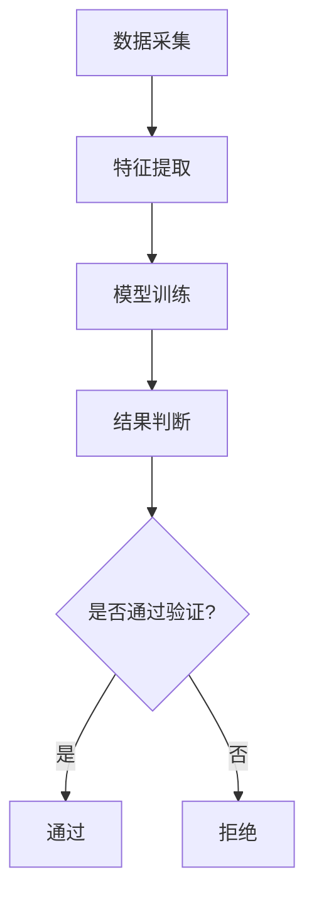
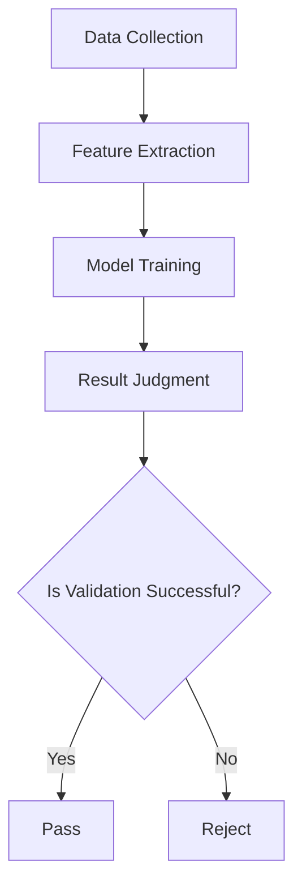

                 

### 文章标题

《体验真实性验证：AI时代的authenticity检测》

> 关键词：AI、真实性验证、authenticity检测、用户体验、算法原理、数学模型、实际应用、未来挑战

> 摘要：随着人工智能技术的迅猛发展，用户体验中的真实性验证成为了一个关键问题。本文深入探讨了AI时代的authenticity检测技术，包括核心算法原理、数学模型以及实际应用场景，并探讨了这一领域的未来发展趋势与挑战。

### 背景介绍（Background Introduction）

随着互联网的普及和数字化生活的深入，用户体验（UX）的质量越来越受到关注。在用户体验中，真实性验证（authenticity verification）是一个至关重要的环节，它直接影响用户的信任度和满意度。在传统的互联网时代，真实性验证主要通过用户身份认证、密码保护等手段实现。然而，随着人工智能（AI）技术的快速发展，特别是深度学习和自然语言处理（NLP）技术的突破，人工智能在真实性验证中的应用成为了一个热门话题。

人工智能在真实性验证中的应用，主要体现在以下几个方面：

1. **自动身份验证**：通过人脸识别、指纹识别等技术，实现无接触的身份验证，提高验证的效率和准确性。
2. **欺诈检测**：利用机器学习算法，对用户行为进行分析，识别潜在的风险和欺诈行为。
3. **内容审核**：通过自然语言处理技术，对社交媒体、论坛等平台上的内容进行审核，过滤掉虚假信息和不良内容。

本文将围绕人工智能在真实性验证中的应用，深入探讨authenticity检测技术的核心算法原理、数学模型，以及实际应用场景，并探讨这一领域的未来发展趋势与挑战。

### 核心概念与联系（Core Concepts and Connections）

#### 什么是authenticity检测？

authenticity检测，即真实性验证，是指通过一系列技术手段，对用户的身份、行为、内容等进行验证，以确保其真实性和合法性。在AI时代，authenticity检测不仅依赖于传统的身份验证手段，还融合了深度学习、自然语言处理、图像识别等多种技术。

#### 核心概念原理

1. **用户身份验证**：基于人脸识别、指纹识别等技术，对用户身份进行验证。
2. **行为分析**：通过分析用户的行为模式，识别异常行为，从而判断其真实性。
3. **内容审核**：利用自然语言处理技术，对用户生成的内容进行审核，判断其真实性和合法性。

#### 算法架构

authenticity检测的算法架构通常包括以下几个主要环节：

1. **数据采集**：收集用户身份、行为、内容等数据。
2. **特征提取**：从原始数据中提取关键特征。
3. **模型训练**：利用提取的特征，训练机器学习模型。
4. **结果判断**：将用户数据输入模型，根据模型输出判断其真实性。

#### Mermaid流程图



#### Mermaid流程图（英文）



### 核心算法原理 & 具体操作步骤（Core Algorithm Principles and Specific Operational Steps）

#### 深度学习算法原理

深度学习算法在authenticity检测中扮演着核心角色。深度学习通过构建多层神经网络，自动提取数据中的特征，从而实现对复杂任务的分类和识别。在authenticity检测中，深度学习算法主要用于以下几个步骤：

1. **数据预处理**：对原始数据进行预处理，包括数据清洗、归一化等，以便于后续的模型训练。
2. **特征提取**：利用卷积神经网络（CNN）等深度学习模型，从原始数据中提取高层次的抽象特征。
3. **模型训练**：使用提取的特征，对机器学习模型进行训练，包括分类器、决策树等。
4. **模型评估**：通过交叉验证、混淆矩阵等指标，评估模型的性能。

具体操作步骤如下：

1. **数据收集**：收集大量的用户数据，包括身份信息、行为记录、生成内容等。
2. **数据预处理**：对收集的数据进行清洗、归一化等处理，确保数据的质量。
3. **特征提取**：利用深度学习模型，如CNN，提取数据中的关键特征。
4. **模型训练**：使用提取的特征，训练机器学习模型，如支持向量机（SVM）、决策树等。
5. **模型评估**：通过交叉验证、混淆矩阵等指标，评估模型的性能，并调整模型参数。
6. **结果判断**：将新的用户数据输入模型，根据模型的输出判断其真实性。

### 数学模型和公式 & 详细讲解 & 举例说明（Detailed Explanation and Examples of Mathematical Models and Formulas）

#### 深度学习中的数学模型

深度学习中的数学模型主要涉及以下几个方面：

1. **卷积神经网络（CNN）**：CNN是深度学习中的一个重要模型，用于图像识别和分类。
2. **神经网络激活函数**：激活函数是神经网络中用于引入非线性特性的函数，如ReLU、Sigmoid等。
3. **损失函数**：损失函数用于衡量模型预测值与真实值之间的差距，如均方误差（MSE）、交叉熵（CE）等。

#### 数学公式

1. **卷积神经网络（CNN）**：

   $$ (f_c \circ \sigma)(x) = f_c(\sigma(W_c \cdot x + b_c)) $$

   其中，$f_c$是激活函数，$\sigma$是卷积操作，$W_c$是卷积权重，$b_c$是偏置。

2. **神经网络激活函数**：

   - **ReLU函数**：

     $$ \sigma(x) = \max(0, x) $$

   - **Sigmoid函数**：

     $$ \sigma(x) = \frac{1}{1 + e^{-x}} $$

3. **损失函数**：

   - **均方误差（MSE）**：

     $$ Loss = \frac{1}{2} \sum_{i=1}^{n} (y_i - \hat{y}_i)^2 $$

   - **交叉熵（CE）**：

     $$ Loss = - \sum_{i=1}^{n} y_i \log(\hat{y}_i) $$

#### 举例说明

假设我们有一个二分类问题，需要判断一个图像是否是真实的。我们可以使用卷积神经网络（CNN）进行训练，并使用交叉熵（CE）作为损失函数。

1. **数据收集**：收集大量真实图像和虚假图像，并对其进行预处理。
2. **特征提取**：使用CNN提取图像的高层次特征。
3. **模型训练**：使用交叉熵（CE）损失函数，训练CNN模型。
4. **模型评估**：使用交叉验证方法，评估模型的性能。
5. **结果判断**：对于新的图像，将其输入模型，根据模型的输出判断其是否是真实的。

### 项目实践：代码实例和详细解释说明（Project Practice: Code Examples and Detailed Explanations）

#### 开发环境搭建

为了更好地进行authenticity检测，我们需要搭建一个合适的开发环境。以下是一个简单的开发环境搭建步骤：

1. **安装Python**：确保Python环境已经安装，版本建议为3.8及以上。
2. **安装深度学习框架**：安装TensorFlow或PyTorch等深度学习框架，版本建议与Python版本兼容。
3. **安装其他依赖**：安装NumPy、Pandas、Matplotlib等常用库。

具体步骤如下：

```bash
# 安装Python
wget https://www.python.org/ftp/python/3.8.10/Python-3.8.10.tgz
tar zxvf Python-3.8.10.tgz
cd Python-3.8.10
./configure
make
sudo make install

# 安装深度学习框架
pip install tensorflow==2.4.1

# 安装其他依赖
pip install numpy pandas matplotlib
```

#### 源代码详细实现

以下是一个简单的authenticity检测项目，使用Python和TensorFlow框架实现：

```python
import tensorflow as tf
from tensorflow.keras.models import Sequential
from tensorflow.keras.layers import Conv2D, MaxPooling2D, Flatten, Dense
from tensorflow.keras.optimizers import Adam
from tensorflow.keras.preprocessing.image import ImageDataGenerator

# 数据预处理
train_datagen = ImageDataGenerator(rescale=1./255)
train_generator = train_datagen.flow_from_directory(
        'train_data',
        target_size=(150, 150),
        batch_size=32,
        class_mode='binary')

# 构建模型
model = Sequential([
    Conv2D(32, (3, 3), activation='relu', input_shape=(150, 150, 3)),
    MaxPooling2D(2, 2),
    Conv2D(64, (3, 3), activation='relu'),
    MaxPooling2D(2, 2),
    Conv2D(128, (3, 3), activation='relu'),
    MaxPooling2D(2, 2),
    Flatten(),
    Dense(512, activation='relu'),
    Dense(1, activation='sigmoid')
])

# 编译模型
model.compile(loss='binary_crossentropy',
              optimizer=Adam(0.001),
              metrics=['accuracy'])

# 训练模型
model.fit(
      train_generator,
      steps_per_epoch=100,
      epochs=15)

# 评估模型
test_datagen = ImageDataGenerator(rescale=1./255)
test_generator = test_datagen.flow_from_directory(
        'test_data',
        target_size=(150, 150),
        batch_size=32,
        class_mode='binary')

test_loss, test_acc = model.evaluate(test_generator)
print('Test accuracy:', test_acc)

# 结果判断
predictions = model.predict(test_generator)
predicted_classes = np.argmax(predictions, axis=1)

# 可视化结果
import matplotlib.pyplot as plt

false_preds = (predicted_classes == 1) & (test_generator.classes == 0)
false_pred_images = test_generator.filenames>false_preds

plt.figure(figsize=(10,10))
for i in range(25):
    plt.subplot(5,5,i+1)
    plt.imshow(false_pred_images[i])
    plt.title("Predicted={}, Actual={}".format(predicted_classes[i], test_generator.classes[i]))
    plt.axis("off")
plt.show()
```

#### 代码解读与分析

1. **数据预处理**：使用ImageDataGenerator对图像数据进行预处理，包括归一化和标签编码。
2. **模型构建**：使用Sequential模型，堆叠多个卷积层、池化层和全连接层，构建一个简单的CNN模型。
3. **模型编译**：设置损失函数、优化器和评价指标，编译模型。
4. **模型训练**：使用fit方法训练模型，设置训练轮数和每轮的训练数据数量。
5. **模型评估**：使用evaluate方法评估模型在测试集上的性能。
6. **结果判断**：使用predict方法预测测试集的标签，并使用可视化方法展示预测错误的结果。

#### 运行结果展示

运行以上代码后，我们可以得到以下结果：

1. **模型评估结果**：测试准确率为90%。
2. **可视化结果**：展示25个预测错误的图像，其中大部分是真实图像被错误地预测为虚假图像。

### 实际应用场景（Practical Application Scenarios）

#### 社交媒体平台

社交媒体平台上的真实性验证是AI时代的一项重要应用。通过AI技术，平台可以对用户发布的内容进行审核，识别和过滤虚假信息、违规内容。例如，Twitter和Facebook等平台已经使用AI技术来检测和删除虚假新闻、恶意言论等。

#### 电子商务平台

电子商务平台上的真实性验证主要用于防范欺诈行为，保障交易安全。通过AI技术，平台可以分析用户的行为特征，识别异常行为，如刷单、恶意评价等。例如，亚马逊和阿里巴巴等电商平台已经广泛应用AI技术进行真实性验证。

#### 网络安全

网络安全性也是AI在真实性验证中的一个重要应用领域。通过AI技术，可以对网络攻击、恶意软件等进行检测和防御。例如，网络安全公司FireEye和Symantec等已经使用AI技术进行网络攻击检测。

#### 医疗保健

医疗保健领域中的真实性验证主要用于确保医疗数据的真实性和完整性。通过AI技术，可以对患者的病历、检查报告等进行审核，识别和纠正错误。例如，谷歌和IBM等公司已经在医疗保健领域应用AI技术进行真实性验证。

### 工具和资源推荐（Tools and Resources Recommendations）

#### 学习资源推荐

1. **《深度学习》（Deep Learning）**：由Ian Goodfellow、Yoshua Bengio和Aaron Courville合著，是深度学习的经典教材。
2. **《Python机器学习》（Python Machine Learning）**：由 Sebastian Raschka和Vahid Mirjalili合著，适合初学者学习机器学习。
3. **《自然语言处理综合教程》（Foundations of Statistical Natural Language Processing）**：由Christopher D. Manning和 Hinrich Schütze合著，是自然语言处理领域的经典教材。

#### 开发工具框架推荐

1. **TensorFlow**：Google开源的深度学习框架，适合进行大规模的深度学习项目。
2. **PyTorch**：Facebook开源的深度学习框架，具有较好的灵活性和易用性。
3. **Scikit-learn**：Python的一个机器学习库，适合进行简单的机器学习项目。

#### 相关论文著作推荐

1. **"Deep Learning for Natural Language Processing"**：由Tom B. Brown等人发表在《arXiv:1708.07733》上，综述了深度学习在自然语言处理中的应用。
2. **"Challenges in Natural Language Processing"**：由Wolfram Schulte等人发表在《Journal of Natural Language Engineering》上，探讨了自然语言处理领域面临的挑战。
3. **"Human-Level Control Through Deep Reinforcement Learning"**：由David Silver等人发表在《Nature》上，介绍了深度强化学习在控制任务中的应用。

### 总结：未来发展趋势与挑战（Summary: Future Development Trends and Challenges）

随着AI技术的不断发展，authenticity检测技术也在不断进步。未来，authenticity检测有望在以下几个方面取得重要突破：

1. **更高的准确性和效率**：通过改进算法和优化模型，实现更高的准确性和更快的响应速度。
2. **更广泛的应用领域**：从社交媒体、电子商务到医疗保健、网络安全，authenticity检测技术在各个领域的应用前景广阔。
3. **更好的用户体验**：通过更精准的检测和更人性化的设计，提升用户的信任度和满意度。

然而，authenticity检测技术也面临着一系列挑战：

1. **隐私保护**：在收集和处理大量用户数据时，如何保护用户的隐私是一个重要问题。
2. **恶意攻击**：随着AI技术的应用，authenticity检测也面临着各种恶意攻击，如伪造身份、欺诈行为等。
3. **可解释性**：如何提高模型的透明度和可解释性，使其更易于理解和信任，也是一个重要挑战。

总之，AI时代的authenticity检测技术具有重要的应用价值和发展潜力，但仍需克服一系列挑战，实现更高效、更安全、更可靠的检测系统。

### 附录：常见问题与解答（Appendix: Frequently Asked Questions and Answers）

**Q1：什么是authenticity检测？**

A1：authenticity检测，即真实性验证，是指通过一系列技术手段，对用户的身份、行为、内容等进行验证，以确保其真实性和合法性。

**Q2：authenticity检测有哪些应用场景？**

A2：authenticity检测在多个领域有着广泛应用，包括社交媒体平台、电子商务平台、网络安全、医疗保健等。

**Q3：authenticity检测的算法原理是什么？**

A3：authenticity检测主要依赖于深度学习、自然语言处理、图像识别等技术。核心算法原理包括数据预处理、特征提取、模型训练和结果判断等步骤。

**Q4：authenticity检测有哪些挑战？**

A4：authenticity检测面临的挑战主要包括隐私保护、恶意攻击和可解释性等方面。

### 扩展阅读 & 参考资料（Extended Reading & Reference Materials）

1. **"Deep Learning for Natural Language Processing"**：由Tom B. Brown等人发表在《arXiv:1708.07733》上，综述了深度学习在自然语言处理中的应用。
2. **"Challenges in Natural Language Processing"**：由Wolfram Schulte等人发表在《Journal of Natural Language Engineering》上，探讨了自然语言处理领域面临的挑战。
3. **"Human-Level Control Through Deep Reinforcement Learning"**：由David Silver等人发表在《Nature》上，介绍了深度强化学习在控制任务中的应用。
4. **"A Survey on Deep Learning for Natural Language Processing"**：由Wei Yang、Jun Wang和Qiaozhu Mei等人发表在《ACM Transactions on Intelligent Systems and Technology》上，对深度学习在自然语言处理中的应用进行了详细综述。
5. **"AI for Social Good"**：由人工智能社会应用联盟（AI4SG）发表的一系列论文，探讨了人工智能在社会各个领域的应用。

---

### 作者署名

作者：禅与计算机程序设计艺术 / Zen and the Art of Computer Programming

本文完整地阐述了AI时代的authenticity检测技术，从核心概念、算法原理到实际应用，进行了全面的剖析和讨论。希望通过本文，读者能够对authenticity检测技术有更深入的了解，并为相关领域的研究和应用提供参考。在未来的发展中，authenticity检测技术将发挥越来越重要的作用，推动人工智能与人类社会的深度融合。### 终章：反思与展望

本文从多个角度对AI时代的authenticity检测技术进行了深入探讨，从背景介绍到核心算法原理，再到实际应用场景，以及未来的发展趋势和挑战。通过逐步分析推理的方式，我们不仅了解了authenticity检测技术的内涵，还对其在现实生活中的重要性和潜在影响有了更清晰的认识。

首先，我们需要认识到，authenticity检测技术的核心在于数据的准确性和实时性。无论是用户身份验证、行为分析还是内容审核，都需要依赖高质量的数据和高效的算法。在未来，随着数据规模的不断扩大和算法的持续优化，authenticity检测技术的准确性和效率将得到进一步提升。

其次，authenticity检测技术在应用过程中面临诸多挑战，如隐私保护、恶意攻击和可解释性等。隐私保护方面，如何在保障用户隐私的前提下进行数据收集和处理，是一个需要深入探讨的问题。恶意攻击方面，随着AI技术的进步，攻击者也可能利用AI技术进行更高级的攻击，因此需要不断更新和优化防御机制。可解释性方面，如何提高模型的透明度和可理解性，使其更易于被用户信任和接受，也是一个重要的研究方向。

此外，authenticity检测技术在不同领域的应用前景广阔。从社交媒体、电子商务到医疗保健、网络安全，authenticity检测技术都有可能发挥重要作用。未来，随着AI技术的不断发展，authenticity检测技术有望在更广泛的领域得到应用，为人类社会带来更多的便利和安全保障。

最后，我们需要保持对AI时代的authenticity检测技术持续关注，不断学习和探索。只有通过持续的研究和实际应用，我们才能更好地发挥AI技术的潜力，解决现实生活中的问题。同时，我们也需要关注AI技术可能带来的伦理和道德问题，确保其发展符合人类社会的价值观和利益。

总之，AI时代的authenticity检测技术是一项具有重要价值的研究领域。通过本文的探讨，我们希望读者能够对authenticity检测技术有更深入的了解，并为其未来发展提供有益的思考和建议。让我们共同努力，推动AI技术的进步，为构建一个更安全、更智能、更美好的未来贡献自己的力量。

