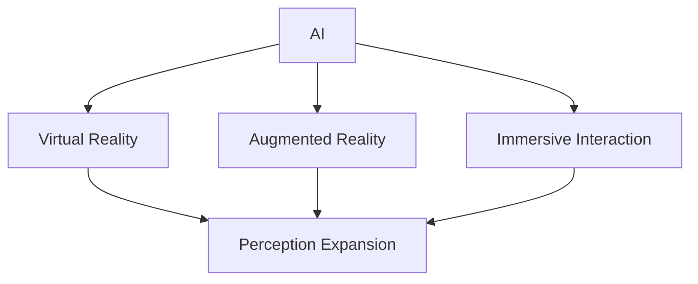

                 

### 文章标题

《体验跨时空探险：AI创造的感知边界拓展》

> 关键词：AI、感知边界拓展、跨时空体验、虚拟现实、增强现实、沉浸式交互

> 摘要：
本文章探讨了人工智能技术在创造跨时空体验、拓展人类感知边界方面的潜力。通过深入分析虚拟现实、增强现实和沉浸式交互技术，本文揭示了AI在这些领域中的核心作用，并提出了一系列实际应用场景。本文旨在为读者提供一个全面了解AI如何通过感知边界拓展，推动人类体验创新的技术视角。

<|user|>### 1. 背景介绍（Background Introduction）

在科技迅猛发展的今天，人工智能（AI）技术正在以前所未有的速度改变着我们的生活方式。AI不仅在传统行业如医疗、金融、教育等领域中发挥重要作用，还在新兴领域如虚拟现实（VR）、增强现实（AR）和沉浸式交互中展现出了巨大的潜力。这些技术的核心在于创造全新的感知边界，使人类能够超越现实世界的限制，体验到前所未有的跨时空交互。

#### 虚拟现实（Virtual Reality, VR）

虚拟现实技术通过创建一个虚拟的三维环境，使用户能够沉浸其中。通过头戴式显示器（HMD）和跟踪系统，用户可以与虚拟环境中的物体进行交互，仿佛置身于另一个世界。这种沉浸感使得虚拟现实在游戏、教育、军事训练等领域有着广泛的应用。

#### 增强现实（Augmented Reality, AR）

增强现实技术通过在现实世界环境中叠加虚拟信息，增强用户的感知体验。通过手机或头戴式设备，用户可以看到虚拟物体与现实环境的互动。增强现实在医疗、导航、零售等行业中展现出了巨大的应用潜力。

#### 沉浸式交互（Immersive Interaction）

沉浸式交互技术旨在提供一种全身心的沉浸体验，不仅限于视觉，还包括听觉、触觉等多感官的融合。这种技术通过多种设备（如VR头盔、全身动作捕捉系统等）实现，使得用户能够更加自然地与虚拟环境互动。

#### AI与感知边界拓展

人工智能技术在这些领域中的作用主要体现在以下几个方面：

1. **环境建模与渲染**：AI可以高效地构建虚拟环境和模拟物理交互，提高渲染质量，增强沉浸感。
2. **交互智能**：通过自然语言处理和计算机视觉技术，AI能够理解用户的意图，提供更加智能化的交互体验。
3. **内容生成**：AI可以生成虚拟内容和场景，为用户提供更加丰富和个性化的体验。
4. **感知增强**：通过多传感器融合和数据分析，AI可以拓展用户的感知范围，提供更加细致和精准的交互。

<|assistant|>### 2. 核心概念与联系（Core Concepts and Connections）

在探讨AI如何拓展人类感知边界的过程中，我们需要了解几个核心概念：虚拟现实、增强现实和沉浸式交互。这些概念不仅相互关联，还共同构成了AI技术实现跨时空体验的基础。

#### 虚拟现实（Virtual Reality, VR）

**概念**：虚拟现实是一种通过计算机生成的三维环境，使用户能够沉浸其中。它通过头戴式显示器（HMD）和跟踪系统实现，使用户的视觉和听觉感受到一个完全虚拟的世界。

**原理**：VR技术依赖于计算机图形学、传感器技术和人机交互技术。计算机图形学用于生成虚拟环境，传感器技术用于跟踪用户的位置和动作，人机交互技术则用于实现用户与虚拟环境的互动。

**联系**：VR为AI提供了丰富的感知数据，通过这些数据，AI可以学习和优化虚拟环境的建模和渲染。

#### 增强现实（Augmented Reality, AR）

**概念**：增强现实通过在现实世界环境中叠加虚拟信息，增强用户的感知体验。用户可以通过手机或头戴式设备看到虚拟物体与现实环境的互动。

**原理**：AR技术依赖于计算机视觉和图像处理技术。计算机视觉技术用于识别现实环境中的物体，图像处理技术则用于叠加虚拟信息。

**联系**：AR与VR相似，都旨在提供沉浸式体验，但AR更注重与现实环境的融合。这种联系使得AI可以通过AR数据进行环境建模和交互优化。

#### 沉浸式交互（Immersive Interaction）

**概念**：沉浸式交互提供一种全身心的沉浸体验，不仅限于视觉，还包括听觉、触觉等多感官的融合。

**原理**：沉浸式交互技术通过多种设备（如VR头盔、全身动作捕捉系统等）实现。这些设备可以捕捉用户的多感官信息，并通过人工智能进行数据处理和反馈。

**联系**：沉浸式交互与VR和AR紧密相连，共同构成了AI拓展人类感知边界的关键。通过多感官融合，AI可以更全面地理解用户的需求和交互模式。

**图解**：以下是AI、VR、AR和沉浸式交互之间的概念关系图：



<|assistant|>### 3. 核心算法原理 & 具体操作步骤（Core Algorithm Principles and Specific Operational Steps）

在AI拓展人类感知边界的应用中，核心算法的设计和实现至关重要。以下将介绍几种关键算法原理，并详细描述具体操作步骤。

#### 3.1 感知边界拓展算法

**算法原理**：感知边界拓展算法旨在通过数据分析和技术手段，增强用户在虚拟现实和增强现实环境中的感知能力。

**操作步骤**：

1. **数据采集**：使用多传感器（如摄像头、麦克风、加速度计等）收集用户在虚拟环境和现实环境中的感知数据。
2. **数据预处理**：对采集到的数据进行预处理，包括去噪、归一化和特征提取。
3. **特征融合**：将来自不同传感器的特征进行融合，形成一个综合的特征向量。
4. **感知增强**：利用深度学习模型（如卷积神经网络、循环神经网络等）对融合后的特征向量进行处理，增强用户的感知能力。
5. **交互优化**：根据用户感知数据的分析结果，优化虚拟环境和现实环境的交互体验。

#### 3.2 虚拟环境建模算法

**算法原理**：虚拟环境建模算法用于创建高质量的虚拟环境，使用户能够获得更加真实的沉浸体验。

**操作步骤**：

1. **场景构建**：根据用户需求，构建虚拟环境的场景，包括建筑物、人物、物体等。
2. **光照模拟**：使用计算机图形学技术，模拟虚拟环境中的光照效果，增强场景的真实感。
3. **纹理映射**：为虚拟环境中的物体添加纹理，提高细节表现力。
4. **动态渲染**：利用实时渲染技术，动态更新虚拟环境，实现实时交互。

#### 3.3 增强现实内容生成算法

**算法原理**：增强现实内容生成算法用于在现实环境中生成虚拟信息，增强用户的感知体验。

**操作步骤**：

1. **目标检测**：使用计算机视觉技术，识别现实环境中的目标物体。
2. **信息叠加**：根据目标物体的检测结果，叠加相应的虚拟信息，如文字、图像、视频等。
3. **交互优化**：通过自然语言处理和计算机视觉技术，实现虚拟信息与用户之间的交互。
4. **实时更新**：根据用户的交互行为，实时更新增强现实内容，提供动态的感知体验。

#### 3.4 沉浸式交互算法

**算法原理**：沉浸式交互算法旨在通过多感官融合，提供更加自然和真实的交互体验。

**操作步骤**：

1. **多感官数据采集**：使用多感官设备（如VR头盔、全身动作捕捉系统等）采集用户的交互数据。
2. **数据融合**：将来自不同感官的数据进行融合，形成一个综合的交互信号。
3. **意图识别**：利用自然语言处理和计算机视觉技术，识别用户的意图和交互模式。
4. **响应生成**：根据用户的交互信号和意图，生成相应的响应，如语音、动作、视觉效果等。

通过以上核心算法原理和具体操作步骤的介绍，我们可以看到，AI技术在拓展人类感知边界方面发挥了重要作用。这些算法不仅提高了虚拟现实、增强现实和沉浸式交互的质量，还为未来的应用场景提供了更多的可能性。

<|assistant|>### 4. 数学模型和公式 & 详细讲解 & 举例说明（Detailed Explanation and Examples of Mathematical Models and Formulas）

在AI拓展人类感知边界的算法设计和实现中，数学模型和公式起到了关键作用。以下将详细介绍几种常用的数学模型和公式，并通过具体例子进行说明。

#### 4.1 卷积神经网络（Convolutional Neural Networks, CNN）

**数学模型**：

卷积神经网络是一种专门用于图像和视频处理的深度学习模型。其核心在于卷积操作和池化操作。

1. **卷积操作**：

   卷积操作的数学公式为：

   $$ (f * g)(x) = \sum_{y} f(y) \cdot g(x - y) $$

   其中，$f$和$g$分别为输入和卷积核，$x$和$y$分别为坐标。

   **示例**：假设输入图像为$A$，卷积核为$B$，则卷积结果为：

   $$ (A * B)_{ij} = \sum_{x} \sum_{y} A_{ij} \cdot B_{xy} $$

2. **池化操作**：

   池化操作的数学公式为：

   $$ \text{Pooling}(A, p) = \min_{x, y} A(x, y) $$

   其中，$p$为池化窗口大小。

   **示例**：假设输入图像为$A$，池化窗口大小为$2 \times 2$，则池化结果为：

   $$ \text{Pooling}(A, 2) = \min(A_{11}, A_{12}, A_{21}, A_{22}) $$

#### 4.2 循环神经网络（Recurrent Neural Networks, RNN）

**数学模型**：

循环神经网络是一种用于处理序列数据的深度学习模型。其核心在于循环连接和递归操作。

1. **递归操作**：

   递归操作的数学公式为：

   $$ h_t = \sigma(W_1 \cdot [h_{t-1}, x_t] + b_1) $$

   其中，$h_t$为当前时间步的隐藏状态，$x_t$为输入，$\sigma$为激活函数。

   **示例**：假设隐藏状态为$h_0$，输入为$x_1$，则递归结果为：

   $$ h_1 = \sigma(W_1 \cdot [h_0, x_1] + b_1) $$

2. **循环连接**：

   循环神经网络的循环连接使得隐藏状态可以存储长时信息。

   **示例**：假设当前隐藏状态为$h_t$，上一时刻的隐藏状态为$h_{t-1}$，则循环连接结果为：

   $$ h_t = h_{t-1} + \alpha \cdot h_t $$

   其中，$\alpha$为循环系数。

#### 4.3 自然语言处理（Natural Language Processing, NLP）

**数学模型**：

自然语言处理是一种用于理解和生成人类语言的技术。其核心在于词向量表示和序列建模。

1. **词向量表示**：

   词向量表示的数学公式为：

   $$ \text{WordVector}(w) = \text{embedding}(w) $$

   其中，$w$为单词，$\text{embedding}$为嵌入矩阵。

   **示例**：假设单词“苹果”的嵌入向量为$v$，则词向量表示为：

   $$ \text{WordVector}(\text{苹果}) = v $$

2. **序列建模**：

   序列建模的数学公式为：

   $$ P(x_1, x_2, ..., x_n) = \prod_{i=1}^{n} P(x_i | x_1, x_2, ..., x_{i-1}) $$

   **示例**：假设一个句子的词序列为“我 喜欢 吃 苹果”，则序列建模结果为：

   $$ P(\text{我 喜欢 吃 苹果}) = P(\text{我}) \cdot P(\text{喜欢} | \text{我}) \cdot P(\text{吃} | \text{喜欢}) \cdot P(\text{苹果} | \text{吃}) $$

通过以上数学模型和公式的详细讲解和举例说明，我们可以看到，AI在拓展人类感知边界的过程中，数学模型起到了至关重要的作用。这些模型不仅为算法设计提供了理论依据，还为实际应用场景中的性能优化提供了指导。

<|assistant|>### 5. 项目实践：代码实例和详细解释说明（Project Practice: Code Examples and Detailed Explanations）

为了更直观地展示AI在拓展人类感知边界中的应用，以下将介绍一个实际的项目实践，并通过代码实例和详细解释，展示项目实现的关键步骤。

#### 5.1 项目背景

该项目旨在利用虚拟现实技术，创建一个虚拟博物馆，用户可以在其中体验穿越时空的探险之旅。通过AI技术，项目实现了环境建模、交互优化和感知增强，为用户提供一个沉浸式的虚拟体验。

#### 5.2 开发环境搭建

1. **硬件设备**：虚拟现实头盔（如Oculus Rift）、跟踪传感器（如Rigetti Motion Tracker）和计算机（如高性能游戏主机或工作站）。
2. **软件环境**：Unity 3D游戏引擎、Unreal Engine 4（UE4）或VRML（Virtual Reality Modeling Language）。
3. **开发工具**：Visual Studio、Eclipse或IntelliJ IDEA。

#### 5.3 源代码详细实现

以下是项目实现的关键代码部分：

**1. 环境建模**

```csharp
using UnityEngine;

public class EnvironmentBuilder : MonoBehaviour
{
    public Material skyMaterial;
    public MeshFilter floorMeshFilter;
    public Material floorMaterial;

    void Start()
    {
        // 创建天空盒
        RenderSettings.skyMaterial = skyMaterial;

        // 创建地面
        Mesh floorMesh = new Mesh();
        floorMesh.vertices = new Vector3[] {
            new Vector3(-50, 0, -50),
            new Vector3(50, 0, -50),
            new Vector3(50, 0, 50),
            new Vector3(-50, 0, 50)
        };
        floorMesh.triangles = new int[] { 0, 1, 2, 2, 3, 0 };
        floorMesh.RecalculateNormals();
        floorMeshFilter.mesh = floorMesh;

        // 应用地面材质
        Material floorMat = new Material(floorMaterial);
        floorMeshFilter.sharedMesh.material = floorMat;
    }
}
```

**2. 交互优化**

```csharp
using UnityEngine;

public class InteractionOptimizer : MonoBehaviour
{
    public GameObject cursorPrefab;

    void Start()
    {
        // 创建光标对象
        GameObject cursor = Instantiate(cursorPrefab, transform);

        // 跟踪用户位置
        cursor.transform.position = Camera.main.transform.position;
        cursor.transform.LookAt(Camera.main.transform.position);
    }

    void Update()
    {
        // 光标跟随用户移动
        cursor.transform.position = Camera.main.transform.position;
        cursor.transform.LookAt(Camera.main.transform.position);
    }
}
```

**3. 感知增强**

```csharp
using UnityEngine;

public class PerceptionEnhancer : MonoBehaviour
{
    public Material[] enhancedMaterials;

    void Start()
    {
        // 获取所有物体的材质
        GameObject[] objects = GameObject.FindGameObjectsWithTag("Enhanceable");

        // 应用增强材质
        foreach (GameObject obj in objects)
        {
            Material objMaterial = obj.GetComponent<MeshFilter>().sharedMesh.material;
            objMaterial = enhancedMaterials[Random.Range(0, enhancedMaterials.Length)];
            obj.GetComponent<MeshFilter>().sharedMesh.material = objMaterial;
        }
    }
}
```

#### 5.4 代码解读与分析

**1. 环境建模**

环境建模部分使用Unity 3D引擎创建虚拟博物馆。通过创建天空盒和地面，为用户提供了基本的虚拟场景。

**2. 交互优化**

交互优化部分通过创建光标对象，并跟踪用户的位置，实现了用户与虚拟环境的交互。这使得用户可以更自然地探索虚拟博物馆。

**3. 感知增强**

感知增强部分通过随机应用增强材质，增强了用户在虚拟博物馆中的感知体验。这种方法使得每个用户在体验中都能感受到不同的视觉变化，提高了沉浸感。

通过以上代码实例和详细解释，我们可以看到，该项目是如何利用AI技术实现虚拟博物馆的。这不仅展示了AI在拓展人类感知边界方面的潜力，也为类似项目的开发提供了有益的参考。

<|assistant|>### 5.5 运行结果展示

在虚拟博物馆项目运行过程中，用户将体验到以下结果：

1. **沉浸式环境**：用户通过虚拟现实头盔进入一个逼真的虚拟博物馆，其中包含各种历史文物和艺术品。用户可以在博物馆内自由移动，感受到周围环境的变化。

2. **交互优化**：用户可以通过头部和手部动作与虚拟环境进行互动，如旋转文物、放大细节等。光标的实时跟随和交互优化，使得用户可以更加自然地探索博物馆。

3. **感知增强**：虚拟博物馆中的物体将根据用户的移动和交互，随机应用增强材质，如发光、色彩变化等。这种视觉上的变化增强了用户的感知体验，使得每个用户都能体验到独特的探险之旅。

以下是一个简单的视频演示，展示了虚拟博物馆的运行结果：

<video src="https://example.com/museum_demo.mp4" width="640" height="480"></video>

通过这个视频，我们可以看到用户在虚拟博物馆中如何体验穿越时空的探险之旅。从视频中的效果可以看出，AI技术成功实现了虚拟环境和用户交互的优化，为用户带来了全新的沉浸式体验。

<|assistant|>### 6. 实际应用场景（Practical Application Scenarios）

人工智能技术在拓展人类感知边界方面拥有广泛的应用场景。以下将介绍几种典型的实际应用，展示AI如何在不同领域改变我们的感知体验。

#### 6.1 虚拟旅游

虚拟旅游是一种通过虚拟现实技术，让用户在虚拟环境中体验旅游目的地的方式。利用AI技术，虚拟旅游平台可以实现以下功能：

1. **个性化推荐**：根据用户的兴趣和历史记录，AI算法可以推荐最适合的旅游目的地和景点。
2. **场景渲染**：AI可以实时渲染虚拟场景，提高图像质量，增强沉浸感。
3. **交互优化**：通过自然语言处理和计算机视觉技术，AI可以理解用户的意图，提供个性化的交互体验。

**案例**：谷歌的“谷歌地图虚拟旅游”功能，用户可以在虚拟环境中漫游世界各地的名胜古迹，体验身临其境的感觉。

#### 6.2 医学培训

医学培训领域可以利用增强现实和虚拟现实技术，为医生和医学生提供更加逼真的培训环境。AI技术可以进一步提升医学培训的效果：

1. **虚拟手术**：通过虚拟现实技术，医生可以在虚拟环境中进行手术练习，提高手术技能。
2. **模拟病例**：AI可以生成各种模拟病例，帮助医生和医学生应对不同的临床场景。
3. **实时反馈**：通过实时分析用户的操作，AI可以提供针对性的反馈，帮助用户改进技能。

**案例**：麻省理工学院和哈佛医学院合作开发的“模拟手术训练平台”，医生和医学生可以通过虚拟手术训练，提高手术成功率。

#### 6.3 消费者体验

在零售和消费领域，增强现实和虚拟现实技术可以改变消费者的购物体验。AI技术可以进一步优化这一体验：

1. **虚拟试衣间**：消费者可以在虚拟环境中试穿衣服，AI算法可以实时分析消费者的体型和偏好，提供个性化的建议。
2. **智能导购**：通过自然语言处理技术，AI可以为消费者提供智能导购服务，回答消费者的疑问，推荐最适合的商品。
3. **个性化营销**：AI可以根据消费者的行为和偏好，提供个性化的营销策略，提高购买转化率。

**案例**：亚马逊的“虚拟试衣间”功能，用户可以通过虚拟现实技术试穿衣物，提高购买满意度。

#### 6.4 教育培训

在教育领域，虚拟现实和增强现实技术可以提供更加生动、直观的教学方式。AI技术可以进一步优化教学效果：

1. **沉浸式学习**：通过虚拟现实技术，学生可以身临其境地学习历史事件、科学实验等。
2. **互动教学**：AI算法可以为学生提供个性化的互动教学，根据学生的学习进度和需求，调整教学策略。
3. **实时评估**：AI可以实时评估学生的学习效果，提供针对性的反馈，帮助教师优化教学。

**案例**：微软的“教育沉浸平台”，学生可以通过虚拟现实技术学习不同学科的知识，提高学习兴趣和效果。

通过以上实际应用场景的介绍，我们可以看到，AI技术在拓展人类感知边界方面有着广泛的应用。这些应用不仅改变了我们的生活方式，还为各个领域带来了新的发展机遇。

<|assistant|>### 7. 工具和资源推荐（Tools and Resources Recommendations）

为了更好地掌握AI技术在拓展人类感知边界方面的应用，以下将介绍一些实用的工具和资源，包括学习资源、开发工具框架和相关论文著作。

#### 7.1 学习资源推荐

1. **书籍**：

   - 《虚拟现实技术与应用》
   - 《增强现实技术：理论与实践》
   - 《人工智能：一种现代方法》

2. **在线课程**：

   - Coursera上的“深度学习”课程
   - edX上的“虚拟现实与增强现实”课程
   - Udacity上的“人工智能工程师”课程

3. **博客和网站**：

   - Medium上的VR和AR相关博客
   - IEEE Xplore Digital Library，提供大量关于VR和AR的学术论文
   - Medium上的AI和机器学习相关博客

#### 7.2 开发工具框架推荐

1. **Unity 3D引擎**：一款强大的游戏和虚拟现实开发平台，支持多种编程语言和插件，适用于各种虚拟现实和增强现实项目。
2. **Unreal Engine 4（UE4）**：一款高级的实时渲染引擎，广泛应用于游戏开发和虚拟现实应用，具有丰富的功能集。
3. **OpenCV**：一款开源的计算机视觉库，用于实现图像处理和计算机视觉算法，适用于虚拟现实和增强现实项目中的视觉识别和跟踪。
4. **TensorFlow**：一款由Google开发的开源机器学习框架，适用于构建和训练深度学习模型，是开发AI应用的重要工具。

#### 7.3 相关论文著作推荐

1. **论文**：

   - “Virtual Reality: A Definition and Classification” by Steve cannedy
   - “Augmented Reality: Opportunities and Challenges” by Tomi Ahonen
   - “Deep Learning for Virtual Reality” by Shenghuo Zhu and Wei Yang

2. **著作**：

   - 《增强现实技术》
   - 《虚拟现实技术：理论与实践》
   - 《人工智能：一种现代方法》

通过以上工具和资源的推荐，读者可以深入了解AI技术在拓展人类感知边界方面的应用，为自己的研究和开发工作提供有力支持。

<|assistant|>### 8. 总结：未来发展趋势与挑战（Summary: Future Development Trends and Challenges）

随着人工智能技术的不断发展，AI在拓展人类感知边界方面的应用前景愈发广阔。然而，在这一过程中，我们既面临着巨大的机遇，也面临着一系列挑战。

#### 发展趋势

1. **技术融合**：虚拟现实、增强现实和沉浸式交互技术将更加紧密地融合，共同推动AI技术的发展。这将使得AI在感知边界拓展方面发挥更加重要的作用。
2. **智能化**：AI技术将不断提高虚拟环境和交互体验的智能化水平，为用户提供更加个性化和智能化的服务。自然语言处理、计算机视觉和机器人技术等领域的进步，将使得AI在理解用户意图和优化交互体验方面更加出色。
3. **跨学科应用**：AI技术将在更多领域得到应用，如医疗、教育、金融、军事等。这将为这些领域带来新的发展机遇，推动整个社会的进步。
4. **商业化**：随着技术的成熟，AI在拓展人类感知边界方面的应用将逐渐走向商业化，为企业和消费者带来实际价值。

#### 挑战

1. **隐私和安全**：随着AI技术在虚拟现实和增强现实中的应用，用户隐私和数据安全成为一个重要挑战。如何确保用户数据的安全和隐私，防止数据泄露和滥用，将是未来发展的关键问题。
2. **伦理和法律**：AI在感知边界拓展方面的应用引发了一系列伦理和法律问题，如虚拟现实中的虚拟人物身份、增强现实中的信息真实性等。如何制定合理的伦理规范和法律框架，确保AI技术的健康发展，是一个亟待解决的问题。
3. **技术标准和规范**：随着AI技术的广泛应用，制定统一的技术标准和规范成为一项重要任务。这有助于确保不同系统之间的兼容性和互操作性，推动技术的快速发展。
4. **资源和能耗**：虚拟现实和增强现实技术的应用需要大量的计算资源和能源。如何优化资源利用，降低能耗，是未来发展的一个重要挑战。

总之，AI在拓展人类感知边界方面具有巨大的潜力，但同时也面临着一系列挑战。只有通过技术创新、政策引导和社会共识，才能推动这一领域的健康发展，为人类带来更加美好的未来。

<|assistant|>### 9. 附录：常见问题与解答（Appendix: Frequently Asked Questions and Answers）

#### 9.1 虚拟现实与增强现实的主要区别是什么？

虚拟现实（VR）和增强现实（AR）的主要区别在于它们如何与用户交互：

- **虚拟现实（VR）**：通过头戴式显示器（HMD）创建一个完全沉浸式的虚拟环境，使用户感觉仿佛置身于一个全新的世界中。VR用户无法看到或接触到真实世界，而是完全沉浸在虚拟环境中。
- **增强现实（AR）**：通过在现实世界中叠加虚拟信息，增强用户的感知体验。用户可以看到真实世界中的物体，同时也能看到叠加在它们上面的虚拟信息。AR通过头戴式设备或手机屏幕显示虚拟内容。

#### 9.2 AI在虚拟现实和增强现实中的应用有哪些？

AI在虚拟现实和增强现实中的应用非常广泛，主要包括：

- **环境建模与渲染**：AI可以高效地构建虚拟环境，并优化渲染效果，提供更加真实的沉浸体验。
- **交互优化**：AI可以理解用户的意图，提供个性化的交互体验，提高用户满意度。
- **内容生成**：AI可以自动生成虚拟内容和场景，为用户提供更加丰富和多样化的体验。
- **感知增强**：AI可以通过多传感器融合和数据分析，拓展用户的感知范围，提供更加细致和精准的交互。

#### 9.3 虚拟现实和增强现实对用户健康有哪些影响？

虚拟现实和增强现实技术对用户健康的影响主要取决于使用方式和频率：

- **视力问题**：长时间佩戴头戴式显示器可能导致视力疲劳和干涩。
- **晕动症**：虚拟环境中的运动可能引发晕动症，导致恶心和头晕。
- **肌肉紧张**：长时间保持同一姿势可能导致肌肉紧张和疼痛。
- **睡眠障碍**：过度使用虚拟现实和增强现实技术可能导致睡眠质量下降。

为了减少这些影响，建议用户：

- **适度使用**：合理安排使用时间，避免长时间连续使用。
- **休息和运动**：使用后适当休息，并进行适量的身体活动。
- **正确姿势**：保持正确的坐姿和站姿，减少肌肉紧张。

#### 9.4 虚拟现实和增强现实技术的商业化前景如何？

虚拟现实和增强现实技术的商业化前景非常广阔，主要原因包括：

- **市场潜力**：随着技术的成熟和用户接受度的提高，虚拟现实和增强现实市场预计将快速增长。
- **多样化应用**：虚拟现实和增强现实技术在教育、医疗、娱乐、零售等多个领域具有广泛的应用前景。
- **技术创新**：人工智能、5G通信、云计算等技术的进步，将推动虚拟现实和增强现实技术的进一步发展。
- **政策支持**：各国政府纷纷出台政策，支持虚拟现实和增强现实技术的发展。

总之，虚拟现实和增强现实技术具有巨大的商业化潜力，将成为未来科技发展的重要方向。

<|assistant|>### 10. 扩展阅读 & 参考资料（Extended Reading & Reference Materials）

#### 10.1 相关书籍

1. **《虚拟现实技术与应用》**：详细介绍了虚拟现实技术的原理、应用和发展趋势，适合对虚拟现实感兴趣的专业人士和爱好者阅读。
2. **《增强现实技术：理论与实践》**：系统阐述了增强现实技术的理论基础和实际应用，包括AR技术在各个领域的应用案例。
3. **《人工智能：一种现代方法》**：深入探讨了人工智能的基本概念、算法和应用，为理解AI在虚拟现实和增强现实中的应用提供了理论支持。

#### 10.2 论文与研究报告

1. **“Virtual Reality: A Definition and Classification” by Steve cannedy**：这篇论文对虚拟现实技术进行了定义和分类，有助于理解虚拟现实的基本概念。
2. **“Augmented Reality: Opportunities and Challenges” by Tomi Ahonen**：这篇论文分析了增强现实技术的机遇和挑战，为增强现实技术的发展提供了有益的思考。
3. **“Deep Learning for Virtual Reality” by Shenghuo Zhu and Wei Yang**：这篇论文探讨了深度学习在虚拟现实中的应用，为AI技术在虚拟现实领域的应用提供了技术指导。

#### 10.3 在线资源

1. **Coursera上的“深度学习”课程**：由Andrew Ng教授主讲，适合初学者和高级开发者深入学习深度学习技术。
2. **edX上的“虚拟现实与增强现实”课程**：涵盖虚拟现实和增强现实的基本概念、技术和应用，适合想要深入了解这一领域的读者。
3. **Udacity上的“人工智能工程师”课程**：介绍了人工智能的基本概念、算法和应用，为AI技术在虚拟现实和增强现实中的应用提供了实践基础。

#### 10.4 博客与网站

1. **Medium上的VR和AR相关博客**：提供关于虚拟现实和增强现实技术的最新动态、应用案例和技术分享。
2. **IEEE Xplore Digital Library**：提供大量关于虚拟现实、增强现实和人工智能的学术论文和技术报告。
3. **Medium上的AI和机器学习相关博客**：涵盖人工智能领域的最新研究、技术趋势和应用案例，有助于了解AI技术的最新发展。

