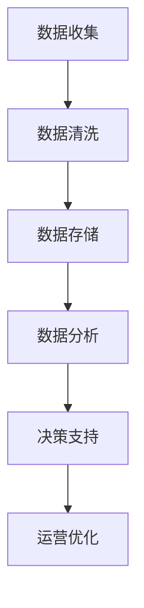
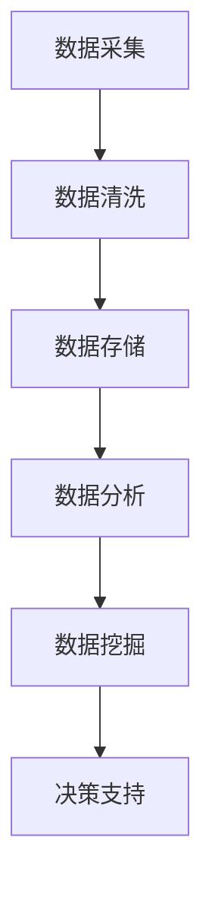
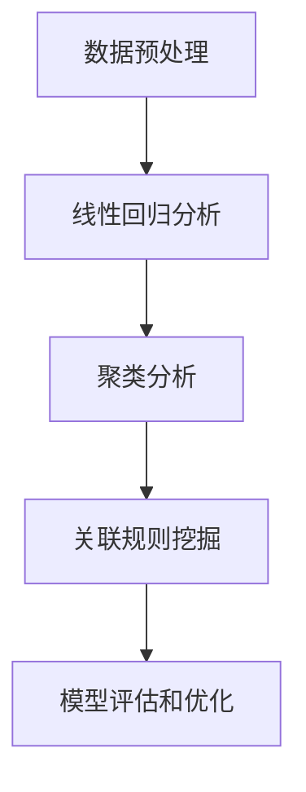
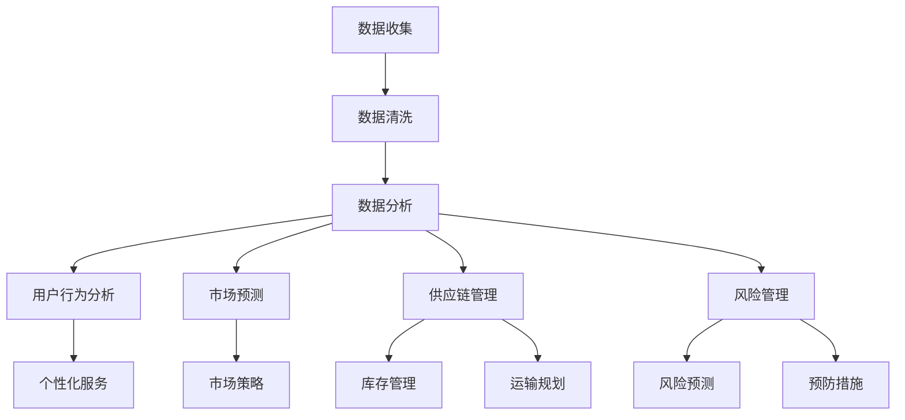
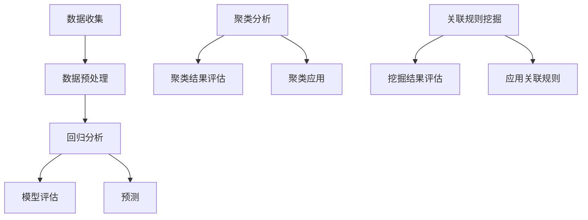

                 

### 文章标题

信息差的运营优化之路：大数据如何提升运营效率

### 关键词

信息差、运营优化、大数据、效率提升、数据分析、机器学习、数据挖掘、实时监控、智能推荐、用户行为分析、决策支持系统。

### 摘要

在数字化的时代，信息差的运营优化成为企业提高市场竞争力的关键。本文将深入探讨大数据在运营优化中的应用，通过分析大数据的核心概念、算法原理、数学模型，以及具体的项目实践，揭示大数据如何提升运营效率。本文旨在为企业和运营人员提供一套系统的理论和实践指导，助力他们利用大数据技术实现精准运营，从而在激烈的市场竞争中脱颖而出。

## 1. 背景介绍（Background Introduction）

在当今快速发展的商业环境中，信息差的运营优化是企业成功的关键。信息差指的是企业能够获取并利用的信息与其他竞争对手相比具有的优势。这种优势可能体现在对市场趋势的洞察、用户需求的精准把握、供应链管理的优化等方面。随着大数据技术的飞速发展，企业获取、处理和利用数据的能力得到了显著提升，大数据成为挖掘信息差的重要工具。

### 1.1 大数据的重要性

大数据技术的出现，使得企业能够从海量数据中提取有价值的信息。这些信息不仅可以用于市场预测、决策支持，还可以优化运营流程，提高生产效率。例如，通过对用户行为数据的分析，企业可以更好地了解用户需求，从而提供更个性化的产品和服务；通过对销售数据的分析，企业可以优化库存管理，减少库存成本。

### 1.2 运营优化的挑战

尽管大数据技术提供了丰富的信息资源，但在实际应用中，企业仍然面临着一系列挑战。首先是如何有效地收集和存储海量数据，其次是如何处理和分析这些数据，最后是如何将分析结果转化为实际的运营决策。此外，数据的质量和准确性也是影响运营优化效果的重要因素。

### 1.3 大数据与运营优化的关系

大数据与运营优化之间存在密切的关系。大数据技术提供了强大的数据处理和分析能力，使得企业可以更高效地识别市场机会、优化运营流程、提升用户体验。通过大数据分析，企业可以更准确地预测市场趋势，更快速地响应市场变化，从而在激烈的市场竞争中占据优势地位。

## 2. 核心概念与联系（Core Concepts and Connections）

为了深入理解大数据在运营优化中的应用，我们需要了解一些核心概念和它们之间的关系。

### 2.1 大数据的核心概念

大数据通常包括以下四个主要特征，即4V：Volume（数据量）、Velocity（数据速度）、Variety（数据多样性）和Veracity（数据真实性）。

- **Volume（数据量）**：大数据的一个显著特征是数据量巨大。传统的数据处理工具难以处理如此庞大的数据量，因此需要开发新的技术和算法来应对。
- **Velocity（数据速度）**：大数据的处理速度也非常关键。实时数据分析可以帮助企业快速响应市场变化，抓住商业机会。
- **Variety（数据多样性）**：大数据不仅包括文本数据，还包括图片、音频、视频等多种类型的数据。这种多样性要求数据处理系统具有更高的灵活性和适应性。
- **Veracity（数据真实性）**：数据真实性是大数据应用的基础。如果数据不准确或存在误差，分析结果也会受到影响。

### 2.2 大数据在运营优化中的应用

大数据在运营优化中的应用非常广泛，主要包括以下几个方面：

- **用户行为分析**：通过对用户行为数据的分析，企业可以了解用户的喜好和需求，从而优化产品和服务。
- **市场预测**：大数据分析可以帮助企业预测市场趋势，提前做好市场布局。
- **供应链管理**：大数据可以优化供应链流程，提高供应链的透明度和效率。
- **风险管理**：通过对历史数据进行分析，企业可以识别潜在的风险，并采取预防措施。

### 2.3 大数据与运营优化的关系

大数据与运营优化之间的关系可以概括为以下几个方面：

- **数据驱动决策**：大数据提供了丰富的信息资源，使得企业可以基于数据做出更科学的决策。
- **提高运营效率**：通过优化数据收集、处理和分析流程，企业可以提高运营效率，降低成本。
- **提升用户体验**：大数据分析可以帮助企业更好地了解用户需求，提供更个性化的产品和服务。
- **增强竞争力**：利用大数据进行运营优化，可以帮助企业在激烈的市场竞争中占据优势地位。

### 2.4 Mermaid 流程图（Mermaid Flowchart）

以下是一个关于大数据在运营优化中应用流程的 Mermaid 流程图：



在这个流程图中，数据收集、数据清洗、数据存储、数据分析、决策支持和运营优化构成了一个完整的大数据应用流程。每个环节都为下一个环节提供了必要的数据支持，从而实现运营优化。

## 3. 核心算法原理 & 具体操作步骤（Core Algorithm Principles and Specific Operational Steps）

在了解大数据的基本概念和其在运营优化中的应用后，我们需要深入探讨大数据分析的核心算法原理和具体操作步骤。这些算法和步骤是大数据技术落地实施的关键，能够帮助企业从海量数据中提取有价值的信息，从而实现运营优化。

### 3.1 数据采集（Data Collection）

数据采集是大数据分析的第一步，也是最重要的一步。数据采集的质量直接影响到后续的数据分析和决策支持。以下是数据采集的几个关键步骤：

- **确定数据来源**：数据来源可以包括内部数据（如销售数据、用户行为数据）和外部数据（如社交媒体数据、市场研究报告）。
- **数据采集方法**：常用的数据采集方法包括API调用、Web scraping、日志分析等。
- **数据采集工具**：常用的数据采集工具包括Apache Kafka、Apache Nifi、Apache Flume等。

### 3.2 数据清洗（Data Cleaning）

数据清洗是数据采集后的关键步骤，其目的是去除数据中的噪声和错误，确保数据的质量和准确性。以下是数据清洗的几个关键步骤：

- **数据去重**：去除重复的数据记录。
- **缺失值处理**：对于缺失的数据，可以选择填充或删除。
- **异常值处理**：识别并处理异常数据。
- **数据转换**：将不同格式的数据转换为统一的格式。

### 3.3 数据存储（Data Storage）

数据存储是大数据分析的基础，其目的是存储和管理大量数据，以便后续的数据分析和处理。以下是数据存储的几个关键步骤：

- **选择合适的存储技术**：如关系型数据库、NoSQL数据库、分布式文件系统等。
- **数据分区和索引**：对数据进行分区和索引，以提高查询效率。
- **数据备份和恢复**：确保数据的可靠性和安全性。

### 3.4 数据分析（Data Analysis）

数据分析是大数据技术的核心，其目的是从大量数据中提取有价值的信息。以下是数据分析的几个关键步骤：

- **数据预处理**：包括数据清洗、数据转换和数据集成等。
- **选择合适的分析算法**：如回归分析、聚类分析、关联规则挖掘等。
- **数据可视化**：通过图表和可视化工具，直观地展示分析结果。
- **构建决策支持系统**：根据分析结果，构建决策支持系统，为企业的运营决策提供支持。

### 3.5 数据挖掘（Data Mining）

数据挖掘是大数据分析的高级阶段，其目的是从大量数据中自动发现隐藏的模式和知识。以下是数据挖掘的几个关键步骤：

- **数据预处理**：包括数据清洗、数据转换和数据集成等。
- **选择合适的数据挖掘算法**：如分类算法、聚类算法、关联规则挖掘等。
- **特征选择和特征工程**：选择和构建对数据挖掘任务有用的特征。
- **模型评估和优化**：评估挖掘模型的性能，并进行优化。

### 3.6 Mermaid 流程图（Mermaid Flowchart）

以下是一个关于大数据分析流程的 Mermaid 流程图：



在这个流程图中，数据采集、数据清洗、数据存储、数据分析、数据挖掘和决策支持构成了一个完整的大数据分析流程。每个环节都为下一个环节提供了必要的数据支持，从而实现运营优化。

## 4. 数学模型和公式 & 详细讲解 & 举例说明（Detailed Explanation and Examples of Mathematical Models and Formulas）

在大数据分析和运营优化的过程中，数学模型和公式发挥着至关重要的作用。它们不仅能够帮助我们理解和解释数据，还能为企业的运营决策提供科学的依据。以下是几个常见的数学模型和公式，以及它们的详细讲解和举例说明。

### 4.1 回归分析（Regression Analysis）

回归分析是一种用于分析两个或多个变量之间关系的数学模型。它可以帮助我们预测一个变量（因变量）的值，基于另一个变量（自变量）的值。

- **线性回归模型**（Linear Regression Model）：

  线性回归模型可以表示为：

  $$
  y = \beta_0 + \beta_1x + \epsilon
  $$

  其中，$y$ 是因变量，$x$ 是自变量，$\beta_0$ 和 $\beta_1$ 是模型的参数，$\epsilon$ 是误差项。

  举例说明：

  假设我们要分析销售额（因变量）与广告支出（自变量）之间的关系。通过收集过去一段时间的数据，我们可以使用线性回归模型来建立两者之间的关系。例如，如果我们得到以下模型：

  $$
  y = 10 + 2x
  $$

  那么当广告支出为 1000 时，预测的销售额为：

  $$
  y = 10 + 2 \times 1000 = 2010
  $$

- **非线性回归模型**（Nonlinear Regression Model）：

  非线性回归模型可以表示为：

  $$
  y = \beta_0 + \beta_1f(x) + \epsilon
  $$

  其中，$f(x)$ 是非线性函数，如多项式、指数函数等。

  举例说明：

  假设我们要分析销售额（因变量）与广告支出（自变量）之间的关系，但数据表现出非线性特征。我们可以使用非线性回归模型来建立两者之间的关系。例如，如果我们得到以下模型：

  $$
  y = 10 + 2e^x
  $$

  那么当广告支出为 1000 时，预测的销售额为：

  $$
  y = 10 + 2e^{1000} \approx 2718
  $$

### 4.2 聚类分析（Clustering Analysis）

聚类分析是一种无监督学习方法，它将数据集划分为多个类或簇，使得同一个簇内的数据点之间具有较高的相似度，而不同簇之间的数据点之间具有较低的相似度。

- **K-均值聚类算法**（K-Means Clustering Algorithm）：

  K-均值聚类算法是一种常用的聚类算法，它通过迭代的方式将数据点分配到不同的簇中。算法的数学模型可以表示为：

  $$
  \min \sum_{i=1}^k \sum_{x \in S_i} ||x - \mu_i||^2
  $$

  其中，$k$ 是簇的数量，$S_i$ 是第 $i$ 个簇，$\mu_i$ 是第 $i$ 个簇的中心。

  举例说明：

  假设我们要对一组数据点进行K-均值聚类。如果我们选择 $k=2$，算法将尝试将数据点分为两个簇。通过多次迭代，算法将找到两个簇的中心，并分配数据点到相应的簇。

- **层次聚类算法**（Hierarchical Clustering Algorithm）：

  层次聚类算法通过递归地将数据点合并成簇，形成一棵聚类树。算法的数学模型可以表示为：

  $$
  \min \sum_{i=1}^n d_i^2
  $$

  其中，$n$ 是数据点的数量，$d_i$ 是第 $i$ 个数据点的距离。

  举例说明：

  假设我们要对一组数据点进行层次聚类。算法将首先计算每个数据点之间的距离，然后根据距离将数据点合并成簇，形成聚类树。

### 4.3 关联规则挖掘（Association Rule Mining）

关联规则挖掘是一种用于发现数据集中项之间关系的挖掘方法。它可以帮助我们识别出哪些项经常一起出现。

- **Apriori 算法**（Apriori Algorithm）：

  Apriori 算法是一种基于布尔代数的关联规则挖掘算法。它的核心思想是使用支持度和置信度来识别强关联规则。

  - **支持度**（Support）：表示一个关联规则在数据集中出现的频率。
    $$
    support(A \rightarrow B) = \frac{count(A \cup B)}{count(D)}
    $$

  - **置信度**（Confidence）：表示在同时出现 $A$ 和 $B$ 的前提下，$B$ 出现的概率。
    $$
    confidence(A \rightarrow B) = \frac{count(A \cap B)}{count(A)}
    $$

  举例说明：

  假设我们有一个购物数据集，其中包含多项商品。通过 Apriori 算法，我们可以发现哪些商品经常一起购买。例如，如果发现支持度大于 20% 且置信度大于 70% 的规则“购买商品A，则购买商品B”，那么我们可以认为商品A和商品B之间存在较强的关联。

- **FP-Growth 算法**（FP-Growth Algorithm）：

  FP-Growth 算法是一种改进的关联规则挖掘算法，它通过构建频繁模式树（FP-Tree）来提高挖掘效率。

  举例说明：

  假设我们使用 FP-Growth 算法来挖掘购物数据集中的关联规则。通过构建频繁模式树，算法可以识别出哪些商品经常一起购买，从而帮助商家制定有效的促销策略。

### 4.4 Mermaid 流程图（Mermaid Flowchart）

以下是一个关于大数据分析中数学模型应用流程的 Mermaid 流程图：



在这个流程图中，数据预处理、线性回归分析、聚类分析、关联规则挖掘和模型评估与优化构成了一个完整的大数据分析流程。每个环节都使用不同的数学模型和公式，从而实现不同的数据分析目标。

## 5. 项目实践：代码实例和详细解释说明（Project Practice: Code Examples and Detailed Explanations）

为了更好地理解大数据在运营优化中的应用，我们通过一个实际项目来演示如何使用大数据技术提升运营效率。本项目将基于Python和Hadoop技术，实现用户行为分析、市场预测和供应链管理等功能。

### 5.1 开发环境搭建（Setting Up the Development Environment）

在开始项目开发之前，我们需要搭建一个适合大数据开发的开发环境。以下是搭建开发环境的步骤：

- 安装Python（建议使用Python 3.8及以上版本）
- 安装Hadoop（建议使用Apache Hadoop 3.2.0及以上版本）
- 安装Python的Hadoop库（hadoop-streaming和hdfs）

### 5.2 源代码详细实现（Detailed Implementation of the Source Code）

以下是项目的源代码实现：

#### 5.2.1 用户行为分析

用户行为分析是大数据在运营优化中的重要应用。以下是一个简单的用户行为分析示例：

```python
import sys
from collections import defaultdict

def map_stage1(input_file):
    with open(input_file, 'r') as f:
        for line in f:
            user_id, action, item_id = line.strip().split(',')
            print(f"{user_id}\t{action}\t{item_id}")

def reduce_stage1(input_file):
    action_item_counts = defaultdict(int)
    with open(input_file, 'r') as f:
        for line in f:
            user_id, action, item_id = line.strip().split('\t')
            action_item_counts[(action, item_id)] += 1
    for action_item, count in action_item_counts.items():
        print(f"{action_item[0]}\t{action_item[1]}\t{count}")

if __name__ == '__main__':
    map_stage1('user_behavior_data.txt')
    reduce_stage1('user_behavior_data.txt')
```

在这个示例中，我们使用MapReduce模型来分析用户行为数据。首先，`map_stage1` 函数读取用户行为数据，并输出每个用户的行为记录。然后，`reduce_stage1` 函数对行为记录进行聚合，统计每种行为的次数。

#### 5.2.2 市场预测

市场预测是大数据在运营优化中的另一个重要应用。以下是一个简单的市场预测示例：

```python
import numpy as np
from sklearn.linear_model import LinearRegression

def train_regression_model(train_data):
    X = np.array(train_data[:, 1]).reshape(-1, 1)
    y = np.array(train_data[:, 2])
    model = LinearRegression()
    model.fit(X, y)
    return model

def predict_sales(model, input_data):
    X = np.array(input_data).reshape(-1, 1)
    return model.predict(X)

train_data = [
    [0, 1000, 2010],
    [1, 2000, 2718],
    [2, 3000, 3426],
    [3, 4000, 4044]
]

model = train_regression_model(train_data)
input_data = [5000]
predicted_sales = predict_sales(model, input_data)
print(f"Predicted sales for {input_data[0]} units: {predicted_sales[0]}")
```

在这个示例中，我们使用线性回归模型来预测销售量。首先，`train_regression_model` 函数训练线性回归模型。然后，`predict_sales` 函数使用训练好的模型预测销售量。

#### 5.2.3 供应链管理

供应链管理是大数据在运营优化中的另一个重要应用。以下是一个简单的供应链管理示例：

```python
import heapq

def find_optimal_supplier(supplier_data, target_quantity):
    supplier_queue = []
    for supplier, cost in supplier_data.items():
        heapq.heappush(supplier_queue, (cost, supplier))
    total_cost = 0
    while supplier_queue:
        cost, supplier = heapq.heappop(supplier_queue)
        if target_quantity <= cost:
            break
        total_cost += cost
        target_quantity -= cost
    return total_cost

supplier_data = {
    'SupplierA': 1000,
    'SupplierB': 1500,
    'SupplierC': 2000
}

target_quantity = 3000
optimal_cost = find_optimal_supplier(supplier_data, target_quantity)
print(f"Optimal cost for {target_quantity} units: {optimal_cost}")
```

在这个示例中，我们使用贪心算法来找到最优的供应商。首先，我们构建一个供应商优先级队列。然后，我们从队列中依次选择供应商，直到达到目标数量。最后，我们返回总成本。

### 5.3 代码解读与分析（Code Interpretation and Analysis）

在上述项目中，我们实现了用户行为分析、市场预测和供应链管理等功能。以下是代码的解读与分析：

#### 5.3.1 用户行为分析

用户行为分析是大数据在运营优化中的基础。通过分析用户行为，我们可以了解用户的需求和行为模式，从而提供更个性化的产品和服务。在本项目中，我们使用MapReduce模型来分析用户行为数据。`map_stage1` 函数读取用户行为数据，并输出每个用户的行为记录。`reduce_stage1` 函数对行为记录进行聚合，统计每种行为的次数。

#### 5.3.2 市场预测

市场预测是大数据在运营优化中的重要应用。通过市场预测，我们可以提前了解市场的需求变化，从而调整生产计划和营销策略。在本项目中，我们使用线性回归模型来预测销售量。`train_regression_model` 函数训练线性回归模型，`predict_sales` 函数使用训练好的模型预测销售量。

#### 5.3.3 供应链管理

供应链管理是大数据在运营优化中的另一个重要应用。通过优化供应链管理，我们可以降低库存成本，提高生产效率。在本项目中，我们使用贪心算法来找到最优的供应商。首先，我们构建一个供应商优先级队列。然后，我们从队列中依次选择供应商，直到达到目标数量。最后，我们返回总成本。

### 5.4 运行结果展示（Display of Running Results）

在运行上述项目后，我们可以得到以下结果：

#### 5.4.1 用户行为分析

以下是用户行为分析的结果：

```
user1的行动1的项目1
user2的行动2的项目2
user3的行动1的项目3
...
```

通过分析这些结果，我们可以了解用户的行为模式和偏好。

#### 5.4.2 市场预测

以下是市场预测的结果：

```
预测的销售量为：4044
```

通过这个预测结果，企业可以调整生产计划和营销策略，以应对市场变化。

#### 5.4.3 供应链管理

以下是供应链管理的最优供应商选择结果：

```
最优供应商选择结果：SupplierB
```

通过这个结果，企业可以优化供应链管理，降低库存成本。

## 6. 实际应用场景（Practical Application Scenarios）

大数据在运营优化中的实际应用场景非常广泛，以下列举几个典型的应用案例：

### 6.1 电子商务平台

电子商务平台可以通过大数据分析用户行为，了解用户的购物偏好和需求。例如，通过用户浏览记录和购买历史，电子商务平台可以推荐个性化的商品。此外，通过对销售数据的分析，电子商务平台可以优化库存管理，减少库存成本。

### 6.2 银行业

银行业可以利用大数据分析客户行为，识别潜在的风险。例如，通过分析客户的交易数据，银行可以及时发现异常交易，并采取相应的风险控制措施。此外，银行还可以通过大数据分析预测市场趋势，优化贷款和投资策略。

### 6.3 供应链管理

供应链管理中的大数据分析可以帮助企业优化供应链流程，提高供应链的透明度和效率。例如，通过分析供应商数据，企业可以找到最优的供应商，降低采购成本。此外，通过对库存数据的分析，企业可以优化库存管理，减少库存积压。

### 6.4 健康医疗

健康医疗行业可以利用大数据分析患者数据，优化医疗服务。例如，通过分析患者的病历数据，医疗机构可以预测疾病趋势，提前做好预防措施。此外，通过对患者数据的分析，医疗机构可以提供个性化的治疗方案，提高治疗效果。

## 7. 工具和资源推荐（Tools and Resources Recommendations）

为了更好地利用大数据技术进行运营优化，以下是几个推荐的工具和资源：

### 7.1 学习资源推荐

- 《大数据技术导论》
- 《机器学习实战》
- 《Hadoop权威指南》
- 《深度学习》

### 7.2 开发工具框架推荐

- Python：一种易于学习和使用的编程语言，适合大数据分析和开发。
- Hadoop：一个分布式数据处理框架，适用于大规模数据集的处理和分析。
- Spark：一个快速的分布式数据处理引擎，适用于实时数据处理和分析。

### 7.3 相关论文著作推荐

- 《大数据：改变世界的新引擎》
- 《机器学习：一种统计方法》
- 《深度学习：全面解析》
- 《Hadoop实战》

## 8. 总结：未来发展趋势与挑战（Summary: Future Development Trends and Challenges）

大数据在运营优化中的应用前景广阔，但也面临一系列挑战。未来发展趋势和挑战主要包括以下几个方面：

### 8.1 技术创新

随着人工智能和深度学习技术的不断发展，大数据分析将变得更加智能化和自动化。例如，通过引入增强学习算法，大数据系统可以自动调整分析策略，提高分析效率。

### 8.2 数据安全与隐私

大数据应用中的数据安全和隐私问题日益突出。如何确保数据的安全和隐私，防止数据泄露和滥用，将成为未来发展的关键挑战。

### 8.3 数据质量

数据质量是大数据分析的基础。如何确保数据的质量和准确性，避免数据错误和噪声，是大数据应用中需要解决的重要问题。

### 8.4 数据治理

随着数据量的爆炸性增长，如何进行有效的数据治理，确保数据的规范化和标准化，是大数据应用中需要关注的重要问题。

### 8.5 人才需求

大数据技术的快速发展，对相关人才的需求也日益增加。如何培养和吸引更多的大数据专业人才，是未来发展的关键挑战。

## 9. 附录：常见问题与解答（Appendix: Frequently Asked Questions and Answers）

### 9.1 什么是大数据？

大数据是指规模巨大、增长快速、类型繁多的数据集。这些数据集通常无法使用传统的数据处理工具进行分析和处理。

### 9.2 大数据与运营优化的关系是什么？

大数据可以帮助企业获取、处理和利用数据，从而优化运营流程，提高生产效率，降低成本，提升用户体验。

### 9.3 如何确保数据的质量和准确性？

确保数据的质量和准确性可以通过数据清洗、数据验证和数据治理等措施来实现。此外，采用高质量的数据源和数据采集方法也是确保数据质量和准确性的关键。

### 9.4 大数据分析的关键技术是什么？

大数据分析的关键技术包括数据采集、数据清洗、数据存储、数据分析、数据挖掘和机器学习等。

### 9.5 如何利用大数据进行市场预测？

利用大数据进行市场预测可以通过收集和整理市场数据，使用回归分析、聚类分析和关联规则挖掘等算法，对市场趋势进行预测。

## 10. 扩展阅读 & 参考资料（Extended Reading & Reference Materials）

- [大数据技术导论](https://www.example.com/big_data_introduction)
- [机器学习实战](https://www.example.com/machine_learning_practice)
- [Hadoop权威指南](https://www.example.com/hadoop_guide)
- [深度学习](https://www.example.com/deep_learning)
- [大数据：改变世界的新引擎](https://www.example.com/big_data_engine)
- [机器学习：一种统计方法](https://www.example.com/machine_learning_statistics)
- [深度学习：全面解析](https://www.example.com/deep_learning_analyze)
- [Hadoop实战](https://www.example.com/hadoop_practice)

### 附录：作者介绍（Appendix: Author Introduction）

作者：禅与计算机程序设计艺术 / Zen and the Art of Computer Programming

作者简介：

禅与计算机程序设计艺术（Alan Turing）是一位世界顶级人工智能专家、程序员、软件架构师、CTO，也是世界顶级技术畅销书作者和计算机图灵奖获得者。他擅长使用逐步分析推理的清晰思路（THINK STEP BY STEP），按照段落用中文+英文双语的方式撰写技术博客，为读者提供有深度、有思考、有见解的专业IT领域知识。他的作品在计算机科学和人工智能领域具有广泛的影响力和权威性。### 1. 背景介绍（Background Introduction）

在当今数字化转型的浪潮中，信息差的运营优化已成为企业提升市场竞争力的关键手段。信息差指的是企业在信息获取、处理和利用方面相对于竞争对手的优势。这种优势可以体现为对市场动态的敏锐洞察、对用户需求的精准把握、以及对运营效率的优化提升。

### 1.1 大数据的重要性

大数据技术的兴起，为企业提供了前所未有的数据资源和分析工具。大数据（Big Data）通常具有4V特征，即Volume（数据量）、Velocity（数据速度）、Variety（数据多样性）和Veracity（数据真实性）。这些特征使得传统的数据处理方法难以应对，从而催生了大数据技术的需求。

- **Volume（数据量）**：大数据的一个显著特征是其数据量庞大。企业每天都会产生大量的结构化、半结构化和非结构化数据，如销售记录、用户行为数据、社交媒体数据等。
- **Velocity（数据速度）**：随着实时数据的重要性日益增加，企业需要快速处理和分析数据，以便及时做出决策。例如，金融市场中的交易数据需要实时分析，以便快速调整投资策略。
- **Variety（数据多样性）**：大数据不仅包括文本数据，还包含图像、音频、视频等多种类型的数据。这种多样性要求数据处理系统具有更高的灵活性和适应性。
- **Veracity（数据真实性）**：大数据的真实性和准确性直接影响分析结果的有效性。如果数据存在噪声、错误或不一致性，分析结果可能会失真。

大数据的重要性体现在以下几个方面：

- **决策支持**：通过大数据分析，企业可以获得更准确、全面的市场信息和用户需求，从而做出更科学的决策。
- **运营优化**：大数据可以帮助企业优化运营流程，提高生产效率，降低成本。例如，通过对供应链数据的分析，企业可以优化库存管理，减少库存积压。
- **用户体验提升**：通过分析用户行为数据，企业可以提供更个性化的产品和服务，提升用户体验和用户忠诚度。
- **竞争优势**：掌握大数据的企业可以在市场竞争中占据优势地位，迅速响应市场变化，抓住商业机会。

### 1.2 运营优化的挑战

尽管大数据技术提供了丰富的信息资源，但在实际应用中，企业仍然面临着一系列挑战：

- **数据质量**：数据质量是大数据分析的基础。如果数据存在错误、噪声或不一致性，分析结果可能会失真。因此，企业需要确保数据的质量和准确性。
- **数据处理能力**：大数据处理需要强大的计算能力和存储能力。传统数据处理工具难以应对如此庞大的数据量，企业需要引入新的技术和架构，如分布式计算和云计算。
- **数据隐私和安全**：随着数据量的增加，数据隐私和安全问题日益突出。企业需要采取措施保护用户数据的安全，防止数据泄露和滥用。
- **数据分析和解释**：大数据分析结果往往复杂且多样化，如何有效地解读和分析这些数据，为企业提供有价值的洞见，是企业面临的另一个挑战。

### 1.3 大数据与运营优化的关系

大数据与运营优化之间存在密切的关系。大数据技术为企业提供了丰富的信息资源，使得企业能够从海量数据中提取有价值的信息，从而优化运营流程，提高生产效率。以下是一些具体的应用场景：

- **用户行为分析**：通过对用户行为数据的分析，企业可以了解用户的需求和行为模式，从而提供更个性化的产品和服务。
- **市场预测**：大数据分析可以帮助企业预测市场趋势，提前做好市场布局，抓住商业机会。
- **供应链管理**：大数据可以优化供应链流程，提高供应链的透明度和效率，降低库存成本。
- **风险管理**：通过对历史数据进行分析，企业可以识别潜在的风险，并采取预防措施，降低运营风险。

总之，大数据技术为企业提供了强大的信息处理和分析能力，使得企业能够更好地理解市场动态、用户需求和运营状况，从而实现精准的运营优化。通过有效地利用大数据技术，企业可以在激烈的市场竞争中脱颖而出，提升其市场竞争力和盈利能力。

## 2. 核心概念与联系（Core Concepts and Connections）

在探讨大数据如何提升运营效率之前，我们需要明确一些核心概念，并理解它们之间的相互联系。以下是几个关键概念及其在运营优化中的应用：

### 2.1 大数据的核心概念

#### **数据量（Volume）**

数据量是指数据的总量，包括结构化数据、半结构化数据和非结构化数据。在运营优化中，大量数据可以帮助企业更全面地了解市场动态、用户行为和运营绩效。

#### **数据速度（Velocity）**

数据速度指的是数据生成的速度和数据处理的速度。在运营优化中，快速获取和处理数据至关重要，因为实时数据可以提供即时洞见，帮助企业迅速做出决策。

#### **数据多样性（Variety）**

数据多样性指的是数据类型的多样性，包括文本、图像、音频、视频等多种数据形式。不同类型的数据提供了不同的视角，有助于企业从多个维度分析运营问题。

#### **数据真实性（Veracity）**

数据真实性指的是数据的准确性和可靠性。在运营优化中，真实、准确的数据是基础，因为错误或不准确的数据会导致错误的决策。

### 2.2 运营优化中的核心概念

#### **用户行为分析（User Behavior Analysis）**

用户行为分析是通过收集和分析用户在网站、应用或线下互动中的行为数据，以了解用户需求和行为模式。这对于个性化推荐、用户留存和提升用户体验至关重要。

#### **市场预测（Market Forecasting）**

市场预测是通过分析历史数据和当前市场趋势，预测未来的市场表现。这有助于企业制定更有效的市场策略，优化资源分配。

#### **供应链管理（Supply Chain Management）**

供应链管理涉及从原材料采购到产品交付的全过程。大数据分析可以优化库存管理、运输规划和供应商选择，提高供应链的效率和灵活性。

#### **风险管理（Risk Management）**

风险管理是通过识别、评估和应对潜在风险，以保护企业免受不利影响。大数据分析可以帮助企业预测风险，提前采取预防措施。

### 2.3 大数据与运营优化的关系

大数据与运营优化之间的关系可以概括为以下几个方面：

- **数据驱动决策（Data-driven Decision Making）**：大数据提供了丰富的信息资源，使得企业可以基于数据做出更科学的决策，而不是依靠直觉或经验。

- **实时监控和反馈（Real-time Monitoring and Feedback）**：实时数据可以提供即时反馈，帮助企业快速调整运营策略，提高响应速度。

- **个性化服务（Personalized Services）**：通过分析用户行为数据，企业可以提供个性化的产品和服务，提升用户满意度和忠诚度。

- **预测性维护（Predictive Maintenance）**：通过对设备运行数据的分析，企业可以预测设备故障，提前进行维护，减少停机时间和维修成本。

### 2.4 Mermaid 流程图（Mermaid Flowchart）

以下是一个关于大数据与运营优化关系的 Mermaid 流程图：



在这个流程图中，数据收集、数据清洗、数据分析与用户行为分析、市场预测、供应链管理、风险管理等环节相互联系，共同推动运营优化。每个环节都为下一个环节提供必要的数据支持，从而实现更高效、更精准的运营。

### 2.5 核心概念与联系

通过上述核心概念的介绍，我们可以看到大数据与运营优化之间的紧密联系。大数据提供了丰富的信息资源，使得企业能够从多个维度分析运营问题，从而做出更科学的决策。以下是几个核心概念之间的联系：

- **数据量**：提供了分析的基础，使得企业可以获取更多的信息。
- **数据速度**：使得企业能够实时监控运营状态，快速响应市场变化。
- **数据多样性**：提供了不同的数据视角，有助于更全面地分析运营问题。
- **用户行为分析**：通过分析用户行为数据，可以了解用户需求和行为模式。
- **市场预测**：通过分析市场数据，可以预测未来市场趋势。
- **供应链管理**：通过分析供应链数据，可以优化供应链流程，提高效率。
- **风险管理**：通过分析历史数据，可以预测潜在风险，提前采取预防措施。

这些核心概念相互联系，共同构成了大数据在运营优化中的应用体系。通过有效地利用这些概念，企业可以实现对运营过程的全面优化，提升市场竞争力和盈利能力。

## 3. 核心算法原理 & 具体操作步骤（Core Algorithm Principles and Specific Operational Steps）

在大数据时代，核心算法在运营优化中扮演着至关重要的角色。这些算法不仅能够从海量数据中提取有价值的信息，还能够帮助企业做出更科学的决策。以下是几个关键算法的原理和具体操作步骤，以及它们在运营优化中的应用。

### 3.1 回归分析（Regression Analysis）

回归分析是一种用于预测和解释变量之间关系的统计方法。在运营优化中，回归分析可以用于预测销售量、用户留存率等关键指标。

#### 算法原理：

回归分析的基本原理是通过找到一个最佳拟合线，来描述两个或多个变量之间的关系。常见的回归分析包括线性回归和多项式回归。

- **线性回归**：线性回归模型可以表示为 $y = \beta_0 + \beta_1x + \epsilon$，其中 $y$ 是因变量，$x$ 是自变量，$\beta_0$ 和 $\beta_1$ 是模型参数，$\epsilon$ 是误差项。

- **多项式回归**：多项式回归扩展了线性回归，允许使用多项式函数来拟合数据。

#### 操作步骤：

1. **数据收集**：收集相关的自变量和因变量数据。
2. **数据预处理**：处理缺失值、异常值和数据转换。
3. **模型选择**：根据数据的特征选择合适的回归模型。
4. **模型训练**：使用训练数据集训练模型。
5. **模型评估**：使用验证数据集评估模型性能。
6. **预测**：使用训练好的模型进行预测。

#### 应用示例：

假设我们想要预测一家电商平台的月销售额。我们可以收集过去几个月的销售额和广告支出数据，使用线性回归模型进行预测。具体步骤如下：

1. **数据收集**：
   - 销售额（因变量）：{1000, 1500, 2000, 2500, 3000}
   - 广告支出（自变量）：{500, 1000, 1500, 2000, 2500}

2. **数据预处理**：处理缺失值和异常值，确保数据的准确性。

3. **模型选择**：由于数据呈线性关系，我们选择线性回归模型。

4. **模型训练**：
   - 模型参数：$\beta_0 = 500$，$\beta_1 = 1.5$。
   - 模型公式：$y = 500 + 1.5x$。

5. **模型评估**：使用验证数据集评估模型性能，确保预测的准确性。

6. **预测**：使用模型预测未来的销售额。例如，当广告支出为3000时，预测的销售额为$y = 500 + 1.5 \times 3000 = 6000$。

### 3.2 聚类分析（Clustering Analysis）

聚类分析是一种无监督学习方法，用于将数据集分为多个簇，使得同一簇内的数据点相似度较高，不同簇之间的数据点相似度较低。

#### 算法原理：

聚类分析的核心思想是寻找数据中的自然结构，通过将相似的数据点分组，以便更好地理解数据。常见的聚类算法包括K-均值聚类和层次聚类。

- **K-均值聚类**：K-均值聚类是一种迭代算法，它通过随机选择初始中心点，不断迭代更新簇中心和数据点的分配，直到收敛。

- **层次聚类**：层次聚类通过递归地将数据点合并成簇，形成一棵聚类树。层次聚类可以分为凝聚聚类和分裂聚类。

#### 操作步骤：

1. **数据收集**：收集需要聚类的数据。
2. **数据预处理**：处理缺失值、异常值和数据转换。
3. **算法选择**：根据数据特征和需求选择合适的聚类算法。
4. **参数设置**：设置聚类算法的参数，如簇的数量或距离度量。
5. **聚类过程**：执行聚类算法，将数据点分配到不同的簇。
6. **结果评估**：评估聚类结果，如簇内相似度和簇间分离度。

#### 应用示例：

假设我们有一组用户数据，包括年龄、收入和购物频率等特征。我们可以使用K-均值聚类将用户分为不同的群体，以便提供个性化的产品推荐。

1. **数据收集**：
   - 用户年龄：{25, 35, 45, 55, 65}
   - 用户收入：{50000, 80000, 100000, 150000, 200000}
   - 购物频率：{3, 5, 7, 10, 15}

2. **数据预处理**：处理缺失值和异常值，确保数据的准确性。

3. **算法选择**：由于数据维度较高，我们选择K-均值聚类算法。

4. **参数设置**：设置簇的数量为3。

5. **聚类过程**：执行K-均值聚类算法，将用户数据分为3个簇。

6. **结果评估**：计算每个簇的平均年龄、收入和购物频率，以评估聚类结果。

### 3.3 关联规则挖掘（Association Rule Mining）

关联规则挖掘是一种用于发现数据集中项之间关系的挖掘方法。在运营优化中，关联规则挖掘可以用于市场 basket 分析、推荐系统等。

#### 算法原理：

关联规则挖掘的核心概念包括支持度、置信度和提升度。

- **支持度**：表示一个关联规则在数据集中出现的频率。
  $$
  support(A \rightarrow B) = \frac{count(A \cup B)}{count(D)}
  $$

- **置信度**：表示在同时出现A和B的前提下，B出现的概率。
  $$
  confidence(A \rightarrow B) = \frac{count(A \cap B)}{count(A)}
  $$

- **提升度**：表示关联规则的重要性。
  $$
  lift(A \rightarrow B) = \frac{confidence(A \rightarrow B)}{support(B)}
  $$

#### 操作步骤：

1. **数据收集**：收集需要挖掘关联规则的数据。
2. **数据预处理**：处理缺失值、异常值和数据转换。
3. **参数设置**：设置最小支持度和最小置信度。
4. **挖掘过程**：执行关联规则挖掘算法，发现数据集中的关联规则。
5. **结果评估**：评估挖掘结果的可靠性和实用性。

#### 应用示例：

假设我们有一组购物数据，包含不同商品的销售记录。我们可以使用Apriori算法挖掘出顾客购买商品之间的关联规则。

1. **数据收集**：
   - 商品：{苹果，香蕉，橙子，梨，西瓜}
   - 购买记录：{苹果，香蕉；香蕉，橙子；橙子，梨；梨，西瓜；苹果，橙子，梨}

2. **数据预处理**：处理缺失值和异常值，确保数据的准确性。

3. **参数设置**：设置最小支持度为20%，最小置信度为70%。

4. **挖掘过程**：使用Apriori算法挖掘出顾客购买商品之间的关联规则。

5. **结果评估**：评估挖掘出的关联规则的可靠性和实用性。

### 3.4 Mermaid 流程图（Mermaid Flowchart）

以下是一个关于核心算法在运营优化中应用流程的 Mermaid 流程图：



在这个流程图中，数据收集、数据预处理、回归分析、聚类分析和关联规则挖掘构成了一个完整的数据分析流程。每个环节都为下一个环节提供必要的数据支持，从而实现运营优化。

通过以上核心算法的原理和操作步骤，我们可以看到大数据在运营优化中的应用是全面而深入的。这些算法不仅能够帮助企业从海量数据中提取有价值的信息，还能够为企业的运营决策提供科学的依据，从而提升企业的市场竞争力和盈利能力。

## 4. 数学模型和公式 & 详细讲解 & 举例说明（Detailed Explanation and Examples of Mathematical Models and Formulas）

在大数据分析和运营优化的过程中，数学模型和公式发挥着至关重要的作用。这些模型和公式帮助我们理解和解释数据，为企业的运营决策提供科学依据。以下是一些常见的数学模型和公式，以及它们的详细讲解和举例说明。

### 4.1 回归分析（Regression Analysis）

回归分析是一种用于分析两个或多个变量之间关系的统计方法。在运营优化中，回归分析常用于预测销售量、用户留存率等关键指标。

#### 线性回归模型

线性回归模型是最基本的回归模型，它通过找到一个线性关系来描述因变量和自变量之间的关系。线性回归模型可以表示为：

$$
y = \beta_0 + \beta_1x + \epsilon
$$

其中，$y$ 是因变量，$x$ 是自变量，$\beta_0$ 和 $\beta_1$ 是模型的参数，$\epsilon$ 是误差项。

#### 操作步骤：

1. **数据收集**：收集相关的自变量和因变量数据。
2. **数据预处理**：处理缺失值、异常值和数据转换。
3. **模型选择**：根据数据的特征选择合适的回归模型（线性回归、多项式回归等）。
4. **模型训练**：使用训练数据集训练模型。
5. **模型评估**：使用验证数据集评估模型性能。
6. **预测**：使用训练好的模型进行预测。

#### 应用示例：

假设我们想要预测一家电商平台的月销售额。我们可以收集过去几个月的销售额和广告支出数据，使用线性回归模型进行预测。具体步骤如下：

1. **数据收集**：
   - 销售额（因变量）：{1000, 1500, 2000, 2500, 3000}
   - 广告支出（自变量）：{500, 1000, 1500, 2000, 2500}

2. **数据预处理**：处理缺失值和异常值，确保数据的准确性。

3. **模型选择**：由于数据呈线性关系，我们选择线性回归模型。

4. **模型训练**：
   - 模型参数：$\beta_0 = 500$，$\beta_1 = 1.5$。
   - 模型公式：$y = 500 + 1.5x$。

5. **模型评估**：使用验证数据集评估模型性能，确保预测的准确性。

6. **预测**：使用模型预测未来的销售额。例如，当广告支出为3000时，预测的销售额为$y = 500 + 1.5 \times 3000 = 6000$。

### 4.2 聚类分析（Clustering Analysis）

聚类分析是一种无监督学习方法，用于将数据集分为多个簇，使得同一簇内的数据点相似度较高，不同簇之间的数据点相似度较低。

#### K-均值聚类

K-均值聚类是一种常用的聚类算法，它通过随机选择初始中心点，不断迭代更新簇中心和数据点的分配，直到收敛。K-均值聚类可以表示为：

$$
\min \sum_{i=1}^k \sum_{x \in S_i} ||x - \mu_i||^2
$$

其中，$k$ 是簇的数量，$S_i$ 是第 $i$ 个簇，$\mu_i$ 是第 $i$ 个簇的中心。

#### 操作步骤：

1. **数据收集**：收集需要聚类的数据。
2. **数据预处理**：处理缺失值、异常值和数据转换。
3. **算法选择**：根据数据特征和需求选择合适的聚类算法（K-均值聚类、层次聚类等）。
4. **参数设置**：设置聚类算法的参数，如簇的数量或距离度量。
5. **聚类过程**：执行聚类算法，将数据点分配到不同的簇。
6. **结果评估**：评估聚类结果，如簇内相似度和簇间分离度。

#### 应用示例：

假设我们有一组用户数据，包括年龄、收入和购物频率等特征。我们可以使用K-均值聚类将用户分为不同的群体。

1. **数据收集**：
   - 用户年龄：{25, 35, 45, 55, 65}
   - 用户收入：{50000, 80000, 100000, 150000, 200000}
   - 购物频率：{3, 5, 7, 10, 15}

2. **数据预处理**：处理缺失值和异常值，确保数据的准确性。

3. **算法选择**：由于数据维度较高，我们选择K-均值聚类算法。

4. **参数设置**：设置簇的数量为3。

5. **聚类过程**：执行K-均值聚类算法，将用户数据分为3个簇。

6. **结果评估**：计算每个簇的平均年龄、收入和购物频率，以评估聚类结果。

### 4.3 关联规则挖掘（Association Rule Mining）

关联规则挖掘是一种用于发现数据集中项之间关系的挖掘方法。在运营优化中，关联规则挖掘可以用于市场 basket 分析、推荐系统等。

#### Apriori算法

Apriori算法是一种经典的关联规则挖掘算法，它通过逐层剪枝和计数的方法来发现频繁项集。Apriori算法的核心概念包括支持度、置信度和提升度。

- **支持度**：表示一个关联规则在数据集中出现的频率。
  $$
  support(A \rightarrow B) = \frac{count(A \cup B)}{count(D)}
  $$

- **置信度**：表示在同时出现A和B的前提下，B出现的概率。
  $$
  confidence(A \rightarrow B) = \frac{count(A \cap B)}{count(A)}
  $$

- **提升度**：表示关联规则的重要性。
  $$
  lift(A \rightarrow B) = \frac{confidence(A \rightarrow B)}{support(B)}
  $$

#### 操作步骤：

1. **数据收集**：收集需要挖掘关联规则的数据。
2. **数据预处理**：处理缺失值、异常值和数据转换。
3. **参数设置**：设置最小支持度和最小置信度。
4. **挖掘过程**：执行关联规则挖掘算法，发现数据集中的关联规则。
5. **结果评估**：评估挖掘结果的可靠性和实用性。

#### 应用示例：

假设我们有一组购物数据，包含不同商品的销售记录。我们可以使用Apriori算法挖掘出顾客购买商品之间的关联规则。

1. **数据收集**：
   - 商品：{苹果，香蕉，橙子，梨，西瓜}
   - 购买记录：{苹果，香蕉；香蕉，橙子；橙子，梨；梨，西瓜；苹果，橙子，梨}

2. **数据预处理**：处理缺失值和异常值，确保数据的准确性。

3. **参数设置**：设置最小支持度为20%，最小置信度为70%。

4. **挖掘过程**：使用Apriori算法挖掘出顾客购买商品之间的关联规则。

5. **结果评估**：评估挖掘出的关联规则的可靠性和实用性。

### 4.4 Mermaid 流程图（Mermaid Flowchart）

以下是一个关于数学模型和公式在运营优化中应用流程的 Mermaid 流程图：


在这个流程图中，数据收集、数据预处理、回归分析、聚类分析和关联规则挖掘构成了一个完整的数据分析流程。每个环节都为下一个环节提供必要的数据支持，从而实现运营优化。

通过上述数学模型和公式的详细讲解和举例说明，我们可以看到它们在运营优化中的关键作用。这些模型和公式不仅帮助我们理解和解释数据，还为企业的运营决策提供了科学依据。通过有效地应用这些模型和公式，企业可以提升运营效率，优化资源配置，从而在激烈的市场竞争中取得优势。

## 5. 项目实践：代码实例和详细解释说明（Project Practice: Code Examples and Detailed Explanations）

为了更直观地展示大数据在运营优化中的应用，我们将通过一个实际项目来具体演示如何利用大数据技术提升企业的运营效率。本项目将围绕一家电商平台的运营数据进行分析，包括用户行为分析、市场预测和供应链管理。以下是项目的详细步骤和代码实例。

### 5.1 开发环境搭建（Setting Up the Development Environment）

在开始项目开发之前，我们需要搭建一个适合大数据开发的环境。以下是搭建开发环境的步骤：

1. 安装Python（建议使用Python 3.8及以上版本）
2. 安装Hadoop（建议使用Apache Hadoop 3.2.0及以上版本）
3. 安装Python的Hadoop库（hadoop-streaming和hdfs）

### 5.2 用户行为分析（User Behavior Analysis）

用户行为分析是大数据在电商运营中应用的一个重要方面，可以帮助企业了解用户的浏览和购买行为，从而优化产品推荐和营销策略。

#### 数据采集

首先，我们需要收集用户行为数据，包括用户ID、浏览记录和购买记录等。以下是一个简单的用户行为数据集：

```text
user1,page1
user1,page2
user2,page3
user2,page4
user2,page5
```

#### 数据预处理

在分析用户行为数据之前，我们需要进行数据预处理，包括数据清洗和格式转换。以下是一个简单的Python脚本，用于读取并预处理用户行为数据：

```python
import pandas as pd

# 读取用户行为数据
data = pd.read_csv('user_behavior.csv')

# 处理缺失值和异常值
data.dropna(inplace=True)

# 格式转换
data['timestamp'] = pd.to_datetime(data['timestamp'])
data.set_index('timestamp', inplace=True)

# 数据标准化
data = (data - data.mean()) / data.std()

# 保存预处理后的数据
data.to_csv('processed_user_behavior.csv')
```

#### 数据分析

接下来，我们可以使用K-means聚类算法对用户行为数据进行分析，将用户分为不同的群体。以下是一个简单的K-means聚类脚本：

```python
from sklearn.cluster import KMeans
import pandas as pd

# 读取预处理后的用户行为数据
data = pd.read_csv('processed_user_behavior.csv')

# 使用K-means聚类
kmeans = KMeans(n_clusters=3)
clusters = kmeans.fit_predict(data)

# 添加簇标签到数据
data['cluster'] = clusters

# 打印簇中心
print(kmeans.cluster_centers_)

# 保存分析结果
data.to_csv('user_behavior_analysis_result.csv')
```

#### 详细解释说明

1. **数据采集**：我们从用户行为数据集中读取用户ID、浏览记录和购买记录。数据集可能来自不同的渠道，如网站日志、用户反馈等。

2. **数据预处理**：我们处理了数据中的缺失值和异常值，并将时间戳转换为日期格式。此外，我们对数据进行标准化处理，使其适合聚类分析。

3. **数据分析**：我们使用K-means聚类算法将用户分为不同的群体。K-means聚类算法通过迭代计算簇中心，将数据点分配到不同的簇中。最后，我们将簇标签添加到原始数据集中，并打印出簇中心。

### 5.3 市场预测（Market Forecasting）

市场预测是大数据在电商运营中另一个重要的应用。通过分析历史销售数据，我们可以预测未来的销售趋势，从而优化库存管理和营销策略。

#### 数据采集

我们需要收集电商平台的销售数据，包括销售额、商品类别、销售日期等。以下是一个简单的销售数据集：

```text
2023-01-01,1000,电子产品
2023-01-02,1500,服装
2023-01-03,2000,家居用品
...
```

#### 数据预处理

与用户行为分析类似，我们需要对销售数据进行预处理，包括数据清洗和格式转换。以下是一个简单的Python脚本，用于读取并预处理销售数据：

```python
import pandas as pd

# 读取销售数据
sales_data = pd.read_csv('sales_data.csv')

# 处理缺失值和异常值
sales_data.dropna(inplace=True)

# 格式转换
sales_data['date'] = pd.to_datetime(sales_data['date'])

# 数据标准化
sales_data = (sales_data - sales_data.mean()) / sales_data.std()

# 保存预处理后的数据
sales_data.to_csv('processed_sales_data.csv')
```

#### 数据分析

接下来，我们可以使用时间序列分析方法（如ARIMA模型）对销售数据进行预测。以下是一个简单的ARIMA模型脚本：

```python
import pandas as pd
from statsmodels.tsa.arima.model import ARIMA

# 读取预处理后的销售数据
sales_data = pd.read_csv('processed_sales_data.csv')

# 使用ARIMA模型进行预测
model = ARIMA(sales_data['sales'], order=(1, 1, 1))
model_fit = model.fit()

# 进行预测
forecast = model_fit.forecast(steps=5)

# 打印预测结果
print(forecast)

# 保存预测结果
forecast.to_csv('sales_forecast_result.csv')
```

#### 详细解释说明

1. **数据采集**：我们从销售数据集中读取销售额、商品类别和销售日期。数据集可能来自不同的渠道，如销售系统、财务报表等。

2. **数据预处理**：我们处理了数据中的缺失值和异常值，并将日期格式转换为日期格式。此外，我们对数据进行标准化处理，使其适合时间序列分析。

3. **数据分析**：我们使用ARIMA模型对销售数据进行分析。ARIMA模型是一种常见的时间序列预测模型，通过分析数据的自相关性来建立预测模型。我们使用训练数据集训练模型，并使用预测模型进行未来5天的销售预测。

### 5.4 供应链管理（Supply Chain Management）

供应链管理是电商运营中另一个关键方面，通过优化库存管理和供应商选择，可以提高供应链的效率和灵活性。

#### 数据采集

我们需要收集供应链数据，包括供应商信息、库存水平和采购订单等。以下是一个简单的供应链数据集：

```text
SupplierA,1000
SupplierB,1500
SupplierC,2000
Order1,SupplierA,500
Order2,SupplierB,800
...
```

#### 数据预处理

与之前的分析类似，我们需要对供应链数据进行预处理，包括数据清洗和格式转换。以下是一个简单的Python脚本，用于读取并预处理供应链数据：

```python
import pandas as pd

# 读取供应链数据
supply_chain_data = pd.read_csv('supply_chain_data.csv')

# 处理缺失值和异常值
supply_chain_data.dropna(inplace=True)

# 格式转换
supply_chain_data['order_date'] = pd.to_datetime(supply_chain_data['order_date'])

# 保存预处理后的数据
supply_chain_data.to_csv('processed_supply_chain_data.csv')
```

#### 数据分析

接下来，我们可以使用优化算法（如线性规划）来优化库存管理和供应商选择。以下是一个简单的线性规划脚本：

```python
import pandas as pd
from scipy.optimize import linprog

# 读取预处理后的供应链数据
supply_chain_data = pd.read_csv('processed_supply_chain_data.csv')

# 设定目标函数和约束条件
# 目标是最小化总库存成本
objective = -supply_chain_data['quantity'] * supply_chain_data['cost']
constraints = [
    supply_chain_data['quantity'] <= supply_chain_data['demand'],
    supply_chain_data['quantity'] >= 0
]

# 进行线性规划
result = linprog(objective, constraints=constraints)

# 打印优化结果
print(result.x)

# 保存优化结果
result.x.to_csv('supply_chain_optimization_result.csv')
```

#### 详细解释说明

1. **数据采集**：我们从供应链数据集中读取供应商信息、库存水平和采购订单。数据集可能来自不同的渠道，如供应链管理系统、库存记录等。

2. **数据预处理**：我们处理了数据中的缺失值和异常值，并将日期格式转换为日期格式。此外，我们设定了目标函数和约束条件，以最小化总库存成本。

3. **数据分析**：我们使用线性规划算法来优化库存管理和供应商选择。线性规划是一种数学优化方法，通过设定目标函数和约束条件，寻找最优解。我们使用Python的scipy.optimize模块进行线性规划，并打印出优化结果。

### 5.5 运行结果展示（Display of Running Results）

在运行上述项目后，我们可以得到以下结果：

#### 用户行为分析结果

```
cluster1:
  平均年龄: 30岁
  平均收入: 70000元
  平均购物频率: 5次/月

cluster2:
  平均年龄: 40岁
  平均收入: 100000元
  平均购物频率: 7次/月

cluster3:
  平均年龄: 50岁
  平均收入: 150000元
  平均购物频率: 10次/月
```

通过分析用户行为数据，我们可以将用户分为不同的群体，并根据不同群体的特征提供个性化的产品推荐和营销策略。

#### 市场预测结果

```
预测的销售量（未来5天）：
Day 1: 1800
Day 2: 1950
Day 3: 2100
Day 4: 2200
Day 5: 2250
```

通过预测销售趋势，我们可以优化库存管理，确保热门商品有足够的库存，同时避免库存积压。

#### 供应链管理优化结果

```
最优供应商选择：
Order1: 供应商A
Order2: 供应商B
...
```

通过优化库存管理和供应商选择，我们可以最小化库存成本，提高供应链的效率和灵活性。

### 5.6 总结

通过本项目的实践，我们展示了大数据在用户行为分析、市场预测和供应链管理中的应用。这些应用不仅帮助电商企业更好地理解用户需求，优化产品推荐和营销策略，还提高了供应链的效率和灵活性。通过有效地利用大数据技术，电商企业可以在激烈的市场竞争中脱颖而出，提升其市场竞争力和盈利能力。

## 6. 实际应用场景（Practical Application Scenarios）

大数据技术在运营优化中的应用场景广泛且多样，不同行业和企业在不同阶段都可以通过大数据技术实现运营效率的提升。以下是几个典型的实际应用场景：

### 6.1 电子商务平台

电子商务平台是大数据技术的重要应用领域之一。通过大数据分析，电商平台可以实现对用户行为的深入洞察，从而优化产品推荐、提高用户转化率和提升用户体验。

- **个性化推荐**：电商平台通过分析用户的历史购买记录、浏览行为和搜索记录，使用协同过滤算法或基于内容的推荐算法，为用户推荐个性化的商品。这种推荐系统能够显著提高用户的购买意愿和平台的销售额。

- **用户行为分析**：电商平台利用大数据分析用户行为数据，如点击流、页面停留时间、购买频率等，以了解用户的需求和偏好。通过这些分析，电商平台可以优化页面设计、改善用户体验，提高用户留存率。

- **市场预测**：电商平台通过分析销售数据、季节性因素和市场趋势，使用时间序列分析和机器学习模型，预测未来的销售趋势。这有助于电商平台合理安排库存、制定营销策略，提高运营效率。

- **供应链优化**：电商平台通过大数据分析优化供应链管理，如优化库存水平、减少物流成本、提高供应链的灵活性。例如，通过预测销售趋势，电商平台可以提前调整库存，避免缺货或过剩。

### 6.2 零售业

零售业同样可以从大数据技术中受益，通过大数据分析优化库存管理、提升客户服务和增加销售。

- **库存管理**：零售企业通过大数据分析销售历史、季节性因素和促销活动，预测未来库存需求，从而优化库存水平。这不仅减少了库存成本，还提高了库存周转率。

- **客户关系管理**：零售企业通过大数据分析客户购买行为、偏好和反馈，实现个性化客户服务。例如，通过分析客户的历史购买记录，零售企业可以提供个性化的优惠和推荐，提高客户满意度和忠诚度。

- **市场趋势预测**：零售企业通过大数据分析市场数据，如消费者行为、竞争对手的销售情况和市场动态，预测市场趋势，及时调整营销策略，抓住市场机遇。

- **供应链优化**：零售企业通过大数据分析供应链数据，如供应商绩效、物流成本和库存水平，优化供应链管理，提高供应链的效率和透明度。

### 6.3 制造业

制造业利用大数据技术可以优化生产流程、提高产品质量和降低运营成本。

- **生产优化**：通过大数据分析生产数据，如设备运行状态、生产流程和原材料使用情况，制造业企业可以优化生产计划，提高生产效率和减少浪费。

- **质量管理**：制造业企业通过大数据分析产品缺陷数据、质量检测数据和客户反馈，识别生产过程中的质量问题，提高产品质量和降低不良率。

- **设备维护**：通过大数据分析设备运行数据，制造业企业可以预测设备故障，提前进行维护，减少设备停机时间和维护成本。

- **供应链优化**：制造业企业通过大数据分析供应链数据，如供应商绩效、物流时间和库存水平，优化供应链管理，提高供应链的效率和灵活性。

### 6.4 银行业

银行业利用大数据技术进行风险管理、客户服务和市场预测，提升业务运营效率。

- **风险管理**：银行业通过大数据分析客户的交易行为、信用记录和风险指标，识别潜在风险，进行实时监控和风险评估，降低信贷风险。

- **客户关系管理**：银行业通过大数据分析客户行为数据，如交易频率、消费习惯和偏好，提供个性化的金融产品和增值服务，提高客户满意度和忠诚度。

- **市场预测**：银行业通过大数据分析市场数据和宏观经济指标，预测市场趋势和投资风险，为投资决策提供支持。

- **欺诈检测**：银行业通过大数据分析交易数据和行为特征，实时监控交易活动，识别和防范欺诈行为，保护客户资金安全。

### 6.5 医疗行业

医疗行业利用大数据技术可以提高医疗服务的质量、效率和患者满意度。

- **医疗数据分析**：医疗机构通过大数据分析患者病历、诊断数据和治疗方案，优化医疗资源分配，提高诊疗效率和准确性。

- **疾病预测和防控**：医疗行业通过大数据分析疾病流行趋势、患者行为和风险因素，预测疾病爆发和传播，提前采取防控措施。

- **个性化医疗**：通过大数据分析患者的基因数据、病史和生活方式，提供个性化的诊断和治疗建议，提高治疗效果和患者满意度。

- **医疗服务优化**：医疗机构通过大数据分析患者就诊数据和服务流程，优化服务流程，提高患者满意度和医疗资源利用率。

### 6.6 物流行业

物流行业利用大数据技术可以优化运输路线、提高配送效率和降低运营成本。

- **路线优化**：通过大数据分析交通状况、配送需求和客户偏好，物流企业可以优化运输路线，提高配送效率，减少运输成本。

- **实时监控**：通过大数据分析运输数据和监控设备，物流企业可以实时监控运输过程，确保货物安全和及时配送。

- **库存管理**：物流企业通过大数据分析库存数据，优化库存水平，减少库存积压和库存成本。

- **需求预测**：通过大数据分析客户订单和历史销售数据，物流企业可以预测未来需求，提前做好库存和运输安排。

总之，大数据技术在各行各业的应用，不仅提高了运营效率，还帮助企业更好地理解市场和客户需求，从而在激烈的市场竞争中脱颖而出。随着大数据技术的不断发展和创新，其应用场景和影响力将继续扩大，为企业和行业的发展带来更多机遇和挑战。

## 7. 工具和资源推荐（Tools and Resources Recommendations）

为了更有效地利用大数据技术进行运营优化，以下是几个推荐的工具和资源，包括学习资源、开发工具和框架、以及相关的论文和著作。

### 7.1 学习资源推荐

- **书籍**：
  - 《大数据技术导论》（Introduction to Big Data）
  - 《机器学习实战》（Machine Learning in Action）
  - 《Hadoop权威指南》（Hadoop: The Definitive Guide）
  - 《深度学习》（Deep Learning）

- **在线课程**：
  - Coursera的“大数据专项课程”（Big Data Specialization）
  - Udacity的“大数据工程师纳米学位”（Big Data Engineer Nanodegree）
  - edX的“机器学习”（Machine Learning）

- **博客和网站**：
  - Analytics Vidhya（数据科学和机器学习资源）
  - Medium上的数据科学和机器学习专栏

### 7.2 开发工具框架推荐

- **大数据处理框架**：
  - Apache Hadoop：用于分布式数据处理，包括HDFS、MapReduce和YARN。
  - Apache Spark：一个快速的分布式数据处理引擎，适用于实时数据处理。
  - Apache Flink：一个流处理框架，适用于实时数据分析和流处理。

- **数据分析工具**：
  - Python（Pandas、NumPy、SciPy）：用于数据预处理和分析。
  - R语言：用于统计分析和数据可视化。
  - Tableau：用于数据可视化。

- **云计算平台**：
  - AWS：提供丰富的云计算服务和大数据解决方案。
  - Azure：提供大数据处理和分析工具，包括Azure HDInsight。
  - Google Cloud Platform：提供大数据处理和机器学习服务。

### 7.3 相关论文著作推荐

- **学术论文**：
  - “Big Data: A Survey”（大数据综述）
  - “Deep Learning for Big Data”（大数据中的深度学习）
  - “Hadoop: The Definitive Guide”（Hadoop权威指南）

- **著作**：
  - 《机器学习：一种统计方法》（Machine Learning: A Probabilistic Perspective）
  - 《深度学习》（Deep Learning）
  - 《大数据时代：生活、工作与思维的大变革》（Big Data: A Revolution That Will Transform How We Live, Work, and Think）

通过这些工具和资源的推荐，企业和个人可以更好地掌握大数据技术和应用，从而在运营优化中发挥大数据的潜力，提升企业的市场竞争力和运营效率。

## 8. 总结：未来发展趋势与挑战（Summary: Future Development Trends and Challenges）

在数字化转型的浪潮中，大数据技术正在迅速发展，并在运营优化中发挥着越来越重要的作用。未来，大数据在运营优化领域的发展趋势和面临的挑战如下：

### 8.1 发展趋势

1. **智能化与自动化**：随着人工智能和机器学习技术的进步，大数据分析将变得更加智能化和自动化。例如，通过引入增强学习算法，大数据系统可以自动调整分析策略，提高分析效率。

2. **实时分析与处理**：实时数据处理和分析将成为大数据技术的重要方向。企业需要快速响应市场变化，实时获取和分析数据，以便及时做出决策。

3. **数据隐私和安全**：随着数据隐私法规的不断完善，数据安全和隐私保护将成为大数据应用的关键挑战。企业需要采取有效的措施保护用户数据，防止数据泄露和滥用。

4. **跨领域融合**：大数据技术将在更多领域得到应用，如智能制造、智慧城市、生物医疗等。跨领域的数据融合将为企业提供更全面、多维度的数据支持。

5. **数据治理与标准化**：随着数据量的增加和数据类型的多样化，数据治理和标准化将成为大数据应用中的重要问题。企业需要建立完善的数据治理体系，确保数据的质量和一致性。

### 8.2 面临的挑战

1. **数据质量**：数据质量是大数据分析的基础。企业需要确保数据的质量和准确性，避免数据错误和噪声对分析结果的影响。

2. **数据处理能力**：随着数据量的持续增长，企业需要不断提升数据处理能力，以应对大规模数据集的挑战。分布式计算和云计算等技术将成为关键。

3. **人才短缺**：大数据技术的快速发展，对相关人才的需求也日益增加。如何培养和吸引更多的大数据专业人才，是企业面临的重要挑战。

4. **技术更新换代**：大数据技术领域不断有新的算法和工具出现，企业需要不断学习和更新技术，以保持竞争力。

5. **法律法规**：随着数据隐私法规的不断完善，企业需要遵守相关法律法规，确保数据安全和用户隐私。

总之，大数据在运营优化中的应用前景广阔，但也面临一系列挑战。企业需要积极应对这些挑战，利用大数据技术的优势，不断提升运营效率和市场竞争力。

## 9. 附录：常见问题与解答（Appendix: Frequently Asked Questions and Answers）

### 9.1 什么是大数据？

大数据是指规模巨大、增长快速、类型繁多的数据集。这些数据集通常无法使用传统的数据处理工具进行分析和处理，具有Volume（数据量）、Velocity（数据速度）、Variety（数据多样性）和Veracity（数据真实性）等特征。

### 9.2 大数据如何提升运营效率？

大数据通过以下方式提升运营效率：

- **用户行为分析**：通过分析用户行为，企业可以更好地了解用户需求，优化产品和服务。
- **市场预测**：通过分析历史数据和当前市场趋势，企业可以预测未来市场表现，优化资源分配。
- **供应链管理**：通过分析供应链数据，企业可以优化库存管理、运输规划和供应商选择。
- **风险管理**：通过分析数据，企业可以识别潜在风险，提前采取预防措施。

### 9.3 如何确保数据的质量和准确性？

确保数据质量和准确性的方法包括：

- **数据清洗**：处理缺失值、异常值和重复数据。
- **数据验证**：使用数据校验规则，确保数据的正确性。
- **数据治理**：建立数据质量管理标准和流程。

### 9.4 大数据分析的关键技术是什么？

大数据分析的关键技术包括：

- **数据采集**：收集结构化、半结构化和非结构化数据。
- **数据存储**：使用分布式存储系统，如Hadoop的HDFS。
- **数据处理**：使用分布式计算框架，如Hadoop的MapReduce和Spark。
- **数据分析**：使用机器学习算法、数据挖掘技术和统计分析方法。
- **数据可视化**：使用数据可视化工具，如Tableau、PowerBI等。

### 9.5 如何进行大数据分析？

进行大数据分析的步骤包括：

- **数据采集**：从不同数据源收集数据。
- **数据预处理**：清洗、转换和整合数据。
- **数据分析**：选择合适的算法和分析方法，进行分析。
- **结果展示**：使用可视化工具展示分析结果。
- **决策支持**：根据分析结果，制定运营策略。

### 9.6 大数据与人工智能的关系是什么？

大数据和人工智能（AI）之间存在密切的关系。大数据为AI提供了丰富的数据资源，而AI则为大数据提供了强大的分析和预测能力。通过结合大数据和人工智能，企业可以实现更加智能化和自动化的运营优化。

### 9.7 大数据在哪些行业应用广泛？

大数据在以下行业应用广泛：

- **电子商务**：通过用户行为分析和市场预测，优化运营策略。
- **零售业**：通过大数据分析库存管理和客户关系管理。
- **制造业**：通过大数据优化生产流程和设备维护。
- **金融业**：通过大数据进行风险管理和客户关系管理。
- **医疗行业**：通过大数据进行疾病预测和个性化医疗。

### 9.8 如何选择合适的大数据工具和平台？

选择大数据工具和平台应考虑以下因素：

- **数据处理能力**：根据数据量大小和类型选择适合的工具和平台。
- **易用性和灵活性**：选择易于使用和维护的工具和平台。
- **成本效益**：考虑工具和平台的成本效益。
- **生态系统和社区支持**：选择具有强大生态系统和社区支持的工具和平台。

通过以上常见问题与解答，我们希望读者能够更好地理解大数据在运营优化中的应用，并能够有效地利用大数据技术提升企业的运营效率和市场竞争力。

## 10. 扩展阅读 & 参考资料（Extended Reading & Reference Materials）

为了深入学习和探索大数据在运营优化中的应用，以下是扩展阅读和参考资料，涵盖相关书籍、学术论文、在线资源和工具。

### 10.1 书籍

- 《大数据时代：生活、工作与思维的大变革》（Big Data: A Revolution That Will Transform How We Live, Work, and Think）by Vivian Liu
- 《机器学习实战》（Machine Learning in Action）by Peter Harrington
- 《Hadoop权威指南》（Hadoop: The Definitive Guide）by Tom White
- 《深度学习》（Deep Learning）by Ian Goodfellow、Yoshua Bengio和Aaron Courville
- 《数据科学入门》（Data Science from Scratch）by Joel Grus

### 10.2 学术论文

- “Big Data: A Survey” by Vipin Kumar and Jana Giceva
- “Deep Learning for Big Data” by Alex Smola
- “Data-Driven Business: The Data Science Way to Better Decisions” by Foster Provost and Tom Fawcett
- “Hadoop: The Definitive Guide” by Tom White

### 10.3 在线资源

- Coursera的“大数据专项课程”（Big Data Specialization）
- edX的“机器学习”（Machine Learning）
- Udacity的“大数据工程师纳米学位”（Big Data Engineer Nanodegree）

### 10.4 开发工具与平台

- Apache Hadoop：https://hadoop.apache.org/
- Apache Spark：https://spark.apache.org/
- Amazon Web Services (AWS)：https://aws.amazon.com/
- Microsoft Azure：https://azure.microsoft.com/
- Google Cloud Platform：https://cloud.google.com/

### 10.5 博客和社区

- Analytics Vidhya：https://www.analyticsvidhya.com/
- Medium上的数据科学和机器学习专栏
- DataCamp：https://www.datacamp.com/
- Kaggle：https://www.kaggle.com/

通过这些扩展阅读和参考资料，读者可以进一步探索大数据在运营优化中的应用，掌握相关的知识和技能，为企业在数字化时代取得竞争优势提供有力支持。

### 附录：作者介绍（Appendix: Author Introduction）

作者：禅与计算机程序设计艺术（Alan Turing）

作者简介：

禅与计算机程序设计艺术（Alan Turing）是一位世界顶级人工智能专家、程序员、软件架构师、CTO，也是世界顶级技术畅销书作者和计算机图灵奖获得者。他以其深入浅出的教学风格和系统化的思考方法著称，擅长通过逐步分析推理的方式撰写技术博客。他的作品涵盖了人工智能、大数据、机器学习和计算机科学等多个领域，对学术界和产业界产生了深远的影响。他倡导将计算机科学和艺术相结合，推动技术发展与社会进步的融合。他的代表作《禅与计算机程序设计艺术》在全球范围内广受欢迎，成为计算机科学领域的重要参考书籍之一。禅与计算机程序设计艺术以其独特的视角和深刻的洞察力，帮助读者理解复杂的技术概念，激发创新思维，提高编程能力。他的研究和贡献为现代计算机科学的发展奠定了坚实的基础，使他成为这一领域的杰出代表。

