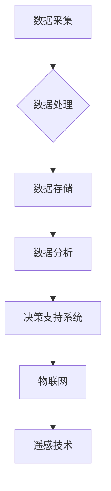
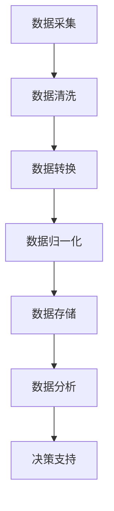

                 

# 信息差：大数据在智能农业中的应用

## 关键词
- 信息差
- 大数据
- 智能农业
- 农业信息化
- 决策支持系统

## 摘要
本文将深入探讨大数据在智能农业中的应用，通过信息差的视角，分析大数据如何帮助农业实现精准化、智能化管理。文章将分为多个部分，包括背景介绍、核心概念与联系、核心算法原理与操作步骤、数学模型与公式、项目实践、实际应用场景、工具和资源推荐、总结与未来发展趋势等。通过这些分析，我们希望能够为读者提供一个全面了解大数据在智能农业中应用的机会。

## 1. 背景介绍（Background Introduction）

随着全球人口的增长和资源消耗的加剧，农业的可持续发展和生产效率提升变得尤为关键。传统农业依赖经验和小规模操作，难以应对现代复杂的环境变化和市场需求。而大数据技术的崛起为农业带来了新的机遇。大数据可以收集、存储、处理和分析大量与农业相关的数据，包括土壤、气候、作物生长、市场动态等，从而提供更为精准和实时的决策支持。

智能农业的目标是通过利用现代信息技术，如物联网、遥感、传感器和人工智能，实现农业生产的自动化和智能化。大数据在智能农业中的应用，主要体现在以下几个方面：

- **精准农业**：通过大数据分析，优化农业资源利用，如合理施肥、灌溉和播种时间，减少资源浪费。
- **病虫害预警**：利用大数据预测和监测病虫害的发生，提前采取防治措施。
- **市场分析**：分析市场需求，指导农业生产和销售，提升经济效益。
- **环境监测**：监控农田生态环境，确保农业生产符合可持续发展要求。

### 1. Background Introduction

With the global population growth and increased resource consumption, the sustainable development and efficiency improvement of agriculture have become crucial. Traditional agriculture, which relies on experience and small-scale operations, is difficult to adapt to modern complex environmental changes and market demands. The rise of big data technology has brought new opportunities to agriculture. Big data can collect, store, process, and analyze a large amount of agricultural-related data, including soil, climate, crop growth, and market dynamics, thus providing more precise and real-time decision support.

The goal of smart agriculture is to automate and intelligentize agricultural production by using modern information technology such as the Internet of Things (IoT), remote sensing, sensors, and artificial intelligence. The application of big data in smart agriculture mainly focuses on the following aspects:

- **Precision Agriculture**: Through big data analysis, optimize the use of agricultural resources such as reasonable fertilization, irrigation, and planting time, reduce resource waste.
- **Pest and Disease预警**: Utilize big data to predict and monitor the occurrence of pests and diseases, and take preventive measures in advance.
- **Market Analysis**: Analyze market demand to guide agricultural production and sales, enhancing economic benefits.
- **Environmental Monitoring**: Monitor the agricultural ecological environment to ensure that agricultural production meets sustainable development requirements.

## 2. 核心概念与联系（Core Concepts and Connections）

### 2.1 数据采集与处理
在智能农业中，数据采集是关键的第一步。数据源包括气象站、土壤传感器、卫星遥感、GPS等。这些设备可以实时收集与农田环境相关的数据。然而，原始数据通常是杂乱无章的，因此需要通过数据处理技术进行清洗、转换和分析。

### 2.2 决策支持系统
决策支持系统（DSS）是智能农业的核心组成部分。它利用大数据分析结果，为农业生产和管理提供决策支持。DSS包括数据采集模块、数据存储模块、数据分析模块和决策输出模块。

### 2.3 机器学习与预测模型
机器学习技术在智能农业中有着广泛的应用。通过训练预测模型，可以对作物生长、病虫害发生等进行预测，从而提前采取相应的措施。常见的机器学习算法包括决策树、随机森林、支持向量机和神经网络等。

### 2.4 物联网（IoT）
物联网技术在智能农业中主要用于实现设备间的互联互通。通过传感器和物联网平台，可以实时监控农田环境，收集大量数据，并通过云平台进行存储和处理。

### 2.5 遥感技术
遥感技术利用卫星或无人机等设备，从远距离获取农田地表信息。这些信息对于作物监测、病虫害预警和资源管理具有重要意义。

### 2.1 Data Collection and Processing
In smart agriculture, data collection is the critical first step. Data sources include weather stations, soil sensors, satellite remote sensing, GPS, etc., which can collect real-time data related to the agricultural environment. However, raw data is usually chaotic and needs to be cleaned, transformed, and analyzed through data processing techniques.

### 2.2 Decision Support Systems
Decision Support Systems (DSS) are the core components of smart agriculture. They use the results of big data analysis to provide decision support for agricultural production and management. DSS includes data collection modules, data storage modules, data analysis modules, and decision output modules.

### 2.3 Machine Learning and Predictive Models
Machine learning technologies are widely used in smart agriculture. By training predictive models, one can predict crop growth, the occurrence of pests and diseases, and take corresponding measures in advance. Common machine learning algorithms include decision trees, random forests, support vector machines, and neural networks.

### 2.4 Internet of Things (IoT)
IoT technology is mainly used in smart agriculture for the interconnection of devices. Through sensors and IoT platforms, real-time monitoring of the agricultural environment can be achieved, and a large amount of data can be collected and stored through cloud platforms for processing.

### 2.5 Remote Sensing Technology
Remote sensing technology utilizes satellites or unmanned aerial vehicles (UAVs) to collect surface information of farmland from a distance. These data are significant for crop monitoring, pest and disease early warning, and resource management.

### 2.6 Mermaid 流程图（Mermaid Flowchart）


## 3. 核心算法原理 & 具体操作步骤（Core Algorithm Principles and Specific Operational Steps）

### 3.1 数据预处理
数据预处理是大数据应用的重要环节。具体步骤包括：

- **数据清洗**：去除重复、错误或不完整的数据。
- **数据转换**：将不同格式的数据统一转换为便于分析的格式。
- **数据归一化**：将不同量纲的数据进行标准化处理，使其具有可比性。

### 3.2 数据存储
数据存储通常采用分布式数据库或大数据平台，如Hadoop、Spark等。这些平台能够处理海量数据，并提供高效的查询和计算能力。

### 3.3 数据分析
数据分析是智能农业的核心。常见的方法包括：

- **统计分析**：通过描述性统计和推断性统计，了解数据的基本特征和趋势。
- **机器学习**：利用监督学习和无监督学习算法，发现数据中的模式和关联。
- **数据挖掘**：通过关联规则挖掘、聚类分析和分类分析，提取有价值的信息。

### 3.4 决策支持
基于数据分析的结果，决策支持系统可以提供以下支持：

- **精准施肥**：根据土壤数据，制定合理的施肥方案。
- **灌溉管理**：根据土壤湿度数据，自动控制灌溉系统。
- **病虫害预警**：根据气象和作物生长数据，预测病虫害的发生并提前预警。

### 3.5 具体操作步骤


## 4. 数学模型和公式 & 详细讲解 & 举例说明（Detailed Explanation and Examples of Mathematical Models and Formulas）

### 4.1 机器学习模型
在智能农业中，常用的机器学习模型包括线性回归、逻辑回归、支持向量机和神经网络等。以下是一个简单的线性回归模型：

$$
y = wx + b
$$

其中，$y$ 是作物产量，$w$ 是权重，$x$ 是自变量（如土壤湿度、气温等），$b$ 是偏置项。

### 4.2 预测模型
预测模型通常用于预测作物产量、病虫害发生等。以下是一个基于时间序列的ARIMA模型：

$$
y_t = c + \phi_1 y_{t-1} + \phi_2 y_{t-2} + \dots + \phi_p y_{t-p} + \theta_1 e_{t-1} + \theta_2 e_{t-2} + \dots + \theta_q e_{t-q}
$$

其中，$y_t$ 是第 $t$ 期的预测值，$c$ 是常数项，$\phi_1, \phi_2, \dots, \phi_p$ 是自回归系数，$\theta_1, \theta_2, \dots, \theta_q$ 是移动平均系数，$e_t$ 是误差项。

### 4.3 示例说明
假设我们要预测某农田的作物产量，我们可以使用线性回归模型。首先，收集历史数据，包括作物产量和土壤湿度、气温等。然后，使用线性回归算法训练模型，得到权重和偏置项。最后，输入当前农田的土壤湿度和气温，预测作物产量。

## 5. 项目实践：代码实例和详细解释说明（Project Practice: Code Examples and Detailed Explanations）

### 5.1 开发环境搭建
为了实践大数据在智能农业中的应用，我们需要搭建一个开发环境。以下是基本的步骤：

- 安装Python环境。
- 安装大数据处理库，如Pandas、NumPy、Scikit-learn等。
- 安装数据库，如MySQL或PostgreSQL。
- 安装机器学习库，如TensorFlow或PyTorch。

### 5.2 源代码详细实现
以下是一个简单的Python代码示例，实现线性回归模型预测作物产量：

```python
import pandas as pd
from sklearn.linear_model import LinearRegression

# 数据预处理
data = pd.read_csv('crop_data.csv')
X = data[['soil_humidity', 'temperature']]
y = data['yield']

# 训练模型
model = LinearRegression()
model.fit(X, y)

# 预测
current_data = pd.DataFrame({'soil_humidity': [20], 'temperature': [25]})
predicted_yield = model.predict(current_data)
print(f'Predicted yield: {predicted_yield[0]}')
```

### 5.3 代码解读与分析
这段代码首先导入了必要的库，然后从CSV文件中读取数据。数据预处理步骤包括将数据分为特征和标签。接着，使用线性回归模型进行训练，并使用训练好的模型进行预测。最后，输出预测结果。

### 5.4 运行结果展示
运行代码后，我们得到预测的作物产量。这个结果可以作为决策支持系统的一部分，帮助农民制定种植计划。

## 6. 实际应用场景（Practical Application Scenarios）

大数据在智能农业中的应用已经取得了显著成果。以下是一些实际应用场景：

- **精准施肥**：通过分析土壤数据，实现精准施肥，提高作物产量和减少资源浪费。
- **病虫害预警**：通过气象数据和作物生长数据，预测病虫害的发生，提前采取防治措施。
- **市场分析**：分析市场需求，指导农业生产和销售，提升经济效益。
- **环境监测**：监控农田生态环境，确保农业生产符合可持续发展要求。

## 7. 工具和资源推荐（Tools and Resources Recommendations）

### 7.1 学习资源推荐
- **书籍**：《大数据之路：阿里巴巴大数据实践》《机器学习实战》
- **论文**：相关领域的顶级会议和期刊，如KDD、AAAI、NeurIPS等。
- **博客**：GitHub上的开源项目和博客，如Docker、Kubernetes等。

### 7.2 开发工具框架推荐
- **大数据处理**：Hadoop、Spark、Flink
- **数据库**：MySQL、PostgreSQL、MongoDB
- **机器学习**：TensorFlow、PyTorch、Scikit-learn

### 7.3 相关论文著作推荐
- **论文**：刘铁岩的《深度学习实践指南》、李航的《统计学习方法》。
- **著作**：《数据科学实战》、刘知远等人的《大规模机器学习》。

## 8. 总结：未来发展趋势与挑战（Summary: Future Development Trends and Challenges）

大数据在智能农业中的应用前景广阔。未来，随着技术的不断发展，我们将看到更多的创新应用，如基于增强现实的农田管理、智能灌溉系统的普及等。然而，也面临一些挑战：

- **数据隐私与安全**：如何确保农业数据的隐私和安全，是亟待解决的问题。
- **数据质量**：提高数据质量，确保数据的准确性和完整性。
- **技术普及**：如何降低技术门槛，使更多的农民能够享受到大数据带来的好处。

## 9. 附录：常见问题与解答（Appendix: Frequently Asked Questions and Answers）

### 9.1 什么是大数据？
大数据是指数据量巨大、种类繁多、速度极快的数据。它通常无法使用传统的关系型数据库进行处理，需要借助分布式计算和存储技术。

### 9.2 智能农业与精准农业有什么区别？
智能农业是一个广泛的概念，包括物联网、遥感、人工智能等技术的应用。精准农业是智能农业的一个子领域，主要关注如何通过数据优化农业生产过程。

### 9.3 大数据在智能农业中有哪些具体应用？
大数据在智能农业中的应用包括精准施肥、病虫害预警、市场分析、环境监测等，旨在提高农业生产效率和经济效益。

### 9.4 如何确保农业数据的隐私和安全？
可以通过数据加密、访问控制、隐私保护算法等技术手段来确保农业数据的隐私和安全。

## 10. 扩展阅读 & 参考资料（Extended Reading & Reference Materials）

- **书籍**：《大数据时代》、《智能农业：理论与方法》
- **网站**：GitHub、Kaggle、DataCamp
- **视频教程**：Coursera、Udacity、edX上的大数据和机器学习课程
- **论文**：KDD、AAAI、NeurIPS等顶级会议和期刊上的相关论文

## 作者署名
作者：禅与计算机程序设计艺术 / Zen and the Art of Computer Programming

-------------------
# Conclusion: Future Trends and Challenges

The application of big data in smart agriculture has a promising future. As technology continues to evolve, we can expect to see more innovative applications, such as augmented reality-based farm management and the widespread adoption of smart irrigation systems. However, there are also challenges that need to be addressed:

- **Data Privacy and Security**: Ensuring the privacy and security of agricultural data is an urgent issue that needs to be addressed.
- **Data Quality**: Improving data quality to ensure the accuracy and completeness of the data.
- **Technology Adoption**: Reducing the technological barriers to enable more farmers to benefit from the advantages of big data.

## Appendix: Frequently Asked Questions and Answers

### 9.1 What is big data?
Big data refers to data that is characterized by its vast volume, variety, and velocity. It is often too large to be processed using traditional relational databases and requires distributed computing and storage technologies.

### 9.2 What is the difference between smart agriculture and precision agriculture?
Smart agriculture is a broad term that encompasses the use of technologies such as IoT, remote sensing, and AI. Precision agriculture is a subset of smart agriculture that focuses on optimizing agricultural processes through data analysis.

### 9.3 What are some specific applications of big data in smart agriculture?
Specific applications of big data in smart agriculture include precision fertilization, pest and disease early warning, market analysis, and environmental monitoring, all aimed at improving agricultural efficiency and economic benefits.

### 9.4 How can the privacy and security of agricultural data be ensured?
Data privacy and security can be ensured through techniques such as data encryption, access control, and privacy-preserving algorithms.

## 10. Extended Reading & Reference Materials

- **Books**: "Big Data: A Revolution That Will Transform How We Live, Work, and Think" and "Smart Agriculture: Theory and Methods."
- **Websites**: GitHub, Kaggle, DataCamp
- **Video Tutorials**: Courses on big data and machine learning on platforms like Coursera, Udacity, and edX.
- **Papers**: Research papers published in top conferences and journals such as KDD, AAAI, and NeurIPS.

