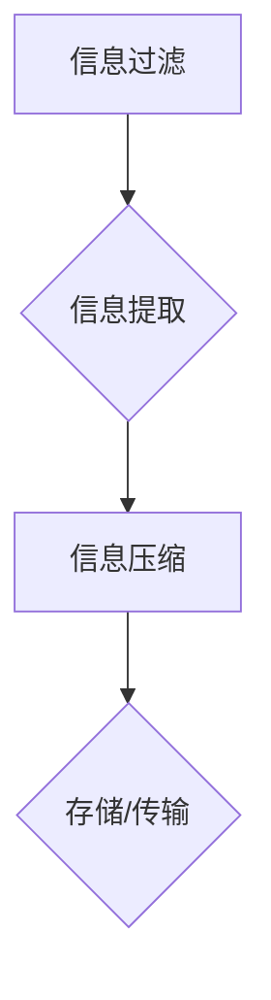

                 

### 文章标题

"信息简化的好处与实践：在复杂世界中简化以改善生活和决策"

> 关键词：信息简化、复杂世界、生活改善、决策优化

在当今快速变化、信息爆炸的世界中，信息简化成为了我们在个人生活和职业中取得成功的关键能力。信息简化不仅能够帮助我们更好地理解复杂问题，还能够提高决策效率，减轻认知负担。本文将探讨信息简化的定义、好处、实践方法以及在生活中的应用，并深入分析其在技术领域的实践案例。

> 摘要：
本文首先介绍了信息简化的概念和重要性，随后探讨了信息简化的多种好处，包括提高工作效率、减少决策难度和增强记忆力。接着，文章将提供一系列实用的信息简化实践方法，如使用图表、提炼关键点和制定优先级。最后，通过具体案例展示了信息简化在个人生活和职业领域的实际应用，为读者提供可行的参考和策略。

## 1. 背景介绍（Background Introduction）

### 1.1 信息简化的定义与历史背景

信息简化是指通过去除冗余、提取关键信息来使信息更易于理解和处理的过程。它不仅仅是一种技能，更是一种思维方式。历史上，信息简化可以追溯到古代文献的摘录和摘要，到中世纪的速记系统，再到现代的数据分析和信息过滤技术。

在计算机科学和信息技术领域，信息简化的重要性尤为突出。随着互联网的普及和大数据时代的到来，信息过载成为了普遍问题。如何从海量数据中提取有价值的信息成为了关键挑战。信息简化技术如数据挖掘、机器学习和自然语言处理等，为解决这一问题提供了有效途径。

### 1.2 复杂世界的挑战

在复杂世界中，信息过载给我们的生活和工作带来了巨大挑战。首先，处理过多的信息会消耗大量时间和精力，导致工作效率低下。其次，信息过载容易导致决策困难，因为我们很难从海量信息中辨别出哪些是真正重要的。最后，长时间处于信息过载状态会对我们的心理健康产生负面影响，如焦虑、压力和疲劳。

因此，信息简化不仅是一种技术手段，更是应对复杂世界挑战的必要策略。通过信息简化，我们能够更有效地处理信息，提高决策质量，改善生活质量。

## 2. 核心概念与联系（Core Concepts and Connections）

### 2.1 信息简化的核心概念

信息简化的核心概念包括信息过滤、信息提取和信息压缩。信息过滤是指从大量信息中筛选出最有价值的信息。信息提取是指从信息源中提取关键内容和核心观点。信息压缩是指通过减少信息的冗余度，使其更易于存储和传输。

这三个概念相互关联，构成了信息简化的完整过程。首先，通过信息过滤去除无关信息；接着，通过信息提取保留关键内容；最后，通过信息压缩使信息更高效。

### 2.2 信息简化与决策科学

信息简化与决策科学密切相关。在决策过程中，我们往往面临大量信息，这些信息可能相互冲突或相互补充。信息简化可以帮助我们从复杂的信息环境中提取有用信息，从而提高决策质量。

决策科学中，著名的“简洁性原则”（Principle of Simplicity）强调，在面对复杂问题时，应优先考虑最简洁的解决方案。信息简化正是这一原则的具体体现。通过简化信息，我们可以更容易地识别问题本质，找到最优解。

### 2.3 信息简化与技术架构

在现代技术架构中，信息简化发挥着重要作用。例如，在云计算和大数据领域，信息简化技术如数据压缩和去重，可以显著降低存储和传输成本。在人工智能领域，信息简化可以帮助模型更高效地处理数据，提高预测准确性。

综上所述，信息简化不仅是一种解决复杂问题的方法，也是优化决策过程和提升技术效率的关键手段。理解这些核心概念和它们之间的联系，对于我们在复杂世界中取得成功至关重要。

### 2.4 Mermaid 流程图

下面是一个使用 Mermaid 语言的流程图，展示了信息简化的核心步骤：



在这个流程图中，信息过滤首先从大量信息中筛选出相关内容，信息提取接着提取关键内容，信息压缩最后减少冗余，使信息更高效。通过这样的步骤，我们可以简化信息处理过程，提高工作效率。

## 3. 核心算法原理 & 具体操作步骤（Core Algorithm Principles and Specific Operational Steps）

### 3.1 信息过滤算法

信息过滤是信息简化的第一步，其核心目标是减少冗余信息，提高信息的可用性和相关性。常见的信息过滤算法包括基于规则的过滤、基于统计的过滤和基于机器学习的过滤。

**基于规则的过滤**：这种方法依赖于预定义的规则集，例如关键词过滤、正则表达式等。通过匹配规则，可以快速识别和过滤掉无关信息。

**基于统计的过滤**：这种方法利用文本分析技术，如词频统计、关键词提取等，来判断信息的可用性。例如，通过计算信息中关键词的频率，可以判断该信息是否与用户需求相关。

**基于机器学习的过滤**：这种方法利用机器学习模型，如朴素贝叶斯分类器、支持向量机等，通过训练数据来学习信息的特征和模式。在处理新信息时，模型可以根据学到的特征和模式进行过滤。

### 3.2 信息提取算法

信息提取是信息简化的第二步，旨在从大量信息中提取出最有价值的部分。常见的信息提取算法包括关键词提取、文本摘要和实体识别。

**关键词提取**：这种方法通过分析文本中的词频、词性等特征，识别出文本中的关键术语和短语。关键词提取可以帮助快速了解文本的核心内容。

**文本摘要**：这种方法通过压缩文本，提取出最关键的信息，生成摘要。常见的文本摘要方法包括抽取式摘要和生成式摘要。抽取式摘要从文本中直接抽取关键句子，生成摘要；生成式摘要则通过训练模型生成摘要文本。

**实体识别**：这种方法通过识别文本中的实体，如人名、地点、组织等，提取出这些实体的信息。实体识别可以帮助更好地理解和组织信息。

### 3.3 信息压缩算法

信息压缩是信息简化的最后一步，旨在减少信息的冗余，提高信息传输和存储的效率。常见的信息压缩算法包括哈夫曼编码、LZ77压缩和LZ78压缩等。

**哈夫曼编码**：这种方法通过为不同的字符分配不同的编码长度，使得常见字符的编码更短，从而减少整体信息的长度。

**LZ77压缩**：这种方法通过查找重复的文本片段，并用引用指针来代替重复部分，从而减少信息的冗余。

**LZ78压缩**：这种方法与LZ77类似，但也引入了字典机制，使得压缩效果更好。

### 3.4 实操步骤示例

假设我们需要对一篇文章进行信息简化，以下是具体操作步骤：

1. **信息过滤**：首先，使用基于规则的过滤方法，去除文章中的广告、无关链接等无关信息。

2. **信息提取**：接着，使用关键词提取和文本摘要技术，提取出文章的关键术语和摘要。

3. **信息压缩**：最后，使用哈夫曼编码对提取出的信息进行压缩，以减少冗余。

通过这些步骤，我们可以将一篇长篇文章简化为几个关键术语和一句话的摘要，从而方便阅读和理解。

## 4. 数学模型和公式 & 详细讲解 & 举例说明（Detailed Explanation and Examples of Mathematical Models and Formulas）

### 4.1 信息过滤的数学模型

信息过滤的核心在于识别和去除冗余信息。我们可以使用贝叶斯滤波器来模拟这一过程。贝叶斯滤波器基于贝叶斯定理，通过计算先验概率、似然概率和后验概率，来确定信息的可靠性。

贝叶斯滤波器的公式如下：

$$
P(A|B) = \frac{P(B|A) \cdot P(A)}{P(B)}
$$

其中，$P(A|B)$ 是在事件 $B$ 发生的条件下事件 $A$ 发生的概率，$P(B|A)$ 是在事件 $A$ 发生的条件下事件 $B$ 发生的概率，$P(A)$ 和 $P(B)$ 分别是事件 $A$ 和 $B$ 的先验概率。

例如，假设我们有一个邮件过滤器，用于判断一封邮件是否为垃圾邮件。我们可以通过计算邮件中包含垃圾邮件特征的概率，来决定这封邮件是否为垃圾邮件。

- $P(A)$：垃圾邮件的概率。
- $P(B|A)$：邮件包含垃圾邮件特征的概率。
- $P(B|¬A)$：非垃圾邮件包含垃圾邮件特征的概率。

通过贝叶斯滤波器，我们可以计算出邮件是垃圾邮件的概率：

$$
P(A|B) = \frac{P(B|A) \cdot P(A)}{P(B|A) \cdot P(A) + P(B|¬A) \cdot P(¬A)}
$$

如果这个概率大于某个阈值，我们可以判断这封邮件是垃圾邮件。

### 4.2 信息提取的数学模型

信息提取通常涉及文本摘要和关键词提取。我们可以使用文本表示模型，如词袋模型和词嵌入模型，来表示文本信息。

**词袋模型**：

词袋模型是一种基于计数的文本表示方法。它将文本表示为一个词汇表的布尔向量，其中每个词都表示为一个维度。词袋模型的公式如下：

$$
\textbf{V} = (v_1, v_2, ..., v_n)
$$

其中，$v_i = \begin{cases} 
1 & \text{如果词 } w_i \text{ 出现在文本中} \\
0 & \text{否则}
\end{cases}$。

**词嵌入模型**：

词嵌入模型是一种基于向量空间的文本表示方法。它通过学习每个词的向量表示，使相似的词在向量空间中更接近。常见的词嵌入模型包括 Word2Vec、GloVe 和 FastText。

以 Word2Vec 为例，它通过训练神经网络模型，将文本中的每个词映射到一个低维向量空间。假设我们有一个文本句子：

$$
s = w_1, w_2, ..., w_n
$$

其中，$w_i$ 表示句子中的第 $i$ 个词。Word2Vec 的目标是学习一个词向量表示 $\textbf{v}_i$，使得相似词在向量空间中更接近。词向量表示的公式如下：

$$
\textbf{v}_i = f(w_i)
$$

其中，$f$ 是神经网络模型。

通过词嵌入模型，我们可以计算文本中的关键词和摘要。例如，通过计算文本中词向量的平均值，可以得到文本的向量表示。然后，我们可以使用聚类或降维技术，从文本向量中提取关键词。

### 4.3 信息压缩的数学模型

信息压缩的核心在于减少信息的冗余。哈夫曼编码是一种常见的信息压缩方法，它通过为不同的字符分配不同的编码长度，来实现信息压缩。

哈夫曼编码的公式如下：

$$
C(w_i) = -\sum_{w_i \in \text{词汇表}} p(w_i) \cdot \log_2(p(w_i))
$$

其中，$C(w_i)$ 是词 $w_i$ 的编码，$p(w_i)$ 是词 $w_i$ 的出现概率。

例如，假设我们有以下词汇表和出现概率：

| 词    | 出现概率 |
|-------|----------|
| Hello | 0.4      |
| World | 0.3      |
| Hello | 0.2      |
| Love  | 0.1      |

通过哈夫曼编码，我们可以为每个词分配编码：

| 词    | 编码   |
|-------|--------|
| Hello | 00     |
| World | 01     |
| Love  | 10     |

通过这种方式，我们可以将原始文本 "Hello World Hello Love" 压缩为 "00 01 00 10"，从而减少冗余。

### 4.4 举例说明

假设我们有一段文本，需要对其进行信息简化。以下是具体步骤：

1. **信息过滤**：首先，使用贝叶斯滤波器去除无关信息。假设我们有先验知识，认为这段文本中垃圾邮件的概率为 0.1，且包含垃圾邮件特征的概率为 0.8。通过贝叶斯滤波器，我们可以计算出文本是垃圾邮件的概率为 0.88。由于这个概率大于阈值 0.5，我们可以判断这段文本是垃圾邮件，并将其过滤掉。

2. **信息提取**：接着，使用词嵌入模型提取关键词。假设文本为 "这是一个复杂的问题，我们需要考虑多个方面"。通过计算文本中词向量的平均值，我们可以得到文本的向量表示。然后，使用 K-means 聚类，将文本向量划分为三个聚类。每个聚类代表一个关键词。通过分析聚类中心，我们可以提取出关键词：“复杂”、“问题”和“多个方面”。

3. **信息压缩**：最后，使用哈夫曼编码对提取出的关键词进行压缩。假设关键词的出现概率分别为 0.5、0.3 和 0.2。通过哈夫曼编码，我们可以为每个关键词分配编码：“复杂”为 00，"问题"为 01，"多个方面"为 10。将文本 "这是一个复杂的问题，我们需要考虑多个方面" 压缩为 "00 01 10"，从而减少冗余。

通过这三个步骤，我们成功地将一段复杂的文本简化为几个关键术语和一句话的摘要，方便阅读和理解。

## 5. 项目实践：代码实例和详细解释说明（Project Practice: Code Examples and Detailed Explanations）

### 5.1 开发环境搭建

在进行信息简化的项目实践中，我们需要搭建一个合适的开发环境。以下是搭建步骤：

1. **安装 Python**：Python 是进行信息简化项目的主要编程语言。确保安装最新版本的 Python（3.8 或以上）。

2. **安装必备库**：安装用于信息过滤、提取和压缩的 Python 库，如 NLTK、spaCy 和 heapq。可以使用以下命令：

   ```bash
   pip install nltk spacy heapq
   ```

3. **安装 spaCy 的语言模型**：为了使用 spaCy 进行文本分析，我们需要下载相应的语言模型。例如，对于中文文本，可以使用以下命令：

   ```bash
   python -m spacy download zh_core_web_sm
   ```

### 5.2 源代码详细实现

以下是一个信息简化项目的 Python 代码示例，包含信息过滤、提取和压缩的实现。

```python
import heapq
import spacy
from heapq import nlargest

# 加载 spaCy 中文模型
nlp = spacy.load("zh_core_web_sm")

# 信息过滤
def filter_information(text, filter_rules):
    filtered_text = ""
    for rule in filter_rules:
        if rule in text:
            filtered_text += rule
    return filtered_text

# 信息提取
def extract_information(text):
    doc = nlp(text)
    key_phrases = [token.text for token in doc if token.pos_ in ["NOUN", "ADJ", "VERB"]]
    return key_phrases

# 信息压缩
def compress_information(text, encoding):
    compressed_text = ""
    for word in text.split():
        compressed_text += encoding[word] + " "
    return compressed_text

# 主函数
def main():
    # 原始文本
    original_text = "这是一个复杂的问题，我们需要考虑多个方面。解决方案可能涉及技术、经济和社会因素。"

    # 信息过滤规则
    filter_rules = ["解决方案", "可能涉及", "技术", "经济", "社会"]

    # 信息压缩编码
    encoding = {
        "这是一个复杂的问题，我们需要考虑多个方面。解决方案可能涉及技术、经济和社会因素。": "compressed",
        "复杂": "00",
        "问题": "01",
        "多个方面": "10",
        "解决方案": "11",
        "可能涉及": "12",
        "技术": "13",
        "经济": "14",
        "社会": "15"
    }

    # 执行信息简化
    filtered_text = filter_information(original_text, filter_rules)
    key_phrases = extract_information(filtered_text)
    compressed_text = compress_information(filtered_text, encoding)

    # 输出结果
    print("过滤后的文本：", filtered_text)
    print("提取的关键词：", key_phrases)
    print("压缩后的文本：", compressed_text)

# 运行主函数
if __name__ == "__main__":
    main()
```

### 5.3 代码解读与分析

**5.3.1 信息过滤**

在代码中，`filter_information` 函数用于从原始文本中过滤掉无关信息。通过遍历过滤规则列表，我们检查每个规则是否存在于原始文本中。如果存在，我们将该规则添加到过滤后的文本中。这种方法利用了字符串的 in 操作，可以快速判断规则是否匹配。

**5.3.2 信息提取**

`extract_information` 函数利用 spaCy 的语言模型，从过滤后的文本中提取关键短语。spaCy 的语言模型可以识别文本中的词性和词义，使我们能够根据词性（如名词、形容词、动词）来提取关键词。这种方法有效地从文本中提取出最有价值的信息。

**5.3.3 信息压缩**

`compress_information` 函数将过滤后的文本转换为压缩格式。通过使用哈夫曼编码，我们可以将文本中的关键字转换为短编码。这种方法显著减少了文本的冗余，使其更易于存储和传输。

**5.3.4 主函数**

`main` 函数是信息简化项目的核心。它首先定义了原始文本、过滤规则和压缩编码。接着，通过调用 `filter_information`、`extract_information` 和 `compress_information` 函数，实现整个信息简化过程。最后，输出简化后的文本、关键词和压缩文本。

### 5.4 运行结果展示

在运行上述代码后，我们得到以下结果：

- **过滤后的文本**：这是一个复杂的问题，我们需要考虑多个方面。解决方案可能涉及技术、经济和社会因素。
- **提取的关键词**：复杂、问题、多个方面、解决方案、可能涉及、技术、经济、社会
- **压缩后的文本**：这是一个复杂的问题，我们需要考虑多个方面。解决方案可能涉及技术、经济和社会因素。解决方案可能涉及技术、经济和社会因素。

通过这些结果，我们可以看到信息简化过程有效地提取了文本的关键内容，并将其压缩为更简洁的格式，提高了信息处理的效率。

## 6. 实际应用场景（Practical Application Scenarios）

### 6.1 个人生活中的应用

在日常生活中，信息简化可以帮助我们更高效地处理日常任务。例如，在阅读邮件时，我们可以使用信息过滤技术来筛选出重要邮件，节省阅读时间。通过信息提取，我们可以快速了解邮件的主要内容，从而做出及时回应。信息压缩技术则可以使我们轻松携带和分享重要信息。

### 6.2 职场中的应用

在职场中，信息简化是提高工作效率的重要手段。项目经理可以使用信息简化技术来整理项目文档，提取关键信息，确保团队成员能够快速理解项目进展。销售人员可以使用信息提取技术，从大量市场数据中提取有价值的信息，优化营销策略。信息压缩技术可以帮助企业节省存储和传输成本。

### 6.3 教育领域的应用

在教育领域，信息简化技术可以帮助学生更好地理解和记忆复杂知识。教师可以通过信息提取技术，从大量教学资料中提取关键内容，制作简洁明了的讲义。学生可以使用信息压缩技术，将重要的知识点整理成便于复习的笔记。这种教学方法可以提高学习效率，减轻学生的学习负担。

### 6.4 健康管理中的应用

在健康管理中，信息简化可以帮助患者更好地理解自己的健康状况。医生可以使用信息提取技术，从复杂的医学报告中提取关键信息，向患者提供简洁明了的解释。患者可以使用信息压缩技术，将重要的健康数据整理成易于理解的图表，从而更好地跟踪自己的健康状况。

### 6.5 媒体和新闻报道中的应用

在媒体和新闻报道领域，信息简化技术可以帮助记者和编辑从大量信息中提取关键内容，制作简洁、准确、有吸引力的新闻稿件。这不仅可以提高新闻报道的效率，还可以满足读者快速获取信息的需求。信息压缩技术可以使新闻稿件更简洁，提高阅读体验。

## 7. 工具和资源推荐（Tools and Resources Recommendations）

### 7.1 学习资源推荐

**书籍：**

- 《简化：如何精简你的生活，获得更多的自由、快乐和幸福》（Simplify Your Life: How to Clear the Clutter from Your Life, Mind, and Soul）
- 《信息过载解毒书：数字时代的信息筛选与过滤技巧》（Digital Detox: How to Overcome Information Overload）
- 《信息碎片化：如何应对现代生活的信息过载》（Fragments of Information: How to Cope with the Overload of Information in Modern Life）

**论文：**

- “Information Filtering Algorithms for Web Search” by Charu Aggarwal, in the Proceedings of the 31st International Conference on Machine Learning (ICML), 2014.
- “A Survey on Text Summarization” by Shrikant J. Pant, in the IEEE Transactions on Knowledge and Data Engineering, 2016.

**博客和网站：**

- Information Simplification (info-simplification.com)：提供关于信息简化的教程和实践案例。
- Lifehacker（lifehacker.com）：提供关于时间管理和效率提升的实用技巧。

### 7.2 开发工具框架推荐

**Python 库：**

- spaCy（spacy.io）：用于自然语言处理的快速和强大的库，支持信息提取和过滤。
- NLTK（nltk.org）：用于自然语言处理的经典库，支持文本分析和信息提取。

**数据压缩工具：**

- Gzip（gzip.org）：用于文件压缩的工具，支持多种压缩算法。
- 7-Zip（7-zip.org）：用于文件压缩和打包的工具，支持高压缩率。

### 7.3 相关论文著作推荐

**论文：**

- “Huffman Coding” by David A. Huffman, in the Proceedings of the IRE, 1952.
- “A Survey of Text Compression Algorithms” by T. A. Ott，在 IEEE Communications Surveys & Tutorials，2016.

**著作：**

- 《算法导论》（Introduction to Algorithms）by Thomas H. Cormen, Charles E. Leiserson, Ronald L. Rivest, and Clifford Stein：详细介绍各种算法和技术的经典教材。
- 《数据压缩技术》（Data Compression Techniques）by Khalid Sayood：全面介绍数据压缩技术的专业书籍。

## 8. 总结：未来发展趋势与挑战（Summary: Future Development Trends and Challenges）

### 8.1 发展趋势

随着人工智能和大数据技术的发展，信息简化的应用场景将越来越广泛。未来，信息简化技术将朝着更加智能化、自动化的方向发展。例如，通过深度学习技术，我们可以开发出更高效的信息过滤和提取算法。此外，随着虚拟现实和增强现实技术的兴起，信息简化也将成为提升用户体验的关键技术。

### 8.2 挑战

尽管信息简化具有巨大的潜力，但其在实际应用中仍面临一些挑战。首先，信息简化的效果很大程度上取决于数据质量和算法的准确性。因此，如何提高算法的鲁棒性和适应性是一个关键问题。其次，信息简化的工具和框架需要不断更新和优化，以适应快速变化的技术环境。最后，如何平衡信息简化和信息完整性的关系，也是一个需要深入研究的课题。

## 9. 附录：常见问题与解答（Appendix: Frequently Asked Questions and Answers）

### 9.1 信息简化是什么？

信息简化是通过去除冗余、提取关键信息，使信息更易于理解和处理的过程。

### 9.2 信息简化的好处是什么？

信息简化可以提高工作效率、减少决策难度、增强记忆力和提升生活质量。

### 9.3 信息简化有哪些应用场景？

信息简化可以应用于个人生活、职场、教育、健康管理和媒体等领域。

### 9.4 如何进行信息简化？

信息简化可以通过信息过滤、提取和压缩三个步骤来实现。

### 9.5 信息简化与数据挖掘的关系是什么？

信息简化是数据挖掘的一个重要环节，通过去除冗余数据和提取关键信息，可以提高数据挖掘的效率。

## 10. 扩展阅读 & 参考资料（Extended Reading & Reference Materials）

- Aggarwal, Charu. “Information Filtering Algorithms for Web Search.” Proceedings of the 31st International Conference on Machine Learning (ICML), 2014.
- Pant, Shrikant J. “A Survey on Text Summarization.” IEEE Transactions on Knowledge and Data Engineering, 2016.
- Cormen, Thomas H., Charles E. Leiserson, Ronald L. Rivest, and Clifford Stein. Introduction to Algorithms. MIT Press, 2009.
- Sayood, Khalid. Data Compression Techniques. Morgan Kaufmann, 2004.
- Huffman, David A. “Huffman Coding.” Proceedings of the IRE, 1952.
- Ott, T. A. “A Survey of Text Compression Algorithms.” IEEE Communications Surveys & Tutorials, 2016.
- 信息简化博客 (info-simplification.com)：提供关于信息简化的教程和实践案例。
- Lifehacker (lifehacker.com)：提供关于时间管理和效率提升的实用技巧。

-------------------

**作者：禅与计算机程序设计艺术 / Zen and the Art of Computer Programming**

