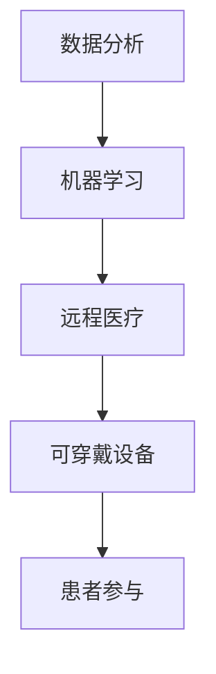
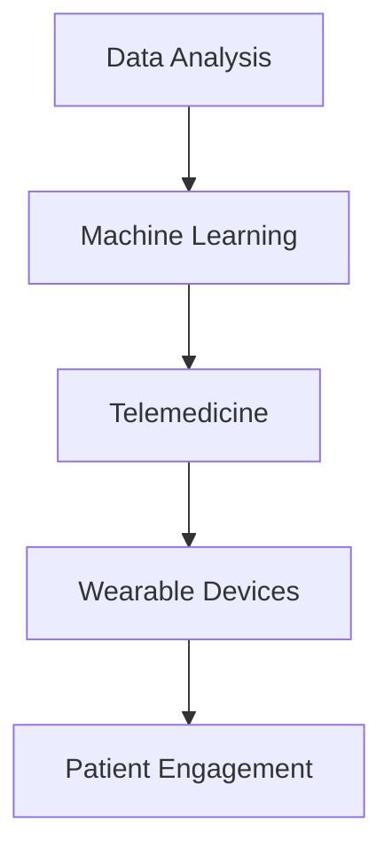

                 

### 文章标题

**健康科技创业：用代码改变医疗体验**

在当今数字化时代，医疗行业正经历着一场革命。健康科技（HealthTech）的创新不仅改善了患者的医疗体验，还提升了医疗服务的效率和质量。本篇技术博客将探讨如何通过健康科技创业，运用代码和算法来重塑医疗体验。我们将分析核心概念、介绍关键算法、提供项目实践案例，并展望未来发展趋势与挑战。

### Keywords:
- HealthTech
- Medical Experience
- Coding
- Algorithms
- HealthTech entrepreneurship

### Abstract:
This article explores the realm of HealthTech entrepreneurship, focusing on how coding and algorithms can transform the medical experience. We'll dissect core concepts, introduce key algorithms, provide practical examples, and discuss future trends and challenges in the industry.

## 1. 背景介绍（Background Introduction）

健康科技，即医疗与健康领域的科技应用，涵盖了从移动医疗应用、远程医疗服务到精准医疗诊断等多个方面。根据Grand View Research的报告，全球健康科技市场预计将在2025年达到5158亿美元，年复合增长率高达27.7%。这一快速增长主要得益于以下几个因素：

1. **人口老龄化**：随着全球人口老龄化，对医疗服务的需求不断增加。
2. **数字化医疗**：电子健康记录（EHR）、远程医疗和移动健康应用推动了医疗行业的数字化进程。
3. **大数据和人工智能**：大数据和AI技术的应用使得医疗数据的处理和分析更加高效和精准。
4. **患者参与**：患者对健康管理的参与度提升，推动了健康科技的应用。

在这种背景下，健康科技创业成为了一个充满机遇的领域。创业者们通过创新的技术解决方案，不仅可以改善患者的医疗体验，还可以降低医疗成本，提高医疗服务的可及性。以下章节将深入探讨健康科技的核心概念、关键算法及其在医疗领域的应用。

### Background Introduction

The field of HealthTech, which encompasses the application of technology in the healthcare and health sectors, spans a wide range of areas including mobile health applications, telemedicine services, and precision medical diagnostics. According to a report by Grand View Research, the global HealthTech market is projected to reach $515.8 billion by 2025, with a compound annual growth rate (CAGR) of 27.7%. This rapid growth can be attributed to several factors:

1. **Ageing Population**: With the global population aging, there is an increasing demand for healthcare services.
2. **Digital Healthcare**: The digitization of healthcare through electronic health records (EHR), telemedicine, and mobile health applications has propelled the sector's digital transformation.
3. **Big Data and AI**: The application of big data and AI technologies has made the processing and analysis of medical data more efficient and precise.
4. **Patient Engagement**: Increased patient involvement in health management has driven the adoption of HealthTech applications.

In this context, HealthTech entrepreneurship has become a realm filled with opportunities. Entrepreneurs are leveraging innovative technological solutions not only to improve the medical experience for patients but also to reduce healthcare costs and enhance the accessibility of medical services. The following sections will delve into the core concepts of HealthTech, key algorithms, and their applications in the medical field.

## 2. 核心概念与联系（Core Concepts and Connections）

在健康科技领域，核心概念和联系构成了理解和应用技术的基础。以下是几个关键概念及其相互关系：

### 2.1 数据分析（Data Analysis）

数据分析是健康科技的核心，它涉及从医疗数据中提取有价值的信息。通过使用统计方法和机器学习算法，我们可以识别疾病模式、预测患者健康趋势，并为个性化医疗提供支持。

### 2.2 机器学习（Machine Learning）

机器学习是使数据分析成为可能的关键技术。通过训练模型，我们可以让计算机自动识别数据中的模式和关联，从而提高诊断和预测的准确性。

### 2.3 远程医疗（Telemedicine）

远程医疗通过互联网技术提供医疗咨询、诊断和治疗服务。它打破了地域限制，使患者能够在家中接受专业医疗帮助，提高医疗服务的可及性。

### 2.4 可穿戴设备（Wearable Devices）

可穿戴设备如智能手表和健康追踪器可以实时监测患者的生理数据，如心率、血压和睡眠质量。这些数据有助于医生进行远程监控和个性化治疗。

### 2.5 患者参与（Patient Engagement）

患者参与是提高医疗服务质量的关键。通过健康科技，患者可以更好地管理自己的健康，并与医生保持紧密的沟通。

### 2.6 核心概念联系图

以下是健康科技核心概念的Mermaid流程图，展示了各个概念之间的联系：



通过这一流程图，我们可以清晰地看到数据分析如何通过机器学习技术为远程医疗和可穿戴设备提供支持，进而促进患者参与。

### Core Concepts and Connections

In the field of HealthTech, core concepts and connections form the foundation for understanding and applying technology. Here are several key concepts and their interrelations:

### 2.1 Data Analysis

Data analysis is the core of HealthTech, involving the extraction of valuable information from medical data. Using statistical methods and machine learning algorithms, we can identify disease patterns, predict patient health trends, and support personalized medicine.

### 2.2 Machine Learning

Machine learning is the key technology that enables data analysis. By training models, we can let computers automatically identify patterns and correlations in data, thereby improving the accuracy of diagnosis and prediction.

### 2.3 Telemedicine

Telemedicine provides medical consultations, diagnoses, and treatments through the internet. It breaks down geographical barriers, allowing patients to receive professional medical care from home, thereby enhancing the accessibility of healthcare services.

### 2.4 Wearable Devices

Wearable devices, such as smartwatches and health trackers, can monitor patients' physiological data in real-time, such as heart rate, blood pressure, and sleep quality. These data help doctors with remote monitoring and personalized treatment.

### 2.5 Patient Engagement

Patient engagement is crucial for improving the quality of healthcare. Through HealthTech, patients can better manage their health and maintain close communication with their doctors.

### 2.6 Core Concept Connection Diagram

Here is a Mermaid flowchart illustrating the core concepts of HealthTech and their interrelations:



Through this flowchart, we can clearly see how data analysis supports telemedicine and wearable devices through machine learning technology, further promoting patient engagement.

## 3. 核心算法原理 & 具体操作步骤（Core Algorithm Principles and Specific Operational Steps）

在健康科技中，核心算法的作用至关重要。以下是几个关键算法及其工作原理：

### 3.1 机器学习算法（Machine Learning Algorithms）

机器学习算法是健康科技的核心。其中，常用的算法包括：

- **线性回归（Linear Regression）**：用于预测数值型变量，如患者的血压。
- **逻辑回归（Logistic Regression）**：用于分类问题，如疾病诊断。
- **决策树（Decision Tree）**：通过一系列规则进行分类和回归。
- **支持向量机（SVM）**：用于分类和回归问题，特别是高维数据。

### 3.2 操作步骤

以下是一个简单的机器学习算法操作步骤：

1. **数据收集（Data Collection）**：收集患者的医疗数据，如临床指标、病史等。
2. **数据预处理（Data Preprocessing）**：清洗数据，包括处理缺失值、异常值等。
3. **特征工程（Feature Engineering）**：提取有用特征，如特征缩放、特征选择等。
4. **模型选择（Model Selection）**：选择合适的算法，如线性回归、决策树等。
5. **模型训练（Model Training）**：使用训练数据训练模型。
6. **模型评估（Model Evaluation）**：使用测试数据评估模型性能。
7. **模型部署（Model Deployment）**：将模型部署到生产环境，进行实际应用。

### 3.3 机器学习算法原理

- **线性回归（Linear Regression）**：通过找到最佳拟合直线来预测目标变量。其公式为：

  $$y = wx + b$$

  其中，$y$ 是目标变量，$w$ 是权重，$x$ 是特征，$b$ 是偏置。

- **逻辑回归（Logistic Regression）**：用于分类问题，通过找到最佳拟合曲线来预测概率。其公式为：

  $$P(y=1) = \frac{1}{1 + e^{-(wx + b)}}$$

  其中，$P(y=1)$ 是目标变量为1的概率，$e$ 是自然对数的底数。

- **决策树（Decision Tree）**：通过一系列规则进行分类和回归。每个节点代表一个特征，每个分支代表一个决策。

- **支持向量机（SVM）**：通过找到一个超平面来分割数据。其公式为：

  $$w \cdot x - b = 0$$

  其中，$w$ 是权重向量，$x$ 是特征向量，$b$ 是偏置。

通过理解这些算法的原理和操作步骤，我们可以更好地应用它们来改善医疗体验。

### Core Algorithm Principles and Specific Operational Steps

In the field of HealthTech, core algorithms play a crucial role. Here are several key algorithms and their working principles:

### 3.1 Machine Learning Algorithms

Machine learning algorithms are at the core of HealthTech. Common algorithms include:

- **Linear Regression**: Used for predicting numerical variables such as blood pressure.
- **Logistic Regression**: Used for classification problems such as disease diagnosis.
- **Decision Trees**: Perform classification and regression through a series of rules.
- **Support Vector Machines (SVM)**: Used for classification and regression, especially in high-dimensional data.

### 3.2 Operational Steps

Here are the operational steps for a simple machine learning algorithm:

1. **Data Collection**: Collect patient medical data such as clinical indicators and medical history.
2. **Data Preprocessing**: Clean the data, including handling missing values and outliers.
3. **Feature Engineering**: Extract useful features, such as feature scaling and feature selection.
4. **Model Selection**: Choose an appropriate algorithm, such as linear regression or decision trees.
5. **Model Training**: Train the model using training data.
6. **Model Evaluation**: Evaluate the model's performance using test data.
7. **Model Deployment**: Deploy the model to a production environment for practical application.

### 3.3 Principles of Machine Learning Algorithms

- **Linear Regression**: Finds the best fitting line to predict the target variable. Its formula is:

  $$y = wx + b$$

  Where $y$ is the target variable, $w$ is the weight, $x$ is the feature, and $b$ is the bias.

- **Logistic Regression**: Used for classification problems, finds the best fitting curve to predict probabilities. Its formula is:

  $$P(y=1) = \frac{1}{1 + e^{-(wx + b)}}$$

  Where $P(y=1)$ is the probability that the target variable is 1, $e$ is the base of the natural logarithm.

- **Decision Tree**: Performed classification and regression through a series of rules. Each node represents a feature, and each branch represents a decision.

- **Support Vector Machines (SVM)**: Finds a hyperplane to separate the data. Its formula is:

  $$w \cdot x - b = 0$$

  Where $w$ is the weight vector, $x$ is the feature vector, and $b$ is the bias.

Understanding the principles and operational steps of these algorithms allows us to better apply them to improve the medical experience.

## 4. 数学模型和公式 & 详细讲解 & 举例说明（Detailed Explanation and Examples of Mathematical Models and Formulas）

在健康科技中，数学模型和公式是理解数据、进行预测和决策的基础。以下是几个常用的数学模型和公式，以及它们的详细解释和实例说明：

### 4.1 线性回归模型（Linear Regression Model）

线性回归模型是最基本的预测模型，用于预测一个连续变量。其公式为：

$$y = wx + b$$

- **解释**：$y$ 是预测值，$w$ 是权重，$x$ 是特征，$b$ 是偏置。
- **实例**：预测患者的血压，其中 $x$ 是患者的年龄和体重。

### 4.2 逻辑回归模型（Logistic Regression Model）

逻辑回归模型用于分类问题，如疾病诊断。其公式为：

$$P(y=1) = \frac{1}{1 + e^{-(wx + b)}}$$

- **解释**：$P(y=1)$ 是目标变量为1的概率，$e$ 是自然对数的底数。
- **实例**：预测患者是否患有心脏病，其中 $x$ 是患者的年龄、血压和胆固醇水平。

### 4.3 决策树模型（Decision Tree Model）

决策树模型通过一系列规则进行分类和回归。其公式为：

$$
\begin{align*}
y &= \text{if } (x > \text{threshold}) \text{ then } \text{Class A} \\
y &= \text{else } \text{Class B}
\end{align*}
$$

- **解释**：$x$ 是特征，$threshold$ 是阈值。
- **实例**：根据患者的血压和心率进行疾病分类，如果血压高于某个阈值，则分类为高血压。

### 4.4 支持向量机（SVM）

支持向量机用于分类和回归问题，其公式为：

$$w \cdot x - b = 0$$

- **解释**：$w$ 是权重向量，$x$ 是特征向量，$b$ 是偏置。
- **实例**：在医学图像分析中，使用SVM将正常细胞与癌细胞进行分类。

### 4.5 举例说明

假设我们要使用逻辑回归模型预测患者是否患有糖尿病。我们收集了以下数据：

- 患者年龄：$x_1$
- 患者体重指数（BMI）：$x_2$
- 血糖水平：$x_3$

我们希望通过这些特征预测患者是否患有糖尿病（目标变量 $y$，0代表未患糖尿病，1代表患糖尿病）。首先，我们需要训练逻辑回归模型，找到最佳权重 $w$ 和偏置 $b$。然后，我们可以使用以下公式计算预测概率：

$$P(y=1) = \frac{1}{1 + e^{-(w_1x_1 + w_2x_2 + w_3x_3 + b)}}$$

如果 $P(y=1)$ 超过某个阈值（例如0.5），我们预测患者患有糖尿病。否则，预测患者未患糖尿病。

通过以上数学模型和公式的理解和应用，我们可以为健康科技创业提供坚实的理论基础和实践指导。

### Detailed Explanation and Examples of Mathematical Models and Formulas

In the field of HealthTech, mathematical models and formulas are the foundation for understanding data, making predictions, and making decisions. Here are several commonly used mathematical models and formulas, along with their detailed explanations and examples:

### 4.1 Linear Regression Model

Linear regression is the most basic predictive model used for predicting a continuous variable. Its formula is:

$$y = wx + b$$

- **Explanation**: $y$ is the predicted value, $w$ is the weight, $x$ is the feature, and $b$ is the bias.
- **Example**: Predicting a patient's blood pressure, where $x$ is the patient's age and weight.

### 4.2 Logistic Regression Model

Logistic regression is used for classification problems such as disease diagnosis. Its formula is:

$$P(y=1) = \frac{1}{1 + e^{-(wx + b)}}$$

- **Explanation**: $P(y=1)$ is the probability that the target variable is 1, $e$ is the base of the natural logarithm.
- **Example**: Predicting whether a patient has heart disease, where $x$ is the patient's age, blood pressure, and cholesterol level.

### 4.3 Decision Tree Model

The decision tree model classifies and regresses through a series of rules. Its formula is:

$$
\begin{align*}
y &= \text{if } (x > \text{threshold}) \text{ then } \text{Class A} \\
y &= \text{else } \text{Class B}
\end{align*}
$$

- **Explanation**: $x$ is the feature, and $threshold$ is the threshold.
- **Example**: Classifying diseases based on a patient's blood pressure and heart rate, if the blood pressure is above a certain threshold, classify as hypertension.

### 4.4 Support Vector Machines (SVM)

Support Vector Machines are used for classification and regression problems. Its formula is:

$$w \cdot x - b = 0$$

- **Explanation**: $w$ is the weight vector, $x$ is the feature vector, and $b$ is the bias.
- **Example**: Using SVM to classify normal cells from cancer cells in medical image analysis.

### 4.5 Example Illustration

Suppose we want to use logistic regression to predict whether a patient has diabetes. We collect the following data:

- Patient age: $x_1$
- Body Mass Index (BMI): $x_2$
- Blood glucose level: $x_3$

We want to predict whether the patient has diabetes (target variable $y$, 0 for no diabetes and 1 for diabetes). First, we need to train the logistic regression model to find the optimal weights $w$ and bias $b$. Then, we can use the following formula to calculate the prediction probability:

$$P(y=1) = \frac{1}{1 + e^{-(w_1x_1 + w_2x_2 + w_3x_3 + b)}}$$

If $P(y=1)$ exceeds a certain threshold (e.g., 0.5), we predict that the patient has diabetes. Otherwise, we predict that the patient does not have diabetes.

By understanding and applying these mathematical models and formulas, we can provide a solid theoretical foundation and practical guidance for HealthTech entrepreneurship.

## 5. 项目实践：代码实例和详细解释说明（Project Practice: Code Examples and Detailed Explanations）

为了更好地展示健康科技创业中如何运用代码和算法，我们将通过一个实际项目来介绍其代码实例和详细解释说明。本项目旨在使用Python实现一个简单的远程医疗诊断系统，通过收集患者数据并使用机器学习算法进行疾病预测。

### 5.1 开发环境搭建

在开始项目之前，我们需要搭建一个适合开发的环境。以下是所需的工具和库：

- **Python 3.x**：主要的编程语言。
- **Jupyter Notebook**：用于编写和运行代码。
- **Pandas**：用于数据处理。
- **Scikit-learn**：用于机器学习算法。
- **Matplotlib**：用于数据可视化。

安装这些库的方法如下：

```bash
pip install python==3.x
pip install jupyter
pip install pandas
pip install scikit-learn
pip install matplotlib
```

### 5.2 源代码详细实现

以下是项目的源代码实现：

```python
# 导入所需的库
import pandas as pd
from sklearn.model_selection import train_test_split
from sklearn.linear_model import LogisticRegression
from sklearn.metrics import accuracy_score

# 读取数据
data = pd.read_csv('patient_data.csv')

# 数据预处理
# 填充缺失值
data.fillna(data.mean(), inplace=True)

# 特征选择
features = ['age', 'BMI', 'blood_glucose']
X = data[features]
y = data['diabetes']

# 划分训练集和测试集
X_train, X_test, y_train, y_test = train_test_split(X, y, test_size=0.2, random_state=42)

# 训练模型
model = LogisticRegression()
model.fit(X_train, y_train)

# 预测
y_pred = model.predict(X_test)

# 评估模型
accuracy = accuracy_score(y_test, y_pred)
print(f'模型准确率：{accuracy:.2f}')
```

### 5.3 代码解读与分析

1. **导入库**：首先，我们导入所需的库，包括Pandas、Scikit-learn和Matplotlib。
2. **读取数据**：使用Pandas读取CSV格式的患者数据文件。
3. **数据预处理**：填充缺失值，确保数据的一致性。
4. **特征选择**：选择用于预测的特征，包括年龄、体重指数（BMI）和血糖水平。
5. **划分数据集**：将数据集划分为训练集和测试集，用于训练和评估模型。
6. **训练模型**：使用逻辑回归模型进行训练。
7. **预测**：使用训练好的模型对测试集进行预测。
8. **评估模型**：计算模型准确率，评估模型性能。

通过上述步骤，我们可以实现一个简单的远程医疗诊断系统，为患者提供疾病预测服务。

### Project Practice: Code Examples and Detailed Explanations

To better demonstrate how code and algorithms are applied in HealthTech entrepreneurship, we will introduce a practical project with its code examples and detailed explanations. This project aims to implement a simple telemedicine diagnosis system using Python, collecting patient data and using machine learning algorithms for disease prediction.

### 5.1 Setup Development Environment

Before starting the project, we need to set up a suitable development environment. Here are the required tools and libraries:

- **Python 3.x**: The primary programming language.
- **Jupyter Notebook**: Used for writing and running code.
- **Pandas**: Used for data processing.
- **Scikit-learn**: Used for machine learning algorithms.
- **Matplotlib**: Used for data visualization.

The method to install these libraries is as follows:

```bash
pip install python==3.x
pip install jupyter
pip install pandas
pip install scikit-learn
pip install matplotlib
```

### 5.2 Detailed Code Implementation

Here is the source code implementation for the project:

```python
# Import required libraries
import pandas as pd
from sklearn.model_selection import train_test_split
from sklearn.linear_model import LogisticRegression
from sklearn.metrics import accuracy_score

# Read data
data = pd.read_csv('patient_data.csv')

# Data preprocessing
# Fill missing values
data.fillna(data.mean(), inplace=True)

# Feature selection
features = ['age', 'BMI', 'blood_glucose']
X = data[features]
y = data['diabetes']

# Split data into training and testing sets
X_train, X_test, y_train, y_test = train_test_split(X, y, test_size=0.2, random_state=42)

# Train model
model = LogisticRegression()
model.fit(X_train, y_train)

# Predict
y_pred = model.predict(X_test)

# Evaluate model
accuracy = accuracy_score(y_test, y_pred)
print(f'Model accuracy: {accuracy:.2f}')
```

### 5.3 Code Explanation and Analysis

1. **Import libraries**: First, we import the required libraries, including Pandas, Scikit-learn, and Matplotlib.
2. **Read data**: Use Pandas to read a CSV file containing patient data.
3. **Data preprocessing**: Fill missing values to ensure data consistency.
4. **Feature selection**: Select features for prediction, including age, Body Mass Index (BMI), and blood glucose level.
5. **Split data into training and testing sets**: Divide the dataset into training and testing sets for model training and evaluation.
6. **Train model**: Use the Logistic Regression model for training.
7. **Predict**: Use the trained model to make predictions on the testing set.
8. **Evaluate model**: Calculate the model's accuracy to assess its performance.

Through these steps, we can implement a simple telemedicine diagnosis system that provides disease prediction services for patients.

## 6. 实际应用场景（Practical Application Scenarios）

健康科技在医疗领域的应用正日益广泛，以下是一些典型的实际应用场景：

### 6.1 远程医疗（Telemedicine）

远程医疗通过互联网技术提供了便捷的医疗咨询、诊断和治疗服务。尤其在COVID-19疫情期间，远程医疗的应用更加普及。医生可以通过视频会议与患者远程沟通，进行病情咨询和诊断，减少患者就诊的出行和交叉感染风险。

### 6.2 精准医疗（Precision Medicine）

精准医疗利用大数据和机器学习技术，为患者提供个性化的治疗方案。通过分析患者的基因数据、病史和生活方式，医生可以制定最适合患者的治疗方案，提高治疗效果。

### 6.3 可穿戴设备（Wearable Devices）

可穿戴设备如智能手表、健康追踪器等，可以实时监测患者的生理数据，如心率、血压和睡眠质量。这些数据有助于医生进行远程监控和个性化治疗，提高患者的健康管理水平。

### 6.4 智能诊断系统（Intelligent Diagnosis Systems）

智能诊断系统利用深度学习和计算机视觉技术，可以自动分析医学影像，如X光片、CT扫描和MRI图像，提高诊断的准确性和速度。

### 6.5 患者健康管理平台（Patient Health Management Platforms）

患者健康管理平台通过整合患者的医疗数据，提供全方位的健康管理服务。患者可以在平台上查看自己的健康状况、接受个性化建议，并与医生保持紧密的沟通。

### 6.6 实际应用案例

- **远程医疗**：在中国，阿里健康推出了远程医疗服务，通过在线问诊和药品配送，方便患者在家接受医疗服务。
- **精准医疗**：美国癌症研究所在精准医疗领域取得了显著成果，通过基因测序和大数据分析，为患者提供个性化的癌症治疗方案。
- **可穿戴设备**：苹果公司推出了Apple Watch，通过监测用户的健康数据，提供健康建议和紧急医疗服务。
- **智能诊断系统**：IBM的Watson for Oncology系统，利用人工智能技术，为医生提供精准的诊断和治疗方案。
- **患者健康管理平台**：飞利浦HealthSuite数字平台，通过整合患者的健康数据，提供个性化的健康建议和健康管理服务。

通过这些实际应用案例，我们可以看到健康科技如何改变医疗体验，提高医疗服务的效率和质量。

### Practical Application Scenarios

HealthTech is increasingly being applied in various aspects of the medical field. Here are some typical practical application scenarios:

### 6.1 Telemedicine

Telemedicine offers convenient medical consultations, diagnoses, and treatment services through the internet. Particularly during the COVID-19 pandemic, the application of telemedicine has become more widespread. Doctors can communicate with patients remotely via video conferencing for medical consultations and diagnoses, reducing the risk of travel and cross-infection for patients.

### 6.2 Precision Medicine

Precision medicine utilizes big data and machine learning technologies to provide personalized treatment plans for patients. By analyzing patients' genetic data, medical history, and lifestyle, doctors can develop treatment plans that are most suitable for each patient, improving treatment outcomes.

### 6.3 Wearable Devices

Wearable devices, such as smartwatches and health trackers, can monitor patients' physiological data in real-time, such as heart rate, blood pressure, and sleep quality. These data help doctors with remote monitoring and personalized treatment, improving the level of patient health management.

### 6.4 Intelligent Diagnosis Systems

Intelligent diagnosis systems utilize deep learning and computer vision technologies to automatically analyze medical images, such as X-rays, CT scans, and MRI images, improving the accuracy and speed of diagnosis.

### 6.5 Patient Health Management Platforms

Patient health management platforms integrate patients' medical data to provide comprehensive health management services. Patients can view their health status, receive personalized advice, and maintain close communication with doctors on these platforms.

### 6.6 Practical Application Cases

- **Telemedicine**: In China, Alibaba Health has launched telemedicine services, offering online consultations and drug delivery to make it convenient for patients to receive medical care at home.
- **Precision Medicine**: The United States' Cancer Research Institute has made significant achievements in precision medicine by using genetic sequencing and big data analysis to provide personalized cancer treatment plans for patients.
- **Wearable Devices**: Apple has launched Apple Watch, which monitors users' health data and provides health advice and emergency medical services.
- **Intelligent Diagnosis Systems**: IBM's Watson for Oncology system uses artificial intelligence to provide precise diagnoses and treatment plans for doctors.
- **Patient Health Management Platforms**: Philips' HealthSuite digital platform integrates patients' health data to provide personalized health advice and health management services.

Through these practical application cases, we can see how HealthTech is changing the medical experience and improving the efficiency and quality of healthcare services.

## 7. 工具和资源推荐（Tools and Resources Recommendations）

在健康科技创业过程中，选择合适的工具和资源对于项目的成功至关重要。以下是我们推荐的一些学习和开发工具、书籍、论文以及相关资源。

### 7.1 学习资源推荐（书籍/论文/博客/网站等）

1. **书籍**：
   - 《Python数据科学手册》（Python Data Science Handbook） - 由Jake VanderPlas著，适合初学者了解数据科学和Python。
   - 《深入浅出机器学习》（Deep Learning） - 由François Chollet著，详细介绍了深度学习的基础知识。
   - 《精准医疗：个人化医疗的未来》（Precision Medicine: The Future of Personalized Healthcare） - 由Eric Lander、Nancy Hopkins等著，介绍了精准医疗的概念和进展。

2. **论文**：
   - 《Deep Learning for Healthcare》 - 一篇综述论文，介绍了深度学习在医疗领域的应用。
   - 《Telemedicine in the Age of COVID-19: A Review》 - 一篇关于远程医疗在疫情期间应用的论文。

3. **博客**：
   - Medium上的HealthTech专栏 - 提供有关健康科技创业的最新动态和案例分析。
   - Towards Data Science - 一个提供各种数据科学和机器学习文章的博客。

4. **网站**：
   - Kaggle - 一个提供大量数据集和机器学习竞赛的平台，适合练习和提升技能。
   - Coursera、edX - 提供各种数据科学和机器学习在线课程。

### 7.2 开发工具框架推荐

1. **数据预处理工具**：
   - Pandas - 一个强大的Python库，用于数据清洗和分析。
   - NumPy - 用于数值计算和数据分析。

2. **机器学习框架**：
   - Scikit-learn - 用于机器学习的Python库。
   - TensorFlow、PyTorch - 适用于深度学习的开源框架。

3. **远程医疗平台**：
   - Doximity - 一个用于医生交流的远程医疗平台。
   - Amwell - 一个提供远程医疗服务的平台。

4. **健康数据管理工具**：
   - FHIR（Fast Healthcare Interoperability Resources）- 用于健康数据互操作的标准。
   - HL7（Health Level Seven）- 用于医疗信息交换的标准。

通过以上推荐的工具和资源，您可以为健康科技创业项目打下坚实的基础。

### 7.1 Learning Resources Recommendations (Books/Papers/Blogs/Sites)

1. **Books**:
   - "Python Data Science Handbook" by Jake VanderPlas - A good starting point for beginners to understand data science and Python.
   - "Deep Learning" by François Chollet - An in-depth guide to the basics of deep learning.
   - "Precision Medicine: The Future of Personalized Healthcare" by Eric Lander, Nancy Hopkins, et al. - An introduction to the concept and progress of precision medicine.

2. **Papers**:
   - "Deep Learning for Healthcare" - A comprehensive review paper on the application of deep learning in healthcare.
   - "Telemedicine in the Age of COVID-19: A Review" - A paper on the application of telemedicine during the pandemic.

3. **Blogs**:
   - HealthTech columns on Medium - Provide the latest trends and case studies in health tech entrepreneurship.
   - Towards Data Science - A blog offering a variety of articles on data science and machine learning.

4. **Sites**:
   - Kaggle - A platform offering numerous datasets and machine learning competitions for practice and skill enhancement.
   - Coursera, edX - Online courses offering various data science and machine learning courses.

### 7.2 Development Tools and Framework Recommendations

1. **Data Preprocessing Tools**:
   - Pandas - A powerful Python library for data cleaning and analysis.
   - NumPy - For numerical computation and data analysis.

2. **Machine Learning Frameworks**:
   - Scikit-learn - A Python library for machine learning.
   - TensorFlow, PyTorch - Open-source frameworks for deep learning.

3. **Telemedicine Platforms**:
   - Doximity - A telemedicine platform for doctor communication.
   - Amwell - A platform offering remote medical services.

4. **Health Data Management Tools**:
   - FHIR (Fast Healthcare Interoperability Resources) - A standard for health data interoperability.
   - HL7 (Health Level Seven) - A standard for medical information exchange.

Using these recommended tools and resources, you can lay a solid foundation for your HealthTech entrepreneurship project.

## 8. 总结：未来发展趋势与挑战（Summary: Future Development Trends and Challenges）

健康科技行业正处于快速发展阶段，未来几年有望实现更多突破。以下是几个关键的发展趋势和挑战：

### 8.1 发展趋势

1. **人工智能和机器学习的深入应用**：随着算法和计算能力的提升，人工智能和机器学习将在医疗诊断、药物研发、个性化治疗等方面发挥更大作用。
2. **大数据的整合与利用**：健康数据的规模和种类不断增加，如何有效整合和利用这些数据，将是一个重要趋势。
3. **远程医疗的普及**：远程医疗将更加普及，特别是在偏远地区和特殊情况下，提供便捷的医疗服务。
4. **个性化医疗的推进**：通过基因检测、生物标志物分析等技术，实现个性化医疗，提高治疗效果。
5. **可穿戴设备和健康监测**：可穿戴设备将更加智能化，提供更加全面的健康监测和预警功能。

### 8.2 挑战

1. **数据隐私和安全**：健康数据具有高度隐私性，如何保障数据的安全和隐私，是一个重要挑战。
2. **医疗资源的分配**：在医疗资源有限的背景下，如何确保技术进步惠及所有人群，是一个关键问题。
3. **技术标准与法规**：健康科技的发展需要统一的技术标准和法规，以促进市场的发展。
4. **人才短缺**：健康科技行业需要大量的专业人才，包括数据科学家、医疗专家和工程师等。
5. **伦理和道德问题**：在技术应用中，如何平衡技术进步与伦理道德，是一个需要深入探讨的问题。

总的来说，健康科技行业具有巨大的发展潜力，同时也面临着诸多挑战。通过不断的技术创新和法规完善，我们有理由相信，健康科技将为人类带来更加美好的医疗体验。

### Summary: Future Development Trends and Challenges

The health tech industry is experiencing rapid growth and is poised for even more breakthroughs in the coming years. Here are key trends and challenges:

### 8.1 Trends

1. **Deep Application of AI and Machine Learning**: With advancements in algorithms and computational power, artificial intelligence and machine learning will play a greater role in medical diagnosis, drug development, and personalized treatment.
2. **Integration and Utilization of Big Data**: As the volume and variety of health data continue to expand, how to effectively integrate and utilize these data will be a major trend.
3. **Widespread Adoption of Telemedicine**: Telemedicine will become more widespread, especially in remote areas and under special circumstances, providing convenient medical services.
4. **Progress in Personalized Medicine**: Through technologies like gene testing and biomarker analysis, personalized medicine will be further promoted to improve treatment outcomes.
5. **Smart Wearable Devices and Health Monitoring**: Wearable devices will become more intelligent, providing more comprehensive health monitoring and early warning functions.

### 8.2 Challenges

1. **Data Privacy and Security**: Health data is highly private, and ensuring the security and privacy of this data is a significant challenge.
2. **Distribution of Medical Resources**: In the context of limited medical resources, how to ensure that technological advancements benefit all populations is a key issue.
3. **Technical Standards and Regulations**: The development of health tech requires unified technical standards and regulations to promote market growth.
4. **Talent Shortage**: The health tech industry needs a large number of professionals, including data scientists, medical experts, and engineers.
5. **Ethical and Moral Issues**: Balancing technological progress with ethical and moral considerations is a topic that requires deeper exploration in the application of technology.

Overall, the health tech industry has immense potential and faces numerous challenges. Through continuous technological innovation and regulatory improvement, we believe that health tech will bring a better medical experience to humanity.

## 9. 附录：常见问题与解答（Appendix: Frequently Asked Questions and Answers）

### 9.1 健康科技创业如何开始？

**答案**：首先，明确你的创业目标和市场定位。然后，研究相关技术，如机器学习、数据分析等，并了解医疗领域的最新动态。接下来，组建团队，进行市场调研，并制定详细的商业计划。最后，进行原型开发和测试，逐步推向市场。

### 9.2 健康科技创业中最大的挑战是什么？

**答案**：数据隐私和安全、医疗资源的分配、技术标准与法规、人才短缺以及伦理和道德问题。确保数据安全和隐私，合理分配医疗资源，遵循相关法规，吸引和培养专业人才，以及平衡技术进步与伦理道德，是健康科技创业中最大的挑战。

### 9.3 机器学习在健康科技中的具体应用有哪些？

**答案**：机器学习在健康科技中具有广泛的应用，包括疾病预测、诊断辅助、个性化治疗、药物研发、患者健康管理等方面。例如，通过机器学习算法分析医疗数据，可以帮助医生更准确地诊断疾病，制定个性化治疗方案，提高治疗效果。

### 9.4 远程医疗的优势是什么？

**答案**：远程医疗的优势包括：

1. **便捷性**：患者无需前往医院，可以方便地接受医疗服务。
2. **降低成本**：减少了患者的出行和医疗机构的运营成本。
3. **减少交叉感染风险**：特别是在疫情期间，远程医疗减少了患者之间的接触，降低了交叉感染的风险。
4. **覆盖范围广**：远程医疗可以覆盖偏远地区，提高医疗服务的可及性。

## Appendix: Frequently Asked Questions and Answers

### 9.1 How to Start HealthTech Entrepreneurship?

**Answer**: Firstly, clarify your business goals and market positioning. Then, study relevant technologies such as machine learning and data analysis, and stay updated on the latest trends in the healthcare industry. Next, form a team, conduct market research, and develop a detailed business plan. Finally, start with prototype development and testing, and gradually launch the product into the market.

### 9.2 What Are the Biggest Challenges in HealthTech Entrepreneurship?

**Answer**: The biggest challenges in health tech entrepreneurship include data privacy and security, distribution of medical resources, technical standards and regulations, talent shortage, and ethical and moral issues. Ensuring data security and privacy, reasonably allocating medical resources, complying with relevant regulations, attracting and cultivating professional talent, and balancing technological progress with ethical and moral considerations are the major challenges in health tech entrepreneurship.

### 9.3 What Are the Specific Applications of Machine Learning in HealthTech?

**Answer**: Machine learning has wide applications in health tech, including disease prediction, diagnostic assistance, personalized treatment, drug development, and patient health management. For example, by analyzing medical data with machine learning algorithms, doctors can more accurately diagnose diseases and develop personalized treatment plans to improve treatment outcomes.

### 9.4 What Are the Advantages of Telemedicine?

**Answer**: The advantages of telemedicine include:

1. **Convenience**: Patients do not need to visit hospitals, making it easier to receive medical care.
2. **Reduced Costs**: It reduces both patient travel and operational costs for healthcare institutions.
3. **Reduced Risk of Cross-Infection**: Especially during the pandemic, telemedicine reduces patient-to-patient contact, reducing the risk of cross-infection.
4. **Wider Coverage**: It can cover remote areas, increasing the accessibility of healthcare services.

## 10. 扩展阅读 & 参考资料（Extended Reading & Reference Materials）

为了深入了解健康科技创业，读者可以参考以下扩展阅读和参考资料：

1. **书籍**：
   - 《健康科技：从创新到商业成功》（HealthTech: From Innovation to Business Success） - 提供了健康科技创业的全面指南。
   - 《人工智能医疗应用：理论与实践》（Artificial Intelligence in Medical Applications: Theory and Practice） - 详细介绍了AI在医疗领域的应用。

2. **论文**：
   - 《机器学习在健康医疗领域的应用》（Application of Machine Learning in Health Medical Field） - 一篇关于机器学习在健康医疗领域应用的综述论文。
   - 《远程医疗的现状与未来》（The Current and Future of Telemedicine） - 一篇关于远程医疗现状和趋势的研究论文。

3. **网站**：
   - HealthTech Enterprise - 提供健康科技创业的最新动态和案例分析。
   - AI Health Institute - 专注于AI在健康医疗领域的研究和应用。

4. **博客**：
   - AI in Healthcare - 一个关于AI在医疗领域应用的博客，提供最新的研究和实践经验。
   - Health Tech Insights - 分享健康科技领域的见解和趋势。

通过这些扩展阅读和参考资料，读者可以进一步深入了解健康科技创业的各个方面，为未来的创业之路打下坚实的基础。

### Extended Reading & Reference Materials

To gain a deeper understanding of health tech entrepreneurship, readers may refer to the following extended reading and reference materials:

1. **Books**:
   - "HealthTech: From Innovation to Business Success" - A comprehensive guide to health tech entrepreneurship.
   - "Artificial Intelligence in Medical Applications: Theory and Practice" - A detailed guide to the application of AI in the medical field.

2. **Papers**:
   - "Application of Machine Learning in Health Medical Field" - A review paper on the application of machine learning in health medical field.
   - "The Current and Future of Telemedicine" - A research paper on the current status and trends of telemedicine.

3. **Websites**:
   - HealthTech Enterprise - Provides the latest trends and case studies in health tech entrepreneurship.
   - AI Health Institute - Focused on research and application of AI in the health medical field.

4. **Blogs**:
   - AI in Healthcare - A blog on the application of AI in the medical field, providing the latest research and practical experiences.
   - Health Tech Insights - Sharing insights and trends in the field of health tech.

By reading these extended reading and reference materials, readers can further deepen their understanding of health tech entrepreneurship and lay a solid foundation for future entrepreneurship.

