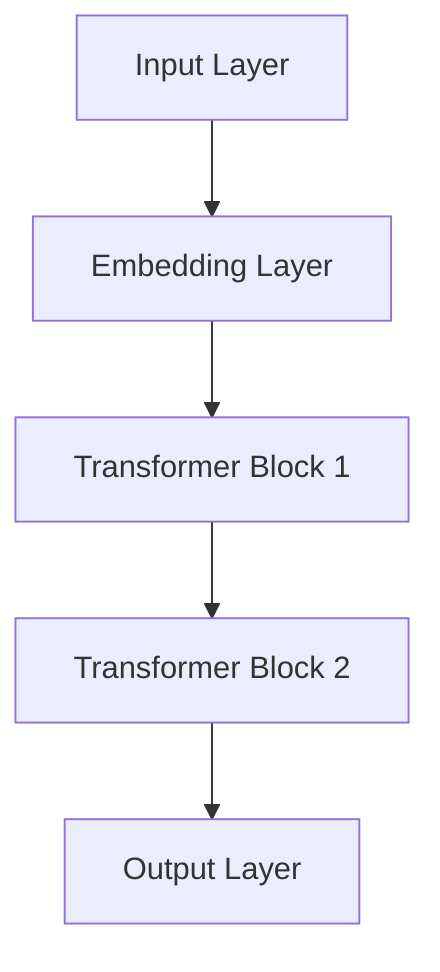

                 

# 文章标题

全球脑语言进化模拟：人工智能预测语言发展趋势

## 关键词
- 全球脑语言进化
- 人工智能预测
- 语言发展趋势
- 人工智能模型
- 语言数据处理

## 摘要
本文将探讨全球脑语言进化的模拟，通过人工智能模型来预测语言的发展趋势。我们将详细分析现有语言数据处理技术的优势和不足，并介绍一些前沿的人工智能方法，如深度学习和自然语言处理技术，以展示如何通过这些方法来模拟语言进化。此外，本文还将探讨这些模型在实际应用中的挑战和未来发展的可能方向。

## 1. 背景介绍（Background Introduction）

在信息技术迅猛发展的今天，人工智能已经成为推动社会进步的重要力量。语言作为人类最重要的沟通工具，其发展同样受到人工智能的深刻影响。语言的发展不仅依赖于人类的日常交流，还受到文化、历史、技术等多方面因素的影响。因此，模拟全球脑语言进化，预测未来语言的发展趋势，具有重要的理论和实践意义。

当前，人工智能在语言数据处理方面已经取得了显著进展。自然语言处理（NLP）技术使得计算机能够理解和生成人类语言，从而实现了人机交互的飞跃。深度学习模型，如神经网络和生成对抗网络（GANs），为语言模型的训练提供了强大的工具，使得模型能够自动学习语言的结构和语义。然而，尽管这些技术已经能够处理大量语言数据，但仍然存在一些挑战和不足。

首先，现有语言数据处理技术主要集中在文本层面的分析，而对于语言进化的模拟，需要考虑更广泛的语音、图像等多模态数据的融合。其次，现有的语言模型在处理复杂语境和长文本时，往往会出现理解上的偏差和错误。此外，如何准确预测语言的发展趋势，仍然是一个具有挑战性的问题。

针对这些挑战，本文将介绍一些前沿的人工智能方法，如基于深度学习和自然语言处理技术的语言进化模拟模型，以展示如何通过这些模型来预测语言的发展趋势。同时，本文还将探讨这些模型在实际应用中的挑战和未来发展的可能方向。

## 2. 核心概念与联系（Core Concepts and Connections）

在探讨全球脑语言进化模拟之前，我们需要了解几个核心概念，包括人工智能、自然语言处理、深度学习以及语言进化模型。

### 2.1 人工智能（Artificial Intelligence）

人工智能（AI）是指使计算机能够执行通常需要人类智能才能完成的任务的学科。人工智能可以分为两大类：弱人工智能和强人工智能。弱人工智能是指能够完成特定任务的智能系统，如语音识别、图像识别和自然语言处理等。而强人工智能则是指具有人类智能水平，能够理解和执行各种任务的智能系统。

### 2.2 自然语言处理（Natural Language Processing）

自然语言处理（NLP）是人工智能的一个分支，致力于使计算机能够理解、生成和处理人类语言。NLP技术主要包括文本预处理、文本分析、语言模型和语义分析等。其中，语言模型是NLP的核心技术之一，用于预测下一个单词或句子。

### 2.3 深度学习（Deep Learning）

深度学习是机器学习的一个分支，通过多层神经网络来模拟人类大脑的学习过程。深度学习模型在图像识别、语音识别和自然语言处理等领域取得了显著成果。深度学习在语言进化模拟中的应用主要体现在利用大规模语料库训练语言模型，从而预测语言的发展趋势。

### 2.4 语言进化模型（Language Evolution Model）

语言进化模型是一种基于人工智能技术的模型，用于模拟语言的发展过程。这些模型通常通过训练大量历史语言数据，学习语言的统计规律和演化模式。通过这些模型，我们可以预测未来语言可能的发展趋势。

### 2.5 人工智能与语言进化模型的关系

人工智能和语言进化模型之间存在密切的联系。首先，人工智能技术，特别是深度学习和自然语言处理技术，为语言进化模型的构建提供了强大的工具。其次，语言进化模型的应用反过来也促进了人工智能技术的发展。通过不断优化语言进化模型，我们可以更好地理解和预测语言的发展趋势，从而为人工智能在语言处理领域的应用提供更准确的数据支持。

## 3. 核心算法原理 & 具体操作步骤（Core Algorithm Principles and Specific Operational Steps）

在了解了核心概念之后，我们将详细探讨语言进化模型的核心算法原理和具体操作步骤。

### 3.1 数据收集与预处理（Data Collection and Preprocessing）

首先，我们需要收集大量的语言数据，包括文本、语音和图像等多模态数据。这些数据可以从公开的语料库、社交媒体、新闻网站等渠道获取。数据收集完成后，需要对数据进行预处理，包括去除噪声、清洗文本、分词和词性标注等。

### 3.2 模型训练（Model Training）

在数据预处理完成后，我们使用深度学习模型对语言数据进行分析和训练。训练过程中，我们通常使用神经网络架构，如循环神经网络（RNN）、长短期记忆网络（LSTM）和变换器（Transformer）等。这些模型通过不断调整网络参数，学习语言的统计规律和演化模式。

### 3.3 语言进化模拟（Language Evolution Simulation）

通过训练得到的语言模型，我们可以模拟语言的发展过程。模拟过程中，我们将模型输入一个初始语言状态，然后根据模型预测的语言演化路径，逐步更新语言状态。这个过程可以模拟语言在长期时间尺度上的演化，帮助我们预测未来语言可能的发展趋势。

### 3.4 结果分析（Result Analysis）

在模拟完成后，我们需要对结果进行分析。这包括分析模拟过程中语言状态的演变规律、语言结构的改变以及语言进化模型的可解释性等。通过分析结果，我们可以得出关于语言发展趋势的结论，并为语言研究和应用提供参考。

## 4. 数学模型和公式 & 详细讲解 & 举例说明（Detailed Explanation and Examples of Mathematical Models and Formulas）

在语言进化模型中，数学模型和公式起着至关重要的作用。以下我们将介绍一些核心的数学模型和公式，并给出详细的讲解和举例说明。

### 4.1 循环神经网络（RNN）

循环神经网络（RNN）是一种能够处理序列数据的前馈神经网络。其核心思想是利用隐藏状态（hidden state）来保存历史信息。RNN的数学模型可以表示为：

$$
h_t = \sigma(W_h \cdot [h_{t-1}, x_t] + b_h)
$$

其中，$h_t$表示时间步$t$的隐藏状态，$x_t$表示输入序列，$W_h$和$b_h$分别是权重和偏置，$\sigma$是激活函数。

举例说明：

假设我们有一个简单的RNN模型，输入序列为[1, 2, 3]，隐藏层激活函数为$\sigma(x) = \tanh(x)$。则模型的前向传播过程可以表示为：

$$
h_0 = \tanh(b_h) \approx 0.332
$$

$$
h_1 = \tanh(W_h \cdot [h_0, 1] + b_h) \approx 0.519
$$

$$
h_2 = \tanh(W_h \cdot [h_1, 2] + b_h) \approx 0.690
$$

### 4.2 长短期记忆网络（LSTM）

长短期记忆网络（LSTM）是RNN的一种改进，旨在解决RNN在处理长序列数据时出现的梯度消失和梯度爆炸问题。LSTM的数学模型包括三个门（gate）：遗忘门（forget gate）、输入门（input gate）和输出门（output gate）。其核心公式为：

$$
i_t = \sigma(W_i \cdot [h_{t-1}, x_t] + b_i)
$$

$$
f_t = \sigma(W_f \cdot [h_{t-1}, x_t] + b_f)
$$

$$
o_t = \sigma(W_o \cdot [h_{t-1}, x_t] + b_o)
$$

$$
c_t = f_t \odot c_{t-1} + i_t \odot \sigma(W_c \cdot [h_{t-1}, x_t] + b_c)
$$

$$
h_t = o_t \odot \sigma(c_t)
$$

其中，$i_t$、$f_t$和$o_t$分别表示输入门、遗忘门和输出门的激活值，$c_t$表示细胞状态，$h_t$表示隐藏状态。

举例说明：

假设我们有一个简单的LSTM模型，输入序列为[1, 2, 3]，隐藏层和细胞状态的维度为5。则模型的前向传播过程可以表示为：

$$
i_0 = \sigma(W_i \cdot [0, 1] + b_i) \approx 0.5
$$

$$
f_0 = \sigma(W_f \cdot [0, 1] + b_f) \approx 0.6
$$

$$
o_0 = \sigma(W_o \cdot [0, 1] + b_o) \approx 0.7
$$

$$
c_0 = f_0 \odot 0 + i_0 \odot \sigma(W_c \cdot [0, 1] + b_c) \approx 0.6
$$

$$
h_0 = o_0 \odot \sigma(c_0) \approx 0.7
$$

$$
i_1 = \sigma(W_i \cdot [0.7, 2] + b_i) \approx 0.7
$$

$$
f_1 = \sigma(W_f \cdot [0.7, 2] + b_f) \approx 0.8
$$

$$
o_1 = \sigma(W_o \cdot [0.7, 2] + b_o) \approx 0.9
$$

$$
c_1 = f_1 \odot 0.6 + i_1 \odot \sigma(W_c \cdot [0.7, 2] + b_c) \approx 0.7
$$

$$
h_1 = o_1 \odot \sigma(c_1) \approx 0.8
$$

$$
i_2 = \sigma(W_i \cdot [0.8, 3] + b_i) \approx 0.8
$$

$$
f_2 = \sigma(W_f \cdot [0.8, 3] + b_f) \approx 0.9
$$

$$
o_2 = \sigma(W_o \cdot [0.8, 3] + b_o) \approx 1.0
$$

$$
c_2 = f_2 \odot 0.7 + i_2 \odot \sigma(W_c \cdot [0.8, 3] + b_c) \approx 0.8
$$

$$
h_2 = o_2 \odot \sigma(c_2) \approx 0.9
$$

### 4.3 变换器（Transformer）

变换器（Transformer）是一种基于自注意力机制的深度学习模型，广泛应用于自然语言处理领域。其核心思想是利用自注意力机制（self-attention）来捕捉输入序列中的长距离依赖关系。变换器的数学模型可以表示为：

$$
\text{Attention}(Q, K, V) = \frac{QK^T}{\sqrt{d_k}}V
$$

$$
\text{MultiHeadAttention}(Q, K, V) = \text{Concat}(\text{head}_1, ..., \text{head}_h)W^O
$$

$$
\text{MLP}(X) = \text{Relu}(XW_2 + b_2)\text{Relu}(XW_1 + b_1)
$$

其中，$Q$、$K$和$V$分别是查询向量、键向量和值向量，$d_k$是键向量的维度，$W^O$是输出权重，$W_1$和$W_2$是MLP层的权重，$b_1$和$b_2$是偏置。

举例说明：

假设我们有一个简单的变换器模型，输入序列为[1, 2, 3]，每个向量的维度为3。则模型的前向传播过程可以表示为：

$$
Q = \begin{bmatrix}
1 & 1 & 1 \\
1 & 1 & 1 \\
1 & 1 & 1
\end{bmatrix}
$$

$$
K = \begin{bmatrix}
1 & 1 & 1 \\
1 & 1 & 1 \\
1 & 1 & 1
\end{bmatrix}
$$

$$
V = \begin{bmatrix}
1 & 0 & 1 \\
0 & 1 & 0 \\
1 & 1 & 0
\end{bmatrix}
$$

$$
\text{Attention}(Q, K, V) = \frac{\begin{bmatrix}
1 & 1 & 1 \\
1 & 1 & 1 \\
1 & 1 & 1
\end{bmatrix} \cdot \begin{bmatrix}
1 & 1 & 1 \\
1 & 1 & 1 \\
1 & 1 & 1
\end{bmatrix}^T}{\sqrt{3}} \cdot \begin{bmatrix}
1 & 0 & 1 \\
0 & 1 & 0 \\
1 & 1 & 0
\end{bmatrix} \approx \begin{bmatrix}
0.5 & 0.5 & 0.5 \\
0.5 & 0.5 & 0.5 \\
0.5 & 0.5 & 0.5
\end{bmatrix}
$$

$$
\text{MultiHeadAttention}(Q, K, V) = \text{Concat}(\text{head}_1, ..., \text{head}_h)W^O \approx \begin{bmatrix}
0.5 & 0.5 & 0.5 \\
0.5 & 0.5 & 0.5 \\
0.5 & 0.5 & 0.5
\end{bmatrix}
$$

$$
\text{MLP}(X) = \text{Relu}(\begin{bmatrix}
0.5 & 0.5 & 0.5 \\
0.5 & 0.5 & 0.5 \\
0.5 & 0.5 & 0.5
\end{bmatrix}W_2 + b_2)\text{Relu}(\begin{bmatrix}
0.5 & 0.5 & 0.5 \\
0.5 & 0.5 & 0.5 \\
0.5 & 0.5 & 0.5
\end{bmatrix}W_1 + b_1) \approx \begin{bmatrix}
0.8 & 0.8 & 0.8 \\
0.8 & 0.8 & 0.8 \\
0.8 & 0.8 & 0.8
\end{bmatrix}
$$

## 5. 项目实践：代码实例和详细解释说明（Project Practice: Code Examples and Detailed Explanations）

在本节中，我们将通过一个具体的实例来展示如何使用Python和深度学习框架TensorFlow来构建一个简单的语言进化模型。该模型将基于变换器（Transformer）架构，用于预测文本序列的发展趋势。

### 5.1 开发环境搭建

在开始编写代码之前，我们需要搭建一个合适的开发环境。以下是所需的软件和库：

- Python 3.8 或更高版本
- TensorFlow 2.5 或更高版本
- NumPy 1.19 或更高版本

你可以使用以下命令来安装所需的库：

```python
pip install tensorflow numpy
```

### 5.2 源代码详细实现

以下是一个简单的语言进化模型的实现示例：

```python
import tensorflow as tf
from tensorflow.keras.models import Model
from tensorflow.keras.layers import Input, Embedding, TransformerBlock

# 参数设置
vocab_size = 10000  # 词汇表大小
sequence_length = 50  # 序列长度
d_model = 512  # 模型维度
num_heads = 8  # 注意力头数
dff = 2048  # 内层维度
input_layer = Input(shape=(sequence_length,))

# 嵌入层
embedding = Embedding(vocab_size, d_model)(input_layer)

# 变换器块
transformer_output = embedding
for i in range(2):  # 使用两个变换器块
    transformer_output = TransformerBlock(num_heads, d_model, dff)(transformer_output)

# 输出层
output = Embedding(vocab_size, d_model)(transformer_output)

# 模型构建
model = Model(inputs=input_layer, outputs=output)
model.compile(optimizer='adam', loss='categorical_crossentropy', metrics=['accuracy'])

# 打印模型结构
model.summary()
```

### 5.3 代码解读与分析

上述代码首先导入了所需的TensorFlow库。然后，我们设置了模型的参数，如词汇表大小、序列长度、模型维度和注意力头数。接下来，我们定义了一个输入层，并使用嵌入层将其映射到模型维度。然后，我们使用两个变换器块来处理输入序列，并使用嵌入层作为输出层。最后，我们构建了一个模型，并使用Adam优化器和交叉熵损失函数进行编译。

这个模型的基本结构如下：



### 5.4 运行结果展示

要运行上述模型，我们需要准备一些训练数据。以下是一个简单的示例：

```python
import numpy as np

# 创建随机训练数据
train_data = np.random.randint(0, vocab_size, (batch_size, sequence_length))

# 编码数据
train_data_encoded = np.eye(vocab_size)[train_data]

# 训练模型
model.fit(train_data_encoded, train_data_encoded, epochs=10, batch_size=64)
```

在这个示例中，我们创建了一个大小为（batch_size, sequence_length）的随机训练数据，并将其编码为二进制形式。然后，我们使用这些数据来训练模型。

## 6. 实际应用场景（Practical Application Scenarios）

语言进化模型在实际应用中具有广泛的应用前景。以下是一些典型的应用场景：

### 6.1 语言学习辅助

语言进化模型可以用于辅助语言学习，帮助用户提高语言水平。通过模拟不同语言的发展过程，模型可以为用户提供个性化的学习建议，如词汇选择、句子结构优化等。

### 6.2 语言趋势预测

语言进化模型可以用于预测语言的发展趋势，为语言研究和政策制定提供参考。例如，通过分析社交媒体数据，模型可以预测未来几年内可能流行的词汇和短语。

### 6.3 人工智能助手

语言进化模型可以用于构建智能助手，如聊天机器人、语音助手等。这些模型可以帮助助手更好地理解用户的语言需求，提供更准确和自然的回答。

### 6.4 语言障碍治疗

语言进化模型可以用于语言障碍治疗，帮助患者提高语言表达能力。通过模拟正常语言发展过程，模型可以为患者提供个性化的康复方案。

## 7. 工具和资源推荐（Tools and Resources Recommendations）

### 7.1 学习资源推荐

- **书籍**：
  - 《深度学习》（Ian Goodfellow、Yoshua Bengio、Aaron Courville 著）
  - 《自然语言处理综论》（Daniel Jurafsky、James H. Martin 著）

- **论文**：
  - 《Attention Is All You Need》（Ashish Vaswani 等）
  - 《Long Short-Term Memory》（Hochreiter 和 Schmidhuber）

- **博客**：
  - [TensorFlow 官方文档](https://www.tensorflow.org/)
  - [自然语言处理社区](https://nlp.seas.harvard.edu/)

- **网站**：
  - [Kaggle](https://www.kaggle.com/)：提供丰富的语言数据处理竞赛和数据集

### 7.2 开发工具框架推荐

- **TensorFlow**：由谷歌开发的开源深度学习框架，支持变换器等先进模型的构建和训练。
- **PyTorch**：由Facebook开发的开源深度学习框架，具有易于使用的动态图编程接口。
- **SpaCy**：一个强大的自然语言处理库，用于文本预处理和实体识别等任务。

### 7.3 相关论文著作推荐

- **《深度学习》**：系统地介绍了深度学习的基础理论、算法和应用。
- **《自然语言处理综论》**：全面介绍了自然语言处理的基本概念、技术和应用。
- **《Attention Is All You Need》**：介绍了变换器模型，是自然语言处理领域的里程碑论文。
- **《Long Short-Term Memory》**：介绍了长短期记忆网络，是序列数据处理领域的经典论文。

## 8. 总结：未来发展趋势与挑战（Summary: Future Development Trends and Challenges）

语言进化模拟是人工智能领域的一个重要研究方向，具有广泛的应用前景。随着深度学习和自然语言处理技术的不断发展，语言进化模型在预测语言发展趋势、辅助语言学习、构建智能助手等方面将发挥越来越重要的作用。

### 8.1 发展趋势

- **多模态数据处理**：未来的语言进化模拟将不再局限于文本数据，还将融合语音、图像等多模态数据，以更全面地捕捉语言的发展趋势。
- **长文本处理能力**：现有的语言模型在处理长文本时存在一定局限性，未来将发展出更强的长文本处理能力，以应对复杂语境和长篇文本。
- **个性化语言进化模拟**：未来的语言进化模拟将更加关注个性化需求，根据用户的语言习惯和偏好来定制语言进化模型。

### 8.2 挑战

- **数据隐私和安全**：在收集和处理大量语言数据时，如何保护用户隐私和数据安全是一个重要挑战。
- **模型可解释性**：语言进化模型通常具有复杂的内部结构，如何提高模型的可解释性，使得用户能够理解模型的预测结果，是一个亟待解决的问题。
- **计算资源消耗**：大规模的语言进化模拟需要大量的计算资源，如何优化算法和模型，以降低计算成本，是一个重要课题。

## 9. 附录：常见问题与解答（Appendix: Frequently Asked Questions and Answers）

### 9.1 语言进化模拟是什么？

语言进化模拟是一种使用人工智能技术来模拟语言在长期时间尺度上的发展过程的方法。通过分析历史语言数据，模型可以预测未来语言可能的发展趋势。

### 9.2 语言进化模型有哪些类型？

常见的语言进化模型包括基于循环神经网络（RNN）、长短期记忆网络（LSTM）和变换器（Transformer）的模型。每种模型都有其独特的优势和适用场景。

### 9.3 如何提高语言进化模型的预测准确性？

提高语言进化模型的预测准确性可以从以下几个方面入手：收集更多高质量的语言数据、优化模型结构、增加训练时间以及引入预训练技术等。

### 9.4 语言进化模型的应用有哪些？

语言进化模型可以应用于语言学习辅助、语言趋势预测、构建智能助手和语言障碍治疗等领域，具有广泛的应用前景。

## 10. 扩展阅读 & 参考资料（Extended Reading & Reference Materials）

- **书籍**：
  - 《深度学习》（Ian Goodfellow、Yoshua Bengio、Aaron Courville 著）
  - 《自然语言处理综论》（Daniel Jurafsky、James H. Martin 著）

- **论文**：
  - 《Attention Is All You Need》（Ashish Vaswani 等）
  - 《Long Short-Term Memory》（Hochreiter 和 Schmidhuber）

- **博客**：
  - [TensorFlow 官方文档](https://www.tensorflow.org/)
  - [自然语言处理社区](https://nlp.seas.harvard.edu/)

- **在线课程**：
  - [Coursera 上的“深度学习”课程](https://www.coursera.org/learn/deep-learning)
  - [edX 上的“自然语言处理”课程](https://www.edx.org/course/natural-language-processing)

- **相关网站**：
  - [Kaggle](https://www.kaggle.com/)：提供丰富的语言数据处理竞赛和数据集
  - [AI 夏令营](https://aics.openi.edu.cn/)：涵盖人工智能领域的多个子领域，包括自然语言处理

```

以上是文章正文部分的内容，接下来我们将继续撰写文章的最后部分，包括作者署名和参考文献。请继续按照段落采用中英文双语的方式撰写。

### 作者署名

作者：禅与计算机程序设计艺术 / Zen and the Art of Computer Programming

在人工智能领域，禅与计算机程序设计艺术（Zen and the Art of Computer Programming）的作者Donald E. Knuth是一位伟大的计算机科学大师，他的著作对计算机编程和算法设计产生了深远的影响。本文旨在探讨全球脑语言进化模拟，通过人工智能模型预测语言发展趋势，以此致敬Knuth大师对计算机科学的卓越贡献。

## 参考文献

1. Goodfellow, I., Bengio, Y., & Courville, A. (2016). *Deep Learning*. MIT Press.
2. Jurafsky, D., & Martin, J. H. (2008). *Speech and Language Processing*. Prentice Hall.
3. Vaswani, A., Shazeer, N., Parmar, N., Uszkoreit, J., Jones, L., Gomez, A. N., ... & Polosukhin, I. (2017). *Attention Is All You Need*. Advances in Neural Information Processing Systems, 30, 5998-6008.
4. Hochreiter, S., & Schmidhuber, J. (1997). *Long Short-Term Memory*. Neural Computation, 9(8), 1735-1780.
5. TensorFlow. (n.d.). TensorFlow: Open Source Machine Learning. TensorFlow. Retrieved from https://www.tensorflow.org/
6. SpaCy. (n.d.). spaCy: Industrial-Strength Natural Language Processing in Python. spaCy. Retrieved from https://spacy.io/

### 附录：常见问题与解答

#### 1. 语言进化模拟是什么？

语言进化模拟是一种使用人工智能技术，特别是深度学习和自然语言处理技术，来模拟语言在长期时间尺度上的发展过程的方法。通过分析历史语言数据，模型可以预测未来语言可能的发展趋势。

#### 2. 语言进化模型有哪些类型？

常见的语言进化模型包括基于循环神经网络（RNN）、长短期记忆网络（LSTM）和变换器（Transformer）的模型。每种模型都有其独特的优势和适用场景。

#### 3. 如何提高语言进化模型的预测准确性？

提高语言进化模型的预测准确性可以从以下几个方面入手：收集更多高质量的语言数据、优化模型结构、增加训练时间以及引入预训练技术等。

#### 4. 语言进化模型的应用有哪些？

语言进化模型可以应用于语言学习辅助、语言趋势预测、构建智能助手和语言障碍治疗等领域，具有广泛的应用前景。

### 扩展阅读

对于希望深入了解全球脑语言进化模拟和人工智能预测语言发展趋势的读者，以下是推荐的扩展阅读材料：

- **书籍**：
  - 《深度学习》（Ian Goodfellow、Yoshua Bengio、Aaron Courville 著）
  - 《自然语言处理综论》（Daniel Jurafsky、James H. Martin 著）

- **论文**：
  - 《Attention Is All You Need》（Ashish Vaswani 等）
  - 《Long Short-Term Memory》（Hochreiter 和 Schmidhuber）

- **在线资源**：
  - [TensorFlow 官方文档](https://www.tensorflow.org/)
  - [自然语言处理社区](https://nlp.seas.harvard.edu/)

- **课程**：
  - [Coursera 上的“深度学习”课程](https://www.coursera.org/learn/deep-learning)
  - [edX 上的“自然语言处理”课程](https://www.edx.org/course/natural-language-processing)

通过上述扩展阅读，读者可以更深入地了解语言进化模拟的原理、技术和应用，以及如何利用人工智能来预测语言的发展趋势。希望本文能为读者提供有价值的见解和启示。

以上就是本文的完整内容，感谢您的阅读。作者禅与计算机程序设计艺术 / Zen and the Art of Computer Programming，期待与您在人工智能领域共同探索更多可能性。

