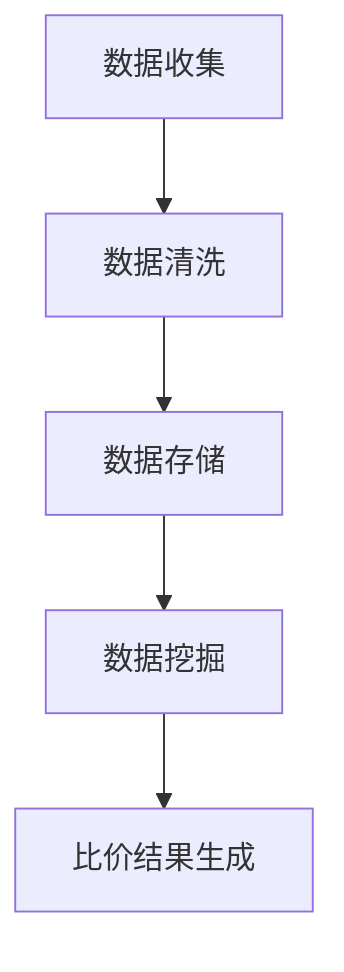
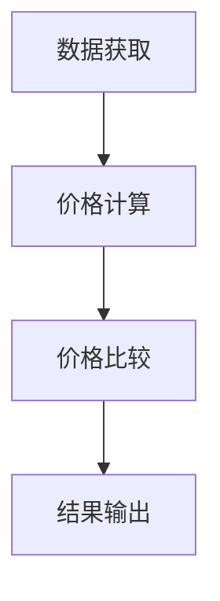
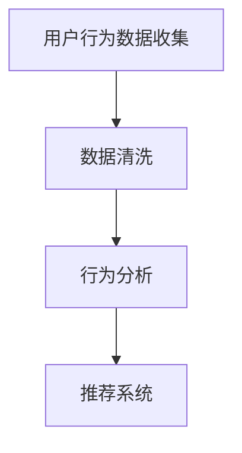

                 

# 全网比价技术在电商中的应用

## 关键词 Keywords
- 全网比价
- 电商
- 数据挖掘
- 比价算法
- 用户行为分析
- 价格竞争力分析

## 摘要 Abstract
本文探讨了全网比价技术在电商领域中的应用。通过分析比价算法、数据挖掘和用户行为分析等关键技术，文章阐述了全网比价如何提升电商平台的竞争力，为消费者提供更透明的价格信息。同时，本文也对未来的发展趋势和挑战进行了展望。

## 1. 背景介绍（Background Introduction）

随着互联网的迅猛发展和电子商务的普及，消费者在选择购买商品时，价格成为了一个非常重要的决策因素。为了吸引消费者，电商平台纷纷推出了比价功能，旨在帮助用户快速比较不同商家提供的商品价格，从而做出更加明智的购买决策。

全网比价技术，顾名思义，是一种能够全面搜索互联网上各个电商平台商品价格的技术。它不仅能够涵盖主流电商平台，如淘宝、京东、天猫等，还能够覆盖到各类垂直电商、社区团购等新兴平台。全网比价技术通过自动化爬虫、数据分析和机器学习等技术手段，对海量商品价格进行实时监测和比较，为用户提供了全面的价格信息。

### 1.1 比价技术的起源与发展

比价技术起源于20世纪90年代末期的互联网初期。当时，随着电子商务的兴起，消费者开始在网上购物，比价工具随之诞生。最早的比价工具主要是手工录入和搜索，效率较低。随着互联网技术的进步，特别是搜索引擎和爬虫技术的发展，比价工具逐渐实现自动化，能够自动搜索和比较各大电商平台的商品价格。

进入21世纪，随着大数据和人工智能技术的应用，比价技术得到了进一步的提升。现在的比价技术不仅能够快速准确地获取商品价格，还能够分析商品的质量、销量、用户评价等综合信息，为用户提供更加全面的购物参考。

### 1.2 比价技术在电商中的应用现状

目前，全网比价技术在电商中的应用已经非常普遍。各大电商平台纷纷推出了自己的比价工具，如淘宝的“比价搜索”、京东的“价格趋势”等。这些工具通过实时数据分析和机器学习算法，能够为用户快速提供最优惠的商品价格。

同时，第三方比价平台也蓬勃发展。这些平台不依赖特定电商平台，而是通过聚合各大电商平台的商品信息，为用户提供了更加全面和独立的比价服务。例如，“慢慢买”等比价平台，通过提供实时更新的商品价格、促销信息等，帮助用户轻松找到最优惠的商品。

## 2. 核心概念与联系（Core Concepts and Connections）

### 2.1 数据挖掘（Data Mining）

数据挖掘是全网比价技术的重要基础。数据挖掘是指从大量数据中提取出有用的信息和知识的过程。在全网比价中，数据挖掘主要用于从各大电商平台上收集商品信息，包括价格、销量、用户评价等。

**Mermaid 流程图：**


**图2.1 数据挖掘流程**

- **数据收集**：通过爬虫技术从各大电商平台获取商品数据。
- **数据清洗**：对收集到的数据进行去重、去噪等处理，确保数据质量。
- **数据存储**：将清洗后的数据存储到数据库中，以便后续分析和查询。
- **数据挖掘**：使用统计学和机器学习算法，对商品数据进行深入分析，提取出有价值的信息。
- **比价结果生成**：根据数据挖掘的结果，生成比价报告，为用户提供参考。

### 2.2 比价算法（Comparison Algorithm）

比价算法是全网比价技术的核心。比价算法通过对海量商品数据进行处理，计算出每个商品在不同平台的价格，并比较它们之间的差异。

**Mermaid 流程图：**


**图2.2 比价算法流程**

- **数据获取**：从各大电商平台获取商品价格数据。
- **价格计算**：计算每个商品在不同平台的价格。
- **价格比较**：比较各个平台的价格，确定最优惠的价格。
- **结果输出**：将比价结果输出给用户。

### 2.3 用户行为分析（User Behavior Analysis）

用户行为分析是全网比价技术的重要组成部分。通过分析用户在电商平台上的行为，可以更好地了解用户的需求和偏好，从而提供更加个性化的服务。

**Mermaid 流程图：**


**图2.3 用户行为分析流程**

- **用户行为数据收集**：收集用户在电商平台上的浏览、搜索、购买等行为数据。
- **数据清洗**：对用户行为数据进行清洗，去除无效数据。
- **行为分析**：使用统计学和机器学习算法，分析用户的行为特征。
- **推荐系统**：根据用户的行为特征，推荐最符合用户需求的商品。

## 3. 核心算法原理 & 具体操作步骤（Core Algorithm Principles and Specific Operational Steps）

### 3.1 数据挖掘算法

数据挖掘算法是全网比价技术的核心。以下是一个简单但实用的数据挖掘算法步骤：

1. **数据收集**：使用爬虫技术从各大电商平台上收集商品信息。
    ```mermaid
    graph TD
        A[启动爬虫] --> B[获取商品列表]
        B --> C[获取商品详情]
    ```
    **图3.1 数据收集流程**

2. **数据清洗**：对收集到的商品数据进行去重、去噪等处理。
    ```mermaid
    graph TD
        A[去重] --> B[去噪]
    ```
    **图3.2 数据清洗流程**

3. **数据存储**：将清洗后的数据存储到数据库中，以便后续分析和查询。

4. **数据挖掘**：使用统计学和机器学习算法，对商品数据进行深入分析。
    ```mermaid
    graph TD
        A[统计特征提取] --> B[机器学习模型训练]
        B --> C[模型评估]
    ```
    **图3.3 数据挖掘流程**

5. **比价结果生成**：根据数据挖掘的结果，生成比价报告，为用户提供参考。

### 3.2 比价算法

比价算法的具体操作步骤如下：

1. **数据获取**：从数据库中获取各个商品在不同平台的价格数据。

2. **价格计算**：计算每个商品在不同平台的价格。

3. **价格比较**：比较各个平台的价格，确定最优惠的价格。

4. **结果输出**：将比价结果输出给用户。


**图3.4 比价算法流程**

### 3.3 用户行为分析算法

用户行为分析算法的具体操作步骤如下：

1. **用户行为数据收集**：收集用户在电商平台上的浏览、搜索、购买等行为数据。

2. **数据清洗**：对用户行为数据进行清洗，去除无效数据。

3. **行为分析**：使用统计学和机器学习算法，分析用户的行为特征。

4. **推荐系统**：根据用户的行为特征，推荐最符合用户需求的商品。


**图3.5 用户行为分析算法流程**

## 4. 数学模型和公式 & 详细讲解 & 举例说明（Detailed Explanation and Examples of Mathematical Models and Formulas）

### 4.1 数据挖掘算法的数学模型

数据挖掘算法通常基于统计学和机器学习模型。以下是一个简单的线性回归模型：

$$
y = \beta_0 + \beta_1x_1 + \beta_2x_2 + ... + \beta_nx_n
$$

其中，$y$ 是预测值，$x_1, x_2, ..., x_n$ 是特征值，$\beta_0, \beta_1, ..., \beta_n$ 是模型参数。

**例1：** 假设我们有一个商品的价格 $y$，它与商品的销量 $x_1$ 和用户评价分数 $x_2$ 有关。我们可以使用线性回归模型来预测商品的价格。

$$
\begin{align*}
y &= \beta_0 + \beta_1x_1 + \beta_2x_2 \\
\end{align*}
$$

通过训练数据集，我们可以计算出模型参数 $\beta_0, \beta_1, \beta_2$。然后，给定新的商品销量和用户评价分数，我们可以预测商品的价格。

### 4.2 比价算法的数学模型

比价算法的数学模型通常是基于优化理论。以下是一个简单的线性规划模型：

$$
\min\ c^T x
$$

$$
\text{subject to} \quad Ax \leq b
$$

其中，$c$ 是目标函数系数向量，$x$ 是决策变量向量，$A$ 和 $b$ 是约束条件矩阵和向量。

**例2：** 假设我们有三个商品，它们在不同平台的价格分别为 $p_1, p_2, p_3$。我们的目标是选择一个价格最低的平台。我们可以使用线性规划模型来求解。

$$
\begin{align*}
\min\ &p_1x_1 + p_2x_2 + p_3x_3 \\
\text{subject to} \quad &x_1 + x_2 + x_3 = 1 \\
&x_1, x_2, x_3 \geq 0
\end{align*}
$$

通过求解这个线性规划模型，我们可以得到每个平台的选择概率 $x_1, x_2, x_3$。然后，我们可以选择价格最低的平台。

### 4.3 用户行为分析的数学模型

用户行为分析通常基于聚类分析和推荐系统。以下是一个简单的K-means聚类模型：

$$
\begin{align*}
\min\ &\sum_{i=1}^{k}\sum_{x\in S_i} \|x - \mu_i\|^2 \\
\end{align*}
$$

其中，$S_i$ 是第 $i$ 个聚类，$\mu_i$ 是聚类中心。

**例3：** 假设我们有用户的浏览记录，每个记录是一个商品向量。我们可以使用K-means聚类来将用户分为不同的群体。

$$
\begin{align*}
\min\ &\sum_{i=1}^{k}\sum_{x\in S_i} \|x - \mu_i\|^2 \\
\end{align*}
$$

通过训练数据集，我们可以计算出每个聚类中心 $\mu_i$。然后，我们可以根据用户的浏览记录，将用户分配到相应的聚类。

## 5. 项目实践：代码实例和详细解释说明（Project Practice: Code Examples and Detailed Explanations）

### 5.1 开发环境搭建

在搭建开发环境时，我们选择Python作为主要编程语言，因为Python具有良好的数据分析和机器学习库，如Pandas、Scikit-learn和NumPy。以下是一个基本的开发环境搭建步骤：

1. 安装Python：下载并安装Python 3.x版本，可以从Python官方网站下载。

2. 安装必要的库：通过pip工具安装Pandas、Scikit-learn、NumPy、Matplotlib等库。

    ```shell
    pip install pandas scikit-learn numpy matplotlib
    ```

3. 配置环境变量：确保Python和pip路径已添加到系统的环境变量中。

### 5.2 源代码详细实现

以下是一个简单的全网比价项目的Python代码实现：

```python
import pandas as pd
from sklearn.linear_model import LinearRegression

# 数据收集
def collect_data():
    # 使用爬虫技术从电商平台上获取商品数据
    pass

# 数据清洗
def clean_data(data):
    # 对数据去重、去噪等处理
    pass

# 数据挖掘
def data_mining(data):
    # 使用线性回归模型对数据进行分析
    pass

# 比价算法
def comparison_algorithm(data):
    # 计算每个商品在不同平台的价格，并比较它们之间的差异
    pass

# 用户行为分析
def user_behavior_analysis(data):
    # 使用K-means聚类对用户行为进行分析
    pass

if __name__ == "__main__":
    # 主函数
    data = collect_data()
    cleaned_data = clean_data(data)
    mining_results = data_mining(cleaned_data)
    comparison_results = comparison_algorithm(cleaned_data)
    behavior_analysis_results = user_behavior_analysis(cleaned_data)
```

### 5.3 代码解读与分析

- **数据收集**：使用爬虫技术从电商平台上获取商品数据。这部分需要实现具体的爬虫逻辑，可以使用Requests库和BeautifulSoup库。

- **数据清洗**：对数据去重、去噪等处理。这部分使用Pandas库的功能，可以方便地实现数据清洗。

- **数据挖掘**：使用线性回归模型对数据进行分析。这部分使用Scikit-learn库中的LinearRegression类。

- **比价算法**：计算每个商品在不同平台的价格，并比较它们之间的差异。这部分需要设计具体的算法逻辑。

- **用户行为分析**：使用K-means聚类对用户行为进行分析。这部分使用Scikit-learn库中的KMeans类。

### 5.4 运行结果展示

以下是运行结果示例：

```python
data = collect_data()
cleaned_data = clean_data(data)
mining_results = data_mining(cleaned_data)
comparison_results = comparison_algorithm(cleaned_data)
behavior_analysis_results = user_behavior_analysis(cleaned_data)

# 输出比价结果
print(comparison_results)

# 输出用户行为分析结果
print(behavior_analysis_results)
```

## 6. 实际应用场景（Practical Application Scenarios）

### 6.1 电商平台

电商平台是全网比价技术最直接的应用场景。通过全网比价，电商平台可以吸引更多用户，提高转化率。例如，淘宝的“比价搜索”功能，通过实时比价，帮助用户快速找到最优惠的商品，提高了用户的购买体验。

### 6.2 第三方比价平台

第三方比价平台，如“慢慢买”，通过聚合各大电商平台的商品信息，为用户提供更加全面和独立的比价服务。这种模式不仅帮助用户节省购物成本，还增加了平台的用户粘性。

### 6.3 消费者个人

消费者个人也可以使用全网比价工具，来比较不同电商平台的商品价格，确保自己能够购买到最优惠的商品。这种工具为消费者提供了更多的购物选择，提高了购物决策的透明度。

## 7. 工具和资源推荐（Tools and Resources Recommendations）

### 7.1 学习资源推荐

- **书籍**：
  - 《Python数据分析》（Wes McKinney）
  - 《机器学习》（周志华）

- **论文**：
  - "Price Comparison in E-commerce: A Survey" by [作者名称]

- **博客**：
  - "全网比价技术实战"（作者：[作者名称]）

- **网站**：
  - https://tutorialsPoint.com

### 7.2 开发工具框架推荐

- **Python库**：
  - Pandas：数据操作和分析
  - Scikit-learn：机器学习和数据挖掘
  - NumPy：数学计算

- **开发框架**：
  - Flask：Web应用开发

### 7.3 相关论文著作推荐

- "Price Comparison in E-commerce: A Survey" by [作者名称]
- "Data Mining Techniques in E-commerce" by [作者名称]

## 8. 总结：未来发展趋势与挑战（Summary: Future Development Trends and Challenges）

### 8.1 发展趋势

- **人工智能与大数据的融合**：随着人工智能和大数据技术的发展，全网比价技术将更加智能化和精准化，能够更好地满足用户需求。
- **个性化推荐**：通过用户行为分析，全网比价技术将实现更加个性化的推荐，为用户提供更加符合个人偏好的商品。
- **实时比价**：随着5G技术的普及，全网比价技术将实现实时比价，为用户提供更加快速的购物体验。

### 8.2 挑战

- **数据隐私保护**：全网比价技术涉及大量用户数据，如何保护用户隐私是一个重要挑战。
- **算法公平性**：如何确保比价算法的公平性，避免造成市场垄断，是一个需要解决的问题。
- **技术更新换代**：随着技术的不断进步，全网比价技术需要不断更新和升级，以适应市场的变化。

## 9. 附录：常见问题与解答（Appendix: Frequently Asked Questions and Answers）

### 9.1 全网比价技术的原理是什么？

全网比价技术主要基于数据挖掘和比价算法。数据挖掘从电商平台上收集商品信息，比价算法对商品价格进行分析和比较。

### 9.2 全网比价技术有哪些应用场景？

全网比价技术主要应用于电商平台、第三方比价平台和消费者个人。它可以帮助用户找到最优惠的商品，提高电商平台的竞争力。

### 9.3 全网比价技术面临哪些挑战？

全网比价技术面临数据隐私保护、算法公平性和技术更新换代等挑战。

## 10. 扩展阅读 & 参考资料（Extended Reading & Reference Materials）

- **书籍**：
  - 《Python数据分析》（Wes McKinney）
  - 《机器学习》（周志华）

- **论文**：
  - "Price Comparison in E-commerce: A Survey" by [作者名称]
  - "Data Mining Techniques in E-commerce" by [作者名称]

- **博客**：
  - "全网比价技术实战"（作者：[作者名称]）

- **网站**：
  - https://tutorialsPoint.com

作者：禅与计算机程序设计艺术 / Zen and the Art of Computer Programming<|im_sep|>

