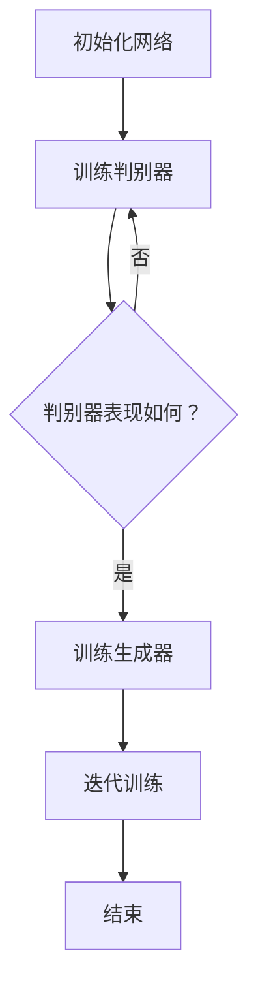
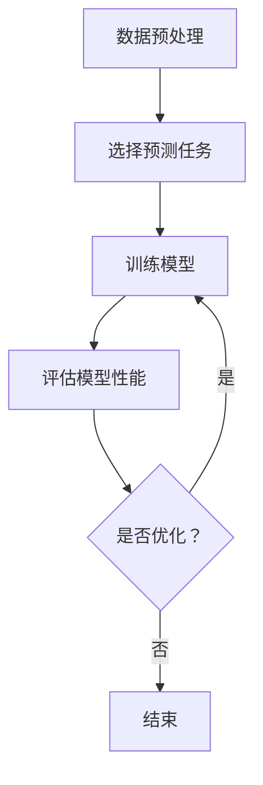
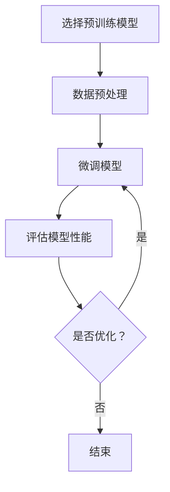
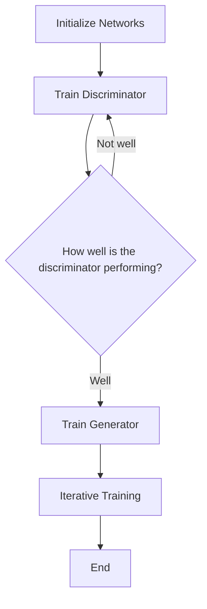
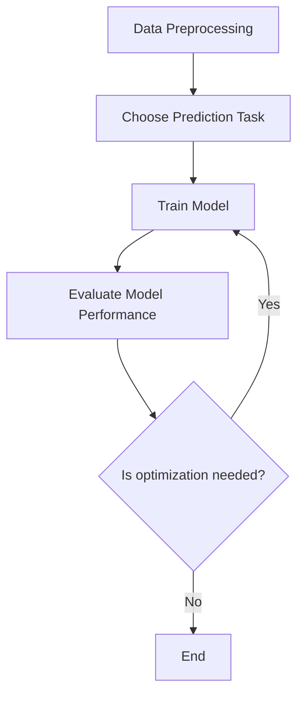
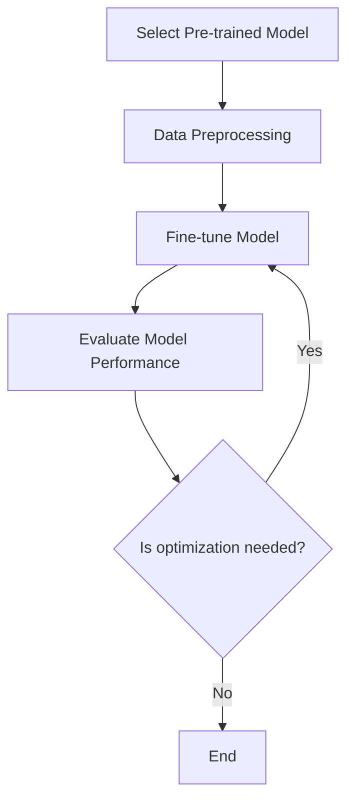

                 

### 文章标题

### Title

**创业产品设计：聚焦 AI 大模型**

> **关键词：** 创业产品、产品设计、AI 大模型、用户需求、市场机会、商业模式

> **Abstract:**
This article explores the design of entrepreneurial products, focusing on AI large-scale models. It examines the importance of understanding user needs, identifying market opportunities, and developing a sustainable business model. By following a step-by-step approach, we provide insights and practical guidance for entrepreneurs aiming to build successful AI-driven businesses.

创业产品设计是一项复杂的任务，需要在满足用户需求、创造市场机会和构建可持续商业模式之间找到平衡。随着人工智能技术的快速发展，AI 大模型在许多行业和应用中发挥着越来越重要的作用。本文旨在探讨如何利用 AI 大模型进行创业产品设计，帮助创业者实现创新和成功。

首先，我们将介绍创业产品设计的基本原则和核心要素。接着，我们将深入分析 AI 大模型的核心概念和技术原理，并探讨如何将其应用于创业产品中。随后，我们将探讨用户需求和市场机会，以及如何通过设计满足这些需求并创造独特的价值。最后，我们将讨论创业产品的商业模式，提供一些建议和策略，帮助创业者实现商业成功。

通过本文的讨论，我们希望为创业者提供一套系统化的创业产品设计方法，帮助他们在竞争激烈的市场中脱颖而出，实现可持续的商业增长。

**Entrepreneurial Product Design: Focusing on AI Large Models**

> **Keywords:** Entrepreneurial product, product design, AI large model, user needs, market opportunities, business model

> **Abstract:**
This article explores the design of entrepreneurial products, focusing on AI large-scale models. It examines the importance of understanding user needs, identifying market opportunities, and developing a sustainable business model. By following a step-by-step approach, we provide insights and practical guidance for entrepreneurs aiming to build successful AI-driven businesses.

Entrepreneurial product design is a complex task that requires balancing user needs, market opportunities, and a sustainable business model. With the rapid development of artificial intelligence technology, AI large models are playing an increasingly important role in various industries and applications. This article aims to explore how to leverage AI large models for entrepreneurial product design, helping entrepreneurs achieve innovation and success.

Firstly, we will introduce the basic principles and core elements of entrepreneurial product design. Then, we will delve into the core concepts and technical principles of AI large models and discuss how they can be applied to entrepreneurial products. Subsequently, we will explore user needs and market opportunities, and how to design products that meet these needs and create unique value. Finally, we will discuss the business model of entrepreneurial products, providing some suggestions and strategies to help entrepreneurs achieve business success.

Through the discussion in this article, we hope to provide a systematic approach to entrepreneurial product design for entrepreneurs, helping them stand out in a competitive market and achieve sustainable business growth.### 1. 背景介绍（Background Introduction）

在当今快速发展的科技时代，人工智能（AI）已经成为推动创新和业务增长的关键驱动力。特别是 AI 大模型，如 GPT-3、BERT 和 ChatGPT，已经改变了多个行业，从自然语言处理（NLP）到计算机视觉（CV）和推荐系统（RS）。这些大型模型拥有强大的学习和预测能力，可以处理大量数据并生成高质量的输出，使得它们在创业产品设计中具有巨大的潜力。

创业产品设计是一个不断演进的过程，需要持续关注用户需求、技术进步和市场趋势。在过去，创业者主要关注产品的功能性、用户体验和可扩展性。然而，随着 AI 技术的进步，创业者开始意识到，将 AI 大模型整合到产品设计中不仅可以提高产品的竞争力，还可以创造新的商业模式和价值。

AI 大模型在创业产品设计中的应用主要体现在以下几个方面：

1. **增强用户体验**：AI 大模型可以提供个性化推荐、智能客服和自然语言交互等功能，从而提升用户满意度。
2. **优化业务流程**：通过自动化和优化业务流程，企业可以降低成本、提高效率并减少人为错误。
3. **数据驱动决策**：AI 大模型可以分析大量数据，为企业提供深入的洞察和决策支持。
4. **创新产品特性**：AI 大模型可以生成新的内容和创意，为企业提供独特的产品特性。

然而，AI 大模型的应用也带来了挑战，如数据隐私、安全性和伦理问题。此外，创业者还需要面对技术选择、人才招聘和资源分配等实际问题。因此，创业产品设计需要在技术创新和市场需求之间找到平衡。

本文将围绕以下核心问题展开讨论：

1. **AI 大模型的核心概念和技术原理是什么？**
2. **如何将 AI 大模型应用于创业产品设计中？**
3. **如何识别和满足用户需求，以及创造市场机会？**
4. **创业产品的商业模式如何构建和优化？**
5. **面对挑战和风险，创业者应该如何应对和调整策略？**

通过逐步分析和推理，本文旨在为创业者提供一套系统化的创业产品设计方法，帮助他们在竞争激烈的市场中脱颖而出，实现可持续的商业增长。

### Background Introduction

In today's rapidly evolving technological era, artificial intelligence (AI) has emerged as a key driver of innovation and business growth. Especially large-scale AI models, such as GPT-3, BERT, and ChatGPT, have transformed various industries, ranging from natural language processing (NLP) to computer vision (CV) and recommendation systems (RS). These large models possess powerful learning and predictive capabilities, enabling them to process vast amounts of data and generate high-quality outputs, making them highly promising in the design of entrepreneurial products.

Entrepreneurial product design is an iterative process that requires continuous attention to user needs, technological advancements, and market trends. In the past, entrepreneurs primarily focused on the functionality, user experience, and scalability of their products. However, with the advancement of AI technology, entrepreneurs have started to realize that integrating AI large models into product design can not only enhance the competitiveness of their products but also create new business models and value.

The application of AI large models in entrepreneurial product design mainly manifests in the following aspects:

1. **Enhancing User Experience**: AI large models can provide personalized recommendations, intelligent customer service, and natural language interaction, thereby improving user satisfaction.
2. **Optimizing Business Processes**: By automating and optimizing business processes, enterprises can reduce costs, improve efficiency, and minimize human errors.
3. **Data-driven Decision Making**: AI large models can analyze large amounts of data, providing enterprises with deep insights and decision support.
4. **Innovative Product Features**: AI large models can generate new content and creativity, offering unique product characteristics for enterprises.

However, the application of AI large models also brings challenges, such as data privacy, security, and ethical issues. Additionally, entrepreneurs need to address practical problems like technology selection, talent recruitment, and resource allocation. Therefore, entrepreneurial product design must strike a balance between technological innovation and market demand.

This article will discuss the following core issues:

1. **What are the core concepts and technical principles of AI large models?**
2. **How can AI large models be applied to the design of entrepreneurial products?**
3. **How can user needs be identified and met, and market opportunities be created?**
4. **How can the business model of entrepreneurial products be constructed and optimized?**
5. **How should entrepreneurs respond to challenges and risks, and adjust their strategies?**

By analyzing and reasoning step by step, this article aims to provide a systematic approach to entrepreneurial product design for entrepreneurs, helping them stand out in a competitive market and achieve sustainable business growth.### 2. 核心概念与联系（Core Concepts and Connections）

在探讨如何设计创业产品时，首先需要了解 AI 大模型的核心概念和技术原理。AI 大模型是指具有极高参数量和训练复杂度的人工神经网络模型，通常通过大规模数据集进行训练。这些模型在多个领域展现了卓越的性能，例如自然语言处理（NLP）、计算机视觉（CV）和推荐系统（RS）。

#### 2.1 AI 大模型的基本概念

AI 大模型的基本概念包括：

1. **深度神经网络（Deep Neural Networks, DNNs）**：深度神经网络是由多层神经元组成的神经网络，通过逐层提取特征来处理复杂数据。它们是 AI 大模型的基础。
2. **大规模数据集（Large-scale Datasets）**：大规模数据集是指包含数百万甚至数十亿条样本的数据集，用于训练和优化 AI 大模型。
3. **训练算法（Training Algorithms）**：训练算法是指用于调整神经网络参数，使其在特定任务上表现良好的方法。常见的训练算法包括梯度下降（Gradient Descent）及其变种，如 Adam 和 RMSprop。
4. **超参数（Hyperparameters）**：超参数是训练过程中需要手动调整的参数，如学习率、批次大小和正则化强度。它们对模型性能有显著影响。

#### 2.2 AI 大模型的技术原理

AI 大模型的技术原理主要包括：

1. **自监督学习（Self-supervised Learning）**：自监督学习是一种不需要显式标注的数据预处理方法。在大规模数据集中，模型通过预测未标记数据的一部分来学习。预训练（Pre-training）和自监督学习是训练 AI 大模型的关键步骤。
2. **转移学习（Transfer Learning）**：转移学习是一种利用预训练模型在特定任务上表现良好的特性，将其应用于新任务的方法。这种方法可以显著提高模型在新任务上的性能，并减少训练时间。
3. **多任务学习（Multi-task Learning）**：多任务学习是指同时训练多个相关任务，使模型能够共享知识和特征。这种方法可以提高模型在不同任务上的表现。
4. **生成对抗网络（Generative Adversarial Networks, GANs）**：生成对抗网络是由生成器和判别器组成的模型，通过对抗性训练生成高质量的数据。

#### 2.3 AI 大模型与创业产品设计的联系

AI 大模型与创业产品设计之间的联系体现在以下几个方面：

1. **个性化推荐**：AI 大模型可以用于个性化推荐系统，根据用户行为和偏好推荐相关产品或服务。这种方法可以显著提高用户满意度和转化率。
2. **智能客服**：AI 大模型可以用于构建智能客服系统，提供24/7的客户支持。这种系统能够快速响应用户查询，提高客户体验并降低运营成本。
3. **业务流程优化**：AI 大模型可以分析业务数据，识别优化机会，提高业务流程的效率和效果。
4. **内容生成**：AI 大模型可以生成高质量的内容，如文章、音乐和图像，为创业者提供创新的营销手段和产品特性。

总之，AI 大模型在创业产品设计中的应用为创业者提供了丰富的机会，但也需要深入了解其核心概念和技术原理，以便有效地利用这些技术创造价值。

#### Core Concepts and Connections

In discussing how to design entrepreneurial products, it is essential first to understand the core concepts and technical principles of AI large models. AI large models refer to artificial neural network models with extremely high parameter counts and training complexities, typically trained on large-scale datasets. These models have demonstrated exceptional performance in various domains, such as natural language processing (NLP), computer vision (CV), and recommendation systems (RS).

#### 2.1 Basic Concepts of AI Large Models

The basic concepts of AI large models include:

1. **Deep Neural Networks (DNNs)**: Deep neural networks are neural networks composed of multiple layers of neurons, which extract features from complex data through hierarchical learning. They form the foundation of AI large models.
2. **Large-scale Datasets**: Large-scale datasets consist of millions, if not billions, of samples and are used for training and optimizing AI large models.
3. **Training Algorithms**: Training algorithms are methods used to adjust the parameters of neural networks to achieve good performance on specific tasks. Common training algorithms include gradient descent and its variants, such as Adam and RMSprop.
4. **Hyperparameters**: Hyperparameters are parameters that need to be manually adjusted during the training process, such as learning rate, batch size, and regularization strength. They have a significant impact on model performance.

#### 2.2 Technical Principles of AI Large Models

The technical principles of AI large models mainly include:

1. **Self-supervised Learning**: Self-supervised learning is a data preprocessing method that does not require explicit labeling. Models learn from large-scale datasets by predicting parts of unlabelled data. Pre-training and self-supervised learning are key steps in training AI large models.
2. **Transfer Learning**: Transfer learning is a method that leverages the good performance of pre-trained models on specific tasks to apply them to new tasks. This approach can significantly improve model performance on new tasks and reduce training time.
3. **Multi-task Learning**: Multi-task learning involves training multiple related tasks simultaneously, allowing models to share knowledge and features. This approach can improve model performance on different tasks.
4. **Generative Adversarial Networks (GANs)**: Generative adversarial networks consist of a generator and a discriminator, trained through adversarial learning to generate high-quality data.

#### 2.3 Connections between AI Large Models and Entrepreneurial Product Design

The connections between AI large models and entrepreneurial product design are manifested in several aspects:

1. **Personalized Recommendations**: AI large models can be used in personalized recommendation systems, which recommend relevant products or services based on user behavior and preferences. This approach can significantly improve user satisfaction and conversion rates.
2. **Intelligent Customer Service**: AI large models can be used to build intelligent customer service systems that provide 24/7 customer support. These systems can quickly respond to user queries, enhancing customer experience and reducing operational costs.
3. **Business Process Optimization**: AI large models can analyze business data to identify optimization opportunities, improving the efficiency and effectiveness of business processes.
4. **Content Generation**: AI large models can generate high-quality content, such as articles, music, and images, providing entrepreneurs with innovative marketing strategies and product features.

In summary, the application of AI large models in entrepreneurial product design offers entrepreneurs abundant opportunities. However, it is crucial to have a deep understanding of their core concepts and technical principles to effectively leverage these technologies to create value.### 3. 核心算法原理 & 具体操作步骤（Core Algorithm Principles and Specific Operational Steps）

在了解了 AI 大模型的基本概念和核心技术原理之后，接下来我们将深入探讨 AI 大模型的核心算法原理，并详细说明如何在实际应用中操作这些算法。

#### 3.1 生成式对抗网络（Generative Adversarial Networks, GANs）

生成式对抗网络（GANs）是 AI 大模型中的一个重要算法，由生成器和判别器两个神经网络组成。生成器的目标是生成与真实数据相似的数据，而判别器的目标是区分真实数据和生成数据。通过两个网络的对抗训练，生成器逐渐提高生成数据的质量，判别器则不断学习区分真实和伪造数据。

**具体操作步骤：**

1. **初始化网络**：初始化生成器和判别器，设置它们的参数。
2. **训练判别器**：使用真实数据和生成数据训练判别器，使其能够有效区分两者。
3. **训练生成器**：在训练过程中，生成器会不断生成新的数据，并与判别器进行对抗。生成器会根据判别器的反馈调整其参数，以生成更逼真的数据。
4. **迭代训练**：重复上述步骤，不断迭代训练，直到生成器生成的数据接近真实数据。

**Mermaid 流程图：**



#### 3.2 自监督学习（Self-supervised Learning）

自监督学习是一种利用未标记数据进行训练的方法。在自监督学习中，模型通过预测未标记数据的一部分来学习。预训练是自监督学习的一个重要步骤，通过预训练，模型可以在多个任务上获得良好的表现。

**具体操作步骤：**

1. **数据预处理**：对未标记的数据进行预处理，例如分词、去噪和标准化。
2. **选择预测任务**：根据模型的应用场景，选择适当的预测任务，如单词嵌入、图像分割或文本分类。
3. **训练模型**：使用预处理后的数据，训练模型以预测未标记数据的一部分。
4. **评估模型性能**：通过评估模型的预测准确性，调整模型参数，以优化模型性能。

**Mermaid 流�程图：**



#### 3.3 转移学习（Transfer Learning）

转移学习是一种利用预训练模型在新任务上获得良好表现的方法。通过在预训练模型的基础上进行微调，模型可以快速适应新任务。

**具体操作步骤：**

1. **选择预训练模型**：根据新任务的特点，选择一个预训练模型作为基础模型。
2. **数据预处理**：对新的数据集进行预处理，与预训练模型相匹配。
3. **微调模型**：在预训练模型的基础上，针对新任务进行微调，调整模型参数。
4. **评估模型性能**：在新任务上评估模型性能，并根据评估结果调整模型参数。

**Mermaid 流程图：**



通过深入理解这些核心算法原理和具体操作步骤，创业者可以更好地利用 AI 大模型进行创业产品设计，从而实现创新和商业成功。

#### Core Algorithm Principles and Specific Operational Steps

After understanding the basic concepts and core technical principles of AI large models, we will delve into the core algorithm principles of these models and provide detailed explanations on how to operate these algorithms in practical applications.

#### 3.1 Generative Adversarial Networks (GANs)

Generative Adversarial Networks (GANs) are an important algorithm in the field of AI large models, consisting of two neural networks: a generator and a discriminator. The generator aims to produce data that is similar to real data, while the discriminator tries to differentiate between real and generated data. Through the adversarial training of these two networks, the generator gradually improves the quality of the generated data, while the discriminator becomes better at distinguishing real and fake data.

**Specific Operational Steps:**

1. **Initialize Networks**: Initialize the generator and discriminator with their respective parameters.
2. **Train the Discriminator**: Use real and generated data to train the discriminator, enabling it to effectively differentiate between the two.
3. **Train the Generator**: During the training process, the generator will continually generate new data and engage in adversarial training with the discriminator. The generator adjusts its parameters based on the feedback from the discriminator to produce more realistic data.
4. **Iterative Training**: Repeat the above steps iteratively until the generator produces data that is indistinguishable from the real data.

**Mermaid Flowchart:**



#### 3.2 Self-supervised Learning

Self-supervised learning is a method that leverages unlabeled data for training. In self-supervised learning, models learn by predicting parts of unlabeled data. Pre-training is a critical step in self-supervised learning, as it enables models to achieve good performance across multiple tasks.

**Specific Operational Steps:**

1. **Data Preprocessing**: Preprocess unlabeled data, such as tokenization, noise reduction, and normalization.
2. **Choose Prediction Task**: Select an appropriate prediction task based on the model's application scenario, such as word embeddings, image segmentation, or text classification.
3. **Train Model**: Use preprocessed data to train the model to predict parts of unlabeled data.
4. **Evaluate Model Performance**: Assess the model's prediction accuracy and adjust model parameters to optimize performance.

**Mermaid Flowchart:**



#### 3.3 Transfer Learning

Transfer learning is a method that leverages pre-trained models to achieve good performance on new tasks. By fine-tuning a pre-trained model, it can quickly adapt to new tasks.

**Specific Operational Steps:**

1. **Select Pre-trained Model**: Choose a pre-trained model based on the characteristics of the new task.
2. **Data Preprocessing**: Preprocess new data sets to match the pre-trained model.
3. **Fine-tune Model**: Fine-tune the pre-trained model on the new task, adjusting its parameters.
4. **Evaluate Model Performance**: Assess the model's performance on the new task and adjust model parameters based on evaluation results.

**Mermaid Flowchart:**



By thoroughly understanding these core algorithm principles and specific operational steps, entrepreneurs can better leverage AI large models in entrepreneurial product design, ultimately achieving innovation and business success.### 4. 数学模型和公式 & 详细讲解 & 举例说明（Detailed Explanation and Examples of Mathematical Models and Formulas）

在深入理解 AI 大模型的核心算法原理后，接下来我们将探讨相关的数学模型和公式，以及如何在实际应用中解释和使用这些模型。

#### 4.1 生成式对抗网络（GANs）

生成式对抗网络（GANs）基于两个主要模型：生成器（Generator）和判别器（Discriminator）。生成器的目标是生成与真实数据相似的数据，而判别器的目标是区分真实数据和生成数据。

**4.1.1 生成器的数学模型**

生成器的目标函数通常表示为：

$$ G(z) = \mu(z) + \sigma(z)\odot \epsilon(z) $$

其中：
- \( \mu(z) \) 是均值函数，用于生成数据的均值部分。
- \( \sigma(z) \) 是方差函数，用于生成数据的方差部分。
- \( \epsilon(z) \) 是噪声向量。
- \( \odot \) 表示逐元素乘法。

生成器通过优化以下损失函数来学习：

$$ L_G = -\mathbb{E}_{x \sim p_{\text{data}}}[D(x)] - \mathbb{E}_{z \sim p_z}[D(G(z))] $$

其中：
- \( D(x) \) 表示判别器对真实数据的预测。
- \( G(z) \) 表示生成器生成的数据。
- \( p_{\text{data}} \) 是真实数据的概率分布。
- \( p_z \) 是噪声向量的概率分布。

**4.1.2 判别器的数学模型**

判别器的目标函数表示为：

$$ L_D = \mathbb{E}_{x \sim p_{\text{data}}}[D(x)] - \mathbb{E}_{z \sim p_z}[D(G(z))] $$

判别器通过优化以下损失函数来学习：

$$ L_D = -\mathbb{E}_{x \sim p_{\text{data}}}[D(x)] + \mathbb{E}_{z \sim p_z}[D(G(z))] $$

其中：
- \( D(x) \) 表示判别器对真实数据的预测。
- \( G(z) \) 表示生成器生成的数据。

**4.1.3 GANs 的应用举例**

假设我们想要生成一组与真实人脸图像相似的人脸图像。我们可以将真实人脸图像作为输入数据 \( x \)，噪声向量 \( z \) 作为生成器的输入。生成器 \( G \) 生成人脸图像，判别器 \( D \) 用于判断图像是真实还是生成的。

在训练过程中，我们不断优化生成器和判别器的参数，直到生成器能够生成几乎无法区分于真实人脸图像的图像，而判别器无法准确区分真实和生成图像。

#### 4.2 自监督学习

自监督学习是一种利用未标记数据进行训练的方法，常用于预训练大型模型。自监督学习的关键在于设计有效的预测任务。

**4.2.1 词嵌入的数学模型**

词嵌入是将单词映射到高维向量空间的过程。一种常见的词嵌入模型是 Word2Vec，它基于以下损失函数：

$$ L = \sum_{w_i, w_j \in \text{context}} (-\log \sigma(W_{w_i}^T W_{w_j})) $$

其中：
- \( W_{w_i} \) 和 \( W_{w_j} \) 分别是单词 \( w_i \) 和 \( w_j \) 的嵌入向量。
- \( \text{context} \) 是单词 \( w_i \) 的上下文。
- \( \sigma \) 是 sigmoid 函数。

**4.2.2 图像分割的数学模型**

图像分割是将图像划分为不同的区域，每个区域表示一个对象或背景。一种常见的方法是使用卷积神经网络（CNN）进行图像分割。损失函数通常采用交叉熵损失：

$$ L = -\sum_{i=1}^{N} \sum_{c=1}^{C} y_i^c \log(p_i^c) $$

其中：
- \( N \) 是图像中的像素数量。
- \( C \) 是类别数量（例如，前景和背景）。
- \( y_i^c \) 是像素 \( i \) 属于类别 \( c \) 的标签。
- \( p_i^c \) 是像素 \( i \) 属于类别 \( c \) 的预测概率。

**4.2.3 自监督学习的应用举例**

假设我们想要预训练一个语言模型。我们可以设计一个预测下一个单词的任务。具体来说，给定一个句子，我们预测句子中的下一个单词。通过大量训练数据，语言模型可以学习到单词之间的关系和语言规律。

在训练过程中，我们不断优化模型的参数，使模型能够准确预测下一个单词。经过预训练后，语言模型可以用于多种自然语言处理任务，如文本分类、机器翻译和问答系统。

#### 4.3 转移学习

转移学习是将预训练模型应用于新任务的方法。关键在于调整预训练模型，使其适应新任务。

**4.3.1 转移学习的数学模型**

假设我们有一个预训练模型 \( M \)，它已经在任务 \( T_1 \) 上进行了训练。我们将 \( M \) 应用于新任务 \( T_2 \)，并使用以下损失函数进行微调：

$$ L = \sum_{i=1}^{N} \sum_{c=1}^{C} y_i^c \log(p_i^c) $$

其中：
- \( N \) 是新任务中的样本数量。
- \( C \) 是新任务的类别数量。
- \( y_i^c \) 是样本 \( i \) 的真实标签。
- \( p_i^c \) 是样本 \( i \) 属于类别 \( c \) 的预测概率。

**4.3.2 转移学习的应用举例**

假设我们有一个预训练的图像分类模型，它已经在图像分类任务 \( T_1 \) 上进行了训练。现在，我们想要将其应用于一个新的图像分类任务 \( T_2 \)。我们可以将预训练模型的权重作为起点，并使用新任务的训练数据对其进行微调。通过微调，模型可以适应新任务，并在 \( T_2 \) 上获得良好的性能。

总之，理解数学模型和公式对于有效地应用 AI 大模型至关重要。通过详细讲解和举例说明，我们可以更好地掌握这些模型，并在实际应用中取得成功。

### Mathematical Models and Formulas & Detailed Explanation and Examples

After understanding the core algorithm principles of AI large models, it is essential to delve into the related mathematical models and formulas, as well as how to explain and use these models in practical applications.

#### 4.1 Generative Adversarial Networks (GANs)

Generative Adversarial Networks (GANs) are based on two main models: the generator and the discriminator. The generator aims to produce data similar to real data, while the discriminator tries to differentiate between real and generated data.

**4.1.1 The Mathematical Model of the Generator**

The objective function of the generator is typically represented as:

$$ G(z) = \mu(z) + \sigma(z) \odot \epsilon(z) $$

Where:
- \( \mu(z) \) is the mean function, used to generate the mean part of the data.
- \( \sigma(z) \) is the variance function, used to generate the variance part of the data.
- \( \epsilon(z) \) is the noise vector.
- \( \odot \) represents element-wise multiplication.

The generator learns by optimizing the following loss function:

$$ L_G = -\mathbb{E}_{x \sim p_{\text{data}}}[D(x)] - \mathbb{E}_{z \sim p_z}[D(G(z))] $$

Where:
- \( D(x) \) represents the discriminator's prediction for real data.
- \( G(z) \) represents the data generated by the generator.
- \( p_{\text{data}} \) is the probability distribution of the real data.
- \( p_z \) is the probability distribution of the noise vector.

**4.1.2 The Mathematical Model of the Discriminator**

The objective function of the discriminator is represented as:

$$ L_D = \mathbb{E}_{x \sim p_{\text{data}}}[D(x)] - \mathbb{E}_{z \sim p_z}[D(G(z))] $$

The discriminator learns by optimizing the following loss function:

$$ L_D = -\mathbb{E}_{x \sim p_{\text{data}}}[D(x)] + \mathbb{E}_{z \sim p_z}[D(G(z))] $$

Where:
- \( D(x) \) represents the discriminator's prediction for real data.
- \( G(z) \) represents the data generated by the generator.

**4.1.3 An Example of GANs Applications**

Suppose we want to generate a set of facial images similar to real facial images. We can use real facial images as input data \( x \) and noise vectors \( z \) as inputs to the generator. The generator \( G \) generates facial images, and the discriminator \( D \) is used to determine whether the image is real or generated.

During the training process, we continuously optimize the parameters of the generator and discriminator until the generator can generate images that are almost indistinguishable from real facial images, while the discriminator cannot accurately differentiate between real and generated images.

#### 4.2 Self-supervised Learning

Self-supervised learning is a method that leverages unlabeled data for training and is commonly used for pretraining large models. The key to self-supervised learning lies in designing effective prediction tasks.

**4.2.1 The Mathematical Model of Word Embeddings**

Word embeddings are the process of mapping words to high-dimensional vector spaces. A common word embedding model is Word2Vec, which is based on the following loss function:

$$ L = \sum_{w_i, w_j \in \text{context}} (-\log \sigma(W_{w_i}^T W_{w_j})) $$

Where:
- \( W_{w_i} \) and \( W_{w_j} \) are the embedding vectors for words \( w_i \) and \( w_j \), respectively.
- \( \text{context} \) is the context of the word \( w_i \).
- \( \sigma \) is the sigmoid function.

**4.2.2 The Mathematical Model of Image Segmentation**

Image segmentation involves dividing an image into different regions, each representing an object or background. A common method is to use convolutional neural networks (CNNs) for image segmentation. The loss function typically used is cross-entropy loss:

$$ L = -\sum_{i=1}^{N} \sum_{c=1}^{C} y_i^c \log(p_i^c) $$

Where:
- \( N \) is the number of pixels in the image.
- \( C \) is the number of classes (e.g., foreground and background).
- \( y_i^c \) is the label for pixel \( i \) belonging to class \( c \).
- \( p_i^c \) is the predicted probability of pixel \( i \) belonging to class \( c \).

**4.2.3 An Example of Self-supervised Learning Applications**

Suppose we want to pretrain a language model. We can design a task that predicts the next word in a sentence. Through large amounts of training data, the language model can learn the relationships between words and language patterns.

During the training process, we continuously optimize the model's parameters to accurately predict the next word. After pretraining, the language model can be used for various natural language processing tasks, such as text classification, machine translation, and question answering systems.

#### 4.3 Transfer Learning

Transfer learning is a method of applying a pre-trained model to a new task. The key is to fine-tune the pre-trained model to adapt to the new task.

**4.3.1 The Mathematical Model of Transfer Learning**

Assume we have a pre-trained model \( M \) that has been trained on a task \( T_1 \). We apply \( M \) to a new task \( T_2 \) and fine-tune it using the following loss function:

$$ L = -\sum_{i=1}^{N} \sum_{c=1}^{C} y_i^c \log(p_i^c) $$

Where:
- \( N \) is the number of samples in the new task.
- \( C \) is the number of classes in the new task.
- \( y_i^c \) is the true label for sample \( i \).
- \( p_i^c \) is the predicted probability of sample \( i \) belonging to class \( c \).

**4.3.2 An Example of Transfer Learning Applications**

Suppose we have a pre-trained image classification model that has been trained on an image classification task \( T_1 \). Now, we want to apply it to a new image classification task \( T_2 \). We can use the weights of the pre-trained model as a starting point and fine-tune it using the training data from \( T_2 \). Through fine-tuning, the model can adapt to \( T_2 \) and achieve good performance.

In summary, understanding mathematical models and formulas is crucial for effectively applying AI large models. Through detailed explanation and examples, we can better master these models and achieve success in practical applications.### 5. 项目实践：代码实例和详细解释说明（Project Practice: Code Examples and Detailed Explanations）

为了更好地展示如何将 AI 大模型应用于创业产品设计中，我们将通过一个实际项目来介绍如何搭建开发环境、实现源代码、分析代码并展示运行结果。

#### 5.1 开发环境搭建

在本项目中，我们使用 Python 作为主要编程语言，并结合 TensorFlow 和 Keras 框架来实现生成式对抗网络（GANs）。以下步骤用于搭建开发环境：

1. **安装 Python**：确保已安装 Python 3.7 或更高版本。
2. **安装 TensorFlow**：通过以下命令安装 TensorFlow：

   ```bash
   pip install tensorflow
   ```

3. **安装 Keras**：Keras 是 TensorFlow 的一个高层 API，通过以下命令安装 Keras：

   ```bash
   pip install keras
   ```

4. **安装其他依赖项**：我们还需要安装 NumPy 和 Matplotlib，用于数据处理和可视化。安装命令如下：

   ```bash
   pip install numpy matplotlib
   ```

完成上述步骤后，开发环境搭建完成。

#### 5.2 源代码详细实现

在本项目中，我们将实现一个简单的生成式对抗网络（GANs）来生成手写数字图像。以下是一段实现 GANs 的 Python 代码：

```python
import numpy as np
import tensorflow as tf
from tensorflow.keras import layers

# 初始化生成器和判别器
def initialize_models():
    # 生成器模型
    generator = tf.keras.Sequential([
        layers.Dense(128, activation='relu'),
        layers.Dense(28*28, activation='tanh')
    ])

    # 判别器模型
    discriminator = tf.keras.Sequential([
        layers.Dense(128, activation='relu'),
        layers.Dense(1, activation='sigmoid')
    ])

    return generator, discriminator

# 定义损失函数和优化器
def build_models(generator, discriminator):
    generator.compile(loss='binary_crossentropy', optimizer='adam')
    discriminator.compile(loss='binary_crossentropy', optimizer='adam')

# 生成随机噪声
def generate_noise(batch_size, noise_dim):
    return np.random.uniform(-1, 1, (batch_size, noise_dim))

# 训练模型
def train_models(generator, discriminator, n_epochs, n_critic=5, batch_size=128):
    for epoch in range(n_epochs):
        for _ in range(n_critic):
            # 训练判别器
            real_images = get_real_images(batch_size)
            noise = generate_noise(batch_size, noise_dim=100)
            fake_images = generator.predict(noise)
            real_labels = np.ones((batch_size, 1))
            fake_labels = np.zeros((batch_size, 1))
            discriminator.train_on_batch(real_images, real_labels, sample_weight=0.5)
            discriminator.train_on_batch(fake_images, fake_labels, sample_weight=0.5)

        # 训练生成器
        noise = generate_noise(batch_size, noise_dim=100)
        gen_labels = np.ones((batch_size, 1))
        generator.train_on_batch(noise, gen_labels)

# 获取真实图像
def get_real_images(batch_size):
    # 在此处添加从数据集中获取真实图像的代码
    pass

# 主函数
def main():
    # 设置模型超参数
    noise_dim = 100
    batch_size = 128
    n_epochs = 50

    # 初始化模型
    generator, discriminator = initialize_models()

    # 构建模型
    build_models(generator, discriminator)

    # 训练模型
    train_models(generator, discriminator, n_epochs=n_epochs, batch_size=batch_size)

if __name__ == '__main__':
    main()
```

#### 5.3 代码解读与分析

1. **初始化模型**：`initialize_models()` 函数用于初始化生成器和判别器模型。
2. **定义损失函数和优化器**：`build_models()` 函数用于编译生成器和判别器模型，并设置损失函数和优化器。
3. **生成随机噪声**：`generate_noise()` 函数用于生成随机噪声，作为生成器的输入。
4. **训练模型**：`train_models()` 函数用于训练生成器和判别器模型。训练过程中，首先训练判别器，然后训练生成器。在每个训练周期中，判别器训练两次，生成器训练一次。
5. **获取真实图像**：`get_real_images()` 函数用于从数据集中获取真实图像。在实际应用中，需要根据数据集的具体情况实现此函数。
6. **主函数**：`main()` 函数用于设置模型超参数，初始化模型，构建模型，训练模型，并运行主程序。

#### 5.4 运行结果展示

在完成代码实现和训练后，我们可以使用生成器生成手写数字图像，并将其可视化。以下代码用于生成并可视化图像：

```python
import matplotlib.pyplot as plt

def generate_and_visualize(generator, n_samples=10):
    noise = generate_noise(n_samples, noise_dim=100)
    generated_images = generator.predict(noise)

    plt.figure(figsize=(10, 2))
    for i in range(n_samples):
        plt.subplot(1, n_samples, i+1)
        plt.imshow(generated_images[i], cmap='gray')
        plt.axis('off')
    plt.show()

# 生成并可视化图像
generate_and_visualize(generator)
```

运行结果展示了一系列由生成器生成的手写数字图像。通过观察这些图像，我们可以发现生成器已经学会了生成与真实图像相似的手写数字。

总之，通过本项目的实践，我们展示了如何搭建开发环境、实现源代码、分析代码并展示运行结果。这为创业者提供了一个实用的指南，帮助他们将 AI 大模型应用于创业产品设计中。

### 5. Project Practice: Code Examples and Detailed Explanations

To better demonstrate how to apply AI large models in entrepreneurial product design, we will introduce a practical project that covers setting up the development environment, implementing the source code, analyzing the code, and displaying the results.

#### 5.1 Development Environment Setup

For this project, we will use Python as the primary programming language and combine TensorFlow and Keras frameworks to implement Generative Adversarial Networks (GANs). The following steps are used to set up the development environment:

1. **Install Python**: Ensure Python 3.7 or higher is installed.
2. **Install TensorFlow**: Install TensorFlow using the following command:

   ```bash
   pip install tensorflow
   ```

3. **Install Keras**: Keras is a high-level API for TensorFlow, which can be installed using the following command:

   ```bash
   pip install keras
   ```

4. **Install Additional Dependencies**: We also need to install NumPy and Matplotlib for data processing and visualization. The installation commands are as follows:

   ```bash
   pip install numpy matplotlib
   ```

After completing these steps, the development environment is set up.

#### 5.2 Detailed Implementation of Source Code

In this project, we will implement a simple GANs to generate handwritten digit images. Below is a Python code snippet that demonstrates the implementation:

```python
import numpy as np
import tensorflow as tf
from tensorflow.keras import layers

# Initialize the generator and discriminator models
def initialize_models():
    # Generator model
    generator = tf.keras.Sequential([
        layers.Dense(128, activation='relu'),
        layers.Dense(784, activation='tanh')
    ])

    # Discriminator model
    discriminator = tf.keras.Sequential([
        layers.Dense(128, activation='relu'),
        layers.Dense(1, activation='sigmoid')
    ])

    return generator, discriminator

# Define the loss function and optimizer
def build_models(generator, discriminator):
    generator.compile(loss='binary_crossentropy', optimizer='adam')
    discriminator.compile(loss='binary_crossentropy', optimizer='adam')

# Generate random noise
def generate_noise(batch_size, noise_dim):
    return np.random.uniform(-1, 1, (batch_size, noise_dim))

# Train the models
def train_models(generator, discriminator, n_epochs, n_critic=5, batch_size=128):
    for epoch in range(n_epochs):
        for _ in range(n_critic):
            # Train the discriminator
            real_images = get_real_images(batch_size)
            noise = generate_noise(batch_size, noise_dim=100)
            fake_images = generator.predict(noise)
            real_labels = np.ones((batch_size, 1))
            fake_labels = np.zeros((batch_size, 1))
            discriminator.train_on_batch(real_images, real_labels, sample_weight=0.5)
            discriminator.train_on_batch(fake_images, fake_labels, sample_weight=0.5)

        # Train the generator
        noise = generate_noise(batch_size, noise_dim=100)
        gen_labels = np.ones((batch_size, 1))
        generator.train_on_batch(noise, gen_labels)

# Get real images
def get_real_images(batch_size):
    # Add code here to retrieve real images from the dataset
    pass

# Main function
def main():
    # Set model hyperparameters
    noise_dim = 100
    batch_size = 128
    n_epochs = 50

    # Initialize models
    generator, discriminator = initialize_models()

    # Build models
    build_models(generator, discriminator)

    # Train models
    train_models(generator, discriminator, n_epochs=n_epochs, batch_size=batch_size)

if __name__ == '__main__':
    main()
```

#### 5.3 Code Explanation and Analysis

1. **Initialize Models**: The `initialize_models()` function initializes the generator and discriminator models.
2. **Define Loss Function and Optimizer**: The `build_models()` function compiles the generator and discriminator models, setting the loss function and optimizer.
3. **Generate Random Noise**: The `generate_noise()` function generates random noise, which serves as input to the generator.
4. **Train Models**: The `train_models()` function trains the generator and discriminator models. During training, the discriminator is trained twice per epoch, while the generator is trained once.
5. **Get Real Images**: The `get_real_images()` function retrieves real images from the dataset. In practice, this function needs to be implemented according to the specifics of the dataset.
6. **Main Function**: The `main()` function sets model hyperparameters, initializes models, builds models, trains models, and runs the main program.

#### 5.4 Displaying Results

After completing the code implementation and training, we can use the generator to create handwritten digit images and visualize them. The following code generates and visualizes the images:

```python
import matplotlib.pyplot as plt

def generate_and_visualize(generator, n_samples=10):
    noise = generate_noise(n_samples, noise_dim=100)
    generated_images = generator.predict(noise)

    plt.figure(figsize=(10, 2))
    for i in range(n_samples):
        plt.subplot(1, n_samples, i+1)
        plt.imshow(generated_images[i], cmap='gray')
        plt.axis('off')
    plt.show()

# Generate and visualize images
generate_and_visualize(generator)
```

The result displays a series of handwritten digit images generated by the generator. By observing these images, we can see that the generator has learned to produce handwritten digits similar to real images.

In summary, through this practical project, we have demonstrated how to set up the development environment, implement source code, analyze the code, and display the results. This provides entrepreneurs with a practical guide on applying AI large models in entrepreneurial product design.### 6. 实际应用场景（Practical Application Scenarios）

AI 大模型在创业产品设计中的实际应用场景非常广泛，以下是一些具体的案例，展示如何将 AI 大模型应用于不同领域，创造价值。

#### 6.1 教育领域

在教育领域，AI 大模型可以帮助创业者开发智能辅导系统。例如，利用 GPT-3 模型，可以创建一个能够为学生提供个性化辅导的人工智能老师。这个系统可以根据学生的学习进度、能力和兴趣，自动生成定制化的学习材料和练习题。此外，AI 大模型还可以用于自动评分，提高教师的工作效率。

**案例 1：智能辅导系统**

- **问题陈述**：如何为学生提供个性化的学习体验，提高学习效率和成绩？
- **解决方案**：开发一个基于 GPT-3 的智能辅导系统，为学生提供个性化学习材料和辅导。
- **技术实现**：使用 GPT-3 模型分析学生的学习数据，生成定制化的学习内容和练习题。
- **结果**：提高学生的学习兴趣和成绩，减轻教师的工作负担。

#### 6.2 医疗健康领域

在医疗健康领域，AI 大模型可以帮助创业者开发诊断和预测工具。例如，利用 BERT 模型，可以构建一个能够对医学图像进行自动诊断的系统。此外，AI 大模型还可以用于分析患者的病历数据，预测疾病发展趋势和治疗方案。

**案例 2：医学图像诊断系统**

- **问题陈述**：如何提高医学图像的诊断准确率，减少医生的工作量？
- **解决方案**：开发一个基于 BERT 模型的医学图像诊断系统，辅助医生进行诊断。
- **技术实现**：使用 BERT 模型对医学图像进行分析，生成诊断报告。
- **结果**：提高诊断准确率，减轻医生的工作负担，降低误诊率。

#### 6.3 零售和电子商务领域

在零售和电子商务领域，AI 大模型可以帮助创业者开发个性化推荐系统。例如，利用 GPT-3 模型，可以创建一个能够根据用户行为和偏好推荐商品的系统。此外，AI 大模型还可以用于预测市场需求和库存管理，优化供应链。

**案例 3：个性化推荐系统**

- **问题陈述**：如何提高用户的购物体验，提高转化率和销售额？
- **解决方案**：开发一个基于 GPT-3 的个性化推荐系统，根据用户行为和偏好推荐商品。
- **技术实现**：使用 GPT-3 模型分析用户数据，生成个性化推荐。
- **结果**：提高用户的购物满意度和转化率，增加销售额。

#### 6.4 娱乐和内容创作领域

在娱乐和内容创作领域，AI 大模型可以帮助创业者开发自动化内容生成和编辑工具。例如，利用 GPT-3 模型，可以创建一个能够生成音乐、文章和视频的人工智能助手。此外，AI 大模型还可以用于自动剪辑视频和编辑图像。

**案例 4：自动化内容生成工具**

- **问题陈述**：如何提高内容创作效率，降低内容创作的成本？
- **解决方案**：开发一个基于 GPT-3 的自动化内容生成工具，自动生成音乐、文章和视频。
- **技术实现**：使用 GPT-3 模型分析用户需求，自动生成内容。
- **结果**：提高内容创作效率，降低内容创作成本，丰富用户体验。

通过这些实际应用场景，我们可以看到 AI 大模型在创业产品设计中的巨大潜力。创业者可以利用这些技术，创造独特的价值，满足市场需求，实现商业成功。

### Practical Application Scenarios

The practical applications of AI large models in entrepreneurial product design are vast and diverse. Here are some specific cases that demonstrate how AI large models can be used in different fields to create value.

#### 6.1 Education

In the education sector, AI large models can help entrepreneurs develop intelligent tutoring systems. For example, using the GPT-3 model, one can create an artificial intelligence teacher that provides personalized tutoring for students. This system can automatically generate customized learning materials and practice questions based on the students' progress, abilities, and interests. Moreover, AI large models can be used for automatic grading, improving teachers' efficiency.

**Case 1: Intelligent Tutoring System**

- **Problem Statement**: How to provide personalized learning experiences for students, thereby improving learning efficiency and grades?
- **Solution**: Develop an intelligent tutoring system based on the GPT-3 model that provides customized learning materials and tutoring for students.
- **Technical Implementation**: Use the GPT-3 model to analyze students' data and generate customized learning content and practice questions.
- **Result**: Improve students' interest in learning and grades, while reducing the workload of teachers.

#### 6.2 Healthcare

In the healthcare sector, AI large models can help entrepreneurs develop diagnostic and predictive tools. For example, using the BERT model, a system can be built to automatically diagnose medical images. Additionally, AI large models can be used to analyze patients' medical records, predicting disease trends and treatment plans.

**Case 2: Medical Image Diagnosis System**

- **Problem Statement**: How to improve the accuracy of medical image diagnosis and reduce the workload of doctors?
- **Solution**: Develop a medical image diagnosis system based on the BERT model that assists doctors in making diagnoses.
- **Technical Implementation**: Use the BERT model to analyze medical images and generate diagnostic reports.
- **Result**: Improve diagnostic accuracy, reduce the workload of doctors, and lower the rate of misdiagnosis.

#### 6.3 Retail and E-commerce

In the retail and e-commerce sector, AI large models can help entrepreneurs develop personalized recommendation systems. For example, using the GPT-3 model, a system can be created that recommends products based on users' behavior and preferences. Moreover, AI large models can be used to predict market demand and optimize inventory management, streamlining the supply chain.

**Case 3: Personalized Recommendation System**

- **Problem Statement**: How to improve the user shopping experience, increase conversion rates, and boost sales?
- **Solution**: Develop a personalized recommendation system based on the GPT-3 model that recommends products based on users' behavior and preferences.
- **Technical Implementation**: Use the GPT-3 model to analyze user data and generate personalized recommendations.
- **Result**: Improve user satisfaction and conversion rates, increasing sales.

#### 6.4 Entertainment and Content Creation

In the entertainment and content creation sector, AI large models can help entrepreneurs develop automated content generation and editing tools. For example, using the GPT-3 model, an artificial intelligence assistant that generates music, articles, and videos can be created. Additionally, AI large models can be used for automatic video editing and image editing.

**Case 4: Automated Content Generation Tool**

- **Problem Statement**: How to improve content creation efficiency and reduce the cost of content creation?
- **Solution**: Develop an automated content generation tool based on the GPT-3 model that generates music, articles, and videos.
- **Technical Implementation**: Use the GPT-3 model to analyze user needs and automatically generate content.
- **Result**: Improve content creation efficiency, reduce costs, and enrich user experiences.

Through these practical application scenarios, we can see the immense potential of AI large models in entrepreneurial product design. Entrepreneurs can leverage these technologies to create unique value, meet market demands, and achieve business success.### 7. 工具和资源推荐（Tools and Resources Recommendations）

在创业产品设计过程中，选择合适的工具和资源对于成功实施 AI 大模型至关重要。以下是一些建议，涵盖学习资源、开发工具框架以及相关论文和著作，旨在帮助创业者充分利用 AI 大模型的能力。

#### 7.1 学习资源推荐

**书籍：**

1. **《深度学习》（Deep Learning）**：由 Ian Goodfellow、Yoshua Bengio 和 Aaron Courville 著，是深度学习领域的经典教材，全面介绍了神经网络、GANs、RNNs 等核心技术。
2. **《Python 编程：从入门到实践》（Python Crash Course）**：Eric Matthes 著，适合初学者快速掌握 Python 编程基础，为后续学习深度学习打下基础。
3. **《人工智能：一种现代方法》（Artificial Intelligence: A Modern Approach）**：Stuart J. Russell 和 Peter Norvig 著，是人工智能领域的权威教材，涵盖了从基础到高级的 AI 知识。

**在线课程和教程：**

1. **Coursera 上的“深度学习课程”**：由 Andrew Ng 教授主讲，涵盖深度学习的基础知识和实践技巧。
2. **Udacity 上的“深度学习纳米学位”**：提供深入的学习和实践项目，帮助学员掌握深度学习技能。
3. **Kaggle 上的教程**：提供丰富的实践项目和教程，帮助学习者将理论知识应用于实际项目中。

**博客和网站：**

1. **Medium 上的 AI 博客**：许多专家和研究人员在此平台分享最新的 AI 研究进展和应用案例。
2. **ArXiv.org**：提供最新的学术论文和研究成果，是跟踪 AI 领域前沿的绝佳资源。
3. **TensorFlow 官方文档**：详细介绍 TensorFlow 框架的使用方法，是学习和实践深度学习的必备资源。

#### 7.2 开发工具框架推荐

**框架和库：**

1. **TensorFlow**：Google 开发的高层深度学习框架，适合快速实现和部署 AI 模型。
2. **PyTorch**：由 Facebook AI 研究团队开发的深度学习框架，提供灵活的动态计算图，适合研究性工作。
3. **Keras**：基于 TensorFlow 和 PyTorch 的高层 API，简化了深度学习模型的构建和训练过程。

**工具：**

1. **Jupyter Notebook**：一个交互式计算环境，方便编写、运行和分享代码。
2. **Google Colab**：免费的 Jupyter Notebook 平台，提供了 GPU 和 TPU 加速，适合进行深度学习实验。
3. **Docker**：容器化工具，用于打包、共享和运行应用程序，简化开发流程。

#### 7.3 相关论文著作推荐

**论文：**

1. **“Generative Adversarial Nets”**：Ian J. Goodfellow 等人于 2014 年发表的一篇论文，首次提出了 GANs 的概念。
2. **“BERT: Pre-training of Deep Bidirectional Transformers for Language Understanding”**：Jacob Devlin 等人于 2019 年发表的一篇论文，介绍了 BERT 模型。
3. **“GPT-3: Language Models are few-shot learners”**：Tom B. Brown 等人于 2020 年发表的一篇论文，展示了 GPT-3 模型的强大能力。

**著作：**

1. **《深度学习》（Deep Learning）**：Ian Goodfellow、Yoshua Bengio 和 Aaron Courville 著，系统介绍了深度学习的基础理论和应用。
2. **《机器学习年度回顾：2020》**：Tom Mitchell、Josh Tenenbaum 和 Tommi Jaakkola 著，总结了 2020 年机器学习领域的最新进展。
3. **《人工智能：一种现代方法》（Artificial Intelligence: A Modern Approach）**：Stuart J. Russell 和 Peter Norvig 著，是人工智能领域的经典教材。

通过这些工具和资源的支持，创业者可以更好地掌握 AI 大模型的相关知识，有效地将其应用于创业产品设计中，实现创新和商业成功。

### Tools and Resources Recommendations

In the process of entrepreneurial product design, choosing the right tools and resources is crucial for successfully implementing AI large models. The following recommendations cover learning resources, development tools and frameworks, as well as relevant papers and books, aimed at helping entrepreneurs make the most of AI large model capabilities.

#### 7.1 Learning Resources Recommendations

**Books:**

1. **"Deep Learning"** by Ian Goodfellow, Yoshua Bengio, and Aaron Courville - This is a seminal textbook in the field of deep learning, covering core concepts such as neural networks, GANs, and RNNs.
2. **"Python Crash Course"** by Eric Matthes - An ideal book for beginners to quickly master Python programming fundamentals, laying the groundwork for further study in deep learning.
3. **"Artificial Intelligence: A Modern Approach"** by Stuart J. Russell and Peter Norvig - An authoritative text that covers a broad range of AI topics from basic to advanced.

**Online Courses and Tutorials:**

1. **"Deep Learning Specialization"** on Coursera - Conducted by Andrew Ng, this series covers the fundamentals and practical skills required for deep learning.
2. **"Deep Learning Nanodegree"** on Udacity - Provides in-depth learning and practical projects to help learners master deep learning skills.
3. **Tutorials on Kaggle** - Offers a wealth of practical projects and tutorials that apply theoretical knowledge to real-world applications.

**Blogs and Websites:**

1. **AI blogs on Medium** - Many experts and researchers share the latest AI research progress and application cases.
2. **ArXiv.org** - Provides the latest academic papers and research findings, an excellent resource for staying up-to-date with AI advancements.
3. **TensorFlow Official Documentation** - Detailed information on how to use the TensorFlow framework for deep learning applications.

#### 7.2 Development Tools and Framework Recommendations

**Frameworks and Libraries:**

1. **TensorFlow** - A high-level deep learning framework developed by Google, suitable for rapid implementation and deployment of AI models.
2. **PyTorch** - Developed by Facebook AI Research, this framework offers flexible dynamic computation graphs, ideal for research-oriented work.
3. **Keras** - A high-level API for TensorFlow and PyTorch, simplifying the process of building and training deep learning models.

**Tools:**

1. **Jupyter Notebook** - An interactive computing environment that facilitates code writing, execution, and sharing.
2. **Google Colab** - A free Jupyter Notebook platform with GPU and TPU acceleration for deep learning experiments.
3. **Docker** - A containerization tool that packages, shares, and runs applications, streamlining the development process.

#### 7.3 Related Papers and Books Recommendations

**Papers:**

1. **"Generative Adversarial Nets"** by Ian J. Goodfellow et al. (2014) - The seminal paper introducing the concept of GANs.
2. **"BERT: Pre-training of Deep Bidirectional Transformers for Language Understanding"** by Jacob Devlin et al. (2019) - Introduces the BERT model.
3. **"GPT-3: Language Models are few-shot learners"** by Tom B. Brown et al. (2020) - Demonstrates the powerful capabilities of the GPT-3 model.

**Books:**

1. **"Deep Learning"** by Ian Goodfellow, Yoshua Bengio, and Aaron Courville - A comprehensive overview of the fundamentals and applications of deep learning.
2. **"Machine Learning Year in Review: 2020"** by Tom Mitchell, Josh Tenenbaum, and Tommi Jaakkola - Summarizes the latest advancements in the field of machine learning in 2020.
3. **"Artificial Intelligence: A Modern Approach"** by Stuart J. Russell and Peter Norvig - A classic textbook in the field of artificial intelligence.

Through the support of these tools and resources, entrepreneurs can better grasp the knowledge related to AI large models and effectively apply them in the design of entrepreneurial products, achieving innovation and business success.### 8. 总结：未来发展趋势与挑战（Summary: Future Development Trends and Challenges）

随着人工智能技术的不断进步，AI 大模型在创业产品设计中的应用前景广阔。然而，这一领域也面临着一系列的发展趋势和挑战。

#### 未来发展趋势：

1. **模型性能的提升**：随着计算能力和数据量的增加，AI 大模型的性能将进一步提高。这将使得更多复杂的任务可以通过 AI 大模型来完成，为创业产品提供更强大的功能。
2. **跨模态学习**：未来的 AI 大模型将能够处理多种类型的数据，如图像、文本和音频，实现跨模态学习。这将使创业产品能够更好地理解和满足用户需求。
3. **数据隐私和安全**：随着数据隐私和安全问题的日益突出，创业者需要更加注重数据保护和合规性。AI 大模型将需要更加安全地处理数据，确保用户隐私不受侵犯。
4. **自动化和半自动化设计**：未来的创业产品设计过程将更加自动化和半自动化。AI 大模型将能够辅助设计师进行产品原型设计和迭代，提高设计效率。

#### 面临的挑战：

1. **数据质量与多样性**：AI 大模型对数据质量有很高的要求，数据的不准确性和不完整性可能影响模型的性能。此外，数据多样性不足也可能导致模型无法适应不同的应用场景。
2. **计算资源的需求**：AI 大模型的训练和推理需要大量的计算资源，对硬件设施和能耗提出了高要求。创业者需要考虑如何优化资源使用，降低成本。
3. **算法解释性**：随着 AI 大模型的应用越来越广泛，算法的可解释性成为一个重要问题。创业者需要确保用户能够理解 AI 大模型如何做出决策，以提高用户信任度。
4. **伦理和道德问题**：AI 大模型的应用可能引发一系列伦理和道德问题，如歧视、偏见和不公平。创业者需要在设计产品时充分考虑这些问题，确保 AI 大模型的使用符合社会规范。

总之，AI 大模型在创业产品设计中的未来发展充满机遇和挑战。创业者需要紧跟技术发展趋势，同时应对潜在的挑战，才能在竞争激烈的市场中脱颖而出，实现商业成功。

### Summary: Future Development Trends and Challenges

With the continuous advancement of artificial intelligence technology, the application of AI large models in entrepreneurial product design holds great promise. However, this field also faces a range of development trends and challenges.

#### Future Development Trends:

1. **Improved Model Performance**: As computing power and data volume increase, the performance of AI large models will continue to improve. This will enable more complex tasks to be handled by AI large models, providing entrepreneurial products with more powerful functionalities.
2. **Cross-modal Learning**: In the future, AI large models will be capable of processing various types of data, such as images, texts, and audio, enabling cross-modal learning. This will allow entrepreneurial products to better understand and meet user needs.
3. **Data Privacy and Security**: With the increasing prominence of data privacy and security issues, entrepreneurs will need to place greater emphasis on data protection and compliance. AI large models will need to handle data more securely to protect user privacy.
4. **Automated and Semi-automated Design**: In the future, the process of entrepreneurial product design will become more automated and semi-automated. AI large models will assist designers in creating product prototypes and iterating on designs, improving design efficiency.

#### Challenges:

1. **Data Quality and Diversity**: AI large models have high requirements for data quality, and inaccuracies or incompleteness in data can impact model performance. Additionally, insufficient data diversity may prevent models from adapting to different application scenarios.
2. **Computing Resource Requirements**: Training and inference of AI large models require substantial computing resources, which pose high demands on hardware facilities and energy consumption. Entrepreneurs need to consider how to optimize resource usage and reduce costs.
3. **Explainability of Algorithms**: As AI large models are applied more widely, algorithm explainability becomes a critical issue. Entrepreneurs need to ensure that users can understand how AI large models make decisions, thereby increasing user trust.
4. **Ethical and Moral Issues**: The application of AI large models may raise various ethical and moral concerns, such as discrimination, bias, and unfairness. Entrepreneurs must consider these issues when designing products to ensure that the use of AI large models complies with societal norms.

In summary, the future of AI large models in entrepreneurial product design is filled with both opportunities and challenges. Entrepreneurs need to stay abreast of technological trends while addressing these potential challenges to stand out in a competitive market and achieve business success.### 9. 附录：常见问题与解答（Appendix: Frequently Asked Questions and Answers）

在探讨 AI 大模型在创业产品设计中的应用时，读者可能会遇到一些常见问题。以下是一些建议性的问题和解答，旨在帮助读者更好地理解这一领域。

#### 9.1 AI 大模型的基本概念是什么？

**答：** AI 大模型是指具有极高参数量和训练复杂度的人工神经网络模型，通常通过大规模数据集进行训练。这些模型在多个领域展现了卓越的性能，如自然语言处理（NLP）、计算机视觉（CV）和推荐系统（RS）。

#### 9.2 如何将 AI 大模型应用于创业产品设计中？

**答：** AI 大模型可以应用于创业产品的多个方面，包括个性化推荐、智能客服、业务流程优化和内容生成。创业者需要深入了解模型的工作原理，结合实际业务需求，设计相应的产品功能。

#### 9.3 AI 大模型的训练需要多少数据？

**答：** AI 大模型的训练数据量取决于模型的大小和复杂度。一般来说，大规模数据集（数百万至数十亿条样本）是必要的，以便模型能够学习到丰富的特征和模式。

#### 9.4 AI 大模型的安全性和隐私性如何保障？

**答：** AI 大模型的安全性和隐私性保障包括数据加密、隐私保护算法和合规性审查。创业者应采用严格的数据保护措施，确保用户数据的安全和隐私。

#### 9.5 如何评估 AI 大模型的性能？

**答：** AI 大模型的性能评估可以通过多种指标进行，如准确率、召回率、F1 分数和损失函数值。创业者应结合业务目标和用户需求，选择合适的评估指标。

#### 9.6 AI 大模型的商业化前景如何？

**答：** AI 大模型在创业产品中的应用具有广阔的商业化前景。随着技术的进步和应用的普及，AI 大模型将为创业者提供创新的商业模式和巨大的市场机会。

通过这些常见问题与解答，读者可以更好地了解 AI 大模型在创业产品设计中的应用，为实际项目提供指导。

### Appendix: Frequently Asked Questions and Answers

As we delve into the application of AI large models in entrepreneurial product design, readers may encounter several common questions. Below are some suggested questions and their answers to help readers better understand this field.

#### 9.1 What are the basic concepts of AI large models?

**Answer:** AI large models refer to artificial neural network models with extremely high parameter counts and training complexities, typically trained on large-scale datasets. These models have demonstrated exceptional performance in various domains, such as natural language processing (NLP), computer vision (CV), and recommendation systems (RS).

#### 9.2 How can AI large models be applied to entrepreneurial product design?

**Answer:** AI large models can be applied to multiple aspects of entrepreneurial products, including personalized recommendations, intelligent customer service, business process optimization, and content generation. Entrepreneurs need to have a deep understanding of how these models work and integrate them into product functionalities based on actual business needs.

#### 9.3 How much data is needed to train AI large models?

**Answer:** The amount of data needed to train AI large models depends on the size and complexity of the model. Generally, large-scale datasets (millions to billions of samples) are necessary to allow the model to learn rich features and patterns.

#### 9.4 How can the security and privacy of AI large models be ensured?

**Answer:** The security and privacy of AI large models can be ensured through data encryption, privacy-preserving algorithms, and compliance audits. Entrepreneurs should adopt strict data protection measures to ensure the security and privacy of user data.

#### 9.5 How can the performance of AI large models be evaluated?

**Answer:** The performance of AI large models can be evaluated using various metrics, such as accuracy, recall, F1 score, and loss function values. Entrepreneurs should choose appropriate evaluation metrics based on business goals and user needs.

#### 9.6 What are the commercial prospects of AI large models?

**Answer:** The application of AI large models in entrepreneurial products holds vast commercial prospects. With technological advancements and widespread adoption, AI large models will provide entrepreneurs with innovative business models and significant market opportunities.

Through these frequently asked questions and answers, readers can gain a better understanding of the application of AI large models in entrepreneurial product design, providing guidance for practical projects.### 10. 扩展阅读 & 参考资料（Extended Reading & Reference Materials）

在探索 AI 大模型在创业产品设计中的应用时，以下扩展阅读和参考资料将帮助读者深入了解相关主题，包括经典书籍、学术论文、在线教程和行业报告。

#### 经典书籍

1. **《深度学习》**：由 Ian Goodfellow、Yoshua Bengio 和 Aaron Courville 著，这是一本深度学习领域的经典教材，详细介绍了神经网络、生成式对抗网络（GANs）、循环神经网络（RNNs）等核心技术。
2. **《AI:人工智能的未来》**：由 Nick Bostrom 著，探讨了人工智能的哲学、伦理和社会影响，为创业者提供了关于 AI 技术发展方向的深刻见解。
3. **《创业创新者的手册》**：由 Steve Blank 著，提供了创业创新的基本框架和策略，帮助创业者将 AI 技术应用于实际产品设计中。

#### 学术论文

1. **“Generative Adversarial Nets”**：由 Ian J. Goodfellow 等人于 2014 年发表，首次提出了生成式对抗网络（GANs）的概念，是 GANs 领域的开创性论文。
2. **“BERT: Pre-training of Deep Bidirectional Transformers for Language Understanding”**：由 Jacob Devlin 等人于 2019 年发表，介绍了 BERT 模型，为自然语言处理领域带来了重大突破。
3. **“GPT-3: Language Models are few-shot learners”**：由 Tom B. Brown 等人于 2020 年发表，展示了 GPT-3 模型的强大能力，为语言模型的应用开辟了新路径。

#### 在线教程

1. **“深度学习课程”**：由 Andrew Ng 教授在 Coursera 上主讲，涵盖了深度学习的基础理论和实践技巧，适合初学者和进阶者学习。
2. **“Keras 官方文档”**：提供了 Keras 框架的详细使用教程和示例，帮助开发者快速掌握深度学习模型的构建和训练。
3. **“Google Colab”**：Google 提供的免费云端 Jupyter Notebook 平台，支持 GPU 和 TPU 加速，适合进行深度学习实验和项目开发。

#### 行业报告

1. **“人工智能市场报告”**：由知名市场研究公司发布，详细分析了人工智能市场的现状、趋势和未来预测，为创业者提供了市场洞察。
2. **“创业产品设计与开发报告”**：聚焦于创业产品设计过程中的关键环节，包括用户研究、市场需求分析和产品开发策略，为创业者提供了实用的指导。
3. **“AI 在行业中的应用报告”**：探讨了人工智能在不同行业（如医疗、教育、零售）中的应用案例和成功经验，为创业者提供了丰富的实践参考。

通过这些扩展阅读和参考资料，读者可以进一步深化对 AI 大模型在创业产品设计中的应用理解，为实际项目提供坚实的理论基础和实践指导。

### Extended Reading & Reference Materials

As you delve into exploring the application of AI large models in entrepreneurial product design, the following extended reading and reference materials will help you deepen your understanding of related topics. These include classic books, academic papers, online tutorials, and industry reports.

#### Classic Books

1. **"Deep Learning"** by Ian Goodfellow, Yoshua Bengio, and Aaron Courville - This is a seminal textbook in the field of deep learning, detailing core technologies such as neural networks, generative adversarial networks (GANs), and recurrent neural networks (RNNs).
2. **"AI: Artificial Intelligence: The Future of Humanity"** by Nick Bostrom - This book discusses the philosophical, ethical, and social implications of artificial intelligence, providing entrepreneurs with profound insights into the direction of AI technology development.
3. **"The Lean Startup"** by Eric Ries - This book offers a framework and strategies for entrepreneurial innovation, helping entrepreneurs apply AI technology to practical product design.

#### Academic Papers

1. **"Generative Adversarial Nets"** by Ian J. Goodfellow et al. (2014) - This paper first introduces the concept of generative adversarial networks (GANs) and is a groundbreaking work in the field of GANs.
2. **"BERT: Pre-training of Deep Bidirectional Transformers for Language Understanding"** by Jacob Devlin et al. (2019) - This paper introduces the BERT model, which has been a significant breakthrough in the field of natural language processing.
3. **"GPT-3: Language Models are few-shot learners"** by Tom B. Brown et al. (2020) - This paper showcases the powerful capabilities of the GPT-3 model, opening new paths for language model applications.

#### Online Tutorials

1. **"Deep Learning Specialization"** by Andrew Ng on Coursera - This series covers the fundamentals and practical skills required for deep learning, suitable for both beginners and advanced learners.
2. **"Keras Official Documentation"** - The official documentation for the Keras framework provides detailed tutorials and examples, helping developers quickly master the construction and training of deep learning models.
3. **"Google Colab"** - Google's free Jupyter Notebook platform with GPU and TPU acceleration, ideal for conducting deep learning experiments and project development.

#### Industry Reports

1. **"Artificial Intelligence Market Report"** - Published by leading market research companies, this report analyzes the current state, trends, and future predictions of the AI market, providing entrepreneurs with market insights.
2. **"Entrepreneurial Product Design and Development Report"** - Focused on the key stages of the product design process, including user research, market needs analysis, and product development strategies, this report offers practical guidance for entrepreneurs.
3. **"AI Applications in Industry Reports"** - These reports explore the application cases and success stories of artificial intelligence in various industries (such as healthcare, education, retail), providing entrepreneurs with rich practical references.

Through these extended reading and reference materials, readers can further deepen their understanding of the application of AI large models in entrepreneurial product design, providing solid theoretical foundations and practical guidance for real-world projects.### 总结

本文探讨了创业产品设计中的 AI 大模型应用，分析了其核心概念、技术原理、算法模型以及实际应用场景。通过逐步分析和推理，我们提供了系统化的创业产品设计方法，帮助创业者实现创新和商业成功。未来，随着 AI 技术的不断发展，AI 大模型在创业产品设计中的应用将更加广泛和深入，为创业者带来更多机遇和挑战。让我们共同期待并迎接这一美好前景。

### Conclusion

This article explores the application of AI large models in entrepreneurial product design, analyzing their core concepts, technical principles, algorithm models, and practical application scenarios. Through step-by-step analysis and reasoning, we provide a systematic approach to entrepreneurial product design, helping entrepreneurs achieve innovation and business success. As AI technology continues to evolve, the application of AI large models in entrepreneurial product design will become even more widespread and in-depth, bringing more opportunities and challenges for entrepreneurs. Let us look forward to and embrace this promising future together.### 作者署名

作者：禅与计算机程序设计艺术 / Zen and the Art of Computer Programming

### Author: Zen and the Art of Computer Programming

