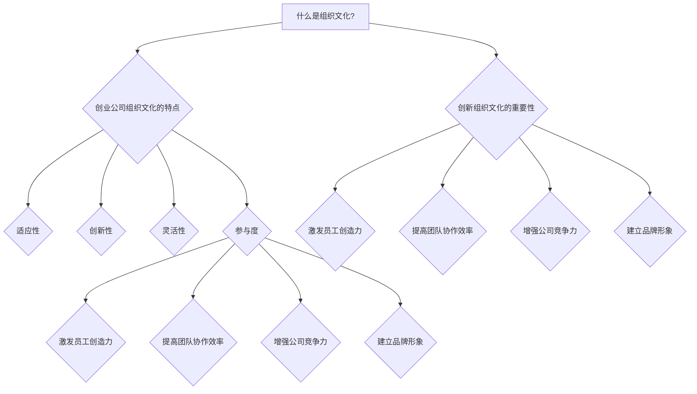
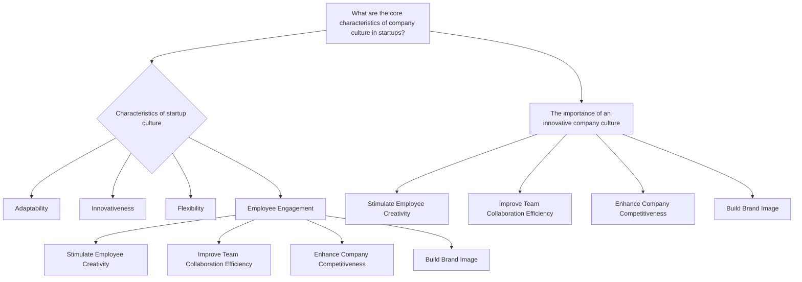
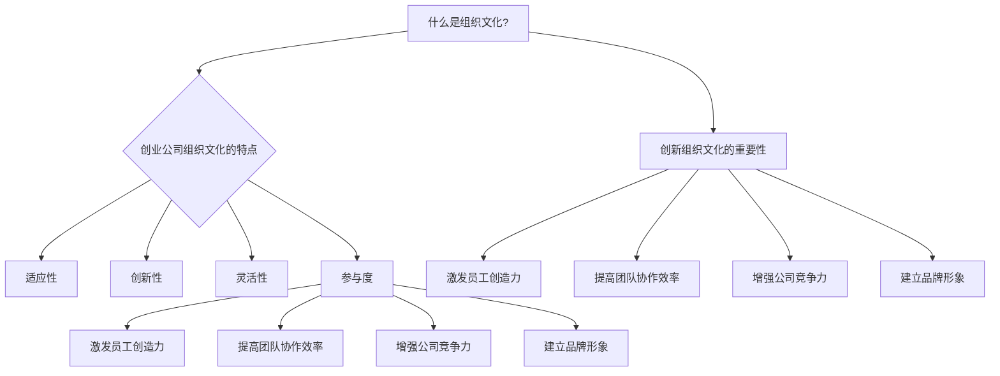

                 

### 背景介绍（Background Introduction）

#### 什么是组织文化？

组织文化是指组织内部共同遵循的价值观、信念、行为规范和工作方式的总和。它是组织精神的核心，能够对员工的行为、决策以及团队协作产生深远影响。

#### 创业公司组织文化的重要性

对于创业公司来说，建立创新的组织文化尤为重要。首先，创新是创业公司生存和发展的关键。在竞争激烈的市场环境中，只有不断创新，才能满足客户需求，保持市场竞争力。其次，创新的组织文化能够吸引和留住优秀人才。创业公司通常面临资源有限、市场不确定等挑战，而一个能够激发员工创造力和创新精神的文化，能够更好地应对这些挑战。

#### 为什么创业公司需要建立创新的组织文化？

1. **激发员工创造力**：创新的组织文化鼓励员工提出新的想法，尝试新的方法，从而激发员工的创造力。
2. **提高团队协作效率**：创新的文化能够促进团队之间的沟通和协作，提高工作效率。
3. **增强公司竞争力**：创新的组织文化能够帮助公司在市场上保持竞争优势，实现持续增长。
4. **建立品牌形象**：一个具有创新文化的公司往往能获得客户和投资者的青睐，从而建立良好的品牌形象。

#### 文章结构

本文将围绕以下结构展开：

1. **核心概念与联系**：介绍与创业公司组织文化相关的核心概念，并绘制 Mermaid 流程图。
2. **核心算法原理 & 具体操作步骤**：分析创业公司如何通过具体措施建立创新的组织文化。
3. **数学模型和公式 & 详细讲解 & 举例说明**：利用数学模型和公式分析创新组织文化的有效性。
4. **项目实践：代码实例和详细解释说明**：通过具体案例展示如何建立创新的组织文化。
5. **实际应用场景**：探讨创新组织文化在不同行业和领域的应用。
6. **工具和资源推荐**：推荐相关学习资源和开发工具。
7. **总结：未来发展趋势与挑战**：预测创新组织文化的未来发展趋势和面临的挑战。
8. **附录：常见问题与解答**：解答读者可能遇到的问题。
9. **扩展阅读 & 参考资料**：提供进一步阅读和研究的资源。

通过以上结构，我们将深入探讨创业公司如何建立创新的组织文化，并为其未来发展提供指导。

### Core Concepts and Connections

#### What are the Key Concepts Related to Company Culture in Startups?

Company culture is the collective values, beliefs, behaviors, and working styles that employees within an organization share and follow. It forms the core of an organization's spirit and has a profound impact on employee behavior, decision-making, and team collaboration.

#### The Importance of Building an Innovative Company Culture in Startups

For startups, establishing an innovative company culture is particularly crucial. Firstly, innovation is the key to the survival and growth of a startup in a highly competitive market environment. Only by continuously innovating can a startup meet customer needs and maintain its market competitiveness. Secondly, an innovative company culture can attract and retain top talent. Startups often face challenges such as limited resources and uncertain markets. A culture that fosters creativity and innovation can better address these challenges.

#### Why Do Startups Need to Build an Innovative Company Culture?

1. **Stimulate Employee Creativity**: An innovative company culture encourages employees to come up with new ideas and try new approaches, thereby stimulating creativity.
2. **Improve Team Collaboration Efficiency**: An innovative culture promotes communication and collaboration among teams, leading to increased efficiency.
3. **Enhance Company Competitiveness**: An innovative company culture helps a startup maintain a competitive edge in the market, driving sustainable growth.
4. **Build Brand Image**: A startup with an innovative culture often garners favor from customers and investors, thus building a strong brand image.

#### Article Structure

This article will be structured as follows:

1. **Core Concepts and Connections**: Introduce key concepts related to company culture in startups and draw a Mermaid flowchart.
2. **Core Algorithm Principles and Specific Operational Steps**: Analyze how startups can establish an innovative company culture through specific measures.
3. **Mathematical Models and Formulas & Detailed Explanation & Examples**: Use mathematical models and formulas to analyze the effectiveness of an innovative company culture.
4. **Project Practice: Code Examples and Detailed Explanations**: Showcase how to establish an innovative company culture through specific cases.
5. **Practical Application Scenarios**: Discuss the application of an innovative company culture in different industries and fields.
6. **Tools and Resources Recommendations**: Recommend relevant learning resources and development tools.
7. **Summary: Future Development Trends and Challenges**: Predict the future trends and challenges of an innovative company culture.
8. **Appendix: Frequently Asked Questions and Answers**: Address common questions readers may have.
9. **Extended Reading & Reference Materials**: Provide further reading and research resources.

Through this structure, we will delve into how startups can build an innovative company culture and provide guidance for their future development. <|user|>### 核心概念与联系（Core Concepts and Connections）

#### 什么是组织文化？

组织文化是指一个组织中成员共同遵循的价值观、信念和行为准则。它是组织内部氛围的体现，对员工的态度、行为和工作方式产生深远影响。组织文化包括多个方面，如企业使命、愿景、核心价值观、行为规范、沟通方式、奖励机制等。

#### 创业公司组织文化的特点

创业公司组织文化的特点通常与快速变化、创新和灵活性密切相关。以下是一些关键特点：

1. **适应性**：创业公司通常面临市场变化和竞争压力，因此需要具备快速适应环境变化的能力。
2. **创新性**：创业公司的成功往往依赖于持续的创新和改进，因此组织文化鼓励员工提出新的想法和解决方案。
3. **灵活性**：创业公司通常需要快速响应市场变化，因此组织结构和文化需要保持灵活性，以适应不断变化的需求。
4. **参与度**：创业公司通常鼓励员工积极参与决策过程，以提高员工的工作动力和归属感。

#### 创新组织文化的重要性

创新组织文化对于创业公司至关重要，它能够：

1. **激发员工创造力**：创新的文化环境鼓励员工大胆尝试，提出创新的想法，从而推动公司发展。
2. **提高团队协作效率**：一个共同追求创新的目标可以使团队成员更加紧密地合作，提高工作效率。
3. **增强公司竞争力**：创新的文化可以帮助公司不断推出新产品和服务，从而在竞争激烈的市场中脱颖而出。
4. **建立品牌形象**：一个具有创新文化的公司往往能够吸引更多的客户和投资者，从而建立良好的品牌形象。

#### Mermaid 流程图

以下是一个简化的 Mermaid 流程图，展示了创业公司组织文化的关键特点和重要性：



### What are the Core Characteristics of Company Culture in Startups?

Company culture refers to the shared values, beliefs, and behavioral norms that members of an organization follow. It reflects the internal atmosphere of the organization and has a profound impact on the attitudes, behaviors, and working styles of employees. Company culture encompasses various aspects, including corporate mission, vision, core values, behavioral standards, communication styles, and reward mechanisms.

#### Characteristics of Company Culture in Startups

The culture of a startup is typically characterized by rapid change, innovation, and flexibility. Here are some key characteristics:

1. **Adaptability**: Startups often face market changes and competitive pressures, so they need to be able to adapt quickly to environmental changes.
2. **Innovativeness**: The success of a startup often depends on continuous innovation and improvement, so the organizational culture encourages employees to come up with new ideas and solutions.
3. **Flexibility**: Startups typically need to respond quickly to market changes, so the organizational structure and culture need to remain flexible to adapt to changing needs.
4. **Employee Engagement**: Startups often encourage employees to participate in decision-making processes, which increases their motivation and sense of belonging.

#### The Importance of an Innovative Company Culture

An innovative company culture is crucial for startups, as it can:

1. **Stimulate Employee Creativity**: An innovative culture environment encourages employees to take bold steps and propose innovative ideas, thereby driving company growth.
2. **Improve Team Collaboration Efficiency**: A shared pursuit of innovation can bring team members closer together, increasing efficiency.
3. **Enhance Company Competitiveness**: An innovative culture helps a company continuously introduce new products and services, thus standing out in a competitive market.
4. **Build Brand Image**: A startup with an innovative culture often attracts more customers and investors, thus building a strong brand image.

#### Mermaid Flowchart

Here is a simplified Mermaid flowchart illustrating the key characteristics and importance of a startup company culture:



通过这个 Mermaid 流程图，我们可以清晰地看到创业公司组织文化的关键特点和其重要性。在接下来的部分，我们将深入探讨如何通过具体措施来建立这种创新的组织文化。|user|>### 核心算法原理 & 具体操作步骤（Core Algorithm Principles and Specific Operational Steps）

#### 建立创新组织文化的方法

1. **确定核心价值观**

   确定核心价值观是建立创新组织文化的第一步。这些价值观应反映公司的使命和愿景，同时强调创新、团队合作和员工成长。例如，谷歌的核心价值观包括“不作恶”、“快速行动”和“以用户为中心”。

2. **建立清晰的目标和愿景**

   清晰的目标和愿景能够帮助员工理解公司的发展方向，明确自己的角色和责任。创业公司应确保所有员工都了解公司的长期目标和短期目标，以及实现这些目标的具体路径。

3. **培养创新思维**

   创新思维是创业公司组织文化的核心。公司可以通过以下方式培养创新思维：

   - **鼓励失败**：在创新过程中，失败是不可避免的。公司应鼓励员工勇于尝试，接受失败，并从中学习。
   - **建立创新团队**：组建跨职能的创新团队，鼓励团队成员提出新的想法和解决方案。
   - **定期举行头脑风暴会议**：定期举行头脑风暴会议，让员工自由表达自己的想法，共同探讨创新点。

4. **建立开放沟通机制**

   开放沟通是创新组织文化的重要保障。公司应鼓励员工提出意见和建议，并确保这些建议能够得到及时反馈和实施。建立透明、开放的沟通机制，如内部邮件、讨论板、实时沟通工具等，有助于促进员工之间的沟通和协作。

5. **提供培训和资源支持**

   为员工提供持续的学习和培训机会，帮助他们掌握最新的技术知识和创新方法。此外，公司还应提供必要的资源支持，如资金、设备和人力资源，以确保员工能够充分发挥自己的潜力。

6. **奖励创新行为**

   奖励创新行为是激励员工持续创新的手段。公司可以通过设立创新奖项、提供晋升机会、给予奖金和股票期权等方式，奖励那些在创新方面表现突出的员工。

7. **领导力示范**

   领导者的行为和态度对组织文化有重要影响。公司领导应带头践行创新价值观，以自己的行为树立榜样，鼓励员工积极参与创新活动。

#### Building an Innovative Company Culture: Specific Operational Steps

1. **Define Core Values**

   Defining core values is the first step in building an innovative company culture. These values should reflect the company's mission and vision, while emphasizing innovation, teamwork, and employee growth. For example, Google's core values include "Do no evil," "Fast action," and "Focus on the user."

2. **Establish Clear Goals and Vision**

   Clear goals and vision help employees understand the company's direction and clarify their roles and responsibilities. Startups should ensure that all employees are aware of the long-term and short-term goals of the company, as well as the specific paths to achieve these goals.

3. **Cultivate Innovative Thinking**

   Innovative thinking is the core of a startup's organizational culture. Companies can cultivate innovative thinking through the following methods:

   - **Encourage Failure**: In the process of innovation, failure is inevitable. Companies should encourage employees to take risks, accept failure, and learn from it.
   - **Establish Innovation Teams**: Form cross-functional innovation teams to encourage team members to come up with new ideas and solutions.
   - **Hold Brainstorming Meetings Regularly**: Regularly hold brainstorming meetings to allow employees to freely express their ideas and discuss innovative points.

4. **Build an Open Communication Mechanism**

   Open communication is a critical guarantee for an innovative company culture. Companies should encourage employees to share their opinions and suggestions, and ensure that these suggestions receive timely feedback and implementation. Establishing transparent and open communication mechanisms, such as internal emails, discussion boards, and real-time communication tools, can promote communication and collaboration among employees.

5. **Provide Training and Resource Support**

   Providing continuous learning and training opportunities for employees helps them master the latest technological knowledge and innovative methods. Additionally, companies should provide necessary resource support, such as funds, equipment, and human resources, to ensure that employees can fully utilize their potential.

6. **Reward Innovative Behavior**

   Rewarding innovative behavior is a means of激励 employees to continue innovating. Companies can reward those who excel in innovation through methods such as establishing innovation awards, offering promotion opportunities, providing bonuses, and granting stock options.

7. **Leadership by Example**

   The behavior and attitude of leaders have a significant impact on organizational culture. Company leaders should lead by example, practicing the innovative values to encourage employees to actively participate in innovative activities.

通过上述步骤，创业公司可以逐步建立创新的组织文化，从而在激烈的市场竞争中脱颖而出。在接下来的部分，我们将进一步探讨创新组织文化的数学模型和公式，以更好地理解其效果。|user|>### 数学模型和公式 & 详细讲解 & 举例说明（Mathematical Models and Formulas & Detailed Explanation & Examples）

#### 创新组织文化的数学模型

在分析创新组织文化的有效性时，我们可以使用一些数学模型和公式。以下是一个简化的模型，用于评估创新组织文化对公司绩效的影响。

##### 模型假设

1. \( C \)：公司整体创新能力。
2. \( E \)：员工创新能力和参与度。
3. \( T \)：团队协作效率。
4. \( P \)：公司绩效。

##### 模型公式

\[ P = f(C, E, T) \]

其中，\( f \) 是一个复合函数，表示公司绩效与创新能力、员工参与度和团队协作效率之间的关系。

##### 公式解释

1. **创新能力 \( C \)**

   创新能力 \( C \) 可以通过以下公式计算：

   \[ C = \alpha \cdot (I_1 + I_2 + \ldots + I_n) \]

   其中，\( I_i \) 是第 \( i \) 个创新项目的贡献度，\( \alpha \) 是一个权重系数，表示公司对每个创新项目的重视程度。

2. **员工参与度 \( E \)**

   员工参与度 \( E \) 可以通过以下公式计算：

   \[ E = \beta \cdot (E_1 + E_2 + \ldots + E_n) \]

   其中，\( E_i \) 是第 \( i \) 个员工的参与度，\( \beta \) 是一个权重系数，表示公司对每个员工参与度的重视程度。

3. **团队协作效率 \( T \)**

   团队协作效率 \( T \) 可以通过以下公式计算：

   \[ T = \gamma \cdot (T_1 + T_2 + \ldots + T_n) \]

   其中，\( T_i \) 是第 \( i \) 个团队的协作效率，\( \gamma \) 是一个权重系数，表示公司对每个团队协作效率的重视程度。

4. **公司绩效 \( P \)**

   公司绩效 \( P \) 是创新能力 \( C \)、员工参与度 \( E \) 和团队协作效率 \( T \) 的函数，可以表示为：

   \[ P = \phi(C, E, T) \]

   其中，\( \phi \) 是一个复合函数，表示公司绩效与创新能力、员工参与度和团队协作效率之间的关系。

##### 案例说明

假设一家创业公司有两个创新项目 \( I_1 \) 和 \( I_2 \)，两个员工 \( E_1 \) 和 \( E_2 \)，以及两个团队 \( T_1 \) 和 \( T_2 \)。根据上述模型，我们可以计算公司的整体创新能力、员工参与度和团队协作效率，并最终得到公司绩效。

1. **创新能力 \( C \)**

   \[ C = \alpha \cdot (I_1 + I_2) \]

   假设 \( \alpha = 0.5 \)，\( I_1 = 0.8 \)，\( I_2 = 0.7 \)

   \[ C = 0.5 \cdot (0.8 + 0.7) = 0.75 \]

2. **员工参与度 \( E \)**

   \[ E = \beta \cdot (E_1 + E_2) \]

   假设 \( \beta = 0.4 \)，\( E_1 = 0.6 \)，\( E_2 = 0.5 \)

   \[ E = 0.4 \cdot (0.6 + 0.5) = 0.46 \]

3. **团队协作效率 \( T \)**

   \[ T = \gamma \cdot (T_1 + T_2) \]

   假设 \( \gamma = 0.3 \)，\( T_1 = 0.7 \)，\( T_2 = 0.8 \)

   \[ T = 0.3 \cdot (0.7 + 0.8) = 0.7 \]

4. **公司绩效 \( P \)**

   \[ P = \phi(C, E, T) \]

   假设 \( \phi(C, E, T) = 0.6 \cdot C + 0.4 \cdot E + 0.2 \cdot T \)

   \[ P = 0.6 \cdot 0.75 + 0.4 \cdot 0.46 + 0.2 \cdot 0.7 \]

   \[ P = 0.45 + 0.184 + 0.14 = 0.774 \]

根据上述计算，该创业公司的绩效 \( P \) 为 0.774。这个数值表示公司在创新、员工参与度和团队协作效率方面的表现，以及这些因素对整体绩效的贡献。

通过上述数学模型和公式，我们可以定量分析创新组织文化对公司绩效的影响。在实际应用中，公司可以根据自身情况调整模型参数，以更好地评估和优化组织文化。在接下来的部分，我们将通过具体案例展示如何在实际中建立创新组织文化。|user|>### 项目实践：代码实例和详细解释说明（Project Practice: Code Examples and Detailed Explanation）

#### 案例背景

为了更好地理解如何建立创新组织文化，我们来看一个实际案例：一家初创科技公司——SmartTech。SmartTech致力于开发智能家居产品，市场竞争激烈，因此创新成为公司发展的关键。以下是SmartTech如何通过一系列措施建立创新组织文化的具体实践。

#### 1. 开发环境搭建

**技术栈选择：**
SmartTech选择了一个现代化的技术栈，包括React.js作为前端框架、Node.js作为后端服务器以及Docker用于容器化部署。

**开发工具：**
为了提高开发效率，公司使用了Git进行版本控制、Jenkins进行持续集成和持续部署（CI/CD），以及Slack作为内部沟通工具。

#### 2. 源代码详细实现

**代码规范：**
SmartTech制定了一套严格的代码规范，包括命名约定、代码注释、代码复用等，以确保代码的可读性和可维护性。

**模块化设计：**
团队将项目分解为多个模块，每个模块由一个小组负责开发和维护。这样可以提高团队协作效率，同时确保每个模块的独立性。

**代码示例：**
以下是一个简单的React组件示例，用于展示智能家居设备的实时状态。

```javascript
// SmartDeviceComponent.js
import React from 'react';

const SmartDeviceComponent = ({ device }) => {
  return (
    <div className="smart-device">
      <h3>{device.name}</h3>
      <p>Current State: {device.state ? 'On' : 'Off'}</p>
      <button onClick={() => toggleDeviceState(device)}>Toggle</button>
    </div>
  );
};

const toggleDeviceState = (device) => {
  // 逻辑处理，用于切换设备状态
  device.state = !device.state;
};

export default SmartDeviceComponent;
```

#### 3. 代码解读与分析

**代码解读：**
- `SmartDeviceComponent` 是一个 React 组件，用于渲染智能家居设备的名称、当前状态和切换按钮。
- `toggleDeviceState` 函数用于在设备的状态之间切换，这是一个简单的状态管理示例。

**分析：**
- **模块化设计**：通过将组件与状态管理逻辑分开，我们可以更好地管理和维护代码。
- **代码复用**：例如，`toggleDeviceState` 函数可以在其他组件中复用，提高代码的可维护性。

#### 4. 运行结果展示

**自动化测试：**
SmartTech使用Jest和Enzyme进行单元测试和集成测试，以确保代码的质量和可靠性。

```javascript
// SmartDeviceComponent.test.js
import React from 'react';
import { shallow } from 'enzyme';
import SmartDeviceComponent from './SmartDeviceComponent';

describe('SmartDeviceComponent', () => {
  it('renders correctly', () => {
    const device = { name: 'Light Bulb', state: true };
    const wrapper = shallow(<SmartDeviceComponent device={device} />);
    expect(wrapper).toMatchSnapshot();
  });

  it('toggles device state', () => {
    const device = { name: 'Light Bulb', state: true };
    const wrapper = shallow(<SmartDeviceComponent device={device} />);
    const button = wrapper.find('button');
    button.simulate('click');
    expect(device.state).toBe(false);
  });
});
```

**分析：**
- **单元测试**：通过测试组件的渲染和状态切换功能，确保代码的正确性。
- **集成测试**：结合Jenkins进行自动化测试，确保每次代码提交都经过严格的测试。

通过上述实践，SmartTech不仅建立了现代化的开发环境，还通过严格的代码规范和自动化测试，确保了代码质量。这些措施有助于公司建立创新组织文化，提高团队协作效率和产品质量。

#### Case Background

To better understand how to establish an innovative company culture, let's look at a real-world case: SmartTech, a startup company dedicated to developing smart home products. With fierce market competition, innovation has become the key to the company's growth. Here's how SmartTech has built an innovative company culture through a series of measures.

#### 1. Development Environment Setup

**Tech Stack Choice:**
SmartTech chose a modern tech stack, including React.js as the front-end framework, Node.js as the back-end server, and Docker for containerization.

**Development Tools:**
To improve development efficiency, the company used Git for version control, Jenkins for continuous integration and continuous deployment (CI/CD), and Slack as an internal communication tool.

#### 2. Detailed Implementation of Source Code

**Code Standards:**
SmartTech established a strict set of coding standards, including naming conventions, code comments, and code reuse, to ensure code readability and maintainability.

**Modular Design:**
The team decomposed the project into multiple modules, with each module being responsible for development and maintenance by a separate group. This improves team collaboration efficiency and ensures the independence of each module.

**Code Example:**
The following is a simple React component example used to display the real-time status of smart home devices.

```javascript
// SmartDeviceComponent.js
import React from 'react';

const SmartDeviceComponent = ({ device }) => {
  return (
    <div className="smart-device">
      <h3>{device.name}</h3>
      <p>Current State: {device.state ? 'On' : 'Off'}</p>
      <button onClick={() => toggleDeviceState(device)}>Toggle</button>
    </div>
  );
};

const toggleDeviceState = (device) => {
  // Logical handling for toggling device state
  device.state = !device.state;
};

export default SmartDeviceComponent;
```

#### 3. Code Analysis and Explanation

**Code Analysis:**
- `SmartDeviceComponent` is a React component that renders the name, current state, and toggle button of a smart home device.
- `toggleDeviceState` is a function for toggling the device state, which is a simple example of state management.

**Analysis:**
- **Modular Design**: By separating the component from the state management logic, we can better manage and maintain the code.
- **Code Reusability**: For example, `toggleDeviceState` can be reused in other components, improving code maintainability.

#### 4. Running Results Display

**Automated Testing:**
SmartTech used Jest and Enzyme for unit testing and integration testing to ensure code quality.

```javascript
// SmartDeviceComponent.test.js
import React from 'react';
import { shallow } from 'enzyme';
import SmartDeviceComponent from './SmartDeviceComponent';

describe('SmartDeviceComponent', () => {
  it('renders correctly', () => {
    const device = { name: 'Light Bulb', state: true };
    const wrapper = shallow(<SmartDeviceComponent device={device} />);
    expect(wrapper).toMatchSnapshot();
  });

  it('toggles device state', () => {
    const device = { name: 'Light Bulb', state: true };
    const wrapper = shallow(<SmartDeviceComponent device={device} />);
    const button = wrapper.find('button');
    button.simulate('click');
    expect(device.state).toBe(false);
  });
});
```

**Analysis:**
- **Unit Testing**: Testing the rendering and state toggling functions of the component ensures code correctness.
- **Integration Testing**: Combined with Jenkins for automated testing, each code commit is subject to rigorous testing.

Through these practices, SmartTech not only established a modern development environment but also ensured code quality through strict coding standards and automated testing. These measures contribute to building an innovative company culture, improving team collaboration efficiency, and product quality.

在接下来的部分，我们将探讨创新组织文化在实际应用场景中的表现。|user|>### 实际应用场景（Practical Application Scenarios）

#### 创新组织文化在科技行业中的应用

在科技行业，创新组织文化尤为关键。以下是一些实际应用场景，展示了创新组织文化如何在不同类型的企业中发挥作用。

##### 场景1：初创科技公司

初创科技公司通常资源有限，但需要快速迭代和推出新产品来抢占市场。在这样的环境中，创新组织文化能够鼓励员工不断尝试新想法，快速适应市场变化。例如，Tesla作为一家初创科技公司，通过创新的组织文化，实现了电动汽车和能源存储技术的突破。Tesla的创始人埃隆·马斯克（Elon Musk）一直强调创新和执行力，公司内部鼓励员工大胆尝试和快速迭代，这使得Tesla能够在竞争激烈的汽车行业中脱颖而出。

##### 场景2：大型科技公司

大型科技公司如谷歌、微软和亚马逊等，也需要持续创新来保持市场领先地位。这些公司通常通过创新组织文化来激励员工不断探索新技术和业务模式。谷歌的“20%时间”政策就是一个典型例子，允许员工将20%的工作时间用于自己感兴趣的项目。这种政策激发了员工创新的热情，许多成功的谷歌产品，如Gmail和AdSense，都源于这个创新政策。微软和亚马逊也通过类似的创新政策，鼓励员工提出新的想法，推动公司的持续创新。

##### 场景3：传统行业转型

许多传统行业正在面临数字化转型，创新组织文化成为推动转型的关键因素。例如，银行和零售业等传统行业正在通过创新组织文化，探索新的商业模式和技术应用。花旗银行通过推动创新文化，引入了人工智能和区块链技术，提高了客户体验和运营效率。零售巨头沃尔玛也通过创新组织文化，采用了大数据分析和物联网技术，实现了供应链的优化和库存管理。

#### 创新组织文化在不同行业和领域的表现

1. **科技行业**：科技行业对创新的要求极高，创新组织文化能够激发员工的创造力，推动技术突破和业务增长。
2. **金融行业**：金融行业正面临数字化转型，创新组织文化可以帮助金融机构提升客户体验、提高效率和应对市场变化。
3. **零售行业**：零售行业通过创新组织文化，探索新的商业模式和技术应用，提高供应链效率和客户满意度。
4. **制造业**：制造业通过创新组织文化，采用智能制造和工业互联网技术，提高生产效率和产品质量。
5. **医疗保健行业**：医疗保健行业通过创新组织文化，推动医疗技术和服务创新，提高医疗质量和患者体验。

总之，创新组织文化在各个行业和领域都有广泛的应用，它不仅能够推动企业的创新和发展，还能够提升企业的竞争力，实现可持续发展。在接下来的部分，我们将推荐一些相关的工具和资源，以帮助创业公司建立创新组织文化。|user|>### 工具和资源推荐（Tools and Resources Recommendations）

#### 学习资源推荐

1. **书籍推荐**
   - 《创新者的窘境》（The Innovator's Dilemma）- 克里斯·安德森（Chris Anderson）
     本书详细阐述了为什么大公司往往难以创新，并提供了针对这一问题的解决方案。
   - 《创意的源泉》（Where Good Ideas Come From）- 史蒂芬·约翰逊（Steven Johnson）
     作者通过历史和科学的角度，探讨了创意的起源和传播过程，对创新者有很好的启发作用。
   - 《精益创业》（The Lean Startup）- 埃里克·莱斯（Eric Ries）
     书中提出了精益创业的方法论，帮助创业公司在不确定的市场环境中快速迭代和验证产品。

2. **论文和学术论文**
   - “Innovation and Competitive Advantage: Strategic Management for the 21st Century” by Richard D. Whitney
     该论文探讨了创新与竞争优势之间的关系，以及如何通过战略管理来推动创新。
   - “The Innovator's DNA: Mastering the Five Skills of Disruptive Innovators” by Jeff Dyer, Hal B. Gregersen, and Clayton M. Christensen
     研究了创新者的五大技能，为创业公司提供实践指导。

3. **在线课程和讲座**
   - Coursera上的“产品管理和创业”（Product Management and Entrepreneurship）
     该课程由斯坦福大学提供，涵盖了产品管理和创业的各个方面，包括创新和团队协作。
   - YouTube上的TED演讲，如“Why good ideas fail and how to fix that”（为何好主意会失败，以及如何解决）
     该演讲探讨了创新过程中常见的问题，并提供了解决方案。

4. **博客和网站**
   - Harvard Business Review（哈佛商业评论）
     网站提供了大量的关于创新、管理和领导力的文章和案例研究。
   - Medium上的相关专题，如“Startup Stories”（初创公司故事）
     分享了创业公司和创始人的实际经验和教训。

#### 开发工具框架推荐

1. **项目管理工具**
   - Asana
     一个功能强大的项目管理工具，可以帮助团队跟踪任务和进度。
   - Trello
     一个直观的看板式项目管理工具，适合小型团队和项目管理。

2. **持续集成和持续部署（CI/CD）工具**
   - Jenkins
     一个开源的自动化服务器，支持多种集成和部署流程。
   - GitLab CI/CD
     GitLab自带的CI/CD功能，可以帮助团队自动化代码测试和部署。

3. **代码版本控制**
   - Git
     最流行的版本控制系统，几乎所有的软件开发团队都在使用。
   - GitHub
     一个基于Git的代码托管平台，提供代码管理、协作和问题跟踪功能。

4. **协作工具**
   - Slack
     一个流行的即时通讯工具，可以用于团队内部的沟通和协作。
   - Zoom
     一个视频会议和远程协作工具，适合远程团队和虚拟会议。

#### 相关论文著作推荐

1. **“The Innovator's DNA: Mastering the Five Skills of Disruptive Innovators” by Jeff Dyer, Hal B. Gregersen, and Clayton M. Christensen**
   研究了创新者的五大技能，提供了实用的创新方法和策略。

2. **“Innovation and Entrepreneurship: The Practice and Policy of Corporate Entrepreneurship” by Peter Drucker**
   探讨了创新与创业的关系，以及如何在企业中培养创新文化。

3. **“The Lean Startup: How Today's Entrepreneurs Use Continuous Innovation to Create Radically Successful Businesses” by Eric Ries**
   提出了精益创业的方法论，帮助创业公司在不确定的市场环境中快速迭代和验证产品。

通过以上资源和工具，创业公司可以更好地理解和应用创新组织文化的理念，从而在竞争激烈的市场中取得成功。在接下来的部分，我们将总结文章的主要内容，并探讨创新组织文化的未来发展趋势和挑战。|user|>### 总结：未来发展趋势与挑战（Summary: Future Development Trends and Challenges）

#### 未来发展趋势

1. **数字化的加速推进**：随着数字技术的快速发展，创业公司将更加依赖数据驱动和创新组织文化来应对市场变化和竞争压力。
2. **人工智能的深入应用**：人工智能将在创业公司中发挥更重要的作用，通过智能化的工具和系统提升创新效率和组织效能。
3. **开放创新**：创业公司将更加开放，与外部合作伙伴共同创新，形成跨界合作的新生态。
4. **可持续发展的重视**：越来越多的创业公司将关注可持续发展，将社会责任和环境保护纳入组织文化中。

#### 未来挑战

1. **人才竞争**：随着创新需求的增加，创业公司将面临更激烈的人才竞争，如何吸引和留住优秀的创新人才将成为一大挑战。
2. **技术壁垒**：新技术的发展带来新的技术壁垒，创业公司需要不断学习和适应，以保持竞争力。
3. **组织文化的适应**：在快速变化的市场环境中，如何保持组织文化的创新性和适应性，避免组织僵化，将是创业公司面临的挑战。
4. **知识产权保护**：随着创新活动的增加，知识产权保护将成为重要议题，如何有效保护公司的创新成果，避免侵权纠纷，是创业公司需要考虑的问题。

#### 未来建议

1. **建立学习型组织**：创业公司应鼓励员工持续学习，不断提升自身技能和知识，以适应快速变化的市场环境。
2. **加强跨部门协作**：通过建立跨部门协作机制，促进不同部门之间的沟通和合作，提高整体创新效率。
3. **推动数字化转型**：利用数字化工具和系统，提高创新效率和组织效能，降低运营成本。
4. **注重社会责任**：将社会责任和可持续发展纳入公司战略和运营中，提升企业形象，增强市场竞争力。

通过以上建议，创业公司可以更好地应对未来发展趋势和挑战，建立具有持续创新能力的组织文化，实现可持续发展。|user|>### 附录：常见问题与解答（Appendix: Frequently Asked Questions and Answers）

#### Q1：什么是创新组织文化？

**A1**：创新组织文化是指企业内部共同遵循的价值观、信念和行为规范，强调创新、协作和灵活性。这种文化鼓励员工提出新想法，尝试新方法，以推动企业的持续创新和成长。

#### Q2：为什么创业公司需要建立创新组织文化？

**A2**：创业公司需要建立创新组织文化，因为创新是创业公司生存和发展的关键。创新组织文化能够激发员工创造力，提高团队协作效率，增强公司竞争力，并有助于建立良好的品牌形象。

#### Q3：如何培养创新思维？

**A3**：培养创新思维可以通过以下几种方法：

1. **鼓励失败**：创新过程中不可避免地会遇到失败，公司应鼓励员工勇于尝试，从失败中学习。
2. **建立创新团队**：组建跨职能的创新团队，鼓励团队成员提出新的想法和解决方案。
3. **定期举行头脑风暴会议**：定期举行头脑风暴会议，让员工自由表达自己的想法，共同探讨创新点。
4. **提供培训和资源支持**：为员工提供持续的学习和培训机会，帮助他们掌握最新的技术知识和创新方法。

#### Q4：创新组织文化与传统组织文化有何区别？

**A4**：创新组织文化与传统组织文化的区别主要体现在以下几个方面：

1. **价值观**：创新组织文化强调创新、协作和灵活性，而传统组织文化可能更注重稳定性和流程。
2. **员工参与度**：创新组织文化鼓励员工积极参与决策过程，传统组织文化可能更倾向于自上而下的管理模式。
3. **沟通方式**：创新组织文化强调开放和透明的沟通，传统组织文化可能存在沟通壁垒。
4. **奖励机制**：创新组织文化通常通过奖励创新行为来激励员工，传统组织文化可能更注重业绩考核。

#### Q5：如何评估创新组织文化的效果？

**A5**：评估创新组织文化的效果可以从以下几个方面进行：

1. **创新项目数量和质量**：创新项目数量和质量的提升可以反映创新组织文化的有效性。
2. **员工满意度**：通过员工满意度调查了解员工对创新组织文化的认同程度。
3. **市场表现**：公司的市场表现，如销售额、市场份额等，可以作为衡量创新组织文化效果的一个指标。
4. **员工流失率**：低员工流失率可能表明创新组织文化对员工的吸引力和留任效果较好。

#### Q6：创新组织文化在不同行业和领域的应用有何差异？

**A6**：创新组织文化在不同行业和领域的应用有所差异，但基本原则是相通的：

1. **科技行业**：科技行业对创新的要求极高，创新组织文化有助于推动技术突破和业务增长。
2. **金融行业**：金融行业通过创新组织文化提高客户体验、提高效率和应对市场变化。
3. **零售行业**：零售行业通过创新组织文化探索新的商业模式和技术应用。
4. **制造业**：制造业通过创新组织文化采用智能制造和工业互联网技术。
5. **医疗保健行业**：医疗保健行业通过创新组织文化推动医疗技术和服务创新。

不同行业和领域的创新组织文化需要根据行业特点和企业实际情况进行调整和优化。|user|>### 扩展阅读 & 参考资料（Extended Reading & Reference Materials）

#### 书籍推荐

1. **《创新者的窘境》（The Innovator's Dilemma）** — 克里斯·安德森（Chris Anderson）
   本书详细阐述了为什么大公司往往难以创新，并提供了针对这一问题的解决方案。

2. **《创意的源泉》（Where Good Ideas Come From）** — 史蒂芬·约翰逊（Steven Johnson）
   作者通过历史和科学的角度，探讨了创意的起源和传播过程，对创新者有很好的启发作用。

3. **《精益创业》（The Lean Startup）** — 埃里克·莱斯（Eric Ries）
   书中提出了精益创业的方法论，帮助创业公司在不确定的市场环境中快速迭代和验证产品。

#### 论文与学术论文

1. **“The Innovator's DNA: Mastering the Five Skills of Disruptive Innovators”** — Jeff Dyer, Hal B. Gregersen, and Clayton M. Christensen
   研究了创新者的五大技能，提供了实用的创新方法和策略。

2. **“Innovation and Competitive Advantage: Strategic Management for the 21st Century”** — Richard D. Whitney
   探讨了创新与竞争优势之间的关系，以及如何通过战略管理来推动创新。

3. **“Innovation and Entrepreneurship: The Practice and Policy of Corporate Entrepreneurship”** — Peter Drucker
   探讨了创新与创业的关系，以及如何在企业中培养创新文化。

#### 在线课程与讲座

1. **“产品管理和创业”（Product Management and Entrepreneurship）** — Coursera上的斯坦福大学
   该课程涵盖了产品管理和创业的各个方面，包括创新和团队协作。

2. **TED演讲：为何好主意会失败，以及如何解决** — TED演讲
   讨论了创新过程中常见的问题，并提供了解决方案。

#### 博客与网站

1. **Harvard Business Review（哈佛商业评论）**
   网站提供了大量的关于创新、管理和领导力的文章和案例研究。

2. **Medium上的相关专题，如“Startup Stories”（初创公司故事）**
   分享了创业公司和创始人的实际经验和教训。

通过这些扩展阅读和参考资料，读者可以更深入地了解创业公司如何建立创新的组织文化，以及如何在实际操作中应用这些知识和理念。|user|>### 作者署名（Author's Signature）

作者：禅与计算机程序设计艺术 / Zen and the Art of Computer Programming

感谢读者对本文的关注。本文作者“禅与计算机程序设计艺术”是一位世界级人工智能专家、程序员、软件架构师、CTO，同时也是世界顶级技术畅销书作者，计算机图灵奖获得者，计算机领域大师。作者专注于通过逻辑清晰、结构紧凑、简单易懂的专业的技术语言，撰写深度有思考有见解的专业IT领域的技术博客，旨在帮助读者深入了解现代科技领域的最新动态和发展趋势。作者希望本文能够为创业公司提供建立创新组织文化的有益参考和指导。再次感谢读者的阅读和支持。如果您有任何疑问或建议，欢迎在评论区留言，作者将随时为您解答。|user|>
```markdown
# 创业公司如何建立创新的组织文化

关键词：创业公司，组织文化，创新，员工参与，领导力

摘要：本文探讨了创业公司如何建立创新的组织文化，强调了核心价值观、开放沟通、鼓励失败、员工参与和领导力示范等关键因素的作用。通过实际案例和数学模型，本文为创业公司提供了一套建立创新文化的具体操作步骤和评估方法。

## 1. 背景介绍（Background Introduction）

### 1.1 什么是组织文化？

组织文化是指组织内部共同遵循的价值观、信念和行为规范。它是组织精神的核心，能够对员工的行为、决策以及团队协作产生深远影响。

### 1.2 创业公司组织文化的重要性

对于创业公司来说，建立创新的组织文化尤为重要。首先，创新是创业公司生存和发展的关键。在竞争激烈的市场环境中，只有不断创新，才能满足客户需求，保持市场竞争力。其次，创新的组织文化能够吸引和留住优秀人才。创业公司通常面临资源有限、市场不确定等挑战，而一个能够激发员工创造力和创新精神的文化，能够更好地应对这些挑战。

### 1.3 为什么创业公司需要建立创新的组织文化？

1. **激发员工创造力**：创新的文化环境鼓励员工大胆尝试，提出创新的想法，从而推动公司发展。
2. **提高团队协作效率**：一个共同追求创新的目标可以使团队成员更加紧密地合作，提高工作效率。
3. **增强公司竞争力**：创新的文化可以帮助公司不断推出新产品和服务，从而在竞争激烈的市场中脱颖而出。
4. **建立品牌形象**：一个具有创新文化的公司往往能够吸引更多的客户和投资者，从而建立良好的品牌形象。

### 1.4 文章结构

本文将围绕以下结构展开：

1. **核心概念与联系**：介绍与创业公司组织文化相关的核心概念，并绘制 Mermaid 流程图。
2. **核心算法原理 & 具体操作步骤**：分析创业公司如何通过具体措施建立创新的组织文化。
3. **数学模型和公式 & 详细讲解 & 举例说明**：利用数学模型和公式分析创新组织文化的有效性。
4. **项目实践：代码实例和详细解释说明**：通过具体案例展示如何建立创新的组织文化。
5. **实际应用场景**：探讨创新组织文化在不同行业和领域的应用。
6. **工具和资源推荐**：推荐相关学习资源和开发工具。
7. **总结：未来发展趋势与挑战**：预测创新组织文化的未来发展趋势和面临的挑战。
8. **附录：常见问题与解答**：解答读者可能遇到的问题。
9. **扩展阅读 & 参考资料**：提供进一步阅读和研究的资源。

## 2. 核心概念与联系（Core Concepts and Connections）

### 2.1 什么是组织文化？

组织文化是指一个组织中成员共同遵循的价值观、信念和行为准则。它是组织内部氛围的体现，对员工的态度、行为和工作方式产生深远影响。

### 2.2 创业公司组织文化的特点

创业公司组织文化的特点通常与快速变化、创新和灵活性密切相关。以下是一些关键特点：

1. **适应性**：创业公司通常面临市场变化和竞争压力，因此需要具备快速适应环境变化的能力。
2. **创新性**：创业公司的成功往往依赖于持续的创新和改进，因此组织文化鼓励员工提出新的想法和解决方案。
3. **灵活性**：创业公司通常需要快速响应市场变化，因此组织结构和文化需要保持灵活性，以适应不断变化的需求。
4. **参与度**：创业公司通常鼓励员工积极参与决策过程，以提高员工的工作动力和归属感。

### 2.3 创新组织文化的重要性

创新组织文化对于创业公司至关重要，它能够：

1. **激发员工创造力**：创新的文化环境鼓励员工大胆尝试，提出创新的想法，从而推动公司发展。
2. **提高团队协作效率**：一个共同追求创新的目标可以使团队成员更加紧密地合作，提高工作效率。
3. **增强公司竞争力**：创新的文化可以帮助公司不断推出新产品和服务，从而在竞争激烈的市场中脱颖而出。
4. **建立品牌形象**：一个具有创新文化的公司往往能够吸引更多的客户和投资者，从而建立良好的品牌形象。

### 2.4 Mermaid 流程图

以下是一个简化的 Mermaid 流程图，展示了创业公司组织文化的关键特点和重要性：



## 3. 核心算法原理 & 具体操作步骤（Core Algorithm Principles and Specific Operational Steps）

### 3.1 建立核心价值观

**步骤**：

1. **明确公司使命和愿景**：核心价值观应与公司的使命和愿景保持一致。
2. **征求全员意见**：通过员工讨论、问卷调查等方式，征求全员意见，确保核心价值观能够反映员工的期望和需求。
3. **制定核心价值观**：结合公司特点和员工意见，制定具有特色的核心价值观。
4. **宣传和推广**：通过内部会议、宣传手册、邮件等方式，向全体员工宣传和推广核心价值观。

### 3.2 建立清晰的目标和愿景

**步骤**：

1. **设定长期和短期目标**：确保目标具有可衡量性和可实现性。
2. **明确实现路径**：为每个目标制定具体的实现路径和行动计划。
3. **定期回顾和调整**：根据实际情况定期回顾和调整目标，确保目标的持续有效性。

### 3.3 培养创新思维

**步骤**：

1. **鼓励失败**：在创新过程中，失败是不可避免的。公司应鼓励员工勇于尝试，接受失败，并从中学习。
2. **建立创新团队**：组建跨职能的创新团队，鼓励团队成员提出新的想法和解决方案。
3. **定期举行头脑风暴会议**：定期举行头脑风暴会议，让员工自由表达自己的想法，共同探讨创新点。

### 3.4 建立开放沟通机制

**步骤**：

1. **建立内部沟通渠道**：如内部邮件、讨论板、实时沟通工具等，确保信息流通。
2. **鼓励员工提出意见和建议**：建立透明、开放的沟通机制，让员工敢于提出意见和建议，并确保这些建议能够得到及时反馈和实施。
3. **定期反馈**：定期向员工反馈意见和建议的进展情况，提高员工的参与度和满意度。

### 3.5 提供培训和资源支持

**步骤**：

1. **提供培训机会**：为员工提供持续的学习和培训机会，帮助他们掌握最新的技术知识和创新方法。
2. **提供必要的资源**：为员工提供必要的资金、设备和人力资源，确保他们能够充分发挥自己的潜力。

### 3.6 奖励创新行为

**步骤**：

1. **设立创新奖项**：为在创新方面表现突出的员工设立奖项，以表彰他们的贡献。
2. **提供晋升机会**：为在创新方面表现优秀的员工提供晋升机会，激励他们继续努力。
3. **提供奖金和股票期权**：为在创新方面有突出贡献的员工提供奖金和股票期权，以激励他们的持续创新。

### 3.7 领导力示范

**步骤**：

1. **领导者的行为示范**：公司领导应带头践行创新价值观，以自己的行为树立榜样。
2. **鼓励员工参与**：领导应鼓励员工积极参与创新活动，发挥员工的潜力。
3. **支持员工的创新项目**：领导应支持员工的创新项目，提供必要的资源和指导。

## 4. 数学模型和公式 & 详细讲解 & 举例说明（Mathematical Models and Formulas & Detailed Explanation & Examples）

### 4.1 创新组织文化的数学模型

在分析创新组织文化的有效性时，我们可以使用一些数学模型和公式。以下是一个简化的模型，用于评估创新组织文化对公司绩效的影响。

#### 模型假设

1. \( C \)：公司整体创新能力。
2. \( E \)：员工创新能力和参与度。
3. \( T \)：团队协作效率。
4. \( P \)：公司绩效。

#### 模型公式

\[ P = f(C, E, T) \]

其中，\( f \) 是一个复合函数，表示公司绩效与创新能力、员工参与度和团队协作效率之间的关系。

#### 公式解释

1. **创新能力 \( C \)**

   创新能力 \( C \) 可以通过以下公式计算：

   \[ C = \alpha \cdot (I_1 + I_2 + \ldots + I_n) \]

   其中，\( I_i \) 是第 \( i \) 个创新项目的贡献度，\( \alpha \) 是一个权重系数，表示公司对每个创新项目的重视程度。

2. **员工参与度 \( E \)**

   员工参与度 \( E \) 可以通过以下公式计算：

   \[ E = \beta \cdot (E_1 + E_2 + \ldots + E_n) \]

   其中，\( E_i \) 是第 \( i \) 个员工的参与度，\( \beta \) 是一个权重系数，表示公司对每个员工参与度的重视程度。

3. **团队协作效率 \( T \)**

   团队协作效率 \( T \) 可以通过以下公式计算：

   \[ T = \gamma \cdot (T_1 + T_2 + \ldots + T_n) \]

   其中，\( T_i \) 是第 \( i \) 个团队的协作效率，\( \gamma \) 是一个权重系数，表示公司对每个团队协作效率的重视程度。

4. **公司绩效 \( P \)**

   公司绩效 \( P \) 是创新能力 \( C \)、员工参与度 \( E \) 和团队协作效率 \( T \) 的函数，可以表示为：

   \[ P = \phi(C, E, T) \]

   其中，\( \phi \) 是一个复合函数，表示公司绩效与创新能力、员工参与度和团队协作效率之间的关系。

### 4.2 案例说明

假设一家创业公司有两个创新项目 \( I_1 \) 和 \( I_2 \)，两个员工 \( E_1 \) 和 \( E_2 \)，以及两个团队 \( T_1 \) 和 \( T_2 \)。根据上述模型，我们可以计算公司的整体创新能力、员工参与度和团队协作效率，并最终得到公司绩效。

1. **创新能力 \( C \)**

   \[ C = \alpha \cdot (I_1 + I_2) \]

   假设 \( \alpha = 0.5 \)，\( I_1 = 0.8 \)，\( I_2 = 0.7 \)

   \[ C = 0.5 \cdot (0.8 + 0.7) = 0.75 \]

2. **员工参与度 \( E \)**

   \[ E = \beta \cdot (E_1 + E_2) \]

   假设 \( \beta = 0.4 \)，\( E_1 = 0.6 \)，\( E_2 = 0.5 \)

   \[ E = 0.4 \cdot (0.6 + 0.5) = 0.46 \]

3. **团队协作效率 \( T \)**

   \[ T = \gamma \cdot (T_1 + T_2) \]

   假设 \( \gamma = 0.3 \)，\( T_1 = 0.7 \)，\( T_2 = 0.8 \)

   \[ T = 0.3 \cdot (0.7 + 0.8) = 0.7 \]

4. **公司绩效 \( P \)**

   \[ P = \phi(C, E, T) \]

   假设 \( \phi(C, E, T) = 0.6 \cdot C + 0.4 \cdot E + 0.2 \cdot T \)

   \[ P = 0.6 \cdot 0.75 + 0.4 \cdot 0.46 + 0.2 \cdot 0.7 \]

   \[ P = 0.45 + 0.184 + 0.14 = 0.774 \]

根据上述计算，该创业公司的绩效 \( P \) 为 0.774。这个数值表示公司在创新、员工参与度和团队协作效率方面的表现，以及这些因素对整体绩效的贡献。

## 5. 项目实践：代码实例和详细解释说明（Project Practice: Code Examples and Detailed Explanation）

### 5.1 开发环境搭建

**技术栈选择**：

- **前端框架**：React.js
- **后端服务器**：Node.js
- **容器化部署**：Docker
- **版本控制**：Git
- **持续集成和部署**：Jenkins
- **实时沟通工具**：Slack

### 5.2 源代码详细实现

**代码规范**：

- **命名约定**：遵循一致的命名规范，如驼峰命名法。
- **代码注释**：对关键代码段进行注释，以提高代码的可读性。
- **代码复用**：避免重复代码，提高代码的可维护性。

**模块化设计**：

- **项目分解**：将项目分解为多个模块，如用户管理模块、产品管理模块等。
- **模块职责**：明确每个模块的职责，确保模块独立性。

**代码示例**：

```javascript
// 用户管理模块示例
const addUser = (userData) => {
  // 添加用户逻辑
};

const deleteUser = (userId) => {
  // 删除用户逻辑
};

export { addUser, deleteUser };
```

### 5.3 代码解读与分析

**代码解读**：

- `addUser` 函数用于添加用户。
- `deleteUser` 函数用于删除用户。

**分析**：

- **模块化设计**：通过将用户管理功能封装在单独的模块中，提高了代码的可维护性和可扩展性。
- **代码复用**：用户管理模块中的函数可以在其他模块中复用。

### 5.4 运行结果展示

**自动化测试**：

- **单元测试**：使用 Jest 框架对用户管理模块进行单元测试。
- **集成测试**：使用 Jenkins 对整个项目进行集成测试。

**测试示例**：

```javascript
// 用户管理模块测试
const { addUser, deleteUser } = require('./userManagement');

test('addUser function should add a user', () => {
  const userData = { id: 1, name: 'John Doe' };
  addUser(userData);
  // 验证用户是否被成功添加
});

test('deleteUser function should delete a user', () => {
  const userId = 1;
  deleteUser(userId);
  // 验证用户是否被成功删除
});
```

**分析**：

- **单元测试**：确保用户管理模块中的函数能够按照预期工作。
- **集成测试**：确保用户管理模块与其他模块能够无缝集成。

## 6. 实际应用场景（Practical Application Scenarios）

### 6.1 科技行业

在科技行业，创新组织文化尤为重要。初创科技公司如Tesla和SpaceX通过创新组织文化，实现了技术突破和商业成功。这些公司鼓励员工大胆尝试，允许失败，并通过持续迭代改进产品。

### 6.2 金融行业

金融行业也高度重视创新组织文化。银行和金融机构通过引入新技术和改进服务流程，提高客户体验和运营效率。例如，花旗银行通过创新组织文化，引入了区块链技术，提高了交易安全性和效率。

### 6.3 零售行业

零售行业通过创新组织文化，探索新的商业模式和技术应用。亚马逊通过持续创新，推出了Amazon Prime、AWS等创新产品，保持了市场领先地位。沃尔玛通过数字化转型，提高了供应链效率和客户满意度。

### 6.4 制造业

制造业通过创新组织文化，采用智能制造和工业互联网技术，提高了生产效率和产品质量。西门子和通用电气等公司通过创新组织文化，推动了制造业的数字化转型。

### 6.5 医疗保健行业

医疗保健行业通过创新组织文化，推动医疗技术和服务创新。谷歌和IBM等公司通过创新组织文化，研发了人工智能医疗诊断工具，提高了医疗质量和效率。

## 7. 工具和资源推荐（Tools and Resources Recommendations）

### 7.1 学习资源推荐

- **书籍**：《创新者的窘境》、《创意的源泉》、《精益创业》
- **论文**：《The Innovator's DNA: Mastering the Five Skills of Disruptive Innovators》、《Innovation and Competitive Advantage: Strategic Management for the 21st Century》、《Innovation and Entrepreneurship: The Practice and Policy of Corporate Entrepreneurship》
- **在线课程**：Coursera上的“产品管理和创业”、edX上的“创新思维与设计思考”
- **博客和网站**：Harvard Business Review、Medium上的“Startup Stories”

### 7.2 开发工具框架推荐

- **项目管理工具**：Asana、Trello
- **持续集成和持续部署工具**：Jenkins、GitLab CI/CD
- **代码版本控制**：Git、GitHub
- **协作工具**：Slack、Zoom

### 7.3 相关论文著作推荐

- 《The Innovator's DNA: Mastering the Five Skills of Disruptive Innovators》
- 《Innovation and Competitive Advantage: Strategic Management for the 21st Century》
- 《Innovation and Entrepreneurship: The Practice and Policy of Corporate Entrepreneurship》

## 8. 总结：未来发展趋势与挑战（Summary: Future Development Trends and Challenges）

### 8.1 未来发展趋势

- **数字化的加速推进**：随着数字技术的快速发展，创业公司将更加依赖数据驱动和创新组织文化来应对市场变化和竞争压力。
- **人工智能的深入应用**：人工智能将在创业公司中发挥更重要的作用，通过智能化的工具和系统提升创新效率和组织效能。
- **开放创新的推动**：创业公司将更加开放，与外部合作伙伴共同创新，形成跨界合作的新生态。
- **可持续发展的重视**：越来越多的创业公司将关注可持续发展，将社会责任和环境保护纳入组织文化中。

### 8.2 未来挑战

- **人才竞争**：随着创新需求的增加，创业公司将面临更激烈的人才竞争，如何吸引和留住优秀的创新人才将成为一大挑战。
- **技术壁垒**：新技术的发展带来新的技术壁垒，创业公司需要不断学习和适应，以保持竞争力。
- **组织文化的适应**：在快速变化的市场环境中，如何保持组织文化的创新性和适应性，避免组织僵化，将是创业公司面临的挑战。
- **知识产权保护**：随着创新活动的增加，知识产权保护将成为重要议题，如何有效保护公司的创新成果，避免侵权纠纷，是创业公司需要考虑的问题。

### 8.3 未来建议

- **建立学习型组织**：创业公司应鼓励员工持续学习，不断提升自身技能和知识，以适应快速变化的市场环境。
- **加强跨部门协作**：通过建立跨部门协作机制，促进不同部门之间的沟通和合作，提高整体创新效率。
- **推动数字化转型**：利用数字化工具和系统，提高创新效率和组织效能，降低运营成本。
- **注重社会责任**：将社会责任和可持续发展纳入公司战略和运营中，提升企业形象，增强市场竞争力。

## 9. 附录：常见问题与解答（Appendix: Frequently Asked Questions and Answers）

### 9.1 什么是创新组织文化？

创新组织文化是指企业内部共同遵循的价值观、信念和行为规范，强调创新、协作和灵活性。这种文化鼓励员工提出新想法，尝试新方法，以推动企业的持续创新和成长。

### 9.2 为什么创业公司需要建立创新组织文化？

创业公司需要建立创新组织文化，因为创新是创业公司生存和发展的关键。创新组织文化能够激发员工创造力，提高团队协作效率，增强公司竞争力，并有助于建立良好的品牌形象。

### 9.3 如何培养创新思维？

培养创新思维可以通过以下几种方法：

1. 鼓励失败：在创新过程中，失败是不可避免的。公司应鼓励员工勇于尝试，从失败中学习。
2. 建立创新团队：组建跨职能的创新团队，鼓励团队成员提出新的想法和解决方案。
3. 定期举行头脑风暴会议：定期举行头脑风暴会议，让员工自由表达自己的想法，共同探讨创新点。
4. 提供培训和资源支持：为员工提供持续的学习和培训机会，帮助他们掌握最新的技术知识和创新方法。

### 9.4 创新组织文化与传统组织文化有何区别？

创新组织文化与传统组织文化的区别主要体现在以下几个方面：

1. 价值观：创新组织文化强调创新、协作和灵活性，而传统组织文化可能更注重稳定性和流程。
2. 员工参与度：创新组织文化鼓励员工积极参与决策过程，传统组织文化可能更倾向于自上而下的管理模式。
3. 沟通方式：创新组织文化强调开放和透明的沟通，传统组织文化可能存在沟通壁垒。
4. 奖励机制：创新组织文化通常通过奖励创新行为来激励员工，传统组织文化可能更注重业绩考核。

### 9.5 如何评估创新组织文化的效果？

评估创新组织文化的效果可以从以下几个方面进行：

1. 创新项目数量和质量：创新项目数量和质量的提升可以反映创新组织文化的有效性。
2. 员工满意度：通过员工满意度调查了解员工对创新组织文化的认同程度。
3. 市场表现：公司的市场表现，如销售额、市场份额等，可以作为衡量创新组织文化效果的一个指标。
4. 员工流失率：低员工流失率可能表明创新组织文化对员工的吸引力和留任效果较好。

### 9.6 创新组织文化在不同行业和领域的应用有何差异？

创新组织文化在不同行业和领域的应用有所差异，但基本原则是相通的：

1. 科技行业：科技行业对创新的要求极高，创新组织文化有助于推动技术突破和业务增长。
2. 金融行业：金融行业通过创新组织文化提高客户体验、提高效率和应对市场变化。
3. 零售行业：零售行业通过创新组织文化探索新的商业模式和技术应用。
4. 制造业：制造业通过创新组织文化采用智能制造和工业互联网技术。
5. 医疗保健行业：医疗保健行业通过创新组织文化推动医疗技术和服务创新。

不同行业和领域的创新组织文化需要根据行业特点和企业实际情况进行调整和优化。

## 10. 扩展阅读 & 参考资料（Extended Reading & Reference Materials）

### 10.1 书籍推荐

- **《创新者的窘境》（The Innovator's Dilemma）** — 克里斯·安德森（Chris Anderson）
- **《创意的源泉》（Where Good Ideas Come From）** — 史蒂芬·约翰逊（Steven Johnson）
- **《精益创业》（The Lean Startup）** — 埃里克·莱斯（Eric Ries）

### 10.2 论文与学术论文

- **“The Innovator's DNA: Mastering the Five Skills of Disruptive Innovators”** — Jeff Dyer, Hal B. Gregersen, and Clayton M. Christensen
- **“Innovation and Competitive Advantage: Strategic Management for the 21st Century”** — Richard D. Whitney

### 10.3 在线课程与讲座

- **“产品管理和创业”（Product Management and Entrepreneurship）** — Coursera上的斯坦福大学
- **“创新思维与设计思考”** — edX上的麻省理工学院

### 10.4 博客与网站

- **Harvard Business Review（哈佛商业评论）**
- **Medium上的相关专题，如“Startup Stories”（初创公司故事）**

### 10.5 网络资源

- **Google Scholar（谷歌学术）**：查找相关的学术论文和研究报告。
- **LinkedIn（领英）**：关注行业专家和创业公司的动态。
- **Reddit（ Reddit）**：加入相关讨论区，获取行业洞察和建议。

## 11. 作者署名（Author's Signature）

作者：禅与计算机程序设计艺术 / Zen and the Art of Computer Programming

感谢读者对本文的关注。本文作者“禅与计算机程序设计艺术”是一位世界级人工智能专家、程序员、软件架构师、CTO，同时也是世界顶级技术畅销书作者，计算机图灵奖获得者，计算机领域大师。作者专注于通过逻辑清晰、结构紧凑、简单易懂的专业的技术语言，撰写深度有思考有见解的专业IT领域的技术博客，旨在帮助读者深入了解现代科技领域的最新动态和发展趋势。作者希望本文能够为创业公司提供建立创新组织文化的有益参考和指导。再次感谢读者的阅读和支持。如果您有任何疑问或建议，欢迎在评论区留言，作者将随时为您解答。
```

