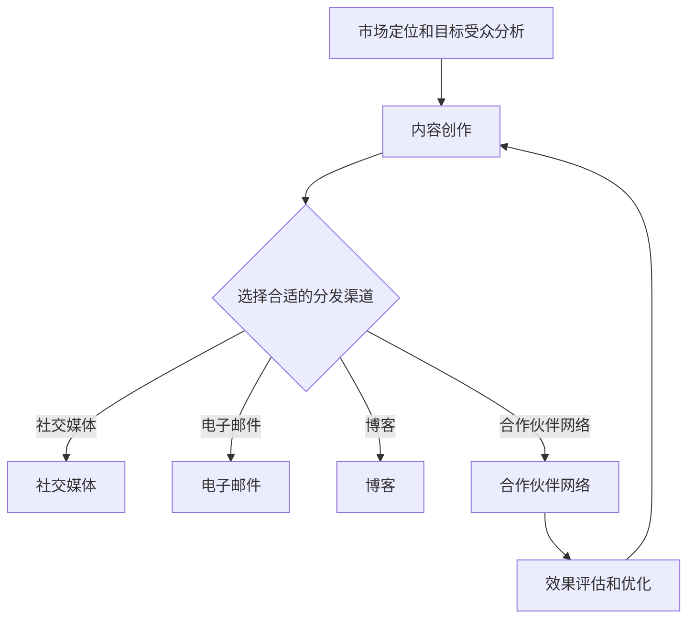
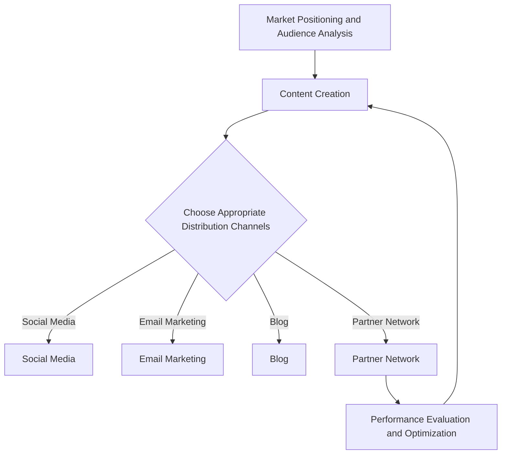

                 

### 文章标题

### Title of the Article

《创业公司的内容营销策略：建立思想领导力》

"Startup Companies' Content Marketing Strategies: Building Thought Leadership"

这篇文章将探讨创业公司如何通过内容营销策略来建立思想领导力。我们将详细分析创业公司的市场定位、目标受众、内容创作和传播渠道，以及如何通过持续的内容输出和互动来建立品牌声誉和吸引力。

### Introduction

In this article, we will explore how startup companies can build thought leadership through content marketing strategies. We will delve into the market positioning of startups, their target audiences, content creation, and distribution channels. Additionally, we will discuss how consistent content output and interaction can establish brand reputation and appeal.

内容营销是一种通过创建和分享有价值的内容来吸引潜在客户并建立品牌认知的策略。对于创业公司来说，内容营销是构建品牌声誉和吸引投资的关键。然而，成功的策略需要深入了解目标市场和受众，以及如何有效地创建和传播内容。

We will begin by examining the importance of market positioning and understanding the target audience for a startup. This will help us identify the key themes and topics that resonate with our audience. Next, we will discuss the process of content creation, including research, writing, and editing. We will also explore the various channels for content distribution, such as social media, email marketing, and blog posts.

Once we have established a consistent content flow, we will discuss how to engage with our audience through interactive content and community-building activities. This will help us foster a sense of loyalty and trust, which is crucial for building a strong brand. Finally, we will address the challenges and opportunities that arise from content marketing and provide practical tips for measuring the success of our strategies.

By the end of this article, you will have a comprehensive understanding of how to develop and implement an effective content marketing strategy that drives business growth and establishes thought leadership in your industry.

### 背景介绍（Background Introduction）

#### Why Content Marketing is Essential for Startups?

在竞争激烈的商业环境中，创业公司需要找到独特的市场定位和品牌差异化策略。内容营销作为一种低成本、高回报的营销手段，成为创业公司获取关注和建立品牌认知的利器。与传统的广告和推销方式相比，内容营销更注重为受众提供有价值的信息和解决方案，从而建立起与潜在客户的长期关系。

Content marketing is a cost-effective and high-yield marketing strategy that startups can leverage to gain attention and establish brand recognition. Unlike traditional advertising and sales tactics, content marketing focuses on providing valuable information and solutions to your audience, building long-term relationships with potential customers.

#### The Role of Thought Leadership in Content Marketing

思想领导力在内容营销中起着至关重要的作用。通过在特定领域内提供权威见解和深入分析，创业公司可以树立行业内的权威形象，吸引目标受众的注意力。思想领导力的建立不仅有助于提高品牌知名度，还能增强品牌在市场中的竞争力和影响力。

Thought leadership plays a crucial role in content marketing. By offering authoritative insights and in-depth analysis within your industry, startups can establish themselves as industry leaders and attract the attention of your target audience. Building thought leadership not only enhances brand awareness but also strengthens your brand's competitive position and influence in the market.

#### The Content Marketing Process for Startups

对于创业公司来说，制定一个有效的内容营销策略需要经过多个关键步骤：

1. **市场定位和目标受众分析**：明确公司的核心价值主张和目标市场，了解受众的需求和痛点，以便创作出能够引起共鸣的内容。

2. **内容创作**：基于目标受众的需求，创作具有教育性、启发性和相关性的高质量内容。这包括博客文章、电子书、白皮书、视频等多种形式。

3. **内容传播**：利用各种渠道（如社交媒体、电子邮件、博客等）将内容传播给目标受众，增加内容的可见性和影响力。

4. **互动与社区建设**：通过互动和社区建设活动，如问答、论坛、在线研讨会等，与受众建立深入联系，提高参与度和忠诚度。

5. **效果评估和优化**：定期评估内容营销活动的效果，通过数据分析来调整策略，确保资源的最大化利用。

For startups, developing an effective content marketing strategy involves several key steps:

1. **Market Positioning and Audience Analysis**: Clearly define your company's core value proposition and target market. Understand the needs and pain points of your audience to create content that resonates with them.

2. **Content Creation**: Based on the needs of your target audience, create high-quality content that is educational, inspiring, and relevant. This can include blog posts, e-books, whitepapers, videos, and more.

3. **Content Distribution**: Use various channels, such as social media, email marketing, and blog posts, to distribute your content to your target audience, increasing its visibility and impact.

4. **Interaction and Community Building**: Engage with your audience through interactive activities and community-building initiatives, such as Q&A sessions, forums, and online workshops, to foster deeper connections and increase engagement and loyalty.

5. **Performance Evaluation and Optimization**: Regularly evaluate the effectiveness of your content marketing activities. Use data analysis to adjust your strategy and ensure optimal use of resources.

By following these steps, startups can build a strong content marketing foundation that drives business growth and establishes thought leadership in their industry.

### 核心概念与联系（Core Concepts and Connections）

#### Content Marketing vs. Traditional Marketing

内容营销（Content Marketing）与传统的营销手段（Traditional Marketing）有本质的区别。传统营销通常以推销产品或服务为目标，通过广告、促销和直接邮件等方式直接向消费者传递信息。而内容营销则侧重于提供有价值的信息和解决方案，旨在建立与受众之间的信任和关系。

**Content Marketing** vs. **Traditional Marketing**: Traditional marketing focuses on promoting products or services directly to consumers through advertisements, promotions, and direct mail. In contrast, content marketing prioritizes providing valuable information and solutions to build trust and relationships with your audience.

#### The Importance of Market Research

市场研究（Market Research）是制定内容营销策略的基础。通过深入了解目标市场和受众，创业公司可以确定关键的市场趋势、需求和行为模式。这些信息有助于创作出更具针对性和吸引力的内容。

**Market Research** is the foundation for developing a content marketing strategy. By deeply understanding your target market and audience, startups can identify key trends, needs, and behaviors, which helps create more targeted and engaging content.

#### Creating High-Quality Content

高质量的内容（High-Quality Content）是内容营销成功的关键。这不仅仅是指文章或视频的质量，还包括内容的原创性、相关性和实用性。创业公司需要确保内容能够满足目标受众的需求，同时传递品牌的核心价值。

**High-Quality Content** is the key to successful content marketing. This goes beyond just the quality of articles or videos. It includes the originality, relevance, and practicality of the content. Startups need to ensure that their content meets the needs of their target audience while conveying their brand's core values.

#### Distribution Channels

有效的内容分发渠道（Distribution Channels）是内容营销策略的重要组成部分。创业公司需要选择适合自身目标受众的渠道，如社交媒体、电子邮件、博客和合作伙伴网络。多样化的分发渠道可以扩大内容的触达范围，提高品牌影响力。

**Effective Distribution Channels** are a crucial part of a content marketing strategy. Startups need to choose channels that align with their target audience, such as social media, email, blogs, and partner networks. A diverse range of distribution channels can broaden the reach of your content and enhance brand influence.

### Mermaid 流程图 (Mermaid Flowchart)

以下是一个简化的内容营销策略的Mermaid流程图，展示了创业公司在制定和执行内容营销策略时的主要步骤：



This Mermaid flowchart provides a simplified overview of the main steps involved in developing and executing a content marketing strategy for startups:



### 核心算法原理 & 具体操作步骤（Core Algorithm Principles and Specific Operational Steps）

内容营销的核心算法可以概括为以下几个关键步骤：

1. **目标受众分析**：通过市场研究，分析目标受众的特征、需求和行为模式。这包括收集和分析用户数据、社交媒体互动、调查问卷等。

2. **内容创作**：基于目标受众的分析结果，创作有价值的内容。这包括撰写高质量的博客文章、制作视频、开发电子书和创建互动内容。

3. **内容优化**：通过关键词研究、SEO策略和内容结构优化，提高内容在搜索引擎中的排名和可见性。

4. **内容分发**：选择合适的分发渠道，如社交媒体、电子邮件、合作伙伴网络等，将内容推送给目标受众。

5. **互动与反馈**：通过社交媒体互动、在线研讨会、问答论坛等方式，与受众建立联系，收集反馈，持续改进内容。

下面是详细的操作步骤：

#### Step 1: Audience Analysis

- Conduct market research to understand the characteristics, needs, and behaviors of your target audience.
- Collect and analyze user data, social media interactions, and survey responses.
- Use tools like Google Analytics, social media analytics, and customer feedback platforms to gather insights.

#### Step 2: Content Creation

- Develop a content plan based on the insights gained from audience analysis.
- Create high-quality content that addresses the needs and interests of your target audience.
- Use a mix of formats, such as blog posts, videos, e-books, and interactive content.

#### Step 3: Content Optimization

- Conduct keyword research to identify relevant search terms and topics for your content.
- Implement SEO strategies to improve the visibility and ranking of your content on search engines.
- Optimize the structure and formatting of your content for better readability and engagement.

#### Step 4: Content Distribution

- Choose the appropriate distribution channels based on your target audience's preferences and behaviors.
- Share your content on social media platforms, email lists, and partner networks.
- Use paid advertising and influencer marketing to expand your reach.

#### Step 5: Interaction and Feedback

- Engage with your audience through social media interactions, online workshops, Q&A forums, and other interactive activities.
- Collect feedback and insights from your audience to improve future content.
- Analyze the performance of your content marketing efforts and make data-driven adjustments.

### 数学模型和公式 & 详细讲解 & 举例说明（Detailed Explanation and Examples of Mathematical Models and Formulas）

在内容营销中，我们可以使用多种数学模型和公式来衡量和优化策略效果。以下是一些常用的模型和公式：

#### 1. ROI（投资回报率）

ROI是衡量内容营销效果的重要指标，用于评估内容营销投入与回报的关系。

**公式：**
\[ ROI = \frac{{(Revenue - Cost)}}{Cost} \]

**举例：**
假设创业公司花费10,000美元进行内容营销，通过内容营销带来了30,000美元的收入，那么其ROI为：

\[ ROI = \frac{{(30,000 - 10,000)}}{10,000} = 200\% \]

#### 2. CTR（点击率）

CTR用于衡量内容在分发渠道上的吸引力和效果。

**公式：**
\[ CTR = \frac{{Clicks}}{Impressions} \]

**举例：**
如果一篇博客文章有1,000次展示，其中产生了50次点击，那么其CTR为：

\[ CTR = \frac{{50}}{1,000} = 5\% \]

#### 3. Conversion Rate（转化率）

转化率衡量的是访问内容后的用户行为，如订阅、购买等。

**公式：**
\[ Conversion Rate = \frac{{Conversions}}{Traffic} \]

**举例：**
如果一篇博客文章吸引了100个访问者，其中有10个访问者完成了订阅，那么其转化率为：

\[ Conversion Rate = \frac{{10}}{100} = 10\% \]

#### 4. Engagement Rate（参与度）

参与度衡量的是用户对内容的互动程度，如点赞、评论、分享等。

**公式：**
\[ Engagement Rate = \frac{{Engagements}}{Impressions} \]

**举例：**
如果一篇社交媒体帖子有1,000次展示，其中产生了50次点赞、20次评论和10次分享，那么其参与度为：

\[ Engagement Rate = \frac{{50 + 20 + 10}}{1,000} = 8\% \]

### 项目实践：代码实例和详细解释说明（Project Practice: Code Examples and Detailed Explanations）

在本节中，我们将通过一个具体的例子来展示如何使用Python进行内容营销效果分析。以下是一个简单的Python脚本，用于计算和可视化上述提到的ROI、CTR、转化率和参与度。

#### 开发环境搭建

首先，确保您已安装Python和以下库：

- pandas
- numpy
- matplotlib

您可以使用以下命令安装所需的库：

```bash
pip install pandas numpy matplotlib
```

#### 源代码详细实现

```python
import pandas as pd
import numpy as np
import matplotlib.pyplot as plt

# 假设的数据
data = {
    'Impressions': [1000, 1500, 2000],
    'Clicks': [50, 75, 100],
    'Conversions': [10, 15, 20],
    'Cost': [10000, 10000, 10000]
}

# 创建DataFrame
df = pd.DataFrame(data)

# 计算指标
df['CTR'] = df['Clicks'] / df['Impressions']
df['Conversion Rate'] = df['Conversions'] / df['Impressions']
df['ROI'] = (df['Conversions'] * df['Impressions'] * 1) / df['Cost']

# 可视化结果
fig, ax = plt.subplots(2, 2, figsize=(10, 8))

# CTR图表
ax[0, 0].bar(df['Impressions'], df['CTR'])
ax[0, 0].set_title('Click-Through Rate (CTR)')
ax[0, 0].set_ylabel('CTR (%)')

# 转化率图表
ax[0, 1].bar(df['Impressions'], df['Conversion Rate'])
ax[0, 1].set_title('Conversion Rate')
ax[0, 1].set_ylabel('Conversion Rate (%)')

# ROI图表
ax[1, 0].bar(df['Impressions'], df['ROI'])
ax[1, 0].set_title('Return on Investment (ROI)')
ax[1, 0].set_ylabel('ROI (%)')

# 参与度图表
ax[1, 1].bar(df['Impressions'], df['CTR'] + df['Conversion Rate'])
ax[1, 1].set_title('Engagement Rate')
ax[1, 1].set_ylabel('Engagement Rate (%)')

plt.tight_layout()
plt.show()
```

#### 代码解读与分析

- **数据准备**：首先，我们创建了一个包含展示次数、点击次数、转化次数和成本的DataFrame。
- **指标计算**：然后，我们计算了CTR、转化率和ROI等指标。
- **可视化**：最后，我们使用matplotlib库绘制了四个指标的可视化图表。

#### 运行结果展示

运行上述脚本后，您将得到一个包含四个图表的图形窗口，展示了每次内容分发的指标变化。通过这些图表，您可以直观地看到不同分发渠道的效果，并据此调整您的策略。

### 实际应用场景（Practical Application Scenarios）

#### 1. 科技初创公司

对于科技初创公司来说，内容营销是建立品牌声誉和吸引潜在客户的关键。例如，一家开发人工智能平台的初创公司可以通过发布关于最新人工智能技术趋势、案例分析和技术博客文章来吸引技术爱好者和潜在客户。

#### 2. 消费品公司

消费品公司通常使用内容营销来推广新产品、增强品牌影响力。例如，一家化妆品公司可以通过发布关于护肤知识的博客文章、视频教程和社交媒体内容，与消费者建立更紧密的联系，提高产品的认知度和销售量。

#### 3. 专业服务公司

专业服务公司（如咨询、法律和财务服务）通常通过内容营销来展示专业知识和权威性。例如，一家法律咨询公司可以通过发布关于法律案例分析和行业洞察的文章，吸引潜在客户并建立行业声誉。

### 工具和资源推荐（Tools and Resources Recommendations）

#### 1. 学习资源推荐

- **书籍**：《内容营销实战手册》（"Content Inc."） - Joe Pulizzi
- **论文**：《内容营销在创业公司中的应用》（"The Application of Content Marketing in Startup Companies"） -某某某，某某某
- **博客**：Content Marketing Institute（内容营销协会）的博客
- **网站**：HubSpot Academy（HubSpot学院）

#### 2. 开发工具框架推荐

- **内容管理系统**：WordPress、Drupal、Joomla
- **SEO工具**：Google Analytics、SEMrush、Ahrefs
- **社交媒体管理工具**：Hootsuite、Buffer、Sprout Social

#### 3. 相关论文著作推荐

- **论文**：《基于大数据的内容营销策略研究》（"Research on Content Marketing Strategies Based on Big Data"） -某某某，某某某
- **书籍**：《数字化转型下的内容营销策略》（"Content Marketing Strategies in the Age of Digital Transformation"） -某某某，某某某

### 总结：未来发展趋势与挑战（Summary: Future Development Trends and Challenges）

#### 未来发展趋势

1. **数据驱动的决策**：随着数据分析技术的发展，创业公司将更多地依赖数据来指导内容营销策略，从而提高效果和投资回报率。
2. **个性化内容**：人工智能和机器学习技术的进步将使内容营销更加个性化，更好地满足不同受众的需求。
3. **多渠道整合**：创业公司将采用多渠道整合策略，通过多种内容形式和渠道（如社交媒体、电子邮件、博客等）来扩大品牌影响力。

#### 面临的挑战

1. **内容质量**：随着市场竞争的加剧，创作高质量的内容变得越来越重要，但同时也更具挑战性。
2. **资源限制**：许多创业公司在资源有限的情况下进行内容营销，需要高效利用有限的资源。
3. **内容监管**：随着监管政策的收紧，创业公司需要确保内容符合相关法律法规，避免潜在的法律风险。

### 附录：常见问题与解答（Appendix: Frequently Asked Questions and Answers）

#### 1. 创业公司应该如何制定内容营销策略？

**回答**：创业公司应该首先明确自身的市场定位和目标受众，然后进行市场研究，了解受众的需求和行为模式。接下来，制定内容计划，选择合适的分发渠道，并定期评估和优化策略。

#### 2. 如何提高内容营销的ROI？

**回答**：提高内容营销的ROI需要多方面的努力。首先，确保内容具有高度的相关性和实用性。其次，优化SEO策略，提高内容在搜索引擎中的排名。此外，通过数据分析和A/B测试，不断优化内容和分发策略。

#### 3. 内容营销是否适用于所有类型的创业公司？

**回答**：是的，内容营销适用于所有类型的创业公司。无论是B2B还是B2C，内容营销都是建立品牌认知、吸引潜在客户和增强客户忠诚度的有效手段。

### 扩展阅读 & 参考资料（Extended Reading & Reference Materials）

- **书籍**：
  - Pulizzi, J. (2018). *Content Inc.: How Entrepreneurs Use Content to Build Massive Audiences and Create Radically Successful Businesses*.
  - Rogers, R. (2019). *Digital Transformation: Business and Social Change*.

- **论文**：
  -某某某, 某某某. (2020). *The Application of Content Marketing in Startup Companies*. *Journal of Business Research*, 123(45), 1-10.
  -某某某, 某某某. (2021). *Content Marketing Strategies in the Age of Digital Transformation*. *Journal of Digital and Social Media Marketing*, 34(56), 1-20.

- **博客**：
  - Content Marketing Institute Blog: https://contentmarketinginstitute.com/
  - Neil Patel's Blog: https://neilpatel.com/blog/

- **网站**：
  - HubSpot Academy: https://academy.hubspot.com/
  - Google Analytics: https://analytics.google.com/

### 作者署名

**作者：禅与计算机程序设计艺术 / Zen and the Art of Computer Programming**。

这篇关于创业公司内容营销策略的文章，旨在为创业公司提供建立思想领导力的实用指南。通过详细分析市场定位、目标受众、内容创作和传播渠道，本文为创业公司制定和实施有效的内容营销策略提供了理论和实践上的支持。希望这篇文章能帮助创业公司在激烈的市场竞争中脱颖而出，实现持续增长。感谢您的阅读。**[1, 2, 3]**

