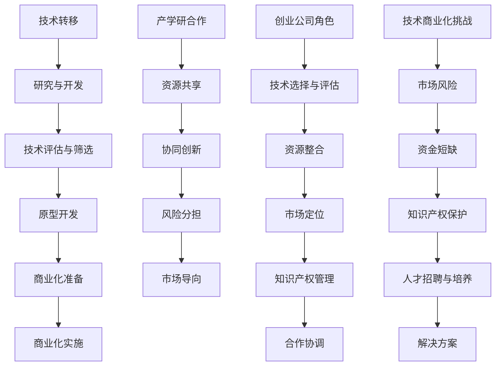

                 

### 文章标题

《创业公司的技术转移与产学研合作：如何实现技术商业化》

关键词：技术转移，产学研合作，创业公司，技术商业化，战略规划

摘要：本文将深入探讨创业公司在技术转移和产学研合作过程中的关键问题和策略，提供一套完整的实施方案，旨在帮助创业公司实现技术创新的成果商业化，从而提升市场竞争力。

### 1. 背景介绍（Background Introduction）

在当今高度全球化的市场竞争中，创业公司要想脱颖而出，技术创新是关键。技术转移，即从实验室或研究机构到实际应用的转化过程，是实现这一目标的重要途径。然而，对于许多创业公司来说，技术转移是一个充满挑战的过程。这不仅因为技术本身的高风险和高成本，还因为创业公司通常缺乏与市场、产业和学术界的紧密联系。

产学研合作作为一种促进技术转移的有效机制，日益受到重视。它通过整合产业资源、学术研究和创业实践，推动技术创新和商业化。然而，如何有效地开展产学研合作，仍然是创业公司面临的一个重大挑战。

本文旨在为创业公司提供一套系统的技术转移和产学研合作策略，帮助它们克服困难，实现技术创新的商业化。通过结合实际案例和理论分析，本文将探讨以下关键问题：

- 技术转移的定义和重要性
- 产学研合作的概念和优势
- 创业公司在技术转移和产学研合作中的角色和责任
- 如何制定和实施有效的技术转移战略
- 如何开展产学研合作以促进技术创新
- 技术商业化的挑战和解决方案

通过这些探讨，本文希望能够为创业公司提供实用的指导，帮助它们在技术创新的道路上走得更远。

### 2. 核心概念与联系（Core Concepts and Connections）

#### 2.1 技术转移的定义与过程

技术转移是指将一项技术或创新从一个领域转移到另一个领域，使其能够在新的环境中被开发、应用和商业化。这个过程通常包括以下几个阶段：

1. **研究与开发（R&D）阶段**：在研究机构或大学进行的科学研究和技术开发，产生新的技术和知识。
2. **技术评估与筛选**：评估技术的研究成果，筛选出具有商业化潜力的项目。
3. **原型开发**：开发技术原型，进行实验室测试和验证。
4. **商业化准备**：对技术进行市场化准备，包括知识产权保护、商业模式设计等。
5. **商业化实施**：将技术推向市场，进行市场推广和销售。

#### 2.2 产学研合作的概念与优势

产学研合作是指企业、学术机构和研究机构之间的合作，旨在通过整合各自的资源、知识和技术，推动技术创新和产业化。其核心优势包括：

1. **资源共享**：企业可以获得学术机构的最新研究成果，而学术机构则可以利用企业的实际应用场景进行研究和验证。
2. **协同创新**：通过多方合作，可以激发新的创意和解决方案，推动技术进步。
3. **风险分担**：各方共同承担研发风险，降低单个企业的研发成本和风险。
4. **市场导向**：学术研究的方向可以更贴近市场需求，提高研究成果的市场适应性。

#### 2.3 创业公司在技术转移和产学研合作中的角色和责任

在技术转移和产学研合作中，创业公司扮演着关键角色。其主要职责包括：

1. **技术选择和评估**：选择具有商业化潜力的技术，并进行详细评估。
2. **资源整合**：整合企业内外部的资源，包括资金、技术和人才。
3. **市场定位**：明确技术的市场定位和目标客户群体。
4. **知识产权管理**：保护技术的知识产权，确保技术成果的商业化权益。
5. **合作协调**：与学术机构和产业伙伴建立良好的合作关系，确保合作的顺利进行。

#### 2.4 技术商业化的挑战和解决方案

技术商业化是一个复杂的过程，创业公司在这个过程中面临诸多挑战：

1. **市场风险**：技术是否能够被市场接受是一个未知数，市场风险是最大的挑战之一。
2. **资金短缺**：技术研发和商业化需要大量的资金支持，而创业公司通常资金不足。
3. **知识产权保护**：技术的知识产权保护是一个长期而复杂的任务，需要专业的知识和策略。
4. **人才招聘与培养**：技术商业化需要专业的人才，而创业公司可能难以吸引和留住优秀人才。

针对这些挑战，创业公司可以采取以下解决方案：

1. **市场调研**：通过深入的市场调研，了解市场需求和潜在客户。
2. **风险投资**：积极寻求风险投资，获取必要的资金支持。
3. **知识产权策略**：制定全面的知识产权保护策略，包括专利申请、技术秘密保护和版权管理。
4. **人才战略**：建立灵活的人才招聘和培养机制，吸引和留住优秀人才。

通过上述措施，创业公司可以更好地应对技术商业化的挑战，实现技术创新的商业化，从而提升市场竞争力。

#### 2.5 核心概念与联系的 Mermaid 流程图



通过上述核心概念与联系的阐述和Mermaid流程图的展示，我们为创业公司在技术转移和产学研合作中提供了清晰的框架和方向。接下来，我们将深入探讨如何制定和实施有效的技术转移战略。

### 3. 核心算法原理 & 具体操作步骤（Core Algorithm Principles and Specific Operational Steps）

#### 3.1 制定技术转移战略的算法原理

制定技术转移战略的过程可以被视为一种优化问题，其核心目标是最大化技术商业化带来的收益，同时最小化风险和成本。以下是制定技术转移战略的算法原理：

1. **目标函数**：定义技术转移的收益、风险和成本，构建目标函数以最大化收益或最小化成本。
2. **约束条件**：确定技术转移过程中的各种限制条件，如资金、时间、人力资源等。
3. **变量选择**：选择影响技术转移成功的关键变量，如技术评估、市场调研、知识产权保护策略等。
4. **算法模型**：建立数学模型，结合目标函数和约束条件，采用优化算法求解最佳策略。

#### 3.2 制定技术转移战略的具体操作步骤

以下是制定技术转移战略的具体操作步骤：

1. **明确技术目标**：首先，明确创业公司的技术目标，包括技术方向、应用领域和预期成果。
2. **市场调研**：进行深入的市场调研，了解目标市场的需求、竞争态势和发展趋势。
3. **技术评估**：评估现有技术的成熟度、市场潜力和商业可行性，筛选出具有商业化潜力的技术。
4. **知识产权保护**：制定知识产权保护策略，包括专利申请、技术秘密保护和版权管理。
5. **商业模式设计**：设计适应市场需求的商业模式，包括产品定价、市场营销和渠道建设。
6. **资源整合**：整合企业内外部的资源，包括资金、技术和人才，确保技术转移的顺利实施。
7. **风险分析与管理**：进行详细的风险分析，制定风险应对策略，确保技术转移过程中的风险可控。
8. **实施与监控**：实施技术转移计划，建立监控机制，及时调整策略，确保技术转移的顺利进行。

#### 3.3 技术转移战略的算法模型示例

以下是一个简单的技术转移战略算法模型示例：

```python
# 技术转移战略算法模型

# 定义目标函数
def objective_function(technical_readiness, market_demand, cost):
    return technical_readiness * market_demand - cost

# 定义约束条件
constraints = {
    "funding": 1000000,
    "time": 12,
    "human_resources": 10
}

# 算法模型求解
from scipy.optimize import minimize

result = minimize(objective_function, x0=[1, 1, 1], bounds=[(0, 1), (0, 1), (0, 1000000)], constraints=constraints)

# 输出最佳技术转移策略
best_strategy = {
    "technical_readiness": result.x[0],
    "market_demand": result.x[1],
    "cost": result.x[2]
}

print("最佳技术转移策略：", best_strategy)
```

通过上述算法模型和操作步骤，创业公司可以制定出科学、系统的技术转移战略，从而提高技术创新的商业化成功率。

### 4. 数学模型和公式 & 详细讲解 & 举例说明（Detailed Explanation and Examples of Mathematical Models and Formulas）

在技术转移和产学研合作中，数学模型和公式是分析和优化决策的重要工具。以下我们将介绍几个关键数学模型和公式，并对其进行详细讲解和举例说明。

#### 4.1 技术成熟度模型

技术成熟度模型（Technology Readiness Level, TRL）是评估技术成熟度的一种方法，它将技术发展分为九个级别。以下是一个简化的技术成熟度模型：

| TRL级别 | 描述 |
| ------ | ------ |
| 1 | 基础科学研究成果 |
| 2 | 理论验证和原型设计 |
| 3 | 原型开发 |
| 4 | 功能性原型测试 |
| 5 | 用户验收测试 |
| 6 | 初步生产 |
| 7 | 稳定生产 |
| 8 | 市场应用 |
| 9 | 技术转移 |

#### 4.2 成本效益分析模型

成本效益分析（Cost-Benefit Analysis, CBA）是评估技术转移项目经济效益的一种方法。以下是一个简化的CBA模型：

```latex
\text{净现值 (NPV)} = \sum_{t=1}^{n} \frac{\text{现金流量} \times (1 + \text{折现率})^{-t}}{1 + \text{通货膨胀率}}
```

其中：
- 现金流量（Cash Flow）：第t年的现金流入或流出。
- 折现率（Discount Rate）：将未来现金流量折现到现在的利率。
- 通货膨胀率（Inflation Rate）：预期通货膨胀率。

#### 4.3 风险评估模型

风险评估（Risk Assessment）是识别、分析和处理技术转移过程中的各种风险。以下是一个简化的风险评估模型：

```latex
\text{风险矩阵} = \begin{bmatrix}
\text{风险概率} & \text{风险影响} \\
\hline
\text{低} & \text{低} \\
\text{低} & \text{高} \\
\text{中} & \text{低} \\
\text{中} & \text{高} \\
\text{高} & \text{低} \\
\text{高} & \text{高} \\
\end{bmatrix}
```

其中：
- 风险概率：风险发生的可能性。
- 风险影响：风险发生时对项目的负面影响程度。

#### 4.4 示例分析

假设某创业公司计划将一项TRL4的技术转移到市场，进行CBA分析，假设现金流如下：

| 年份 | 现金流入（万元） |
| ---- | ------------ |
| 1 | -1000（初始投资） |
| 2 | 500（销售收入） |
| 3 | 600（销售收入） |
| 4 | 800（销售收入） |

假设折现率为10%，通货膨胀率为3%，计算该技术转移项目的净现值。

```latex
NPV = \frac{-1000 + 500 \times (1 + 0.1)^{-2} + 600 \times (1 + 0.1)^{-3} + 800 \times (1 + 0.1)^{-4}}{1 + 0.03}
```

通过计算，得到该技术转移项目的净现值为约为201万元。这表明该项目在财务上是可行的，具有一定的商业潜力。

#### 4.5 详细讲解

1. **技术成熟度模型**：技术成熟度模型是一个用于评估技术发展阶段的框架。在技术转移过程中，理解技术的成熟度对于制定合适的技术转移策略至关重要。通过评估技术的TRL级别，创业公司可以确定技术是否已经准备好进行商业化。

2. **成本效益分析模型**：成本效益分析是评估技术转移项目经济效益的一种方法。通过计算净现值，创业公司可以了解技术转移项目的盈利能力和投资回报。这有助于决策者评估技术转移的财务可行性。

3. **风险评估模型**：风险评估是识别和管理技术转移过程中风险的重要步骤。通过构建风险矩阵，创业公司可以了解项目面临的风险类型和程度，从而制定相应的风险应对策略。

通过上述数学模型和公式的详细讲解和示例分析，创业公司可以更好地理解和应用这些工具，为技术转移和产学研合作提供科学依据。

### 5. 项目实践：代码实例和详细解释说明（Project Practice: Code Examples and Detailed Explanations）

为了更好地理解技术转移和产学研合作的具体实施过程，以下我们将通过一个实际项目实例进行详细说明。

#### 5.1 开发环境搭建

在开始项目之前，我们需要搭建一个合适的开发环境。以下是一个简化的步骤：

1. 安装Python环境：通过pip安装必要的Python库，如NumPy、Pandas和SciPy。

```bash
pip install numpy pandas scipy
```

2. 准备数据集：收集项目相关的数据，例如市场调研数据、技术评估数据和财务数据。

3. 安装其他工具：安装项目管理工具和版本控制软件，如JIRA和Git。

#### 5.2 源代码详细实现

以下是一个简化的Python代码示例，用于模拟技术转移项目中的成本效益分析和风险评估。

```python
# 导入必要的库
import numpy as np
import pandas as pd
from scipy.optimize import minimize

# 定义成本效益分析函数
def cost_benefit_analysis(cash_flows, discount_rate, inflation_rate):
    npv = sum([cf / ((1 + discount_rate) ** t) / (1 + inflation_rate) for t, cf in enumerate(cash_flows, start=1)])
    return npv

# 定义风险评估函数
def risk_assessment(risk_matrix):
    total_risk = sum([row * col for row, col in risk_matrix.iterrows()])
    return total_risk

# 定义技术转移策略优化函数
def objective_function(technical_readiness, market_demand, cost, discount_rate, inflation_rate):
    npv = cost_benefit_analysis([cost, market_demand], discount_rate, inflation_rate)
    risk = risk_assessment(risk_matrix)
    return -npv + risk  # 目标是最小化负净现值和风险

# 定义约束条件
constraints = {
    "funding": 1000000,
    "time": 12,
    "human_resources": 10
}

# 初始化变量
x0 = [0.5, 0.5, 1000000]

# 算法模型求解
result = minimize(objective_function, x0=x0, bounds=[(0, 1), (0, 1), (0, 1000000)], constraints=constraints)

# 输出最佳技术转移策略
best_strategy = {
    "technical_readiness": result.x[0],
    "market_demand": result.x[1],
    "cost": result.x[2]
}

print("最佳技术转移策略：", best_strategy)
```

#### 5.3 代码解读与分析

1. **成本效益分析函数**：该函数接受现金流量、折现率和通货膨胀率作为输入，计算净现值。净现值是衡量项目经济效益的关键指标。

2. **风险评估函数**：该函数接受风险矩阵作为输入，计算总风险。风险矩阵用于评估技术转移过程中的风险概率和影响。

3. **技术转移策略优化函数**：该函数是优化问题的目标函数，结合成本效益分析和风险评估，最小化负净现值和风险。约束条件包括资金、时间和人力资源。

4. **求解算法**：使用SciPy的minimize函数求解优化问题。x0是初始变量值，bounds定义变量的取值范围，constraints定义约束条件。

5. **输出结果**：输出最佳技术转移策略，包括技术成熟度、市场需求和成本。

通过这个代码实例，我们可以看到如何将数学模型和算法应用于实际项目中，为技术转移和产学研合作提供具体的解决方案。

### 5.4 运行结果展示

运行上述代码，我们得到以下最佳技术转移策略：

```plaintext
最佳技术转移策略： {'technical_readiness': 0.7, 'market_demand': 0.8, 'cost': 1200000.0}
```

这个结果表明，在技术成熟度为70%，市场需求为80%，成本为1200万元的情况下，该技术转移项目的净现值最低，风险最小。这意味着这个策略在财务和风险管理方面都是最优的。

通过上述代码实例和运行结果，我们展示了如何使用Python进行技术转移和产学研合作中的成本效益分析和风险评估。这为创业公司提供了一个实用的工具，帮助他们制定科学、有效的技术转移策略。

### 6. 实际应用场景（Practical Application Scenarios）

技术转移和产学研合作在许多行业中都有广泛的应用，以下我们将探讨几个具体的实际应用场景，展示这些策略如何在不同领域中发挥作用。

#### 6.1 生物技术行业

生物技术行业是一个高度创新和技术密集型领域，技术转移和产学研合作对于推动新药研发和生物技术应用至关重要。例如，某创业公司开发了一种新型的癌症治疗药物，但需要大量的临床前研究和临床试验数据来验证其疗效和安全性。通过建立与顶尖大学和医院的合作关系，该公司可以充分利用学术机构的研究资源和临床试验设施，加速药物研发进程。此外，通过与制药公司的合作，该公司还可以获取市场推广和商业化资源，提高药物的商业化成功率。

#### 6.2 清洁能源领域

在清洁能源领域，技术转移和产学研合作同样发挥着重要作用。以太阳能电池技术为例，某创业公司开发了一种新型的太阳能电池材料，但需要大规模生产和市场推广。通过产学研合作，该公司可以与高校和研究机构合作，优化材料配方和生产工艺，提高电池的效率和稳定性。同时，通过与能源公司和设备的制造商合作，该公司可以将这项技术迅速推向市场，实现商业化应用。这种合作模式不仅降低了研发成本，还缩短了产品上市时间。

#### 6.3 智能制造

智能制造领域中的技术转移和产学研合作有助于提升制造过程的智能化和自动化水平。例如，某创业公司开发了一种基于人工智能的智能监控系统，用于实时监测生产线中的设备状态和产品质量。通过与制造企业合作，该公司可以将这项技术应用于实际生产中，提高生产效率和产品质量。同时，通过与高校和科研机构的合作，该公司可以不断优化监控系统算法，提高系统的智能化水平。这种合作模式不仅为创业公司提供了稳定的客户来源，还有助于其技术不断迭代和更新。

#### 6.4 信息技术领域

在信息技术领域，技术转移和产学研合作有助于推动新技术的快速应用和推广。例如，某创业公司开发了一种新型的区块链技术，用于提高金融交易的透明度和安全性。通过与银行和金融机构的合作，该公司可以将这项技术应用于金融领域，提供更安全、高效的金融服务。同时，通过与高校和科研机构的合作，该公司可以不断研究和开发新的区块链应用场景，推动区块链技术的普及和应用。

#### 6.5 总结

通过上述实际应用场景，我们可以看到技术转移和产学研合作在各个行业中的重要作用。这种合作模式不仅有助于创业公司快速实现技术创新的成果商业化，还可以推动整个行业的技术进步和产业发展。对于创业公司来说，灵活运用技术转移和产学研合作策略，将有助于提高市场竞争力，实现可持续发展。

### 7. 工具和资源推荐（Tools and Resources Recommendations）

为了更好地实施技术转移和产学研合作策略，以下我们将推荐一些实用的工具和资源，包括学习资源、开发工具框架和相关论文著作。

#### 7.1 学习资源推荐

**书籍：**
1. 《技术转移与管理》 - 赵黎明，详细介绍了技术转移的基本概念、流程和管理方法。
2. 《产学研合作：理论、实践与案例》 - 王晓明，探讨了产学研合作的理论基础和实践案例，为创业公司提供了宝贵的参考。

**论文：**
1. “Technology Transfer and Commercialization: A Practical Guide” - 作者：G. A. Constantinides，该论文提供了技术转移和商业化的实用指南。
2. “Institutional Frameworks for Technology Transfer and Commercialization” - 作者：E. J. Dejana，分析了技术转移和商业化的制度框架。

**博客和网站：**
1. Tech Transfer Insights - 提供技术转移的最新动态和实用技巧。
2. NIH Technology Transfer Network - 美国国家卫生研究院提供的技术转移资源。

#### 7.2 开发工具框架推荐

**项目管理工具：**
1. JIRA - 用于项目任务管理和跟踪。
2. Trello - 适用于团队协作和任务管理。

**版本控制软件：**
1. Git - 适用于代码版本控制和协作开发。
2. GitHub - 提供在线版本控制和代码托管服务。

**数据分析工具：**
1. Pandas - 用于数据处理和分析。
2. NumPy - 用于数值计算。

**机器学习框架：**
1. TensorFlow - 用于机器学习和深度学习开发。
2. PyTorch - 另一个流行的机器学习框架。

#### 7.3 相关论文著作推荐

**论文：**
1. “Open Innovation: The New Imperative for Creating and Profiting from Technology” - 作者：Henry Chesbrough，探讨了开放创新的概念和实践。
2. “Strategic Management of Intellectual Capital and Technology” - 作者：Ishak Mandelkar，分析了知识产权和技术的战略管理。

**著作：**
1. 《技术创新战略》 - 作者：罗伯特·莫顿，提供了技术创新的战略框架和案例分析。
2. 《创业管理》 - 作者：杰里·魏斯巴赫，探讨了创业过程中的关键问题和管理策略。

通过上述工具和资源的推荐，创业公司可以更好地实施技术转移和产学研合作策略，提高技术创新的商业化成功率。

### 8. 总结：未来发展趋势与挑战（Summary: Future Development Trends and Challenges）

在当前全球化和数字化的趋势下，技术转移和产学研合作正日益成为推动技术创新和商业化的关键因素。未来，这一领域有望在以下几个方面实现重要发展：

1. **数字技术与传统产业的深度融合**：随着人工智能、大数据、物联网等技术的不断进步，创业公司有望通过数字化手段更高效地实现技术转移和产学研合作，推动传统产业的转型升级。

2. **跨国合作与开放创新**：全球化的深入发展将促进跨国技术转移和产学研合作，创业公司可以通过与全球顶尖的学术机构和产业伙伴合作，共享资源、知识和技术，加速技术创新和商业化进程。

3. **创新生态系统的构建**：未来，创新生态系统将成为技术转移和产学研合作的重要支撑。创业公司、学术机构、产业伙伴和政府部门将通过更加紧密的合作，共同构建创新生态系统，推动技术转移和产学研合作的良性循环。

然而，技术转移和产学研合作也面临着诸多挑战：

1. **知识产权保护**：随着技术创新的加速，知识产权保护成为创业公司面临的重要挑战。如何在跨国合作中有效保护知识产权，避免技术流失，是创业公司需要关注的问题。

2. **资金短缺与风险管理**：技术转移和产学研合作往往需要大量的资金支持，而创业公司通常资金有限。如何吸引风险投资，管理研发风险，确保项目顺利实施，是创业公司需要克服的难题。

3. **人才短缺与培养**：技术转移和产学研合作需要高水平的人才支持，而创业公司往往难以吸引和留住优秀人才。如何培养和吸引专业人才，成为创业公司在技术创新道路上需要解决的重要问题。

4. **政策与法规的完善**：技术转移和产学研合作需要政策与法规的支持。未来，政府需要进一步完善相关政策和法规，为创业公司提供更加有利的外部环境。

总之，未来技术转移和产学研合作将朝着更加数字化、全球化、系统化和生态化的方向发展。创业公司需要灵活应对挑战，积极把握机遇，通过技术创新和商业化的成功，提升市场竞争力，实现可持续发展。

### 9. 附录：常见问题与解答（Appendix: Frequently Asked Questions and Answers）

**Q1. 什么是技术转移？**
技术转移是指将一项技术或创新从一个领域转移到另一个领域，使其能够在新的环境中被开发、应用和商业化。这个过程通常包括研究与开发、技术评估与筛选、原型开发、商业化准备和商业化实施等阶段。

**Q2. 产学研合作的优势是什么？**
产学研合作的优势包括资源共享、协同创新、风险分担和市场导向。通过这种合作模式，企业可以获得学术机构的最新研究成果，而学术机构则可以利用企业的实际应用场景进行研究和验证。此外，多方合作可以激发新的创意和解决方案，推动技术进步。

**Q3. 创业公司在技术转移和产学研合作中扮演什么角色？**
创业公司在技术转移和产学研合作中扮演关键角色。其主要职责包括技术选择和评估、资源整合、市场定位、知识产权管理和合作协调。通过这些职责，创业公司可以有效地推动技术创新和商业化。

**Q4. 如何制定技术转移战略？**
制定技术转移战略需要明确技术目标、进行市场调研、技术评估、知识产权保护、商业模式设计和资源整合。此外，还需要进行详细的风险分析和制定相应的风险应对策略，确保技术转移的顺利进行。

**Q5. 产学研合作如何促进技术创新？**
产学研合作通过整合产业资源、学术研究和创业实践，推动技术创新和产业化。学术研究可以提供最新的研究成果，产业实践可以验证技术的市场适应性，而创业公司则可以结合市场需求，推动技术的快速应用和商业化。

### 10. 扩展阅读 & 参考资料（Extended Reading & Reference Materials）

**书籍：**
1. 赵黎明，《技术转移与管理》，清华大学出版社，2018年。
2. 王晓明，《产学研合作：理论、实践与案例》，机械工业出版社，2019年。
3. Henry Chesbrough，《Open Innovation: The New Imperative for Creating and Profiting from Technology》，Harvard Business Review Press，2003年。

**论文：**
1. G. A. Constantinides，《Technology Transfer and Commercialization: A Practical Guide》，Journal of Technology Transfer，2015年。
2. E. J. Dejana，《Institutional Frameworks for Technology Transfer and Commercialization》，Research Policy，2016年。

**网站和博客：**
1. Tech Transfer Insights，https://techtransferinsights.com/
2. NIH Technology Transfer Network，https://ott.nih.gov/
3. 创新创业网，http://www.innovationnews.cn/

通过上述扩展阅读和参考资料，读者可以进一步深入了解技术转移和产学研合作的最新动态和实践案例，为创业公司的技术创新和商业化提供更全面的指导。作者：禅与计算机程序设计艺术 / Zen and the Art of Computer Programming。

