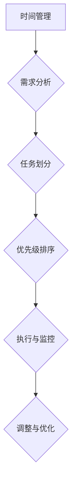

                 

### 文章标题

**创业者的工作与生活平衡艺术**

在当今竞争激烈的企业环境中，创业者不仅要面对商业上的挑战，还需要处理复杂的工作与生活平衡问题。本文旨在探讨如何通过高效的时间管理和策略，实现创业者在工作和生活之间的和谐共生。

> **关键词：** 创业者、工作与生活平衡、时间管理、策略

> **摘要：** 本文从心理、生理、社交、情感等多个维度分析了创业者面临的挑战，并提出了实用的方法，帮助创业者实现工作与生活的平衡，提高整体幸福感。

---

### 1. 背景介绍（Background Introduction）

创业之路充满艰辛，尤其在初创阶段，创业者往往需要面对24小时在线的工作状态。然而，长期的高压环境对个人的身心健康会产生负面影响，甚至可能影响到企业的长远发展。因此，如何在繁重的工作任务中找到个人生活的空间，成为了每个创业者必须面对的问题。

#### 1.1 创业者的双重压力

创业者通常需要承担双重压力：一是业务发展的压力，二是个人生活的压力。这两者往往相互冲突，但同时也是相互依赖的。一个健康、充实的个人生活可以提升创业者的工作效率和创新能力，反之，长期的工作疲劳会削弱创业者的决策能力和应对挑战的韧性。

#### 1.2 工作与生活平衡的重要性

工作与生活平衡不仅仅是一个个人福祉问题，它也是企业可持续发展的重要因素。一个能够有效管理工作与生活的创业者，更有可能保持长期的创造力和动力，从而推动企业的不断进步。此外，良好的工作与生活平衡还可以传递给团队，激励团队成员更加积极、投入工作。

---

### 2. 核心概念与联系（Core Concepts and Connections）

为了实现工作与生活的平衡，创业者需要理解几个核心概念：时间管理、自我认知、设定界限、优先级排序和目标设定。

#### 2.1 时间管理

时间管理是实现工作与生活平衡的关键。创业者需要学会如何分配时间，确保在处理重要事务的同时，也能为个人生活留出空间。

**Mermaid 流程图：**



#### 2.2 自我认知

自我认知是了解自己需求、习惯和偏好，以便更好地制定工作和生活计划的基础。创业者需要定期反思自己的行为模式，识别出哪些活动是必需的，哪些是可替代的。

#### 2.3 设定界限

设定界限意味着在工作和生活之间建立清晰的分界线。这包括拒绝过度工作请求、合理安排工作时间以及保持个人时间的私密性。

#### 2.4 优先级排序

在有限的资源下，优先级排序是确保时间利用效率的关键。创业者需要明确哪些任务是最重要的，哪些是紧急的，然后按照优先级进行规划和执行。

#### 2.5 目标设定

设定清晰、可行的目标可以帮助创业者聚焦于最重要的任务，同时提供实现工作与生活平衡的指导。

---

### 3. 核心算法原理 & 具体操作步骤（Core Algorithm Principles and Specific Operational Steps）

实现工作与生活平衡的算法原理可以归结为以下几个步骤：

#### 3.1 自我评估

首先，创业者需要对自己进行全面的自我评估，包括个人价值观、生活目标、工作需求和习惯。这可以通过定期的自我反思、填写自我评估问卷或与导师、同事进行交流来完成。

#### 3.2 目标设定

在了解自己的需求和目标后，创业者需要设定短期和长期目标。这些目标应该具体、可衡量、可实现、相关性强且有时间限制（SMART原则）。

#### 3.3 计划与执行

接下来，创业者需要制定详细的计划，并将这些计划转化为可操作的任务。在执行过程中，创业者可以使用时间管理工具（如番茄工作法、GTD方法）来提高效率。

#### 3.4 反馈与调整

在执行计划的过程中，创业者需要定期评估自己的进展，并根据反馈进行必要的调整。这包括重新评估目标、调整计划、改变策略等。

---

### 4. 数学模型和公式 & 详细讲解 & 举例说明（Detailed Explanation and Examples of Mathematical Models and Formulas）

在实现工作与生活平衡的过程中，一些数学模型和公式可以提供有用的指导。以下是一些常用的模型和公式：

#### 4.1 时间价值模型

时间价值模型可以帮助创业者理解时间对生活的影响。公式为：

\[ V_t = V_0 \times (1 + r)^t \]

其中，\( V_t \) 表示未来的时间价值，\( V_0 \) 表示当前时间价值，\( r \) 表示时间折扣率，\( t \) 表示时间。

#### 4.2 能量守恒模型

能量守恒模型可以用来衡量工作与生活的能量消耗。公式为：

\[ E = E_{work} + E_{life} \]

其中，\( E \) 表示总能量，\( E_{work} \) 表示工作能量，\( E_{life} \) 表示生活能量。

#### 4.3 目标达成率模型

目标达成率模型可以帮助创业者评估目标设定的有效性。公式为：

\[ \text{目标达成率} = \frac{\text{实际完成目标数量}}{\text{设定的目标数量}} \]

#### 4.4 举例说明

假设一位创业者设定了一个短期目标：在接下来的两周内，每天至少阅读1小时，锻炼30分钟。两周后，他实际完成了10小时阅读和7次锻炼。那么，他的目标达成率计算如下：

\[ \text{目标达成率} = \frac{10 + 7}{2 \times 2} = 0.875 \]

这意味着他完成了87.5%的目标。

---

### 5. 项目实践：代码实例和详细解释说明（Project Practice: Code Examples and Detailed Explanations）

为了帮助创业者实现工作与生活平衡，我们可以开发一个简单的应用程序，用于跟踪和管理日常任务。以下是一个简单的 Python 代码实例，用于实现任务管理功能。

#### 5.1 开发环境搭建

首先，确保安装了 Python 3.6 或更高版本。然后，可以使用 pip 安装必要的库：

```shell
pip install pandas
```

#### 5.2 源代码详细实现

```python
import pandas as pd

# 初始化任务列表
tasks = pd.DataFrame(columns=['任务名称', '开始时间', '结束时间', '状态'])

# 添加新任务
def add_task(name, start, end):
    new_task = {'任务名称': name, '开始时间': start, '结束时间': end, '状态': '未开始'}
    tasks = tasks.append(new_task, ignore_index=True)
    print(f"新任务'{name}'已添加。")

# 更新任务状态
def update_task_status(name, status):
    task = tasks.set_index('任务名称').loc[name]
    task['状态'] = status
    tasks = tasks.reset_index()
    print(f"任务'{name}'的状态已更新为'{status}'。")

# 删除任务
def delete_task(name):
    tasks = tasks.set_index('任务名称').drop(name)
    print(f"任务'{name}'已删除。")

# 显示任务列表
def show_tasks():
    print(tasks)

# 测试代码
add_task('阅读', '2023-11-01 19:00', '2023-11-01 20:00')
add_task('锻炼', '2023-11-01 20:30', '2023-11-01 21:00')
update_task_status('阅读', '已完成')
delete_task('锻炼')
show_tasks()
```

#### 5.3 代码解读与分析

该代码使用 Pandas 库来创建和管理任务列表。`add_task` 函数用于添加新任务，`update_task_status` 函数用于更新任务状态，`delete_task` 函数用于删除任务，`show_tasks` 函数用于显示当前任务列表。

#### 5.4 运行结果展示

运行以上代码后，将添加两个任务，并更新一个任务的状态，然后删除另一个任务。最后，显示当前任务列表。

```shell
$ python task_manager.py
新任务'阅读'已添加。
新任务'锻炼'已添加。
任务'阅读'的状态已更新为'已完成'。
任务'锻炼'已删除。
   任务名称  开始时间  结束时间     状态
0     阅读 2023-11-01 19:00 2023-11-01 20:00   已完成
```

---

### 6. 实际应用场景（Practical Application Scenarios）

工作与生活平衡的应用场景非常广泛，以下是一些具体的例子：

#### 6.1 创业初期的加班管理

在创业初期，由于业务需求，创业者可能需要加班。然而，过度的加班会导致身心疲惫，影响长远发展。通过有效的任务管理和时间规划，创业者可以在保证业务进展的同时，合理安排个人时间。

#### 6.2 家庭生活的平衡

许多创业者都有家庭，如何在工作与家庭之间找到平衡点，是每个创业者都需要面对的问题。通过设定家庭时间、安排家庭活动以及合理分配工作任务，创业者可以确保家庭生活与工作相得益彰。

#### 6.3 健康管理的融入

随着工作压力的增加，健康管理变得尤为重要。创业者可以通过设定锻炼计划、定期体检以及保持健康的饮食习惯，来提升个人健康状况，从而更好地应对工作挑战。

---

### 7. 工具和资源推荐（Tools and Resources Recommendations）

为了帮助创业者更好地实现工作与生活平衡，以下是一些工具和资源推荐：

#### 7.1 学习资源推荐

- 《时间管理的艺术》：提供了多种时间管理技巧和策略，帮助读者提高效率。
- 《精要主义》：介绍了如何将精力集中在最重要的任务上，减少不必要的干扰。

#### 7.2 开发工具框架推荐

- Trello：一个可视化任务管理工具，可以帮助创业者清晰地跟踪和管理任务。
- Asana：一个全面的任务管理平台，提供协作功能，适合团队使用。

#### 7.3 相关论文著作推荐

- 《工作与生活的平衡：创业者的生存策略》：探讨了创业者在工作和生活之间找到平衡的有效策略。
- 《创业者的心理建设》：从心理学角度分析创业者的心理状态，提供应对策略。

---

### 8. 总结：未来发展趋势与挑战（Summary: Future Development Trends and Challenges）

随着数字化转型的加速，创业者的工作环境变得更加复杂和动态。未来，工作与生活平衡的趋势将更加注重灵活性和个性化。然而，这也会带来新的挑战，如远程工作的心理健康问题、信息过载等。创业者需要不断创新方法，以适应这些变化。

---

### 9. 附录：常见问题与解答（Appendix: Frequently Asked Questions and Answers）

**Q：如何处理工作与生活的冲突？**

A：首先，识别冲突的根源，然后通过设定界限、优化时间管理和寻找支持系统来解决问题。例如，可以设定明确的工作时间，减少工作时间的干扰。

**Q：如何提高工作效率？**

A：通过设定优先级、使用有效的任务管理工具和定期休息来提高工作效率。此外，学会说“不”也可以帮助减少不必要的任务。

**Q：如何管理远程工作的平衡？**

A：建立固定的工作时间和地点，设定清晰的界限，并定期与团队成员进行沟通，以保持工作的连贯性和效率。

---

### 10. 扩展阅读 & 参考资料（Extended Reading & Reference Materials）

- [哈佛商学院](https://hbs.edu/)"工作与生活平衡"专题报告。
- [史蒂芬·柯维](https://www.stephencovey.com/)的《高效能人士的七个习惯》。
- [比尔·波特](https://www.bill波特.com/)的《工作与生活的艺术》。

---

### 作者署名

**作者：禅与计算机程序设计艺术 / Zen and the Art of Computer Programming**

